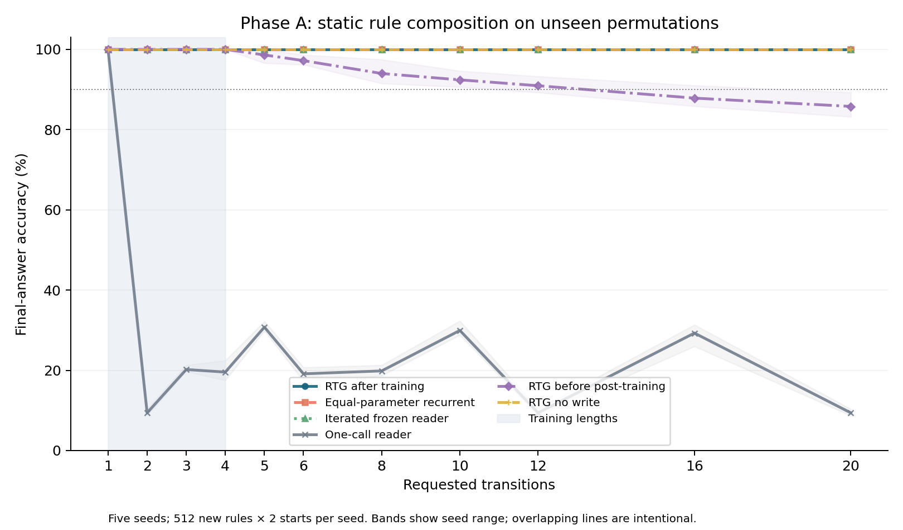
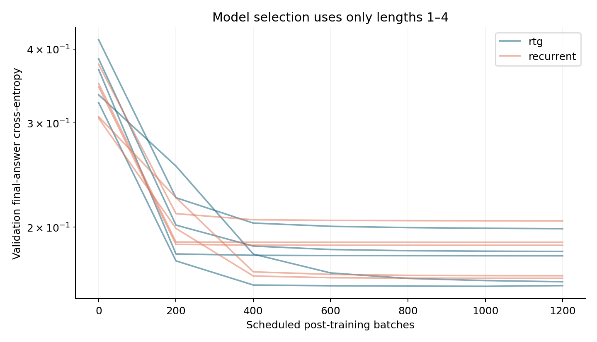
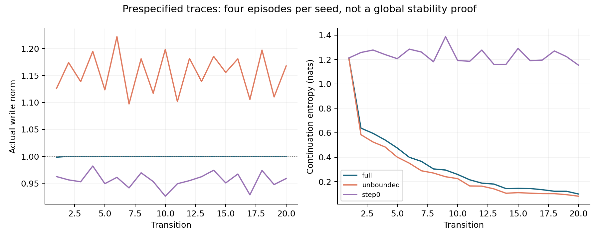

# RTG 后训练功能验证 v0.1：Phase A 本地实验报告

日期：2026-09-25。研究 ID：**P05-RTG-POSTTRAIN-20260925-001**。性质：EXPLORATORY。

## 1. 本轮结论与阶段状态

**RTG 可以接受最终答案后训练，并在这项静态规则任务上稳定外推到 20 步。但它没有优于等参数循环适配器；写回和继承对本任务的正确率均不具有必要性。完整 Gate A 未通过，按事前计划在 A 阶段诊断关账，B/C/D/E 未运行。**

| 轴 | 本次状态 |
| --- | --- |
| 执行 | COMPLETED_CONDITIONAL：5/5 seed 的 Phase A 固定课表、冻结消融、诊断、恢复与交付完成 |
| 工程 | LOCAL_VALID：9 项局部合同、完整管线 smoke、563200 条原始预测核对、30 组恢复检查通过；一次启动前失败保留 |
| 科学 | MIXED：绝对组合外推成立；相对普通循环模型的优势未获支持；A 中写回/继承的必要性不支持；B/C 的历史与动态规则能力未检验 |

门槛原文要求“明显高于 base / 同参数普通 adapter”。本地在结果前将其量化为长程平均至少 +5 个百分点、每个 seed 都为正。实际相对循环适配器为 **0.00 pp**；即使不采用 +5 pp 的量化，也没有观察到正优势。没有在看到测试结果后降门槛继续晋级。

## 2. 核心结果

下表为五个独立 seed 的均值，单位 %。每个 seed 用 512 个从未在训练出现的规则、每规则 2 个起点；同一批 episode 配对比较所有条件。

| 条件 | 4 步 | 8 步 | 10 步 | 12 步 | 20 步 |
| --- | ---: | ---: | ---: | ---: | ---: |
| 完整 RTG，后训练后 | 100.00 | 100.00 | 100.00 | 100.00 | 100.00 |
| 同参数普通 recurrent adapter，后训练后 | 100.00 | 100.00 | 100.00 | 100.00 | 100.00 |
| 冻结一步 reader，直接重复调用 | 100.00 | 100.00 | 100.00 | 100.00 | 100.00 |
| RTG，关闭 geometry write | 100.00 | 100.00 | 100.00 | 100.00 | 100.00 |
| RTG，reset M / no inheritance / gamma=0 | 100.00 | 100.00 | 100.00 | 100.00 | 100.00 |
| RTG，无写入预算限制 | 100.00 | 100.00 | 100.00 | 100.00 | 100.00 |
| RTG，后训练之前 step0 | 100.00 | 93.98 | 92.40 | 90.94 | 85.78 |
| 一步 reader，只调用一次 | 19.55 | 19.84 | 29.94 | 9.39 | 9.39 |

前六行的 100% 都在五个 seed 分别成立，覆盖所有测试长度 1/2/3/4/5/6/8/10/12/16/20。主要指标 8/10/12 的完整 RTG 平均 100%，step0 为 **92.4414%**，单次 reader 为 **19.7266%**；相对 step0 提升 7.5586 pp，相对单次 reader 提升 80.2734 pp，相对同参数循环模型及纯迭代 reader 提升 0 pp。

**解读比较对象很重要。** 单次 reader 只输出 f(x₀)，多步模型由统一外层循环获得 L 次计算。这个差异足以产生约 80 pp 的收益。允许普通循环模型和冻结 reader 使用同样的步数后，它们也满分，所以不能把前述差值全归给 RTG。

单次 reader 的分数随长度起伏来自置换短环：f(x₀)=fᴸ(x₀) 在某些周期上成立。[周期参考表](results/base_cycle_reference.csv)逐项核对了这个现象；不能把该基线统一视为 10% 随机猜测。

## 3. 后训练实际学到了什么

模型并非把 eta 压为零。完整 RTG 的 selected eta 为 2.094–3.368，初始值为 2；预定 20 步轨迹的平均真实写入范数为 **0.9998**，接近预算 1。平均 continuation entropy 从 step0 的 1.2303 降为 0.3286 nats；同一批无写回轨迹为 1.2101。

在事后、只读的方向诊断中，用已保存 L_before/L_after 重建写入：完整 RTG 的最大正写入在预定的 **400 个 20 步 transition** 中全部对准目的节点的正确下一状态；step0 为 4%。这表明写回学成了与静态规则相容的强化方向。此诊断只有每 seed 预定的 4 个 episode、即 2 个规则，共 10 个规则，不能当作整个任务分布的独立统计证明；真值只在诊断中使用。

训练前 RTG 已在 1–4 步达到 100%，但错误写入累积后损害长程。仅短程最终答案 CE 能降低这种长程损害：20 步由 85.78% 到 100%。五 seed 的短程 validation CE 分别由 0.3695/0.4149/0.3851/0.3247/0.3348 降至 0.1789/0.1988/0.1820/0.1589/0.1618。

因此本次有“学习到有效几何写回”的局部正证据。纯迭代 reader 从一开始已经有足够的一步关系能力，且无需写回便能满分；本实验没有建立“多步正确性必须依赖该写回”的证据。

## 4. 具体实验方法

### 数据、监督和独立性

- N=10 的随机 permutation，每 episode 包含完整乱序规则表、起点和请求步数。模型不接收规则 ID。
- 用精确可逆 Lehmer rank 的模 10 分区：0–7 train，8 validation，9 test。每条训练规则、验证规则及测试规则均检查该排他分区；符号重命名后的规则也限定在 test 分区。
- 五个独立初始化/数据种子：101、202、303、404、505；每 seed 的 512 个 test 规则不重复，跨 seed 合计 2560 次抽样、2553 个不同规则。不能把 563200 个对照输出当作同等数量的独立样本。
- 同一规则的两个起点、多个长度和不同条件均配对；[长程比较](results/paired_long_comparisons.csv)按规则聚类 bootstrap（2000 次）。相对 recurrent 的经验差值/区间都为零，是当前样本对照饱和的表现，不证明所有世界总体效果严格为零。
- 只有最终答案 CE。一步预训练和 RTG 后训练分开；没有中间 transition、hidden mode、M/g/谱系目标或 teacher CoT。标签 oracle 仅在数据生成和独立结果核对中使用。
- 规则行重排与随机符号重命名共 15360 个附加配对输出：iterated base、full RTG、recurrent 的 accuracy 和预测等变率均为 100%。这是结构化符号测试；自然语言改写未检验。

### base 与两种适配器

- 从零训练 attention rule reader，32 维 query/key/value、线性答案层，**1290 参数**；未硬编码正确表查找。
- 一步预训练每 seed 800 batches ×128。全部 validation 一步 100%；独立冻结审计对所有 test rule-state 共 25600 个查询也为 100%。
- 后训练时 base 完全冻结；reader logits 每行去均值、除 RMS，固定 geometry_scale=1 保持 argmax；phi 从 reader 的局部关系表示经可训练编码生成。
- RTG：显式 L[10,10]、M[10,16]、g[16]，真实单 transition、目的节点后代行写回、部分继承、每步 bounded geometry write。interaction/mutation/projection 本阶段为零。
- recurrent control：全局 16 维 Elman 型状态和有界残差读出。它与 RTG 各有 **2836 个可训练参数**，每个 tensor 参与前向；相同 base、初始 trainable tensors、数据、长度及更新次数。RTG 动态状态容量与 FLOPs 未按普通循环状态配平；“同参数”仅指可训练参数相等。
- 真正前向采用 argmax 单事件；反向采用 softmax straight-through 近似。没有把软混合多轨迹冒充实际单事件，也没有宣称这是精确的离散梯度。
- g 由 phi_ab 与来源 M_a 生成，写入目的节点 b→*，M_b 混合/归一化；没有加入另外负责推理的 Transformer/GRU controller。
- 采用任务说明的 geometry-only 写预算。机制档案 §9 的 geometry/M 共同付费未实现；归一化约束 M 的范数，不能替代共同能量预算。见 [O-001](correction_log.md)。

### 训练预算和模型选择

每 seed 800 base batches +1200 RTG batches +1200 recurrent batches；共 **16000 scheduled batches、2048000 次 episode 呈现**（两个适配器复用同一批材料）。冻住 base 后，L=1 输出先于任何写回，两个适配器在该长度均不反传、不执行 Adam momentum 更新；真实更新共 **12970**：base 4000，RTG 4485，recurrent 4485。

| Seed | 每种适配器实际 updates | RTG selected batch | recurrent selected batch |
| --- | ---: | ---: | ---: |
| 101 | 884 | 1200 | 1200 |
| 202 | 910 | 1200 | 1200 |
| 303 | 903 | 1200 | 1200 |
| 404 | 881 | 1000 | 1200 |
| 505 | 907 | 1200 | 1200 |

模型每 200 batches 在长度 1–4 的固定 validation 规则上选择，accuracy 优先、CE 次优；step0 也可被选择。训练照固定课表执行到 1200，不因选到较早 checkpoint 中途停止。长程 OOD 没有用于选模型或改超参；本轮只有这一组正式配置。

CPU、torch threads=1；正式 campaign 于 07:10:41Z 开始、07:11:41Z 完整保存退出，59.43 秒。启动后未由 agent 查询进程、日志或成绩，整体退出后统一验收。精确环境见 [environment.txt](environment.txt)：Python 3.12.14、PyTorch 2.13.0、训练 NumPy 2.5.2；独立绘图环境 NumPy 2.5.3、matplotlib 3.10.8。

## 5. 预算、稳定性和局限

预算确实参与计算：预定 20 步轨迹中 full 平均 alpha=0.8786；无预算时真实写入范数均值由 0.9998 到 1.1549，entropy 由 0.3286 到 0.2873。full 与 unbounded 的最终 accuracy 仍都是 100%。

当前证据只支持该上限实际限制写入并影响分布集中程度。它没有证明预算对于 20 步正确率必要，也没有检验更长时间、规则突变、重组、多谱系竞争、投影回流或长期锁死。静态 N=10 permutation 的长任务会重访有限状态；长度增加不等于开放推理难度按比例增加。

此外，rank 模分区是明示的规则实例隔离，不保证所有语义子分布严格平衡。当前 base 与接口来自同一小型 reader，并非被随机错配的冻结语言表示，不能用本结果否定原稿里 Phase C 的表征对齐困难。

## 6. 原任务十二个问题的逐项回答

| 问题 | 本次回答 |
| --- | --- |
| 1. RTG 能否作为学习器？ | 能：参数通过最终 CE 真实改变，写回方向与静态关系对齐，长程自身准确率提高；适用域限 Phase A。 |
| 2. 只给 final answer 能否学习？ | 本次可以。base 仅一步最终答案，后训练仅 2–4 步最终答案；L=1 无可训练梯度。 |
| 3. 短程能否外推？ | 可以：训练范围 1–4，五 seed 在新规则测试到 20 步均 100%。 |
| 4. 同当前状态、不同历史、不同 continuation 能否处理？ | 未检验；Phase B 未启动。A 的真值规则静态，无这种需求。 |
| 5. descendant rewrite 是否功能必要？ | 对 A 的准确率不必要：no-write 仍 100%；对 C 尚未检验。 |
| 6. inherited state 是否功能必要？ | 对 A 不必要：reset M / no inheritance / gamma=0 均无 accuracy 下降；B/C 未检验。 |
| 7. bounded write 是否影响稳定/锁死？ | 限幅与熵变化已观察；本任务 accuracy 无损失差异，长期稳定/锁死未建立结论。 |
| 8. 完全冻结 base 为何成功/失败？ | 此 base 已精确读出所有待测局部规则，重复调用足够解 A，RTG 可学到相容写回；没有随机错配表征的对照，不能外推到 C/LM。 |
| 9. 少量 co-adaptation 是否足够？ | 后训练 base 更新比例为 0%；A 不需要它。C/LM 的少量共同适配未测试。 |
| 10. 对同参数 recurrent 的增益来自哪里？ | 没有观察到 accuracy 增益，差值 0 pp。相对单次 base 的优势同时由迭代基线取得。 |
| 11. 哪些阶段通过？ | A 一步能力与绝对外推项通过；完整 Gate A 相对优势项失败。B/C/D/E 均 NOT_RUN。 |
| 12. 现在是否进入真实语言后训练？ | 不进入。既定前置 gate 未齐。后继若调整 A 的可识别性条件，应另立协议，保留本次 Gate A 失败。 |

## 7. 全部尝试与失败

| 尝试 | 实际状态 | 内容 / 证据 |
| --- | --- | --- |
| R-READ-001 | COMPLETED | 任务说明、机制档案全文和四图阅读；有限搜索未定位 RTG 三/四轮原始包 |
| A-PREFLIGHT-001 | PASS | 8 项最初局部合同 |
| A-SMOKE-001 | FAILED | 冻结 base 的 L=1 无 grad_fn，调用 backward 报错；已完成 2 次 base updates，原回执错误记 0，R-001 显式更正且原件保留 |
| A-PREFLIGHT-002 | PASS | 加入一步梯度边界合同，9/9 |
| A-SMOKE-002 | PASS | 整条小管线完成，4 次实际 optimizer updates、240 预测；独立工程 seed，不计科学样本 |
| A-CAMPAIGN-001 | COMPLETED | 唯一正式五种子 campaign；15 个训练子阶段全部完成，原始 events 和 85 份正式 checkpoint 保存 |
| A-ANALYSIS-001 | COMPLETED | 冻结统计、gate、图表、surface 与周期分析 |
| A-AUDIT-001 | PASS | scoped 原始输出检查、恢复、分区和有限 trace 合同 |
| A-DIAG-001 | COMPLETED | 既有 trace 方向分析、80 个控制失败示例；新模型调用 0 |

所有正式错误可从原始 JSONL 检索：单次 base-only 41120 个错误，RTG step0 2726 个错误；full 后训练 RTG 为 0。`traces/failures.jsonl` 因其专指 full 错例而为空；[control_failure_examples.jsonl](traces/control_failure_examples.jsonl)另存 80 个原始控制错例及其规则表，未伪造 full 失败例。启动前 smoke 的 traceback、原始失败代码、输入和检查点同样保留。

## 8. 验证范围

### 本次实际执行

- 9 项当前包合同；修正后完整微型管线。
- 所有本次保存训练标签及 train/validation/test 分区核对；main raw JSONL 与 NPZ、CSV 的 563200 条一致性检查。
- 15 个 checkpoint 在新的 Python 进程实际加载，两个长度各 16 个 episode，共 30 组/480 个输出与原结果完全一致；base 参数逐 tensor 与对应 BASE_ONE_STEP 完全一致，后训练更新比例 0%。
- 3600 个预定 trace steps 的数值、M 范数、实际写入预算及 no-write 合同；评估 logits 均有限。
- 三幅生成图实际打开查看；可见布局完整。科学静态图同时保存 PNG，accuracy 另有 PDF。

证据：[scoped_audit.json](results/scoped_audit.json)、各 attempts 回执和日志。

### 静态/材料阅读

本轮方案、源码数据边界和谱系指针语义检查；两个原始文件和四图完整阅读。谱系 ID 是计算依赖记录，不等于完成了每条祖先写入的因果必要性干预。

### 未执行 / 未验证

Phase B/C/D/E、真实 LM、自然语言 prompt paraphrase、joint ΔL/ΔM budget、mutation/interaction/projection、多谱系重组、随机 transition、长期稳定、云端第三/四轮原始工件、环境全新安装及跨硬件位级复现均未验证。没有全仓回归、历史实验重放、旧 artifact 哈希或旧主体更新。

## 9. 交付、恢复与后继边界

- [完整源计划](PLAN.md)、[配置](configs/phaseA_v1.json)、[源码](src/)、[数据和检查点](README.md#证据导航)。
- [逐长度分数](results/phaseA_accuracy_by_length.csv)、[逐 seed 汇总](results/seeds_summary.csv)、[训练曲线](results/train_curve.csv)、[原始逐 episode 预测](results/per_episode_predictions.jsonl)、[机制 trace](traces/internal_diagnostics/)。
- [Gate A 回执](results/gate_A.json)、[修正记录](correction_log.md)、[工作日志](WORKLOG.md)、[关账](CLOSEOUT.md)。
- 完整 ZIP 包含代码、配置、随机材料、85 份正式 checkpoint、失败 smoke、全部原始预测/trace、图表及材料来源；使用新的输出目录复跑，原记录拒绝覆盖。详细命令见 README。
- 依赖版本与本机解释器位置已记录；不捆绑大体积 Python/torch 二进制运行时。文件本地存在；未做 Git commit 或异地上传，不宣称已远端备份。

**停止理由：既定 Gate A 的比较优势不成立，而失败位置已定位到静态任务的可识别性。** 可以后续单独修订阶段门设计，把基础可执行性与需要历史/动态规则的机制辨别分开；该建议目前只作后继计划，不改变本次失败，也不自动授权跳过原有门槛或接入大模型。
