# Model Control Diagnostics

**Chapter 3 — The Engineer’s Edition**

Living Engineering Record v0.6 · Integrated English release · 26 September 2026

This chapter turns measurements of a formed model into an engineering workflow: inspect how a token acts at a particular state, identify which input evidence changes a decision, test a finite internal intervention, and evaluate the interface that selects an executable candidate. It combines the nine cloud experiments in the v0.5 engineering record with the subsequent local pretrained-model study, selector comparison, and paraphrase stress test.

The combined evidence supports a practical division of work. State-conditioned telemetry characterizes a model’s response and guides interventions. Request-to-tool scoring establishes which capability matches a request. Argument binding and host-side contracts establish the conditions for execution. Each component has its own measurable output and evaluation denominator.

The cloud scanner closes three differential measurements against finite interventions in an 897-parameter GRU. A recovered runtime executes 6,336 token–state transitions. Later local work reports a tool-choice reversal through an internal intervention in SmolLM2-135M-Instruct. A separate frozen comparison obtains 99/100 correct selections with both a 22.7M relevance ranker and a lexical baseline. A 40-task paraphrase study then measures their response to reduced lexical overlap and the accompanying change in abstention coverage.

This edition integrates the later audits directly into the earlier explanations. Nearest-boundary calculations consider every admissible competitor. Pairwise margin recovery and recovery of first place among all candidates are reported separately. Input-view agreement is treated as a measured consistency property. Accuracy, accepted-set accuracy, and coverage retain separate denominators.

## 1 Scope and reading guide

The subject is the present response of an already formed model. The diagnostic unit is the combination of model checkpoint, current state, token or evidence intervention, and target readout. The engineering record uses saved telemetry, constructed controllers, miniature learned selectors, and local pretrained models at their respective evidence levels.

| Section | Material | Reader outcome |
| --- | --- | --- |
| 2–4 | Token scanner, state transplant, executable operator atlas | Query token effects at specified states and reproduce the archived runtime |
| 5–6 | Public incident casebook and failure-axis instrumentation | Specify behavioral targets and interpret intervention telemetry |
| 7–9 | Tool geometry, partial operators, action readiness | Separate score geometry, argument binding, and execution contracts |
| 10 | Cross-architecture semantic selection | Compare standardized evidence interventions across model families |
| 11–12 | Local audit and pretrained internal intervention | Apply the corrected measurement definitions and inspect the reported 135M case |
| 13–14 | Selector comparison and paraphrase stress study | Assess task fit, ranking accuracy, abstention, and wording sensitivity |
| 15–17 | Integrated workflow, evidence ledger, version record | Use the current interpretation and locate its supporting files |

### 1.1 Evidence labels

**Archive verified** identifies a calculation or file relationship checked directly against supplied bytes during preparation of this edition. **Archived experiment** identifies a completed experiment with its source artifacts included. **Reported local experiment** identifies a result in the supplied local terminal reports. The source-availability index records the status of each separately cited local attachment. **Constructed mechanism** identifies a system whose equations or controller were specified by the experimenter. **Engineering proposal** identifies a suggested use beyond the measured condition.

These labels describe different questions: what was measured, how the result was checked, and which files are in this release. Repeated tokens, layers, views, and task variants are observations within a study; their counts retain the relevant model and task grouping.

### 1.2 Current engineering interface

The operator interface offers SCAN, CARD, APPLY, COMPARE, COMPOSE, and ORDER. The incident interface records input-channel changes, decision margins, internal states, and finite patches. The selection interface ranks request–tool pairs and returns a canonical candidate or an abstention. Binding, permissions, environment receipts, and result validation belong to the host execution interface.

The current workflow is:

1. Establish the behavior of the model and readout on the intended selection task.
2. Score request–capability matches and retain all candidate scores.
3. Return a candidate, a tie, or an explicit no-match/uncertain result.
4. Bind arguments and request any missing information.
5. Check the current registry, schema, permissions, and environment state.
6. Execute through the host and validate the resulting observation.
7. Use input and internal interventions to investigate specific measured incidents.

This ordering preserves semantically relevant candidates during clarification. Missing arguments change the next interaction step; they do not by themselves establish that a tool is irrelevant.

### 1.3 Release identity

The engineering version advances from v0.5 to v0.6 for this English integration. “Chapter 3 — The Engineer’s Edition” is the publication label requested for the chapter. The machine-learning epidemiology report v1.9 remains a separately identified research record. Original source documents, filenames, experiment IDs, and historical code are preserved in the evidence collection.

The local reports document completed inference and component tests on the author’s machine. This edition adds deterministic checks of supplied cloud data and reported arithmetic. The availability map identifies the local scripts, raw scores, model-state telemetry, protocols, and logs referenced by those reports.


## 2 Token Control Scanner

Experiment WORD-SENSITIVITY-001 · Cloud experiment · 26 September 2026

The scanner measures several ways in which a token can influence subsequent computation. Its first calibration system is a frozen 897-parameter Adam-trained GRU with six-dimensional learned embeddings. Eight matched XOR-style probes provide 44 token positions each: 11 prompt tokens, 31 chain-of-thought tokens, and two answer tokens. The detailed case is Q=0110.

The final readout is the logit difference between answers 1 and 0. The future readout concatenates subsequent hidden states with the final answer propensity. Global percentiles use all eight probes; phase-specific percentiles retain the distinction between prompt, reasoning, and answer positions.

### 2.1 Six complementary measurements

| Measurement | Mathematical object | Operational interpretation |
| --- | --- | --- |
| Drive | $D_t=\|\partial z/\partial e_t\|$ | First-order effect on the final target readout |
| Future Gain | $G_t=\sigma_1(\partial R_{\mathrm{future}}/\partial e_t)$ | Largest local effect on the selected future response vector |
| Alignment | $A_t=|\cos(e_t-e_{\mathrm{ref}},v_{1,t})|$ | Alignment of the centered token embedding with the leading future-control direction |
| Rotation | $R_t=\angle(v_{1,t},v_{1,t+1})$ | Change in the leading local input-control direction between adjacent positions |
| Steer | $S_t=\sigma_1(\partial^2z/\partial e_t\partial e_{t+1})$ | Effect of the current token on the next token’s answer-control vector |
| Persistence | $P_t=\sum_{u\geq t}\|\partial h_u/\partial e_t\|_F$ | Accumulated sensitivity along the measured future trajectory |

Alignment uses the reference embedding and coordinates of the particular model. Persistence accumulates over the selected horizon. Steer measures the adjacent-token mixed derivative. These definitions make each readout reproducible and attach its interpretation to a specified target and measurement window.

### 2.2 Finite intervention closure

The experiment applies symmetric finite embedding perturbations along the leading future-response direction, answer gradient, and leading mixed-derivative direction. The perturbation magnitude is 0.02 times the median centered embedding norm, approximately 0.05281. It compares the resulting secants with the differential predictions.

| Metric | Pearson r | Median relative error | Max absolute error | N |
| --- | --- | --- | --- | --- |
| FutureGain | 0.99999979 | 0.0297% | 1.145e-03 | 44 |
| Drive | 0.99999998 | 2.1150% | 3.348e-05 | 44 |
| Steer | 0.99999999 | 0.0162% | 1.281e-05 | 43 |

Source transcription: [Table 007](evidence/source_tables/t007_ORIGINAL.csv).

The relative-error convention is $|p-o|/(|p|+10^{-12})$, where $p$ and $o$ are the predicted and observed values. The local audit reproduces the Drive median of 2.115% and Steer median of 0.0162% using this convention. In 28 of the 44 Drive observations, very small predictions correspond to a numerically zero finite response. The maximum absolute Drive error is approximately $3.35\times10^{-5}$. Reporting absolute error, the denominator floor, and the correlation together captures the numerical resolution of the assay.

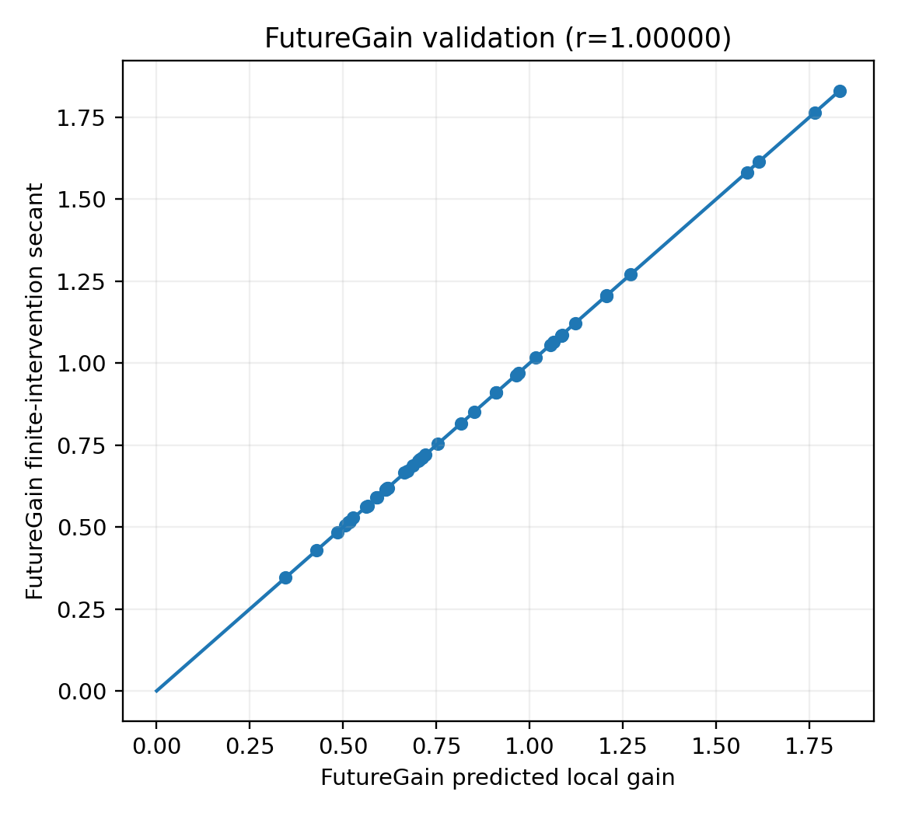

Figure 2.1. Future Gain predictions and finite trajectory-response secants in the archived calibration experiment.

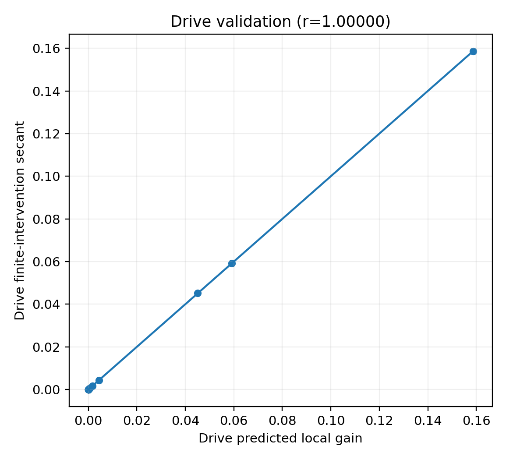

Figure 2.2. Final-answer Drive predictions and finite response. The relative-error floor is specified in the text.

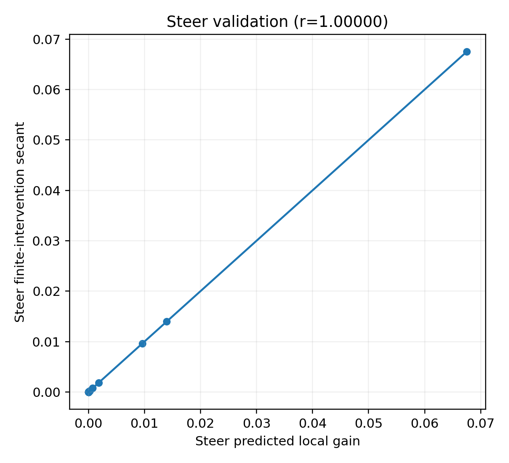

Figure 2.3. Mixed-derivative Steer predicts the finite change in the next token’s control vector.

### 2.3 The Q0110 diagnostic record

The following source table is split into matching column groups for readability. Token position is the common row key. Historical `nan` entries mark quantities outside the applicable adjacent-step measurement at the final token.

Source table 008 column group 1 of 3. Repeated leading fields identify the same rows.

| t | Token | Phase | Hotness% | Dominant metric | Flags |
| --- | --- | --- | --- | --- | --- |
| 22 | compute | COT | 99.7159 | Alignment | axis-aligned |
| 43 | 0 | ANSWER | 98.8636 | Drive | drive-hot |
| 42 | answer | ANSWER | 98.2558 | Steer | drive-hot, steer-hot |
| 7 | D | PROMPT | 98.0114 | FutureGain | future-gain-hot, frame-turn, persistent |
| 36 | 1 | COT | 97.7273 | Alignment | axis-aligned |
| 26 | D | COT | 96.5909 | PersistenceArea | future-gain-hot, frame-turn, persistent |
| 41 | ; | COT | 95.9302 | Steer | drive-hot, steer-hot |
| 3 | B | PROMPT | 94.3182 | PersistenceArea | future-gain-hot, persistent |
| 40 | 0 | COT | 94.1860 | Steer | drive-hot, steer-hot |
| 5 | C | PROMPT | 93.7500 | FutureGain | future-gain-hot, persistent |
| 19 | result | COT | 92.3295 | Alignment | axis-aligned |
| 30 | result | COT | 91.7614 | Alignment | axis-aligned |
| 39 | result | COT | 91.2791 | Steer | drive-hot, steer-hot |
| 34 | 1 | COT | 90.1163 | Rotation | frame-turn |
| 38 | final | COT | 90.1163 | Steer | steer-hot |

Source table 008 column group 2 of 3. Repeated leading fields identify the same rows.

| t | Drive | FutureGain | Steer | Alignment | Rotation° |
| --- | --- | --- | --- | --- | --- |
| 22 | 1.101e-10 | 0.6139 | 1.646e-10 | 0.8264 | 70.3549 |
| 43 | 0.1586 | 0.5061 | nan | 0.3264 | nan |
| 42 | 0.0592 | 0.7117 | 0.0675 | 0.0680 | 67.1773 |
| 7 | 2.339e-16 | 1.8303 | 9.129e-17 | 0.0510 | 86.2650 |
| 36 | 1.624e-04 | 0.7061 | 1.804e-04 | 0.7684 | 46.7366 |
| 26 | 1.784e-08 | 1.7646 | 7.510e-09 | 0.1311 | 77.6115 |
| 41 | 0.0451 | 0.6143 | 0.0140 | 0.2069 | 15.0930 |
| 3 | 3.832e-18 | 1.5824 | 4.592e-18 | 0.0715 | 70.9023 |
| 40 | 0.0044 | 0.6177 | 0.0096 | 0.6647 | 32.2078 |
| 5 | 1.977e-17 | 1.6152 | 5.325e-17 | 0.1922 | 53.8683 |
| 19 | 8.563e-12 | 0.5624 | 4.896e-12 | 0.7121 | 74.9151 |
| 30 | 9.390e-08 | 0.5171 | 9.795e-08 | 0.7114 | 72.3496 |
| 39 | 0.0017 | 0.5152 | 0.0018 | 0.6712 | 51.8434 |
| 34 | 2.207e-05 | 0.7006 | 2.551e-05 | 0.6162 | 77.0346 |
| 38 | 4.365e-04 | 0.6876 | 7.547e-04 | 0.1517 | 57.0258 |

Source table 008 column group 3 of 3. Repeated leading fields identify the same rows.

| t | Persistence |
| --- | --- |
| 22 | 1.5443 |
| 43 | 0.6511 |
| 42 | 1.1244 |
| 7 | 3.6689 |
| 36 | 1.1355 |
| 26 | 3.3936 |
| 41 | 1.2653 |
| 3 | 3.2569 |
| 40 | 0.9844 |
| 5 | 3.1081 |
| 19 | 1.1577 |
| 30 | 1.0499 |
| 39 | 0.9869 |
| 34 | 1.4130 |
| 38 | 1.4581 |

Source transcription: [Table 008](evidence/source_tables/t008_ORIGINAL.csv).

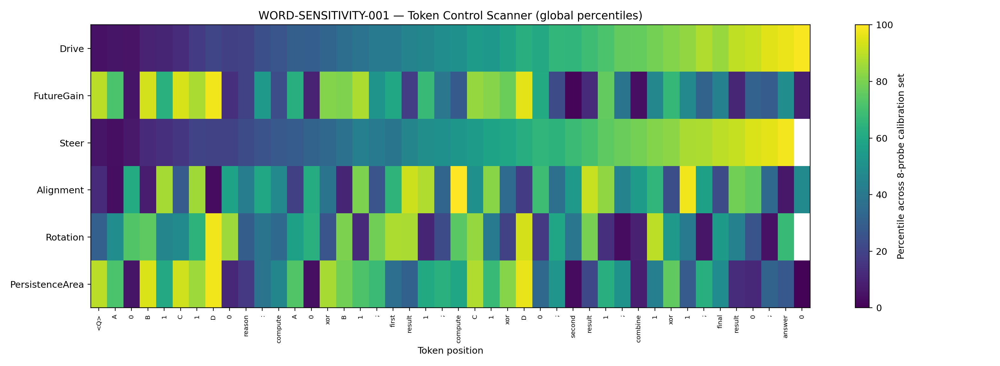

Figure 2.4. Six scanner measurements for Q=0110, expressed as percentiles of the eight-probe calibration distribution.

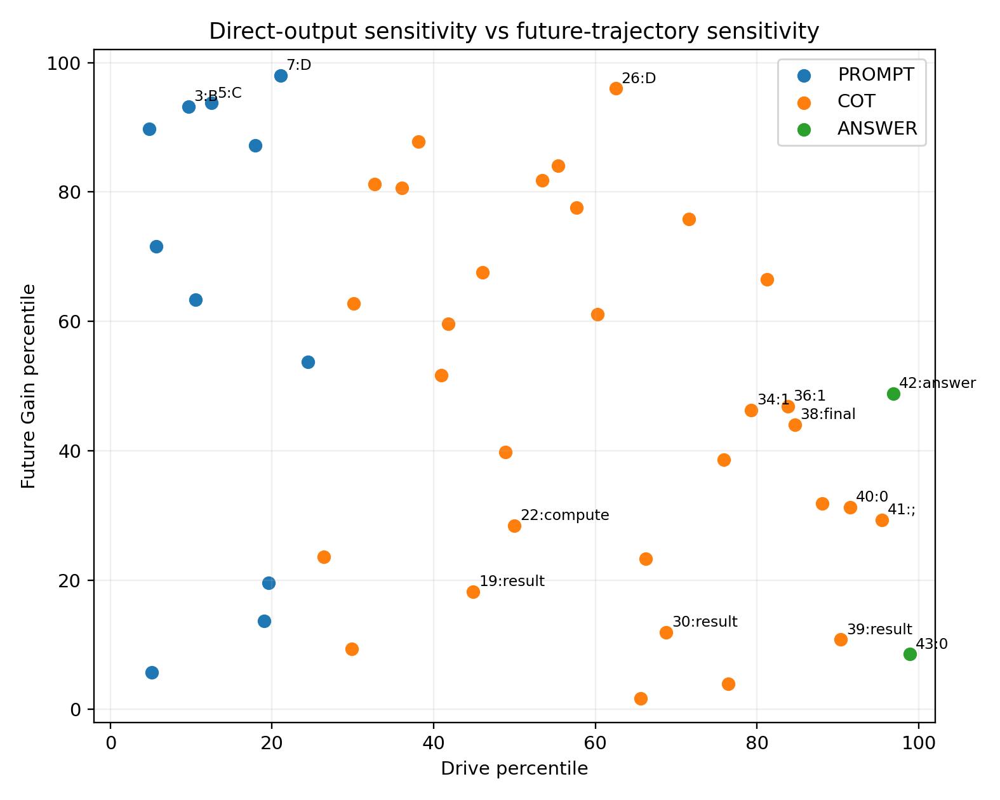

Figure 2.5. Final-answer sensitivity and future-trajectory sensitivity describe different measured effects.

Prompt token D at position 7 has Drive approximately $2.3\times10^{-16}$, Future Gain 1.8303, Rotation 86.2650 degrees, and Persistence 3.6689. Prompt B at position 3 similarly has Future Gain 1.5824 and Persistence 3.2569. These tokens strongly affect the recorded trajectory even at positions whose direct final-answer gradients are extremely small.

At position 22, `compute` has Alignment 0.8264 with a small direct Drive. The alignment identifies the direction used by the actual embedding displacement; the final answer effect also depends on gain and subsequent propagation. Near the answer, the semicolon at position 41 combines Drive 0.0451 with Steer 0.0140. The `answer` token at position 42 has Steer 0.0675, and the final answer token has Drive 0.1586.

Source table 009 column group 1 of 2. Repeated leading fields identify the same rows.

| t | Token | Phase | Observed role | Drive | FutureGain |
| --- | --- | --- | --- | --- | --- |
| 7 | D | PROMPT | Prompt state-shaper | 2.339e-16 | 1.8303 |
| 3 | B | PROMPT | Prompt persistent shaper | 3.832e-18 | 1.5824 |
| 22 | compute | COT | Aligned but low direct drive | 1.101e-10 | 0.6139 |
| 26 | D | COT | CoT trajectory hotspot | 1.784e-08 | 1.7646 |
| 41 | ; | COT | Late meta-controller | 0.0451 | 0.6143 |
| 42 | answer | ANSWER | Answer-stage driver + steer | 0.0592 | 0.7117 |
| 43 | 0 | ANSWER | Endpoint driver | 0.1586 | 0.5061 |

Source table 009 column group 2 of 2. Repeated leading fields identify the same rows.

| t | Steer | Alignment | Rotation° | Persistence |
| --- | --- | --- | --- | --- |
| 7 | 9.129e-17 | 0.0510 | 86.2650 | 3.6689 |
| 3 | 4.592e-18 | 0.0715 | 70.9023 | 3.2569 |
| 22 | 1.646e-10 | 0.8264 | 70.3549 | 1.5443 |
| 26 | 7.510e-09 | 0.1311 | 77.6115 | 3.3936 |
| 41 | 0.0140 | 0.2069 | 15.0930 | 1.2653 |
| 42 | 0.0675 | 0.0680 | 67.1773 | 1.1244 |
| 43 | nan | 0.3264 | nan | 0.6511 |

Source transcription: [Table 009](evidence/source_tables/t009_ORIGINAL.csv).

### 2.4 Engineering interpretation and diagnostic card

The measured profiles support several useful descriptions: a direct answer driver, a state or future-trajectory shaper, an adjacent-step steering point, and an action aligned with the leading control direction. A token event can exhibit several of these properties. The diagnostic object is the model, prefix state, token embedding, and target readout together.

A diagnostic card should record the token, position, and phase; raw and calibrated Drive and Future Gain; Alignment; Rotation; Steer; the Persistence horizon; the finite-intervention check; and the calibration distribution. Future Gain and Persistence address changes in the subsequent trajectory. Drive addresses the selected answer readout. The eight-probe calibration establishes this instrument on the specified GRU and teacher-forced trajectories.

The archived CSV, JSON, and figures are indexed under `01_WORD_SENSITIVITY_001`. The next experiment holds token identity fixed and measures the role of the current state.

## 3 The same token across different states

Experiment WORD-SENSITIVITY-002 · Cloud experiment · 26 September 2026

The experiment uses the same frozen GRU and embeddings. A bank of 352 actual prefix states comes from eight probes with 44 positions each. Ten fixed tokens—`0`, `1`, `;`, `result`, `xor`, `A`, `B`, `C`, `D`, and `compute`—are applied to every state, producing a complete 3,520-cell factorial design. The next-token probe for Steer is always `result`.

Each state comes from a recorded canonical trajectory. The current input token is the manipulated variable. The full transplant grid is an engineering stress test of state–token combinations; the natural-occurrence subset retains combinations that appeared on the recorded trajectories.

### 3.1 Local response fingerprint

| Measurement | Definition | Interpretation |
| --- | --- | --- |
| Immediate Drive | $\|\partial z_{\mathrm{after}}/\partial e\|$ | Immediate answer-propensity sensitivity |
| Input Gain | $\sigma_1(\partial h^+/\partial e)$ | Largest token-to-state injection gain |
| Carry Gain | $\sigma_1(\partial h^+/\partial h)$ | Retention or amplification of an incoming state difference |
| Probe Steer | $\sigma_1(\partial^2z_2/\partial e_{\mathrm{current}}\partial e_{\mathrm{result}})$ | Effect on the fixed next probe’s control vector |
| Alignment | $|\cos(e-e_{\mathrm{ref}},\partial z/\partial e)|$ | Token-action alignment with the immediate answer direction |
| State Displacement | $\|h^+-h\|$ | Finite state movement caused by the token |

### 3.2 Token and state variance decomposition

The balanced decomposition separates token identity, state, and their nonadditive interaction. Positive-valued measurements use log10; Alignment uses its original scale. The three sums of squares add to the total for the fixed grid.

| Metric | Scale | Token identity | State | Token × state |
| --- | --- | --- | --- | --- |
| ImmediateDrive | log10 | 19.03% | 6.64% | 74.33% |
| InputGain | log10 | 19.89% | 29.21% | 50.90% |
| CarryGain | log10 | 13.25% | 46.98% | 39.77% |
| ProbeSteer | log10 | 27.09% | 16.36% | 56.55% |
| Alignment | raw | 27.24% | 7.75% | 65.01% |
| StateDisplacement | log10 | 7.83% | 22.43% | 69.75% |

Source transcription: [Table 015](evidence/source_tables/t015_ORIGINAL.csv).

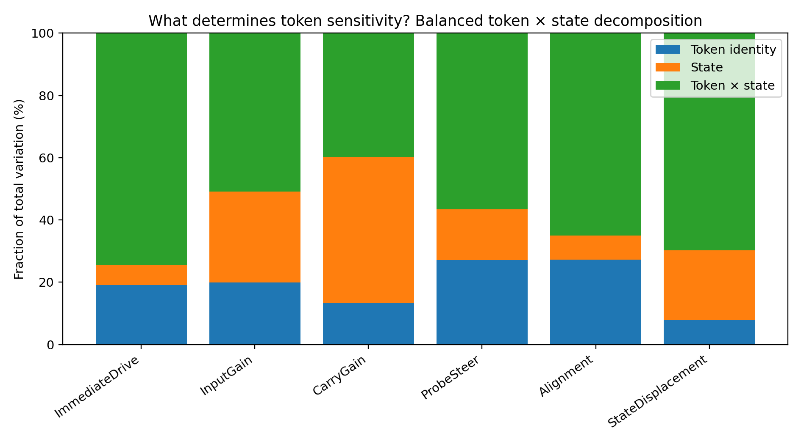

Figure 3.1. Token identity, state, and token–state interaction contributions across the six measurements.

The interaction accounts for 74.33% of Immediate Drive variation, 56.55% of Probe Steer, and 65.01% of Alignment. Carry Gain has a substantial state main effect, 46.98%, and a 39.77% interaction contribution. These are descriptive variance allocations across the complete diagnostic grid. The 352 prefixes share models and trajectories.

The interaction changes the relative organization of token effects. A single state-dependent gain applied equally to every token would produce a different factorial pattern. The present measurements justify reporting where a particular token has a strong effect, together with the readout used to define that effect.

### 3.3 Context sensitivity cards

| Token | Context dependency percentile | Fingerprint dispersion | Hot-state rate % | Largest span metric | q95/q05 span |
| --- | --- | --- | --- | --- | --- |
| ; | 100.0000 | 2.6134 | 87.2159 | ImmediateDrive | 5.2717 |
| A | 90.0000 | 2.5173 | 33.8068 | ProbeSteer | 4.8650 |
| result | 80.0000 | 2.4715 | 65.0568 | ProbeSteer | 5.2050 |
| B | 70.0000 | 2.2118 | 33.2386 | ProbeSteer | 5.2486 |
| 0 | 60.0000 | 1.9867 | 32.9545 | ImmediateDrive | 4.2224 |
| 1 | 50.0000 | 1.9808 | 33.5227 | ProbeSteer | 3.9211 |
| xor | 40.0000 | 1.8943 | 13.6364 | CarryGain | 2.4586 |
| C | 30.0000 | 1.8886 | 25.0000 | ProbeSteer | 4.1094 |
| compute | 20.0000 | 1.8427 | 32.1023 | ProbeSteer | 5.8009 |
| D | 10.0000 | 1.5498 | 56.8182 | ProbeSteer | 2.4557 |

Source transcription: [Table 017](evidence/source_tables/t017_ORIGINAL.csv).

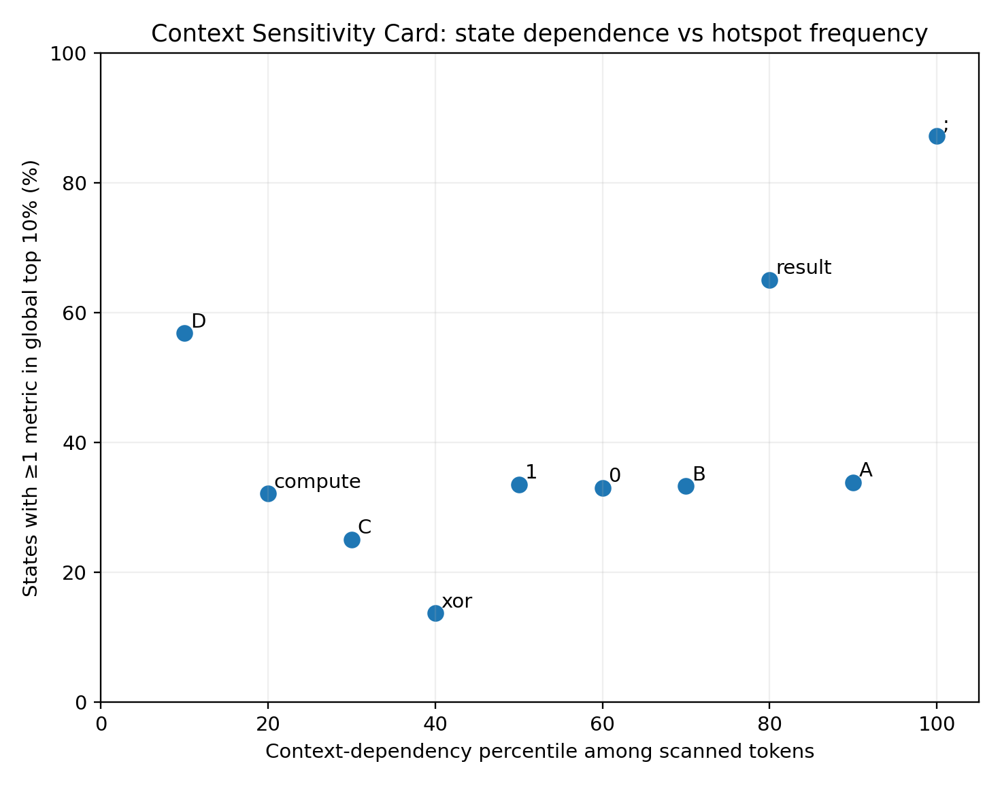

Figure 3.2. Context-dependency ranking and the proportion of states placing a token in at least one global top-decile hotspot.

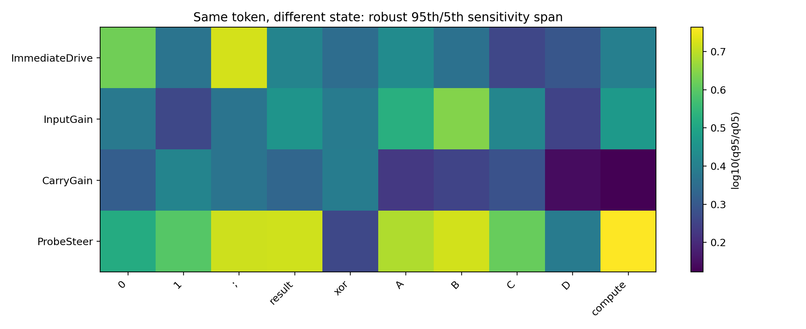

Figure 3.3. The 95th-to-5th percentile spans over 352 states for each fixed token.

The semicolon has the highest aggregate context-dependency rank within these ten candidates, followed by A, `result`, and B. Probe Steer spans are approximately 5.25 for B, 5.20 for `result`, and 5.80 for `compute`. The ranking belongs to this candidate set and state bank.

### 3.4 Natural occurrences and the transplant grid

| Token | Natural max/min | Transplant max/min | Transplant q95/q05 |
| --- | --- | --- | --- |
| ; | 1.1464 | 5.8640 | 5.1988 |
| result | 1.0392 | 6.8816 | 5.2050 |
| A | 1.3482 | 11.4869 | 4.8650 |
| B | 1.2175 | 9.6237 | 5.2486 |
| compute | 1.0710 | 6.8008 | 5.8009 |

Source transcription: [Table 018](evidence/source_tables/t018_ORIGINAL.csv).

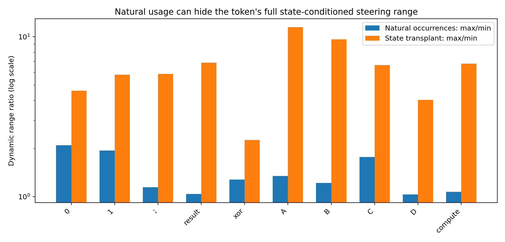

Figure 3.4. Natural-occurrence and complete-transplant ranges for Probe Steer.

For `result`, the natural maximum-to-minimum ratio is approximately 1.04, and the complete transplant ratio is 6.88. For B, the corresponding ratios are approximately 1.22 and 9.62. The recorded trajectories therefore sample a relatively restricted part of the measured token–state response range. Transplant measurements extend coverage to combinations relevant to stress testing.

### 3.5 Finite validation of high and low states

Source table 019 column group 1 of 3. Repeated leading fields identify the same rows.

| Metric | Token | Low state | Low prefix tail | Low pred | Low obs |
| --- | --- | --- | --- | --- | --- |
| Drive | ; | Q=1001 t=35 COT | 1 ; second result 1 ; combine 1 | 0.0966 | 0.0966 |
| Steer | B | Q=1100 t=19 COT | compute A 1 xor B 1 ; first | 0.0274 | 0.0274 |
| InputGain | B | Q=1011 t=30 COT | compute C 1 xor D 1 ; second | 0.2803 | 0.2804 |

Source table 019 column group 2 of 3. Repeated leading fields identify the same rows.

| Metric | Token | High state | High prefix tail | High pred | High obs |
| --- | --- | --- | --- | --- | --- |
| Drive | ; | Q=1001 t=20 COT | A 1 xor B 0 ; first result | 0.6405 | 0.6402 |
| Steer | B | Q=1100 t=10 PROMPT | 1 B 1 C 0 D 0 reason | 0.2639 | 0.2637 |
| InputGain | B | Q=1011 t=17 COT | reason : compute A 1 xor B 0 | 1.2854 | 1.2850 |

Source table 019 column group 3 of 3. Repeated leading fields identify the same rows.

| Metric | Token | Pred ratio | Observed ratio | Ratio error % |
| --- | --- | --- | --- | --- |
| Drive | ; | 6.6288 | 6.6258 | 0.0460 |
| Steer | B | 9.6200 | 9.6078 | 0.1268 |
| InputGain | B | 4.5858 | 4.5832 | 0.0577 |

Source transcription: [Table 019](evidence/source_tables/t019_ORIGINAL.csv).

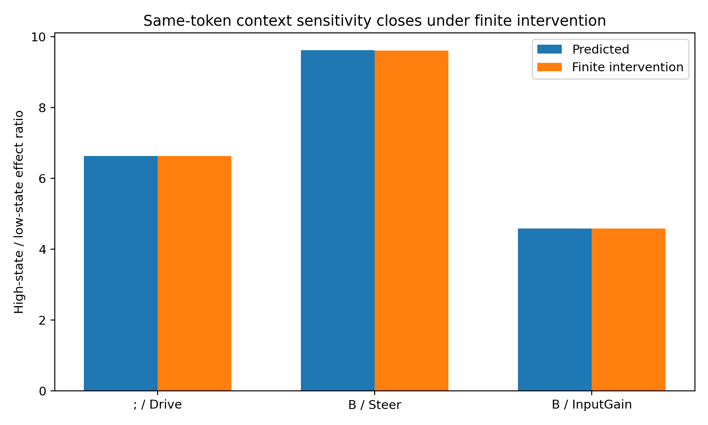

Figure 3.5. Predicted and observed high-to-low response ratios with token embeddings held fixed.

For the semicolon in Q=1001, Immediate Drive changes from approximately 0.0966 to 0.6405 across two prefixes. The predicted ratio is 6.6288 and the finite observed ratio is 6.6258. For B in Q=1100, Probe Steer gives ratios 9.6200 and 9.6078. A second B pair gives Input Gain ratios 4.5858 and 4.5832. All three ratio errors are below 0.13%.

The resulting Context Sensitivity Card records identity, context-dependency percentile, hot-state rate, robust spans, natural and transplant ranges, extreme-state examples, and finite validation. Probe Steer retains its fixed `result` probe, and Alignment retains the model’s coordinate and reference convention. The current engineering program uses these present-model measurements to select diagnostic states.

## 4 Executable token operator atlas

Experiment TOKEN-OPERATOR-ATLAS-001 · Cloud experiment · 26 September 2026

The atlas exposes a token as a state-dependent function $T_a(h)$. Engineers can inspect its response signature, apply it at a stored state, compare two tokens, execute a sequence, or measure an order effect. The runtime uses Python and NumPy.

| Command | Operation | Example arguments |
| --- | --- | --- |
| CARD | Retrieve the token’s calibrated operator card | `card B` |
| APPLY | Compute the next state for a token | `apply B --state-id 54` |
| COMPARE | Compare two outputs from a common state | `compare B result --state-id 54` |
| COMPOSE | Execute an ordered token sequence | `compose "A,0,xor,B" --state-id 54` |
| ORDER | Compare the two orders of a token pair | `order B result --state-id 54` |

### 4.1 Runtime reconstruction and calibration

Saved natural transitions, six-dimensional embeddings, and state/input Jacobians supply the reconstruction target. A GRU of the same architecture is fitted to this telemetry. The packaged runtime is this recovered model, with a separately measured agreement to the earlier telemetry.

| Calibration check | Value |
| --- | --- |
| Natural transition MSE | 7.027e-07 |
| 95% abs coordinate error | 0.0015 |
| Max abs coordinate error | 0.0081 |
| Median cosine: A Jacobian | 0.9998 |
| Median rel. error: A Jacobian | 0.0182 |
| Median cosine: B Jacobian | 0.9999 |
| Median rel. error: B Jacobian | 0.0118 |

Source transcription: [Table 030](evidence/source_tables/t030_ORIGINAL.csv).

All arbitrary token/state queries use the recovered runtime. A second consistency question compares that runtime with the atlas generated from it. The local audit reports a maximum coordinate discrepancy of approximately $5.55\times10^{-16}$ across all 6,336 transitions. The release recalculation gives zero discrepancy with its NumPy execution and the saved values. This runtime-to-table consistency and the reconstruction error above measure different relationships.

### 4.2 Conditional operator signatures

Eighteen tokens are applied to the same 352 ten-dimensional states. Each token’s signature contains the full 352-by-10 array of state movements. Singular-value summaries use these conditional signatures directly.

| Measurement | Value |
| --- | --- |
| Tokens | 18.0000 |
| Real state bank | 352.0000 |
| Token × state transitions | 6.336e+03 |
| Conditional operator signature stable rank | 2.3607 |
| Signature top-3 energy | 0.8730 |
| Signature 95% dimension | 6.0000 |
| All-movement stable rank | 2.0660 |
| All-movement top-3 energy | 0.8265 |
| All-movement 95% dimension | 6.0000 |

Source transcription: [Table 031](evidence/source_tables/t031_ORIGINAL.csv).

Six shared signature coordinates account for at least 95% of the recorded cross-token variation; the first three account for 87.30%. CARD exposes the coordinates as OP1 through OP6. They provide a compact index on this measured bank.

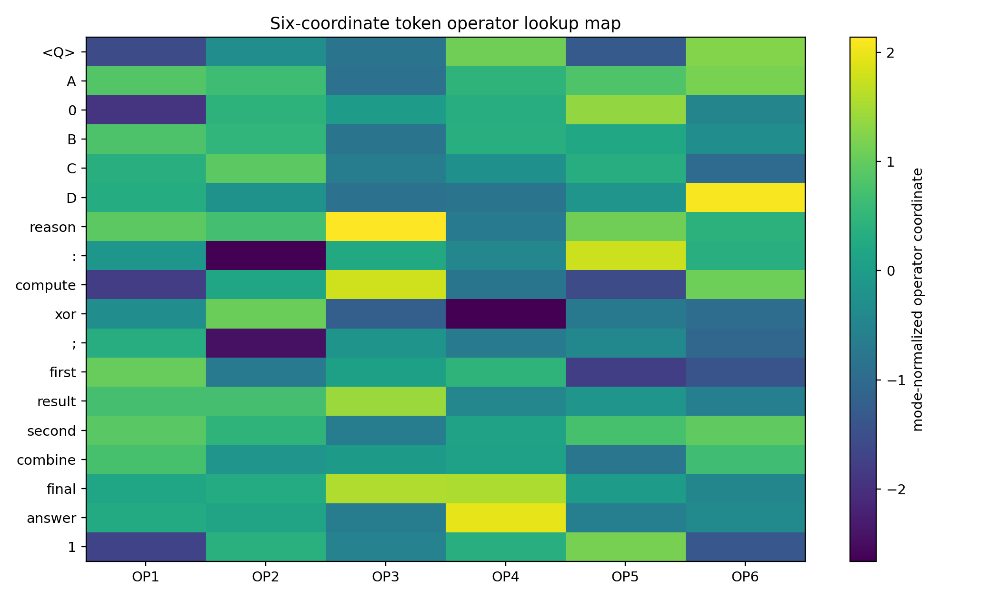

Figure 4.1. Six shared coordinates of the 18 token-operator signatures.

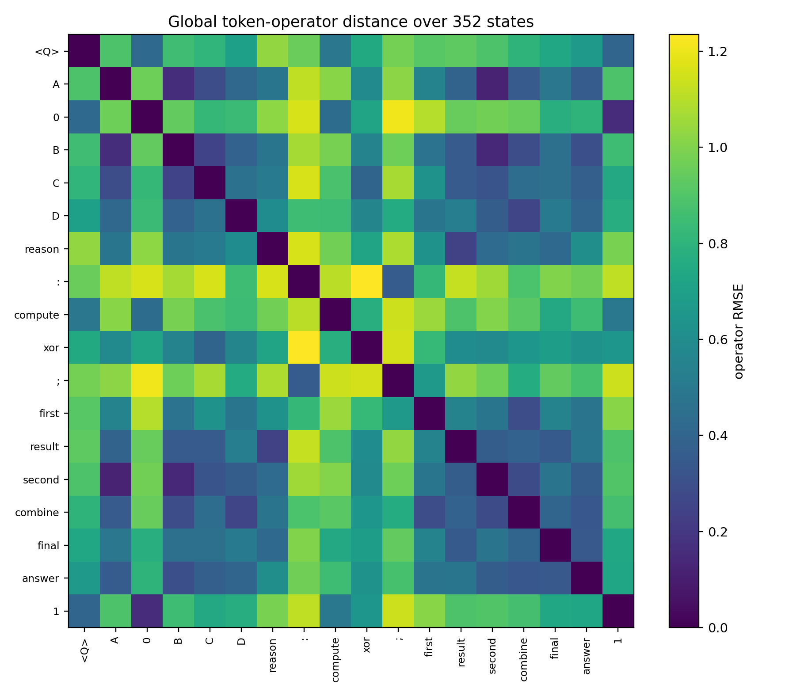

Figure 4.2. Distances between token operators over the common state bank.

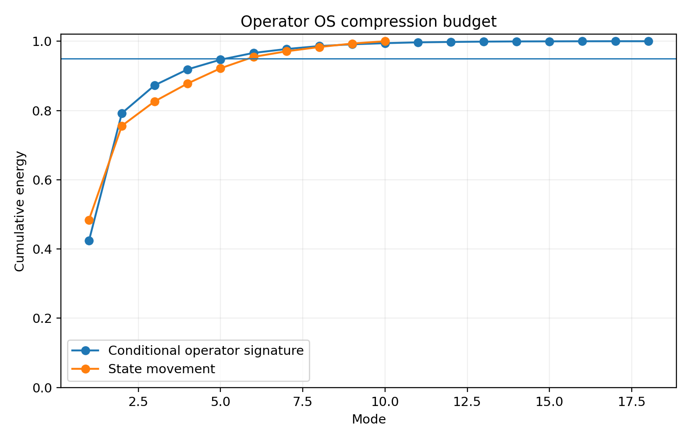

Figure 4.3. Empirical compression of conditional signatures and state movements.

The source quick-reference table records movement quantiles, response rank, directional consistency, nearest operators, and strong order partners. Matching column groups retain every source row.

Source table 028 column group 1 of 2. Repeated leading fields identify the same rows.

| Token | Move med | Q05 | Q95 | Resp rank | Top3 energy |
| --- | --- | --- | --- | --- | --- |
| &lt;Q&gt; | 2.5065 | 1.5476 | 3.4993 | 1.5369 | 0.9191 |
| A | 2.7874 | 0.8056 | 3.3128 | 1.7545 | 0.8945 |
| 0 | 2.6220 | 1.0867 | 3.4154 | 1.7953 | 0.8998 |
| B | 2.7230 | 0.8782 | 3.2671 | 1.7102 | 0.8970 |
| C | 2.4310 | 1.0373 | 2.8860 | 1.9181 | 0.8706 |
| D | 2.0469 | 0.9441 | 3.1369 | 1.5554 | 0.9012 |
| reason | 2.5874 | 0.8711 | 3.6712 | 1.5955 | 0.9151 |
| : | 3.4453 | 1.4290 | 4.0871 | 1.7088 | 0.8978 |
| compute | 2.5263 | 1.3357 | 3.6020 | 1.4192 | 0.9169 |
| xor | 2.3543 | 0.8452 | 2.8273 | 1.7134 | 0.8815 |
| ; | 3.1285 | 1.6634 | 4.5438 | 1.5248 | 0.9152 |
| first | 2.6027 | 1.0007 | 4.2527 | 1.5691 | 0.9193 |
| result | 2.5576 | 0.9851 | 3.3628 | 1.6083 | 0.8985 |
| second | 2.6324 | 0.7373 | 3.3842 | 1.6625 | 0.9049 |
| combine | 2.4746 | 0.9474 | 3.6116 | 1.5631 | 0.9153 |
| final | 2.3637 | 1.7788 | 3.0217 | 1.6965 | 0.9174 |
| answer | 2.4772 | 1.7161 | 3.0155 | 1.8291 | 0.9051 |
| 1 | 2.5002 | 1.1113 | 3.2873 | 1.8675 | 0.9054 |

Source table 028 column group 2 of 2. Repeated leading fields identify the same rows.

| Token | Direction consistency | Nearest op | Nearest RMSE | Strong order partner | Order effect |
| --- | --- | --- | --- | --- | --- |
| &lt;Q&gt; | 0.5321 | 1 | 0.4025 | first | 3.6686 |
| A | 0.6988 | second | 0.1228 | : | 3.2892 |
| 0 | 0.6924 | 1 | 0.1565 | first | 3.7242 |
| B | 0.6154 | second | 0.1388 | : | 3.2058 |
| C | 0.6149 | B | 0.2462 | : | 3.1505 |
| D | 0.4773 | combine | 0.2586 | compute | 2.7964 |
| reason | 0.7565 | result | 0.2370 | &lt;Q&gt; | 3.4886 |
| : | 0.8184 | ; | 0.3591 | A | 3.2892 |
| compute | 0.6475 | 0 | 0.4380 | first | 3.6605 |
| xor | 0.6669 | C | 0.4003 | : | 2.5414 |
| ; | 0.7515 | : | 0.3591 | compute | 3.2573 |
| first | 0.6150 | combine | 0.2896 | 0 | 3.7242 |
| result | 0.6550 | reason | 0.2370 | 0 | 3.2494 |
| second | 0.6766 | A | 0.1228 | 0 | 3.1830 |
| combine | 0.5164 | D | 0.2586 | 0 | 3.2535 |
| final | 0.4420 | answer | 0.3464 | &lt;Q&gt; | 2.9411 |
| answer | 0.4159 | B | 0.3038 | : | 3.1343 |
| 1 | 0.6199 | 0 | 0.1565 | first | 3.5075 |

Source transcription: [Table 028](evidence/source_tables/t028_ORIGINAL.csv).

### 4.3 Affine summaries and direct composition

The atlas also fits $T_a(h)\approx A_a h+b_a$ as a browsing summary. Held-out coordinate RMSE ranges approximately from 0.043 to 0.067. APPLY, COMPARE, COMPOSE, and ORDER execute the recovered nonlinear GRU.

| Token | Affine holdout RMSE | Median state error | Q95 state error |
| --- | --- | --- | --- |
| &lt;Q&gt; | 0.0614 | 0.1479 | 0.3532 |
| A | 0.0453 | 0.1192 | 0.2832 |
| 0 | 0.0672 | 0.1676 | 0.3820 |
| B | 0.0476 | 0.1216 | 0.2866 |
| C | 0.0475 | 0.1224 | 0.3079 |
| D | 0.0558 | 0.1296 | 0.3610 |
| reason | 0.0502 | 0.1157 | 0.3328 |
| : | 0.0555 | 0.1342 | 0.3144 |
| compute | 0.0575 | 0.1461 | 0.3302 |
| xor | 0.0468 | 0.1161 | 0.2501 |
| ; | 0.0540 | 0.1339 | 0.2895 |
| first | 0.0563 | 0.1373 | 0.3104 |
| result | 0.0434 | 0.1131 | 0.2331 |
| second | 0.0442 | 0.1157 | 0.2652 |
| combine | 0.0526 | 0.1184 | 0.3363 |
| final | 0.0444 | 0.1024 | 0.2573 |
| answer | 0.0450 | 0.1183 | 0.2465 |
| 1 | 0.0623 | 0.1589 | 0.3417 |

Source transcription: [Table 032](evidence/source_tables/t032_ORIGINAL.csv).

ORDER evaluates $\|T_b(T_a(h))-T_a(T_b(h))\|$ on the bank. Its output is a finite state difference with an explicit initial state and token order.

| Token A | Token B | Mean order effect | Median | Q95 | Max |
| --- | --- | --- | --- | --- | --- |
| 0 | first | 3.7242 | 3.4795 | 4.2053 | 4.2121 |
| &lt;Q&gt; | first | 3.6686 | 3.5800 | 3.9591 | 3.9654 |
| compute | first | 3.6605 | 3.6823 | 4.1901 | 4.2058 |
| first | 1 | 3.5075 | 3.3188 | 3.9501 | 3.9555 |
| &lt;Q&gt; | reason | 3.4886 | 3.5590 | 3.6460 | 3.6576 |
| 0 | reason | 3.4672 | 3.5098 | 3.6628 | 3.6691 |
| reason | 1 | 3.2928 | 3.3627 | 3.4440 | 3.4608 |
| A | : | 3.2892 | 3.3068 | 3.4050 | 3.4276 |
| reason | compute | 3.2846 | 3.3949 | 3.4468 | 3.4508 |
| compute | ; | 3.2573 | 3.0206 | 3.9090 | 3.9241 |
| 0 | combine | 3.2535 | 3.1238 | 3.6279 | 3.6314 |
| 0 | result | 3.2494 | 3.2914 | 3.3737 | 3.3888 |

Source transcription: [Table 033](evidence/source_tables/t033_ORIGINAL.csv).

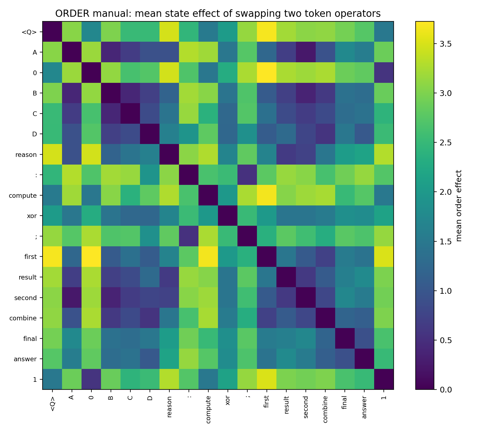

Figure 4.4. Mean effect of exchanging each pair of token operators.

Large mean order effects include `0`/`first` at 3.7242, `<Q>`/`first` at 3.6686, and `compute`/`first` at 3.6605. The smaller A/`second` effect is approximately 0.235. COMPOSE therefore retains the actual ordered sequence.

### 4.4 Running the included atlas

From the release root:

```sh
cd evidence/cloud/01_Experiments/03_TOKEN_OPERATOR_ATLAS_001
python3 TOKEN_OPERATOR_ATLAS_001_os.py list
python3 TOKEN_OPERATOR_ATLAS_001_os.py card B
python3 TOKEN_OPERATOR_ATLAS_001_os.py apply B --state-id 54
python3 TOKEN_OPERATOR_ATLAS_001_os.py order B result --state-id 54
```

The runtime file contains the recovered GRU, embeddings, state bank, and bases. The manifest supplies operator cards and calibration metadata. State IDs 0–351 address the saved prefixes; `--h` accepts ten comma-separated coordinates. The reported calibration characterizes the saved bank and its local responses. Shared operator coordinates are rebuilt for each model and calibration bank.


## 5 Public incident casebook

Experiment REAL-WORLD-OPERATOR-FAILURES-001 · Published-case synthesis · 26 September 2026

This casebook converts documented interaction patterns into measurable engineering questions. Its sources are the IFEval++ prompt-variation study, SimpleToolHalluBench and Reasoning Trap, R-Judge, and the InjecAgent repository. The public incidents motivate the assays; the operator-level explanations are hypotheses to test through instrumentation.

### 5.1 Prompt wording and constraint retention

The IFEval++ example concerns a sleep-themed blog with wording, constraint, and distractor variations. A minimum word count and an approximate target word count specify related but distinct constraints. An equivalence test therefore begins with the exact task and evaluator contract for each prompt.

For matched constraints, proposed measurements include the divergence of control paths, retention of a constraint-related direction into generation, the functional distance between two surface expressions at a common state, and the first sampled position at which a measured divergence appears. These assays ask whether alternative input forms preserve the required functional outcome.

### 5.2 Requested tools and registry membership

One published pattern requests a restaurant-address function in an environment with no tools. The model describes a call and supplies a purported result. Another requests a vehicle-route change with an unrelated calibration function available. The former concerns registry membership; the latter concerns matching the available capability to the goal.

| Incident | Proposed measurement | Engineering question |
| --- | --- | --- |
| Requested function outside the registry | Registry Violation Margin | How does the unregistered-call score compare with clarification or abstention? |
| Function-name capture | Tool-Name Capture Ratio | How strongly do the requested name and registry evidence affect selection? |
| Registry intervention | Registry Counterfactual Gain | What changes when the required function is added or removed? |
| Irrelevant registered function | Capability Projection Error | How does the selected capability differ from the requested operation? |
| Distractor attraction | Distractor Attraction Margin | What score advantage does an available but irrelevant candidate have over abstention? |
| Fabricated result | Fabricated Observation Onset | At which sampled point does the trace begin to represent an unobserved outcome? |

These definitions separate a valid execution handle from a capability that addresses the request. Their mathematical realization depends on a specified behavioral score and controlled comparison.

### 5.3 External content and action authority

The Evernote incident begins with a request to retrieve the latest note containing “Budget.” An instruction embedded in the returned note redirects the agent toward granting smart-lock access. The related Amazon-review case places the access request in a product review field. Both motivate measuring the same instruction-like content under different source-channel labels.

The source-conditioned operator is $T(a,x,s)$, where $a$ is the linguistic input, $x$ is the model state, and $s$ identifies the channel. Candidate measurements include the action-gradient contribution of an external span relative to the user’s goal span, the response difference between user and tool-data presentations, and the change in the action-control direction after the external content.

The archived case file retains the public examples and the chosen behavior targets. The synthesis here describes the incidents in paraphrase. Source URLs and the original short extracts remain in the supplied records.

### 5.4 Common incident record

An incident record contains the model revision, tokenized transcript, source labels, registry, selected action scores, sampled states, and intervention definition. The useful output is a traceable relation between an input change and a behavioral change. Where internal states are accessible, a finite patch tests a proposed mediating state direction.

The casebook establishes the question and measurement contract. The following instrumentation prototype implements a subset of that contract.

## 6 Failure axis instrumentation

Experiment REAL-WORLD-OPERATOR-TELEMETRY-002 · Archived instrumentation and constructed self-check · 26 September 2026

The supplied Failure Axis Guard script provides case listing, a Hugging Face locator, report tracing, and a proposed guard plan. It includes paired and gradient-source modes. The cloud package contains the instrumentation and a saved mechanism self-check. The later local study in Section 12 contributes measured pretrained-model interventions.

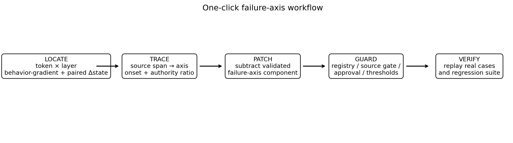

Figure 6.1. The original instrumentation workflow. Its locator outputs require the interpretation and acceptance checks described below.

### 6.1 Behavioral score and local control axis

For a selected failure continuation and reference continuation, define a differentiable behavior margin $z$. At layer $\ell$ and token $t$, measure the state $h_{\ell t}$ and gradient

$$g_{\ell t}=\frac{\partial z}{\partial h_{\ell t}}.$$

For an aligned pair of trajectories, form $\Delta h_{\ell t}=h_{\mathrm{failure}}-h_{\mathrm{reference}}$ and the local contribution $c_{\ell t}=\langle\Delta h_{\ell t},g_{\ell t}\rangle$. The prototype stacks high-load vectors, weights them by absolute contribution, and uses their leading singular direction as a candidate failure-control axis. A finite state patch then measures the associated change in the behavior margin.

In paired mode, the comparison uses two inputs with an explicit alignment. In gradient-source mode, the comparison starts from the gradients of a selected input span and a directional intervention. A patch effect establishes a local intervention result for that model, case, behavior score, and state location.

### 6.2 Saved mechanism self-check

The saved demonstration uses state 251 of the recovered runtime and the two orders `0 → first` and `first → 0`. Their final state distance is 4.2121. The earlier step has weak control alignment and a rescue fraction approximately 0.0182; the later step has alignment 1.0 and rescue fraction 1.0.

Source table 060 column group 1 of 2. Repeated leading fields identify the same rows.

| step | token\_failure | token\_safe | paired\_state\_distance | control\_alignment | causal\_contribution |
| --- | --- | --- | --- | --- | --- |
| 0 | 0 | first | 2.8847 | 0.1106 | 0.0701 |
| 1 | first | 0 | 4.2121 | 1.0000 | 4.2121 |

Source table 060 column group 2 of 2. Repeated leading fields identify the same rows.

| step | rescue\_fraction |
| --- | --- |
| 0 | 0.0182 |
| 1 | 1.0000 |

Source transcription: [Table 060](evidence/source_tables/t060_ORIGINAL.csv).

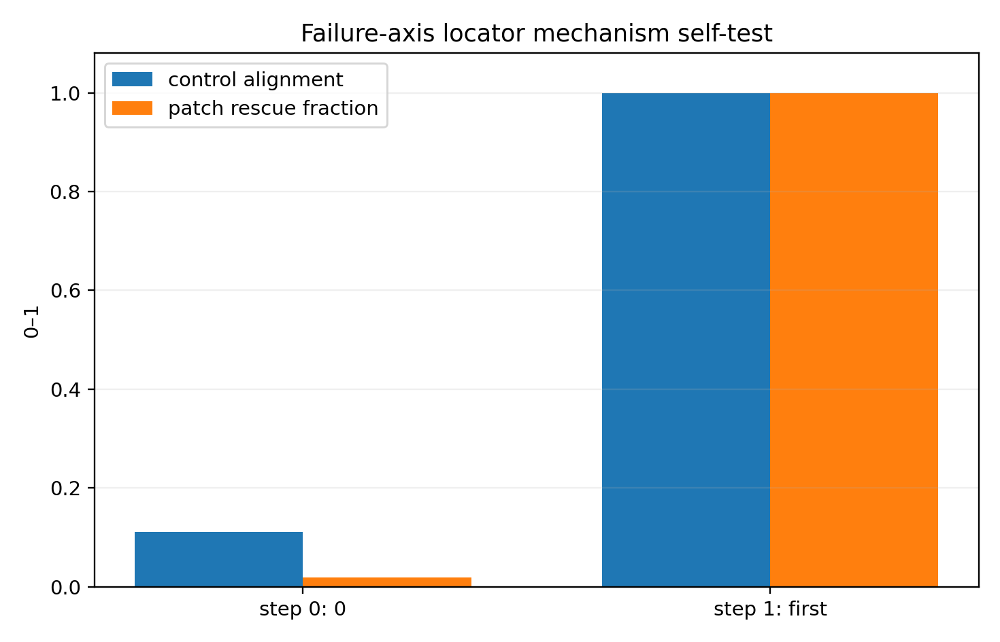

Figure 6.2. Saved finite-patch demonstration on the recovered runtime.

The command named `self-test` displays the archived JSON. Recomputing the mechanism requires executing the underlying calculation. This distinction is reflected in the release verification record.

### 6.3 Interpreting locator output

| Field | Current interpretation |
| --- | --- |
| `selected_layer` | Best-ranked layer among those evaluated by the prototype |
| `axis_file` | Saved vector for the model, case, and score definition |
| `patch_rescue_fraction` | Measured change relative to the chosen paired behavior gap |
| `layer_ranking` | Ranking of the sampled layer interventions |
| `source_authority_ratio` | Relative span-gradient measurement under the selected target |
| `goal_gradient_angle_deg` | Angle between the two selected target gradients |
| `injection_onset` | Earliest matched high-load token retained by the selected layer’s top-k procedure |

The original locator ranks a layer even when its patch effect is weak. A current incident assessment therefore reads the effect size and control results alongside the rank. The onset field reports a position within the sampled top-k procedure. A claim about the earliest causal event would require a coverage and intervention design that directly tests that quantity.

### 6.4 Operational use

From the included cloud experiment directory, `cases` lists the example records and `trace --report ...` reads a saved locator result. The `locate --model ...` entry point requires a compatible accessible causal language model and its runtime dependencies. The original manual is retained beside the script.

The source proposes source tagging, structured extraction of task-relevant fields, registry enumeration, argument validation, host authorization checks, and regression cases. These are host-side design proposals. The internal axis supplies diagnostic information and finite counterfactual measurements. Its calibration is specific to model revision, task, behavioral score, and state coordinate convention.

## 7 Tool calls as a hybrid action system

Experiment TOOL-CALL-001 · Constructed mechanism · 26 September 2026

A tool interaction combines continuous model state, discrete mode and tool selection, structured arguments, and an external environment transition. The experiment expresses this sequence as

$$p(m,k,a\mid x,R)=p(m\mid x,R)\,p(k\mid m,x,R)\,p(a\mid k,x,R),$$

followed by execution $e_{t+1}=E_k(e_t,a)$, an observation of the resulting environment, and a subsequent model-state update. A small internal displacement can cross a discrete selection boundary and change which finite external operation is proposed.

The mechanism study isolates four properties: discrete selection boundaries, registry-conditioned availability, sequential argument generation, and the size of the external effect associated with changing an action.

### 7.1 Current nearest-boundary definition

For winner $w$, scores $Q_j$, and gradients $g_j$ at a common state, the distance to the pairwise tangent boundary for competitor $j$ is

$$r_{w,j}=\frac{Q_w-Q_j}{\|g_w-g_j\|}.$$

The nearest admissible tangent boundary is obtained from all competitors:

$$r_{\mathrm{local}}=\min_{j\ne w,\ j\ \mathrm{admissible}}r_{w,j}.$$

The score runner-up identifies one boundary. A lower-scoring candidate can have a steeper score difference and a closer boundary. The local audit’s affine example uses scores 2, 1, and 0 with scalar gradients 0, 0.1, and 100. The runner-up distance is 10; the third candidate’s distance is 0.02. At displacement 0.02001, the third candidate wins.

This is a first-order measurement in the declared state coordinates and score units. A zero gradient difference is recorded as first-order unidentifiability. Finite nonlinear behavior is evaluated separately through perturbation measurements.

### 7.2 Historical boundary and amplification results

The original study sampled 20,000 constructed latent states. Its historical `d_flip` statistic used the score runner-up. The table and original plots retain that measurement identity. The later all-competitor definition supplies the corrected interpretation for new nearest-boundary calculations.

| metric | value |
| --- | --- |
| Boundary median d\_flip | 0.5964 |
| Boundary p05 d\_flip | 0.0442 |
| Near-boundary (d&lt;0.05) fraction | 0.0563 |
| Median finite world amplification | 2.6861 |
| P95 finite world amplification | 34.7689 |
| No-tool hallucination crossover reasoning gain | 2.3000 |
| Distractor capture crossover reasoning gain | 0.9000 |
| Distractor best tool similarity | 0.9338 |
| Goal-to-best-single-tool relative error | 0.3578 |
| 5-slot base full-call validity | 0.8268 |
| 5-slot perturbed full-call validity | 0.6487 |
| Relative drop after early perturbation | 0.2154 |
| Goal-to-valid-tool-positive-cone relative error | 0.3578 |

Source transcription: [Table 070](evidence/source_tables/t070_ORIGINAL.csv).

Among these constructed states, 5.63% fall below the original runner-up radius threshold of 0.05. For the action flips measured in this construction, the ratio of finite world effect to latent perturbation has median 2.6861 and 95th percentile 34.7689. These quantities demonstrate the amplification mechanism under the specified controller and environment mapping.

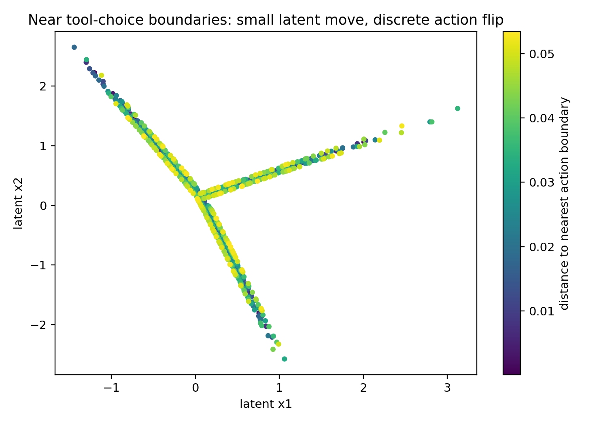

Figure 7.1. Original constructed selection geometry. Historical boundary values use the source runner-up convention.

### 7.3 Registry evidence and goal drive

The construction varies a goal-drive gain in a requested-tool score and compares it with an abstention score. If the goal term grows faster than the feasibility contribution, the requested action crosses the selection boundary. The recorded crossovers are approximately 2.30 for the nonexistent-tool example and 0.90 for the distractor example.

The registry diagnostic compares the largest in-registry and out-of-registry scores. Its margin and tangent radius describe the selected score functions. The host registry determines which execution handles can be invoked.

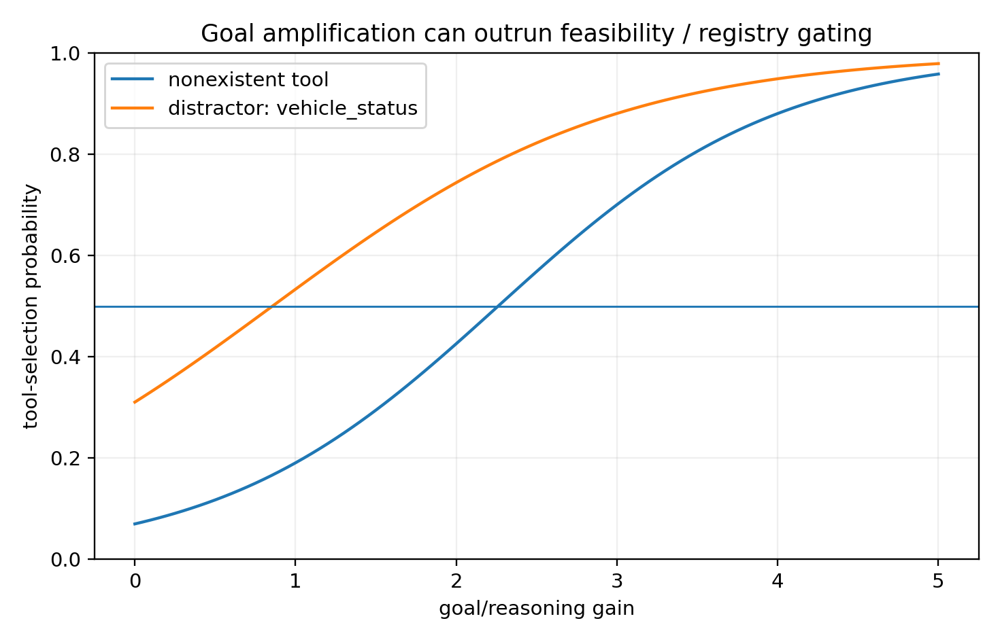

Figure 7.2. Constructed gain changes and their effect on the requested-tool versus abstention boundary.

### 7.4 Sequential argument generation

For a sequence of required slots, full-call validity factors into the conditional probability of satisfying each slot given the preceding valid slots. The constructed five-slot example has full-call validity 0.8268 at baseline and 0.6487 after an early perturbation, a relative reduction approximately 21.54%.

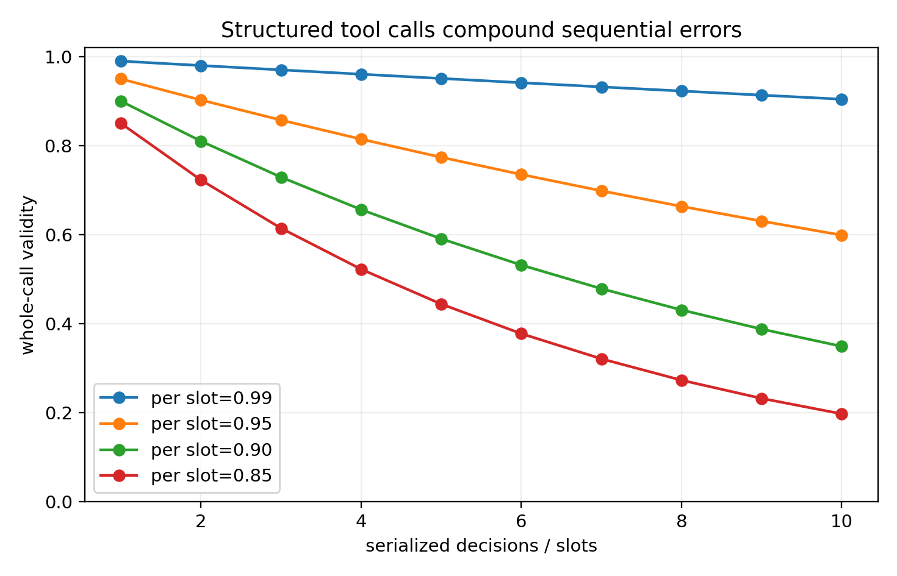

Figure 7.3. Recorded full-call validity across sequential slot decisions.

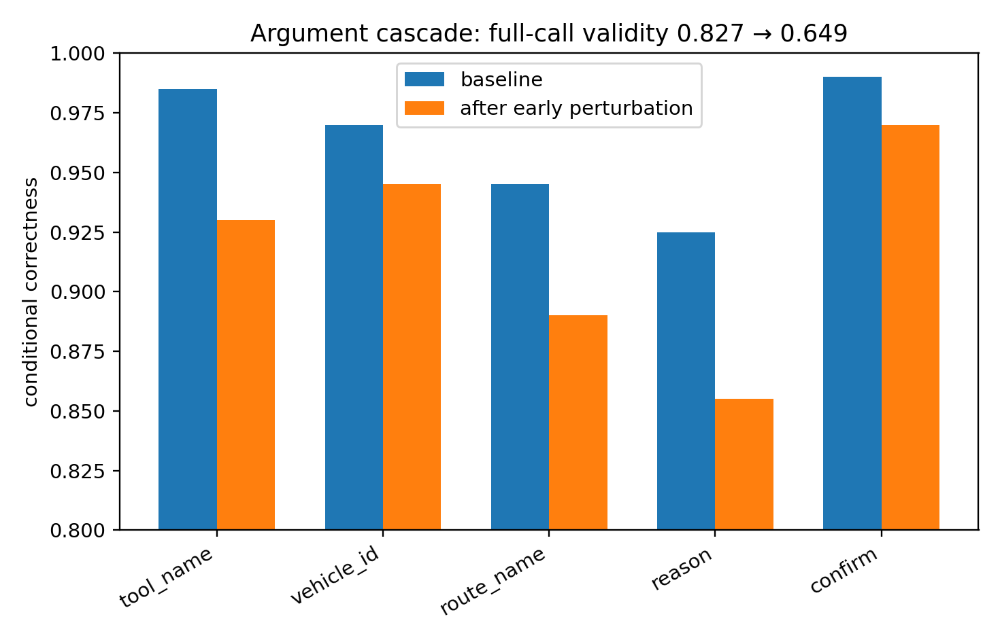

Figure 7.4. Effect of an early perturbation on later argument conditions in the construction.

Useful telemetry therefore includes selection scores and gradients, registry status, the decision associated with each content-bearing argument, and the external observation. The original stability script and CSVs are preserved as historical artifacts. Section 11 states the corrected component contracts reported by the local update.

## 8 Tools as guarded partial operators

Experiment TOOL-CALL-002 · BFCL case analysis and component demonstration · 26 September 2026

The casebook uses six BFCL V4 task types: a simple call, selection among tools, irrelevance, parallel calls, a missing parameter, and a missing function. The state includes model state $x_t$, environment $e_t$, registry $R_t$, bound information $B_t$, and goal $g_t$.

A callable partial operator has a registered handle, valid arguments, complete required bindings, and satisfied environment preconditions. ASK, WAIT, and ABSTAIN provide explicit interaction modes for the corresponding conditions.

$$U_t=\{\mathrm{ASK},\mathrm{WAIT},\mathrm{ABSTAIN}\}\cup\mathcal C_t.$$

$$\mathcal C_t=\{(k,a):k\in R_t,\ a\in\mathrm{Schema}_k,\ b_k(a)\land p_k(e_t,a)\}.$$

Here $b_k(a)$ denotes complete required bindings, and $p_k(e_t,a)$ denotes satisfied environment preconditions.

This formal model describes the execution domain. The local update adds explicit permission and environment receipts to the component input contract. Semantic ranking uses the request and tool capabilities before argument completion determines whether to call or clarify.

### 8.1 Six task structures

Source table 078 column group 1 of 2. Repeated leading fields identify the same rows.

| Case | Class | Mode | K tools | Expected calls | Required slots |
| --- | --- | --- | --- | --- | --- |
| BFCL\_simple\_python\_0 | simple | CALL | 1 | 1 | 2 |
| BFCL\_multiple\_1 | multiple\_tool\_selection | CALL | 3 | 1 | 3 |
| BFCL\_irrelevance\_0 | irrelevance\_abstention | ABSTAIN | 1 | 0 | 0 |
| BFCL\_parallel\_multiple\_0 | parallel\_set\_selection | CALL\_SET | 2 | 2 | 4 |
| BFCL\_multi\_turn\_miss\_param\_0 | missing\_parameter\_clarification | ASK\_THEN\_CALL | 2 | 2 | 4 |
| BFCL\_multi\_turn\_miss\_func\_0 | missing\_function\_recovery | WAIT\_FOR\_TOOL\_THEN\_CALL | 4 | 1 | 1 |

Source table 078 column group 2 of 2. Repeated leading fields identify the same rows.

| Case | Parallel width | Turns | Hard gates |
| --- | --- | --- | --- |
| BFCL\_simple\_python\_0 | 1 | 1 | 4 |
| BFCL\_multiple\_1 | 1 | 1 | 5 |
| BFCL\_irrelevance\_0 | 0 | 1 | 2 |
| BFCL\_parallel\_multiple\_0 | 2 | 1 | 6 |
| BFCL\_multi\_turn\_miss\_param\_0 | 1 | 5 | 7 |
| BFCL\_multi\_turn\_miss\_func\_0 | 1 | 5 | 7 |

Source transcription: [Table 078](evidence/source_tables/t078_ORIGINAL.csv).

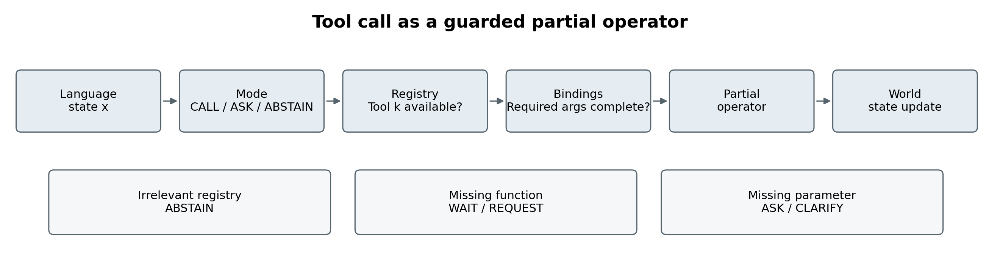

Figure 8.1. Partial-operator model of tool interaction, redrawn from the source diagram for readability. The original is preserved in the cloud evidence directory.

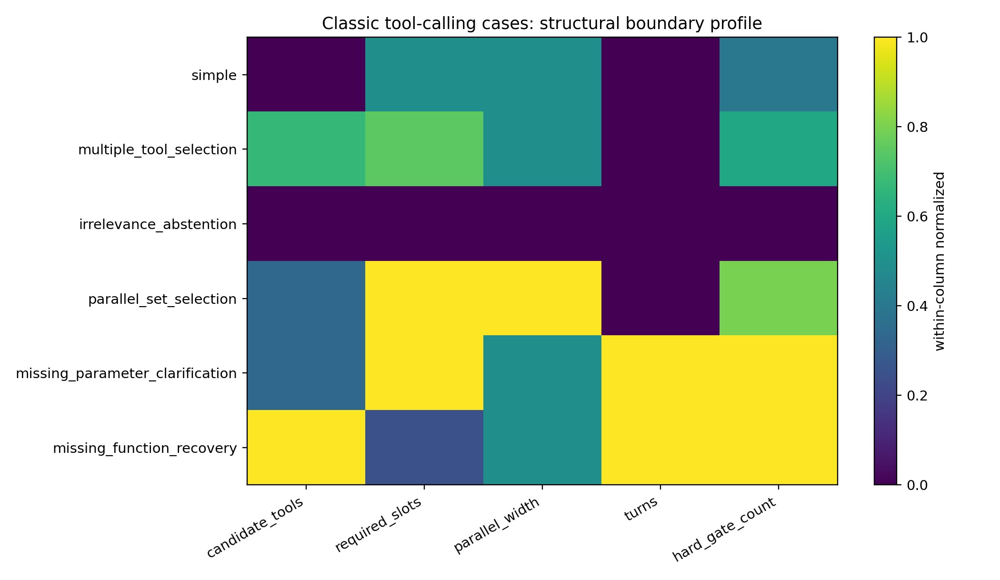

Figure 8.2. Structural measurements of the six named cases.

**Simple call.** A triangle-area request supplies base 10 and height 5. Removing the height preserves the relevant capability and changes the next step to argument clarification.

**Multiple tools.** A triangle-area request supplies sides 3, 4, and 5. The benchmark selects the Heron-formula tool. A base-height function can accept two numbers under its schema, so validating the arguments alone does not establish that their roles were supported by the request. These particular side lengths also form a right triangle; the engineering point is the binding and operation contract, independently of a coincident numeric result.

**Irrelevance.** A triangle-area request is paired only with a body-mass-index tool. The relevant response is the no-matching-tool path.

**Parallel calls.** A request for a sum of multiples and a product of primes requires two operations. The proposal is an action set. Completeness is evaluated against the two stated subgoals.

**Missing parameter.** A file-move instruction leaves the source filename unspecified. The next interaction asks for that binding. Once the filename is provided, the relevant call can enter the execution domain.

**Missing function.** A sorting request arrives before the sorting function is available. The interaction records the missing capability; adding that function changes registry membership and enables the corresponding call.

### 8.2 Minimal changes and component checks

| Case | minimal\_change | before | after | gate\_flipped |
| --- | --- | --- | --- | --- |
| BFCL\_simple\_python\_0 | remove height=5 from user request | CALL\_READY | MISSING\_REQUIRED\_ARGUMENT | BINDING\_COMPLETE |
| BFCL\_multiple\_1 | replace 'three sides: 3,4,5' with 'base 4 and height 5' | Heron tool is schema-compatible | base-height tool is schema-compatible | TOOL\_ID |
| BFCL\_irrelevance\_0 | replace offered BMI tool with calculate\_triangle\_area | ABSTAIN | CALL\_READY | MODE / RELEVANCE |
| BFCL\_parallel\_multiple\_0 | remove sentence 'Also find the product of the first five prime numbers.' | CALL\_SET cardinality=2 | CALL\_SET cardinality=1 | CALL\_SET\_CARDINALITY |
| BFCL\_multi\_turn\_miss\_param\_0 | add 'previous\_report.pdf' as the missing source filename | ASK / NO CALL | CALL\_READY | BINDING\_COMPLETE |
| BFCL\_multi\_turn\_miss\_func\_0 | add sort(file\_name) function to current registry | WAIT / NO CALL | CALL\_READY | FUNCTION\_AVAILABLE |

Source transcription: [Table 086](evidence/source_tables/t086_ORIGINAL.csv).

The source validator demonstrates selected mode, binding, registry, and cardinality checks on named case contracts.

| Case | test | Admissible in source check | failed\_gates |
| --- | --- | --- | --- |
| BFCL\_simple\_python\_0 | correct | True |  |
| BFCL\_simple\_python\_0 | missing\_arg | False | BINDING\_COMPLETE |
| BFCL\_multiple\_1 | correct | True |  |
| BFCL\_multiple\_1 | schema\_valid\_wrong\_semantics | True |  |
| BFCL\_irrelevance\_0 | correct | True |  |
| BFCL\_irrelevance\_0 | wrong\_mode | False | MODE;CALL\_SET\_CARDINALITY |
| BFCL\_parallel\_multiple\_0 | correct | True |  |
| BFCL\_parallel\_multiple\_0 | undercall | False | CALL\_SET\_CARDINALITY |
| BFCL\_multi\_turn\_miss\_param\_0 | correct\_preclarification | True |  |
| BFCL\_multi\_turn\_miss\_func\_0 | unregistered\_missing\_function | False | REGISTRY |

Source transcription: [Table 087](evidence/source_tables/t087_ORIGINAL.csv).

Its `allowed_modes` and expected call counts are supplied by those case contracts. The later local audit expands validation of numeric values, supported schema features, empty calls, host receipts, snapshot identity, and parallel conditions. The current claim is therefore tied to the checks implemented by each version.

### 8.3 Incident taxonomy

| Type | Condition to inspect | Relevant response |
| --- | --- | --- |
| Execution-domain violation | Registry, binding, schema, permission, or precondition mismatch | Return the specific failed contract check |
| Semantic selection error | Chosen capability differs from the request | Compare request–tool scores and evidence interventions |
| Set-coverage error | Proposed action set differs from required subgoals | Check goal coverage and call-set composition |
| Environment-path error | Current environment differs from the assumed state | Inspect environment receipts and prior outcomes |
| Missing capability | Relevant function is outside the current registry | Report or request the required capability |
| Missing information | Relevant function awaits a binding | Ask for the missing information |

The package retains the six task contracts, minimal changes, source checks, and mathematical dissection. The later integrated workflow keeps semantic matching and executable-domain validation as separately evaluated components.


## 9 Action readiness geometry

Experiment TOOL-CALL-003 · Constructed seven-dimensional controller · 26 September 2026

This study implements CALL, CALL_SET, ASK, WAIT, ABSTAIN, and CONTINUE in a controlled action system. It connects the earlier stopping-set idea to tool interaction: an action can be preferred at one state, lose preference after a continuation step, and become preferred again. The numerical state variables and policy are specified by the construction.

### 9.1 Scores and admissible regions

For action $a$, the source defines a readiness margin against CONTINUE and other admissible actions. Its historical radius uses the gradient of the winning margin. The local audit in Section 11 refines the nearest-boundary calculation to compare every admissible competitor in the same score units and coordinates.

A region indexed by threshold $\tau$ combines an admissibility condition, a nonnegative action margin, and a chosen local radius criterion. In this construction, semantic-match, coverage, uncertainty, registry, binding, and environment variables determine the action scores and gates.

| BFCL case | Expected region | Observed region | Readiness margin | Radius | Robust |
| --- | --- | --- | --- | --- | --- |
| BFCL\_simple\_python\_0 | CALL | CALL | 1.5420 | 0.3060 | True |
| BFCL\_multiple\_1 | CALL | CALL | 1.5300 | 0.3036 | True |
| BFCL\_irrelevance\_0 | ABSTAIN | ABSTAIN | 0.2430 | 0.0354 | True |
| BFCL\_parallel\_multiple\_0 | CALL\_SET | CALL\_SET | 3.4600 | 0.6865 | True |
| BFCL\_multi\_turn\_miss\_param\_0 | ASK | ASK | 2.2920 | 0.4336 | True |
| BFCL\_multi\_turn\_miss\_func\_0 | WAIT | WAIT | 2.3800 | 0.4223 | True |

Source transcription: [Table 096](evidence/source_tables/t096_ORIGINAL.csv).

All six canonical cases enter the region specified by the controller: simple and multiple selection map to CALL; irrelevance to ABSTAIN; the parallel request to CALL_SET; a missing parameter to ASK; and a missing function to WAIT. The table’s radii and `Robust` flags retain the original controlled-policy convention.


Figure 9.1. Action regions in the constructed semantic-match and uncertainty plane.

### 9.2 Finite boundary and structural interventions

The source moves each canonical state along its winner-to-runner boundary direction. All six selected pairwise transitions are observed at the predicted linear boundary, with the reported finite perturbation norms.

Source table 097 column group 1 of 2. Repeated leading fields identify the same rows.

| Case | before | runner\_before | Predicted pairwise radius | Finite perturbation norm | after |
| --- | --- | --- | --- | --- | --- |
| BFCL\_simple\_python\_0 | CALL | CALL\_SET | 0.3060 | 0.3060 | CALL\_SET |
| BFCL\_multiple\_1 | CALL | CALL\_SET | 0.3036 | 0.3036 | CALL\_SET |
| BFCL\_irrelevance\_0 | ABSTAIN | CALL | 0.0354 | 0.0354 | CALL |
| BFCL\_parallel\_multiple\_0 | CALL\_SET | CALL | 0.6865 | 0.6865 | CALL |
| BFCL\_multi\_turn\_miss\_param\_0 | ASK | CONTINUE | 0.4336 | 0.4336 | CONTINUE |
| BFCL\_multi\_turn\_miss\_func\_0 | WAIT | CONTINUE | 0.4223 | 0.4223 | CONTINUE |

Source table 097 column group 2 of 2. Repeated leading fields identify the same rows.

| Case | Flips to runner |
| --- | --- |
| BFCL\_simple\_python\_0 | True |
| BFCL\_multiple\_1 | True |
| BFCL\_irrelevance\_0 | True |
| BFCL\_parallel\_multiple\_0 | True |
| BFCL\_multi\_turn\_miss\_param\_0 | True |
| BFCL\_multi\_turn\_miss\_func\_0 | True |

Source transcription: [Table 097](evidence/source_tables/t097_ORIGINAL.csv).

Five structural edits then change the expected action: remove or supply a required argument, add a missing function, replace an irrelevant tool with a relevant one, or remove the second parallel subgoal.

Source table 098 column group 1 of 2. Repeated leading fields identify the same rows.

| transition | before\_expected | before\_pred | after\_expected | after\_pred | before\_radius |
| --- | --- | --- | --- | --- | --- |
| simple\_missing\_height | CALL | CALL | ASK | ASK | 0.3060 |
| missing\_param\_clarified | ASK | ASK | CALL | CALL | 0.4336 |
| missing\_function\_added | WAIT | WAIT | CALL | CALL | 0.4223 |
| irrelevant\_tool\_replaced | ABSTAIN | ABSTAIN | CALL | CALL | 0.0354 |
| parallel\_second\_goal\_removed | CALL\_SET | CALL\_SET | CALL | CALL | 0.6865 |

Source table 098 column group 2 of 2. Repeated leading fields identify the same rows.

| transition | after\_radius |
| --- | --- |
| simple\_missing\_height | 0.5526 |
| missing\_param\_clarified | 0.3103 |
| missing\_function\_added | 0.3155 |
| irrelevant\_tool\_replaced | 0.3056 |
| parallel\_second\_goal\_removed | 0.3056 |

Source transcription: [Table 098](evidence/source_tables/t098_ORIGINAL.csv).

These finite tests validate the specified controller’s boundary and gate calculations. The local audit additionally checks that a complete all-competitor radius and host-domain contract are used when interpreting a candidate for execution.

### 9.3 A constructed readiness exit and re-entry

Source table 099 column group 1 of 2. Repeated leading fields identify the same rows.

| step | winner | margin | radius | semantic\_match | coverage |
| --- | --- | --- | --- | --- | --- |
| 0 | CALL | 1.5360 | 0.3048 | 0.9300 | 1.0000 |
| 1 | CALL | 1.5980 | 0.3171 | 0.8200 | 0.8600 |
| 2 | CALL | 1.3430 | 0.2188 | 0.5800 | 0.5500 |
| 3 | CONTINUE | 2.1650 | 0.4052 | 0.3500 | 0.0500 |
| 4 | CALL | 1.6460 | 0.3266 | 0.5800 | 0.7000 |
| 5 | CALL | 1.5560 | 0.3087 | 0.9100 | 0.9600 |

Source table 099 column group 2 of 2. Repeated leading fields identify the same rows.

| step | uncertainty | call\_ready | Hard CALL admissible |
| --- | --- | --- | --- |
| 0 | 0.1200 | True | True |
| 1 | 0.3000 | True | True |
| 2 | 0.6200 | True | True |
| 3 | 1.0000 | False | True |
| 4 | 0.4500 | True | True |
| 5 | 0.1600 | True | True |

Source transcription: [Table 099](evidence/source_tables/t099_ORIGINAL.csv).


Figure 9.2. The constructed trace enters CALL, moves to CONTINUE, and returns to CALL with the hard CALL domain held valid.


Figure 9.3. Historical local-radius values along the same trace.

The six-step example is CALL-ready at step 0, changes to CONTINUE at step 3, and returns to CALL at step 4. It is an executable witness that readiness can depend on the state path. A trace detector should evaluate a readiness exit relative to the immediately preceding applicable state and its unchanged hard domain. The source implementation’s persistent `ready_seen` flag is retained in the historical code and identified in the local audit.

### 9.4 Telemetry contract and current interpretation

Each decision snapshot should carry the model revision, checkpoint location, coordinate convention, score units, action IDs, finite scores, gradients, and host-supplied admissibility. Calibration should match these fields. Argument-level measurements have their own content-bearing decisions and readouts.

The historical script maps a predicted action to labels such as `EXECUTE`. In the integrated workflow, geometry supplies diagnostic output for the host. The reported local correction returns calibration and contract status; its external-action decision remains with the host execution interface. This preserves the distinction between a measured score boundary and the execution conditions of a real tool.

The controlled seven-dimensional study establishes action regions, selected finite boundary crossings, structural gate changes, and a readiness exit/re-entry path. The later pretrained and selector studies evaluate complementary behavior on actual model interfaces.

## 10 Semantic selection across architectures

Experiment TOOL-CALL-004 · Archived miniature-model experiment · 26 September 2026

The study examines semantic selection among tools whose documents are parseable and whose handles are available. It trains GRU, LSTM, and two-layer Transformer selectors with three initializations per architecture. The source reports a shared set of 30 BFCL multiple-function tasks, candidate organization, and pairwise ranking objective. In the fit-all condition, all nine models score 30/30.

### 10.1 Evidence-channel interventions

Each candidate supplies a name, a description, and a parameter-schema signature. Name-neutral input substitutes opaque IDs; description-neutral input supplies a neutral placeholder; schema-neutral input removes parameter-name evidence. The resulting score differences quantify sensitivity to these particular input interventions.

| Architecture | Name | Description | Schema |
| --- | --- | --- | --- |
| gru | 0.4390 | 3.9835 | 6.2090 |
| lstm | 0.7461 | 6.0365 | 5.6975 |
| transformer | 6.1415 | 7.1904 | 1.8292 |

Source transcription: [Table 108](evidence/source_tables/t108_ORIGINAL.csv).


Figure 10.1. Mean correct-tool margin reduction after each evidence-channel neutralization in the archived miniature selectors.

The GRU has its largest mean margin loss under schema neutralization, approximately 6.21. The LSTM responds strongly to description and schema, approximately 6.04 and 5.70. The Transformer responds strongly to description and name, approximately 7.19 and 6.14, with schema approximately 1.83. These are architecture- and score-dependent measurements.

### 10.2 Constructed evidence conflicts

The experiment exchanges selected evidence channels between the correct candidate and a competing candidate, then reevaluates the original answer margin. Each conflict condition is a specified input intervention with an explicitly retained original task label.

| Architecture | variant | Wrong fraction | Mean margin |
| --- | --- | --- | --- |
| gru | desc\_schema\_swap | 1.0000 | -14.0665 |
| gru | name\_desc\_swap | 0.2778 | 4.3614 |
| gru | name\_schema\_swap | 0.7222 | -4.6141 |
| lstm | desc\_schema\_swap | 0.9889 | -14.1818 |
| lstm | name\_desc\_swap | 0.4444 | 0.8081 |
| lstm | name\_schema\_swap | 0.5889 | -0.9673 |
| transformer | desc\_schema\_swap | 0.8222 | -5.6748 |
| transformer | name\_desc\_swap | 0.9556 | -8.6211 |
| transformer | name\_schema\_swap | 0.3000 | 2.4196 |

Source transcription: [Table 110](evidence/source_tables/t110_ORIGINAL.csv).


Figure 10.2. Selection effects of the three paired channel-swap constructions.

For the name-plus-schema swap, the reported error proportions are 72.22% for GRU, 58.89% for LSTM, and 30.00% for Transformer. The description stays at its original candidate position as the other two channels move. Cases `multiple_11` and `multiple_12` are among the examples with the same induced error across all nine models.


Figure 10.3. Cases with common selection changes under the same evidence conflict.

### 10.3 Held-out task results

Five-fold evaluation trains on 24 tasks and evaluates six held-out tasks per fold. The source reports the following mean accuracies.

| Architecture | Training accuracy | Held-out accuracy |
| --- | --- | --- |
| gru | 1.0000 | 0.5000 |
| lstm | 1.0000 | 0.6333 |
| transformer | 1.0000 | 0.5000 |

Source transcription: [Table 111](evidence/source_tables/t111_ORIGINAL.csv).


Figure 10.4. Archived training and held-out accuracy for the miniature selectors.

The 41 architecture-by-case error records cover 25 distinct tasks. For each error, the recorded analysis selects the single neutralization channel producing the largest favorable change in the correct-versus-originally-selected margin. Twenty-five of the 41 margins become positive, or 60.98%. This is an outcome-informed pairwise diagnostic statistic. The current analysis checks first place among every candidate as a separate outcome.

Source table 112 column group 1 of 2. Repeated leading fields identify the same rows.

| Architecture | Case | Correct tool | Selected wrong tool | Correct minus selected margin | Best retrospective channel |
| --- | --- | --- | --- | --- | --- |
| gru | multiple\_2 | country\_info.capital | country\_info.largest\_city | -5.1629 | remove\_description |
| gru | multiple\_22 | sports\_data.basketball.most\_points\_single\_game | sports\_data.basketball.most\_points\_career | -2.1450 | remove\_description |
| lstm | multiple\_2 | country\_info.capital | country\_info.population | -0.3154 | remove\_name |
| lstm | multiple\_22 | sports\_data.basketball.most\_points\_single\_game | sports\_data.basketball.most\_points\_single\_season | -6.2944 | remove\_description |
| transformer | multiple\_2 | country\_info.capital | country\_info.largest\_city | -3.8296 | remove\_description |
| transformer | multiple\_22 | sports\_data.basketball.most\_points\_single\_game | sports\_data.basketball.most\_points\_single\_season | -2.0829 | remove\_description |
| gru | multiple\_23 | basketball.player\_stats.get | basketball.game\_stats.get | -5.4053 | remove\_schema |
| lstm | multiple\_23 | basketball.player\_stats.get | basketball.game\_stats.get | -7.0343 | remove\_description |
| transformer | multiple\_23 | basketball.player\_stats.get | basketball.game\_stats.get | -1.0359 | remove\_name |

Source table 112 column group 2 of 2. Repeated leading fields identify the same rows.

| Architecture | Case | Largest margin shift | Pairwise margin flips |
| --- | --- | --- | --- |
| gru | multiple\_2 | 4.4186 | False |
| gru | multiple\_22 | 3.6380 | True |
| lstm | multiple\_2 | 1.2940 | True |
| lstm | multiple\_22 | 6.4102 | True |
| transformer | multiple\_2 | 7.6741 | True |
| transformer | multiple\_22 | 1.8830 | False |
| gru | multiple\_23 | 14.4256 | True |
| lstm | multiple\_23 | 6.6965 | False |
| transformer | multiple\_23 | 1.2693 | True |

Source transcription: [Table 112](evidence/source_tables/t112_ORIGINAL.csv).

| Architecture | Best retrospective channel | wrong\_cases |
| --- | --- | --- |
| gru | remove\_description | 8 |
| gru | remove\_name | 1 |
| gru | remove\_schema | 6 |
| lstm | remove\_description | 6 |
| lstm | remove\_name | 4 |
| lstm | remove\_schema | 1 |
| transformer | remove\_description | 7 |
| transformer | remove\_name | 8 |

Source transcription: [Table 113](evidence/source_tables/t113_ORIGINAL.csv).


Figure 10.5. Best retrospective neutralization channel for the recorded error margins.

The same task can have different influential channels in different architectures. In `multiple_23`, the largest recorded margin change comes from schema removal in GRU, description removal in LSTM, and name removal in Transformer. These observations identify intervention sensitivity for those model–case pairs. Distinguishing natural mediators from other effective intervention directions requires further controlled comparisons.

### 10.4 Hidden displacement and functional fingerprints

| Architecture | Evidence condition | Alias stable rank | Top three energy | Conflict flip rate | Rank three patch rescue |
| --- | --- | --- | --- | --- | --- |
| gru | schema | 2.4945 | 0.6016 | 0.7222 | 0.2322 |
| lstm | description (clean surgery uses schema) | 2.5950 | 0.5798 | 0.5556 | 0.2885 |
| transformer | description (clean surgery uses name) | 1.2249 | 0.9892 | 0.1778 | 1.0000 |

Source transcription: [Table 114](evidence/source_tables/t114_ORIGINAL.csv).


Figure 10.6. Hidden displacement spectra and rank-three patch response for the specified channel interventions.

The Transformer name-alias displacement has stable rank approximately 1.225 and top-three energy 98.92%, with mean rank-three patch rescue 100% in the reported condition. GRU and LSTM schema-alias conditions have stable ranks approximately 2.49 and 2.60, top-three energies approximately 60.16% and 57.98%, and patch rescue approximately 23.22% and 28.85%. The table’s intervention choices differ by architecture and are identified in its evidence column.

| metric | value |
| --- | --- |
| fingerprint within-architecture mean | 0.6700 |
| fingerprint cross-architecture mean | 0.1963 |
| gradient Gram within-architecture mean | -0.0284 |
| gradient Gram cross-architecture mean | -0.0036 |

Source transcription: [Table 115](evidence/source_tables/t115_ORIGINAL.csv).

The mean response-fingerprint correlation is approximately 0.670 within architectures and 0.196 across architectures. The corresponding gradient-Gram correlations are approximately −0.0284 and −0.0036. Standardized input interventions provide a common comparison interface; raw hidden axes retain the model and coordinate system in which they were measured.

The source reports modest fit for additive channel models and partial improvement with pairwise interactions. This supports evaluating the full conditional response to each intervention instead of assuming that three fixed channel weights reconstruct every decision.

### 10.5 Current incident interface

A semantic incident records every candidate’s scores under full, name-neutral, description-neutral, and schema-neutral views. Candidate IDs are canonicalized separately from presentation order. A supplied correct ID contributes only to retrospective assessment. View changes are reported as input-intervention sensitivity, including ties and the first-ranked candidate in every view.

The cloud script is preserved with its original `flips_correct` field, which tests the original selected-versus-correct pair. The reported local replacement additionally checks the entire candidate set. Section 12 quantifies view agreement on the actual 135M interface, and Section 13 measures an independent request–tool scoring interface.

### 10.6 Evidence identity and subsequent model access

The archive includes summary tables, intervention records, geometry comparisons, and the cloud incident utility. The training implementation and neural selector checkpoints are referenced at the experiment level by the source record; the supplied cloud artifacts provide the reported measurements and the selected diagnostic utilities. Their availability is explicitly indexed.

The cloud record’s pretrained-model acquisition attempt established configuration and tokenizer access. The subsequent local campaign loaded and ran the fixed 135M weights and completed the measurements described next. Both stages retain their original execution identities.


## 11 Local engineering audit and component corrections

Study MCD-ENGINEERING-20260926-001 · Reported local experiment and audit · 26 September 2026

The local campaign reviewed the full v0.5 engineering record, recalculated selected original tables, constructed component counterexamples, and ran a fixed pretrained instruction model. Its supplied report and README are preserved verbatim. The report references the audit scripts, machine-readable results, protocols, logs, and model-state telemetry individually; the release source map records their availability.

### 11.1 Audit of the nine cloud experiments

| Experiment | Local audit result | Scope carried into this edition |
| --- | --- | --- |
| WORD-SENSITIVITY-001 | Recomputed 44 finite-intervention rows; prediction–observation correlations approximately 0.999999794, 0.999999977, and 0.999999990; 43 valid Steer rows | Differential instrument closure for the specified GRU, teacher-forced trajectory, readout, and scale |
| WORD-SENSITIVITY-002 | Recomputed all six variance decompositions from 3,520 rows; Immediate Drive interaction 74.33% | Complete factorial response measurements on 352 related prefix states and ten tokens |
| TOKEN-OPERATOR-ATLAS-001 | Reexecuted 6,336 transitions from the packaged NPZ and apply function; maximum coordinate discrepancy approximately 5.55e−16 | Exact consistency of the recovered runtime and its saved atlas |
| REAL-WORLD-OPERATOR-FAILURES-001 | Checked the identity of the cited public sources and their problem settings | Public observations motivate the proposed operator assays |
| REAL-WORLD-OPERATOR-TELEMETRY-002 | Inspected hooks, locator behavior, and the saved self-check | The layer field is a sampled ranking; the onset field uses selected top-k tokens; `self-test` reads saved JSON |
| TOOL-CALL-001 | Constructed an example where a third candidate has the nearest tangent boundary | All-competitor minimum replaces the runner-up-only nearest-boundary interpretation |
| TOOL-CALL-002 | Exercised NaN, integer, and empty-call cases against the source validator | Validation is specified through the checks actually implemented and the named case inputs |
| TOOL-CALL-003 | Constructed a source output labeled EXECUTE with a false hard-call domain and no calibration | Diagnostic output and host execution authorization have separate contracts |
| TOOL-CALL-004 | Recalculated 25/41 retrospective pairwise recoveries and response-fingerprint correlations | Pairwise recovery, all-candidate first-place recovery, and a prospective policy have separate estimands |

The source review counted 2,732 paragraphs when including paragraph content throughout the Word structure. The document inventory in this release separately counts top-level paragraphs, tables, and figure placements. These counts describe different structural traversals.

### 11.2 Corrected radius contract

The reported `mcd.py radius` implementation takes the minimum tangent distance over all admissible competitors. The affine counterexample has scores [2, 1, 0] and gradients [0, 0.1, 100]. It yields a closest distance of 0.02, compared with 10 from the score runner-up. A finite displacement of 0.02001 selects the third candidate.

Inputs identify `model_revision`, `checkpoint`, `score_unit`, and `coordinate_system`. Each action supplies a unique ID, score, gradient, and explicit host-supplied admissibility. Gradients share a dimension. A calibration record carries the same identity fields, its sample count, and a warning floor. Matching calibration produces a diagnostic relative to that reference; absence of calibration produces `UNCALIBRATED`. Zero-gradient cases receive a first-order identifiability status. The output records `certified: false` for these local geometric estimates.

The component’s input contract requires finite scores and consistent coordinates. This makes comparisons reviewable and prevents a change of score units, model revision, or measurement location from silently inheriting a previous threshold.

### 11.3 Corrected domain contract

The reported `guard` interface accepts `registry`, `context`, and `proposal`. Registry entries contain a schema and required permissions. Trusted context supplies a snapshot ID, permission receipts, and precondition receipts. Parallel calls additionally require an independence declaration. The proposal specifies the same snapshot, a mode, and named calls with arguments.

The supported schema subset comprises explicitly typed closed objects, arrays with item specifications, strings, booleans, null, finite numbers, strict integers, enums, numerical bounds, and array-size bounds. Description text is annotation. Unsupported keywords and types produce an input rejection. The implementation distinguishes booleans from integers and treats `2.0` according to its actual JSON/Python numeric type.

The added checks cover unregistered handles, missing bindings, invalid and nonfinite values, extra fields, empty CALL, calls attached to a no-operation mode, duplicate calls, parallel conditions, permission receipts, precondition receipts, and snapshot mismatch. Host responsibilities include obtaining those receipts from the real environment and rechecking the relevant conditions at execution time. A positive component result means the submitted input satisfies this local contract.

### 11.4 Corrected incident contract

The reported `diagnose` interface requires a declared score unit and unique candidate IDs. Every candidate supplies finite `full`, `name_neutral`, `description_neutral`, and `schema_neutral` scores. It returns tied winners where appropriate and checks first place among every candidate in each view.

The audit constructs a case in which a correct candidate overtakes the original wrong candidate but a third candidate remains first. The historical pairwise `flips_correct` field is true in that construction; the corrected `correct_top1` field is false. Both facts can be retained without changing their definitions.

The supplied correct ID contributes to retrospective fields only. Missing views, nonfinite values, duplicate IDs, and inconsistent gradient dimensions are rejected by the relevant component contracts. The output calls the measured effect input-intervention sensitivity. The local report records 15 targeted component tests and the source counterexamples.

### 11.5 Execution record

The original local Word and ZIP were read by reference. The audit used ZIP-member paths and preserved the source identities. The source report documents two recovered execution issues: an initial Transformers output-type mismatch and an empty Steer field encountered by the CSV reader. The subsequent interface corrections preserve the stated scientific criteria.

The local component outputs are diagnostic records and contract checks. The completed campaign documents local instrumentation and its tests. The supplied README gives the host-machine entry points and the conditions for integrating those components.

## 12 Internal intervention in a pretrained model

Study MCD-ENGINEERING-20260926-001 · Reported local pretrained-model experiment

The local study loaded HuggingFaceTB/SmolLM2-135M-Instruct with 134,515,008 parameters, using MPS and float32. The pinned revision is `12fd25f77366fa6b3b4b768ec3050bf629380bac`. The model is evaluated here through a specified constrained candidate-selection interface. Its task behavior is measured directly.

### 12.1 Protocol and readout

The protocol was saved before generating new scores. Thirty fixed-version BFCL tasks, `multiple_0` through `multiple_29`, provide the initial task set. Cyclic candidate orders produce 78 order-specific records. Four evidence views and a query-replacement control produce 390 scored prefixes. The expected answer is reserved for evaluation.

Candidates are read through single-token labels A, B, and C to control label length. Thirty free continuations of at most eight tokens provide a separate check of the natural output. The local task ID range matches the earlier cloud study; the local campaign identifies its own downloaded input revision. The public benchmark supplies the evaluation task population.

### 12.2 Selection and behavioral controls

| Condition | Reported result |
| --- | ---: |
| Original-order full view correct | 12/30 |
| Name-neutral correct | 13/30 |
| Description-neutral correct | 12/30 |
| Schema-neutral correct | 11/30 |
| Always choose the first candidate | 13/30 |
| Expected correct count under per-task uniform random choice | 12/30 |
| Original errors recoverable to first place by at least one retrospective neutralization | 1/18 |
| Originally correct tasks changed to errors by at least one neutralization | 1/12 |
| Four-view agreement | 28/30 tasks; 11 correct among those 28 |
| Disagreement alerts | Two tasks: one original error and one original correct choice |
| Same canonical tool through every cyclic order | 0/30 |
| Choice changes after replacement by the next task’s query | 3/30 |
| Free continuation is exactly one valid candidate label | 5/30; two of those five correct |
| Median full-view probability assigned to all candidate labels | 21.75% |

These controls identify strong presentation and readout dependence under the tested interface. Four-view agreement selects a group with 39.3% accuracy. The agreement measurement and task correctness therefore retain separate records. An explicitly retrospective averaging of scores over canonicalized cyclic orders gives 6/30 correct selections; that analysis is recorded separately from the initial protocol.

The resulting engineering target is concrete: establish request-sensitive and order-consistent selection through an interface suited to the task. Section 13 tests that change directly.

### 12.3 The selected internal-intervention case

The selection rule permits at most the first four tasks whose full-view and name-neutral winners differ. Exactly one task qualifies: `multiple_23`. The request concerns player statistics. The full view selects `basketball.game_stats.get`; the name-neutral view selects `basketball.player_stats.get`, the benchmark’s correct tool.

At the final assistant decision-token position, the experiment measures block outputs and the margin gradient for the original wrong tool versus the correct alternative. It samples blocks 6, 15, 24, and 29, corresponding to zero-based indices 5, 14, 23, and 28. It compares a self patch, a full paired-state displacement, its gradient projection, and one equal-norm random-direction control per sampled block.

| Block numbered from one | Baseline wrong-minus-correct margin | Full state patch | Gradient projection | Equal-norm random control |
| --- | ---: | ---: | ---: | ---: |
| 6 | +0.9984 | +0.9884 | +0.9907 | +0.9980 |
| 15 | +0.9984 | +0.9733 | +0.9721 | +0.9979 |
| 24 | +0.9984 | −0.3073 | −0.1055 | +0.9193 |
| 29 | +0.9984 | −1.4946 | −0.3598 | +1.0239 |


Figure 12.1. Reported wrong-minus-correct margins in the local 135M case. Negative values favor the correct candidate in this pair; the source also checks all-candidate first place at the two reversing blocks.

The full-vector and gradient-projection interventions at blocks 24 and 29 restore the correct candidate to first place among all candidates. The self-patch maximum margin discrepancy is zero. All four sampled random controls preserve the original margin sign. The complete name-neutral input has margin −1.6491.

This is local evidence connecting an input-evidence change, an internal-state difference, and a finite intervention that changes an actual pretrained model’s tool choice. Its sampling unit is one selected case with four related state locations. The tested locations establish successful intervention sites; the source design samples four blocks at one functional token position.

### 12.4 Model and evidence identity

The supplied report names `PRETRAINED_PROTOCOL.md`, `pretrained_probe.py`, `pretrained_scores.jsonl`, `pretrained_assessment.json`, `patch_results.json`, `patch_states.npz`, and `acquisition.json` as the experiment records. The two supplied local documents establish the reported protocol and results; the file map identifies the referenced supporting records for archival.

Model weights remain identified by their official repository and pinned revision. The report’s acquisition information describes approximately 269 MB of weights in the host cache. The current collection records model identity alongside the experimental interface and score definitions.


## 13 Comparing tool selection interfaces

Study MCD-SELECTION-20260926-002 · Reported local frozen comparison · 26 September 2026

This campaign compares three changes to the selection interface: different readouts of the same 135M instruction model, a pretrained text-relevance model, and a lexical matching baseline. It then freezes the final methods, calibrates a rejection policy on a separate task range, and evaluates 100 additional tasks.

The operational result is a request–capability scoring stage followed by canonical handle mapping. Argument binding and host execution conditions are evaluated after candidate selection. The model’s internal geometry remains available for investigating a measured decision.

### 13.1 Six development methods

The development tasks are the previously used `multiple_0` through `multiple_29`. The 135M model is tested with its original A/B/C readout, an explicit assistant label prefix, and independent Yes/No judgments of each tool. The relevance model is `cross-encoder/ms-marco-MiniLM-L6-v2`, with 22,713,601 parameters, trained for query–passage relevance. Its raw logits score query–tool pairs. A deterministic mapping returns the canonical function name.

The lexical baseline uses TF-IDF cosine similarity. Its IDF is fitted on candidate descriptions from the development tasks. The relevance model’s full input includes name, description, and schema; a description-only variant is also evaluated during development.

| Development method | Correct | Same canonical tool after candidate reversal |
| --- | ---: | ---: |
| 135M original A/B/C readout | 12/30 | 1/30 |
| 135M explicit label prefix | 13/30 | 1/30 |
| 135M independent Yes/No scoring | 8/30 | 30/30 |
| 22.7M relevance model with full tool document | 30/30 | 30/30 |
| 22.7M relevance model with description only | 29/30 | 30/30 |
| TF-IDF lexical matching | 28/30 | 30/30 |

Independent per-tool scoring removes candidate-list order from the scoring input by construction; reversal checks the implementation and canonical mapping. The Yes/No condition provides a clear separation between order consistency and semantic correctness. The cyclic-order statistic in the preceding study and the reversal statistic here use different transformations and denominators.

The frozen final comparison retains four methods: full-document relevance ranking, original-label readout, prefixed-label readout, and lexical matching. Tasks 30–59 supply calibration; tasks 60–159 supply the final comparison. The source identifies the frozen protocol before final scoring.

### 13.2 One hundred tasks outside development

| Frozen method | Correct selections |
| --- | ---: |
| 135M original-label readout | 40/100 |
| 135M prefixed-label readout | 37/100 |
| 22.7M relevance ranking | 99/100 |
| TF-IDF lexical matching | 99/100 |


Figure 13.1. Reported accuracy on the frozen 100-task BFCL comparison. Both relevance ranking and lexical matching reach 99/100.

The reported Wilson 95% interval for 99/100 is 94.55%–99.82%, interpreted descriptively under an independent-task assumption. Against the original-label readout, relevance ranking has 59 uniquely correct tasks and zero uniquely incorrect tasks, with an exact paired probability approximately $3.47\times10^{-18}$. This meets the prespecified criterion of at least ten percentage points improvement and a paired probability below .05. The lexical method has the same per-task correctness outcomes as the relevance ranker; their paired comparison gives $p=1$.

The benchmark tasks and templates have related structure, and the models are pretrained on publicly sourced material. The result describes these fixed methods and the stated public task ranges. The source reports no token truncation in the final comparison.

### 13.3 The task with no selected correct tool

Both methods fail to select the expected answer on `multiple_153`, a request for the date the Treaty of Lisbon was signed. The relevance model assigns all three candidates scores near −11 and, under forced ranking, selects an entropy-change tool. The lexical scores are all zero, so its tie handling returns no selection.

This case makes two output fields useful: the relative ranking among supplied candidates and evidence that a candidate fits the request at all. A selection system can retain an explicit no-match or abstention path when the available candidate set provides little support.

### 13.4 Request and position controls

The final tasks also receive predefined paired controls for relevance ranking and the prefixed 135M method.

| Control | 22.7M relevance ranking | 135M prefixed-label readout |
| --- | ---: | ---: |
| Same canonical tool after actual candidate reversal | 100/100 | 7/100 |
| Replacing the query with another candidate’s description selects that candidate | 100/100 | 61/100 |

The description-replacement condition is a constructed positive control for request–capability matching. It is reported separately from natural-task accuracy. All derived conditions retain the same base-task grouping.

### 13.5 Frozen abstention policy

Calibration uses the 30 original tasks in the 30–59 range and 30 derived conditions with the benchmark’s correct tool removed. The frozen thresholds are:

$$\mathrm{top\_score}\geq3.2334132,$$

and, for more than one candidate,

$$\mathrm{top1}-\mathrm{top2}\geq1.3862090.$$

The single-candidate case uses the absolute-score condition. Calibration accepts 13 of the 60 conditions: 12 correct and one incorrect. This satisfies the campaign’s stated empirical error threshold of at most 10% and minimum acceptance count of ten.

Applied unchanged to the final tasks, the policy accepts 38/100 original requests, with 38 correct selections in that accepted set. It abstains on all 100 conditions obtained by removing the benchmark-correct tool. Of the 99 original requests ranked correctly, 61 are also rejected.

| Evaluation group | Accepted | Correct among accepted | Coverage |
| --- | ---: | ---: | ---: |
| Thirty calibration originals and thirty derived removals | 13/60 | 12/13 | 21.67% |
| One hundred final original tasks | 38/100 | 38/38 | 38% |
| One hundred final gold-removal conditions | 0/100 | Not applicable | 0% |

The measured policy is a conservative candidate filter for these conditions. The gold-removal conditions are defined relative to the benchmark’s expected tool. Accepted-set accuracy and coverage are reported together so that abstention has an explicit operational cost.

### 13.6 Selector component and reproducibility record

The supplied README describes `selector.py` as supporting independent neural or lexical scores, canonical-name mapping, ties, empty candidate sets, optional calibration, and invalid-value rejection. It records ten local contract tests. The default output is ranking-only. A matching explicit policy can produce `CANDIDATE_FOR_BINDING` or `ABSTAIN_UNCERTAIN`; the output includes `executes_tools: false`.

The pinned relevance-model revision is `233902d25c440f23af6f7d6e94d2946bac0bee0a`. The source describes approximately 91 MB of newly downloaded weights, float32 MPS with CPU fallback, four CPU threads, local-files-only loading, and disabled remote code. The previously acquired 135M model and BFCL inputs are reused.

The development execution has two original segments. A cache-API incompatibility occurs after 180 completed records; the continuation finishes the remaining 180 records and preserves the original segment identities. `dev_segments.json` records that relationship. The final protocol, scores, summaries, controls, policy, and CLI logs are referenced in the availability map.

Timing uses a separate warmed, sequential ten-development-task measurement. The main scoring and control processes briefly shared MPS; their timing fields retain that execution condition. The supplied documents provide the timing-study identity, and the referenced `sequential_timing.json` carries the detailed values.

## 14 Paraphrase stress and coverage drift

Study MCD-SEMANTIC-STRESS-20260926-003 · Reported separately registered follow-up

The 100-task result motivates a new question: how do the methods respond when requests preserve meaning but share fewer surface words with the tool documents? The follow-up uses the previously unused range `multiple_160` through `multiple_199`. Forty paraphrases are written from the queries without viewing candidate tools or expected answers, then frozen before comparing the two methods.

| Input condition | Relevance ranking | Lexical matching |
| --- | ---: | ---: |
| Forty original requests | 40/40 | 40/40 |
| Forty paraphrased requests | 38/40 | 34/40 |

Mean content-word overlap between the query and the expected tool document decreases from 53.99% to 21.75%. Relevance ranking retains four more correct selections in this set, with reported exact paired $p=.125$. The measured difference supplies a concrete effect to investigate on further task material. It is retained as a separate follow-up from the earlier frozen 100-task comparison.

The parent abstention thresholds accept 12 of the 40 original requests and two of the 40 paraphrases. Every accepted choice is correct in each condition. Coverage therefore changes from 30% to 5% under the wording intervention.


Figure 14.1. Reported ranking accuracy and frozen-policy coverage under the forty paired paraphrases. Both quantities are retained in the comparison.

This study establishes a measurable coverage shift under reduced lexical overlap. The thresholds are carried forward unchanged. The parent report supplies the follow-up design and aggregate results; it references a separate child report for the detailed record.

### 14.1 Engineering use supported by these comparisons

For standardized English requests and a small tool vocabulary with shared terminology, the lexical baseline provides a directly supported starting point: it matches the neural ranker on the 100-task set. An explicit tie/no-match outcome is part of that interface.

For varied wording, independent query–tool relevance scoring has a measured 38/40 result on the paraphrase set, compared with 34/40 for lexical matching. The current engineering choice can therefore consider this observed wording sensitivity alongside model cost, candidate-document design, and task-specific calibration.

The complete interaction sequence is request–capability scoring, candidate selection or abstention, argument binding, host permission and environment checks, execution, and outcome verification. A semantically relevant candidate with missing arguments proceeds to clarification. A request with no suitable candidate proceeds to the no-match path.


## 15 Engineer operating guide

### 15.1 Inspect a formed model

Begin with a defined behavior score and a saved model/state identity. Use the token scanner to distinguish immediate answer effects, future-state effects, adjacent-token steering, and trajectory persistence. Where a recovered operator runtime is available, APPLY and ORDER provide executable queries at the saved states.

Use standard input interventions to measure the role of tool names, descriptions, and schemas in a selected decision. Retain all candidate scores, canonical mappings, and any tied winners. When the expected answer is known retrospectively, record both the pairwise margin and first place among every candidate.

For an internal patch, retain the input pair, state alignment, layer and token location, intervention magnitude, behavioral score before and after, self control, and comparison directions. These fields make the observation traceable to a specific operation on a specific model.

### 15.2 Establish the selection interface

Measure natural selection accuracy, candidate-order response, use of the query, and behavior when candidates match poorly. The local comparison demonstrates that a relevance-trained 22.7M model can be a more effective selector than the tested 135M label readout. It also demonstrates the value of a lexical baseline on the same tasks.

If a rejection policy is used, freeze it on a named calibration set and report accepted-set accuracy, coverage, and the definition of the rejection test population. Repeat those measurements under relevant wording or document changes. The paraphrase study provides an example in which coverage changes substantially even though all accepted outcomes remain correct.

### 15.3 Included executable entry point

The recovered token atlas is directly included and its 6,336-row transition table is checked by the release verifier. The cloud incident and controller utilities retain their historical implementations and manuals in their respective experiment directories. The current interpretation of their outputs is given in Sections 6–11.

```sh
python3 evidence/editorial/verify_supplied_evidence.py --root .
```

This command recalculates selected statistics from packaged files and checks the documented source-code counterexamples. It uses NumPy and the Python standard library. Its saved result is supplied in `evidence/editorial/verification_results.json`.

### 15.4 Reported local component entry points

The local reports describe the following commands in their original host project:

```sh
python3 mcd.py diagnose incident.json
python3 mcd.py radius telemetry.json
python3 mcd.py guard domain.json
python3 selector.py /absolute/path/request.json
python3 selector.py /absolute/path/request.json --method lexical
python3 selector.py /absolute/path/request.json --policy policy.json
```

These are the reported local interfaces. Their implementation files, model cache revisions, original BFCL inputs, and policy are identified in `LOCAL_SOURCE_MAP.csv`. The English interface manual describes their inputs and outputs, and the four supplied local source documents remain alongside it for provenance.

The selector input is an object with a nonempty string `query` and a `tools` array. Every tool has a unique nonempty `name`, nonempty `description`, and object-valued `parameters`. The evaluated distribution is English requests and capability descriptions. Output includes `diagnostic`, candidate scores, and telemetry. Empty candidates return `NO_CANDIDATES`; a tied top score returns `TIED` with no selected tool; a unique top score returns `RANKED`.

The scores retain their units: relevance logits or lexical cosine similarities. With a policy, the caller reads the `recommendation` field even if the diagnostic `selected` field retains the highest-scoring name after abstention. The local component separates ranking from action execution.

The documented truncation strategy preserves the query and truncates the tool-document tail to the 512-token budget, recording truncation in telemetry. A query exceeding the feasible budget follows the tokenizer’s error path. Archived experiment output paths use exclusive creation; a new run receives a new ID and output location.

### 15.5 Host execution responsibilities

The host maps a selected canonical candidate to the actual registry entry, obtains missing arguments, validates the supported schema, checks current authorization and environment conditions, and invokes the tool. It then records the observed result and updates the next decision snapshot.

The reported guard component checks submitted receipts and schema values. The host supplies the connection between those receipts and the actual environment. This interface allows selection quality, binding correctness, execution validity, and the external result to be evaluated independently.

## 16 Integrated findings and evidence status

| Finding | Current evidence | Operational interpretation |
| --- | --- | --- |
| Three scanner measurements predict finite effects | Archived 897-parameter GRU data; release recalculation | Use the specified derivatives and scales as calibrated local instruments |
| A fixed token has state-dependent effects | Complete 10-by-352 response grid and finite high/low examples | Identify the model–state–token–readout event |
| Token functions can be queried through a recovered runtime | Included NPZ, source, 6,336 transitions, and reconstruction calibration | Execute the recovered model and retain its calibration identity |
| Tool scores have multiple competing boundaries | Constructed affine example and inspected original code | Take the minimum over admissible competitors for the local tangent estimate |
| Tool availability, relevance, and complete binding are separately measurable | Named BFCL case contracts and local component audit | Match capability, clarify arguments, then check execution conditions |
| Readiness can exit and re-enter along a trajectory | Specified seven-dimensional controller | Treat the result as a constructive action-geometry example |
| Evidence-channel sensitivity differs across miniature architectures | Archived intervention tables and response fingerprints | Compare standardized functional responses with per-model coordinates |
| A finite state intervention changes a pretrained tool choice | Reported `multiple_23` study, four sampled blocks | Local intervention evidence for the pinned 135M model and readout |
| Independent relevance ranking improves the tested label interface | Reported frozen 100-task comparison, 99/100 versus 40/100 | Qualify the selection interface on the target behavior |
| A lexical baseline matches the neural method on the original final tasks | Reported equal 99/100 outcomes | Include simple baselines in engineering comparisons |
| Wording changes affect ranking and accepted coverage | Reported forty paired paraphrases | Report accuracy and coverage under the same input intervention |

### 16.1 Corrections carried through the report

The runner-up radius in historical tables is named as a pairwise quantity. Current nearest-boundary equations use all admissible competitors. The exact runtime-to-table check is kept separate from approximate reconstruction against original telemetry. Empirical signature compression is indexed by its state bank.

Channel neutralization is described as an input intervention, and the 25/41 result is labeled retrospective pairwise recovery. Four-view agreement is accompanied by observed accuracy. The pretrained patch is identified by case, block sample, score, and controls. The 40-task paraphrase follow-up retains its own registration and task range.

Earlier proposals about automatically acting on a local radius or view agreement are represented in the original source record. The current integrated guide assigns those measurements a diagnostic role and evaluates selection and execution through their corresponding behavioral and host contracts.

### 16.2 Source availability

The supplied cloud archive contains 229 files, including nine experiment directories, three shared telemetry collections, five historical engineering Word editions, a reference research record, eleven original stage archives, and source indexes. Every member is retained in the expanded cloud tree. The exact uploaded ZIP is retained separately.

The local additions consist of two completed reports and two READMEs. Their referenced code, raw score files, state telemetry, protocols, and logs are listed in `LOCAL_SOURCE_MAP.csv`, with a status for each item. The paraphrase study is represented by the results included in its parent report; its own report is a referenced item.

The new English narrative, source-order table transcriptions, generated figures, verification script, and calculated results each have a declared origin. Original data and code retain their source language and file identity. Hash manifests describe the assembled release bytes.

## 17 Version record

| Version | Date | Content |
| --- | --- | --- |
| v0.1 | 26 September 2026 | Token scanner, state transplant, operator atlas, public casebook, and telemetry prototype |
| v0.2 | 26 September 2026 | Added TOOL-CALL-001 hybrid action geometry |
| v0.3 | 26 September 2026 | Added TOOL-CALL-002 guarded partial operators |
| v0.4 | 26 September 2026 | Added TOOL-CALL-003 constructed action readiness |
| v0.5 | 26 September 2026 | Added TOOL-CALL-004 cross-architecture semantic selection |
| v0.6 | 26 September 2026 | Integrated English Chapter 3 edition with local engineering audit, pretrained intervention, selector comparison, paraphrase follow-up, and evidence crosswalk |

This edition preserves the chronological experimental identities and uses the subsequent measured audit to update the current engineering interpretation. Future additions can extend this record with complete protocols, results, discussion, data references, and version history.

