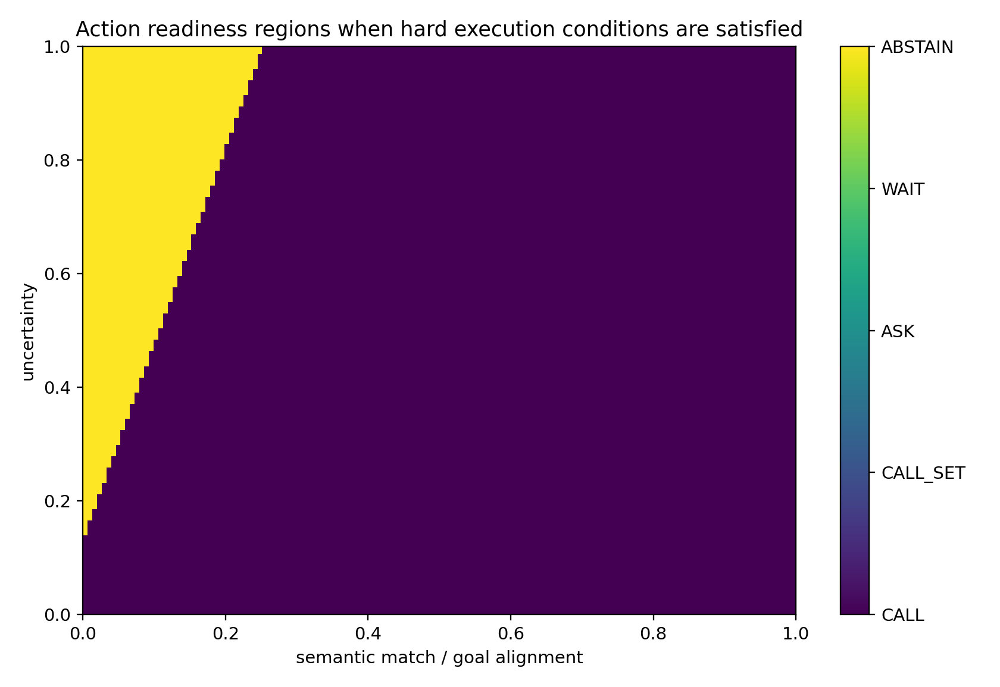
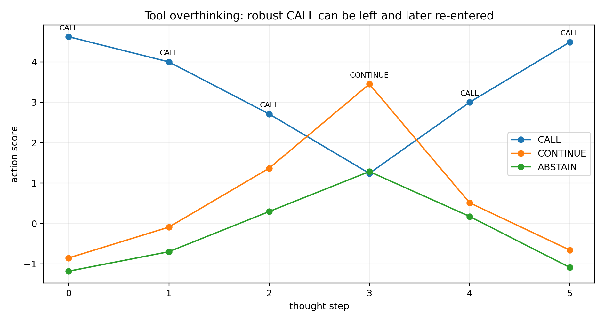
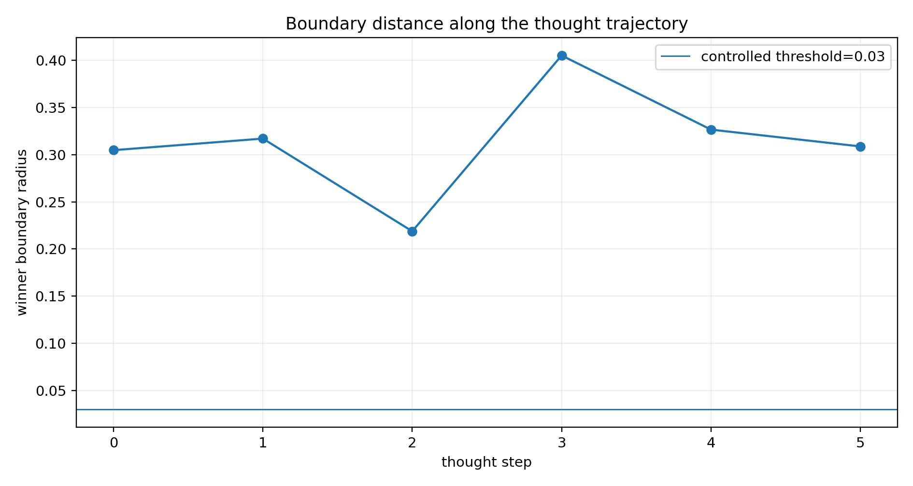
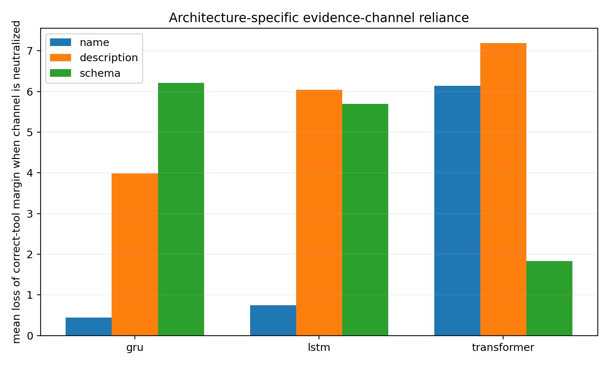
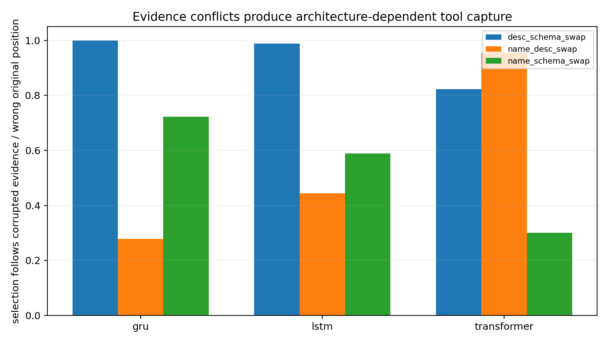
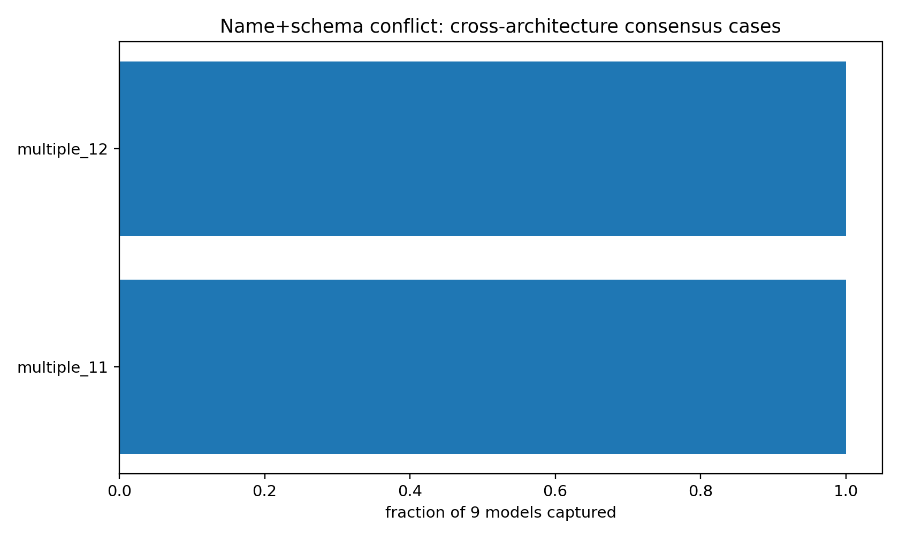
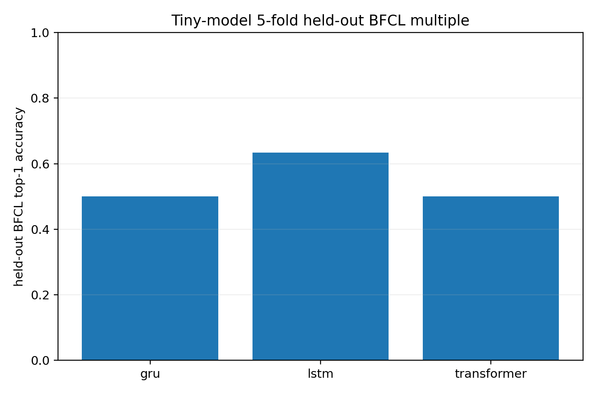
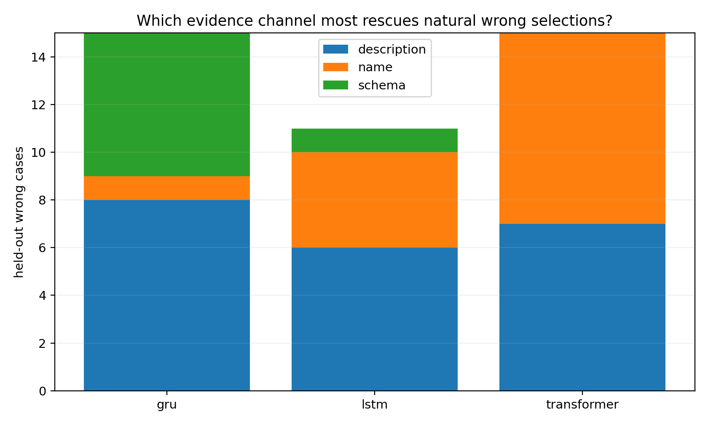
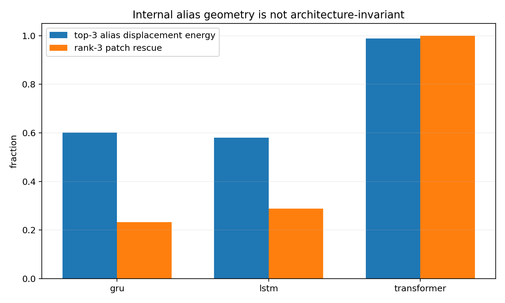

## 9 Action readiness geometry

Experiment TOOL-CALL-003 · Constructed seven-dimensional controller · 26 September 2026

This study implements CALL, CALL_SET, ASK, WAIT, ABSTAIN, and CONTINUE in a controlled action system. It connects the earlier stopping-set idea to tool interaction: an action can be preferred at one state, lose preference after a continuation step, and become preferred again. The numerical state variables and policy are specified by the construction.

### 9.1 Scores and admissible regions

For action $a$, the source defines a readiness margin against CONTINUE and other admissible actions. Its historical radius uses the gradient of the winning margin. The local audit in Section 11 refines the nearest-boundary calculation to compare every admissible competitor in the same score units and coordinates.

A region indexed by threshold $\tau$ combines an admissibility condition, a nonnegative action margin, and a chosen local radius criterion. In this construction, semantic-match, coverage, uncertainty, registry, binding, and environment variables determine the action scores and gates.

| BFCL case | Expected region | Observed region | Readiness margin | Radius | Robust |
| --- | --- | --- | --- | --- | --- |
| BFCL\_simple\_python\_0 | CALL | CALL | 1.5420 | 0.3060 | True |
| BFCL\_multiple\_1 | CALL | CALL | 1.5300 | 0.3036 | True |
| BFCL\_irrelevance\_0 | ABSTAIN | ABSTAIN | 0.2430 | 0.0354 | True |
| BFCL\_parallel\_multiple\_0 | CALL\_SET | CALL\_SET | 3.4600 | 0.6865 | True |
| BFCL\_multi\_turn\_miss\_param\_0 | ASK | ASK | 2.2920 | 0.4336 | True |
| BFCL\_multi\_turn\_miss\_func\_0 | WAIT | WAIT | 2.3800 | 0.4223 | True |

Source transcription: [Table 096](../evidence/source_tables/t096_ORIGINAL.csv).

All six canonical cases enter the region specified by the controller: simple and multiple selection map to CALL; irrelevance to ABSTAIN; the parallel request to CALL_SET; a missing parameter to ASK; and a missing function to WAIT. The table’s radii and `Robust` flags retain the original controlled-policy convention.

Figure 9.1. Action regions in the constructed semantic-match and uncertainty plane.

### 9.2 Finite boundary and structural interventions

The source moves each canonical state along its winner-to-runner boundary direction. All six selected pairwise transitions are observed at the predicted linear boundary, with the reported finite perturbation norms.

Source table 097 column group 1 of 2. Repeated leading fields identify the same rows.

| Case | before | runner\_before | Predicted pairwise radius | Finite perturbation norm | after |
| --- | --- | --- | --- | --- | --- |
| BFCL\_simple\_python\_0 | CALL | CALL\_SET | 0.3060 | 0.3060 | CALL\_SET |
| BFCL\_multiple\_1 | CALL | CALL\_SET | 0.3036 | 0.3036 | CALL\_SET |
| BFCL\_irrelevance\_0 | ABSTAIN | CALL | 0.0354 | 0.0354 | CALL |
| BFCL\_parallel\_multiple\_0 | CALL\_SET | CALL | 0.6865 | 0.6865 | CALL |
| BFCL\_multi\_turn\_miss\_param\_0 | ASK | CONTINUE | 0.4336 | 0.4336 | CONTINUE |
| BFCL\_multi\_turn\_miss\_func\_0 | WAIT | CONTINUE | 0.4223 | 0.4223 | CONTINUE |

Source table 097 column group 2 of 2. Repeated leading fields identify the same rows.

| Case | Flips to runner |
| --- | --- |
| BFCL\_simple\_python\_0 | True |
| BFCL\_multiple\_1 | True |
| BFCL\_irrelevance\_0 | True |
| BFCL\_parallel\_multiple\_0 | True |
| BFCL\_multi\_turn\_miss\_param\_0 | True |
| BFCL\_multi\_turn\_miss\_func\_0 | True |

Source transcription: [Table 097](../evidence/source_tables/t097_ORIGINAL.csv).

Five structural edits then change the expected action: remove or supply a required argument, add a missing function, replace an irrelevant tool with a relevant one, or remove the second parallel subgoal.

Source table 098 column group 1 of 2. Repeated leading fields identify the same rows.

| transition | before\_expected | before\_pred | after\_expected | after\_pred | before\_radius |
| --- | --- | --- | --- | --- | --- |
| simple\_missing\_height | CALL | CALL | ASK | ASK | 0.3060 |
| missing\_param\_clarified | ASK | ASK | CALL | CALL | 0.4336 |
| missing\_function\_added | WAIT | WAIT | CALL | CALL | 0.4223 |
| irrelevant\_tool\_replaced | ABSTAIN | ABSTAIN | CALL | CALL | 0.0354 |
| parallel\_second\_goal\_removed | CALL\_SET | CALL\_SET | CALL | CALL | 0.6865 |

Source table 098 column group 2 of 2. Repeated leading fields identify the same rows.

| transition | after\_radius |
| --- | --- |
| simple\_missing\_height | 0.5526 |
| missing\_param\_clarified | 0.3103 |
| missing\_function\_added | 0.3155 |
| irrelevant\_tool\_replaced | 0.3056 |
| parallel\_second\_goal\_removed | 0.3056 |

Source transcription: [Table 098](../evidence/source_tables/t098_ORIGINAL.csv).

These finite tests validate the specified controller’s boundary and gate calculations. The local audit additionally checks that a complete all-competitor radius and host-domain contract are used when interpreting a candidate for execution.

### 9.3 A constructed readiness exit and re-entry

Source table 099 column group 1 of 2. Repeated leading fields identify the same rows.

| step | winner | margin | radius | semantic\_match | coverage |
| --- | --- | --- | --- | --- | --- |
| 0 | CALL | 1.5360 | 0.3048 | 0.9300 | 1.0000 |
| 1 | CALL | 1.5980 | 0.3171 | 0.8200 | 0.8600 |
| 2 | CALL | 1.3430 | 0.2188 | 0.5800 | 0.5500 |
| 3 | CONTINUE | 2.1650 | 0.4052 | 0.3500 | 0.0500 |
| 4 | CALL | 1.6460 | 0.3266 | 0.5800 | 0.7000 |
| 5 | CALL | 1.5560 | 0.3087 | 0.9100 | 0.9600 |

Source table 099 column group 2 of 2. Repeated leading fields identify the same rows.

| step | uncertainty | call\_ready | Hard CALL admissible |
| --- | --- | --- | --- |
| 0 | 0.1200 | True | True |
| 1 | 0.3000 | True | True |
| 2 | 0.6200 | True | True |
| 3 | 1.0000 | False | True |
| 4 | 0.4500 | True | True |
| 5 | 0.1600 | True | True |

Source transcription: [Table 099](../evidence/source_tables/t099_ORIGINAL.csv).

Figure 9.2. The constructed trace enters CALL, moves to CONTINUE, and returns to CALL with the hard CALL domain held valid.

Figure 9.3. Historical local-radius values along the same trace.

The six-step example is CALL-ready at step 0, changes to CONTINUE at step 3, and returns to CALL at step 4. It is an executable witness that readiness can depend on the state path. A trace detector should evaluate a readiness exit relative to the immediately preceding applicable state and its unchanged hard domain. The source implementation’s persistent `ready_seen` flag is retained in the historical code and identified in the local audit.

### 9.4 Telemetry contract and current interpretation

Each decision snapshot should carry the model revision, checkpoint location, coordinate convention, score units, action IDs, finite scores, gradients, and host-supplied admissibility. Calibration should match these fields. Argument-level measurements have their own content-bearing decisions and readouts.

The historical script maps a predicted action to labels such as `EXECUTE`. In the integrated workflow, geometry supplies diagnostic output for the host. The reported local correction returns calibration and contract status; its external-action decision remains with the host execution interface. This preserves the distinction between a measured score boundary and the execution conditions of a real tool.

The controlled seven-dimensional study establishes action regions, selected finite boundary crossings, structural gate changes, and a readiness exit/re-entry path. The later pretrained and selector studies evaluate complementary behavior on actual model interfaces.

## 10 Semantic selection across architectures

Experiment TOOL-CALL-004 · Archived miniature-model experiment · 26 September 2026

The study examines semantic selection among tools whose documents are parseable and whose handles are available. It trains GRU, LSTM, and two-layer Transformer selectors with three initializations per architecture. The source reports a shared set of 30 BFCL multiple-function tasks, candidate organization, and pairwise ranking objective. In the fit-all condition, all nine models score 30/30.

### 10.1 Evidence-channel interventions

Each candidate supplies a name, a description, and a parameter-schema signature. Name-neutral input substitutes opaque IDs; description-neutral input supplies a neutral placeholder; schema-neutral input removes parameter-name evidence. The resulting score differences quantify sensitivity to these particular input interventions.

| Architecture | Name | Description | Schema |
| --- | --- | --- | --- |
| gru | 0.4390 | 3.9835 | 6.2090 |
| lstm | 0.7461 | 6.0365 | 5.6975 |
| transformer | 6.1415 | 7.1904 | 1.8292 |

Source transcription: [Table 108](../evidence/source_tables/t108_ORIGINAL.csv).

Figure 10.1. Mean correct-tool margin reduction after each evidence-channel neutralization in the archived miniature selectors.

The GRU has its largest mean margin loss under schema neutralization, approximately 6.21. The LSTM responds strongly to description and schema, approximately 6.04 and 5.70. The Transformer responds strongly to description and name, approximately 7.19 and 6.14, with schema approximately 1.83. These are architecture- and score-dependent measurements.

### 10.2 Constructed evidence conflicts

The experiment exchanges selected evidence channels between the correct candidate and a competing candidate, then reevaluates the original answer margin. Each conflict condition is a specified input intervention with an explicitly retained original task label.

| Architecture | variant | Wrong fraction | Mean margin |
| --- | --- | --- | --- |
| gru | desc\_schema\_swap | 1.0000 | -14.0665 |
| gru | name\_desc\_swap | 0.2778 | 4.3614 |
| gru | name\_schema\_swap | 0.7222 | -4.6141 |
| lstm | desc\_schema\_swap | 0.9889 | -14.1818 |
| lstm | name\_desc\_swap | 0.4444 | 0.8081 |
| lstm | name\_schema\_swap | 0.5889 | -0.9673 |
| transformer | desc\_schema\_swap | 0.8222 | -5.6748 |
| transformer | name\_desc\_swap | 0.9556 | -8.6211 |
| transformer | name\_schema\_swap | 0.3000 | 2.4196 |

Source transcription: [Table 110](../evidence/source_tables/t110_ORIGINAL.csv).

Figure 10.2. Selection effects of the three paired channel-swap constructions.

For the name-plus-schema swap, the reported error proportions are 72.22% for GRU, 58.89% for LSTM, and 30.00% for Transformer. The description stays at its original candidate position as the other two channels move. Cases `multiple_11` and `multiple_12` are among the examples with the same induced error across all nine models.

Figure 10.3. Cases with common selection changes under the same evidence conflict.

### 10.3 Held-out task results

Five-fold evaluation trains on 24 tasks and evaluates six held-out tasks per fold. The source reports the following mean accuracies.

| Architecture | Training accuracy | Held-out accuracy |
| --- | --- | --- |
| gru | 1.0000 | 0.5000 |
| lstm | 1.0000 | 0.6333 |
| transformer | 1.0000 | 0.5000 |

Source transcription: [Table 111](../evidence/source_tables/t111_ORIGINAL.csv).

Figure 10.4. Archived training and held-out accuracy for the miniature selectors.

The 41 architecture-by-case error records cover 25 distinct tasks. For each error, the recorded analysis selects the single neutralization channel producing the largest favorable change in the correct-versus-originally-selected margin. Twenty-five of the 41 margins become positive, or 60.98%. This is an outcome-informed pairwise diagnostic statistic. The current analysis checks first place among every candidate as a separate outcome.

Source table 112 column group 1 of 2. Repeated leading fields identify the same rows.

| Architecture | Case | Correct tool | Selected wrong tool | Correct minus selected margin | Best retrospective channel |
| --- | --- | --- | --- | --- | --- |
| gru | multiple\_2 | country\_info.capital | country\_info.largest\_city | -5.1629 | remove\_description |
| gru | multiple\_22 | sports\_data.basketball.most\_points\_single\_game | sports\_data.basketball.most\_points\_career | -2.1450 | remove\_description |
| lstm | multiple\_2 | country\_info.capital | country\_info.population | -0.3154 | remove\_name |
| lstm | multiple\_22 | sports\_data.basketball.most\_points\_single\_game | sports\_data.basketball.most\_points\_single\_season | -6.2944 | remove\_description |
| transformer | multiple\_2 | country\_info.capital | country\_info.largest\_city | -3.8296 | remove\_description |
| transformer | multiple\_22 | sports\_data.basketball.most\_points\_single\_game | sports\_data.basketball.most\_points\_single\_season | -2.0829 | remove\_description |
| gru | multiple\_23 | basketball.player\_stats.get | basketball.game\_stats.get | -5.4053 | remove\_schema |
| lstm | multiple\_23 | basketball.player\_stats.get | basketball.game\_stats.get | -7.0343 | remove\_description |
| transformer | multiple\_23 | basketball.player\_stats.get | basketball.game\_stats.get | -1.0359 | remove\_name |

Source table 112 column group 2 of 2. Repeated leading fields identify the same rows.

| Architecture | Case | Largest margin shift | Pairwise margin flips |
| --- | --- | --- | --- |
| gru | multiple\_2 | 4.4186 | False |
| gru | multiple\_22 | 3.6380 | True |
| lstm | multiple\_2 | 1.2940 | True |
| lstm | multiple\_22 | 6.4102 | True |
| transformer | multiple\_2 | 7.6741 | True |
| transformer | multiple\_22 | 1.8830 | False |
| gru | multiple\_23 | 14.4256 | True |
| lstm | multiple\_23 | 6.6965 | False |
| transformer | multiple\_23 | 1.2693 | True |

Source transcription: [Table 112](../evidence/source_tables/t112_ORIGINAL.csv).

| Architecture | Best retrospective channel | wrong\_cases |
| --- | --- | --- |
| gru | remove\_description | 8 |
| gru | remove\_name | 1 |
| gru | remove\_schema | 6 |
| lstm | remove\_description | 6 |
| lstm | remove\_name | 4 |
| lstm | remove\_schema | 1 |
| transformer | remove\_description | 7 |
| transformer | remove\_name | 8 |

Source transcription: [Table 113](../evidence/source_tables/t113_ORIGINAL.csv).

Figure 10.5. Best retrospective neutralization channel for the recorded error margins.

The same task can have different influential channels in different architectures. In `multiple_23`, the largest recorded margin change comes from schema removal in GRU, description removal in LSTM, and name removal in Transformer. These observations identify intervention sensitivity for those model–case pairs. Distinguishing natural mediators from other effective intervention directions requires further controlled comparisons.

### 10.4 Hidden displacement and functional fingerprints

| Architecture | Evidence condition | Alias stable rank | Top three energy | Conflict flip rate | Rank three patch rescue |
| --- | --- | --- | --- | --- | --- |
| gru | schema | 2.4945 | 0.6016 | 0.7222 | 0.2322 |
| lstm | description (clean surgery uses schema) | 2.5950 | 0.5798 | 0.5556 | 0.2885 |
| transformer | description (clean surgery uses name) | 1.2249 | 0.9892 | 0.1778 | 1.0000 |

Source transcription: [Table 114](../evidence/source_tables/t114_ORIGINAL.csv).

Figure 10.6. Hidden displacement spectra and rank-three patch response for the specified channel interventions.

The Transformer name-alias displacement has stable rank approximately 1.225 and top-three energy 98.92%, with mean rank-three patch rescue 100% in the reported condition. GRU and LSTM schema-alias conditions have stable ranks approximately 2.49 and 2.60, top-three energies approximately 60.16% and 57.98%, and patch rescue approximately 23.22% and 28.85%. The table’s intervention choices differ by architecture and are identified in its evidence column.

| metric | value |
| --- | --- |
| fingerprint within-architecture mean | 0.6700 |
| fingerprint cross-architecture mean | 0.1963 |
| gradient Gram within-architecture mean | -0.0284 |
| gradient Gram cross-architecture mean | -0.0036 |

Source transcription: [Table 115](../evidence/source_tables/t115_ORIGINAL.csv).

The mean response-fingerprint correlation is approximately 0.670 within architectures and 0.196 across architectures. The corresponding gradient-Gram correlations are approximately −0.0284 and −0.0036. Standardized input interventions provide a common comparison interface; raw hidden axes retain the model and coordinate system in which they were measured.

The source reports modest fit for additive channel models and partial improvement with pairwise interactions. This supports evaluating the full conditional response to each intervention instead of assuming that three fixed channel weights reconstruct every decision.

### 10.5 Current incident interface

A semantic incident records every candidate’s scores under full, name-neutral, description-neutral, and schema-neutral views. Candidate IDs are canonicalized separately from presentation order. A supplied correct ID contributes only to retrospective assessment. View changes are reported as input-intervention sensitivity, including ties and the first-ranked candidate in every view.

The cloud script is preserved with its original `flips_correct` field, which tests the original selected-versus-correct pair. The reported local replacement additionally checks the entire candidate set. Section 12 quantifies view agreement on the actual 135M interface, and Section 13 measures an independent request–tool scoring interface.

### 10.6 Evidence identity and subsequent model access

The archive includes summary tables, intervention records, geometry comparisons, and the cloud incident utility. The training implementation and neural selector checkpoints are referenced at the experiment level by the source record; the supplied cloud artifacts provide the reported measurements and the selected diagnostic utilities. Their availability is explicitly indexed.

The cloud record’s pretrained-model acquisition attempt established configuration and tokenizer access. The subsequent local campaign loaded and ran the fixed 135M weights and completed the measurements described next. Both stages retain their original execution identities.
