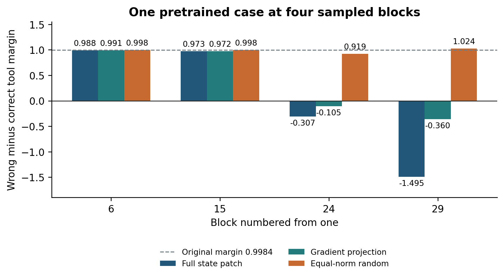

## 11 Local engineering audit and component corrections

Study MCD-ENGINEERING-20260926-001 · Reported local experiment and audit · 26 September 2026

The local campaign reviewed the full v0.5 engineering record, recalculated selected original tables, constructed component counterexamples, and ran a fixed pretrained instruction model. Its supplied report and README are preserved verbatim. The report references the audit scripts, machine-readable results, protocols, logs, and model-state telemetry individually; the release source map records their availability.

### 11.1 Audit of the nine cloud experiments

| Experiment | Local audit result | Scope carried into this edition |
| --- | --- | --- |
| WORD-SENSITIVITY-001 | Recomputed 44 finite-intervention rows; prediction–observation correlations approximately 0.999999794, 0.999999977, and 0.999999990; 43 valid Steer rows | Differential instrument closure for the specified GRU, teacher-forced trajectory, readout, and scale |
| WORD-SENSITIVITY-002 | Recomputed all six variance decompositions from 3,520 rows; Immediate Drive interaction 74.33% | Complete factorial response measurements on 352 related prefix states and ten tokens |
| TOKEN-OPERATOR-ATLAS-001 | Reexecuted 6,336 transitions from the packaged NPZ and apply function; maximum coordinate discrepancy approximately 5.55e−16 | Exact consistency of the recovered runtime and its saved atlas |
| REAL-WORLD-OPERATOR-FAILURES-001 | Checked the identity of the cited public sources and their problem settings | Public observations motivate the proposed operator assays |
| REAL-WORLD-OPERATOR-TELEMETRY-002 | Inspected hooks, locator behavior, and the saved self-check | The layer field is a sampled ranking; the onset field uses selected top-k tokens; `self-test` reads saved JSON |
| TOOL-CALL-001 | Constructed an example where a third candidate has the nearest tangent boundary | All-competitor minimum replaces the runner-up-only nearest-boundary interpretation |
| TOOL-CALL-002 | Exercised NaN, integer, and empty-call cases against the source validator | Validation is specified through the checks actually implemented and the named case inputs |
| TOOL-CALL-003 | Constructed a source output labeled EXECUTE with a false hard-call domain and no calibration | Diagnostic output and host execution authorization have separate contracts |
| TOOL-CALL-004 | Recalculated 25/41 retrospective pairwise recoveries and response-fingerprint correlations | Pairwise recovery, all-candidate first-place recovery, and a prospective policy have separate estimands |

The source review counted 2,732 paragraphs when including paragraph content throughout the Word structure. The document inventory in this release separately counts top-level paragraphs, tables, and figure placements. These counts describe different structural traversals.

### 11.2 Corrected radius contract

The reported `mcd.py radius` implementation takes the minimum tangent distance over all admissible competitors. The affine counterexample has scores [2, 1, 0] and gradients [0, 0.1, 100]. It yields a closest distance of 0.02, compared with 10 from the score runner-up. A finite displacement of 0.02001 selects the third candidate.

Inputs identify `model_revision`, `checkpoint`, `score_unit`, and `coordinate_system`. Each action supplies a unique ID, score, gradient, and explicit host-supplied admissibility. Gradients share a dimension. A calibration record carries the same identity fields, its sample count, and a warning floor. Matching calibration produces a diagnostic relative to that reference; absence of calibration produces `UNCALIBRATED`. Zero-gradient cases receive a first-order identifiability status. The output records `certified: false` for these local geometric estimates.

The component’s input contract requires finite scores and consistent coordinates. This makes comparisons reviewable and prevents a change of score units, model revision, or measurement location from silently inheriting a previous threshold.

### 11.3 Corrected domain contract

The reported `guard` interface accepts `registry`, `context`, and `proposal`. Registry entries contain a schema and required permissions. Trusted context supplies a snapshot ID, permission receipts, and precondition receipts. Parallel calls additionally require an independence declaration. The proposal specifies the same snapshot, a mode, and named calls with arguments.

The supported schema subset comprises explicitly typed closed objects, arrays with item specifications, strings, booleans, null, finite numbers, strict integers, enums, numerical bounds, and array-size bounds. Description text is annotation. Unsupported keywords and types produce an input rejection. The implementation distinguishes booleans from integers and treats `2.0` according to its actual JSON/Python numeric type.

The added checks cover unregistered handles, missing bindings, invalid and nonfinite values, extra fields, empty CALL, calls attached to a no-operation mode, duplicate calls, parallel conditions, permission receipts, precondition receipts, and snapshot mismatch. Host responsibilities include obtaining those receipts from the real environment and rechecking the relevant conditions at execution time. A positive component result means the submitted input satisfies this local contract.

### 11.4 Corrected incident contract

The reported `diagnose` interface requires a declared score unit and unique candidate IDs. Every candidate supplies finite `full`, `name_neutral`, `description_neutral`, and `schema_neutral` scores. It returns tied winners where appropriate and checks first place among every candidate in each view.

The audit constructs a case in which a correct candidate overtakes the original wrong candidate but a third candidate remains first. The historical pairwise `flips_correct` field is true in that construction; the corrected `correct_top1` field is false. Both facts can be retained without changing their definitions.

The supplied correct ID contributes to retrospective fields only. Missing views, nonfinite values, duplicate IDs, and inconsistent gradient dimensions are rejected by the relevant component contracts. The output calls the measured effect input-intervention sensitivity. The local report records 15 targeted component tests and the source counterexamples.

### 11.5 Execution record

The original local Word and ZIP were read by reference. The audit used ZIP-member paths and preserved the source identities. The source report documents two recovered execution issues: an initial Transformers output-type mismatch and an empty Steer field encountered by the CSV reader. The subsequent interface corrections preserve the stated scientific criteria.

The local component outputs are diagnostic records and contract checks. The completed campaign documents local instrumentation and its tests. The supplied README gives the host-machine entry points and the conditions for integrating those components.

## 12 Internal intervention in a pretrained model

Study MCD-ENGINEERING-20260926-001 · Reported local pretrained-model experiment

The local study loaded HuggingFaceTB/SmolLM2-135M-Instruct with 134,515,008 parameters, using MPS and float32. The pinned revision is `12fd25f77366fa6b3b4b768ec3050bf629380bac`. The model is evaluated here through a specified constrained candidate-selection interface. Its task behavior is measured directly.

### 12.1 Protocol and readout

The protocol was saved before generating new scores. Thirty fixed-version BFCL tasks, `multiple_0` through `multiple_29`, provide the initial task set. Cyclic candidate orders produce 78 order-specific records. Four evidence views and a query-replacement control produce 390 scored prefixes. The expected answer is reserved for evaluation.

Candidates are read through single-token labels A, B, and C to control label length. Thirty free continuations of at most eight tokens provide a separate check of the natural output. The local task ID range matches the earlier cloud study; the local campaign identifies its own downloaded input revision. The public benchmark supplies the evaluation task population.

### 12.2 Selection and behavioral controls

| Condition | Reported result |
| --- | ---: |
| Original-order full view correct | 12/30 |
| Name-neutral correct | 13/30 |
| Description-neutral correct | 12/30 |
| Schema-neutral correct | 11/30 |
| Always choose the first candidate | 13/30 |
| Expected correct count under per-task uniform random choice | 12/30 |
| Original errors recoverable to first place by at least one retrospective neutralization | 1/18 |
| Originally correct tasks changed to errors by at least one neutralization | 1/12 |
| Four-view agreement | 28/30 tasks; 11 correct among those 28 |
| Disagreement alerts | Two tasks: one original error and one original correct choice |
| Same canonical tool through every cyclic order | 0/30 |
| Choice changes after replacement by the next task’s query | 3/30 |
| Free continuation is exactly one valid candidate label | 5/30; two of those five correct |
| Median full-view probability assigned to all candidate labels | 21.75% |

These controls identify strong presentation and readout dependence under the tested interface. Four-view agreement selects a group with 39.3% accuracy. The agreement measurement and task correctness therefore retain separate records. An explicitly retrospective averaging of scores over canonicalized cyclic orders gives 6/30 correct selections; that analysis is recorded separately from the initial protocol.

The resulting engineering target is concrete: establish request-sensitive and order-consistent selection through an interface suited to the task. Section 13 tests that change directly.

### 12.3 The selected internal-intervention case

The selection rule permits at most the first four tasks whose full-view and name-neutral winners differ. Exactly one task qualifies: `multiple_23`. The request concerns player statistics. The full view selects `basketball.game_stats.get`; the name-neutral view selects `basketball.player_stats.get`, the benchmark’s correct tool.

At the final assistant decision-token position, the experiment measures block outputs and the margin gradient for the original wrong tool versus the correct alternative. It samples blocks 6, 15, 24, and 29, corresponding to zero-based indices 5, 14, 23, and 28. It compares a self patch, a full paired-state displacement, its gradient projection, and one equal-norm random-direction control per sampled block.

| Block numbered from one | Baseline wrong-minus-correct margin | Full state patch | Gradient projection | Equal-norm random control |
| --- | ---: | ---: | ---: | ---: |
| 6 | +0.9984 | +0.9884 | +0.9907 | +0.9980 |
| 15 | +0.9984 | +0.9733 | +0.9721 | +0.9979 |
| 24 | +0.9984 | −0.3073 | −0.1055 | +0.9193 |
| 29 | +0.9984 | −1.4946 | −0.3598 | +1.0239 |

Figure 12.1. Reported wrong-minus-correct margins in the local 135M case. Negative values favor the correct candidate in this pair; the source also checks all-candidate first place at the two reversing blocks.

The full-vector and gradient-projection interventions at blocks 24 and 29 restore the correct candidate to first place among all candidates. The self-patch maximum margin discrepancy is zero. All four sampled random controls preserve the original margin sign. The complete name-neutral input has margin −1.6491.

This is local evidence connecting an input-evidence change, an internal-state difference, and a finite intervention that changes an actual pretrained model’s tool choice. Its sampling unit is one selected case with four related state locations. The tested locations establish successful intervention sites; the source design samples four blocks at one functional token position.

### 12.4 Model and evidence identity

The supplied report names `PRETRAINED_PROTOCOL.md`, `pretrained_probe.py`, `pretrained_scores.jsonl`, `pretrained_assessment.json`, `patch_results.json`, `patch_states.npz`, and `acquisition.json` as the experiment records. The two supplied local documents establish the reported protocol and results; the file map identifies the referenced supporting records for archival.

Model weights remain identified by their official repository and pinned revision. The report’s acquisition information describes approximately 269 MB of weights in the host cache. The current collection records model identity alongside the experimental interface and score definitions.
