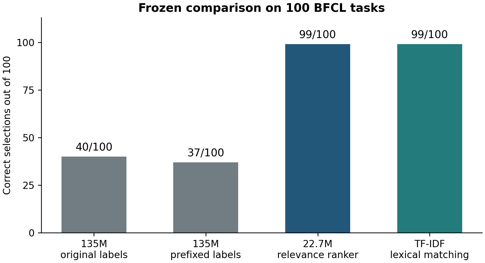
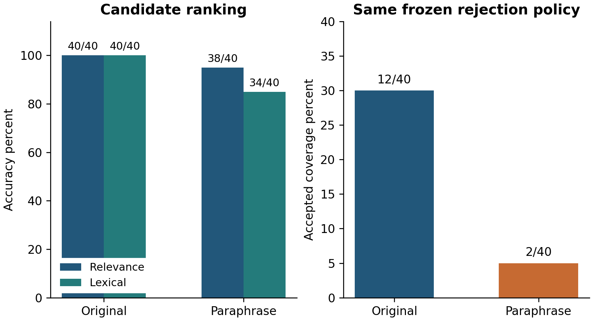

## 13 Comparing tool selection interfaces

Study MCD-SELECTION-20260926-002 · Reported local frozen comparison · 26 September 2026

This campaign compares three changes to the selection interface: different readouts of the same 135M instruction model, a pretrained text-relevance model, and a lexical matching baseline. It then freezes the final methods, calibrates a rejection policy on a separate task range, and evaluates 100 additional tasks.

The operational result is a request–capability scoring stage followed by canonical handle mapping. Argument binding and host execution conditions are evaluated after candidate selection. The model’s internal geometry remains available for investigating a measured decision.

### 13.1 Six development methods

The development tasks are the previously used `multiple_0` through `multiple_29`. The 135M model is tested with its original A/B/C readout, an explicit assistant label prefix, and independent Yes/No judgments of each tool. The relevance model is `cross-encoder/ms-marco-MiniLM-L6-v2`, with 22,713,601 parameters, trained for query–passage relevance. Its raw logits score query–tool pairs. A deterministic mapping returns the canonical function name.

The lexical baseline uses TF-IDF cosine similarity. Its IDF is fitted on candidate descriptions from the development tasks. The relevance model’s full input includes name, description, and schema; a description-only variant is also evaluated during development.

| Development method | Correct | Same canonical tool after candidate reversal |
| --- | ---: | ---: |
| 135M original A/B/C readout | 12/30 | 1/30 |
| 135M explicit label prefix | 13/30 | 1/30 |
| 135M independent Yes/No scoring | 8/30 | 30/30 |
| 22.7M relevance model with full tool document | 30/30 | 30/30 |
| 22.7M relevance model with description only | 29/30 | 30/30 |
| TF-IDF lexical matching | 28/30 | 30/30 |

Independent per-tool scoring removes candidate-list order from the scoring input by construction; reversal checks the implementation and canonical mapping. The Yes/No condition provides a clear separation between order consistency and semantic correctness. The cyclic-order statistic in the preceding study and the reversal statistic here use different transformations and denominators.

The frozen final comparison retains four methods: full-document relevance ranking, original-label readout, prefixed-label readout, and lexical matching. Tasks 30–59 supply calibration; tasks 60–159 supply the final comparison. The source identifies the frozen protocol before final scoring.

### 13.2 One hundred tasks outside development

| Frozen method | Correct selections |
| --- | ---: |
| 135M original-label readout | 40/100 |
| 135M prefixed-label readout | 37/100 |
| 22.7M relevance ranking | 99/100 |
| TF-IDF lexical matching | 99/100 |

Figure 13.1. Reported accuracy on the frozen 100-task BFCL comparison. Both relevance ranking and lexical matching reach 99/100.

The reported Wilson 95% interval for 99/100 is 94.55%–99.82%, interpreted descriptively under an independent-task assumption. Against the original-label readout, relevance ranking has 59 uniquely correct tasks and zero uniquely incorrect tasks, with an exact paired probability approximately $3.47\times10^{-18}$. This meets the prespecified criterion of at least ten percentage points improvement and a paired probability below .05. The lexical method has the same per-task correctness outcomes as the relevance ranker; their paired comparison gives $p=1$.

The benchmark tasks and templates have related structure, and the models are pretrained on publicly sourced material. The result describes these fixed methods and the stated public task ranges. The source reports no token truncation in the final comparison.

### 13.3 The task with no selected correct tool

Both methods fail to select the expected answer on `multiple_153`, a request for the date the Treaty of Lisbon was signed. The relevance model assigns all three candidates scores near −11 and, under forced ranking, selects an entropy-change tool. The lexical scores are all zero, so its tie handling returns no selection.

This case makes two output fields useful: the relative ranking among supplied candidates and evidence that a candidate fits the request at all. A selection system can retain an explicit no-match or abstention path when the available candidate set provides little support.

### 13.4 Request and position controls

The final tasks also receive predefined paired controls for relevance ranking and the prefixed 135M method.

| Control | 22.7M relevance ranking | 135M prefixed-label readout |
| --- | ---: | ---: |
| Same canonical tool after actual candidate reversal | 100/100 | 7/100 |
| Replacing the query with another candidate’s description selects that candidate | 100/100 | 61/100 |

The description-replacement condition is a constructed positive control for request–capability matching. It is reported separately from natural-task accuracy. All derived conditions retain the same base-task grouping.

### 13.5 Frozen abstention policy

Calibration uses the 30 original tasks in the 30–59 range and 30 derived conditions with the benchmark’s correct tool removed. The frozen thresholds are:

$$\mathrm{top\_score}\geq3.2334132,$$

and, for more than one candidate,

$$\mathrm{top1}-\mathrm{top2}\geq1.3862090.$$

The single-candidate case uses the absolute-score condition. Calibration accepts 13 of the 60 conditions: 12 correct and one incorrect. This satisfies the campaign’s stated empirical error threshold of at most 10% and minimum acceptance count of ten.

Applied unchanged to the final tasks, the policy accepts 38/100 original requests, with 38 correct selections in that accepted set. It abstains on all 100 conditions obtained by removing the benchmark-correct tool. Of the 99 original requests ranked correctly, 61 are also rejected.

| Evaluation group | Accepted | Correct among accepted | Coverage |
| --- | ---: | ---: | ---: |
| Thirty calibration originals and thirty derived removals | 13/60 | 12/13 | 21.67% |
| One hundred final original tasks | 38/100 | 38/38 | 38% |
| One hundred final gold-removal conditions | 0/100 | Not applicable | 0% |

The measured policy is a conservative candidate filter for these conditions. The gold-removal conditions are defined relative to the benchmark’s expected tool. Accepted-set accuracy and coverage are reported together so that abstention has an explicit operational cost.

### 13.6 Selector component and reproducibility record

The supplied README describes `selector.py` as supporting independent neural or lexical scores, canonical-name mapping, ties, empty candidate sets, optional calibration, and invalid-value rejection. It records ten local contract tests. The default output is ranking-only. A matching explicit policy can produce `CANDIDATE_FOR_BINDING` or `ABSTAIN_UNCERTAIN`; the output includes `executes_tools: false`.

The pinned relevance-model revision is `233902d25c440f23af6f7d6e94d2946bac0bee0a`. The source describes approximately 91 MB of newly downloaded weights, float32 MPS with CPU fallback, four CPU threads, local-files-only loading, and disabled remote code. The previously acquired 135M model and BFCL inputs are reused.

The development execution has two original segments. A cache-API incompatibility occurs after 180 completed records; the continuation finishes the remaining 180 records and preserves the original segment identities. `dev_segments.json` records that relationship. The final protocol, scores, summaries, controls, policy, and CLI logs are referenced in the availability map.

Timing uses a separate warmed, sequential ten-development-task measurement. The main scoring and control processes briefly shared MPS; their timing fields retain that execution condition. The supplied documents provide the timing-study identity, and the referenced `sequential_timing.json` carries the detailed values.

## 14 Paraphrase stress and coverage drift

Study MCD-SEMANTIC-STRESS-20260926-003 · Reported separately registered follow-up

The 100-task result motivates a new question: how do the methods respond when requests preserve meaning but share fewer surface words with the tool documents? The follow-up uses the previously unused range `multiple_160` through `multiple_199`. Forty paraphrases are written from the queries without viewing candidate tools or expected answers, then frozen before comparing the two methods.

| Input condition | Relevance ranking | Lexical matching |
| --- | ---: | ---: |
| Forty original requests | 40/40 | 40/40 |
| Forty paraphrased requests | 38/40 | 34/40 |

Mean content-word overlap between the query and the expected tool document decreases from 53.99% to 21.75%. Relevance ranking retains four more correct selections in this set, with reported exact paired $p=.125$. The measured difference supplies a concrete effect to investigate on further task material. It is retained as a separate follow-up from the earlier frozen 100-task comparison.

The parent abstention thresholds accept 12 of the 40 original requests and two of the 40 paraphrases. Every accepted choice is correct in each condition. Coverage therefore changes from 30% to 5% under the wording intervention.

Figure 14.1. Reported ranking accuracy and frozen-policy coverage under the forty paired paraphrases. Both quantities are retained in the comparison.

This study establishes a measurable coverage shift under reduced lexical overlap. The thresholds are carried forward unchanged. The parent report supplies the follow-up design and aggregate results; it references a separate child report for the detailed record.

### 14.1 Engineering use supported by these comparisons

For standardized English requests and a small tool vocabulary with shared terminology, the lexical baseline provides a directly supported starting point: it matches the neural ranker on the 100-task set. An explicit tie/no-match outcome is part of that interface.

For varied wording, independent query–tool relevance scoring has a measured 38/40 result on the paraphrase set, compared with 34/40 for lexical matching. The current engineering choice can therefore consider this observed wording sensitivity alongside model cost, candidate-document design, and task-specific calibration.

The complete interaction sequence is request–capability scoring, candidate selection or abstention, argument binding, host permission and environment checks, execution, and outcome verification. A semantically relevant candidate with missing arguments proceeds to clarification. A request with no suitable candidate proceeds to the no-match path.
