# How Language Models Reach an Answer

Data-Oriented Modelling · Chapter 3, Report 02 · Cross-listed in Chapter 2, Report 02

English publication edition 1.0 · 29 September 2026 · Experiments 021–028A

## Executive summary

This study constructs and tests a control-based account of reasoning. Its central object is a changing working state: language history and environment observations shape the next action, technical objects supply the action's content, and continuation changes which answers and subsequent actions are reachable. Across 18 experiments, the report connects a statistical language surrogate, models of recorded coding-agent utterances, protected training in a small recurrent system, and a hierarchy for recovering answer readiness. This provides a concrete way to examine chain-of-thought: ask what each continuation does to the state, when an answer becomes available, and which intervention restores useful progress.

The training experiments identify a compact set of functionally important protection directions. In the tested 16-parameter recurrent system, two anchors selected from 31-value future-response signatures preserve all mapped correct prefixes at total update scale 0.05 while retaining approximately twice the new-task loss reduction of full-prefix protection. The inference experiments assemble prevention, bounded traversal and state reconstruction. Applied to 125 observed correct-to-wrong exit opportunities, the hierarchy assigns 15 to preventive bypass, 108 to local recovery and 2 to reconstruction, with successful readiness recovery for all 125. The corresponding 60-event held-out foundation subset also recovers all 60 events. These are conditional results in an explicitly labelled, controlled reasoning task.

The recorded-agent analysis adds an operational counterpart. Among 300 strong-loop decision states from eight Qwen trajectories, local candidate availability rises from 131 to 178 states as search width increases from 2 to 8. Same-task external work-state pools supply an unseen command for all 300 states. Task-phase rules allocate the primary roles as 112 Edit, 113 Test and 75 Submit. These measurements establish candidate coverage and phase eligibility in trajectory replay. Together, the experiments support a sequential controller that checks completion, uses bounded local control, broadens the candidate pool when needed, and verifies the result of an executed intervention.

## Reading guide and connection to the earlier chapters

Chapter 2 studies how generative states move and how their future outputs respond to intervention. Chapter 3's first report studies training history, predictive-state geometry, chain-of-thought states and stopping. The present report connects those two lines through an explicit control problem: constructing the working state, preserving answer readiness during learning, and recovering it during execution. The earlier research report and its Engineer's Edition remain the two companion editions of Chapter 3, Report 01.

The experimental identifiers are retained as source identities. Their numbers identify this study's local series; the full experiment name distinguishes them from similarly numbered experiments in the preceding report. Four parts give the reading order:

| Part | Experiments | Reader's question | Evidence object |
| --- | --- | --- | --- |
| I. Construct the agent state | 021–025 | How do history, observation, action and concrete objects produce the next utterance? | Statistical language dynamics and task-held-out models of recorded agent behaviour |
| II. Protect answer readiness during training | 026A–026G | Which training changes preserve useful answer states while new material is learned? | Archived history fields and interventions in a controlled 16-parameter recurrent system |
| III. Recover answer readiness during inference | 027A–027E | When should the system stop, bypass, traverse, reconstruct or apply a rescue impulse? | State-action probes and aligned exit events in the same recurrent system |
| IV. Route recorded agent work | 028A, with ASTIG support | How do bounded search, candidate availability and task phase select an eligible action? | Offline analysis of recorded mini-SWE-agent trajectories |

Parts II and III address different stages of a model's life: training changes the response geometry; inference control acts within the resulting geometry. Their order is therefore conceptual as well as experimental. Readers primarily interested in agent operation can read the definitions, Part III, Part IV and the integrated controller first, then return to the construction and training studies.

The [evidence index](EVIDENCE_INDEX.md) links every experiment to its tables, code and figures. The [figure catalogue](FIGURES.md) includes all 78 supplied research figures. The [source and reproduction guide](SOURCE_AVAILABILITY.md) describes the available recalculation and source-dependent routes.

## Measurement definitions

**Answer readiness** is defined by a specified readout. In the controlled experiments, the immediate `ANSWER` request is applied at a prefix and evaluated against the known correct answer. A positive gold-signed margin places the prefix in the measured correct set. Protection means preserving correctness on this mapped set. Endpoint accuracy evaluates the model's answer at its generated endpoint; the two measures can differ because subsequent training can change the generated trajectory.

**Observable probes** use requested answers and their margins under standardized short control sequences. The synthetic evaluator supplies the gold answer needed to sign the margin. Thus these probes give an experimentally observable control signal while retaining a task-specific correctness reference. Applying the same idea to open-ended agent work requires a separately specified verifier, such as reproducible tests or another externally checked task criterion.

**Chain-of-thought and working language** have two operational meanings here. In the recurrent task they are generated route and code tokens with an explicit transition system. In the recorded-agent studies, `THOUGHT` denotes visible text saved in the trajectory. It is an observation channel for language and action modelling; the study's measurements do not expose a provider's private internal computation.

**Recorded-agent phase** is an action-history classification. In ASTIG-013C, `POST_EDIT_VALIDATED` means that an edit is followed by a recognised verification action and there is no active failed-test state under the recorded rule. Verification actions include inspect/execute/test categories. `Submitted` is a recorded termination status. These labels describe the supplied traces; independent benchmark acceptance is a separate outcome.

| Term | Meaning in this report |
| --- | --- |
| CoT | Chain-of-thought; operationalized by the controlled token chain or recorded visible working text, as specified above |
| Predictive state | A representation of the future-response distribution conditional on the current history |
| JS divergence | Jensen–Shannon divergence; the language-surrogate figures use bits, with smaller values indicating closer distributions |
| NLL | Negative log likelihood; text comparisons use the matching tokenization and evaluation within each experiment |
| MSE / RMS | Mean squared error / root mean square difference, in the coordinate system or response units specified by the experiment |
| Stable rank | Squared Frobenius norm divided by squared largest singular value; a dimensionless concentration measure |
| SVD / PCA | Singular value decomposition / principal component analysis |
| d95 | Number of ranked directions required to explain 95% of the specified squared singular-value energy |
| MRR | Mean reciprocal rank of the relevant object under the reported candidate-ranking assay |
| Readiness skeleton | A small selected set of correct prefixes used to constrain later training updates |
| Risk edge | A tested state-action transition from a currently correct prefix to an incorrect immediate-answer state |
| L0 | Training-time shaping and readiness protection |
| L1 | Prevention of a risky transition when continued work is required |
| L2a / L2b | Bounded local traversal / expansion to an additional candidate-action pool |
| L3 | Reconstruction of the working context, preserving validated information while removing the selected history residue |
| L4 | Append-only rescue control with immediate verification and a fixed attempt cap |
| ASTIG | Identifier of the supporting recorded-agent diagnostic series supplied with this study |

### Denominators and comparison rules

The 17 recurrent foundations are the qualified subset of 24 attempted initializations; each qualified foundation answers all four foundation questions correctly. Many later experiments reuse these same foundations and exit events. Their repeated measurements form a connected intervention series. State and edge counts describe conditional observations within those foundations, not additional independent models. Training summaries generally average per-foundation metrics; the report retains the supplied aggregation rather than treating every prefix as an independent replication.

For agent utterances, whole-task holdout separates the fitted task from its evaluation task. Experiment 022 pools 545 action states over three model-labelled collections, while 023–025 use 124 GPT-5-mini states. The baseline NLL changes with tokenization and evaluation between experiments. Read gains against the matched baseline within each experiment. The recorded-agent routing cohort uses 300 strong-loop states; its 430-state Submitted control set and 20-trajectory phase-calibration set have distinct roles.

### Two controller distinctions

First, STOP is checked before prevention. If task completion is valid, the answer-ready state is an opportunity to finish. L1 is relevant when work must continue. The integrated 15/108/2/0 routing count includes preventive opportunities before an exit; an evaluation started strictly after all exits yields the separate 123/2 traversal/reconstruction count.

Second, expanding the pool of candidate commands is L2b. L3 changes the working state through reconstruction. The distinction follows the operation performed. The supplied machine-readable 028A tables retain field names containing `external_L3`; the [field interpretation](SOURCE_AVAILABILITY.md#field-interpretation) maps those fields to L2b without changing their values.


## Part I. Constructing the agent state

The first five experiments separate predictive language dynamics, observation-conditioned action choice, operational language and the technical objects carried into the next utterance.

<a id="experiment-021"></a>

### 021. Predictive language dynamics

Experiment identifier: `LANGUAGE-DYNAMICAL-SURROGATE-021`.

#### Experimental object

A fresh technical-language corpus was reconstructed from the locally installed Go HTML documentation after HTML stripping.

- Corpus: **432,030 characters**
- Word/punctuation stream: **100,760 tokens**
- Predictive vocabulary: **128 states**
- Predictive context states: **6,419**
- Unique weighted state-action-state transitions: **26,516**
- Supported word/punctuation actions: **120**
- Evaluation split: deterministic held-out source-context identities

The predictive state is the measured future next-token distribution, Hellinger transformed and embedded into a shared coordinate system.

#### Executed surrogate

For visible action `a_t` and predictive state `z_t`:

`z_(t+1) = A_(a_t) z_t + b_(a_t)`

and

`P(next | z_t) = Decode(z_t)`.

Thus the surrogate is recursively executable: a language action selects a state-dependent operator, the operator moves predictive state, and the new state defines the next future-response distribution.

#### 1. The approximately three-dimensional dominant movement core replicates

In the **10-dimensional predictive-state representation**, the independently recomputed one-token movement field has:

- stable rank: **3.009**
- top-3 movement energy: **61.03%**
- d95: **9**

This recovers the earlier geometry: the dominant local movement is approximately three-dimensional, while faithful movement retains a longer residual tail.

#### 2. Full predictive state is broader than the movement core

Held-out future-response JS divergence improves as the represented state expands:

- D=3: **0.4095 bits**
- D=10: **0.3643 bits**
- D=16: **0.3431 bits**
- D=24: **0.3266 bits**

At D=24, the state-dependent surrogate reduces state MSE by **14.58%** relative to a token-specific reset and matches the teacher's modal future token on **61.69%** of weighted held-out transitions.

The measured language object therefore separates into a compact dominant movement core plus a broader predictive state carrying finer future distinctions.

#### 3. State dependence matters inside the low-dimensional control core

At D=10, the leading three control directions contain **61.03%** of measured movement energy.

- 3D fixed token control: JS **0.4767 bits**
- 3D state-dependent control: JS **0.4317 bits**

State dependence reduces JS by **9.44%** within the same three-dimensional control subspace.

Using the complete 10D movement basis reaches JS **0.3641 bits**, quantifying the predictive contribution of the residual tail.

#### 4. The operator family is reusable rather than one unrelated map per word

In the D=24 surrogate:

- one mean operator: JS **0.4615 bits**
- 32 reusable operator modes: JS **0.3554 bits**
- full token-specific surrogate: JS **0.3266 bits**

The 32-mode operator basis contains **74.31%** of operator-family energy and recovers **78.67%** of the held-out JS improvement from the mean-operator system to the full surrogate.

#### 5. Recursive prediction survives multi-step propagation

Starting from 5,000 held-out source states, the D=24 surrogate was rolled forward with the observed sequence of language actions without resetting to measured intermediate states:

- 1 step: JS **0.3239**, modal-future match **61.42%**
- 4 steps: JS **0.3052**, modal-future match **65.06%**
- 8 steps: JS **0.2971**, modal-future match **66.24%**

This verifies recursive state propagation rather than isolated endpoint fitting.

#### 6. Closed-loop surface-generation check

A second character-level surrogate was built on the same corpus with a 64-character vocabulary covering **99.00%** of corpus characters. A 24D character predictive state captures **92.45%** of train-state PCA energy and can run autonomously for hundreds of generated characters. Its samples preserve technical-English orthographic and local syntactic texture, providing a direct closed-loop check that the state/operator system can generate its own subsequent actions.

#### First-stage mathematical object

The executed approximation is:

`x_t = Psi(history_t)`

`x_(t+1) = T_(a_t)(x_t)`

`P(next | x_t) = Decode(x_t)`

with the measured decomposition:

`broad predictive state + ~3D dominant movement core + residual movement tail + reusable state-dependent operator family`.

The measured surrogate supplies an executable predictive state and action-conditioned transition system.

#### Measurement note

The 3.009 stable-rank result is conditional on the 10-dimensional representation. The supplied movement table gives stable rank 4.487 at D=24 and 6.062 at D=64. These values describe concentration within the chosen representation. Multi-step rollout follows observed actions, while autonomous character generation is a separate assay. The generated character samples demonstrate recursive execution and local texture; they also contain malformed words.

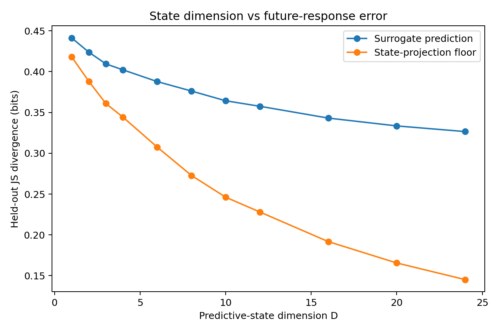

**Figure 1. Predictive-state dimension and future-response fidelity.** Held-out word/punctuation transitions from the Go-documentation surrogate. Curves give JS divergence in bits for the fitted surrogate and the representation floor, by state dimension D. Smaller values indicate closer future distributions. Source: dimension_performance.csv. No uncertainty intervals are displayed.

[Experiment 021 evidence](evidence/experiments/021) · [Full figure catalogue](FIGURES.md)

<a id="experiment-022"></a>

### 022. Observation-conditioned action and the next utterance

Experiment identifier: `AGENT-NEXT-UTTERANCE-022`.

#### Experimental question
Can a mathematical language surrogate be extended into an agent next-utterance model by combining a language-history prior with the currently observed environment and an empirically derived action loss?

#### Real trajectory data
The experiment used 10 matched SWE-bench SymPy tasks for each of three models in the public SWE-Xplorer / mini-SWE-agent trajectory collection:

- GPT-5-mini
- DeepSeek-v4-flash
- Qwen-2.5-7B

Every state is taken from a real assistant → shell → assistant loop. The current shell return is the observation `o_t`; the previous agent language/history is `h_t`; the next executed bash command is mapped into the action family `a_t`.

Across the three models, **545 held-out action states** were analyzed with whole-task leave-out evaluation.

#### 1. Language prior
The first factor is the language/history prior

`P_L(a_t | h_t)`.

A bag-of-language-history estimator was trained only on the other nine tasks.

Weighted pooled held-out next-action accuracy:

**37.43%**

#### 2. Observation field
A separate estimator used only the current environment observation:

`P_O(a_t | o_t)`.

Weighted pooled held-out accuracy:

**56.88%**

This is substantially higher than the language-history prior. The shell observation therefore carries strong information about the next action class.

#### 3. Empirical observation-conditioned loss
Define the effective local action loss as

`Q_obs(a | o) = -log P_O(a | o)`.

The agent policy is then

`P_A(a | h,o) ∝ P_L(a | h)^alpha * exp(-beta * Q_obs(a | o))`.

`alpha` and `beta` were selected inside each outer whole-task holdout using only the remaining tasks.

Weighted pooled coefficients:

- alpha ≈ **0.089**
- beta ≈ **0.161**

The observation/loss term receives the larger coefficient in this first fitted system.

Weighted pooled probability results:

- language-history NLL: **8.696**
- observation NLL: **5.132**
- combined agent-energy NLL: **3.201**

The calibrated agent-energy model raises the mean probability assigned to the action actually taken by **0.109** absolute probability relative to the raw language prior.

Top-1 accuracy is **50.64%** for the calibrated product model versus **56.88%** for the observation-only classifier. Thus the main gain of the current multiplicative form is probabilistic calibration and suppression of catastrophic language-prior errors; the observation field remains the strongest standalone top-1 selector.

#### 4. Comparison with a remaining-distance objective
A separate candidate loss used the empirical normalized number of steps remaining until task completion:

`Q_distance(a,o) = E[remaining steps | o,a]`.

Nested held-out fitting selected **beta = 0** on GPT-5-mini. Moreover, the predicted remaining-distance value of the actually selected action was **0.483**, versus **0.320** averaged over alternatives.

The real local choice process therefore does not behave like a greedy optimizer of immediate remaining trajectory length. This removes a tempting but inaccurate simplification from the agent model.

#### 5. What the next utterance looks like
The emitted agent turn was factorized as

`P(y_t | h_t,o_t) = P(a_t | h_t,o_t) * P(r_t, ell_t, words_t | a_t, model, scaffold, o_t)`,

where `r_t` is a coarse THOUGHT rhetorical frame and `ell_t` is a length class.

Across **423 turns with parsable THOUGHT text**:

- frame prediction from action alone: **66.19%**
- frame prediction after adding observation signature: **61.23%**
- length-bin prediction from action alone: **70.45%**
- length-bin prediction with observation: **69.98%**

The observation strongly changes *which action* becomes likely, while the coarse wording frame and length are already largely determined by action identity plus model/scaffold style. In the present data, adding the raw observation signature does not improve this coarse surface-form prediction.

#### 6. First fitted agent next-utterance model

The current empirical approximation is:

`x_t = Psi(language history)`

`o_t = Omega(environment return)`

`Q_obs(a|o_t) = -log P_hat(a|o_t)`

`P_A(a|x_t,o_t) ∝ P_L(a|x_t)^alpha exp[-beta Q_obs(a|o_t)]`

`r_t, ell_t ~ P_surface(. | a_t, model, scaffold)`

`y_t ~ P_words(. | r_t, ell_t, a_t, x_t, o_t)`

The first four lines are measured in 022. Experiments 023–025 evaluate lexical realization after the agent action/utterance state has been selected.

#### Interpretation
The executed data support a two-stage separation:

1. **Agent decision geometry:** environment observation sharply rotates the distribution over allowable/likely next actions.
2. **Surface realization geometry:** once the action is selected, the scaffold and model-specific language habits dominate coarse THOUGHT framing and length.

This makes the next utterance a controlled language trajectory rather than an unconstrained continuation.

#### Measurement note

The outcome is agreement with the next action recorded in the source trajectory. It is a behaviour-prediction measure. The 545 action states and 423 surface-text states have separate denominators, and the reported model-pooled estimates use state-count weights.

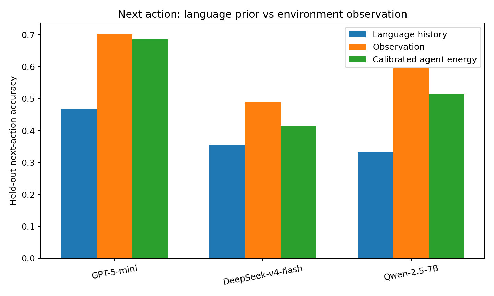

**Figure 2. Predicting the recorded next action.** Whole-task holdout over 545 states from three model-labelled trajectory collections. Bars compare language-history, observation-only and calibrated combined classifiers; height is top-1 agreement with the recorded action. Source: model_summary.csv. No uncertainty intervals are displayed.

[Experiment 022 evidence](evidence/experiments/022) · [Full figure catalogue](FIGURES.md)

<a id="experiment-023"></a>

### 023. Generating action-shaped language

Experiment identifier: `AGENT-SPEAKING-SURROGATE-023`.

#### Question

The preceding experiments supplied two separate pieces:

1. `LANGUAGE-DYNAMICAL-SURROGATE-021` — a recursively executable language-state/operator model;
2. `AGENT-NEXT-UTTERANCE-022` — an observation-conditioned action policy.

Experiment 023 asks whether these pieces can be composed into a model that produces an actual agent-like next utterance.

#### Data

The experiment uses the same 10 held-out SymPy SWE-bench tasks under GPT-5-mini in the public SWE-Xplorer / mini-SWE-agent trajectories. The scaffold exposes clean `SEARCH / READ / EDIT / TEST / SUBMIT` labels. Each retained state contains:

- prior language/task history `h_t`;
- current shell observation `o_t`;
- actual agent action `a_t`;
- actual next THOUGHT text `y_t`.

There are **124 real agent states**.

#### 1. Action controller

The action stage reuses the fitted form from 022:

`P_A(a | h,o) ∝ P_L(a | h)^alpha exp[-beta Q_obs(a|o)]`

with the GPT-5-mini coefficients from the previous experiment.

Held-out next-action accuracy in this rerun is:

**68.55%**

#### 2. Language base plus agent control residual

The surface generator is not a hand-written template. It uses a pooled empirical language transition model and adds three local control terms:

```text
log P_agent(w_(j+1)) = log P_L(w_(j+1) | w_(j-1), w_j)
                         + lambda_a R_a(w_(j+1))
                         + lambda_h I[w_(j+1) in K_history]
                         + lambda_o I[w_(j+1) in K_observation]
                         - log Z
```

where:

- `P_L` is the free language continuation field;
- `R_a` is the empirically learned lexical residual associated with the selected action;
- `K_history` contains current task/history content words;
- `K_observation` contains words exposed by the current shell return.

The fitted average control weights are:

- action residual: **0.75**
- history grounding: **1.00**
- observation grounding: **0.50**

This is the explicit implementation of the intended composition:

`language motion + agent action control + observed-world grounding`.

#### 3. The model now produces action-shaped language

Free-language generations are classified as expressing the intended selected action only **37.90%** of the time.

After agent control:

**76.61%**

an increase of **38.71 percentage points**.

Thus the agent control state materially changes the kind of utterance emitted by the language surrogate.

#### 4. Grounding also moves in the intended direction

Among nontrivial content words in generated text, the fraction grounded in the current task/history or observation rises from:

**20.48% → 27.69%**

a relative increase of **35.2%**.

Held-out NLL on tokens that belong to the current history/observation content field improves from:

**11.215 → 10.987**

or about **2.03%**.

The generator therefore begins to say more about the task currently in front of it rather than only reproducing generic agent prose.

#### 5. Loss decomposition across content and language shell

Whole-utterance held-out NLL is:

- free language: **8.736**
- end-to-end controlled: **8.753**

The language-shell subset moves from:

- **7.986 → 8.071**

while grounded content improves.

With the true action supplied instead of the predicted action, full NLL is **8.728**, only slightly better than free language.

This decomposition is informative. The action/history/observation controls successfully rotate semantic function and grounding, while applying the same control directly to every word slightly disturbs the already well-learned surface-language shell.

#### 6. Resulting mathematical decomposition

The data now support separating the next utterance into two coupled objects:

`a_t ~ P_A(a | h_t,o_t)`

`c_t ~ P_content(. | h_t,o_t,a_t)`

`s_t ~ P_shell(. | a_t, model, scaffold)`

`y_t = Compose(s_t,c_t)`

rather than forcing one token-level energy to simultaneously optimize action identity, task grounding and fluent surface realization.

Equivalently:

`next utterance = agent control shell + task/observation content slots`.

#### 7. What the surrogate actually says

For a held-out READ state in `sympy__sympy-15017`, the uncontrolled surrogate drifts into unrelated technical material about `autowrap`, `TensorProduct` and other tasks.

Under agent control the same generator produces:

> “my previous response attempted two actions at once; i'll read the sympy/codegen/ast.py file around relevant methods.”

The exact file reference can still be wrong, but the emitted utterance has moved into the correct **READ-like operational basin**, and its content is more strongly recruited from current working context.

The surrogate produces visible agent-style working language, complementing the action-class and future-state predictions.

#### Relation to shell-slot modelling

The measured trade-off motivates separate estimates of `P(shell | action, scaffold)` and `P(content slots | history, observation, action)`. Experiment 024 evaluates that factorization, measuring action consistency, grounding and whole-utterance NLL against a matched free-language baseline.

#### Measurement note

The free and controlled examples are outputs of the authored surrogate. The publication includes those generated samples and their task/action labels. The original provider-transcript column is outside the distributed evidence. The action-accuracy reruns in 023, 024 and 025 use their reported constructions and are retained separately.

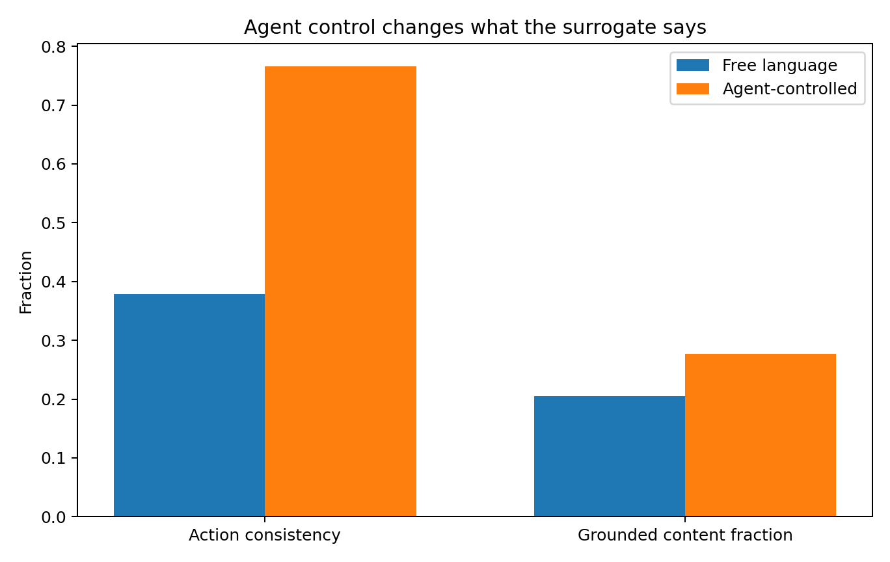

**Figure 3. Action identity and grounding in generated utterances.** The 124-state GPT-5-mini study compares free surrogate generation with action/history/observation control. Bars show generated action consistency and the grounded-content fraction. These are generation diagnostics. Sources: generation_behavior.csv and summary.json. No uncertainty intervals are displayed.

[Experiment 023 evidence](evidence/experiments/023) · [Full figure catalogue](FIGURES.md)

<a id="experiment-024"></a>

### 024. Separating the language shell and grounded slots

Experiment identifier: `AGENT-SHELL-SLOT-024`.

#### Question

`AGENT-SPEAKING-SURROGATE-023` showed that uniform token-level steering can strongly rotate generated language toward the selected agent action and current task content, but the same steering slightly perturbs the already competent language shell.

Experiment 024 therefore implements the factorization suggested directly by that error decomposition:

`next utterance = control shell + grounded content slots`.

The test uses the same 10 held-out SymPy SWE-bench trajectories from GPT-5-mini, comprising **124 real agent states**.

#### 1. Shell-slot construction

Every actual THOUGHT is decomposed into two objects.

The **shell** contains ordinary operational language and preserves the local word-transition dynamics:

`P_shell(s_(j+1) | s_(j-1), s_j, action)`.

The **slot layer** contains technical objects that are visibly available in current task/history or shell observation.

The first broad version allowed PATH, SYMBOL, VALUE and rare grounded TERM slots.

The generated sentence is:

`y = FillSlots(shell, content)`.

The shell and slot probabilities therefore remain separate rather than applying one observation/action bias to every token.

#### 2. The split immediately strengthens action identity and grounding

In the broad shell-slot generator:

- generated action consistency: **96.77%**
- generated grounded-content fraction: **36.04%**

For comparison, experiment 023's uniform steering produced:

- action consistency: **76.61%**
- grounded-content fraction: **27.69%**

Thus the structural split increases action consistency by **20.16 percentage points** and grounding by **8.35 percentage points**.

The shell itself has held-out NLL **9.737**, slightly below the matched free-language NLL **9.793**. The fluent operational shell is therefore preserved once content control is removed from ordinary words.

#### 3. The remaining error localizes to slot selection

The broad slot selector has held-out slot NLL:

**4.510**

This dominates the remaining full-sentence cost. The first broad shell-slot model therefore reaches full oracle-action NLL **10.068**, above the free-language baseline **9.793**, despite the improved shell.

This localizes the remaining problem: the architecture no longer needs stronger global language steering; it needs a more precise pointer over concrete technical objects.

#### 4. High-confidence pointer refinement

A second pass restricts copying to high-confidence technical object classes:

- PATH
- SYMBOL
- VALUE

Generic rare words are no longer automatically promoted to slots.

The pointer is additionally made recency-sensitive. The selected fold-stable scoring weights are:

- history presence: **0.5**
- observation presence: **1.0**
- history recency: **1.0**
- observation recency: **3.0**
- action-conditioned object prior: **0.25**

The strongest term is therefore **recent appearance in the current environment observation**.

#### 5. Pointer cost falls by almost half

With high-confidence slotting plus recency:

- broad slot NLL: **4.510**
- refined slot NLL: **2.466**

Reduction:

**45.33%**

The full oracle-action NLL becomes:

**9.887**

against free language:

**9.793**

The remaining pooled gap is only:

**0.093 nats/token**

and **5/10 held-out tasks** already obtain lower full NLL than the free-language baseline.

#### 6. Updated agent utterance equation

The measurements now support the following decomposition:

`a_t ~ P_agent(a | h_t, o_t)`

`s_t ~ P_shell(s | a_t, scaffold, language state)`

`c_t ~ P_pointer(c | h_t, o_t, a_t, recency)`

`y_t = Compose(s_t, c_t)`

The pointer itself is approximately:

```text
log P_pointer(c) =
  λ_hp I[c in history]
+ λ_op I[c in observation]
+ λ_hr Recency_history(c)
+ λ_or Recency_observation(c)
+ λ_a ActionPrior(c)
- log Z`.
```

In the fitted system, `λ_or` is the largest term.

#### 7. Experimental interpretation

The executed results now separate three different geometries in an agent utterance:

1. **Decision geometry** selects the operational action from language history and environment observation.
2. **Shell geometry** realizes that action in stable agent working language.
3. **Pointer geometry** injects the concrete files, symbols, values and other current-world objects.

The important correction from experiment 023 is that environment observations should not steer every output token equally. Their strongest direct role is to supply and rank the **objects being talked about**.

The broad shell-slot model already makes generated language much more action-consistent and grounded. The recency refinement then cuts slot-selection loss by **45.33%**, leaving only a small pooled full-NLL gap and producing task-level wins in half of the held-out tasks.

#### Relation to object-field modelling

The remaining 0.093 nats/token gap localizes the modelling question to technical-object selection. Experiment 025 evaluates a learned observation-to-object field through the sequence `observation -> object candidates -> object relevance -> slot`, while retaining the shell-slot composition.

#### Measurement note

The refined full-NLL gap is 0.0934338715 nats/token in the supplied summary; the displayed component values are rounded independently. Compare this experiment with its own baseline, since 025 recomputes tokenization and evaluation.

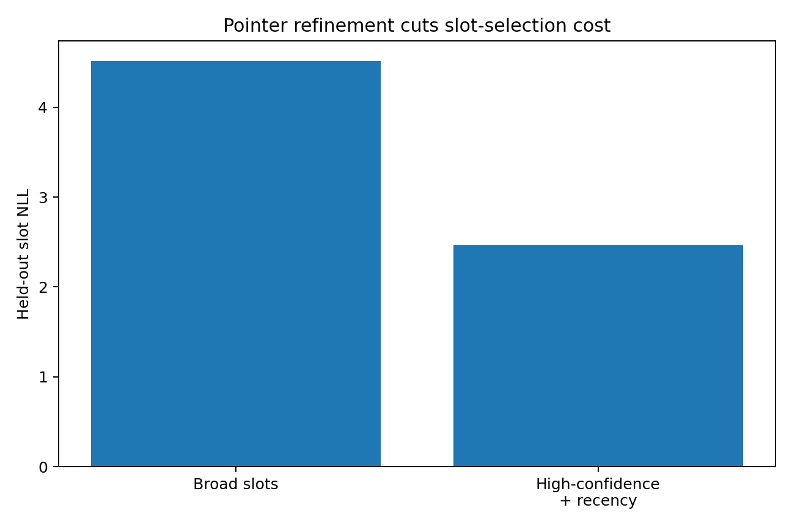

**Figure 4. Refining technical-object slots.** In the 124-state shell-slot study, the broad and refined selectors are compared by held-out slot NLL. Smaller values indicate lower predictive loss. Source: stage_summary.csv and summary.json. No uncertainty intervals are displayed.

[Experiment 024 evidence](evidence/experiments/024) · [Full figure catalogue](FIGURES.md)

<a id="experiment-025"></a>

### 025. A persistent working-object field

Experiment identifier: `AGENT-OBJECT-FIELD-025`.

#### Question

Experiments 021–024 progressively separated language dynamics, agent action selection, the operational language shell and grounded content slots. Experiment 025 targets the remaining narrow problem:

> Among all technical objects currently available to the agent, which object is most likely to be recruited into the next utterance?

The test uses the same 10 GPT-5-mini SymPy SWE-bench trajectories and 124 real agent states.

#### 1. Object candidates

High-confidence technical objects are extracted as:

- PATH
- SYMBOL
- VALUE

Sources are kept separate:

- original task description;
- previous THOUGHT;
- previous executed command;
- current environment observation.

A technical object is positive when it is rementioned in the actual next THOUGHT.

Across the 124 states:

- technical object mentions in next THOUGHTs: **203**
- retrievable from the available task/work/observation field: **164**
- retrievable fraction: **80.79%**

Thus most technical content in the next utterance is recoverable from the currently available world/work state.

#### 2. Source anatomy

Among the 164 retrievable rementioned objects:

- task only: **32**
- previous THOUGHT only: **23**
- previous command only: **0**
- current observation only: **13**
- present in multiple sources: **96**

The dominant case is therefore not “copy the newest observation token.” Most reused objects already belong to a multi-source working state.

#### 3. Baselines

Whole-task held-out object ranking gives:

**Table 1. Experiment 025.**

| Method | Top-1 | Top-3 | MRR | Cross-entropy |
|---|---:|---:|---:|---:|
| Observation recency | 14.29% | 29.76% | 0.243 | 3.557 |
| Observation frequency | 26.19% | 35.71% | 0.346 | 3.335 |
| History recency | 20.24% | 53.57% | 0.429 | 3.063 |
| Observation/history presence | 36.90% | 46.43% | 0.438 | 3.398 |
| **Fitted object field** | **36.56%** | **72.04%** | **0.555** | **2.282** |

*Table note.* Task-held-out object ranking. Top-1 and Top-3 are success percentages; MRR and cross-entropy are reported in their source units. The fitted pointer has 93 eligible states; see the evaluation-set note below for the simple baselines.
The main improvement is not merely top-1 selection. The fitted field places the true object inside a compact high-probability candidate set much more reliably.

#### 4. Fitted object field

A whole-task held-out soft pointer converges to approximately:

```text
score(c) = 0.50 Task(c)
         + 1.10 PreviousThought(c)
         + 0.74 PreviousCommand(c)
         + 0.80 Observation(c)
```

with softmax temperature approximately **0.50**.

The largest source coefficient belongs to the **previous THOUGHT**, not the raw observation.

This corrects the provisional interpretation from 024. Observation recency was useful when source roles were collapsed into one pool. Once source identity is modeled explicitly, the stronger structure is a persistent **working-object field** spanning task state, previous language and the environment return.

#### 5. Probability-level result

Across 93 held-out states containing at least one retrievable positive object:

- Top-1: **36.56%**
- Top-3: **72.04%**
- MRR: **0.555**
- positive probability mass: **22.55%**
- pointer cross-entropy: **2.282**
- mean technical candidates per eligible state: **67.7**

The pointer therefore compresses a broad technical candidate field into a much narrower future-object distribution.

#### 6. Reconnection to the language shell

The 025 object field was reinserted into the 024 shell-slot model.

Under the same recomputed tokenization/evaluation:

- free-language full NLL: **10.739**
- shell + object field with true action: **9.793**

The object-bound language model therefore beats the matched free-language baseline by approximately:

**0.946 nats/token**

with the true action supplied.

#### 7. Fully end-to-end test

The true action is then removed and replaced by the observation-conditioned action controller from 022.

Results:

- held-out action accuracy: **65.32%**
- free-language NLL: **10.739**
- full end-to-end NLL: **10.198**
- improvement: **0.541 nats/token**
- held-out tasks beating free language: **9 / 10**
- end-to-end slot NLL: **2.241**

Thus the complete chain remains advantageous without oracle access to the true next action.

#### 8. Current mathematical agent

The executed system is now:

`x_t = Psi(language/work history)`

`a_t ~ P_action(a | x_t, o_t)`

`c_t ~ P_object(c | task, previous thought, previous command, observation)`

`s_t ~ P_shell(s | a_t, scaffold)`

`y_t = Compose(s_t, c_t)`

The system therefore maps a real observed world state into an action, binds that action to concrete objects, and realizes the result as visible agent working language.

#### 9. Main experimental interpretation

The measured next-utterance model separates action selection, object recruitment and language realization.

The measured decomposition is:

1. **Observation-conditioned action selection** decides what operational move is currently licensed.
2. **Working-object field** decides which concrete object is carried forward.
3. **Language shell dynamics** realizes the move in stable agent prose.

The object field is persistent across multiple sources. Raw observation is important, but the previous THOUGHT carries the largest fitted source weight, and most rementioned objects are simultaneously represented in more than one source.

The current evidence therefore supports a dynamic working-state model rather than a simple “read the latest tool output and respond” mechanism.

#### Measurement note

The fitted pointer is evaluated over 93 eligible states. Under a per-state success interpretation, the simple-baseline percentages are compatible with 84 states (for example, 12/84 = 14.29%), whereas the accompanying tables do not explicitly state their denominator. This is a numerical inference, and the exact baseline evaluation set remains unspecified. The cross-method table is preserved with this qualification. The end-to-end 9/10 task result is independently recoverable from the per-task table.

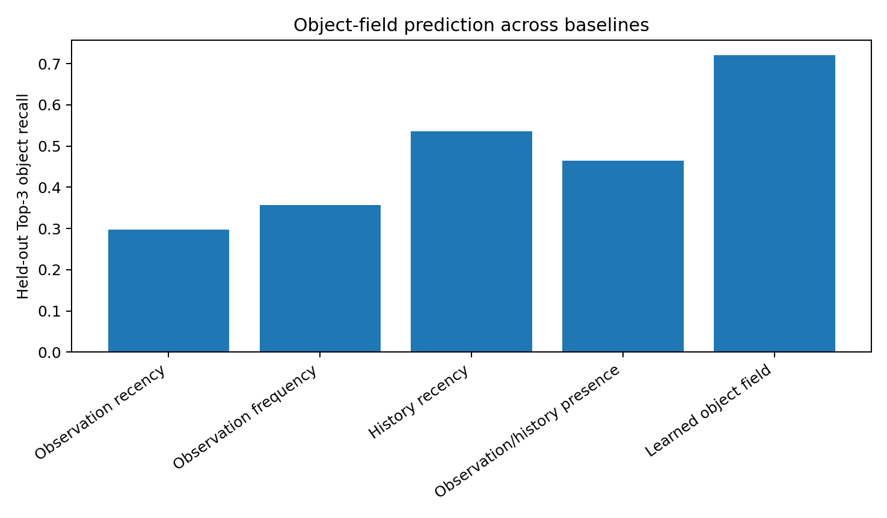

**Figure 5. Object-field candidate ranking.** Bars show held-out Top-3 success for the supplied object-ranking methods. The fitted pointer uses 93 eligible states; the baseline denominator issue is stated in the measurement note. Source: object_field_methods.csv. No uncertainty intervals are displayed.

[Experiment 025 evidence](evidence/experiments/025) · [Full figure catalogue](FIGURES.md)

## Part II. Protecting answer readiness during training

The training series separates effects of curriculum order from the shared update direction, then measures full, sparse, observable and low-rank protection in a controlled recurrent task.

<a id="experiment-026a"></a>

### 026A. Training-order structure and symmetrization

Experiment identifier: `REASONING-CURRICULUM-026A`.

#### Experimental question

The first defense against unstable reasoning should occur during training. The immediate question is whether measured training-order effects are structured enough to be cancelled by curriculum design.

The experiment reuses the fully enumerated HISTORY-ALGEBRA-012 intervention set: a fixed training multiset of four groups A–D, all 24 possible orderings, and a common 112-dimensional Prompt→CoT→Answer control-field fingerprint measured after training.

#### Pairwise history algebra at the main setting

At eta=0.002, a regression on the six antisymmetric pair-order coordinates AB, AC, AD, BC, BD and CD explains **98.7921%** of the centered history-conditioned control-field energy.

The leading history effect is therefore overwhelmingly pairwise and antisymmetric in this regime.

#### Reverse-history symmetrization

Each history H was paired with its exact reverse H^-1.

Mean distance of the original measured histories from the global control-field center:

**0.18805**

Mean distance of the reverse-pair field midpoints:

**0.01892**

This removes **89.94%** of the measured history displacement.

A 20,000-draw random-pairing control gives mean midpoint distance 0.11146; its 1st percentile is 0.05937. The observed reverse-pair midpoint is 0.01892, with Monte-Carlo p < 5e-5.

This directly supports the premise that whole-history reversal cancels the dominant antisymmetric order component.

#### Pair conflicts are heterogeneous

Adjacent swap effects were measured over all six surrounding-history contexts.

**Table 2. Experiment 026A.**

| pair | mean field displacement | context CV |
|---|---:|---:|
| AB | 0.3304 | 0.112 |
| BD | 0.0896 | 0.451 |
| BC | 0.0561 | 0.295 |
| AD | 0.0406 | 0.409 |
| AC | 0.0322 | 0.018 |
| CD | 0.0121 | 0.175 |

*Table note.* Descriptive swap effects in the archived 112-dimensional control-field representation. Displacement uses those coordinates; CV is dimensionless and summarizes surrounding-history variation.
AB is a strong, relatively context-stable noncommuting pair. AC is smaller but almost perfectly context-stable. BD and AD are substantially more context-dependent, indicating stronger higher-order interactions.

This yields an empirical triage:

- **large effect + low context CV** → pairwise/symmetric scheduling is an appropriate first intervention;
- **large effect + high context CV** → the conflict depends on surrounding history; pairwise ordering alone is insufficient;
- **persistent degradation after order symmetrization** → diagnose first-order incompatibility or insufficient representation capacity rather than continuing to rearrange the curriculum.

#### Update-scale boundary

The learning-rate hierarchy audit provides a measured regime boundary.

From eta=0.0005 through eta=0.006, pairwise order coordinates explain at least 95.2% of history-conditioned field energy and all curricula retain one common natural CoT/answer signature.

At eta=0.012, pairwise explained energy collapses to 28.0% and four natural CoT signatures appear.

Thus curriculum symmetrization is theoretically justified only while the history algebra remains dominated by low-order antisymmetric modes. Beyond that point the design must either reduce update scale or explicitly model higher-order curriculum motifs.

#### Current Layer-0 design rule

For every candidate pair of training blocks i,j, measure:

`C_ij = mean control-field displacement caused by adjacent i<->j exchange`

and

`V_ij = context coefficient of variation of that exchange effect`.

Curriculum handling is then conditional:

- high C_ij / low V_ij: symmetric or palindromic scheduling;
- high C_ij / high V_ij: estimate three-way and higher-order history terms;
- order-independent destructive gradients: constrained/protected updates rather than reordering.

#### Evidence scope

The reversal midpoint is an empirical symmetrization proxy computed from already-trained histories. It measures cancellation at the control-field level. Experiment 026B separately trains matched blocked, interleaved and coupled-update schedules in a newly specified recurrent harness.

#### Measurement note

The 24 histories and 112-dimensional fingerprints refer to the archived HISTORY-ALGEBRA-012 system discussed in Chapter 3, Report 01. The reversal table permits recalculation of the reduction in displacement. The supplied Monte Carlo p value is 0.0000499975, consistent with the report’s p < 5e-5. No new randomization draw is introduced in this edition.

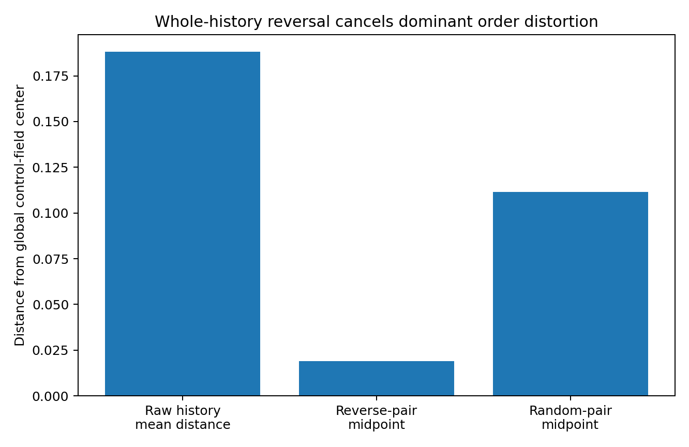

**Figure 6. Reverse-history control-field symmetrization.** The archived 24-history study compares mean distance to the common 112-dimensional field centre for raw histories, reverse-pair midpoints and a random-pairing reference. Smaller distance indicates closer alignment with the centre. Sources: reversal_symmetrization.csv and summary.json. No uncertainty intervals are displayed.

[Experiment 026A evidence](evidence/experiments/026A) · [Full figure catalogue](FIGURES.md)

<a id="experiment-026b"></a>

### 026B. Fine interleaving and shared update effects

Experiment identifier: `REASONING-CURRICULUM-026B`.

#### Question

Experiment 026A showed that reverse-history symmetrization cancels most of the measured antisymmetric history-control displacement in the archived four-group system. 026B asks the intervention question directly:

> If two training groups are delivered in progressively smaller alternating blocks, does the trained model approach the order-free combined update, and does that necessarily improve answer-readiness topology?

#### New controlled harness

Because the original HISTORY-ALGEBRA-012 execution script is not present in the public evidence package, this is a **new matched controlled experiment**, not a claimed reproduction of the original numerical model.

Architecture:

- 2D tanh recurrent state;
- fixed 4D token inputs;
- trainable W(2x2), U(2x4), b(2), v(2);
- exactly **16 trainable parameters**.

Task:

- four two-bit questions 00, 01, 10, 11;
- two valid chain variants per question;
- route bit r in {0,1};
- code bit c = first_question_bit XOR r;
- final answer = c XOR r = first_question_bit.

The foundation is trained symmetrically on all 8 records. Twenty-four initializations are attempted; **17** achieve 4/4 correct final answers and enter the curriculum intervention.

Diagnostic pair:

- A = question 00;
- B = question 01.

Every curriculum receives exactly total update mass eta from A and eta from B.

#### Curricula

Blocked histories:

`A(eta) -> B(eta)` and `B(eta) -> A(eta)`.

Fine alternating histories:

`[A(eta/n) -> B(eta/n)] x n`

and the reversed form, with n = 1, 2, 4, 8, 16.

Order-free reference:

32 small steps of the simultaneous gradient field

`g_A(theta) + g_B(theta)`.

#### Readiness measurement

For each of the four questions the trained model self-generates route and code tokens. At successive states we request an immediate answer and record whether it is correct.

The trajectory contains:

- prompt end;
- route marker;
- generated route bit;
- code marker;
- generated code bit;
- four subsequent blank-control steps.

Metrics include first-ready depth, number of connected correct components, correct/incorrect flips, exits from correctness, longest correct run, total readiness fraction and an early-weighted readiness score.

#### Result 1 — fine interleaving removes most block-order damage

At eta = 0.002:

- blocked AB/BA mean final accuracy: **91.91%**
- 16-way micro-interleaving: **97.79%**
- order-free coupled flow: **98.53%**

Thus fine interleaving recovers **88.89%** of the endpoint penalty attributable to blocked ordering.

At eta = 0.01 the corresponding recovery is **100%**, and at eta = 0.02 it is **77.78%**.

The parameter-space result agrees. At eta = 0.002, mean blocked distance to the order-free coupled trajectory is about **0.0256**, while 16-way interleaving reduces it to **0.00027**.

This is a direct training intervention: smaller alternating blocks suppress the order-specific component rather than merely averaging already-trained models.

#### Result 2 — removing order harm does not guarantee better readiness

The order-free combined update itself can damage readiness relative to the qualified foundation.

Mean readiness-fraction change under the coupled update is:

- eta=0.002: **-0.0065**
- eta=0.005: **-0.0229**
- eta=0.010: **-0.0507**
- eta=0.020: **-0.0474**
- eta=0.050: **-0.1193**

Fine interleaving converges toward this same shared behavior.

Therefore curriculum symmetrization solves only the antisymmetric/noncommuting component. If the common first-order direction `g_A + g_B` itself moves the model out of favorable readiness geometry, reordering cannot fix the problem.

#### Result 3 — Layer 0 needs a diagnostic split

The experiment now supports a concrete separation:

`observed degradation = shared update harm + order-specific harm + higher-order residual`.

Fine interleaving targets **order-specific harm**.

Protected-update control targets **shared update harm** by preserving already-good readiness states during subsequent updates.

This gives an empirical decision rule:

1. Compare blocked AB/BA against a fine interleaved or coupled reference.
2. If interleaving recovers the loss, the problem is predominantly order-sensitive.
3. If the order-free reference is itself harmful, stop rearranging the curriculum and move to a protected-update constraint.
4. If fine interleaving fails to converge toward the coupled reference as block size shrinks, higher-order/nonlocal history effects dominate.

#### Main conclusion

**Curriculum engineering is necessary but not sufficient.**

In a low-order noncommuting regime, shrinking training blocks can nearly remove the effect of order. But the model can still lose answer-readiness because both training groups share a destructive first-order direction.

Experiment 026C evaluates protection of high-readiness states while learning B, measuring retention and new-task learning together.

#### Measurement note

The reported order-recovery fraction compares blocked schedules with the coupled reference using the same per-group update exposure. Fine interleaving is evaluated in a new 16-parameter harness. The supplied file named as a reproduction script contains comments only; the included run-level and summary tables support numerical recalculation.

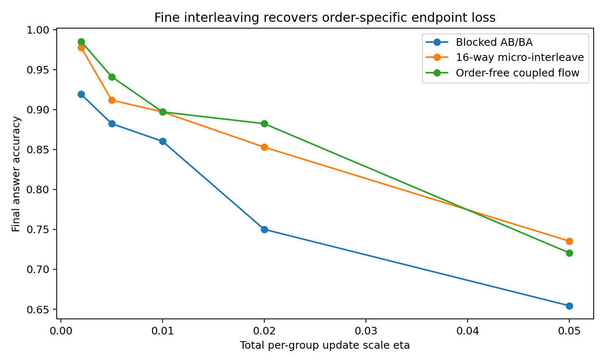

**Figure 7. Endpoint accuracy under different curricula.** The 17 qualified controlled foundations receive matched per-group update exposure. Curves show mean final-answer accuracy for blocked schedules, 16-way micro-interleaving and the coupled reference against total update scale eta. Source: curriculum_summary_by_eta.csv. No uncertainty intervals are displayed.

[Experiment 026B evidence](evidence/experiments/026B) · [Full figure catalogue](FIGURES.md)

<a id="experiment-026c"></a>

### 026C. Protecting existing answer-ready prefixes

Experiment identifier: `REASONING-PROTECTED-UPDATE-026C`.

#### Experimental question

Experiments 026A–026B separated two sources of curriculum damage:

1. **order-specific harm**, which can be reduced by fine interleaving;
2. **shared update harm**, where the order-free combined learning direction itself degrades answer-readiness.

026C tests the next intervention:

> Once a model already contains correct answer-ready prefixes, can later training be constrained so that those prefixes remain correct while the new training block still learns?

#### Controlled harness

The experiment uses the same new 16-parameter controlled recurrent harness introduced in 026B:

- 2D tanh recurrent state;
- fixed 4D token input;
- 16 trainable parameters;
- four two-bit questions;
- two legal chain variants per question.

Of 24 initializations, **17** foundations achieve 4/4 final-answer correctness and enter the experiment.

The target update is group **B=(0,1)**.

#### Protected readiness set

For every qualified foundation, its self-generated reasoning trajectory is expanded through prompt, route, code and four subsequent blank-control steps.

At each prefix, the common immediate `ANSWER` token is applied. Any prefix with positive gold-signed answer margin is placed into the protected set.

The mean protected set contains:

**24.0 correct prefixes per model.**

This is the object that later training is not allowed to punch through.

#### Update rules

Three stable methods are compared using the same total B-update mass and **100 microsteps**:

**Plain SGD**

`delta = -eta * grad L_B`.

**Hard boundary protection**

The raw B step is cyclically projected onto the half-spaces defined by the lower-margin half of the protected prefixes:

`grad M_i · delta >= 0`.

**Hard all-prefix protection**

The same half-space constraint is imposed for every protected prefix.

A softer penalty version was also screened in the first pass. Under the tested coefficient it was inferior and was not retained as the primary stability comparison.

#### Mechanism: B learning directly conflicts with the protected readiness field

At the qualified foundations:

- mean protected prefixes: **24.0**
- mean rank of the protected-margin gradient matrix: **15.65 / 16**
- fraction of protected prefixes harmed by the raw B descent direction: **56.59%**

Thus the constraint field is nearly full-rank. The problem is not one isolated fragile token.

After projecting the B update against all protected half-spaces:

- cosine with the original B update direction: **0.259**
- update norm retained: **46.46%**
- first-order B-learning effect retained: **23.22910100822549139820694%**
- minimum protected-margin directional derivative becomes non-negative on average.

The projection therefore does **not** merely freeze the model. It strongly rotates and attenuates the update into the narrow part of parameter space that can still improve B without locally damaging the protected correct states.

#### Stable result at total eta = 0.02

Using 100 microsteps:

**Table 3. Experiment 026C.**

| method | B loss reduction | protected survival | final answer accuracy | readiness-fraction change |
|---|---:|---:|---:|---:|
| Plain SGD | 0.0575 | 95.12% | 94.12% | -0.0049 |
| Boundary protection | 0.0137 | 100.00% | 97.06% | +0.0033 |
| All-prefix protection | 0.0134 | **100.00%** | **100.00%** | **+0.0033** |

*Table note.* Controlled 16-parameter system, 17 qualified foundations and 100 microsteps. B-loss reduction is before minus after, so positive values indicate learning; survival and endpoint accuracy are percentages. Readiness change is an absolute fraction change.
Plain SGD learns B faster but already deletes part of the previously correct readiness set.

Hard all-prefix protection preserves **100%** of the mapped correct prefixes, keeps final-answer accuracy at **100%**, and still decreases B loss.

#### Stronger update: eta = 0.05

The difference widens.

**Table 4. Experiment 026C.**

| method | B loss reduction | protected survival | final answer accuracy | readiness-fraction change |
|---|---:|---:|---:|---:|
| Plain SGD | 0.0573 | 89.40% | 85.29% | -0.0180 |
| Boundary protection | 0.0251 | 100.00% | 94.12% | -0.0049 |
| All-prefix protection | 0.0254 | **100.00%** | **95.59%** | **-0.0049** |

*Table note.* Controlled 16-parameter system, 17 qualified foundations and 100 microsteps. B-loss reduction is before minus after, so positive values indicate learning; survival and endpoint accuracy are percentages. Readiness change is an absolute fraction change.
Plain SGD now preserves only about **89.4%** of previously correct prefixes and lowers final accuracy to about **85.3%**.

The all-prefix protected update preserves **100%** of those prefixes and retains about **95.6%** final accuracy while continuing to lower the B training loss.

#### What 026C establishes

The Layer-0/Layer-1 decision tree is now experimentally separated.

**Case A — order harm**

If fine interleaving approaches the order-free reference and repairs performance, manipulate curriculum order/block size.

**Case B — shared destructive update**

If the order-free direction itself damages readiness, reordering is insufficient. Protect the already-mapped correct prefixes by constraining the update direction.

The present experiment shows that this second intervention is feasible in a controlled system even when the readiness-gradient constraints span almost the entire parameter space.

#### Important design consequence

The cost of preservation is reduced plasticity.

At eta=0.02, plain SGD obtains a larger B-loss decrease than the protected update. Protection trades some new-task learning speed for preservation of the mapped correct region.

The retention–plasticity trade-off leads to the structural question:

> Which correct states are structurally essential to preserve, and which can safely move?

Experiment 026D evaluates a **minimal protection set / readiness skeleton**: a small subset of correct prefixes whose protection preserves the mapped correct region while freeing directions for new learning.

#### Evidence boundary

This is a new controlled 16-parameter experiment, not a reproduction of a missing original execution script. The hard constraint is implemented by cyclic Euclidean projection onto local first-order readiness half-spaces. The result establishes local protected learning in this system; larger models require approximate gradient sketches, low-rank protected subspaces or learned critics rather than storing every prefix gradient.

#### Measurement note

The two main result tables use the 100-microstep stability run and final_summary.json. The earlier screen, its summary and figures are retained as a separate setting. The first-order learning-retention value is stored as 0.23229101008225492 in the final summary. Cyclic-projection diagnostics include small negative residuals at individual foundations, so the empirical prefix-survival result is the outcome to inspect alongside the intended local half-space constraint.

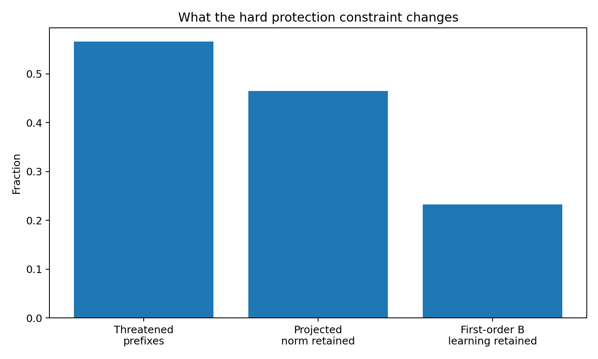

**Figure 8. The projected training direction.** Across 17 controlled foundations, bars summarize the fraction of protected prefixes threatened by the raw B update, retained update norm and retained first-order B-learning effect after projection. These are mechanism diagnostics. Source: protected_gradient_mechanism.csv. No uncertainty intervals are displayed.

[Experiment 026C evidence](evidence/experiments/026C) · [Full figure catalogue](FIGURES.md)

<a id="experiment-026d"></a>

### 026D. A sparse readiness skeleton

Experiment identifier: `REASONING-READINESS-SKELETON-026D`.

#### Question

026C showed that constraining every mapped correct prefix can prevent later training from punching holes through answer-readiness, but the price is reduced plasticity. The next question is therefore structural rather than merely protective:

> Do all correct prefixes need independent protection, or is there a much smaller set of geometrically informative anchors whose preservation keeps the rest of the correct region intact?

The experiment uses the same 16-parameter controlled recurrent harness and the same 17 development-qualified foundations used in 026B–026C.

#### 1. The apparent paradox: almost full algebraic rank, but only ~2 energetic directions

For every qualified foundation, all currently correct prefixes were mapped and their gold-signed answer-margin gradients with respect to the 16 model parameters were stacked into a protection matrix.

Across the 17 foundations:

- mean protected prefixes: **24.00**;
- mean algebraic rank: **15.65 / 16**;
- mean stable rank: **1.232**;
- mean directions required for 90% gradient energy: **1.65**;
- mean directions required for 95% gradient energy: **1.94**.

Thus the correct-prefix constraint matrix is nearly full rank in the strict linear-algebraic sense, but its energy is highly concentrated. Small singular directions make the formal rank large without carrying comparable control weight.

This is the key geometric opening for sparse protection.

#### 2. Skeleton selectors

Four sparse protection rules were screened at the difficult total update scale `eta=0.05`, with periodic remapping of anchor gradients rather than a full scan every training step.

- **boundary:** smallest current correct margins;
- **span:** greedy gradient-space diversity;
- **risk-span:** gradient-space diversity weighted toward lower-margin states;
- **entrance:** first correct point of readiness components, then boundary fill.

Skeleton sizes `k=2` and `k=4` were compared with plain learning and full-prefix protection.

#### 3. Two risk-aware span anchors are almost enough

At the screening stage, `risk-span, k=2` gives:

- protected-prefix survival: **99.69%**;
- mean lost protected prefixes: **0.059 per model**;
- final answer accuracy: **95.59%**;
- B-loss reduction: **0.02447**.

Full protection gives:

- survival: **100%**;
- final answer accuracy: **95.59%**;
- B-loss reduction: **0.01781**.

So the two-anchor skeleton uses only about **8.3%** as many anchors as the mean full map while obtaining the same mean endpoint accuracy and about **37.4% more B-loss reduction** in the screen.

A pure boundary skeleton of four anchors preserved 100% of mapped correct prefixes but did not learn B effectively in this regime. The successful skeleton therefore cannot be reduced to “protect the weakest margins.” It needs both **risk** and **directional coverage**.

#### 4. Full-set confirmation with periodic remapping

The selected two-anchor risk-span skeleton was then re-run across all 17 qualified foundations with 60 training microsteps and anchor-gradient remapping every 10 steps.

At `eta=0.02`:

**Table 5. Experiment 026D.**

| method | B loss reduction | correct-prefix survival | endpoint accuracy | readiness-fraction change |
|---|---:|---:|---:|---:|
| Plain | 0.0300 | 95.12% | 94.12% | -0.0049 |
| 2-anchor risk-span | **0.0232** | **100.00%** | 98.53% | **+0.0033** |
| Full protection | 0.0136 | 100.00% | **100.00%** | +0.0016 |

*Table note.* Confirmation over 17 qualified controlled foundations, 60 microsteps, refresh every ten steps. Positive B-loss reduction indicates learning. Survival and endpoint accuracy are percentages; readiness change is an absolute fraction change.
The two-anchor skeleton preserves **100%** of mapped correct prefixes and learns B about **70.8% more** than full protection.

At `eta=0.05`:

**Table 6. Experiment 026D.**

| method | B loss reduction | correct-prefix survival | endpoint accuracy | readiness-fraction change |
|---|---:|---:|---:|---:|
| Plain | -0.0384 | 87.26% | 82.35% | -0.0441 |
| 2-anchor risk-span | **0.0514** | **99.69%** | **95.59%** | -0.0065 |
| Full protection | 0.0252 | **100.00%** | **95.59%** | -0.0049 |

*Table note.* Confirmation over 17 qualified controlled foundations, 60 microsteps, refresh every ten steps. Positive B-loss reduction indicates learning. Survival and endpoint accuracy are percentages; readiness change is an absolute fraction change.
The two-anchor skeleton now learns B **2.04×** as much as full protection while preserving **99.69%** of the previously correct prefixes. Plain learning both damages the old readiness set and, in this strong-update regime, fails to improve B loss on average.

This last result matters: sparse protection is not only a retention mechanism. By removing destructive directions, it can also redirect learning into a more productive subspace.

#### 5. What are the two anchors?

The two selected risk-span anchors are not a fixed semantic token position.

Across 34 selected anchors:

- **58.8%** are entrances to a correct component;
- depths range from **0 to 7**;
- the largest counts occur at depth 0 and depth 4;
- anchors are distributed across all four questions.

Therefore a useful skeleton is not “always protect the first correct token” or “always protect the lowest-margin token.” It is a **state-dependent geometric basis**: one anchor covers a vulnerable/high-risk direction and the second adds a new protected-gradient direction not already represented by the first.

#### 6. Discussion

026D changes the interpretation of the protection problem.

026C measured roughly 24 correct prefixes, almost 16-dimensional algebraic rank, and more than half of those prefixes locally threatened by a new B update. The singular spectrum identifies how strongly those constraints concentrate in parameter space.

The singular spectrum says something very different. Most of those constraints are different surface observations of nearly the same dominant deformation. The correct region has many points, but the ways in which later training tends to destroy it are much fewer.

That distinction is exactly what the earlier language/control experiments would predict: high-dimensional visible content can coexist with a small number of dominant local control directions. Here the same phenomenon appears in **retention geometry**. We do not need to remember every point of the shoreline if most erosion arrives along the same two wave directions.

The experiment also explains why simple boundary protection is insufficient. A low-margin point is locally fragile, but two low-margin points may constrain almost the same parameter direction. Protecting both wastes plasticity. The risk-span selector instead asks two questions simultaneously:

1. Is this state vulnerable enough to matter?
2. Does its gradient add a new direction that the current skeleton does not already cover?

That combination is why two anchors outperform a larger boundary-only set in learning efficiency.

A second important result is that protection can improve *new* learning in a strong-update regime. At `eta=0.05`, unconstrained B training has negative average loss gain, whereas both full protection and the two-anchor skeleton have positive gain. The destructive component of the raw update is therefore not merely “useful plasticity that happens to forget old knowledge.” Part of it is bad for both retention and optimization. Constraining the readiness geometry acts as a directional regularizer.

This gives a more precise training architecture:

`full readiness map -> gradient spectrum -> sparse risk-aware skeleton -> periodic remap -> constrained update`

The full map is needed during the measurement phase, but it does not need to remain in the training loop forever. It can be compressed into a tiny set of anchors and periodically refreshed.

#### 7. Design rule after 026D

The current Layer-0/Layer-1 training controller becomes:

1. **Measure order sensitivity.** If damage is mainly antisymmetric history order, use interleaving/symmetric curriculum.
2. **Measure shared destructive drift.** If the order-free update still damages readiness, construct a protected readiness map.
3. **Compress the map.** SVD/gradient-cover diagnostics estimate its effective protection dimension.
4. **Protect a sparse risk-aware skeleton**, not every correct prefix.
5. **Periodically remap**, because the local gradient basis rotates as parameters move.
6. Escalate to larger skeletons only if survival falls below tolerance.

#### Evidence scope

This experiment establishes sparse protected learning in the controlled 16-parameter system. Skeleton selection uses exact prefix margins and parameter gradients. Experiment 026E evaluates risk and directional novelty through short answer probes and future-response perturbations, measuring their relation to exact-gradient selection and the retention–plasticity frontier.

#### Measurement note

Screening and confirmation are separate settings. The confirmation uses 60 microsteps and gradient refresh every ten steps. Read B-loss differences within the relevant setting. Survival is averaged over the qualified foundations; the 34 selected anchors equal two anchors for each of 17 foundations.

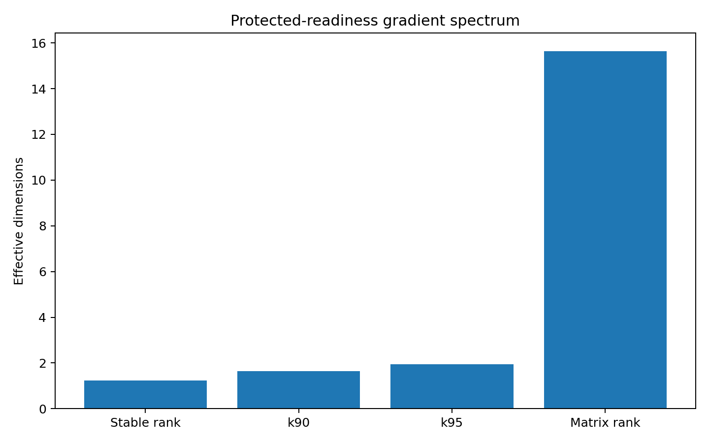

**Figure 9. Algebraic and effective protection dimensions.** The 17 controlled foundations are summarized by stable rank, directions for 90% and 95% gradient energy, and algebraic rank. The bars are mean dimension measures, not four alternative models. Source: protected_gradient_spectrum.csv. No uncertainty intervals are displayed.

[Experiment 026D evidence](evidence/experiments/026D) · [Full figure catalogue](FIGURES.md)

<a id="experiment-026e"></a>

### 026E. Selecting anchors through observable responses

Experiment identifier: `REASONING-OBSERVABLE-SKELETON-026E`.

#### Question

026D found that roughly 24 observed correct prefixes can be protected by a two-anchor readiness skeleton because the destructive protection geometry is energetically concentrated. However, the 026D selector used exact gradients of answer margin with respect to all model parameters for every candidate prefix.

026E asks:

> Can the two ingredients needed for sparse skeleton selection—risk and directional novelty—be reconstructed from observable future-response behavior alone?

Selection receives no parameter gradients. After two anchors have been selected, ordinary anchor gradients are allowed during the protection update. The aim is to remove exhaustive gradient tomography from skeleton discovery.

#### Experimental system

The same controlled 16-parameter recurrent system and the same **17 qualified foundations** from 026B–026D are used.

For every currently correct prefix, three observable descriptions are tested.

**Margin only:** immediate gold-signed answer margin.

**One-step future-response signature:** `ANSWER_NOW` at the current prefix and after each of five standardized one-token interventions: `BLANK`, `ROUTE`, `CODE`, `BIT0`, `BIT1`. This yields **6 scalar values**.

**Two-step future-response signature:** all 25 ordered pairs of the same five interventions are added before `ANSWER_NOW`, giving a **31-dimensional observable signature** in total.

No hidden state, optimizer state, or parameter gradient is supplied to these selectors.

For scientific evaluation only, exact parameter gradients are computed afterward to measure how much true protection geometry each selected pair covers.

#### 1. Observable response geometry contains real information about gradient geometry

Across candidate-prefix pairs, the mean Spearman association between observable response distance and exact protection-gradient distance is:

- one-step response signature: **0.568**
- two-step response signature: **0.545**

Two-anchor selectors cover:

**Table 7. Experiment 026E.**

| selector | exact gradient energy covered | mean overlap with 2-anchor gradient oracle |
|---|---:|---:|
| random | 64.5% | 0.18/2 |
| margin boundary | 73.3% | 0.94/2 |
| 1-step response risk-span | **84.6%** | 0.88/2 |
| 2-step response span | **88.2%** | 0.88/2 |
| exact-gradient oracle | 93.3% | 2.00/2 |

*Table note.* Controlled 17-foundation analysis. Energy coverage is a fraction of the measured gradient matrix, and overlap is a count out of two. Intervention tables report per-foundation means: positive B-loss reduction indicates learning; survival and endpoint accuracy are percentages; readiness change is an absolute fraction change.
The observable selector usually does **not** pick the exact same two prefixes as the gradient oracle. The two-step selector overlaps only **0.88 of 2 anchors on average**, yet covers **88.2%** of exact protection-gradient energy.

Thus exact anchor identity is not the invariant. Functional coverage of the protected response field is.

#### 2. Mild update: observable anchors match oracle retention

At total B-update scale `eta=0.02`:

**Table 8. Experiment 026E.**

| method | B-loss reduction | protected survival | endpoint accuracy | readiness-fraction change |
|---|---:|---:|---:|---:|
| Plain | 0.0300 | 95.12% | 94.12% | -0.0049 |
| Random 2 anchors | 0.0212 | 97.98% | 97.55% | -0.0027 |
| Margin boundary | 0.0251 | 96.90% | 95.59% | +0.0033 |
| 1-step response | 0.0211 | **100.00%** | 98.53% | **+0.0049** |
| 2-step response | 0.0227 | **100.00%** | 98.53% | +0.0033 |
| Gradient oracle | 0.0232 | **100.00%** | 98.53% | +0.0033 |

*Table note.* Controlled 17-foundation analysis. Energy coverage is a fraction of the measured gradient matrix, and overlap is a count out of two. Intervention tables report per-foundation means: positive B-loss reduction indicates learning; survival and endpoint accuracy are percentages; readiness change is an absolute fraction change.
Both observable response selectors preserve **100%** of the mapped correct prefixes. Their endpoint accuracy equals the gradient oracle at **98.53%**.

#### 3. Strong update: the 31-value response signature reaches the oracle frontier

At `eta=0.05`:

**Table 9. Experiment 026E.**

| method | B-loss reduction | protected survival | endpoint accuracy | readiness-fraction change |
|---|---:|---:|---:|---:|
| Plain | -0.0384 | 87.26% | 82.35% | -0.0441 |
| Random 2 anchors | -0.0199 | 92.88% | 89.22% | -0.0267 |
| Margin boundary | 0.0540 | 96.90% | 91.18% | -0.0065 |
| 1-step response | **0.0496** | **100.00%** | 94.12% | -0.0049 |
| 2-step response | **0.0504** | **100.00%** | **95.59%** | -0.0049 |
| Gradient oracle | 0.0514 | 99.69% | **95.59%** | -0.0065 |

*Table note.* Controlled 17-foundation analysis. Energy coverage is a fraction of the measured gradient matrix, and overlap is a count out of two. Intervention tables report per-foundation means: positive B-loss reduction indicates learning; survival and endpoint accuracy are percentages; readiness change is an absolute fraction change.
The two-step observable selector gives:

- **100.00%** protected-prefix survival;
- **95.59%** final answer accuracy, matching the gradient-oracle mean;
- B-loss reduction **0.0504** versus **0.0514** for the gradient oracle.

This is the central result.

#### 4. One-step probes are already strong

The one-step selector also preserves **100%** of old correct prefixes at `eta=0.05`, while producing 94.12% endpoint accuracy.

A deeper behavioral probe is not automatically a better global reconstruction of gradient geometry. The one-step signature has slightly higher mean pairwise correlation with gradient geometry than the two-step signature (0.568 versus 0.545).

However, the two-step span selector reaches the better endpoint frontier. Global pairwise correlation and the ability to choose two useful anchors are different objectives.

#### 5. Discussion

026E is the first point in the sequence where the full parameter-gradient map is no longer necessary for **finding** protected states.

The original mapping has the wrong scaling law. With `N` candidate prefixes and `P` parameters, explicit gradient tomography works with approximately `N x P` quantities. The observable assay replaces that discovery representation by `N x K`, where `K=6` or `31`.

This does not establish a transformer wall-clock speedup—the present small model is not a valid timing proxy—but it removes parameter dimension from the object used for skeleton discovery.

The result also strengthens the predictive-state interpretation. Two states need not have identical hidden coordinates, token positions, or parameter gradients to be interchangeable anchors. They need to preserve similar future distinctions under standardized controls.

That is why exact anchor identity is weak while functional coverage is strong. The two-step proxy matches fewer than one of the two gradient-oracle anchors on average, yet reaches essentially the same training frontier.

The negative controls matter. Random anchors sometimes help because any correct state supplies some preservation signal, but in the strong-update regime random protection preserves only **92.88%** of correct prefixes and its mean B-loss change is **-0.0199**. Margin-only boundary selection improves survival but remains below the response-field methods in endpoint preservation. Risk alone is therefore insufficient; diversity of future response is required.

A further observation connects directly to the long-CoT theory. One-step response geometry is already highly informative. Adding a second probe step improves the final two-anchor choice, but does not increase global correlation with parameter-gradient geometry. More continuation is not automatically more information: extra generated/control steps begin to mix in state-dependent nonlinear dynamics. The useful measurement depth is itself a control problem.

#### 6. Updated training architecture

```text
coarse readiness scan
-> short standardized future-response probes
-> fixed-dimensional behavioral signatures
-> risk/diversity skeleton selection
-> gradients only for the selected few anchors
-> protected update
-> periodic remap
```

The expensive operation has moved from “differentiate every correct prefix” to “differentiate only the two anchors selected by behavioral tomography.”

#### Evidence scope

Observable probes remove exact parameter gradients from skeleton discovery. The hard protection update still differentiates the two selected anchors to project the new-task gradient. Experiment 026F compares this operation with replay, distillation and other auxiliary objectives on the same selected anchors.

#### Measurement note

Gold-signed answer margins are supplied by the controlled evaluator. “Observable” identifies the response channel and the absence of parameter-gradient inputs during anchor selection. Gradients for the selected anchors remain part of the update. Global pairwise distance correlation and two-anchor functional coverage are separately measured quantities.

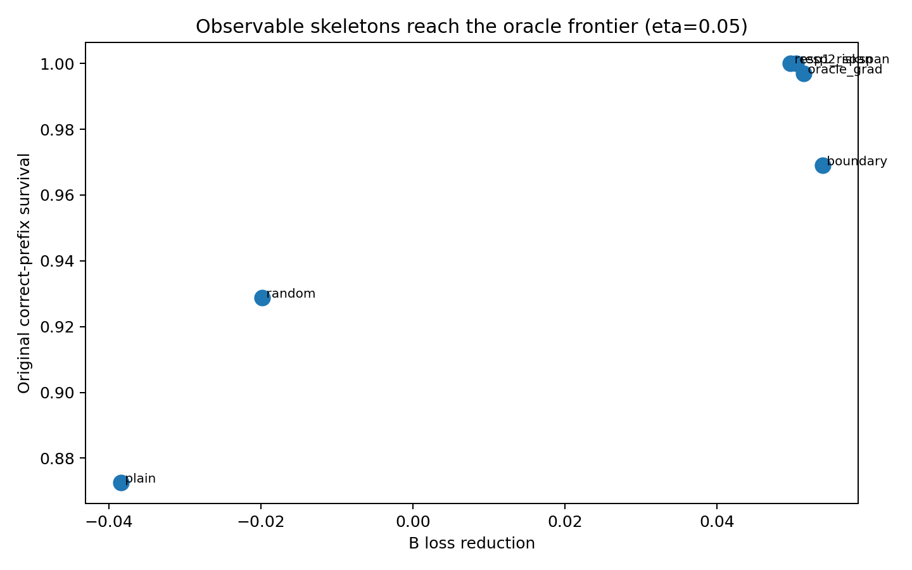

**Figure 10. Observable anchor selection at eta=0.05.** The controlled 17-foundation comparison plots mean B-loss reduction horizontally and mean original-prefix survival vertically. Points identify the selection methods. Positive horizontal values indicate new-task learning. Source: intervention_eta005_summary.csv. No uncertainty intervals are displayed.

[Experiment 026E evidence](evidence/experiments/026E) · [Full figure catalogue](FIGURES.md)

<a id="experiment-026f"></a>

### 026F. Auxiliary losses and hard protection

Experiment identifier: `REASONING-OBSERVABLE-LOSS-026F`.

#### Experimental question

026E removed exhaustive parameter-gradient tomography from readiness-skeleton discovery. Two anchors selected only from a 31-scalar future-response signature matched the exact-gradient skeleton's retention–plasticity frontier when those anchors were subsequently enforced by hard gradient projection.

The remaining engineering question is stricter:

> Can the hard projection itself be replaced by an ordinary auxiliary training objective on the same two observable anchors?

If yes, the complete method becomes an ordinary training loss. If no, constraint enforcement is a separate engineering layer rather than a matter of adding another loss term.

#### Prespecified acceptance rule

All methods are calibrated at total B-update scale `eta=0.02`.

A method counts as a replacement only if it simultaneously achieves:

- old correct-prefix survival >= **99%**;
- final endpoint accuracy >= **98%**;
- positive B-loss reduction.

These thresholds were fixed before the local fine sweep. The hard-projection reference using the same observable two-anchor selector achieves:

- survival: **100.00%**
- endpoint accuracy: **98.53%**
- B-loss reduction: **0.0227**

#### Methods

The selector is fixed to the 026E two-step observable response-span method. No parameter-gradient map is used to choose anchors.

Four ordinary static auxiliary objectives are tested.

**Answer-logit distillation**

`L = L_B + lambda * mean[(M_i - M_i^ref)^2 / scale_i^2]`

**Margin-floor preservation**

`L = L_B + lambda * mean[ReLU(M_i^ref - M_i)^2 / scale_i^2]`

**Answer replay**

`L = L_B + lambda * mean[softplus(-M_i)]`

**Future-response distillation**

For each anchor, the complete 31-value standardized response signature is replayed and distilled:

`L = L_B + lambda * ||R_i(theta) - R_i(theta_ref)||^2`.

All are trained through ordinary backpropagation; no gradient projection is used.

A fifth experiment tests an adaptive primal–dual / augmented-Lagrangian version in which penalties increase only when anchor constraints are violated.

#### 1. Static auxiliary losses do not reach the hard-constraint frontier

A broad scan was followed by a local fine scan around the best replay and response-distillation regions.

**Zero of 29 tested static settings passes the acceptance gate.**

The strongest static setting that still retains positive new-task learning is:

- method: **answer_replay**
- lambda: **0.5**
- B-loss reduction: **0.0474**
- old-prefix survival: **97.93%**
- endpoint accuracy: **94.12%**

The static setting with the highest measured survival is:

- method: **response_distill**
- lambda: **0.4**
- survival: **98.44%**
- endpoint accuracy: **97.06%**
- B-loss reduction: **-0.0501**

Increasing protection weight does not smoothly approach the hard-projection solution. Past a narrow useful range, auxiliary gradients begin to distort the new-task optimization and can make B loss increase.

#### 2. Replay helps, but does not enforce topology

Answer replay is the best positive-learning static family. Around lambda=0.4–0.5 it reaches approximately **97.93%** survival while retaining strong positive B learning.

This is meaningful improvement over unconstrained learning, but it still leaves holes. A loss that makes protected answers *likely on average* is not the same mathematical object as a constraint that forbids destructive motion at each protected boundary.

The distinction matters precisely because the target phenomenon is topological fragmentation. One missed anchor transition can create a new hole even if the mean replay loss remains small.

#### 3. Response-field distillation preserves more behavior but can sacrifice the task update

The most protective response-distillation settings reach roughly **98.44%** survival and **97.06%** endpoint accuracy, closer to the gate than simple logit preservation.

However, the corresponding B-loss change is negative. The optimizer is spending so much capacity reproducing the old 31-value response field that it no longer performs the intended new update.

This is the failure mode anticipated by 026C: overprotection turns retention into loss of plasticity.

#### 4. Adaptive primal–dual soft constraints also fail the gate

The augmented-Lagrangian experiment raises multipliers only for anchors that begin to lose their reference margin.

Across the tested penalty scales, **zero settings pass the gate**.

The highest-survival primal–dual setting reaches approximately **98.38%** survival and **95.59%** endpoint accuracy, but its B-loss change is **-0.7365**.

Thus the problem is not merely that a fixed lambda cannot react to heterogeneous anchor risk.

#### 5. Discussion — why a loss and a constraint are not interchangeable here

This experiment changes the interpretation of the previous sequence.

It would have been convenient if the entire framework reduced to:

`L_total = L_new + lambda L_preserve`.

The data do not support that simplification in this controlled system.

The reason is mathematical. A scalar auxiliary loss trades objectives *after aggregation*. It permits a sufficiently favorable reduction elsewhere in the objective to compensate for damage to one protected state.

Hard readiness protection instead defines a feasible update set:

`grad M_i · delta >= 0` for every protected anchor.

The update is chosen **inside that feasible cone**. A destructive direction is removed before it can be traded against improvement elsewhere.

Those operations are not generally equivalent.

This distinction becomes especially important when the desired object is a disconnected readiness topology. Mean preservation can look good while a single narrow component is punctured. The system then acquires exactly the kind of isolated wrong point that motivated this research line.

The negative result therefore sharpens the architecture rather than blocking it:

- curriculum ordering handles antisymmetric history effects;
- observable tomography identifies a sparse readiness skeleton;
- **constraint enforcement remains a distinct control operation**.

#### 6. A second practical lesson: preservation gradients have high gain

Even very small auxiliary weights materially alter optimization, while conventional lambda values often destabilize learning.

This agrees with 026D–026E: two anchors can cover most of the important protection geometry. Their small number should not be mistaken for weak influence. They were selected precisely because they occupy high-value control directions.

#### 7. Low-rank constrained formulation

026F closes one tempting path: do not assume a large-model implementation should simply add another distillation term.

Experiment 026G evaluates a low-rank approximation to the **projection**.

Because 026D found an approximately two-direction protection skeleton, the large-model version need not solve a full constrained optimization problem over all parameters and all prefixes.

The low-rank formulation consists of:

1. estimate only a tiny protected control basis from the selected anchors;
2. remove the component of the new-task gradient that points into destructive protected directions;
3. leave the orthogonal/new-learning component untouched;
4. compare exact full-gradient projection with a rank-1/rank-2 sketch.

If a two-direction sketch reproduces the hard constraint, the engineering object scales with **skeleton/control rank**, not with the total number of mapped prefixes.

#### Conclusion

026F is a negative result with a precise consequence:

**Ordinary replay, distillation, margin penalties, and the tested adaptive soft constraints improve retention but do not reproduce hard readiness protection under the prespecified gate.**

For this problem, the central operation is not “remember these examples.” It is:

> **prevent the training update from crossing a small set of destructive control directions.**

Experiment 026G evaluates that protected-direction formulation.

#### Measurement note

The 29 static settings and six primal–dual settings are evaluated against the stated joint gate. The result concerns those tested objectives, coefficients and optimization settings. The preserved result tables permit the acceptance gate to be recalculated directly.

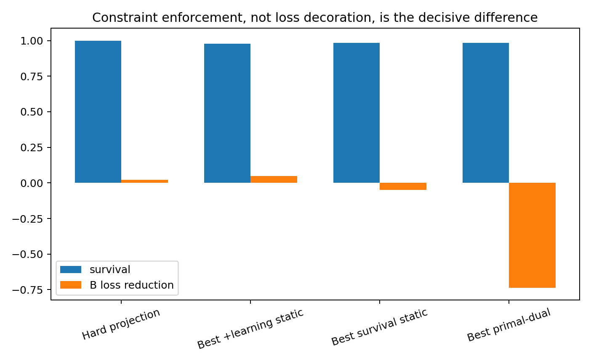

**Figure 11. Hard protection and calibrated auxiliary objectives.** The controlled comparison at eta=0.02 shows old-prefix survival and B-loss reduction for hard projection and selected static/primal–dual settings. The two bar types are different quantities sharing an axis; B-loss reduction can be negative. Source: summary.json and the sweep summaries. No uncertainty intervals are displayed.

[Experiment 026F evidence](evidence/experiments/026F) · [Full figure catalogue](FIGURES.md)

<a id="experiment-026g"></a>

### 026G. Low-rank constrained updates

Experiment identifier: `REASONING-LOWRANK-PROJECTION-026G`.

#### Question

026F showed that ordinary auxiliary losses do not reproduce hard readiness constraints. The next scalability question is therefore not how to invent another loss, but how much of the hard projection must actually be retained.

026D found an approximately two-direction protection skeleton. 026E found those states from observable future-response signatures. 026G now asks:

> Can the exact protected update be executed inside a rank-1 or rank-2 control space rather than against the full mapped set of correct prefixes?

#### Reduced constrained projection

Let the raw new-task update be `delta`.

For a protected-gradient matrix `A`, hard protection requires

`A delta_safe >= 0`.

Instead of solving in the full parameter space, choose an orthonormal rank-r protection basis `Q` and decompose

`delta = delta_perp + Q^T z`.

The orthogonal component is left unchanged. Only the `r` coefficients in `z` are corrected so that the projected constraints are satisfied.

Thus the constrained solve occurs in **r dimensions**, even though the model itself has `P` parameters.

The principal comparisons are:

- exact all-prefix half-space projection;
- top-1 / top-2 SVD basis of all protected gradients;
- rank-1 / rank-2 basis formed from the two 026E observable-selected anchors;
- a random rank-2 anchor-space control;
- unconstrained learning.

The protection basis is refreshed every ten microsteps unless otherwise stated.

#### 1. Rank 1 is not enough

At `eta=0.02`:

**Table 10. Experiment 026G.**

| method | survival | endpoint | B-loss reduction |
|---|---:|---:|---:|
| Plain | 95.12% | 94.12% | 0.0300 |
| Anchor rank-1 | 98.51% | 98.53% | 0.0365 |
| Anchor rank-2 | **100.00%** | **98.53%** | 0.0227 |
| Exact all-prefix | **100.00%** | **100.00%** | 0.0134 |

*Table note.* Controlled 17-foundation comparison at the update scale stated above the table. Survival and endpoint accuracy are percentages; B-loss reduction is before minus after. Rank denotes the dimension of the protected coefficient space.
A single dominant protection direction improves retention but leaves holes. Two functional directions close them completely.

At `eta=0.05`, the separation becomes sharper:

- rank-1 survival: **96.46%**
- rank-1 endpoint: **91.18%**
- rank-2 survival: **100.00%**
- rank-2 endpoint: **95.59%**

The second direction is therefore not a negligible spectral tail. It contains a boundary-critical control that the first mode cannot replace.

#### 2. Functional anchors outperform the global top-2 energy modes

The all-prefix gradient matrix has very low stable rank, so the obvious compression is its top two SVD modes.

That is not the best two-dimensional controller.

At `eta=0.05`:

- all-prefix top-2 SVD survival: **99.67%**
- observable functional-anchor rank-2 survival: **100.00%**

The global top-energy modes leave a small hole; the functional anchors leave none.

This resolves an apparent tension from 026D. Low stable rank correctly predicts compressibility, but **energy ranking alone does not identify which weak direction is topologically essential**. A small-energy direction can guard a narrow readiness component whose loss causes a discrete failure.

The correct criterion is therefore not just spectral energy. It is spectral energy plus boundary function.

#### 3. Two functional directions preserve substantially more plasticity than protecting everything

At `eta=0.05`:

- rank-2 functional shield B-loss reduction: **0.0504**
- exact all-prefix protection B-loss reduction: **0.0250**

Both preserve 100% of the mapped correct prefixes, but the sparse shield learns B roughly **2.02x** as much by this loss-reduction measure.

The interpretation is direct: full protection constrains many weak or redundant directions. The two-anchor cone protects the readiness topology while leaving more of the new-task gradient available.

#### 4. The foundation protection basis can be frozen for a surprisingly long interval

The rank-2 basis was then refreshed at intervals of 1, 2, 5, 10, 20, 30, or 60 microsteps. An interval of 60 means the basis is measured once at the foundation and then frozen for the entire update.

At `eta=0.05`, every refresh schedule—including a completely frozen basis—gives:

- **100% readiness survival**
- **95.59% endpoint accuracy**

The frozen basis retains B-loss reduction **0.0494**.

At `eta=0.10`, the result becomes even more informative. Frequent re-estimation leaves a small hole, whereas the frozen foundation basis gives:

- survival: **100.00%**
- endpoint accuracy: **95.59%**
- B-loss reduction: **0.0475**

This suggests that a protection controller should preserve the **reference geometry that was declared good**, rather than continually redefining “good” in the moving model.

A dynamically recomputed basis can follow drift. That is useful if the target itself should evolve, but it is undesirable when the object being protected is the original readiness region.

#### 5. The low-rank shield has a finite operating regime

The two-direction solution is not universally sufficient.

At `eta=0.20`:

- rank-2 anchor survival: **96.28%**
- rank-2 endpoint: **89.71%**
- B-loss reduction: **0.0375**

Exact all-prefix projection still maintains:

- survival: **100.00%**
- endpoint: **94.12%**

but its B-loss change is **-0.0242**, i.e. new-task learning is no longer beneficial under full preservation.

This is the important boundary condition.

When the requested parameter movement is small or moderate, two protected directions define a viable corridor in which both retention and learning coexist.

When the update becomes too large, the trajectory leaves that locally linear corridor. Then one of three things must happen:

1. increase protection rank / remap the readiness geometry;
2. reduce training step size and traverse the change in smaller compatible pieces;
3. accept that the current representation does not contain a direction that preserves the old geometry while learning the new target.

The third case is the true incompatibility case anticipated in the original theory.

#### 6. Discussion

026G makes the word **low-rank** much more precise.

A low stable rank does not mean “keep the first singular vector.” Rank-1 fails badly in the strong-update setting. Nor does it mean “keep the two largest-energy singular vectors.” The all-gradient top-2 approximation still misses a narrow critical boundary.

What survives is a different object:

> a small set of functionally selected constraint normals whose span covers the directions through which the readiness topology can be punctured.

This explains why 026E's future-response tomography matters. It is not merely a cheap approximation to SVD. It is a way to find *which weak directions are causally important*, even when they are not globally energetic.

The frozen-basis result adds another conceptual distinction. In continual learning there are two possible operations:

- **tracking:** continually redefine the protected geometry as the model moves;
- **anchoring:** preserve the geometry of a previously validated state.

For readiness preservation, the experiment favors anchoring over short-to-moderate horizons. If the reference is allowed to drift, the controller can slowly normalize the very deformation it was meant to prevent.

The `eta=0.20` stress test defines the measured boundary of the sparse controller. At larger requested updates, protection rank, update scale and the representation itself become relevant design variables.

#### 7. Current training-control stack

The experimental sequence now supports:

```text
history-conflict diagnosis
-> curriculum symmetrization
-> observable readiness mapping
-> two-anchor functional skeleton
-> rank-2 constrained update
-> frozen reference shield over a local training interval
-> remap / increase rank only when the shield begins to fail
```

The core scalable quantity has therefore shrunk from all mapped prefixes to approximately **two protected control directions** in the tested regime.

#### Parameter-space cost

Each protected direction remains a full P-dimensional parameter vector. The measured rank reduction applies to the protected control space. Parameter-axis sketching, blockwise approximation and reconstruction of the dangerous update component are distinct implementation questions, with no executed result reported in this series.

#### Measurement note

Here Q is written as an r-by-P matrix with orthonormal rows, so Q-transpose maps the r coefficient vector back into parameter space. The constrained solve is low-dimensional while its basis vectors remain P-dimensional. The half-space condition is a local first-order criterion; retained-prefix survival supplies the finite-update measurement.

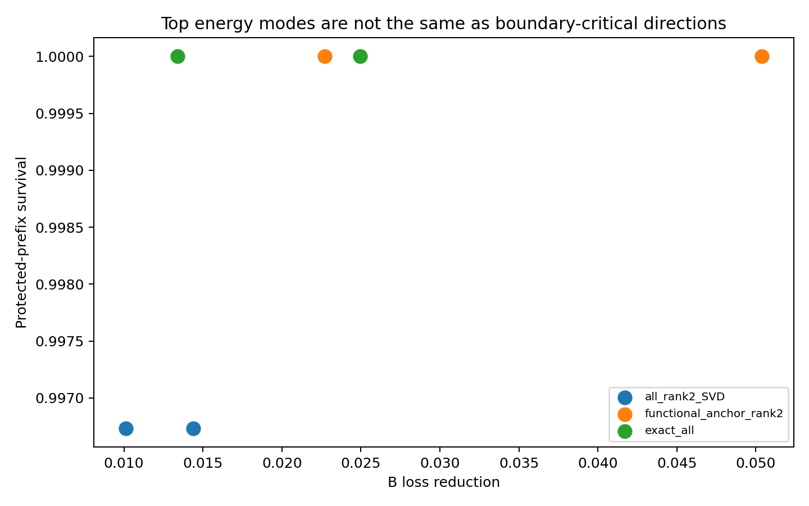

**Figure 12. Functional and energy-based rank-two protection.** Controlled comparisons plot B-loss reduction against original-prefix survival for exact, functional-anchor and SVD rank-two protection. Each point is a reported update-scale setting. Source: functional_vs_svd_rank2.csv. No uncertainty intervals are displayed.

[Experiment 026G evidence](evidence/experiments/026G) · [Full figure catalogue](FIGURES.md)

## Part III. Recovering answer readiness during inference

With the model fixed, these experiments measure risky edges, bounded recovery, context reconstruction and append-only rescue, then assemble the interventions by sequential verification.

<a id="experiment-027a"></a>

### 027A. Detecting risky state-action transitions

Experiment identifier: `REASONING-RISK-EDGE-027A`.

#### Question

The previous 026A–G sequence addressed **Level 0: training shaping and protection**. 027A intentionally moves to the next level of the original hierarchy:

> After training is fixed, can we identify individual next-step transitions that would carry an already-correct reasoning state out of the answer-ready region, and can local suppression route around them?

The experiment uses the same 17 qualified 16-parameter recurrent foundations from 026B–G.

#### Risk-edge definition

For every self-generated prefix whose immediate `ANSWER` request is currently correct, apply each of five standardized next actions:

`BLANK`, `ROUTE`, `CODE`, `BIT0`, `BIT1`.

A transition is a **risk edge** when the current prefix is correct but the state after that action gives an incorrect immediate answer.

Formally:

`h in S_good` and `T_a(h) not in S_good`.

#### 1. Risk edges are common

Across **408** currently correct states and **2040** candidate state-action edges:

**39.36%** of edges leave the correct region immediately.

Thus even after a state has become answer-ready, an arbitrary additional control action is not benign.

#### 2. Risk is not a lexical blacklist

Exit rates by action are:

**Table 11. Experiment 027A.**

| action   |   exit_rate |
|:---------|------------:|
| BIT0     |    0.379902 |
| BIT1     |    0.414216 |
| BLANK    |    0.401961 |
| CODE     |    0.375    |
| ROUTE    |    0.397059 |

*Table note.* Controlled state-action probes. Exit rates are fractions, with candidate-edge counts varying across the grouping. The complete edge and state tables provide the denominators. These observations are clustered within the qualified foundations.
All five action classes lie in a relatively narrow band, approximately 37.5–41.4%.

No single action is globally “the dangerous token.”

The correct object is therefore:

`risk = H(state, action)`

rather than `risk = H(action)`.

This is consistent with the earlier state-dependent language-control results: the same visible token can have different computational action in different states.

#### 3. Risk is strongly phase-dependent

The depth profile is highly nonuniform:

**Table 12. Experiment 027A.**

|   depth |   exit_rate |
|--------:|------------:|
|       0 |   0.542857  |
|       1 |   0.124138  |
|       2 |   0.505455  |
|       3 |   0.030303  |
|       4 |   0.538235  |
|       5 |   0.0571429 |
|       6 |   0.510345  |
|       7 |   0.13125   |
|       8 |   0.528571  |

*Table note.* Controlled state-action probes. Exit rates are fractions, with candidate-edge counts varying across the grouping. The complete edge and state tables provide the denominators. These observations are clustered within the qualified foundations.
Depths 0/2/4/6/8 are near 50% risk, whereas several intervening depths have much lower exit rates.

The alternation is specific to this controlled recurrent construction, so its exact periodicity is not claimed as a universal property. The supported structural result is that **reasoning phase dominates token identity** in determining whether a continuation is dangerous.

#### 4. A local one-step bypass exists for only a minority of actual exits

Along the actual self-generated/canonical reasoning trajectories there are **352** correct-state next transitions.

Their observed immediate exit rate is:

**35.51%**.

Among the **125** canonical correct→wrong transitions, only:

**12.00%**

have another one-step action among the five probes that remains correct immediately.

Applying the stability-first bypass only in those cases reduces the immediate exit rate from:

**35.51% → 31.25%**,

a relative reduction of **12.00%**.

#### Discussion

This result defines the measured operating scope of local prevention.

The original hierarchy proposed “risk-edge suppression” before stronger rescue methods. 027A shows why it belongs there but also why it cannot become the whole solution.

If a dangerous edge is recognized while a safe neighboring action still exists, avoiding it is cheap and clean. No extra wrong state is written into the autoregressive history.

However, the canonical exits are not ordinary correct states. They are concentrated precisely where the local transition geometry has become fragile. In 88% of those exit events, every tested one-step alternative is already wrong.

Therefore Level 1 is a **prevention layer**, not a universal correction layer.

The result also rejects a tempting implementation: a static blacklist of words or token classes. Because action-level exit rates are similar while phase-level rates vary sharply, a generic lexical blacklist would suppress many harmless actions and miss many state-specific hazards.

The appropriate Level-1 controller is a local `state × candidate-action` assay.

#### Engineering interpretation

A minimal Level-1 controller can be:

1. identify a currently validated answer-ready state;
2. evaluate a small set of likely next actions under a short `ANSWER_NOW` probe;
3. if the intended action crosses the readiness boundary and a safe alternative exists, suppress that edge;
4. if **all local alternatives are dangerous**, stop trying to solve the problem at Level 1 and escalate.

That last rule is important. The hierarchy is meant to prevent endless repair inside one layer.

#### Relation to bounded traversal

The 88% of canonical exits without a one-step safe bypass define the need for a post-exit recovery operation. Experiment 027B evaluates short action sequences that traverse toward another answer-ready region.

#### Measurement note

The 2,040 edges come from five probes at each of 408 currently correct states. The 352 canonical transitions form a different denominator. The resulting 125 exits recur throughout 027B–027E. Gold-signed margins provide the known-answer correctness reference for these controlled assays.

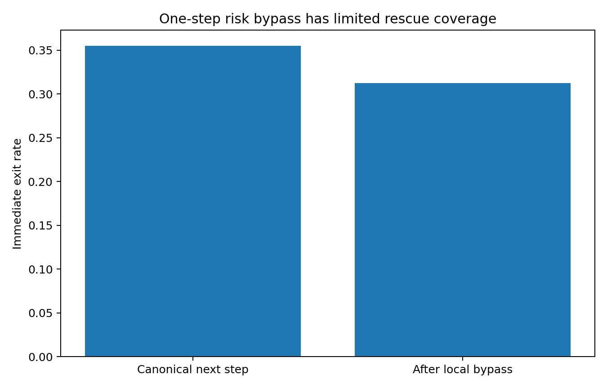

**Figure 13. Preventive bypass on canonical transitions.** Among 352 correct-state canonical transitions, 125 exit correctness. Fifteen of those exits have a safe one-step alternative. The bars show immediate exit fractions before and after applying that local bypass. Source: canonical_edge_bypass.csv. No uncertainty intervals are displayed.

[Experiment 027A evidence](evidence/experiments/027A) · [Full figure catalogue](FIGURES.md)

<a id="experiment-027b"></a>

### 027B. Bounded traversal toward readiness

Experiment identifier: `REASONING-FAST-TRAVERSAL-027B`.

#### Question

027A showed that only 12% of actual correct→wrong transitions have a one-step safe alternative before the exit occurs.

The hierarchy therefore moves forward rather than making Level 1 increasingly complicated.

027B asks:

> Once the model has already crossed into an incorrect state, can a short active routing policy move it through the bad region and reach the next answer-ready region faster and more reliably than passive continuation?

#### Experimental object

The analysis starts from all **125 canonical correct→wrong events** observed in the same 17 qualified recurrent foundations.

For each bad state after the exit:

- follow the original canonical continuation and record whether/when it naturally returns;
- enumerate standardized recovery-control sequences of lengths 1–3 over `BLANK`, `ROUTE`, `CODE`, `BIT0`, `BIT1`;
- find the shortest sequence that returns immediate-answer readiness;
- separately test a simple greedy controller that always chooses the next action with the highest immediate answer margin.

#### 1. The canonical trajectory usually returns, but not always

The original trajectory later re-enters the correct region in:

**90.40%** of exit events.

Conditional on returning, mean waiting time is only:

**1.044 steps**.

This is the controlled analogue of the “missed the correct stopping window and later circled back” phenomenon.

#### 2. Active traversal makes the next safe region almost completely reachable

Under the standardized recovery actions:

- recovered in exactly one additional step: **92.00%**
- recovered within at most two steps: **98.40%**
- recovered within at most three steps: **98.40%**

Only **2/125** exit states are not recoverable within the three-step probe envelope.

The simple greedy max-margin controller also recovers:

**98.40%**

within three actions.

Thus the next correct region is not usually far away in this controlled system.

#### 3. Active routing rescues trajectories that passive continuation never recovers

There are **12** canonical exit events that never return to a correct state within the recorded natural continuation.

Active routing recovers:

**10/12 = 83.33%**

of them within three actions.

This is the clearest functional gain of Level 2.

The controller is not merely reaching the same correct window slightly earlier. It creates a route to a later safe region for cases in which the original continuation fails to return at all.

#### 4. When passive return exists, active routing usually finds the same local window

Among cases in which both methods recover:

- active route is shorter in **2.65%**
- equal in **97.35%**
- longer in **0.00%**

This matters for interpretation.

In this tiny controlled system, wrong regions are often only one transition wide. Level 2 is therefore less about dramatic shortcutting and more about **preventing a bad state from becoming a terminal failure**.

#### Discussion

027A and 027B together experimentally separate two rescue concepts that are easy to blur.

**Risk-edge suppression** acts while still inside a correct region:

`good -> [dangerous edge] -> bad`

and tries not to take that edge.

**Fast traversal** begins after the edge has already been crossed:

`bad -> ... -> next good`.

Their measured operating domains are very different.

Only 12% of actual canonical exits can be avoided by a one-step local alternative before they happen, but 98.4% of the resulting bad states can be driven back into a correct region within the short three-action control envelope.

That is exactly why these should be different levels rather than one giant policy.

The result also changes the interpretation of “continue thinking.” Passive continuation is not intrinsically beneficial. It happens to recover 90.4% here because many wrong regions are narrow. Active routing raises recovery to 98.4% by selecting actions conditional on the current bad state.

So the useful operation is not “think longer.” It is:

> **once correctness has been lost, minimize residence time in the wrong region.**

This is important because the broader theory predicts that every extra autoregressive step accumulates residue and reduces controllability. A recovery policy should therefore optimize **time-to-next-safe-region**, not raw reasoning length.

#### Hierarchical consequence

The first two inference-time layers now have empirical stopping rules:

**Level 1 — risk-edge suppression**
- use only while a safe neighboring action exists;
- if all local candidates are bad, escalate immediately.

**Level 2 — fast traversal**
- once outside the correct region, route toward the nearest observable safe region;
- cap the recovery horizon;
- if no safe region appears within that horizon, do not keep extending the same contaminated trajectory.

The two unrecoverable cases in 027B are precisely the cases that should escalate to the next layer rather than trigger unlimited traversal.

#### Relation to state reconstruction

The two cases outside the three-action traversal envelope define a separate reconstruction problem. Experiment 027C rebuilds working contexts from the question and selected validated commitments, then measures immediate recovery and the robustness of the reconstructed state.

#### Measurement note

The 98.4% recovery rate is 123/125 in the enumerated three-action envelope. The natural-return comparison is conditional on the recorded continuation horizon. The general claim that every additional autoregressive step reduces controllability is a motivating hypothesis; this experiment measures state-dependent recovery and waiting time in its controlled system.

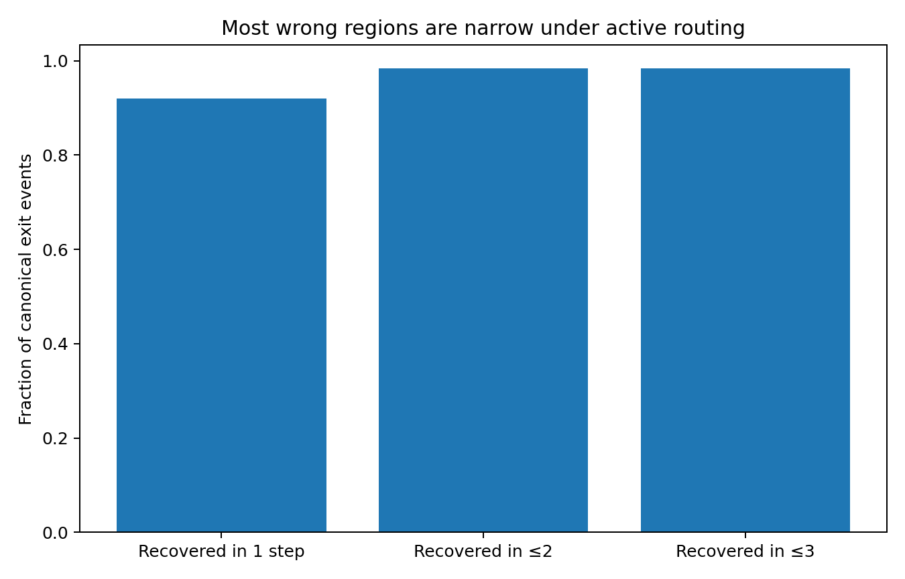

**Figure 14. Recovery within a bounded action horizon.** For 125 controlled post-exit states, bars give the fractions recoverable in one action and within two or three standardized actions. Two states remain outside the three-action envelope. Source: next_safe_region_recovery.csv. No uncertainty intervals are displayed.

[Experiment 027B evidence](evidence/experiments/027B) · [Full figure catalogue](FIGURES.md)

<a id="experiment-027c"></a>

### 027C. Reconstructing a useful working state

Experiment identifier: `REASONING-STATE-PROJECTION-027C`.

#### Question

027A established Level 1 risk-edge suppression. 027B established Level 2 fast traversal and left only **2/125** canonical exit states unrecoverable inside the three-action local control envelope.

027C therefore moves to the next intervention class rather than expanding the traversal search:

> If local continuation cannot recover the model, can the contaminated autoregressive history be projected into a clean working state that preserves useful commitments while removing residue?

This experiment is performed by **rebuilding a new context from selected information**. It does not directly edit hidden activations.

#### Reset variants

For each of the **125** observed canonical correct→wrong exits, five states are compared.

**Contaminated**

The actual state immediately after the risk edge.

**Prompt restart**

Discard the entire generated reasoning history and rebuild only the original two-token question state.

**Last-pair projection**

Rebuild the prompt plus only the most recent complete structural marker/value pair that had previously been verified answer-ready.

**Commitment projection**

Rebuild the prompt plus every completed structural relation pair whose endpoint had already been verified answer-ready. All blank/residual continuation tokens and incomplete dangerous pairs are removed.

**Last-safe rollback**

Rebuild the exact previous answer-ready prefix. This is an oracle upper-bound/checkpoint control, not the intended scalable reset.

The main readouts are immediate answer correctness, one-step robustness under the five standardized future probes, and RMS distance of the 31-value future-response signature from the last-safe checkpoint.

#### 1. Preserving verified commitments usually beats starting from zero

Across all **125** exit events:

**Table 13. Experiment 027C.**

| reset | immediate recovery | mean answer margin | future-response RMS to last-safe | one-step robustness |
|---|---:|---:|---:|---:|
| Prompt restart | 86.4% | 1.438 | 1.367 | 16.0% |
| Last-pair projection | 87.2% | 1.553 | 0.991 | 11.7% |
| Commitment projection | **95.2%** | **2.289** | **0.441** | 8.2% |
| Last-safe rollback | 100.0% | 2.691 | 0.000 | 5.6% |

*Table note.* Controlled reset assay on 125 aligned exit events. Recovery and robustness are percentages; robustness averages correctness over five standardized next actions. Margin and future-response RMS use the controlled model’s readout units.
Commitment projection restores immediate correctness in:

**95.2%**

of contaminated exits, compared with **86.4%** for a complete restart.

It is also much closer to the last-safe predictive state: future-response RMS **0.441** versus **1.367**.

This is the desired effect of a state projection: retain already-earned computation while deleting subsequent residue.

#### 2. Reconstructing the last correct state is not the same as re-entering a safe region

A surprising result appears in the robustness column.

The exact last-safe rollback is correct by definition, but only **5.6%** of the five possible next probe actions remain correct on average.

Commitment projection is similar: **8.2%**.

The last correct point is often precisely a thin boundary point immediately before a dangerous transition.

Therefore a perfect reconstruction of the last-safe predictive state can reproduce the same trap.

This separates two objectives:

`state fidelity` — return to the state that was previously correct;

`safe re-entry` — return to a state from which a useful neighborhood remains controllable.

They are not equivalent.

#### 3. The truly difficult Level-3 cases favor a deeper restart

Only **2** canonical exits were unrecoverable by every length≤3 Level-2 probe sequence. This is a small denominator and is reported as a case-level result.

For those two states:

- contaminated state: 0/2 correct;
- commitment projection: **2/2 correct**;
- prompt restart: **2/2 correct**.

But their neighborhoods differ sharply.

Commitment projection / exact rollback has:

**0% one-step probe robustness.**

Prompt restart has:

**70% mean one-step robustness.**

In both cases the adaptive reset-depth rule therefore chooses the **prompt restart**, not the more faithful commitment projection.

The important observation is not the 2/2 frequency by itself. It is the mechanism: these failures occur because the last-safe state is itself a locally trapped boundary. Returning exactly to it restores the answer but not controllability. A deeper reset moves the trajectory into a different predictive basin.

#### 4. Hard-recovery subset shows that reset depth should be conditional

Broaden the view to the **10** exits that either require two Level-2 actions or are unrecoverable within three.

Commitment projection succeeds in:

**80.0%**

while prompt restart succeeds immediately in only:

**20.0%**.

Thus the two Level-3 examples should not be generalized into “always restart from the prompt.”

The data instead support a hierarchy *inside* reset:

1. preserve verified commitments when they define a recoverable predictive state;
2. measure whether that re-entry state is still trapped;
3. if the reconstructed state has no safe local neighborhood, discard more history and restart deeper.

#### 5. Deep-contamination stress test

To isolate the effect of accumulated residue, every canonical bad state is extended by repeatedly choosing the standardized action that produces the lowest immediate answer margin.

Without reset, correctness across additional harmful steps is:

`0.0% -> 88.0% -> 2.4% -> 87.2%`.

The oscillation is a property of this small recurrent system and should not be read as a universal period. Its useful message is that additional continuation does not monotonically repair or monotonically worsen the state.

The reset reconstructions are invariant to that added contaminated tail because they explicitly discard it.

This realizes the original hierarchy's purpose: once the continuation becomes residue-dominated, stop asking the same trajectory to repair itself.

#### Discussion

027C changes the meaning of `RESET`.

A naive reset is “erase everything and ask again.” The experiment shows that this often throws away useful computation: prompt-only restart recovers fewer general exits than commitment-preserving projection.

But the opposite naive rule—“restore the last known correct state”—also fails conceptually. The last correct state may be a one-token-wide island with dangerous dynamics in every neighboring direction.

The correct reset target is therefore a **minimal sufficient safe state**.

It must satisfy two conditions:

1. preserve the commitments required for the correct solution;
2. remove enough historical conditioning that the reconstructed state has a viable future-control neighborhood.

This links directly to the earlier REASONING-STATE-020 result. RESET there restored the cursor but did not restore the complete reasoning state because retained memory remained. 027C provides the complementary engineering observation: preserving the right memory can be useful, but preserving the wrong amount of history can re-create the same future-control trap.

The reset controller should therefore act on a structured state decomposition:

`question / validated facts / validated commitments / disposable residue`.

Only the first three should survive projection.

#### Current hierarchy after 027C

**Level 0 — training shaping and protected learning**

Reduce formation of fragmented readiness geometry.

**Level 1 — risk-edge suppression**

Avoid dangerous next transitions when a safe neighboring action exists.

**Level 2 — fast traversal**

If the edge has already been crossed, minimize residence time until the next safe region. Do not expand the recovery horizon indefinitely.

**Level 3 — state projection / reset**

If local traversal fails, rebuild a clean sufficient working state. Preserve validated commitments by default; escalate to a deeper restart when the reconstructed state is itself locally trapped.

#### Relation to append-only rescue

State reconstruction removes selected history. The append-only rescue studied in 027D preserves the current history and applies an additional control sequence. The comparison measures immediate recovery, future-response stability, added tokens and repeated-rescue dynamics on the same held-out exit cohort.

#### Measurement note

Both commitment projection and prompt restart restore immediate correctness in the two local-traversal failures. Their next-step robustness differs: 0% for commitment projection and 70% for prompt restart. The 027E assembly uses immediate readiness as its outcome; the separate adaptive-reset assay optimizes the re-entry neighbourhood. These are distinct endpoints.

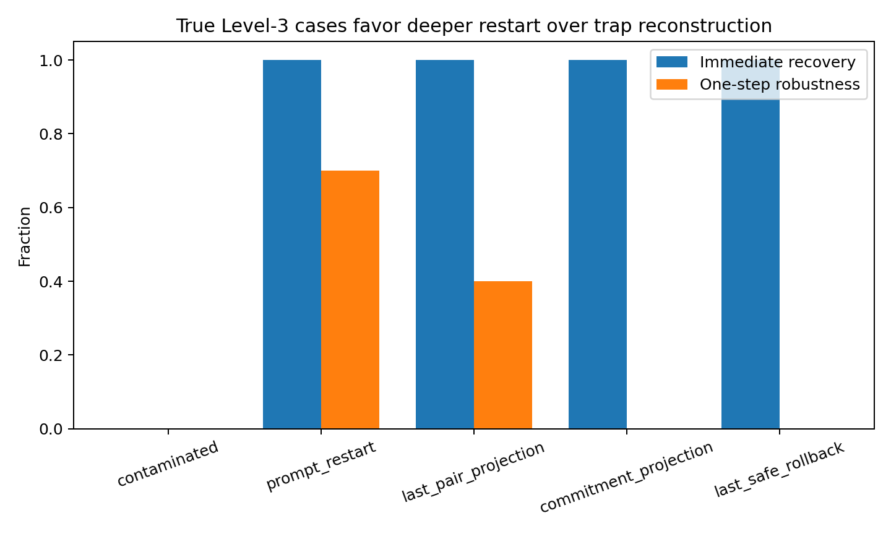

**Figure 15. Reset depth in the two local-traversal failures.** Bars compare immediate recovery and mean correctness under five next-step probes for two controlled events. Commitment reconstruction and prompt restart both recover the immediate answer; prompt restart has the more robust local neighbourhood. Source: level3_true_escalations_summary.csv. No uncertainty intervals are displayed.

[Experiment 027C evidence](evidence/experiments/027C) · [Full figure catalogue](FIGURES.md)

<a id="experiment-027d"></a>

### 027D. Append-only rescue and immediate verification

Experiment identifier: `REASONING-PROMPT-RESCUE-027D`.

#### Question

The hierarchy established so far is:

- Level 0 — training shaping and protected learning;
- Level 1 — suppress a dangerous edge while still inside a correct region;
- Level 2 — after an exit, route quickly toward the next safe region;
- Level 3 — if local traversal fails, delete residue and reconstruct a clean working state.

027D tests the deliberately last-resort intervention proposed at the beginning:

> Leave the contaminated history exactly where it is and append an external rescue instruction.

Unlike Level 3, prompt rescue does **not** remove any old token or reconstruct a clean context.

#### Controlled prompt analogue

The 16-parameter recurrent microscope does not contain natural-language phrases such as `Wait` or `Reconsider`. The experiment therefore uses a controlled analogue: an append-only **rescue macro** composed from the standardized control-token vocabulary:

`BLANK`, `ROUTE`, `CODE`, `BIT0`, `BIT1`.

The defining property is the same as prompt rescue in an autoregressive model: the bad history is preserved and new control tokens are appended after it.

The aim is not to claim that literal natural-language prompts have these exact rates. The experiment isolates the dynamical property of **append-only corrective control under contaminated history**.

#### Development / held-out split

The 17 qualified foundations are split before rescue-prompt selection:

- 9 foundations for prompt development;
- 8 held-out foundations for evaluation.

There are 65 development correct→wrong exit events and **60 held-out exit events**.

All one- and two-token rescue macros are scanned only on the development set.

The best generic macro is:

`BIT1`.

#### 1. A single rescue prompt is directly effective on unseen models

On the 60 held-out bad states:

- one generic rescue macro: **86.7%** immediate recovery;
- a rescue macro chosen only from the known exit depth: **86.7%**;
- a one-token rescue chosen by nearest-neighbor matching of the bad state's 31D future-response signature to development risk states: **90.0%**.

Thus pre-mapping risk states improves a generic rescue policy modestly, from 86.7% to 90.0%.

This is the controlled version of the original proposal: map dangerous states first, then attach a prepared corrective prompt to the corresponding risk type.

#### 2. Repeating the same rescue prompt is violently non-monotonic

If the generic rescue macro is appended repeatedly without checking whether the state has already recovered, held-out immediate correctness is:

**Table 14. Experiment 027D.**

| rescue count | correct |
|---:|---:|
| 1 | 86.7% |
| 2 | 16.7% |
| 3 | 81.7% |
| 4 | 6.7% |
| 5 | 96.7% |

*Table note.* Sixty held-out controlled exit events. Each row gives correctness after exactly that many blind repetitions, with no stopping on earlier success. These percentages differ from cumulative first-recovery rates under a gated policy.
The dominant per-event pattern is:

`10101`

in **48/60** held-out exit events.

Across prompt counts 1–5, the mean trajectory changes correctness **3.60 times**. Fully **95.0%** of events flip correctness at least twice.

This directly rejects a monotonic “more corrective prompting = more correction” model.

#### 3. Repeated prompting creates oscillatory intermediate states, not monotonic correction

The even-number prompt states are especially revealing.

After two rescue prompts, the current answer is wrong in most held-out events, yet among those wrong states the mean fraction of standardized next actions that return to correctness is:

**96.0%**.

After four rescue prompts, the corresponding future-correct fraction is:

**92.1%**.

Therefore the even-number failures are not stable wrong basins. They are **wrong but highly recoverable intermediate states**. Repeating the same control token moves the model back and forth across the answer boundary rather than progressively strengthening one correction direction.

This sharpens the original concern. Repeated rescue increases control difficulty not because it necessarily locks the model into a wrong state, but because the meaning of “apply the same rescue again” changes with the state created by the previous rescue.

#### 4. The correct prompt-rescue policy is inject, test, and stop

Because blind repetition is unstable, a readiness-gated controller is tested:

1. append the generic rescue macro once;
2. immediately check `ANSWER_NOW`;
3. if correct, answer immediately and stop;
4. if still wrong, allow one second rescue attempt;
5. after the cap, escalate rather than continue prompting.

On the held-out set:

- 52/60 states recover after the first prompt;
- another 6/60 recover after the second;
- 2/60 do not recover even when the same prompt is extended to five attempts.

Therefore a cap of only **two rescue attempts** already reaches:

**58/60 = 96.7%** cumulative recovery.

No new held-out state is first recovered at attempts 3–5.

Mean rescue attempts under the two-attempt cap are only:

**1.133**.

This is the strongest operational result of 027D:

> **Prompt rescue should be treated as a sparse, readiness-gated impulse, not as a conversational mode.**

#### 5. Even successful prompt rescue produces a very thin correct state

At the first successful rescue, mean one-step future robustness is only:

**3.45%**.

The model has become answer-ready again, but almost any additional standardized continuation can remove that correctness.

Therefore the correct action after successful Level-4 rescue is not:

`rescue -> continue reasoning`.

It is:

`rescue -> verify readiness -> ANSWER NOW`.

Prompt rescue is a stopping interface as much as a correction interface.

#### 6. Comparison with Level 3 reset on the same held-out exits

On the same 60 held-out bad states:

- prompt-only restart: **86.7%**;
- commitment-preserving projection: **93.3%**;
- exact last-safe rollback: **100%**;
- one-shot risk-signature-mapped append-only prompt: **90.0%**;
- readiness-gated generic prompt with at most two attempts: **96.7%**.

The two layers therefore solve different problems.

Reset removes history and is structurally cleaner. Prompt rescue can be surprisingly effective without deleting anything, but the recovered state is thin and repeated prompting is dynamically unstable.

#### 7. Important hierarchy boundary

In this controlled system, Level 3 already recovers the two true states that Level 2 cannot rescue. Consequently, Level 4 is **not operationally necessary** in this particular world.

That is scientifically useful.

The experiment does not manufacture a role for prompt rescue where reset already succeeds. Instead it quantifies prompt rescue as a counterfactual/fallback and shows why it belongs last:

- it preserves contaminated history;
- its effect is strongly non-monotonic;
- repeated rescue produces strong correctness oscillations rather than monotonic improvement;
- successful recovery is usually a narrow answer window requiring immediate stopping.

#### Discussion

The original hierarchy predicted that later interventions should become progressively more expensive in control complexity because they operate on a longer, more contaminated history.

027D provides the sharpest evidence for that prediction in this controlled sequence.

The first rescue token is often useful because it rotates the current predictive state across the answer boundary. But the rescue token is then itself part of the next history. Repeating the same control operator does not apply the same correction to the same state; it applies the operator to the **state produced by the previous rescue**.

Formally:

`h_(k+1) = T_rescue(h_k)`,

not

`h_(k+1) = h_k + constant correction`.

Because `T_rescue` is nonlinear and state dependent, iteration can alternate between different regions. The observed `10101` dominant correctness pattern is an explicit instance. The high one-step recoverability of the even-number wrong states confirms that they sit near the same alternating boundary rather than inside a stable wrong basin.

This is exactly the setting in which a conversational intuition—“the model is still wrong, tell it again”—becomes unsafe as a control rule.

The result also clarifies why prompt rescue and Level-2 traversal should remain separate. Level 2 chooses a state-specific action sequence that explicitly targets the nearest safe region. Level 4 applies a prepared external instruction without rewriting the contaminated context. It is cheaper to deploy but less geometrically controlled.

#### Final rescue hierarchy supported by the current experiments

**Level 0 — train the geometry**
- reduce fragmented readiness;
- symmetrize order-sensitive curricula;
- protect a sparse readiness skeleton.

**Level 1 — prevent**
- suppress a dangerous transition when a safe neighboring action exists.

**Level 2 — traverse**
- if already wrong, minimize time to the next safe region;
- cap local search.

**Level 3 — reconstruct**
- delete residue and rebuild a minimal sufficient working state;
- preserve validated commitments when possible;
- reset deeper if the reconstructed state is still trapped.

**Level 4 — prompt rescue**
- append one prepared corrective control;
- check readiness immediately;
- if recovered, answer immediately;
- permit at most a very small number of rescue attempts;
- if still wrong, do not enter an indefinite correction dialogue.

#### Relation to integrated routing

Experiment 027E assembles the measured interventions in a sequential controller with readiness and short future-response gates. It evaluates STOP, safe bypass, bounded traversal, reconstruction and append-only rescue as conditional operations within one hierarchy.

#### Measurement note

The rescue is a control-token macro in the recurrent task, with nine development and eight held-out foundations. The reported rates apply to this analogue. The supplied stable_wrong_after_repeated_prompt.png has an outdated title: its bars measure recovery probability among states still wrong, and support high recoverability after repeats two and four. The accompanying corrected interpretation and other figure are retained.

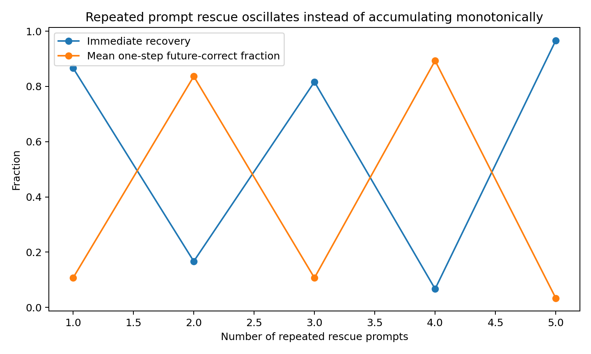

**Figure 16. Blind rescue repetition and response dynamics.** In 60 held-out controlled exits, the generic BIT1 macro is appended one to five times. Curves show correctness after each exact repetition count and mean next-action correctness over five probes. The gate-free sequence illustrates why first recovery must be checked. Source: repeated_prompt_dynamics.csv. No uncertainty intervals are displayed.

[Experiment 027D evidence](evidence/experiments/027D) · [Full figure catalogue](FIGURES.md)

<a id="experiment-027e"></a>

### 027E. Assembling the sequential controller

Experiment identifier: `REASONING-HIERARCHICAL-CONTROLLER-027E`.

#### Question

Can the intervention layers established in 026/027 be assembled into a single controller that escalates using only observable readiness and short future-response probes, without access to hidden state or oracle topology?

The controller is deliberately sequential rather than a flat five-way classifier.

A flat classifier would obscure the engineering logic of the hierarchy. The operative question at each stage is simply whether the cheapest available intervention has already succeeded. The controller therefore uses the following gates:

1. `STOP` — if immediate answer readiness is validated and task completion is allowed, answer now.
2. `LEVEL 1` — if continuation is required, suppress a dangerous planned edge only when a tested one-step safe alternative exists.
3. `LEVEL 2` — after an exit, score the five standardized next actions and greedily traverse toward the highest immediate answer margin, capped at three actions.
4. `LEVEL 3` — if the local three-action envelope contains no recovery, rebuild a minimal sufficient working state by commitment-preserving projection and verify readiness.
5. `LEVEL 4` — if reset fails or is unavailable, use readiness-gated append-only prompt rescue with the cap established in 027D.

#### Important integration point: STOP comes before Level 1

027A studied correct states whose next canonical action would leave the answer-ready region. Once the hierarchy is assembled, those states reveal a simpler rule: if `ANSWER_NOW` is already validated and the task permits completion, the controller should stop rather than continue reasoning.

Therefore Level 1 is not allowed to compete with STOP. It is a continuation-control layer used only when continuation is directly required.

For rescue evaluation below, the experiment conditions on the 125 observed canonical correct→wrong exits and asks how the controller behaves when the trajectory reaches the intervention chain.

#### Event-level assembly

The 125 canonical exits from 027A, 027B, and 027C were aligned by foundation seed, question, and exit depth.

The minimal routed intervention was:

**Table 15. Experiment 027E.**

| routed level | events | fraction |
|---|---:|---:|
| Level 1 — safe one-step bypass | 15 | 12.0% |
| Level 2 — greedy local traversal | 108 | 86.4% |
| Level 3 — commitment-preserving reset | 2 | 1.6% |
| Level 4 — prompt rescue | 0 | 0.0% |

*Table note.* Controlled assembly on 125 exit opportunities. Routing counts are conditional event counts; policy success uses the same cohort. L1 can prevent the exit, while L2 and L3 recover after an exit. The separate held-out subset contains 60 events.
This is the key integration result:

> **The hierarchy naturally collapses most interventions to the cheapest levels.**

Only 2/125 events require Level 3, and no event is forced to Level 4.

#### End-to-end recovery

All 15 events routed to Level 1 are safely bypassed.

Among events not rescued by Level 1, 108 are recovered by the capped greedy Level-2 controller. The mean number of actual Level-2 control actions among these routed cases is only **1.037**.

The remaining 2 events are the same locally unrecoverable cases isolated in 027B. Commitment-preserving Level-3 projection recovers both.

Therefore the assembled controller reaches:

**125/125 = 100.0%**

end-to-end success across the complete canonical-exit cohort.

#### Held-out foundation check

Using the same eight held-out foundations reserved in 027D gives **60** exit events.

Their routed distribution is:

- Level 1: 6
- Level 2: 54
- Level 3: 0
- Level 4: 0

The held-out controller recovers **60/60 = 100.0%**.

The two genuine Level-3 events belong to development foundation seed 4, so this particular held-out split does not exercise Level 3. Because the controller contains no fitted hidden-state classifier, the full-cohort Level-3 result remains a direct deterministic escalation test rather than a learned in-sample prediction.

#### Why the sequential controller beats flat intervention policies

On the same 125 exit events:

**Table 16. Experiment 027E.**

| policy | success |
|---|---:|
| assembled hierarchy | **100.0%** |
| greedy Level 2 only, cap 3 | 98.4% |
| Level 3 commitment projection on every exit | 95.2% |
| passive canonical continuation | 90.4% |
| full prompt restart on every exit | 86.4% |

*Table note.* Controlled assembly on 125 exit opportunities. Routing counts are conditional event counts; policy success uses the same cohort. L1 can prevent the exit, while L2 and L3 recover after an exit. The separate held-out subset contains 60 events.
The gain does not come from inventing a stronger single rescue operator. It comes from **refusing to use one operator everywhere**.

Level 1 is cheap but sparse. Level 2 handles almost every post-exit state. Level 3 handles exactly the two local-search failures. Level 4 remains available without being invoked merely for symmetry.

#### Discussion

The assembled system changes the interpretation of the entire 026–027 sequence.

The hierarchy is not a taxonomy of five equally plausible actions. It is an **escalation machine**.

Each layer answers one binary engineering question:

- Can we finish now? — STOP.
- If continuation is required, can we avoid writing the bad transition? — Level 1.
- If the bad transition has already been written, can a short local route reach the next answer-ready region? — Level 2.
- If local routing is exhausted, can we delete residue and re-enter from a cleaner sufficient state? — Level 3.
- If reconstruction cannot be used or does not restore readiness, can an external append-only impulse create a final answer window? — Level 4.

The numerical routing profile is unusually sharp: **15 → 108 → 2 → 0**. Most events never approach the expensive end of the hierarchy.

That shape is exactly what the original architecture was supposed to achieve. Later layers are not stronger versions of earlier layers; they are different control regimes reserved for states whose observable response geometry has already disqualified the cheaper regime.

The two Level-3 cases are particularly informative. The controller does not need to know that they occupy a special hidden basin. It only needs to observe that the capped Level-2 probe envelope has failed. Failure of the cheaper local operator becomes the escalation signal.

This also clarifies the role of Level 4 after 027D. Prompt rescue is not demoted because it is weak. It is held in reserve because its recovered windows are thin and its repeated dynamics oscillate. The assembled controller therefore reaches Level 4 only after a verified reset failure or reset unavailability.

#### Engineering controller

The assembled rule is:

`READINESS -> STOP`

else, when continuation is required:

`RISK-EDGE PROBE -> SAFE BYPASS ? L1 : continue`

after an actual exit:

`GREEDY LOCAL PROBE, cap=3 -> recovered ? STOP : L3`

after reset:

`VERIFY -> recovered ? STOP : L4`

after prompt rescue:

`VERIFY AFTER EACH IMPULSE -> recovered ? ANSWER NOW : cap=2`

No indefinite reasoning loop exists inside any layer.

#### Relation to recorded-agent routing

Experiment 028A evaluates loop gating, cooldown, bounded candidate search, external candidate pools and phase-based role eligibility in recorded GPT-5-mini, DeepSeek and Qwen trajectories. Recovery after command execution is defined by the environment-level evaluation protocol presented at the end of this report.

#### Measurement note

The event table is an assembly of the earlier measured interventions, aligned by foundation seed, question and exit depth. Its outcome is controlled immediate-answer recovery. The held-out 60-event subset contains no L3 or L4 cases. The two L3 cases belong to development seed 4. These facts define what the held-out check exercises.

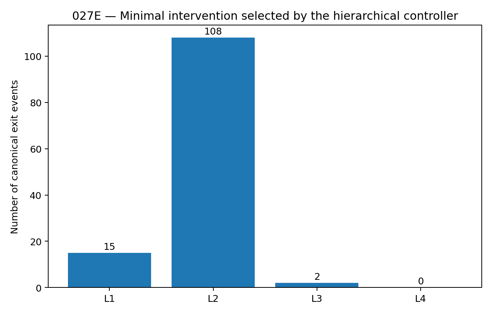

**Figure 17. Minimal routed intervention across exit opportunities.** The controlled event assembly assigns 125 canonical exit opportunities to 15 preventive bypasses, 108 local traversals, two reconstructions and zero prompt rescues. Source: 027E_router_event_assignments.csv. No uncertainty intervals are displayed.

[Experiment 027E evidence](evidence/experiments/027E) · [Full figure catalogue](FIGURES.md)

## Part IV. Routing recorded agent work

Recorded mini-SWE-agent trajectories supply a test of loop diagnosis, bounded candidate search, external pool expansion and phase-dependent role eligibility.

<a id="experiment-028a"></a>

### 028A. Routing recorded agent work

Experiment identifier: `REASONING-REAL-MODEL-ROUTER-028A`.

#### Question

Does the escalation logic assembled in 027E survive contact with real agent trajectories, before any hidden-state access or oracle topology is introduced?

This experiment uses the existing ASTIG matched mini-SWE-agent cohort:

- GPT-5-mini Submitted trajectories;
- DeepSeek-v4-flash Submitted trajectories;
- Qwen-2.5-7B strong-loop trajectories;
- 300 gate-positive Qwen strong-loop decision states across 8 SWE-bench tasks.

This is a **real-model recorded-trajectory replay**. The trajectories are real model runs. The present package measures controller routing and candidate availability from those trajectories; it does not claim that the selected replacement commands were re-executed in a fresh SWE-bench container.

#### Mapping from the controlled hierarchy to the real agent stack

The correspondence is operational rather than literal.

- Level 1 analogue: strong-loop gate + h=4 exact-command cooldown suppresses the immediate recurrent edge.
- Level 2a: search Qwen's own prior work states for a locally admissible escape command.
- Level 2b: if the local history has no admissible escape, expand topology to same-task GPT-5-mini / DeepSeek Submitted work states and project onto an unseen external work-state/action candidate.
- Phase gate: before similarity ranking, use observable task phase to decide whether Edit, Test, or Submit is currently eligible.
- The recorded-agent measurements cover candidate routing. Context reconstruction and append-only rescue are separately defined intervention classes in the integrated protocol.

#### 1. Recurrent-edge interception and Submitted controls

For the 300 Qwen strong-loop states, the fixed h=4 cooldown intercepts:

**291/300 = 97.0%**

of the recurrent commands.

On the 430 states from the 22 Submitted control trajectories, the strong-loop gate triggers:

**0/430**

interventions.

The useful combination is therefore not an always-on blacklist. It is:

`strong-loop gate -> cooldown`.

#### 2. Candidate availability in local history

Searching only Qwen's own history gives an admissible candidate for:

- k=2: **131/300 = 43.7%**
- k=4: **142/300 = 47.3%**
- k=8: **178/300 = 59.3%**

Even at k=8, **122/300** strong-loop states still have no local admissible escape candidate.

This is the recorded-agent application of bounded search: the measured k=8 endpoint leaves 122 states for candidate-pool expansion.

#### 3. Candidate availability after topology expansion

Once the candidate pool is expanded to same-task GPT-5-mini / DeepSeek Submitted work states, an exact command unseen anywhere in Qwen's history is available for:

**300/300** strong-loop states.

Therefore every one of the **122** states that exhausted the k=8 local pool has an external escape candidate.

The assembled real-trajectory router therefore has:

- **178/300** states that can remain in the local Level-2a operation;
- **122/300** states that must escalate to the external Level-2b operation;
- **0/300** states left candidate-starved after topology expansion.

This result is candidate-routing coverage, not yet executed task-recovery coverage.

#### 4. A candidate must also be appropriate for the task phase

The 300 Qwen strong-loop states divide into:

- PRE_EDIT: **112**
- POST_EDIT_UNVERIFIED: **113**
- POST_EDIT_VALIDATED: **75**
- TEST_FAILED: **0**

The external pool contains at least one unseen candidate in the phase-primary role for:

**300/300** states.

Phase-aware primary-role allocation becomes:

- Edit: **112**
- Test: **113**
- Submit: **75**

This matters because the earlier stage-blind role selector produced **97** Submit selections. Given the observed phase counts, at least **76** of those are necessarily premature, a lower bound of **78.35%** of its Submit choices.

Thus “escape the loop” is not sufficient. The escape must point in a direction compatible with the current task phase.

#### Discussion

027E showed, inside the recurrent microscope, that the right controller is an escalation machine rather than a flat rescue classifier.

028A finds the same shape in real agent trajectories.

The local neighborhood is useful but incomplete. Enlarging k from 2 to 8 raises candidate coverage from **43.7% to 59.3%**, with **122** states still uncovered at the largest tested width. Crossing the topology boundary to same-task external Submitted work states immediately raises candidate coverage to **100%**.

That is the real-agent analogue of “do not keep drilling inside one level.”

The second result is just as important: once topology is expanded, the problem changes from **finding any exit** to **finding the right kind of exit**. The phase gate supplies that missing state variable. Without it, a nearest progression action can be a Submit command while the task has not yet earned the right to submit.

So the assembled real-agent controller now has a coherent observable stack:

```text
LOOP GATE
-> h=4 COOLDOWN
-> bounded LOCAL SEARCH
-> TOPOLOGY EXPANSION
-> PHASE STATE
-> PROGRESSION ROLE
-> SIMILARITY
-> EXECUTE
-> VERIFY
```

Verification defines the environment-level outcome of an executed intervention.

The recorded trajectories establish detection, routing, candidate availability and phase eligibility for this cohort. Environment-level recovery is measured by executing the selected command and recording subsequent progress, recurrence and escalation, as specified in the evaluation protocol.

#### Evidence status

028A establishes on real recorded model trajectories that:

1. the loop gate can target pathological states while remaining transparent on the Submitted control set;
2. a bounded local search leaves a large, measurable uncovered set;
3. same-task external topology expansion supplies an admissible unseen action for all 300 strong-loop states;
4. observable phase state can assign every state to an available Edit/Test/Submit role before similarity ranking.

The controlled 027E hierarchy and the real-agent ASTIG routing stack therefore agree on the same engineering principle: **bounded local control first; change topology when the local candidate set is exhausted; verify after every intervention.**

#### Measurement note

All results in this experiment are recorded-trajectory routing measurements. Local k=8 availability and external phase-primary availability are separately established; the package does not contain executed outcomes for a phase-filtered combined local/external controller. Phase is computed from observed action categories. Submitted trajectories supply the candidate pool, and Submitted status is distinct from independent benchmark acceptance.

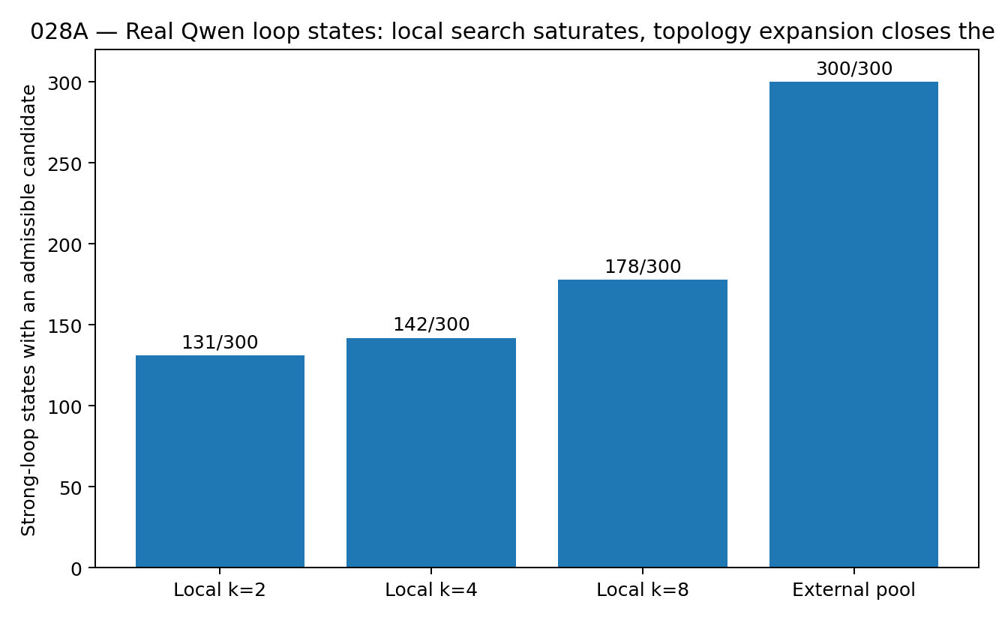

**Figure 18. Candidate coverage by search scope.** Across 300 recorded Qwen strong-loop states, bars count states with an admissible candidate at local widths 2, 4 and 8 and in the external same-task pool. The outcome is candidate availability. Source: 028A_real_trajectory_routing_by_task.csv. No uncertainty intervals are displayed.

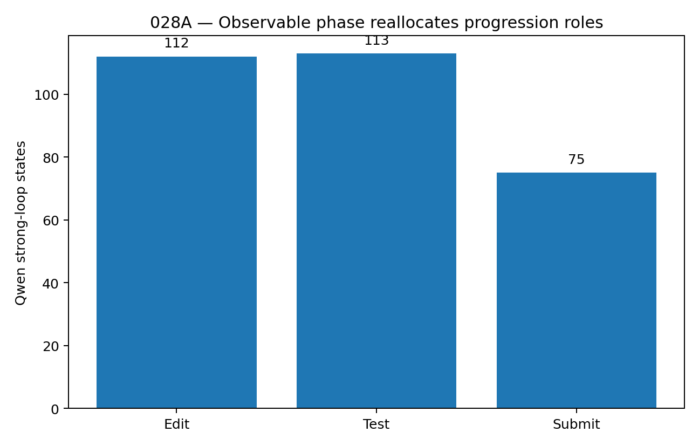

**Figure 19. Primary roles under the recorded phase rule.** The 300 Qwen strong-loop states are assigned 112 Edit, 113 Test and 75 Submit primary roles. Each state has an external candidate in its phase-primary role. This is phase-based allocation in trajectory replay. Source: 028A_real_trajectory_routing_by_task.csv. No uncertainty intervals are displayed.

[Experiment 028A evidence](evidence/experiments/028A) · [Full figure catalogue](FIGURES.md)

## Integrated controller and interpretation

The experiments support three linked forms of control. The construction studies map language/work history and observations into an action, bind that action to technical objects, and realize it through an operational language shell. The training studies preserve a measured answer-ready region by selecting functionally informative anchors and constraining updates. The inference studies choose an intervention according to the current state and the result of cheaper control operations.

### Agent state and utterance construction

The measured composition is predictive language state, observation-conditioned action, grounded object selection and language realization. Experiment 025 obtains a 0.541 nats/token improvement over its matched free-language baseline with predicted actions and improves NLL on nine of ten held-out tasks. The result supports a structured model of the next visible utterance. Correctness of a generated command or completion of the coding task requires its own environment-level evaluation.

### Training control

1. Compare matched training orders with a finely interleaved or coupled-update reference to estimate the order-sensitive component.
2. Measure answer readiness under the common readout when the shared update direction changes existing correct states.
3. Use short future-response probes to select anchors that combine vulnerability with functional diversity.
4. Constrain the update in the selected protection space, retaining the orthogonal component available for new learning.
5. Track prefix survival, endpoint accuracy and new-task loss together. Use the validated reference geometry over the measured local interval; reassess the map or update scale when the operating regime changes.

The controlled comparisons identify two useful protected directions in the tested local regime. The vectors still occupy the model's parameter space, and the strong-update stress test at eta=0.20 gives a measured boundary for the two-direction approximation. These are properties of the tested system and update settings.

### Inference control

| Decision | Operation | Verification and transition |
| --- | --- | --- |
| Completion is valid | STOP | Return the verified answer or complete the eligible task |
| Continued work is required and a safe alternative exists | L1 preventive bypass | Probe the state-action pair and avoid the measured risky edge |
| Local recovery is available | L2a bounded traversal | In the recurrent assay, cap control at three actions; in recorded-agent candidate search, use k=2, 4, 8 |
| The local command pool is exhausted | L2b topology expansion | Apply phase eligibility and role selection before similarity ranking in the additional pool |
| An executed L2 intervention has failed the declared verification rule | L3 state reconstruction | Preserve task facts and validated commitments, reconstruct context, then verify re-entry |
| Reconstruction has failed or is unavailable | L4 append-only rescue | Apply one fixed rescue impulse, verify immediately, and use the specified small attempt cap |

The three-action recovery horizon and k=2/4/8 candidate widths measure different resources. The former counts sequential control actions in the recurrent system; the latter counts retrieved candidate states in recorded-agent replay. Both implement bounded local search, with their budgets defined for their respective assays.

At L4, the recurrent experiment measures cumulative first recovery under a two-attempt gate. Its 96.7% rate is distinct from accuracy after blindly appending the same token twice, which is 16.7%. The immediate verification step explains this difference: a recovered case stops receiving further rescue tokens.

### Integrated results

| Measurement | Controller setting | Result |
| --- | --- | --- |
| Controlled routing | 15 L1 + 108 L2 + 2 L3 + 0 L4 | 125/125 recovered |
| Held-out controlled routing | 6 L1 + 54 L2 + 0 L3 + 0 L4 | 60/60 recovered |
| Real loop-edge interception | h=4 cooldown | 291/300 recurrent commands intercepted |
| Real local candidate coverage | k=2 / 4 / 8 | 131 / 142 / 178 of 300 |
| Topology expansion | Same-task GPT-5-mini / DeepSeek Submitted work states | 300/300 have an unseen exact-command candidate |
| Phase eligibility | PRE_EDIT / POST_EDIT_UNVERIFIED / POST_EDIT_VALIDATED | 112 Edit / 113 Test / 75 Submit |
| Stage-blind Submit audit | 97 stage-blind Submit selections | At least 76/97 premature under the recorded phase rule |

*Table note.* The first two rows measure immediate-answer recovery in the controlled task, with a known-answer readout. The remaining rows measure recorded-agent interception, candidate availability and phase classification. The 60 held-out events are a subset of the 125 events. The premature-Submit figure is a task-level lower bound, computed before identifying any individual mismatched decision. No pooled success rate is formed across these different outcomes.

### Supplementary starting-state and candidate-scope audits

The supplementary controlled audit starts in a different place from the 027E preventive assembly. When all 125 cases begin after the correct-to-wrong transition, the routing is 123 L2 + 2 L3, again with 125/125 immediate recovery and a mean cost of 1.08 control steps. In a stop-allowed scenario set, 352 ready states select STOP. Under forced continuation, those same ready states separate into 227 safe canonical continuations, 15 L1 bypass opportunities and 110 unsafe transitions without a one-step safe alternative. The 15 L1 alternatives have mean next-step probe safety 77.33%.

These counts reconcile the two evaluations: 027E gives L1 the opportunity to prevent 15 exits, whereas the post-exit audit starts after that opportunity has passed. They describe overlapping cases under different starting conditions.

The supplementary real-agent audit resolves the cumulative candidate counts into increments: 131 states at k=2, another 11 at k=4, another 36 at k=8, and 122 requiring the external pool. Its cooldown counts are 141, 250, 291 and 293 intercepted recurrent commands for h=1, 2, 4 and 8. These are re-expressions of the recorded cohort rather than independent model replications.

## Evaluation protocol for executed agent interventions

This section preserves the supplied experimental design as a methods protocol. The measured evidence in this edition ends at recorded-trajectory routing. The protocol specifies the additional environment-level observations required to evaluate executed recovery.

### Inputs and matched comparison

An executable evaluation requires the task instruction, repository/container snapshot, transcript through the trigger, original proposed command, candidate pool, declared loop and phase rules, model configuration, snapshot/restore support and event logging. The router, candidate eligibility rules and ranking function are fixed for the evaluation cohort.

For each trigger, create baseline and controller runs from the same task state, including files, test state, transcript, environment variables and tool state. The baseline executes the original continuation. The controller executes the eligible intervention and returns the resulting environment observation to the agent. Shared sampling seeds can be used when supported; otherwise record the sampling configuration and repeated-run structure.

### Intervention and verification

1. Check the task-specific completion criterion.
2. Apply the declared strong-loop gate and h=4 exact-command cooldown when the gate fires.
3. Search local candidates at k=2, 4 and 8. At each width, apply cooldown, phase and role eligibility before ranking; select from the first eligible width.
4. After local exhaustion, search the declared same-task external pool using the same eligibility rules. Record pool unavailability explicitly.
5. Execute the selected command once. Capture its working directory, exit code, stdout, stderr, elapsed time, file changes, relevant tests and task phase.
6. Return the resulting observation to the continuing agent and apply the fixed verification rule.
7. If L2 execution meets the declared non-recovery criterion, reconstruct context from the original task, current files, validated edits, confirmed constraints and latest test evidence. Record the retained information and removed history, then verify again.
8. If reconstruction fails or is unavailable, apply a prespecified append-only rescue policy with immediate verification and at most two attempts. The two-attempt setting is motivated by the controlled experiment; live prompt wording and efficacy are separate evaluation variables.

The verification horizon is recorded with each run. Four agent actions is the supplied initial protocol setting, accompanied by shorter- and longer-horizon sensitivity analyses. The horizon measures post-intervention behaviour; it is distinct from the cooldown window even when both have numerical value four.

| Recovery label | Operational definition |
| --- | --- |
| COMPLETE | The task reaches valid completion/submission under its declared criterion |
| PROGRESS | Task phase advances or a new validated work artifact is produced |
| LOOP_BROKEN | The original recurrence is absent during the verification window, with phase still unchanged |
| NO_RECOVERY | The same loop returns, phase does not advance and no productive work state is created |

*Table note.* These are protocol labels. The recorded-agent package supplies candidate-routing results; it supplies no completed baseline/controller outcome table for this executed-intervention protocol. The labels must be derived from stored telemetry using a declared precedence when more than one criterion is satisfied.

### Event record and analysis

The supplied event schema comprises `run_id`, `task_id`, `model`, `trigger_id`, `fork`, `timestamp`, `phase_before`, `loop_gate`, `original_next_command`, `cooldown_blocked`, `selected_level`, `l2_width`, `candidate_source`, `candidate_role`, `candidate_command`, `command_exit_code`, `phase_after`, `same_loop_returned`, `actions_to_reloop`, `new_diff`, `validation_run`, `validation_passed`, `submission_attempted`, `submission_valid`, `recovery_label`, `escalated_to` and `final_task_result`. Detailed tool outputs, diffs, tests and trajectories are referenced by stable artifact identifiers.

Report routing fractions at each candidate width and intervention level; the four recovery outcomes by level; recurrence and actions to recurrence; the phase-transition matrix; final task completion; and command, model-turn, tool-call, elapsed-time, reset and rescue costs. Retain matched per-trigger baseline/controller records, including failed interventions. Interpret those outcomes after confirming identical starting states, bounded candidate search, phase eligibility before ranking, actual command execution, post-execution verification and reproducible event classifications.

## Evidence and reproducibility

The publication contains the integrated English report, 18 canonical experiment directories, ASTIG supporting summaries, two supplementary audits, all 78 supplied figures, source identities and executable analysis code where supplied. The 19 images used in the original Word report are included unchanged within those 78 images. Numerical result tables and authored synthetic or derived measurements retain their source values. The source guide identifies the underlying input requirements and the exact scope of the release verification script.

The scientific progression is supported at three levels: statistical predictive modelling of language and recorded work, controlled interventions in an explicitly enumerable recurrent task, and candidate/phase measurements on recorded coding-agent trajectories. Reading the results at their measured level keeps the operational controller, its empirical basis and its evaluation protocol connected.

Some hypotheses developed in this research have received substantive validation through engineering implementations. Data models are forthcoming.
