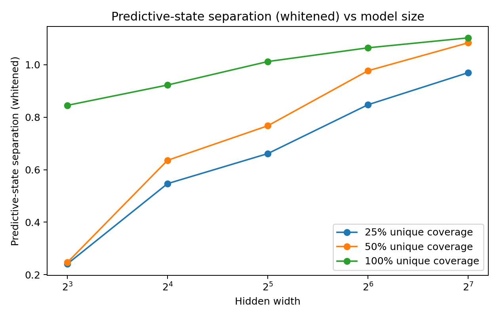
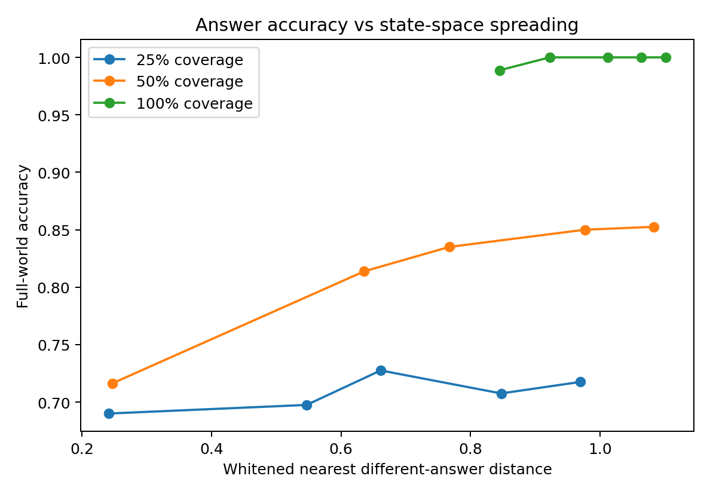
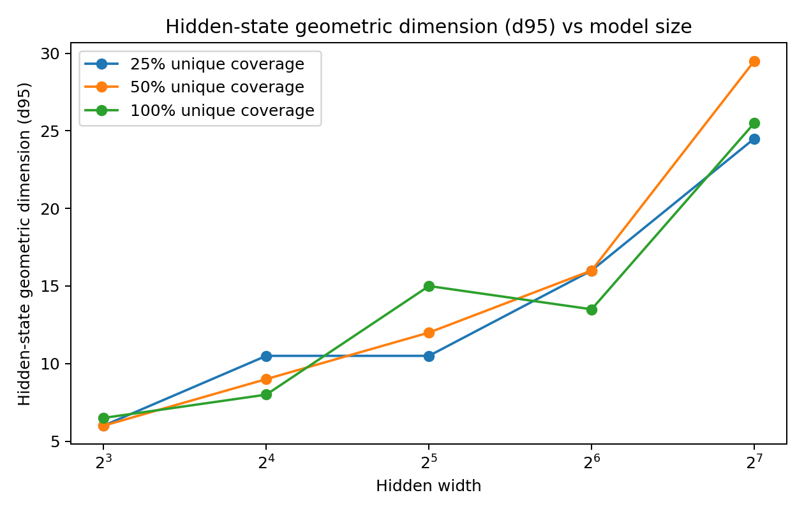
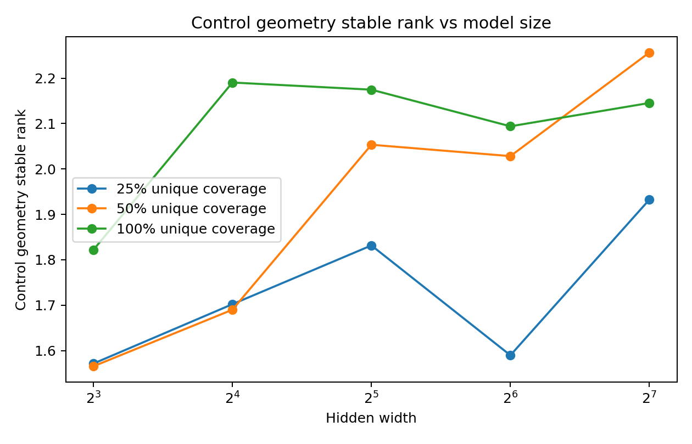
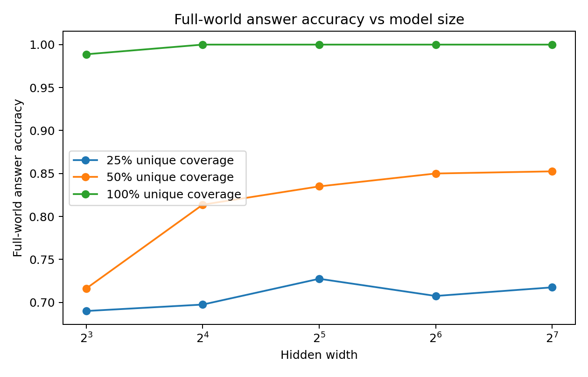
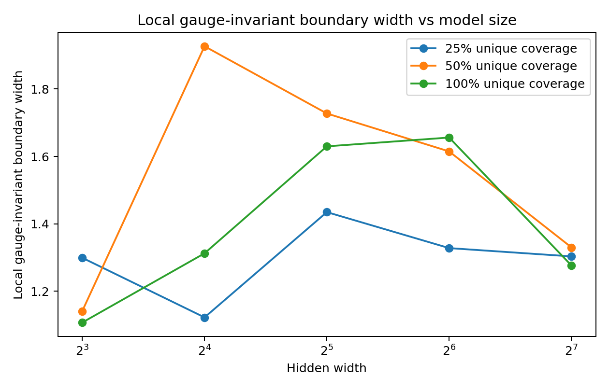

# Model scale and predictive state geometry

## 46 MODEL SCALE CORRIDOR 025 Model size training coverage and predictive state geometry

### 46.1 What additional capacity changes

The teacher-dimension, control-flow and reasoning-locus experiments distinguish a high-dimensional substrate from concentrated effective control. This experiment tests how capacity changes the arrangement of predictive states within a fixed training world. The working hypothesis is that additional capacity provides room to separate states associated with different future answers.

The central question is how model size and unique training coverage relate to answer accuracy, predictive-state separation and the spectrum of local answer control.

### 46.2 The common 400 case reasoning universe

We reuse the finite relational world of REASONING-LOCATOR-023 and the fixed visible sequence THINK → CHECK → FINAL. The vocabulary, relation operators and final-answer objective are shared. Hidden width and unique training coverage are the manipulated factors. The code uses one optimizer configuration and one early-stopping rule; realized training lengths range from 71 to 900 updates.

| Factor | Levels or definition |
| --- | --- |
| hidden width | 8 / 16 / 32 / 64 / 128 |
| Parameter count | Approximately 1.7k / 4.1k / 12.4k / 42.8k / 158.9k |
| unique coverage | 25% / 50% / 100% |
| Coverage subsets | Nested and balanced; every goal × start × main-operation combination is represented, with increasing coverage of the counterfactual relation |
| Initialization | Two shared seeds, 2501 and 2502 |
| Measurement point | After CHECK; retain the complete recurrent state and continue with the same FINAL suffix |

Coverage supplies 100, 200 or 400 distinct training cases. Width changes the capacity of the two-layer GRU. Full-world accuracy scores all 400 cases, including the training cases at partial coverage. Covariance and PCA are descriptive measurements of this same fixed 400-case universe.

### 46.3 From raw hidden distances to covariance normalized geometry

The initial measurement perturbed the CHECK state along a steepest answer-margin descent direction and measured the per-coordinate RMS distance to an answer flip. Those raw distances varied substantially with width and seed.

The earlier coordinate controls motivate a model-relative scale. Raw Euclidean distance is preserved by orthogonal rotations, but changes under rescaling and general invertible recoding. We retain the initial measurements as the development record and use covariance normalization for the main analysis.

The revised measurement asks how large a state displacement is relative to the model's natural state variation. It separately measures local margin sensitivity and separation between different-answer states.

### 46.4 Two distinct geometric measurements

For each model, let C be the covariance of stopped hidden states over the 400-case universe. Let m(h) be the correct-answer margin over the strongest competing answer and g(h) its gradient with respect to the stopped state. The first-order covariance-normalized margin radius is:

r_geo(h) = answer_margin(h) / sqrt( g(h)^T C g(h) )

This ratio measures local margin size in units of covariance-weighted sensitivity. It is a tangent approximation to boundary distance. With consistently transformed C and g, the ideal ratio is invariant to invertible linear recoding; the implementation adds a small numerical stabilizer.

For the second measurement, PCA retains modes explaining 99% of hidden-state variance and whitens their scores. We calculate each state's RMS distance to the nearest state with a different ground-truth final answer, then report the median over states whose answer is correct. The retained-mode count supplies the RMS normalization. This is a specified measure of different-answer separation; sensitivity of the truncated pipeline to arbitrary affine recoding is recorded as a validation target.

### 46.5 Larger models separate different answer states more strongly

| coverage | width | params | accuracy | state separation | state d95 | control rank | local width |
| --- | --- | --- | --- | --- | --- | --- | --- |
| 25% | 8 | 1,706 | 0.690 | 0.241 | 6.0 | 1.57 | 1.30 |
| 25% | 16 | 4,122 | 0.697 | 0.547 | 10.5 | 1.70 | 1.12 |
| 25% | 32 | 12,410 | 0.727 | 0.661 | 10.5 | 1.83 | 1.43 |
| 25% | 64 | 42,810 | 0.707 | 0.847 | 16.0 | 1.59 | 1.33 |
| 25% | 128 | 158,906 | 0.718 | 0.970 | 24.5 | 1.93 | 1.30 |
| 50% | 8 | 1,706 | 0.716 | 0.247 | 6.0 | 1.57 | 1.14 |
| 50% | 16 | 4,122 | 0.814 | 0.636 | 9.0 | 1.69 | 1.93 |
| 50% | 32 | 12,410 | 0.835 | 0.767 | 12.0 | 2.05 | 1.73 |
| 50% | 64 | 42,810 | 0.850 | 0.977 | 16.0 | 2.03 | 1.61 |
| 50% | 128 | 158,906 | 0.852 | 1.083 | 29.5 | 2.26 | 1.33 |
| 100% | 8 | 1,706 | 0.989 | 0.845 | 6.5 | 1.82 | 1.11 |
| 100% | 16 | 4,122 | 1.000 | 0.922 | 8.0 | 2.19 | 1.31 |
| 100% | 32 | 12,410 | 1.000 | 1.012 | 15.0 | 2.17 | 1.63 |
| 100% | 64 | 42,810 | 1.000 | 1.064 | 13.5 | 2.09 | 1.66 |
| 100% | 128 | 158,906 | 1.000 | 1.102 | 25.5 | 2.15 | 1.28 |

Recalculation from the 30-model CSV gives within-coverage Spearman correlations between width and whitened separation of 0.9847, 0.9847 and 0.9601 for 25%, 50% and 100% coverage. From width 8 to 128, the two-seed mean separation rises from 0.241 to 0.970, from 0.247 to 1.083, and from 0.845 to 1.102, respectively.

Figure 46.1 MODEL-SCALE-CORRIDOR-025: different-answer state separation increases with model width in all three coverage conditions.

Figure 46.2 MODEL-SCALE-CORRIDOR-025: measured state separation and full-world answer accuracy.

### 46.6 Representation expands and local control stays concentrated

The number of state-covariance modes carrying 95% of variance increases with model size: the pooled Spearman correlation between parameter count and state d95 is 0.9476. Within coverage conditions, the corresponding correlations are approximately 0.89–0.96. This d95 describes variance in the learned hidden coordinates.

The covariance-weighted answer-gradient stable rank ranges from 1.4339 to 2.6936 across all 30 models. Additional capacity therefore accompanies richer measured state geometry and a local control spectrum concentrated in a few dominant modes. Stable rank describes energy concentration; integer control dimension is reported separately through the spectrum.

Figure 46.3 MODEL-SCALE-CORRIDOR-025: hidden-state d95 across model widths.

Figure 46.4 MODEL-SCALE-CORRIDOR-025: concentrated covariance-weighted control spectra across model widths.

Geometric Unpacking v0.1. Under this common task and training protocol, increased capacity has a clear geometric signature: greater separation between different-answer states together with concentrated local answer control.

### 46.7 Training coverage and capacity make different contributions

Across the 30 model conditions, training coverage and full-world accuracy have Spearman correlation 0.9089. The association between capacity and accuracy depends on coverage.

At 25% coverage, width 8→128 increases separation from 0.241 to 0.970 and accuracy from 0.6900 to 0.7175. Representational separation and correctness on the whole task are empirically distinct quantities.

At 50% coverage, width 8→128 increases accuracy from 0.71625 to 0.85250. Additional capacity accompanies a stronger mapping from the supplied training constraints to full-world answers.

At 100% coverage, width 8 achieves mean accuracy 0.98875, and widths 16–128 achieve 1.000. Hidden geometry continues to change after endpoint accuracy saturates.

Figure 46.5 MODEL-SCALE-CORRIDOR-025: full-world accuracy by training coverage and model width.

A descriptive regression on these 30 rows gives R²=0.9487 for coverage plus log2(width), increasing to 0.9620 after adding separation. The log2(width) coefficient changes from +0.01321 to −0.00671. This fitted association motivates a geometric-mediation hypothesis. The design has two shared seeds per condition and variable realized update counts under a common stopping rule.

### 46.8 Local boundary sensitivity and inter-route separation

The road-width intuition contains two measurable objects:

Local margin radius: r_geo measures covariance-normalized first-order answer-margin sensitivity. Its values vary with width and seed and show a nonmonotonic pattern across the tested widths.

Inter-route separation: the truncated-whitened RMS distance between states with different final answers increases consistently with width under the recorded protocol.

The measured result is that larger models place different-answer states farther apart in the selected normalized geometry. Reduced functional interference is a mechanistic interpretation of this separation. Direct perturbation tests of interference and transitions between future trajectories are the corresponding confirmation target.

Figure 46.6 MODEL-SCALE-CORRIDOR-025: the local normalized margin radius and global different-answer separation show distinct scaling patterns. The radius is a first-order estimate.

### 46.9 Connection to learning history and earlier experiments

teacher / dataset constraints × architecture capacity × optimization history

-> predictive-state geometry -> low-dimensional local control -> answer

Teacher-dimension experiments separate task-supplied variation from architectural capacity. History interventions show that the ordered learning process changes continuous response fields. State localization measures answer-related dynamics at specific layers and times. The scale experiment adds a direct measurement of how capacity arranges those states.

Training data supplies constraints on predictive distinctions and answer mappings.

Model capacity provides the representational space in which those distinctions are embedded and separated.

Optimization and training history select the realized margins, curvature and response geometry within that space.

During generation, the local control spectrum can remain concentrated in a few dominant modes.

### 46.10 Current result and mechanistic interpretation

In the tested two-layer GRU family, increased width consistently increases measured different-answer separation and is strongly associated with higher hidden-state d95. Local covariance-weighted answer control retains a concentrated spectrum. Training coverage has the strongest reported association with full-world accuracy.

These observations support a concrete engineering hypothesis: representational separation can provide room for reliable task trajectories as the training trace supplies the relevant answer constraints. Threshold-like stabilization of an existing computation is a proposed explanation of apparent emergence, with its status recorded as a working hypothesis.

### 46.11 Original data scripts and figures

MODEL-SCALE-CORRIDOR-025.md

MODEL-SCALE-CORRIDOR-025_fast.py

MODEL-SCALE-CORRIDOR-025_geometry.py

MODEL-SCALE-CORRIDOR-025_models.csv

MODEL-SCALE-CORRIDOR-025_aggregate.csv

MODEL-SCALE-CORRIDOR-025_geo_models.csv

MODEL-SCALE-CORRIDOR-025_geo_aggregate.csv

MODEL-SCALE-CORRIDOR-025_spearman.csv

MODEL-SCALE-CORRIDOR-025_accuracy.png

MODEL-SCALE-CORRIDOR-025_spreading.png

MODEL-SCALE-CORRIDOR-025_state_d95.png

MODEL-SCALE-CORRIDOR-025_control_rank.png

MODEL-SCALE-CORRIDOR-025_local_width.png

MODEL-SCALE-CORRIDOR-025_spreading_vs_accuracy.png

MODEL-SCALE-CORRIDOR-025_bundle.zip

## 47 Integrated scale discussion Capacity and predictive terrain

### 47.1 A measurable account of additional capacity

training world / trace -> required predictive distinctions

-> capacity-dependent geometric unfolding -> route separation / reduced aliasing

-> state-dependent low-dimensional control -> answer

The scale experiment directly separates parameter count, hidden-state variance dimension, different-answer separation and local answer-control concentration. A large state representation can support a small number of dominant local response directions. These are compatible properties measured on the same trained models.

### 47.2 Coverage and model size as distinct experimental factors

At 25% coverage, expanded separation coexists with approximately 72% full-world accuracy at width 128. At full coverage, widths 16–128 all reach 100%. The supported picture is that data constrains the required mappings and capacity changes how those mappings are represented. The full-world score contains both seen and unseen cases at partial coverage.

### 47.3 Engineering measurements for subsequent systems

The resulting measurement set comprises different-answer separation, covariance-normalized local margin radius and the control spectrum. Together they describe spacing among answer classes, local sensitivity and concentration of causal response. Larger pretrained systems provide a future application domain for this protocol.

### Version update Model scale branch of v1.8

26 September 2026: MODEL-SCALE-CORRIDOR-025 adds 5 hidden widths × 3 coverage levels × 2 seeds. The record preserves the initial raw-radius analysis, the covariance-normalized revision, all 30-model tables and six figures. Original scale-branch sections 39–40 are integrated here as sections 46–47 so that the parallel CoT and stopping record retains sections 39–45.

