# Machine Learning Epidemiology and Case Dissection

Living Experimental Record Version 1.9

| Document version | v1.9 Integrated English edition |
| --- | --- |
| Current experiment series | MICRO through TRACE 001–015; LANG 016–019; REASONING 020–024; CoT diagnostics and stopping 025–029; MODEL-SCALE-CORRIDOR-025; XARCH-001; VALIDATION-002 |
| Updated | 2026-09-26 |
| Core objects | teacher / dataset constraints → representational capacity → predictive-state spreading / crowding → low-dimensional local control → answer accuracy |
| Update policy | This record integrates historical experiments, subsequent replication and source-level corrections. Chapters 48–50 state the current evidence interpretation; original records retain their version identity. |

Current principal findings. Matched interventions show that learning order, optimizer state, feedback resolution and training material shape predictive functions in controlled neural systems. Completed replication campaigns extend these findings across miniature GRU, causal Transformer and Mamba architectures. Statistical state-dependent operators lower test distribution MSE on four text sources and improve within-source character prediction on three external works. The 30-model scale study shows consistently greater different-answer state separation with width, together with concentrated local control. Requested-answer readiness can be disconnected across architectures and on unseen task combinations. Chapters 48–50 integrate the replication results, qualification denominators and current claim status.

The v1.4 language branch reconstructs state-dependent, ordered update functions from language statistics. Its measured evidence comprises local transition spectra, held-out mapping errors, order effects and relation-specific residuals. The current synthesis treats these as approximate predictive operators; chapter 49 adds independent text segments, sufficient-state constructions and full-envelope measurements.

The v1.5 reasoning-state branch defines reasoning states directly as response-equivalence classes under all allowed future control programs in a fully enumerable relational world. RESET restores the cursor to the same local position in 100% of cases and to the same reasoning state in 0%. STORE/RESET introduces a generator independent of lower-level relational motion. Correct action composition substantially outperforms reversed composition, supporting recursive noncommutative control over augmented relational states.

The v1.6 branch–compare–correct extension shows that BRANCH and counterfactual steps can change future-response states with the current committed answer held fixed. COMPARE writes a discrete gate and CORRECT conditionally rewrites the main trajectory using that gate. A mathematical comparison of LMs and a natural-reasoning reference algebra locates their distinction in predictive-state factorization and native control interfaces; both share computability.

The v1.7 reasoning-localization branch pauses autoregressive models at successive layers and time points with visible CoT strictly fixed. Hidden predictive states, state transplants and future-control tomography locate a functional reasoning locus and establish criteria separating decodable representations from reasoning states used by future control.

The parallel v1.8 CoT branch calibrates generator assays, separates Direct, Blank and relational-token routes, and measures question-conditioned readiness and stopping. Its historical state rules save 42–44% of relation steps relative to five steps at approximately 95–97% binary answer accuracy. Chapters 48–49 add fixed-depth and native-token comparisons, independent test questions and measured service costs.

The model-scale branch establishes a measurable separation between representational capacity and local control: across 30 trained GRUs, larger width consistently increases the measured separation of different-answer states, and training coverage strongly predicts full-world accuracy. The integrated edition also incorporates two replication campaigns and their mathematical and data audits.

Reading the integrated record. Sections 0–38 preserve the shared research sequence; 39–45 retain the CoT and stopping branch; 46–47 integrate the model-scale branch; 48–49 present the completed replications; 50 states the current evidence status. PROVISIONAL and CONDITIONAL labels identify the precise claims requiring further discrimination. Evidence files, source availability and editorial changes are indexed in the release collection.

## 0 Document scope and observation conventions

This report records experiments actually performed, data actually saved and the structures directly supported by those data.

Identical outputs denote coincidence or projection equivalence at a specified observation point. Models formed through different training histories are tracked as distinct paths, parameter states and conditional mappings.

Tokenwise CoT observations use strict cold starts: for each k, the model restarts at h0=0, receives the question plus the first k CoT tokens, and is measured under that independent condition.

Experiment identifiers and names remain continuous. Microscopy, mathematical tracing, vector encoding/subspaces, dynamic control, history algebra and macroscopic MRI are recorded together. Each addition preserves earlier results and appends the full question, intervention design, key values, mathematical interpretation, discussion, figures and raw-data index.

| ID | Experiment | Intervention | Principal observation | Status |
| --- | --- | --- | --- | --- |
| MICRO-001 | 10-parameter neural-network microscopy | Local training-order swap | Identical hard endpoints for every bare question; divergent outputs at the k=2 CoT slice | Completed |
| CAUSAL-002 | Updatewise and epochwise dissection of training history | Single-epoch, first-n and last-n order swaps | Accumulated history effects cross the decision threshold at a fixed CoT slice | Completed |
| MATH-003 | Mathematical tracing of training history | SGD commutator plus Jacobian/Hessian propagation | Training-token → parameter → CoT propagation; predictive closure across 160 points | Completed |
| SVD-004 | Characteristic modes of the history-to-CoT causal kernel | SVD / parameter subspaces / DCT spectrum | 160 causal observations are approximately low-rank; parameter history and CoT readout have a few principal modes | Completed |
| CHAIN-ANSWER-005 | Causal decomposition of self-generated CoT and answers | Model×Chain cross-transplant | Different chains share an endpoint; CoT can mediate compensatory downstream control | Completed |
| CHAIN-CONTROL-006 | Dissection of CoT token control | Independent interventions on labels, feedback actions and continuous states | CoT selects discrete action points on model-dependent control surfaces; route controls subsequent chain branching | Completed |
| CHAIN-SEMANTICS-007 | CoT strings and functional semantics | Same/different strings × state transitions/future responses | String identity and functional semantics separate; semantic differences trace to token→state Jacobians | Completed |
| TOKEN-CODE-008 | Numerical token codes | Fixed labels / codebook sweep / gauge control | Specific codes enter high-gain bands; identical CoT/endpoints can conceal hundredfold control differences | Completed |
| MRI-001—012 | Macroscopic MRI series | Training foundations / multiple problems / multiple styles / Adam / training sky | Whole-body terrain, paired CoT/Answer kernels, problem crystallization and realized token action | Completed |
| VECTOR-CODE-009 | Two-dimensional vector token codes | Fixed lexical contrast with orthogonal embedding shifts | Orthogonal embedding directions independently control answers; gain differs by 722× under identical CoT/endpoints | Completed |
| VECTOR-SUBSPACE-010 | 4D embedding-subspace dissection | SVD / Row(U) / Null(U) / gauge | Lexical, control and exact silent directions separate; gain differs by approximately 100× under identical observations | Completed |
| CONTROL-FLOW-011 | Dynamic CoT control framework | Tokenwise control Jacobians / D_t gates / meta-control | Principal control axes rotate with CoT state; earlier tokens redirect the direction and gain of later-token control | Completed |
| HISTORY-ALGEBRA-012 | Algebra of complete training histories | All 4! permutations of one multiset / Lie / S4 | Six pairwise-order coordinates explain 98.792% of historical control-field differences; higher-order terms enter with update scale | Completed |
| TEACHER-DIMENSION-TRANSFER-013 | Dimension transfer from the training world | teacher d=1…6 × full/rank-3 student | Full-capacity control r95=1…6; rank-3 architectures saturate at 3; 10 visible coordinates with true d=2 yield approximately 2 dimensions | Completed |
| DISCRETE-TEACHER-DIMENSION-014 | Discrete teacher dimensions and the language information bottleneck | teacher d=1…6 × hard token / numeric margin | Hard tokens preserve answers across multiple continuous control geometries; numerical margins recover rank and direction | Completed |
| TRACE-CHANNEL-015 | Training-trace channels and geometric identifiability | hard / repeated hard / counterfactual order / probability / quantized confidence / margin | Small graded traces cross the control-geometry identifiability threshold; additional hard samples provide a different constraint | Completed |
| LANG-016—019 | Language mathematics / Language Control Algebra | Language corpus / teacher field / state-dependent operators / hierarchy | Approximate state-dependent update maps; held-out prediction, order effects and measured residual spectra | Completed |
| REASONING-STATE-020—FINDER-024 | Reasoning states, branch–compare–correct and reasoning loci | future-equivalence / branch-compare-correct / transplant / tomography | Visible CoT, decodable activation and functional reasoning state are separated; Natural Reasoning Finder is established | Completed |
| COT-DIAGNOSTIC-025 | Controlled reasoning-generator diagnosis (formerly RG-018) | language closure / residual SVD / held-out surgery | Negative-control closure residual≈0; two added positive-control generators give top-2=100%, cross-task replication and causal rescue | Completed |
| COT-CLOSURE-026 | Closure in genuinely self-generated CoT (formerly RG-019) | PARALLEL vs REASON / cross-seed / surgery | Complete hidden microdynamics close exactly; low-dimensional residual candidates vary across seeds and reasoning selectivity | Completed |
| DIRECT-COT-STATE-027 | Direct / Blank / CoT state dissection (formerly 020) | Three modes in one model / relation probes / jump-to-answer | Direct=answer compression; Blank=independent computational depth; CoT=depth plus relational-state reinjection and stabilization | Completed |
| COT-BUDGET-GEOMETRY-028 | Per-problem CoT budget and action geometry (formerly 021) | relation×blank budget surface / path integral / held-out composition | Identically structured questions have k_min=0/2/3; equal-length actions differ in effect; acceptable budgets can be disconnected | Completed |
| STOPPING-GEOMETRY-029 | CoT state-dependent stopping (formerly 022) | 64 questions×5 relational steps / learned state stopper | Readiness sets are often disconnected; state stoppers save approximately 42–44% of relation steps at approximately 95–97% accuracy; oracle opportunity is 76–84% | Completed |
| MODEL-SCALE-CORRIDOR-025 | Model size and training coverage | 5 widths × 3 coverage levels × 2 seeds | Different-answer separation increases with width; control energy remains concentrated | Completed |
| XARCH-001 | Cross architecture replication | GRU Transformer Mamba × 3 seeds | Disconnected requested-answer readiness in 7/9 models across all three architectures | Completed |
| VALIDATION-002 | Controlled validation | Matched interventions independent text and sealed tasks | Learning-state effects, feedback transfer and function-level structure reproduced within measured conditions | Completed |

## 1 MICRO-001 Ten parameter neural network microscopy

Experimental question. Can a swap of two training records reveal a history chain linking parameters, two-dimensional hidden states and CoT-prefix outputs when every final bare-question output is identical?

### 1.1 Network and training intervention

Network: h_t = tanh(W h_{t-1} + u x_t + b), z_t = vᵀh_t

| Total trainable parameters | 10 |
| --- | --- |
| W | 2×2, totaling 4 parameters |
| u | 2 parameters |
| b | 2 parameters |
| v | 2 parameters |
| Hidden state | 2 dimensions |
| Token encoding | Fixed, nontrainable parameters |
| Learning rate | 0.05 |
| Training epochs | 20 |

baseline: (00) → (01) → (10) → (11)

swapped : (01) → (00) → (10) → (11)

Local intervention: the swapped records (00) and (01) both have target 0. Initialization, dataset, learning rate, epochs, loss and total updates are held fixed.

### 1.2 Endpoint control

| Bare question | Gold | Baseline | Swapped |
| --- | --- | --- | --- |
| (0,0) | 0 | 0 | 0 |
| (0,1) | 0 | 0 | 0 |
| (1,0) | 0 | 0 | 0 |
| (1,1) | 1 | 1 | 1 |

Both models produce the hard-prediction vector 0001 across the four questions, with 4/4 correct.

### 1.3 Order differences first enter parameter history

After the first two updates, both histories have consumed the same set {(00),(01)}, and parameter-vector distance is 0.001264. After 20 epochs, it grows to 0.037373.

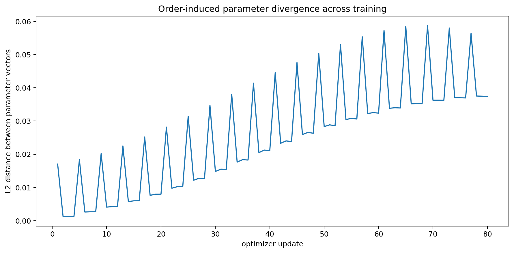

Figure 1. MICRO-001: L2 distance between the two parameter histories during training.

### 1.4 Tokenwise cold start slices

| k | Added token | Δh L2 | z_base | z_swap | P1_base | P1_swap | y_base | y_swap |
| --- | --- | --- | --- | --- | --- | --- | --- | --- |
| 0 | (none) | 0.0135 | -1.3239 | -1.3077 | 0.2102 | 0.2129 | 0 | 0 |
| 1 | AND | 0.0257 | -1.1709 | -1.1387 | 0.2367 | 0.2426 | 0 | 0 |
| 2 | A=1 | 0.0289 | -0.0221 | 0.0139 | 0.4945 | 0.5035 | 0 | 1 |
| 3 | B=0 | 0.0214 | -1.6736 | -1.6396 | 0.1579 | 0.1625 | 0 | 0 |
| 4 | GIVES | 0.0245 | -1.6987 | -1.6628 | 0.1546 | 0.1594 | 0 | 0 |
| 5 | r=0 | 0.0131 | -1.9622 | -1.9340 | 0.1232 | 0.1263 | 0 | 0 |
| 6 | ANSWER | 0.0319 | -0.9578 | -0.9174 | 0.2773 | 0.2855 | 0 | 0 |
| 7 | 0 | 0.0176 | -1.8719 | -1.8403 | 0.1333 | 0.1370 | 0 | 0 |

Microscopic slice k=2. For probe (A=1,B=0), gold=0, adding AND and A=1 gives baseline P(1)=0.494475, z=-0.022100, and swapped P(1)=0.503477, z=+0.013906. The two histories share bare-question endpoints and lie on opposite sides of the decision threshold at this CoT-prefix slice.

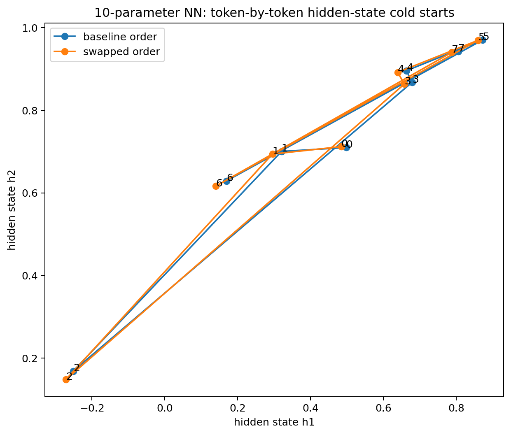

Figure 2. MICRO-001: tokenwise cold-start trajectories of the two-dimensional hidden state for the same probe. Numbers indicate prefix length k.

### 1.5 Exact attribution across ten parameters

At k=2, all 2¹⁰=1024 baseline/swapped parameter-mixture networks are enumerated for an exact Shapley decomposition of the logit difference.

| Parameter | Final base | Final swap | Δθ | k=2 logit Shapley |
| --- | --- | --- | --- | --- |
| b1 | 0.109283 | 0.095263 | 0.014020 | -0.023027 |
| u1 | -0.718315 | -0.705746 | -0.012569 | 0.009139 |
| W12 | 0.382920 | 0.371873 | 0.011048 | -0.008957 |
| W21 | 0.341044 | 0.328209 | 0.012835 | -0.006619 |
| v1 | -0.792429 | -0.768618 | -0.023811 | 0.006231 |
| b2 | 0.460215 | 0.458012 | 0.002203 | -0.005167 |
| W11 | 0.262231 | 0.249618 | 0.012612 | -0.004555 |
| u2 | -0.840504 | -0.843074 | 0.002571 | -0.003532 |
| v2 | -1.309959 | -1.314184 | 0.004226 | 0.000670 |
| W22 | 0.630912 | 0.630753 | 0.000159 | -0.000189 |

The largest absolute contribution is b1: -0.023027. Parameter v1, which has the largest final parameter difference, contributes +0.006231 at this CoT slice. Parameter displacement and output contribution at a specified conditional slice are separately observable quantities.

## 2 CAUSAL-002 Causal dissection along training history

Experimental question. Repeatedly measure the MICRO-001 k=2 CoT slice after each optimizer update and intervene on local order within each of 20 epochs to locate accumulation of history effects along training time.

### 2.1 Continuous monitoring across updates

Fixed slice: Q(A=1,B=0) + AND + A=1. Re-evaluate from h0=0 after every optimizer update.

| Baseline final k=2 logit | -0.022100 |
| --- | --- |
| Final k=2 logit with all 20 epochs swapped | 0.013906 |
| Total history effect Δz | 0.036006 |
| Updates with different hard predictions | 74, 77, 80 |
| update 74 hidden-state distance | 0.025941 |
| update 77 hidden-state distance | 0.091344 |
| update 80 hidden-state distance | 0.028939 |

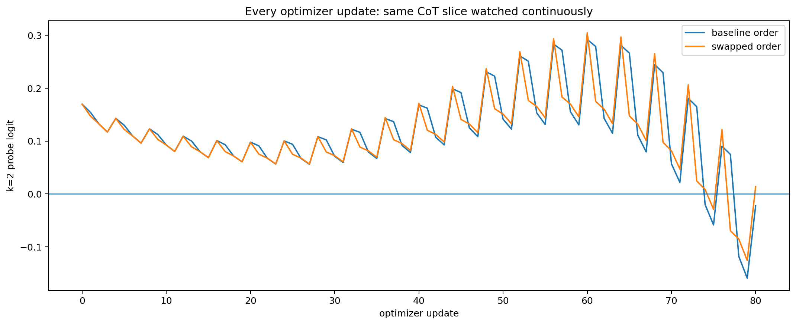

Figure 3. CAUSAL-002: continuous logit observations at the fixed k=2 slice after 80 optimizer updates.

| Update | Epoch | Base record | Swap record | z_base | z_swap | y_base | y_swap | Δh |
| --- | --- | --- | --- | --- | --- | --- | --- | --- |
| 74 | 19 | (0, 1) | (0, 0) | -0.020266 | 0.008449 | 0 | 1 | 0.025941 |
| 77 | 20 | (0, 0) | (0, 1) | 0.074706 | -0.069436 | 1 | 0 | 0.091344 |
| 80 | 20 | (1, 1) | (1, 1) | -0.022100 | 0.013906 | 0 | 1 | 0.028939 |

Interpretation: hard-answer sign changes occur on continuous parameter histories. Parameter, hidden-state and logit differences persist from earlier updates; at updates 74/77/80, the fixed observation function projects these differences into distinct hard labels.

### 2.2 Local order intervention within one epoch

Twenty independent experiments swap (00)/(01) within one epoch each, retaining baseline order in the other 19. Final k=2 logit effects range from 0.001454 to 0.002403; every single intervention retains final hard prediction 0.

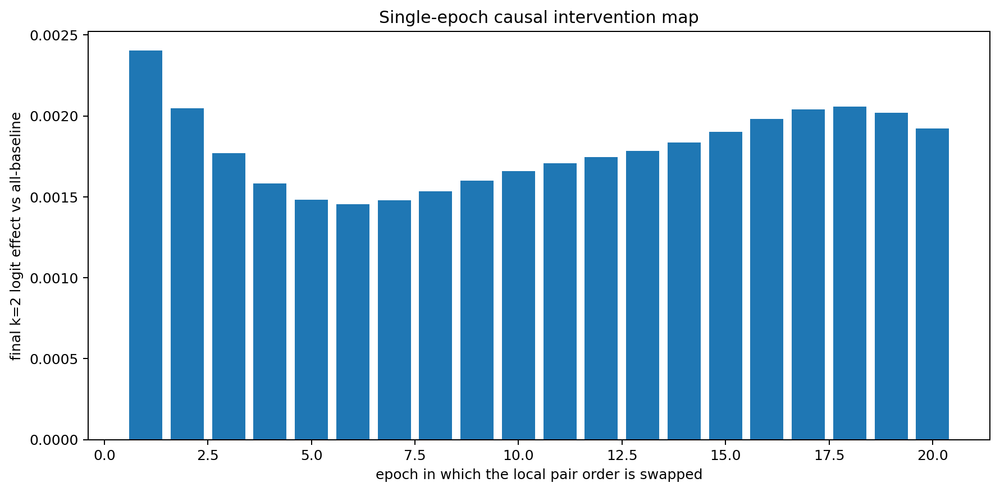

Figure 4. CAUSAL-002: causal effects on the final k=2 logit of a swap in one epoch.

| Swapped epoch | Δz vs baseline | Δθ L2 | Final z | Final y |
| --- | --- | --- | --- | --- |
| 1 | 0.002403 | 0.005901 | -0.019696 | 0 |
| 2 | 0.002046 | 0.004968 | -0.020053 | 0 |
| 3 | 0.001770 | 0.004136 | -0.020330 | 0 |
| 4 | 0.001583 | 0.003424 | -0.020516 | 0 |
| 5 | 0.001483 | 0.002827 | -0.020617 | 0 |
| 6 | 0.001454 | 0.002335 | -0.020645 | 0 |
| 7 | 0.001480 | 0.001937 | -0.020620 | 0 |
| 8 | 0.001535 | 0.001627 | -0.020564 | 0 |
| 9 | 0.001601 | 0.001396 | -0.020499 | 0 |
| 10 | 0.001660 | 0.001235 | -0.020440 | 0 |
| 11 | 0.001707 | 0.001130 | -0.020392 | 0 |
| 12 | 0.001744 | 0.001071 | -0.020355 | 0 |
| 13 | 0.001783 | 0.001048 | -0.020317 | 0 |
| 14 | 0.001834 | 0.001054 | -0.020266 | 0 |
| 15 | 0.001903 | 0.001078 | -0.020196 | 0 |
| 16 | 0.001980 | 0.001104 | -0.020120 | 0 |
| 17 | 0.002039 | 0.001112 | -0.020061 | 0 |
| 18 | 0.002057 | 0.001086 | -0.020042 | 0 |
| 19 | 0.002020 | 0.001022 | -0.020079 | 0 |
| 20 | 0.001921 | 0.000926 | -0.020179 | 0 |

Approximately additive historical accumulation. The 20 single-epoch effects sum to 0.03600304; swapping all 20 epochs produces 0.03600572. The difference is -0.00000268, an absolute relative difference of approximately 0.0074%. In this 10-parameter network at this fixed slice, small order effects accumulate almost additively.

### 2.3 History depth and threshold crossing

Swapping the first n epochs yields final k=2 hard prediction 1 first at n=13. Swapping the last n epochs reaches it first at n=12.

| Mode | n | Final z | P(1) | y | Δθ L2 |
| --- | --- | --- | --- | --- | --- |
| first_n | 0 | -0.022100 | 0.494475 | 0 | 0.000000 |
| last_n | 0 | -0.022100 | 0.494475 | 0 | 0.000000 |
| first_n | 11 | -0.003402 | 0.499149 | 0 | 0.030901 |
| last_n | 11 | -0.001336 | 0.499666 | 0 | 0.011595 |
| first_n | 12 | -0.001677 | 0.499581 | 0 | 0.031730 |
| last_n | 12 | 0.000270 | 0.500067 | 1 | 0.012804 |
| first_n | 13 | 0.000087 | 0.500022 | 1 | 0.032475 |
| last_n | 13 | 0.001808 | 0.500452 | 1 | 0.014167 |
| first_n | 20 | 0.013906 | 0.503477 | 1 | 0.037373 |
| last_n | 20 | 0.013906 | 0.503477 | 1 | 0.037373 |

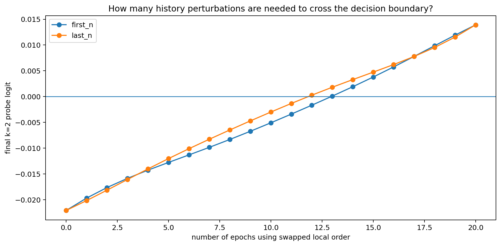

Figure 5. CAUSAL-002: final logit at the fixed k=2 slice for cumulative first-n/last-n epoch swaps.

### 2.4 Residuals after consuming the same record pair

The first two records of each epoch form the same set in both histories, in opposite orders. The table shows the last 5 epochs. Measurements marked “after pair” occur after both histories have consumed that epoch's same two records.

| Epoch | Δz after first | Δz after pair | Δh after pair | Hard y diff |
| --- | --- | --- | --- | --- |
| 16 | 0.103886 | -0.017453 | 0.021417 | 0 |
| 17 | 0.118786 | -0.020722 | 0.022645 | 0 |
| 18 | 0.131486 | -0.024530 | 0.024182 | 0 |
| 19 | 0.140267 | -0.028715 | 0.025941 | 1 |
| 20 | 0.144142 | -0.032812 | 0.027653 | 0 |

## 3 Established case sequence

Local training order directly changes the optimization trajectory. MICRO-001 shows nonzero parameter distance after two updates, by which time both histories have consumed the same two-record set.

Order-induced parameter differences persist and grow through subsequent identical training. After 20 epochs, their L2 distance is 0.037373.

Bare-question endpoints can remain identical question by question. Both MICRO-001 models output 0001 for the four AND questions, with 4/4 correct.

Tokenwise cold starts reveal conditional-slice differences. At k=2, the fixed probe gives z=-0.022100 and z=+0.013906.

Conditional-output differences trace further to parameters and hidden states. At k=2, hidden-state distance is 0.028939; exact ten-parameter Shapley attribution allocates the logit difference across parameters.

History acts through distributed accumulation along training time. The sum of 20 single-epoch effects closely matches the effect of swapping all 20 epochs.

A hard label is a low-dimensional threshold projection. In CAUSAL-002, parameter and logit histories remain separated; hard predictions have different signs at updates 74, 77 and 80.

Current case model: training order → non-commuting optimizer updates → parameter-history divergence → hidden-state divergence under the same token history → logit shift on a CoT-prefix cross-section → hard-label difference when the shifted logit crosses the observation threshold.

## 4 Raw data and figure index

| Experiment | File | Contents |
| --- | --- | --- |
| MICRO-001 | ten_param_nn_training_trace.csv | Complete trajectories of 10 parameters over 80 training updates |
| MICRO-001 | ten_param_nn_token_by_token_microscope.csv | Cold-start hidden states, logits, probabilities and hard outputs for probe k=0…7 |
| MICRO-001 | ten_param_nn_parameter_attribution.csv | Final values of 10 parameters and exact k=2 Shapley contributions |
| MICRO-001 | ten_param_nn_hidden_state_trajectory.png | Tokenwise two-dimensional hidden-state trajectories |
| MICRO-001 | ten_param_nn_parameter_divergence.png | Parameter-vector L2 distance during training |
| CAUSAL-002 | ten_param_update_by_update_probe_trace.csv | Continuous observations at the fixed k=2 slice after every optimizer update |
| CAUSAL-002 | ten_param_single_epoch_causal_swap.csv | 20 single-epoch order interventions |
| CAUSAL-002 | ten_param_cumulative_history_interventions.csv | Cumulative order interventions in the first-n/last-n epochs |
| CAUSAL-002 | ten_param_pair_residuals_by_epoch.csv | Residual differences after consuming the same record pair in each epoch |
| CAUSAL-002 | ten_param_update_timeline_probe_logit.png | Updatewise logit plot at the fixed slice |
| CAUSAL-002 | ten_param_single_epoch_causal_effect.png | Single-epoch causal-effect plot |
| CAUSAL-002 | ten_param_cumulative_swap_threshold.png | History-depth and decision-threshold plot |

## 5 Living record update rules

Microscopy uses MICRO identifiers, training-history interventions use CAUSAL, and mathematical tracing uses MATH. Each series increments independently and is incorporated into this master record.

Each update adds the experimental question, intervention design, endpoint controls, tokenwise/updatewise raw observations, figures, evidence-supported structures and raw-data file index.

Original numerical results remain version-traceable. New analyses are recorded in new subsections, preserving prior observations.

Terminology: identical outputs mean output coincidence at the specified observation point. Training histories, parameter states, hidden-state trajectories and conditional mappings are tracked separately.

| Version | Date | Changes |
| --- | --- | --- |
| v0.2 | 2026-09-26 | v0.2 includes MICRO-001, CAUSAL-002 and MATH-003, adding SGD commutators, mixed training-token derivatives, tangent propagation and exact parameterwise finite-difference CoT dissection. |

## Appendix A Reproducible experimental constants

| Random initialization seed | 1 |
| --- | --- |
| Training task | 2-bit AND |
| Training records | 4 |
| Baseline order | (00) → (01) → (10) → (11) |
| Swapped order | (01) → (00) → (10) → (11) |
| Epoch | 20 |
| Updates per epoch | 4 |
| Total updates | 80 |
| Learning rate | 0.05 |
| Fixed microscopy probe | (A=1,B=0), gold=0 |
| Key CoT slice | k=2: Q + AND + A=1 |

MATH-003 continues on the next page; subsequent experiments append after the current record.

## 6 MATH-003 Mathematical causal tracing of training history

Experimental question. Convert training order → parameter history → conditional CoT response into computable equations: how training tokens change parameter updates, how neighboring sample order creates noncommutative displacements, and how subsequent training propagates these displacements to each CoT-prefix slice.

Core closure equation: Δz(k,T,e) ≈ J(k,T) · Φ(T←e) · η²(Ha·gb − Hb·ga)

J is the parameter Jacobian of the final CoT slice; Φ is the ordered product of subsequent SGD-update Jacobians (I−ηH); the rightmost factor is the second-order noncommutative term from a local order swap.

### 6.1 Local training order as a noncommutative SGD update field

Replication update. V11 validates the quadratic-loss order identity and readout path integral to numerical precision in 20 constructed worlds, and measures approximately cubic remainder decay for the smooth second-order expansion; see 49.6.

For Ua(θ)=θ−ηga(θ) and Ub(θ)=θ−ηgb(θ), swapping adjacent samples gives:

θAB − θBA = η²(Hb ga − Ha gb) + O(η³)

| epoch | \|\|Δθ\|\| exact | \|\|Δθ\|\| formula | cosine | relative error |
| --- | --- | --- | --- | --- |
| 1.000000 | 0.001264 | 0.001268 | 0.999928 | 0.012523 |
| 2.000000 | 0.001282 | 0.001289 | 0.999909 | 0.014732 |
| 3.000000 | 0.001299 | 0.001309 | 0.999880 | 0.017323 |
| 4.000000 | 0.001320 | 0.001332 | 0.999840 | 0.020144 |
| 5.000000 | 0.001348 | 0.001361 | 0.999792 | 0.022895 |
| 6.000000 | 0.001384 | 0.001398 | 0.999743 | 0.025199 |

Epoch 1: directional cosine 0.999928 and relative error 1.25%. Across 20 epoch-start states, mean directional cosine is 0.999421 and the minimum is 0.998740.

### 6.2 Chain derivatives from training tokens through parameters to CoT

Fixed tokens use scalar encoding x_t. For one SGD update:

∂θ⁺/∂x_t = −η · ∂²L/(∂θ∂x_t)

∂z_k/∂x_t = (∂z_k/∂θ)(∂θ⁺/∂x_t)

Direct automatic differentiation and matrix-chain multiplication J·P agree to a maximum absolute error of 6.505e-19. This transfer matrix maps local numerical perturbations of training tokens directly to the logit at subsequent CoT slice k.

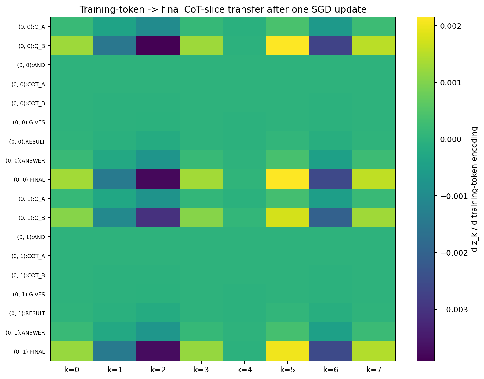

Figure 3.1 Local transfer matrix from training tokens through one parameter update to CoT-prefix logits.

### 6.3 Exact finite difference dissection of the final histories on CoT

For the final baseline and swapped models, hidden-state differences under the same token x_t satisfy the exact identity:

Δh_t = S_t[ W̄Δh_(t−1) + ΔW h̄_(t−1) + Δu x_t + Δb ]

Δz_t = v̄ᵀΔh_t + Δvᵀh̄_t

S_t contains componentwise secant slopes of tanh between the two trajectories. Recursing separately over all 10 parameters reconstructs the true Δz from their summed contributions with maximum residual 4.094e-16.

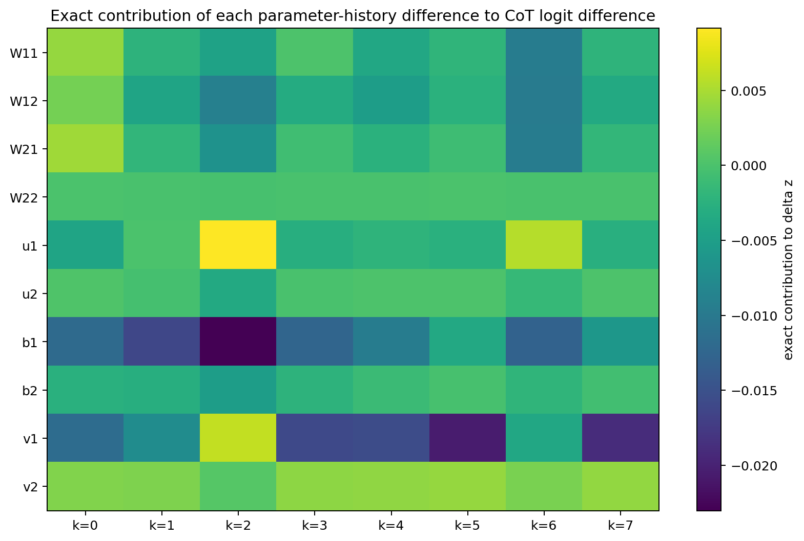

Figure 3.2 Exact contribution of each parameter component to logit differences across CoT slices.

### 6.4 Historical events through subsequent training to final CoT

Each subsequent SGD update has local propagation matrix A_s=I−ηH_s. Propagate the local swap displacement through all future updates and read it through the final CoT Jacobian:

Δz(k,T,e) ≈ J(k,T) · [Π A_s] · Δθ_e

| Prediction chain | Correlation across 160 observations | relative L2 error (%) |
| --- | --- | --- |
| Actual local swap Δθ + tangent propagation | 0.999994 | 0.338294 |
| Hessian/gradient commutator + tangent propagation | 0.998317 | 2.544101 |

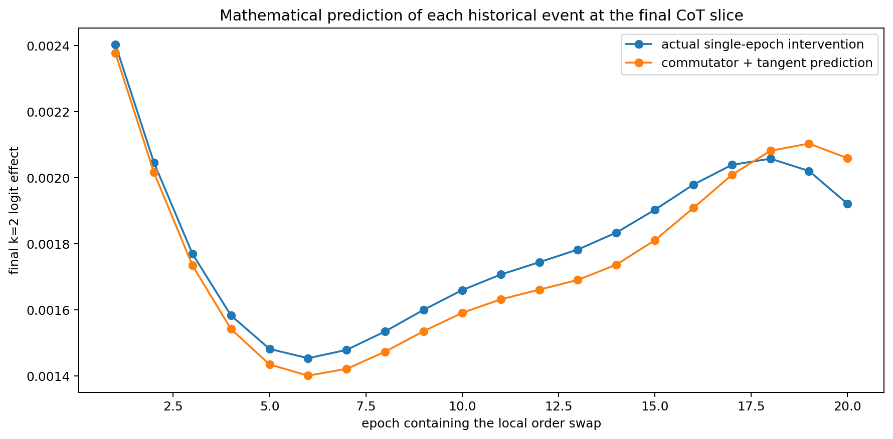

Figure 3.3 Predicting the final k=2 CoT effect of a single-epoch order swap using the mathematical propagation equation.

### 6.5 History conditioned tangent geometry within CoT

Let D_t=diag(1−h_t²) and A_t=D_tW. The local influence of an earlier token x_j on later z_t is:

∂z_t/∂x_j = vᵀ A_t A_(t−1)…A_(j+1) D_j u

Analytical recursion and autograd agree to 2.220e-16. The final CoT tangent maps of the two histories have Frobenius distance 0.051691. The same token sequence therefore has different local propagation geometry on the two historical foundations.

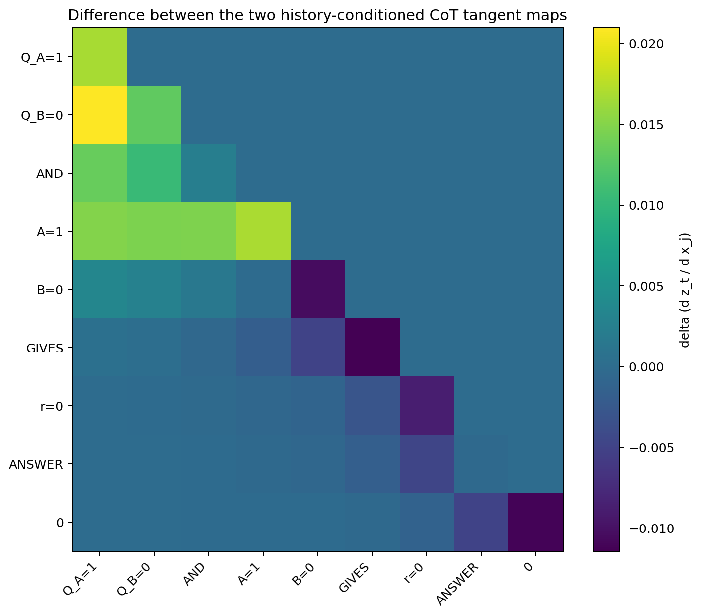

Figure 3.4 Difference between CoT token-to-token tangent maps under the two training histories.

MATH-003 evidence chain. In this fully observable 10-parameter system, the noncommutative term of the SGD gradient field quantifies local order effects. Mixed second derivatives describe a training token's effect on one parameter update. Subsequent training propagates that perturbation through Hessian tangent maps, and the parameter Jacobian reads out the final CoT-prefix logit. Exact finite-difference recursion also reconstructs tokenwise state/output differences between the final histories parameter by parameter.

### 6.6 MATH-003 raw data index

| File | Contents |
| --- | --- |
| order_commutator_by_epoch.csv | Actual order differences and Hessian/gradient commutator predictions at 20 epoch starts |
| training_token_to_parameter_derivatives.csv | Mixed derivatives of one SGD update of 10 parameters with respect to 36 training tokens |
| training_token_to_cot_transfer.csv | Chain transfer from training tokens through parameters to 8 CoT slices |
| exact_parameter_to_cot_decomposition.csv | Exact ten-parameter finite-difference CoT decomposition between the final histories |
| epoch_event_to_final_cot_causal_trace.csv | 20 local historical events through subsequent training to 8 final CoT slices |
| cot_tangent_delta_base_minus_swap.csv | Difference between two history-conditioned CoT tangent maps |
| MATH_CAUSAL_TRACE_003.md | Mathematical description and key results |

## Version update

| Version | Date | Additions |
| --- | --- | --- |
| v0.2 | 2026-09-26 | Added MATH-003: SGD commutators, mixed training-token derivatives, tangent propagation and exact parameterwise finite-difference CoT dissection. |

## 7 SVD-004 Characteristic modes of the history to CoT causal kernel

Experimental question. Apply SVD to the 20×8 history-to-CoT causal kernel K from MATH-003 to determine how many independent modes carry training-history effects and trace the origin of low rank along history → parameters → CoT.

Definition: K(e,k) is the causal effect on the final CoT-prefix-k logit of swapping local training order only in epoch e. In K=UΣVᵀ, U contains training-history modes and V contains CoT-response modes.

### 7.1 Three modes account for almost all 160 causal observations

Replication update. The source audit reproduces the original kernel spectrum. V08 extends energy concentration to nine common-coordinate neural Jacobians, with 3–6 modes carrying 95% of energy; see 49.2.

| mode | σ | energy % | cumulative % |
| --- | --- | --- | --- |
| 1 | 0.0213779 | 97.3777 | 97.3777 |
| 2 | 0.00336278 | 2.4095 | 99.7872 |
| 3 | 0.000995583 | 0.211195 | 99.9984 |
| 4 | 8.60076e-05 | 0.00157617 | 99.9999 |

The first mode explains 97.378% of energy, the first two 99.787%, and the first three 99.99836%. Rank-3 reconstruction has relative Frobenius error 0.405%. Stable rank is 1.0269.

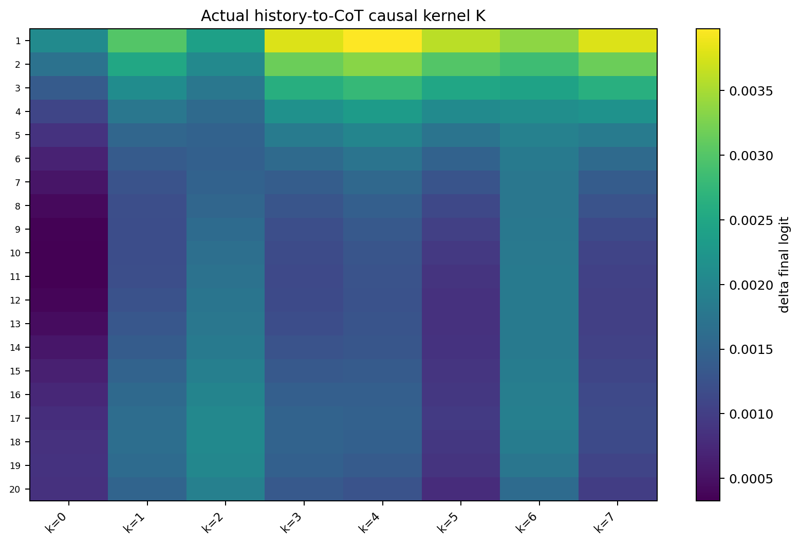

Figure 7.1 Measured 20×8 history-to-CoT causal kernel.

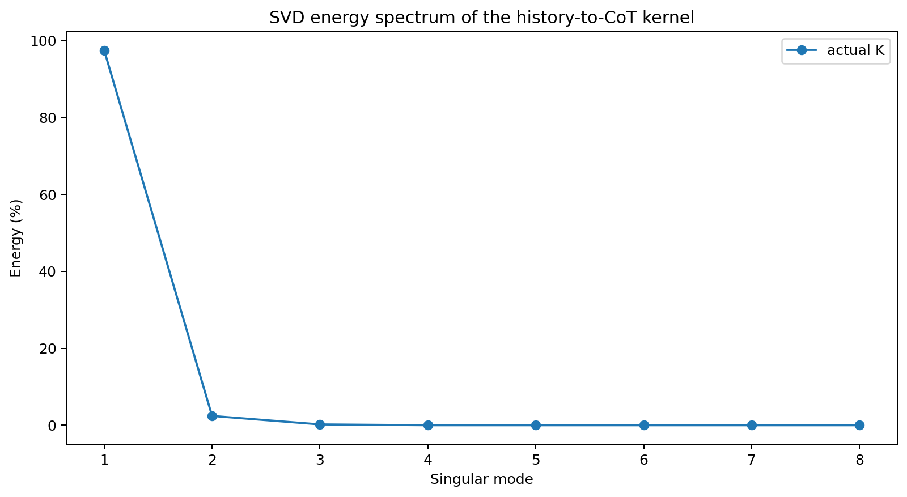

Figure 7.2 Singular-value energy spectrum of K.

### 7.2 Low rank propagates from parameter space to CoT

Let D(e,:) be the final 10-parameter displacement from a single-epoch order swap and J(k,:)=∂z_k/∂θ the final baseline CoT parameter Jacobian. The first-order readout is:

K ≈ D Jᵀ

DJᵀ correlates with actual K at 0.999996, with relative L2 error 0.150%. D's first mode carries 93.12% of energy and its first three 99.944%; J's first three carry 99.314%. Historical parameter and CoT readout subspaces jointly shape K's low rank.

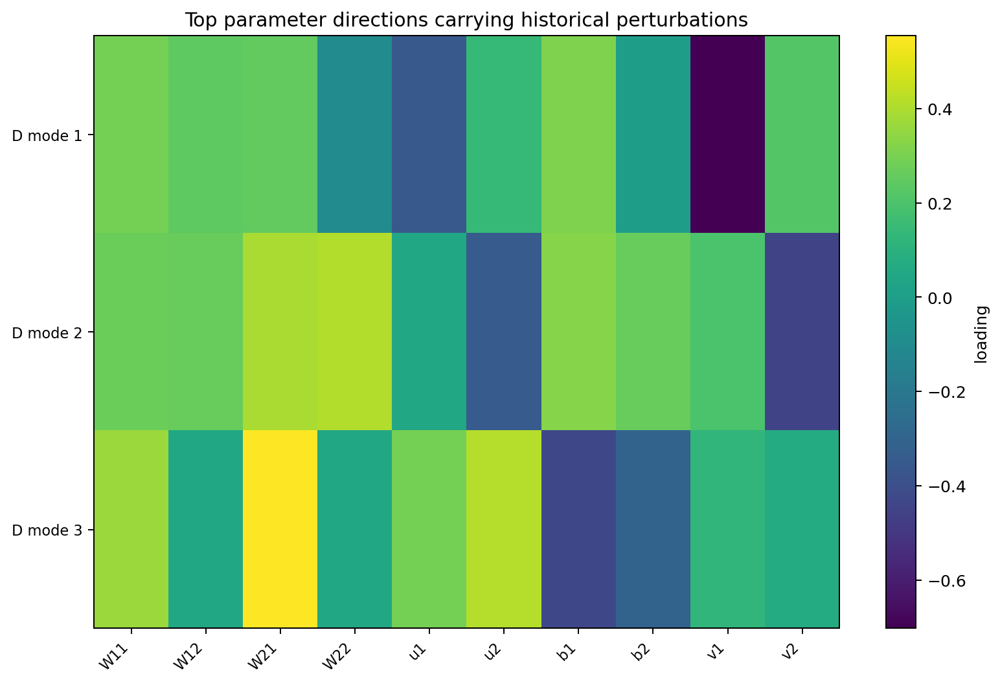

Figure 7.3 First three directions carrying historical perturbations in final parameter space.

### 7.3 Low frequency history structure after amplitude removal

Normalize each row of K by its L2 norm and remove the mean CoT shape. The first remaining shape mode carries 85.35% of energy and the first two 99.81%. Absolute cosines of the first four history-shape modes with DCT frequencies 1–4 are 0.905, 0.901, 0.979 and 0.927. Each exceeds all values in its 50,000 random epoch permutations.

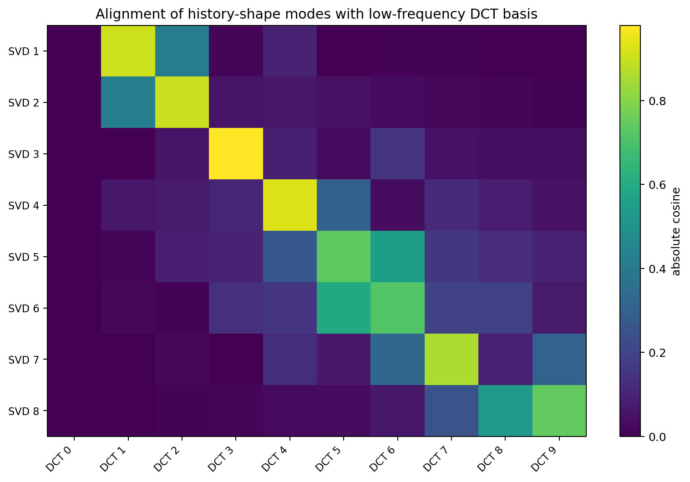

Figure 7.4 Alignment of history-shape singular modes with discrete cosine bases.

### 7.4 Approximately low rank training token to CoT transfer

In the 36×8 training-token→CoT derivative matrix from MATH-003, the first singular mode carries 98.856% of energy, the first two 99.975%, and the first three 99.99956%. Local numerical training-token effects reach CoT mainly through one shared transmission mode.

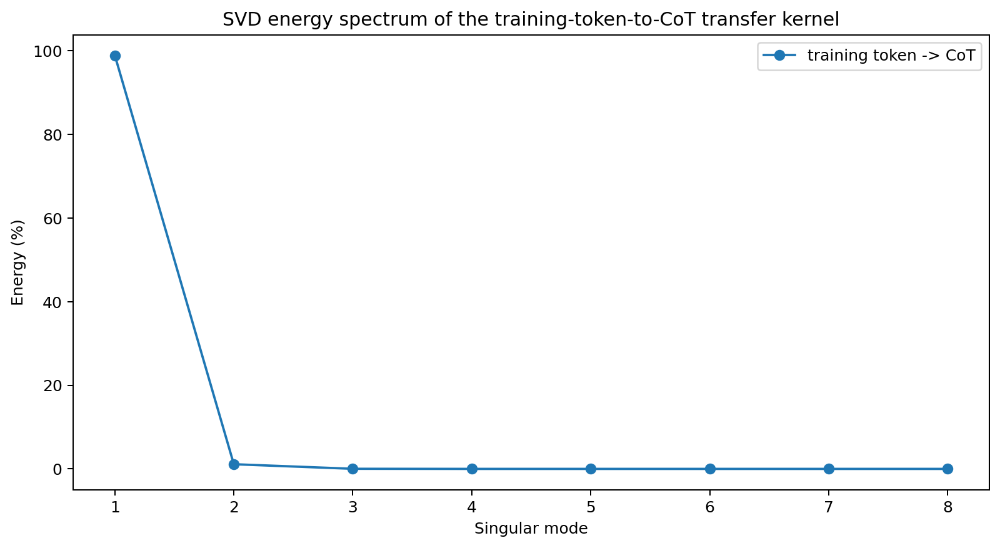

Figure 7.5 Singular-value energy spectrum of the training-token→CoT transfer kernel.

SVD-004 evidence chain. In this 10-parameter case, a few coupled modes account for almost all 160 intervention effects from 20 historical positions to 8 CoT slices: a dominant global-amplitude mode and a few corrections for historical position and CoT shape. Historical displacements are already strongly low-dimensional in parameter space, and the CoT Jacobian further selects and compresses their directions.

### 7.5 SVD-004 raw data index

| File | Contents |
| --- | --- |
| K_actual_20x8.csv | Measured causal kernel for 20 local historical events × 8 final CoT slices |
| svd_spectrum_all_K.csv | Full singular spectra of measured K and two mathematical predictions |
| history_singular_modes.csv / cot_singular_modes.csv | Left and right singular vectors of K |
| history_event_to_final_parameter_matrix_D.csv | Final ten-parameter displacements from 20 historical events |
| final_cot_parameter_jacobian_J.csv | Final Jacobian of 8 CoT slices with respect to 10 parameters |
| history_shape_DCT_permutation_audit.csv | Permutation audit of amplitude-normalized history-shape/DCT alignment |
| training_token_to_cot_svd_spectrum.csv | SVD of the local training-token→CoT derivative kernel |
| SVD_HISTORY_MODES_004.md | Mathematical description and results |

## Version update

| Version | Date | Additions |
| --- | --- | --- |
| v0.3 | 2026-09-26 | Added SVD-004: history-to-CoT causal-kernel SVD, its parameter-space origin, low-frequency DCT history modes and low-rank training-token transfer. |

## 8 CHAIN-ANSWER-005 Causal decomposition of CoT and final answers

Objective: express history-induced changes in generated chains and final answers as separately intervenable, cross-transplantable mathematical objects traceable to changes in ten parameters.

### 8.1 Ten parameter autoregressive case with self generated and reinjected CoT tokens

The network remains h_t = tanh(W h_{t-1}+u x_t+b), z_t=vᵀh_t, with 10 trainable parameters. For Q=(A,B), the endpoint is y=A. Each question has two teacher-forced chain encodings: route r∈{0,1}, code c=A xor r, and final y=c xor r=A.

Both histories share initialization, 8 records/epoch, learning rate 0.01, 60 epochs and update count. The sole intervention reverses the r0/r1 chain records within each question. Answer-loss weight is 3.

### 8.2 Generated chains diverge under identical endpoints

| Observable | History A | History B |
| --- | --- | --- |
| Hard endpoints across 4 questions | 0011 (4/4 correct) | 0011 (4/4 correct) |
| Self-generated chain for Q=(0,0) | (1,0) | (0,0) |
| Q=(0,0) route P(r=1) | 0.612 | 0.311 |
| Self-generated answer P(y=1) for Q=(0,0) | 0.441 | 0.185 |

For Q=(0,0), the histories generate different intermediate chains and both answer correctly with 0. This records coincidence at the final hard-answer observation for two distinct model paths.

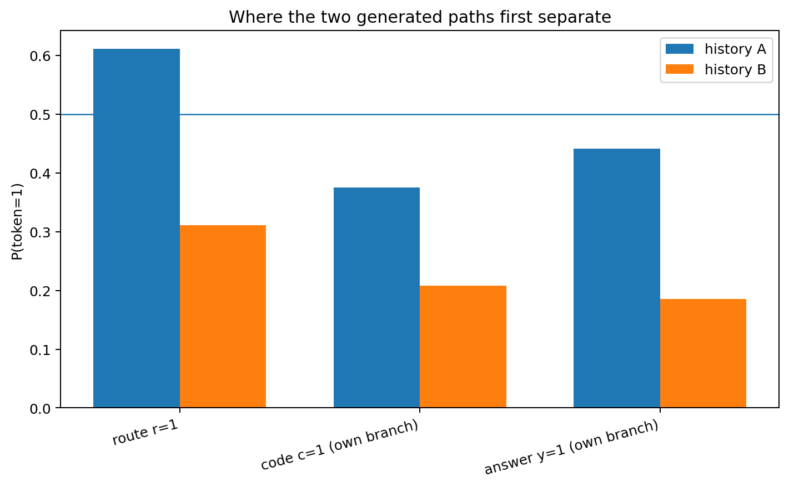

Figure 8.1 Token=1 probabilities at self-generated route, code and answer stages.

### 8.3 CoT cross transplantation treats chain and model as independent causal variables

A 2×2 factorial experiment for Q=(0,0) fixes either History A or B parameters, forces Chain A=(1,0) or Chain B=(0,0), and reads the final answer logit.

| Model | Forced chain | answer logit | hard answer |
| --- | --- | --- | --- |
| history_A | (1,0) | -0.2371 | 0 |
| history_A | (0,0) | +1.6502 | 1 |
| history_B | (1,0) | -1.4976 | 0 |
| history_B | (0,0) | -1.4796 | 0 |

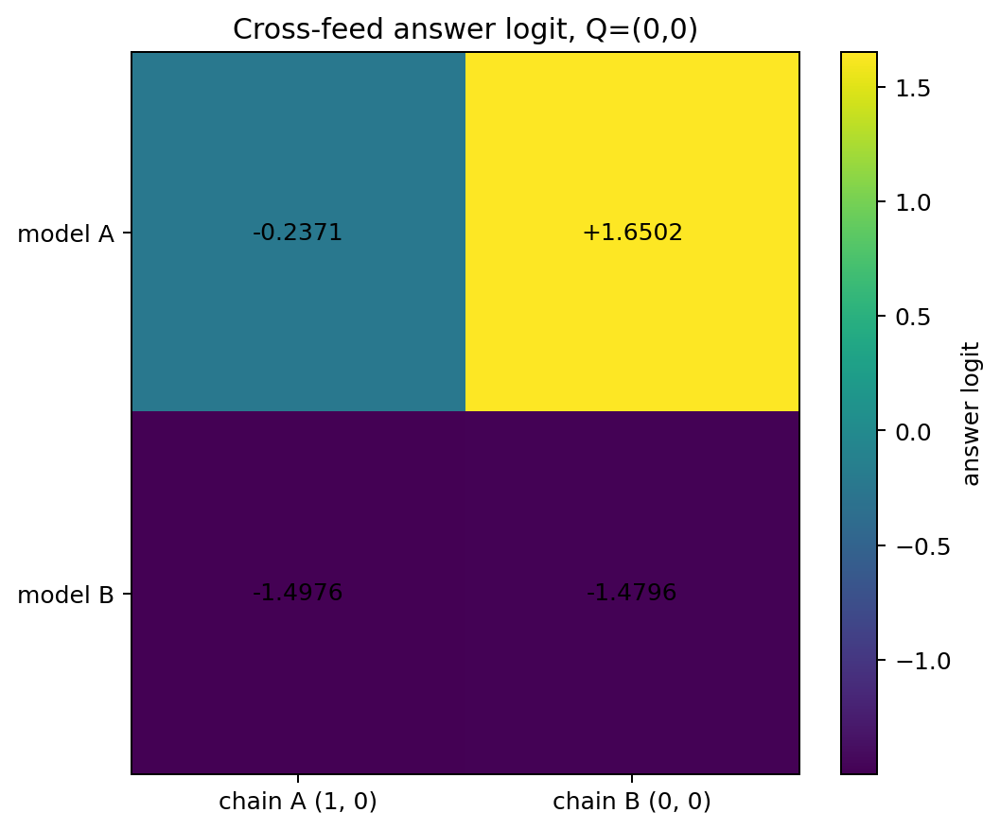

Figure 8.2 Final answer logits following Model × Chain cross-transplantation.

History A outputs 0 with its own chain (1,0). Replacing only the chain with (0,0) changes the answer logit from −0.2371 to +1.6502 and the hard answer to 1. History B outputs 0 under both chains; its route-chain effect is approximately −0.0180 logit.

### 8.4 Distinct causal organizations can realize the same endpoint

The total generated-state difference has the exact logit decomposition:

z_A(C_A) − z_B(C_B) = [z_A(C_B) − z_B(C_B)] + [z_A(C_A) − z_A(C_B)]

Here the total generated-state difference is +1.2425, the direct parameter effect with Chain B fixed is +3.1298, and the chain-mediated effect within History A is −1.8873. Their sum is exactly +1.2425.

History A's CoT route thus supplies compensatory control on this question. With its parameters fixed, Chain B gives the incorrect answer 1; its self-generated Chain A pushes the logit back to answer 0. History B has low sensitivity to the route intervention. Model×Chain interaction is −1.8693 logit.

### 8.5 Mathematical roles of CoT output discretization and reinjection

The autoregressive factorization is Pθ(r,c,y|Q)=Pθ(r|Q)·Pθ(c|Q,r)·Pθ(y|Q,r,c). Each CoT token is generated from the current state and then enters recurrent dynamics as the next input. Greedy selection is r=H(z_r(θ,Q)), followed by h_next=Fθ(h,x(r)).

A CoT token is both an observable output and an intervention variable for future state. Continuous history-induced parameter displacement can first move the route logit across 0; the resulting discrete token change then creates a finite state displacement through reinjection.

On forced branch (r=1,c=0), local ∂z_answer/∂x_route is -3.350 for History A and -0.003 for History B. The same symbol has markedly different local control gain under different training histories.

### 8.6 Exact integration of finite parameter differences into chain and answer effects

For any smooth output f(θ), the finite difference between the final models satisfies the line-integral identity:

f(θ_A)−f(θ_B)=∫₀¹ ∇θf(θ_B+sΔθ)ᵀΔθ ds

Using 64-point Gauss–Legendre integration, the experiment decomposes finite logit differences for route, code and answers under four fixed chains across all 10 parameters. Maximum closure error is 2.6×10⁻⁹.

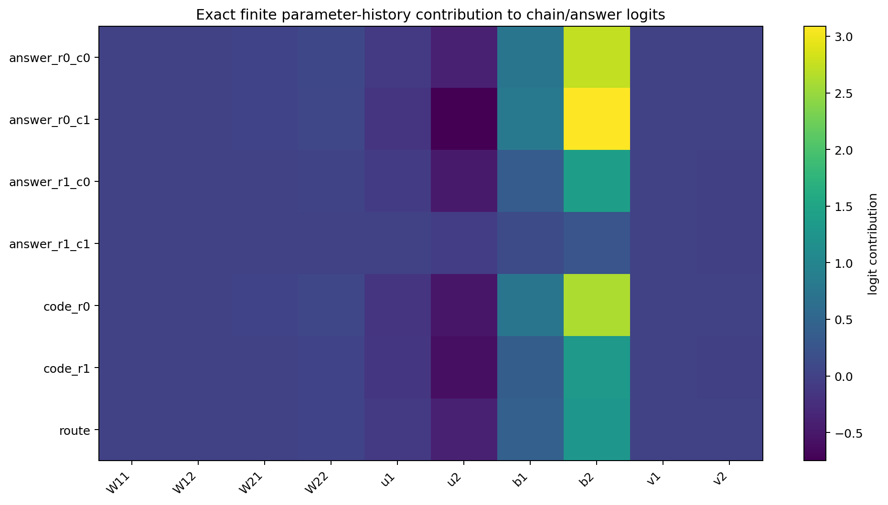

Figure 8.3 Parameterwise finite-difference contributions of the same final Δθ to conditional route, code and answer functions.

### 8.7 Replication across 100 initializations at fixed settings

Learning rate 0.01, 60 epochs, answer-loss weight 3 and both orders remain fixed; shared initialization seed ranges from 1 to 100.

Of 100 initializations, 4 yield correct and identical 0011 endpoints under both histories. Two of these have different self-generated chains. In both, chain cross-transplantation flips at least one model's hard answer and reveals one-sided/asymmetric chain control. Strong control is in History A for seed 14 and History B for seed 25.

This scan reproduces cases in which CoT differences correspond to downstream control differences under strictly identical endpoints. Frequencies describe this fixed ten-parameter architecture and hyperparameter scan.

### 8.8 CHAIN-ANSWER-005 raw data index

CHAIN_ANSWER_DECOMP_005/generated_chain_and_answer_endpoints.csv

CHAIN_ANSWER_DECOMP_005/cross_feed_model_by_chain.csv

CHAIN_ANSWER_DECOMP_005/cross_feed_mediation_decomposition.csv

CHAIN_ANSWER_DECOMP_005/conditional_chain_answer_surface.csv

CHAIN_ANSWER_DECOMP_005/autoregressive_path_probability_factorization.csv

CHAIN_ANSWER_DECOMP_005/chain_token_discrete_intervention_effects.csv

CHAIN_ANSWER_DECOMP_005/chain_token_to_answer_local_tangent.csv

CHAIN_ANSWER_DECOMP_005/parameter_to_chain_answer_integrated_contributions.csv

CHAIN_ANSWER_DECOMP_005/functional_logit_difference_closure.csv

CHAIN_ANSWER_DECOMP_005/replication_100_seeds_summary.csv

CHAIN_ANSWER_DECOMP_005/replication_chain_diff_cases.csv

CHAIN_ANSWER_DECOMP_005/CHAIN_ANSWER_DECOMP_005.md

## Version update

| Version | Date | Added experiment | Core additions |
| --- | --- | --- | --- |
| v0.4 | 2026-09-26 | CHAIN-ANSWER-005 | CoT as a self-generated/reinjected causal mediator; Model×Chain cross-transplants; parameter origins of chain/answer differences |

## 9 CHAIN-CONTROL-006 Surface identity feedback actions and state control of CoT tokens

Objective: independently intervene on a CoT token's visible label, numerical reinjection action, continuous hidden state carried across tokens and final-answer control in the same 10-parameter autoregressive RNN.

### 9.1 Structural equations for discrete action points on continuous control surfaces

For fixed Q, visible route/code labels are R and C; numerical inputs to subsequent recurrent transitions are x_R and x_C. With θ fixed, the final answer logit is a two-dimensional control surface:

Zθ(x_R,x_C|Q)=vᵀFθ(Fθ(Fθ(Fθ(h_R,x_R),M_CODE),x_C),M_ANS)

Normal autoregression produces discrete R from the route logit and feeds back x_R=BIT[R], then produces C and feeds back x_C=BIT[C]. Each self-generated CoT thus selects one discrete coordinate on Zθ.

### 9.2 Experimental separation of visible identity and feedback action

| Model | Condition | Visible R | Visible C | x_R | x_C | answer logit | hard |
| --- | --- | --- | --- | --- | --- | --- | --- |
| history_A | Normal | 1 | 0 | +1.0 | -1.0 | -0.2371 | 0 |
| history_A | Hidden labels / original actions | ∅ | ∅ | +1.0 | -1.0 | -0.2371 | 0 |
| history_A | Renamed / original actions | 0 | 1 | +1.0 | -1.0 | -0.2371 | 0 |
| history_A | Original labels / neutral actions | 1 | 0 | +0.0 | +0.0 | +1.5338 | 1 |
| history_A | Original labels / reversed actions | 1 | 0 | -1.0 | +1.0 | +1.5612 | 1 |
| history_A | Renamed / reversed actions | 0 | 1 | -1.0 | +1.0 | +1.5612 | 1 |
| history_B | Normal | 0 | 0 | -1.0 | -1.0 | -1.4796 | 0 |
| history_B | Hidden labels / original actions | ∅ | ∅ | -1.0 | -1.0 | -1.4796 | 0 |
| history_B | Renamed / original actions | 1 | 1 | -1.0 | -1.0 | -1.4796 | 0 |
| history_B | Original labels / neutral actions | 0 | 0 | +0.0 | +0.0 | -1.5112 | 0 |
| history_B | Original labels / reversed actions | 0 | 0 | +1.0 | +1.0 | -1.5227 | 0 |
| history_B | Renamed / reversed actions | 1 | 1 | +1.0 | +1.0 | -1.5227 | 0 |

For seed 14, Q=(0,0), History A normally generates Chain=(1,0), with answer logit=-0.2371. Renaming visible labels to (0,1), or hiding them entirely, preserves -0.2371 exactly when numerical feedback remains (+1,-1). Keeping labels (1,0) and setting feedback to (0,0) or (-1,+1) changes logits to +1.5338 and +1.5612, respectively, both giving hard answer 1.

Across 8 cases (two histories × 4 questions), renaming labels with feedback actions fixed has maximum logit error 0.0e+00.

### 9.3 Route tokens control subsequent chain generation branches

| Model | Route feedback condition | x_R | Regenerated code | code logit | answer logit | hard |
| --- | --- | --- | --- | --- | --- | --- |
| history_A | normal | +1.0 | 0 | -0.5093 | -0.2371 | 0 |
| history_A | route_neutral | +0.0 | 1 | +0.8672 | +1.1522 | 1 |
| history_A | route_opposite | -1.0 | 1 | +1.4361 | +1.5612 | 1 |
| history_B | normal | -1.0 | 0 | -1.3348 | -1.4796 | 0 |
| history_B | route_neutral | +0.0 | 0 | -1.4444 | -1.4928 | 0 |
| history_B | route_opposite | +1.0 | 0 | -1.4948 | -1.4976 | 0 |

History A retains visible route=1 and changes its feedback from +1 to 0: subsequent code changes from 0 to 1 and answer from 0 to 1. Feedback -1 produces the same branch change. For History B, changing route feedback from -1 to 0 or +1 preserves the observed code and hard answer.

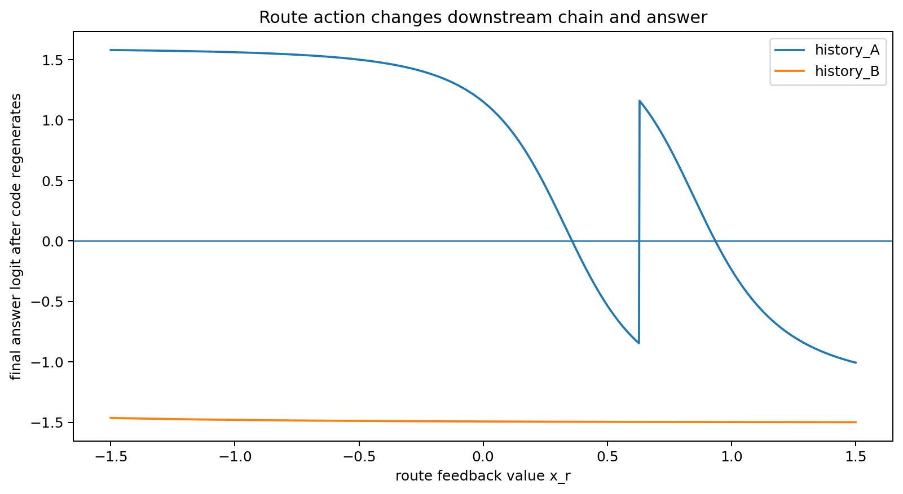

Figure 9.1 Final answer logit after sweeping route feedback x_R and regenerating code autonomously. History A has piecewise switches; History B stays within one hard-answer region across the sweep.

| Model | Observable | Switch location x_R | Switch count |
| --- | --- | --- | --- |
| history_A | regenerated_code | 0.628750 | 1 |
| history_A | answer_pred | 0.358750;0.628750;0.936250 | 3 |
| history_B | regenerated_code |  | 0 |
| history_B | answer_pred |  | 0 |

History A's code branch switches at x_R≈0.62875. Along the same continuous route sweep, the final hard answer switches three times, at approximately 0.35875, 0.62875 and 0.93625. Continuous state change and discrete code regeneration jointly produce these switches.

### 9.4 Training histories form different CoT control geometries

On a 101×101 grid with x_R,x_C∈[-1.25,1.25], relative Frobenius difference between answer-logit surfaces is 1.7116. Hard-answer signs differ at 75.40% of grid points.

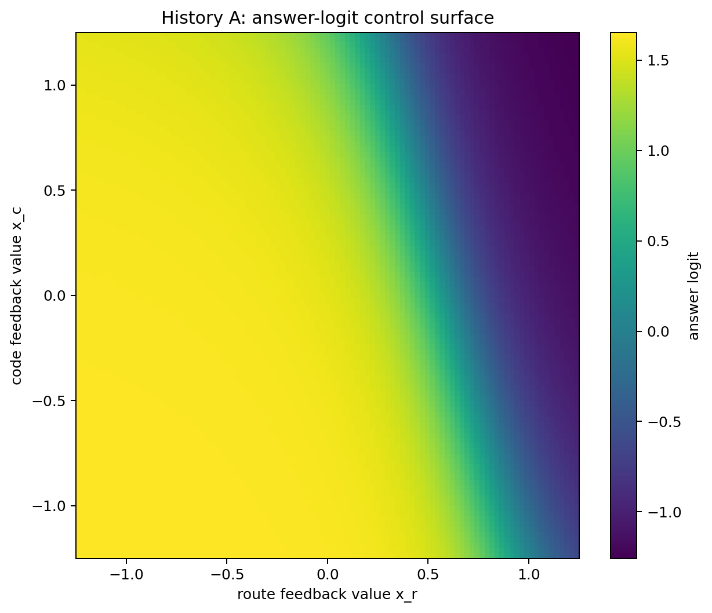

Figure 9.2 History A's continuous CoT feedback control surface Zθ(x_R,x_C|Q).

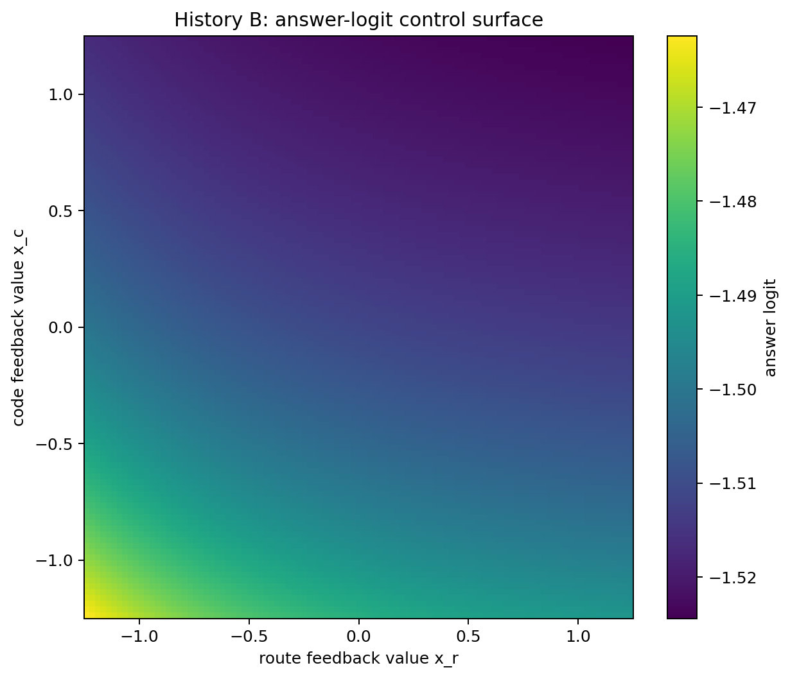

Figure 9.3 History B's continuous CoT feedback control surface Zθ(x_R,x_C|Q).

History A has distinct route/code decision boundaries in the scan; History B's answer surface has negative logits throughout. For A, answer boundaries lie at x_R≈0.93524 with x_C=-1 and x_R≈0.35818 with x_C=+1. The code's route-control boundary is x_R≈0.62854.

### 9.5 Discrete token flips as path integrals of continuous local control gain

With the other coordinate fixed, changing token feedback from -1 to +1 produces the finite answer-logit effect:

Z(+1,c)−Z(−1,c)=∫[-1,+1] ∂Z(x,c)/∂x dx

| Model | Control axis | Fixed coordinate | Finite effect | Integrated local gain | Closure error |
| --- | --- | --- | --- | --- | --- |
| history_A | route_-1_to_+1 | code=-1 | -1.887306 | -1.887306 | 4.00e-15 |
| history_A | route_-1_to_+1 | code=+1 | -2.744479 | -2.744479 | -7.99e-15 |
| history_A | code_-1_to_+1 | route=-1 | -0.089051 | -0.089051 | 2.08e-16 |
| history_A | code_-1_to_+1 | route=+1 | -0.946224 | -0.946224 | 2.44e-15 |
| history_B | route_-1_to_+1 | code=-1 | -0.018004 | -0.018004 | 9.02e-17 |
| history_B | route_-1_to_+1 | code=+1 | -0.006328 | -0.006328 | -1.73e-18 |
| history_B | code_-1_to_+1 | route=-1 | -0.036776 | -0.036776 | 1.87e-16 |
| history_B | code_-1_to_+1 | route=+1 | -0.025100 | -0.025100 | 9.02e-17 |

Maximum closure error for 96-point Gauss–Legendre integration is 8.0e-15. Finite control effects of discrete CoT tokens therefore decompose into integrals of local gain along continuous feedback coordinates.

### 9.6 Continuous hidden states and discrete feedback form separable interacting channels

| Model | Continuous state carry | Discrete feedback | answer logit | hard |
| --- | --- | --- | --- | --- |
| history_A | 0 | 0 | -0.0078 | 0 |
| history_A | 0 | 1 | +1.1417 | 1 |
| history_A | 1 | 0 | +1.5338 | 1 |
| history_A | 1 | 1 | -0.2371 | 0 |
| history_B | 0 | 0 | +0.3304 | 1 |
| history_B | 0 | 1 | +0.9318 | 1 |
| history_B | 1 | 0 | -1.5112 | 0 |
| history_B | 1 | 1 | -1.4796 | 0 |

| Model | Full | Carry + neutral feedback | Reset + feedback | Reset + neutral feedback | Interaction |
| --- | --- | --- | --- | --- | --- |
| history_A | -0.2371 | +1.5338 | +1.1417 | -0.0078 | -2.9204 |
| history_B | -1.4796 | -1.5112 | +0.9318 | +0.3304 | -0.5697 |

This 2×2 intervention separates continuous state carry from numerical token feedback. Carry×feedback logit interaction is -2.9204 in History A and -0.5697 in History B, supporting joint dynamics of current continuous state and token feedback action as the source of CoT control.

### 9.7 Replication in a mirrored case

| seed | Model | Self-generated chain | Normal logit | Effect of reversed route action | Effect of neutral route action |
| --- | --- | --- | --- | --- | --- |
| 14 | history_A | (1, 0) | -0.2371 | +1.8873 | +1.8597 |
| 14 | history_B | (0, 0) | -1.4796 | -0.0180 | -0.0132 |
| 25 | history_A | (0, 0) | -1.3596 | -0.0069 | -0.0060 |
| 25 | history_B | (1, 0) | -0.2648 | +1.3943 | +1.3601 |

Strong route control occurs in History A for seed 14 and, in a mirrored structure, History B for seed 25. Both retain the correct, identical endpoints of CHAIN-ANSWER-005.

### 9.8 Working mathematical interpretation of CoT

In this controlled autoregressive case, a CoT token comprises a visible symbol, a numerical action reinjected into the dynamical system and a continuous hidden state carried across tokens. The current model state selects a discrete label; fixed encoding selects a discrete action point on the control surface. Consequences depend jointly on the continuous state and history-shaped control geometry.

The experiment separates observable textual identity from computational action: renaming symbols with feedback fixed preserves future dynamics; changing feedback with symbols fixed can change subsequent chains and answers. History A's route token controls bifurcation in this case; History B's corresponding coordinate has low gain over the same scan.

### 9.9 CHAIN-CONTROL-006 raw data index

CHAIN_CONTROL_006/CHAIN_CONTROL_006.md

CHAIN_CONTROL_006/surface_identity_vs_feedback_action_selected_case.csv

CHAIN_CONTROL_006/all_questions_surface_action_audit.csv

CHAIN_CONTROL_006/route_feedback_regenerate_downstream.csv

CHAIN_CONTROL_006/state_feedback_factorial.csv

CHAIN_CONTROL_006/state_feedback_factorial_interactions.csv

CHAIN_CONTROL_006/boundary_channel_ablations.csv

CHAIN_CONTROL_006/continuous_chain_control_surface.csv

CHAIN_CONTROL_006/route_control_slice_xcode_minus1.csv

CHAIN_CONTROL_006/finite_token_control_integrals.csv

CHAIN_CONTROL_006/control_decision_thresholds.csv

CHAIN_CONTROL_006/route_action_regenerated_chain_sweep.csv

CHAIN_CONTROL_006/route_action_regenerated_switches.csv

CHAIN_CONTROL_006/seed14_seed25_control_replication.csv

CHAIN_CONTROL_006/summary.json

## Version update

| Version | Date | Added experiment | Core additions |
| --- | --- | --- | --- |
| v0.5 | 2026-09-26 | CHAIN-CONTROL-006 | Separation of surface identity, numerical feedback and continuous state; continuous control surfaces; route bifurcations; finite-control integrals |

## 10 CHAIN-SEMANTICS-007 String semantics and state transition semantics of CoT

Objective: separate surface string identity from computational function within a training history. Can different strings yield nearly identical future dynamics in one model, and can the same string yield markedly different dynamics across histories?

### 10.1 Operational definition of functional semantics

For fixed θ, Q and chain C, define the functional semantic signature:

Sθ(C;Q) = (h_after_chain, Rθ(C; ξ))

Here h_after_chain is the two-dimensional state after route/code feedback. Rθ(C;ξ) is the downstream answer-logit response obtained by applying standardized future probe ξ∈[-1.25,1.25] and then the answer marker. Surface distance is two-bit Hamming distance; functional distance is future-response RMS. Hidden-state distance, answer-logit difference and answer-state-gradient distance are also saved.

### 10.2 Different strings can yield nearly identical future response functions

| History | chain 1 | chain 2 | Hamming | Hidden-state distance | future RMS | \|Δanswer logit\| | Answer-gradient distance |
| --- | --- | --- | --- | --- | --- | --- | --- |
| history_A | 00 | 11 | 2 | 2.345494 | 2.898590 | 2.833530 | 0.979627 |
| history_A | 01 | 11 | 1 | 1.987986 | 2.816272 | 2.744479 | 0.823645 |
| history_B | 00 | 11 | 2 | 0.106825 | 0.007250 | 0.043104 | 0.089633 |
| history_B | 01 | 11 | 1 | 0.032370 | 0.001136 | 0.006328 | 0.014072 |

For seed14, maximally different strings 00 vs 11 (Hamming=2) have future-response RMS 2.898590 in History A and 0.007250 in History B, approximately a 400-fold difference. For 01 vs 11, B has RMS 0.001136 and A 2.816272, approximately a 2480-fold difference.

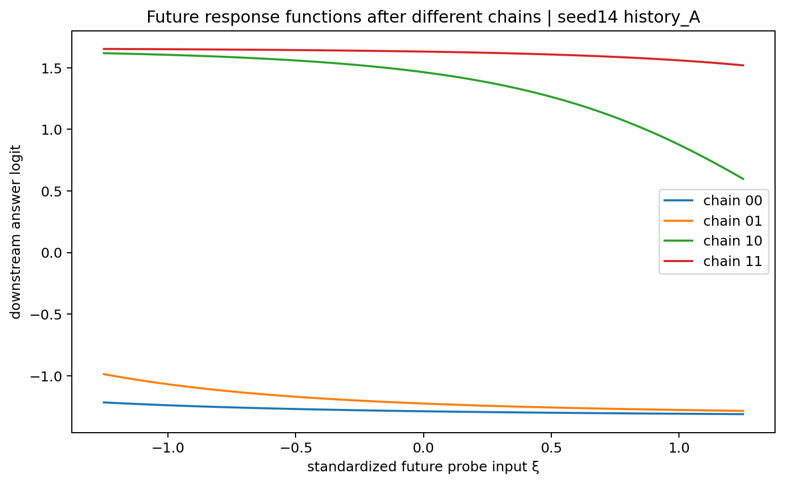

Figure 10.1 Seed14 History A: four discrete chains produce clearly separated standardized future-response functions.

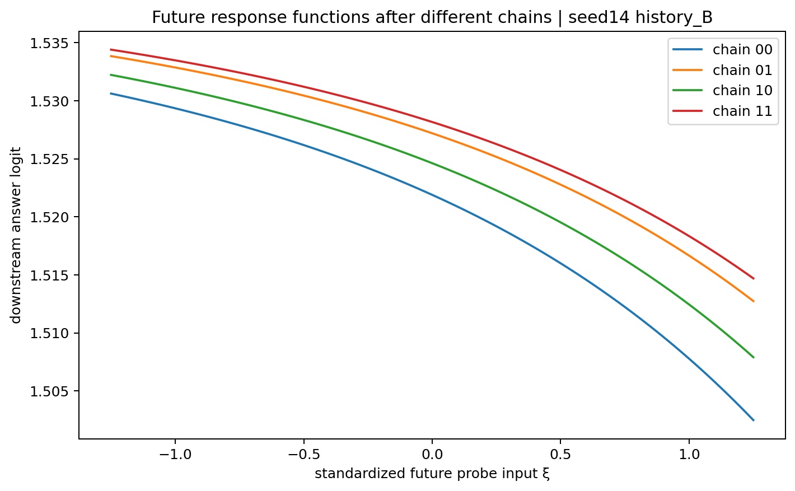

Figure 10.2 Seed14 History B: future-response functions of four visibly different chains nearly overlap.

### 10.3 The same chain can serve different functions across training histories

| Identical visible chain | Cross-history hidden-state distance | \|Δanswer logit\| | Gradient distance | future RMS | future max |
| --- | --- | --- | --- | --- | --- |
| 00 | 2.3506 | 3.1298 | 0.3026 | 2.8013 | 2.8173 |
| 01 | 2.0743 | 3.0775 | 0.0717 | 2.7252 | 2.7982 |
| 10 | 0.5748 | 1.2605 | 1.8675 | 0.3294 | 0.9101 |
| 11 | 0.1460 | 0.3394 | 0.7668 | 0.0953 | 0.1182 |

Visible chain `00` is identical in Histories A/B, but post-chain hidden-state distance=2.3506, future-response RMS=2.8013 and answer-logit difference=3.1298. This directly separates surface symbol identity from model-conditioned computational function.

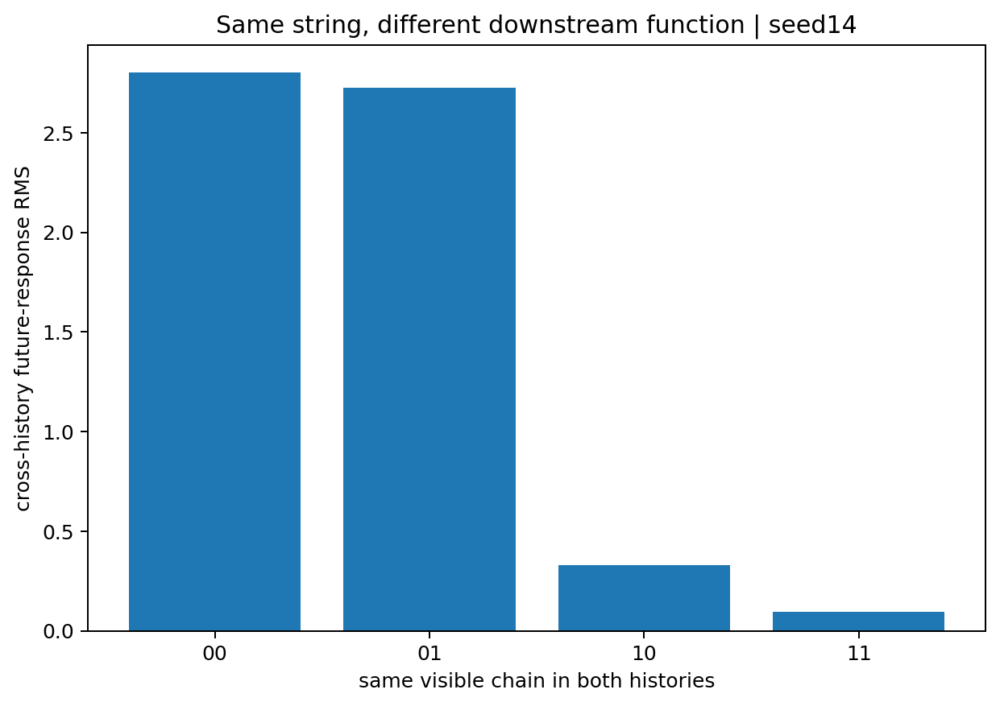

Figure 10.3 Seed14: downstream future-response distance between histories for the same visible chain.

### 10.4 Functional semantics trace to the token to state Jacobian

Let Hθ(x_R,x_C) be the hidden state after route/code feedback. Its local control Jacobian is:

J_C = ∂Hθ / ∂(x_R,x_C)

Its singular values and Frobenius norm quantify amplification or compression of local token-action differences by the dynamics.

| History | chain | σ1 | σ2 | \|\|J_C\|\|F | det(J_C) |
| --- | --- | --- | --- | --- | --- |
| history_A | 00 | 0.1058 | 0.0060 | 0.1059 | 0.000638 |
| history_A | 01 | 0.4053 | 0.0232 | 0.4060 | 0.009412 |
| history_A | 10 | 1.5423 | 0.1087 | 1.5461 | 0.167709 |
| history_A | 11 | 0.5517 | 0.0280 | 0.5524 | 0.015464 |
| history_B | 00 | 0.0833 | 0.0216 | 0.0860 | 0.001801 |
| history_B | 01 | 0.0442 | 0.0096 | 0.0453 | 0.000427 |
| history_B | 10 | 0.0493 | 0.0039 | 0.0495 | 0.000193 |
| history_B | 11 | 0.0216 | 0.0021 | 0.0217 | 0.000044 |

For seed14 History B, ||J_C||F lies between 0.0217 and 0.0860 at all four discrete chains, indicating low-gain compressive token→state geometry. History A reaches 1.5461 at chain 10. This geometry agrees with near-equivalent future responses in B and clear separation in A.

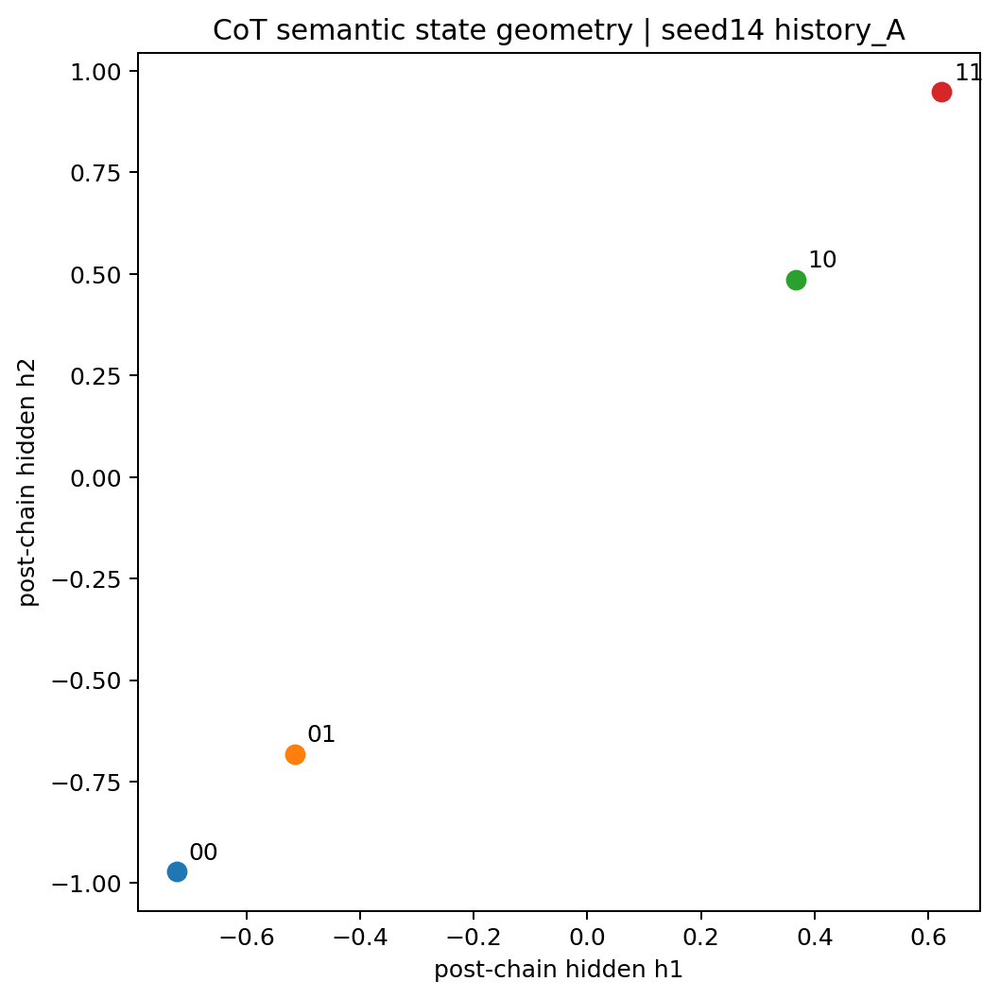

Figure 10.4 Seed14 History A: four chains spread across two-dimensional post-chain hidden-state space.

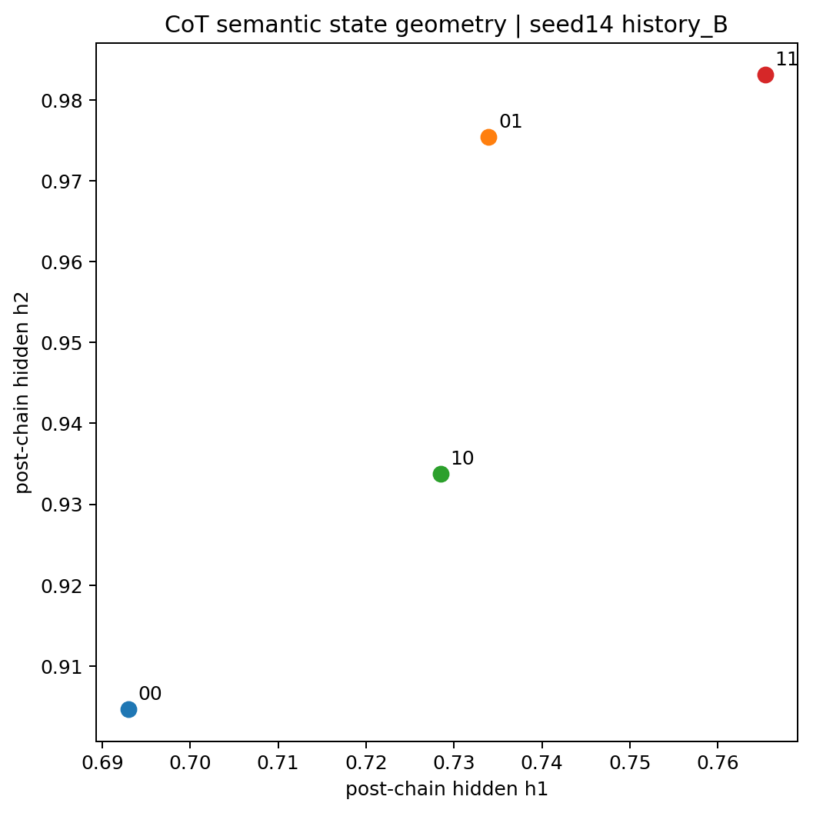

Figure 10.5 Seed14 History B: four chains form a tight cluster in post-chain hidden-state space.

### 10.5 Finite semantic displacement as a Jacobian path integral

For chain-action coordinates x0 and x1, finite state difference satisfies exactly:

Hθ(x1) − Hθ(x0) = ∫₀¹ J_H(x0+sΔx) Δx ds

Finite answer-logit differences likewise integrate along continuous route/code coordinates. Functional string differences therefore decompose into accumulated local gains along the two control axes.

| seed | History | C0 | C1 | Δh1 | Δh2 | Δz | Route integral | Code integral | Closure error |
| --- | --- | --- | --- | --- | --- | --- | --- | --- | --- |
| 14 | history_A | 00 | 11 | +1.3465 | +1.9205 | -2.8335 | -2.1799 | -0.6537 | 8.1e-15 |
| 14 | history_A | 01 | 11 | +1.1376 | +1.6303 | -2.7445 | -2.7445 | +0.0000 | 7.5e-15 |
| 14 | history_B | 00 | 11 | +0.0724 | +0.0785 | -0.0431 | -0.0127 | -0.0304 | 2.6e-16 |
| 14 | history_B | 01 | 11 | +0.0314 | +0.0077 | -0.0063 | -0.0063 | +0.0000 | 4.3e-18 |
| 25 | history_A | 00 | 11 | -0.0023 | +0.0639 | -0.0403 | -0.0044 | -0.0359 | 2.0e-16 |
| 25 | history_A | 01 | 11 | +0.0120 | +0.0003 | -0.0017 | -0.0017 | +0.0000 | 6.1e-17 |
| 25 | history_B | 00 | 11 | +0.3958 | +1.9033 | -2.0952 | -1.6617 | -0.4335 | 5.8e-15 |
| 25 | history_B | 01 | 11 | +0.5927 | +1.6169 | -2.0233 | -2.0233 | +0.0000 | 5.8e-15 |

Across action-space path integrals, maximum hidden-state closure error is 5.67e-15 and maximum answer-logit closure error is 8.10e-15.

### 10.6 Cross-history functional change of one string traces to ten parameter displacements

For seed14 chain `00`, integrate parameter Jacobians of the post-chain state and answer logit along θ_B+s(θ_A−θ_B), decomposing cross-history functional differences across ten parameters.

| Parameter | Δθ | Contribution to Δh1 | Contribution to Δh2 | Contribution to Δanswer logit | State-contribution norm |
| --- | --- | --- | --- | --- | --- |
| b2 | +0.54479 | -1.50691 | -1.70402 | +2.73827 | 2.27474 |
| b1 | +0.25583 | -0.13659 | -0.46226 | +0.74130 | 0.48202 |
| u2 | +0.29589 | +0.29952 | +0.26560 | -0.39228 | 0.40031 |
| u1 | +0.13092 | -0.01817 | +0.10440 | -0.09326 | 0.10597 |
| W22 | +0.03623 | -0.03525 | -0.05267 | +0.08475 | 0.06338 |
| W21 | +0.02525 | -0.01158 | -0.01709 | +0.02846 | 0.02064 |
| W12 | +0.01069 | -0.00443 | -0.00611 | +0.01038 | 0.00755 |
| W11 | +0.01444 | -0.00248 | -0.00411 | +0.00741 | 0.00480 |
| v1 | +0.00009 | +0.00000 | +0.00000 | +0.00001 | 0.00000 |
| v2 | +0.02784 | +0.00000 | +0.00000 | +0.00474 | 0.00000 |

For identical string `00`, cross-history hidden displacement is Δh=(-1.4159,-1.8763), with answer-logit displacement +3.1298. State-integral closure error is 3.14×10⁻15 and answer-logit error 2.58×10⁻9. Parameter b2 contributes the largest state displacement in this case.

### 10.7 Mirrored expansion and compression of semantic geometry across histories

| seed | History | Mean future-response pair distance | Maximum future-response pair distance | Mean hidden-state pair distance | Mean \|\|J_C\|\|F |
| --- | --- | --- | --- | --- | --- |
| 14 | history_A | 1.896231 | 2.898590 | 1.417268 | 0.652616 |
| 14 | history_B | 0.004115 | 0.007250 | 0.061782 | 0.050610 |
| 25 | history_A | 0.004083 | 0.006464 | 0.045793 | 0.060445 |
| 25 | history_B | 1.427056 | 2.190851 | 1.254110 | 0.655531 |

Seed14 expands semantic geometry in History A and compresses it in B; seed25 reverses this pattern. This mirrors the histories carrying strong route control in CHAIN-CONTROL-006.

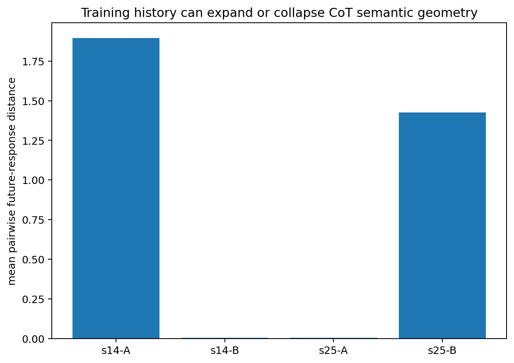

Figure 10.6 Seed14/seed25: training histories expand the same four-string space into differentiated functional geometry or compress it into a nearly equivalent functional cluster.

### 10.8 Working conclusions

In this 10-parameter autoregressive case, computational CoT semantics depend jointly on the string, current model parameters and state-transition geometry. Different strings can map to nearly identical post-chain states and future-response functions; the same string can map to different states and responses under history-dependent parameters.

The most directly computable semantic objects here are model-conditioned state transitions and downstream response functions. Training history changes parameters and local Jacobians, determining amplification, preservation or compression of string differences.

### 10.9 CHAIN-SEMANTICS-007 raw data index

CHAIN_SEMANTICS_007/CHAIN_SEMANTICS_007.md

CHAIN_SEMANTICS_007/semantic_signatures.csv

CHAIN_SEMANTICS_007/within_model_pairwise_semantic_distances.csv

CHAIN_SEMANTICS_007/cross_history_same_surface_semantics.csv

CHAIN_SEMANTICS_007/chain_control_jacobian_geometry.csv

CHAIN_SEMANTICS_007/semantic_action_path_integrals.csv

CHAIN_SEMANTICS_007/same_surface_parameter_history_decomposition.csv

CHAIN_SEMANTICS_007/semantic_spread_mirror_summary.csv

CHAIN_SEMANTICS_007/summary.json

## Version update

| Version | Date | Added experiment | Core additions |
| --- | --- | --- | --- |
| v0.6 | 2026-09-26 | CHAIN-SEMANTICS-007 | Functional CoT signatures; different-string equivalence and same-string divergence; token→state Jacobians; semantic path integrals; cross-history parameter attribution |

## 11 TOKEN-CODE-008 Numerical token encoding and additional computational effects

Objective: separate surface labels, internal numerical codes and their downstream state-transition effects. Test additional effects of specific codes and use coordinate transformations to distinguish dynamical effects from numerical coordinate choices.

### 11.1 Coordinate controls establish gauge equivalence

Transform every input by x'=a x+c with a=1.7 and c=-0.43, compensating exactly with u'=u/a and b'=b−(u/a)c. Transform bit tokens and route/code/answer markers together.

Across all questions and forced chains, maximum hidden-state difference is 4.720e-16 and answer-logit difference 5.829e-16. Computational effects are identified through a code's relative placement and local gain in the learned dynamics, with compensated affine coordinates yielding equivalent behavior.

### 11.2 Fixed visible tokens with continuously varying numerical feedback

Fix Q=(0,0) and the visible route label; sweep actual route feedback from -3 to +3, regenerate downstream code, and read the answer. This tests computational variation of one visible token under different internal numerical codes.

| seed | History | Answer=0 boundary | Downstream code bifurcation | Maximum finite cascade slope | Corresponding code |
| --- | --- | --- | --- | --- | --- |
| 14 | history_A | 0.358184;0.627103;0.935238 | 0.6275 | 199.098 | 0.625 |
| 14 | history_B | — | — | 1.281 | -3.000 |
| 25 | history_A | -2.675469;-2.502681;-2.296054 | -2.5025 | 239.178 | -2.500 |
| 25 | history_B | 0.405996;0.672483;0.919771 | 0.6725 | 140.950 | 0.670 |

Seed14 History A has answer boundaries near 0.358, 0.627 and 0.935; the middle boundary coincides with a discrete downstream-code bifurcation. Seed25 History B has a similar pattern. The large cascade slope includes this discrete jump; the next analysis fixes downstream code to isolate continuous local gain.

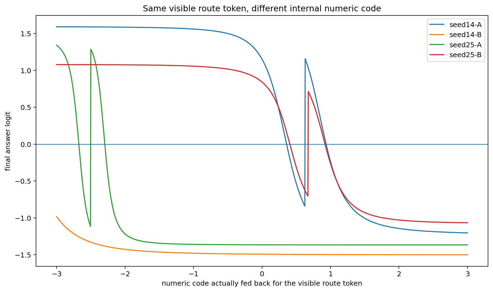

Figure 11.1 Full answer-response curves when only numerical feedback of the same visible route token changes.

### 11.3 Numerical high gain bands with the downstream chain fixed

With downstream code fixed, the local derivative from route value x to answer logit is exactly:

dz/dx = vᵀ D₄ W D₃ W D₂ W D₁ u

D_t=diag(1−h_t²) is the local tanh gain matrix at each step. Fixing the downstream branch isolates continuous token-code gain.

| seed | History | Code at maximum gain | Maximum dz/dx | Distance from token1 code (+1) | Distance from token0 code (-1) |
| --- | --- | --- | --- | --- | --- |
| 14 | history_A | 0.8460 | -4.3379 | 0.1540 | 1.8460 |
| 14 | history_B | -3.0000 | -1.2900 | 4.0000 | 2.0000 |
| 25 | history_A | -2.3110 | -10.6039 | 3.3110 | 1.3110 |
| 25 | history_B | 0.8945 | -3.5393 | 0.1055 | 1.8945 |

High-gain bands for seed14 History A and seed25 History B lie near x≈0.846 and x≈0.895. Token-1 code +1 lies nearby. In seed14 History A, local gain is approximately -0.0050 at x=-1, -3.3501 at x=+1 and -4.3379 at its peak. In a fixed learned coordinate system, a code gains additional computational influence through its position in a nonlinear high-gain region.

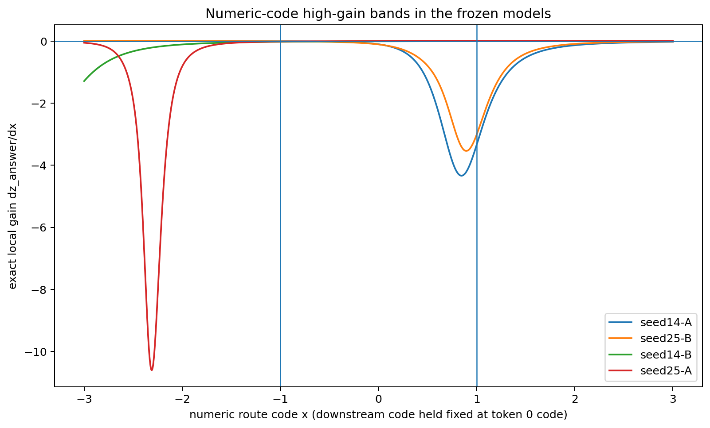

Figure 11.2 Continuous local token-code gain with downstream code fixed. Strong-control histories have a pronounced high-gain band near +1.

### 11.4 Codebook changes during training alter control geometry at fixed token distance

Surface corpus, targets, order, initialization seed, optimizer and update count remain fixed; only numerical codes for visible bits 0/1 change. Of 144 trained models, 58 retain natural autoregressive endpoints `0011`, with 4/4 correct.

| seed | History | (code0,code1) | Center | Local route gain | Finite bit-flip effect | Self-generated Q00 chain |
| --- | --- | --- | --- | --- | --- | --- |
| 14 | history_A | (-2,0) | -1 | -0.056515 | -0.055936 | 00 |
| 14 | history_A | (-1.5,0.5) | -0.5 | -0.151602 | -0.059037 | 00 |
| 14 | history_A | (-1,1) | 0 | -3.350051 | +1.887306 | 10 |
| 25 | history_B | (-2,0) | -1 | -0.039418 | -0.030813 | 00 |
| 25 | history_B | (-1.5,0.5) | -0.5 | -0.003989 | -0.002616 | 00 |
| 25 | history_B | (-1,1) | 0 | -3.020580 | +1.394302 | 10 |

All listed codebooks have 0/1 distance 2. Shifting their center changes gains by tens to hundreds of times. Seed14 History A's |gain| rises from 0.0565 with (-2,0) to 3.3501 with (-1,1). Endpoint-matched span=2 models for seed25 History B have approximately 757-fold max/min |gain|. Code placement in learned nonlinear terrain, together with spacing, shapes CoT.

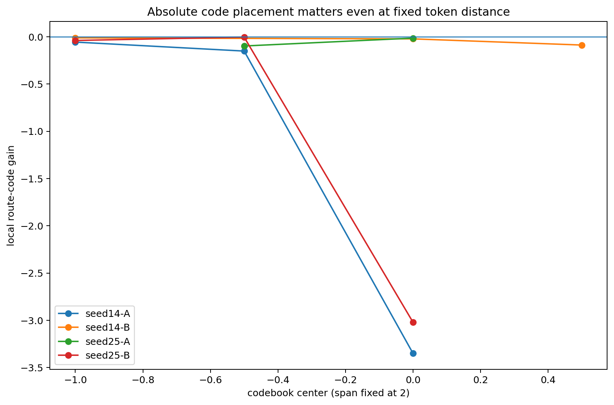

Figure 11.3 Moving codebook centers at fixed 0/1 distance 2 yields markedly different route-code gains among endpoint-matched models.

### 11.5 Different internal code functions under identical visible CoT and answers

Group the 144 models by seed, history, all four final answers and the complete four-question self-generated chain-bit signature. Within each group, external observers see identical CoT strings and answers across different internal numerical codebooks.

| seed | History | Four-question CoT signature | Number of codebooks | Codebook with maximum gain | max gain | Codebook with minimum gain | min gain | \|gain\| ratio |
| --- | --- | --- | --- | --- | --- | --- | --- | --- |
| 25 | history_B | 00\|00\|11\|11 | 13 | (-0.5,1) | -1.325413 | (-2,1.5) | -0.002594 | 510.9× |
| 14 | history_B | 00\|00\|11\|11 | 12 | (-2,1) | -3.505863 | (-1.5,1.5) | -0.011661 | 300.6× |
| 25 | history_A | 00\|00\|11\|11 | 13 | (-0.5,2) | -0.663468 | (-1.5,1.5) | -0.003359 | 197.5× |
| 14 | history_A | 00\|00\|11\|11 | 12 | (-1,1.5) | -0.260815 | (-2,0.5) | -0.001706 | 152.9× |
| 25 | history_B | 10\|00\|11\|11 | 3 | (-1,1) | -3.020580 | (0.5,1) | -1.020581 | 3.0× |

In the strongest seed25 History B group, 13 codebooks all produce CoT `00|00|11|11` and answers `0011`; probe route-code gain ranges from approximately 0.00259 to 1.32541, a 510.9-fold ratio. Other strictly observation-matched groups show approximately 300.6×, 197.5× and 152.9× differences. Full visible CoT and endpoints thus coexist with a broad range of internal control strengths in this case.

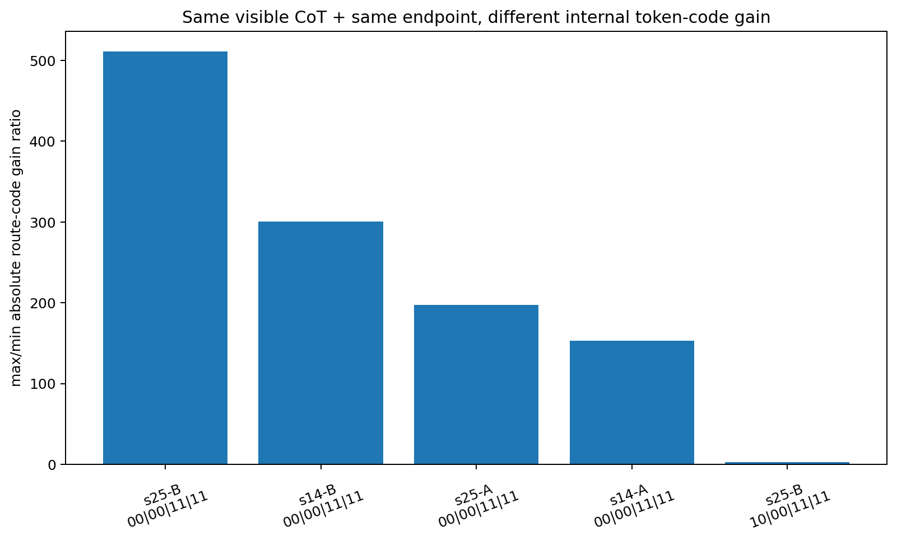

Figure 11.4 Orders-of-magnitude token-control gain differences across internal codebooks under identical visible CoT and endpoints.

### 11.6 Working conclusions

TOKEN-CODE-008 separates surface labels, numerical codes received by the model and computational actions generated by those codes under the current state and learned parameters. Specific codes can have substantial effects near high-gain, low-saturation or bifurcation regions; training can shape such regions around particular codes.

Affine gauge controls locate the causal object in the relative dynamical geometry jointly formed by token codes, current hidden states, W/u/b/v, structural-marker codes and nonlinear gains. Compensated coordinate changes preserve this object.

The expanded case sequence is: training history → parameter and numerical-encoding geometry → token-code local gain/bifurcation structure → CoT state transitions → subsequent CoT and answers.

### 11.7 TOKEN-CODE-008 raw data index

TOKEN_CODE_008/TOKEN_CODE_008.md

TOKEN_CODE_008/gauge_affine_invariance_control.csv

TOKEN_CODE_008/frozen_numeric_code_sweep.csv

TOKEN_CODE_008/numeric_code_thresholds_and_gain.csv

TOKEN_CODE_008/high_gain_numeric_code_bands.csv

TOKEN_CODE_008/fixed_downstream_code_gain_decomposition.csv

TOKEN_CODE_008/trained_codebook_grid.csv

TOKEN_CODE_008/endpoint_matched_codebooks.csv

TOKEN_CODE_008/same_span2_endpoint_matched.csv

TOKEN_CODE_008/trained_codebook_grid_with_chain_signature.csv

TOKEN_CODE_008/same_observed_cot_answer_different_code_gain.csv

TOKEN_CODE_008/summary.json

## Version update

| Version | Date | Added experiment | Core additions |
| --- | --- | --- | --- |
| v0.7 | 2026-09-26 | TOKEN-CODE-008 | Numerical token codes; gauge invariance; high-gain bands; codebook geometry; hidden gain differences under identical CoT/endpoints |
| v0.8 | 2026-09-26 | MRI SERIES Macroscopic imaging | Tokenwise cold starts; training-foundation terrain; curriculum displacement; two-layer Adam foundations; paired CoT/Answer kernels; four-dimensional training sky; problem crystallization; realized token-code traces |
| v0.9 | 2026-09-26 | VECTOR-CODE-009 / VECTOR-SUBSPACE-010 / CONTROL-FLOW-011 | Two-/four-dimensional embedding control directions; exact silent quotients; lexical/control-axis misalignment; CoT state-gated control-frame rotation |

## 12 MRI SERIES Macroscopic imaging of training history and CoT

Scope: this series complements ten-parameter microscopy. Microscopy traces local computable mechanisms from training tokens through parameters/states to CoT/answers. MRI uses larger, auditable GRU/tiny-Transformer cases to reconstruct whole-body images of training history across complete CoT, multiple problems, expression styles and answer decisions. MRI is an informal project nickname; the formal objects are training-history-conditioned generative terrain and history-to-CoT kernels.

Current MRI sequence: training order / dataset foundation → whole-body CoT terrain → history-to-CoT kernel → paired CoT/Answer readouts → 4D training sky → problem crystallization → realized token computational action.

### 12.0 Observation conventions and invariants

All tokenwise CoT observations use strict cold starts: each k restarts from the initial state with the original question plus the first k actual/fixed CoT tokens, then reads the complete future independently.

Identical outputs, answers or complete responses denote coincidence or projection equivalence under the specified observation function. Distinct training histories remain distinct generative processes throughout MRI analysis.

The record retains early analyses and their corrections. FOUNDATION-COT-TERRAIN-001's schedule pilot is superseded by 002's genuine interleaving design. BODYSCAN-A raw style correlations produced NaN from unmatched token lengths; semantic-landmark alignment supplies the corrected comparison. CURRICULUM multi-position regressions had permutation collinearity; contrast models provide the revised analysis. TRAINING-SKY-004's initial answer axis used teacher-forced future CoT; the authoritative readout is current-prefix answer propensity.

### 12.1 Overview of MRI experiments

| MRI ID | Original experiment | Core intervention/object | Current direct result |
| --- | --- | --- | --- |
| MRI-001 | TOKEN-REPLAY-001 | Tokenwise cold start + complete future | Sharp complete-future collapse points within one CoT; methodological feasibility |
| MRI-002 | TRAINING-WORLD-REPLAY-001 | Training-world structure changes information-release timing | Training content shifts complete-future entropy collapse; 40 targeted micro-updates transfer the timing |
| MRI-003 | ORDER-COT-CAUSAL-001 | Training-group order swaps only | Local order causally changes the complete CoT response surface under identical endpoints |
| MRI-004 | FOUNDATION-COT-TERRAIN-001/002/004 | Data volume × interleaving × order seed | Dataset foundations form whole-body terrain; 004 establishes a 36-model imaging map |
| MRI-005 | FOUNDATION-COT-TERRAIN-005 / BODYSCAN-001 | Multiple probes / styles / architectures | Terrain persists across questions and in Transformers; semantic landmarks provide style alignment |
| MRI-006 | SEMANTIC-AND-BLOCKSHIFT / BLOCKSHIFT-SEMANTIC / CURRICULUM-MATH | Semantic alignment + block curricula | Block order leaves cross-domain, cross-question and cross-style whole-body atlas identities |
| MRI-007 | COT-ROOTCAUSE-001/002/003-FAST | Screening CoT and answer causal origins | CoT-only, unchanged-text and short-horizon answer-changing phenotypes |
| MRI-008 | HISTORY-TO-COT-KERNEL-001 | Two-layer Adam foundations + K(e,k) | Parameters and optimizer states both carry history; natural ≈ param + optim; K is low-rank |
| MRI-009 | HISTORY-TO-COT-KERNEL-002 | Paired CoT / Answer kernels | CoT and answers share principal modes and have independent secondary modes; answer integration is more nonlinear |
| MRI-010 | TRAINING-SKY-001/002 | Four-dimensional training sky + paired readouts | Reconstruction of (τ,s,j,c;k); one training sky separates into CoT-dominant, Answer-dominant and coupled regions |
| MRI-011 | TRAINING-SKY-003 | Question × sky × CoT/Answer | Problem structure crystallizes progressively during CoT unfolding |
| MRI-012 | TRAINING-SKY-004-CORRECTED | realized token code trace | Token function depends on current state/history geometry; shared structural tokens can serve as crystallization gates |

### 12.2 MRI-001 TOKEN-REPLAY-001 Tokenwise complete future cold starts

The session-trained tiny decoder-only Transformer has 87,552 parameters, 2 layers, d_model=64 and 4 heads; training uses 360 steps / 9,000 examples. The first 50 tokens of a 54-token self-generated CoT are replayed, with independent cold starts and 16 complete continuation samples per prefix.

Methodological observation: adjacent tokens can abruptly collapse a branching complete future to one answer. In this synthetic case, k=43 retains a broad distribution; after the next critical intermediate-result token, all 16/16 continuations yield one final value. The assay demonstrates sensitivity of tokenwise complete-future tomography in a task whose template makes intermediate results highly decisive.

Original files: TOKEN_REPLAY_001_results.csv / TOKEN_REPLAY_001_meta.json / TOKEN_REPLAY_001_model.pt

### 12.3 MRI-002 TRAINING-WORLD-REPLAY-001 Training worlds shape information timing

RP and PR training worlds share content targets and differ in the order of critical information release. Each CoT prefix has 32 complete continuation samples. The first major entropy reduction is approximately 1.145 bits in RP and 2.159 bits in PR; later key steps further compress the distribution.

Starting from RP, 40 PR-directed micro-updates shift the early trajectory toward the PR pattern. Training-corpus information structure therefore shapes the timing of complete-future collapse as well as final tokens.

Original files: TRAINING_WORLD_REPLAY_001.csv / TRAINING_WORLD_REPLAY_001_summary.json

### 12.4 MRI-003 ORDER-COT-CAUSAL-001 Training order changes CoT terrain

Eight matched autoregressive GRUs share initialization, 128 sequences, optimizer, learning rate, epochs and update count. Baseline group order is 0-1-2-3-4-5-6-7; each of 7 interventions swaps one adjacent pair. All 8 models have bare-question accuracy 8/16 and predict 0 on all 16 questions.

For fixed probe A=0,B=1,C=1,D=0, replay a valid 24-token CoT with cold starts and complete continuations. Under identical endpoints, swap23 yields mean completion edit=0.3678, max=0.5 and final-answer disagreement at 20 prefixes; swap56 gives mean edit=0.2683 and 20 disagreements; swap45 gives mean edit=0.1785 and 0 disagreements.

MRI-003 establishes that identical endpoints can coexist with different conditional generative functions. Training order is an intervenable variable in the generative foundation.

Original files: ORDER_COT_CAUSAL_001.zip / endpoint.csv / trace.csv / effects.csv / summary.csv

### 12.5 MRI-004 FOUNDATION-COT-TERRAIN Whole body maps of training foundations

The 001 pilot used 32/64/128/256 unique records × blocked/round-robin/braided schedules and found large response-trajectory differences under identical endpoints. Version 002 implements true interleaving depths (chunk16/chunk4/chunk1), changing mini-batch composition beyond the within-batch reorderings present in some pilot schedules.

Main experiment 004 uses 36 matched GRUs with 3,023 parameters each: 4 pool sizes × 3 interleaving depths × 3 temporal-order seeds, replaying a 59-token CoT pointwise. Bare-question signatures are `0000000000000000` in 23/36 models and all 1s in 13/36, enabling strictly endpoint-identical terrain comparisons.

Within a fixed foundation, changing only temporal-order seed can produce near-maximal whole-body distances. For N256/chunk4 at k=59, mean seed distance=0.9679 and max=1.0; N128/chunk16 has maximum pairwise distances near 1 at several k. Data volume, interleaving scale and exact temporal order jointly form the generative foundation.

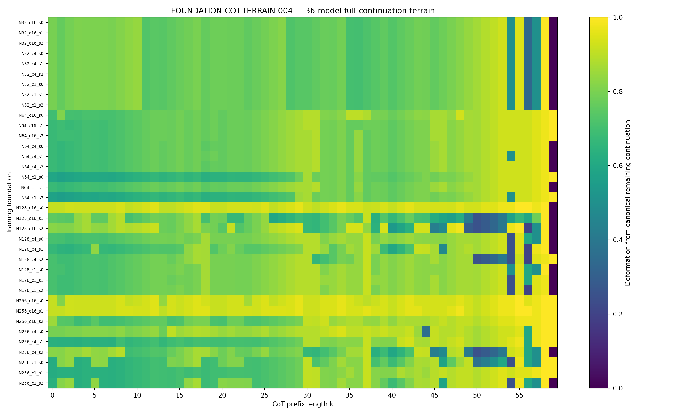

Figure 12.1 MRI-004: whole-body CoT terrain for 36 models. Rows are training foundations; columns are tokenwise cold-start slices.

Original files: complete FOUNDATION_COT_TERRAIN_001/002/004 md/csv/png/zip collections.

### 12.6 MRI-005 Terrain across probes styles and architectures

FOUNDATION-COT-TERRAIN-005 reuses the 36 models from 004 and replays complete 59-token CoT for 4 probes. Previously sensitive foundations recur across probes; N128/chunk16 and N256/chunk4 repeatedly rank highly in order-seed sensitivity, supporting cross-question terrain structure.

FOUNDATION-BODYSCAN-001 part A tests 4 equivalent styles for one question. Unequal raw token-grid lengths produce NaN correlations; this analysis is retained as a methodological record. Part B reproduces terrain in a 14,495-parameter tiny Transformer. Part C combines probes and styles into a whole-body atlas; 19/36 models have positive margins to their own foundation centroid.

SEMANTIC-AND-BLOCKSHIFT-001 subsequently aligns styles/probes by semantic landmarks. Positive own-foundation margins occur in 17/36 models; the highest are N128_c16_s1=0.3337 and N64_c4_s0≈0.3039. Semantic alignment makes the differing token grids comparable.

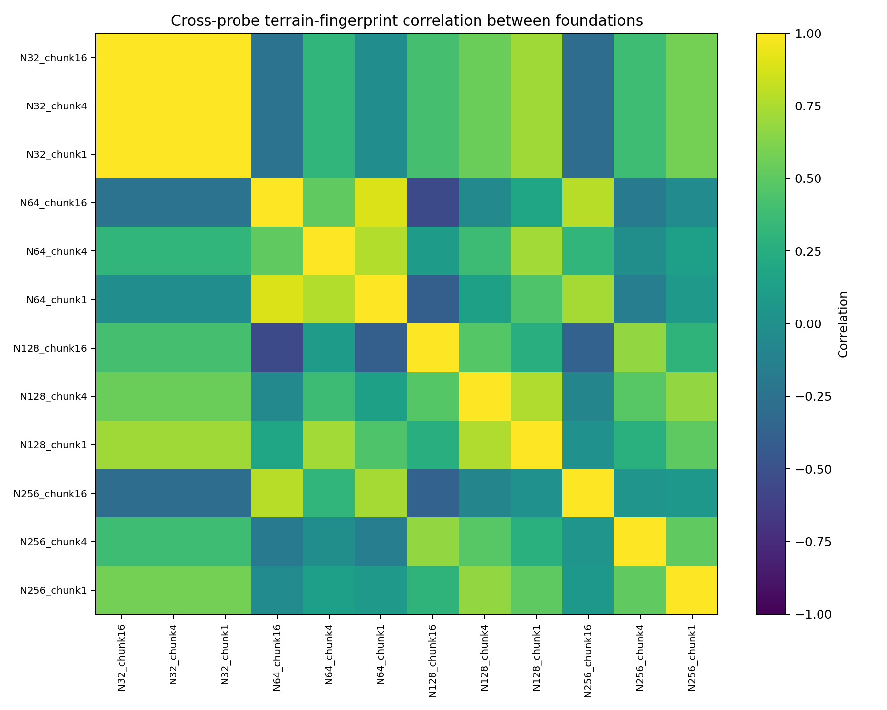

Figure 12.2 MRI-005: cross-probe foundation-fingerprint correlations.

Original files: FOUNDATION_COT_TERRAIN_005.zip; FOUNDATION_BODYSCAN_001.zip; SEMANTIC_AND_BLOCKSHIFT_001.zip.

### 12.7 MRI-006 Block curriculum order shifts whole body CoT maps

SEMANTIC-AND-BLOCKSHIFT-001 uses LIT/MATH/LOGIC blocks with fixed within-block order and curricula L-M-G, M-G-L and G-L-M. Downstream terrain depends on curriculum: LOGIC mean deformation is approximately 0.6531/0.4640/0.6573; MATH is approximately 0.2631/0.1487/0.2432.

BLOCKSHIFT-SEMANTIC-001 expands to 3 curricula × 3 initialization seeds (9 models) × 3 domains × 2 probes/domain × 4 equivalent styles. A semantic-landmark-aligned atlas gives positive own-curriculum margins in 8/9 models; the largest are L-M-G_s1=0.1880 and M-G-L_s0=0.1703.

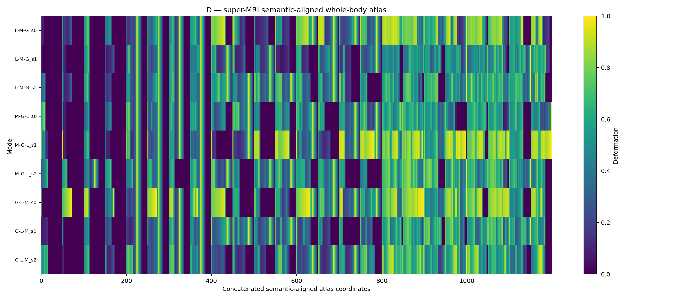

Figure 12.3 MRI-006: the cross-domain, cross-probe, cross-style semantic-aligned curriculum atlas, informally “super MRI.”

CURRICULUM-MATH-RELATIONS-001 relates curriculum position to tokenwise deformation. Single-source position→domain-mean regressions have weak overall R², with higher local values in semantic bins (LIT max 0.667; LOGIC max 0.649). Simultaneous three-position regression produces unstable/negative R² from permutation collinearity. Revised contrasts pos_LIT−pos_LOGIC and pos_MATH−pos_LOGIC yield mean R²≈0.14–0.16, reaching 1.0 in individual bins. These are exploratory mathematical relationships.

Original files: SEMANTIC_AND_BLOCKSHIFT_001.zip; BLOCKSHIFT_SEMANTIC_001.zip; CURRICULUM_MATH_RELATIONS_001.zip.

### 12.8 MRI-007 COT-ROOTCAUSE-001 through 003 CoT only answer changing and unchanged text

ROOTCAUSE-001 repeats history-to-CoT kernels across 4 probes and separates natural, param-only and optim-only channels. Rank-3 right-singular subspaces are highly similar across probes: natural pairwise mean principal cosines are approximately 0.973–0.995, with similar ranges for the other channels. Shared cross-probe SVD gives natural mode1=85.16% and top-3=98.21%.

ROOTCAUSE-002 changes training order alone: each event epoch consumes the same 6 batches in half-shift or reverse order before resuming baseline. Among 80 cases, 52 have CoT-only observables and 28 retain identical greedy text; all retain final answers. Kernels can reach L2≈0.44 with endpoints preserved.

ROOTCAUSE-003-FAST varies subsequent training horizon. At horizon=2, all 8/8 cases change answers; at 4, all 16/16 are CoT-only; at 6, all 24/24 are CoT-only; at 8/10, some retain identical text. Subsequent training depth changes the visible manifestation of the same historical intervention from answer-changing through CoT-only to unchanged surface text.

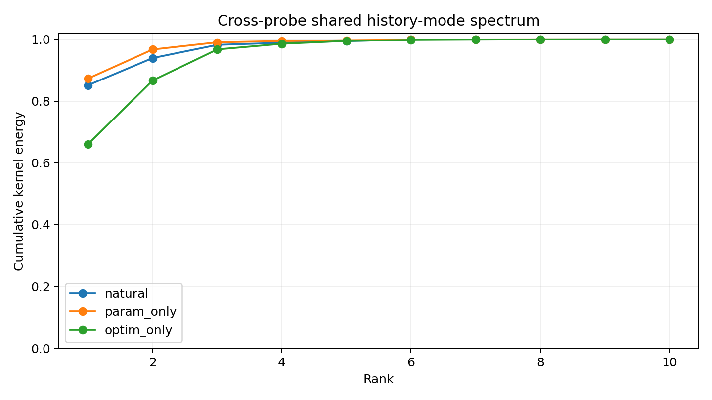

Figure 12.4 MRI-007: shared low-rank structure of cross-probe history-to-CoT manifestation modes.

Original files: COT_ROOTCAUSE_001.zip / COT_ROOTCAUSE_002.zip / COT_ROOTCAUSE_003_FAST.zip.

### 12.9 MRI-008 HISTORY-TO-COT-KERNEL-001 Two layers of Adam history

A 5,067-parameter Adam-GRU trains for 10 epochs × 6 fixed style batches. Event e swaps adjacent batches 2/3 once in epoch e, then resumes baseline. K(e,k) is the change in mean log-probability of the full remaining canonical continuation from cold-start prefix k.

The swap immediately changes parameters and optimizer state. At e=0, ||Δθ||=0.1702, ||Δm||=0.0040 and ||Δv||≈8.29e-7. Natural-kernel SVD gives mode1=78.74%, top-2=90.62% and top-3=97.67%.

State surgery retains parameters+Adam state in natural, parameter differences alone in param-only, and m/v differences alone in optim-only. Cosines are 0.7938 for natural vs param-only and 0.1041 for natural vs optim-only. For natural vs (param+optim), cosine=0.999446 and norm ratio=0.9715. Parameters and optimizer states jointly carry history and nearly reconstruct the natural kernel.

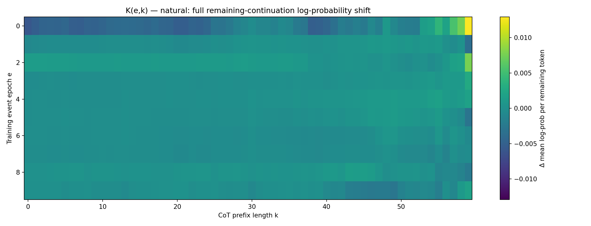

Figure 12.5 MRI-008: natural Adam history-to-CoT kernel across event position e and prefix k.

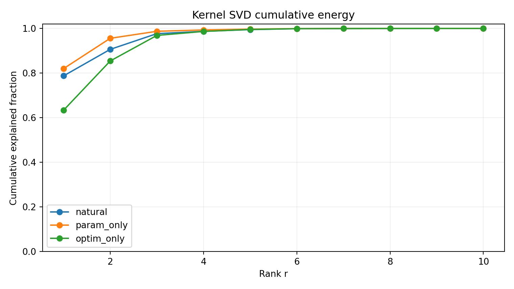

Figure 12.6 MRI-008: cumulative singular energy for natural, param-only and optim-only kernels.

Original files: HISTORY_TO_COT_KERNEL_001.zip.

### 12.10 MRI-009 HISTORY-TO-COT-KERNEL-002 Paired CoT and Answer kernels

Two readouts use the same history events. The CoT kernel measures support changes for the baseline freely generated reasoning path. The Answer kernel measures changes in logit(1)−logit(0) at each model's freely generated final answer from the same prefix.

Across 600 event×prefix cells, flattened correlation r=-0.6864. Categories contain 63 CoT-dominant, 68 Answer-dominant, 57 coupled-strong and 412 weak cells. Within-epoch correlations range approximately from -0.73 to +0.93, showing variable channel allocation of historical effects.

Low-rank structures differ: CoT mode1=96.58%, top-2=98.83%; Answer mode1=69.64%, top-2=99.61%. The first right-singular principal cosine is 0.935, indicating a shared backbone; with two dimensions, the minimum cosine is 0.035, indicating channel-specific secondary modes.

Adam-channel surgery gives CoT natural≈param+optim, cosine=0.999912 and relative residual=1.92%. The same sum for Answer gives cosine=0.9000 and residual=49.75%, indicating stronger nonlinear channel interaction at answer decisions.

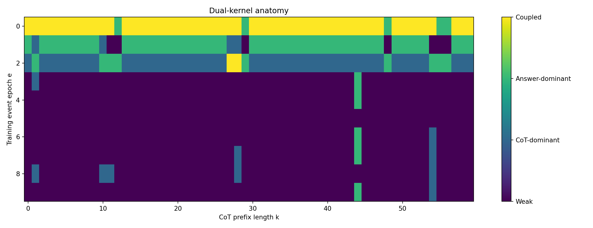

Figure 12.7 MRI-009: paired-kernel dissection into CoT-dominant, Answer-dominant and coupled regions.

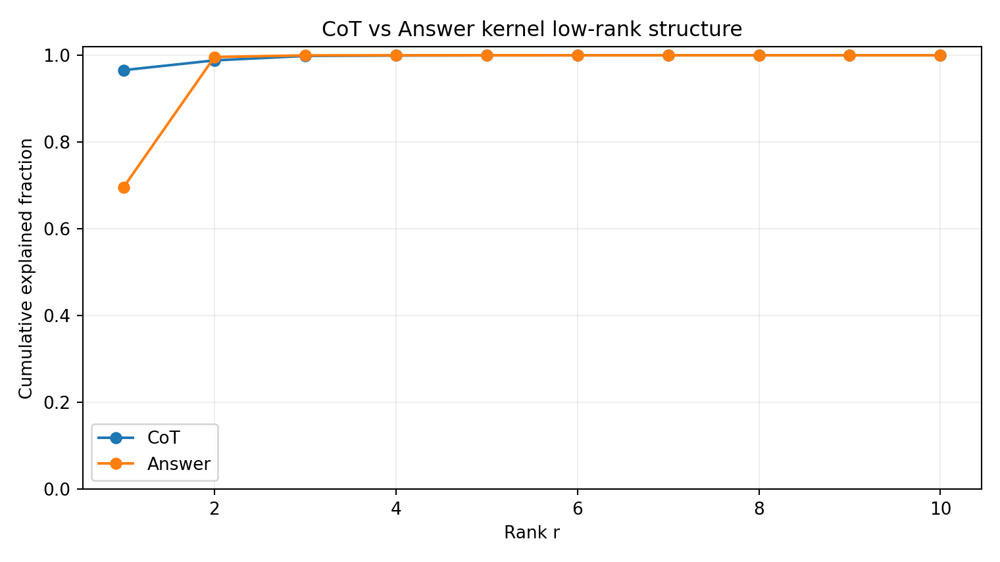

Figure 12.8 MRI-009: comparison of low-rank CoT and Answer kernel structures.

Original files: HISTORY_TO_COT_KERNEL_002.zip.

### 12.11 MRI-010 TRAINING-SKY-001 and 002 Four dimensional training histories

TRAINING-SKY-001 represents history as (τ,s,j,c): training time τ × sample identity s × within-sample token position j × write channel c, comprising θ, Adam m and Adam v. A 897-parameter Adam-GRU has 48 actual record events. Sparse reconstruction of 48 four-dimensional events, propagation through all subsequent training and readout at 34 CoT slices yield 1,632 sky rows.

Flattening the raw sky into event×CoT gives SVD mode1=69.45%, top-2=96.53% and top-3=98.65%. Unit-normalizing each event trajectory gives shape mode1=45.94%, top-2=74.63% and top-5=90.84%. Magnitude is lower-dimensional than shape, and events retain secondary manifestation patterns. Early τ=0 raw RMS effect≈0.00420 exceeds most later events; middle/late effects persist.

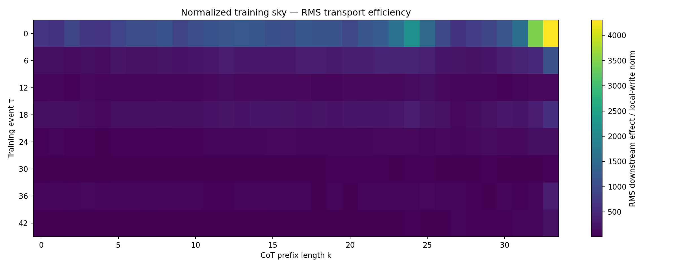

Figure 12.9 MRI-010: normalized training-time × CoT slices of the four-dimensional training sky.

TRAINING-SKY-002 reads the same sky through CoT and Answer. Among 1,632 cells: 1,179 Weak, 202 Answer-dominant, 195 CoT-dominant and 56 Coupled-strong; flattened r=-0.361. Answer sky is nearly rank-1 (mode1=99.9985%); CoT top-2=96.53%. Different readout axes strongly compress one history field into distinct phenotypes.

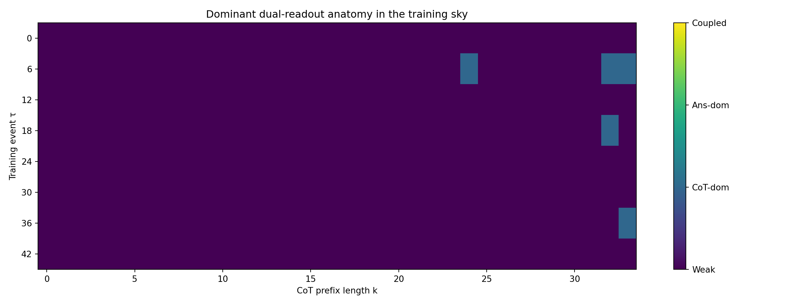

Figure 12.10 MRI-010: paired CoT/Answer readouts of the four-dimensional sky.

Original files: TRAINING_SKY_001.zip / TRAINING_SKY_002.zip.

### 12.12 MRI-011 TRAINING-SKY-003 Emergence of problem identity

Eight questions, two per (r1=A⊕B,r2=C⊕D) structure, form an event × question × CoT-position × readout tensor. In genuine question-only free generation, all eight answer-sky fingerprints have pairwise cosine=1.000 and baseline generations enter the same erroneous loop. This early readout is shared across questions before CoT unfolding.

Canonical CoT progressively differentiates problem structure. Strongest CoT structural differentiation occurs at k=29: same-structure fingerprint cosine=0.99955, different-structure=0.92532, separation=0.07423. By answer class, same-answer cosine=0.99866, different-answer=0.88887, separation=0.10979.

Multi-question global SVD remains low-dimensional: CoT mode1=72.49%, top-2=95.32%; Answer mode1=61.77%, top-2=99.38%. Problem identity becomes distinguishable during generation within a question×history response dominated by a few modes.

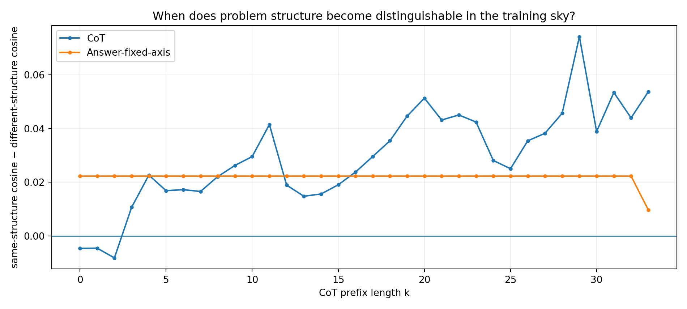

Figure 12.11 MRI-011: emergence of problem-structure separability across CoT tokens.

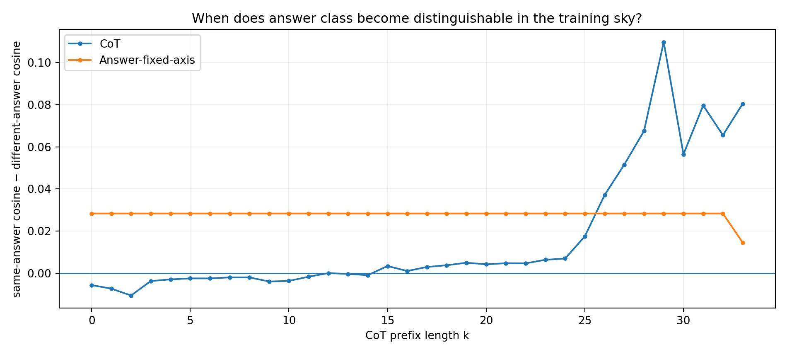

Figure 12.12 MRI-011: answer-class separability during CoT unfolding.

Original files: TRAINING_SKY_003.zip.

### 12.13 MRI-012 TRAINING-SKY-004-CORRECTED Realized token codes and crystallization gates

Define each realized CoT token's incremental sky code as C_k(q,e)=K(e,q,k+1)−K(e,q,k). Observe the actual canonical trajectory to measure how the sky projection changes after one additional token, with token identities and trajectory fixed.

The initial Answer axis teacher-forced future canonical CoT up to the answer and was nearly prefix-invariant. The corrected authoritative readout is current-prefix answer propensity A(q,k)=logit(1)−logit(0) | Q+C[:k], measured using the current prefix alone.

On the CoT-path axis, the largest positive structural jump occurs at `result`, k=28: structure separation +0.02854 and answer-class separation +0.04229. On current-prefix answer propensity, both maxima occur at shared structural token `B`, k=4: structure +0.05171 and answer-class +0.01744. Identical `B` tokens across questions can act as dynamical gates amplifying differences already present in state.

Historical tracing of the `B` gate is dominated by Adam m: question-differential RMS≈2.76e-6, followed by Adam v≈1.05e-6 and θ≈4.94e-7. Its strongest single source is τ=0, training token `A`, Adam-m channel. The CoT `result` gate is also dominated by Adam-m events.

CoT and answer-propensity token codes form distinct channels. Strong positive correlations include xor@k3 r=0.692, numeric@k20 r=0.660, xor@k24 r=0.612 and result@k28 r=0.542. The strongest answer-crystallization gate B@k4 has r=-0.438.

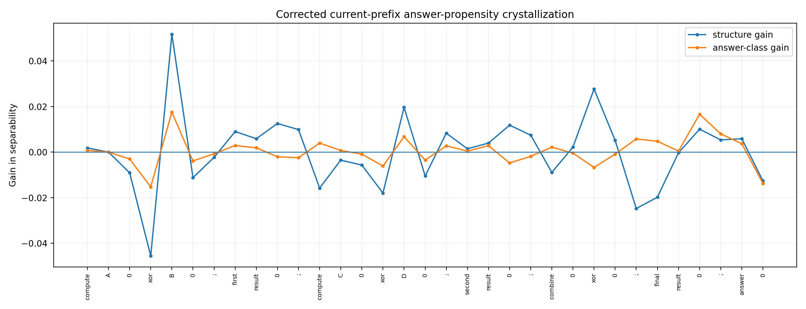

Figure 12.13 MRI-012: tokenwise problem-crystallization increments in current-prefix answer propensity.

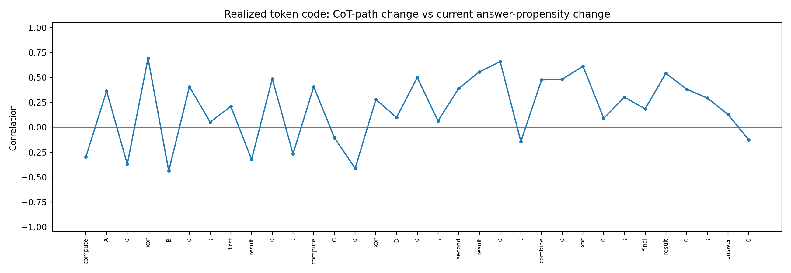

Figure 12.14 MRI-012: correlations between CoT-path and answer-propensity sky codes for the same realized token.

Working interpretation after MRI-012: token function is computable as a local action on a history-conditioned state and learned geometry. This connects directly to CHAIN-CONTROL-006, CHAIN-SEMANTICS-007 and TOKEN-CODE-008 microscopy.

Original files: TRAINING_SKY_004_CORRECTED.zip; TRAINING_SKY_004_focus_gates.csv.

### 12.14 Integrated MRI structure from foundations to collapse

Together, MRI and microscopy support a working structure in which training history shapes a low-dimensional but nontrivial generative foundation. Questions and generated history continually change observation/control conditions. Each token acts discretely within current state geometry, and the high-dimensional history field progressively manifests and collapses along distinct CoT and answer readouts.

training history → parameter / optimizer / code geometry → current state → token computational action → future-response geometry → next CoT / answer

Levels directly supported by MRI:

Training order, data volume, interleaving and curriculum-block order form distinct whole-body conditional terrain under identical or highly similar endpoints.

These terrains are strongly low-rank: a few principal modes account for most energy in history-to-CoT kernels, cross-probe atlases and multi-question tensors.

Adam history has parameter and optimizer-state layers. These channels are approximately additive for CoT kernels and interact more strongly in answer readouts.

CoT and Answer share principal history modes and have many channel-dominant regions plus independent secondary modes. Identical complete CoT can coexist with different internal control geometry.

In TRAINING-SKY-003/004, observable problem structure crystallizes progressively with realized CoT tokens.

The same surface token performs different computational actions across history/state geometries. Low-information structural tokens can become high-gain gates. Token function is represented as a history/state-conditioned action.

### 12.15 Interface with microscopy

Microscopy shows local history effects from SGD commutators, quantitative tangent transport through later training, separable token labels/codes/actions, same-string functional divergence and different-string similarity, and action strength governed by high-gain bands and local Jacobians. MRI supplies their macroscopic projections across larger history spaces. A shared object connects the two:

K(τ,s,j,c ; q,k,readout)  ≈  training-history write × later-training transport × question/state-conditioned token action × readout

A prospective object is Functional Token Action: measure current states, token→state Jacobians and token→future-response gains for MRI-012's `B` and `result` gates, then trace their four-dimensional sky sources. The aim is to connect macroscopic crystallization locations with microscopic high-gain actions at those states.

### 12.16 MRI SERIES raw data and figure index

| MRI ID | Principal archives |
| --- | --- |
| MRI-001 | TOKEN_REPLAY_001_results.csv; TOKEN_REPLAY_001_meta.json; TOKEN_REPLAY_001_model.pt |
| MRI-002 | TRAINING_WORLD_REPLAY_001.csv; TRAINING_WORLD_REPLAY_001_summary.json |
| MRI-003 | ORDER_COT_CAUSAL_001.zip |
| MRI-004 | FOUNDATION_COT_TERRAIN_001.zip; FOUNDATION_COT_TERRAIN_002.zip; FOUNDATION_COT_TERRAIN_004.zip |
| MRI-005 | FOUNDATION_COT_TERRAIN_005.zip; FOUNDATION_BODYSCAN_001.zip; SEMANTIC_AND_BLOCKSHIFT_001.zip |
| MRI-006 | BLOCKSHIFT_SEMANTIC_001.zip; CURRICULUM_MATH_RELATIONS_001.zip |
| MRI-007 | COT_ROOTCAUSE_001.zip; COT_ROOTCAUSE_002.zip; COT_ROOTCAUSE_003_FAST.zip |
| MRI-008 | HISTORY_TO_COT_KERNEL_001.zip |
| MRI-009 | HISTORY_TO_COT_KERNEL_002.zip |
| MRI-010 | TRAINING_SKY_001.zip; TRAINING_SKY_002.zip |
| MRI-011 | TRAINING_SKY_003.zip |
| MRI-012 | TRAINING_SKY_004_CORRECTED.zip; TRAINING_SKY_004_focus_gates.csv |

## MRI SERIES version update

| Version | Date | Added experiment | Core additions |
| --- | --- | --- | --- |
| v0.8 | 2026-09-26 | MRI-001—MRI-012 | Tokenwise complete-future tomography; foundation terrain; cross-probe/multi-style atlases; curriculum displacement; two-layer Adam foundations; paired kernels; 4D training sky; question crystallization; realized token codes and functional actions |

## 13 VECTOR-CODE-009 Two dimensional token embeddings and orthogonal control

Objective: test independent downstream effects of embedding coordinates orthogonal to a fixed visible token0→token1 contrast. Strict observable locks and gauge controls separate dynamical effects from coordinate reparameterization.

### 13.1 Model codebooks and training controls

Network: h_t=tanh(W h_{t-1}+U e_t+b), z_t=vᵀh_t. Hidden and embedding dimensions are both 2. There are 12 trainable parameters: W(2×2)=4, U(2×2)=4, b=2, v=2.

Bit codes are e0=(-1,c_y), e1=(+1,c_y), fixing lexical contrast e1−e0=(2,0) across codebooks. Structural markers are R=(0,2.5), C=(-2.2,-1.4), A=(2.3,-1.6).

Four questions 00/01/10/11 have endpoint target 0011. Histories A/B reverse only the paired intermediate-chain records within each question. SGD uses 60 epochs, lr=0.035, intermediate-chain loss weight 0.6 and endpoint weight 2.5.

### 13.2 Orthogonal codebooks change gains under identical CoT and endpoints

| c_y | probe z | parallel grad | orthogonal grad | \|\|grad\|\| | orthogonal fraction |
| --- | --- | --- | --- | --- | --- |
| -1.00 | -1.72636 | -0.0152875 | -0.0040891 | 0.015825 | 25.84% |
| -0.25 | -1.58805 | -2.174e-5 | -2.698e-6 | 2.191e-5 | 12.31% |
| +0.25 | -2.12582 | -0.0095657 | -0.0112215 | 0.014745 | 76.10% |
| +1.50 | -1.60823 | -0.0028702 | -0.0008975 | 0.003007 | 29.84% |

For seed14/History B, four codebooks share four-question CoT `00|00|11|11`, correct endpoints `0011` and lexical contrast (2,0). Maximum/minimum local route-code gain is 722.300×. Identical complete CoT, endpoints and contrast vectors coexist with almost three orders of magnitude of internal gain variation.

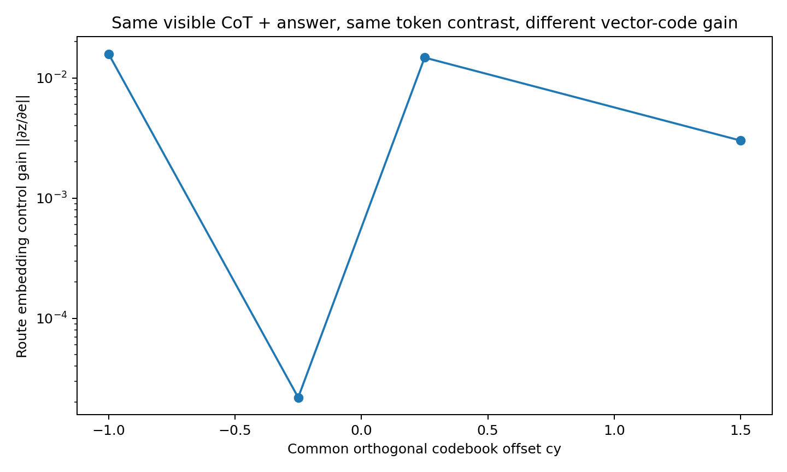

Figure 13.1 VECTOR-CODE-009: vector-code gains under identical CoT, endpoints and lexical contrast.

### 13.3 Orthogonal embedding intervention can change the answer first

Select seed14/History B/c_y=0.25/Q=11. Natural route token=1 has e1=(1,0.25). Intervene only in the second dimension: e1→(1,0.25+δ_y), preserving the visible route and first coordinate.

| Observation | Value |
| --- | --- |
| natural answer logit | 2.114650285 |
| ∂z_answer/∂e_route | (-0.023833, -0.029375) |
| Orthogonal share of gradient norm | 77.656% |
| Orthogonal share of squared energy | 60.304% |
| Angle between gradient and lexical axis | 50.946° |
| First answer boundary with downstream code fixed | δ_y≈1.380351 |
| downstream code bit switch | δ_y≈1.42875 |

With autonomous code regeneration, answer-logit zeros occur at δ_y≈1.380351, 1.427995 and 1.740383; code switches at δ_y≈1.42875. The first answer boundary precedes the discrete switch. Fixing downstream code retains only δ_y≈1.380351. Orthogonal numerical changes thus alter the answer with route label, lexical coordinate and next discrete CoT bit preserved; later branch switching creates the other boundaries.

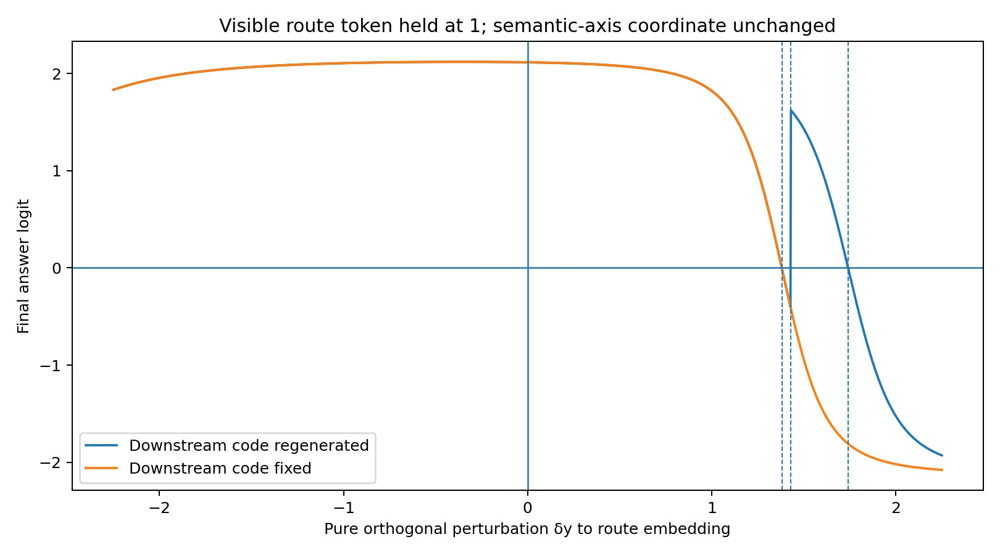

Figure 13.2 VECTOR-CODE-009: answer/code responses to orthogonal embedding shifts with visible route=1 fixed.

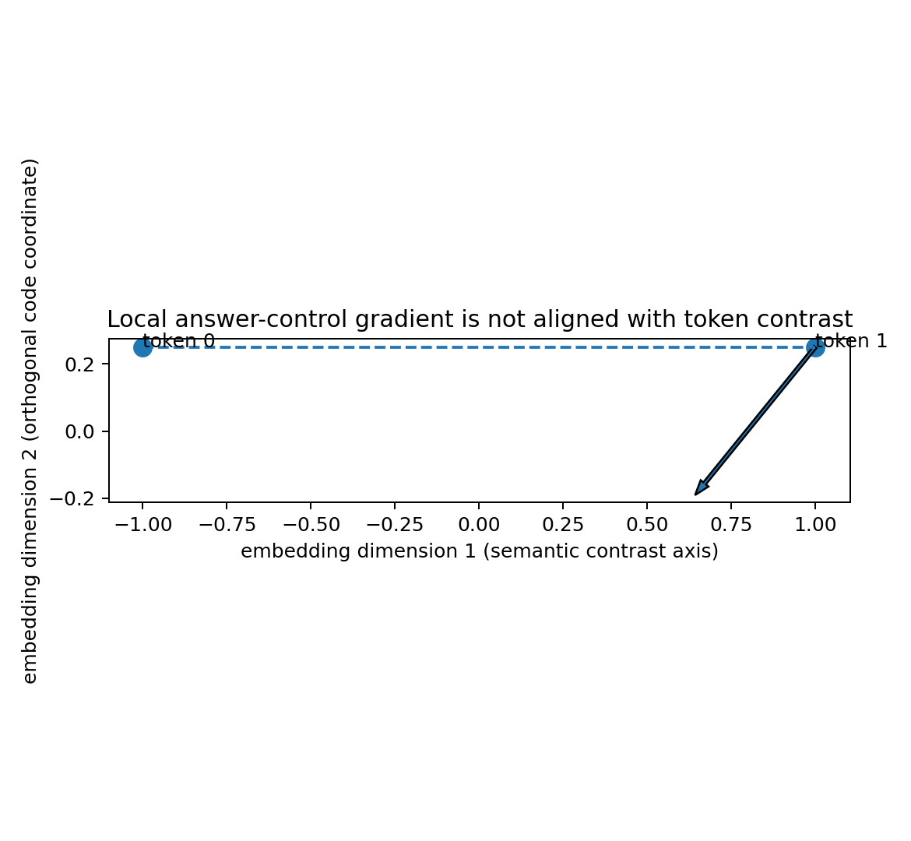

Figure 13.3 VECTOR-CODE-009: lexical contrast and local downstream-control gradient in two-dimensional embedding space.

### 13.4 Coordinate gauge control

Rotate all bit/marker codes by 37° and translate by c=(0.31,-0.47), compensating with U′=URᵀ and b′=b−U′c. Across four questions and four forced chains, maximum answer-logit error is 4.441×10⁻16 and final-hidden distance 3.511×10⁻16.

This closure identifies the causal object as the relative relationship among codes, learned input maps, current states, markers and nonlinear transition geometry. Absolute coordinate names are gauge choices.

### 13.5 Computational control beyond the lexical contrast axis

VECTOR-CODE-009 separates surface identity, lexical contrast and computational control direction. The token0→token1 vector specifies one embedding contrast. Orthogonal coordinates of the same visible token can enter different local-gain and bifurcation regions and alter future answers.

This connects to MRI-012's shared structural-token gates. VECTOR-CODE-009 supplies a microscopic mechanism: vector control gain within current state geometry determines token action.

Evidence supported. In this controlled 2D RNN, identical visible CoT, endpoints and lexical contrast coexist with substantially different embedding gains. Orthogonal intervention can change the answer before the next discrete CoT bit. Invertible global coordinate changes with compensating weights preserve function.

### 13.6 VECTOR-CODE-009 raw data index

VECTOR_CODE_009/VECTOR_CODE_009.md

VECTOR_CODE_009/strict_observable_lock_groups.csv

VECTOR_CODE_009/strongest_strict_group_detail.csv

VECTOR_CODE_009/selected_directional_case_summary.csv

VECTOR_CODE_009/orthogonal_route_embedding_sweep.csv

VECTOR_CODE_009/rotation_translation_gauge_control.csv

VECTOR_CODE_009/strict_observable_vector_gain.png

VECTOR_CODE_009/orthogonal_embedding_intervention.png

VECTOR_CODE_009/embedding_control_direction.png

## 14 VECTOR-SUBSPACE-010 Lexical control and exact silent subspaces

Objective: decompose 4D embeddings into lexical contrast, readable/control directions transmitted to hidden state and mathematically silent directions, then test control-geometry variation under strict observable locks.

### 14.1 Four dimensional embeddings and Row(U) ⊕ Null(U)

Hidden dimension remains 2; embeddings expand to 4. There are 16 trainable parameters: W(2×2)=4, U(2×4)=8, b=2, v=2. Every codebook has e1−e0=(2,0,0,0), fixing the lexical axis as a common three-dimensional orthogonal offset varies.

In the selected case rank(U)=2, so R⁴=Row(U)⊕Null(U) exactly: a 2D readable plane and 2D silent subspace. Every n∈Null(U) satisfies U(e+n)=Ue.

### 14.2 Control matrix SVD reveals one dominant embedding control axis

Select seed14/History A/offset=(0.6,0,0), with CoT `00|00|11|11` and endpoints `0011`. Stack the 8 local route/code-to-answer gradients across four questions into G∈R^{8×4} and apply SVD.

| mode | σ | energy | direction | angle to lexical | Row(U) | Null(U) |
| --- | --- | --- | --- | --- | --- | --- |
| 1 | 2.32722 | 99.9800% | (0.4625,-0.0409,0.7704,-0.4370) | 62.45° | 1.000 | ~0 |
| 2 | 0.032934 | 0.0200% | (-0.5256,-0.6847,-0.0071,-0.5049) | 58.29° | 1.000 | ~0 |
| 3 | 2.04e-17 | ~0 | (-0.6707,0.2601,0.6075,0.3368) | 47.88° | ~0 | 1.000 |
| 4 | 2.33e-18 | ~0 | (0.2450,-0.6796,0.1934,0.6639) | 75.82° | ~0 | 1.000 |

The first mode explains 99.97998% of G energy and lies 62.45° from the raw lexical axis. Across all 8 gradients, 78.606% of squared energy is orthogonal to that axis. Residual outside Row(U) is 3.72×10⁻16.

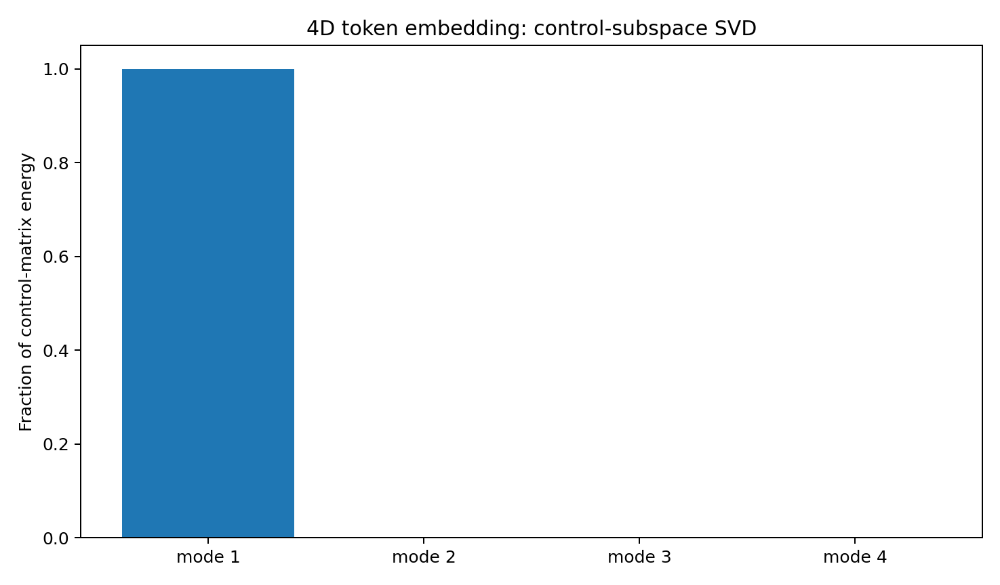

Figure 14.1 VECTOR-SUBSPACE-010: SVD energy of the 4D embedding control matrix.

### 14.3 Exact silent directions yield computationally equivalent numerical codes

Perturb the same route embedding along each of two orthogonal Null(U) directions up to ±5. Maximum answer-logit change and final-hidden distance are both 0. Codes e and e+n are exactly equivalent under this input map.

The computational token object is therefore the quotient [e]=e+Null(U), equivalently effective code Ue. Silent dimensions have an exact linear-algebraic characterization.

### 14.4 Misalignment of lexical axes readable projections and principal control modes

| Quantity | Selected case |
| --- | --- |
| raw lexical axis | (1,0,0,0) |
| Norm of readable lexical-axis projection | 0.700112 |
| readable energy fraction | 49.016% |
| silent projection norm | 0.714033 |
| silent energy fraction | 50.984% |
| Principal mode vs raw lexical axis | 62.450° |
| Principal mode vs readable lexical projection | 48.651° |

Lexical contrast contains both readable and exact-silent components. Even within Row(U), its readable projection is substantially misaligned with the principal downstream-control mode.

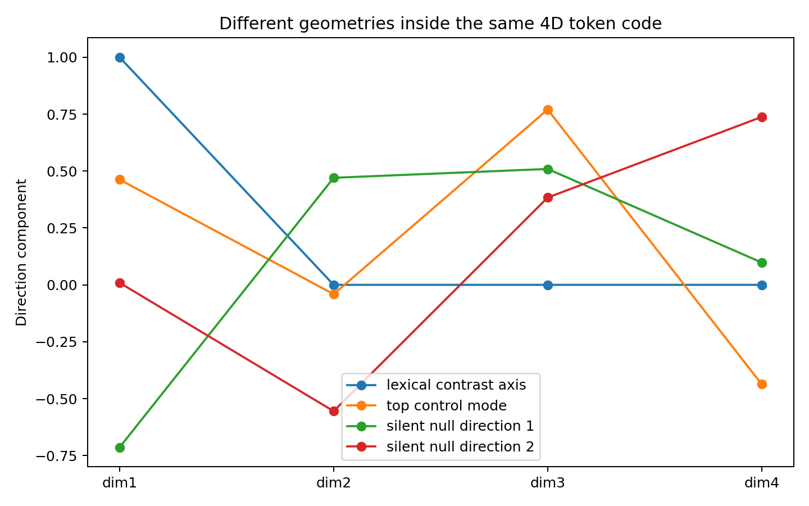

Figure 14.2 VECTOR-SUBSPACE-010: raw lexical axis, readable projection, principal control mode and silent components.

### 14.5 Direct interventions and strict observable locks

For selected Q=11, moving route embedding along the first control mode crosses the answer boundary at α≈1.192. Lexical-axis scans over α∈[-2,2] retain the original hard-answer region; both null-axis interventions are exactly silent.

A seed2/History A group contains 5 strictly matched models with CoT `00|00|11|11`, answers `0011` and contrast (2,0,0,0). Total local control gain ranges from 0.00784272 to 0.78412, a 99.9806× ratio.

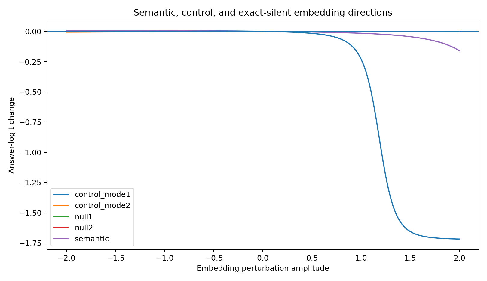

Figure 14.3 VECTOR-SUBSPACE-010: embedding interventions along control, lexical and null directions.

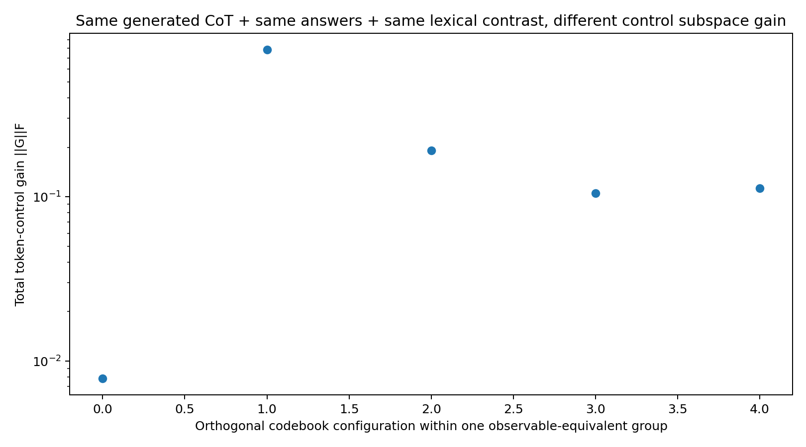

Figure 14.4 VECTOR-SUBSPACE-010: nearly 100× internal gain variation under identical CoT, endpoints and lexical contrast.

### 14.6 Four dimensional gauge control and interpretation

Apply a fixed 4D orthogonal rotation and translation (0.31,-0.47,0.22,-0.19) to every bit/marker embedding, compensating U′=UQᵀ and b′=b−U′c. Maximum answer-logit error is 3.331×10⁻16 and hidden distance 3.342×10⁻16 across questions/forced chains.

Computational embedding structure has two levels: quotient by exact-silent Null(U) to obtain readable classes, then select downstream-control modes in Row(U) through current parameters and state. Lexical contrast provides a reference direction within this geometry.

Evidence supported. A 4D code has an exact 2D silent subspace; all local token→answer gradients lie in Row(U). Principal control and lexical contrast are misaligned, and strictly observation-matched models differ by nearly 100× in internal control strength.

### 14.7 VECTOR-SUBSPACE-010 raw data index

VECTOR_SUBSPACE_010/VECTOR_SUBSPACE_010.md

VECTOR_SUBSPACE_010/trained_4d_codebooks.csv

VECTOR_SUBSPACE_010/control_svd_directions.csv

VECTOR_SUBSPACE_010/input_map_row_null_basis.csv

VECTOR_SUBSPACE_010/exact_nullspace_interventions.csv

VECTOR_SUBSPACE_010/selected_subspace_decomposition_summary.csv

VECTOR_SUBSPACE_010/strict_observable_subspace_groups.csv

VECTOR_SUBSPACE_010/strongest_strict_group_detail.csv

VECTOR_SUBSPACE_010/gauge_4d_rotation_translation.csv

VECTOR_SUBSPACE_010/axis_intervention_curves.csv

VECTOR_SUBSPACE_010/control_subspace_svd_energy.png

VECTOR_SUBSPACE_010/control_vs_silent_axis_interventions.png

VECTOR_SUBSPACE_010/embedding_direction_components.png

VECTOR_SUBSPACE_010/strict_observable_control_gain.png

## 15 CONTROL-FLOW-011 State gated control frame rotation during CoT

Objective: recompute embedding→hidden and embedding→future-answer geometry at each self-generated CoT stage to measure how dominant control directions evolve with hidden state.

### 15.1 Observation matched history pairs and analytical geometry

Reuse seed14 and 4D offset=(0.6,0,0) from VECTOR-SUBSPACE-010. Histories A/B differ only in paired-chain training order. Both have CoT `00|00|11|11` and correct endpoints `0011`.

For h_t=tanh(W h_{t-1}+Ue_t+b), immediate Jacobian J_t=D_tU with D_t=diag(1−h_t²). Exact answer gradient is g_j=UᵀD_jWᵀD_{j+1}…WᵀD_Tv. Analytical products agree with autograd to maximum absolute error 1.943×10⁻16 across histories/questions/paths.

### 15.2 Different route to code axis rotations under identical visible CoT

| Q | A: state-axis rotation | B: state-axis rotation | A: answer-control rotation | B: answer-control rotation |
| --- | --- | --- | --- | --- |
| 00 | 53.988° | 89.698° | 20.587° | 47.737° |
| 01 | 59.314° | 89.473° | 53.718° | 45.927° |
| 10 | 50.465° | 89.635° | 38.730° | 42.972° |
| 11 | 49.816° | 89.630° | 22.193° | 36.634° |

Immediate route→code control-axis rotation ranges from 49.816°–59.314° in History A and 89.473°–89.698° in B. Strictly identical visible CoT/endpoints coexist with different control-flow geometry.

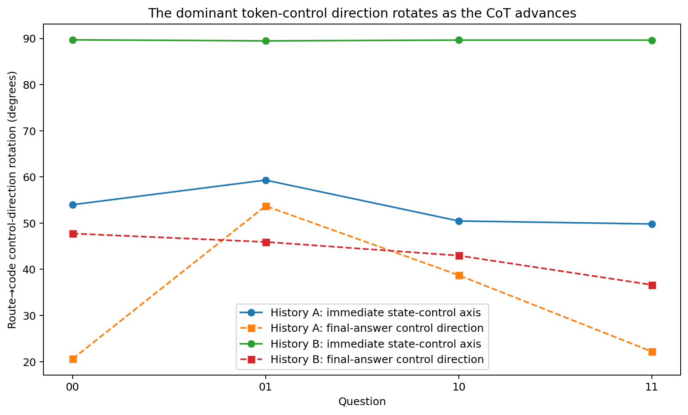

Figure 15.1 CONTROL-FLOW-011: per-question principal token-control rotations from route to code.

### 15.3 Tanh gates alternate dominance between nearly orthogonal input channels

| Q=00 observation | route stage | code stage |
| --- | --- | --- |
| D1 | 0.555563 | 0.374992 |
| D2 | 0.649525 | 0.044581 |
| \|D1\|×\|\|U row1\|\| | 0.250764 | 0.169260 |
| \|D2\|×\|\|U row2\|\| | 0.839101 | 0.057593 |
| Principal-axis distance | 0.0241° from U row2 | 0.0322° from U row1 |

History B's U rows are 89.754° apart. The second channel dominates at route; at code, the second hidden unit saturates and D2 falls to 0.044581, giving dominance to channel one. The near-90° rotation is a state-gated U_row2→U_row1 switch, observed in all four questions.

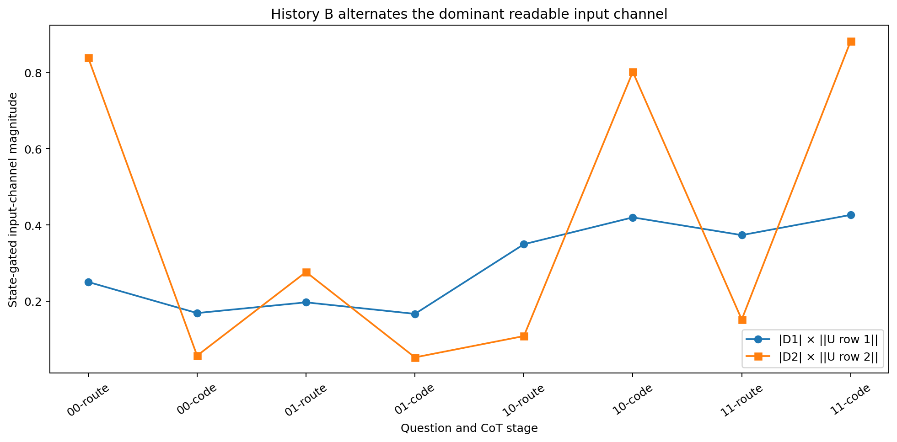

Figure 15.2 CONTROL-FLOW-011: alternating input-channel weighting by tanh derivative gates in History B.

### 15.4 Earlier CoT tokens control future controllability

| History | answer boundary α | next code-bit boundary α | Maximum rotation of future control direction | Future control-gain ratio |
| --- | --- | --- | --- | --- |
| A | 0.315247 | 0.603530 | 22.894° | 5.207× |
| B | 1.031778 | 1.764571 | 48.977° | 7.993× |

Fix Q=00 and the visible route token; perturb its embedding along its own dominant downstream-control direction. In both histories, the final answer crosses its boundary before the next discrete code bit changes. Within a fixed downstream branch, History B's next-token answer-control direction rotates 48.977° and its gain changes 7.993×.

A token thus controls later tokens' control capacity. By changing hidden state and D_t, an earlier CoT token reconfigures the directions available to subsequent tokens as well as current output propensity.

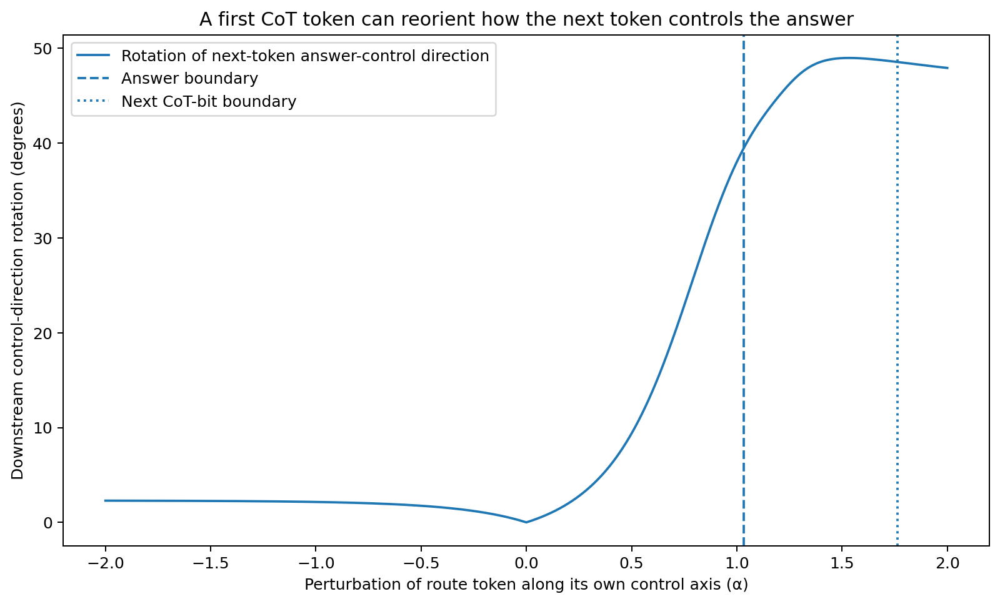

Figure 15.3 CONTROL-FLOW-011: earlier-token intervention redirects the next token's answer-control direction.

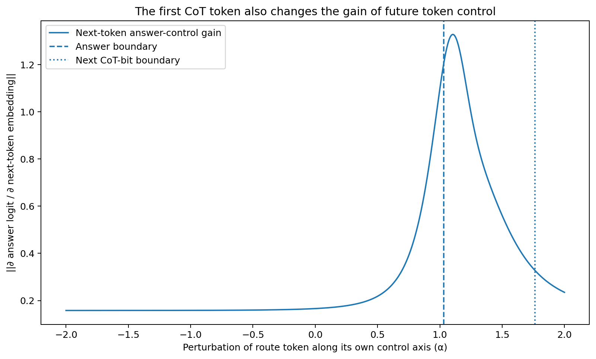

Figure 15.4 CONTROL-FLOW-011: earlier-token intervention changes the next token's control gain.

### 15.5 CoT as a sequence of state dependent control frames

For a trained RNN, Row(U) is fixed. Its internal anisotropy and dominant control frame vary during CoT. Tokens change hidden state, state changes D_t, and D_t reweights learned channels, changing the highest-gain direction and magnitude available to later tokens.

VECTOR-SUBSPACE-010 identifies embedding directions readable by the model; CONTROL-FLOW-011 identifies the directions with greatest control in the current CoT state. The two descriptions are complementary.

This supplies a microscopic interface to MRI-012's crystallization gates. A realized token can reorient state-dependent control frames and thereby redirect later-token readout/control gains, providing a mechanism for abrupt gains in structural or answer separability.

Evidence supported. Histories sharing codebooks, four-question CoT and endpoints show different stagewise rotations. Tanh gates alternating nearly orthogonal U rows explain History B's near-right-angle switch. An earlier token substantially rotates the next token's answer-control direction with that discrete bit preserved.

### 15.6 CONTROL-FLOW-011 raw data index

CONTROL_FLOW_011/CONTROL_FLOW_011.md

CONTROL_FLOW_011/stagewise_control_geometry.csv

CONTROL_FLOW_011/analytic_gradient_closure.csv

CONTROL_FLOW_011/hidden_channel_gating.csv

CONTROL_FLOW_011/same_chain_same_answer_history_comparison_Q00.csv

CONTROL_FLOW_011/meta_control_summary.csv

CONTROL_FLOW_011/meta_control_sweep_history_A_Q00.csv

CONTROL_FLOW_011/meta_control_sweep_history_B_Q00.csv

CONTROL_FLOW_011/stagewise_control_axis_rotation.png

CONTROL_FLOW_011/historyB_state_gated_channel_switch.png

CONTROL_FLOW_011/meta_control_reorientation_historyB_Q00.png

CONTROL_FLOW_011/meta_control_gain_historyB_Q00.png

CONTROL_FLOW_011/summary.json

## 16 Integrated v0.9 discussion From token codes to dynamic control flow

Combining the v0.8 MRI record with 009–011 extends history-conditioned CoT terrain to the numerical controllability geometry shaped by training and its dynamic reconfiguration during CoT.

training history → parameter / optimizer / embedding geometry → readable quotient [e] → current state → state-gated control frame → token computational action → reconfigured future controllability → next CoT / answer

VECTOR-CODE-009 demonstrates orthogonal downstream control; VECTOR-SUBSPACE-010 separates readable/silent geometry and lexical/control directions; CONTROL-FLOW-011 establishes dynamic selection of dominant modes by current CoT state through D_t.

These experiments specify realized token computational action as history/state-conditioned vector action. Identical strings, discrete CoT and lexical contrast can coexist with different local control geometry. Gauge and nullspace controls distinguish coordinate naming from functional relationships.

A prospective second-order object is ∂/∂e_t(∂z/∂e_{t+1}), describing how earlier tokens change later-token controllability. It extends continuous scans to explicit second-order tensors connected to MRI crystallization gates.

## Version update

| Version | Date | Added experiment | Core additions |
| --- | --- | --- | --- |
| v0.9 | 2026-09-26 | VECTOR-CODE-009 / VECTOR-SUBSPACE-010 / CONTROL-FLOW-011 | vector token code；lexical/control/silent subspace；exact embedding quotient；strict observable lock；state-gated control-frame rotation；future controllability reconfiguration |

## 17 HISTORY-ALGEBRA-012 Permutation algebra of complete training histories and control fields

### 17.1 Complete ordered history as the causal object

Replication update. V04 supports learning-order effects on continuous response fields across three architectures under matched parent state, examples and budget. Its 128-program audit gives the same discrete predictions in the 23 endpoint-qualified pairs; see 49.1.

This experiment treats training history as a complete ordered mathematical object. With the material multiset fixed, it asks which algebraic features of permutations generate different Prompt→CoT→Answer control fields.

The parallel Prompt–CoT–Answer series expresses local answer control, future control and control-of-control through Jacobians/Hessians. Here the complete control field is the downstream phenotype whose mathematical origins are traced into history.

training-history algebra  →  parameter displacement  →  Prompt–CoT–Answer control-field geometry

### 17.2 All 24 histories of one four group multiset

Use a 16-parameter recurrent microscope with 2D state and 4D input. Train a shared foundation with an objective symmetric across four groups. Groups A/B/C/D each correspond to one 2-bit question and both chain variants, ensuring identical material in every history.

| Group | Question | Within-group contents |
| --- | --- | --- |
| A | 00 | Two chain variants |
| B | 01 | Two chain variants |
| C | 10 | Two chain variants |
| D | 11 | Two chain variants |

Starting from identical foundation parameters, apply one SGD group update per group in all 24 permutations. Main diagnostic learning rate η=0.002. In this perturbative regime, all final models share natural CoT and answer signatures, strictly fixing visible CoT and endpoints.

| Shared foundation | Main diagnostic condition | Natural CoT across 24 histories | Answers across 24 histories |
| --- | --- | --- | --- |
| 00\|00\|11\|00 | η=0.002 | All identical | All identical: 0011 |

For each H, use the same canonical Prompt→CoT→Answer trajectory across four questions. Compute g_t=∂z_final/∂e_t at seven visible positions. Four questions × seven positions × four embedding dimensions yield a 112D control-field fingerprint G(H).

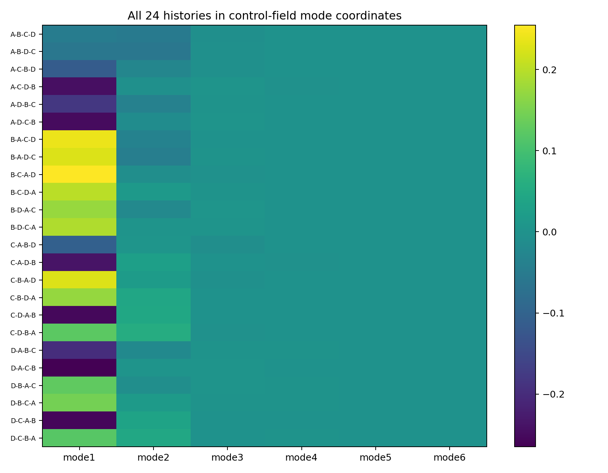

Figure 17.1 HISTORY-ALGEBRA-012: all 24 permutations in principal control-field coordinates.

### 17.3 History differences begin with second order noncommutativity

Each group produces U_a(θ)=θ−ηg_a(θ). History H=(s1,s2,s3,s4) yields Θ(H)=U_s4∘U_s3∘U_s2∘U_s1(θ0). Every group appears once, so first-order material term −ηΣ_a g_a is identical across histories.

Let x_ab(H)=+1 when a precedes b and −1 otherwise. A second-order BCH/Magnus-type expansion gives the history-specific displacement:

δθ_H^(2) = (η²/2) Σ_(a<b) x_ab(H) · [ H_b g_a − H_a g_b ]

The first nontrivial history coordinates are the six antisymmetric pairwise orders AB, AC, AD, BC, BD and CD: a discrete path's level-2 antisymmetric signature or Lie-bracket coordinates.

### 17.4 Six pairwise coordinates explain 98.792 percent of control field differences

At η=0.002, with natural CoT and answers fixed, projection of the centered 24×112 control-field matrix onto six pairwise-order coordinates explains 98.7921% of history-conditioned energy. Permutation parity alone explains 0.000002%.

| pairwise relation | Empirical control-field basis norm | Local parameter-commutator norm |
| --- | --- | --- |
| AB | 0.165151 | 140.584019 |
| BD | 0.044654 | 27.028355 |
| BC | 0.027262 | 39.653099 |
| AD | 0.019862 | 22.207138 |
| AC | 0.015876 | 52.879601 |
| CD | 0.005699 | 18.291741 |

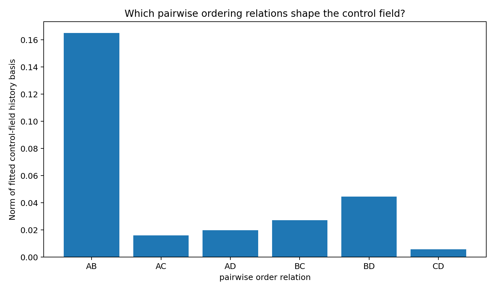

Figure 17.2 HISTORY-ALGEBRA-012: empirical control-field deformation associated with six precedence relations.

AB is strongest in this foundation, followed by BD and BC. The ranking reflects the selected group definitions and foundation geometry; the supported structural object is pairwise-order algebra.

### 17.5 Hessian gradient commutators predict pairwise field directions

For pair {a,b}, C_ab=H_b g_a−H_a g_b is the local historical parameter direction. Reading it through ∂G/∂θ gives theoretical field basis (η²/2)(∂G/∂θ)C_ab.

| pair | Empirical norm | Second-order theoretical norm | Directional cosine | Relative vector error |
| --- | --- | --- | --- | --- |
| AB | 0.165151 | 0.112456 | 0.997586 | 32.42% |
| AC | 0.015876 | 0.020807 | 0.928870 | 53.19% |
| AD | 0.019862 | 0.009509 | 0.812965 | 67.14% |
| BC | 0.027262 | 0.022386 | 0.972461 | 27.79% |
| BD | 0.044654 | 0.027284 | 0.992899 | 40.00% |
| CD | 0.005699 | 0.006713 | 0.992972 | 21.96% |

Theoretical/empirical cosines exceed 0.97 for AB, BC, BD and CD, and 0.928 for five of six pairs. Across 24 centered parameter displacements, second-order commutator prediction has cosine=0.977626; passing predicted parameters through the nonlinear field readout gives cosine=0.982958.

Directional closure is stronger than magnitude closure. Measurable third- and higher-order combinations already contribute at η=0.002; the next section measures these residuals as higher-order history algebra.

### 17.6 Higher order history combinations emerge with update scale

Repeat all 24 histories over η=0.0005–0.072. At small steps, visible CoT/answers are fixed and pairwise algebra explains almost all control-field variation. Larger steps amplify nested/higher-order compositions and eventually separate visible chains and answers.

| η | pairwise field energy | 2nd-order θ cosine | CoT signatures | answer signatures | joint signatures |
| --- | --- | --- | --- | --- | --- |
| 0.0005 | 99.91% | 0.9988 | 1 | 1 | 1 |
| 0.001 | 99.66% | 0.9949 | 1 | 1 | 1 |
| 0.002 | 98.79% | 0.9776 | 1 | 1 | 1 |
| 0.004 | 96.41% | 0.8996 | 1 | 1 | 1 |
| 0.006 | 95.21% | 0.7883 | 1 | 1 | 1 |
| 0.012 | 28.00% | 0.6104 | 4 | 1 | 4 |
| 0.048 | 29.16% | -0.0560 | 8 | 4 | 12 |
| 0.072 | 26.94% | 0.1005 | 11 | 4 | 13 |

For η≤0.003, absolute second-order residual scales approximately as η^3.173, close to third-order nested composition. Pairwise order explains 99.9109% of historical field energy at η=0.0005 and 99.6612% at η=0.001.

At η=0.012, pairwise linear explanation falls to approximately 28.00% and 4 natural CoT signatures appear. At η=0.048, there are 12 joint CoT/answer signatures. Pairwise noncommutativity dominates small updates; larger updates amplify three-/four-way and higher compositions.

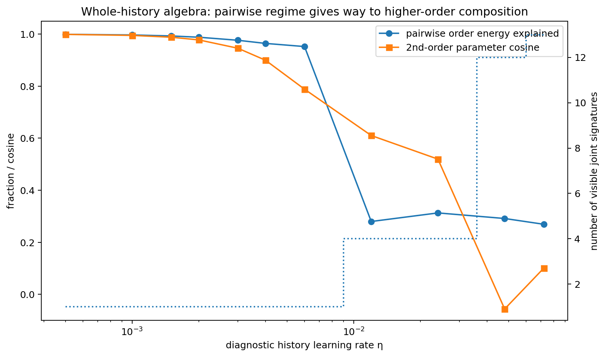

Figure 17.3 HISTORY-ALGEBRA-012: transition from pairwise to higher-order history algebra with increasing step size and emerging CoT/answer differences.

### 17.7 S4 group decomposition independent of epoch labels

The 24 executed permutations form S4. Character projectors give an exact isotypic decomposition of centered G:S4→R^112, analyzing complete history structure independently of arbitrary epoch labels.

| S4 irrep | d | isotypic dim | Actual field energy | Captured by pairwise coordinates | pairwise residual |
| --- | --- | --- | --- | --- | --- |
| standard_31 | 3 | 9 | 91.563460% | 90.625245% | 0.938215% |
| two_dim_22 | 2 | 4 | 0.184935% | 0.000000% | 0.184935% |
| standard_sign_211 | 3 | 9 | 8.251603% | 8.166861% | 0.084742% |
| sign | 1 | 1 | 0.000002% | 0.000000% | 0.000002% |

Field energy is approximately 91.5635% in standard [3,1], 8.2516% in standard-sign [2,1,1], 0.1849% in two-dimensional [2,2], and 2.19×10⁻⁶% in pure sign/parity. Pairwise coordinates capture most standard and standard-sign energy; approximately 1.21% is higher-order permutation residual at the main η.

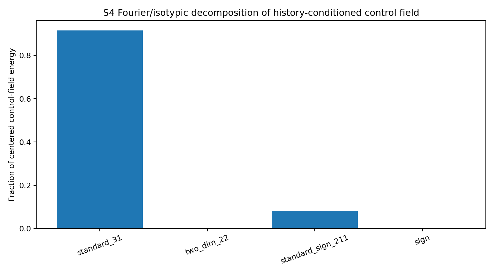

Figure 17.4 HISTORY-ALGEBRA-012: S4 Fourier/isotypic energy decomposition of the 24-history field.

### 17.8 Low dimensional control phenotypes across a combinatorial history space

SVD of the centered 24×112 matrix gives mode1=97.3659%, top-2=99.9671% and top-3=99.9978%. The histories mainly move along one dominant whole-history deformation mode with a few corrections.

Figure 17.5 HISTORY-ALGEBRA-012: coordinates of 24 histories on the first six control-field modes.

### 17.9 Locations of history algebra along Prompt to CoT to Answer

| Visible position | history-conditioned control-field variation |
| --- | --- |
| Q_A | 67.317% |
| Q_B | 8.547% |
| ROUTE_MARK | 2.087% |
| ROUTE_BIT | 11.912% |
| CODE_MARK | 8.662% |
| CODE_BIT | 1.301% |
| ANSWER_MARK | 0.174% |

In the fixed canonical readout, field differences are strongest at first prompt bit Q_A (67.32%), then route bit (11.91%), code marker (8.66%) and Q_B (8.55%). This localizes cross-model differences in final-answer control gradients mainly to early state formation; the measured quantity is gradient variation across histories.

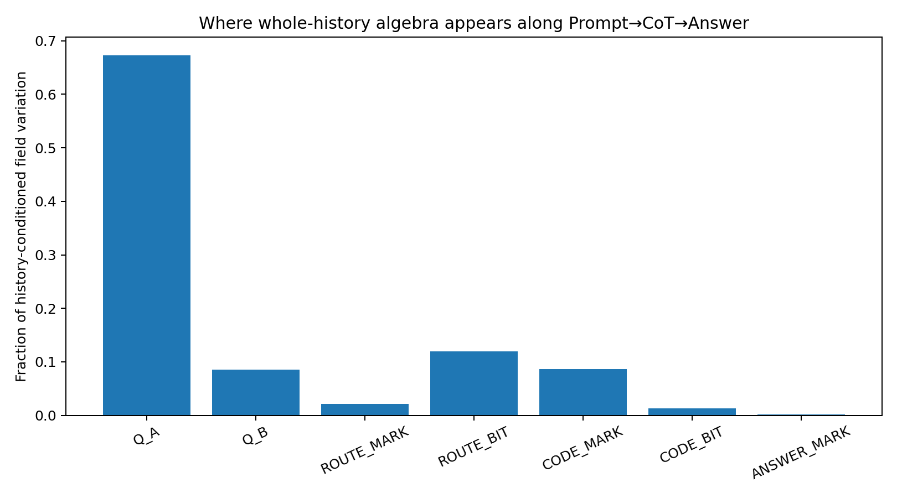

Figure 17.6 HISTORY-ALGEBRA-012: distribution of permutation-induced control-field differences along visible positions.

### 17.10 Whole history log signatures and Lie algebra

The causal objects are ordered relationships among training materials. A group's action depends on its composition with other update operators. Six pairwise relations nearly describe the main perturbative regime; higher-order residuals grow approximately cubically in η and dominate larger updates.

same training multiset → ordered noncommutative operator product → pairwise Lie layer → nested higher-order history motifs → control field

For longer histories, path signatures/log-signatures or truncated free-Lie bases offer low-order ordered-composition coordinates in place of T! enumeration. A transfer kernel can map these whole-history algebra modes to rotating Prompt–CoT–Answer fields.

The parallel control-field series describes post-training rotation of local control along text; this experiment describes the whole-history algebraic combinations that shape that field. Together they establish an explicit interface.

### 17.11 HISTORY-ALGEBRA-012 raw data index

HISTORY_ALGEBRA_012/HISTORY_ALGEBRA_012.md

HISTORY_ALGEBRA_012/all_24_history_permutations.csv

HISTORY_ALGEBRA_012/all_24_final_parameters.csv

HISTORY_ALGEBRA_012/all_24_control_fields.csv

HISTORY_ALGEBRA_012/group_local_geometry.csv

HISTORY_ALGEBRA_012/pairwise_commutator_parameter_basis.csv

HISTORY_ALGEBRA_012/pairwise_commutator_control_field_basis.csv

HISTORY_ALGEBRA_012/pairwise_commutator_field_basis_closure.csv

HISTORY_ALGEBRA_012/pairwise_history_relation_strength.csv

HISTORY_ALGEBRA_012/control_field_parameter_jacobian.csv

HISTORY_ALGEBRA_012/learning_rate_hierarchy_scan.csv

HISTORY_ALGEBRA_012/learning_rate_hierarchy_scan_wide.csv

HISTORY_ALGEBRA_012/S4_irrep_control_field_decomposition.csv

HISTORY_ALGEBRA_012/history_control_field_svd.csv

HISTORY_ALGEBRA_012/control_field_variation_by_token_position.csv

HISTORY_ALGEBRA_012/history_algebra_regime_transition.png

HISTORY_ALGEBRA_012/history_order_hierarchy_scaling.png

HISTORY_ALGEBRA_012/S4_irrep_control_field_energy.png

HISTORY_ALGEBRA_012/pairwise_order_relation_strength.png

HISTORY_ALGEBRA_012/history_algebra_by_sequence_position.png

HISTORY_ALGEBRA_012/all_24_history_control_mode_scores.png

HISTORY_ALGEBRA_012/summary.json

## 18 Integrated v1.0 discussion From control field anatomy to history algebra

CONTROL-FLOW-011 and the parallel Prompt–CoT–Answer experiments express post-training token-axis rotation through Jacobians/meta-control. HISTORY-ALGEBRA-012 identifies field shape as an outcome of a complete ordered product of training operators.

history log-signature / Lie coordinates → optimizer flow → parameters / states → rotating token-control field → CoT / Answer

In this fully enumerable case, all histories share first-order material content. Historical identity first appears in antisymmetric pairwise orders and progressively includes nested higher-order combinations as update scale increases.

Low-order whole-history signatures offer candidate coordinates for MRI foundation/curriculum terrain, with rotating token-control fields as downstream functions. Subsequent experiments can diagnose which history-algebra structures generate which field geometries.

## Version update

| Version | Date | Added experiment | Core additions |
| --- | --- | --- | --- |
| v1.0 | 2026-09-26 | HISTORY-ALGEBRA-012 | All 24 S4 histories; pairwise Lie/commutator coordinates; higher-order η scaling; S4 Fourier/isotypic decomposition; whole-history algebra → Prompt–CoT–Answer control fields |

## 19 TEACHER-DIMENSION-TRANSFER-013 Transfer of training world dimensions into control fields

### 19.1 Origins of low dimensional control in models and teachers

Replication update. Under the known rank-2/4/6 teacher family, V09 recovers the teacher rank as Jacobian r95 in all 27 continuous-feedback students across three architectures; see 49.3.

Earlier control-field, VECTOR-SUBSPACE and MRI results show low-dimensional effective control. Candidate sources are architectural/optimization preferences and the number of independently varying directions supplied by the training world. Experiment 013 manipulates teacher intrinsic control dimension with an explicit architecture-ceiling control.

The target is controllable dimension of the full future trajectory with respect to current state. Tracking teacher dimension identifies training-world influence; saturation under a fixed 3D bottleneck identifies architectural limits.

### 19.2 A known d dimensional teacher in a 10D surface space

Every teacher occupies ambient token/state space R^10. For d=1,…,6, B_d∈R^{10×d} has d orthonormal columns and defines the transition:

F_d(x) = B_d tanh(A_d B_dᵀ x)

Its exact local Jacobian is:

J_d(x) = B_d D(x) A_d B_dᵀ

A_d is invertible and approximately isometric at all experimental points, and D(x)=diag(1−tanh²(·)) has strictly positive diagonal entries. Thus generic rank(J_d)=d: intrinsic dimension is known by construction.

All 10 ambient input coordinates vary independently. The teacher reads d combinations in span(B_d) and is exactly invariant to its orthogonal complement, experimentally separating visible-variable count from independent controls.

| teacher d | Median teacher future r95 | teacher stable rank |
| --- | --- | --- |
| 1 | 1.0 | 1.000 |
| 2 | 2.0 | 1.597 |
| 3 | 3.0 | 1.993 |
| 4 | 4.0 | 2.590 |
| 5 | 5.0 | 3.082 |
| 6 | 6.0 | 3.657 |

### 19.3 Students and future trajectory Jacobian readouts

Students repeatedly apply one nonlinear 10→10 transition to synthetic thought/state tokens. Both capacity branches share 10×10 trainable matrix shapes and parameter counts; they differ only in a fixed readable projection P_r after the hidden nonlinearity:

S_{θ,r}(x) = W₂ P_r tanh(W₁x+b)

full10 uses rank(P)=10; bottleneck3 uses rank(P)=3, imposing exact rank(∂S/∂x)≤3 with data, training counts and matrix sizes controlled.

Generate K=5 synthetic CoT steps x₁=S(x₀),…,x₅=S(x₄), concatenate R_K=(x₁,…,x₅), and measure:

J_future = ∂R_K/∂x₀ = [J₁ ; J₂J₁ ; … ; J₅…J₁]

r95 is the fewest singular modes accounting for 95% of future-control energy. Stable rank, entropy rank, local r95 and energy in span(B_d) are also saved. Each teacher/capacity condition uses 3 shared initialization seeds, reusing initial weights and minibatch order across d.

### 19.4 Full capacity students acquire the teachers one to six degrees of freedom

| teacher d | Median future r95 | mean r95 | stable rank | test MSE | teacher-subspace energy |
| --- | --- | --- | --- | --- | --- |
| 1 | 1.0 | 1.000 | 1.000 | 2.95e-07 | 0.999998 |
| 2 | 2.0 | 1.995 | 1.590 | 6.62e-07 | 0.999998 |
| 3 | 3.0 | 2.953 | 1.982 | 1.18e-06 | 0.999999 |
| 4 | 4.0 | 3.932 | 2.575 | 1.33e-06 | 0.999999 |
| 5 | 5.0 | 4.839 | 3.034 | 3.19e-06 | 1.000000 |
| 6 | 6.0 | 5.667 | 3.638 | 2.96e-06 | 1.000000 |

The full10 median future-control r95 sequence is exactly:

1 → 2 → 3 → 4 → 5 → 6

Pearson correlation of teacher d with learned median r95 is 1.000000; fitted slope=1.0000 and intercept≈0. Test MSE stays around 10⁻⁶ across d, supporting dimension transfer under accurate fitting.

Approximately 99.9998% of learned future-Jacobian control energy lies in the teacher's causal subspace. Students recover both dimension and direction of future sensitivity.

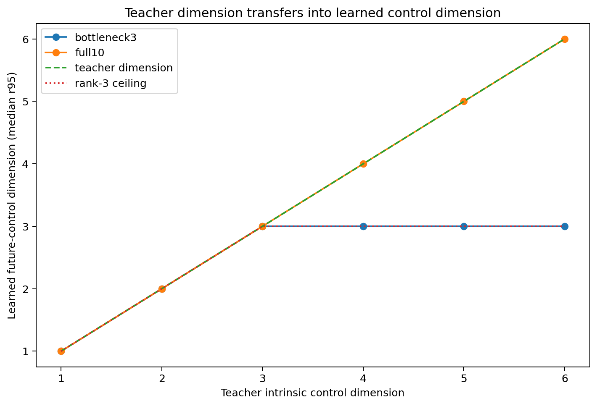

Figure 19.1 Teacher dimension vs learned future-control r95: full-capacity expansion and rank-3 saturation.

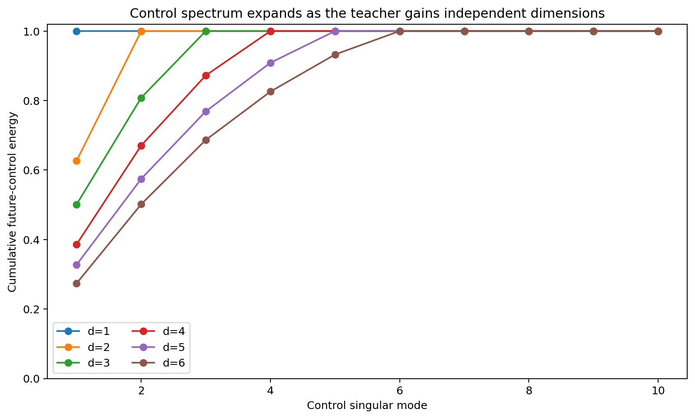

Figure 19.2 Cumulative control spectra in full10 students: each added teacher degree of freedom adds an effective retained mode.

### 19.5 Architectural ceiling with a rank three student

| teacher d | Median future r95 | mean r95 | stable rank | test MSE | teacher-subspace energy |
| --- | --- | --- | --- | --- | --- |
| 1 | 1.0 | 1.000 | 1.000 | 1.461e-07 | 1.000000 |
| 2 | 2.0 | 2.000 | 1.588 | 3.609e-07 | 1.000000 |
| 3 | 3.0 | 2.953 | 1.993 | 7.274e-13 | 1.000000 |
| 4 | 3.0 | 3.000 | 2.261 | 2.182e-02 | 0.999798 |
| 5 | 3.0 | 3.000 | 2.357 | 4.526e-02 | 0.999781 |
| 6 | 3.0 | 3.000 | 2.511 | 6.824e-02 | 0.999700 |

With a fixed rank-3 readable bottleneck, dimensions become:

1 → 2 → 3 → 3 → 3 → 3

Correlation with min(d_teacher,3) is 1.000000. At d≤3, fitting error is 10⁻⁶ or lower; at d=4/5/6, test MSE rises to approximately 0.0218/0.0453/0.0682.

A working relationship for this controlled system is:

d_control ≈ min(d_teacher, d_architecture)

The teacher supplies recurring independent control degrees of freedom, and architecture sets the number that can be stably represented.

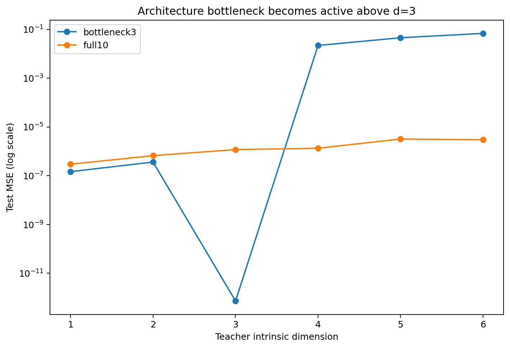

Figure 19.3 Above the 3D bottleneck, future-control rank saturates and approximation error increases.

### 19.6 Intrinsic dimension transfers across different surface representations

| surface geometry | future r95 | stable rank | test MSE | causal-subspace energy |
| --- | --- | --- | --- | --- |
| dense10_to2 | 2.00 | 1.590 | 6.62e-07 | 0.999998 |
| sparse2_of10 | 2.00 | 1.583 | 4.35e-06 | 0.999999 |

Both d=2 worlds expose 10 varying coordinates. dense10_to2 distributes two latent directions densely across them; sparse2_of10 uses two standard coordinates with eight independently varying inert dimensions. Both yield future r95≈2.

Control dimension follows the number of independent directions on which teacher output depends, across different visible-variable and token-coordinate representations.

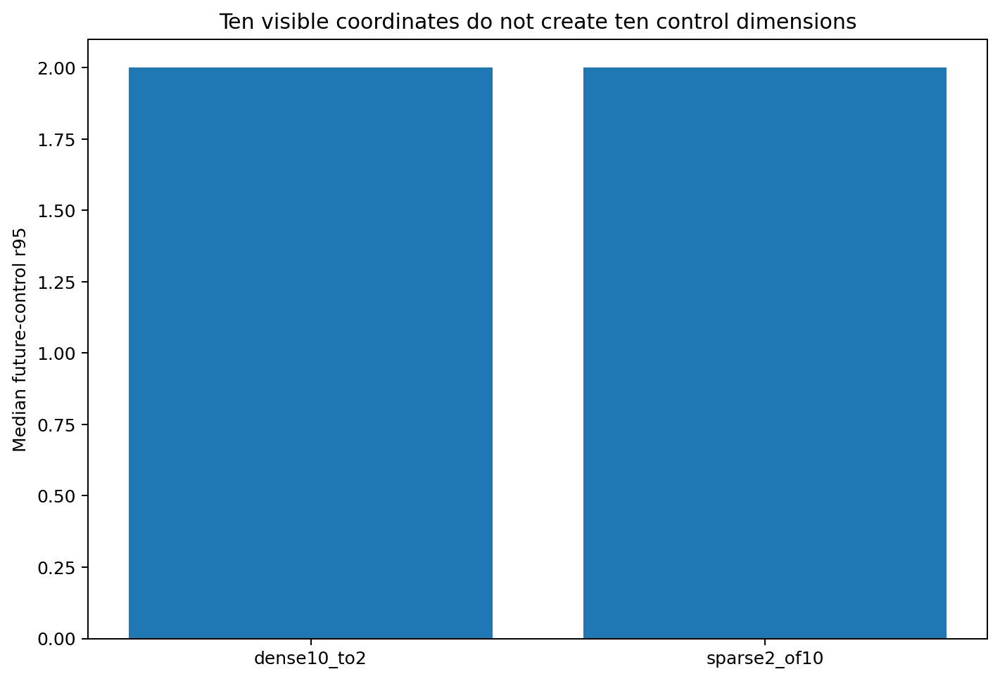

Figure 19.4 Ten varying surface coordinates yield approximately 2D student control fields when true causal dimension=2.

### 19.7 Rotation controls for dimension transfer

| d=4 teacher orientation | future r95 | stable rank | test MSE | causal-subspace energy |
| --- | --- | --- | --- | --- |
| main | 4.00 | 2.575 | 1.33e-06 | 0.999999 |
| rotA | 4.00 | 2.595 | 2.24e-06 | 0.999999 |
| rotB | 4.00 | 2.595 | 2.48e-06 | 0.999999 |

Rotate one d=4 teacher subspace independently three times in R^10. All students retain future r95=4 and stable rank≈2.58–2.60, supporting orientation-independent dimension transfer.

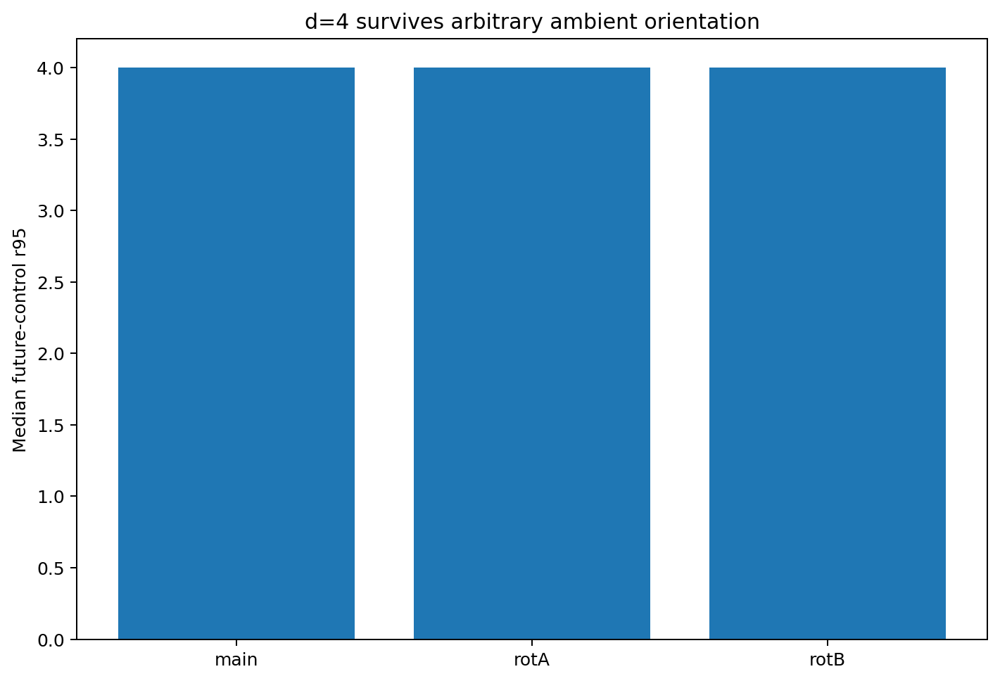

Figure 19.5 Learned dimension under three ambient orientations of a d=4 teacher.

### 19.8 Transferable training world dimensions with architectural truncation

This experiment makes effective control dimension intervenable. Ambient dimension and full10 capacity remain fixed; teacher intrinsic d varies. One-to-one learned r95 expansion establishes causal shaping of low-dimensional control by training-world variation.

The rank-3 control identifies a second constraint. At teacher d=4–6, learned rank saturates at 3 and approximation error increases. Teacher dimension and architectural ceiling operate at distinct levels.

In the earlier Tetris/dynamic-slice picture, recurring independent training-world variations become stable control directions. Additional parameter/state dimensions provide capacity, and CoT rotates the local control resources shaped by training.

If natural-language models exhibit 2–3 principal reasoning-control modes, the corresponding diagnostic is to manipulate or estimate training intrinsic dimension, test spectrum changes and establish architectural ceilings with bottleneck controls.

### 19.9 Evidence scope and next experiment

Experiment 013 uses a constructed continuous low-rank teacher with analytically known Jacobian rank. It establishes a mechanism by which full-student future-control dimension follows d=1…6 and a rank-3 architecture truncates that transfer.

The proposed extension uses genuine autoregressive discrete-token teachers with vocabulary, length, surface complexity and architecture fixed, varying independent latent controls. Prompt–CoT–Answer tomography can then measure transfer into discrete language/reasoning trajectories.

### 19.10 TEACHER-DIMENSION-TRANSFER-013 raw data index

TEACHER_DIMENSION_TRANSFER_013/TEACHER_DIMENSION_TRANSFER_013.md

TEACHER_DIMENSION_TRANSFER_013/model_dimension_transfer_summary.csv

TEACHER_DIMENSION_TRANSFER_013/aggregate_dimension_transfer.csv

TEACHER_DIMENSION_TRANSFER_013/per_state_control_dimension_metrics.csv

TEACHER_DIMENSION_TRANSFER_013/control_singular_spectra.csv

TEACHER_DIMENSION_TRANSFER_013/teacher_exact_dimension_metrics.csv

TEACHER_DIMENSION_TRANSFER_013/orientation_control_d4.csv

TEACHER_DIMENSION_TRANSFER_013/redundant_surface_dimension_control.csv

TEACHER_DIMENSION_TRANSFER_013/teacher_to_control_dimension_transfer.png

TEACHER_DIMENSION_TRANSFER_013/architecture_bottleneck_error.png

TEACHER_DIMENSION_TRANSFER_013/control_spectrum_by_teacher_dimension.png

TEACHER_DIMENSION_TRANSFER_013/orientation_invariance_d4.png

TEACHER_DIMENSION_TRANSFER_013/redundant_surface_control.png

TEACHER_DIMENSION_TRANSFER_013/summary.json

## 20 Integrated v1.1 discussion History algebra shapes directions and teacher dimension sets their number

Experiments 012 and 013 address complementary questions. With material fixed, 012 shows how pairwise/higher-order history algebra writes it into control fields. With model/training procedure fixed, 013 varies training-world degrees of freedom and measures how many independent modes form.

Training control geometry therefore has two structural variables:

Training intrinsic dimension → number of independent directions supported as learned control axes

History algebra/log-signature → ordered composition, rotation and weighting of those directions during model formation

Downstream, CONTROL-FLOW-011 and Prompt–CoT–Answer results describe state-dependent rotation, gating and transfer of control among learned directions. The integrated chain is:

teacher intrinsic controls + whole-history algebra → optimizer flow → learned low-dimensional control geometry → state-dependent rotating control field → CoT / Answer

High-dimensional substrate provides capacity; recurring teacher factors determine which degrees of freedom are shaped; history algebra specifies their directions and form; generation continually redirects these local modes through CoT.

## Version update

| Version | Date | Added experiment | Core additions |
| --- | --- | --- | --- |
| v1.1 | 2026-09-26 | TEACHER-DIMENSION-TRANSFER-013 | teacher intrinsic dimension 1–6；future-control rank transfer；rank-3 architecture ceiling；10-visible/2-causal redundancy control；orientation control |
| v1.2 | 2026-09-26 | DISCRETE-TEACHER-DIMENSION-014 | Hard symbolic traces admit multiple continuous control geometries; numerical margins recover teacher d=1…6 rank and subspace direction |
| v1.3 | 2026-09-26 | TRACE-CHANNEL-015 | Trace-channel dissection; hard/repeated/counterfactual/graded controls; two-bin confidence threshold for rank identification; quantization precision and subspace recovery |

## 21 DISCRETE-TEACHER-DIMENSION-014 Dimension transfer through discrete language trajectories

### 21.1 Identifying continuous teacher dimensions through tokens

Experiment 013 establishes continuous dimension transfer from d=1…6. Experiment 014 moves to discrete autoregressive language-like trajectories, fixing vocabulary, 6-token prompts, 6-token CoT, 1-token answers, student architecture and complete training universe, varying only hidden teacher causal rank d=1…6.

The experiment separates teacher influence on student control structure from unique identification of that structure through thresholded hard tokens. Identifiability is the new target.

### 21.2 Discrete autoregressive teachers with known causal rank

Enumerate all 3^6=729 prompts x∈{-1,0,+1}^6. Teachers compute z=B_d^T x with d orthonormal columns, then six pre-threshold CoT logits and one answer logit. Each CoT logit becomes a hard 0/1 token fed back into the next step, producing genuine discrete autoregression.

Within a fixed branch, the full Prompt→(6 CoT logits + answer logit) Jacobian is J_teacher=Q_d B_d^T. Construction sets its continuous rank exactly to d, giving known ground truth for d=1…6.

### 21.3 Local control and global field SVD

Every student is the same 24-state tanh autoregressive RNN. After training, analytically compute the 7×6 Jacobian on each realized teacher branch, mapping six numerical prompt coordinates to six CoT logits and the answer logit.

Saturation and branch conditions can suppress local directions. Save local r95 and stack Jacobians from 183 distributed prompts for global SVD. Global r95 counts modes explaining 95% of field energy, measuring local axes as they rotate across states.

### 21.4 High hard token accuracy with variable continuous geometry

Hard supervision provides thresholded 0/1 CoT/answer tokens. Across two shared initializations × d=1…6 (12 models), mean bit accuracy is 0.99095. Geometric differences therefore occur under accurate discrete-task reproduction.

| Supervision | teacher d | Median global r95 | Seed range | teacher-subspace energy | Mean principal angle | bit accuracy |
| --- | --- | --- | --- | --- | --- | --- |
| hard | 1 | 1.0 | 1–1 | 0.9736 | 2.170° | 0.9966 |
| hard | 2 | 3.5 | 3–4 | 0.8318 | 15.533° | 0.9972 |
| hard | 3 | 4.5 | 4–5 | 0.8058 | 13.127° | 0.9927 |
| hard | 4 | 4.0 | 4–4 | 0.9628 | 3.959° | 0.9879 |
| hard | 5 | 5.0 | 5–5 | 0.9808 | 1.622° | 0.9775 |
| hard | 6 | 5.0 | 5–5 | 1.0000 | 0.003° | 0.9940 |
| numeric_margin | 1 | 1.0 | 1–1 | 0.9964 | 0.415° | 0.9904 |
| numeric_margin | 2 | 2.0 | 2–2 | 0.9950 | 0.938° | 0.9812 |
| numeric_margin | 3 | 3.0 | 3–3 | 0.9930 | 0.831° | 0.9824 |
| numeric_margin | 4 | 4.0 | 4–4 | 0.9943 | 0.322° | 0.9874 |
| numeric_margin | 5 | 5.0 | 5–5 | 0.9983 | 0.150° | 0.9837 |
| numeric_margin | 6 | 6.0 | 6–6 | 1.0000 | 0.008° | 0.9768 |

Hard-token median global r95 is 1/3.5/4.5/4/5/5 against teacher 1/2/3/4/5/6. Students add directions at d=2/3 and both retain r95=5 at d=6.

Hard symbolic traces admit geometrically distinct continuous realizations. Identical or similar discrete CoT/answer mappings can occupy fields with different dimensions and orientations.

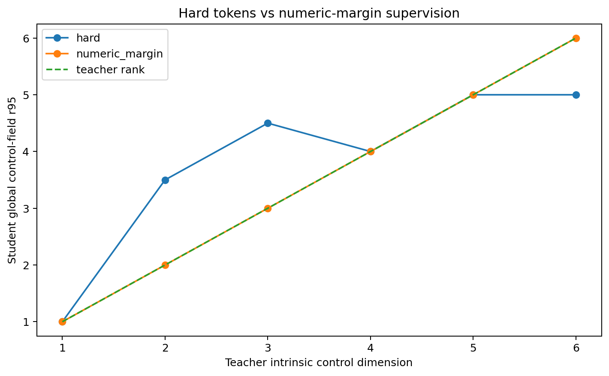

Figure 21.1 DISCRETE-TEACHER-DIMENSION-014: teacher dimension vs global student r95 under hard-token and numeric-margin supervision.

### 21.5 Numerical margins recover rank and direction with visible tokens fixed

The second condition preserves all visible tokens and additionally supplies each teacher pre-threshold logit/margin, providing a graded trace of distance to the boundary.

Both shared initializations recover global r95=1/2/3/4/5/6 exactly. Across d and seeds, mean control energy in the teacher causal subspace is 0.99617 and mean principal-angle error 0.444°.

Hard-token means are 0.92582 and 6.069°, with greatest divergence at d=2/3. Token identity specifies the side of a boundary; numerical margins additionally constrain local geometric scale and direction.

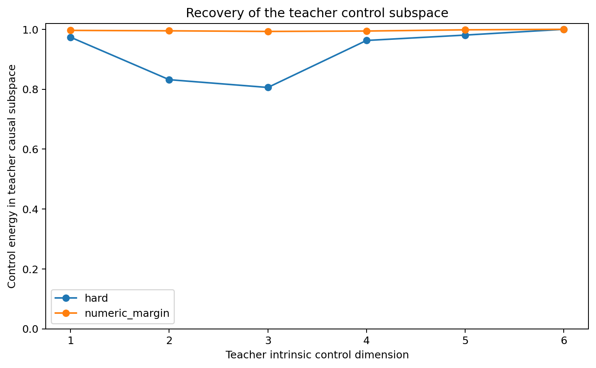

Figure 21.2 Numerical margins concentrate student control energy in the true teacher subspace.

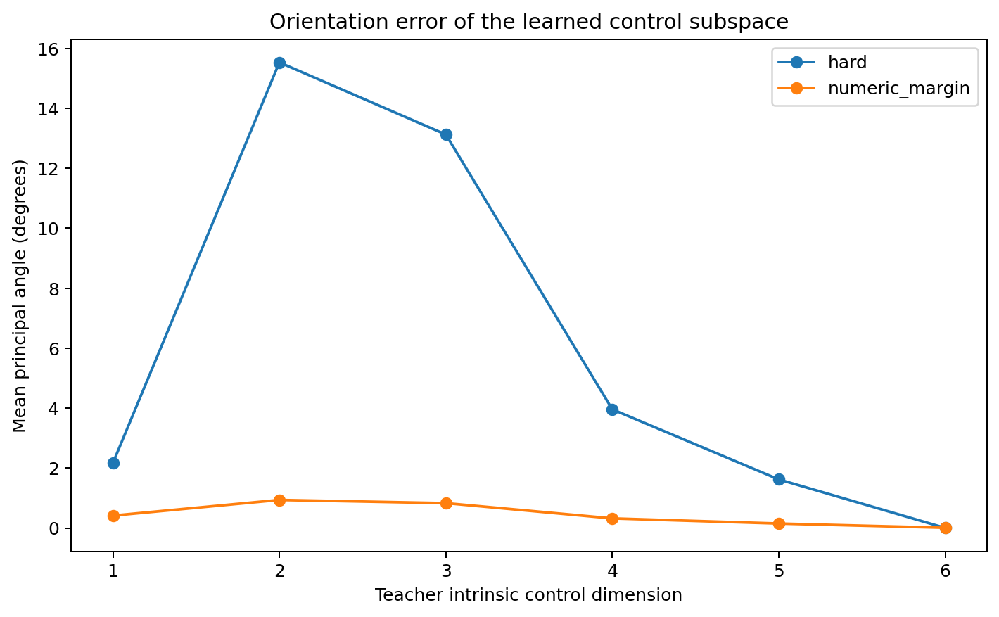

Figure 21.3 Mean student/teacher control-subspace principal-angle errors.

### 21.6 Local and global dimensions of rotating control fields

Even with exact global d recovery under margin supervision, local r95 at individual prompts is often 1–3. Different states activate different local directions; their union across states forms the teacher's d-dimensional field, consistent with CONTROL-FLOW-011.

Experiment 014 reproduces low-local/higher-global control structure in a fully discrete autoregressive task.

### 21.7 Surface coordinate and orientation controls

At d=2, dense teachers distribute causal directions across six coordinates and sparse teachers use two. Margin-trained students recover r95=2 in both, with teacher-subspace energy approximately 0.9968 and 0.9977.

At d=4, three independent orthogonal orientations all yield r95=4, teacher energy 0.9950–0.9966 and mean angle 0.30°–0.59°. Recovery tracks intrinsic causal dimension across orientations.

| Control | Supervision | Variant | r95 | teacher energy | Principal angle | bit acc |
| --- | --- | --- | --- | --- | --- | --- |
| surface | hard | dense | 3 | 0.9158 | 7.197° | 0.9959 |
| surface | hard | sparse | 1 | 0.9955 | 19.677° | 1.0000 |
| surface | numeric_margin | dense | 2 | 0.9968 | 0.850° | 0.9822 |
| surface | numeric_margin | sparse | 2 | 0.9977 | 0.429° | 1.0000 |
| orientation | numeric_margin | orient1 | 4 | 0.9966 | 0.328° | 0.9792 |
| orientation | numeric_margin | orient2 | 4 | 0.9959 | 0.593° | 0.9792 |
| orientation | numeric_margin | orient3 | 4 | 0.9950 | 0.299° | 0.9843 |

### 21.8 Discrete discrimination and continuous geometric constraints

Experiments 013/014 support dimension transfer conditioned on the teacher's information channel. Continuous/graded traces expose geometry; hard tokens expose thresholded outcomes and permit multiple continuous realizations of the same trajectory.

The corresponding natural-language question is which graded, relational and temporal constraints guide models toward similar low-dimensional control fields among possible continuous interpolations.

In the dynamic-slice picture, hard tokens identify the region reached by a cut; margins additionally specify distance to boundaries and constrain local slopes. Margin supervision largely recovers the teacher's geometry here.

### 21.9 Scope of current evidence

In the fully enumerated 729-prompt world, students reproduce visible CoT/answers at approximately 99% bit accuracy with different continuous ranks/orientations. Adding pre-threshold margins restores d=1…6 global r95 in both initializations and approximately 99.62% teacher-subspace energy.

This makes dimension-transmission channels diagnosable: symbolic traces, numerical margins and state histories can be tested separately for their constraints on recovered geometry.

### 21.10 DISCRETE-TEACHER-DIMENSION-014 raw data index

DISCRETE_TEACHER_DIMENSION_014/DISCRETE_TEACHER_DIMENSION_014.md

DISCRETE_TEACHER_DIMENSION_014/dimension_transfer_all_models.csv

DISCRETE_TEACHER_DIMENSION_014/aggregate_dimension_transfer.csv

DISCRETE_TEACHER_DIMENSION_014/geometry_controls.csv

DISCRETE_TEACHER_DIMENSION_014/summary.json

DISCRETE_TEACHER_DIMENSION_014/dimension_transfer_hard_vs_numeric.png

DISCRETE_TEACHER_DIMENSION_014/teacher_subspace_recovery.png

DISCRETE_TEACHER_DIMENSION_014/control_subspace_angle.png

## 22 Integrated v1.2 discussion Dimension transfer depends on the trace channel

Experiment 013 establishes teacher intrinsic dimension → learned control dimension; 014 identifies the intervening information channel. Graded traces recover dimensions closely, and thresholded tokens permit broad continuous geometric freedom.

The integrated structure becomes:

teacher intrinsic controls → teaching trace / tokenization channel → identifiable geometric constraints → history algebra / optimizer flow → learned control field → state-dependent rotating local axes → CoT / Answer

Tokenization affects geometric identifiability. Hard supervision can add directions or move a genuine direction below the 95% energy threshold, allowing several continuous control manifolds to realize one discrete behavior.

The language-analysis branch can identify stable structural, relational and order signals. This experimental branch can intervene on each candidate teacher-trace channel and measure its effect on recovered rank/orientation.

TRACE-CHANNEL-015 therefore adds/removes margins, probabilities, temporal/order information, repeated contexts and counterfactual consistency from the same token sequence, measuring which traces narrow geometric equivalence classes toward stable teacher-like fields.

## Version update

| Version | Date | Added experiment | Core additions |
| --- | --- | --- | --- |
| v1.2 | 2026-09-26 | DISCRETE-TEACHER-DIMENSION-014 | Discrete teachers d=1…6; hard-token geometric equivalence; margin-based rank/orientation recovery; local/global rotating fields; dense/sparse and orientation controls |

## 23 TRACE-CHANNEL-015 Training traces that identify underlying control geometry

### 23.1 Through which channels does dimension transfer occur

Replication update. V09 finds continuous-feedback gains in all 27 paired comparisons and two-bin subspace-energy gains in 17/27. These measured denominators define the current scope of graded-feedback transfer; see 49.3.

Experiment 014 shows accurate hard-token learning with distinct continuous ranks/orientations. Experiment 015 fixes teacher and model and varies only the trace channel, asking which additional information narrows the continuous equivalence class toward teacher geometry.

Use teacher d=2,3,5 and two shared initializations. d=2/3 are sensitive cases for additional hard-trained directions; d=5 tests subspace alignment even when hard-trained r95 is already correct.

### 23.2 Seven trace channels with the underlying task fixed

| Condition | Added trace | Direct information added |
| --- | --- | --- |
| hard | Thresholded 0/1 CoT + answer only | Discrete class |
| hard_repeat | Hard labels plus hard labels at locally jittered contexts | Additional boundary samples with categorical values |
| counterfactual_order | Hard labels plus teacher-logit increase/decrease ordering for neighboring pairs | Local direction/order |
| probability | hard + sigmoid probability | Continuous compressed graded trace |
| quantized_margin4 | Hard labels plus four-bin signed margin magnitude | Coarse distance-to-boundary information |
| margin | Hard labels plus full signed pre-threshold margins | Continuous signed distance scale |
| local_numeric | Margins plus numerical margins at jittered neighbors | Numerical values and local geometry |

All conditions share one teacher, the complete 729-prompt universe, student architecture and training budget. Readouts are global r95, teacher-causal-subspace energy and principal-angle error.

### 23.3 Additional hard examples constrain boundaries with variable geometric recovery

At d=3, both hard-only seeds give r95=4 against teacher 3, mean teacher energy 0.91374, angle error 5.413° and bit accuracy 0.96590.

Adding jittered hard contexts yields r95=3 and 4, median 3.5, and teacher energy 0.94612. Extra boundary samples increase constraints with seed-dependent rank recovery.

Counterfactual ordering gives r95=4 in both d=3 seeds and teacher energy 0.89000. Under this loss and scale, local ordering provides weaker recovery than the graded channels tested below.

| teacher d | trace channel | Median r95 | teacher-subspace energy | Principal-angle error | bit acc |
| --- | --- | --- | --- | --- | --- |
| 2 | hard | 2.5 | 0.9206 | 7.284° | 0.9545 |
| 2 | hard+repeat | 3.0 | 0.9361 | 4.878° | 0.9439 |
| 2 | counterfactual order | 3.0 | 0.9223 | 5.388° | 0.9498 |
| 2 | probability | 2.0 | 0.9571 | 3.082° | 0.9643 |
| 2 | 4-bin confidence | 2.0 | 0.9658 | 2.376° | 0.9512 |
| 2 | signed margin | 2.0 | 0.9872 | 1.313° | 0.9689 |
| 2 | local numeric | 2.0 | 0.9871 | 1.196° | 0.9684 |
| 3 | hard | 4.0 | 0.9137 | 5.413° | 0.9659 |
| 3 | hard+repeat | 3.5 | 0.9461 | 3.379° | 0.9550 |
| 3 | counterfactual order | 4.0 | 0.8900 | 5.420° | 0.9632 |
| 3 | probability | 3.0 | 0.9562 | 2.250° | 0.9721 |
| 3 | 4-bin confidence | 3.0 | 0.9818 | 1.293° | 0.9548 |
| 3 | signed margin | 3.0 | 0.9868 | 0.848° | 0.9668 |
| 3 | local numeric | 3.0 | 0.9882 | 0.925° | 0.9632 |
| 5 | hard | 5.0 | 0.9880 | 1.441° | 0.9541 |
| 5 | hard+repeat | 5.0 | 0.9851 | 1.200° | 0.9372 |
| 5 | counterfactual order | 5.0 | 0.9901 | 1.374° | 0.9432 |
| 5 | probability | 5.0 | 0.9900 | 1.236° | 0.9709 |
| 5 | 4-bin confidence | 5.0 | 0.9963 | 0.378° | 0.9586 |
| 5 | signed margin | 5.0 | 0.9971 | 0.154° | 0.9749 |
| 5 | local numeric | 5.0 | 0.9966 | 0.158° | 0.9714 |

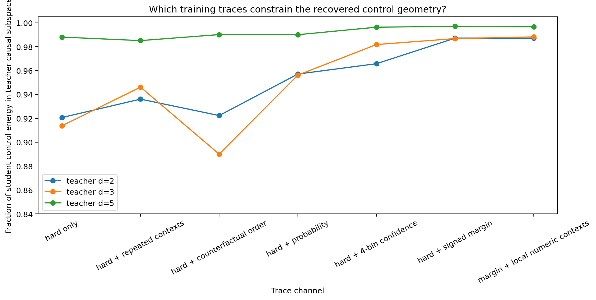

Figure 23.1 Teacher-subspace recovery across trace channels.

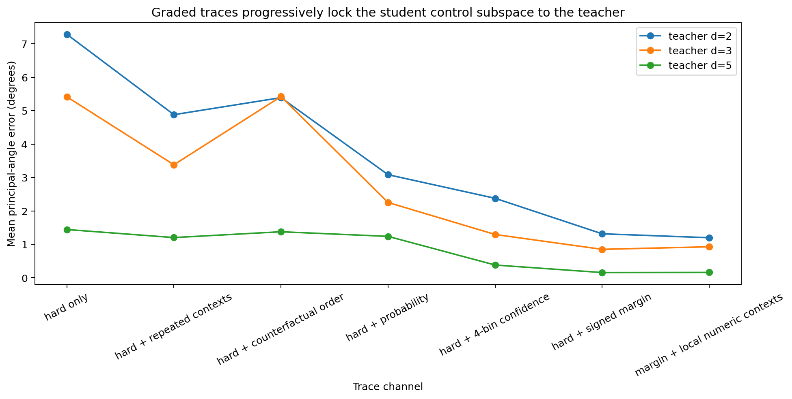

Figure 23.2 Reduction of student/teacher principal-angle errors with graded traces.

### 23.4 Coarse confidence crosses a geometric identification threshold

Quantize margin magnitude into 1/2/4/8 levels; hard tokens already supply its sign. This tests the amount of graded information needed for recovery.

At d=3, one magnitude level yields r95=4 in both seeds and energy 0.90545. Just two levels restore r95=3 in both, energy=0.97044 and angle=1.572°. One coarse confidence bit beyond the sign crosses this case's rank-identification threshold.

Greater precision mainly improves alignment at the recovered rank: four-bin energy=0.97870 and eight-bin=0.98575. At d=2/5, additional levels likewise reduce off-teacher energy and angular error.

| teacher d | Magnitude levels | r95 | teacher energy | Principal angle | bit acc |
| --- | --- | --- | --- | --- | --- |
| 2 | 1 | 2.0 | 0.9603 | 4.305° | 0.9441 |
| 2 | 2 | 2.0 | 0.9644 | 2.014° | 0.9606 |
| 2 | 4 | 2.0 | 0.9764 | 2.093° | 0.9532 |
| 2 | 8 | 2.0 | 0.9856 | 1.717° | 0.9617 |
| 3 | 1 | 4.0 | 0.9055 | 2.968° | 0.9610 |
| 3 | 2 | 3.0 | 0.9704 | 1.572° | 0.9608 |
| 3 | 4 | 3.0 | 0.9787 | 1.441° | 0.9642 |
| 3 | 8 | 3.0 | 0.9857 | 1.226° | 0.9657 |
| 5 | 1 | 5.0 | 0.9850 | 1.232° | 0.9626 |
| 5 | 2 | 5.0 | 0.9924 | 0.514° | 0.9643 |
| 5 | 4 | 5.0 | 0.9951 | 0.255° | 0.9671 |
| 5 | 8 | 5.0 | 0.9958 | 0.177° | 0.9739 |

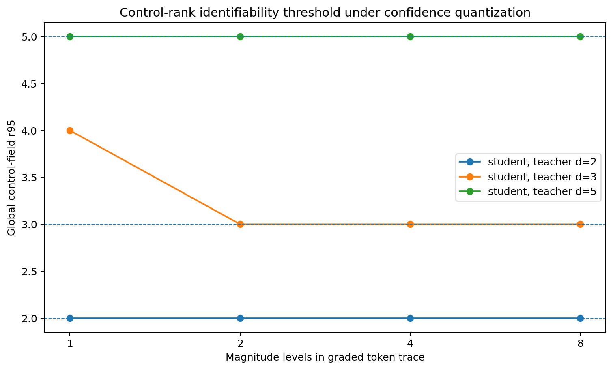

Figure 23.3 Rank-identification threshold: d=3 changes from r95=4 to 3 at one→two confidence levels.

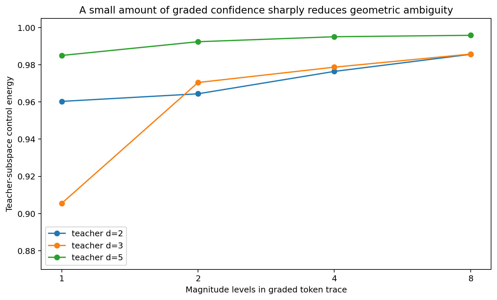

Figure 23.4 Increasing confidence precision returns control energy to the teacher subspace.

### 23.5 Different strengths of probability margin and local numerical traces

Continuous probability recovers correct r95 at d=2/3/5. At d=3 its energy=0.95621 and angle=2.250°, compared with signed-margin 0.98679 and 0.848°.

Sigmoid and logit are invertible in nonsaturated regions. The observed differences reflect output parameterization, dynamic range and loss weighting during optimization as well as the trace representation.

Local numerical supervision adds continuous margins at jittered contexts beyond the 729 discrete prompts. Teacher energy reaches 0.98819 at d=3 and 0.99663 at d=5, further constraining neighborhood interpolation at the already recovered rank.

### 23.6 Behavioral and geometric identification as separate targets

Conditions achieve relatively similar high discrete-task performance yet differ substantially in geometry. Repeated hard contexts and relative ordering provide variable d=3 rank recovery; two-bin confidence gives stable recovery across the two seeds.

Behavioral identification reproduces token labels. Geometric identification recovers latent control rank, orientation and local interpolation. Accurate language-label learning can coexist with a large geometric equivalence class.

### 23.7 Graded traces progressively narrow tokenization induced geometric equivalence classes

Hard tokens divide continuous space into decision regions by indicating the side of a threshold. Fields reproducing the same region labels are behaviorally equivalent.

Repeated hard contexts constrain boundaries; counterfactual ordering adds local directional order; confidence adds coarse boundary distance; full margins add calibrated signed displacement; local numerical contexts add neighborhood geometry.

The largest identification jump here occurs when traces first contain a small amount of boundary-distance information, providing a computable mechanism for dimension transfer through language discretization.

### 23.8 Interface with the Tetris and rotating control field picture

In the Tetris metaphor, hard tokens specify where a cut lands; graded confidence begins to expose boundary distance and local geometry within the accumulated structure.

Learned control axes depend jointly on teacher intrinsic controls and repeated trace constraints. Discrete traces allow extra continuous directions under preserved visible behavior; sufficient graded constraints concentrate the field around teacher geometry.

### 23.9 Interface with the language analysis branch

Experiments 014/015 turn candidate natural-language traces into interventions. Candidates include degree adverbs, uncertainty/certainty expressions, repeated context, prosody, timing, corrections, contrasts, counterfactuals and local consistency. Their constraints on recovered rank/orientation can be measured directly.

The working hypothesis is that intrinsic geometry of human traces and identifiable information in the trace channel jointly shape student control fields.

### 23.10 Evidence scope

Direct evidence comes from finite synthetic teachers, small tanh autoregressive students, d=2/3/5 and two initializations. Two-bin confidence reproducibly restores d=3 rank in both seeds. The established result is a threshold-like change in geometric identifiability caused by the trace channel in this controlled system.

### 23.11 TRACE-CHANNEL-015 raw data index

TRACE_CHANNEL_015/TRACE_CHANNEL_015.md

TRACE_CHANNEL_015/trace_channel_focus_models.csv

TRACE_CHANNEL_015/trace_channel_focus_aggregate.csv

TRACE_CHANNEL_015/confidence_quantization_ladder_models.csv

TRACE_CHANNEL_015/confidence_quantization_ladder.csv

TRACE_CHANNEL_015/trace_channel_key_results.csv

TRACE_CHANNEL_015/trace_channel_subspace_recovery.png

TRACE_CHANNEL_015/trace_channel_principal_angle.png

TRACE_CHANNEL_015/confidence_quantization_rank.png

TRACE_CHANNEL_015/confidence_quantization_subspace_recovery.png

TRACE_CHANNEL_015/summary.json

## 24 Integrated v1.3 discussion Control dimension and the teachers observable traces

Experiment 013 tests transfer of teacher dimension; 014 tests identification through hard traces; 015 identifies traces that progressively narrow geometric ambiguity. Together they establish a trace-channel gate in teacher→student transfer.

The integrated structure is:

teacher intrinsic geometry → trace channel / tokenization → identifiable constraints → history algebra / optimizer dynamics → learned control field → state-conditioned rotating local axes → CoT / Answer

The teacher supplies independent structure; architecture sets representational capacity; the trace channel determines identifiable structure; history algebra specifies the noncommutative composition through which constraints enter parameters and fields.

Experiment 015 distinguishes sample volume from geometric information. More hard contexts refine decision boundaries; small graded distance signals can sharply narrow the continuous-field equivalence class.

Interpreting low-dimensional LM control in relation to human cognition thus involves two separately measurable quantities: human latent control dimension and human-to-language trace identifiability.

## Version update

| Version | Date | Added experiment | Core additions |
| --- | --- | --- | --- |
| v1.3 | 2026-09-26 | TRACE-CHANNEL-015 | Trace channels as geometric-identifiability gates; hard-sample volume and graded geometry; two-bin confidence crossing the d=3 rank threshold; further orientation recovery with continuous margins/local numerical contexts |

## 25 Language mathematics From control dimensions to linguistic structure

Branch scope. Following 013–015, this branch asks how many independent controls natural language repeatedly supplies and what mathematical objects are trained, composed and transmitted through its symbols. Four experiments examine control-dimension selection, the teacher's transition geometry, basic generative operators and higher-level generators, culminating in Language Control Algebra v0.1.

Numbering: the master record already uses 014 and 015 for discrete teacher and trace-channel experiments. This branch is LANG-016–019; original working identifiers 014–017 remain aliases in discussions and directories.

| Master-record ID | Original working ID | Experiment | Core question | Core result |
| --- | --- | --- | --- | --- |
| LANG-016 | LANGUAGE-CONTROL-DIMENSION-COLLAPSE-014 | Language control-dimension collapse | Does language training compress available control degrees of freedom? | Same-architecture stable rank: language 2.238; entropy/difficulty-matched 6D world 3.101; 6D→Language 2.196 |
| LANG-017 | LANGUAGE-TEACHER-GEOMETRY-015 | Language teacher geometry | Does low rank originate in the language teacher? | First-order language teacher stable rank=2.481; top-3=71.95%; same-unigram IID has a different spectrum |
| LANG-018 | LANGUAGE-GENERATIVE-OPERATORS-016 | Generative operators | What is the mathematical action of a linguistic unit? | State-dependent operators outperform shift/reset; composition is noncommutative; operator-family stable rank=6.018 |
| LANG-019 | LANGUAGE-HIERARCHICAL-GENERATORS-017 | Hierarchical generators | How do higher linguistic levels combine composition and new generators? | Composition supplies most higher-level motion; relational residual generators have stable rank=1.327 |

### 25.1 Research development From structural intuition to mathematical imaging

The discussion began with a recurring intuition: surface text is an observable projection, with stable objects in relational structure, state transitions and control geometry. The author compared this to drone formations, sedimentary layers, multi-view reconstruction and MRI/ultrasound: mathematics reconstructs one structure from multiple local sections.

Earlier work separated strings, numerical codes and computational actions, and found 2–3 strong local modes. The resulting testable hypothesis was that language repeatedly varies only a few independent directions, shaping those as stable high-gain axes. The first test therefore compares language training directly with known high-dimensional training worlds.

high-dimensional substrate  →  training-trace geometry  →  learned effective control field

## 26 LANG-016 LANGUAGE-CONTROL-DIMENSION-COLLAPSE Former working ID 014

Experimental question. With architecture, vocabulary, autoregressive objective and budget fixed, how does natural-language training shape future-control dimension relative to a high-dimensional nonlanguage world? Can subsequent language training compress an expanded field, and high-dimensional training expand it again?

### 26.1 Initial design and research discussion

Replication update. V14 adds matched A→A and A→B continuation from identical parent weights and Adam state. All nine model pairs change the held-out predictive function with training material; see 49.5.

The motivating question was whether observed dimensions belong to models or teachers. The parallel synthetic-teacher experiment 013 tests transfer across 1–6D worlds; this experiment compares language and genuinely high-dimensional sequences in one LM architecture.

Shared architecture: 64-token vocabulary; 8D embeddings; 48D GRU; 64-way next-token head; sequence length 48; batch 48; AdamW; 900 steps; seeds 11/22/33.

Language: a 431,826-character English technical corpus; 63 frequent characters + UNK; unigram entropy 3.198 nats; final next-token loss approximately 1.82–1.90.

Synthetic worlds: each token represents a 6-bit state. In 2D/3D calibrations only the first d bits carry predictive structure and the remainder are nuisance; all six directions carry independent predictive structure in the 6D world.

Shared readout: sample 30 trajectory windows; context=32; future horizon=8. Concatenate eight 48D future hidden states into a 384D response and differentiate with respect to the current 8D embedding.

J_t = ∂(h_t, h_{t+1}, …, h_{t+7}) / ∂e_t

Save stable, participation and entropy ranks, 95%-energy dimension and top-2/top-3 energy. These measure independent directions through which one current action changes the near future.

### 26.2 Initial result Lower dimensional language control

| Condition | Stable rank | Participation rank | Entropy rank | r95 | Top-3 energy |
| --- | --- | --- | --- | --- | --- |
| Random init | 4.368 ± 0.608 | 6.607 ± 0.306 | 7.220 ± 0.156 | 8.000 | 56.2% ± 2.7% |
| Language | 2.238 ± 0.026 | 3.559 ± 0.044 | 4.786 ± 0.045 | 6.000 | 79.9% ± 0.9% |
| Synthetic 2D | 2.029 ± 0.215 | 3.048 ± 0.343 | 4.021 ± 0.349 | 5.167 | 87.5% ± 2.0% |
| Synthetic 3D | 2.559 ± 0.180 | 3.898 ± 0.253 | 4.885 ± 0.263 | 5.667 | 79.7% ± 2.5% |
| Synthetic 6D | 3.358 ± 0.062 | 5.223 ± 0.024 | 6.151 ± 0.015 | 7.000 | 68.4% ± 1.2% |
| 6D entropy+difficulty matched | 3.101 ± 0.122 | 4.929 ± 0.149 | 5.891 ± 0.100 | 6.667 | 70.4% ± 1.5% |

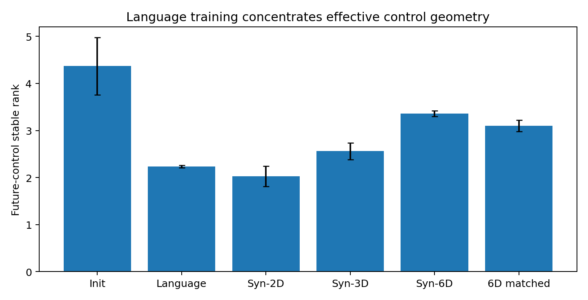

Figure 26.1 LANG-016: future-control stable rank across training worlds in the same 8D-input/48D-GRU architecture.

Language training reduces stable rank from random-initialization 4.368 to 2.238 and raises top-3 energy from 56.2% to 79.9%. It lies between synthetic 2D/3D calibrations; the 6D world retains a broader spectrum.

### 26.3 Additional entropy and prediction difficulty controls

The discussion identified skewed character frequencies and higher 6D unigram entropy as a confound, motivating an entropy-matched 6D world. A further control jointly matches marginal entropy and conditional prediction difficulty.

| Quantity | Language | 6D matched |
| --- | --- | --- |
| Unigram entropy | 3.198 nats | 3.231 nats |
| Conditional / trained difficulty | loss 1.82–1.90 | theoretical H=1.836；loss 1.84–1.86 |
| Stable rank | 2.238 | 3.101 |
| Participation rank | 3.559 | 4.929 |
| Top-3 energy | 79.9% | 70.4% |

With both matched, six independent predictive dimensions retain stable rank 38.6% and participation rank 38.5% above language. The contrast persists under these frequency/entropy/difficulty controls.

### 26.4 Training sequence interventions move control geometry

| Training sequence | Stable rank | Participation rank | Top-3 energy |
| --- | --- | --- | --- |
| Language only | 2.238 ± 0.026 | 3.559 ± 0.044 | 79.9% ± 0.9% |
| 6D only | 3.358 ± 0.062 | 5.223 ± 0.024 | 68.4% ± 1.2% |
| 6D → Language | 2.196 ± 0.156 | 3.472 ± 0.271 | 80.8% ± 2.3% |
| Language → 6D | 2.848 ± 0.105 | 4.489 ± 0.242 | 72.3% ± 2.3% |

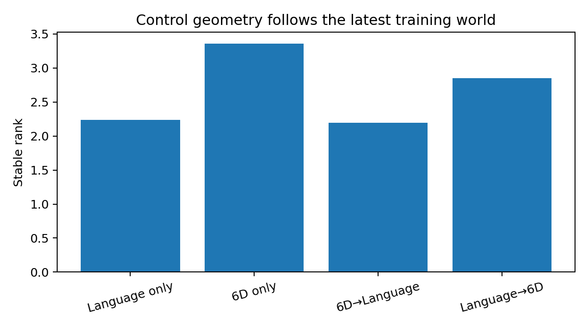

Figure 26.2 LANG-016: subsequent language training compresses an expanded field; subsequent 6D training expands a language-trained field.

The same architecture expresses broader control geometry, and language concentrates high-gain directions into fewer modes. Later high-dimensional training expands them again, separating capacity from current effective geometry.

### 26.5 Discussion and next experiment

The next question targets the teacher directly: why does language supply so few high-energy directions? The author proposed that linguistic traces repeatedly vary in a small number of degrees of freedom. The following experiment therefore represents the language sequence itself as an operator, before neural-network learning.

LANG-016 evidence. In this controlled GRU, training-world structure compresses or expands future-control spectra. Language consistently produces approximately 2–3 dominant modes; subsequent language restores that regime and high-dimensional training expands it.

### 26.6 Raw data index

LANGUAGE-CONTROL-DIMENSION-COLLAPSE-014.md

LANGUAGE-CONTROL-DIMENSION-COLLAPSE-014.py

LANGUAGE-CONTROL-DIMENSION-COLLAPSE-014_results.csv

LANGUAGE-CONTROL-DIMENSION-COLLAPSE-014_transitions.csv

LANGUAGE-CONTROL-DIMENSION-COLLAPSE-014_language_corpus.txt

LANGUAGE-CONTROL-DIMENSION-COLLAPSE-014_bundle.zip

## 27 LANG-017 LANGUAGE-TEACHER-GEOMETRY Former working ID 015

Experimental question. Can low-dimensional structure be measured directly in training language before neural-network learning? Distinguish overall language dimensionality from dominant local movement geometry.

### 27.1 Direct analysis of the teacher

The discussion turns from cross-architecture replication to conditional transition operators of the language teacher. A low-rank field present before learning would locate part of learned control geometry in the data's relational structure.

P_ij = P(x_{t+1}=j | x_t=i)

A = D_π^{1/2} (P − 1 πᵀ) = U Σ Vᵀ

Subtract unigram baseline π to isolate future-distribution change from conditioning on current state, and weight rows by state visitation frequency. Singular modes then represent repeatedly used conditional-transition directions.

### 27.2 Low rank teacher fields before model training

| Sequence world | Stable rank | Participation rank | 95% energy dim | Top-3 energy |
| --- | --- | --- | --- | --- |
| Original language | 2.481 | 4.335 | 13 | 71.95% |
| First-order Markov surrogate | 2.490 | 4.351 | 13 | 71.82% |
| Word-order shuffled | 2.481 | 4.335 | 13 | 71.95% |
| Within-word letters shuffled | 1.410 | 1.959 | 13 | 80.46% |
| IID same unigram | 5.406 | 12.719 | 25 | 39.35% |
| Synthetic 2D world | 2.495 | 2.947 | 3 | 99.60% |
| Synthetic 3D world | 4.462 | 6.366 | 7 | 55.65% |
| Synthetic 6D world | 11.402 | 27.918 | 45 | 21.78% |
| Letters only | 2.261 | 4.124 | 9 | 69.76% |

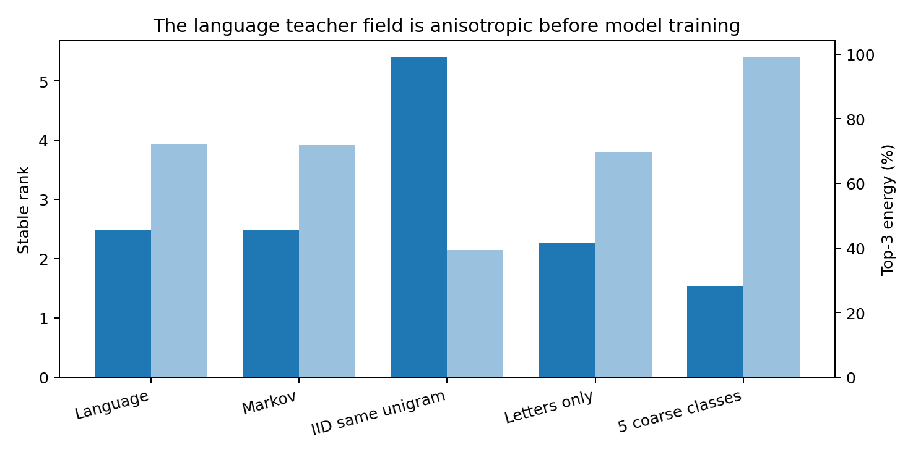

Figure 27.1 LANG-017: strong anisotropy of the natural-language transition field before neural training.

Approximately 13 modes are needed for 95% energy, retaining higher-dimensional detail. Dominant local transitions are concentrated: stable rank=2.481 and top-3=71.95%.

### 27.3 Successive controls for the origin of low rank

Word-order shuffle preserves each nonwhitespace chunk and shuffles their order. Character bigram counts, stable rank 2.481 and top-3 energy 71.95% are preserved exactly.

A first-order Markov surrogate preserves empirical P(x_{t+1}|x_t), yielding 2.490/71.82%. The strongest low-dimensional backbone is therefore present in local relational transitions.

IID sampling with the same unigram frequencies yields stable rank 5.406 and top-3 39.35%, locating the observed low rank in sequence relations beyond marginal frequencies.

Removing spaces/punctuation and retaining the letter stream gives stable rank=2.261 and top-3=69.76%, preserving the backbone beyond whitespace.

Five coarse classes (space/vowel/consonant/digit/other) give stable rank=1.535, top-2=92.07% and top-3=99.17%; these classes explain approximately 94.2% of the first principal mode.

### 27.4 The first principal language movement axis

The strongest first right-singular structure contrasts boundaries with continuation, particularly spaces against continuing characters. Second/third modes distinguish broad letter-transition classes and local completion patterns. These are statistical/dynamical axes shared by many character changes.

P(· | i) ≈ π + a₁(i)v₁ + a₂(i)v₂ + a₃(i)v₃ + ε_i

Many surface symbols vary coefficients along a few common high-energy directions, supplemented by weaker detailed corrections.

### 27.5 Longer contexts reveal additional weak directions

| Context length | Retained contexts | Stable rank | Top-3 energy |
| --- | --- | --- | --- |
| 1 | 64 | 2.481 | 71.95% |
| 2 | 878 | 3.637 | 51.66% |
| 3 | 2,538 | 4.283 | 45.71% |
| 4 | 6,374 | 4.595 | 43.83% |
| 5 | 7,562 | 4.680 | 43.61% |

The dominant local movement field has 2–3 high-energy directions. Longer histories add predictive directions as weaker corrections around this common backbone.

### 27.6 From movement axes to generative operators

Teacher-side geometry helps explain compressed learned control. The next question asks which basic objects perform movement along those axes, shifting the analysis from transition spectra to generative operators.

LANG-017 evidence. Language content retains high-dimensional detail, and its dominant local movement field is already low-rank before neural learning. Relational transitions generate the backbone; higher-order context adds weaker directions.

### 27.7 Raw data index

LANGUAGE-TEACHER-GEOMETRY-015.md

LANGUAGE-TEACHER-GEOMETRY-015.py

LANGUAGE-TEACHER-GEOMETRY-015_teacher.csv

LANGUAGE-TEACHER-GEOMETRY-015_context.csv

LANGUAGE-TEACHER-GEOMETRY-015_modes.csv

LANGUAGE-TEACHER-GEOMETRY-015_teacher_expansion.csv

LANGUAGE-TEACHER-GEOMETRY-015_bundle.zip

## 28 LANG-018 LANGUAGE-GENERATIVE-OPERATORS Former working ID 016

Experimental question. Does one visible linguistic unit act as a fixed displacement, a reset destination or a state-dependent transformation? Can these transformations compose, with order itself contributing computation?

### 28.1 Linguistic units as observable handles for transformations

Current measurement scope. The original context split follows corpus-wide count and PCA construction, giving a within-corpus mapping evaluation. V03 fits the representation on training segments and evaluates independent segments. Exact state updates use the sufficient-state condition and augmentation described in 49.6.

The working definition treats words/characters as actions on current relational/predictive states. States are estimated directly from sequences, independently of neural hidden representations.

q(c) = P(x_{t+1} | c)

T_a : q(c) ↦ q(ca)

Fixed displacement predicts q(ca)≈q(c)+Δ_a; fixed reset predicts q(ca)≈r_a; a state-dependent operator predicts q(ca)≈A_a q(c)+b_a.

### 28.2 State construction and held out design

Use the same 431,826-character technical-English corpus and 64-symbol vocabulary.

Estimate predictive distributions for context lengths 1–5 with minimum counts 50/20/10/5/5.

Embed all predictive states in shared 10D coordinates using frequency-weighted PCA.

Pool transitions from context lengths 1–4; split deterministically by context-identity hash into 80% operator training and 20% held-out data.

35 frequent symbol operators meet train/test support thresholds.

### 28.3 Linguistic units exhibit state dependent transformations

| Language-action model | Weighted held-out MSE |
| --- | --- |
| Leave state unchanged | 0.623272 |
| Fixed token shift q+Δa | 0.376802 |
| Fixed token reset r_a | 0.255918 |
| State-dependent affine T_a(q) | 0.229164 |

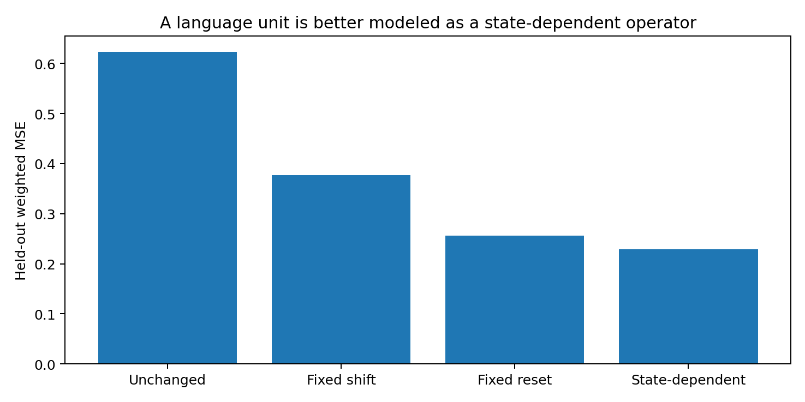

Figure 28.1 LANG-018: state-dependent operators outperform fixed shifts/resets on held-out predictive-state transitions.

State-dependent operators reduce error by 63.2% relative to no action, 39.2% relative to fixed displacement and 10.5% relative to token-specific reset. The same symbol performs measurable state-dependent transformations.

In a first-order Markov surrogate, reset MSE=0.012245 and state-dependent MSE=0.011962, a 2.3% improvement. The larger real-language dependence therefore reflects higher-order history.

### 28.4 Ordered composition of generative operators

q(cab) ≈ T_b(T_a(q(c)))

Require both base c and intermediate ca to be held out, yielding 866 fully held-out two-step trajectories with 30,033 empirical occurrences.

| Two-step model | Weighted final-state error |
| --- | --- |
| Correct T_b(T_a(q)) | 0.273221 |
| Apply T_b to measured intermediate | 0.264036 |
| Final-token reset only | 0.311581 |
| Reverse T_a(T_b(q)) | 0.464116 |
| Add fixed token shifts | 0.551509 |

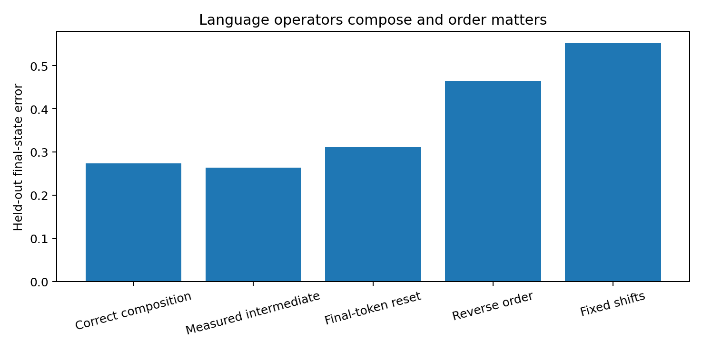

Figure 28.2 LANG-018: correctly ordered composition outperforms reversed composition and fixed-vector addition.

Correct composition reduces error by 50.5% relative to fixed shifts, 12.3% relative to final-token reset and 41.1% relative to reversed order. Earlier actions alter the state in which later actions operate.

### 28.5 Noncommutativity with symbol multiset and final symbol fixed

Pair frequent triples [a,b,z] and [b,a,z], holding all three symbols and final z fixed and changing only the first two operations' order.

| Sequence world | Matched order pairs | Weighted JS divergence |
| --- | --- | --- |
| Real language | 587 | 0.394665 |
| First-order Markov surrogate | 1,265 | 0.065930 |

T_z ∘ T_b ∘ T_a  ≠  T_z ∘ T_a ∘ T_b

Real-language order effects are 5.99× the Markov surrogate's. Ordered relations are mathematical variables in language itself, with generally noncommutative composition.

### 28.6 Movement dimension and operator family dimension

Flatten and frequency-weight 35 affine maps in operator space. SVD gives stable rank=6.018, participation rank=11.399, top-3=41.0%, top-6=64.2%, top-10=81.8%, and approximately 17 modes for 95% energy.

T_a ≈ T̄ + Σ_k α_{a,k} B_k

A few dominant movement coordinates support a richer repertoire of reusable transformations, combined through coefficients, order and state dependence.

### 28.7 Word-level secondary replication

| Word-level model | Weighted MSE |
| --- | --- |
| Leave state unchanged | 0.125119 |
| Fixed token shift | 0.074128 |
| Token-specific reset | 0.029692 |
| State-dependent operator | 0.027684 |

In a 6D predictive space with top-128 next-token vocabulary, 43 frequent word/punctuation operators have sufficient held-out support. State-dependent transformations reduce error by 6.8% relative to reset and 62.7% relative to fixed displacement, extending the operator picture to words.

### 28.8 Discussion An operational definition of language

Meaning becomes a unit's effect on future reachable states across relevant current states; grammar constrains operator composition; sentences are trajectories generated by ordered products; CoT is a closed loop of self-generated actions changing state and subsequent action selection.

Meaning(a; x) = ΔP(X_future | x, a)

x_{t+1} = T(a_t, x_t)[x_t]

LANG-018 working definition. Language is a state-dependent, compositional, generally noncommutative control algebra acting on relational/predictive states, with discrete surface symbols serving as observable handles for those transformations.

### 28.9 Raw data index

LANGUAGE-GENERATIVE-OPERATORS-016.md

LANGUAGE-GENERATIVE-OPERATORS-016.py

LANGUAGE-GENERATIVE-OPERATORS-016_one_step.csv

LANGUAGE-GENERATIVE-OPERATORS-016_composition.csv

LANGUAGE-GENERATIVE-OPERATORS-016_order_language.csv

LANGUAGE-GENERATIVE-OPERATORS-016_order_markov.csv

LANGUAGE-GENERATIVE-OPERATORS-016_basis.csv

LANGUAGE-GENERATIVE-OPERATORS-016_modes.csv

LANGUAGE-GENERATIVE-OPERATORS-016_word_level.csv

LANGUAGE-GENERATIVE-OPERATORS-016_summary.csv

LANGUAGE-GENERATIVE-OPERATORS-016_bundle.zip

## 29 LANG-019 LANGUAGE-HIERARCHICAL-GENERATORS Former working ID 017

Experimental question. How do higher linguistic structures combine lower-level composition and new generators? Distinguish reproducible higher-level movement from overparameterized fitting residuals.

### 29.1 Phrase analysis and stricter generator criteria

For 185 supported exact bigrams, the test-count-weighted MSE is 0.141691854 for composed word operators and 0.112759496 for directly fitted phrase operators. The weighted mean of each phrase’s relative improvement is 17.3249%; the relative reduction in pooled weighted MSE is 20.4192%. These are two distinct estimands, both recalculated from the original CSV for this edition.

Composition-only synthetic targets produce residual spectra similar to real data: stable ranks 7.73/7.38 and top-3 energies 29.2%/34.1%. Finite samples and fitting error can generate broad residual spectra. The adopted generator criterion therefore requires held-out stability, prediction by relation category and passage of label-shuffle controls.

### 29.2 Small systematic residual actions at the relation level

Seven operational categories are condition (if/when/unless/otherwise), contrast (but/however/although), alternative (or), conjunction (and), negation (not), modality (must/may/can), and relative/complement (that/which). They provide reproducible grouping labels.

x̂_{t+h}^{(0)} = T_{a_{t+h-1}} ∘ … ∘ T_{a_t}(x_t)

r_t^(h) = x_{t+h} − x̂_{t+h}^{(0)}

At a three-token horizon, relation-specific residual vectors reduce held-out error by 5.42% relative to lexical composition and 3.29% relative to one shared global correction.

| Relation | Gain vs lexical composition | Gain vs global residual |
| --- | --- | --- |
| Modality | 16.2% | 9.84% |
| Condition | 12.5% | 9.47% |
| Contrast | 4.31% | 3.10% |
| Relative/complement | 3.74% | 1.59% |
| Conjunction | 1.37% | 0.66% |

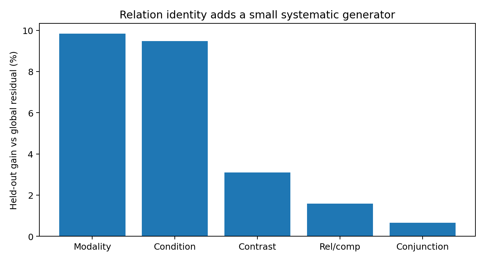

Figure 29.1 LANG-019: genuine relation identity adds held-out predictive power for composition residuals at a three-token horizon.

### 29.3 Label shuffle control for relation information

The original 30-shuffle analysis reports mean gain −0.18% and a 95th percentile of +0.13%. The source audit identifies different averaging rules: true relations give 3.293149% under test-count weighting and 3.529238% under equal class weighting at horizon three. The permutation comparison is marked PROVISIONAL pending a common estimand for the real and shuffled samples. The original effect estimates remain documented here.

### 29.4 Low dimensional relational residual generators

| Quantity | Relation residual generator | Word-level movement field |
| --- | --- | --- |
| Stable rank | 1.327 | 2.833 |
| Participation rank | 1.684 | — |
| Top-3 energy | 95.18% | 63.14% |
| 95% energy dimension | 3 | 9 |

Projection onto the word-level top-three movement subspace explains 22.63% of relation-residual energy. Principal angles between these two selected subspaces are 19.70°, 61.41° and 77.97°. This measures transverse structure relative to the stated three-mode approximation; complete operator-envelope membership is tested separately in chapter 49.

### 29.5 Hierarchical generation law

Proposed hierarchy: G_{l+1} = closure_o(G_l ∪ R_{l+1}); independent residual extensions require a specified closure test.

Here closure_o(G_l) denotes the selected lower-level operator closure. An independent residual extension R requires a declared closure, a common functional representation and verified independence. The observed residual stable rank is 1.327, with 95.18% of class-level energy in three modes. The direct-sum interpretation is retained as a PROVISIONAL hierarchical model.

The measured higher-level motion contains a composition component and concentrated fitted residuals. Their relative contribution is evaluated through held-out prediction and the chosen operator representation.

### 29.6 Discussion Toward a unified mathematical form

Characters, words, phrases and relation groups can be represented by approximate state-dependent update maps. Ordered composition and fitted residuals organize the observed motion. Language Control Algebra v0.1 records this working mathematical representation.

LANG-019 evidence. In the technical-English corpus, directly fitted phrase maps improve the measured composition error, and relation-conditioned residuals have stable rank 1.327. These are fitted structure and residual-spectrum results. A claim of independent generators beyond a complete lower-level closure is PROVISIONAL; chapter 49 supplies the complete-envelope analysis and the corrected statistical scope.

### 29.7 Raw data index

LANGUAGE-HIERARCHICAL-GENERATORS-017.md

LANGUAGE-HIERARCHICAL-GENERATORS-017.py

LANGUAGE-HIERARCHICAL-GENERATORS-017_lexical.csv

LANGUAGE-HIERARCHICAL-GENERATORS-017_phrases.csv

LANGUAGE-HIERARCHICAL-GENERATORS-017_relations.csv

LANGUAGE-HIERARCHICAL-GENERATORS-017_relation_additive.csv

LANGUAGE-HIERARCHICAL-GENERATORS-017_relation_additive_shuffle.csv

LANGUAGE-HIERARCHICAL-GENERATORS-017_relation_generators.csv

LANGUAGE-HIERARCHICAL-GENERATORS-017_relation_generator_scores.csv

LANGUAGE-HIERARCHICAL-GENERATORS-017_relation_generator_modes.csv

LANGUAGE-HIERARCHICAL-GENERATORS-017_alignment.csv

LANGUAGE-HIERARCHICAL-GENERATORS-017_principal_angles.csv

LANGUAGE-HIERARCHICAL-GENERATORS-017_movement_spectrum.csv

LANGUAGE-HIERARCHICAL-GENERATORS-017_residual_spectrum.csv

LANGUAGE-HIERARCHICAL-GENERATORS-017_summary.csv

LANGUAGE-HIERARCHICAL-GENERATORS-017_bundle.zip

## 30 Integrated v1.4 discussion LANGUAGE CONTROL ALGEBRA v0.1

Working definition. Language is a hierarchical, state-dependent, noncommutative generative control algebra acting on relational states.

### 30.1 Mathematical objects

Current status. This is a formal predictive-operator framework. Sufficient-state constructions and empirical function-level replication are established in 49.4–49.6; the independent-generator hierarchy is marked PROVISIONAL in 50.2.

L = (X, Sigma, Psi, G, rho, o, H)

| Object | Definition | Experimental interface |
| --- | --- | --- |
| X | relational / predictive state space | q(c) in LANG-017 and predictive-state coordinates in LANG-018/019 |
| Sigma | Observable linguistic units: characters, tokens, words and phrases | Surface handles for functional transformations |
| Psi | Context→state mapping: x_t=Ψ(c_{≤t}) | Estimated directly from empirical future distributions/predictive states |
| G | Reusable generative/control operators | LANG-018 operator-family SVD；LANG-019 hierarchy |
| rho | (surface action, current state) → operator selection/mixture | One symbol performs different transformations at different states |
| o | Ordered composition | LANG-018 forward/reverse composition and same-final-symbol order tests |
| H | hierarchical generator structure | Proposed closure plus tested residual extension |

### 30.2 Minimal language dynamics

x_t = Psi(c_{<=t})

G_t = rho(a_t, x_t ; G_level(t))

x_{t+1} = G_t[x_t] = T(a_t, x_t)[x_t]

Proposed hierarchy: G_{l+1} = closure_o(G_l ∪ R_{l+1}); independent residual extensions require a specified closure test.

a_{t+1} ~ pi(. | x_{t+1})

These equations define the proposed state-update framework. Exact deterministic updates require a sufficient state representation: contexts mapped to the same state must have matching successor states under each allowed input. V02b constructs and verifies such a representation using augmented future signatures. In the empirical language assay, the fitted operators describe approximate successor predictions.

### 30.3 Sentences as state trajectories

gamma_s = (x_0, x_1, ..., x_n)

x_n = T(a_n,x_{n-1}) o ... o T(a_1,x_0)[x_0]

Word order is a computational variable. Swapping the first two operations with symbol multiset and final symbol fixed gives weighted JS divergence 0.394665 in language and 0.065930 in the Markov surrogate.

### 30.4 Meaning as a conditional transformation signature

M(a; D) = { x -> T(a,x)[x] }_{x~D}

M(a; x) = Delta P(X_future | x, a)

Functional meaning is how a unit changes future reachable states/distributions over relevant current states. One word can produce different transformations across states; different words can produce similar transformations over a specified state distribution. This connects directly to CHAIN-SEMANTICS-007.

a ~_D b  iff  E_{x~D} ||T(a,x)[x] - T(b,x)[x]||^2 is small

### 30.5 Grammar as operator composition constraints

Grammar constrains which operators can follow a state, how order changes outcomes, how hierarchy/bracketing specifies products and where higher relations add residual generators. LANG-018 noncommutativity and LANG-019 relational residuals supply experimental interfaces.

### 30.6 Low dimensional movement and rich action repertoires

Distinguish state dimension, dominant movement dimension and generator-family dimension. Character-teacher stable rank=2.481 and word-movement stable rank=2.833; character/context operator-family stable rank=6.018, requiring approximately 17 modes for 95% variance.

state dimension  ≠  dominant movement dimension  ≠  generator-family dimension

Rich language arises from many state-dependent operator mixtures, noncommutative compositions and hierarchical recursions over a few dominant movement coordinates.

### 30.7 CoT as self generated language control

a_t ~ pi(.|x_t) -> x_{t+1}=T(a_t,x_t)[x_t] -> a_{t+1} ~ pi(.|x_{t+1})

Each generated token is an output and then an action changing state and the operator geometry available next, shaping subsequent tokens. This loop connects to CONTROL-FLOW-011's state-gated frame rotation and VECTOR-SUBSPACE-010's readable/control subspaces.

### 30.8 Mathematical interpretation of the Tetris and dynamic slice discussion

The working metaphor treats training materials as accumulated blocks forming terrain and inference as movement through that geometry. A direct answer offers a constrained section; CoT tokens change each next section's orientation and position, creating a trajectory-conditioned swept section. LANG-016–019 formalize available dimensions, dominant teacher movement, operators, noncommutative paths and higher-level residual directions.

teacher geometry → low-dimensional movement field → state-dependent operators → noncommutative trajectory → hierarchical residual generators

### 30.9 Integrated sequence from the master record to language mathematics

teacher intrinsic geometry + trace channel + whole-history algebra

        ↓

learned low-dimensional control resources / readable geometry

        ↓

state-dependent rotating control field

        ↓

language operators acting on relational states

        ↓

ordered composition + sparse hierarchical generators

        ↓

CoT / reasoning trajectory / answer

Version 1.4 connects training history, computational token action, dynamic frames, teacher dimension and trace identifiability to language itself: ordered, directional, hierarchical generative controls acting on current relational states.

### 30.10 Mathematical structures supported by current evidence

One architecture enters a lower-dimensional regime through language training and expands through genuinely high-dimensional training worlds.

The first-order language transition field is strongly low-rank before neural training; sequential relationships supply the dominant backbone.

Linguistic units act as state-dependent transformations on held-out states; transformations compose in order and generally do not commute.

Dominant movement and operator-family dimensions differ; a few movement coordinates support a richer operator repertoire.

Higher-level fits combine ordered lower-level operators with relation-conditioned residual terms. Complete-closure membership and statistical significance are evaluated under the updated tests in chapter 49.

Together these support Language Control Algebra v0.1: hierarchical state-dependent noncommutative generative control on relational states.

### 30.11 Language Control Algebra v0.1 original files

LANGUAGE-CONTROL-ALGEBRA-v0.1.md

LANGUAGE-CONTROL-DIMENSION-COLLAPSE-014_bundle.zip

LANGUAGE-TEACHER-GEOMETRY-015_bundle.zip

LANGUAGE-GENERATIVE-OPERATORS-016_bundle.zip

LANGUAGE-HIERARCHICAL-GENERATORS-017_bundle.zip

### Version update v1.4

2026-09-26: added LANG-016–019 and Language Control Algebra v0.1, recording training-world dimension selection, teacher geometry, state-dependent operators, noncommutative composition, hierarchical residual generators and the unified mathematical form.

## 31 REASONING-STATE-020 Future response classes memory and revisit operators

### 31.1 Additional structure in reasoning beyond language control

Following language-control formalization, this experiment asks how retaining intermediate relations, revisiting locations, exploring another path and comparing results extends reasoning state through existing compositions plus new generators.

Core question. Can one local position represent different reasoning states? Which observable object defines those states, and do STORE/RESET constitute higher-level generators beyond ordinary relational motion?

A free-generation GRU pilot attempted to retain two three-step paths. Phase and late difference were linearly readable, and basic relational performance was still developing. This identified learning quality as an assay condition. The formal experiment uses a fully enumerable reasoning world to measure its algebra exactly and establish interfaces for later models.

### 31.2 A fully enumerable relational reasoning world

The object space is Z_7. Lower-level operators are R+1, R+2, R*2 and RNEG; higher controls are STORE and RESET. State r=(s,x,m) comprises start s, cursor x and retained memory m, including UNSET. There are 7×7×8=392 states.

R+1(x)=x+1 mod 7;  R+2(x)=x+2 mod 7;  R*2(x)=2x mod 7;  RNEG(x)=-x mod 7

STORE(s,x,m)=(s,x,x);  RESET(s,x,m)=(s,s,m);  READ(s,x,m)=(m-x) mod 7

The standard program is three-step A path → STORE → RESET → three-step B path → READ. It stores the first result, resets the cursor and explores the second path in the same world.

### 31.3 Operational reasoning states through future response equivalence

Infer state through future behavior: enumerate all programs of lengths 0–3 over 6 actions (259 probes), read each result and concatenate responses into q(r).

r1 ~_future r2  iff  READ(P(r1)) = READ(P(r2))  for every admissible future program P

| Quantity | Result |
| --- | --- |
| Internal states | 392 |
| future probes | 259 |
| raw future-signature dimension | 2072 |
| predictive classes through 3 steps | 392 |
| predictive-state stable rank | 8.758 |
| 95% energy dimension | 64 |
| 99% energy dimension | 91 |

All 392 internal states form distinct future-response equivalence classes. Reasoning states are therefore fully definable through future controlled behavior in this world.

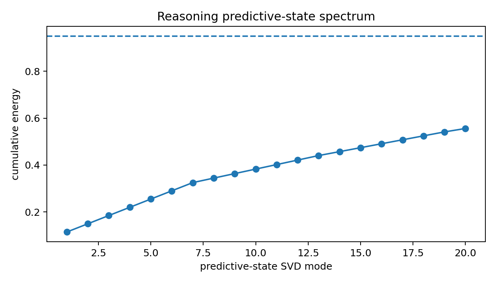

Figure 31.1 REASONING-STATE-020: cumulative singular energy of the complete reasoning predictive state.

### 31.4 RESET restores location and preserves reasoning history

For every start × three-step A-path condition, execute A, STORE and RESET. The cursor returns exactly to start; the resulting complete state retains the earlier path's memory.

| Observation | Result |
| --- | --- |
| Cursor=start after RESET | 100.0% |
| Complete state=initial state after RESET | 0.0% |
| future-signature RMS distance | 0.3880 |
| PCA reasoning-state distance | 17.6392 |
| Mean future RMS with start/cursor fixed and memory varied | 0.3880 |

The cursor returns in 100% of cases and the full reasoning state in 0%; retained memory preserves distinct future behavior. Reasoning state is an augmentation of current relations with retained commitments.

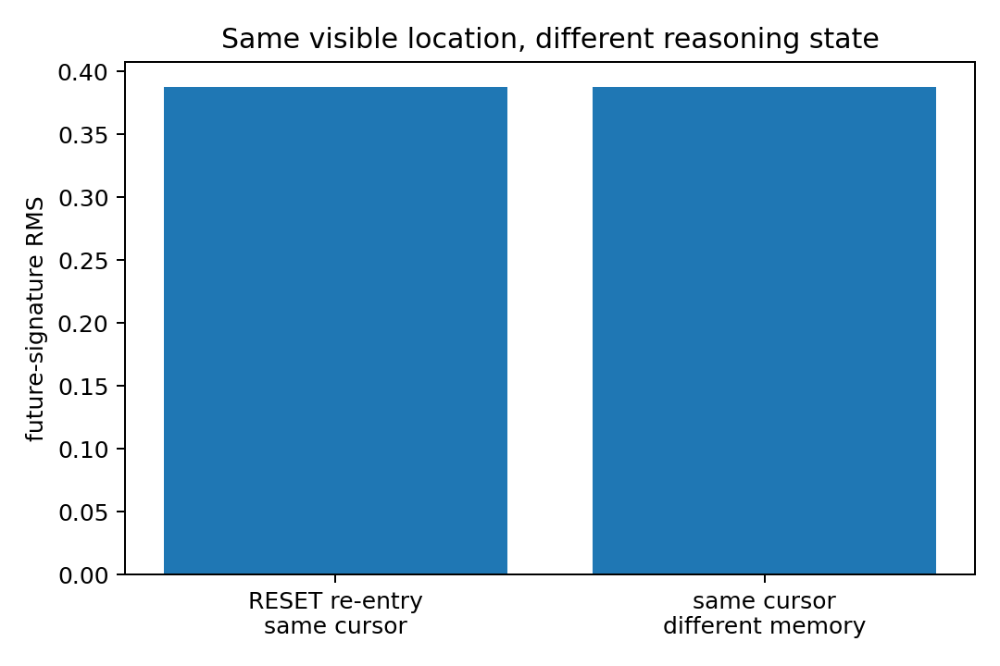

Figure 31.2 REASONING-STATE-020: identical surface locations with different future-response states.

### 31.5 Six reasoning actions as state transformation operators

In predictive-state PCA coordinates retaining 99% energy, fit affine T_a(z)=A_a z+b_a for each action and evaluate future-state predictions on held-out states. Compare with a fixed displacement per action.

| action | Level | fixed-shift MSE | state-operator MSE | Error reduction |
| --- | --- | --- | --- | --- |
| R+1 | relation | 222.433 | 1.049 | 99.5% |
| R+2 | relation | 222.413 | 0.836 | 99.6% |
| R*2 | relation | 184.881 | 11.063 | 94.0% |
| RNEG | relation | 184.460 | 1.599 | 99.1% |
| STORE | meta | 241.249 | 12.633 | 94.8% |
| RESET | meta | 164.751 | 14.821 | 91.0% |

Across six actions, state operators reduce held-out error by 96.3% relative to fixed shifts, supporting transformations conditioned on the current future-response state.

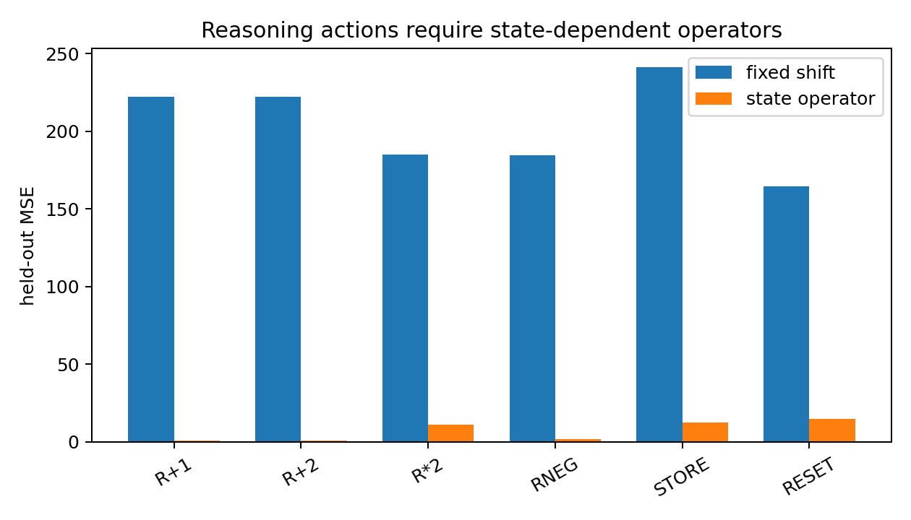

Figure 31.3 REASONING-STATE-020: held-out errors for fixed shifts and state-dependent operators.

### 31.6 Noncommutative composition and causal order interventions

Across all 36 two-action combinations, correct T_b(T_a(z)) gives held-out MSE=14.399; reversed order gives 167.373, an approximately 91.4% reduction.

In the exact finite world, ab≠ba on an average 68.3% of states across pairs, reaching 100% for the strongest pair.

Swapping STORE→RESET to RESET→STORE changes answers in 87.5% of all tasks. The other 12.5% have the algebraically degenerate A-path endpoint=start; all nondegenerate cases change. Removing STORE changes READ or yields UNSET in 100.0% of tasks.

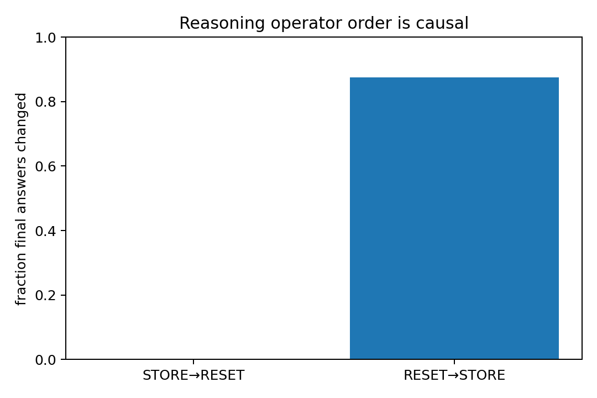

Figure 31.4 REASONING-STATE-020: causal effects of STORE/RESET order on final reasoning readout.

### 31.7 Memory and reentry as higher level generators

| action | Level | movement stable rank | d95 | top-3 energy | mean movement norm |
| --- | --- | --- | --- | --- | --- |
| R+1 | relation | 17.831 | 41 | 16.1% | 14.743 |
| R+2 | relation | 17.828 | 41 | 16.1% | 14.742 |
| R*2 | relation | 19.380 | 33 | 15.5% | 12.641 |
| RNEG | relation | 14.527 | 24 | 20.7% | 12.637 |
| STORE | meta | 9.092 | 43 | 21.3% | 15.410 |
| RESET | meta | 17.360 | 42 | 13.0% | 12.638 |

Mean movement stable rank is 17.392 for four relation actions and 13.226 for STORE/RESET. Relative to the top-3 relation directions, 94.7% of STORE/RESET energy lies outside; principal angles are 67.33°, 90° and 90°.

This extends LANG-019's hierarchy: ordinary relational motion reuses existing operators; retaining intermediate results and revisiting locations adds a higher-level generator within the same system.

### 31.8 High dimensional reasoning states and lower dimensional realized motion

Full future-response state has stable rank=8.758, participation rank=34.824 and 64 modes for 95% energy, retaining many independent relational distinctions.

Movement along the actual three-step A → STORE → RESET → three-step B program has stable rank=3.118 and top-3 energy=53.22%, separating state-content dimension from realized control motion.

### 31.9 First mathematical definition of reasoning

Reasoning state. A reasoning state is the behavioral equivalence class of a history under all allowed future control programs. Histories at the same local object belong to distinct states when retained commitments distinguish their reachable future behavior.

R = H / ~_future

h1 ~_future h2  iff  F(P | h1) = F(P | h2) for every admissible future control program P

r_{t+1} = G(a_t, r_t)[r_t]

Working definition: reasoning is recursive control of augmented relational states. Noncommutative operators retain, revisit, transform and compare commitments, computing through their consequences for future reachable states.

Reasoning is recursive control over an augmented relational state: a noncommutative sequence of operators that preserves, revisits, transforms and compares relational commitments according to their future consequences.

### 31.10 Interface with Language Control Algebra

G_reason = closure_o(G_relation / G_language) direct-sum R_memory direct-sum R_reentry direct-sum ...

The lower-level composition plus new-generator law extends to memory/reentry. STORE retains a relational result as commitment; RESET revisits a local position and preserves it. Revisiting, restarting and comparing paths are represented within one algebraic framework.

### 31.11 Raw data figures and experimental records

REASONING-STATE-020.md

REASONING-STATE-020.py

REASONING-STATE-020_summary.csv

REASONING-STATE-020_operator_fit.csv

REASONING-STATE-020_composition.csv

REASONING-STATE-020_noncommutativity.csv

REASONING-STATE-020_movement.csv

REASONING-STATE-020_reentry.csv

REASONING-STATE-020_store_reset_swap.csv

REASONING-STATE-020_remove_store.csv

REASONING-STATE-020_same_cursor_diff_memory.csv

REASONING-STATE-020_example_traces.csv

REASONING-STATE-020_trace_movements.csv

REASONING-STATE-020_predictive_spectrum.png

REASONING-STATE-020_operator_fit.png

REASONING-STATE-020_reentry.png

REASONING-STATE-020_order_intervention.png

REASONING-STATE-020_bundle.zip

This fully enumerable synthetic world provides constructive and causal evidence for reasoning-state and memory/reentry-generator forms. The same future-response, composition and reentry interfaces can be applied to CoT/LLM trajectories.

## 32 Integrated v1.5 discussion REASONING CONTROL ALGEBRA v0.2

### 32.1 From linguistic states to augmented reasoning states

language state: x_t = predictive / relational state

reasoning state: r_t = (x_t, retained commitments, branch / comparison context, ...)

Language control already permits state-dependent noncommutative transformations. Experiment 020 shows that retaining a relation and revisiting the same position requires historical augmentation: future behavior depends on commitments as well as location.

### 32.2 Hierarchical growth of reasoning

G_reason,l+1 = closure_o(G_reason,l) direct-sum R_{l+1}

Here R_{l+1} consists of memory/reentry generators. Relation operators move through the world; STORE fixes a commitment; RESET changes working location and retains it. BRANCH/COUNTERFACTUAL/COMPARE/CORRECT can be tested similarly for composition or additional residual-generator requirements.

### 32.3 Integrated sequence

training / language geometry

        ↓

state-dependent generative operators

        ↓

ordered noncommutative relation motion

        ↓

retained commitment + re-entry generators

        ↓

augmented future-response reasoning state

        ↓

recursive control trajectory → comparison / answer

Language and reasoning occupy one mathematical family. Language controls relational states; reasoning extends control to relational histories and commitments, enabling retention, departure, return, re-exploration and comparison.

### 32.4 Directly supported structures

Future-response equivalence operationally defines reasoning states: 392 internal states yield 392 future-behavior classes.

After STORE, RESET restores the cursor in 100% of cases and the initial complete state in 0%, separating location from reasoning state.

State-dependent reasoning operators reduce mean held-out error by approximately 96.3% relative to fixed shifts.

Composition is generally noncommutative; correct ordering outperforms reversal, and STORE/RESET reversal changes all nondegenerate answers.

Memory/reentry movement lies mainly outside the top-3 relation subspace, supporting a higher-level generator.

High-dimensional reasoning content coexists with lower-dimensional movement along realized legal trajectories.

### Version update v1.5

2026-09-26: added REASONING-STATE-020 and Reasoning Control Algebra v0.2, including future-response classes, RESET reentry, same-cursor/different-memory tests, operator fits, noncommutative composition, order interventions, relation/meta subspaces and trajectory spectra.

## 33 REASONING-BRANCH-021 Branch counterfactual comparison and correction controls

### 33.1 Extending memory and reentry with branch compare and correct

Building on 020, retain a committed trajectory, create a side branch, move counterfactually without immediately changing the main output, compare the two, and conditionally correct the committed state.

Assay criterion. Test whether these actions fit existing relation movement/single smooth operators, or introduce latent branch states, comparison gates and conditional rewrites as additional control structure.

### 33.2 Fully enumerable branch reasoning world

Horizon annotation. All original 021 spectral and pairwise values in this chapter refer to the declared 0–3-step probe set. The complete future partition has 275 classes, as shown in 34.3 and 49.6.

Object space is Z_5. State r=(g,x,b,c) contains goal g, committed cursor x, counterfactual branch b∈Z_5∪{UNSET}, and comparison c∈{branch better,tie,main better,UNSET}. There are 275 legal internal states.

main relation:  x <- R(x)

BRANCH:         b <- x

counterfactual: b <- R_cf(b), while x stays fixed

COMPARE:        c <- compare(distance(b,g), distance(x,g))

CORRECT:        x <- b if c=branch_better else x; then clear b,c

Enumerate all 1,464 future programs of lengths 0–3 over 11 actions and read committed answers. Quotienting equivalent behavior yields 173 future-response classes from 275 states.

| Quantity | Result |
| --- | --- |
| Legal internal states | 275 |
| Future-control probes | 1,464 |
| predictive classes through 3 steps | 173 |
| predictive stable rank | 6.996 |
| 95% energy dimension | 15 |
| 99% energy dimension | 23 |

### 33.3 BRANCH changes future state with the current answer fixed

BRANCH copies x to b, preserving immediate answers in 100.0% of cases. Mean future-signature RMS displacement is 0.0276: a silent reasoning action changes reachable control structure.

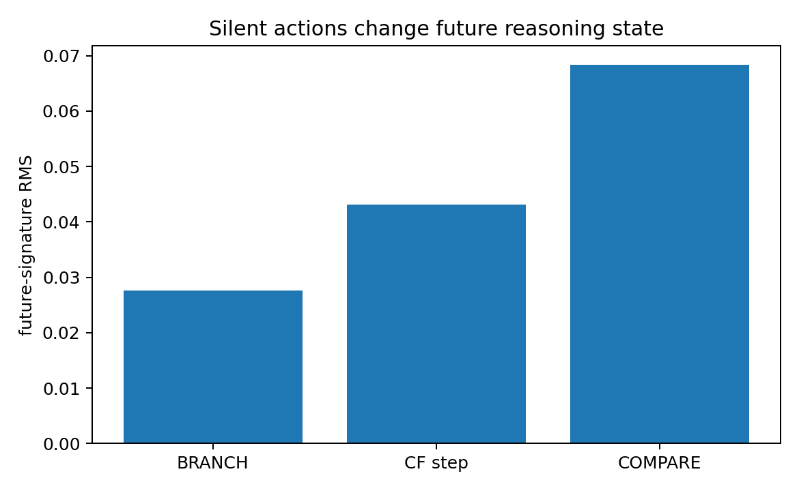

Figure 33.1 REASONING-BRANCH-021: BRANCH, counterfactual steps and COMPARE alter future-response states under unchanged committed readouts.

### 33.4 Counterfactual motion enters the main trajectory through compare and correct

All four counterfactual relation steps move only the branch and preserve immediate answers in 100.0% of cases. After COMPARE→CORRECT, 36.0% commit the branch as main, with mean goal-distance improvement 0.450.

A counterfactual is a manipulable state fiber temporarily decoupled from the committed projection. It can evolve independently and rewrite the main trajectory when a higher-level gate selects it.

### 33.5 Comparison partitions states and correction applies gated rewrites

COMPARE preserves immediate answers in 100.0% of cases and moves future signatures by mean 0.0684. Reversing COMPARE→CORRECT changes outcomes in 36.0% of single-step counterfactual cases and 32.0% of standard two-step branch programs.

Correct CORRECT preserves or improves outcomes in 100.0% of cases, with mean distance gain=0.450. Forcing the comparison sign to flip changes 72.0% of final outputs and adds mean distance penalty=0.900.

CORRECT(r) = commit(branch), if compare says branch is better

             keep(main),     if main is better or tie

             identity,       if comparison is unset

COMPARE partitions states by relational conditions; CORRECT reads the gate and conditionally rewrites coordinates. The resulting operator class is piecewise/gated.

### 33.6 Operator fits reveal smooth relation actions and gated comparison controls

| action | Level | fixed-shift MSE | single affine MSE | improvement |
| --- | --- | --- | --- | --- |
| R+1 | relation-main | 2911.04 | 1.08 | 100.0% |
| R+2 | relation-main | 2896.43 | 1.09 | 100.0% |
| R*2 | relation-main | 2258.80 | 1.31 | 99.9% |
| RNEG | relation-main | 2275.50 | 1.21 | 99.9% |
| CF+1 | relation-counterfactual | 27.49 | 1.08 | 96.1% |
| CF+2 | relation-counterfactual | 28.37 | 1.19 | 95.8% |
| CF*2 | relation-counterfactual | 26.03 | 1.05 | 96.0% |
| CFNEG | relation-counterfactual | 25.35 | 1.13 | 95.5% |
| BRANCH | meta | 27.49 | 0.38 | 98.6% |
| COMPARE | meta | 21.25 | 21.82 | -2.7% |
| CORRECT | meta | 280.42 | 106.80 | 61.9% |

Single state operators reduce errors relative to fixed shifts by approximately 99.94% for main relations, 95.85% for counterfactual relations and 98.61% for BRANCH. COMPARE's affine fit is slightly worse than fixed shift, and CORRECT improves only partly, motivating gated models.

| high-level action | single affine MSE | gate-conditioned affine MSE |
| --- | --- | --- |
| COMPARE | 21.824 | 9.400 |
| CORRECT | 106.796 | 132.337 |

Explicit gate partitioning reduces COMPARE affine MSE from 21.824 to 9.400. CORRECT's branch-commit operation is directly represented by its discrete conditional selector law.

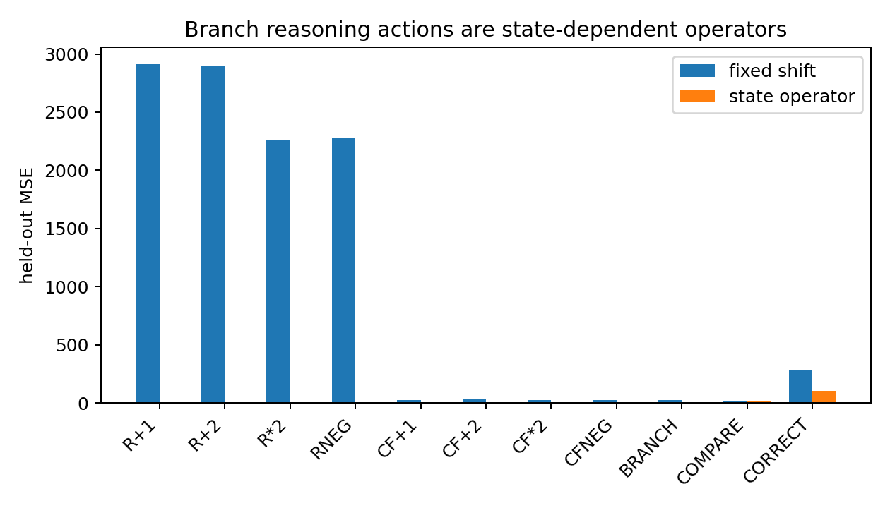

Figure 33.2 REASONING-BRANCH-021: fit structure across relation/branch and compare/correct operators.

### 33.7 Noncommutative composition and interventions

Mean internal-state noncommuting fraction across action pairs is 42.58%. Correct learned-operator composition yields two-step MSE=20.975; reversed composition yields 245.350.

Removing BRANCH changes 32.0% of standard-program results; reversing COMPARE/CORRECT also changes 32.0%; forcing wrong comparison changes 72.0%.

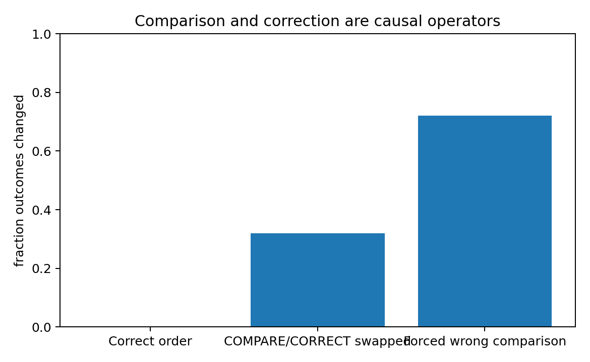

Figure 33.3 REASONING-BRANCH-021: causal correction effects of order and comparison signals.

### 33.8 Geometry of added reasoning generators

Relative to the top-3 main-relation axes, 93.81% of counterfactual-relation energy and 67.56% of BRANCH/COMPARE/CORRECT energy lie outside the lower-level subspace.

Along BRANCH→CF→CF→COMPARE→CORRECT, movement stable rank=5.589 and top-3 energy=45.82%, again separating state complexity from realized control motion.

### 33.9 Updated reasoning definition

Reasoning Control Algebra v0.3. Reasoning is closed-loop control of factorized relational states: retaining commitments, constructing counterfactual branches, transforming candidates, comparing reachable states and conditionally rewriting the committed trajectory.

r_t = (committed relation, retained commitments, branch fibers, comparison gates, ...)

r_{t+1} = G_{a_t}(r_t)

G_reason = closure_o(G_relation) + memory/re-entry + branch + compare + correct + ...

Together with 020, this establishes three mechanisms: smooth relational transformations, retained commitments/reentry, and comparison-conditioned gated rewrites.

### 33.10 Raw data figures and experimental records

REASONING-BRANCH-021.md

REASONING-BRANCH-021.py

REASONING-BRANCH-021_summary.csv

REASONING-BRANCH-021_operator_fit.csv

REASONING-BRANCH-021_gated_operator.csv

REASONING-BRANCH-021_composition.csv

REASONING-BRANCH-021_movement.csv

REASONING-BRANCH-021_branch.csv

REASONING-BRANCH-021_counterfactual.csv

REASONING-BRANCH-021_compare.csv

REASONING-BRANCH-021_correct.csv

REASONING-BRANCH-021_wrong_compare.csv

REASONING-BRANCH-021_standard_interventions.csv

REASONING-BRANCH-021_surface_aliasing.csv

REASONING-BRANCH-021_trajectory_movements.csv

REASONING-BRANCH-021_operator_fit.png

REASONING-BRANCH-021_silent_state.png

REASONING-BRANCH-021_correction_interventions.png

REASONING-BRANCH-021_state_count.png

REASONING-BRANCH-021_bundle.zip

The fully enumerable synthetic world establishes an independently measurable branch/counterfactual/compare/correct algebra. Applying these interfaces to real LLM and human trajectories would test corresponding implementations.

## 34 LM-vs-NATURAL-REASONING-MATH-022 Mathematical comparison of language models and reasoning

### 34.1 Comparison of state and control structures

Natural reasoning is formalized here as a reference algebra with retained commitments, reentry, branching, counterfactual manipulation, comparison and conditional correction. LM dynamics use a general autoregressive hidden-state form, independent of Transformer/GRU specifics. The reference is a mathematical object.

LM:        h_{t+1} = F_theta(h_t, e(a_t));   a_{t+1} ~ pi_theta(.|h_{t+1})

Reasoning: r_{t+1} = G_{a_t}(r_t);           y_t = O(r_t)

Both are state-dependent dynamical control systems. Their structural distinctions concern state factorization, primitive operators and externally visible information.

### 34.2 Mathematical comparison

| Comparison axis | autoregressive LM | natural-reasoning reference | Mathematical conclusion |
| --- | --- | --- | --- |
| State carrier | prefix-conditioned hidden state h_t | factored relational state r=(relation, commitment, branch, comparison, ...) | Representation/factorization differs; either can be encoded in a sufficiently large dynamical state. |
| Primitive update | h_{t+1}=F_theta(h_t,e(a_t)) | r_{t+1}=G_a(r_t) | Both are state-dependent dynamical operators. |
| Trajectory topology | one realized serial path at each step | committed path + retained/alternative branch fibers + re-entry | Reasoning algebra contains explicit multi-locus state even when only one output is visible. |
| Counterfactual | must be represented inside h_t or serialized into tokens | branch coordinate is a first-class state factor | Difference is native coordinate structure, not computability. |
| Comparison/correction | can be implemented implicitly by hidden dynamics | explicit COMPARE state gates conditional CORRECT | 021 gives an explicit closed-loop selector algebra. |
| Observability | token stream is a projection of h_t | committed answer is a projection of richer r_t | Surface equality does not imply state equality in either system. |
| Composition | noncommutative token/state operators | noncommutative relation/meta operators | Shared mathematical family. |
| Low-dimensional motion | language local teacher stable rank ~2.48; operator family rank ~6.02 | 020 legal reasoning movement stable rank ~3.12; 021 branch loop remains concentrated | Both can have high-dimensional state but lower-dimensional realized control motion. |

### 34.3 Exact serial emulation state lower bound

Experiment 021 has 25 visible goal × main projections and 275 legal internal states. The recorded horizon through three steps gives 173 future-response classes and the original within-surface pair statistic of 89.89%. Exhaustive refinement to a stable partition gives 275 full-future classes. Each visible pair contains 11 legal internal states; the finite-window geometry retains its original horizon label.

|H_min| ≥ |R / ~all_future| = 275; |R / ~future_≤3| = 173

Fixed-length hidden-state encoding requires at least ceil(log2 275) = 9 bits for all future programs.

visible surface bits = ceil(log2 25) = 5

The log class-count ratio to the 25 visible states is log2(275/25) = 3.459; minimum fixed-length binary encodings use 9 and 5 bits, respectively.

An exact realization of all future behaviors in this finite system carries at least 275 distinguishable persistent states. This is an information-capacity statement. V10 realizes them with a single scalar and a finite ReLU transition circuit; chapter 49 gives the exhaustive transition checks and circuit size.

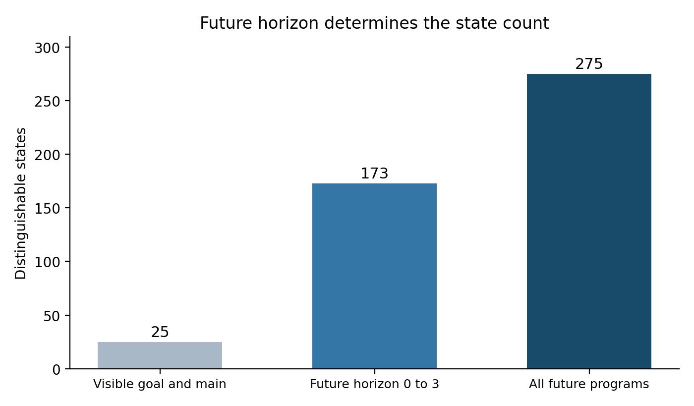

Figure 34.1 Audited counts for the visible projection, the original three-step horizon and the full-future fixed point. The original figure is retained in the source archive.

### 34.4 Finite emulation proposition

Finite emulation proposition. Every finite reasoning algebra (R,A,G,O) has an autoregressive hidden-state realization encoding R and exactly reproducing its operators/outputs. Exact realization requires distinguishing any r1≠r2 that share P(r1)=P(r2) but differ in future-response behavior.

The measurable question is whether an LM's hidden field forms an augmented predictive state isomorphic or approximately homomorphic to the reference algebra, and whether token actions implement memory/reentry/branch/compare/correct operators.

### 34.5 Shared high dimensional states and lower dimensional motion

| Object | stable rank |
| --- | --- |
| language local teacher motion | 2.481 |
| language operator family | 6.018 |
| reasoning 020 full predictive state | 8.758 |
| reasoning 020 legal trajectory movement | 3.118 |
| reasoning 021 predictive signature through 3 steps | 6.996 |
| reasoning 021 branch-loop movement | 5.589 |

Both frameworks permit high-dimensional predictive states with realized runs using fewer control directions. Added reasoning structure lies primarily in factorization and higher-level gated operators.

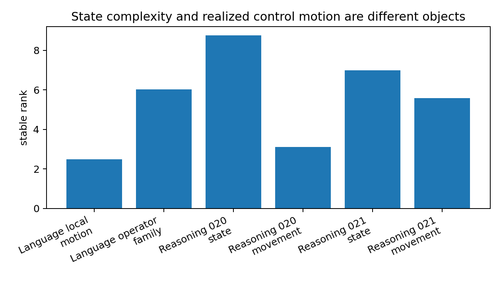

Figure 34.2 LM-vs-NATURAL-REASONING-MATH-022: state complexity and realized control motion as distinct objects.

### 34.6 Mathematical distinctions established

An autoregressive LM's native interface is one realized sequence. Unexpressed candidates, return points and comparison results reside in hidden state or are serialized as additional tokens.

The reference algebra explicitly factors committed states, retained commitments, counterfactual branches and comparison gates, making their control operators first-class objects.

Both permit noncommutative state-dependent composition and mechanistic realizations of reasoning.

Exact reasoning emulation requires hidden dynamics to recover predictive distinctions folded together by linguistic surface projections.

The experimental targets become measurable branch fibers, comparison gates, conditional corrections and future-response equivalence structures.

### 34.7 Original mathematical comparison files

LM-vs-NATURAL-REASONING-MATH-022.md

LM-vs-NATURAL-REASONING-MATH-022_comparison.csv

LM-vs-NATURAL-REASONING-MATH-022_metrics.csv

LM-vs-NATURAL-REASONING-MATH-022_ranks.png

LM-vs-NATURAL-REASONING-MATH-022_bundle.zip

Evidence scope: this section establishes definitions and lower bounds for a shared mathematical comparison with a formal reference algebra. Human implementation and factorization are empirical targets for separate behavioral/neural measurements.

## 35 Integrated v1.6 discussion Reasoning Control Algebra v0.3

### 35.1 Three operational levels

Level 1: smooth/state-dependent relational transformations

Level 2: retained commitment + re-entry / branch fibers

Level 3: state partition + comparison gate + conditional rewrite

LANG-016–019 supply relation-generating operators, 020 adds commitments/reentry, and 021 adds branch/counterfactual/compare/correct. State factors and control laws grow within one algebraic family.

### 35.2 Integrated form

r_t = (x_t, M_t, B_t, C_t, ...)

r_{t+1} = G_{a_t}(r_t)

G_reason = closure_o(G_language/relation) + R_memory + R_reentry + R_branch + R_compare + R_correct + ...

x is current relational/predictive state; M retained commitments; B one or more alternative/counterfactual fibers; C comparison/control gates. Text or answers are projections O(r_t).

### 35.3 Proposed measurements in real LLMs

Branch signature: latent subspaces predicting later branching under identical current tokens/answers.

Counterfactual fiber: separately perturbable candidate trajectories with temporarily preserved committed readouts.

Comparison gate: state partitions mapping candidate future-response states to discrete/low-dimensional control gates.

Conditional correction: one action producing different rewrites depending on comparison state.

Serial-emulation state bound: hidden future-response class counts within visible-text equivalence groups.

These targets make LM/reference-reasoning comparisons concrete model-dissection experiments.

### Version update v1.6

2026-09-26: added REASONING-BRANCH-021, LM-vs-NATURAL-REASONING-MATH-022 and v0.3, including branch/counterfactual interventions, compare/correct order and wrong-gate interventions, gated-operator levels, surface aliasing and exact serial-emulation bounds.

## 36 REASONING-LOCATOR-023 Locating internal reasoning states under fixed CoT

### 36.1 From functional algebra to internal model locations

Experiments 020–022 define future-response states and reasoning controls functionally. Experiment 023 asks where these distinctions occur across layers, times and internal objects during model execution, seeking different predictive states under identical visible CoT.

Localization criterion. A layer×time state qualifies as a functional reasoning locus when it supports recoverable distinctions, relates to future control and causally transfers future behavior through hidden-state/low-rank patches.

### 36.2 Two design revisions

The initial four-layer tiny Transformer used two-step main/counterfactual plans. Training progressed, and full layer×position Jacobian scans were computationally heavy on CPU. A three-layer recurrent LM enabled direct pause, state copying and continuation.

A two-step GRU task also required extended convergence. The final task uses one main relation and one counterfactual relation, reducing 6,400 combinations to 400 and preserving branch→compare→correct logic. Final answer accuracy is 400/400.

The simplified task still constructs both candidates from one start and selects by goal. Shorter lower-level compositions support cleaner hidden-state causal interventions.

### 36.3 Fixed visible CoT controls the textual information channel

All 400 cases are teacher-forced through identical `THINK → CHECK → FINAL` tokens. These tokens are case-invariant; the model supplies the final next-token answer.

| Quantity | Result |
| --- | --- |
| Finite-world cases | 400 |
| Visible CoT | THINK → CHECK → FINAL (identical in all cases) |
| Final answer accuracy | 1.0000 |
| Model | 3-layer autoregressive GRU |
| hidden width | 48 / layer |

This strict observable lock localizes case-specific reasoning distinctions to internal dynamics beyond visible token identity.

### 36.4 Pausing and reading hidden states across layers and times

Pause recurrent computation at SEP, THINK, CHECK and FINAL; save each of three layers' h_t. Fit linear probes with held-out evaluation for main candidate, branch, comparison, correction flag and final answer.

| latent object | best probe acc | checkpoint | layer | chance |
| --- | --- | --- | --- | --- |
| main | 0.865 | SEP | 1 | 0.200 |
| branch | 0.787 | SEP | 1 | 0.200 |
| cmp | 0.607 | FINAL | 2 | 0.333 |
| corrected | 0.787 | SEP | 1 | 0.500 |
| answer | 1.000 | THINK | 3 | 0.200 |

Main/branch are linearly readable early; layer3 answer decoding reaches 100% after THINK. Best comparison decoding is 0.607, above chance and substantially below answer decoding. This suggests a predictive organization with strong answer information and weaker explicit comparison factorization.

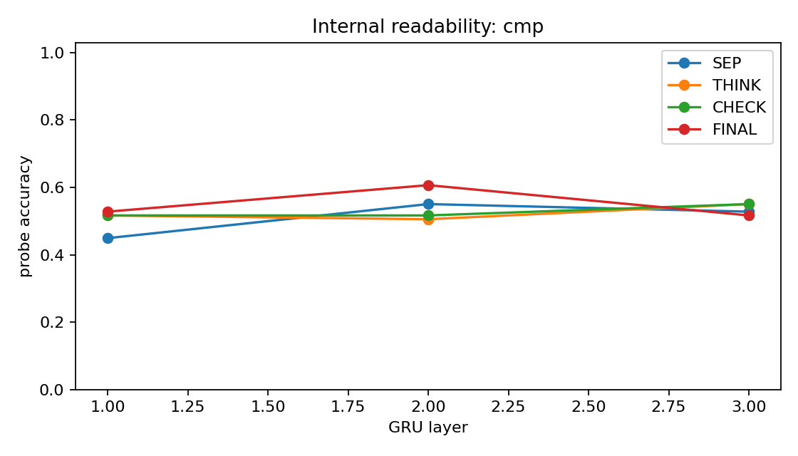

Figure 36.1 REASONING-LOCATOR-023: held-out comparison readability across layer×time.

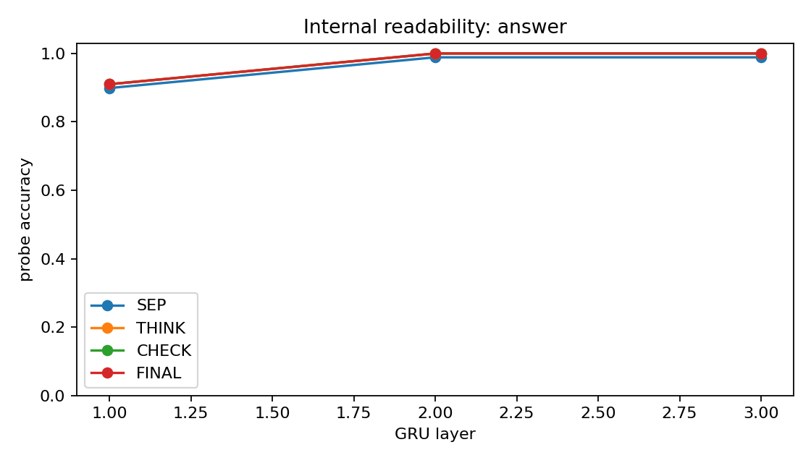

Figure 36.2 REASONING-LOCATOR-023: internal answer readability during fixed CoT.

### 36.5 Hidden state transplants transfer future behavior under identical CoT

Donor/recipient pairs share goal, start and main relation, differing only in counterfactual relation. CoT is identical and comparison/final answers differ. Pause after a token, replace one recipient layer's hidden state, then resume its unchanged suffix.

| halt point (layer3) | full-state donor adoption | <=2D cmp-subspace donor adoption | cmp-patch answer change |
| --- | --- | --- | --- |
| THINK | 0.468 | 0.083 | 0.125 |
| CHECK | 0.767 | 0.157 | 0.250 |
| FINAL | 1.000 | 0.353 | 0.392 |

Layer3 full-state donor-answer adoption rises from THINK 0.468 to CHECK 0.767 to FINAL 1.000. Causal predictive states form progressively under fixed tokens and transfer across cases.

At CHECK/layer3, full-state adoption is 0.767; transplanting the ≤2D subspace of three comparison centroids gives 0.157. Functional predictive state is distributed beyond this comparison subspace in the output-only model.

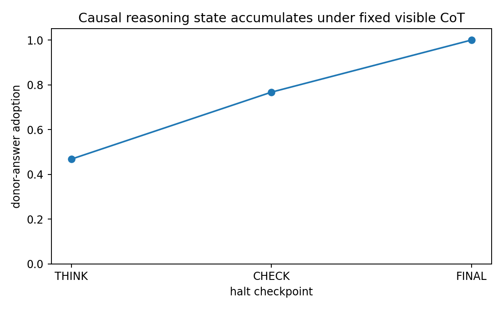

Figure 36.3 REASONING-LOCATOR-023: layer3 causal predictive states accumulate through THINK→CHECK→FINAL.

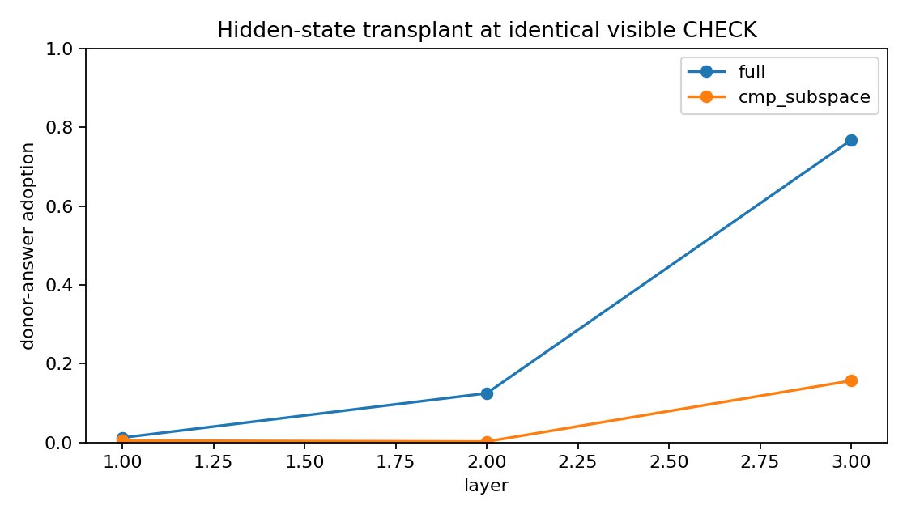

Figure 36.4 REASONING-LOCATOR-023: full-state and comparison-subspace transplants at CHECK.

### 36.6 Working localization of reasoning

Reasoning locus v0.1. The measured object is prefix-conditioned predictive hidden dynamics across layer×time. A locus combines recoverable future distinctions, effects on future-control geometry and causal transfer of subsequent trajectories.

Reasoning locus = {(layer l, time t, state h): recoverable + future-relevant + causally transportable}

In this GRU, the strongest locus is upper-layer recurrent h_t, forming through fixed THINK/CHECK/FINAL. Analogous Transformer/SSM objects include residual streams, KV states or recurrent states carrying future-equivalence distinctions.

### 36.7 Raw data figures and code

REASONING-LOCATOR-023.md

REASONING-LOCATOR-023_v2.py

REASONING-LOCATOR-023_examples.csv

REASONING-LOCATOR-023_probe_grid.csv

REASONING-LOCATOR-023_activation_patching.csv

REASONING-LOCATOR-023_summary.json

REASONING-LOCATOR-023_model.pt

REASONING-LOCATOR-023_probe_cmp.png

REASONING-LOCATOR-023_probe_answer.png

REASONING-LOCATOR-023_patching.png

REASONING-LOCATOR-023_temporal_transplant.png

REASONING-LOCATOR-023_bundle.zip

## 37 NATURAL-REASONING-FINDER-024 Finding functional internal reasoning processes

### 37.1 Distinguishing decodability from functional use

Experiment 023 locates causal predictive states and partially decodable comparison labels. Experiment 024 introduces label-free future-control tomography and an auxiliary-decoding positive control to test functional use of those labels.

### 37.2 Label-free future-control tomography

Discovery uses no main/branch/comparison labels. At each checkpoint, derive PCA perturbation directions from the hidden cloud, perturb ±ε along 5 directions, continue the identical suffix and collect final logits/finite differences as future-control signatures. Cluster signatures without labels; use latent labels only for post-hoc audit.

S(h) = [answer_logits(h), finite-difference future responses along local hidden directions]

| post-hoc latent target | best label-free AMI | checkpoint | layer |
| --- | --- | --- | --- |
| cmp | -0.011 | THINK | 1 |
| branch | 0.258 | FINAL | 2 |
| answer | 0.971 | FINAL | 2 |

In the answer-only LM, Finder nearly recovers answer state (AMI≈0.971), partly recovers branch structure (≈0.258), and yields comparison clustering near 0. The recovered functional structure is concentrated in answers and partial branching.

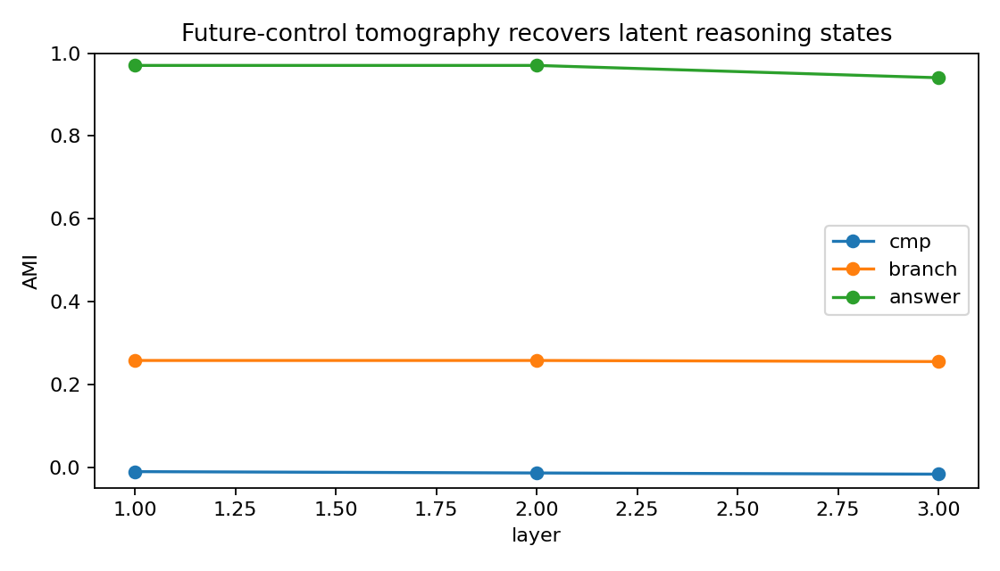

Figure 37.1 NATURAL-REASONING-FINDER-024: post-hoc audit of unsupervised latent recovery from future-control signatures.

### 37.3 Fully decodable comparison with weak functional separation

Train an additional control with fixed CoT and auxiliary hidden-state heads: THINK main/branch and CHECK comparison decoding reach 100%, with 100% answer accuracy.

| target | output-only LM best AMI | aux-decodable model best AMI |
| --- | --- | --- |
| cmp | -0.011 | 0.036 |
| branch | 0.258 | 0.354 |
| answer | 0.971 | 0.875 |

Despite 100% auxiliary comparison decoding, future-control comparison AMI is approximately 0.036. Activations can encode labels with little corresponding separation in the future-control gate structure measured here.

Methodological conclusion. Decodability establishes representation. Functional reasoning-state evidence additionally requires discrimination of standardized futures and causal transfer through transplantation/perturbation. The criterion combines all three.

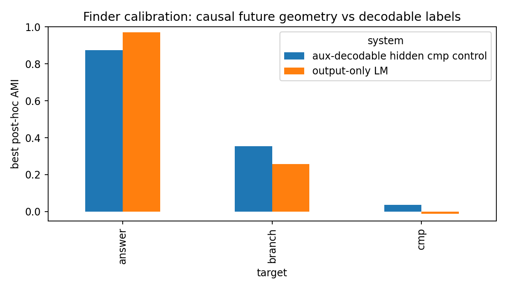

Figure 37.2 NATURAL-REASONING-FINDER-024: calibration of decodable labels against functional future-control states.

### 37.4 Reference algebra 021 as a functional comparison control

In 021, COMPARE preserves current answers and changes future states; reversing COMPARE/CORRECT changes outcomes, and wrong comparison changes 72.0% of outputs. CORRECT functionally reads the gate, making comparison part of the future-equivalence state.

This separates surface tokens, decodable hidden features and functional reasoning states. Finder targets functional states.

### 37.5 Standard workflow for Natural Reasoning Finder

Collect surface-equivalent checkpoints with identical/similar tokens, CoT or answer propensity and different histories.

Pause across layer×time and save residual streams, KV caches, recurrent or other predictive states.

Perform standardized future-control tomography with fixed suffixes, multidirectional perturbations and future logits/Jacobians.

Build quotients/clusters from future-control signatures.

Identify silent branch fibers: preserved current readouts with changed future signatures.

Identify comparison gates: partitions, abrupt directional changes and conditional switches in future geometry.

Identify conditional corrections: gate-dependent rewrites under the same subsequent action.

Use hidden-state transplants/low-rank patches to verify causal transfer of future trajectories.

Fit operator algebra between these classes and test for functionally corresponding commitments, reentry, branching, comparison and correction.

### 37.6 Mathematical criterion for correspondence with natural reasoning

Let H/~future be the internal future-equivalence quotient and R the reference algebra. Seek phi such that model operators T_a and reasoning operators G_a approximately satisfy, on relevant states:

phi(T_a([h])) ≈ G_a(phi([h]))

If causal interventions preserve corresponding branch/reentry/compare/correct behavior, the process is functionally isomorphic or approximately homomorphic to the reference algebra. The criterion concerns function across coordinates and surface expression.

### 37.7 Task success and internal algorithmic structure

The output-only LM achieves 400/400 correct answers with a progressively formed distributed answer-predictive state and weak evidence for a separate functional comparison gate. Searching for reference-like reasoning therefore requires direct measurement of predictive-state factorization and operator causality.

### 37.8 Raw data controls and figures

NATURAL-REASONING-FINDER-024.md

NATURAL-REASONING-FINDER-024_clustering.csv

NATURAL-REASONING-FINDER-024_spectrum.csv

NATURAL-REASONING-FINDER-024_positive.py

NATURAL-REASONING-FINDER-024_positive_control.csv

NATURAL-REASONING-FINDER-024_positive_model.pt

NATURAL-REASONING-FINDER-024_calibration.csv

NATURAL-REASONING-FINDER-024_recovery.png

NATURAL-REASONING-FINDER-024_calibration.png

NATURAL-REASONING-FINDER-024_bundle.zip

## 38 Integrated v1.7 discussion Reasoning Locus and Natural Reasoning Finder

### 38.1 What this stage establishes

visible CoT != complete reasoning state

decodable activation != functional reasoning state

functional reasoning state = recoverable + future-distinguishing + causally transportable predictive state

CoT can participate in control and serve as external working memory. Complete reasoning state is defined through internal future-equivalence geometry, and functional criteria determine the role of each token/state.

### 38.2 Current research sequence

training / language geometry -> low-dimensional control resources -> language control algebra

-> retained commitment / re-entry -> branch / compare / correct reasoning algebra

-> layer×time predictive state -> future-control tomography -> causal reasoning locus

-> natural-reasoning functional-homomorphism test

Earlier experiments establish possible language/reasoning algebras; 023–024 specify where and how to measure their functional realization inside models.

### 38.3 Engineering implications for real LLMs

Control-Flow MRI now targets future-equivalence classes, silent branches, comparison gates and correction switches across layer×time. Pausing intermediate states, repeating continuations, perturbing locally and transplanting activations/states provide the measurement interface for reconstructing internal reasoning algebra.

Consolidated definition. A reasoning process is an operator trajectory on an internal predictive-state quotient with causal effects on future controllability. Visible CoT is one possible discrete interface used by that trajectory.

### Version update v1.7

2026-09-26: added REASONING-LOCATOR-023, NATURAL-REASONING-FINDER-024 and Reasoning Locus v0.1, including fixed-CoT localization, layer/time probes, full/low-rank transplants, label-free tomography, auxiliary-decodability controls and functional-homomorphism criteria.

## 39 Rejoining the parallel CoT mechanics and stopping geometry branch

### 39.1 Two branches from Language Control Algebra

Version 1.7 includes LANG-016–019 and proceeds through REASONING-STATE-020, REASONING-BRANCH-021, LM-vs-NATURAL-REASONING-MATH-022, REASONING-LOCATOR-023 and NATURAL-REASONING-FINDER-024 to Reasoning Locus v0.1. A parallel branch from LANG-019 investigates additional generators, Direct/CoT differences, computational depth, per-question budgets and stopping. These completed, separately archived experiments are incorporated here.

Merge policy

Preserve the v1.7 State/Branch/Locator/Finder evidence chain and append the parallel CoT-mechanics branch as 025–029. Original identifiers remain provenance aliases.

### 39.2 Master record identifier mapping

| Master-record ID | Original working ID / standalone package | Experimental role |
| --- | --- | --- |
| COT-DIAGNOSTIC-025 | REASONING-GENERATOR-018 | Calibrate closure, low-rank, replication and functional-surgery criteria for added reasoning generators |
| COT-CLOSURE-026 | REASONING-GENERATOR-019 | Apply the assay to trained self-generating GRUs and identify microscopic closure's representational scale |
| DIRECT-COT-STATE-027 | DIRECT-vs-CoT-STATE-020 | Separate Direct, blank computational depth and relational CoT |
| COT-BUDGET-GEOMETRY-028 | COT-BUDGET-GEOMETRY-021 | Express per-question CoT requirements as finite state-space work and action-dependent admissible sets |
| STOPPING-GEOMETRY-029 | STOPPING-GEOMETRY-022 | Formulate CoT control as optimal stopping on predictive states |

### 39.3 Complementary contributions to v1.7

Experiments 023–024 define functional state through future distinctions, control and causal transport. Experiments 025–029 establish the scale at which added generators are meaningful, separate CoT roles and formulate continuation/stopping as state control. The branches address state identity/location and the value/duration of its trajectory.

## 40 COT-DIAGNOSTIC-025 Controlled reasoning generator assay Former RG-018

### 40.1 Recursive language closure and additional reasoning generators

Following LANG-019's composition-plus-residual law, test whether language-operator closure reconstructs reasoning trajectories or leaves residual generators that are low-rank, reproducible across tasks and functionally necessary.

H0:  G_reason = <G_language>_(composition, feedback)
H1:  G_reason = <G_language>_(composition, feedback) + R_reason

### 40.2 Calibration in a pure closure world

Use an 8D state and six visible affine language actions constrained to a common 3D movement subspace. Fitting 15,000 independent one-step transitions recovers parameters to maximum error 4.41×10⁻15. Reasoning-length compositions have maximum closure residual 2.43×10⁻14.

Negative control passed

The assay gives numerical-zero residual when the generative mechanism is language closure, calibrating the interpretation of subsequent residual SVD.

### 40.3 Positive control with two low rank generators

Keep visible actions fixed and add two state-dependent low-rank updates only at reasoning stages 3 and 6. Closure subtraction yields residuals only at those stages.

| Quantity | Result |
| --- | --- |
| Residual mode-1 energy | 69.92% |
| Residual top-2 energy | 100.000% |
| Residual stable rank | 1.4302 |
| Recovered 2D residual subspace vs true generators | principal angles = 0° / 0° |
| reasoning directions vs 3D language movement | 49.46° / 78.46° |

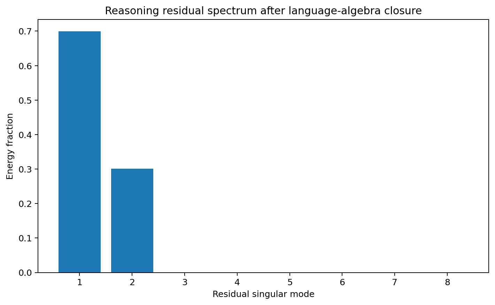

Figure 40.1 COT-DIAGNOSTIC-025: residuals after exact language-closure subtraction occupy the two added generator directions.

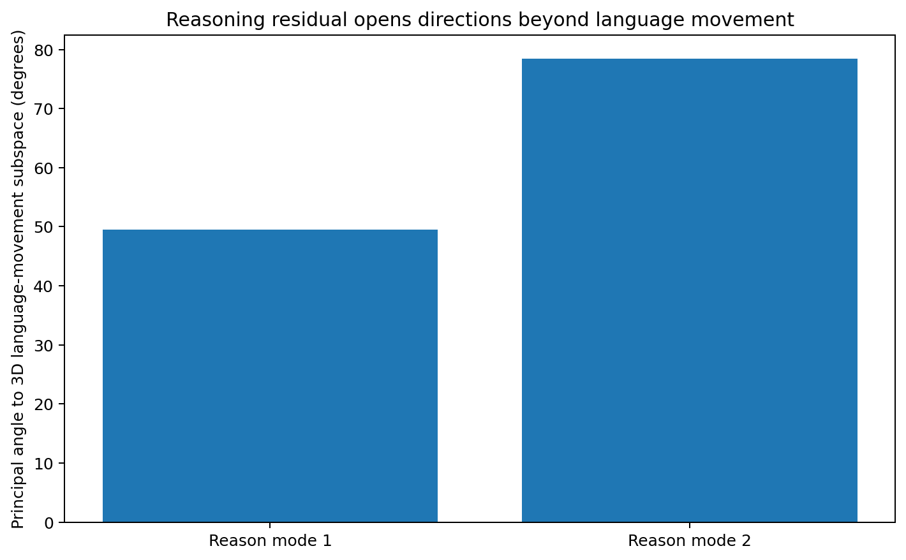

Figure 40.2 COT-DIAGNOSTIC-025: one generator partly reuses language movement space and the other extends beyond it.

### 40.4 Cross task replication and held out functional surgery

Split cases into four disjoint visible-token-pattern task groups. Each independently recovered top-2 residual space carries 100% energy, with intergroup principal angles at numerical precision. Fit state-dependent residual updates on half the cases and evaluate on the held-out half.

| Condition | held-out answer accuracy | Functional interpretation |
| --- | --- | --- |
| Language closure only | 85.20% | Approximately 14.8% of reasoning outcomes differ from the full system |
| Restore the two learned generators | 100.00% | Final states and logits recover to numerical precision |

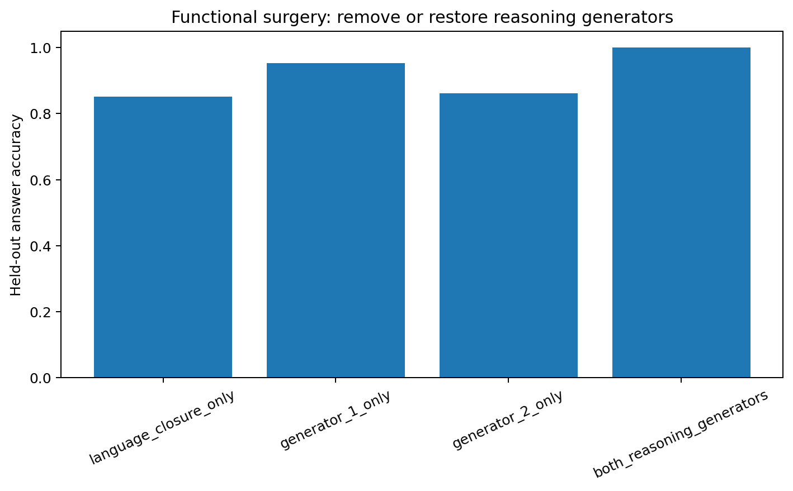

Figure 40.3 COT-DIAGNOSTIC-025: generator removal changes outcomes; generators learned on separate cases rescue held-out reasoning.

### 40.5 Replication across twenty random orientations

Across 20 independently rotated language/reasoning geometries, mean residual mode1=70.70% and stable rank=1.4147. Closure-only mean answer accuracy=83.83%; learned-generator held-out accuracy is 100% in all 20/20 replications.

### 40.6 Functional criteria for reasoning generators

Four criteria jointly identify a generator: a clean closure negative control, structured low-rank residuals, cross-task subspace replication and selective held-out effects from removal/restoration. Together they establish a functional object beyond geometric correlation.

These criteria are applied to 026. The trained autoregressive GRU yields a different residual structure from the constructed positive control, allowing the assay to distinguish the two mechanisms.

### 40.7 Raw data and figures

REASONING_GENERATOR_018/REASONING_GENERATOR_018.md

REASONING_GENERATOR_018/closure_residual_by_step.csv

REASONING_GENERATOR_018/reasoning_residual_spectrum.csv

REASONING_GENERATOR_018/cross_task_generator_recovery.csv

REASONING_GENERATOR_018/cross_task_subspace_pairwise_angles.csv

REASONING_GENERATOR_018/functional_surgery.csv

REASONING_GENERATOR_018/replication_20_random_orientations.csv

REASONING_GENERATOR_018/summary.json

## 41 COT-CLOSURE-026 Closure in self generated CoT Former RG-019

### 41.1 Applying the assay to a trained CoT generator

One GRU learns 32 tasks: 16 PARALLEL and 16 REASON. Both have A/B/C/D prompts and exactly 21 output tokens. Shared first segments compute A xor B and C xor D. Matched third segments repeat r1 and answer r1 in PARALLEL, or integrate r1 xor r2 in REASON. Embedding=16, hidden=48. Three initializations all achieve 32/32 exact free-generated CoT and answers.

### 41.2 Exact closure at the complete microscopic hidden state

T_a(h) = F_theta(h, E(a))
h_(t+1) = T_(a_t)(h_t)

Replaying each actual transition through the trained recurrence gives maximum micro-closure error 0 in all three models. At complete RNN hidden-state resolution, language, repetition and reasoning tokens all use the same F_theta, which exactly closes their dynamics.

Representational scale

The 025 positive control explicitly adds dynamics outside language closure. In an ordinary autoregressive GRU, meaningful effective generators are therefore defined relative to coarse-graining, semantic/relational quotients or restricted operator families. This connects to future-equivalence and Reasoning Locus.

### 41.3 Closely matched residuals in REASON and PARALLEL

| seed | PARALLEL RMSE | REASON RMSE | R/P | paired r95 | stable rank |
| --- | --- | --- | --- | --- | --- |
| 19020 | 0.637 | 0.650 | 1.0193 | 17 | 3.025 |
| 19021 | 0.814 | 0.827 | 1.0153 | 13 | 3.351 |
| 19022 | 0.839 | 0.853 | 1.0169 | 11 | 2.579 |

REASON/PARALLEL closure-error ratios range 1.0153–1.0193, mean 1.0172. Their matched third-stage residuals remain closely aligned in magnitude during intermediate-result integration.

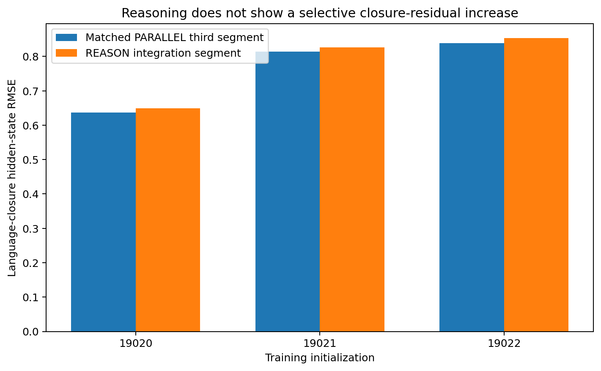

Figure 41.1 COT-CLOSURE-026: nearly synchronous closure residuals in matched REASON/PARALLEL third segments.

### 41.4 Distributed matched residuals and seed dependent subspaces

Subtract matched PARALLEL residuals from REASON by question and position. Across three seeds, r95=17/13/11, stable rank=3.025/3.351/2.579, mode1≈30–39% and top-2≈47–55%, giving a broader excess-residual structure than 025.

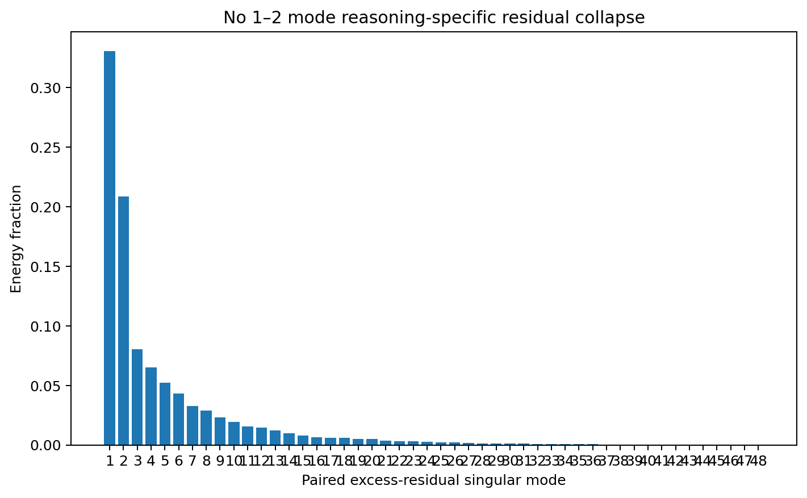

Figure 41.2 COT-CLOSURE-026: matched reasoning excess-residual spectra compared with the two-mode positive control.

Top-two candidate planes have raw cross-seed mean principal angles of approximately 76–83°, with overall mean approximately 80.3°. These describe coordinate differences between independently learned hidden bases. V06 subsequently aligns response functions and demonstrates that reversible recoding alone can produce comparably large raw angles.

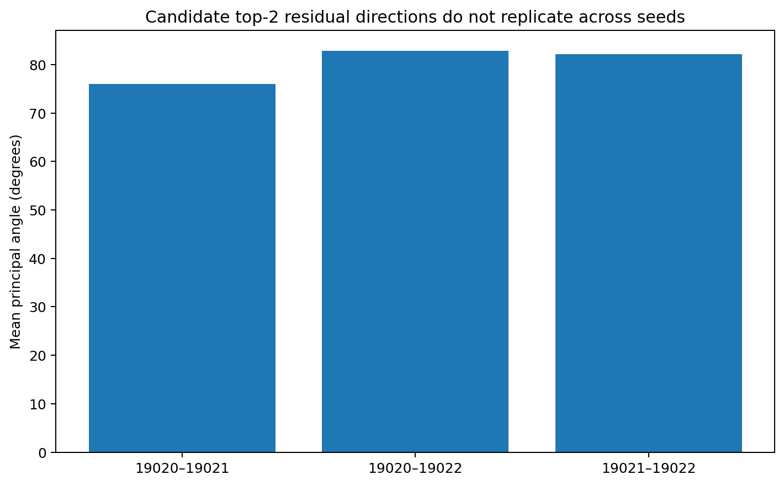

Figure 41.3 Raw cross-seed candidate-subspace angles in the original hidden coordinates. Functional alignment is evaluated separately in V06.

### 41.5 Surgery identifies shared transition structure

Estimate candidate top-2 directions from half the bit patterns and attenuate them during held-out free generation. At 25% attenuation, both PARALLEL and REASON answers collapse in all three seeds, indicating shared functional effects.

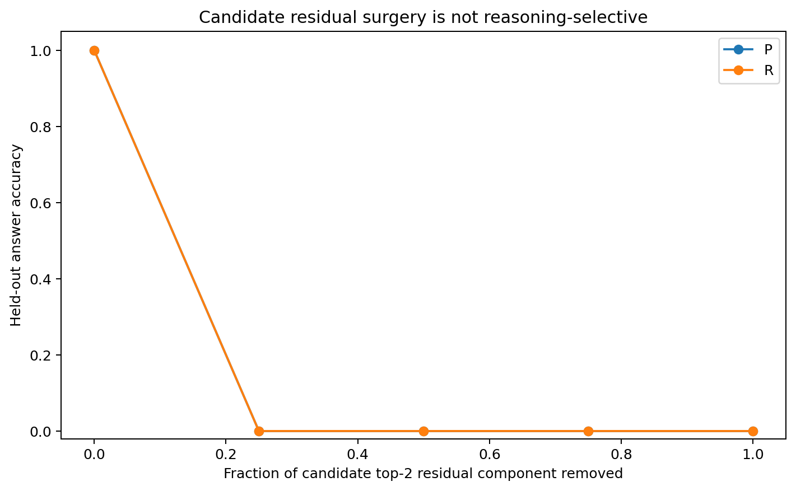

Figure 41.4 COT-CLOSURE-026: candidate-direction surgery disrupts both task types, identifying common transition structure.

### 41.6 Effective generators require a functional representation scale

Complete recurrence gives exact closure for all trajectories. Effective reasoning generators must be defined relative to a compressed, functionally sufficient representation Ψ(h), where lower-level language operators explain ordinary behavior and residual structure accounts for additional future-equivalence distinctions. Cross-task/seed replication and surgery then test that structure.

This supports 023–024's focus on future-distinguishing, causally transportable predictive states. Functional quotients provide the scale at which closure and additional generators can be tested meaningfully.

### 41.7 Raw data checkpoints and figures

REASONING_GENERATOR_019/REASONING_GENERATOR_019.md

REASONING_GENERATOR_019/three_seed_closure_assay.csv

REASONING_GENERATOR_019/exact_micro_closure.csv

REASONING_GENERATOR_019/paired_excess_residual_spectrum_seed19020.csv

REASONING_GENERATOR_019/cross_seed_candidate_subspace_alignment.csv

REASONING_GENERATOR_019/candidate_surgery_attenuation_summary.csv

REASONING_GENERATOR_019/tiny_ar_seed19020.pt

REASONING_GENERATOR_019/tiny_ar_seed19021.pt

REASONING_GENERATOR_019/tiny_ar_seed19022.pt

REASONING_GENERATOR_019/summary.json

## 42 DIRECT-COT-STATE-027 Direct Blank and relational CoT Former 020

### 42.1 Separating information computational depth and relational reorganization

Replication update. All nine XARCH models learn the complete relational chain and Direct answer. V13 supplies separate tests with the answer-bearing final relation removed and unseen question combinations; see 48–49.

One 32-hidden GRU learns all 16 four-bit hierarchical-XOR questions in three modes: DIRECT answers immediately; BLANK-THINK takes equal recurrent depth with X feedback; CoT generates/reinjects r1=A xor B, r2=C xor D and r3=r1 xor r2. Every mode achieves 16/16 exact generation and answers.

### 42.2 Three state organizations for the same correct answers

| answer-marker state pair | mean hidden L2 |
| --- | --- |
| Direct ↔ CoT | 2.761 |
| Direct ↔ Blank | 2.529 |
| Blank ↔ CoT | 2.077 |

| Mode | mean \|final answer margin\| | Working organization |
| --- | --- | --- |
| Direct | 8.86 | Early compression into answer-ready representations |
| Blank | 11.12 | Extra recurrent depth advances computation with blank feedback |
| CoT | 11.97 | Extra computation plus relational tokens reinjected as external working memory/control actions |

### 42.3 Relational readability differs across modes

| mode | state | r1 probe | r2 probe | final y probe |
| --- | --- | --- | --- | --- |
| D | prompt_end | 0.562 | 0.562 | 1.000 |
| D | answer | 0.500 | 0.500 | 1.000 |
| B | prompt_end | 0.812 | 0.938 | 0.938 |
| B | after_r3_value | 0.500 | 0.250 | 1.000 |
| B | answer | 0.438 | 0.062 | 1.000 |
| C | prompt_end | 1.000 | 0.938 | 0.688 |
| C | after_r1_value | 1.000 | 1.000 | 1.000 |
| C | after_r3_value | 1.000 | 1.000 | 1.000 |
| C | answer | 1.000 | 1.000 | 1.000 |

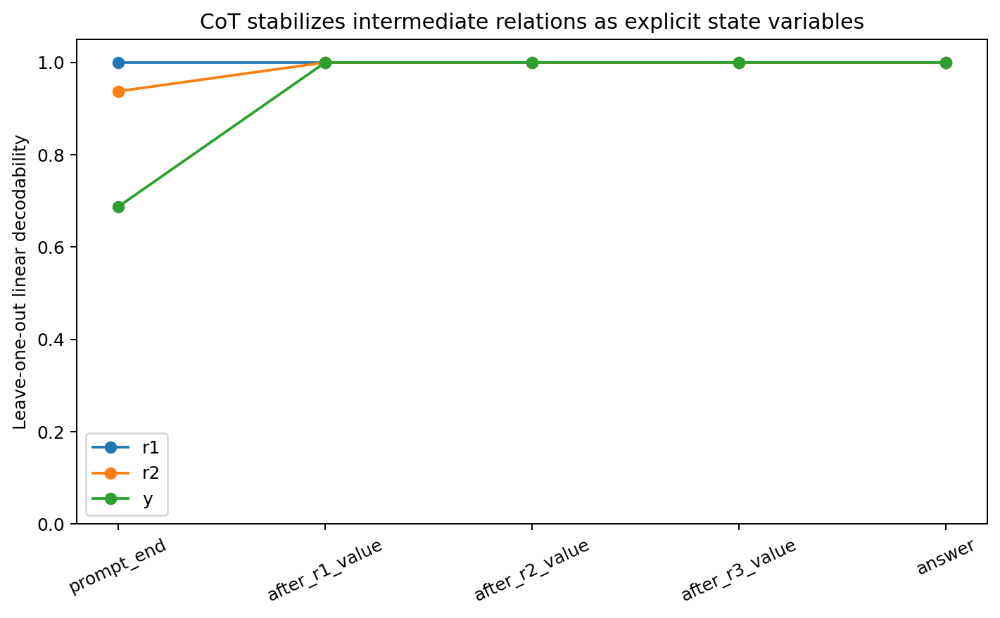

Figure 42.1 DIRECT-COT-STATE-027: CoT stabilizes readable intermediate relations; Direct compresses toward answers.

At prompt end, Direct answer decoding is 100% and r1/r2 approximately 56%; at answer state, r1/r2 approach chance and y stays 100%. After the first relational value, CoT r1/r2/y all reach 100% LOO linear decoding and stay there. Blank makes y readable early, with later decay of r1/r2.

### 42.4 Answer information and answer readiness

| mode | Source state for immediate answer jump | accuracy | mean correct-signed margin |
| --- | --- | --- | --- |
| D | prompt_end | 1.000 | 8.861 |
| B | prompt_end | 0.500 | 0.741 |
| B | after_r1_value | 0.500 | 1.253 |
| B | after_r2_value | 0.562 | 2.412 |
| B | after_r3_value | 1.000 | 11.121 |
| C | prompt_end | 0.500 | -0.482 |
| C | after_r1_value | 0.500 | 1.083 |
| C | after_r2_value | 0.688 | 7.202 |
| C | after_r3_value | 1.000 | 11.967 |

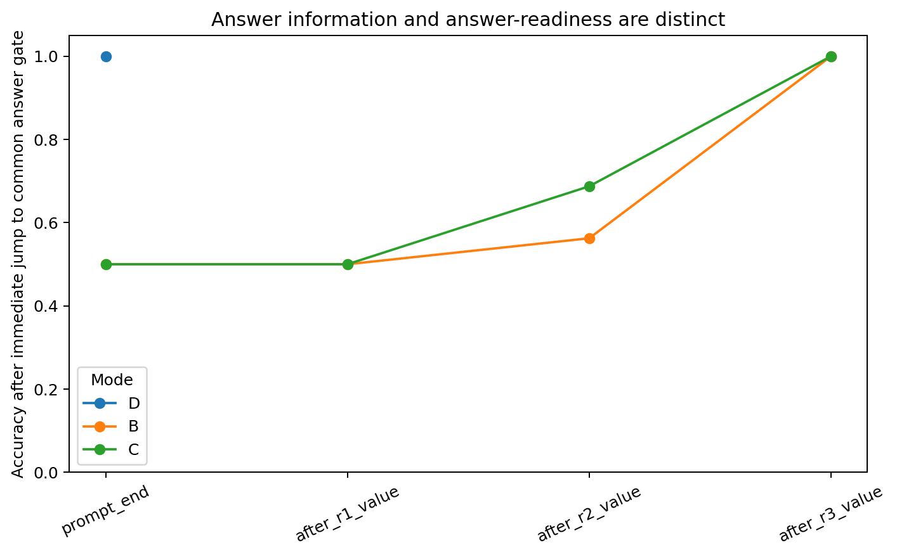

Figure 42.2 DIRECT-COT-STATE-027: linear information availability and normal answer-gate readiness.

After-r1 CoT states have 100% linearly decodable y, yet immediately feeding the common `answer` token yields 50% accuracy. After-r2 gives approximately 68.75%; after-r3 gives 100%. The current control phase determines answer-gate readiness beyond decodable information.

### 42.5 Three separable contributions

Direct learns a short path compressing prompts into answer-ready states with limited intermediate-relation retention. Blank establishes computational depth as an independent factor. Relational CoT additionally discretizes and reinjects values, stabilizing r1/r2 as readable, reusable control coordinates.

This agrees with Natural Reasoning Finder: decoding establishes representation; downstream control, readiness and transplantation establish functional use. The 100%-decodable/50%-answer-ready case makes that distinction concrete.

### 42.6 Raw data and figures

DIRECT_COT_STATE_020/DIRECT_COT_STATE_020.md

DIRECT_COT_STATE_020/free_generation_by_mode.csv

DIRECT_COT_STATE_020/answer_state_pairwise_distances.csv

DIRECT_COT_STATE_020/answer_state_margins.csv

DIRECT_COT_STATE_020/relation_linear_probe_by_stage.csv

DIRECT_COT_STATE_020/jump_to_answer_by_stage.csv

DIRECT_COT_STATE_020/matched_state_transplant_answer_gate.csv

DIRECT_COT_STATE_020/fourbit_direct_blank_cot_model.pt

## 43 COT-BUDGET-GEOMETRY-028 Per question CoT requirements Former 021

### 43.1 Required thinking time as a conditional state space quantity

h_0(q) = F_(q_m) o ... o F_(q_1)(h_init)
h_(k+1) = F_theta(h_k, e(a_(k+1)))
M_y(h) = s_y [ z_1(F_theta(h,e_answer)) - z_0(F_theta(h,e_answer)) ]
rho_q(k) = M_y(h_k) / ||grad_h M_y(h_k)||

M_y(h)>0 means the common immediate-answer gate lies on the correct side; ρ is a first-order boundary-distance proxy. For fixed policy π and robustness ε, k_min(q,θ,π,ε)=min{k:ρ_q(k;π)≥ε}. Required CoT is conditional on model, question, policy and readout.

### 43.2 Finite state space work of a thought step

G_(q,k) = M_y(h_(k+1)) - M_y(h_k) = integral_(gamma_k) grad_h M_y(h)^T dh
M_y(h_k) = M_y(h_0) + sum_(j<k) G_(q,j)

Across 16 questions × 3 genuine relation steps, 32-point Gauss–Legendre integration closes finite margin changes to maximum approximately 3.6×10⁻5. Pointwise ∇M·Δh correlates with actual gains at approximately 0.24, indicating nonlinear trajectories whose accumulated control work is the relevant quantity.

### 43.3 Minimum depths of zero two or three for identical formal task depth

| First correct genuine relation depth | Question count |
| --- | --- |
| k=0 | 8 |
| k=1 | 0 |
| k=2 | 3 |
| k=3 | 5 |

| Representative question | gold | M0 | G1 | G2 | G3 | First answer-ready point |
| --- | --- | --- | --- | --- | --- | --- |
| 0001 | 1 | +4.99 | +10.10 | +2.44 | -4.19 | k=0 |
| 0000 | 0 | -6.38 | +3.16 | +3.80 | +11.53 | k=2 |
| 0101 | 0 | -15.09 | -1.17 | +12.84 | +13.99 | k=3 |

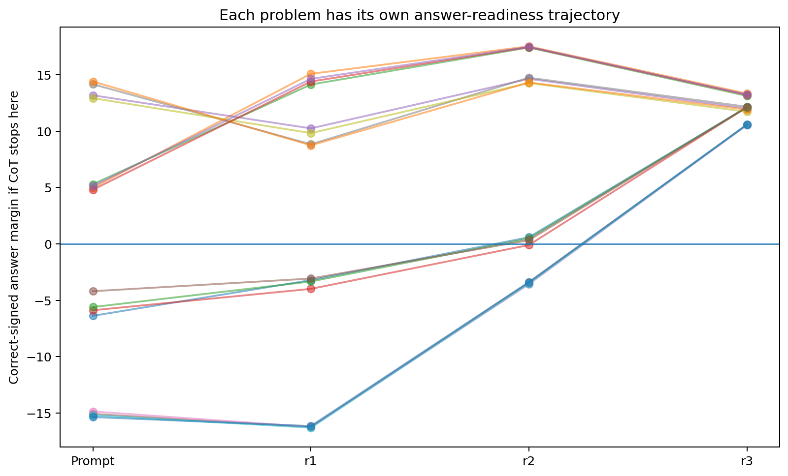

Figure 43.1 COT-BUDGET-GEOMETRY-028: distinct readiness trajectories for formally identical tasks in one model.

### 43.4 Equal three step budgets yield 50 75 or 100 percent accuracy

| Action composition at total extra budget=3 | answer accuracy |
| --- | --- |
| 0 genuine relations + 3 blank | 75% |
| 1 relation + 2 blank | 50% |
| 2 relations + 1 blank | 50% |
| 3 genuine relations + 0 blank | 100% |

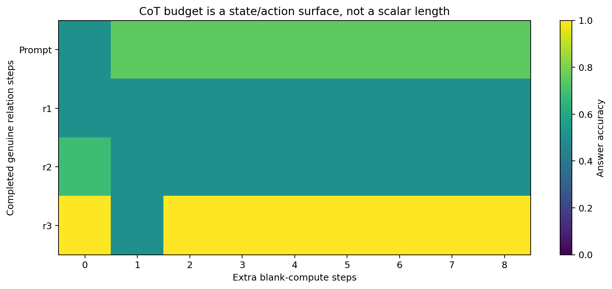

Figure 43.2 COT-BUDGET-GEOMETRY-028: budget as a state×action surface; action identity differentiates equal-length computation.

### 43.5 Disconnected acceptable budget sets

After three relational steps, all 16/16 are correct. One additional blank reduces aggregate accuracy to 50%; a second restores 100%. Across n=0…8, 8/16 questions have disconnected hard-correct budget sets.

| Question 0001: blank steps n after complete relational CoT | 0 | 1 | 2 | 3 |
| --- | --- | --- | --- | --- |
| correct-signed margin | +13.339 | -0.266 | +4.950 | +6.835 |

Blank applies nonlinear W(h)=Fθ(h,e_X). For 0001, Jacobian spectral radii at n=0 and n=1 are approximately 1.42 and 1.57, supporting local expansion out of the correct basin and subsequent return under changed geometry.

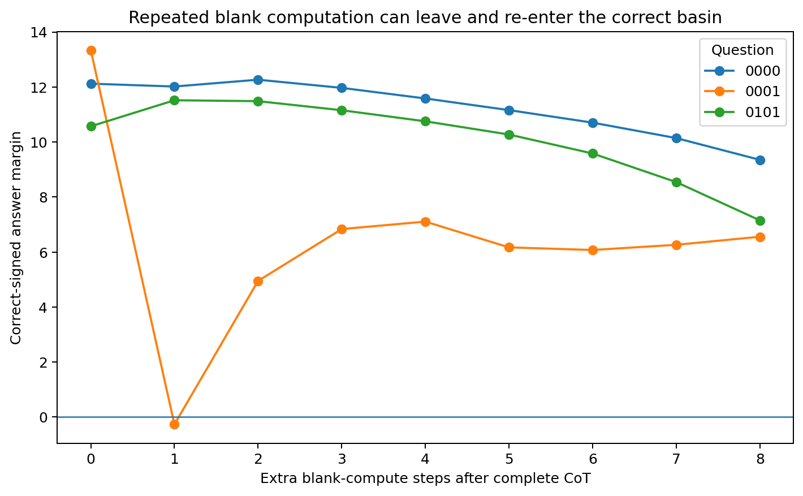

Figure 43.3 COT-BUDGET-GEOMETRY-028: correct→incorrect→correct transitions create gaps in admissible budgets.

### 43.6 Reusable operators and compositional generalization

Train six-bit hierarchical parity on 48/64 combinations and hold out 16, ensuring local pairwise XOR patterns occur in training. Three initializations yield different outcomes:

| seed | Direct held-out answer | Blank | Relational CoT |
| --- | --- | --- | --- |
| 22021 | 50.0% | 62.5% | 93.75% |
| 22022 | 43.75% | 43.75% | 43.75% |
| 22023 | 50.0% | 31.25% | 56.25% |

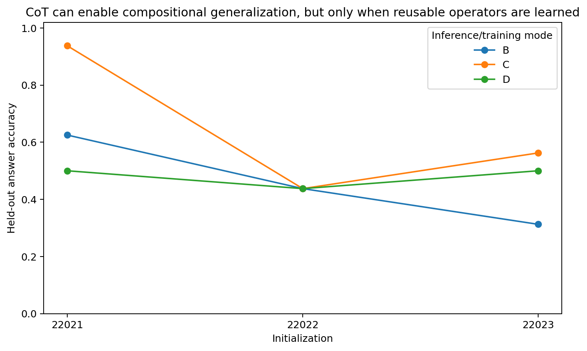

Figure 43.4 COT-BUDGET-GEOMETRY-028: compositional CoT benefits depend on learned reusable relation operators.

### 43.7 Admissible thought sets

A_(epsilon,delta)(q,pi) = { k : rho_q(k;pi) >= epsilon and S_q(k;pi) >= 1-delta }
S_epsilon(q) = { a_(1:k) : rho_q(h_k) >= epsilon }

Under fixed policy, acceptable lengths can have gaps. With action identity free, the fundamental object is the set of thought-action trajectories carrying the current state into a robust answer region. Length projects this higher-dimensional set onto integers, merging distinct equal-length actions.

This connects naturally to branch/compare/correct algebra: action identities determine future-equivalence states. A question needs further CoT when its current state is outside the acceptable answer region and a learned action trajectory can carry it inside.

### 43.8 Raw data and figures

COT_BUDGET_GEOMETRY_021/COT_BUDGET_GEOMETRY_021.md

COT_BUDGET_GEOMETRY_021/per_problem_answer_readiness_trajectory.csv

COT_BUDGET_GEOMETRY_021/thought_step_answer_alignment.csv

COT_BUDGET_GEOMETRY_021/per_problem_budget_surface.csv

COT_BUDGET_GEOMETRY_021/same_total_budget_different_action_mix.csv

COT_BUDGET_GEOMETRY_021/per_problem_admissible_blank_sets.csv

COT_BUDGET_GEOMETRY_021/blank_dynamics_representative.csv

COT_BUDGET_GEOMETRY_021/sixbit_compositional_holdout_control.csv

COT_BUDGET_GEOMETRY_021/robust_minimum_cot_depth.csv

## 44 STOPPING-GEOMETRY-029 State dependent stopping on predictive states Former 022

### 44.1 Predicting when to answer from current state

Replication update. The original two-model result measures relation steps conditional on qualification among three initializations. The current cross-architecture and independent-test results compare native output, fixed depth, accuracy and elapsed cost separately; see 48.3 and 49.9.

Treat stopping as state-space control. In the complete 64-question six-bit hierarchical-XOR world, a 48-state GRU achieves 64/64 exact generation and correct answers in Direct/Blank/CoT modes. Retain two independent exact-generation seeds, 22022 and 22023. CoT has 5 genuine relation steps.

V(h) = min[ L_stop(h), lambda + E_(a~pi(.|h)) V(F_theta(h,a)) ]
S* = { h : L_stop(h) <= lambda + E V(F_theta(h,a)) }

CoT length is a trajectory's hitting time of stopping region S*. The central object is the state-space stopping set.

### 44.2 Oracle first ready depth averages 0.81 to 1.20 steps

| seed | Ready at k=0 | oracle mean k / 5 | oracle compute saving | full accuracy |
| --- | --- | --- | --- | --- |
| 22022 | 32/64 | 1.203 | 75.94% | 100% |
| 22023 | 36/64 | 0.813 | 83.75% | 100% |

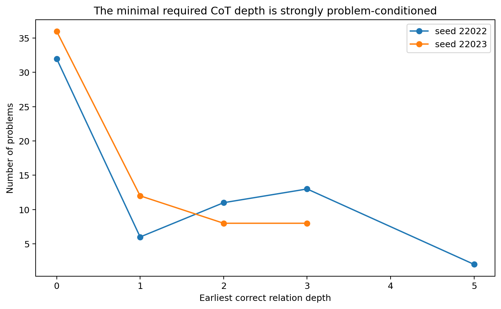

Figure 44.1 STOPPING-GEOMETRY-029: per-question first-ready depths vary across the same formal five-step task.

### 44.3 Readiness sets are often disconnected

Seed22022 has 39/64 questions with multiple connected components in A(q); seed22023 has 43/64. For seed22022 question `000101`, ready depths are {0,2,4,5}. Even genuine relational actions can temporarily move the immediate-answer readout outside and then back into its correct decision region.

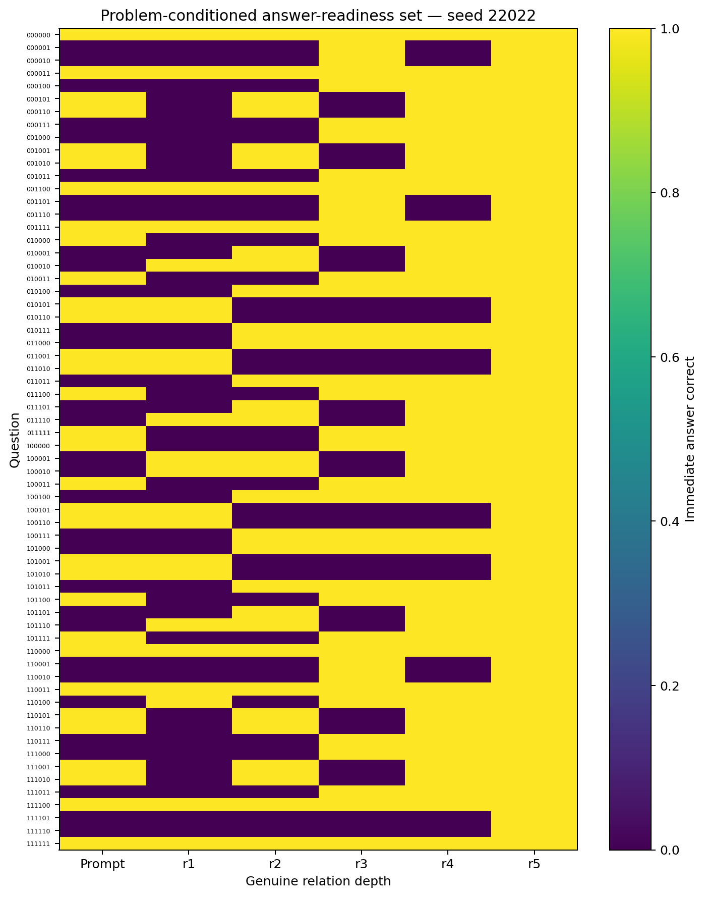

Figure 44.2 STOPPING-GEOMETRY-029: problem-conditioned readiness sets across five relational steps for 64 questions.

### 44.4 Fixed depth versus per question stopping

| seed22022 fixed depth | k=0 | k=1 | k=2 | k=3 | k=4 | k=5 |
| --- | --- | --- | --- | --- | --- | --- |
| accuracy | 50.0% | 34.4% | 50.0% | 59.4% | 75.0% | 100% |

For the seed with oracle mean depth 1.20, every fixed k<5 has accuracy below 100%. Different questions enter and leave the stopping region at different times; a uniform depth synchronizes all questions to the final step.

### 44.5 State geometry stoppers save 42 to 44 percent of relation steps

| seed | policy | accuracy | mean relation steps | saving vs full |
| --- | --- | --- | --- | --- |
| 22022 | full fixed CoT | 100% | 5.000 | 0% |
| 22022 | state-geometry stopper | 96.875% | 2.813 | 43.75% |
| 22022 | oracle first-ready | 100% | 1.203 | 75.94% |
| 22023 | full fixed CoT | 100% | 5.000 | 0% |
| 22023 | state-geometry stopper | 95.313% | 2.891 | 42.19% |
| 22023 | oracle first-ready | 100% | 0.813 | 83.75% |

Test questions are held out by question group. Available inputs include current hidden state, answer logits/margins/confidence/entropy, gradient norm, boundary-radius proxy, state movement, Δlogit and relation depth. Gold labels are excluded from inference inputs.

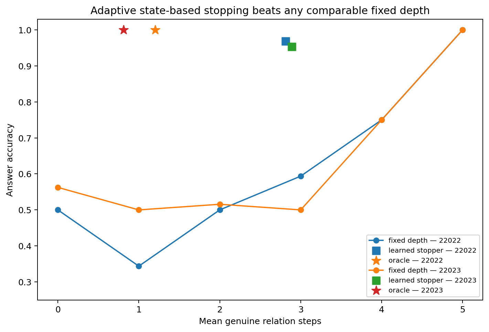

Figure 44.3 STOPPING-GEOMETRY-029: adaptive state stopping extends the accuracy–compute tradeoff beyond fixed-depth policies, with further opportunity indicated by oracle stopping.

### 44.6 Readiness depends on predictive state beyond scalar confidence

| seed | Scalar policy | accuracy | mean k | saving |
| --- | --- | --- | --- | --- |
| 22022 | confidence | 98.44% | 4.922 | 1.56% |
| 22022 | abs_margin | 98.44% | 4.922 | 1.56% |
| 22022 | radius_abs | 100.00% | 5.000 | 0.00% |
| 22023 | confidence | 96.88% | 4.453 | 10.94% |
| 22023 | abs_margin | 96.88% | 4.453 | 10.94% |
| 22023 | radius_abs | 100.00% | 4.609 | 7.81% |

For seed22022, a conservative confidence/|margin| threshold reaches 98.44% accuracy at mean 4.92/5 steps, saving 1.56%. A boundary-radius rule preserving 100% uses all steps. Scalar policies are also weaker for seed22023. Confident current errors can be corrected by later relational state transitions.

### 44.7 Operational overthinking and the interface with 023 and 024

CoT required: h_0(q) not in S*, but learned thought trajectory reaches S* at acceptable cost.
Overthinking event: h_k in S* and h_(k+1) not in S*.

In these controlled cases, overthinking means continuing after entry into an acceptable stopping region and thereby leaving it. Disconnected readiness sets show this as a recurring feature of the measured nonlinear dynamics.

A prospective stopper estimates L_stop and continuation value on the future-equivalence/predictive-state quotient. Experiments 023–024 locate future-distinguishing, causally transportable state; 029 asks whether to stop there. Reasoning loci thus provide candidate state variables for adaptive-compute controllers.

### 44.8 Raw data models and figures

STOPPING_GEOMETRY_022/STOPPING_GEOMETRY_022.md

STOPPING_GEOMETRY_022/two_seed_stopping_summary.csv

STOPPING_GEOMETRY_022/per_problem_readiness_sets.csv

STOPPING_GEOMETRY_022/state_geometry_stopper_choices.csv

STOPPING_GEOMETRY_022/policy_accuracy_compute_frontier.csv

STOPPING_GEOMETRY_022/fixed_depth_accuracy.csv

STOPPING_GEOMETRY_022/scalar_stopping_baselines.csv

STOPPING_GEOMETRY_022/seed22022_state_observables.csv

STOPPING_GEOMETRY_022/seed22023_state_observables.csv

STOPPING_GEOMETRY_022/seed22022_exact_model.pt

STOPPING_GEOMETRY_022/seed22023_exact_model.pt

STOPPING_GEOMETRY_022/summary.json

## 45 Integrated v1.8 discussion CoT control trajectories and stopping geometry

### 45.1 Rejoining the two research branches

The v1.7 branch constructs commitments, reentry and branch/compare/correct, then locates functional reasoning through probes, tomography and transplants. Experiments 025–029 calibrate generator assays and dissect Direct/Blank/CoT, budgets and stopping. Together they separate two levels of the problem:

What is the functional reasoning state?  -> future-equivalence / causal predictive state
What should the system do with it now?       -> act / continue / answer / stop

The first identifies thinking states and their locations; the second evaluates additional thinking and when it is sufficient.

### 45.2 Shared methodological principles of closure and functional state assays

COT-CLOSURE-026 establishes exact token-conditioned microscopic recurrence. NATURAL-REASONING-FINDER-024 shows fully decodable comparison labels with weak functional separation. Together they define reasoning structure relative to functional quotients validated by future control and causal use.

Shared methodological criterion

The target is a predictive-state quotient sufficient for future behavior, verified through standardized continuations, perturbation/transplantation and operator causality. This combines representational compression with functional validation.

### 45.3 Direct Blank and CoT as distinct mechanisms

Direct compresses questions into answer-ready states; Blank provides independent transition depth; relational CoT reinjects intermediate results as discrete actions, stabilizing reusable variables and reconfiguring later control. CoT benefits therefore depend jointly on transition count and driving action identity.

Experiment 027 gives 100% linearly decodable answer information with 50% immediate-gate accuracy. This is the readiness counterpart of 024's distinction between decodable features and functional states.

### 45.4 Per question geometry specifies CoT requirements

Need-CoT(q,theta,pi) = [ prompt state h_0(q) is outside acceptable stopping region S* ]
                        AND [ learned thought policy pi has a viable trajectory into S* ]

Experiment 028 gives k_min=0/2/3 at the same formal depth and 50–100% accuracy for different three-step actions. In 029's 64 formal five-step tasks, only 2/64 questions in the first model require all five steps; oracle means are 1.20 and 0.81 for the two models. Task-level length labels summarize heterogeneous stopping geometry.

### 45.5 Admissible CoT sets with multiple components

Experiment 028 finds correct→incorrect→correct blank trajectories; 029 finds disconnected genuine-relation readiness sets in 39/64 and 43/64 questions. The natural object is S* and the repeated intersections of a thought trajectory with it.

A(q) = { k : h_k(q) in S* }
A(q) may be disconnected.
Length k is only the one-dimensional projection of an action-conditioned state trajectory.

Operationally, overthinking occurs when a further action carries state out of S* after entry, giving continuation negative state-transition value under the specified stopping criterion.

### 45.6 Updated dynamic slice interpretation

Reasoning Locus/Finder tracks predictive states causally relevant to future branches. Experiment 027 shows how Direct/Blank/CoT move them; 028 measures finite control work; 029 measures entry into answer-readable regions and the effects of continued movement. CoT becomes a selectable, interruptible control trajectory with possible reentry.

### 45.7 Integrated mathematical picture

training / trace geometry
    -> language control algebra
    -> predictive-state quotient [h]_future
    -> state-dependent operator trajectory a_t, T_(a_t)
    -> branch / compare / correction / relation re-injection
    -> answer-readiness / stopping set S*
    -> answer or continued thought

Visible CoT is a discrete, observable, reinjectable interface for controlling predictive state. Direct paths, blank depth and relational working memory provide different routes through that state space. Continued generation is a stopping decision on predictive state.

### 45.8 Scope of current evidence

Experiments COT-DIAGNOSTIC-025 through STOPPING-GEOMETRY-029 establish controlled assays for token-conditioned recurrence, relation reinjection, question-specific finite work and disconnected readiness. Two qualified models achieve 96.875% and 95.3125% binary answer accuracy using 43.75% and 42.1875% fewer relation steps than a five-step policy. These are relation-step measurements. Chapters 48–49 supply the subsequent replication, fixed-baseline comparisons and service timing; chapter 50 gives the current integrated interpretation.

### 45.9 Version update v1.8

2026-09-26: rejoined the parallel CoT-mechanics branch from LANG-019/Language Control Algebra v0.1. Added COT-DIAGNOSTIC-025, COT-CLOSURE-026, DIRECT-COT-STATE-027, COT-BUDGET-GEOMETRY-028 and STOPPING-GEOMETRY-029, preserving aliases 018–022. Added generator calibration, microscopic closure, Direct/Blank/CoT decomposition, per-question finite work/disconnected admissible sets and optimal stopping, integrated with Reasoning Locus/Finder.

## 46 MODEL SCALE CORRIDOR 025 Model size training coverage and predictive state geometry

### 46.1 What additional capacity changes

The teacher-dimension, control-flow and reasoning-locus experiments distinguish a high-dimensional substrate from concentrated effective control. This experiment tests how capacity changes the arrangement of predictive states within a fixed training world. The working hypothesis is that additional capacity provides room to separate states associated with different future answers.

The central question is how model size and unique training coverage relate to answer accuracy, predictive-state separation and the spectrum of local answer control.

### 46.2 The common 400 case reasoning universe

We reuse the finite relational world of REASONING-LOCATOR-023 and the fixed visible sequence THINK → CHECK → FINAL. The vocabulary, relation operators and final-answer objective are shared. Hidden width and unique training coverage are the manipulated factors. The code uses one optimizer configuration and one early-stopping rule; realized training lengths range from 71 to 900 updates.

| Factor | Levels or definition |
| --- | --- |
| hidden width | 8 / 16 / 32 / 64 / 128 |
| Parameter count | Approximately 1.7k / 4.1k / 12.4k / 42.8k / 158.9k |
| unique coverage | 25% / 50% / 100% |
| Coverage subsets | Nested and balanced; every goal × start × main-operation combination is represented, with increasing coverage of the counterfactual relation |
| Initialization | Two shared seeds, 2501 and 2502 |
| Measurement point | After CHECK; retain the complete recurrent state and continue with the same FINAL suffix |

Coverage supplies 100, 200 or 400 distinct training cases. Width changes the capacity of the two-layer GRU. Full-world accuracy scores all 400 cases, including the training cases at partial coverage. Covariance and PCA are descriptive measurements of this same fixed 400-case universe.

### 46.3 From raw hidden distances to covariance normalized geometry

The initial measurement perturbed the CHECK state along a steepest answer-margin descent direction and measured the per-coordinate RMS distance to an answer flip. Those raw distances varied substantially with width and seed.

The earlier coordinate controls motivate a model-relative scale. Raw Euclidean distance is preserved by orthogonal rotations, but changes under rescaling and general invertible recoding. We retain the initial measurements as the development record and use covariance normalization for the main analysis.

The revised measurement asks how large a state displacement is relative to the model's natural state variation. It separately measures local margin sensitivity and separation between different-answer states.

### 46.4 Two distinct geometric measurements

For each model, let C be the covariance of stopped hidden states over the 400-case universe. Let m(h) be the correct-answer margin over the strongest competing answer and g(h) its gradient with respect to the stopped state. The first-order covariance-normalized margin radius is:

r_geo(h) = answer_margin(h) / sqrt( g(h)^T C g(h) )

This ratio measures local margin size in units of covariance-weighted sensitivity. It is a tangent approximation to boundary distance. With consistently transformed C and g, the ideal ratio is invariant to invertible linear recoding; the implementation adds a small numerical stabilizer.

For the second measurement, PCA retains modes explaining 99% of hidden-state variance and whitens their scores. We calculate each state's RMS distance to the nearest state with a different ground-truth final answer, then report the median over states whose answer is correct. The retained-mode count supplies the RMS normalization. This is a specified measure of different-answer separation; sensitivity of the truncated pipeline to arbitrary affine recoding is recorded as a validation target.

### 46.5 Larger models separate different answer states more strongly

| coverage | width | params | accuracy | state separation | state d95 | control rank | local width |
| --- | --- | --- | --- | --- | --- | --- | --- |
| 25% | 8 | 1,706 | 0.690 | 0.241 | 6.0 | 1.57 | 1.30 |
| 25% | 16 | 4,122 | 0.697 | 0.547 | 10.5 | 1.70 | 1.12 |
| 25% | 32 | 12,410 | 0.727 | 0.661 | 10.5 | 1.83 | 1.43 |
| 25% | 64 | 42,810 | 0.707 | 0.847 | 16.0 | 1.59 | 1.33 |
| 25% | 128 | 158,906 | 0.718 | 0.970 | 24.5 | 1.93 | 1.30 |
| 50% | 8 | 1,706 | 0.716 | 0.247 | 6.0 | 1.57 | 1.14 |
| 50% | 16 | 4,122 | 0.814 | 0.636 | 9.0 | 1.69 | 1.93 |
| 50% | 32 | 12,410 | 0.835 | 0.767 | 12.0 | 2.05 | 1.73 |
| 50% | 64 | 42,810 | 0.850 | 0.977 | 16.0 | 2.03 | 1.61 |
| 50% | 128 | 158,906 | 0.852 | 1.083 | 29.5 | 2.26 | 1.33 |
| 100% | 8 | 1,706 | 0.989 | 0.845 | 6.5 | 1.82 | 1.11 |
| 100% | 16 | 4,122 | 1.000 | 0.922 | 8.0 | 2.19 | 1.31 |
| 100% | 32 | 12,410 | 1.000 | 1.012 | 15.0 | 2.17 | 1.63 |
| 100% | 64 | 42,810 | 1.000 | 1.064 | 13.5 | 2.09 | 1.66 |
| 100% | 128 | 158,906 | 1.000 | 1.102 | 25.5 | 2.15 | 1.28 |

Recalculation from the 30-model CSV gives within-coverage Spearman correlations between width and whitened separation of 0.9847, 0.9847 and 0.9601 for 25%, 50% and 100% coverage. From width 8 to 128, the two-seed mean separation rises from 0.241 to 0.970, from 0.247 to 1.083, and from 0.845 to 1.102, respectively.

Figure 46.1 MODEL-SCALE-CORRIDOR-025: different-answer state separation increases with model width in all three coverage conditions.

Figure 46.2 MODEL-SCALE-CORRIDOR-025: measured state separation and full-world answer accuracy.

### 46.6 Representation expands and local control stays concentrated

The number of state-covariance modes carrying 95% of variance increases with model size: the pooled Spearman correlation between parameter count and state d95 is 0.9476. Within coverage conditions, the corresponding correlations are approximately 0.89–0.96. This d95 describes variance in the learned hidden coordinates.

The covariance-weighted answer-gradient stable rank ranges from 1.4339 to 2.6936 across all 30 models. Additional capacity therefore accompanies richer measured state geometry and a local control spectrum concentrated in a few dominant modes. Stable rank describes energy concentration; integer control dimension is reported separately through the spectrum.

Figure 46.3 MODEL-SCALE-CORRIDOR-025: hidden-state d95 across model widths.

Figure 46.4 MODEL-SCALE-CORRIDOR-025: concentrated covariance-weighted control spectra across model widths.

Geometric Unpacking v0.1. Under this common task and training protocol, increased capacity has a clear geometric signature: greater separation between different-answer states together with concentrated local answer control.

### 46.7 Training coverage and capacity make different contributions

Across the 30 model conditions, training coverage and full-world accuracy have Spearman correlation 0.9089. The association between capacity and accuracy depends on coverage.

At 25% coverage, width 8→128 increases separation from 0.241 to 0.970 and accuracy from 0.6900 to 0.7175. Representational separation and correctness on the whole task are empirically distinct quantities.

At 50% coverage, width 8→128 increases accuracy from 0.71625 to 0.85250. Additional capacity accompanies a stronger mapping from the supplied training constraints to full-world answers.

At 100% coverage, width 8 achieves mean accuracy 0.98875, and widths 16–128 achieve 1.000. Hidden geometry continues to change after endpoint accuracy saturates.

Figure 46.5 MODEL-SCALE-CORRIDOR-025: full-world accuracy by training coverage and model width.

A descriptive regression on these 30 rows gives R²=0.9487 for coverage plus log2(width), increasing to 0.9620 after adding separation. The log2(width) coefficient changes from +0.01321 to −0.00671. This fitted association motivates a geometric-mediation hypothesis. The design has two shared seeds per condition and variable realized update counts under a common stopping rule.

### 46.8 Local boundary sensitivity and inter-route separation

The road-width intuition contains two measurable objects:

Local margin radius: r_geo measures covariance-normalized first-order answer-margin sensitivity. Its values vary with width and seed and show a nonmonotonic pattern across the tested widths.

Inter-route separation: the truncated-whitened RMS distance between states with different final answers increases consistently with width under the recorded protocol.

The measured result is that larger models place different-answer states farther apart in the selected normalized geometry. Reduced functional interference is a mechanistic interpretation of this separation. Direct perturbation tests of interference and transitions between future trajectories are the corresponding confirmation target.

Figure 46.6 MODEL-SCALE-CORRIDOR-025: the local normalized margin radius and global different-answer separation show distinct scaling patterns. The radius is a first-order estimate.

### 46.9 Connection to learning history and earlier experiments

teacher / dataset constraints × architecture capacity × optimization history

-> predictive-state geometry -> low-dimensional local control -> answer

Teacher-dimension experiments separate task-supplied variation from architectural capacity. History interventions show that the ordered learning process changes continuous response fields. State localization measures answer-related dynamics at specific layers and times. The scale experiment adds a direct measurement of how capacity arranges those states.

Training data supplies constraints on predictive distinctions and answer mappings.

Model capacity provides the representational space in which those distinctions are embedded and separated.

Optimization and training history select the realized margins, curvature and response geometry within that space.

During generation, the local control spectrum can remain concentrated in a few dominant modes.

### 46.10 Current result and mechanistic interpretation

In the tested two-layer GRU family, increased width consistently increases measured different-answer separation and is strongly associated with higher hidden-state d95. Local covariance-weighted answer control retains a concentrated spectrum. Training coverage has the strongest reported association with full-world accuracy.

These observations support a concrete engineering hypothesis: representational separation can provide room for reliable task trajectories as the training trace supplies the relevant answer constraints. Threshold-like stabilization of an existing computation is a proposed explanation of apparent emergence, with its status recorded as a working hypothesis.

### 46.11 Original data scripts and figures

MODEL-SCALE-CORRIDOR-025.md

MODEL-SCALE-CORRIDOR-025_fast.py

MODEL-SCALE-CORRIDOR-025_geometry.py

MODEL-SCALE-CORRIDOR-025_models.csv

MODEL-SCALE-CORRIDOR-025_aggregate.csv

MODEL-SCALE-CORRIDOR-025_geo_models.csv

MODEL-SCALE-CORRIDOR-025_geo_aggregate.csv

MODEL-SCALE-CORRIDOR-025_spearman.csv

MODEL-SCALE-CORRIDOR-025_accuracy.png

MODEL-SCALE-CORRIDOR-025_spreading.png

MODEL-SCALE-CORRIDOR-025_state_d95.png

MODEL-SCALE-CORRIDOR-025_control_rank.png

MODEL-SCALE-CORRIDOR-025_local_width.png

MODEL-SCALE-CORRIDOR-025_spreading_vs_accuracy.png

MODEL-SCALE-CORRIDOR-025_bundle.zip

## 47 Integrated scale discussion Capacity and predictive terrain

### 47.1 A measurable account of additional capacity

training world / trace -> required predictive distinctions

-> capacity-dependent geometric unfolding -> route separation / reduced aliasing

-> state-dependent low-dimensional control -> answer

The scale experiment directly separates parameter count, hidden-state variance dimension, different-answer separation and local answer-control concentration. A large state representation can support a small number of dominant local response directions. These are compatible properties measured on the same trained models.

### 47.2 Coverage and model size as distinct experimental factors

At 25% coverage, expanded separation coexists with approximately 72% full-world accuracy at width 128. At full coverage, widths 16–128 all reach 100%. The supported picture is that data constrains the required mappings and capacity changes how those mappings are represented. The full-world score contains both seen and unseen cases at partial coverage.

### 47.3 Engineering measurements for subsequent systems

The resulting measurement set comprises different-answer separation, covariance-normalized local margin radius and the control spectrum. Together they describe spacing among answer classes, local sensitivity and concentration of causal response. Larger pretrained systems provide a future application domain for this protocol.

### Version update Model scale branch of v1.8

26 September 2026: MODEL-SCALE-CORRIDOR-025 adds 5 hidden widths × 3 coverage levels × 2 seeds. The record preserves the initial raw-radius analysis, the covariance-normalized revision, all 30-model tables and six figures. Original scale-branch sections 39–40 are integrated here as sections 46–47 so that the parallel CoT and stopping record retains sections 39–45.

## 48 Cross architecture replication of relational trajectories and stopping

Research ID: ML-EPIDEMIOLOGY-XARCH-20260926-001. This campaign supplies a conceptual replication across GRU, causal Transformer and Mamba models. Its completed report is included in evidence/replications/xarch/REPORT_ORIGINAL.md. The present synthesis uses the full nine-model denominator and preserves the distinction between task learning, requested answer readout and stopping cost.

### 48.1 Common task training and evaluation

The campaign trained three initializations of each architecture, seeds 2601, 2602 and 2603. Each two-layer model had hidden width 48 and received 900 AdamW updates on the same 48 sequences: all 16 four-bit questions in Direct, Blank and relational-CoT modes. Parameter counts were 29,291 for GRU, 40,523 for Transformer and 35,424 for Mamba. Each sequence contributed an equal-weight mean over its generated tokens. These are nine independent training runs; the 144 model–question observations are repeated measurements within those runs.

Direct emits the answer, Blank emits three X tokens before the answer, and CoT emits three relation values followed by the answer. The third relation value already equals the answer. All questions appeared in model training. An eight-fold question-grouped evaluation holds stopping labels out from the ridge stopping rule, using a fixed threshold of 0.8. The original stopping study used six-bit questions and up to five relation steps, so the two protocols provide complementary conceptual tests.

### 48.2 Complete nine model results

All nine models learned the full relational chain and the Direct answer. Eight learned the Blank sequence perfectly. A disconnected readiness set means that at least one question has a correct requested answer, then an incorrect answer, then a correct answer again along the measured relation path. Seven of nine models exhibit this phenomenon, with examples in all three architectures.

| Architecture and seed | Direct correct | Blank correct | Full CoT correct | Disconnected questions of 16 | Stop answer accuracy | Mean relation steps | Savings versus 3 steps |
| --- | --- | --- | --- | --- | --- | --- | --- |
| GRU 2601 | 100% | 100% | 100% | 4 | 100% | 0.7500 | 75.00% |
| GRU 2602 | 100% | 100% | 100% | 0 | 100% | 0.5000 | 83.33% |
| GRU 2603 | 100% | 100% | 100% | 0 | 100% | 1.7500 | 41.67% |
| Transformer 2601 | 100% | 100% | 100% | 3 | 62.50% | 1.5625 | 47.92% |
| Transformer 2602 | 100% | 62.50% | 100% | 3 | 81.25% | 2.0625 | 31.25% |
| Transformer 2603 | 100% | 100% | 100% | 6 | 100% | 1.3125 | 56.25% |
| Mamba 2601 | 100% | 100% | 100% | 8 | 100% | 0.5000 | 83.33% |
| Mamba 2602 | 100% | 100% | 100% | 9 | 81.25% | 1.1875 | 60.42% |
| Mamba 2603 | 100% | 100% | 100% | 5 | 87.50% | 1.6875 | 43.75% |

[REPRODUCED] Path-dependent, nonmonotonic requested-answer readiness occurs across these three architectures. The observation is tied to the recorded question, prefix, answer request and output rule. Direct performance establishes a strong reference: each trained model also implements a correct immediate-answer route on this task.

### 48.3 Fixed depth and native vocabulary readout

The stopping metric compares the two answer tokens after inserting ANSWER following a self-generated relation prefix. The following fixed-depth results use exactly that same scoring rule. The last column uses the saved unrestricted prediction at the chosen stopping point.

| Architecture and seed | k 0 | k 1 | k 2 | k 3 | Native token accuracy at chosen stop |
| --- | --- | --- | --- | --- | --- |
| GRU 2601 | 75% | 50% | 50% | 100% | 100% |
| GRU 2602 | 75% | 75% | 100% | 100% | 100% |
| GRU 2603 | 50% | 50% | 50% | 100% | 93.75% |
| Transformer 2601 | 50% | 62.5% | 81.25% | 100% | 50% |
| Transformer 2602 | 68.75% | 50% | 50% | 100% | 81.25% |
| Transformer 2603 | 75% | 56.25% | 68.75% | 100% | 100% |
| Mamba 2601 | 100% | 75% | 62.5% | 100% | 93.75% |
| Mamba 2602 | 81.25% | 50% | 50% | 100% | 81.25% |
| Mamba 2603 | 50% | 56.25% | 87.5% | 100% | 87.5% |

[CONDITIONAL] Five stopping rules preserve perfect binary answer accuracy. Four also use fewer relation steps than every perfect fixed-depth policy for that model. Mamba 2601 is already perfect at fixed zero steps. Transformer 2601 reaches the same 62.5% with one fixed step, compared with 1.5625 selected steps; Mamba 2602 reaches the same 81.25% at zero steps. GRU 2602's reduction is 75% relative to its strongest perfect fixed baseline of two steps. Three of the five binary-perfect stoppers also remain perfect under unrestricted token output. These paired comparisons define the practical interpretation of the savings column.

### 48.4 Content interventions affect successor answers

For each of the 16 questions, the experiment flips one relation bit in an otherwise fixed three-relation prefix. The no-op control has maximum logit difference zero. Counts below measure resulting answer flips.

| Architecture and seed | Flip r1 | Flip r2 | Flip r3 |
| --- | --- | --- | --- |
| GRU 2601 | 7/16 | 12/16 | 4/16 |
| GRU 2602 | 8/16 | 8/16 | 8/16 |
| GRU 2603 | 4/16 | 4/16 | 12/16 |
| Transformer 2601 | 0/16 | 0/16 | 16/16 |
| Transformer 2602 | 0/16 | 0/16 | 16/16 |
| Transformer 2603 | 0/16 | 0/16 | 15/16 |
| Mamba 2601 | 1/16 | 0/16 | 14/16 |
| Mamba 2602 | 0/16 | 0/16 | 12/16 |
| Mamba 2603 | 5/16 | 5/16 | 12/16 |

[REPRODUCED] Relation-token content has a causal effect on subsequent output under these interventions. Transformer responses concentrate on r3, the answer-bearing token. Holding later relations fixed isolates the selected input intervention and constrains mediation through subsequent tokens. Coherent counterfactual trajectories, matched controls and selective restoration provide the next level of algorithm-specific evidence.

### 48.5 Pretrained model measurements and task screening

The campaign also loaded official Pythia-70M and Mamba-130M weights, with actual parameter counts 70,426,624 and 129,135,360. On 12 fixed English texts, both completed forward passes, greedy eight-token continuation, input-embedding gradients and central-difference checks. Input-ID versus original-embedding no-op errors were zero; all gradients were finite. Maximum relative differences between automatic gradients and central differences at epsilon 0.01 were 1.141% and 0.526%.

A subsequent exploratory task screen froze four demonstrations and its criteria before inspecting task outputs, then scored the other 12 questions.

| Model | Direct native answer | Blank native answer | Self-generated complete relation chain and answer | Native answer after correct relations |
| --- | --- | --- | --- | --- |
| Pythia-70M | 5/12 | 6/12 | 0/12 | 9/12 |
| Mamba-130M | 5/12 | 5/12 | 1/12 | 7/12 |

The demonstrated result is measurement compatibility on the installed pretrained models. These task scores define their screening status under the frozen prompt. The supplied report preserves every raw continuation reference and the distinction between a correct final symbol and a correct relation chain.

### 48.6 Execution record and evidence identity

All 8,100 scheduled updates completed in a batch of approximately 383 seconds. Each final checkpoint includes weights, optimizer state, random states, step count and reference logits. The original JSON export encountered a NumPy int64 serialization error after checkpoint saving. Recovery loaded the same nine terminal states and reran the unchanged evaluation function with scalar conversion at the JSON boundary. All nine independent restore checks gave maximum logit error zero. The original error records and the recovered results retain separate identities in the campaign report.

The attached report is the source for this replication's numerical tables. Its linked evaluation JSON, protocol, logs and checkpoints are listed individually in REPLICATION_SOURCE_MAP.csv with their current availability. The report documents completed training and evaluation; file-level provenance is recorded separately from the scientific result.

## 49 Controlled validation across neural statistical and mathematical systems

Research ID: ML-EPIDEMIOLOGY-VALIDATION-20260926-002. The completed second campaign constructs matched validation conditions for the main claims, including three miniature architectures, four textual sources, finite-state constructions and measured stopping costs. The source is evidence/replications/validation/REPORT_ORIGINAL.md; CLAIM_COVERAGE_ORIGINAL.md maps the historical chapters to V00–V14. The completed supplementary report takes chronological precedence over the earlier review snapshot.

### 49.1 Learning history changes continuous response fields

V04 branches from nine parent micro-models using identical data, learning rate and update count, with AB versus BA training order. It covers 27 pairs and 54 branches. Fifty branches completed; four produced nonfinite loss from the same previously unqualified Transformer parent at larger learning rates. Twenty-three pairs preserve correct complete endpoints in all three task modes. At the prespecified learning rate 3, parameter and output changes exceed the chosen tolerance in 3/3 GRUs, 2/3 Transformers and 3/3 Mambas. A follow-up audit of 128 common successor programs gives identical native discrete predictions in all 23 qualified pairs.

[REPRODUCED] Learning order changes continuous response fields and confidence under matched starting state, examples and budget. The follow-up separates this measurable effect from discrete prediction changes on the chosen program set.

V12 holds weights fixed and edits the actual Adam first or second moments before one common training update. All pre-intervention weights and outputs coincide. Zeroing first moments changes the subsequent answer margin in 9/9 models; 8/9 retain full-task correctness, with the remaining parent already unqualified. Nine restoration controls recover parameters and outputs exactly. Zeroing second moments produces large updates and widespread damage, identifying the role of adaptive preconditioning. The demonstrated state dependence concerns the next learning step.

### 49.2 Control energy concentration and finite interventions

V08 measures nine 64 × 48 input-control Jacobians in the same 64 successor-observation coordinates. All have concentrated spectra: 3–6 modes account for 95% of energy, and the first three carry approximately 83–97%. The first linear input map has full column rank in all nine models. Weak local directions still affect output under finite interventions, with particularly visible nonlinear departures in Mamba.

An explicit rank-three linear-bottleneck control keeps output change within approximately 3 × 10^−15 at intervention amplitude 10. This calibration distinguishes exact linear silence in the constructed bottleneck from low local sensitivity in the neural measurements.

V06 aligns seeds through answer-response fields for common questions and successor programs. Principal-direction angles are approximately 6.5–8.8° for Transformer, 41–65° for GRU and 19–37° for Mamba, with corresponding energy spectra recorded. An invertible orthogonal change of hidden basis alone produces raw angles of 61–85°; inverse transformation restores the slice to machine precision. Functional alignment supplies the appropriate common coordinates for cross-seed interpretation.

[REPRODUCED] A few modes carry much of the measured control energy across three architectures. Exact rank, 95%-energy dimension, stable rank and finite-amplitude sensitivity are distinct readouts.

### 49.3 Feedback resolution transfers teacher geometry across architectures

V09 trains 81 students: three known teacher ranks, three world seeds, three student architectures and three feedback channels. Each run uses 800 updates, matched training counts and paired initialization. A common binary cross-entropy objective and matched initial full-training-set gradient norms at zero logits reduce initial loss-scale differences.

| Architecture | Feedback | Mean test bit accuracy | Jacobian energy in teacher subspace | Models reaching 95% accuracy |
| --- | --- | --- | --- | --- |
| GRU | Hard labels | 90.95% | 83.55% | 1/9 |
| GRU | Two confidence bins | 95.18% | 95.00% | 6/9 |
| GRU | Continuous probability | 98.74% | 99.70% | 9/9 |
| Transformer | Hard labels | 92.63% | 87.54% | 0/9 |
| Transformer | Two confidence bins | 93.32% | 89.69% | 1/9 |
| Transformer | Continuous probability | 98.68% | 99.12% | 9/9 |
| Mamba | Hard labels | 88.87% | 82.62% | 0/9 |
| Mamba | Two confidence bins | 90.98% | 74.92% | 0/9 |
| Mamba | Continuous probability | 98.93% | 99.64% | 9/9 |

[REPRODUCED] Continuous probability feedback improves accuracy in 27/27 paired comparisons and recovers the teacher's rank as Jacobian r95 in 27/27 models, for the tested ranks 2, 4 and 6. Two-bin feedback increases teacher-subspace energy in 17/27 comparisons, showing an architecture-dependent response.

For each of nine worlds, a full-rank-eight perturbation teacher reproduces the same hard labels and two-bin confidence values on all 512 training examples. Continuous logits allow linear recovery of the original teacher. This constructive witness establishes that those finite discrete traces admit multiple exact teacher ranks. Effective-dimension estimates retain their separate statistical interpretation.

### 49.4 Function level structure is reproduced on independent text segments

V03 uses the original technical corpus and three further works: Alice's Adventures in Wonderland, The Adventures of Sherlock Holmes and On the Origin of Species. Continuous segments define train, development and test sets. Counts, state representation, PCA and operators are fitted using training segments. Contexts stay within segment boundaries. A separate analysis holds out an entire work.

[REPRODUCED] State-dependent update functions lower test distribution MSE on all four sources. They also improve observed character log-score within each of the three additional works. This is direct evidence that useful function-level structure can be reconstructed through a statistical representation independently of the original neural implementation.

| Source | Test segments | Log-score gain over reset | Conditional segment bootstrap 95% interval |
| --- | --- | --- | --- |
| Alice | 2 | +0.0381 | [+0.0362, +0.0401] |
| Sherlock Holmes | 8 | +0.0487 | [+0.0416, +0.0539] |
| Darwin | 8 | +0.0174 | [+0.0032, +0.0306] |
| Original technical corpus | 7 | −0.0299 | [−0.0501, −0.0086] |

The intervals condition on the fitted model and correlated segments within a work. The original technical corpus's character log-score decreases despite its MSE improvement. In the leave-one-work-out evaluation, all four log-score gains are negative. The demonstrated predictive advantage is therefore within-source and metric-specific.

Bigram fields have stable ranks approximately 2.27–2.53 and r95 of 8–11. IID residual absolute energy is approximately 0.14–0.36% of the real-corpus energy. Word-order shuffling largely retains bigram energy and operator prediction performance, tying this assay primarily to local statistical transitions.

Directly fitted two-token operators outperform products of separately fitted one-token operators on every source, with matched test denominators:

| Source in report order | Direct two-token MSE | Composed one-token MSE |
| --- | --- | --- |
| Alice | 0.1260 | 0.1411 |
| Sherlock Holmes | 0.1065 | 0.1196 |
| Darwin | 0.1435 | 0.1672 |
| Technical corpus | 0.1630 | 0.1909 |

The ten-dimensional affine operators generate an unrestricted linear algebraic envelope of dimension 111, saturating the available affine envelope. Two-token residuals relative to this envelope are at numerical precision. A comparison with a grammar-, length- or path-constrained composition set is a distinct operator test. The current results establish useful fitted updates and directly measured composition error.

### 49.5 Training material changes the learned predictive function

V14 starts with three architectures and three parent seeds trained on technical corpus A. Each parent continues either on A or for the same number of updates on Alice corpus B, inheriting identical parameters and Adam state. The campaign records 10,800 updates across the parent and successor stages.

In 9/9 paired comparisons, switching to B lowers held-out B-text NLL and raises held-out A-text NLL. Probability fields differ on all nine comparisons over 64 common prompts. B-text NLL after switching is approximately 1.90–1.93 for GRU, 2.07–2.11 for Transformer and 1.80–1.84 for Mamba; continuing A gives approximately 2.68–2.69, 2.68–2.75 and 2.75–2.80.

[REPRODUCED] With equal additional training and a common parent state, changing the material changes the predictive function across all three architectures. These nine model pairs test two specified textual sources.

### 49.6 Exact state counts and constructive mathematics

The original 021 system has 275 legal states and 11 actions. Refining future-response partitions gives the following exact sequence, independently recalculated for this release from the archived transition definitions:

| Maximum future program length | 0 | 1 | 2 | 3 | 4 | 5 | 6 |
| --- | --- | --- | --- | --- | --- | --- | --- |
| Distinguishable classes | 5 | 65 | 105 | 173 | 258 | 275 | 275 |

[CONFIRMED] The original 173-class count is exact for the horizon through three steps. The stable full-future partition contains 275 classes, giving a minimum of 275 distinguishable persistent states, or nine bits under fixed-length binary encoding. Relative to the 25 visible goal–main states, the class-count ratio is 11 and log2(11)=3.459. This is a count-based capacity comparison.

A four-step distinguishing witness uses states (1,0,5,3) and (1,0,2,3). All programs of length at most three give equal outputs; R+1 → R+2 → COMPARE → CORRECT gives final outputs 2 and 1. Chapter 34 and its state-count figure now use the corrected horizon labels.

V10 compiles the same finite system into a ReLU transition implementation with one persistent scalar. All 3,025 single-step transitions and 275 readouts have zero error, as do 1,000 programs of length 32. Exhaustive transitions and closure of the legal integer states support induction over any finite program. The compiler uses 273 ReLU nodes and 3,300 fixed coefficients. Information capacity and the number of Euclidean state coordinates are thereby separated explicitly.

V02 constructs a four-state process in which two states share a next-token distribution and diverge after receiving the same token. V02b augments the representation with two-token future signatures, distinguishes all four states, fits the update maps and passes exhaustive tests through six steps. This supplies an executable sufficient-state construction.

V11 checks 20 numerical worlds. The exact quadratic-loss SGD order identity has error at most 5.36 × 10^−16; smooth nonlinear second-order approximations have a remainder declining approximately cubically with step size; readout path-integral identities have error at most 2.71 × 10^−16. These calculations validate the specified differential and integral relations.

### 49.7 Calibration separates readable information from causal use

V02 creates, in 20 orthogonal coordinate systems, worlds where a comparison bit is readable and used and worlds where the same bit is readable and stored. Probes decode the bit in both. Targeted intervention changes the designated readout only in the used-bit world; the independent readout control is preserved. Known closure worlds and worlds with a specified external generator also pass residual, removal and restoration checks.

These are 40 comparison worlds and 40 closure worlds with known structure. Their role is instrument calibration for causal interpretation. V07 completed the instrument precheck; the completed report records its official-model scientific surgery at the qualification stage.

### 49.8 Task adaptation and complete qualification denominators

V01 adapts the full official Pythia-70M and Mamba-130M backbones with trainable low-rank parameters and a shared eleven-symbol task interface. Three initializations per backbone complete 3,000 updates each, totalling 18,000 updates. Six restored final adapters match reference logits exactly. The split contains 176 training, 80 development and 336 sealed test questions. Relation traces exclude the final answer and support normal ANSWER requests at different budgets.

The prespecified development gate requires at least 95% complete-chain correctness and 99% syntax correctness. Complete-chain development scores of the six adapters range from 0% to 3.75%; all six retain their recorded qualification status and the test set stays sealed for them.

V13 trains three miniature architectures from scratch with three seeds each on the same task and split. Nine initial 4,000-update runs are followed by an already-started 6,000-update extension for each model using the original training set. Two of nine final models pass the frozen development gate: GRU 2731 reaches 96.25% complete-chain correctness and 100% syntax, and GRU 2732 reaches 100% on both. The other seven model outcomes remain in the campaign denominator. These qualifications determine entry to the independent test below.

### 49.9 Independent questions and measured stopping costs

The 336 sealed test questions comprise 80 unseen six/eight-bit combinations and 256 unseen ten/twelve-bit lengths. Only the two development-qualified models enter this evaluation; thresholds and model selection remain fixed afterward.

| Test result | GRU 2731 | GRU 2732 |
| --- | --- | --- |
| Six/eight-bit complete CoT accuracy | 96.25% | 100% |
| Six/eight-bit stopped requested-answer accuracy | 98.75% | 100% |
| Six/eight-bit full relation steps → selected steps | 2.80 → 2.4625 | 2.80 → 0 |
| All 336 stopped requested-answer accuracy | 41.96% | 97.02% |
| All 336 development-calibrated fixed-depth accuracy | 69.94% | 97.02% |
| All 336 Direct complete-output accuracy | 100% | 100% |

[REPRODUCED] In GRU 2731, six of the 64 unseen eight-bit questions have disconnected immediate-readiness sets with the answer-bearing final relation removed from the task. This extends the phenomenon to unseen combinations under a task without final-relation answer leakage. Both models' autonomous full CoT syntax fails on the ten/twelve-bit lengths, and their Direct mode scores 100% across all test lengths. These measurements specify the successful routes and the observed extrapolation behavior.

Service timing includes prefix processing, state classification, the answer request and end-token prediction. Thirty-two predetermined test questions are timed in three rotating strategy rounds. The implementation uses CPU full-prefix recomputation. Answers and chosen depths agree with the independent readout table; all timed end-token predictions are correct.

| Model | Full budget | Calibrated fixed depth | State stopping | Measured comparison |
| --- | --- | --- | --- | --- |
| GRU 2731 | 1.248 ms | 1.071 ms | 1.296 ms | State stopping is 3.9% slower than full budget and 21.0% slower than fixed depth |
| GRU 2732 | 1.304 ms | 0.512 ms | 0.542 ms | State stopping is 58.4% faster than full budget and 5.8% slower than fixed zero depth |

[CONDITIONAL] Step reduction, answer accuracy and actual elapsed cost are now measured separately. GRU 2731 improves within-length requested-answer accuracy with fewer relation steps; the timed implementation favors its calibrated fixed policy. GRU 2732 obtains the same answers with its state rule and fixed zero-depth rule, with the fixed rule taking less time. These measurements define the deployment-relevant comparison for this campaign.

### 49.10 Record integrity and source availability

The completed report preserves the full training and qualification counts, the four V04 interrupted branches, the sampler-recovery description and the distinction between independent training and new measurements on existing models. Dedicated sampler state is recorded for the newer V13/V14 states. Its protocols, JSON outputs, logs and checkpoints are catalogued in REPLICATION_SOURCE_MAP.csv. The attached terminal reports and review are included verbatim; their separately referenced raw files retain a report-linked availability status.

## 50 Integrated findings and current evidence status

### 50.1 What the combined experiments establish

The combined record establishes that predictive function is shaped by learning order, optimizer state, feedback resolution and training material within explicitly controlled systems. Replication spans three miniature neural architectures, statistical operator models fitted to four text sources and exact finite-state constructions. Matched interventions strengthen the causal account: changing learning order changes continuous response fields; editing Adam state changes the next learning update; changing training material at matched budget changes held-out predictive behavior.

Function-level structure is the central reusable result. State-dependent updates reconstruct useful successor predictions in statistical coordinates, with lower test distribution MSE on all four sources and improved within-source character prediction in three external texts. The known-state constructions show how future signatures supply a sufficient representation and how that representation supports exact transition realization.

The control findings support a spectrum-based description. Several dominant directions carry much of the local response energy across the tested architectures. Wider GRUs exhibit more separated different-answer states, with width–separation correlations of 0.9601–0.9847 within the three coverage conditions. Their answer-gradient stable ranks span 1.4339–2.6936. Capacity, state arrangement and control concentration are empirically separable properties.

### 50.2 Current claim ledger

CONFIRMED identifies a source-level numerical or exhaustive check included with this release. REPRODUCED identifies the result documented by the completed replication campaigns. CONDITIONAL identifies a measured effect that varies with task, metric, architecture or comparison policy. PROVISIONAL identifies a mechanistic interpretation or extension retained as a testable research claim. File availability is recorded independently in the source map.

| Claim | Current status | Evidence that supports the wording |
| --- | --- | --- |
| Learning order shapes continuous successor responses | REPRODUCED | V04 matched AB/BA branches across GRU, Transformer and Mamba; 23 endpoint-qualified pairs |
| Optimizer state shapes the next learning step | REPRODUCED | V12 first-moment intervention changes margin in 9/9; nine exact restoration controls |
| Control energy is concentrated in a few modes | REPRODUCED | V08 nine common-coordinate Jacobians; r95 3–6 and top-three energy approximately 83–97% |
| Continuous feedback transfers known teacher geometry | REPRODUCED | V09 27/27 paired accuracy improvements and 27/27 teacher-rank recovery |
| State-dependent statistical updates carry predictive structure | REPRODUCED | V03 MSE improvement on four sources; within-source log-score improvement on three external works |
| Training material changes the learned predictive function | REPRODUCED | V14 nine matched parent-state comparisons at equal extra training |
| Requested-answer readiness can be disconnected | REPRODUCED | XARCH 7/9 models across three architectures; V13 six unseen eight-bit cases without final-relation leakage |
| Larger width increases the recorded different-answer separation | CONFIRMED | Thirty-row scale CSV, common task, within-coverage correlations 0.9847, 0.9847 and 0.9601 |
| Three-step and full-future state counts are 173 and 275 | CONFIRMED | Exhaustive partition refinement and a four-step distinguishing witness |
| Historical stopping saves relation steps | CONFIRMED | Original CSV: 43.75% and 42.1875% versus five steps at 96.875% and 95.3125% answer accuracy |
| Learned stopping offers a task-specific tradeoff | CONDITIONAL | Qualification, native-token scoring and calibrated fixed baselines change the result; measured times in 49.9 |
| Two confidence bins recover teacher geometry | CONDITIONAL | V09 teacher-subspace energy improves in 17/27 comparisons |
| Increased separation reduces functional interference | PROVISIONAL | Separation is measured; matched causal interference tests would establish the proposed mechanism |
| Geometric separation explains a threshold in scaling emergence | PROVISIONAL | A proposed consequence of the scale result; threshold-crossing behavior is a separate test |
| Relational residuals identify new generators beyond a complete lower-level closure | PROVISIONAL | Truncated-subspace residuals motivate the hypothesis; V03 unrestricted affine envelope is saturated |
| The framework transfers to natural reasoning in pretrained language models | PROVISIONAL | Official-model measurement interfaces work; task qualification and algorithm-specific interventions define the next evidence level |

### 50.3 A unified engineering interpretation

Training traces constrain predictive distinctions. Capacity changes the space in which the trained model represents them. Learning history selects a realized response field. Input and internal actions move the model through this field, and an answer request reads out the state reached at that point. The experiments measure these links separately and connect them through matched interventions and common functional coordinates.

The scale result makes the racetrack intuition precise: larger tested GRUs provide more measured space between states assigned different answers, and local answer control remains concentrated. The strongest current account combines those measurements with the training constraints and optimization record. The proposed threshold mechanism—an existing computation becoming reliable as conflicting states separate—now has explicit quantities against which it can be tested.

### 50.4 Version history for this integrated edition

Version 1.9, 26 September 2026. Merges the two v1.8 branches, preserves historical sections 0–45, places the scale branch in 46–47, adds the two completed replication campaigns in 48–49 and updates the synthesis in 50. Corrects the full-future state count, distinguishes the two phrase-improvement estimands, specifies relation-step savings, and applies sufficient-state, closure and coordinate-alignment qualifications at the relevant earlier passages. Original reports, figures, data and audit snapshots retain their source identities in the evidence collection.

## Later evidence update — 2 October 2026

**Evidence status: stopping geometry advanced into a hierarchical recovery controller.**

Sections 44–45 established that answer readiness is state dependent, can form disconnected sets and can be lost by continuing after entry into an acceptable region. Later experiments 027A–027E extend this state-space result into an explicit sequential controller.

The current action hierarchy is:

1. stop when the current state is answer-ready;
2. bypass a risky outgoing edge when a safe local alternative is available;
3. use bounded active traversal toward a nearby answer-ready region;
4. reconstruct a compact working state when local traversal is insufficient;
5. use append-only rescue under immediate verification and a fixed attempt cap.

Across 125 canonical correct-to-wrong exits, the minimal routed controller assigns 15 to preventive bypass, 108 to local recovery, 2 to reconstruction and 0 to the final rescue level, with immediate readiness recovery in all 125. The corresponding held-out foundation subset contains 60 events and recovers all 60. Repeated generic rescue is strongly non-monotonic, reinforcing the earlier result that reasoning length is a projection of an action-conditioned state trajectory rather than a monotonic compute variable.

The pretrained-model extension is now also partially measured: later Qwen experiments identify a selective late TEXT/ACT first-action control interface and quantify its susceptibility to downstream counter-intervention. The broader transfer of the complete multi-step controller remains a distinct experimental layer.

This update preserves the numerical stopping results in Sections 44–50 and records their later engineering continuation. See [Evidence Supersession Audit — 2026-10-02](../../EVIDENCE_SUPERSESSION_AUDIT_20261002.md).

