# Genomic Predictive Geometry and Model Capacity

From genomic stress tests to mechanism-aligned omics and a Data Passport across data structures

Data-Oriented Modelling · Chapter 4: Data Zoo · Subreport 04

English publication edition 1.0 · 29 September 2026

## Executive overview

What is being measured? A dataset can vary in many directions while only a few directions help predict a chosen target. This report measures that distinction in real genomic matrices, then asks how many predictive directions remain stable with the available sample. A rank-controlled linear model makes capacity measurable rather than treating parameter count as an abstract proxy.

What do the experiments establish? A dimension-only capacity rule fails under fixed-size controls. Task-conditioned spectra provide a better internal guide, but transfer to another chromosome exposes sample-support effects. Stability measurements help locate near-optimal capacity; very small samples reveal limits of the estimator itself. Later experiments separate reliability ordering from direction counting and test transfer to maize.

Why extend the analysis to omics? The final completed studies compare genome, RNA, and protein geometry and measure an RNA-to-protein operator in matched cells. A common Data Passport records both the geometry within a layer and relationships between layers. The paired whole-genome/transcriptome study is a protocol, with no numerical results in the supplied evidence.

Reader note. The report preserves the original scientific results and distinguishes reported observations from interpretation and protocol-only material. “Mechanism-aligned” describes the task design and biological pairing; the association measurements alone do not establish causal effects. This publication is an evidence review and English edition, not a fresh execution of all experiments.

## Reading guide

EXP001–EXP006 establish the distinction between data geometry and predictive geometry. EXP007–EXP012 test transfer, sample support, and the resolution of stability measurements. EXP013A–EXP013D calibrate the estimator and evaluate cross-species transfer. EXP014A and EXP015A/B extend the interface across data structures and omics layers. EXP014B and EXP015C are explicitly unexecuted designs. The complete experiment map and source identities appear in the appendices.

Table 1. Terms and abbreviations

| Term | Meaning in this report |
| --- | --- |
| SNP; genotype dosage | Single-nucleotide polymorphism; diploid alternate-allele count 0, 1, or 2. |
| n; p; q; N | Number of observations; input variables; target variables; N = p + q in the capacity tasks. |
| Rank; DOF | Number of retained mapping directions; independently variable mapping degrees of freedom, r(p + q − r). |
| PR dimension | Participation-ratio dimension of covariance: (Σλ)² / Σλ², where λ are eigenvalues. |
| TWO-NN | Local intrinsic-dimension estimate based on the first two nearest-neighbour distances. |
| Predictive operator | Observed-to-target cross-covariance matrix for a specified task and preprocessing. |
| r90 | Directions required to account for 90% of the stated spectrum: covariance variance or squared-singular-value energy, as labelled. |
| Effective / entropy rank | A continuous spectral-breadth summary. The report distinguishes covariance PR, predictive participation rank, and entropy/energy summaries. |
| stable50; effective support | Count of directions with estimated reliability ≥ 0.5; sum of continuous direction reliabilities. |
| Near-optimal rank | Smallest tested rank within the stated tolerance, usually 0.005 validation R², of the best score. |
| R²; MAE; CV | Coefficient of determination; mean absolute error; coefficient of variation. Units depend on the quantity measured. |
| LOO / LOOCV | Leave-one-out cross-validation; the held-out unit is specified for each experiment. |
| MAF; LD; cis; trans | Minor allele frequency; linkage disequilibrium; local or same-region relationship; relationship across chromosomes in the registered decomposition. |
| Data Passport | A common record of data geometry, task geometry, sample support, and estimator state. |
| Mechanism-aligned | Variables and pairings follow a specified biological relationship. Cross-covariance and shuffles remain descriptive association measurements; they alone do not identify causal effects. |
| Locked / blind / post hoc | Locked records fix a rule before the relevant outcome is revealed; post hoc analyses follow a reveal. Chronology is as recorded in the supplied archive. |

Note. Definitions are specific to the tasks and estimators in this report. A descriptive geometric quantity should not be interpreted as a universal capacity constant or a causal effect.

## Summary of findings

This series of experiments investigates a directly measurable question: how do the geometry of real data, task-conditioned predictive structure, sample support, and estimator resolution jointly determine usable model capacity and the interface for learning? EXP001–EXP013D use real genomic data as a high-dimensional stress test. EXP014A applies the same Data Passport measurements to tabular, time-series, and graph data. EXP015A/B examine omics layers with an established mechanistic relationship: genome, RNA, and protein geometry are measured, and an RNA-to-protein operator is evaluated in the same NCI-60 cell lines. The reported geometric results are calculations on actual data matrices.

Table 2. Findings across the experimental series

| Finding | Result |
| --- | --- |
| Initial real-data geometry | 2,504 people × 162 SNPs: global participation-ratio dimension 119.03; local TWO-NN approximately 54.74. |
| 960-SNP capacity peak | Rank 24; mapping DOF 22,464; mean held-out R² 0.280. |
| Fixed-output scale scan | From 120 to 960 SNPs, best DOF rises through 464, 944, 3,776, and 15,104. |
| Fixed N = 240 counterexample | The spread subset has the highest local dimension but requires only rank 4; dimension alone is not a capacity law. |
| Predictive geometry | Cross-covariance breadth r90 correlates 0.873 with best rank across five fixed-N subsets. |
| Internal chr21 capacity prediction | At q = 48, two-feature LOOCV gives 18/19 matches; exact label-permutation p = 3.97 × 10⁻⁵. |
| External chr22 blind test | Locked predictions 48/48/48/40 versus observed selections 24/40/32/24: systematic overestimation. |
| Sample-support control | Reducing training individuals from 1,505 to 657 in the same chr21 tasks lowers mean best rank from 43.37 to 35.37. |
| Stable directions, EXP011 | stable50 versus minimum near-optimal rank: chr21 r = 0.993; chr22 r = 0.683; eight windows pooled r = 0.929. Within-population pairing shuffles reduce mean stable50 by approximately 85%. |
| Very small external sample, EXP012 | 30 training individuals and 38 common SNPs. stable50 = 1 locks band [1, 1]; observed minimum near-optimal validation rank is 5. The primary endpoint fails and identifies an estimator-resolution boundary. |
| Scalar calibration, EXP013A | Threshold and soft-count recalibration on eight moderate-sample tasks do not recover EXP012 rank 5. Mean effective-support split gap rises from 1.22% in chr21 to 20.48% in EXP012. |
| Raw-operator calibration, EXP013B | 128 × 2 real-data resampled tasks. Bootstrap raw direction-ordering Spearman = 0.768 and grouped-LOO calibrated direction MAE = 0.127. Power-debiased stable-count MAE is lowest, at 0.941. |
| Cross-species estimator blind test, EXP013C | Four locked 38-marker maize HapMap tasks. Bootstrap direction MAE 0.1466 is below split mean 0.1728. Ordering transfers with a shift in absolute reliability calibration. |
| Sample-support diagnostic, EXP013D | Fixed maize tasks at n = 30/60/120: power Spearman 0.517/0.673/0.903; bootstrap 0.584/0.700/0.882. |
| Cross-structure Data Passport, EXP014A | The same interface is calculated on real genotype, tabular, time-series, and graph structures, yielding comparable but distinct geometric and predictive fingerprints. |
| Omics layer geometry, EXP015A | At matched n = 59, d = 162: genome PR/TWO-NN = 40.00/49.87; RNA = 10.53/7.55; protein = 15.44/13.16. Fixed 81-to-81 predictive r90 = 25/4/7. |
| RNA-to-protein mapping, EXP015B | 59 common NCI-60 cell lines and 92 symbol pairs. Mean same-gene correlation 0.396, with 92.4% positive; gene-label permutation p = 2.00 × 10⁻⁴. Operator effective rank 5.01 and r90 = 11; within-tissue pairing shuffles reduce correlation and energy. |

Note. All numerical findings derive from the real-data experiments described below. Rank and dimension are counts or effective counts; DOF is mapping degrees of freedom. R², correlations, fractions, and p-values are dimensionless. Each experiment states its controls and selection criterion; these are not pooled covariate-adjusted effects.

The evidence supports a three-layer account that extends beyond the proposition that data dimension determines model size: variation actually present in the data; predictive degrees of freedom that connect inputs to targets; and predictive degrees of freedom that can be reproduced reliably with finite samples. EXP011 directly measures the third layer by splitting training individuals into independent halves and comparing reproducible signal power with half-sample difference power along each singular direction. Empirically, the number of stable directions tracks the minimum capacity required for near-optimal performance more closely than a noisy argmax rank.

The external blind test in EXP012, with only 30 training individuals, exposes a resolution boundary of split-half stable50. EXP013A/B separate threshold calibration, direction ordering, and direction counting. EXP013C freezes the human-data calibration rules before revealing an independent reference from a different species, a public maize HapMap panel. Bootstrap direction MAE remains below split-mean MAE, 0.1466 versus 0.1728, while the absolute reliability scale shifts across species. EXP013D shows that increasing the training sample in the same maize tasks from 30 to 120 raises direction-ordering Spearman correlations to 0.903 for power debiasing and 0.882 for bootstrap. Estimator resolution and calibration regime therefore belong among the states explicitly reported in a Data Passport.

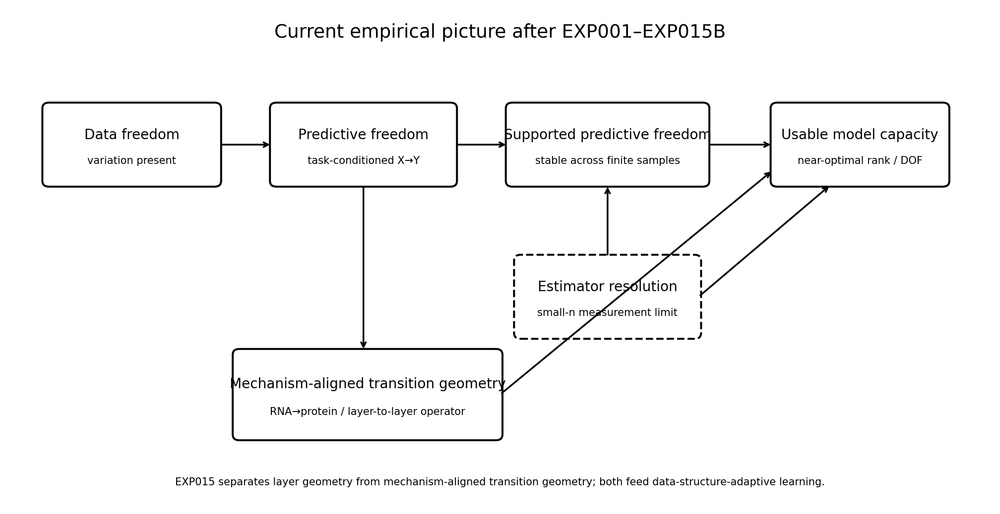

Figure 1. Empirical framework across EXP001–EXP015B: data freedom, predictive freedom, sample-supported predictive freedom, estimator-resolution assessment, and usable model capacity. EXP015 extends the measurement framework to RNA and protein expression and to a mechanism-aligned cross-layer operator. This is a conceptual synthesis of the experiments, not a quantitative plot; arrows indicate relationships investigated in the report.

## Experimental conventions and capacity definitions

Genotypes are represented as diploid alternate-allele dosages, 0, 1, or 2. Standardization parameters in prediction experiments are estimated from the corresponding training individuals only. The model is a supervised low-rank linear bottleneck. Its purpose here is to make rank exactly controllable, so that capacity can be scanned as an experimental variable; the experiments do not aim to establish the highest attainable prediction accuracy.

For a rank-r linear map with p input variables and q output variables, the independently variable degrees of freedom of the mapping space are D = r(p + q − r). When a task contains N = p + q SNPs in total, D = r(N − r). Every reported best rank or best DOF is selected from a prespecified capacity grid using the validation or held-out test criterion stated for that experiment.

$$
D=r(p+q-r)=r(N-r)
$$

Evidence chronology matters. EXP007 is an external blind test: chr22 geometry and rank predictions were fixed before its capacity sweep was revealed. EXP008–EXP010 followed that reveal and are mechanism diagnostics, not additional blind validations.

## EXP001. Geometry of a real genomic data cloud

### Question and data

The question is what geometry an actual genotype matrix exhibits. The analysis uses a real 1000 Genomes subset in AEHRC/PEPS, comprising 2,504 individuals and 162 SNPs, with five super-population labels joined from the 1000 Genomes population panel.

### Calculations

After per-SNP standardization, the analysis calculates the covariance spectrum, participation-ratio effective dimension, Euclidean distances between random pairs of individuals, TWO-NN local intrinsic dimension, and the proportion of total cloud variance explained by super-population. Ancestry structure is assessed with 100 label permutations and five-fold nearest-centroid recovery using the first 12 principal components.

Table 3. EXP001 genomic geometry

| Measure | Result |
| --- | --- |
| Global effective dimension | 119.03 / 162 |
| Local TWO-NN | 54.74 |
| Variance in first three PCs | 8.35% |
| Variance in first 12 PCs | 16.09% |
| Super-population variance share | 6.08% |
| Label-permutation p | 0.0099 |
| Five-fold ancestry recovery from 12 PCs | 87.18% |
| Mean between-/within-group distance ratio | 1.0375 |

Note. Source: EXP001 archived summary, 2,504 × 162 real genotypes. Dimensions are effective counts; variance and accuracy are percentages. Distances use standardized SNPs. Ancestry recovery uses five-fold evaluation; labels are permuted 100 times. No covariate-adjusted causal effect is estimated.

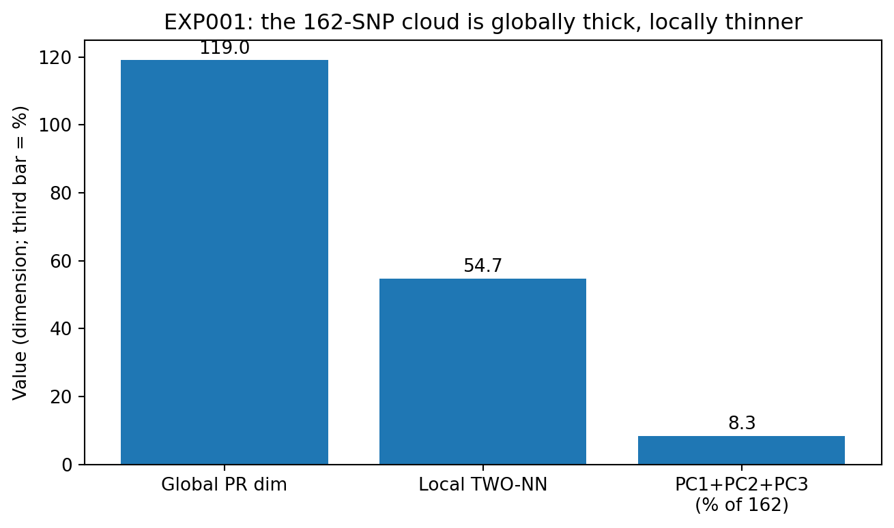

Figure 2. Geometry of the 2,504-person, 162-SNP 1000 Genomes subset in EXP001. Global participation-ratio dimension is approximately 119 and local TWO-NN dimension approximately 55; the first three principal components explain 8.35% of variance. Bars show calculated point summaries, without uncertainty intervals. The third bar is a percentage of explained variance, not a dimension; the retained artwork's parenthetical label should be read in that sense.

### Interpretation

A two-dimensional PCA view can make ancestry directions conspicuous without making the underlying data cloud nearly two-dimensional. A participation-ratio dimension of approximately 119 among 162 SNPs indicates that much of the variation remains distributed across a broad, high-dimensional cloud. At the same time, a local TWO-NN estimate near 55 indicates a substantially thinner structure at the nearest-neighbour scale.

Distance magnitude and structural direction convey different information. Mean distance is 17.452 within super-populations and 18.106 between them, a difference of only about 3.75%. Yet the first 12 directions alone recover super-population with 87.18% accuracy in five-fold nearest-centroid evaluation. Informative directions can therefore coexist with modest differences in overall distance.

## EXP002. Capacity scan for prediction from 960 real SNPs

### Question and design

This experiment tests whether the degrees of freedom of a useful predictive map can greatly exceed the geometric dimension of its data. The source is the McCoy Lab 1000 Genomes chr21 common-variant matrix, with 2,504 individuals and 960 SNPs. Each task masks 32 real SNPs and predicts them from the remaining 928. Three disjoint target panels cover 96 distinct target SNPs in total.

The predictor is a rank-r linear map with D = r(960 − r) mapping degrees of freedom. There are 2,002 training and 502 held-out test individuals. Population labels are excluded from training and used only for post hoc recovery of ancestry structure after the predictive model has been fitted.

Table 4. EXP002 capacity scan

| Rank | DOF | Test R² | Genotype accuracy | Ancestry accuracy |
| --- | --- | --- | --- | --- |
| 1.000 | 959.000 | 0.085 | 62.0% | 62.4% |
| 2.000 | 1916.000 | 0.121 | 63.0% | 81.8% |
| 4.000 | 3824.000 | 0.143 | 63.7% | 93.3% |
| 8.000 | 7616.000 | 0.203 | 66.0% | 93.2% |
| 12.000 | 11376.000 | 0.243 | 67.7% | 93.4% |
| 16.000 | 15104.000 | 0.263 | 68.6% | 93.4% |
| 24.000 | 22464.000 | 0.280 | 69.3% | 93.5% |
| 32.000 | 29696.000 | 0.266 | 69.3% | 93.4% |

Note. Source: EXP002_capacity_scan_960snp.csv. Mean test R² and accuracies summarize three disjoint target panels. DOF = r(960 − r); rank is a count. Larger R² and accuracy indicate better prediction or recovery. Population labels enter only the post hoc ancestry analysis. Rank selection here uses the held-out test scan.

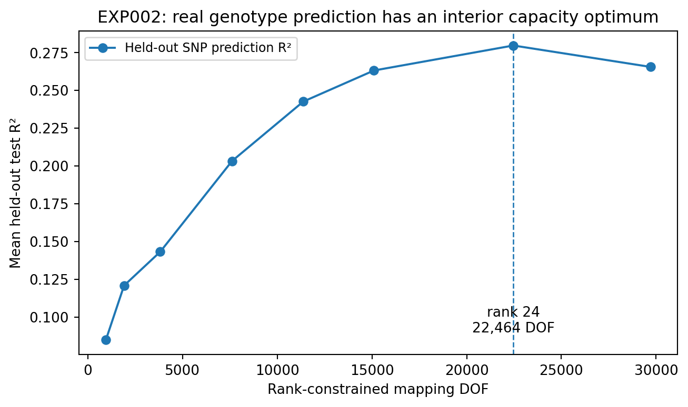

Figure 3. Held-out genotype prediction in EXP002 as a function of mapping DOF. Points summarize mean test R² over the three 32-SNP target panels in the 960-SNP chr21 matrix. Rank 24, corresponding to 22,464 DOF, reaches mean R² = 0.280; performance declines at rank 32. The dashed line marks rank 24. No uncertainty intervals are shown.

### Interpretation

Data dimension and mapping degrees of freedom are measured separately. In the same 960-SNP matrix, global effective dimension is of order 10² and local TWO-NN dimension is approximately 73, whereas the best mapping DOF for the 928-to-32 task is 22,464. The latter is not derived from an effective dimension near 98; the two quantities are independently calculated.

Ancestry recovery and fine-grained prediction separate by capacity. At rank 4, or 3,824 DOF, post hoc super-population accuracy already reaches 93.3%, and distances among the five population centroids correlate approximately 0.9992 with those in the full space. Individual SNP prediction nevertheless continues to improve at higher capacity. Large-scale interpretable structure and individual-level predictive structure occupy different capacity ranges.

## EXP003A. Exploratory scan across SNP scales

The same real chr21 matrix is divided into subsets of 120, 240, 480, and 960 SNPs, with a fresh capacity scan at each scale. Target counts also change, from 12 to 24 to 48 to 48. These results are retained as exploratory scale evidence; their correlations do not isolate an effect of data geometry.

Table 5. EXP003A exploratory scale scan

| SNPs | Local dimension | Targets | Best rank | Best DOF | Best R² |
| --- | --- | --- | --- | --- | --- |
| 120.000 | 32.2 | 12.000 | 4.000 | 464.000 | 0.131 |
| 240.000 | 42.1 | 24.000 | 4.000 | 944.000 | 0.134 |
| 480.000 | 56.1 | 48.000 | 16.000 | 7424.000 | 0.182 |
| 960.000 | 63.1 | 48.000 | 32.000 | 29696.000 | 0.259 |

Note. Source: EXP003A_scale_scan_variable_targets.csv. Dimensions are TWO-NN estimates; rank and DOF are counts. Larger R² indicates better held-out prediction. Target count changes with scale and is not adjusted away. Values retain source rounding.

Local dimension and best rank have Pearson r = 0.915, while log local dimension and log best DOF have r = 0.968. Capacity rises with scale in this exploratory scan, but changing target count is a genuine confounder.

## EXP003B. Scale control with 24 fixed targets

The controlled scan fixes the number of targets at 24 for all four data scales and retains the same training/test protocol and model family. Increasing output width alone can therefore no longer explain the upward shift of the capacity curves.

Table 6. EXP003B fixed-output scale scan

| SNPs | Local dimension | Targets | Best rank | Best DOF | Best R² |
| --- | --- | --- | --- | --- | --- |
| 120.000 | 32.2 | 24.000 | 4.000 | 464.000 | 0.127 |
| 240.000 | 42.1 | 24.000 | 4.000 | 944.000 | 0.134 |
| 480.000 | 56.1 | 24.000 | 8.000 | 3776.000 | 0.164 |
| 960.000 | 63.1 | 24.000 | 16.000 | 15104.000 | 0.252 |

Note. Source: EXP003B_scale_scan_fixed24_targets.csv. All tasks have q = 24; rank and DOF are counts. R² is dimensionless and larger is better. Training/test protocol and model family are held fixed; local dimension is a TWO-NN estimate.

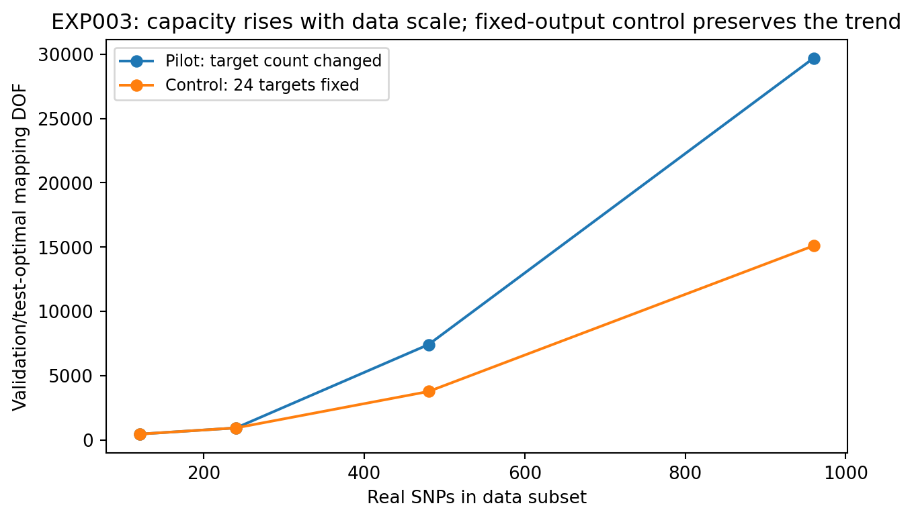

Figure 4. EXP003A exploratory scale scan and EXP003B fixed-24-target control on chr21. Lines connect the selected mapping DOF at 120, 240, 480, and 960 SNPs. Under the fixed-output control, best DOF still increases from 464 to 15,104. The exploratory curve also changes target count. These are capacity-grid point selections, without uncertainty intervals.

### Interpretation

With output width fixed, best rank still increases through 4, 4, 8, and 16, and best DOF through 464, 944, 3,776, and 15,104. Local dimension correlates 0.882 with best rank; log dimension correlates 0.963 with log best DOF. This motivates the hypothesis that greater dataset complexity requires greater model capacity. EXP004 provides a direct counterexample under a stricter fixed-size design.

## EXP004. A fixed-N counterexample to a dimension-only capacity rule

Input and output sizes are held constant: every dataset contains 240 real SNPs and 24 targets. Four subsets are contiguous chr21 regions; a fifth, the spread subset, samples evenly across the full 960-SNP range. N, q, sample size, and model family are identical, while the empirical correlation structure changes.

Table 7. EXP004 fixed-N subsets

| Subset | Local dimension | PR estimate | Best rank | Best DOF | Best R² |
| --- | --- | --- | --- | --- | --- |
| window_1 | 40.3 | 56.9 | 16 | 3584 | 0.301 |
| window_2 | 34.9 | 37.6 | 24 | 5184 | 0.373 |
| window_3 | 42.8 | 77.3 | 24 | 5184 | 0.332 |
| window_4 | 38.3 | 63.5 | 16 | 3584 | 0.309 |
| spread | 56.0 | 63.0 | 4 | 944 | 0.134 |

Note. Source: EXP004_fixedN_window_vs_spread.csv. All real tasks have N = 240 and q = 24 with common sample size and model form. PR denotes participation ratio. Best R² is a dimensionless prediction score; rank and DOF describe the selected grid point.

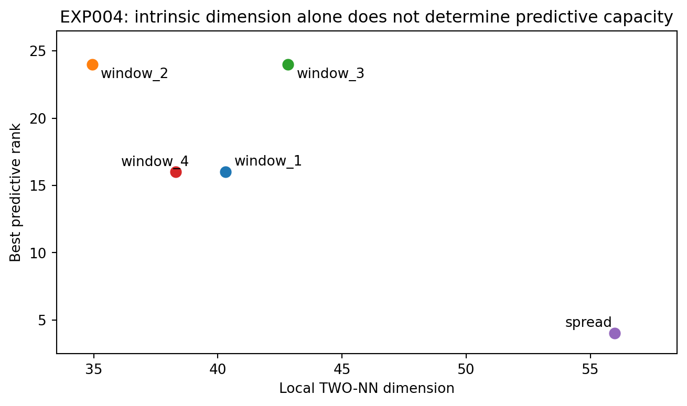

Figure 5. Local TWO-NN dimension and best predictive rank for the five fixed-N = 240 subsets in EXP004. Each point is one real chr21 subset with 24 targets. The spread subset has the highest local dimension and the lowest selected rank, 4. The plot provides a counterexample to a monotonic dimension-only capacity rule. No uncertainty intervals are shown.

### Interpretation

The spread subset has the highest local TWO-NN dimension, 55.99, but a best rank of only 4. Contiguous windows have local dimensions of approximately 35–43 and require ranks 16–24. At fixed N, the correlation between local dimension and best rank becomes −0.828.

Substantial free variation does not imply that many directions help predict the target. Spread SNPs can vary relatively independently, producing a broad data cloud. If those directions carry weak observed-to-target relationships, allocating predictive rank to them offers little benefit. Data freedom and predictive freedom are therefore distinct quantities.

## EXP005. Task-conditioned predictive geometry

For the five fixed-N datasets in EXP004, the analysis directly calculates the cross-covariance matrix CXY between standardized observed and target variables and summarizes its singular-value spectrum. The geometric question is how many effective directions of joint variation connect known SNPs to the SNPs being predicted.

Table 8. EXP005 predictive spectral summaries

| Subset | r90 | Entropy rank | Predictive PR | Best rank | Best R² |
| --- | --- | --- | --- | --- | --- |
| window_1 | 3.0 | 2.63 | 1.59 | 16 | 0.301 |
| window_2 | 7.5 | 4.54 | 2.40 | 24 | 0.373 |
| window_3 | 7.5 | 4.87 | 2.59 | 24 | 0.332 |
| window_4 | 6.5 | 4.22 | 2.22 | 16 | 0.309 |
| spread | 2.0 | 2.52 | 1.64 | 4 | 0.134 |

Note. Source: EXP005_predictive_spectrum.csv. All five subsets have fixed N and q. Predictive PR, entropy rank, and r90 are spectral breadth summaries; fractional r90 entries are archived averages. R² is dimensionless. These are descriptive relationships, without covariate adjustment.

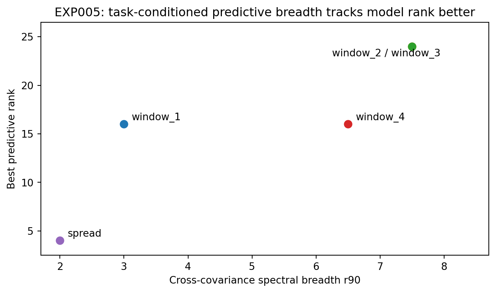

Figure 6. Cross-covariance spectral breadth r90 and best rank in EXP005. Points represent the five fixed-N chr21 subsets from EXP004; the reported Pearson correlation is 0.873. The r90 entries are the archived summaries, including fractional values where runs are averaged. No uncertainty intervals are shown.

### Interpretation

Task-conditioned coordinates explain the preceding counterexample more naturally. Although the spread subset has the highest raw local dimension, its predictive r90 is only 2. Windows 2 and 3 have r90 = 7.5 and best rank 24. Correlations of best rank with r90, entropy rank, and predictive participation rank are approximately 0.873, 0.830, and 0.803, respectively.

Predictive capacity appears to track directions that connect X to Y, rather than the overall thickness of the data cloud. The working hypothesis is consequently refined from D* = F(data geometry) to D* = F(task-conditioned predictive geometry).

## EXP006A. Detecting a truncated capacity grid in 19 windows

To test whether geometry can predict capacity before model fitting, chr21 is divided into 19 overlapping windows of 240 SNPs, with 24 targets and 1,505/501/498 training/validation/test individuals. The first rank grid ends at 24.

Table 9. EXP006A truncated-grid diagnostic

| Measure | Result |
| --- | --- |
| Selected-rank distribution | Rank 24: 14/19; rank 20: 5/19 |
| Always predict rank 24 | 14/19 |
| Two-feature LOOCV | 15/19; MAE 0.84 |
| Interpretation | Capacity-grid truncation is evident; this diagnostic motivates the expanded grid. |

Note. Source: EXP006 archived summary. N = 240, q = 24, and rank ceiling 24 in 19 overlapping windows. Accuracy is the number of exact rank matches; MAE is in rank units, with smaller values better. The majority baseline predicts 24 for every window.

Most tasks select the upper boundary of the rank grid. Under this truncation, apparently strong capacity prediction can reflect an inadequate measurement range. EXP006B therefore expands both target width and the rank grid.

## EXP006B. A 19-window capacity rule with 48 targets

The same 19 windows and individual splits are retained. Target width increases to 48, and the rank grid becomes 1, 2, 4, 6, 8, 12, 16, 20, 24, 32, 40, and 48. Capacity selections are no longer uniformly at the ceiling: the 19 windows fall into rank-40 and rank-48 groups.

Table 10. EXP006B internal capacity prediction

| Measure | Result |
| --- | --- |
| Observed best ranks | 40: 11/19; 48: 8/19 |
| No-geometry baseline | 11/19; MAE 3.37 |
| Energy-only LOOCV | 15/19; MAE 1.68 |
| r90-only LOOCV | 9/19 |
| r90 + log(Epred) LOOCV | 18/19; MAE 0.42; r = 0.896 |

Note. Source: EXP006B_19window_capacity_rule.csv and archived summary. N = 240, q = 48; training/validation/test = 1,505/501/498. Exact matches are counts; MAE is in rank units. r is Pearson correlation. LOOCV leaves out one overlapping window; EXP006C adds block controls.

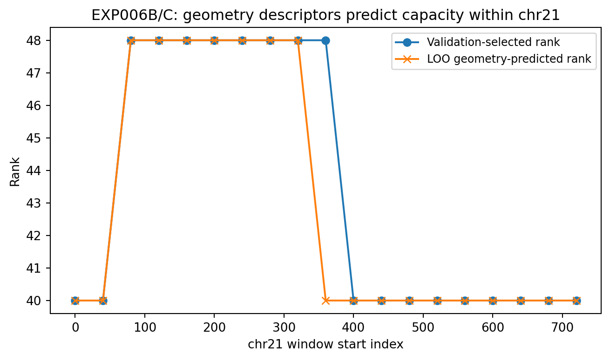

Figure 7. Validation-selected rank and leave-one-window-out geometry prediction for the 19 overlapping chr21 windows in EXP006B. The two-feature rule uses r90 and log predictive energy and matches 18 of 19 selected ranks. Lines connect window positions; they do not denote uncertainty. EXP006C separately assesses label permutations and contiguous-block validation.

## EXP006C. Exact label permutations and contiguous-block validation

An exact combinatorial test enumerates every arrangement of the observed labels: 8 rank-48 and 11 rank-40 windows yield C(19, 8) = 75,582 arrangements. Only 3 arrangements achieve at least the two-feature leave-one-window-out result of 18/19 correct predictions, giving an exact tail probability of 3.97 × 10⁻⁵.

Because sliding windows overlap, the 19 windows are also divided in genomic order into four contiguous blocks of sizes 5, 5, 5, and 4, with entire blocks held out. Accuracy becomes 15/19, rank MAE 1.68, and predicted-versus-observed rank correlation 0.567. The exact label-count-preserving permutation tail probability is approximately 0.0076. The internal signal persists, while overlap contributes to the unusually strong original LOOCV result.

### Interpretation

The internal association is strong, but all windows come from the same chromosome, data version, and sampling protocol. Its transferability must be assessed by freezing the rule and evaluating another chromosome, as in EXP007; the internal result alone does not establish a universal two-number capacity formula.

## EXP007. External blind transfer to chr22

The external source is a 1000 Genomes Phase 1 chr22 genotype matrix from another public repository, with 1,092 individuals and 4,943 SNPs. Common-SNP filtering uses training individuals only. Applying MAF ≥ 0.05 retains 1,012 SNPs, with 657 training, 218 validation, and 217 test individuals.

Four external 240-SNP windows are selected by a prespecified rule, each with 48 targets. The order is fixed: calculate r90 and predictive energy, use the chr21 rule from EXP006B to lock the predicted ranks, and only then reveal the chr22 capacity sweep.

Table 11. EXP007 external blind transfer

| Window | Predicted rank | Selected rank | Test R² at prediction | Test R² at selection | R² regret |
| --- | --- | --- | --- | --- | --- |
| chr22_ext_1 | 48 | 24 | 0.269 | 0.294 | 0.025 |
| chr22_ext_2 | 48 | 40 | 0.241 | 0.247 | 0.006 |
| chr22_ext_3 | 48 | 32 | 0.385 | 0.389 | 0.005 |
| chr22_ext_4 | 40 | 24 | 0.195 | 0.205 | 0.009 |

Note. Source: EXP007_chr22_external_blind_transfer.csv. Actual rank is selected on validation; both performance columns use the independent test set. R² regret is test R² at the selected rank minus test R² at the predicted rank; smaller is better. Values retain source rounding and may not subtract exactly as displayed. MAF filtering and standardization use training individuals only.

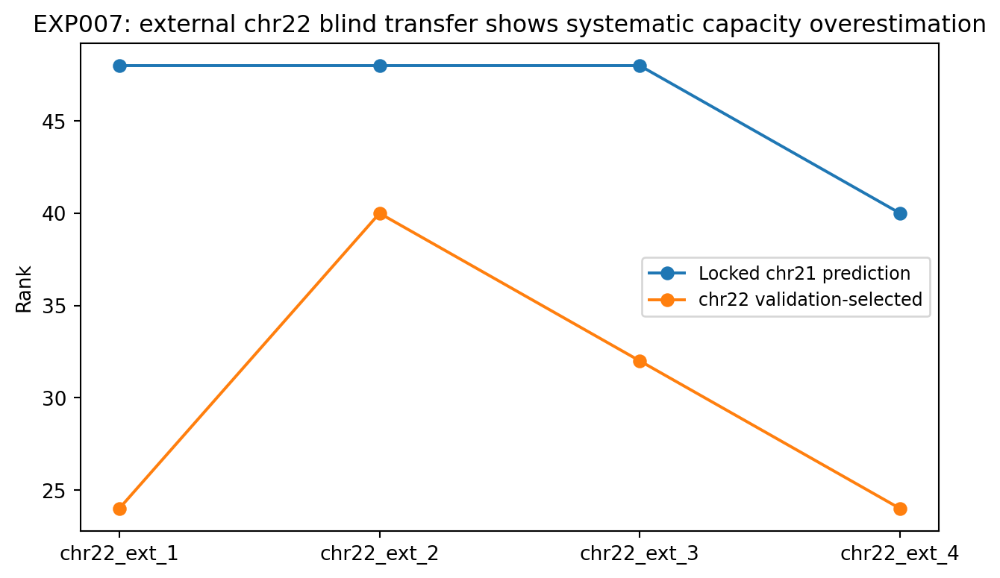

Figure 8. Locked chr21-rule predictions and subsequently revealed validation-selected ranks for the four external chr22 windows in EXP007. Predicted ranks are 48/48/48/40; observed selections are 24/40/32/24. Each point represents one external window. Lines aid comparison and no uncertainty intervals are shown.

### Interpretation

The external test gives 0/4 exact predictions and a mean absolute rank error of 16. The rule is therefore not a universal capacity formula. Nevertheless, test performance at the predicted ranks remains close to that at the validation-selected ranks: mean R² regret is only 0.0113.

The rule approximately locates a capacity plateau while systematically overestimating its peak rank. This points to conditions that reduce usable capacity in the external setting. Training sample support is an immediate candidate: the chr21 rule was developed with 1,505 training individuals, whereas chr22 has 657.

## EXP008. Sample-support control within chr21

To separate sample size from distributional differences, the analysis returns to the same chr21 data, 19 windows, 48 targets, and model family. Only the training sample is reduced, from 1,505 to 657 individuals. Validation and test sets remain fixed.

Table 12. EXP008 paired sample-support control

| Measure | Result |
| --- | --- |
| Windows with changed best rank | 16/19 |
| Mean best rank | 43.37 → 35.37 |
| Mean rank shift | −8 |
| Rank distribution at n = 657 | 24:2; 32:10; 40:4; 48:3 |

Note. Source: EXP008_sample_support_matched_downsample.csv. The same 19 real chr21 windows, q = 48, validation/test sets, and model family are used at both training sizes. Rank shift is the smaller-sample minus larger-sample selection; negative values indicate lower selected capacity.

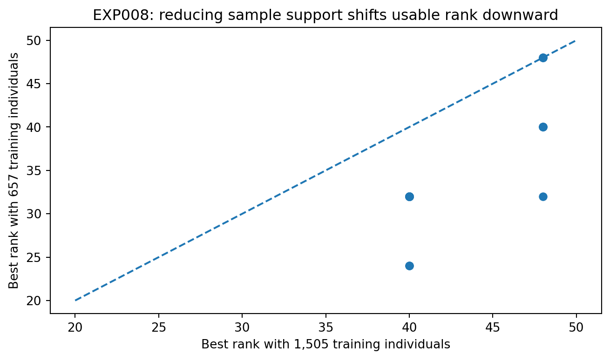

Figure 9. Paired validation-optimal ranks for the same chr21 windows at 1,505 and 657 training individuals in EXP008. The dashed identity line represents no change. Most points fall below it; overlapping points can represent multiple windows. No uncertainty intervals are shown.

### Interpretation

Sample support is now a directly controlled variable. Genomic relationships, targets, and model family remain unchanged, yet reducing the individuals available to estimate those relationships changes the capacity optimum in 16 of 19 windows. Empirical optimal capacity is constrained by relationship structure and by the stability with which that structure can be estimated.

## EXP009. Capacity across training sample sizes

Four fixed chr21 windows are evaluated at training sizes of 300, 450, 657, 900, 1,200, and 1,505. At each n, standardization is re-estimated, low-rank predictors are refitted, and rank is selected using the same validation set.

Table 13. EXP009 sample-size scan

| Training n | Mean best rank | Mean best DOF | Mean validation R² |
| --- | --- | --- | --- |
| 300.000 | 22.000 | 4752.000 | 0.208 |
| 450.000 | 29.000 | 6060.000 | 0.250 |
| 657.000 | 38.000 | 7632.000 | 0.284 |
| 900.000 | 38.000 | 7632.000 | 0.308 |
| 1200.000 | 44.000 | 8608.000 | 0.327 |
| 1505.000 | 44.000 | 8608.000 | 0.339 |

Note. Source: EXP009_sample_support_sweep_average.csv. Means are across four fixed chr21 windows. DOF is calculated for each task before averaging. Standardization and models are refitted at each n; validation set is fixed. Larger validation R² is better.

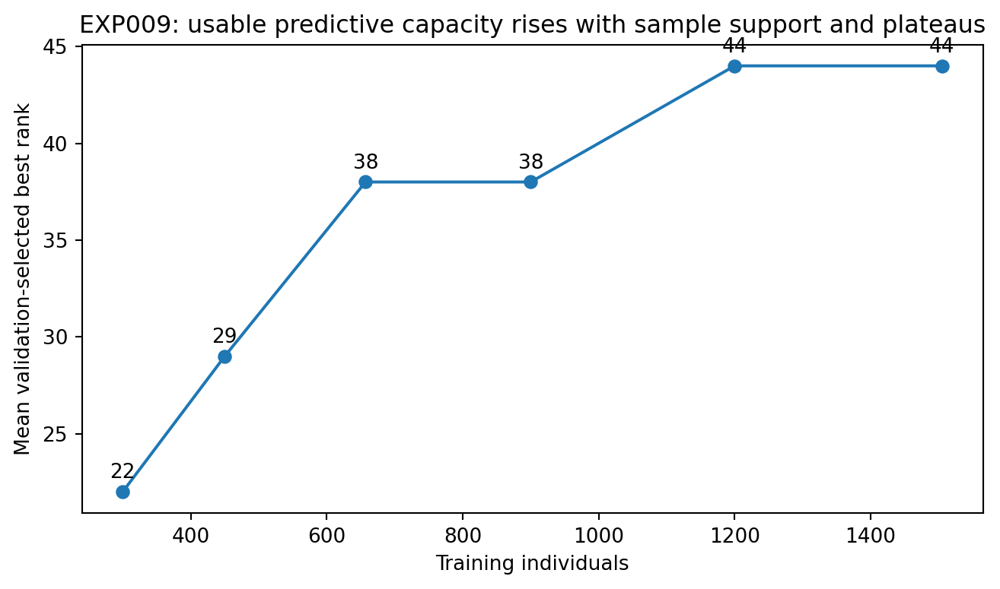

Figure 10. Mean validation-selected rank across four fixed chr21 windows as training sample size increases in EXP009. The curve rises and then plateaus. Points are means of grid selections, not confidence limits; no uncertainty intervals are shown.

### Interpretation

Mean best rank is 22 at 300 individuals, 29 at 450, 38 at 657, and 44 at 1,200–1,505. The data-generating relationship is held fixed. Increasing sample support allows additional predictive directions to be estimated well enough to justify model degrees of freedom.

A model's theoretical ability to represent a relationship differs from the current sample's ability to estimate it reliably. Within a fixed model family, validation-optimal rank can therefore be interpreted as usable capacity under the joint constraints of relationship complexity and finite sample support.

## EXP010. Post hoc transfer diagnosis after matching sample size

The chr21 training sample is reduced to 657, predictive geometry is recalculated in all 19 windows, and the relationship from r90 plus log predictive energy to rank is refitted. The rule is then applied to the four chr22 windows whose outcomes are already known. This is a post hoc mechanism diagnostic.

Table 14. EXP010 matched-support diagnosis

| Window | Actual rank | Original prediction | Matched-support prediction | Original error | Matched error |
| --- | --- | --- | --- | --- | --- |
| chr22_ext_1 | 24 | 48 | 32 | 24 | 8 |
| chr22_ext_2 | 40 | 48 | 24 | 8 | 16 |
| chr22_ext_3 | 32 | 48 | 40 | 16 | 8 |
| chr22_ext_4 | 24 | 40 | 24 | 16 | 0 |

Note. Source: EXP010_matched_support_posthoc.csv. Errors are absolute rank differences; smaller is better. The chr21 rule is refitted at n = 657 after chr22 outcomes are known. This comparison is post hoc, not a second blind test.

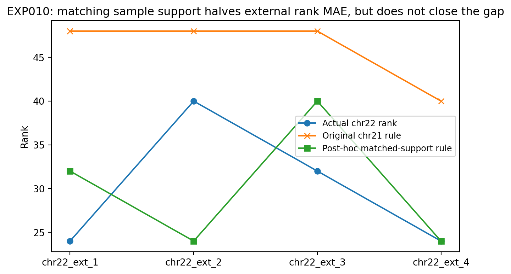

Figure 11. Actual chr22 ranks, original predictions, and post hoc predictions after matching training support at 657 individuals in EXP010. Rank MAE decreases from 16 to 8, with 1/4 exact predictions. Each series contains the same four external windows; no uncertainty intervals are shown.

### Interpretation

Matching sample size halves external rank MAE, indicating that sample support accounts for a substantial part of the systematic overestimate. Exact accuracy of only 1/4 also indicates that r90 and total predictive energy compress the operator too heavily. Similar spectral breadth and total energy can coexist with different tail shapes, direction stability, condition numbers, or reproducibility across samples.

EXP011 therefore examines the full predictive singular spectrum. Training individuals are split into independent halves, and each direction is evaluated for persistence of its observed-to-target relationship. Split-half operator reliability makes the distinction between a signal-bearing tail and a noisy tail directly measurable.

## EXP011. Direction stability, near-optimal capacity, and the noise floor

### Question and design

EXP010 shows that r90 and total predictive energy describe spectral breadth and overall relationship strength but do not precisely determine best rank across chromosomes. EXP011 asks whether directions that reproduce across independent samples are the directions that warrant model degrees of freedom.

For each real genotype prediction task with N = 240 and q = 48, training individuals are split into halves A and B, stratified by super-population. Their observed-to-target cross-covariance operators are C_A and C_B. Define S = (C_A + C_B)/2 as the reproducible-signal estimate and N_noise = (C_A − C_B)/2 as the half-sample difference operator. Along the kth right singular direction v_k of S, reliability_k = clip(1 − ||N_noise v_k||² / ||S v_k||², 0, 1). The number of directions with reliability ≥ 0.5 is called stable50. For pure-noise directions, the powers of S and N_noise should be similar and reliability should approach 0; stable relationship directions should approach 1. The symbol N_noise distinguishes the noise operator from the total SNP count N.

$$
S=(C_A+C_B)/2,\quad N_{\mathrm{noise}}=(C_A-C_B)/2
$$

This is a training-data statistic, not a neural-network parameter or a quantity inferred from validation/test outcomes. It is computed entirely from two independent halves of the training genotype matrix. To assess split dependence, the four principal chr21 windows use two independent stratified splits; the external chr22 windows use one locked split.

Table 15. EXP011 stability and near-optimal capacity

| Window | Training n | stable50 by split | Mean stable50 | Near-optimal rank ΔR² ≤ 0.005 | Argmax rank |
| --- | --- | --- | --- | --- | --- |
| chr21-0 | 1505 | 25/25 | 25.0 | 32 | 40 |
| chr21-160 | 1505 | 34/32 | 33.0 | 48 | 48 |
| chr21-360 | 1505 | 29/30 | 29.5 | 40 | 48 |
| chr21-560 | 1505 | 26/26 | 26.0 | 32 | 40 |
| chr22_ext_1 | 657 | 19 | 19.0 | 20 | 24 |
| chr22_ext_2 | 657 | 17 | 17.0 | 24 | 40 |
| chr22_ext_3 | 657 | 20 | 20.0 | 32 | 32 |
| chr22_ext_4 | 657 | 17 | 17.0 | 16 | 24 |

Note. Source: EXP011A/B/C result tables. stable50 counts directions at reliability ≥ 0.5; chr21 means average two splits, chr22 uses one. Near-optimal rank is the smallest grid rank within 0.005 validation R² of the best. All ranks and counts are dimensionless. Splits are stratified by super-population.

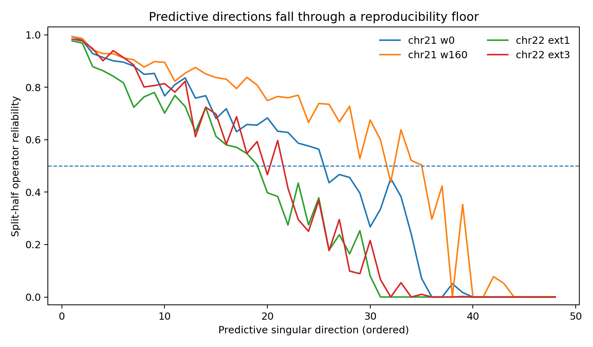

Figure 12. Split-half operator reliability along ordered predictive singular directions in selected chr21 and chr22 windows from EXP011. Leading directions are highly stable and tail directions approach the noise floor. The dashed horizontal line is the operational threshold of 0.5. Curves show the archived split estimates, not confidence bands.

### Stable directions and minimum near-optimal capacity

The two stable50 measurements in the four chr21 windows are 25/25, 34/32, 29/30, and 26/26. Validation curves often have broad plateaus, so tiny validation differences can alter the rank attaining the maximum. Capacity is therefore also expressed as the smallest rank whose validation R² is within 0.005 of the task's best validation R²: the minimum near-optimal rank.

In chr21, mean stable50 values are 25.0, 33.0, 29.5, and 26.0, and minimum near-optimal ranks are 32, 48, 40, and 32, with Pearson r = 0.993. In the four external chr22 windows, stable50 values are 19, 17, 20, and 17 and minimum near-optimal ranks are 20, 24, 32, and 16, with r = 0.683. Across all eight windows, r = 0.929. The mean ratio of minimum near-optimal rank to stable50 is approximately 1.29. This is an empirical ratio for the present model family and task scale, not a universal constant.

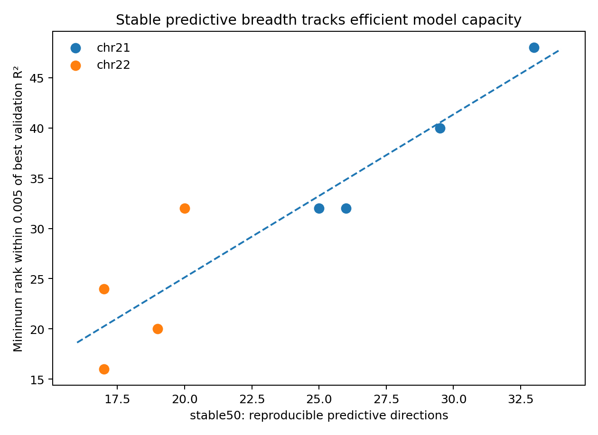

Figure 13. stable50 versus the minimum rank within 0.005 of the best validation R² across eight real windows in EXP011. Colours distinguish chr21 and chr22. The dashed line is a visual guide, not an uncertainty interval. The near-optimal criterion targets the capacity needed to retain almost all available performance.

### Interpreting a capacity plateau

Validation argmax can overemphasize small differences at the top of a plateau. In chr22_ext_2, validation R² values at ranks 24, 32, 40, and 48 lie in a narrow interval; rank 40 is merely the largest among them. Requiring exact prediction of that single point can amplify validation noise into an apparent mechanistic failure.

stable50 instead asks how many predictive directions reproduce across independent samples strongly enough to stand above the noise floor. This brings geometry and capacity closer to a shared object: the predictive operator subspace supported by actual observations, beyond either the entire data-cloud dimension or cross-covariance energy alone.

For these rank-controlled predictors, capacity search should use the training-data reliability spectrum and stable50 to inform a rank grid, with room above the stable-direction count, and use validation to identify a performance plateau. In the eight observed windows, near-optimal capacity is described approximately as 1.0–1.6 times stable50, with mean 1.29. The exact observed range, retained in the EXP012 preregistration, is 0.941176–1.60. This range defines a candidate search band for this task family rather than a law.

### Sample support and stable predictive directions

To connect direction stability directly to the sample-support effect in EXP009, stable50 is recalculated at n = 300, 657, and 1,505 in the same four chr21 windows. The relationships, windows, target count, and model family remain fixed; only training sample size changes.

Table 16. EXP011 sample support and stable directions

| Training n | Mean stable50 | Mean effective stable rank | Mean argmax rank |
| --- | --- | --- | --- |
| 300 | 11.25 | 11.70 | 22.0 |
| 657 | 19.00 | 18.00 | 38.0 |
| 1505 | 28.00 | 25.32 | 44.0 |

Note. Source: EXP011D_sample_support_reliability.csv. Means are across four fixed chr21 windows. Effective stable rank sums continuous reliabilities; stable50 uses a 0.5 threshold. Standardization uses the corresponding training sample; no causal covariate adjustment is applied.

Mean stable50 increases from 11.25 at n = 300 to 19.0 at n = 657 and 28.0 at n = 1,505. The corresponding mean validation-optimal ranks in EXP009 are 22, 38, and 44. Across the 12 window-by-sample-size conditions, stable50 correlates 0.873 with argmax rank; continuous effective stable rank, the sum of reliabilities, correlates 0.900. Each of the four windows separately shows a monotonic increase in stable50 with n.

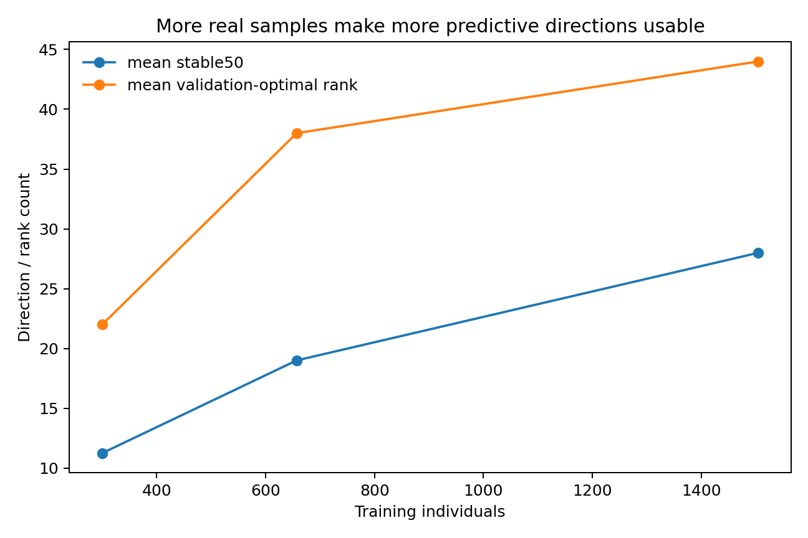

Figure 14. Mean stable50 and mean validation-optimal rank across the same four chr21 windows at three training sizes in EXP011. More predictive directions cross the stability threshold as n increases. Points summarize the four tasks at each size; no uncertainty intervals are shown.

This supplies an observable mechanism for the capacity staircase in EXP009: additional observations allow relationships previously obscured by half-sample differences to become reproducible. Sample-supported predictive freedom can thus be represented by a spectrum estimated from the training matrix.

### Controls that disrupt individual pairing

For each of the four chr21 windows, X-side individuals are held fixed while the individual correspondence of target genotypes is shuffled. One control shuffles within super-population, retaining broad ancestry composition such as AFR, EUR, and EAS. A second shuffles globally, disrupting both individual linkage and ancestry correspondence. stable50 is recalculated using the same split-half operator procedure.

Table 17. EXP011 pairing-shuffle controls

| Window | True-pair stable50 | Within-group shuffle | Global shuffle |
| --- | --- | --- | --- |
| 0 | 25 | 4 | 1 |
| 160 | 32 | 4 | 0 |
| 360 | 30 | 4 | 1 |
| 560 | 26 | 5 | 4 |

Note. Source: EXP011E_shuffle_controls.csv. Entries are stable50 direction counts. Within-group shuffling preserves super-population composition; global shuffling disrupts it. All conditions use the same measurement procedure. Counts are point estimates, not uncertainty limits.

Mean stable50 is 28.25 under true pairing, 4.25 after within-super-population shuffling, a decrease of about 85%, and 1.5 after global shuffling, a decrease of about 94.7%. Most measured stable predictive directions therefore contain structure beyond a matrix encoding of population labels. Even when broad ancestry composition is retained, breaking the correspondence between an individual's observed and target SNPs removes most stable directions.

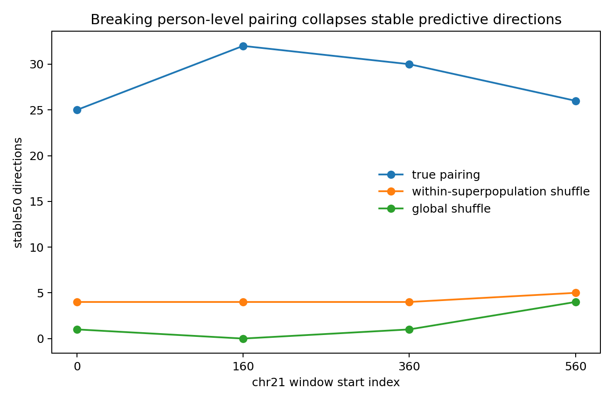

Figure 15. stable50 for true, within-super-population-shuffled, and globally shuffled individual pairing in four chr21 windows in EXP011. Within-group shuffling preserves ancestry composition but reduces the mean stable count from approximately 28 to approximately 4. The displayed controls are archived point results; no uncertainty intervals are shown.

### Interpretation and evidence scope

EXP011 directly measures the third layer of the framework: data freedom describes variation in the data; predictive freedom describes relationships from X to Y; supported predictive freedom describes which relationships reproduce under the current sample support. Alignment with near-optimal capacity, monotonic growth with n, and collapse under pairing shuffles provide convergent evidence for this object.

These results support an operational working hypothesis. Reliability 0.5 is the chosen threshold; double-split checks cover four representative chr21 windows and external evaluation covers four chr22 windows. The low-rank linear family permits exact control of rank and DOF. A prospective transfer design freezes the reliability spectrum and a predicted near-optimal capacity interval on an unseen chromosome or data type before revealing the capacity scan.

For an unfamiliar dataset, the practical interface is to estimate the task-conditioned operator's reliability spectrum alongside column count and PCA dimension. A shortage of stable directions suggests that increasing rank may admit noise; stability that continues to increase with n suggests that sample support still constrains usable capacity. This interface connects data-collection decisions to capacity selection.

## EXP012. External small-sample blind test of stable50

### Question and preregistration

EXP011 links stable predictive directions to minimum near-optimal rank at moderate sample sizes. EXP012 deliberately uses a small real external stress test: the public BioNumPy 1000 Genomes VCF, containing 50 individuals and 74 SNPs. Before any capacity outcomes are revealed, seed 12012 fixes a 30/10/10 training/validation/test split. Training-only MAF ≥ 0.05 filtering retains 38 SNPs. The final task has N = 38, q = 9, and a rank grid from 1 to 9.

The capacity rule is transferred unchanged from EXP011, without fitting to EXP012 model outcomes. The centre is round(1.290852 × stable50), and the preregistered band uses the observed EXP011 range of minimum-near-optimal-rank/stable50 ratios, 0.941176–1.60. The primary endpoint is whether the smallest validation rank within 0.005 of the best R² lies inside that locked band. Test results are read only after capacity is revealed. EXP012_preregistration_locked.json records the rule fixed before the scan.

### Prediction from stability measurements

Across two fixed target grids and two fixed 15/15 split-half partitions, all four stable50 counts equal 1. Effective stable rank ranges from 1.061 to 1.803, with mean 1.474. The prediction is therefore locked at centre rank 1 and band [1, 1]. Under direct transfer of the hard-count rule, rank 1 would already be near-optimal.

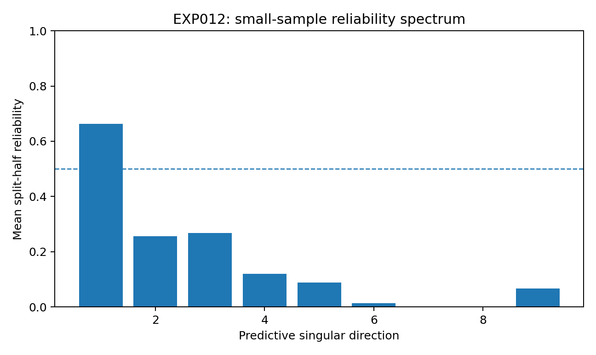

Figure 16. Mean split-half reliability by predictive direction in EXP012, using the 30-person training set and fixed target-grid/partition runs. Only the first direction clearly exceeds the 0.5 threshold on average. The horizontal dashed line marks that threshold; bars are means rather than uncertainty intervals.

### Revealed capacity results

The preregistered primary endpoint fails. Validation R² rises from 0.243 at rank 1 to 0.358 at rank 4 and 0.370 at rank 5. Both the validation argmax and the minimum rank within 0.005 of it are 5, outside the locked band [1, 1]. Mapping degrees of freedom are 37 at rank 1 and 165 at rank 5.

Table 18. EXP012 locked prediction and revealed capacity

| Quantity | Status | Rank | DOF |
| --- | --- | --- | --- |
| Preregistered centre | Locked | 1 | 37 |
| Preregistered band | Locked | 1–1 | 37 |
| Validation argmax | Revealed | 5 | 165 |
| Minimum near-optimal validation rank | Revealed | 5 | 165 |

Note. Source: EXP012_preregistration_locked.json and EXP012_capacity_curve.csv. N = 38 and D = r(38 − r). The near-optimal tolerance is 0.005 validation R². Test data do not select rank. Locked and revealed distinguish chronological roles.

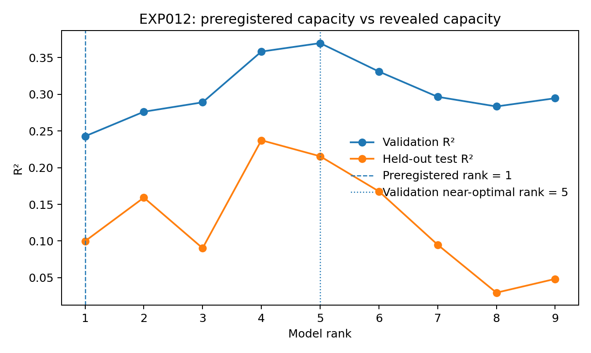

Figure 17. Validation and held-out test capacity curves for EXP012. Vertical markers show preregistered rank 1 and validation near-optimal rank 5. Test R² is approximately 0.100 at rank 1 and 0.215 at rank 5, a difference of approximately 0.116 using unrounded results. Points correspond to fitted ranks; no uncertainty intervals are shown.

### Interpretation of the estimator-resolution boundary

This negative result identifies a failure mode of the current measurement of supported predictive freedom. Split-half reliability uses disagreement between two half-sample operators as a noise estimate. With only 30 training individuals, each half contains 15, making high-order direction estimates highly variable. A hard threshold of 0.5 then tends to classify them as unstable. stable50 = 1 means that one direction clears this particular half-sample measurement threshold; it does not establish that the full dataset supports only one predictive direction.

The capacity scan retains validation gains at ranks 4–5. Validation R² across ranks 1–5 is 0.243, 0.276, 0.289, 0.358, and 0.370, declining from rank 6. Predictive structure therefore extends beyond one direction, while the small-sample reliability estimator places directions 2–5 below 0.5. The experiment distinguishes supported predictive freedom from the resolution with which it is estimated.

In very small samples, stable50 should not serve as an unconditional upper capacity limit. Report the full reliability spectrum, effective stable rank, and half-sample size together. A task with inadequate half-sample resolution can be marked stability-resolution-limited and assessed using repeated splits, continuous shrinkage, noise debiasing, or whole-training bootstrap while retaining a broader capacity search. EXP012 provides a real-data boundary for the original hard-count interface.

EXP012 is a preregistered external blind negative result. Data selection, split, MAF filter, stability protocol, capacity rule, and rank band were fixed before the scan. After the primary endpoint failed, neither the band nor its coefficients was revised. Reliability-estimator bias and variance at small n therefore require separate study, with corrected rules frozen before independent evaluation.

## Synthesis from data dimension to supported predictive freedom

EXP001–EXP012 establish a progressively more specific evidence chain. Real genomic data form a globally broad cloud with a thinner local geometry. The freedom of that cloud differs from the freedom required by a prediction task. Observed-to-target geometry tracks capacity more closely than raw intrinsic dimension, while finite samples constrain usable capacity. EXP011 directly measures supported predictive directions and relates them to minimum near-optimal rank. EXP012 exposes a boundary in a 30-person external training sample: 15/15 split-half estimation can place usable directions below the reliability threshold. The underlying supported structure and the accuracy of its measurement must therefore be distinguished.

The useful distinction is among three continuous objects: data freedom, predictive freedom, and sample-supported predictive freedom. Split-half operator reliability approximates the third. Empirical optimal capacity is selected under that final constraint, but small fluctuations at the top of a validation plateau can move the argmax. Minimum near-optimal capacity is a more stable engineering target.

Model capacity cannot be understood through parameter count alone. When data vary freely but input-to-target relationships are weak, additional rank mainly accommodates noise. When relationships are rich but samples are sparse, validation can favour a smaller model despite the greater structural complexity. Additional degrees of freedom become usable predictive capacity when the relationship exists and the observations support its estimation.

Genomic subsets establish a measured chain from data geometry through task-conditioned predictive geometry and sample-supported directions to estimator-resolution assessment. EXP013C transfers the estimator to maize in a cross-species blind test: ordering advantages transfer more readily than absolute reliability calibration. EXP013D shows that increasing sample size within the same maize tasks sharpens direction ordering, beyond any species label alone. EXP014A expresses these ideas as common Data Passport fields calculated across four data structures. The scope expands from genomic model size to a general measurement interface: characterize structure, predictive relationships, evidence support, and measurement resolution before selecting capacity or searching model families.

Figure 18. Repeated framework overview at the synthesis of EXP001–EXP012, with the subsequent EXP013A/B distinction between estimator resolution, direction ordering, and direction counting. The same conceptual artwork appears in Figure 1 to support independent reading of this section. It summarizes empirical relationships; no numerical estimates or uncertainty intervals are encoded.

## EXP013A. Scalar calibration and a resolution warning

EXP013A is a post hoc calibration study following the revealed negative result of EXP012. Its inputs are archived real-genome outputs: eight moderate-sample chr21/chr22 tasks from EXP011 provide calibration data, while the 30-person EXP012 training task is an already-revealed stress target. No synthetic data are added, and no existing capacity curve is changed.

Six scalars are calculated directly from the reliability spectra: stable25, stable50, stable75, continuous effective support Σr, tail-emphasizing Σ√r, and high-reliability-emphasizing Σr². Each uses a scale-only mapping fitted on the eight EXP011 tasks and evaluated with leave-one-task-out rank MAE. A separate hard-threshold sweep spans 0.05–0.80, with threshold selection based only on those moderate-sample tasks. Frozen mappings are then applied to the four locked EXP012 reliability runs.

The best moderate-sample threshold is approximately 0.59, with leave-one-out rank MAE 2.58. Applied unchanged to EXP012, it predicts continuous rank 1.13, rounded to 1, while the observed minimum near-optimal validation rank is 5. The failure of EXP012 is therefore not explained by the particular choice of threshold 0.5.

### Continuous support summaries

After calibration on the eight EXP011 tasks, stable25, stable50, stable75, Σr, Σ√r, and Σr² predict rounded EXP012 ranks of 2, 1, 1, 2, 3, and 1. The closest, Σ√r, predicts rank 3 but has moderate-sample LOO MAE 4.92. Giving weak spectral directions more weight raises the small-sample estimate without simultaneously preserving moderate-sample calibration and recovering rank 5.

Repeated-split instability provides a direct resolution diagnostic. Define split gap for continuous effective support as |E1 − E2| / mean(E1, E2). The four chr21 windows have gaps of 2.43%, 1.61%, 0.74%, and 0.11%, averaging 1.22%. The two EXP012 target grids have gaps of 29.36% and 11.61%, averaging 20.48%, approximately 16.8 times the chr21 mean. Even the smaller EXP012 gap exceeds the largest chr21 gap. Sensitivity to repeated splitting is therefore an observable indicator of limited estimator resolution.

The practical procedure adds an estimator-resolution check: compute continuous effective support under at least two independent splits and report the relative gap. Stable repeated measurements can inform a validation-tested capacity band. A substantially enlarged gap warrants a stability-resolution-limited designation and greater room above the hard-count estimate in the capacity search. The separation between 2.43% and 11.61% in this experiment family is evidence of an alarm signal, not a fixed threshold for other domains.

### Core numerical results

Table 19. EXP013A scalar calibration

| Estimator | Moderate-n LOO MAE | EXP012 predicted rank | EXP012 near-optimal rank |
| --- | --- | --- | --- |
| stable50 | 3.79 | 1.32 → 1 | 5 |
| effective | 4.23 | 2.18 → 2 | 5 |
| sqrt_support | 4.92 | 2.92 → 3 | 5 |
| threshold_sweep_tau_0.59 | 2.58 | 1.13 → 1 | 5 |

Note. Source: EXP013A_estimator_calibration.csv. MAE is in rank units; smaller is better. Calibration uses eight moderate-sample EXP011 tasks; arrows show continuous predictions and rounding for the already-revealed EXP012 task. This is post hoc calibration.

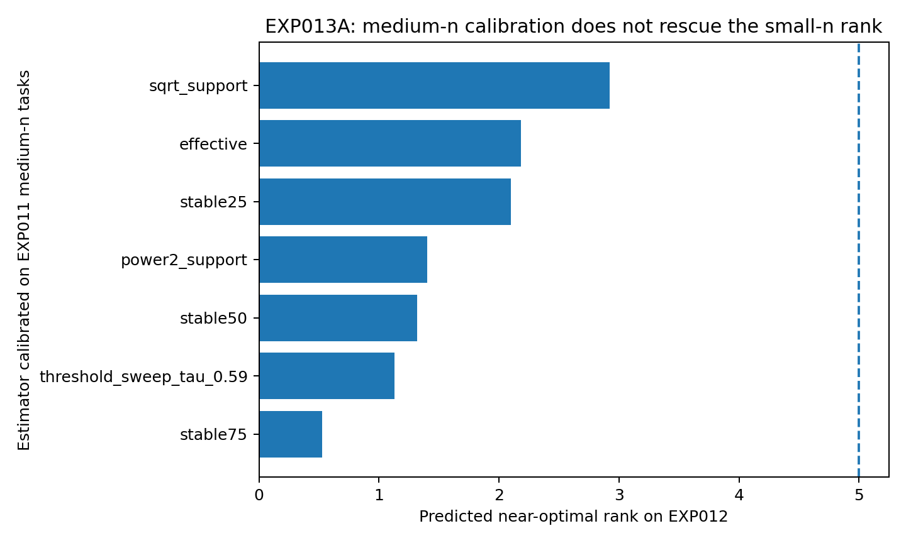

Figure 19. EXP013A rank predictions for the already-revealed EXP012 task after calibration of hard and soft reliability summaries on the eight moderate-sample EXP011 tasks. All predictions are below the observed near-optimal rank of 5, marked by the dashed line. Σ√r reaches approximately 3. Bars show continuous predictions, without uncertainty intervals.

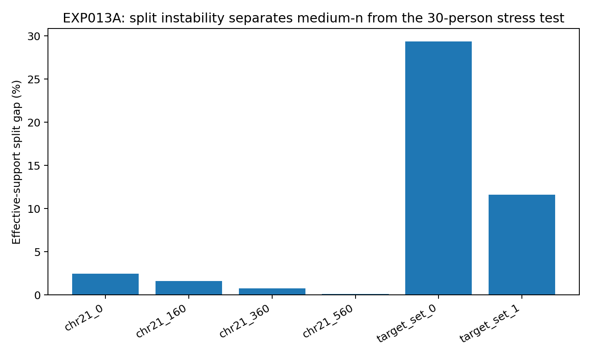

Figure 20. Relative repeated-split gaps in continuous effective support for EXP013A. The four moderate-sample chr21 windows have a maximum gap of 2.43%; the two small-sample EXP012 target grids have gaps of 29.36% and 11.61%. Bars are calculated pairwise split differences, not confidence intervals.

### Interpretation of measurement resolution

Changing the threshold from 0.5 to 0.25 or summing weak directions cannot by itself restore small-sample resolution. The best threshold on moderate-sample tasks is slightly higher, 0.59, and simple soft counts raise the small-sample prediction only to ranks 2–3. The salient anomaly is the increased sensitivity of the full reliability spectrum to the sample split.

EXP013A contributes measurement quality control rather than another geometry-to-capacity equation. A capacity estimator has an operating range. When effective support is stable across splits, direction reliability remains a useful guide. When the split gap expands, a model-selection procedure can widen its capacity search and report reduced measurement resolution. A general data-modelling interface should therefore assess the reliability of its own structural measurements.

These calculations use real experimental outputs and establish calibration failure together with an observable resolution warning. Because EXP012 rank 5 was already known, all comparisons against that task are post hoc. A rule intended for prospective external prediction must be frozen before revealing the new capacity outcomes.

## EXP013B. Raw operators, power debiasing, and whole-training bootstrap

EXP013B returns to the genotype matrix and observed-to-target cross-covariance operator. It uses the 50-person BioNumPy/1000 Genomes source and fixed 38-SNP panel archived for EXP012, without selecting SNPs again. Two disjoint nine-SNP target grids are evaluated under 128 deterministic outer resamples, each with 30 estimator individuals and 20 distinct holdout individuals. This gives 256 tasks and 2,304 direction-level comparisons with a within-split independent reference.

For each task, the 30-person operator C_train defines right singular directions v_k. The 20 individuals excluded from that estimator form C_holdout. Along the same v_k, let a = C_train v_k and b = C_holdout v_k. Independent operator reproducibility is clip(2a·b/(||a||² + ||b||²), 0, 1). A value near 1 indicates similar action in the two sets of individuals; a value near 0 indicates poor reproduction of direction or magnitude. The reference measures the operator directly, without inferring reliability from a validation-selected rank.

$$
\operatorname{reproducibility}=\operatorname{clip}\left(\frac{2a\cdot b}{\lVert a\rVert^2+\lVert b\rVert^2},0,1\right)
$$

Five estimators are compared: one 15/15 split; the mean reliability across 30 such splits; the median across 30 splits; power-domain debiasing, which subtracts mean split noise power from full-training operator power along full-training singular directions; and whole-training bootstrap, using 200 resamples of size n = 30 with replacement. To separate ordering from absolute calibration, affine calibration uses grouped leave-one-outer-split-out evaluation, holding out both grids and all 18 directions belonging to the outer split.

### Direction ordering

Across 2,304 real directions, raw Spearman correlations with independent holdout reproducibility are 0.432 for one split, 0.518 for the 30-split mean, 0.504 for the 30-split median, 0.715 for power debiasing, and 0.768 for whole-training bootstrap. Resampling at the full training size of 30 better preserves the ordering actually reproduced by the holdout individuals.

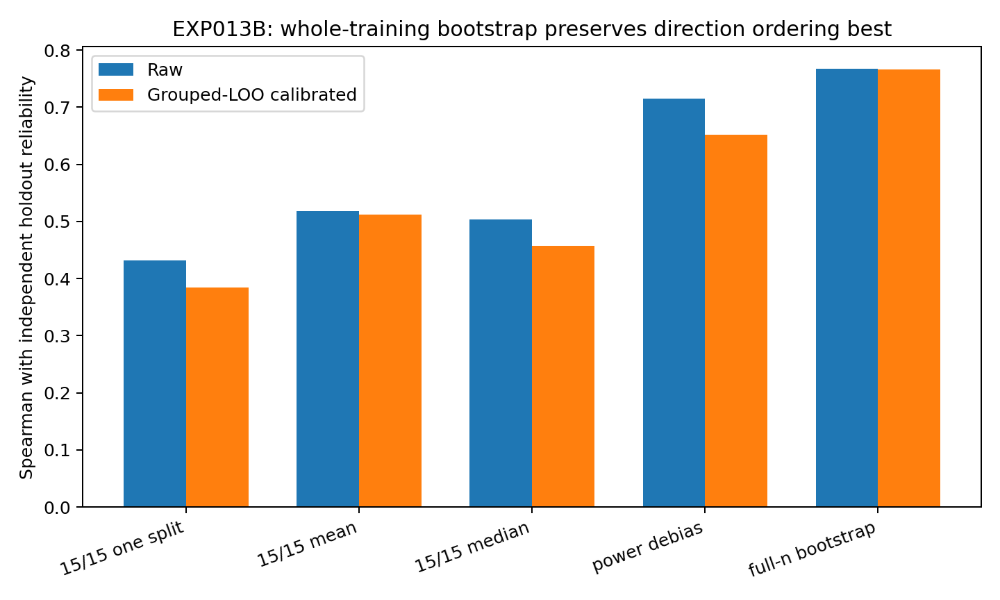

Figure 21. Spearman correlations between reliability estimators and independent holdout direction reproducibility in EXP013B, before and after grouped-LOO affine calibration. The 2,304 comparisons come from 128 outer splits and two target grids of the same 50-person source. Whole-training bootstrap has the highest raw correlation, followed by power debiasing. Bars are summary estimates without uncertainty intervals.

### Direction error and stable-direction counts

After fitting affine calibration only on other outer splits, direction MAE on the held-out split is 0.189 for one split, 0.181 for the split mean, 0.179 for the split median, 0.136 for power debiasing, and 0.127 for bootstrap. Classification accuracy for independent reproducibility ≥ 0.5 is 73.4%, 73.4%, 73.4%, 87.2%, and 87.8%, respectively. Bootstrap's benefit combines preserved relative ordering with a simple calibration toward the independent reference scale.

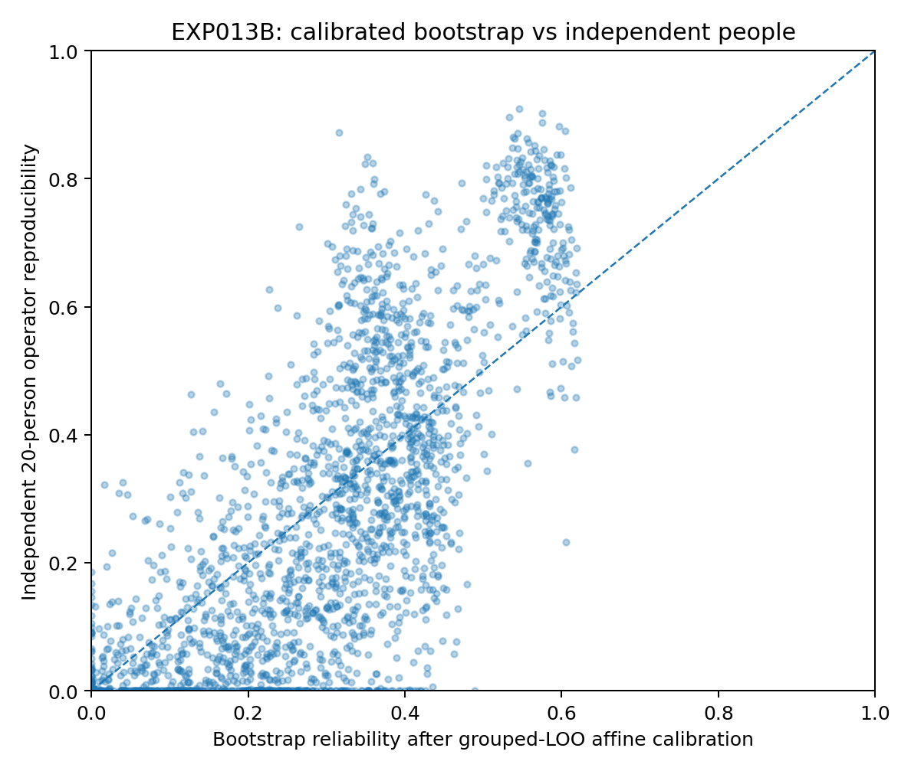

Figure 22. Grouped-LOO calibrated bootstrap reliability versus the independent 20-person operator reference in EXP013B. Each point is one predictive direction in a resampled task; the dashed identity line denotes exact agreement. These repeated tasks reuse the same source population and are not 2,304 independent dataset validations.

Stable-direction counting gives a complementary result. MAE in the number of directions above 0.5 is 1.555 for one split, 1.555 for the split mean, 1.555 for the split median, 0.941 for power debiasing, and 1.039 for bootstrap. Bootstrap performs best on ordering and continuous reliability, while power debiasing is slightly better on hard cardinality. They measure different aspects of supported predictive freedom.

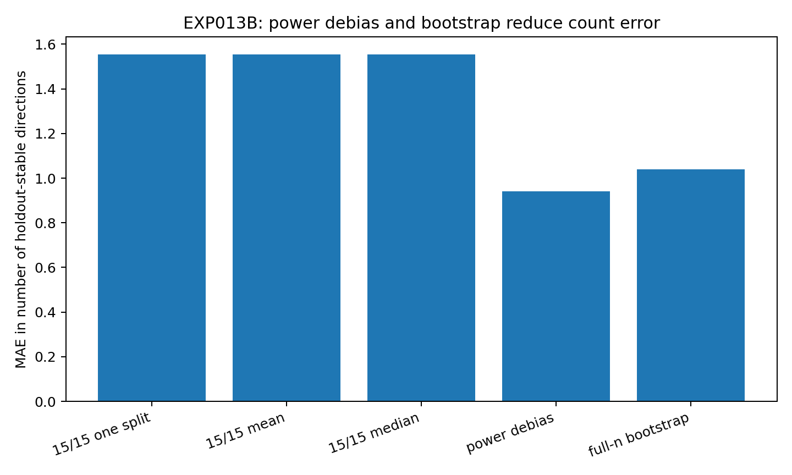

Figure 23. Mean absolute error in the number of holdout-stable directions in EXP013B. Power-domain debiasing gives the lowest count MAE, followed by whole-training bootstrap. The bars summarize the 256 resampled tasks using the 0.5 stability threshold; no uncertainty intervals are shown.

Table 20. EXP013B estimator comparison

| Estimator | Raw Spearman | Calibrated direction MAE | stable50 accuracy | Stable-count MAE |
| --- | --- | --- | --- | --- |
| 15/15 one split | 0.432 | 0.189 | 73.4% | 1.555 |
| 15/15 mean ×30 | 0.518 | 0.181 | 73.4% | 1.555 |
| 15/15 median ×30 | 0.504 | 0.179 | 73.4% | 1.555 |
| Power debias | 0.715 | 0.136 | 87.2% | 0.941 |
| Full-n bootstrap | 0.768 | 0.127 | 87.8% | 1.039 |

Note. Source: EXP013B_estimator_comparison.csv. Direction MAE is error on a reliability scale from 0 to 1; stable-count MAE is in directions. Accuracy uses threshold 0.5. Calibration is grouped by outer split. The 128 resamples reuse one 50-person source; they are not independent external datasets.

### Interpretation of ordering and counting at small n

EXP013A shows that a threshold change cannot recover a poorly resolved split-half measurement. EXP013B separates the failure further. Bootstrap better preserves relative reliability among directions, while power debiasing more directly estimates the number of directions whose signal power exceeds noise power. These roles, which can appear similar at larger sample sizes, diverge at n = 30.

A small-sample Data Passport should report four linked outputs: an estimator-resolution flag; a bootstrap-calibrated direction-reliability spectrum for ordering candidate directions; a power-debiased support count as a cardinality reference; and disagreement between them. If ordering is clear but the count is unstable, retain a capacity interval rather than reducing the decision to a single point.

All 2,304 comparisons derive from real genotypes but reuse one 50-person source through repeated outer resampling. EXP013B evaluates estimator behaviour within that source. Its candidate coefficients are archived for external evaluation. EXP013C freezes the coefficient choice and support rule before inspecting the independent operator reference in new data.

## EXP013C. Cross-species blind transfer of the estimator

Candidate coefficients from EXP013B are frozen before evaluation on independent data. The external source is the public MVP maize HapMap file, containing 279 lines and 3,093 marker rows, Git blob b8120641d506cd1ee55e46d8c345f313501c21ae. Seed 13013 fixes 30 training, 60 validation, 60 test, and 129 independent operator-reference lines. This experiment evaluates estimator transfer, without drawing a model-capacity conclusion. Four tasks use chromosomes 1–4. Within each chromosome, the first 38 biallelic single-nucleotide markers in file order are retained if training-only call rate is at least 0.90 and MAF at least 0.05. Nine target indices are fixed at 0, 4, 8, …, 32. Missing genotypes are imputed with training per-marker means, and all standardization parameters come from training data. EXP013C_preregistration_locked.json records the frozen design.

Before the reference is revealed, predicted stable50 counts for power debiasing/bootstrap are 2/1, 1/1, 1/1, and 1/0 across the four tasks. The primary endpoint tests the robust finding from EXP013B: whether calibrated whole-training bootstrap has lower direction-reliability MAE than calibrated split mean against the independent operator. Secondary endpoints assess raw direction ordering and whether power-debiased stable-count error is no greater than bootstrap count error.

All three preregistered endpoints are met across the 36 unseen predictive directions. Direction MAEs for split mean, power debiasing, and bootstrap are 0.1728, 0.1589, and 0.1466; raw Spearman correlations are 0.541, 0.519, and 0.545. Direction-level stable50 classification accuracies are 75.0%, 83.3%, and 77.8%. Across the four tasks, stable-count MAE is 1.0 for power debiasing and 1.5 for bootstrap. The cross-species results support the complementary roles identified in EXP013B.

Table 21. EXP013C cross-species blind test

| Estimator | Direction MAE | Raw Spearman | stable50 accuracy |
| --- | --- | --- | --- |
| Split mean ×30 | 0.1728 | 0.541 | 75.0% |
| Power debias | 0.1589 | 0.519 | 83.3% |
| Full-n bootstrap | 0.1466 | 0.545 | 77.8% |

Note. Source: EXP013C estimator metrics. Results pool 36 directions from four maize tasks and an independent 129-line reference. Coefficients are frozen from EXP013B. Lower MAE and higher Spearman/accuracy are better; stable50 accuracy uses threshold 0.5. No model-capacity endpoint is evaluated.

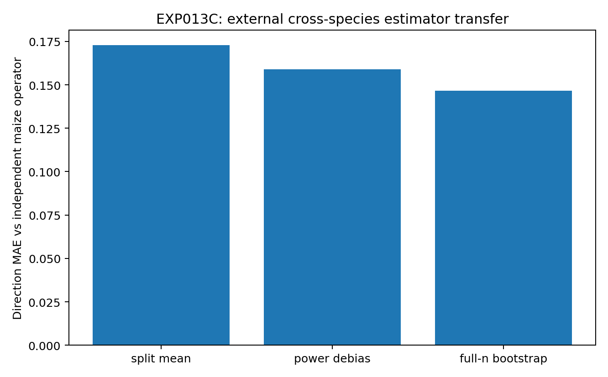

Figure 24. Direction MAE against the independent maize operator reference in EXP013C, using estimator calibrations frozen in EXP013B. Whole-training bootstrap has the lowest error across 36 directions in four chromosome tasks. Bars are pooled point estimates; no uncertainty intervals are shown.

### Ordering transfer and absolute calibration

The endpoint results also expose a calibration boundary. The maize_chr4 reference has four directions with reliability ≥ 0.5, whereas locked bootstrap predicts zero and power debiasing predicts one. The affine calibration learned from the human panel is not a cross-species constant. Bootstrap still orders more reliable directions relatively well, but the absolute 0.5 boundary shifts under the new data distribution.

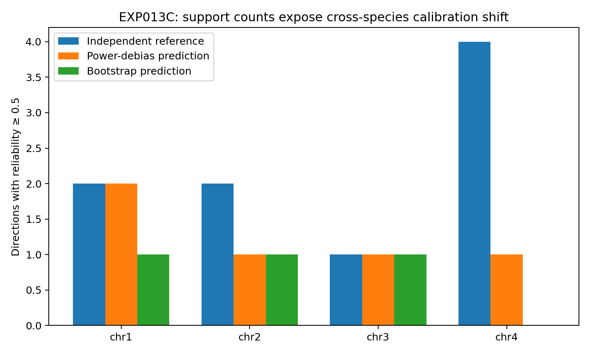

Figure 25. Stable-direction counts in four maize tasks in EXP013C: independent reference, frozen power-debiased prediction, and frozen bootstrap prediction. The largest discrepancy is on chr4. Bars use the common reliability threshold of 0.5 and show point counts without uncertainty intervals.

A Data Passport can reuse an estimator form and ordering procedure while evaluating whether its absolute reliability scale transfers. Direction ordering and MAE should be assessed in the external blind test before choosing domain- or support-conditioned calibration. The reusable component is the measurement procedure; its numerical calibration remains tied to the evidence supporting it.

The archived design fixes the split, marker-selection rule, target grid, missing-data rule, EXP013B coefficients, and endpoints before reading the independent maize reference. The direction-level comparison is thus reported as a cross-species blind test. Model-capacity routing requires a separately frozen model protocol and its own evaluation.

## EXP013D. Sample support and calibration in fixed maize tasks

After EXP013C is revealed, the species, marker panels, and target grids are held fixed while estimator sample size varies. The four 38-marker maize tasks use nested training sizes of 30, 60, and 120, with a separately locked reference of 100 lines excluded from the estimator. This post hoc diagnostic separates improvement with additional sample support from changes in the absolute reliability calibration regime.

Table 22. EXP013D sample support and calibration

| Training n | Power Spearman | Bootstrap Spearman | Locked power MAE | Locked bootstrap MAE | Mean reference reliability |
| --- | --- | --- | --- | --- | --- |
| 30 | 0.517 | 0.584 | 0.149 | 0.137 | 0.318 |
| 60 | 0.673 | 0.700 | 0.138 | 0.137 | 0.414 |
| 120 | 0.903 | 0.882 | 0.098 | 0.128 | 0.460 |

Note. Source: EXP013D sample-support results. Four fixed maize tasks use nested training sets and a separate 100-line reference. Spearman and reliability are dimensionless; MAE measures absolute reliability error. Locked MAE applies the frozen coefficients. The design is post hoc.

Raw Spearman correlation for power debiasing increases from 0.517 to 0.673 to 0.903; bootstrap increases from 0.584 to 0.700 to 0.882. Mean independent-reference direction reproducibility rises from 0.318 to 0.414 to 0.460. The same marker/task relationships become more stable and easier to order as additional real observations are supplied.

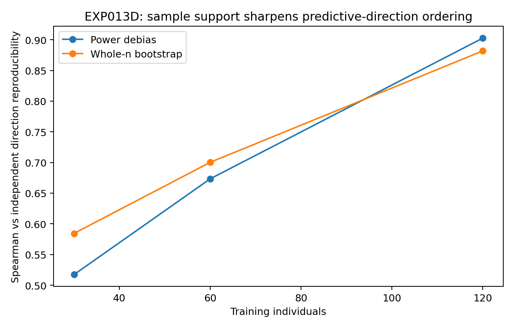

Figure 26. Raw Spearman correlation with independent direction reproducibility at nested training sizes of 30, 60, and 120 in the four fixed maize tasks of EXP013D. Both power debiasing and bootstrap improve. The common reference contains 100 separately held-out lines. Lines connect point estimates; no uncertainty intervals are shown.

Calibration changes as well. Post hoc affine slopes at the three sample sizes are 0.505, 0.558, and 0.697 for power debiasing and 0.775, 0.968, and 1.211 for bootstrap. Neither small sample size alone nor species difference alone explains EXP013C. Sample support affects the clarity of ordering, while domain and sample regime affect the mapping from a raw estimator to absolute reliability.

The estimator component of a Data Passport can therefore have two stages: retain direction-ordering and power information with minimal dependence on calibration, then maintain the absolute reliability calibration separately, together with context such as n, missingness, and conditioning. This supports transfer of a common measurement system across domains while allowing its scale to be recalibrated.

## EXP014A. A Data Passport across four data structures

EXP014A asks whether the same structural measurements can be calculated on different real data forms while retaining meaningful differences. It evaluates the archived 50 × 38 1000 Genomes genotype panel; 569 × 30 continuous Wisconsin Diagnostic Breast Cancer features from scikit-learn; 295 windows with 12 past and 3 future annual sunspot values from the statsmodels 1700–2008 series; and the 34 × 34 binary adjacency profiles of NetworkX's Zachary karate club graph. The original experiment archived task snapshots; the publication evidence retains source identities and derived results without redistributing those observations. This pilot does not train a new large model or select an architecture.

Data Passport version 0.1 calculates common fields for all four structures: raw zero fraction; participation-ratio dimension and top-eigenvalue share of standardized covariance; TWO-NN local dimension; pairwise-distance coefficient of variation; r90, effective rank, top-direction share, average energy, and condition number of the task-conditioned cross-covariance spectrum; and sensitivity over 30 row splits, summarized by stable50, continuous effective support, and support CV. For time series and graph data, row splitting measures sensitivity to partitioning and is not interpreted as strictly independent replication.

Table 23. EXP014A common Data Passport fields

| Real structure | Zero fraction | PR / d | Predictive r90 / q | Predictive effective rank / q | Split effective support / q |
| --- | --- | --- | --- | --- | --- |
| 1000G genotype | 0.685 | 0.283 | 0.556 | 0.329 | 0.320 |
| WDBC tabular | 0.0046 | 0.133 | 0.333 | 0.228 | 0.731 |
| Sunspots time windows | 0.0090 | 0.247 | 0.667 | 0.514 | 0.899 |
| Karate graph adjacency | 0.865 | 0.225 | 0.375 | 0.304 | 0.160 |

Note. Source: EXP014A passport table. All entries are dimensionless fractions; d is total feature count and q target count. Row-split support is a sensitivity measure, particularly for dependent time-series and graph rows. Values are descriptive and carry no universal better/worse ordering or causal adjustment.

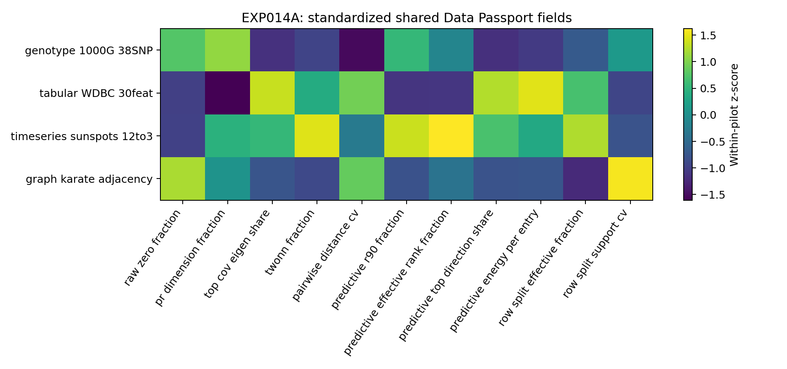

Figure 27. Standardized Data Passport fingerprints for the four real datasets in EXP014A. Each column is a measured field, standardized across this four-dataset pilot; colour indicates relative position within that set. It is not a validated data-type classification boundary. No uncertainty intervals are encoded.

### Interpretation of a shared measurement interface

The same mathematical questions produce distinct continuous fingerprints. Genotypes have raw zero fraction 0.685 and predictive effective-rank fraction approximately 0.329. WDBC has lower global PR fraction, 0.133, but row-split effective support 0.731. Sunspot windows have the highest predictive effective-rank fraction, 0.514, with split support approximately 0.899. Karate adjacency is sparse, with zero fraction 0.865 and split support approximately 0.160. These measured structural coordinates complement categorical labels such as tabular, graph, and genome.

The four-dataset pilot supplies a draft measurement interface, not a dataset atlas. The unexecuted EXP014B design places multiple real datasets within each structure, freezes the fields, and compares within-structure variation with between-structure differences. It asks whether datasets form reproducible geometric neighbourhoods beyond file-type labels. Such evidence would provide a basis for a separately designed blind test of architecture routing.

By EXP014A, the genomic capacity study supports a broader measurement layer for data-oriented modelling. Raw data are expressed in a task-conditioned view; data geometry, predictive geometry, sample support, and estimator resolution can then inform capacity allocation or model search. Genomics supplies the most extensively tested case in this report and a method for measuring what a dataset supports under its present sampling conditions.

## EXP015A. Matched-width geometry of genome, RNA, and protein

This branch examines omics layers with a defined mechanistic relationship; the multi-dataset atlas design EXP014B remains unexecuted. RNA and protein come from the same NCI-60 cancer cell lines: HG-U133A GCRMA RNA expression and log2 lysate antibody-array protein expression. Removing LC:NCI_H23, whose RNA measurements are all missing, leaves 59 common cell lines, 22,283 RNA probes, and 162 protein probes. The genome comparator is the archived AEHRC/PEPS 1000 Genomes 162-SNP matrix, downsampled to 59 individuals using seed 15015.

The main comparison fixes all three matrices at 59 × 162 to control variable count. RNA uses the 162 probes with the highest raw variance among 22,283 probes; protein uses all 162 probes; genome uses all 162 SNPs. Feature-wise mean imputation where required and z-scoring use each matrix's own values. The sample-space Gram spectrum yields participation-ratio dimension, covariance r90, and top-eigenvalue share; TWO-NN and pairwise-distance CV are also calculated. The full 22,283-probe RNA matrix provides a sensitivity analysis.

Table 24. EXP015A matched-width layer geometry

| Layer (59 × 162) | PR dimension | TWO-NN | Covariance r90 | Top eigen share | Distance CV |
| --- | --- | --- | --- | --- | --- |
| Genome (1000G subset) | 40.00 | 49.87 | 42 | 0.058 | 0.061 |
| RNA top-variance 162 | 10.53 | 7.55 | 27 | 0.211 | 0.169 |
| Protein lysate array | 15.44 | 13.16 | 30 | 0.168 | 0.153 |

Note. Source: EXP015A geometry results. All three matrices have 59 rows and 162 features; the genome comparator is a different cohort from the matched RNA/protein cells. PR and TWO-NN are dimension estimates; covariance r90 is a count; shares and CV are dimensionless. Features are mean-imputed where necessary and z-scored, without adjustment for cohort or tissue.

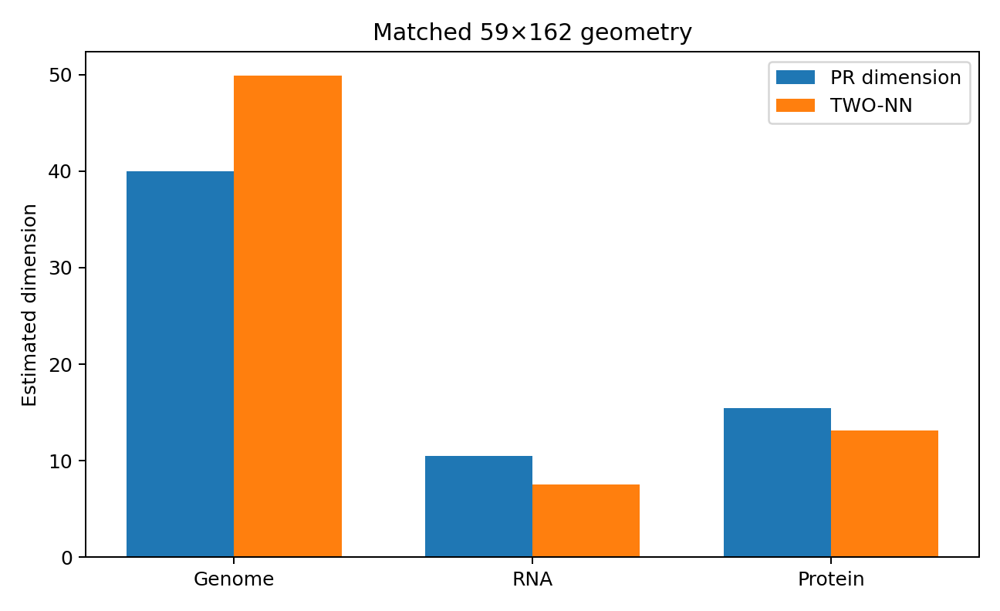

Figure 28. Participation-ratio and TWO-NN dimensions for matrices matched at n = 59 and d = 162 in EXP015A. Genome observations are 1000 Genomes individuals; RNA and protein are matched NCI-60 cell lines. Expression layers show more concentrated geometry than the genome comparator. Bars are dimension estimates without uncertainty intervals; the genome comparison is across cohorts.

Genome has PR dimension 40.00, TWO-NN 49.87, and top-eigenvalue share 5.84%; RNA has 10.53, 7.55, and 21.12%; protein has 15.44, 13.16, and 16.81%. Restoring all 22,283 RNA probes yields PR 11.84, so the concentration is not created solely by selecting 162 high-variance probes. Protein is slightly higher-dimensional than the top-162 RNA representation. In these assays, the pattern is consistent with coordinated low-dimensional RNA states and some additional protein-layer freedom, rather than monotonic compression through every layer.

To connect cloud geometry with predictive geometry, all three layers use a fixed 162-variable task: the 81 variables at even indices are observed and the 81 at odd indices are targets. Tasks are not reselected between layers.

Table 25. EXP015A fixed within-layer predictive task

| Layer | r90 (q = 81) | Effective rank | Top energy share | Energy / entry |
| --- | --- | --- | --- | --- |
| Genome | 25 | 16.76 | 0.158 | 0.0188 |
| RNA top-variance 162 | 4 | 2.69 | 0.482 | 0.0883 |
| Protein lysate array | 7 | 3.78 | 0.457 | 0.0606 |

Note. Source: EXP015A within-layer spectrum results. Each task has 81 observed and 81 target variables. r90 is an absolute count out of 81, not a normalized fraction. Effective rank is an effective direction count; top share and standardized energy per entry are dimensionless. Larger energy indicates stronger aggregate association, not a causal effect.

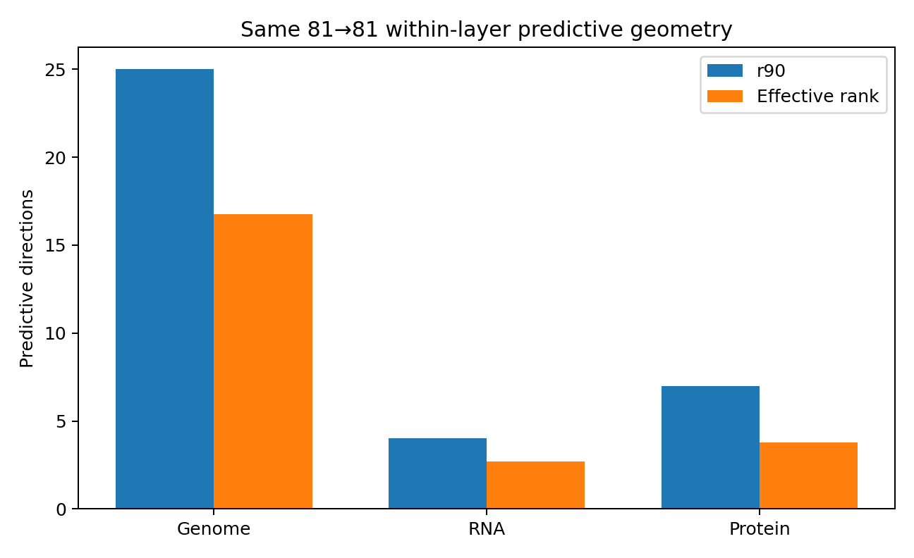

Figure 29. Predictive r90 and effective rank under the same fixed 81-to-81 within-layer task in EXP015A. RNA and protein spectra are much narrower than the genomic spectrum. Bars are computed point summaries; no uncertainty intervals are shown. The genome comparator is not biologically paired with the NCI-60 expression samples.

Genome requires 25 directions to capture 90% of cross-covariance energy and has effective rank 16.76. RNA requires 4 directions with effective rank 2.69; protein requires 7 with effective rank 3.78. Meanwhile, predictive energy per matrix entry rises from 0.0188 for genome to 0.0883 for RNA and 0.0606 for protein. Expression variation is therefore organized into fewer, more strongly coupled directions; the genotype predictive relationships are distributed more broadly. Lower geometric freedom is not equivalent to less information.

These calculations support a layered descriptive account: inherited variation forms a broad combinatorial space across individuals, while expression occupies coordinated states constrained by cellular context and regulation. Concentrated geometry and narrower predictive spectra are measured rather than assumed. Because the genome comparator and NCI-60 are different biological samples, EXP015A establishes a cross-layer geometry comparison, not a longitudinal trajectory of the same objects from DNA through RNA to protein.

## EXP015B. An RNA-to-protein operator in matched cells and genes

RNA and protein are matched by gene symbol in the same 59 NCI-60 cell lines. Selecting the highest-raw-variance probe for each symbol within each layer yields 92 one-to-one symbol pairs. The analysis calculates same-gene correlations and the full 92 × 92 RNA-to-protein cross-covariance operator, with three controls: gene-label permutation, cell-pair shuffling within tissue group, and global cell-pair shuffling.

Table 26. EXP015B RNA–protein operator summary

| Measure | Result |
| --- | --- |
| Matched gene symbols | 92 |
| Mean same-gene correlation | 0.3959 |
| Median same-gene correlation | 0.3806 |
| Positive fraction | 92.4% |
| Gene-label permutation p | 2.00×10⁻⁴ |
| RNA→protein effective rank | 5.01 |
| RNA→protein r90 | 11 |
| Top direction energy share | 0.373 |

Note. Source: EXP015B_operator_summary.json and same-gene correlation table. Results use 59 matched cells and 92 symbols, one highest-variance probe per symbol per layer. Correlations, energy shares, and p-values are dimensionless; ranks count effective directions. The gene-label null uses 5,000 permutations. No tissue-residualized causal model is fitted.

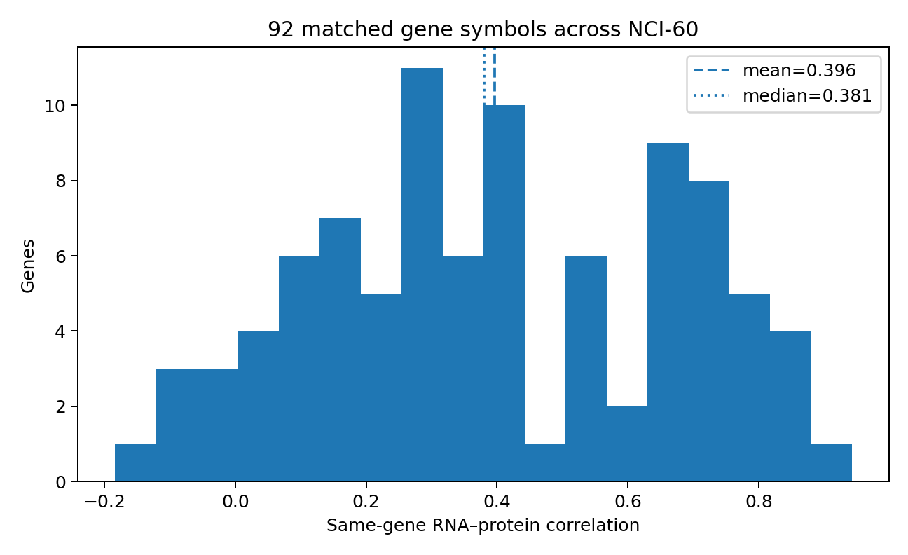

Figure 30. Distribution of same-symbol RNA–protein correlations for 92 matched genes across 59 NCI-60 cell lines in EXP015B. Dashed and dotted vertical lines mark mean 0.396 and median 0.381. The positive shift coexists with substantial gene-to-gene heterogeneity. Histogram counts are genes, not confidence intervals.

Mean correlation across the 92 pairs is 0.396, median 0.381, and 92.4% are positive. Under 5,000 permutations of protein gene labels, the null mean is 0.00293 and its 99th percentile is 0.0471; the empirical p-value for the observed mean is 2.00 × 10⁻⁴. Strong pairs include GSTP1, r = 0.943, PRSS8, 0.877, and CDH1, 0.846, while RELA, SMARCB1, and VASP can be near zero or negative. Mechanistic alignment accompanies substantial cross-layer structure, with heterogeneous coupling rather than a common one-dimensional RNA-to-protein ratio.

The full RNA-to-protein operator has cross-covariance energy 313.85, energy-effective rank 5.01, r90 = 11, and top-direction energy share 37.3%. Relationships among 92 RNA and 92 protein variables are organized through a small number of shared cross-layer state directions rather than 92 independent channels.

Table 27. EXP015B cell-pair controls

| Cell pairing | Mean same-gene r | Operator energy |
| --- | --- | --- |
| True matched cells | 0.3959 | 313.85 |
| Within-tissue cell shuffle | 0.1704 | 249.52 |
| Global cell shuffle | -0.0004 | 146.07 |

Note. Source: EXP015B cell-shuffle control results. Correlations are dimensionless; energy is the sum of squared standardized cross-covariance entries. The within-tissue control retains lineage composition. Values are reported control summaries, with 3,000 shuffles per control according to the archived protocol.

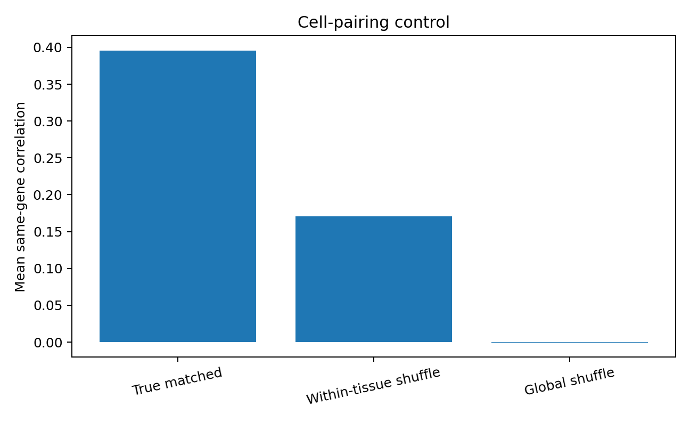

Figure 31. Mean same-gene correlation under true pairing, within-tissue cell-pair shuffling, and global cell-pair shuffling in EXP015B. The within-tissue control retains cancer-lineage composition while reducing mean correlation from 0.396 to 0.170; global shuffling reduces it to approximately zero. Bars summarize the archived controls without uncertainty intervals.

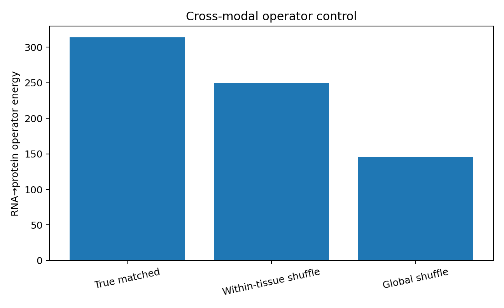

Figure 32. Full RNA-to-protein operator energy under the same controls in EXP015B. Energy is 313.85 for true pairing, 249.52 for within-tissue shuffling, and 146.07 for global shuffling. The archived protocol reports 3,000 shuffles per cell-pair control and empirical p ≈ 3.33 × 10⁻⁴ for each. Bars are control summaries, without uncertainty intervals.

Within-tissue shuffling preserves large-scale cancer-lineage states, leaving more structure than global shuffling. True cell-line pairing still exceeds the within-tissue control. The cross-layer relationship thus includes at least a shared lineage/state component and an additional contribution associated with the specific RNA–protein pairing of each cell state. A Data Passport should characterize the organization of connections between layers alongside the dimension of each layer.

For data with a specified mechanistic chain, keep separate layer-geometry and transition-geometry tables. The first records each layer's PR, local dimension, and within-layer spectrum. The second records operator rank and energy, same-object reproducibility, and controls that preserve relevant grouping structure while disrupting pairing. The interface then represents state spaces and relationships between them, beyond a simple concatenation of matrices.

The protein evidence is specific to the 162-probe NCI-60 lysate antibody array used here. The registered EXP015C design uses paired genome-wide genotype and whole-transcriptome measurements in GEUVADIS/1000 Genomes individuals to assess layer and genome-to-RNA transition geometry. A broader quantitative-proteome replication remains a separate, unexecuted design.

EXP015A/B source identities: aalfons/nci60 HG-U133A GCRMA RNA, blob 3cbbe27f2d78372e1c885b1a5ede16ebf76c30c7; lysate-array protein, blob ed0aa9ac1421e47fd1ba80c193e8e663f16548cd; and the aehrc/PEPS input-small.csv genome comparator, blob 280f74857402f303846f552366e742a7c9b838b1. Provider matrices are not repackaged.

## Integrated discussion: from data freedom to transition freedom

The experimental series begins with the amount of variation present in real data and the degrees of freedom needed to use it for prediction. EXP001–EXP015B extend that question into a measurable chain: how data vary, which variations connect inputs to targets, which relationships have stable sample support, how well the estimators resolve those relationships, and how much capacity is useful under those conditions. Counterexamples, external blind tests, sample-size controls, pairing shuffles, and cross-layer omics operators drive this refinement.

### Data-cloud breadth and task freedom

EXP001 demonstrates a broad real genomic cloud. Among 2,504 individuals and 162 SNPs, global participation-ratio dimension is 119.03, local TWO-NN approximately 54.74, and variance explained by the first three PCs only 8.35%. Nevertheless, the first 12 PCs recover super-population with five-fold accuracy 87.18%. A few informative directions can coexist with extensive high-dimensional variation; visual prominence differs from the total freedom present in the data.

EXP004 provides the fixed-size counterexample: at N = 240 with target count, sample size, and model form controlled, the highest-local-dimension spread subset needs rank 4, while contiguous windows need ranks 16–24. In EXP005, observed-to-target spectra clarify the difference: predictive r90 is 2 for spread and up to 7.5 for contiguous windows, with correlation 0.873 between r90 and best rank. Data freedom and predictive freedom describe different aspects of the same matrix.

### Task relationships under finite sample support

EXP008–EXP011 bring prediction geometry into the actual sampling regime. Reducing only training individuals in chr21 changes validation-optimal rank in 16 of 19 windows, with mean best rank decreasing from 43.37 to 35.37. Across training sizes from 300 to 1,505, mean best rank in four fixed windows rises from 22 to 44 and plateaus. Relationships are held fixed; the amount of observational support changes.

EXP011 measures that layer directly through reproducible signal and half-sample difference power. Across eight chr21/chr22 windows, stable50 correlates 0.929 with the minimum rank within 0.005 of the best validation R²; the four chr21 windows alone give r = 0.993. At n = 300, 657, and 1,505, mean stable50 rises through 11.25, 19.00, and 28.00, while mean validation-optimal rank rises through 22, 38, and 44. Shuffling observed-to-target individual pairing within super-population reduces mean stable50 from 28.25 to 4.25. Supported predictive freedom thereby has an observable counterpart in directions that reproduce under the available sample support.

### Estimator resolution and calibration state

In the 30-person external training sample of EXP012, 15/15 split-half estimation gives stable50 = 1, while minimum near-optimal validation rank is 5 and the full curve retains gains from rank 1 to 5. EXP013A shows that threshold adjustment and simple soft counting do not recover that capacity. Mean repeated-split gap grows from 1.22% in moderate-sample chr21 tasks to 20.48% across the two small-sample target grids. The supported structure and the resolution of its measurement are separate states.

EXP013B/C/D separate direction ordering from direction counting. In 30-person human-genotype resampling, bootstrap reaches raw Spearman 0.768 and grouped-LOO calibrated direction MAE 0.127; power debiasing gives the lowest stable-count MAE, 0.941. Under frozen transfer to independent maize data, bootstrap again has the lowest direction MAE, 0.1466, while absolute calibration shifts. Increasing n from 30 to 120 in fixed maize tasks raises power/bootstrap Spearman from 0.517/0.584 to 0.903/0.882. A two-stage interface can preserve ordering and signal power, then maintain absolute reliability calibration for the specific domain and sample regime.

### Generality in the measurement interface

EXP014A calculates common Data Passport fields on genotype, tabular, time-series, and graph structures, obtaining distinct continuous fingerprints. This provides a concrete entry point for data-oriented modelling: measure variation, task relationships, evidence support, and resolution, then pass those measurements to capacity allocation or model search. Structural descriptions can thus include computed state coordinates alongside conventional data-type labels.

### Layer geometry and transition geometry in omics

At matched n = 59 and d = 162 in EXP015A, PR dimensions for genome, RNA, and protein are 40.00, 10.53, and 15.44, with TWO-NN values 49.87, 7.55, and 13.16. Under the same 81-to-81 within-layer task, r90 is 25 for genome, 4 for RNA, and 7 for protein, while RNA and protein have greater predictive energy per matrix entry. Many expression variables vary jointly through fewer and stronger coordinated directions.

EXP015B aligns 92 RNA–protein symbols in the same 59 NCI-60 cell lines. Mean same-gene correlation is 0.396, 92.4% are positive, and gene-label permutation gives p = 2.00 × 10⁻⁴. The full operator has effective rank 5.01, r90 = 11, and top-direction energy share 37.3%. Within-tissue cell-pair shuffling reduces correlation from 0.396 to 0.170 and energy from 313.85 to 249.52; global shuffling gives near-zero correlation and energy 146.07. A shared lineage/state field and specific object pairing both contribute. Layer geometry describes each state space; transition geometry describes the relationships connecting those spaces.

### An empirical framework for usable capacity

The evidence supports the sequence: data freedom; predictive or transition freedom; sample-supported predictive freedom; estimator-resolution and calibration state; and usable model capacity. These layers ask, respectively, how variation is distributed, what the task or layer relationship transmits, which directions reproduce with present observations, how well those directions are measured, and what capacity is useful under the resulting conditions. The experiments supply matrix measurements, counterexamples, sample-size controls, external blind tests, and grouping-preserving pairing controls for these distinctions.

Capacity matching concerns relationships that exist in the task, connect its variables, and have sufficient evidential support. Extensive variation with narrow task relationships offers limited additional predictive structure. Rich relationships with growing sample support allow more directions to rise above estimation noise. Limited estimator resolution calls for an explicit account of measurement reliability and a capacity-search interval. Data measurement, relationship measurement, sample support, and model capacity can therefore be coordinated within one operational interface.

### Registered design for paired genome–transcriptome analysis

EXP015C specifies feature-scale geometry convergence for paired GEUVADIS/1000 Genomes whole-genome and whole-transcriptome matrices; genome-to-RNA effective rank, r90, and shared-state spectra in the same individuals; sample-supported transition freedom as a function of n; and chromosome-matched, cis-local, distant same-chromosome, and trans components. The design compares genome freedom, RNA freedom, transition freedom, and supported transition freedom in one evidence framework. It tests whether raw genetic variation, cross-layer predictive variation, and variation reproducible at the available sample size are distinct quantities. Only the frozen data interface and protocol are supplied; no EXP015C numerical results are present.

## EXP015C. Paired whole-genome and whole-transcriptome protocol

### Design and data interface

EXP015C uses genotype and RNA-seq measurements from the same individuals rather than the cross-cohort genome comparator in EXP015A. The registered source is the public paired GEUVADIS/1000 Genomes resource: a complete normalized gene-expression matrix and PLINK2 genome-wide genotype files in PGEN/PVAR/PSAM format. This permits layer geometry and genome-to-RNA transition geometry to be evaluated in the same biological objects.

### EXP015C1. Whole-genome and whole-transcriptome geometry

The first analysis compares each layer's geometry without presuming gene matching. Genome uses a chromosome-balanced common-variant panel, with LD-aware and denser genome-wide sensitivity views; RNA uses the full expression matrix. Prespecified measures are participation-ratio effective dimension, local TWO-NN, covariance r90, entropy rank, top-eigenvalue share, spectral decay, and pairwise-distance concentration. Feature counts increase through 10², 10³, 10⁴, and the full set to examine convergence of D_genome(p) and D_RNA(p).

### EXP015C2. Genome-to-transcriptome transition operator

Cross-layer structure is measured in matched individuals using sample-space-equivalent calculations, avoiding explicit construction of a matrix with millions of SNPs by tens of thousands of genes. Primary measurements include transition-spectrum effective rank, r90, top-direction share, kernel alignment, and a regularized-whitened shared-state spectrum. Within-population and global individual-pair shuffles separate population/state structure from the contribution of individual pairing.

### EXP015C2B. Sample-supported transition freedom

The design increases the number of available individuals within a fixed layer relationship, recalculates transition spectra, and uses grouping-preserving shuffles to establish a direction-level noise floor. D_G→R^supported(n) denotes genome-to-RNA transition directions that reproduce across independent observations under the current sample support. It is reported separately from genome and RNA data freedom.

### EXP015C3. Chromosome, cis, and trans decomposition

A 22 × 22 chromosome-to-chromosome transition-energy matrix compares the matched-chromosome diagonal with off-diagonal entries, with chromosome-label permutation as a control. Gene coordinates then anchor comparisons among cis-local variants within ±1 Mb, distant variants on the same chromosome, and trans variants on other chromosomes. Population-residualized versions test for additional local structure after removing a broad population field.

### Prespecified interpretation

The protocol separates data freedom within genome and RNA, predictive or transition freedom between them, and transition freedom supported by the current sample. Only computed values qualify as results. The proposed relationships D_genome ≫ D_G→R and D_G→R ≲ D_RNA remain hypotheses to be tested.

### Protocol status

The source archive records verified source/file identities and a frozen calculation protocol. It describes a main data package of approximately 1.8 GB, including a genome-wide PGEN file of approximately 1.4 GB and an expression matrix of approximately 90.8 MB. These provider files are not included in the publication package. No EXP015C numerical result, result table, or result figure is registered in the supplied evidence.

## Practical study-design checklist

### 1. Define the task and the sampling unit.

State what a row represents, what is observed, what is predicted, and whether rows can be treated as independent. Separate a within-layer prediction task from a between-layer operator.

### 2. Freeze preprocessing and splits.

Record sample/feature identifiers, seeds, missing-data rules, MAF filters, and train/validation/test roles. For prediction, estimate filtering and standardization from training observations only.

### 3. Measure the data and the relationship.

Report data-cloud summaries and the full task-conditioned spectrum together. Match n, input width, target width, and preprocessing for comparisons intended to isolate geometry.

### 4. Check sample support and measurement resolution.

Report half-sample size, reliability spectrum, stable50, continuous support, and repeated-split variation. In dependent data, call a row-split analysis sensitivity analysis unless independence is justified.

### 5. Separate ordering, counting, and calibration.

At small n, compare the bootstrap reliability ordering with a power-debiased support count and report disagreement. Evaluate the absolute calibration in the new domain and sample regime.

### 6. Search a range of capacities.

Use a prespecified rank grid with room above an estimated stable count. Report boundary selections, the argmax, minimum near-optimal rank, and performance regret. The current 1.29 ratio is an empirical search guide, not a universal rule.

### 7. Use pairing controls that match the question.

Compare true pairing with within-group and global shuffles when the design supports them. State precisely which grouping structure each control retains and which correspondence it breaks.

### 8. Preserve the evidence chronology.

Freeze prospective transfer rules before revealing outcomes. Keep post hoc explanations separately labelled, and report a failed endpoint without retrospectively widening its prediction band.

### 9. Publish an auditable record.

Include result tables, figures, exact source identities, protocols, and executable code where available. Describe any script that covers only part of an analysis. Acquire provider observations separately.

### 10. Report supported conclusions.

Distinguish measured results, interpretations, and unexecuted hypotheses. No universal minimum sample size or universal stability threshold is established by this series; resolution and transfer must be assessed for the actual task.

## Appendix A. Experiment map and evidence status

Table 28. Experiment map and evidence status

| ID | Question | Evidence status | Scope |
| --- | --- | --- | --- |
| 001 | Geometry of a real data cloud | Direct matrix calculation | 2,504 × 162 real 1000 Genomes |
| 002 | Capacity peak and coarse/fine structure | Direct prediction experiment | 2,504 × 960 real chr21 |
| 003A | Capacity trend with scale | Exploratory; target-count confounding | Original results retained |
| 003B | Scale trend with fixed targets | Controlled experiment | q = 24 |
| 004 | Dimension-only capacity rule | Fixed-N counterexample | N = 240 |
| 005 | Predictive spectrum and capacity | Fixed-N calculation | Cross-covariance spectrum |
| 006A | Capacity-grid truncation at q = 24 | Design diagnostic | Basis for expanded grid |
| 006B | Internal chr21 geometry-to-rank rule | LOOCV 18/19 | q = 48 |
| 006C | Permutation and neighbouring-window effects | Exact permutation and block CV | p ≈ 3.97 × 10⁻⁵ and 0.0076 |
| 007 | Overestimation on external chr22 | External blind test | 0/4 exact; small R² regret |
| 008 | Effect of sample support on optimal rank | Same-data control | 1,505 → 657 training individuals |
| 009 | Capacity growth and plateau with n | Sample-size scan | 300 → 1,505 |
| 010 | Support matching and transfer error | Post hoc mechanism diagnostic | Rank MAE 16 → 8 |
| 011 | Direction stability and near-optimal capacity | Direct calculations and shuffles | chr21/chr22 split-half operator reliability |
| 012 | Small-sample transfer of a stable50 capacity band | Preregistered external blind negative result | Band [1, 1] misses near-optimal rank 5; resolution boundary |
| 013A | Scalar reliability recalibration at small n | Post hoc calibration and split-sensitivity diagnostic | Threshold/soft counts do not recover rank 5; resolution warning |
| 013B | Power debiasing and whole-training bootstrap | Raw-operator resampling with 20-person holdout per split | Bootstrap best ordering; power best count MAE; external test in 013C |
| 013C | Cross-species transfer of a locked estimator | Preregistered external maize operator blind test | Bootstrap MAE 0.1466; ordering transfers more strongly than absolute scale |
| 013D | Sample resolution and calibration regime | Post hoc fixed-maize-task control at n = 30/60/120 | Ordering sharpens with n; affine calibration also changes |
| 014A | Common Data Passport across structures | Four-real-dataset pilot | Genotype, tabular, time series, graph |
| 014B | Passport neighbourhoods within data structures | Unexecuted design | Protocol concept only |
| 015A | Layer geometry and fixed-width predictive spectra | Direct real-matrix calculation | NCI-60 expression; 1000 Genomes comparator matched on n and d |
| 015B | Mechanism-aligned RNA-to-protein operator | Same-cell, same-gene measurements and shuffle controls | 92 matched symbols; gene labels and within-tissue/global pairing |
| 015C | Paired whole-genome/transcriptome geometry | Locked protocol only; no numerical result | GEUVADIS/1000 Genomes design |

Note. EXP identifiers remain stable across the report and evidence files; A/B/C/D denote distinct designs within an experiment family. Numerical findings use actual data. Blind-test chronology is documented by the supplied locked records; this publication does not independently establish a public preregistration timestamp. EXP014B and EXP015C are designs, not completed numerical studies.

## Appendix B. Data sources and verifiable identifiers

SOURCE_MANIFEST.csv records the repository, path, Git blob identifier, and URL supplied for each source. The identifiers below specify the versions recorded in the experiment archive. Provider observations are not redistributed in this publication package.

GENOME-GEOMETRY-001 · aehrc/PEPS · SampleData/input-small.csv
Git blob: 280f74857402f303846f552366e742a7c9b838b1
https://github.com/aehrc/PEPS/blob/master/SampleData/input-small.csv

GENOME-GEOMETRY-001 · igvteam/igv-data · data/tutorials/vcf/integrated_call_samples_v3.20130502.ALL.panel
Git blob: bc447774e6bacc2f4ca3619d14bf96a1846aa4e4
https://github.com/igvteam/igv-data/blob/main/data/tutorials/vcf/integrated_call_samples_v3.20130502.ALL.panel

GENOME-CAPACITY-002 through PREDICTIVE-DIRECTION-STABILITY-011 · mccoy-lab/hgv_modules · 05-pop_structure/common_variants.txt.gz
Git blob: d9302933c2da909dff257263b92e243f11191f5a
https://github.com/mccoy-lab/hgv_modules/blob/main/05-pop_structure/common_variants.txt.gz

GENOME-CAPACITY-002 through PREDICTIVE-DIRECTION-STABILITY-011 · mccoy-lab/hgv_modules · 05-pop_structure/integrated_call_samples.txt
Git blob: 411e4fff4d0db8d022dea15c6afb4f0cc89b91e2
https://github.com/mccoy-lab/hgv_modules/blob/main/05-pop_structure/integrated_call_samples.txt

EXTERNAL-TRANSFER-007 + PREDICTIVE-DIRECTION-STABILITY-011 · guillermocomesanacimadevila/Population-to-Genotype-dimensionality-reduction · Updated Matrices/matrix.csv
Git blob: 47ac2529c50e84f216845be69f385e2f1280af7c
https://github.com/guillermocomesanacimadevila/Population-to-Genotype-dimensionality-reduction/blob/main/Updated%20Matrices/matrix.csv

EXTERNAL-TRANSFER-007 + PREDICTIVE-DIRECTION-STABILITY-011 · guillermocomesanacimadevila/Population-to-Genotype-dimensionality-reduction · Data sets/phase1_integrated_calls.20101123.ALL.panel
Git blob: 2b70a71fba42f2b4870889eff790ee67ad5e905a
https://github.com/guillermocomesanacimadevila/Population-to-Genotype-dimensionality-reduction/blob/main/Data%20sets/phase1_integrated_calls.20101123.ALL.panel

SMALL-EXTERNAL-STABILITY-BLIND-012 · bionumpy/bionumpy · example_data/thousand_genomes.vcf
Git blob: 5faa223e61eb3b301ebc397eab1df22e4f105f8d
https://github.com/bionumpy/bionumpy/blob/main/example_data/thousand_genomes.vcf

CROSS-SPECIES-ESTIMATOR-BLIND-013C + SAMPLE-SUPPORT-DIAGNOSTIC-013D · shanwai1234/MVP · demo.data/hapmap/hapmap.txt
Git blob: b8120641d506cd1ee55e46d8c345f313501c21ae
https://github.com/shanwai1234/MVP/blob/master/demo.data/hapmap/hapmap.txt

EXP014A uses Wisconsin Diagnostic Breast Cancer from scikit-learn 1.8.0, annual sunspots from statsmodels 0.14.6, and Zachary's karate club from NetworkX 3.6.1. The source manifest preserves the recorded SHA-256 identities of the task snapshots; the snapshots themselves are excluded from the public evidence package.

## Appendix C. Evidence and reproduction coverage

The evidence package includes the supplied experiment-level CSV and JSON results, source manifest, protocols, and PNG figures. EXP015A includes genome/RNA/protein geometry and fixed 81-to-81 predictive-spectrum tables. EXP015B includes 92 same-gene RNA–protein correlations, cross-layer operator spectra, and gene-label and cell-pair shuffle controls. Script coverage varies by experiment and is documented in REPRODUCTION_GUIDE.md; some files provide protocol or seed records rather than an executable end-to-end analysis. Source repositories, paths, and blob identifiers support independent acquisition without repackaging provider observations.

### Reproduction scope

The source archive provides numerical outputs and figures throughout the completed series, but executable coverage is uneven. Early capacity studies do not preserve a sufficiently exact end-to-end fitting specification in the supplied code. EXP013A can be recalculated from released result tables after path adaptation. EXP013B requires separately acquired genotype observations. The script named reproduce_EXP013C_013D.py implements the EXP013C path and does not execute the complete EXP013D sample-size scan. EXP014A code constructs input matrices but does not implement the full Passport calculation. The EXP015 script records the protocol and seeds only. REPRODUCTION_GUIDE.md documents these distinctions and the release audit checks.

### Publication annotation on implementation details

The EXP013C locked record and the supplied implementation use an LCG/Fisher–Yates outer sample split; a script docstring instead refers to NumPy PCG64 for that split. The locked record and executable split function agree, so the docstring inconsistency is identified in the reproduction guide. Estimator resampling seeds remain as recorded. No numerical result has been recalculated from provider observations for this publication.

### Publication checks

The English edition preserves all 27 scientific source tables and all 32 figure placements, including the repeated framework overview, while adding a terminology table and reading/practice guidance. Source result files, figure bytes, numerical summaries, and chronology labels were checked against the supplied archive. Provider-level genotype, clinical-feature, time-series, and graph snapshots and the nested original archive are excluded from publication.

### Research note

Some hypotheses developed in this research have received substantive validation through engineering implementations. Data models are forthcoming.

