# Language Structure and Control Geometry

Biosphere 3 · Chapter 4 Data Zoo · Subreport 1 · Language

English report edition v1.0 · 27 September 2026

## Executive summary

Language can combine a narrow set of local operations with a much broader space of complete sentences. This report examines that distinction through human simplification, multilingual corpora, programming and response forms, controlled tool interfaces, dependency structure and a compact engineering prototype. The central question is how rich sentence behavior can be built by repeatedly composing relatively small local relation units.

The natural-language studies separate several measurable layers. Human simplification preserves concentrated local transition geometry as it reorganizes linguistic material. Across ten dependency treebanks, 97.36% of the measured explicit predicate relations contain at most three participants; longer sentences grow chiefly by adding and arranging more relations. Matched-meaning and script interventions show that writing-system overlap, learned surface transfer and local structural compatibility are different quantities. These results describe the stated corpora and representations, with a real high-arity tail and broader whole-sentence geometry.

The engineering construction tests a specific implication: retain a compact local composer and add routing between related predicates. With matched feature width, the hierarchical interface produces a small, consistently directed improvement across ten held-out languages. This is evidence for structural reconstruction from annotated trees. The tool-chain studies independently show how state continuity, result identity, representation and training support affect controlled execution. Together, the studies support a layered account of language and interfaces, with the scope of each result stated beside its evidence.

## Reading guide

Readers interested in language structure can follow Sections 3–5 and 16–21, then the synthesis in Sections 22–23. Sections 6–8 connect linguistic realization to executable objectives. Sections 9–15 examine controlled tool interfaces. Section 2 explains the inherited Chapter 3 foundation.

| Sections | Research line | Question |
| --- | --- | --- |
| 3–5 | Simplification and multilingual transitions | What stays locally concentrated as linguistic material changes? |
| 6–8 | Programming and response forms | Which structure survives a change in realization or request phrasing? |
| 9–15 | Tool interfaces | How do state, identity, representation and training support alter execution? |
| 16–17 | Language and writing system | How much compatibility comes from script overlap or aligned meanings? |
| 18–20 | Relation structure | How do local width, compression and nonlocal organization interact? |
| 21 | Engineering construction | Does explicit hierarchical routing improve structural reconstruction at matched feature width? |

### Evidence availability

Fifteen independent study archives are included. For LSP-002, LSP-003, TOOL-CHAIN-GEOMETRY-006B and NATLANG-COMPAT-004A, this edition includes the original report results, extracted tables and all embedded figures; their separate analysis archives were not recovered. The evidence index records the available files and code coverage study by study. Extracted report tables are transcriptions, not independent recomputations.

### Reading the measurements

Every dimensional result belongs to a specified measured object: a transition field, an operator family, a whole-sentence representation or a dependency descriptor. Reported benchmark scores belong to their dated snapshots. A plotted interval has the meaning stated in the source caption or methods; where no interval definition is recorded, this edition does not assign one.

## Terms and abbreviations

| Term | Meaning in this report |
| --- | --- |
| Local movement width | Concentration of a measured transition or control spectrum; it is distinct from the dimension of complete sentence representations. |
| Stable rank and participation rank | Effective spectral widths under the definition used in each assay. Compare values only for the same measured object and normalization. |
| PCA95 and top-3 energy | The number of principal components needed for 95% of variance; and the fraction carried by the first three components. |
| TwoNN and distance CV | A nearest-neighbor estimate of local dimension; and the coefficient of variation of pairwise distances. |
| UD and explicit arity | Universal Dependencies annotations; the number of the specified participant dependents attached to one observed predicate. |
| Provenance and normalization | Which call a returned result belongs to; and how its representation is converted into a usable internal form. |
| Compatibility and transfer gain | Measured recoverability under a stated representation and evaluation distribution; learned transfer relative to a direct-surface baseline. |
| NRMSE and pp | Root mean squared error with the stated training-based normalization; and percentage points. Lower NRMSE is better. |
| MoE and matched capacity | Mixture of experts; a comparison with the stated feature or model budget held equal. Feature matching does not by itself establish equal total runtime cost. |
| MCTS CSS FLORES BFCL | The Chinese simplification, multilingual parallel-sentence and tool-calling sources named in the corresponding methods and references. |

### Evidence notes

Publication annotations identify two specific limitations in the supplied record: the 7D versus 8D neighborhood diagnostic in Section 20 and the message-count interpretation of the shuffled-edge control in Section 21. The original findings and numbers are retained. Engineering and MoE guidance is interpreted at the evidence level stated in each experiment.

## 1 Scope and evidence conventions

Parent record. Chapter 3 - Machine Learning Epidemiology and Case Dissection, especially Research_Report/REPORT_EN.md sections 25-30, 49.4-49.6 and 50.2 in the public Biosphere 3 repository.

Topical scope. This edition studies language and response form as observable structure: how linguistic material is organized, compressed, recoded and moved through predictive/control geometry, and how the same task is realized as natural-language procedural response versus algorithmic response. Neural hidden states, corpus transition fields, human simplification behavior, explicit token codes, procedural event paths and executable code structure are treated as complementary measurement interfaces.

Evidence wording. Statements are tied to the specified construction. The report records what the measured systems and corpora support: dominant movement dimensions, operator behavior, compression trajectories and structural regularities. Mechanistic extensions are stated as testable hypotheses when the evidence reaches that level.

Calculation provenance. Quantitative combinations of datasets, model results, geometric measurements and benchmark categories are interpreted through the recorded calculations and their source identities. Uncomputed extensions are hypotheses. The accompanying evidence index distinguishes recovered analysis artifacts from results available only in this report; preparing this edition does not constitute an independent rerun of every experiment.

## 2 Foundation from Chapter 3

The language branch of Chapter 3 had already moved from model-internal observations to direct measurements of language as a dynamical object. Four experiments - LANG-016 through LANG-019 - supply the starting evidence for this topical edition.

Table 1. Inherited language experiments and evidence scope.

| Chapter 3 experiment | Measured object | Key result | Role in this edition |
| --- | --- | --- | --- |
| LANG-016 | Future-control Jacobian geometry after training | Language stable rank 2.238; entropy/difficulty-matched 6D world 3.101; 6D -> Language 2.196 | Language training concentrates available control into a few high-gain modes |
| LANG-017 | Teacher-side conditional transition field | First-order language stable rank 2.481; top-3 energy 71.95%; longer context adds weaker directions | Low-dimensional movement is already present in the language teacher |
| LANG-018 | State-dependent linguistic operators | Affine state-dependent operators outperform fixed shifts/resets; ordered composition is noncommutative | Words/tokens act as reusable context-dependent transformations |
| LANG-019 | Higher-level fitted relations | Relation-conditioned residual stable rank 1.327; top-3 energy 95.18% | Higher levels contain concentrated residual structure around lower-level composition |

Source: LANG-016–019. Values and definitions follow the measurement contract in this section.

### 2.1 Control dimension is not state dimension

The central distinction is: state dimension, dominant movement dimension and generator-family dimension are separate quantities. The technical-English character transition field has a dominant stable rank near 2.5, yet its detailed state and operator spaces retain substantially more dimensions. LANG-018 reports operator-family stable rank 6.018 and approximately 17 modes for 95% operator-family variance.

state dimension != dominant movement dimension != generator-family dimension

### 2.2 Language supplies low-dimensional movement through repeated relations

LANG-017 located the strongest anisotropy before neural training. First-order conditional transitions already concentrate most energy into a few common directions. Context lengths two through five add progressively weaker predictive directions. This supports a working picture in which local movement remains narrow and longer histories add structured corrections.

### 2.3 Linguistic units behave as state-dependent operators

LANG-018 represents a linguistic unit a by its effect on a current predictive state x. The measured update is better described by a state-dependent transformation than by a fixed displacement or reset. Correctly ordered composition predicts two-step trajectories better than reversed composition, and matched symbol multisets produce different future distributions when operation order is changed.

$$
x_{t+1} = T(a_t, x_t)[x_t]
$$

$$
T_b(T_a(x)) \ne T_a(T_b(x))
$$

### 2.4 Current hierarchical claim

The current Chapter 3 validation establishes useful state-dependent fitted updates and directly measured composition error across four text sources. The unrestricted 10D affine operator envelope saturates its 111-dimensional affine space, so independent generators beyond a complete lower-level closure remain a provisional extension. This topical report therefore tests linguistic structure directly before assigning new generator classes.

### 2.5 Working synthesis entering the language topical study

The inherited evidence supports a specific research question: rich language may combine high-dimensional content with low-dimensional local movement, a repertoire of reusable state-dependent operators, and repeated noncommutative composition. The missing measurement is linguistic anatomy: which surface components are preferentially removed, which structures persist, and how the data geometry changes as language is deliberately compressed.

high-dimensional content -> few dominant local movements -> reusable operators -> ordered composition -> sentence trajectory

## 3 Human Chinese sentence simplification

LSP-001

This experiment returns from mathematical geometry to observable linguistic structure. It asks whether humans remove sentence material in a systematic hierarchy and whether the surviving structure is consistent with a smaller relational/event backbone.

### 3.1 Data and sample size

Table 2. Human simplification corpora and analyzed pairs.

| Corpus | Original sentences | Human simplifications | Pairs used | Role |
| --- | --- | --- | --- | --- |
| MCTS | 723 | 5 per source | 3,615 | Primary multi-reference analysis |
| CSS | 383 | 2 per source | 766 | Independent operation-label validation |
| Total |  |  | 4,381 | Computed human source-to-simplification pairs |

Source: LSP-001. Values and definitions follow the measurement contract in this section.

MCTS is especially informative because five humans simplify every source sentence. This permits repeated-choice measurements: a surface item can be scored by how often independent simplifiers retain it.

### 3.2 Compression levels and deletion measure

For each source-target pair, compression ratio is target token count divided by source token count. Among the 3,615 MCTS pairs, 2,078 are shorter than the source. These shorter pairs were divided into equal-sized empirical compression strata.

Table 3. Compression strata among references shorter than the source.

| Level | N | Mean target/source length | Interpretation |
| --- | --- | --- | --- |
| L1 mild | 686 | 0.9505 | Small reduction |
| L2 medium | 693 | 0.8552 | Intermediate reduction |
| L3 strong | 699 | 0.6391 | Large reduction |

Source: LSP-001. Values and definitions follow the measurement contract in this section.

Deletion is measured as exact source-token disappearance after multiset matching. This surface definition is reproducible and intentionally counts replacement or paraphrase as disappearance of the original form.

### 3.3 Progressive peeling across linguistic categories

Table 4. Source token disappearance across compression strata.

| Category | L1 mild | L2 medium | L3 strong |
| --- | --- | --- | --- |
| Numbers / quantitative detail | 51.6% | 60.7% | 76.4% |
| Degree, time and common adverbial material | 37.5% | 50.9% | 66.0% |
| Preposition / coverb scaffolding | 30.4% | 49.5% | 61.1% |
| Determiner / demonstrative material | 28.2% | 43.4% | 64.2% |
| Conjunctions | 25.6% | 31.4% | 51.0% |
| Broad content baseline | 22.4% | 31.0% | 47.7% |
| Aspect / modal items | 19.9% | 25.2% | 52.2% |
| Structural particles | 16.0% | 28.6% | 55.9% |
| Pronouns | 9.2% | 20.9% | 44.2% |

Source: LSP-001. Values and definitions follow the measurement contract in this section.

The deletion gradient is structured. Mild compression removes quantitative detail, temporal/degree material, relational implementation and determiner-like information faster than the broad content baseline. Strong compression extends into grammatical and lexical core material. Human simplification therefore behaves as progressive peeling rather than uniform token loss.

### 3.4 Five-reference survival structure

For frequent MCTS source tokens, five-reference exact-form survival produces a large contrast between relation-realization/scaffolding forms and central topical/event content. Examples from this news corpus include:

Table 5. Five-reference survival of selected Chinese source tokens.

| Lower survival examples | Survival | Higher survival examples | Survival |
| --- | --- | --- | --- |
| 已 | 20.6% | 国家 | 93.8% |
| 以 | 34.9% | 企业 | 93.7% |
| 为 | 50.8% | 经济 | 92.2% |
| 将 | 58.7% | 中国 | 88.7% |
| 对 | 65.6% | 说 | 87.8% |
| 与 | 71.0% | 发展 | 86.2% |

Source: LSP-001. Values and definitions follow the measurement contract in this section.

The Chinese entries are retained as linguistic examples in the original token-survival analysis.

The lexical identities of the high-survival content words reflect the news domain. The structural observation is the contrast: relation-realization and auxiliary surface forms are repeatedly reformulated or removed, whereas central event/topic material is preferentially preserved.

### 3.5 Independent CSS validation

CSS provides human operation labels. Among 766 pairs, 212 are tagged for information deletion. These pairs have mean target/source token ratio 0.817, and 92.45% are shorter than the source. Pairs without the deletion tag have mean ratio 1.003, and 30.14% are shorter. The length-based compression strata therefore track the human-annotated deletion operation strongly enough to serve as a first quantitative compression axis.

### 3.6 LSP-001 interpretation

Current evidence supports hierarchical peeling in natural human Chinese simplification. The earliest reductions preferentially remove contextual coordinates, degree/time detail and surface relation implementation. The lexical/event backbone receives higher preservation priority and becomes increasingly compressed only at stronger reduction levels. This supplies a linguistic-anatomy counterpart to the earlier low-dimensional movement result.

## 4 Compression geometry and token recoding

LSP-002

This experiment asks what happens to the language transition field when the same source content is rewritten at progressively shorter human simplification levels. It also asks whether surviving tokens retain their original functional code or are recoded as the sentence is reorganized.

### 4.1 Paired construction

From MCTS, 449 source sentences contain at least three human references shorter than the source under the word segmentation used here. For each source, shorter references were ordered by compression ratio. The longest shorter reference defines the mild level, the median shorter reference defines the medium level, and the shortest reference defines the strong level.

Table 6. Matched MCTS compression trajectory.

| Level | Mean word-length ratio to original |
| --- | --- |
| Original | 1.0000 |
| Mild | 0.9196 |
| Medium | 0.8325 |
| Strong | 0.6564 |

Source: LSP-002. Values and definitions follow the measurement contract in this section.

The analysis uses the same 449 underlying source topics at every level. Geometry changes therefore follow matched human rewriting rather than a change of corpus subject matter.

### 4.2 Word-level one-step transition geometry is preserved

A shared top-128 word/punctuation vocabulary is constructed over the paired corpus. For each level, the one-step conditional transition field is centered by the global next-token distribution and converted to a frequency-weighted covariance operator. Its singular/eigenvalue spectrum supplies stable rank, participation rank and top-k energy.

Table 7. Word-level transition spectrum by compression level.

| Level | Stable rank | Participation rank | Top-3 energy | Top-6 energy |
| --- | --- | --- | --- | --- |
| Original | 1.752 | 2.863 | 75.6% | 81.5% |
| Mild | 1.706 | 2.726 | 76.7% | 83.0% |
| Medium | 1.671 | 2.653 | 76.4% | 82.4% |
| Strong | 1.712 | 2.753 | 76.1% | 82.3% |

Source: LSP-002. Values and definitions follow the measurement contract in this section.

Across a reduction from full length to approximately 66% of the original word count, the dominant word-level movement spectrum remains concentrated at essentially the same rank. The human compression path preserves the low-dimensional local movement backbone.

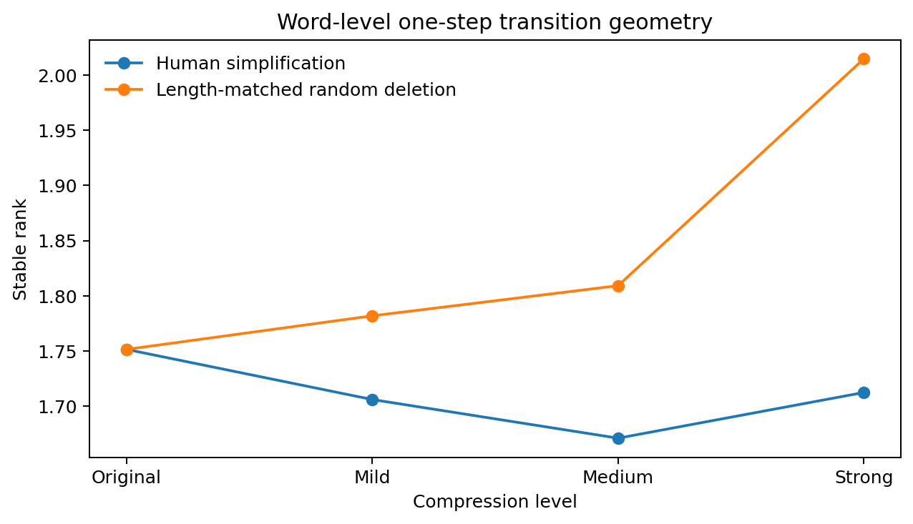

Figure 1. Word-level stable rank under human simplification and length-matched random deletion. Source: LSP-002.

### 4.3 Length-matched random deletion separates shortening from coordinated rewriting

For each human compression level, five random controls delete original tokens until the remaining sequence matches the corresponding simplified sentence length, preserving the order of retained tokens. The random controls broaden the transition spectrum as deletion becomes strong.

Table 8. Human compression and length-matched random deletion.

| Level | Human stable rank | Random-deletion stable rank | Human top-3 | Random top-3 |
| --- | --- | --- | --- | --- |
| Mild | 1.706 | 1.782 | 76.7% | 74.5% |
| Medium | 1.671 | 1.809 | 76.4% | 74.0% |
| Strong | 1.712 | 2.015 | 76.1% | 68.4% |

Source: LSP-002. Values and definitions follow the measurement contract in this section.

Matched shortening alone does not reproduce the human geometry. Human rewriting preserves a concentrated spectrum, whereas random removal progressively distributes more energy into additional directions.

### 4.4 Human compression rotates the dominant axes

Top-three subspace overlap is computed between each compressed transition field and the original field. Human simplification gradually changes the orientation of the dominant movement subspace. Random deletion preserves the original orientation much more closely.

Table 9. Top-three subspace overlap with the original transition field.

| Level | Human top-3 overlap | Random-deletion top-3 overlap |
| --- | --- | --- |
| Mild | 0.9873 | 0.9936 |
| Medium | 0.9747 | 0.9873 |
| Strong | 0.8793 | 0.9690 |

Source: LSP-002. Values and definitions follow the measurement contract in this section.

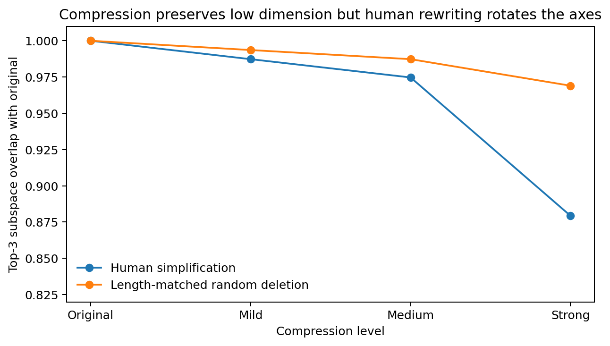

Figure 2. Human compression preserves low movement dimension yet rotates the dominant word-level subspace. Source: LSP-002.

The combined result is a coordinated reorganization: human compression maintains a narrow movement spectrum and changes its orientation. Random deletion keeps more of the original orientation yet degrades spectral concentration. This is a geometry of recoordination rather than a simple reduction in sequence length.

### 4.5 Context depth adds weak directions without changing the compression pattern

Table 10. Context length and transition stable rank.

| Context length | Original stable rank | Strong-compression stable rank |
| --- | --- | --- |
| 1 | 1.752 | 1.712 |
| 2 | 2.277 | 2.314 |
| 3 | 2.452 | 2.470 |

Source: LSP-002. Values and definitions follow the measurement contract in this section.

The one-step field is strongly low-rank. Longer local histories add dimensions in both the original and strongly compressed corpora. The compressed corpus follows nearly the same rank growth. This matches the Chapter 3 observation that local movement is narrow and longer history contributes additional weaker directions.

### 4.6 Token code construction and compression-induced recoding

For each frequent word-level token a at compression level L, define a centered conditional future code:

$$
C_L(a) = P_L(x_{t+1}\mid a) - P_L(x_{t+1})
$$

Compression-induced recoding is the displacement from the original code:

$$
\Delta C_L(a) = C_L(a) - C_{\mathrm{original}}(a)
$$

Across tokens meeting the support threshold in both original and compressed corpora, the covariance of these code displacements is itself strongly concentrated.

Table 11. Geometry of compression-induced token recoding.

| Compression | Tokens in code assay | Code-shift stable rank | Participation rank | Top-3 energy |
| --- | --- | --- | --- | --- |
| Mild | 30 | 1.973 | 3.612 | 66.1% |
| Medium | 30 | 1.914 | 3.423 | 66.8% |
| Strong | 22 | 1.999 | 3.577 | 70.1% |

Source: LSP-002. Values and definitions follow the measurement contract in this section.

Thus the collective recoding induced by compression also occupies approximately two dominant directions under this construction. The sentence-level transition field stays low-dimensional, and the way token functions move between compression regimes is low-dimensional as well.

### 4.7 Token survival and token recoding are separable measurements

For the strong-compression assay, exact-form survival and code-displacement magnitude have Spearman correlation approximately 0.0085. Surface retention therefore supplies little information about how far the retained token code moves. The compression process contains at least two measurable operations: selection of material and functional recoordination of the material that remains.

### 4.8 Character and word levels separate

The same first-order construction at character level produces broader spectra: stable rank rises from 3.243 in original text to 3.584 under strong compression. The especially concentrated approximately two-dimensional pattern appears at the word/punctuation level in this corpus. This places the current structural signal closer to word-level relational action than to raw character statistics.

### 4.9 LSP-002 interpretation

The paired geometry campaign supports three linked observations. First, human simplification preserves a low-dimensional local word-movement backbone across large reductions in surface length. Second, the dominant axes rotate with stronger simplification, showing reorganization rather than simple attenuation. Third, token-code displacement across compression levels is itself concentrated into approximately two principal directions. Together these measurements describe human compression as coordinated low-dimensional recoding of a language trajectory.

## 5 Multilingual transition geometry

LSP-003

Question. Before deriving any language-MoE partition, this experiment asks which geometric properties are shared across natural languages and which change with language-specific order, morphology and surface form. The target is a descriptive map of language data, not a final architecture decision.

### 5.1 Direct multilingual assay

Ten Universal Dependencies test treebanks were processed with one common pipeline: English EWT, Chinese GSDSimp, Japanese GSD, Turkish IMST, Arabic PADT, Russian SynTagRus, Finnish TDT, Hindi HDTB, Spanish GSD and Korean GSD. For comparability, each language contributes the first approximately 8,000 non-punctuation lexical tokens. Measurements include dependency direction and length, surface lexical dispersion, lemma-to-form expansion, and one-step word/POS transition geometry.

The transition assay uses the 128 most frequent word forms plus UNK/BOS/EOS. For each current form a, it constructs the residual conditional future code C(a)=P(x[t+1]|a)-P(x[t+1]), then computes the visitation-weighted covariance of these codes. Stable rank and top-three energy describe concentration of the local transition field. This is the same type of future-distribution geometry used elsewhere in this topical record, applied with a standardized multilingual corpus interface.

Table 12. Lexical and part-of-speech transition geometry across languages.

| Language | Lexical stable rank | Lexical top-3 | POS stable rank | POS top-3 |
| --- | --- | --- | --- | --- |
| English | 1.753 | 79.6% | 3.951 | 66.0% |
| Chinese | 1.667 | 83.8% | 2.020 | 82.7% |
| Japanese | 2.159 | 75.6% | 2.310 | 85.6% |
| Turkish | 1.252 | 93.8% | 1.924 | 94.4% |
| Arabic | 1.871 | 72.3% | 1.934 | 87.9% |
| Russian | 1.620 | 85.4% | 2.011 | 88.8% |
| Finnish | 1.286 | 93.4% | 1.952 | 89.3% |
| Hindi | 2.277 | 76.9% | 3.051 | 80.6% |
| Spanish | 1.864 | 88.5% | 2.079 | 83.6% |
| Korean | 1.291 | 94.0% | 1.900 | 98.4% |

Source: LSP-003. Values and definitions follow the measurement contract in this section.

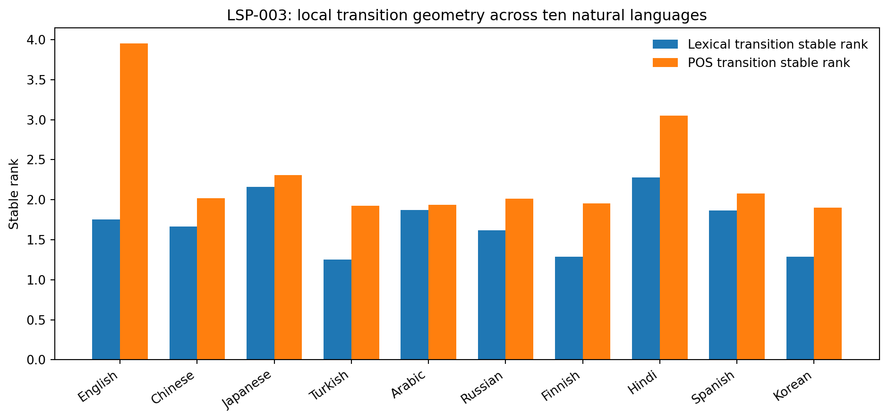

Figure 3. Standardized local transition spectra. Natural languages remain strongly concentrated, but the amount and orientation of concentration differ. Source: LSP-003.

### 5.2 Shared low-dimensional backbone, different orientation

Across the ten treebanks, lexical transition stable rank lies between 1.252 and 2.277. The top three modes carry 72.3% to 94.0% of the measured one-step lexical-transition energy. POS-transition stable rank spans approximately 1.90 to 3.95. This first pass therefore reproduces a shared low-dimensional local sequence backbone across typologically diverse languages rather than a separate high-dimensional regime for each language.

The shared rank does not imply shared axes. Word-order measurements separate sharply. English, Chinese, Arabic and Spanish place almost all measured objects after the verbal head; Japanese, Turkish, Hindi and Korean place most measured objects before it. Case/adposition direction reverses in another way: English, Arabic, Russian and Spanish are overwhelmingly pre-nominal in this UD relation, while Japanese, Turkish, Hindi and Korean are overwhelmingly post-nominal. Root position is correspondingly early in English/Arabic/Spanish and late in Japanese/Korean. These are rotations/reorganizations of relational realization on top of a similarly concentrated transition field.

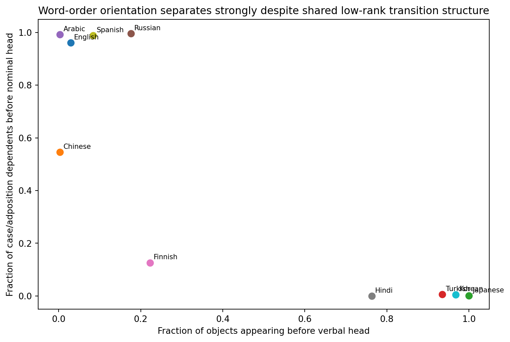

Figure 4. Two dependency-direction coordinates expose strong typological orientation differences that are not visible in stable rank alone. Source: LSP-003.

### 5.3 Morphology and surface-code geometry

Surface lexical dispersion also varies substantially at the same 8k-token budget. Turkish and Finnish show high type/token ratios (about 0.54) and larger observed form-per-lemma expansion than English, Chinese or Spanish; Russian also shows substantial inflectional dispersion. This is compatible with the literature result that agreement in morphological complexity and word order are among the strongest linguistic predictors of cross-lingual embedding alignment across 101 languages. Morphology-aware tokenization has also been shown to improve morphological coherence and language-model cross-entropy in typologically diverse languages including Russian and Arabic.

Annotation scope. UD FEATS coverage is not comparable enough to treat raw feature counts as a universal morphology score: Japanese and Korean treebanks in this sample encode very sparse FEATS fields despite their known grammatical structure. The robust measurements retained here are surface/lemma dispersion and dependency geometry. Morphology requires a segmentation-aware measurement contract.

Table 13. Surface morphology and dependency orientation by language.

| Language | TTR | Forms/lemma | Dep. length | Obj before V | Case before N | Root pos. |
| --- | --- | --- | --- | --- | --- | --- |
| English | 0.328 | 1.218 | 2.86 | 0.03 | 0.96 | 0.22 |
| Chinese | 0.414 | 1.006 | 3.46 | 0.00 | 0.55 | 0.48 |
| Japanese | 0.329 | 1.108 | 2.86 | 1.00 | 0.00 | 0.83 |
| Turkish | 0.541 | 2.241 | 2.51 | 0.94 | 0.01 | 0.60 |
| Arabic | 0.341 | 1.488 | 3.99 | 0.00 | 0.99 | 0.07 |
| Russian | 0.505 | 1.467 | 2.75 | 0.18 | 1.00 | 0.33 |
| Finnish | 0.543 | 1.754 | 2.41 | 0.22 | 0.13 | 0.27 |
| Hindi | 0.257 | 1.194 | 3.36 | 0.76 | 0.00 | 0.59 |
| Spanish | 0.402 | 1.270 | 2.77 | 0.08 | 0.99 | 0.24 |
| Korean | 0.735 | 1.003 | 3.06 | 0.97 | 0.01 | 0.82 |

Source: LSP-003. Values and definitions follow the measurement contract in this section.

### 5.4 Relation to multilingual model geometry

External model studies point in the same direction but add an important separation. Chang, Tu and Bergen (EMNLP 2022) found that 88 languages in XLM-R occupy similar mean-centered linear subspaces while retaining language-sensitive mean axes and language-neutral axes for features such as token position and part of speech. Jones, Wang and Mahowald (EMNLP 2021) found that word-order agreement and morphological-complexity agreement strongly predict cross-lingual alignment over 101 languages. These findings fit the present assay: natural languages can share a broad low-dimensional sequence backbone while differing in the orientation and surface realization of that backbone.

A newer caution is that multilingual representations can be strongly organized by script and tokenization. Verma et al. (ACL 2026) report near-disjoint activation organization after romanization and show that typological information becomes more accessible deeper in the network. Surface-code geometry and generative/relational geometry must therefore be measured separately; script-specific separation is not itself evidence for a distinct language-generating mechanism.

### 5.5 Signed languages expand the topology of the language survey

The current UD assay covers written spoken-language surrogates only. Signed languages add simultaneous manual/non-manual articulators, spatial loci and concurrent morphology. The literature documents structures in which hand configuration, orientation and location are bundled with motion, while two hands and non-manual channels can carry simultaneous syntactic/discourse information. A language geometry assay of these structures requires parallel-channel state rather than forcing signed language into a single token chain.

Reader note. The signed-language discussion is a conceptual extension informed by the cited literature. The ten-treebank assay itself measures written representations of spoken languages; it contains no signed-language corpus experiment.

## 6 Programming language realization

CODE-GEOMETRY-005A

The code branch is now organized in two levels. The higher-order comparison is response regime: natural-language response versus algorithmic response. Programming languages sit one level below that question as alternative realizations of algorithmic response. Source code still requires separate structural measurements because it has exact parser-defined trees and executable semantic constraints; token sequence, syntax tree, data/control flow and execution-state consequence are therefore measured as distinct interfaces rather than pooled with ordinary prose.

Within the algorithmic-response regime, matched semantics allow realization geometry to be isolated. MultiPL-E mechanically translates the same HumanEval/MBPP problems across 18+ programming languages, while Project CodeNet contains roughly 14 million submissions across 55 languages and many shared problems. These resources allow programming-language realization to be measured without confusing algorithm/task identity with syntax identity. CODE-GEOMETRY-005A below is therefore interpreted as an algorithmic-response realization assay, not as the primary natural-language-versus-code comparison.

Working measurement axes for algorithmic-response realization are AST depth/branching and node-transition spectra; binding/scope distance; data-flow path length and fan-out; control-flow branching/loop structure; mutation/statefulness; type-constraint density; ownership/alias/resource-flow constraints where applicable; module/call graph structure; and execution-state change under local edits. CODE-GEOMETRY-005A measures the first token/syntax/type/control realization layer. RESPONSE-REGIME-004 then holds the algorithm fixed and changes the response regime itself.

### 6.1 CODE-GEOMETRY-005A - matched-semantic programming-language geometry

Question. This programming-language sub-assay holds algorithmic meaning approximately fixed and changes the implementation language. It asks which geometric properties persist across algorithmic-response surfaces and which coordinates move with syntax, typing and control realization. It supplies the within-algorithmic-response map needed before any expert grouping is tested.

Design. Ten small algorithms - clamp, greatest common divisor, Fibonacci, primality, binary search, prefix sums, vowel counting, sorted merge, run counting and positive-number summation - were implemented in Python, JavaScript, TypeScript, C, C++, Java, Go, Swift and Ruby. Each implementation was validated by native language tooling and then measured in two parallel representations: a normalized lexical stream and a syntax-tree stream. A second parser-granularity control compressed native trees into the shared categories FUNC, PARAM, TYPE, BLOCK, DECL, ASSIGN, BRANCH, LOOP, RETURN, CALL, INDEX, OP, ID, LITERAL, ATTR and COLLECTION.

Native structural interfaces used in this pass were Python ast, the TypeScript compiler API for JavaScript/TypeScript, Clang AST JSON for C/C++, javac trees for Java, go/parser for Go, swiftc -dump-ast for Swift and Ruby Ripper. The common semantic task set is the matching coordinate; the native parsers preserve language-specific structural realization.

### 6.2 Surface transition geometry

Lexical normalization maps identifiers, numbers and strings to shared placeholders, removes comments, and keeps language keywords and operators. For each current lexical symbol a, the assay uses the centered conditional future code C(a)=P(x[t+1]|a)-P(x[t+1]) and the visitation-weighted covariance construction already used in the natural-language survey. Across the nine languages, lexical stable rank spans 1.342-2.485 and top-three energy spans 62.8%-91.3%. The same ten algorithms therefore occupy concentrated local transition fields in every measured language, with substantial language-dependent changes in concentration and orientation.

Table 14. Lexical transition geometry across programming languages.

| Language | Lexical rank | Lex. top-3 | Canonical AST rank | AST top-3 | Type surface /100 |
| --- | --- | --- | --- | --- | --- |
| Python | 1.342 | 91.3% | 1.571 | 87.8% | 5.33 |
| JavaScript | 1.939 | 74.2% | 1.818 | 83.1% | 0.00 |
| TypeScript | 2.485 | 66.7% | 2.271 | 78.4% | 6.70 |
| C | 2.413 | 64.2% | 2.105 | 84.6% | 8.72 |
| C++ | 2.345 | 64.7% | 2.123 | 84.5% | 9.36 |
| Java | 2.477 | 62.8% | 2.053 | 83.7% | 6.98 |
| Go | 1.726 | 73.5% | 2.142 | 84.6% | 4.50 |
| Swift | 1.882 | 72.9% | 2.289 | 77.3% | 6.28 |
| Ruby | 1.521 | 86.4% | 1.501 | 91.2% | 0.00 |

Source: CODE-GEOMETRY-005A. Values and definitions follow the measurement contract in this section.

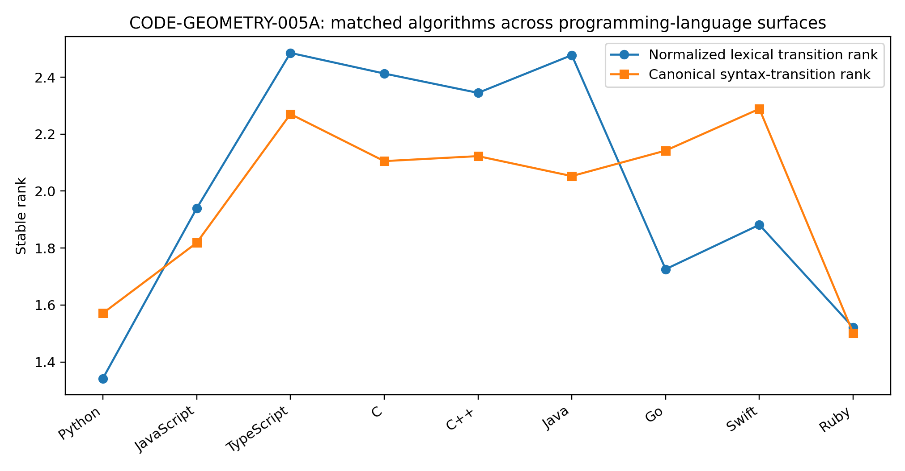

Figure 5. Stable-rank comparison for normalized lexical transitions and the cross-parser canonical syntax skeleton on ten matched algorithms. Source: CODE-GEOMETRY-005A.

### 6.3 Canonical syntax geometry separates shared algorithmic structure from parser grammar

Native ASTs differ in node granularity, so CODE-GEOMETRY-005A adds a canonical semantic-skeleton control rather than comparing raw node counts alone. Under the shared category map, syntax-transition stable rank spans 1.501-2.289 and top-three energy spans 77.3%-91.2%. Concentrated structural movement therefore persists after parser-specific wrapper nodes are compressed. The structural axes are not identical: type, declaration, call, mutation and operator categories occupy different shares across languages.

The canonical category profiles provide direct matched-semantic contrasts. C and C++ have Jensen-Shannon distance 0.038 in this assay. TypeScript and Java are separated by 0.161, with explicit TYPE categories occupying 11.1% and 13.4% of their canonical nodes. Ruby and Go are separated by 0.162; Python and Ruby by 0.260. These distances describe the measured task set and are retained as structural coordinates rather than expert labels.

Table 15. Canonical syntax transition geometry.

| Pair | Jensen-Shannon distance | Measured structural note |
| --- | --- | --- |
| C / C++ | 0.038 | Near-identical bare-core C-family realization |
| TypeScript / Java | 0.161 | Strong explicit type/declaration axis |
| Ruby / Go | 0.162 | Similar canonical category mix on these tasks |
| Python / Ruby | 0.260 | Dynamic-language similarity with distinct surface dynamics |

Source: CODE-GEOMETRY-005A. Values and definitions follow the measurement contract in this section.

### 6.4 Type and control realization form independent descriptive coordinates

Explicit type-surface density is 0.00 per 100 lexical tokens for JavaScript and Ruby in the matched set, 6.70 for TypeScript, 6.98 for Java, 8.72 for C and 9.36 for C++. Python reaches 5.33 because the controlled implementations retain annotations. Branch, loop and mutation densities also differ after algorithm identity is held fixed. These measurements locate code-language variation in several partly independent realization coordinates rather than in a single language-name axis.

The controlled C/C++ pair is especially informative: lexical ranks are 2.413 and 2.345, canonical syntax ranks are 2.105 and 2.123, and their canonical category distributions nearly coincide. TypeScript and Java converge most strongly in the explicit type/declaration profile. Python, Ruby and Go share a high identifier share in the canonical skeleton but retain distinguishable lexical-transition spectra. The assay therefore exposes different notions of proximity depending on which structural space is measured.

### 6.5 Current programming-language interpretation

CODE-GEOMETRY-005A supplies the first direct programming-language realization measurement in this record. Matched algorithms are expressed through low-dimensional local lexical and syntax-transition fields across all nine languages. Language changes reorganize those fields through surface operators, explicit type realization, declaration structure, mutation patterns and call/index forms. The correct level of interpretation is therefore: shared algorithmic structure plus programming-language-specific realization, both inside the broader algorithmic-response regime.

The experiment also separates parser representation from language structure. Raw native AST statistics are retained as language-native measurements; the canonical skeleton supplies a second coordinate system in which wrapper granularity is compressed and semantically comparable node families are measured directly. Agreement between the two views supports the concentrated-syntax result, and their differences identify parser/interface coordinates that should stay separate from language geometry.

### 6.6 Scope of the programming language measurements

This phase establishes token-transition and syntax-tree coordinates on a controlled matched-semantic corpus. Binding and scope, data flow, control flow and execution-state consequences are separate measurement layers. The present measurements alone do not establish whether structural similarity predicts positive parameter sharing.

Evidence availability. Recovered authored artifacts for CODE-GEOMETRY-005A are supplied under evidence/experiments/CODE-GEOMETRY-005A/. The evidence index specifies the available results, figures, source records and analysis-code coverage. External source corpora are referenced separately.

## 7 Procedural response and executable response

RESPONSE-REGIME-004

Question. The comparison holds the task and algorithm fixed and changes the response form. The assay asks whether a natural-language procedural answer and an algorithmic answer preserve a common future-generating trajectory, and which structural coordinates appear only when the response is forced into an executable representation.

Design. Ten algorithms already used in CODE-GEOMETRY-005A were rendered as matched triplets: a natural-language procedural response, pseudocode, and executable Python. These are responses to the same algorithmic objective rather than a natural-language problem statement paired with unrelated code. The shared event vocabulary contains STATE, LOOP, BRANCH, APPEND, CALL and RETURN. A deterministic event reader extracts the ordered procedural path from each representation, and the extracted path is checked against the controlled algorithm plan before cross-regime comparison.

### 7.1 Surface realization changes before the procedural backbone changes

Surface lexical geometry separates the three response forms. With the lexical vocabulary capped at the same 32 most frequent symbols plus boundary/UNK tokens, stable rank is 2.914 for natural-language procedural responses, 2.243 for pseudocode and 1.659 for executable Python; corresponding top-three energy is 64.1%, 69.9% and 83.8%. Natural-language response therefore spreads local surface movement across more directions in this controlled set, whereas executable code concentrates it more strongly.

Table 16. Lexical geometry across matched response forms.

| Response regime | Lexical stable rank (K=32) | Lexical top-3 | Mean lexical tokens | Punctuation /100 |
| --- | --- | --- | --- | --- |
| Natural-language procedural | 2.914 | 64.1% | 48.7 | 14.6 |
| Pseudocode | 2.243 | 69.9% | 42.0 | 17.4 |
| Executable Python | 1.659 | 83.8% | 42.6 | 39.7 |

Source: RESPONSE-REGIME-004. Values and definitions follow the measurement contract in this section.

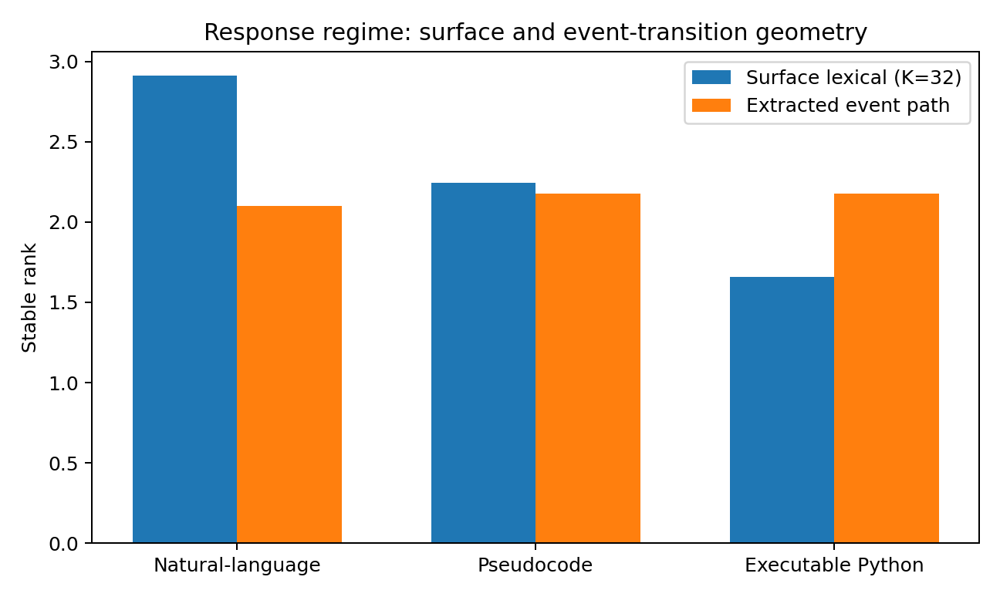

Figure 6. Equal-budget surface lexical geometry and shared-event transition geometry across the three matched response regimes. Source: RESPONSE-REGIME-004.

### 7.2 A shared procedural event geometry survives the mode change

After projecting each response onto the shared six-event procedural vocabulary, the three regimes return to a concentrated transition field. Event-path stable rank is 2.101 for natural language, 2.179 for pseudocode and 2.179 for executable Python; top-three energy is 97.2%, 93.2% and 93.2%. Mean event-recovery F1 against the controlled algorithm plans is 0.925, 0.989 and 0.989. Pseudocode and Python collapse to the same event-transition geometry under this abstraction; the natural-language event subspace retains top-three overlap 0.914 with that algorithmic skeleton.

Table 17. Shared procedural event geometry across response forms.

| Response regime | Event stable rank | Event top-3 | Plan-event F1 | Mean extracted events |
| --- | --- | --- | --- | --- |
| Natural-language procedural | 2.101 | 97.2% | 0.925 | 6.1 |
| Pseudocode | 2.179 | 93.2% | 0.989 | 6.4 |
| Executable Python | 2.179 | 93.2% | 0.989 | 6.4 |

Source: RESPONSE-REGIME-004. Values and definitions follow the measurement contract in this section.

The small difference in mean event count is informative. Natural-language procedural responses can compress repeated implementation detail into a single linguistic action. In the sorted-merge example, the prose groups the two residual-tail loops into a compact statement, whereas pseudocode and executable code retain those loops as explicit sequential operations. The response regimes therefore share a procedural backbone while allocating different surface resolution to that backbone.

### 7.3 Matched-semantic control separates regime change from task change

For each source algorithm, event-sequence similarity was compared with its matched response in another regime and with all nine task-mismatched responses. Natural language versus pseudocode is 0.829 for matched algorithms versus 0.507 for mismatched algorithms; pseudocode versus executable Python is 1.000 versus 0.488; natural language versus executable Python is 0.829 versus 0.507. The matched-minus-mismatched gaps are 0.322, 0.512 and 0.322. Exact two-sided sign-flip tests over the ten source-task gaps give p=0.0049, p=0.0029 and p=0.0049, respectively.

Table 18. Matched and mismatched cross-regime similarity.

| Cross-regime pair | Matched similarity | Mismatched similarity | Gap | Exact sign-flip p |
| --- | --- | --- | --- | --- |
| Natural language / pseudocode | 0.829 | 0.507 | 0.322 | 0.0049 |
| Pseudocode / executable Python | 1.000 | 0.488 | 0.512 | 0.0029 |
| Natural language / executable Python | 0.829 | 0.507 | 0.322 | 0.0049 |

Source: RESPONSE-REGIME-004. Values and definitions follow the measurement contract in this section.

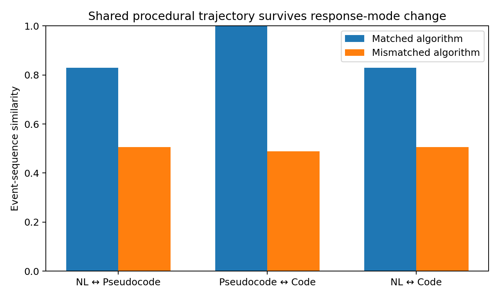

Figure 7. Cross-regime procedural similarity remains substantially higher for the matched algorithm than for task-mismatched controls. Source: RESPONSE-REGIME-004.

### 7.4 Executability adds a dense local binding surface

Surface locality changes strongly across the three forms. Mean recurrence distance between repeated entities is 15.44 lexical positions in the controlled natural-language responses, 8.85 in pseudocode and 3.35 in executable Python. Punctuation/operator density rises from 14.6 to 17.4 to 39.7 per 100 lexical tokens. Executable code therefore represents the same procedure with denser short-range rebinding and a much larger exact structural surface.

A token-deletion stress test exposes the consequence of that exact surface. After random deletion of 5% of lexical tokens, the natural-language event reader retains mean plan-event F1 0.907 and pseudocode retains 0.720. Only 8.3% of perturbed Python programs remain syntactically parseable; at 10% deletion, parseability is 1.15%. This is a parser-constrained robustness measurement: it identifies the executable representation as an exact-validity interface while the procedural event content of the natural-language rendering remains recoverable under the same token-loss operation.

### 7.5 RESPONSE-REGIME-004 interpretation

The controlled triplets support a two-level decomposition. First, natural-language procedural response and algorithmic response differ strongly in surface realization: natural language carries a broader lexical transition field and looser entity recurrence, whereas executable code carries denser local binding, heavier structural punctuation and exact parser validity. Second, the task-matched responses preserve a common low-width procedural event trajectory across those surfaces. Programming-language identity therefore belongs below response regime in the current measurement hierarchy: CODE-GEOMETRY-005A maps alternative realizations inside algorithmic response, while RESPONSE-REGIME-004 measures the higher-order change between natural-language procedural realization and algorithmic realization.

Evidence availability. Recovered authored artifacts for RESPONSE-REGIME-004 are supplied under evidence/experiments/RESPONSE-REGIME-004/. The evidence index specifies the available results, figures, source records and analysis-code coverage. External source corpora are referenced separately.

Evidence boundary. This result is established for ten controlled procedural-response triplets. The natural-language side is deliberately a procedural answer rather than free-form exposition, and the shared event vocabulary is a coarse control skeleton. The current evidence supports shared procedural geometry across these matched response forms and directly measured surface differences.

## 8 Request paraphrases and executable targets

RESPONSE-REGIME-004B1

Question. This sub-assay fixes executable target identity and changes the natural-language formulation. It measures how request-side transition geometry changes across curated paraphrase families and whether the identity of the matched executable target remains recoverable when one formulation class is held out.

Data and source identity. The ParaphraseBench test set provides 57 SQL targets and six aligned natural-language variants per target - naive, syntactic, morphological, lexical, semantic and missing-information - for 342 request rows. Each row index maps to the corresponding row of patients_test.sql. The executed campaign used DataManagementLab/ParaphraseBench commit 9c77daa11c7fa1fa16bbb2e314303b4017fb2220; file-level Git blob identities are retained in the evidence package.

### 8.1 Request-side transition geometry changes across paraphrase families

A shared top-64 natural-language word/punctuation vocabulary plus BOS/EOS/UNK was constructed across all six variants. For each current token a, the assay used the centered future code C(a)=P(next|a)-P(next) and its visitation-weighted covariance, matching the transition-field construction used elsewhere in this record. SQL was measured separately with a top-64 SQL-token vocabulary and the table name normalized to a generic table token. Stable rank, participation rank and top-three energy quantify local movement concentration; top-three subspace overlap quantifies orientation relative to the naive request field.

Table 19. Request paraphrase transition geometry.

| Representation | Stable rank | Participation rank | Top-3 energy | Top-3 overlap with naive |
| --- | --- | --- | --- | --- |
| Naive | 6.697 | 13.437 | 34.6% | 1.000 |
| Syntactic | 6.898 | 13.711 | 36.7% | 0.610 |
| Morphological | 8.096 | 15.493 | 32.3% | 0.942 |
| Lexical | 5.935 | 11.015 | 41.3% | 0.815 |
| Semantic | 6.244 | 12.400 | 40.5% | 0.605 |
| Missing information | 5.116 | 10.823 | 45.1% | 0.643 |
| Executable SQL | 3.545 | 7.021 | 54.9% | - |

Source: RESPONSE-REGIME-004B1. Values and definitions follow the measurement contract in this section.

Within this construction, the six natural-language request fields occupy stable ranks from 5.116 to 8.096, while the executable SQL field is 3.545. The request-side widths therefore form a broader regime than the approximately 2-3 dominant widths measured in the earlier teacher/procedural constructions. Paraphrase style also changes orientation: top-three overlap with the naive field ranges from 0.605 to 0.942. The benchmark thus supplies a direct measurement in which target alignment is held fixed while the local surface field moves.

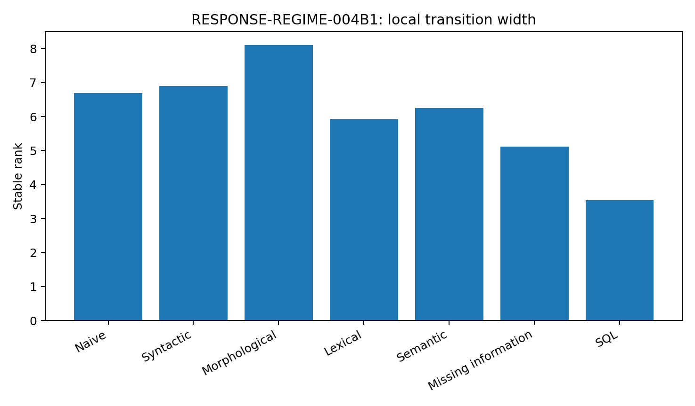

Figure 8. Stable rank of the six curated request variants and the aligned executable SQL targets under the RESPONSE-REGIME-004B1 construction. Source: RESPONSE-REGIME-004B1.

### 8.2 Held-out paraphrase style retains strong executable-target identity

Target identity was assayed independently of the transition-field calculation. Each request was represented by hashed character 3-5-gram TF-IDF features in 4,096 bins. For one held-out style at a time, each of the 57 SQL targets received a prototype formed from its other five request variants; every held-out request was then matched to the most similar target prototype. A 1,000-permutation label control retained the same similarity structure while randomizing target identity.

Table 20. Held-out-style recovery of executable target identity.

| Held-out style | Top-1 | MRR | Matched-minus-mismatched cosine | Permutation-control mean |
| --- | --- | --- | --- | --- |
| Naive | 89.5% | 0.944 | 0.493 | 1.68% |
| Syntactic | 87.7% | 0.930 | 0.422 | 1.68% |
| Morphological | 93.0% | 0.962 | 0.410 | 1.70% |
| Lexical | 68.4% | 0.808 | 0.308 | 1.72% |
| Semantic | 64.9% | 0.765 | 0.229 | 1.75% |
| Missing information | 43.9% | 0.601 | 0.201 | 1.82% |

Source: RESPONSE-REGIME-004B1. Values and definitions follow the measurement contract in this section.

Across the six held-out styles, mean Top-1 target recovery is 74.56%, mean reciprocal rank is 0.8351 and the mean matched-minus-mismatched cosine gap is 0.3437. The exact random target rate is 1/57=1.75%; permutation-control means range from 1.68% to 1.82%, with an empirical 95th percentile of 5.26%. The six observed Top-1 counts range from 25/57 to 53/57 and each exceeds the 1/57 binomial target benchmark at p<1e-28.

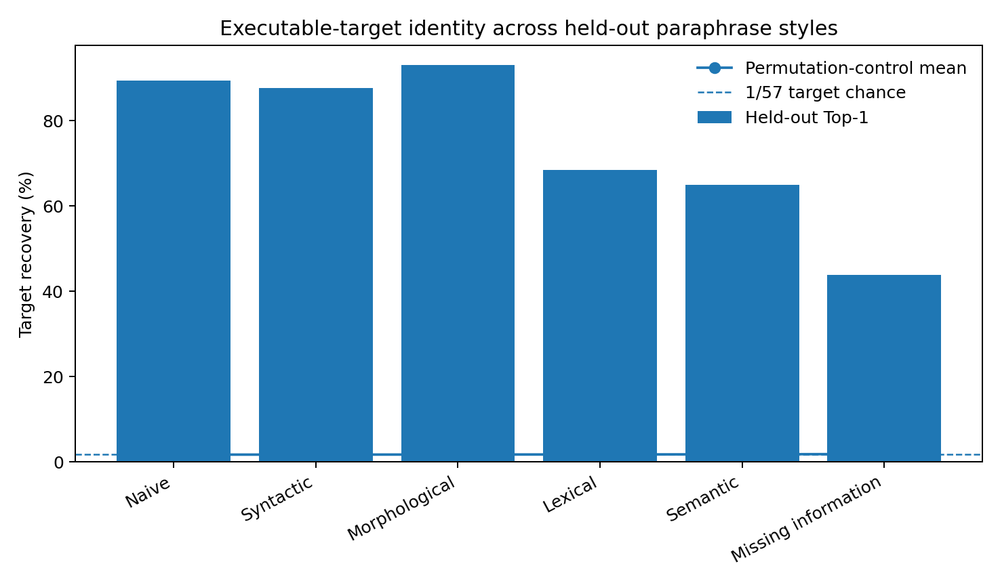

Figure 9. Leave-one-style-out recovery of the fixed executable target. Each target prototype is constructed from the other five paraphrase styles; the permutation control randomizes target identity. Source: RESPONSE-REGIME-004B1.

### 8.3 Surface geometry and executable-target identity are separable measurements

The two assays separate cleanly. Curated paraphrase families rotate and rescale the local request transition field, yet target-specific structure remains recoverable across held-out formulation classes. Morphological requests retain 92.98% Top-1 target identity despite having the broadest measured transition field, while semantic and missing-information variants move farther in surface space and still retain 64.91% and 43.86% Top-1 recovery. Surface-transition width is therefore not a proxy for target identity in this benchmark.

A target-structure stratification gives a second dataset-specific coordinate. Across the six held-out styles, mean retrieval rank is 2.412 for the 19 simple SQL targets, 1.533 for the 20 filtered targets and 1.454 for the 18 grouped targets. In this single-table benchmark, explicit filtering and grouping constraints provide additional discriminative anchors for cross-style target recovery.

### 8.4 RESPONSE-REGIME-004B1 interpretation

RESPONSE-REGIME-004B1 establishes a request-to-executable-target paraphrase-invariance coordinate. The measured invariant is target-specific recoverability across multiple curated natural-language realizations; the measured surface field itself changes in both width and orientation. This adds a new separation to the response-regime picture: realization geometry can move substantially while a fixed executable objective remains identifiable from another formulation class.

Evidence scope. This campaign measures request language mapped to fixed SQL targets in one single-table benchmark. It supplies the request-side invariance coordinate that complements RESPONSE-REGIME-004.

Evidence availability. Recovered authored artifacts for RESPONSE-REGIME-004B1 are supplied under evidence/experiments/RESPONSE-REGIME-004B1/. The evidence index specifies the available results, figures, source records and analysis-code coverage. External source corpora are referenced separately.

## 9 Public tool calling benchmarks

TOOL-CHAIN-GEOMETRY-006

Tool use is not treated as ordinary text continuation. BFCL V4 explicitly separates single-turn AST-matched calls, multi-turn stateful backends and agentic web/memory tasks; tau-bench evaluates agents by the final database state reached through domain APIs. These benchmarks expose at least three coupled structures: natural-language request state, typed schema/argument structure, and mutable external environment state.

TOOL-CHAIN-GEOMETRY-006 now measures these phases on public multi-turn and agentic benchmark records: request-to-tool selection, argument availability, sequential state propagation, tool-result assimilation, external-state mutation and recovery under missing information. The first campaign uses BFCL V4 as the primary row-level dataset and the current tau3-Banking leaderboard as an independent end-to-end environment check.

### 9.1 TOOL-CHAIN-GEOMETRY-006 - multi-turn tool-chain reliability in executable environments

Question. This experiment asks why a model that can produce a valid isolated function call can still fail a longer tool chain, and whether different model/interface configurations expose distinct failure spectra. The measured object is the executed tool trajectory and resulting external state, not a verbal description of tool use.

Data and computation. The primary dataset is the BFCL V4 score snapshot in HuanzhiMao/BFCL-Result, 2025-12-16, corresponding to the public leaderboard evaluation commit f7cf735 and bfcl-eval 2025.12.17. The analysis recomputes statistics from 109 model/configuration rows in data_overall.csv. Raw JSONL evaluator records were additionally parsed for three complete 200-episode multi-turn-base files: Claude Opus 4.5 FC, xLAM-2-70B FC and GLM-4.6 FC-thinking. The current tau3-Banking leaderboard is retained as a separate environment-level validation and is not pooled numerically with BFCL.

Derived definitions. Agentic mean is the arithmetic mean of BFCL Web Search Accuracy and Memory Accuracy for each configuration. Perturbation loss is Base multi-turn accuracy minus the corresponding Miss Function, Miss Parameter or Long Context accuracy. FC-versus-Prompt deltas pair rows after removing only the explicit BFCL mode suffix from the same model name.

### 9.2 Isolated tool-call accuracy and chain reliability are separate measured axes

Across all 109 BFCL configurations, Spearman correlation between non-live single-turn AST accuracy and multi-turn accuracy is 0.452. The correlation between single-turn AST accuracy and the derived agentic mean is 0.239. Multi-turn accuracy and the agentic mean correlate more strongly at 0.620, and Web Search versus Memory accuracy correlates at 0.793. The measured hierarchy therefore separates isolated schema-correct calling from persistent stateful execution and from broader external-environment operation.

Table 21. Associations among BFCL performance axes.

| Pair of measured axes | Spearman rho | N |
| --- | --- | --- |
| Single-turn non-live AST / Multi-turn | 0.452 | 109 |
| Single-turn non-live AST / Agentic mean | 0.239 | 109 |
| Multi-turn / Agentic mean | 0.620 | 109 |
| Web Search / Memory | 0.793 | 109 |

Source: TOOL-CHAIN-GEOMETRY-006. Values and definitions follow the measurement contract in this section.

Selected configurations make the separation visible. xLAM-2-70B FC reaches 88.44% non-live AST and 77.38% multi-turn accuracy but 14.71% on the derived web/memory mean. Claude Opus 4.5 FC records 88.58%, 68.38% and 79.13% on the same three coordinates. GPT-5.2 FC records 81.85%, 28.12% and 60.66%. These are distinct response profiles under one benchmark suite rather than a single scalar tool-ability axis.

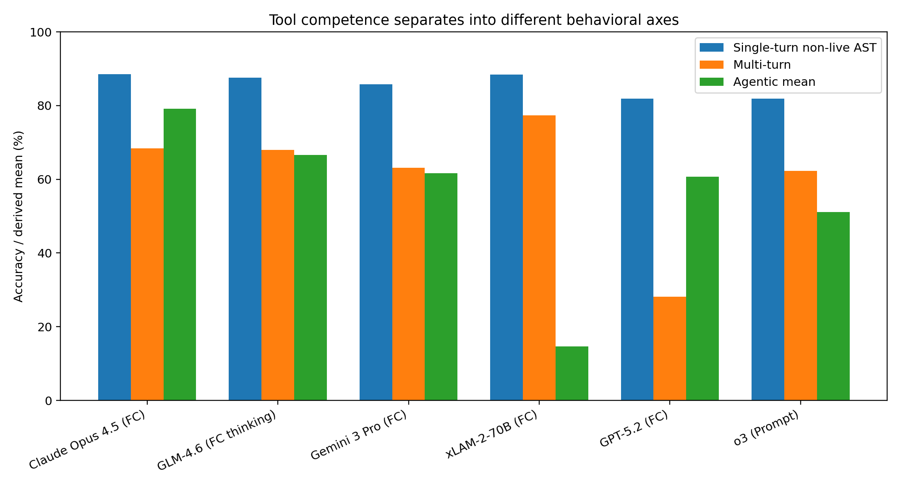

Figure 10. Selected BFCL V4 configurations separate single-call syntax accuracy, multi-turn execution and agentic web/memory performance. Source: TOOL-CHAIN-GEOMETRY-006.

### 9.3 Missing arguments damage chains more than the tested long-context perturbation on average

For all 109 BFCL configurations, the mean drop from each configuration's multi-turn base condition is 7.42 percentage points when a required function is missing, 7.77 points when a required parameter is missing and 5.00 points in the long-context condition. To reduce floor compression, the same calculation was repeated on the 57 configurations with base multi-turn accuracy at or above 20%. In that subset the mean losses are 11.95, 13.48 and 8.30 points respectively; medians are 9.5, 12.5 and 6.5 points. Under this benchmark construction, parameter availability is the strongest of these three average perturbations.

Table 22. Multi-turn accuracy losses under benchmark perturbations.

| Condition | All 109 mean drop | All median | Base>=20 N=57 mean | Base>=20 median |
| --- | --- | --- | --- | --- |
| Missing function | 7.42 pp | 5.0 pp | 11.95 pp | 9.5 pp |
| Missing parameter | 7.77 pp | 7.0 pp | 13.48 pp | 12.5 pp |
| Long context | 5.00 pp | 3.0 pp | 8.30 pp | 6.5 pp |

Source: TOOL-CHAIN-GEOMETRY-006. Values and definitions follow the measurement contract in this section.

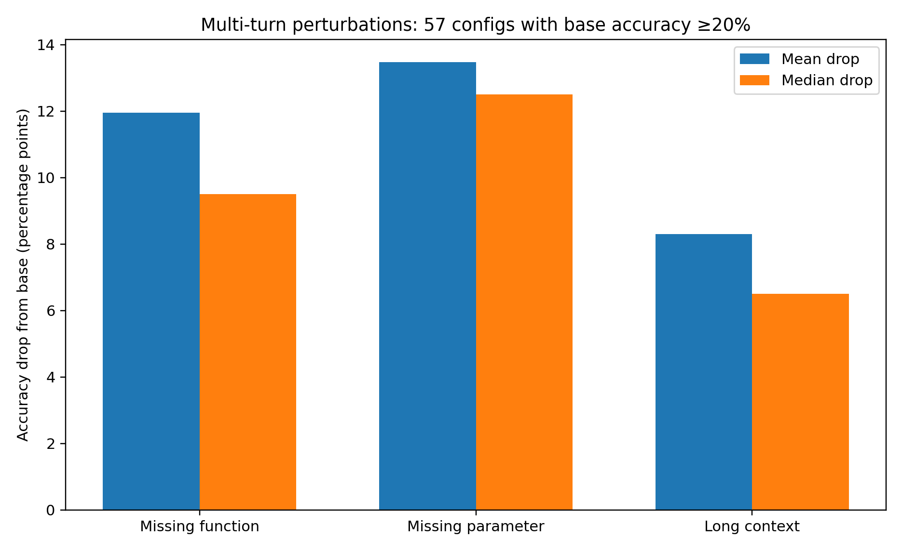

Figure 11. Multi-turn perturbation losses calculated from the 57 BFCL configurations with base accuracy at least 20%. Source: TOOL-CHAIN-GEOMETRY-006.

### 9.4 Native function-calling mode changes chain behavior, but the direction is model-dependent

Twenty-five BFCL model families contain a directly pairable native-FC row and Prompt row. For multi-turn accuracy, FC minus Prompt has mean +12.45 percentage points and median +7.00; 21 of 25 pairs are positive and four are negative. The observed range is -47.50 to +59.75 points. Agentic mean shows mean +16.50 and median +6.47 points, with 21 positive, three negative and one zero pair. Non-live single-turn AST behaves differently: FC minus Prompt averages -6.28 points with median -1.07, and only 10 of 25 pairs are positive.

The sign reversals are experimentally useful because they show that a native function-calling path is not a monotonic upgrade applied on top of a fixed model. The model, adapter/protocol mode and evaluation category form a coupled configuration. For example, Claude Opus 4.5 gains 52.26 multi-turn points in FC mode relative to its Prompt row; GPT-5.2 loses 15.63; o3 loses 47.50. These deltas identify configurations for controlled harness-level follow-up rather than assigning the difference to unobserved internal architecture.

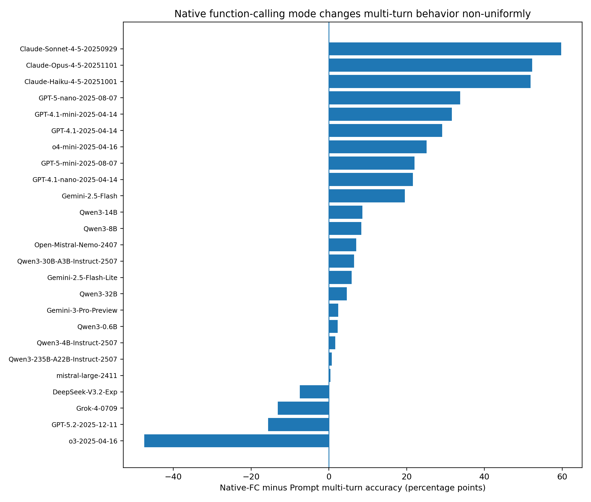

Figure 12. Paired native-FC minus Prompt multi-turn accuracy across 25 BFCL model families. Positive and negative deltas coexist. Source: TOOL-CHAIN-GEOMETRY-006.

### 9.5 Raw evaluator failures are dominated by wrong final world state

The three fully parsed multi-turn-base score files contain 600 evaluated episodes and 124 failures. BFCL labels 79 failures as instance_state_mismatch, 30 as execution_response_mismatch and 15 as empty_turn_model_response. Thus 63.7% of observed failures in this three-model sample are final external-state mismatches, 24.2% are mismatches in required execution responses and 12.1% are empty model turns.

Table 23. Raw evaluator error categories in three model configurations.

| Model/config | Correct / 200 | Instance-state mismatch | Execution-response mismatch | Empty turn |
| --- | --- | --- | --- | --- |
| Claude Opus 4.5 FC | 162 | 25 | 10 | 3 |
| xLAM-2-70B FC | 165 | 24 | 8 | 3 |
| GLM-4.6 FC thinking | 149 | 30 | 12 | 9 |
| Combined | 476 | 79 | 30 | 15 |

Source: TOOL-CHAIN-GEOMETRY-006. Values and definitions follow the measurement contract in this section.

The raw episodes show what state mismatch means operationally. Observed failures include preserving newline characters where the target backend state contains spaces, retaining a file extension when the requested renamed state omits it, sorting the source file instead of the copied target after a directory transition, reading message history before a send and then describing the post-send history without executing a fresh read, and writing a formatted numeric string such as "205.00 bytes" where the target state is "205 bytes". The chain can therefore select plausible tools and still end in a measurably different world.

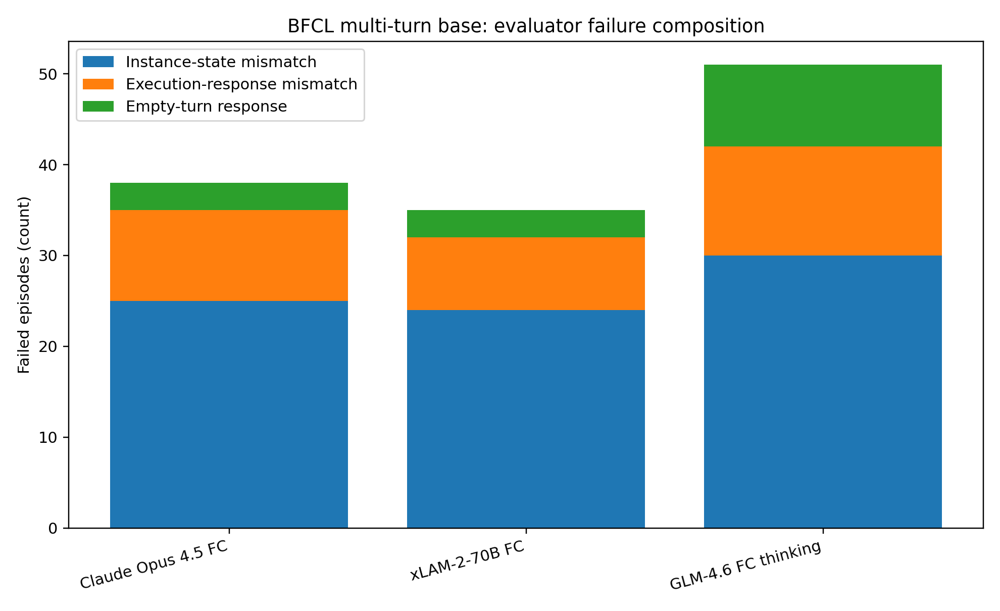

Figure 13. Exact BFCL evaluator error categories across three complete 200-episode multi-turn-base score files. Source: TOOL-CHAIN-GEOMETRY-006.

### 9.6 Public tool contracts differ in how they bind calls, results and state

The public interfaces expose different tool-chain contracts. This is a directly documented interface difference, separate from internal model architecture. OpenAI Responses represents tool requests as function_call items carrying call_id, returns execution results through function_call_output with the same call_id, supports configurable parallel_tool_calls, and provides strict schema enforcement. Gemini supports both parallel and compositional function calling; its stateless mode requires the complete prior interaction to be resent exactly, and Gemini 3+ tool context uses call identifiers plus encrypted signatures that can instead be circulated server-side through stateful interaction identifiers. Claude represents client calls as tool_use blocks with unique ids and binds returned tool_result blocks through tool_use_id; it also exposes strict tool schemas and distinguishes client-executed from server-executed tools.

Table 24. Public provider contracts for tool calls and results.

| Public interface | Call-result binding | State / continuation contract | Schema / concurrency controls |
| --- | --- | --- | --- |
| OpenAI Responses | function_call.call_id -> function_call_output.call_id | Response history or previous-response continuation carries tool steps | strict schemas; parallel_tool_calls configurable |
| Gemini Interactions | Function-call/result identifiers; Gemini 3+ signatures | Stateful previous_interaction_id or exact full-history replay in stateless mode | Parallel and compositional calls; validated schema mode |
| Claude Messages | tool_use.id -> tool_result.tool_use_id | Tool results are content blocks in the continuing message history; server/client tool loops differ | strict tool use; parallel independent calls supported |

Source: TOOL-CHAIN-GEOMETRY-006. Values and definitions follow the measurement contract in this section.

Specialized training is another measured design axis. The xLAM-2-fc-r family is trained with APIGen-MT multi-turn agent data; its BFCL profile is correspondingly strong on multi-turn execution, including 77.38% for the 70B configuration in this snapshot, while its web/memory profile is much lower. The present evidence therefore supports separating protocol binding, trajectory training and environment coverage as different components of tool-chain design.

### 9.7 Independent real-environment check: tau3-Banking remains substantially harder end to end

The current tau3-Banking leaderboard evaluates text agents resolving banking customer-service tasks over an approximately 700-document knowledge base. As of 27 September 2026, Pass^1 is 55.2% for Qwen 3.8 Max, 48.7% for Claude Opus 5, 47.9% for Grok 4.5 and 46.9% for GPT-5.6-sol. Older configurations in the same table include GPT-5.2 at 32.2% with alltools/high reasoning and another GPT-5.2 row at 12.6% with qwen_embeddings/no reasoning. Because retrieval and reasoning settings change together, the 19.6-point difference is treated as configuration sensitivity rather than attribution to either component alone.

Table 25. Reported tau3-Banking benchmark snapshot.

| tau3-Banking configuration | Retrieval | Reasoning | Pass^1 |
| --- | --- | --- | --- |
| Qwen 3.8 Max | alltools | xhigh | 55.2% |
| Claude Opus 5 | alltools | max | 48.7% |
| Grok 4.5 | alltools | high | 47.9% |
| GPT-5.6-sol | alltools | xhigh | 46.9% |
| GPT-5.2 | alltools | high | 32.2% |
| GPT-5.2 | qwen_embeddings | none | 12.6% |
| Claude Opus 4.5 | alltools | high | 24.7% |
| Gemini 3 Pro | Terminal | high | 18.0% |

Source: TOOL-CHAIN-GEOMETRY-006. Values and definitions follow the measurement contract in this section.

### 9.8 TOOL-CHAIN-GEOMETRY-006 interpretation

The measured tool chain is not one capability. It is a composition of at least four observable axes: isolated schema-correct action emission, argument/resource availability, multi-turn state propagation, and environment-specific result assimilation. The moderate single-turn/multi-turn correlation and weak single-turn/agentic correlation show that success on the first axis transfers only partially to the later axes. The raw error files then locate the dominant failure surface in the tested strong-model sample: exact external-state divergence after apparently plausible action sequences.

The cross-model variation is consistent with tool-chain interfaces acting as part of the computational system rather than as a neutral wrapper. Public APIs differ in call-result identity, state circulation, strictness and parallel/sequential semantics, and specialized models differ in trajectory training coverage. BFCL paired FC/Prompt sign reversals show that these interfaces interact with particular model families rather than producing one universal improvement direction.

Evidence boundary. The campaign establishes behavioral and protocol-level differences from public BFCL rows, raw evaluator traces, the reported tau3 snapshot and provider interface documentation. It identifies candidate mechanisms for controlled adapter interventions: state carry, call-result identifiers, schema strictness, parallelization and result normalization. TOOL-CHAIN-GEOMETRY-006B examines these coordinates using paired executable worlds.

Evidence availability. Recovered authored artifacts for TOOL-CHAIN-GEOMETRY-006 are supplied under evidence/experiments/TOOL-CHAIN-GEOMETRY-006/. The evidence index specifies the available results, figures, source records and analysis-code coverage. External source corpora are referenced separately.

## 10 Controlled adapter intervention

TOOL-CHAIN-GEOMETRY-006B

This experiment moves from the observational benchmark anatomy of TOOL-CHAIN-GEOMETRY-006 to direct intervention on the computational body around one frozen learned policy. The model, tool set, task text, initial world and target world are held fixed within each paired comparison; only one adapter property is changed at a time.

Question. Which tool-chain interface coordinates directly change the final world reached by the same learned policy? The intervention set covers state-history handoff, call-result identity, return ordering after identity removal, result normalization, schema handling and final-state verification. The primary endpoint is exact final-state equality. First action divergence, wrong-first-DONE events, schema-error episodes and recovery after verification are retained as trajectory measurements.

### 10.1 Construction, frozen policy and paired execution

Executable world. Each episode contains six mutable integer registers A-F with values 0-9 and five tools: READ, READPAIR, WRITE, CLEAR and DONE. Seven task families were executed: COPY, BACKUP_CLEAR, SWAP, DUAL_COPY, ROTATE3, DUPLICATE and MOVE2. Their oracle plans contain three, four or six actions. Every evaluation episode is executed against a concrete initial register state and scored by exact equality with the target register state after the tool trajectory.

Learned policy. A 124,798-parameter bidirectional GRU encoder with four action heads predicts tool, first key, second key and value. The policy was trained on 3,500 generated training tasks comprising 17,502 decision examples and then frozen for every adapter condition. On held-out canonical prefixes in the primary task set, exact four-head action accuracy is 89.39% across 2,619 decisions; tool accuracy is 100.00%, first-key accuracy 98.43%, second-key accuracy 100.00% and value accuracy 90.38%. The canonical frozen state-tensor SHA-256 is ff25b9d6c0c24fc618ea045aef1a276c7b32949e5aa6aba8caa4ae602e5d6160.

Primary panel. Seven hundred held-out tasks were replayed through all adapter conditions with the same frozen weights and the same task-specific initial and target states. Parallel READPAIR returns may arrive in randomized order under the baseline, but explicit call identifiers preserve their source binding. Each primary contrast uses a paired 3,000-resample bootstrap interval for the accuracy difference and an exact two-sided McNemar test on the same 700 tasks.

Table 26. Matched adapter interventions. The model checkpoint and episode task/world coordinates are unchanged across rows.

| Condition | History | Binding | Dispatch | Result surface | Schema | Completion |
| --- | --- | --- | --- | --- | --- | --- |
| Baseline | Full transcript | Explicit call IDs | Randomized pair return | Canonical result form | Strict reject | Check final state |
| Last-result handoff | Last 3 transcript lines | Explicit call IDs | Randomized pair return | Canonical result form | Strict reject | Check final state |
| No binding / parallel | Full transcript | IDs removed | Randomized pair return | Canonical result form | Strict reject | Check final state |
| No binding / sequential | Full transcript | IDs removed | Issue order | Canonical result form | Strict reject | Check final state |
| Raw results | Full transcript | Explicit call IDs | Randomized pair return | Heterogeneous backend form | Strict reject | Check final state |
| Best-effort schema | Full transcript | Explicit call IDs | Randomized pair return | Canonical result form | Coerce malformed output | Check final state |
| No verification | Full transcript | Explicit call IDs | Randomized pair return | Canonical result form | Strict reject | DONE terminates |

Source: TOOL-CHAIN-GEOMETRY-006B. Values and definitions follow the measurement contract in this section.

### 10.2 Primary paired final-state result

Table 27. Primary paired adapter effects on final-state accuracy.

| Condition | Exact states | Accuracy | Delta pp | Paired 95% CI pp | McNemar p |
| --- | --- | --- | --- | --- | --- |
| Baseline | 491/700 | 70.14% | reference | - | - |
| Last-result handoff | 325/700 | 46.43% | -23.71 | [-27.43, -20.00] | <0.0001 |
| No binding / parallel | 239/700 | 34.14% | -36.00 | [-40.00, -31.86] | <0.0001 |
| No binding / sequential | 232/700 | 33.14% | -37.00 | [-40.86, -33.00] | <0.0001 |
| Raw results | 330/700 | 47.14% | -23.00 | [-26.71, -19.14] | <0.0001 |
| Best-effort schema | 491/700 | 70.14% | +0.00 | [0.00, 0.00] | 1.0000 |
| No verification | 470/700 | 67.14% | -3.00 | [-4.29, -1.86] | <0.0001 |

Source: TOOL-CHAIN-GEOMETRY-006B. Values and definitions follow the measurement contract in this section.

Exact final-state accuracy is 70.14% for the baseline adapter. Truncating state handoff reduces accuracy to 46.43% (-23.71 pp), removing call-result identity under randomized return order reduces it to 34.14% (-36.00 pp), and presenting raw non-normalized result surfaces reduces it to 47.14% (-23.00 pp). Removing final-state verification reduces accuracy to 67.14% (-3.00 pp). The best-effort schema condition finishes on exactly the same 491 correct and 209 incorrect tasks as the strict baseline.

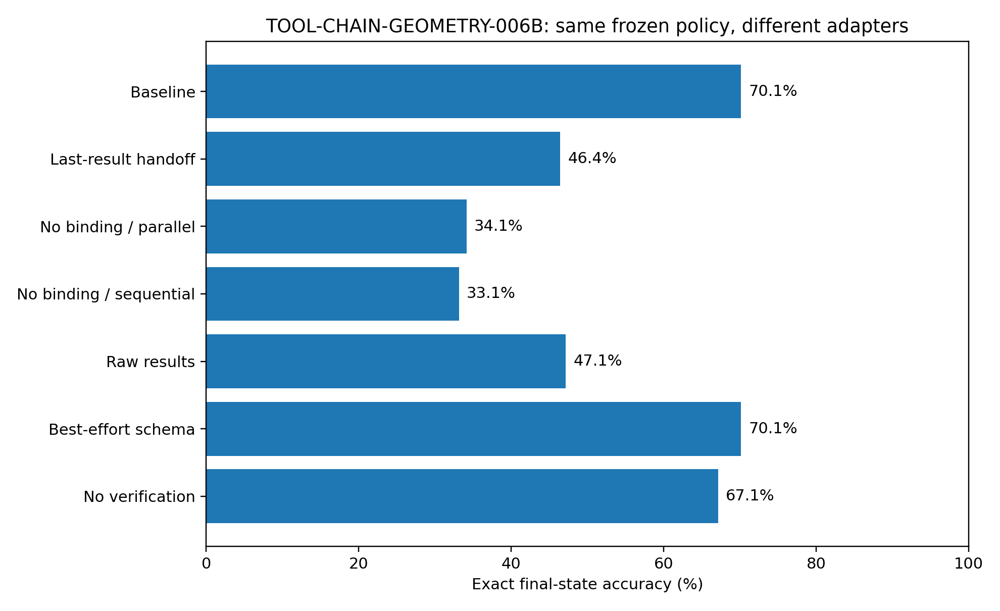

Figure 14. Exact final-state accuracy under seven adapters around the same frozen learned policy and the same 700 primary tasks. Source: TOOL-CHAIN-GEOMETRY-006B.

Table 28. Action divergence and execution-trace diagnostics.

| Condition | Mean first action divergence | Wrong first DONE | Schema-error episodes | Mean steps |
| --- | --- | --- | --- | --- |
| Baseline | 2.45 | 32.9% | 4.4% | 7.07 |
| Last-result handoff | 2.49 | 78.7% | 42.1% | 10.77 |
| No binding / parallel | 2.12 | 93.6% | 10.3% | 10.64 |
| No binding / sequential | 2.12 | 93.6% | 10.0% | 10.73 |
| Raw results | 2.44 | 82.7% | 13.6% | 9.49 |
| Best-effort schema | 2.45 | 32.9% | 0.0% | 7.07 |
| No verification | 2.45 | 32.9% | 0.0% | 7.29 |

Source: TOOL-CHAIN-GEOMETRY-006B. Values and definitions follow the measurement contract in this section.

The trajectory measurements locate the damage before final scoring. Wrong-first-DONE rises from 32.9% at baseline to 78.7% with truncated state, 93.6% with lost binding and 82.7% with raw results. Among the 491 tasks solved by the baseline, the corresponding perturbations break 189 (38.49%), 277 (56.42%) and 196 (39.92%) tasks, respectively.

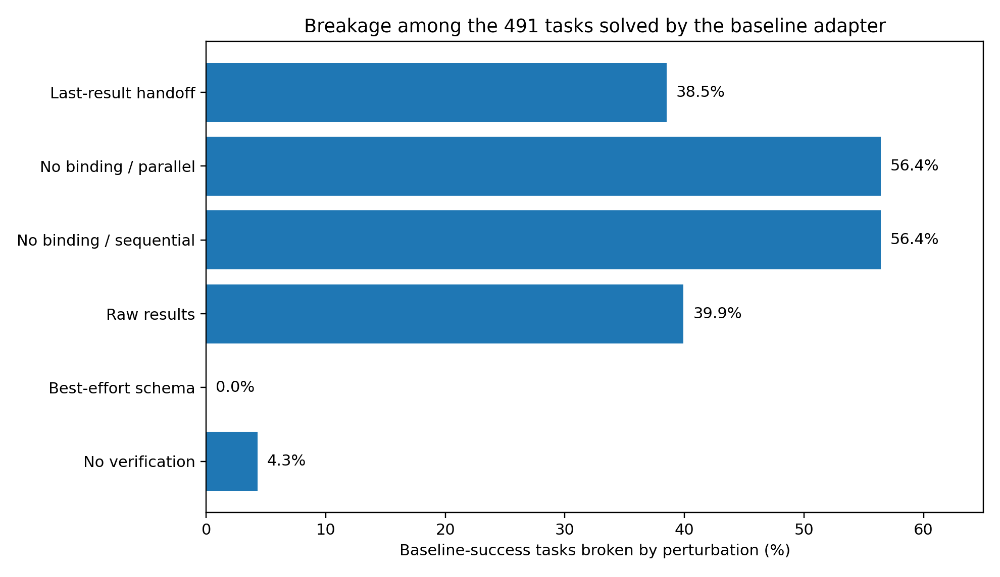

Figure 15. Fraction of the 491 baseline-success tasks that become incorrect after each paired adapter intervention. Source: TOOL-CHAIN-GEOMETRY-006B.

### 10.3 Call-result identity is not replaced by sequential return order

The no-binding intervention was repeated with the pair results forced back into call-issue order. Accuracy is 34.14% with randomized return order and 33.14% with sequential return order; sequential minus randomized is -1.00 pp with paired bootstrap 95% CI [-2.43, +0.57] pp and exact McNemar p=0.2649 (18 randomized-only versus 11 sequential-only successes). Under this construction, sequencing the result stream does not recover the missing call-result identity.

A representative paired episode makes the intervention concrete. The task is to copy C into D and A into F, with C=2 and A=9. The baseline receives RESULT id=c1 value=2 and RESULT id=c2 value=9, writes D=2 and F=9, then verifies successfully. With result identifiers removed, the same two values arrive as RESULT value=2 and RESULT value=9; the policy writes F=2, declares DONE, and verification exposes D=5 instead of 2 and F=2 instead of 9. The numerical content is present in both runs; the source association is the changed coordinate.

### 10.4 State continuity and result normalization are causal interface coordinates

State handoff and result normalization were altered independently while the checkpoint and episode worlds remained fixed. Limiting the policy view to the task plus only the most recent three transcript lines costs 23.71 percentage points of exact final-state accuracy. Keeping full history and call IDs but replacing the canonical result form with heterogeneous backend renderings - JSON, unit-bearing text and zero-padded nested payloads - costs 23.00 points. These interventions therefore identify both history continuity and result-surface normalization as active coordinates in this learned tool body.

The raw-result trace also shows that the information need not disappear for the interface to fail. In one paired DUAL_COPY episode, B=5 and C=3 are returned as "backend_response call c2: 3 units" and payload(call=c1, content="05"). The policy writes F=3 instead of 5. Verification later repairs A but the final world still retains F=3. The backend supplied both values; the changed presentation altered how the learned policy used them.

### 10.5 Verification rescues a defined subset; schema strictness is a measured null endpoint

Removing final-state verification changes 21 of the 700 primary episodes from correct under baseline to incorrect and changes none in the opposite direction, yielding a -3.00 pp paired effect. In the baseline adapter, 230 episodes reach a wrong first DONE state; verification recovers 21 of them to the correct final world (9.13% of wrong-first-DONE cases). A representative ROTATE3 trajectory first terminates with B=2 when the target requires B=6; VERIFY_FAIL reports the exact state difference, the frozen policy writes B=6, and the next DONE verifies successfully.

The schema intervention provides an equally useful null result. The strict and best-effort adapters both finish at 70.14% accuracy with zero paired outcome changes across the 700 primary tasks. Strict mode records schema-error episodes in 4.43% of runs, while best-effort coercion records none, yet this trace-level difference produces no final-state endpoint difference in the primary panel. Under this action interface, schema strictness is therefore not an identified final-state accuracy driver.

### 10.6 Chain depth amplifies interface damage in the primary panel

Table 29. Adapter performance by reference chain length.

| Oracle chain length | Baseline | Last-result handoff | No binding / parallel | Raw results |
| --- | --- | --- | --- | --- |
| 3 | 100.0% | 94.8% | 99.1% | 84.3% |
| 4 | 78.5% | 52.8% | 30.3% | 55.8% |
| 6 | 34.4% | 3.7% | 2.6% | 6.3% |

Source: TOOL-CHAIN-GEOMETRY-006B. Values and definitions follow the measurement contract in this section.

Three-step COPY tasks remain easy: baseline is 100.0%, truncated state 94.8%, no binding 99.1% and raw results 84.3%. At six oracle actions, baseline itself is 34.4%, while truncated state is 3.7%, no binding 2.6% and raw results 6.3%. This stratification shows a strong depth interaction within the primary construction: the same interface interventions are far more consequential when a trajectory must carry and reuse more dependent state.

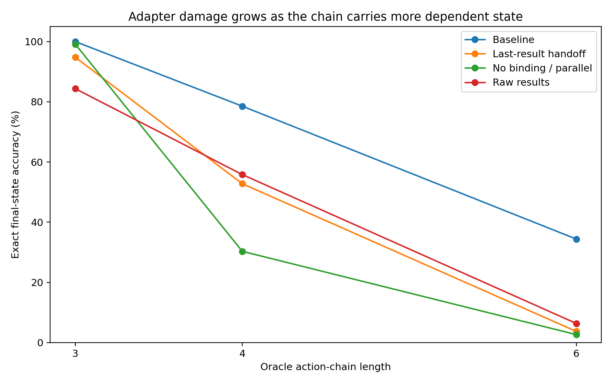

Figure 16. Exact final-state accuracy by oracle action-chain length for the baseline and the three largest primary interface interventions. Source: TOOL-CHAIN-GEOMETRY-006B.

### 10.7 Independent task-sampling stress panel

A second 700-task panel was generated under a new task-sampling seed and replayed with the same frozen state tensors. The canonical tensor hash is identical to the primary campaign. On this stress panel, canonical-prefix exact action accuracy falls to 49.79% and baseline final-state accuracy falls to 14.71%, establishing strong task-sampling sensitivity in this small learned policy. The stress panel is therefore retained as a distribution-sensitivity test rather than pooled with the primary causal effect sizes.

Table 30. Independent task-sampling stress panel.

| Stress-panel condition | Accuracy | Delta pp | Paired 95% CI pp |
| --- | --- | --- | --- |
| Baseline | 14.71% | reference | - |
| Last-result handoff | 5.57% | -9.14 | [-11.57, -6.86] |
| No binding / parallel | 4.57% | -10.14 | [-12.71, -7.57] |
| No binding / sequential | 4.57% | -10.14 | [-12.71, -7.57] |
| Raw results | 2.71% | -12.00 | [-14.71, -9.43] |
| Best-effort schema | 15.14% | +0.43 | [0.00, 1.00] |
| No verification | 14.71% | +0.00 | [0.00, 0.00] |

Source: TOOL-CHAIN-GEOMETRY-006B. Values and definitions follow the measurement contract in this section.

Despite the floor-compressed baseline, state truncation (-9.14 pp), binding removal (-10.14 pp) and raw result surfaces (-12.00 pp) retain the same degradation direction. Best-effort schema is +0.43 pp and no verification is unchanged at this floor. The stress result establishes two positive boundaries simultaneously: the primary 700-task panel supports the reported paired causal effects, and the frozen micro-policy remains sensitive to task-sampling distribution, so cross-distribution magnitude replication requires a stronger policy.

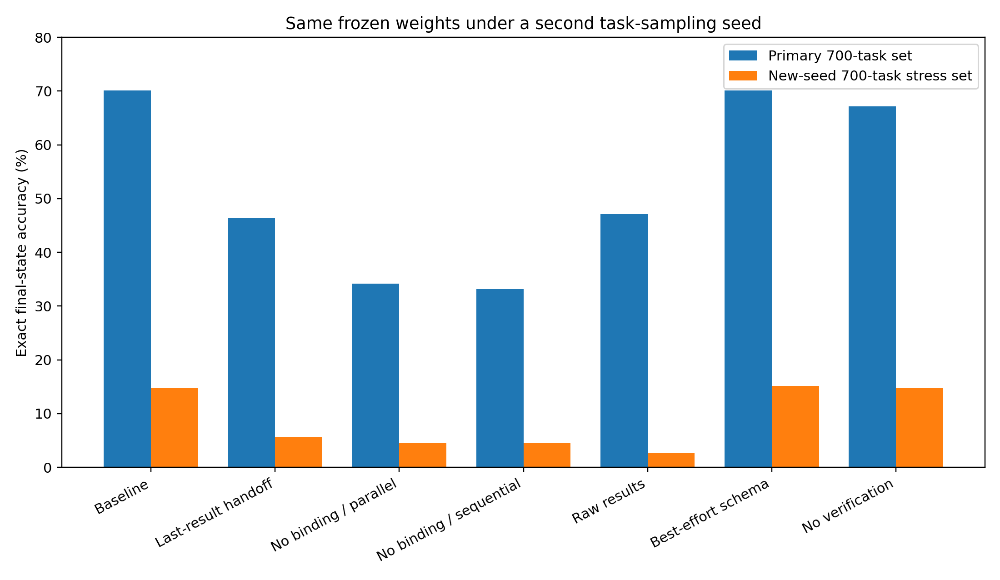

Figure 17. Same frozen state tensors under the primary 700-task panel and a new-seed 700-task sampling stress panel. Source: TOOL-CHAIN-GEOMETRY-006B.

### 10.8 Evidence package and evidence boundary

Evidence availability. The separate TOOL-CHAIN-GEOMETRY-006B analysis archive was not recovered for this edition. The numerical results and embedded figures reported here are preserved; the package supplies clearly identified transcriptions and image extracts. See EVIDENCE_INDEX.md for the available evidence. The initial lower-accuracy construction run is described as a pilot and is excluded from the reported primary effect estimates.

Evidence boundary. The primary campaign identifies causal adapter effects inside the specified six-register executable world with one frozen 124,798-parameter learned policy. The second task panel directly demonstrates that this policy does not yet support distribution-stable effect-size generalization. The current evidence therefore supports the intervention ordering and paired effects for the primary construction, the repeated degradation direction for state/binding/raw-result interventions under the stress panel, and the need for a stronger frozen tool model before extending the magnitudes to broader agent systems.

### 10.9 Discussion - the tool chain is part of the computational body

The binding intervention is easiest to understand as a labeling failure rather than a missing-information failure. In the paired copy trace, the values 2 and 9 both come back from the tools. Nothing has vanished from the numerical payload. What disappears is the small piece of structure that says which parcel came from C and which came from A. The warehouse still contains both parcels; the shipping labels are gone. Once that association is removed, the same frozen policy can carry the wrong value forward with complete confidence and finish in the wrong world.

Putting the unlabeled parcels onto a tidier conveyor belt does not solve that problem. Sequential return order produces 33.14% exact final-state accuracy, compared with 34.14% under randomized return order after binding has been removed; the paired difference is not identified as beneficial. In this construction, order is not a substitute for identity. That distinction matters because a tool loop can look visually orderly while still lacking the relation that lets the next action know what a result belongs to.

The state-handoff result tells a complementary story. Truncating the transcript is like tearing pages out of a working logbook: the current line may still be legible, but the path that gave it meaning is no longer available to the next decision. Raw result surfaces produce a different kind of disturbance. Here the logbook remains intact, yet the instrument panel suddenly changes dialect - a number arrives once as JSON, once with units, once as a zero-padded nested payload. The backend has answered, but the answer no longer lands in exactly the representation on which the policy learned to act. Both manipulations move the final world by about 23 percentage points in the primary panel.

Verification behaves differently. It is not the steering wheel for the whole trajectory; it is a final brake that catches a subset of completed-but-wrong runs. The primary panel gains three percentage points because 21 trajectories that had already declared DONE are shown the actual state mismatch and repair it. No baseline-success trajectory is lost by the verification step. That is a small effect beside binding or state continuity, but operationally it is very clean: the world is checked, a concrete discrepancy is fed back, and a defined set of wrong terminal states is converted into correct ones.

The strict-schema null result is useful for the same reason. Syntax policing visibly changes the trace - strict mode produces schema-error episodes and best-effort mode coerces them - but the final-state score does not move on any of the 700 paired tasks. The experiment therefore refuses a tempting shortcut: not every cleaner-looking tool protocol is the coordinate that determines success. In this micro-agent, the large measured levers are the continuity and identity of information as it crosses the model-tool boundary, not schema strictness by itself.

Chain depth then turns these interface details into dynamics. A three-step copy can survive almost everything because little state has to remain alive. Six-step trajectories already stress the baseline, and the same loss of binding or history pushes exact success toward zero. The system is not failing because one spectacularly wrong call appears at the front. It is failing because small representational mistakes enter the trajectory early enough to be reused by later actions, so the external world gradually becomes the memory of those mistakes.

The sampling stress panel keeps the interpretation disciplined. The same frozen weights collapse on a second task draw, so this experiment has not produced a universal constant for tool-using language models. What it has produced is a controlled causal specimen: in one executable body, with one frozen learned policy and paired worlds, removing state continuity, call-result identity or result normalization changes the world that the system reaches.

## 11 Typed JSON replication

TOOL-CHAIN-GEOMETRY-006C

This experiment changes the learned policy family and tool interface while preserving the central causal question from TOOL-CHAIN-GEOMETRY-006B: which coordinates in the model-tool handoff change the external world reached by a frozen policy? The final campaign uses one frozen structured transcript policy, a real JSON serialization/parse/JSON-Schema execution path, three independently sampled task panels and the same adapter interventions within every paired task world.

Question. Do the state-continuity, call-result identity and result-normalization effects observed in 006B reproduce after the policy family is changed and the tool surface is implemented as typed JSON? Secondary endpoints test whether sequential return order substitutes for explicit result identity, and whether schema mode or final verification changes the endpoint in this stronger structured policy.

### 11.1 Frozen structured policy and typed executable body

Executable world. The register world expands to eight mutable integer registers A-H, values 0-9 and five tools: READ, READPAIR, WRITE, CLEAR and DONE. Nine task families are executed: COPY, BACKUP_CLEAR, SWAP, DUAL_COPY, ROTATE3, DUPLICATE, MOVE2, FANOUT3 and CHAIN_COPY. Tool actions are serialized with json.dumps, parsed with json.loads, validated against Draft 2020-12 JSON Schema and then executed against the concrete register world. Backend reads additionally expose three valid but noncanonical JSON result shapes for the no-normalization intervention.

Frozen policy. A structured transcript policy with four independently learned decision-tree heads predicts tool, first key, second key and value from a 429-coordinate transcript representation. It was trained on 12,000 executable training tasks comprising 62,268 decision examples and then frozen. The policy SHA-256 is 1a1e2fd464281b72ce43948e78f953c33162efffaded34e529a3c39fbc61dea9. The structured representation preserves request roles, bound call results, recent actions, action counts, schema-error state and verification mismatches as distinct observable coordinates.

Independent panels. Three new 200-task panels were generated under independent seeds and replayed through seven adapter conditions with the same frozen policy. Canonical-prefix exact four-head action accuracy is 92.93%, 91.55% and 91.59% across panels 1-3. The baseline adapter reaches 79.50%, 74.50% and 73.50% exact final-state accuracy on the same panels. The policy therefore retains a broadly similar baseline across all three independent draws rather than reproducing the severe second-panel collapse seen in the smaller 006B micro-policy.

Table 31. Three independently sampled typed-JSON panels under the same frozen policy.

| Panel | Prefix exact | Baseline | State truncated | No binding / parallel | Raw JSON / no normalization |
| --- | --- | --- | --- | --- | --- |
| 1 | 92.93% | 79.50% | 30.50% | 5.00% | 5.00% |
| 2 | 91.55% | 74.50% | 28.50% | 6.50% | 6.50% |
| 3 | 91.59% | 73.50% | 29.50% | 5.00% | 5.00% |

Source: TOOL-CHAIN-GEOMETRY-006C. Values and definitions follow the measurement contract in this section.

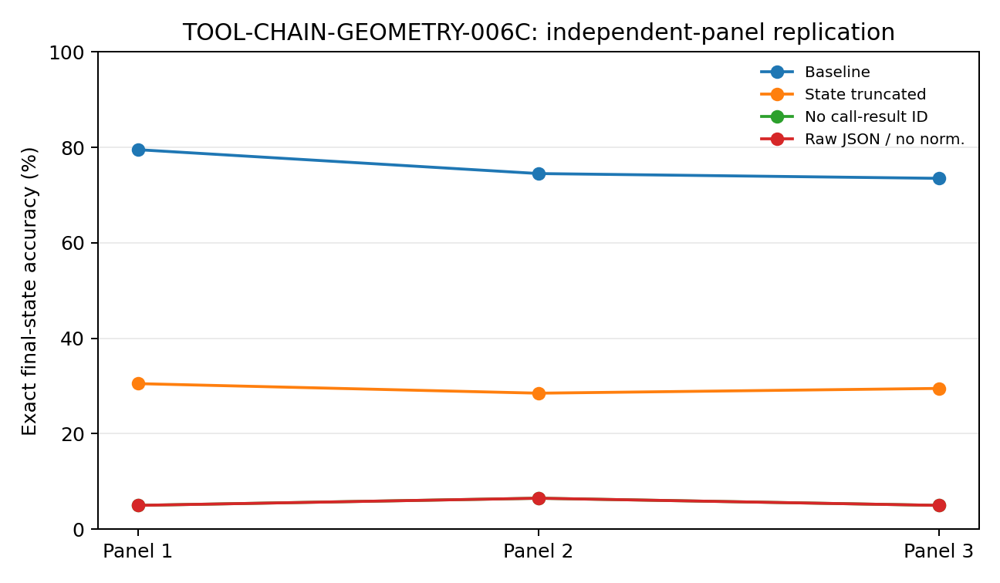

Figure 18. Independent-panel replication under one frozen typed-JSON policy. State truncation, identity removal and raw non-normalized result surfaces retain the same degradation direction in every panel. Source: TOOL-CHAIN-GEOMETRY-006C.

### 11.2 Pooled paired final-state effects

Across the 600 paired task worlds, the complete adapter reaches 75.83% exact final-state accuracy. Truncating the visible trajectory to the request plus the most recent three transcript events reduces exact accuracy to 29.50% (-46.33 percentage points; paired bootstrap 95% interval -50.67 to -42.00 pp). Removing call-result identity under parallel return reduces accuracy to 5.50% (-70.33 pp; 95% interval -74.00 to -66.33 pp). The same 5.50% endpoint is observed when unbound results are forced into sequential return order and when bound backend results are left in noncanonical raw JSON shapes rather than being normalized into the learned result coordinates.

Table 32. Pooled paired endpoint effects across 600 independently sampled task worlds.

| Condition | Accuracy | Delta vs baseline | Paired 95% CI pp | BASE-only / condition-only | Exact McNemar p |
| --- | --- | --- | --- | --- | --- |
| Baseline | 75.83% | reference | - | - | - |
| State truncated | 29.50% | -46.33 pp | [-50.67, -42.00] | 282 / 4 | 3.01e-15 |
| No binding / parallel | 5.50% | -70.33 pp | [-74.00, -66.33] | 423 / 1 | 2.44e-15 |
| No binding / sequential | 5.50% | -70.33 pp | [-74.00, -66.33] | 423 / 1 | 2.44e-15 |
| Raw JSON / no normalization | 5.50% | -70.33 pp | [-74.00, -66.33] | 423 / 1 | 2.44e-15 |
| Best-effort schema | 75.83% | 0.00 pp | [0.00, 0.00] | 0 / 0 | 1.0 |
| No final verification | 75.83% | 0.00 pp | [0.00, 0.00] | 0 / 0 | 1.0 |

Source: TOOL-CHAIN-GEOMETRY-006C. Values and definitions follow the measurement contract in this section.

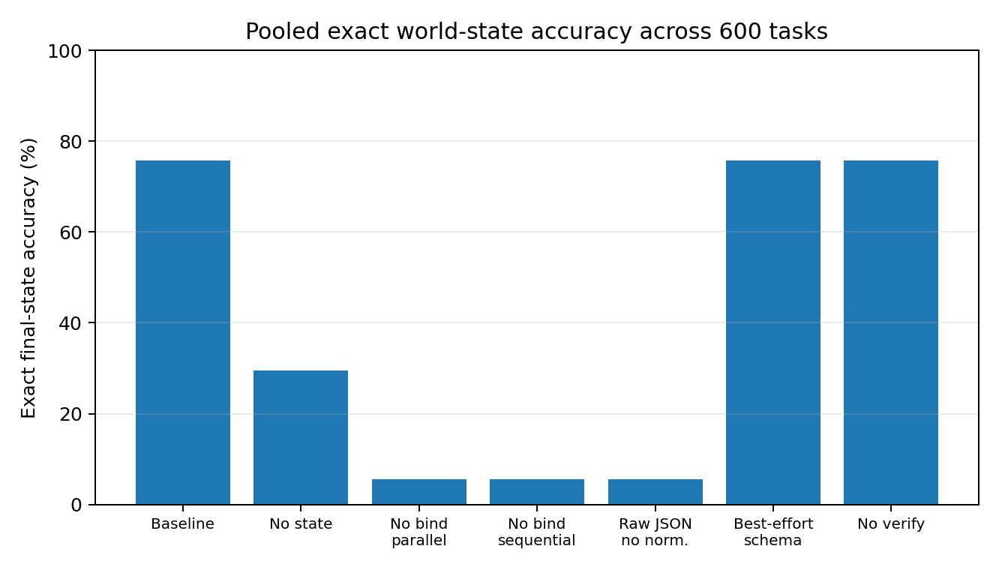

Figure 19. Pooled exact final-state accuracy across the seven typed-JSON adapter conditions. Source: TOOL-CHAIN-GEOMETRY-006C.

### 11.3 Result identity again survives the return-order control

The sequential-order control reproduces the central 006B result in a second policy family. No-binding accuracy is 5.50% with randomized parallel returns and 5.50% when returned values are forced back into call-issue order. The paired outcomes are identical in this campaign. Ordered arrival therefore contributes no measurable endpoint recovery when explicit result provenance is removed from the learned interface.

A representative COPY episode makes the intervention concrete. The request copies G into D and the true G value is 1. Under the complete adapter, the transcript contains RESULT {"call_id":"c1","value":1}; the frozen policy writes D=1 and verifies successfully. With the identifier removed, the transcript still contains RESULT {"value":1}, yet the same policy writes D=6, reaches a wrong DONE state and subsequently produces a schema-invalid DONE-with-fields attempt during recovery. The numerical observation survives in the transcript; its provenance coordinate is the manipulated variable.

### 11.4 State continuity preserves unfinished work across the chain

State truncation produces a second replicated effect: 29.50% pooled exact accuracy versus 75.83% at baseline. In a representative CHAIN_COPY task, C=9 must propagate into E, B and D. The baseline reads C once, writes 9 into all three destinations and finishes correctly. Under the last-three-events handoff, the policy reads C and writes E=9, then declares DONE while B and D still retain their initial values. Verification exposes both mismatches; one later write repairs D, but the episode terminates with B still wrong. The request remains visible throughout; the manipulated coordinate is the working trajectory that records what has already been completed and what remains pending.

Chain-length stratification places the strongest endpoint collapse in the six-action group: baseline accuracy is 26.09%, compared with 0.87% under state truncation and 0% under either no-binding or raw-result conditions. The four- and five-action groups contain different task families and are therefore retained as descriptive strata rather than a monotonic depth experiment.

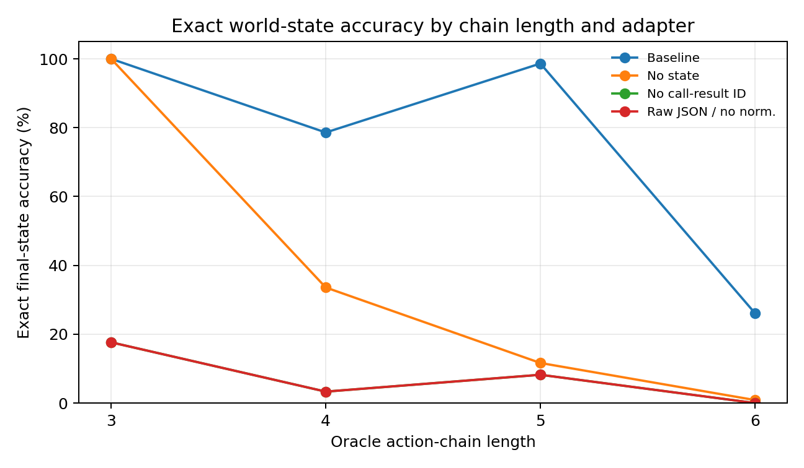

Figure 20. Exact final-state accuracy by oracle action-chain length. Chain length is descriptive here because task family composition differs across length strata. Source: TOOL-CHAIN-GEOMETRY-006C.

### 11.5 Raw result form, schema handling and verification endpoints

Bypassing normalization leaves the backend information in valid JSON but moves it into a different surface contract. For example, the baseline representation RESULT {"call_id":"c1","value":1} becomes a raw backend shape such as RESULT {"request":"c1","result":{"number":1,"unit":"register_value"}}. Under the structured policy used here, canonical call/value fields occupy explicit learned coordinates. Raw backend fields therefore do not populate the same bound-value coordinates, and the pooled endpoint falls to 5.50%. This experiment establishes that the normalization boundary is computationally active in this structured body.

Two endpoint controls are null in this construction. Best-effort schema handling and strict baseline handling produce exactly the same 455 correct and 145 incorrect final worlds across the 600 tasks. Removing final verification also leaves all 600 final outcomes unchanged. These nulls differ from 006B, where verification recovered 21 wrong-DONE trajectories, and show that the impact of a verification layer depends on the error distribution presented by the frozen policy.

### 11.6 Evidence package and evidence boundary

Evidence availability. Recovered authored artifacts for TOOL-CHAIN-GEOMETRY-006C are supplied under evidence/experiments/TOOL-CHAIN-GEOMETRY-006C/. The evidence index specifies the available results, figures, source records and analysis-code coverage. External source corpora are referenced separately.

Evidence boundary. The current evidence establishes cross-policy replication of state-continuity and call-result-provenance effects inside a typed-JSON executable body, with the same direction observed across three independent panels. In this structured policy, identity removal and raw non-normalized results both disconnect the policy from its learned canonical bound-value coordinates and therefore land on the same 5.50% pooled endpoint.

### 11.7 Discussion - a number is not yet a usable fact

006C makes the tool-chain failure feel less like a mysterious model mistake and more like a broken nervous system. The digit can be present, the tool can have executed correctly, and the policy can still act as if the fact arrived from nowhere. In the copy trace, the world hands back the number 1 in both conditions. With {"call_id":"c1","value":1}, the policy writes 1. With {"value":1}, it writes 6. One tiny provenance field changes the number from "a value that exists" into "the value produced by this particular read." That is a very physical distinction for a computational body.

The sequential control is almost comically revealing. We tidied the conveyor belt and returned the unlabeled packages in the same order they were requested. Nothing improved: 5.50% remained 5.50% in every pooled endpoint. Order can tell the system which parcel arrived first; it does not automatically tell the system whose parcel it is. The second policy family therefore repeats the lesson from 006B with an even cleaner endpoint equality: neat traffic is not the same thing as explicit provenance.

State handoff fails in a different way. The CHAIN_COPY trace is not an agent that forgot what C was - it had already used C=9 correctly. It is an agent whose working ledger lost the line saying "B and D are still unfinished." After one correct write it simply stops. Verification then shows the missing work, and the policy repairs one destination but leaves another behind. This looks less like a bad first decision and more like a task that slowly fell out of the body while the body was still moving.

Normalization adds another twist: information can exist in the bytes without existing in the policy's usable coordinate system. The raw JSON still says that the result number is 1 and still carries an identifier-like field. Yet the structured reader has learned a particular anatomical socket - call_id plus value - and the raw backend shape does not plug into it. In this model, normalization is therefore not cosmetic cleanup. It is the piece that turns a backend-specific message into the coordinate system the policy actually knows how to use.

The null controls are just as useful. Strict schema handling buys nothing when the baseline policy is already emitting valid calls; verification buys nothing when this policy's wrong-DONE trajectories are not recoverable by the learned correction behavior. In 006B, the same verification idea rescued 21 trajectories. Put together, the two experiments suggest a practical rule for tool bodies: a guard only becomes useful when its corresponding failure surface is actually populated. Adding more guards is not the same thing as strengthening the coordinates that carry state and provenance.

In 006C, no binding and no normalization fall off the same cliff because both stop the structured reader from filling its canonical bound-value slots. The 006D factorial separates this shared failure surface into a 2 × 2 map: values stay visible, provenance is present or absent, and representation is canonical or noncanonical. This construction measures which parts of the interface carry distinct computational information and how those parts interact.

## 12 Provenance and normalization factorial

TOOL-CHAIN-GEOMETRY-006D

TOOL-CHAIN-GEOMETRY-006D separates two result-handoff coordinates that were confounded in 006C: result provenance and representation normalization. The formal run keeps the observed value visible in every interface cell, uses the same result-event slots in every condition, freezes one policy before evaluation and replays three independent held-out task panels through all four factorial cells.

Question. When numerical result content remains visible, how much final-world accuracy is carried by explicit call-result identity, how much by canonical normalization, and do the two interface coordinates interact? A secondary stratification asks whether those effects appear specifically when a decision must associate multiple returned values with multiple outstanding calls.

### 12.1 Final construction and design diagnostics

Formal event-slot representation. Every read result occupies one of the same four recent-result slots. Provenance changes only the label attached to that slot: with provenance present, the result carries a call-derived key identity; with provenance absent, the same slot remains unlabeled. Normalization changes only the value code: canonical results use one shared numeric code family, while backend-native results retain one of three raw surface code families. The numerical observation itself remains readable in all four cells.

Design diagnostics. Two provisional runs were used to remove representation confounds before formal inference. The first represented bound and unbound results in differently sized coordinate systems; the second assigned raw surface style from a call-counter-derived rule that could leak weak positional information. The final run uses symmetric result slots and raw-style assignment that varies independently across episodes/calls. Only this final symmetry-controlled run supplies the reported endpoint statistics.

Frozen policy. The structured event-slot policy contains four independent decision-tree action heads over 545 input coordinates. It was trained on 5,000 executable tasks and 90,696 action-decision examples, with all four interface cells represented during training, and then frozen. Policy SHA-256: 2aa1bb47b25c6fc827c801602f26dd210933accae3c560cb0d1cebf809668bad. Three independently generated 200-task held-out panels were then executed through the same frozen policy.

Table 33. Exact final-state accuracy in the three independent held-out factorial panels.

| Panel | Prov+ / Norm+ | Prov+ / Raw | No prov / Norm+ | No prov / Raw |
| --- | --- | --- | --- | --- |
| 1 | 82.5% | 67.5% | 73.5% | 66.0% |
| 2 | 83.0% | 68.0% | 74.0% | 65.5% |
| 3 | 85.0% | 70.5% | 75.5% | 70.5% |

Source: TOOL-CHAIN-GEOMETRY-006D. Values and definitions follow the measurement contract in this section.

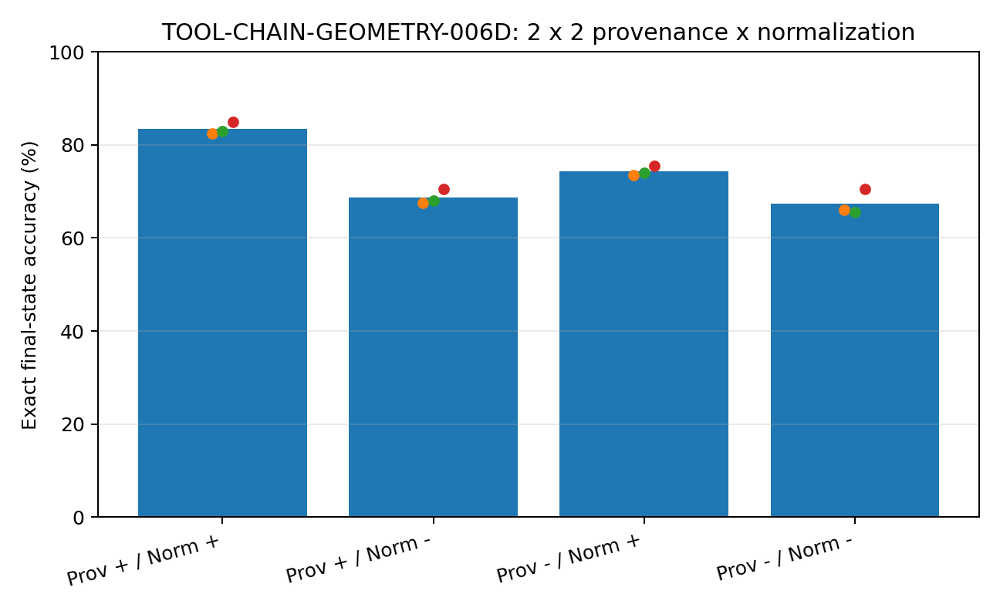

Figure 21. Exact final-state accuracy for the four provenance x normalization cells. Small points show the three independent panels; bars show pooled accuracy. Source: TOOL-CHAIN-GEOMETRY-006D.

### 12.2 Pooled factorial effects

Across 600 paired held-out worlds, the fully identified and normalized interface reaches 83.50% exact final-state accuracy. Keeping provenance but retaining backend-native raw value codes reaches 68.67%; canonical normalization without provenance reaches 74.33%; removing both coordinates reaches 67.33%. The paired provenance main effect is +5.25 percentage points, the normalization main effect is +10.92 points, and the difference-in-differences interaction is +7.83 points.

Table 34. Pooled factorial effects with task-paired bootstrap 95% intervals.

| Quantity | Estimate | Paired bootstrap 95% interval |
| --- | --- | --- |
| Provenance main effect | +5.25 pp | [3.58, 6.92] pp |
| Normalization main effect | +10.92 pp | [7.75, 14.17] pp |
| Provenance x normalization interaction | +7.83 pp | [5.00, 10.50] pp |
| Normalization gain when provenance present | 14.83 pp | derived paired cell contrast |
| Normalization gain when provenance absent | 7.00 pp | derived paired cell contrast |
| Provenance gain when normalized | 9.17 pp | derived paired cell contrast |
| Provenance gain on raw surfaces | 1.33 pp | derived paired cell contrast |

Source: TOOL-CHAIN-GEOMETRY-006D. Values and definitions follow the measurement contract in this section.

Figure 22. Task-paired main effects and interaction with bootstrap 95% intervals. The positive interaction shows that provenance and normalization jointly improve the usable result state beyond their isolated average contributions. Source: TOOL-CHAIN-GEOMETRY-006D.

### 12.3 The effect localizes to multi-result association

The cleanest anatomical split appears when tasks are stratified by result-association demand. Among 337 single-read tasks, all four cells return exactly 94.66% final-state accuracy; provenance, normalization and their interaction are all 0.00 pp. Among 263 multi-read tasks, the four cells separate to 69.20%, 35.36%, 48.29% and 32.32%, respectively. In that subgroup the provenance main effect is +11.98 pp, normalization is +24.90 pp and the interaction is +17.87 pp.

The timing of divergence moves with the same structure. Among failed trajectories, the fully specified P1/N1 interface first diverges from the oracle at median step 3, while the three perturbed cells diverge at median step 2. The interface damage therefore becomes visible at the first action that must consume or re-associate returned values rather than only at final verification.

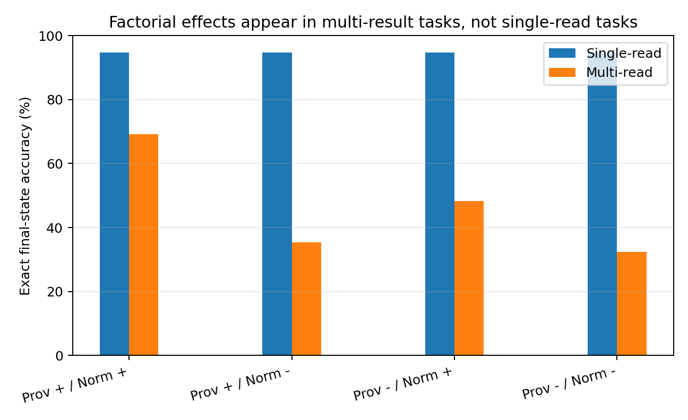

Figure 23. The factorial separation is concentrated in multi-read tasks. Single-read tasks occupy the same endpoint in all four cells. Source: TOOL-CHAIN-GEOMETRY-006D.

### 12.4 Raw-surface stability control

A secondary control keeps provenance present and forces every raw result into one stable backend-native surface style rather than mixing three raw formats. Pooled accuracy is 66.50%, 66.67% and 69.17% for fixed raw styles 0-2. The mixed-raw factorial cell is 68.67%, whereas the canonical P1/N1 cell is 83.50%. Stable raw formatting therefore does not close the canonicalization gap in this learned reader; the measured normalization effect reflects more than switching among raw backend shapes.

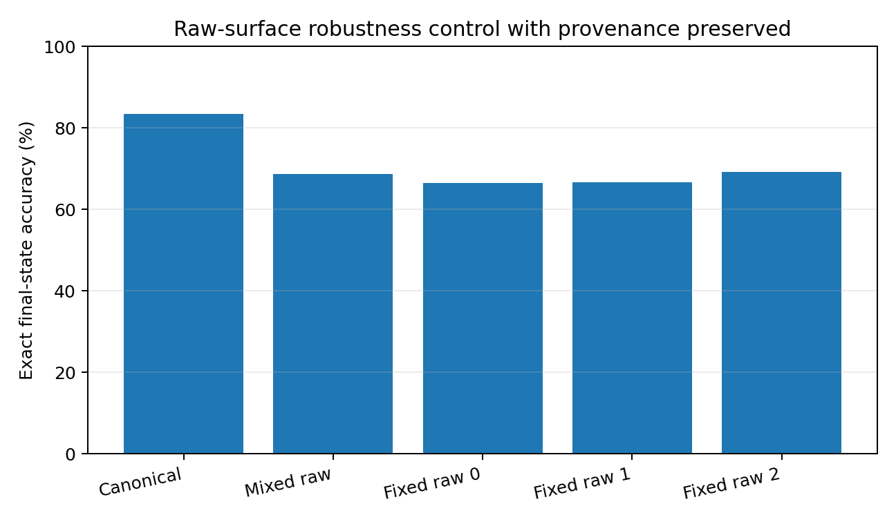

Figure 24. Provenance-preserved raw-surface control. Each fixed raw style remains below the canonical result code in pooled final-state accuracy. Source: TOOL-CHAIN-GEOMETRY-006D.

### 12.5 Representative trajectories

The provenance trace shows the multi-result failure directly. In a MOVE2 task, A=7 and H=0 must be copied into D and F before A and H are cleared. With provenance, the two returned values are attached to their source calls and the policy writes D=7 and F=0. When the same canonical values arrive without identity labels, the policy writes D=0 and F=7: both numbers are present, but their ownership is reversed. The raw/no-provenance cell also reaches a wrong state. This episode is the literal form of the pooled multi-read effect: the system has the observations and loses the mapping.

The normalization trace exposes a different route. In a DUAL_COPY task, provenance is intact in both conditions. Canonical values produce C=4 and B=8 correctly. Backend-native raw fields carry the same call identities and numerical content, yet the policy writes C=5 and B=4 and reaches a wrong world. Here the address label survives; the value representation is the manipulated coordinate. Across the full paired panel, canonicalization therefore contributes its own measurable path into the next action.

### 12.6 Evidence package and evidence boundary

Evidence availability. Recovered authored artifacts for TOOL-CHAIN-GEOMETRY-006D are supplied under evidence/experiments/TOOL-CHAIN-GEOMETRY-006D/. The evidence index specifies the available results, figures, source records and analysis-code coverage. External source corpora are referenced separately.

Evidence boundary. The formal evidence establishes separable provenance and normalization effects, plus a positive interaction, inside the specified frozen structured event-slot policy and executable register world. The effects are concentrated in tasks that require multiple returned values to be associated with multiple calls. The fixed-style control further shows that a stable backend-native surface remains below the canonical result code in this reader.

### 12.7 Discussion - a fact needs both an address and a usable shape

006D turns the previous “number is not yet a usable fact” observation into something almost embarrassingly concrete. A single returned value behaves like one cup on an empty table: nobody needs a label because there is nothing to confuse it with. That is exactly what the single-read stratum says - all four interfaces land on the same 94.66% endpoint. The moment two results arrive, the table becomes a laboratory bench full of tubes. Now the system has two separate jobs: know which tube came from which experiment, and know how to read what is inside the tube.

The factorial interaction is the interesting part. Starting from the raw, unlabeled corner, adding provenance alone raises the endpoint only modestly; adding normalization alone helps more; putting both together reaches 83.50%, higher than the additive expectation by 7.83 percentage points. In this body, an address label and a standardized payload are not redundant safeguards. They cooperate. The label tells the policy whose observation it is; normalization turns three backend dialects into the value code the policy can repeatedly reuse.

The MOVE2 trace is almost a cartoon of provenance failure. The tool returns 0 and 7 correctly. No hallucinated value is required. The policy simply swaps their jobs and writes them into the wrong destinations. The DUAL_COPY trace is the mirror image: the call identities survive, but raw surface encoding makes the policy misread what should flow forward. One failure loses ownership; the other loses a stable semantic code. They meet at the same place - the next world state is wrong - but they arrive there through different broken joints.

The fixed-style control also matters because it rules out an easy engineering story. The reader does not recover merely because one backend speaks the same raw dialect every time: the three fixed raw styles remain around 66.5-69.2% pooled accuracy, close to the mixed-raw condition and well below the 83.5% canonical interface. For this policy, normalization is doing real representational work, not just protecting against format churn.

### 12.8 Practical engineering guidance from 006D

The measured pattern translates into concrete tool-body design. The instructions below are tied directly to the executed factorial rather than to a generic agent checklist.

Table 35. Evidence-linked implementation guidance for tool-chain adapters.

| Observed coordinate | Implementation instruction | Operational check |
| --- | --- | --- |
| Result provenance | Carry one immutable call/result identity from tool request through backend return, adapter transform and working-state insertion. Maintain an explicit call_id -> tool + arguments + result + state-slot record. | In multi-call tests, permute return order and verify that the same final world is reached. |
| Normalization | Convert backend-native value surfaces into a canonical semantic result object before the next policy decision. Retain the raw payload beside the canonical form for audit/replay. | Run the same task through fixed and mixed backend formats; compare the canonical-state object before policy consumption. |
| Provenance x normalization interaction | Treat binding and normalization as one ingestion transaction for fan-in steps: first identify the producing call, then write the normalized value into the call-associated state coordinate. | Assert that every consumed result has both a resolved producer and a canonical value code. |
| Multi-read escalation | Apply the strongest binding/normalization contract at READPAIR, parallel tool calls, fan-out/fan-in joins and any turn that consumes multiple outstanding results. | Track a count of unresolved outstanding calls; require zero unresolved mappings before dependent writes. |
| Single-read fast path | A lighter adapter path is supported for isolated single-result operations in this construction, because all four interfaces reached the same 94.66% endpoint. | Keep the fast path limited to one outstanding result and promote automatically when concurrency/fan-in appears. |
| Early divergence telemetry | Record the first action after result ingestion and compare it with expected tool/key/value constraints; damaged interfaces moved failure divergence from median step 3 to step 2. | Emit a trace event at result-consumption boundaries and flag key/value reassignment before further world mutation. |
| Regression testing | Keep the 2 x 2 provenance x normalization matrix as a harness regression test rather than testing only one “happy path” interface. | For every adapter release, execute all four cells on matched tasks and track main effects plus interaction. |

Source: TOOL-CHAIN-GEOMETRY-006D. Values and definitions follow the measurement contract in this section.

The practical target is therefore not “more guardrails” in the abstract. It is a result-ingestion contract with explicit identity, canonical value representation and a persistent mapping into working state. The 006D data show exactly where that contract becomes valuable: when several observations must be kept distinct long enough to drive different subsequent actions.

## 13 Generated JSON action surface

TOOL-CHAIN-GEOMETRY-006E

The formal experiment keeps the final 006D event reader, planner, executable register world, four provenance × normalization cells and all three 200-task held-out panels fixed. The sole formal intervention is at the action surface: a structured action tuple is passed through an unconstrained neural autoregressive emitter that generates JSON token by token before the text is parsed, schema-checked and executed.

Question. Does the provenance × normalization geometry measured in 006D survive when the final tool command is generated as text rather than passed directly as a structured action? A second measurement asks whether the generative serializer introduces its own observable transformation between the planner state and the executed action.

### 13.1 Pre-formal generative diagnostics separate syntax learning from policy learning

Two end-to-end autoregressive pilots were executed before the controlled transfer. The first decoder-only policy was trained on 37,762 action decisions and evaluated on 825 held-out oracle-prefix decisions. It produced JSON that parsed and satisfied the action schema on 100% of those decisions, yet exact oracle-action identity was 22.18%. A subsequent 450-task / 1,800-trajectory environment scan reached 0.67% exact final-state accuracy in every factorial cell, with mean first divergence at approximately step 1.01. This directly separates surface tool-language fluency from executable strategy under this construction: the system learned how a call should look substantially earlier than it learned which call should change the world.

A second semantic-weighted GRU pilot changed the objective so that tool, key and value tokens carried more weight than punctuation. On 543 held-out oracle-prefix decisions it produced 19.15% exact actions, 53.59% JSON parse success and 35.36% schema-valid actions. This diagnostic exposed a second coupling: increasing semantic-token pressure altered the generated surface itself. The formal 006E design therefore holds the already validated planner fixed and transfers only the serialization layer, so planner learning and text generation are no longer mixed in the factorial estimate.

### 13.2 Formal generated-action construction and exhaustive serializer assay

The frozen planner is the exact final 006D four-head structured event-slot policy. For every decision, it first proposes an action tuple. A separate neural GRU emitter receives that tuple as conditioning state and autoregressively generates the JSON representation one token at a time under greedy decoding. Decoding is not grammar constrained: the emitted string must pass json.loads and the same typed action-schema validator before reaching the executor.

The legal action language contains 153 tuples: 8 READ actions, 56 ordered READPAIR actions, 80 WRITE actions, 8 CLEAR actions and DONE. Exhaustive assay of all 153 legal tuples returned 153/153 parseable strings, 153/153 schema-valid actions and 153/153 semantically exact reconstructions. The formal matched execution then reused the exact three 200-task panels and seeds from 006D, yielding 600 paired worlds × four interface cells = 2,400 generated-action trajectories.

Table 36. Exact paired transfer from the 006D structured action surface to the 006E autoregressive JSON surface.

| Interface cell | 006D structured | 006E generated JSON | Delta | 006E planner→emitter projection |
| --- | --- | --- | --- | --- |
| Prov+ / Norm+ | 83.50% | 83.50% | 0.00 pp | 5.67% |
| Prov+ / Raw | 68.67% | 69.00% | +0.33 pp | 15.17% |
| No prov / Norm+ | 74.33% | 74.33% | 0.00 pp | 11.50% |
| No prov / Raw | 67.33% | 67.67% | +0.33 pp | 14.83% |

Source: TOOL-CHAIN-GEOMETRY-006E. Values and definitions follow the measurement contract in this section.

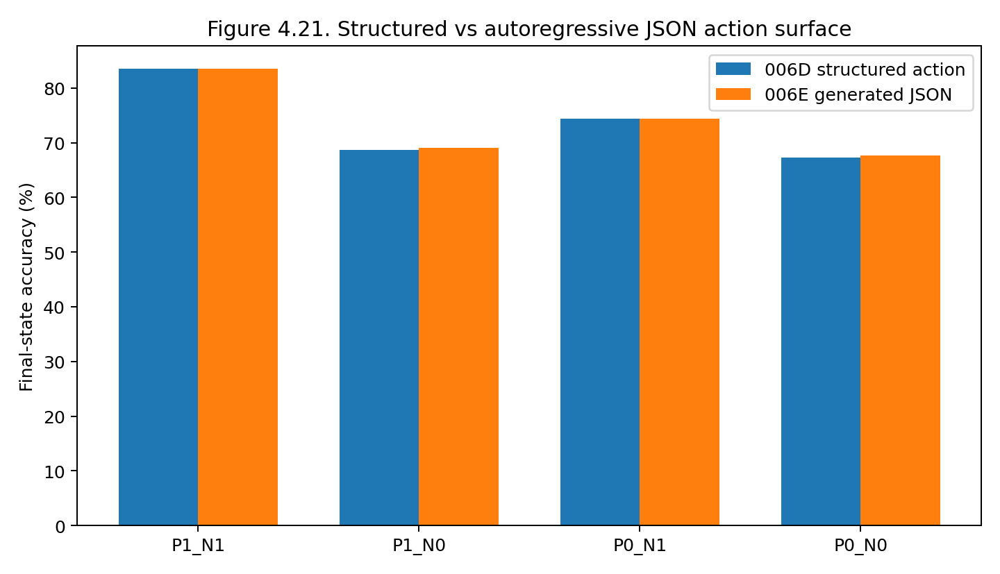

Figure 25. Final-state accuracy is nearly unchanged when the frozen 006D planner is passed through an autoregressive JSON action surface. The two raw cells gain two successes each across the 600 paired worlds. Source: TOOL-CHAIN-GEOMETRY-006E.

### 13.3 Provenance and normalization effects survive generated serialization

Across the 600 paired worlds, 006E reaches 83.50%, 69.00%, 74.33% and 67.67% exact final-state accuracy in the P1/N1, P1/N0, P0/N1 and P0/N0 cells. The paired provenance main effect is +5.25 percentage points with bootstrap 95% interval [3.75, 6.92] pp. The normalization main effect is +10.58 pp [7.50, 13.83], and the provenance × normalization interaction is +7.83 pp [5.17, 10.67].

The generated-action trajectories agree with the corresponding 006D structured-action success/failure outcome on 99.83% of all 2,400 task-cell pairs. Mean final-state accuracy changes by only +0.17 pp. Provenance keeps the same +5.25 pp main effect and the interaction remains +7.83 pp; the small normalization shift from +10.92 to +10.58 pp is produced by four repaired outcomes in raw-surface cells rather than by a broad change in the factorial geometry.

### 13.4 The interaction remains localized to multi-result association

The same localization found in 006D survives the generated action surface. Among 337 single-read tasks, all four cells remain exactly equal at 94.66% final-state accuracy, producing zero provenance effect, zero normalization effect and zero interaction. Among 263 multi-read tasks, the four cells reach 69.20%, 36.12%, 48.29% and 33.08%. The provenance main effect is +11.98 pp, normalization +24.14 pp and interaction +17.87 pp [11.79, 23.95]. The interaction is numerically identical to 006D in this subgroup.

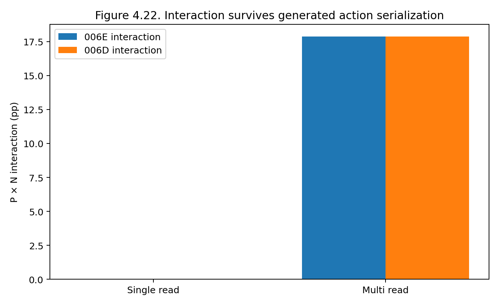

Figure 26. The provenance × normalization interaction remains zero for single-read tasks and approximately 17.87 pp for multi-read tasks after actions are generated token by token. Source: TOOL-CHAIN-GEOMETRY-006E.

### 13.5 The serializer forms an observable repair/projection surface

The formal emitter reproduces every legal planner action exactly in the 153-action exhaustive assay, yet planner→emitter mismatches occur on 5.67%, 15.17%, 11.50% and 14.83% of trajectories across the four interface cells. These rates exactly equal the trajectory-level schema-error rates of the original 006D structured planner. The correspondence identifies the source: whenever the frozen planner proposes an out-of-schema tuple, the learned emitter maps that unseen conditioning state onto a nearby legal JSON action rather than reproducing the invalid tuple verbatim.

Across 2,400 trajectories, this projection appears in 283 task-cell runs. It changes the final success/failure outcome in four runs, all SWAP tasks in raw/non-normalized cells, and all four changes are from 006D failure to 006E success. In one paired case, verification exposes that register B should be zero. The frozen planner then proposes the invalid tuple {"key":"B","tool":"DONE"}. The autoregressive emitter maps it to the legal action {"key":"B","tool":"CLEAR"}; the executor clears B and the subsequent DONE reaches the target state. The text surface has therefore performed a measurable semantic edit between internal plan and external action.

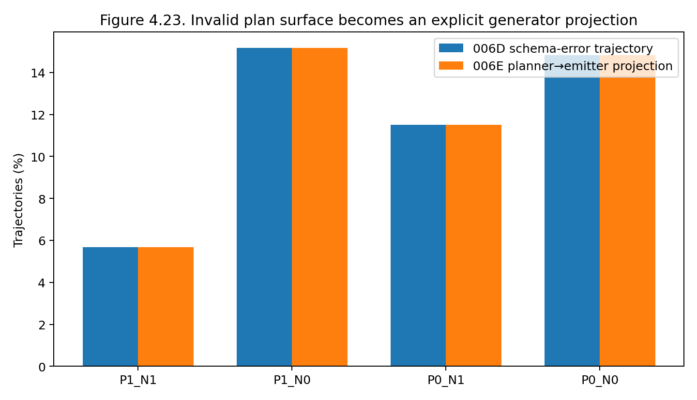

Figure 27. The per-cell frequency of planner→emitter projection in 006E exactly matches the trajectory-level schema-error surface of the same planner under direct structured execution in 006D. Source: TOOL-CHAIN-GEOMETRY-006E.

Table 37. Measured properties of the 006E generated action surface.

| Quantity | Executed result | Evidence-linked interpretation |
| --- | --- | --- |
| Legal action serialization | 153/153 JSON parse; 153/153 schema-valid; 153/153 semantic exact | Greedy autoregressive serialization can be made exact over the closed legal tool language used here. |
| Paired world agreement with 006D | 2,396 / 2,400 task-cell outcomes = 99.83% | The upstream provenance/normalization geometry transfers through the generated surface with minimal endpoint change. |
| Projection episodes | 283 / 2,400 trajectories = 11.79% | Projection is activated at the planner schema boundary, not during ordinary legal serialization. |
| Outcome-changing projections | 4 / 2,400 trajectories = 0.17% | A learned serializer can occasionally convert an invalid internal plan into a useful legal intervention. |
| Formal syntax/schema errors | 0 / 2,400 trajectories | The formal generator adds no parser/schema failures under greedy decoding in this closed action language. |

Source: TOOL-CHAIN-GEOMETRY-006E. Values and definitions follow the measurement contract in this section.

### 13.6 Evidence package and evidence boundary

Evidence availability. Recovered authored artifacts for TOOL-CHAIN-GEOMETRY-006E are supplied under evidence/experiments/TOOL-CHAIN-GEOMETRY-006E/. The evidence index specifies the available results, figures, source records and analysis-code coverage. External source corpora are referenced separately.

Evidence boundary. The formal causal statement is about action-surface transfer: the same frozen 006D planner and event reader are passed through a learned autoregressive JSON serializer. The result establishes that the measured provenance × normalization geometry survives this generated action surface and that the serializer itself can act as an observable projection layer at the planner schema boundary. The two end-to-end generative pilots separately establish syntax/strategy and objective-coupling phenomena; their low-baseline trajectories are retained as diagnostics rather than used to estimate the formal 2 × 2 effects.

### 13.7 Discussion - the mouth is not the mind, but it can edit the command

The first 006E pilot is almost a perfect cautionary cartoon. The model filled out tool forms beautifully: every held-out action string parsed, every one satisfied the schema, and the surface looked disciplined. Yet only 22.18% of the actions matched the oracle and the executable worlds almost immediately wandered away from their targets. It is the computational equivalent of a clerk who never misspells a form but keeps mailing it to the wrong address. Syntax compliance is real evidence about the mouth of the system; it is not evidence that the body chose the right movement.

Once the planner is frozen, the picture becomes much sharper. The generated JSON layer leaves almost all task outcomes where 006D put them: 99.83% paired agreement, the same +5.25 pp provenance effect, the same +7.83 pp interaction, and the same complete disappearance of the interaction on single-read tasks. In other words, changing a structured action tuple into generated text does not dissolve the result-binding geometry upstream. The fragile coordinate still lives where several observations have to be assigned back to the right calls and converted into a form the next decision can use.

But the serializer is not a transparent pipe either. At the planner schema boundary it behaves like a secretary who receives an impossible instruction and quietly rewrites it into the closest sentence she knows how to type. Most of the time that edit merely changes the surface trajectory. Four times it changes the world outcome, and in the clearest SWAP case it happens to rescue the task: an invalid DONE carrying a key becomes CLEAR(key), exactly the intervention needed after verification. That rescue is useful evidence because it exposes a new engineering object. A generative action surface can be a repair operator. The same property also means that the executed command may no longer be the command the planner proposed.

The useful decomposition is therefore three-layered: plan semantics, serialization semantics and world semantics. 006E measures all three separately. The pilots show that serialization can look perfect while planning is poor; the formal run shows that a reliable serializer can preserve upstream causal geometry; the projection cases show that serialization can also mutate a plan before it reaches the world. Tool-agent evaluation becomes much more informative when those three layers are logged separately instead of collapsed into one “tool-call accuracy” number.

### 13.8 Practical engineering guidance from 006E

The executed measurements translate into an implementation contract for generative tool agents. Each instruction below is tied to a measured 006E endpoint rather than to a generic preference.

Table 38. Evidence-linked implementation guidance for generative action surfaces.

| Measured coordinate | Implementation instruction | Operational check |
| --- | --- | --- |
| Plan vs emitted action | Persist both the planner action object and the generated action text as separate records. After parsing, store a third executed-action object and compute plan→emission and emission→execution diffs. | Regression telemetry should report the percentage of trajectories with any plan→emitter semantic change; 006E observed 11.79% because invalid planner tuples were projected. |
| Serializer repair | If action repair is desired, implement it as an explicit named policy step with a repair reason and before/after action pair. Route out-of-schema planner states through that step rather than allowing silent mutation. | Replay the four outcome-changing SWAP cases and verify that repair events are surfaced as repairs, not indistinguishable normal calls. |
| Closed action language | For bounded tool schemas, exhaustively enumerate legal action tuples and test parse, schema validity and semantic round-trip identity of the serializer. | 006E’s 153 legal actions achieved 153/153 on all three checks; preserve this exhaustive assay as a release gate. |
| Syntax vs strategy | Track at least three separate metrics: planner/oracle semantic action identity, emitted JSON parse/schema validity, and final world-state success. | The first pilot reached 100% parse/schema validity with 22.18% oracle-action identity and 0.67% final-state success, so the metrics must remain separate. |
| Upstream result contract | Keep 006D provenance binding and canonical result normalization ahead of the generative action surface. Text generation does not substitute for result identity or usable value representation. | Maintain the four-cell provenance × normalization regression matrix; 006E preserved +5.25 pp provenance, +10.58 pp normalization and +7.83 pp interaction. |
| Multi-result stress tests | Use multi-read/fan-in tasks as the primary interface regression set, with single-read tasks retained as a low-ambiguity control. | 006E single-read cells are all 94.66%; multi-read interaction is +17.87 pp. |
| Execution gating | Parse and schema-check generated text before execution, then verify the external state after completion. Log first divergence at the plan, emitted action and world-state layers. | Formal 006E generated 0 syntax/schema errors, allowing upstream planner divergence and downstream world divergence to be measured without conflation. |

Source: TOOL-CHAIN-GEOMETRY-006E. Values and definitions follow the measurement contract in this section.

The practical architecture suggested by 006E is not “let the language model print JSON and trust it.” It is a three-record pipeline: planner state → generated action surface → executed world transition. Provenance/normalization belongs upstream in result ingestion; plan/emission diffing belongs at the action boundary; final-state verification belongs downstream. With those interfaces exposed, a serializer can be intentionally used as a repair layer without silently changing the meaning of the plan.

## 14 Generative semantic planning

TOOL-CHAIN-GEOMETRY-006F

TOOL-CHAIN-GEOMETRY-006F replaces the structured 006D planner with a learned autoregressive semantic planner and retains the frozen 006E autoregressive JSON emitter. The event reader, executable register world, provenance × normalization cells and three 200-task held-out panels remain matched to the final 006D experiment.

Question. When both action planning and action serialization are generated autoregressively, which tool-chain interface coordinates still control final external-state accuracy? The experiment first establishes that the learned planner can execute the world above a predeclared competence gate, then repeats the four-cell provenance × normalization intervention on the same held-out worlds.

### 14.1 Generative planner construction and competence gate

Planner construction. The planner receives the same 545-coordinate event-state reader used in 006D. Instead of four independent action heads, it autoregressively generates four semantic action tokens in order: tool, key1, key2 and value, followed by EOS. These generated semantics are parsed into an action tuple and passed to the frozen 006E neural JSON emitter, which then generates the executable JSON action token by token. The formal tool path is therefore learned planner semantics → generated JSON surface → schema validation → executable world transition.

Training execution. The planner was trained from 6,000 generated executable tasks spanning all four interface cells, producing 109,424 oracle action contexts. The saved checkpoint contains three completed epochs, with mean training NLL falling from 1.0471 to 0.4965 to 0.1812. A separate gate was applied after the checkpoint was saved: oracle-prefix exact action accuracy had to reach at least 85% and P1/N1 exact final-state accuracy at least 65%. The checkpoint reached 93.48% exact action accuracy across 6,376 held-out decisions and 84.17% exact final-state accuracy across 240 held-out P1/N1 tasks, so the formal factorial proceeded.

Serializer gate. The frozen 006E emitter was rechecked exhaustively on all 153 legal action tuples. It generated 153/153 parseable JSON strings, 153/153 schema-valid calls and 153/153 semantic round trips. In the formal 006F trajectories, generated JSON syntax failure, emitted schema failure and planner→emitter semantic mismatch were all zero.

Table 39. Competence gates and formal campaign entry conditions for TOOL-CHAIN-GEOMETRY-006F.

| Gate / component | Executed assay | Measured result | Formal role |
| --- | --- | --- | --- |
| Generative planner | 6,376 oracle-prefix decisions | 93.48% exact action | Passed ≥85% gate |
| World competence | 240 held-out P1/N1 tasks | 84.17% exact final state | Passed ≥65% gate |
| JSON emitter | 153 legal action tuples | 153/153 exact semantic round trips | Frozen generated action surface |
| Formal campaign | 600 worlds × 4 cells | 2,400 executed trajectories | Primary factorial evidence |

Source: TOOL-CHAIN-GEOMETRY-006F. Values and definitions follow the measurement contract in this section.

### 14.2 Final-state factorial: provenance survives; normalization becomes training-regime dependent

Across the same 600 paired held-out worlds used in final 006D, the end-to-end generative tool policy reaches 82.17% exact final-state accuracy with provenance and canonical normalization, 80.67% with provenance and raw backend-native result surfaces, 72.33% with canonical values but no provenance and 72.67% with neither provenance nor normalization. All three independent panels reproduce the same broad separation between provenance-present and provenance-absent conditions.

Table 40. Exact final-state accuracy for the three matched 006F held-out panels.

| Panel | Prov+ / Norm+ | Prov+ / Raw | No prov / Norm+ | No prov / Raw |
| --- | --- | --- | --- | --- |
| 1 | 83.0% | 81.5% | 69.0% | 70.0% |
| 2 | 80.0% | 80.0% | 74.0% | 75.5% |
| 3 | 83.5% | 80.5% | 74.0% | 72.5% |
| Pooled | 82.17% | 80.67% | 72.33% | 72.67% |

Source: TOOL-CHAIN-GEOMETRY-006F. Values and definitions follow the measurement contract in this section.

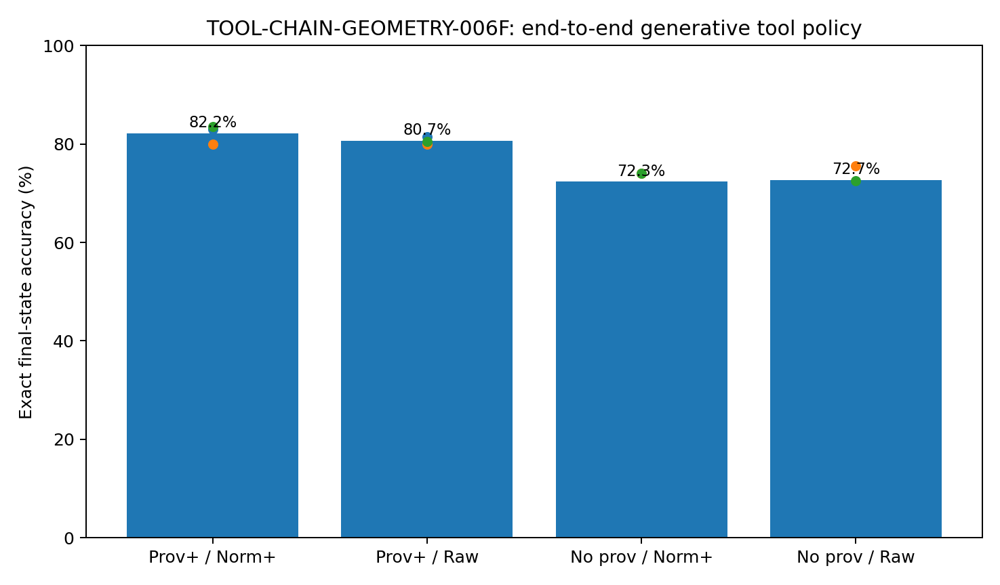

Figure 28. Exact final-state accuracy for the end-to-end generative planner and generated JSON tool surface. Dots show the three independent held-out panels; bars show pooled accuracy. Source: TOOL-CHAIN-GEOMETRY-006F.

Task-paired estimation gives a provenance main effect of +8.92 percentage points with bootstrap 95% interval [6.42, 11.50]. The normalization main effect is +0.58 pp with interval [-1.33, 2.25], and the provenance × normalization interaction is +1.83 pp with interval [-1.00, 4.83]. Under this planner and the matched raw-style distribution represented during training, provenance therefore remains a stable final-state coordinate, while normalization no longer produces the large independent and interacting gains measured with the structured 006D policy.

Table 41. Paired factorial effects for the 006F generative planner.

| Quantity | 006F estimate | Task-paired bootstrap 95% interval |
| --- | --- | --- |
| Provenance main effect | +8.92 pp | [+6.42, +11.50] pp |
| Normalization main effect | +0.58 pp | [-1.33, +2.25] pp |
| Provenance × normalization interaction | +1.83 pp | [-1.00, +4.83] pp |

Source: TOOL-CHAIN-GEOMETRY-006F. Values and definitions follow the measurement contract in this section.

Figure 29. Interface effects across 006D, 006E and 006F. Moving only the serializer to generation leaves the 006D effect pattern nearly unchanged; replacing the planner with a learned autoregressive policy increases the provenance effect and sharply reduces the normalization and interaction terms under matched raw-style training. Source: TOOL-CHAIN-GEOMETRY-006F.

### 14.3 The provenance effect localizes to multi-result reassociation

The single-read / multi-read split becomes even sharper in 006F. Among 337 single-read worlds, all four cells are close to saturation: 99.11%, 98.81%, 98.22% and 98.52%. The paired provenance effect is only +0.59 pp with a bootstrap interval spanning zero. Among 263 multi-read worlds, final-state accuracy becomes 60.46%, 57.41%, 39.16% and 39.54%; the provenance main effect expands to +19.58 pp with bootstrap 95% interval [14.45, 24.90]. Normalization contributes +1.33 pp in this subgroup with an interval spanning zero, and the interaction is +3.42 pp with an interval spanning zero.

This localization matches the executed trace anatomy. In a SWAP world with G=9 and D=8, both provenance-present cells read the same two values and correctly write G=8 and D=9. When result identity is removed, the same values remain visible, yet the planner writes G=9 and D=8 and leaves the world effectively unswapped. The failure begins at step 2, immediately after the paired read: the content is present, but the address needed to reassign the two values is gone.

Figure 30. 006F exact final-state accuracy by task family. The largest separations appear in task families that require reassociating multiple returned values, including SWAP, DUAL_COPY and MOVE2; simple one-read families are near saturation. Source: TOOL-CHAIN-GEOMETRY-006F.

### 14.4 Step-level diagnosis: the planner learns raw value dialects, not missing identities

To separate trajectory compounding from immediate action decoding, all 10,840 oracle-prefix decision contexts from the same 600 formal worlds were reconstructed and decoded in batch. Overall exact action accuracy is 93.08%. By interface cell it is 94.98% for P1/N1, 93.73% for P1/raw, 91.81% for P0/N1 and 91.81% for P0/raw. Tool selection itself is above 99.8% in every cell; most of the remaining separation lies in key/value assignment after result consumption.

The multi-read WRITE assay makes the distinction explicit. Exact WRITE actions are 81.04% and 75.67% with provenance present, versus 67.79% and 67.45% without provenance. WRITE-value accuracy is 82.21%, 77.68%, 69.63% and 69.80%. The learned planner therefore retains a small step-level advantage from canonical values, yet the raw value styles seen during training are decoded well enough that normalization does not generate a stable final-state main effect. Explicit result identity remains the larger coordinate because it determines which observed value belongs to which source call.

Table 42. Oracle-prefix step diagnostics on the same 600 formal worlds.

| Oracle-prefix diagnostic | Prov+ / Norm+ | Prov+ / Raw | No prov / Norm+ | No prov / Raw |
| --- | --- | --- | --- | --- |
| All action exact | 94.98% | 93.73% | 91.81% | 91.81% |
| After-result action exact | 87.91% | 84.18% | 77.46% | 78.21% |
| Multi-read WRITE exact | 81.04% | 75.67% | 67.79% | 67.45% |
| Multi-read WRITE value correct | 82.21% | 77.68% | 69.63% | 69.80% |

Source: TOOL-CHAIN-GEOMETRY-006F. Values and definitions follow the measurement contract in this section.

Figure 31. Multi-read WRITE decisions under oracle prefixes. Provenance produces the larger separation in both complete action selection and value assignment; the raw/canonical difference is smaller after the generative planner has been trained directly on all three raw backend styles. Source: TOOL-CHAIN-GEOMETRY-006F.

### 14.5 Relation to 006D and 006E

Changing only the action serializer in 006E preserved 99.83% of 006D task-cell outcomes. Changing the planner family in 006F is a larger intervention: paired outcome agreement with 006D is 78.25% and with 006E is 78.33%, while mean final-state accuracy is +3.50 pp and +3.33 pp higher, respectively. This confirms that 006F is not merely a surface transfer. The learned planner changes which individual worlds it solves and changes the measured interface sensitivity profile, while the same executable world and result-handoff factors remain fixed.

Across task families, COPY and DUPLICATE reach 100% in all cells and BACKUP_CLEAR is effectively saturated. The difficult families are those requiring multiple-result reassociation and ordered writes: SWAP reaches 77.9% with P1/N1 versus 45.5% without provenance; DUAL_COPY reaches 76.3% versus 49.2%; MOVE2 reaches 63.2% with provenance versus 29.8-38.6% without it. ROTATE3 remains difficult for the learned planner in every cell, locating a planner-capacity/task-structure limitation that is separate from the provenance effect.

### 14.6 Evidence package and evidence boundary

Evidence availability. Recovered authored artifacts for TOOL-CHAIN-GEOMETRY-006F are supplied under evidence/experiments/TOOL-CHAIN-GEOMETRY-006F/. The evidence index specifies the available results, figures, source records and analysis-code coverage. External source corpora are referenced separately.

Evidence boundary. The formal result establishes provenance robustness and raw-format learning for a planner trained on the same three backend-native result-style families used at formal evaluation. The current evidence supports direct raw-surface consumption under that matched training/deployment regime.

### 14.7 Discussion - the planner can learn the dialect; it still needs the address

006F changes the story in exactly the place a useful experiment should change it. In 006D, the structured policy benefited strongly from both a result address and a canonical value shape. In 006E, giving that planner a generative mouth changed almost nothing. In 006F, the planner itself learns. Once it has been repeatedly exposed to the three raw result dialects, those dialects stop looking like foreign syntax. The model can read "09", a nested number field or a one-element payload and still recover the value often enough that canonicalization no longer moves the final endpoint reliably.

The address behaves differently. The SWAP trace is the cleanest demonstration: G returns 9 and D returns 8. Remove the call identities and no value disappears. The planner simply writes 9 back to G and 8 back to D. It has two perfectly legible numbers and no reliable way to know which number must cross the table. More exposure to the number format does not recreate the missing relation. That is why the provenance effect grows to almost twenty percentage points in multi-read worlds even though the raw/canonical effect largely collapses.

There is also a useful warning in the DUAL_COPY counterexample. One particular world succeeds with canonical values and fails with the raw surface, but other paired worlds go the other way. The aggregate normalization effect is therefore small because the learned planner has converted raw representation into a model-competence problem rather than a fixed adapter bottleneck. A few local wins remain, especially at the immediate WRITE decision, yet they do not add up to a stable final-world advantage under matched backend exposure.

This gives the tool body a more interesting division of labor. Some interface regularities can be internalized by learning; other information has to exist in the observation in the first place. A model can learn a dialect. It cannot infer a call-result address that the harness has erased once multiple indistinguishable values are in flight. That difference - learnable representation versus missing relational identity - is the practical result of 006F.

### 14.8 Practical engineering guidance from 006F

The 006F measurements support a revised implementation contract. Provenance is treated as required result-state structure; normalization becomes conditional on training coverage and deployment stability. The system should be instrumented so those two decisions remain independent.

Table 43. Evidence-linked engineering guidance from the 006F generative-planner experiment.

| Measured coordinate | Implementation instruction | Operational check |
| --- | --- | --- |
| Multi-result provenance (+19.58 pp in multi-read worlds) | Preserve immutable call/result identity through every fan-out and fan-in step. Bind each returned value to its originating call before the next planner decision. | Regression set must include SWAP/DUAL_COPY/MOVE2-style tasks with shuffled result arrival; report final-state accuracy with and without identity labels. |
| Raw formats learned under matched exposure | A generative planner may consume stable backend-native schemas directly when every deployed schema family is represented in training and held-out regression. Keep this as an explicit raw-reader mode, not an accidental parser behavior. | Track backend schema signature and training coverage; run oracle-prefix WRITE-value and final-state tests per raw schema before enabling direct consumption. |
| Normalization effect not stable in matched 006F deployment | Use canonical normalization as a compatibility/portability layer when backend schemas are new, changing or not represented in planner training. Direct raw consumption is justified by measured coverage, not by format familiarity alone. | On every schema change, route a paired raw-vs-canonical test panel before promoting the raw path. |
| Single-read saturation vs multi-read degradation | Escalate the result-ingestion contract when more than one result is outstanding. Single-read fast paths may remain lightweight; fan-in paths should enforce provenance and explicit association. | Telemetry should expose outstanding-call count and mark the first decision after multi-result fan-in as a dedicated regression point. |
| Step-level and final-state metrics diverge | Keep both oracle-prefix action diagnostics and executed final-world accuracy. A small per-step representation advantage can disappear, reverse or compound across a trajectory. | Release reports should include WRITE-value accuracy after reads plus end-to-end exact state, rather than one scalar tool score. |
| Generative planner / serializer decomposition | Log planner semantic tokens, emitted JSON and executed action separately. In 006F the emitter is exact, so remaining errors localize to planning/result state rather than serialization. | Require semantic round-trip equality at the serializer boundary and retain all three records for first-divergence analysis. |

Source: TOOL-CHAIN-GEOMETRY-006F. Values and definitions follow the measurement contract in this section.

The immediate system design target is therefore a hybrid one: keep provenance in the tool protocol because the model cannot recover erased identity, and let normalization policy depend on demonstrated representation coverage. A backend dialect that the planner has actually learned can be read directly; a new or drifting dialect should pass through the canonical compatibility path until the raw reader has its own held-out evidence.

## 15 Held out schema compatibility

TOOL-CHAIN-GEOMETRY-006G

TOOL-CHAIN-GEOMETRY-006G keeps the 006F generative semantic planner family, the frozen 006E autoregressive JSON emitter, the executable register world and the provenance x normalization design, but separates raw backend representations into three style families used during planner training and three style families held out completely until formal evaluation.

Question. 006F showed that a generative planner can absorb raw result dialects when training and deployment use the same representation families. 006G asks whether that direct raw path remains compatible after a true raw-schema support shift, and whether canonical normalization regains value specifically when the backend representation leaves the planner training support.

### 15.1 Training coverage, reserved coordinates and competence gate

Construction. The result-event reader was expanded from 545 to 665 coordinates so that six raw value-style families had separate reserved value channels. Styles 0-2 reproduce the three raw result families used in 006D-006F. Styles 3-5 use different nested field organizations and value surfaces. The planner was trained on 6,000 executable tasks and 109,684 oracle action contexts, but only raw styles 0-2 were ever activated during training; the coordinates reserved for styles 3-5 remained zero throughout training. Canonical normalization maps every backend family, including held-out styles, into the same canonical value channels used during training.

Training and gate. Three training epochs reduce mean NLL from 1.0469 to 0.4793 to 0.1609. Before formal schema-shift evaluation, the checkpoint is tested only on held-out tasks using the seen schema families. Oracle-prefix exact action accuracy reaches 91.96%; exact final-state accuracy reaches 72.92% in P+/N+ and 73.33% in P+/raw-seen. The prospective gate therefore passes before any held-out schema result is inspected.

Table 44. TOOL-CHAIN-GEOMETRY-006G schema-coverage construction and formal-entry gates.

| Gate / construction | Executed assay | Measured result | Role |
| --- | --- | --- | --- |
| Raw-schema support | Styles 0-2 active in training; styles 3-5 reserved but inactive | 3 seen + 3 held-out families | Defines representation-support intervention |
| Planner training | 6,000 executable tasks; 109,684 oracle contexts | NLL 1.0469 -> 0.4793 -> 0.1609 | Frozen generative planner |
| Seen-schema prefix gate | 6,292 held-out oracle-prefix decisions | 91.96% exact action | Passed >=85% gate |
| Seen-schema world gate | 240 held-out tasks | 72.92% P+/N+; 73.33% P+/raw | Passed >=65% in both paths |
| Formal campaign | 600 worlds x 2 schema regimes x 4 cells | 4,800 executed trajectories | Primary paired schema-shift evidence |

Source: TOOL-CHAIN-GEOMETRY-006G. Values and definitions follow the measurement contract in this section.

### 15.2 Data-geometry precheck: the held-out schemas are a real input shift

Before final-state results are interpreted, 2,110 matched result-bearing decision prefixes are reconstructed for each representation. Every paired row fixes the task, decision step and returned numeric content and changes only the result representation. The standard data-geometry audit is then applied to the actual feature rows: constant-coordinate removal and z-scoring, covariance-spectrum stable and participation rank, PCA-95 dimension and top-four energy, local-neighborhood structure, pairwise-distance concentration, four-dimensional neighborhood retention, seen/unseen neighborhood mixing and 20 x 80% resampling stability.

The raw seen/unseen pair is strongly displaced. No matched prefix is identical. In the joint z-scored space the mean matched L2 displacement is 21.44 and mean cosine is 0.548; 86.9% of 10-nearest neighbors come from the same schema regime, and a five-fold linear classifier separates seen from unseen raw prefixes at 100% accuracy. The combined raw profile has stable rank 36.43, participation rank 233.63 and PCA-95 dimension 368; the 20 x 80% stable-rank resampling mean is 36.43 with SD 0.15.

Canonicalization collapses the same intervention exactly at the planner-input level: all 2,110 seen/unseen canonical pairs are identical, matched L2 is zero and cosine is one. The duplicated canonical union has stable rank 22.37, participation rank 106.22 and PCA-95 dimension 181. Because paired canonical rows are exact duplicates, TwoNN estimates on the duplicated union are degenerate and are not used as evidence. The decisive geometry check is the exact matched collapse after canonicalization.

Table 45. Executed data-geometry precheck on 2,110 matched result-bearing prefixes per representation.

| Geometry coordinate | Raw seen vs unseen | Canonical seen vs unseen |
| --- | --- | --- |
| Matched exact identity | 0.0% | 100.0% |
| Matched z-space mean L2 | 21.44 | 0.00 |
| Matched mean cosine | 0.548 | 1.000 |
| 10-NN same-domain fraction | 86.9% | 49.9% diagnostic mixing |
| Stable rank | 36.43 | 22.37 |
| Participation rank | 233.63 | 106.22 |
| PCA-95 dimension | 368 | 181 |
| Top-4 spectral energy | 7.24% | 11.98% |
| 4D PCA 10-NN retention | 6.06% | 14.30% |

Source: TOOL-CHAIN-GEOMETRY-006G. Values and definitions follow the measurement contract in this section.

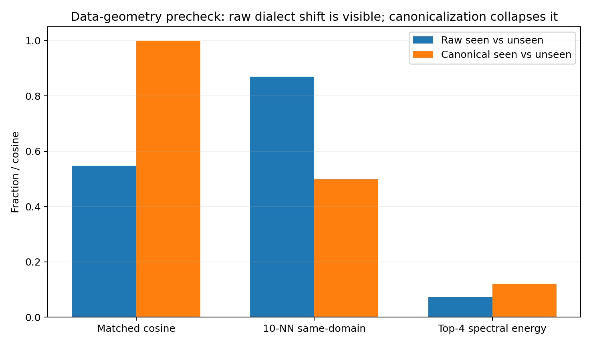

Figure 32. The raw held-out dialects produce a distinct input geometry, while canonical normalization collapses the matched seen/unseen prefix displacement to zero. Source: TOOL-CHAIN-GEOMETRY-006G.

### 15.3 Formal final-state factorial: normalization switches on under unseen schemas

The same three 200-world panels are executed twice: once with raw styles 0-2, which are represented in planner training, and once with held-out raw styles 3-5. The normalized cells are deliberately allowed to see the same hidden backend schema but receive the canonicalized value representation before planning. This preserves task identity, numeric content, provenance condition, tool order and executable world while changing whether a schema shift reaches the planner.

Table 46. Pooled exact final-state accuracy across 600 paired worlds in the seen and held-out raw-schema regimes.

| Schema regime | Prov+ / Norm+ | Prov+ / Raw | No prov / Norm+ | No prov / Raw |
| --- | --- | --- | --- | --- |
| Seen raw schemas | 73.67% | 73.83% | 68.17% | 70.33% |
| Held-out raw schemas | 73.67% | 2.33% | 68.17% | 2.67% |

Source: TOOL-CHAIN-GEOMETRY-006G. Values and definitions follow the measurement contract in this section.

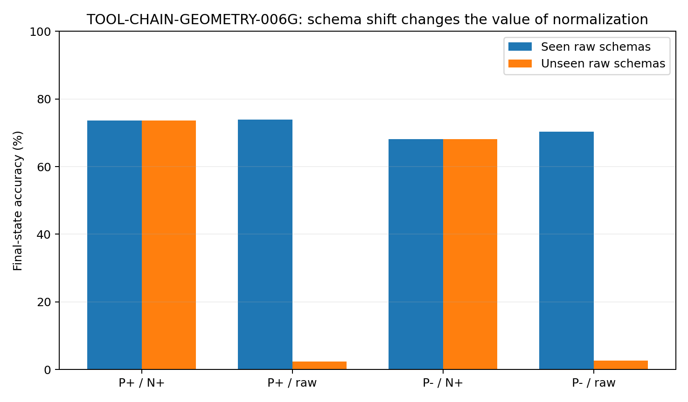

Figure 33. The direct raw path is compatible under the seen schema families and collapses under held-out families. The canonical paths are unchanged because the backend shift is removed before planner input. Source: TOOL-CHAIN-GEOMETRY-006G.

Under seen schemas, the normalization main effect is -1.17 percentage points with bootstrap 95% interval [-3.00, +0.75], reproducing the 006F result that canonicalization adds little when the planner has learned the deployed raw dialects. Under held-out schemas, the normalization main effect becomes +68.42 pp with interval [+64.92, +72.00]. The task-paired increase in normalization effect from seen to unseen is +69.58 pp, bootstrap 95% interval [+66.17, +73.08].

Table 47. Paired representation-shift effects in TOOL-CHAIN-GEOMETRY-006G.

| Schema-shift quantity | Estimate | Bootstrap 95% interval |
| --- | --- | --- |
| Seen-schema normalization effect | -1.17 pp | [-3.00, +0.75] pp |
| Held-out-schema normalization effect | +68.42 pp | [+64.92, +72.00] pp |
| Increase in normalization effect | +69.58 pp | [+66.17, +73.08] pp |
| Raw-path accuracy change, seen -> held-out | -69.58 pp | [-73.08, -66.17] pp |
| Canonical-path accuracy change, seen -> held-out | 0.00 pp | [0.00, 0.00] pp |

Source: TOOL-CHAIN-GEOMETRY-006G. Values and definitions follow the measurement contract in this section.

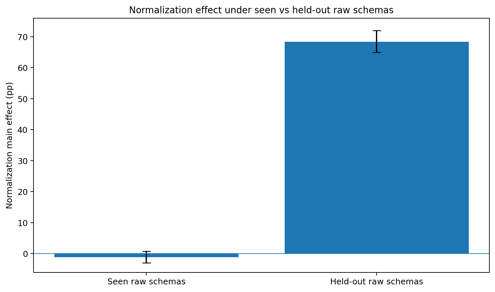

Figure 34. Canonical normalization changes from a near-null endpoint under seen schemas to the dominant compatibility intervention under held-out schemas. Source: TOOL-CHAIN-GEOMETRY-006G.

The paired task counts make the endpoint concrete. With provenance present, normalization beats the held-out raw path on 431 of 600 tasks, loses on 3 and ties on 166; the exact two-sided sign test is p=6.14e-124. Without provenance, normalization wins 398, loses 5 and ties 197; p=8.47e-111. Seen-versus-held-out task outcomes in the two canonical cells agree 100%, confirming that the behavioral shift travels through raw representation rather than a change in task sampling.

### 15.4 Step-level localization: the collapse begins when a held-out result is consumed

All formal worlds are reconstructed under oracle prefixes to separate immediate decoding from trajectory compounding. On seen P+/raw prefixes, overall action exactness is 92.21%, post-result exactness 90.00%, WRITE-value accuracy 88.28% and multi-read WRITE-value accuracy 75.34%. On held-out P+/raw prefixes, the corresponding values fall to 56.53%, 44.17%, 14.35% and 12.08%. The P+/N+ canonical condition is unchanged between schema regimes: overall exactness 92.84%, WRITE-value accuracy 88.92% and multi-read WRITE-value accuracy 77.01%.

Table 48. Oracle-prefix diagnostics localize the held-out schema failure to result consumption and value decoding.

| Prefix diagnostic | Seen P+/N+ | Seen P+/raw | Held-out P+/N+ | Held-out P+/raw |
| --- | --- | --- | --- | --- |
| Overall action exact | 92.84% | 92.21% | 92.84% | 56.53% |
| Post-result action exact | 90.81% | 90.00% | 90.81% | 44.17% |
| WRITE-value exact | 88.92% | 88.28% | 88.92% | 14.35% |
| Multi-read WRITE-value exact | 77.01% | 75.34% | 77.01% | 12.08% |

Source: TOOL-CHAIN-GEOMETRY-006G. Values and definitions follow the measurement contract in this section.

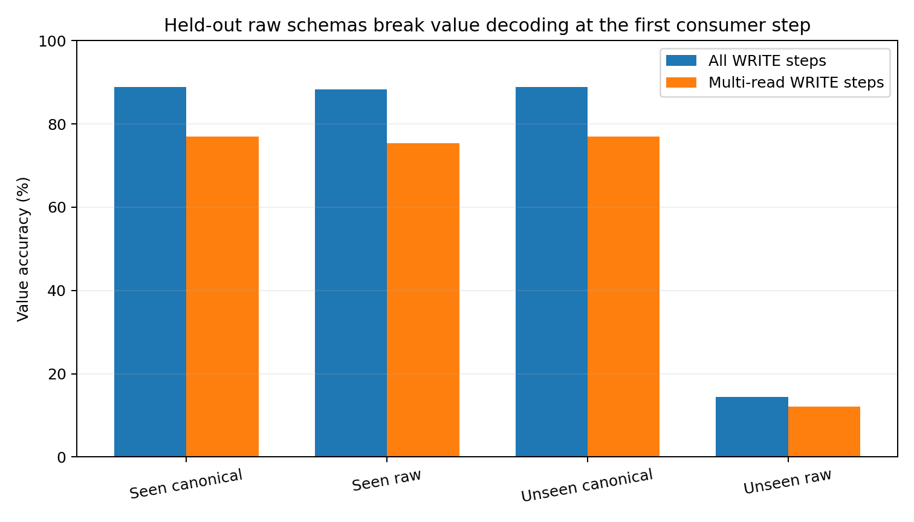

Figure 35. The held-out raw representation fails at the first consumer decision: WRITE-value decoding collapses while the normalized path is unchanged. Source: TOOL-CHAIN-GEOMETRY-006G.

The trajectory timing matches the prefix assay. Failed held-out P+/raw episodes first diverge at mean step 2.13 with median 2; P-/raw failures diverge at mean 2.08 with median 2. The raw result is successfully parsed into the reserved reader coordinates, yet those coordinates were never active during planner training, so the first action that must use the returned value is usually where the trajectory leaves the reference path.

Each held-out dialect was also evaluated alone across all 600 worlds. Style 3 yields 1.83% P+/raw and 2.00% P-/raw final-state accuracy; style 4 yields 3.00% and 3.33%; style 5 yields 4.00% and 3.50%. The failure therefore reproduces across all three held-out representation families rather than being driven by one specially difficult schema.

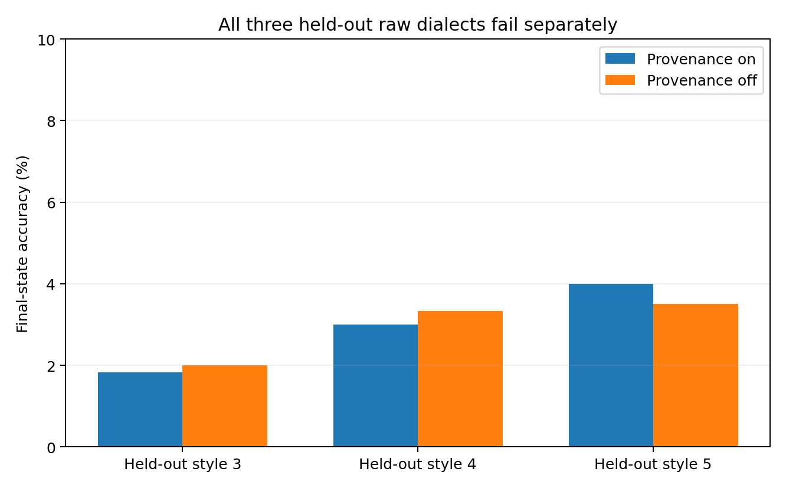

Figure 36. Each held-out raw dialect separately produces near-floor final-state accuracy on the direct raw path. Source: TOOL-CHAIN-GEOMETRY-006G.

### 15.5 Provenance becomes useful again only after the value is readable

The schema shift also exposes an ordering between interface coordinates. In the held-out raw cells, provenance cannot rescue an unreadable representation: P+/raw is 2.33% and P-/raw 2.67%, a raw-path provenance difference of -0.33 pp. Once normalization maps the held-out surface back into the trained canonical value channel, the provenance difference reappears: P+/N+ is 73.67% versus 68.17% for P-/N+, a +5.50 pp separation. In multi-read worlds that normalized provenance gap is +13.69 pp, while the held-out raw provenance gap is -0.76 pp.

This identifies a sequential interface dependency in the measured system. Value representation must first be decodable; result identity then becomes useful for multi-result reassociation. Provenance and normalization are therefore not merely two independent toggles. A downstream identity label has little behavioral value when the upstream value code itself lies outside the planner support, and its benefit reappears after compatibility is restored.

### 15.6 Evidence package and evidence boundary

Evidence availability. Recovered authored artifacts for TOOL-CHAIN-GEOMETRY-006G are supplied under evidence/experiments/TOOL-CHAIN-GEOMETRY-006G/. The evidence index specifies the available results, figures, source records and analysis-code coverage. External source corpora are referenced separately.

Evidence boundary. This controlled experiment establishes a schema-support effect in the specified executable micro-agent: direct raw consumption works for the three raw families represented during training and fails for three reserved families not activated during training, while canonical normalization preserves the trained value representation and exact task outcomes. The held-out schemas are deliberately controlled interface constructions, so the result supports a compatibility mechanism and engineering test pattern.

### 15.7 Discussion - a learned dialect is cached compatibility, not a universal parser

006F looked pleasantly liberating: show the planner several backend dialects during training and it can often read them directly. 006G reveals the invoice hidden behind that convenience. The raw path was not universal; it was carrying a learned compatibility cache. As long as the backend spoke one of the dialects represented during training, raw and canonical paths were almost interchangeable. The moment the backend switched to a representation whose coordinates had never been active, the direct path fell from roughly seventy-two percent world accuracy to roughly two and a half percent.

The data geometry catches the change before the agent touches the world. The returned number is still the same number, the task is still the same task, and the tool call is still bound to the same request. Yet the raw prefix moves into a cleanly separable region of the planner input space. Canonicalization acts like a customs desk: it does not make the number more true; it translates a new package into the internal form that the planner has actually learned to use. Once that translation occurs, the seen and unseen prefixes become literally identical in this reader and the behavioral collapse disappears with them.

There is a second layer hiding underneath. When the new raw dialect is unreadable, adding provenance is almost pointless: a beautifully labeled parcel is not useful if the contents cannot be decoded. After normalization restores the value, provenance matters again, especially when two or more results have to be reassigned. The tool body therefore has an order of operations that the simple 2 x 2 table can obscure: first make the observation readable, then preserve its address, then let the planner compose the next action.

That changes the practical interpretation of learning. Training can replace an adapter for distributions the planner has actually absorbed; it does not erase the need for compatibility engineering. A direct raw fast path is a certified route through known territory. The canonical path is the bridge across representation drift. The useful engineering question is no longer whether normalization is universally good or bad. It is whether the incoming schema is still inside the measured support of the raw reader.

### 15.8 Practical engineering guidance from 006G

The 006G measurements support a deployment contract in which raw-reader compatibility is explicit, testable and revocable. Schema identity, geometry and behavior should be checked before a backend is allowed to bypass the canonical compatibility path.

Table 49. Evidence-linked engineering guidance from the 006G held-out-schema experiment.

| Measured coordinate | Implementation instruction | Operational check |
| --- | --- | --- |
| Seen raw path ~72.08%; held-out raw path 2.50% | Maintain a versioned raw-schema support registry for every backend surface the planner is allowed to consume directly. Treat raw-reader support as a certified capability, not a generic JSON permission. | Record backend/schema version on every result and block raw fast-path promotion until a held-out execution panel passes. |
| Normalization effect shifts by +69.58 pp under schema holdout | Route unregistered, changed or drifting schemas through canonical normalization by default. Enable direct raw consumption only after measured compatibility is established. | Run the paired raw-vs-canonical panel on each new backend/schema revision; store the delta with the deployment record. |
| Raw geometry becomes cleanly separable before behavior collapses | Add a schema-drift preflight using the same compact data profile: matched/centroid displacement, stable/participation rank, PCA coverage and neighborhood mixing on shadow traffic. | Trigger compatibility review when the incoming representation leaves the training geometry or activates previously unused reader coordinates. |
| Canonical seen/unseen prefixes are exactly identical | Keep normalization upstream of the planner and deterministic enough that semantically equivalent backend values land in the same internal value channel. Preserve the raw payload separately for audit. | Regression should compare raw payload, canonical object and planner feature representation for paired semantic values. |
| Held-out failure begins near step 2; WRITE-value exact falls to 14.35% | Monitor the first consumer action after a tool result, not only JSON parse success. A parser can accept a new schema while the planner remains behaviorally incompatible with its representation. | Expose post-result action exactness / value-selection probes in staging and retain first-divergence telemetry in production traces. |
| All three held-out styles fail separately | Use leave-one-schema-family-out tests during release. Passing one novel format is not evidence for general raw-schema robustness. | Hold out each backend family or schema version in turn and report direct-raw world-state accuracy before enabling broad compatibility claims. |
| Provenance recovers only after value compatibility is restored | Preserve call-result identity as a hard invariant across both raw and canonical paths. Treat decoding compatibility and provenance binding as sequential ingestion stages. | For multi-result tasks, test both readable/unreadable representation and provenance on/off so a representation floor is not mistaken for a provenance null effect. |

Source: TOOL-CHAIN-GEOMETRY-006G. Values and definitions follow the measurement contract in this section.

The concrete deployment pattern is therefore: inspect schema -> decide whether the raw reader is certified -> canonicalize when support is absent or drifting -> preserve provenance through ingestion -> execute -> verify final world state. The data-geometry profile becomes a preflight instrument for that decision rather than an after-the-fact visualization.

## 16 Matched meaning across languages

NATLANG-COMPAT-004A

Question. After the cross-language survey showed similar local transition concentration but different orientation, this experiment fixes sentence meaning by parallel translation and asks how much whole-sentence surface structure is directly shared across languages, how much becomes recoverable after paired learning, and how strongly that compatibility depends on the evaluation distribution.

Data and matched construction. FLORES-200 dev supplies 997 aligned rows for each of eight languages: English, Hindi, Indonesian, Japanese, Korean, Spanish, Thai and Vietnamese. Every row index denotes the same source meaning across languages. The pinned mirror files contain exactly 997 rows each; repository blob identities are retained in the evidence package. FLORES-200 is a professionally translated multilingual benchmark; the present assay uses the data alignment as the semantic matching coordinate rather than inferring semantic equivalence from surface similarity.

Representation. Each sentence is converted into a deterministic 48-coordinate surface representation: 32 signed-hash coordinates over Unicode character 3-5grams plus 16 explicit structural coordinates covering sentence length, whitespace-token count, digit/punctuation/space/mark/uppercase/non-ASCII density, token-length moments, punctuation/digit counts, comma/period/quote density and a question-ending flag. This construction deliberately exposes script and surface realization; those effects are then separated with direct-surface and learned-transfer controls.

### 16.1 Data-geometry precheck: whole-sentence clouds are substantially wider than local language movement

The standard data-geometry profile was executed before interpreting compatibility. Features were standardized within language using the training split. Covariance spectra, stable rank, participation rank, PCA-95 dimension, TwoNN local dimension and pairwise-distance concentration were calculated on the actual sentence rows. The resulting whole-sentence clouds are much wider than the approximately 2-3 dominant directions previously measured for local transition/control movement. This is a scale separation rather than a contradiction: local next-step motion and the distribution of complete sentence realizations are different geometric objects.

Table 50. Executed whole-sentence surface data-geometry profile for the eight aligned FLORES-200 language views.

| Language | Stable rank | Participation rank | PCA-95 | TwoNN | Distance CV |
| --- | --- | --- | --- | --- | --- |
| English | 14.85 | 32.88 | 38 | 24.47 | 0.241 |
| Hindi | 13.35 | 32.04 | 38 | 25.33 | 0.231 |
| Indonesian | 15.21 | 33.27 | 39 | 21.92 | 0.234 |
| Japanese | 11.05 | 29.99 | 36 | 21.41 | 0.158 |
| Korean | 10.66 | 30.80 | 38 | 20.27 | 0.240 |
| Spanish | 14.45 | 31.77 | 38 | 26.78 | 0.239 |
| Thai | 7.83 | 27.08 | 38 | 21.42 | 0.163 |
| Vietnamese | 11.42 | 31.19 | 38 | 20.39 | 0.231 |

Source: NATLANG-COMPAT-004A. Values and definitions follow the measurement contract in this section.

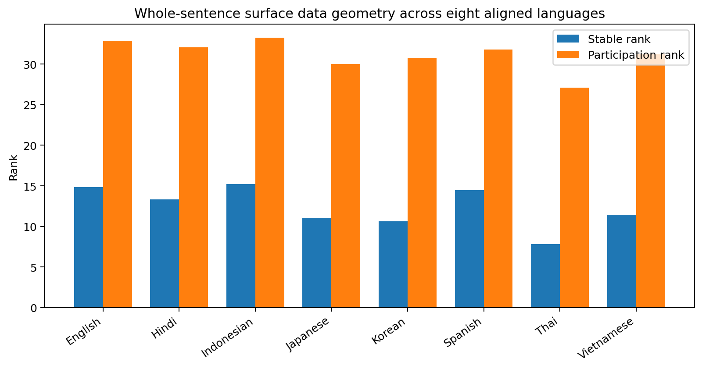

Figure 37. Whole-sentence surface clouds retain substantial dimensional spread across all eight language views; the measured range is distinct from the narrow local transition geometry established earlier in the chapter. Source: NATLANG-COMPAT-004A.

### 16.2 Held-out paired transfer reveals a heterogeneous cross-language compatibility graph

A deterministic split assigns 800 aligned meanings to operator fitting and 197 meanings to held-out evaluation. For every ordered language pair, a ridge linear operator maps standardized source-sentence coordinates into the target-language surface space. The predicted target vector is then matched against all 197 held-out target candidates by cosine similarity. Top-1 recovery is therefore a direct out-of-sample test that counts exact recovery of the correct translation among all 197 candidates.

Across all 28 unordered language pairs, mean bidirectional Top-1 recovery is 7.78%, compared with a 1/197 = 0.51% nominal chance level. Compatibility is strongly heterogeneous. English-Indonesian reaches 15.74%, English-Spanish 13.96%, Spanish-Vietnamese 13.45%, English-Vietnamese 13.20% and English-Hindi 10.91%. At the lower end, Japanese-Thai is 3.81%, Hindi-Thai 4.06% and Korean-Spanish 3.55%. The construction therefore yields a heterogeneous pairwise transfer graph rather than one language-wide scalar.

Table 51. Selected symmetric pairwise compatibility values under the random and blocked held-out constructions.

| Pair | Random held-out Top-1 | Blocked held-out Top-1 |
| --- | --- | --- |
| English - Indonesian | 15.74% | 15.74% |
| English - Spanish | 13.96% | 8.38% |
| Spanish - Vietnamese | 13.45% | 6.35% |
| English - Vietnamese | 13.20% | 9.90% |
| English - Hindi | 10.91% | 8.12% |
| Korean - Thai | 8.12% | 4.57% |
| Japanese - Thai | 3.81% | 3.81% |
| Korean - Spanish | 3.55% | 4.31% |

Source: NATLANG-COMPAT-004A. Values and definitions follow the measurement contract in this section.

Figure 38. Pairwise held-out surface-transfer compatibility across eight matched-semantic language views. The matrix describes this representation and corpus; expert assignment is reserved for later matched-capacity training-transfer experiments. Source: NATLANG-COMPAT-004A.

### 16.3 Shared script is a strong surface baseline; transfer gain must be measured separately

The direct-surface control changes the interpretation of the absolute compatibility matrix. Among the six pairs formed by the four Latin-script languages in this panel (English, Indonesian, Spanish and Vietnamese), direct Top-1 retrieval without any learned transfer already averages 14.76%; after linear transfer the same six pairs average 12.73%. In the other 22 pairs, direct retrieval averages only 5.13%, whereas learned transfer rises to 6.43%. Absolute retrieval therefore mixes at least two sources: immediately shared surface code and structure learned from aligned meanings.

The strongest positive transfer-over-direct gains occur for Spanish-Vietnamese (+5.07 pp), Korean-Thai (+4.82 pp), Indonesian-Thai (+4.32 pp), Japanese-Korean (+3.30 pp) and English-Hindi (+3.30 pp). English-Spanish (-6.09 pp), Korean-Spanish (-4.83 pp), Indonesian-Spanish (-4.06 pp) and English-Indonesian (-3.55 pp) show lower learned-map Top-1 than their direct baselines because their shared-script/cognate surface signal is already strong. Transfer gain therefore isolates the additional structure contributed by paired supervision more directly than absolute retrieval alone.

Table 52. Direct surface overlap and learned transfer are separable coordinates; absolute retrieval and transfer gain can move in different directions.

| Pair | Direct Top-1 | Learned transfer Top-1 | Transfer gain |
| --- | --- | --- | --- |
| Spanish - Vietnamese | 8.38% | 13.45% | +5.07 pp |
| Korean - Thai | 3.30% | 8.12% | +4.82 pp |
| Indonesian - Thai | 3.55% | 7.87% | +4.32 pp |
| Japanese - Korean | 4.06% | 7.36% | +3.30 pp |
| English - Hindi | 7.61% | 10.91% | +3.30 pp |
| English - Spanish | 20.05% | 13.96% | -6.09 pp |

Source: NATLANG-COMPAT-004A. Values and definitions follow the measurement contract in this section.

Figure 39. English-to-target held-out retrieval under direct surface matching, the learned transfer operator and a permuted-alignment control. The permuted control falls to approximately chance-level behavior, confirming that true row alignment supplies the learned cross-language signal. Source: NATLANG-COMPAT-004A.

### 16.4 Compatibility changes under a harder distribution split

The random 800/197 split defines one evaluation distribution. A second blocked construction trains on rows 1-800 and evaluates on rows 801-997. Mean pairwise Top-1 falls from 7.78% to 6.38%. English-Indonesian stays at 15.74%, while English-Spanish changes from 13.96% to 8.38%, Spanish-Vietnamese from 13.45% to 6.35% and English-Vietnamese from 13.20% to 9.90%. Compatibility therefore depends on the distribution of meanings and surface realizations presented to the operator.

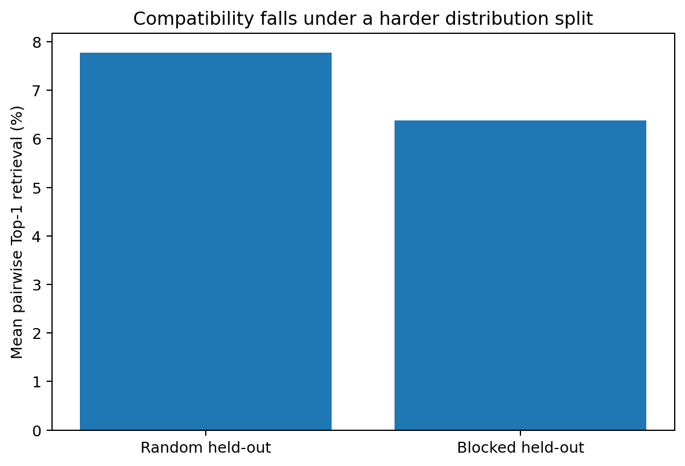

Figure 40. Mean pairwise compatibility decreases under the contiguous blocked holdout, establishing distribution sensitivity before any language-partition claim is made. Source: NATLANG-COMPAT-004A.

### 16.5 NATLANG-COMPAT-004A interpretation and evidence scope

The matched-semantic assay supports three measurements. First, complete-sentence surface clouds are substantially higher-dimensional than the narrow local movement fields measured earlier, reinforcing the distinction between local control width and whole-dataset state geometry. Second, cross-language sentence-surface transfer is measurable above permuted alignment but varies strongly by language pair and by held-out distribution. Third, absolute compatibility is confounded by direct script/word-form overlap: Latin-script pairs can retrieve one another well without learned mapping, while several cross-script pairs show larger positive gains from paired supervision.

Evidence scope. The current compatibility graph quantifies low-capacity sentence-surface transfer across eight FLORES-200 language views after fixing meaning by row alignment. The present evidence supports pair-specific recoverability of aligned surface statistics, direct-surface baselines, transfer gains and distribution sensitivity. Neural parameter-sharing benefit, language-family interventions and mixture-of-experts partitioning require separate script, morphology, dependency/relation and matched-capacity training-transfer evidence.

Evidence availability. The separate NATLANG-COMPAT-004A analysis archive was not recovered for this edition. The numerical results and embedded figures reported here are preserved; the package supplies clearly identified transcriptions and image extracts. See EVIDENCE_INDEX.md for the available evidence.

### 16.6 Discussion - a shared road and a shared map are separate structures

The first tempting story was obvious: English, Spanish, Indonesian and Vietnamese sit near the top of the graph, so one might attribute the ranking directly to a deeper shared generating mechanism. The direct-surface control changes the picture. Much of their head start already exists before any transfer operator is learned: they arrive carrying overlapping alphabetic code, punctuation habits and word-form fragments. In other words, two travellers can look close because they are using the same road signs; alignment of their internal maps is a separate measurement.

The cross-script gains are therefore more informative than the raw ranking. Korean-Thai, Indonesian-Thai, Japanese-Korean and English-Hindi begin with weaker direct overlap yet gain after paired alignment. The operator identifies repeatable correspondences beyond shared-character overlap. These correspondences are established at the sentence-surface transfer level. The script intervention in NATLANG-COMPAT-004B holds language identity fixed, changes writing system and measures the residual structure that persists across that change.

The dimensional result also separates two geometric scales. Earlier experiments repeatedly found two to three dominant directions in local transition/control movement. Here the complete sentence clouds have stable ranks around 8-15 and PCA-95 dimensions around 36-39. The high-dimensional cloud is the landscape of many different meanings and realizations; the narrow local field is the small active set of directions used to move from one state to the next. The report therefore keeps whole-sentence state-space extent and local movement width as distinct quantities—roughly the difference between the dimensionality of a country and the steering controls used to move through it.

### 16.7 Practical guidance for natural-language modeling and MoE experiments

Table 53. Evidence-linked practical guidance from NATLANG-COMPAT-004A. The graph is a screening map; assigning language-expert boundaries requires matched-capacity training-transfer evidence.

| Measured result | Interpretation for practice | Concrete next action |
| --- | --- | --- |
| Absolute cross-language similarity includes a strong surface-code contribution | Report a direct-surface baseline alongside learned compatibility. Shared script, punctuation and cognate fragments already produce high retrieval before paired transfer. | For candidate expert sharing, use learned-transfer gain or matched training-transfer benefit relative to the direct baseline as the decision variable. |
| Pairwise compatibility varies across random and blocked holdouts | Treat pairwise compatibility as a distribution-conditioned property indexed by the evaluation distribution. | Include at least one topic, contiguous or block holdout when promoting a compatibility edge into an architecture decision. |
| Whole-sentence cloud dimension is much larger than local transition width | Keep local control/movement geometry and corpus/state-cloud geometry as separate model-design quantities. | Size each expert, bottleneck or latent state using the geometry of the represented object; retain the 2-3 local-movement result specifically as a local control-width measurement. |
| Several cross-script pairs gain from paired alignment | Use cross-script transfer gain as a screening signal for deeper shared structure. | Prioritize follow-up morphology/dependency/relation assays on pairs with positive transfer gain despite weak direct surface overlap. |
| Same-script pairs can have high direct retrieval and negative transfer gain | Treat script proximity as a surface-overlap coordinate separate from learned sharing. | Run a same-language/different-script intervention before assigning language-name experts so writing-system contribution is measured separately from language-generating structure. |
| Current graph measures sentence-surface transfer compatibility | Use this matrix as a triage layer; a final MoE graph requires matched-capacity training-transfer experiments. | Base final routing decisions on direct matched-capacity training-transfer experiments after script and structural controls are measured. |

Source: NATLANG-COMPAT-004A. Values and definitions follow the measurement contract in this section.

Reader note. The architecture suggestions in this table are hypotheses or validation criteria. The reported surface-transfer scores measure recovery of aligned sentences in the specified representation. They do not directly measure the benefit of sharing neural parameters.

## 17 Writing system and language identity

NATLANG-COMPAT-004B

Question. NATLANG-COMPAT-004A showed that absolute cross-language retrieval mixes shared surface code with recoverable matched-semantic structure. This campaign performs the script intervention as one integrated experiment: hold language identity fixed while changing writing system, compare that condition with different languages sharing the same script and with different languages using different scripts, repeat direct and learned transfer under random and blocked holdouts, profile the whole-sentence data geometry, remove glyph identity in a second structural representation, and measure the geometry of the script-change displacement itself.

Matched data. FLORES-200 dev supplies 997 aligned meaning IDs for eight same-language/different-script pairs: Acehnese (Arabic/Latin), Modern Standard Arabic (Arabic/Latin), Banjar (Arabic/Latin), Kashmiri (Arabic/Devanagari), Central Kanuri (Arabic/Latin), Minangkabau (Arabic/Latin), Tamasheq (Latin/Tifinagh) and Chinese (Simplified/Traditional Han). Hindi-Devanagari, Central Atlas Tamazight-Tifinagh and Cantonese-Traditional Han are added only as same-script cross-language controls. The source manifest pins 19 exact Git blobs.

Three pair classes are evaluated with the same row-aligned meanings: 8 same-language/different-script pairs, 33 different-language/same-script pairs available within the selected script pools, and a deterministic 33-pair sample of different-language/different-script controls. The direct score uses no fitted map. The learned score fits a ridge linear transfer operator on 800 aligned meanings and retrieves the correct target among 197 unseen meanings. A contiguous rows 1-800 / 801-997 split supplies the blocked holdout. A 137-position target shift supplies the permuted-alignment control.

### 17.1 Data-geometry precheck: script variants remain broad whole-sentence clouds

Before compatibility is interpreted, the standard data-geometry diagnostic is executed on all 16 primary script variants. This campaign uses a 32-coordinate surface construction: 24 signed-hash character 3-5gram coordinates plus eight sentence-structure coordinates. Under this construction, stable rank spans 6.34-12.43, participation rank 19.13-25.67, PCA-95 dimension 26-28 and TwoNN approximately 17.05-22.37 across the primary variants. Twenty 80% resamples preserve the stable-rank profile; the reported resampling SD is generally small relative to the between-variant spread.

The low-dimensional-neighborhood control makes the scale distinction concrete. Across the 16 script variants, projecting the sentence clouds to four principal dimensions preserves only 20.80% of original 10-nearest-neighbor memberships on average; eight dimensions preserve 31.35%. The whole-sentence clouds therefore retain substantial local organization outside very low-dimensional projections even though earlier local transition/control assays concentrate movement into a few dominant directions.

Table 54. Data geometry diagnostics for the script intervention.

| Diagnostic | Executed result | Interpretation |
| --- | --- | --- |
| Stable rank | 6.34-12.43 across 16 primary script variants | Whole-sentence surface clouds remain multi-directional. |
| Participation rank | 19.13-25.67 | Variance is distributed across many surface coordinates. |
| PCA-95 dimension | 26-28 of 32 coordinates | Most variance requires substantially more than the local 2-3 movement directions. |
| TwoNN local dimension | 17.05-22.37 | Local point-cloud structure is also broad under this construction. |
| 10-NN retention after PCA-4D | 20.80% mean | Four dimensions do not preserve most sentence neighborhoods. |
| 10-NN retention after PCA-8D | 31.35% mean | Eight dimensions recover more neighborhood structure but remain strongly lossy. |
| 20 x 80% stable-rank resampling | Variant profiles remain stable; values stored per variant | Geometry is not driven by one row subset. |

Source: NATLANG-COMPAT-004B. Values and definitions follow the measurement contract in this section.

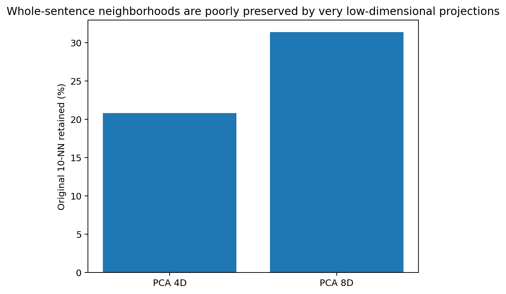

Figure 41. Whole-sentence script-variant neighborhoods are poorly preserved by four- or eight-dimensional PCA projections, reinforcing the distinction between global sentence-cloud extent and narrow local movement width. Source: NATLANG-COMPAT-004B.

### 17.2 Surface factorization: shared script can look closer than shared language

The first comparison is deliberately uncomfortable for any language-name-based partition. In raw surface space, same-language/different-script pairs average only 5.36% direct Top-1 retrieval. Different-language pairs that merely share the same script average 7.53% direct retrieval. Different-language/different-script controls average 2.67%. Script identity can therefore create a larger untrained surface-neighborhood advantage than language identity itself.

Paired learning changes the ordering. Same-language/different-script transfer rises to 9.61%, a mean gain of +4.25 percentage points. Different-language/same-script pairs fall to 6.25% on average, a -1.28-point gain relative to their already-strong direct surface baseline. Different-language/different-script controls rise more modestly from 2.67% to 4.13% (+1.46 points). Across the eight script swaps, the +4.25-point gain has a pair-bootstrap 95% interval of +1.33 to +7.11 points; a one-sided paired Wilcoxon test gives p=0.027.

Table 55. Surface retrieval by language and script pairing.

| Pair class | N pairs | Direct Top-1 | Learned Top-1 | Transfer gain |
| --- | --- | --- | --- | --- |
| Same language / different script | 8 | 5.36% | 9.61% | +4.25 pp |
| Different language / same script | 33 | 7.53% | 6.25% | -1.28 pp |
| Different language / different script | 33 | 2.67% | 4.13% | +1.46 pp |

Source: NATLANG-COMPAT-004B. Values and definitions follow the measurement contract in this section.

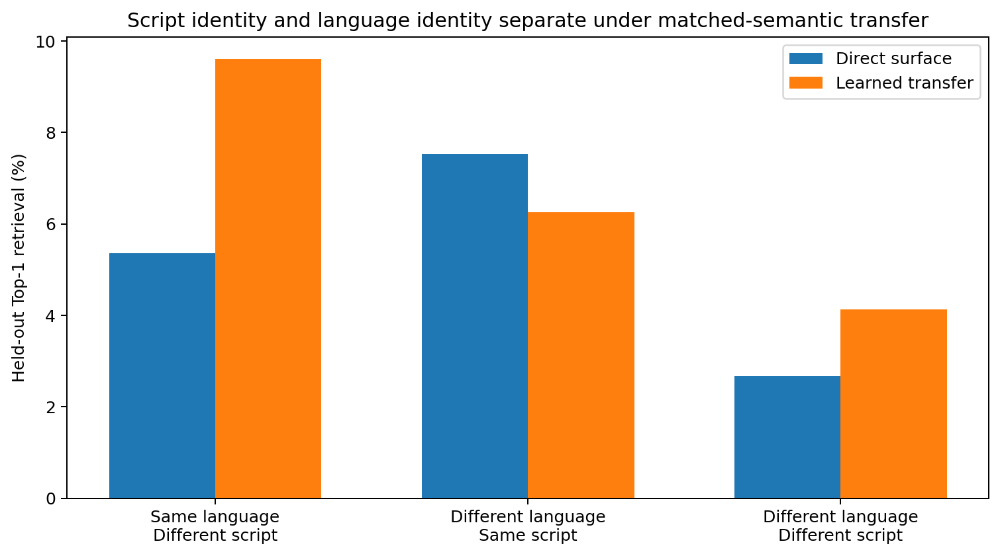

Figure 42. Shared script boosts direct surface retrieval, whereas matched-semantic learning preferentially improves same-language cross-script pairs. Source: NATLANG-COMPAT-004B.

### 17.3 Eight script swaps: learned recovery survives a harder distribution split

The eight language-held-constant interventions are heterogeneous rather than interchangeable. Tamasheq Latin/Tifinagh gains +11.42 points, Minangkabau Arabic/Latin +8.38, Acehnese +5.58 and Modern Standard Arabic +4.06. Chinese Simplified/Traditional is the principal negative-gain pair in this surface construction (-3.55 points). Thus “same language” identifies a controlled relation but not one universal surface operator.

The alignment control is decisive. Mean same-language mapped retrieval is 9.61%, whereas permuting the 800 training alignments reduces the mean to 0.51%, essentially the nominal 1/197 = 0.51% chance level. The mapped-minus-permuted difference is +9.10 points with a pair-bootstrap 95% interval of +5.58 to +13.29 points and paired Wilcoxon p=0.0039. Under the contiguous blocked holdout, mean mapped retrieval remains 7.65%; mapped-blocked loss is 1.96 points on average, while blocked retrieval remains +7.14 points above the permuted control.

Table 56. Same-language retrieval under script changes.

| Language / scripts | Direct | Mapped random | Mapped blocked | Permuted | Random gain |
| --- | --- | --- | --- | --- | --- |
| Acehnese Arab-Latn | 4.06% | 9.64% | 9.14% | 1.27% | +5.58 pp |
| Arabic Arab-Latn | 1.78% | 5.84% | 3.55% | 0.51% | +4.06 pp |
| Banjar Arab-Latn | 7.87% | 9.90% | 5.08% | 0.00% | +2.03 pp |
| Kashmiri Arab-Deva | 2.79% | 5.58% | 4.57% | 0.51% | +2.79 pp |
| Central Kanuri Arab-Latn | 2.03% | 5.33% | 2.79% | 1.52% | +3.30 pp |
| Minangkabau Arab-Latn | 7.11% | 15.48% | 16.50% | 0.25% | +8.38 pp |
| Tamasheq Latn-Tfng | 9.39% | 20.81% | 14.47% | 0.00% | +11.42 pp |
| Chinese Hans-Hant | 7.87% | 4.31% | 5.08% | 0.00% | -3.55 pp |

Source: NATLANG-COMPAT-004B. Values and definitions follow the measurement contract in this section.

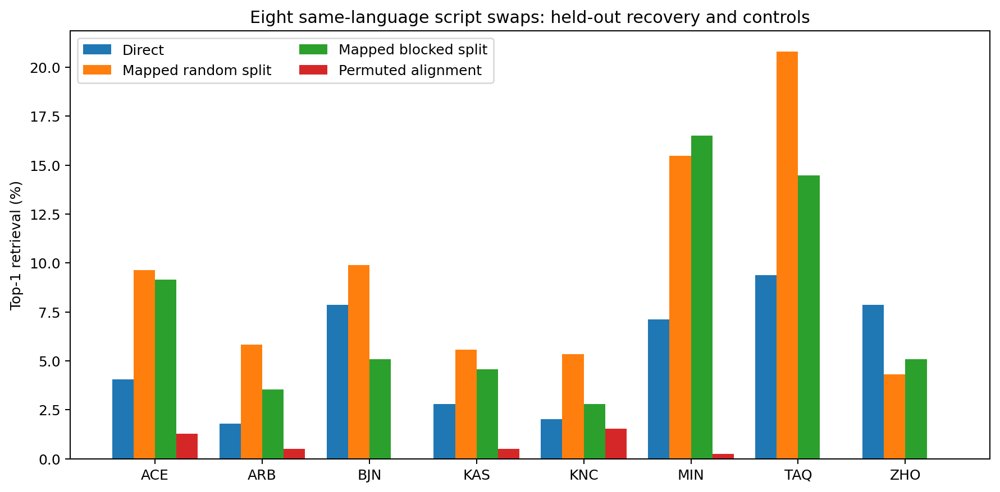

Figure 43. Same-language script swaps under direct, learned, blocked and permuted-alignment conditions. Matched alignment remains informative under the harder blocked split. Source: NATLANG-COMPAT-004B.

### 17.4 Glyph identity removed: language-specific structural continuity becomes much stronger

A second representation removes concrete glyph identity before feature extraction. Letters collapse to a shared letter class and the remaining sequence uses coarse Unicode/category symbols together with the same sentence-level length, whitespace and punctuation coordinates. This representation is intentionally structural rather than semantic: it asks what remains when the alphabet or script shapes themselves no longer contribute direct overlap.

The ordering now changes sharply. Same-language/different-script pairs reach 28.78% direct retrieval and 33.53% after paired transfer. Different-language/same-script controls reach only 10.99% direct and 11.51% mapped; different-language/different-script controls reach 6.42% and 8.38%. The same-language script-neutral transfer gain is +4.76 points with bootstrap 95% interval +1.27 to +8.76 points and one-sided Wilcoxon p=0.031. Once glyph identity is removed, the strongest remaining continuity is associated with language identity rather than common writing system.

Table 57. Script-neutral retrieval by pair class.

| Pair class | Direct structural Top-1 | Mapped structural Top-1 | Gain |
| --- | --- | --- | --- |
| Same language / different script | 28.78% | 33.53% | +4.76 pp |
| Different language / same script | 10.99% | 11.51% | +0.52 pp |
| Different language / different script | 6.42% | 8.38% | +1.96 pp |

Source: NATLANG-COMPAT-004B. Values and definitions follow the measurement contract in this section.

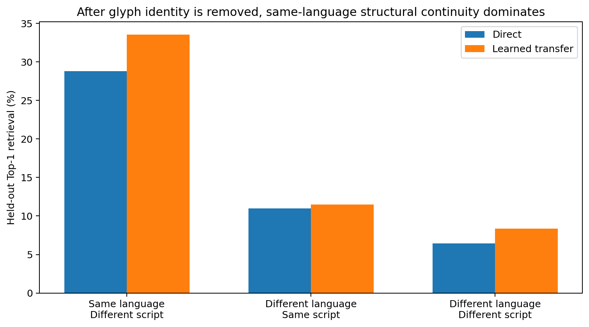

Figure 44. After glyph identity is removed, same-language script variants retain substantially more recoverable sentence structure than both control classes. Source: NATLANG-COMPAT-004B.

### 17.5 Script recoding is broad at the surface and much narrower after glyph erasure

The paired script-change vector is measured directly for every one of the 997 meanings in each language pair. In surface space, the covariance of these displacement vectors has mean stable rank 14.96 across the eight languages (bootstrap 95% interval 12.59-17.03). In the script-neutral representation, the residual displacement stable rank falls to 4.39 (95% interval 3.57-5.16). Every pair moves in the same direction of this comparison; paired Wilcoxon p=0.0039.

This separates two layers of recoding. Concrete script substitution redistributes many glyph-level dimensions and is not well described as one global low-dimensional rotation. Once glyph identity is collapsed, the remaining change in sentence organization occupies a substantially narrower family of directions. The average surface displacement rank is also larger than the average stable rank of either individual script cloud under this construction, showing that “difference between codes” can be geometrically broader than either code viewed alone.

Table 58. Script-change displacement and matched sentence-length correlation.

| Language | Surface displacement stable rank | Script-neutral residual stable rank | Matched char-length r |
| --- | --- | --- | --- |
| Acehnese | 16.25 | 6.31 | 0.973 |
| Arabic | 13.22 | 5.08 | 0.919 |
| Banjar | 16.46 | 3.14 | 0.965 |
| Kashmiri | 13.58 | 5.16 | 0.876 |
| Central Kanuri | 8.09 | 2.39 | 0.721 |
| Minangkabau | 16.74 | 4.38 | 0.991 |
| Tamasheq | 15.64 | 4.12 | 0.997 |
| Chinese | 19.66 | 4.51 | 0.846 |

Source: NATLANG-COMPAT-004B. Values and definitions follow the measurement contract in this section.

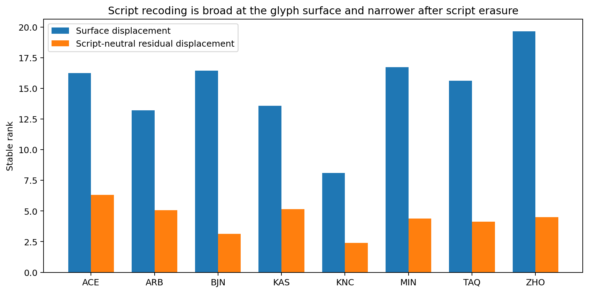

Figure 45. Paired script-change vectors occupy broad surface geometry; after explicit glyph erasure, the residual structural displacement is consistently narrower. Source: NATLANG-COMPAT-004B.

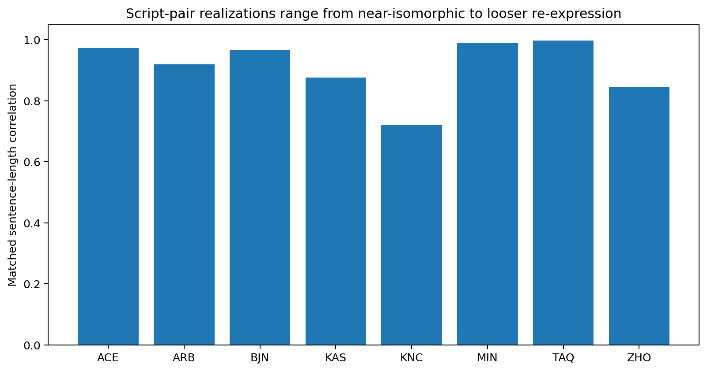

Figure 46. Sequence preservation differs strongly across script pairs. Tamasheq and Minangkabau are nearly length-isomorphic, while Central Kanuri and Chinese show looser re-expression under the matched-row construction. Source: NATLANG-COMPAT-004B.

### 17.6 Integrated interpretation and evidence scope

The joint campaign resolves the main ambiguity left by NATLANG-COMPAT-004A. Script and language identity contribute different signals. Shared script can dominate untrained surface proximity even between different languages; matched-semantic learning preferentially adds recoverable structure when language identity is held constant across scripts; and a script-neutral structural assay reveals much stronger same-language continuity once concrete glyph overlap is removed. These three measurements together separate surface code, language-specific sentence organization and learned cross-code correspondence.

The eight interventions are also internally heterogeneous. Tamasheq and Minangkabau preserve sentence-length and token-count structure almost isomorphically and support strong script-neutral retrieval. Central Kanuri is much less sequence-preserving, and Chinese Hans/Hant shows negative learned gain in the raw surface operator despite positive direct overlap. The measured object is therefore not “script change” as one universal operation; it is a family of language-specific recoding relations whose common property is that glyph-level displacement is broader than the residual structural displacement after script erasure.

Evidence scope. The campaign establishes script-versus-language effects for deterministic whole-sentence surface and script-neutral representations on eight FLORES-200 same-language script pairs, with same-script and different-script language controls, random and blocked held-out retrieval, permuted alignment, geometry diagnostics and resampling checks. These measurements support using script intervention and transfer-over-direct gain as compatibility coordinates.

Evidence availability. Recovered authored artifacts for NATLANG-COMPAT-004B are supplied under evidence/experiments/NATLANG-COMPAT-004B/. The evidence index specifies the available results, figures, source records and analysis-code coverage. External source corpora are referenced separately.

### 17.7 Discussion - the alphabet can be the nearest neighbour while the language is the deeper map

The most useful surprise in this campaign comes before any learned operator is fitted. If one simply asks which sentence clouds look close, two different languages written with the same script can beat the same language written in two scripts. The alphabet is loud. Latin letters, Arabic characters, spacing conventions and punctuation create an immediate geometric neighbourhood, and a surface-only system can easily mistake that neighbourhood for a deeper linguistic boundary. In that sense, the script is like a city street grid: two cities can look familiar from above because both use rectangular blocks, even when the routes people actually take through them are different.

Matched meanings then change the experiment from “who looks alike?” to “who can be mapped onto whom after the same events are paired?” Here the same-language script swaps gain while the same-script different-language group, on average, does not. The direct visual advantage of the shared alphabet is already present before learning; the additional gain appears when the system is allowed to learn how one surface realization corresponds to another. The permuted-alignment control is especially useful because it returns the same-language result almost exactly to nominal chance. The recoverable relation lives in the matched rows, not in the language labels supplied after the fact.

The script-neutral assay makes the contrast almost theatrical. Once the letters themselves are replaced by coarse categories, the same-language pairs suddenly become the dominant group. Minangkabau and Tamasheq are the clearest cases: the glyphs are different, but sentence length, token boundaries and coarse sequential structure behave almost like the same choreography performed in different costumes. Central Kanuri and Chinese warn against turning this into a universal transliteration story. Their paired realizations preserve less sequence structure, and Chinese Hans/Hant even loses accuracy under the fitted raw-surface linear operator. The campaign therefore finds a family resemblance, not one master script-conversion matrix.

The displacement geometry adds another layer. At the glyph surface, changing script is not a tidy two-dimensional twist; the difference vectors themselves have stable rank around fifteen on average. A surface model has to reorganize many coordinates. After glyph identity is erased, the remaining displacement contracts to roughly four dominant stable-rank directions. This is exactly the sort of scale separation the earlier language experiments kept hinting at: rich high-dimensional realization wrapped around a narrower set of reusable structural adjustments. The shell can be huge even when the remaining relational correction is much smaller.

And the four- and eight-dimensional neighbourhood tests stop us from over-celebrating low-dimensional stories. Whole sentences across hundreds of meanings do not collapse cleanly into a tiny latent sheet under this surface construction. Four dimensions retain only about one fifth of nearest neighbours; eight dimensions retain about one third. Language can have narrow local moves without living in a globally tiny room. A model that confuses those two scales risks building a beautifully elegant bottleneck that simply throws away the neighbourhood it is supposed to model.

### 17.8 Practical guidance for multilingual models, tokenization and MoE routing

Table 59. Practical guidance from the script intervention.

| Measured result | Implementation guidance | Concrete engineering test |
| --- | --- | --- |
| Same-script/different-language direct retrieval (7.53%) exceeds same-language/different-script direct retrieval (5.36%). | Do not use raw embedding proximity or shared tokenizer/script identity as the sole language-sharing criterion. Treat script as an explicit surface coordinate. | For every candidate shared expert, report same-script surface controls before interpreting representation overlap. |
| Same-language script swaps gain +4.25 pp after matched transfer; permuted alignment returns to ~0.51% chance. | Use transfer-over-direct gain as a stronger pre-routing signal than absolute surface similarity. | Require a true matched-semantic held-out gain above the direct baseline and a permuted-alignment control before promoting a compatibility edge. |
| Script-neutral same-language retrieval reaches 28.78% direct and 33.53% mapped. | Provide a script-normalized or relation-oriented pathway alongside glyph-specific lexical pathways. Shared trunks can operate on script-neutral structure while surface adapters retain orthographic detail. | Ablate glyph identity or transliterate/normalize in a controlled branch and measure whether task/meaning neighbourhoods are preserved. |
| Surface script displacement stable rank 14.96; neutral residual 4.39. | Do not force script conversion into one tiny global adapter at the raw token surface. Allocate enough surface capacity, then compress after script-specific recoding has been resolved. | Measure displacement spectra before choosing adapter rank; compare raw-script and script-neutral residual ranks. |
| PCA-4D retains 20.80% and PCA-8D 31.35% of 10-NN structure. | Keep local-control bottlenecks separate from whole-sentence representation capacity. The 2-3 local movement result should not be reused as a whole-sentence latent-size prescription. | Evaluate neighbourhood preservation whenever a multilingual bottleneck is reduced; reject dimensions that destroy the sentence-level neighbourhood needed by the task. |
| Random mapped 9.61%; blocked mapped 7.65%. | Treat script compatibility as distribution-conditioned. A script adapter that works on shuffled meanings still needs a topic/contiguous holdout. | Include blocked/topic holdout in multilingual sharing regressions and store the random-to-blocked degradation. |
| Script pairs are heterogeneous: Tamasheq/Minangkabau strong, Chinese negative raw transfer gain. | Route by measured relation, not by a binary “same language” flag. Some script pairs can share a lightweight recoder; others may require richer language-specific realization layers. | Maintain pair-level compatibility records and allow asymmetric adapter capacity rather than one universal script-conversion module. |

Source: NATLANG-COMPAT-004B. Values and definitions follow the measurement contract in this section.

## 18 Local relation width and composition

RELATIONAL-ARITY-005

The assay measures 18,355 test sentences and 41,223 predicate-local structures across English, Chinese, Japanese, Turkish, Arabic, Russian, Finnish, Hindi, Spanish and Korean. It asks whether sentence complexity is produced mainly by widening each local predicate-participant relation or by composing more locally narrow relations.

Question. Earlier language experiments repeatedly found narrow local transition/control movement alongside much wider whole-sentence clouds. RELATIONAL-ARITY-005 moves from sequence geometry into explicit syntactic relation structure: how many observable participants does one predicate locally bind, which dependency roles co-occur, how this width changes with sentence complexity, and how much additional geometry is introduced by language-specific order realization.

### 18.1 Data, predicate definition and executed measurement contract

Data. The experiment uses the official test split of ten Universal Dependencies treebanks already used in the multilingual survey. Exact repository and Git blob identities are preserved in the evidence package. The analysis parses integer token nodes only and retains the treebank dependency labels without replacing them with model-generated annotations.

Predicate-local unit. A measured predicate is a VERB, a copular ADJ/NOUN/PROPN carrying a cop dependent, or an AUX that directly carries an explicit participant. Participant arity counts direct dependents whose base UD relation is nsubj, csubj, obj, iobj, ccomp, xcomp or obl. The resulting quantity is an explicit dependency-tree arity: it measures participants actually represented in the annotated local tree.

Geometry. Each predicate receives a seven-coordinate abstract role-count vector. A second fourteen-coordinate realization vector appends the mean signed dependency offset for each role, so relation inventory and surface ordering can be measured separately. The standard data diagnostic then computes stable rank, participation rank, PCA-95 dimension, top-three energy, TwoNN where the sample is non-degenerate, distance concentration and complexity-stratified covariance geometry.

### 18.2 Explicit predicate-local participant width is strongly concentrated below four

Across all 41,223 predicate-local structures, the predicate-weighted mean explicit participant arity is 1.508. A total of 85.52% of predicates contain at most two measured participants and 97.36% contain at most three; 2.64% occupy the four-or-more tail. The median language-level 95th-percentile arity is three. The concentration therefore appears across the full ten-language panel rather than being created by one corpus.

The tail is real and language-dependent. Hindi places 10.11% of measured predicates at arity four or above and Arabic 5.73%, while Korean and Turkish place only 0.37% and 0.59% in that range. The measured architecture is therefore a narrow default with a sparse high-arity tail rather than a hard three-slot ceiling.

Table 60. Explicit predicate-local arity across the ten Universal Dependencies test treebanks.

| Language | Predicates | Mean arity | P95 | Arity <=3 | Arity >=4 |
| --- | --- | --- | --- | --- | --- |
| English | 3,115 | 1.56 | 3 | 98.91% | 1.09% |
| Chinese | 1,892 | 1.25 | 3 | 98.73% | 1.27% |
| Japanese | 1,692 | 0.95 | 3 | 98.76% | 1.24% |
| Turkish | 2,032 | 0.96 | 2 | 99.41% | 0.59% |
| Arabic | 2,232 | 2.02 | 4 | 94.27% | 5.73% |
| Russian | 19,060 | 1.58 | 3 | 98.01% | 1.99% |
| Finnish | 3,356 | 1.54 | 3 | 98.00% | 2.00% |
| Hindi | 3,818 | 1.86 | 4 | 89.89% | 10.11% |
| Spanish | 1,307 | 1.43 | 3 | 97.93% | 2.07% |
| Korean | 2,719 | 0.96 | 2 | 99.63% | 0.37% |

Source: RELATIONAL-ARITY-005. Values and definitions follow the measurement contract in this section.

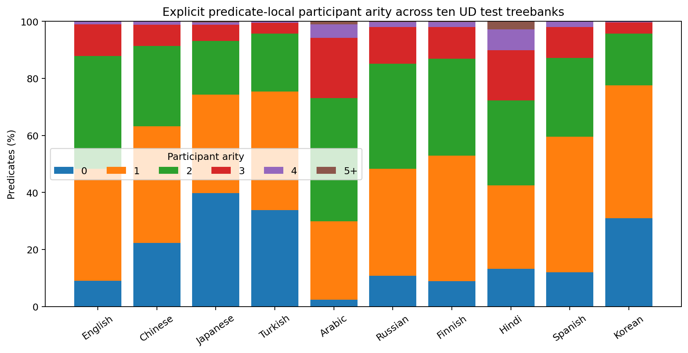

Figure 47. Explicit predicate-local participant arity remains concentrated in the zero-to-three range across all ten treebanks; Hindi and Arabic retain the largest measured high-arity tails. Source: RELATIONAL-ARITY-005.

### 18.3 Sentence complexity grows mainly by adding local relations

Every language is divided into within-language sentence-length quartiles so that the shortest and longest bins are compared without letting one corpus define the global scale. Across the ten languages, mean predicate count rises from 1.09 per sentence in Q1 to 4.82 in Q4. The paired Q1-to-Q4 increase is +3.73 predicates per sentence (bootstrap 95% interval +3.08 to +4.45; one-sided paired Wilcoxon p=0.00098).

Over the same change in sentence complexity, mean participant arity per predicate rises from 1.19 to 1.44, a paired increase of +0.24 (95% interval +0.12 to +0.41; p=0.00293). Sentence length correlates much more strongly with predicate count than with mean local arity: the across-language mean Spearman coefficients are 0.744 and 0.282, respectively. Tree depth shows the same separation, with mean correlations of 0.686 to predicate count and 0.209 to mean arity.

Table 61. Aggregate within-language sentence-length quartiles. Each entry is the mean of the ten language-specific measurements.

| Length bin | Predicates / sentence | Mean arity | Mean P95 arity | Role stable rank | Role top-3 |
| --- | --- | --- | --- | --- | --- |
| Q1 shortest | 1.09 | 1.19 | 2.60 | 4.30 | 62.25% |
| Q2 | 1.91 | 1.40 | 2.91 | 4.77 | 57.37% |
| Q3 | 2.80 | 1.45 | 3.10 | 4.93 | 55.52% |
| Q4 longest | 4.82 | 1.44 | 3.10 | 4.94 | 55.40% |

Source: RELATIONAL-ARITY-005. Values and definitions follow the measurement contract in this section.

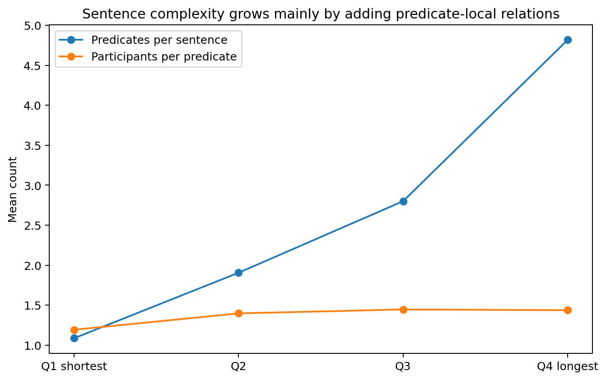

Figure 48. Moving from the shortest to the longest sentence quartile multiplies the number of predicate-local relations while participant count per predicate changes only modestly. Source: RELATIONAL-ARITY-005.

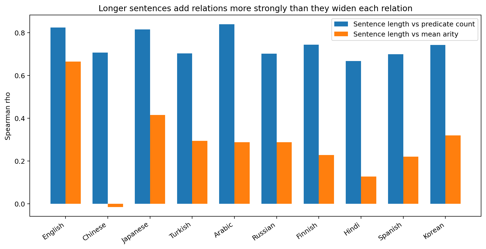

Figure 49. Across all ten languages, sentence length tracks predicate count much more strongly than it tracks mean participant arity. Source: RELATIONAL-ARITY-005.

### 18.4 Local role geometry broadens modestly and then plateaus

The seven-role covariance assay tests whether long sentences broaden the local relation repertoire even when raw participant counts remain narrow. Mean stable rank increases from 4.30 in Q1 to 4.77 in Q2 and 4.93 in Q3, then is essentially unchanged at 4.94 in Q4. The paired Q1-to-Q4 increase is +0.64 stable-rank units (bootstrap 95% interval +0.26 to +1.00; p=0.0137), but the Q3-to-Q4 plateau shows that the longest sentences are not continuing to open new local role dimensions at the same rate that they add predicate heads.

Top-three energy changes in the complementary direction, from 62.25% in Q1 to 55.40% in Q4. The measured local relation field therefore broadens somewhat as short fragments become full sentences, then stabilizes while sentence-level complexity continues to grow through additional relation instances.

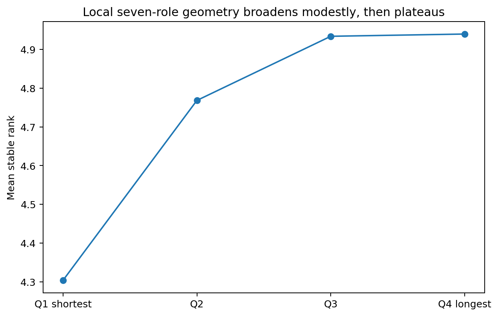

Figure 50. Abstract seven-role geometry broadens from very short sentences into ordinary sentence structure, then remains nearly flat from Q3 to Q4. Source: RELATIONAL-ARITY-005.

### 18.5 Abstract relation skeleton and language-specific realization occupy different widths

Across languages, the abstract seven-role count geometry has mean stable rank 4.99, participation rank 6.16, PCA-95 dimension 6.4 and top-three energy 54.97%. Appending signed dependency offsets for the same roles expands mean stable rank to 6.26, participation rank to 9.01 and PCA-95 dimension to 10.4, while top-three energy falls to 44.57%. The relation inventory is therefore measurably narrower than the geometry created when those relations are placed before or after the predicate at language-specific distances.

Table 62. Abstract role geometry versus role-plus-order realization geometry.

| Language | Abs SR | Abs PR | Abs P95 | Real SR | Real PR | Real P95 |
| --- | --- | --- | --- | --- | --- | --- |
| English | 5.41 | 6.71 | 7 | 6.71 | 9.88 | 12 |
| Chinese | 5.28 | 6.70 | 7 | 6.68 | 9.74 | 11 |
| Japanese | 4.16 | 4.92 | 5 | 4.84 | 6.33 | 8 |
| Turkish | 5.60 | 6.85 | 7 | 6.69 | 8.94 | 10 |
| Arabic | 5.36 | 6.57 | 7 | 6.58 | 10.12 | 12 |
| Russian | 5.19 | 6.60 | 7 | 7.36 | 11.60 | 12 |
| Finnish | 4.49 | 5.71 | 6 | 6.12 | 9.06 | 10 |
| Hindi | 4.68 | 5.84 | 6 | 5.36 | 7.70 | 9 |
| Spanish | 4.55 | 5.72 | 6 | 6.27 | 9.30 | 11 |
| Korean | 5.18 | 5.95 | 6 | 5.96 | 7.45 | 9 |

Source: RELATIONAL-ARITY-005. Values and definitions follow the measurement contract in this section.

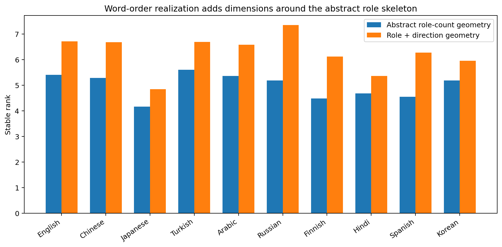

Figure 51. Adding signed dependency direction and distance expands the predicate-local geometry around the abstract role skeleton in every measured language. Source: RELATIONAL-ARITY-005.

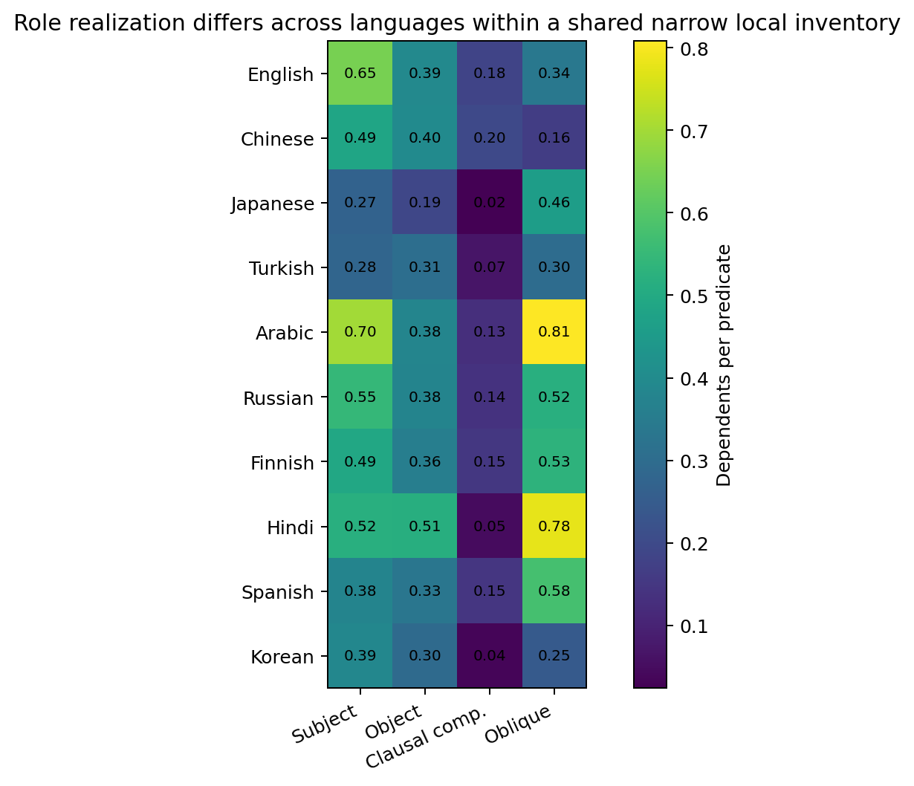

Figure 52. The shared role inventory is realized with different frequency profiles across languages; oblique density is especially variable in the measured treebanks. Source: RELATIONAL-ARITY-005.

### 18.6 Cross-language role signatures are shared in form but heterogeneous in frequency

Exact seven-role presence signatures produce a mean pairwise Jensen-Shannon divergence of 0.137 across the ten languages. Finnish-Spanish (0.029), Turkish-Korean (0.032), Japanese-Turkish (0.045) and Japanese-Korean (0.055) are the closest measured signature distributions. Japanese-Arabic (0.278), Arabic-Korean (0.267), Turkish-Arabic (0.254) and Chinese-Arabic (0.251) are among the farthest. These are descriptive compatibility coordinates for explicit role-set usage rather than language-family labels.

The pair ordering is useful because it crosses ordinary language-name groupings. A relation-based routing experiment therefore has a measurable alternative to assigning experts by language identity: candidate sharing can be tested on role-signature compatibility and then validated by matched-capacity training transfer.

### 18.7 RELATIONAL-ARITY-005 interpretation and evidence scope

The ten-language campaign supports a compositional account of the measured syntax. Explicit local predicate relations are strongly concentrated at three participants or fewer, and sentence complexity increases far more through additional predicate-local structures than through continued widening of each structure. Local role geometry broadens from short fragments into ordinary sentence structure and then plateaus, while direction/order realization adds a second layer of dimensionality around the abstract role skeleton.

Evidence scope. The current measurements apply to explicit participant dependents represented in Universal Dependencies test trees. Within that observable relation layer, the evidence establishes the arity distribution, complexity trajectory, role covariance and order-realization geometry reported above. Implicit arguments and discourse participants belong to subsequent measurement layers rather than to this explicit-tree count.

Evidence availability. Recovered authored artifacts for RELATIONAL-ARITY-005 are supplied under evidence/experiments/RELATIONAL-ARITY-005/. The evidence index specifies the available results, figures, source records and analysis-code coverage. External source corpora are referenced separately.

### 18.8 Discussion - long sentences look more like cities than giant intersections

The easiest mental picture is an intersection. If linguistic complexity were produced mainly by widening one local relation, long sentences should turn ordinary intersections into enormous junctions: more and more subjects, objects, complements and obliques would attach to the same predicate, and the local role geometry would keep expanding with sentence length. The data show a different construction.

From the shortest to the longest quartile, the average sentence adds about 3.73 predicate heads, but the average predicate adds only about 0.24 explicit participants. The local seven-role stable rank rises early and then almost stops moving between Q3 and Q4. The city gets bigger because it acquires more intersections and more roads between them; the typical intersection remains recognizably small.

That distinction finally connects two results that previously looked as though they belonged to different stories. The earlier transition experiments found narrow local movement. The FLORES sentence-cloud experiments found wide global geometry. RELATIONAL-ARITY-005 supplies a structural bridge: many locally constrained relation units can be composed into a state space whose full sentence cloud is much wider than any one local update. A narrow steering mechanism can therefore coexist with a high-dimensional language world.

The high-arity tail matters just as much as the concentration. Hindi and Arabic visibly push farther into four- and five-participant local structures. The useful engineering picture is therefore not a rigid three-slot grammar. It is a small default intersection with expandable lanes: most traffic uses the compact path, while sparse overflow capacity preserves the real tail instead of forcing it through an undersized bottleneck.

The abstract-versus-realization geometry gives the same architecture another layer. A subject, object or complement role can belong to a relatively compact shared relation skeleton, while word order, dependency direction and distance fan outward into additional language-specific coordinates. The skeleton and its realization are not separate languages; they are two geometrically separable parts of the same event construction.

### 18.9 Practical guidance for language models and MoE design

Table 63. Evidence-linked practical guidance from RELATIONAL-ARITY-005.

| Measured result | Implementation guidance | Concrete validation |
| --- | --- | --- |
| 97.36% of explicit predicate-local structures have <=3 participants. | Use a compact default relation workspace for the common case. | Benchmark a 2-3 participant fast path against the full explicit-role assay. |
| Hindi and Arabic preserve a measurable >=4 tail. | Keep sparse expandable/overflow relation slots instead of a hard arity cap. | Regression-test high-arity tails separately by language and domain. |
| Q1->Q4 adds +3.73 predicates/sentence but only +0.24 participants/predicate. | Scale compute primarily with relation count/compositional depth, not by continuously widening each local relation state. | Route or allocate recurrent/iterative compute by detected predicate/clause count and compare with token-length-only allocation. |
| Seven-role stable rank plateaus at 4.93->4.94 from Q3 to Q4. | Reuse a bounded local relation mechanism across long contexts rather than allocating a new wider local geometry for the longest sentences. | Measure whether a fixed local composer plus more composition steps matches a width-scaled baseline. |
| Role-count SR 4.99; role+direction SR 6.26. | Separate a shared abstract relation trunk from order/direction realization residuals. | Train matched-capacity shared-trunk vs monolithic multilingual controls and measure transfer. |
| Role-signature JSD crosses ordinary language labels. | Use measured relation compatibility as a routing feature; treat language name as metadata rather than the routing rule. | Build candidate expert edges from role-signature/transfer kernels, then validate with matched-capacity training. |
| Whole-sentence clouds remain much wider than any local relation state. | Avoid turning local 2-3 participant evidence into a tiny global sentence bottleneck. | Keep global state capacity independent from local relation arity and test both scales separately. |

Source: RELATIONAL-ARITY-005. Values and definitions follow the measurement contract in this section.

The immediate architecture hypothesis is therefore a two-level construction: a reusable narrow relation composer with sparse overflow, iterated many times across a sentence, plus a broader sentence/world state that accumulates the results. Multilingual sharing should be tested first in the abstract relation layer and only then in the language-specific realization residuals.

## 19 Relations under human compression

RELATION-COMPRESSION-006

The experiment joins the MCTS human compression trajectory to the predicate-local relation anatomy established in RELATIONAL-ARITY-005. It uses 507 source sentences with at least three shorter human references under the executed UD-derived segmentation contract and measures original, mild, medium and strong compression levels with length-matched random-deletion controls.

Question. When humans shorten a sentence, does the relation system shrink by narrowing each local predicate, by replacing predicate branches with new realizations, by pruning complete branches, or by deleting participant slots inside retained branches? The experiment measures all four coordinates under one matched-source design.

### 19.1 Matched compression paths and parser gate

Path construction. MCTS dev and test each provide an original sentence and five human simplifications. A lexicon induced from UD Chinese GSDSimp segments the text. Sources with at least three references shorter than the original are retained. The longest shorter reference defines mild compression, the median shorter reference defines medium compression, and the shortest defines strong compression. The resulting 507 matched paths have mean target/source token ratios 0.9220, 0.8345 and 0.6563, closely reproducing the earlier LSP-002 compression bands under an independent structural preprocessing contract.

Predicate-role assay. A four-role multi-label classifier is trained on UD Chinese GSDSimp train, calibrated on dev and evaluated on the held-out test split. The four coarse participant families are SUBJ, OBJ, OBL and COMP. Held-out test micro-F1 is 0.591, local-arity correlation is r=0.582 and arity MAE is 0.525 slot. SUBJ and OBJ are the strongest role channels (F1 0.628 and 0.728). The primary evidence coordinates are predicate count, aggregate local arity, coarse role geometry and the SUBJ/OBJ-supported structure; OBL and COMP contribute secondary resolution. MCTS lexicon coverage rises from 95.1% in originals to 96.8% in strong simplifications.

Table 64. Held-out parser gate and MCTS structural coverage.

| Measurement | Executed result |
| --- | --- |
| UD test micro-F1 | 0.591 |
| UD test arity correlation | 0.582 |
| UD test arity MAE | 0.525 slot |
| SUBJ F1 | 0.628 |
| OBJ F1 | 0.728 |
| Matched MCTS sources | 507 |
| Original lexicon coverage | 95.1% |
| Strong lexicon coverage | 96.8% |

Source: RELATION-COMPRESSION-006. Values and definitions follow the measurement contract in this section.

### 19.2 Surface length falls faster than local relation width

The compression trajectory shortens the sentence substantially: mean non-punctuation token count falls from 35.73 in the original to 23.05 under strong simplification, a 35.5% reduction. Predicate count falls from 7.23 to 5.05 per sentence, a 30.2% net reduction. Local relation width does not follow the same contraction. Mean predicted participant arity is 1.060 in the original and 1.041 at strong compression, and the four-role stable rank changes from 2.088 to 2.041. The proportion of predicted relations at arity two or below is 94.63% in the original and 95.94% under strong compression.

Because surface tokens disappear slightly faster than predicate nodes, the remaining text becomes more relation-dense. Predicate density rises from 20.25 per 100 tokens in the original to 21.90 under strong human simplification. The matched random-deletion controls stay near 20.2-20.4 predicates per 100 tokens instead of reproducing this increase.

Table 65. Relation structure across the matched human compression trajectory.

| Level | Length ratio | Tokens | Predicates | Mean arity | Role stable rank | Predicates /100 tok |
| --- | --- | --- | --- | --- | --- | --- |
| Original | 1.000 | 35.73 | 7.23 | 1.060 | 2.088 | 20.25 |
| Mild | 0.922 | 32.89 | 6.96 | 1.058 | 2.092 | 21.16 |
| Medium | 0.834 | 29.62 | 6.35 | 1.034 | 2.044 | 21.44 |
| Strong | 0.656 | 23.05 | 5.05 | 1.041 | 2.041 | 21.90 |

Source: RELATION-COMPRESSION-006. Values and definitions follow the measurement contract in this section.

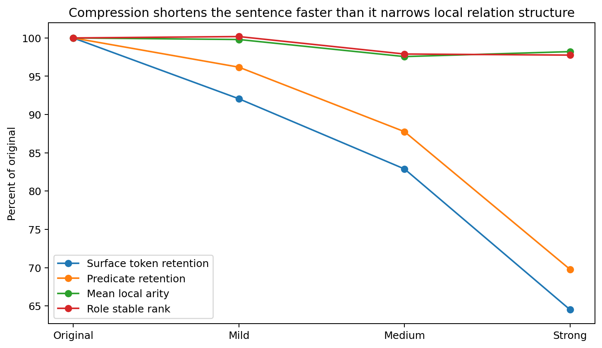

Figure 53. Human compression removes surface length and predicate nodes, yet mean local arity and coarse role rank stay near their original values. Source: RELATION-COMPRESSION-006.

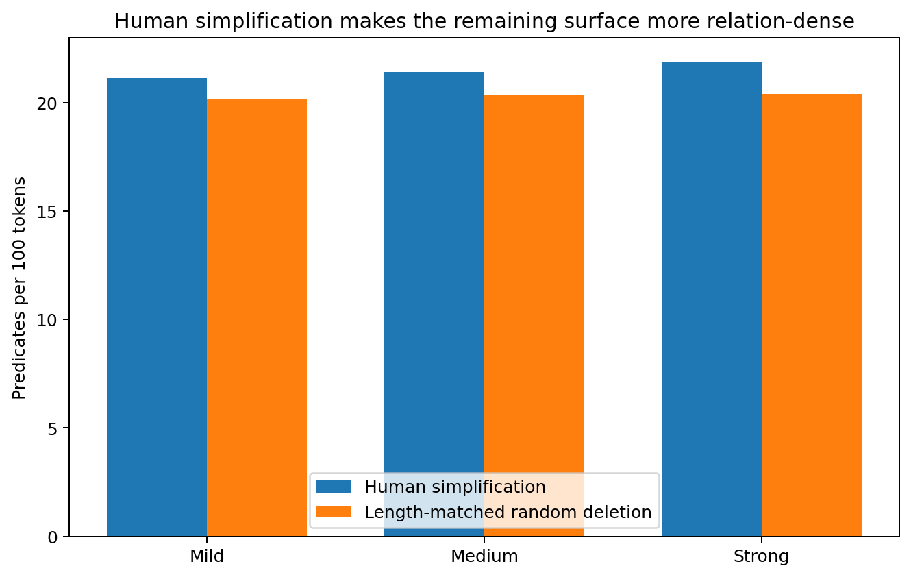

Figure 54. At matched target lengths, human simplifications retain more predicate structure per surface token than independent random deletion. Source: RELATION-COMPRESSION-006.

### 19.3 Source-branch non-recovery changes from replacement-dominated to pruning-dominated

Predicate alignment is monotonic and combines predicate-form similarity, local content overlap and coarse role overlap. The primary match threshold is 0.80; thresholds 0.65, 0.95 and 1.10 preserve the same progression. A source branch that is not recovered by alignment is not automatically treated as deleted. The target predicate count is used to separate a lower-bound replacement/re-expression component from net predicate-count pruning.

At mild compression, 24.2% of source predicate branches are not recovered by alignment, yet predicate count falls by only 3.8%. The target therefore supplies enough new predicate branches to account for at least 84.2% of this source non-recovery as replacement or re-expression. At medium compression the replacement lower bound falls to 62.9% and net pruning contributes 37.1% of source non-recovery. Under strong compression the relation reverses: replacement accounts for at least 35.9%, net predicate pruning for 64.1%, and total predicate count is 30.2% below the original.

Table 66. Alignment-based operation mix across compression depth.

| Level | Source branch non-recovery | Replacement lower bound | Net-pruning share | Net predicate reduction | Role-same recoding |
| --- | --- | --- | --- | --- | --- |
| Mild | 24.2% | 84.2% | 15.8% | 3.8% | 35.8% |
| Medium | 33.0% | 62.9% | 37.1% | 12.2% | 43.8% |
| Strong | 47.1% | 35.9% | 64.1% | 30.2% | 53.2% |

Source: RELATION-COMPRESSION-006. Values and definitions follow the measurement contract in this section.

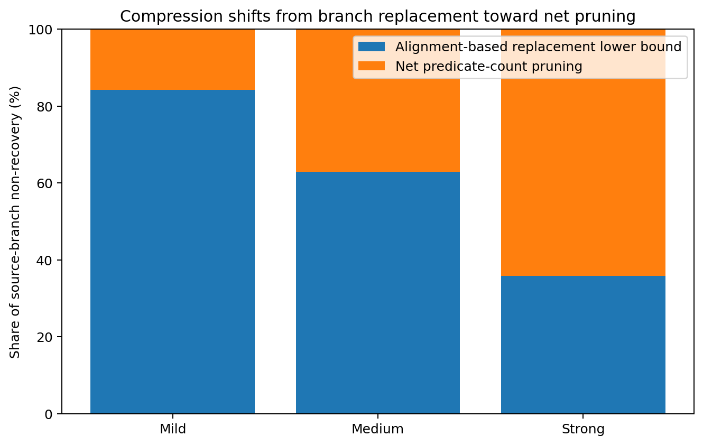

Figure 55. Mild simplification is dominated by branch replacement/re-expression; strong simplification shifts toward net predicate pruning. Source: RELATION-COMPRESSION-006.

### 19.4 Participant-slot loss grows modestly inside retained branches

Within aligned branches, measured source participant-slot loss rises from 18.2% at mild compression to 20.4% at medium and 25.0% at strong compression. This increase is much smaller than the rise in source-branch non-recovery. The share of all measured lost source slots carried by non-recovered branches rises from 61.4% to 69.9% and then 76.6%. Structural loss therefore increasingly travels with branch-level removal as compression strengthens.

The retained branches are not simply frozen copies. Among aligned branches whose coarse role signature is preserved, surface realization recoding rises from 35.8% at mild compression to 43.8% at medium and 53.2% at strong compression. The compression process therefore combines selection of relational material with active re-expression of the relations that remain.

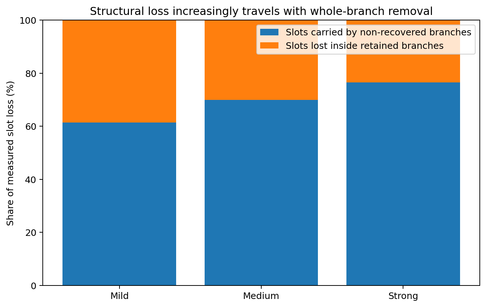

Figure 56. As compression deepens, a growing share of measured participant-slot loss is carried away with non-recovered predicate branches rather than removed one slot at a time inside retained branches. Source: RELATION-COMPRESSION-006.

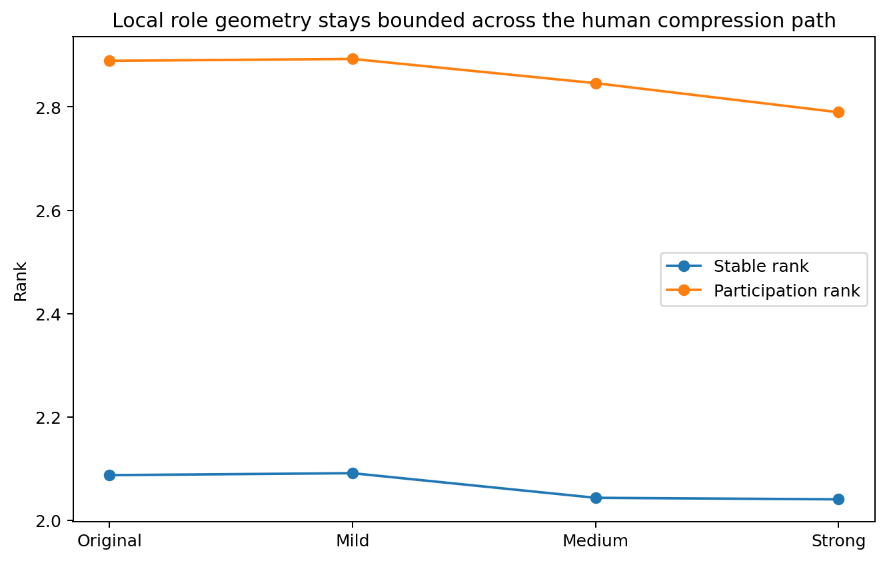

Figure 57. The coarse four-role covariance remains bounded through the entire human compression trajectory. Source: RELATION-COMPRESSION-006.

### 19.5 Length-matched random deletion separates coordinated rewriting from independent token loss

Random controls independently delete original tokens until each sentence reaches the corresponding human target token count. Human source-branch non-recovery exceeds random deletion by 14.5-18.5 percentage points at mild compression, 14.5-18.8 points at medium and 9.2-14.1 points at strong compression under paired bootstrap 95% intervals. Human rewriting therefore reorganizes predicate identity and local context substantially more than independent shortening.

Within retained branches, human slot loss exceeds random deletion clearly at mild compression, with a paired difference interval of +4.8 to +8.9 percentage points. At medium and strong compression the corresponding intervals include zero. This pattern places the strongest human-specific within-branch editing early in the trajectory; later compression is increasingly characterized by branch-level selection and pruning.

Table 67. Human simplification versus length-matched random deletion.

| Level | Human branch non-recovery | Random branch non-recovery | Human slot loss | Random slot loss | Human pred density | Random pred density |
| --- | --- | --- | --- | --- | --- | --- |
| Mild | 24.2% | 8.3% | 18.2% | 11.5% | 21.16 | 20.18 |
| Medium | 33.0% | 16.5% | 20.4% | 18.7% | 21.44 | 20.40 |
| Strong | 47.1% | 35.0% | 25.0% | 26.6% | 21.90 | 20.42 |

Source: RELATION-COMPRESSION-006. Values and definitions follow the measurement contract in this section.

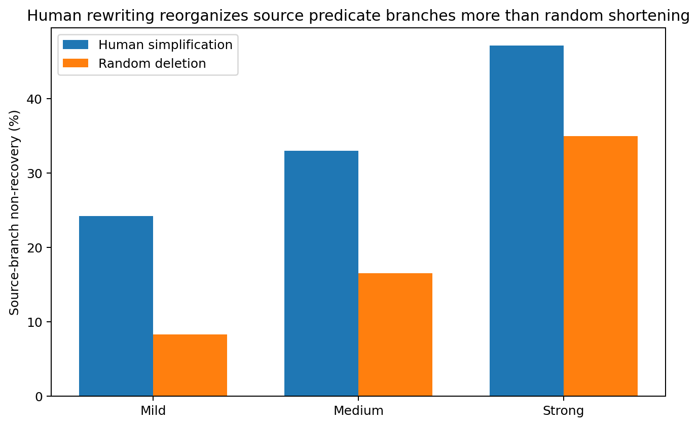

Figure 58. Human rewriting changes source predicate branches more strongly than length-matched random deletion at every compression level. Source: RELATION-COMPRESSION-006.

### 19.6 Alignment sensitivity and evidence resolution

The central trajectory is stable across the tested branch-match thresholds. Strong-compression source-branch non-recovery ranges from 45.3% at threshold 0.65 to 49.6% at threshold 1.10; within-retained slot loss stays between 24.7% and 25.1%, and role-signature-preserving recoding stays between 51.5% and 54.4%. The replacement-to-pruning interpretation therefore does not depend on a single alignment cutoff.

Evidence resolution. The parser gate supports aggregate predicate-count, local-arity and coarse role-geometry trajectories and provides the strongest individual role resolution for SUBJ and OBJ. The branch-alignment results are interpreted jointly with target predicate counts so that source non-recovery is separated from net pruning. This executed construction supports the compression-mode transition, the preservation of bounded local width and the relation-density increase reported here.

### 19.7 RELATION-COMPRESSION-006 interpretation

Human simplification does not progressively squeeze each surviving local relation into a smaller and smaller arity state. The measured local width and role covariance stay almost unchanged as surface length falls by more than one third. What changes is the population and realization of relations: mild simplification predominantly replaces or re-expresses predicate branches, medium compression mixes replacement with pruning, and strong compression shifts toward substantial net branch removal. The surface that remains becomes more relation-dense.

This connects LSP-002 to RELATIONAL-ARITY-005. The earlier transition field stayed low-dimensional under compression; the present structural assay shows a corresponding syntactic mechanism. A bounded local relation unit survives as the reusable building block, while compression changes which units are present and how surviving units are realized.

### 19.8 Discussion - first repaint the city, then remove blocks

The compression trajectory now looks less like shrinking every intersection and more like editing a city map in phases. Mild simplification mostly changes the signs, lane descriptions and local routes. A source predicate may disappear from the alignment, yet a new target predicate appears in roughly the same relational territory. The city still has almost the same number of intersections; it has been redrawn in simpler language.

As compression becomes strong, the strategy changes. The number of intersections itself begins to fall. Net predicate count drops by about 30%, and nearly two thirds of source-branch non-recovery is now accounted for by net pruning rather than a replacement lower bound. Yet the intersections that remain are not crushed into one-dimensional points: mean local arity and role rank stay nearly flat. Strong simplification therefore resembles removing whole side streets and neighborhoods, then rewriting the surviving map compactly.

This also explains why random deletion feels structurally different even when the final sentence length is identical. Random deletion hits words independently. Human simplification spends more of its budget on coordinated branch re-expression and, later, branch selection. The result is a shorter sentence with a slightly higher density of predicates per token rather than a damaged sentence with the same relation density as the source.

### 19.9 Practical guidance for compression, language modeling and MoE design

The executed measurements now support a concrete compression architecture: preserve a bounded local relation composer, allow explicit branch-level routing or pruning, and treat surface realization as a separate recoding layer. Compression should operate on relation units and their realization budget rather than enforcing a progressively smaller global arity bottleneck.

Table 68. Practical guidance derived from RELATION-COMPRESSION-006.

| Measured result | Implementation guidance | Concrete validation |
| --- | --- | --- |
| Local arity and role rank remain bounded across compression. | Keep the relation composer capacity stable across output-length targets. | Test fixed relation-width models across controlled compression bands before changing local arity capacity. |
| Predicate density rises as human text shortens. | Allocate compression budget by pruning surface realization before pruning relational nodes indiscriminately. | Track predicates or relation events per generated token alongside conventional length metrics. |
| Mild compression is replacement/re-expression dominated. | Provide a relation-preserving rewrite operator before hard content pruning. | Measure semantic/role preservation under paraphrase at mild target lengths. |
| Strong compression shifts toward net branch pruning. | Expose branch-level selection as an explicit control or routing decision. | Compare learned branch pruning against token-level sparsification at matched output length. |
| Lost slots increasingly travel with non-recovered branches. | Prefer deleting a coherent relation unit over independently dropping participant slots when stronger compression is required. | Measure branch coherence and participant retention after pruning. |
| Random deletion does not reproduce the human trajectory. | Use relation-aware compression controls rather than token-drop baselines alone. | Keep length-matched random deletion as a damage control, not as the target compression mechanism. |

Source: RELATION-COMPRESSION-006. Values and definitions follow the measurement contract in this section.

For MoE-style language systems, the immediate candidate is a stable shared relation-composition substrate plus separate mechanisms for relation selection and surface realization. A compression router can decide which relation branches survive; a realization expert can decide how compactly each surviving branch is expressed. This factorization follows the measured operation sequence more closely than routing solely by token identity or target length.

## 20 Dependency hierarchy and nonlocal organization

DEPENDENCY-ORDER-007

The assay extends RELATIONAL-ARITY-005 from predicate-local width into the organization among local relations across 18,355 official test sentences.

Question. RELATIONAL-ARITY-005 established that explicit predicate-local participant width stays concentrated below four and that sentence complexity grows mainly by adding more local relations. DEPENDENCY-ORDER-007 asks where the remaining long-range complexity is stored: in deeper dependency trees, longer attachments, predicate nesting, nonlocal paths and relation ordering, or in continued widening of each local relation.

### 20.1 Data and executed measurement contract

Data. The experiment reuses the exact ten Universal Dependencies test blobs pinned in RELATIONAL-ARITY-005: English EWT, Chinese GSDSimp, Japanese GSD, Turkish IMST, Arabic PADT, Russian SynTagRus, Finnish TDT, Hindi HDTB, Spanish GSD and Korean GSD. The corpus identity and predicate definition are therefore held fixed across the two campaigns.

Local relation contract. Predicate identity and participant arity use the same seven-role construction as RELATIONAL-ARITY-005: nsubj, csubj, obj, iobj, ccomp, xcomp and obl attached to VERB predicates, copular ADJ/NOUN/PROPN predicates, or AUX predicates that directly carry participants. This preserves direct numerical comparability with the earlier local-width result.

Long-range contract. Each sentence is measured for maximum basic-tree depth, dependency distance, the fraction of arcs spanning at least five or ten surface tokens, left-versus-right attachment, crossing arcs, predicate-ancestor nesting, directly linked predicate gaps, pairwise tree distance among predicates and subordinate-predicate count. A 21-coordinate predicate realization vector additionally records seven role counts, seven mean directions and seven log mean dependency distances.

Complexity strata. Each language is independently sorted by sentence length and divided into four equal-size empirical quartiles. Predicate-weighted local arity is retained as the local-width coordinate, matching the denominator used in RELATIONAL-ARITY-005.

### 20.2 Sentence complexity multiplies relation count and tree depth more than local arity

Across the ten language-specific quartile trajectories, mean sentence length rises from 7.46 tokens in Q1 to 38.52 in Q4, a 5.16-fold increase. Predicates per sentence rise from 1.05 to 4.76, a 4.53-fold increase, and mean maximum tree depth rises from 3.33 to 7.20, a 2.16-fold increase. Predicate-weighted local arity rises much less, from 1.17 to 1.44, a 1.23-fold change.

The paired Q1-to-Q4 predicate-count increase is +3.71 predicates per sentence (bootstrap 95% interval +3.07 to +4.46; exact sign-flip p=0.000977; 10/10 languages positive). Tree depth increases by +3.87 levels (+3.17 to +4.70; p=0.000977; 10/10 positive). Mean local arity increases by +0.27 participants (+0.14 to +0.44; p=0.00195; 9/10 positive). The common structural response to greater sentence complexity is therefore a multiplication of local relations and hierarchy, accompanied by only modest widening inside each relation.

Table 69. Aggregate within-language sentence-length quartiles for DEPENDENCY-ORDER-007. Values are means of ten language-specific measurements; local arity uses the predicate-weighted RELATIONAL-ARITY-005 denominator.

| Quartile | Mean tokens | Predicates / sentence | Local arity | Tree depth | Mean dep. distance | Max predicate nesting | Predicate-pair tree distance |
| --- | --- | --- | --- | --- | --- | --- | --- |
| Q1 | 7.46 | 1.05 | 1.17 | 3.33 | 1.86 | 0.30 | 0.35 |
| Q2 | 14.09 | 1.83 | 1.39 | 4.63 | 2.56 | 0.74 | 0.95 |
| Q3 | 21.25 | 2.74 | 1.44 | 5.67 | 3.04 | 1.31 | 1.61 |
| Q4 | 38.52 | 4.76 | 1.44 | 7.20 | 3.76 | 2.16 | 2.60 |

Source: DEPENDENCY-ORDER-007. Values and definitions follow the measurement contract in this section.

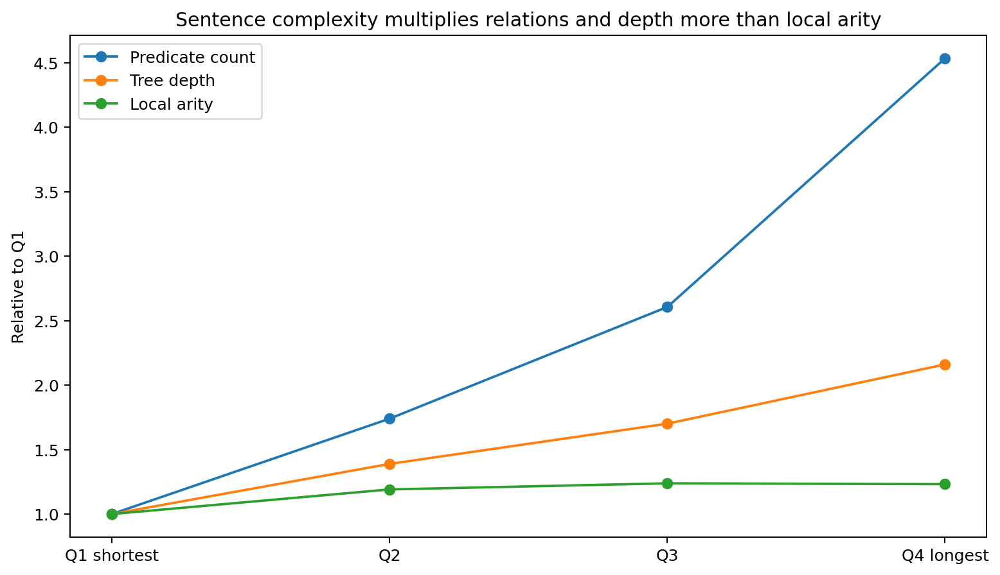

Figure 59. Sentence length multiplies predicate count and dependency depth far more strongly than it widens the participant inventory of an individual predicate. Source: DEPENDENCY-ORDER-007.

### 20.3 Long-range organization expands on several independent observables

The additional complexity is not only more nodes. Mean dependency distance doubles from 1.86 to 3.76 tokens, and the fraction of arcs spanning at least five tokens rises from 6.7% to 19.1%. Maximum predicate-ancestor nesting rises from 0.30 to 2.16, and mean tree distance between predicate pairs rises from 0.35 to 2.60. Subordinate predicates per sentence rise from 0.30 to 3.18. Each of these Q1-to-Q4 deltas is positive in all ten languages and has exact sign-flip p=0.000977.

Crossing dependencies also increase, from 0.013 to 0.303 crossing pairs per sentence on average, with a positive Q1-to-Q4 delta in 9/10 languages. Crossings remain sparse compared with the much larger changes in depth, distance and predicate nesting, so the primary long-range signal is hierarchical and nonlocal organization rather than widespread nonprojectivity.

Table 70. Language-paired Q1-to-Q4 structural deltas. Bootstrap intervals resample the ten language-level deltas; p values use the exact 2^10 sign-flip distribution of the paired mean.

| Measured coordinate | Q1→Q4 mean delta | Bootstrap 95% interval | Positive languages | Exact sign-flip p |
| --- | --- | --- | --- | --- |
| Tree depth | +3.866 | +3.165 to +4.696 | 10/10 | 0.000977 |
| Predicate count | +3.712 | +3.066 to +4.455 | 10/10 | 0.000977 |
| Mean local arity | +0.270 | +0.138 to +0.444 | 9/10 | 0.001953 |
| Mean dependency distance | +1.902 | +1.623 to +2.227 | 10/10 | 0.000977 |
| Long-arc fraction (≥5) | +0.124 | +0.092 to +0.157 | 10/10 | 0.000977 |
| Maximum predicate nesting | +1.859 | +1.648 to +2.106 | 10/10 | 0.000977 |
| Predicate-pair tree distance | +2.246 | +1.879 to +2.701 | 10/10 | 0.000977 |
| Crossing count | +0.290 | +0.142 to +0.446 | 9/10 | 0.002930 |
| Subordinate predicate count | +2.877 | +2.157 to +3.734 | 10/10 | 0.000977 |

Source: DEPENDENCY-ORDER-007. Values and definitions follow the measurement contract in this section.

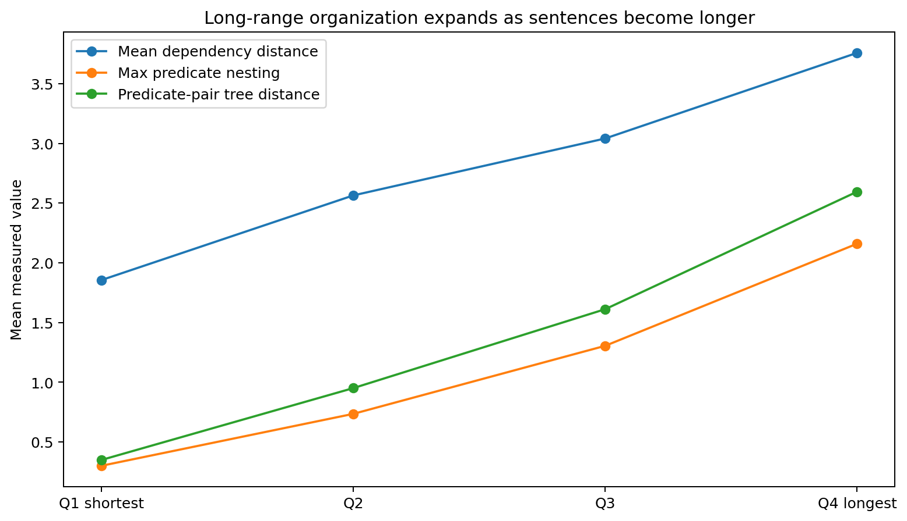

Figure 60. Dependency distance, predicate nesting and predicate-pair tree distance all expand steadily across the within-language sentence-length trajectory. Source: DEPENDENCY-ORDER-007.

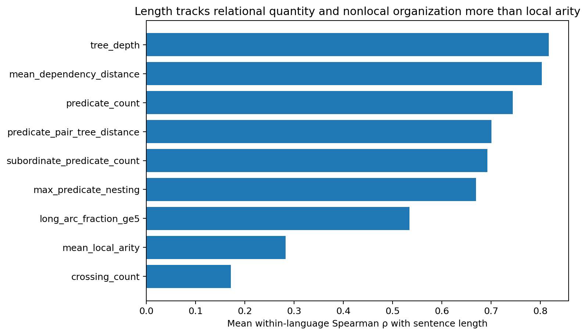

Figure 61. Sentence length tracks tree depth, dependency distance, predicate count and nonlocal predicate organization much more strongly than it tracks local participant arity. Source: DEPENDENCY-ORDER-007.

### 20.4 Local role/order/distance geometry broadens modestly as the relation network grows

The predicate-local realization assay combines seven role counts, seven signed attachment directions and seven log dependency-distance coordinates. Averaged across the ten languages, this 21-coordinate space has stable rank 5.62, participation rank 7.71 and PCA95 dimension 9.1. It therefore preserves a moderate local realization repertoire around the bounded role skeleton rather than expanding in proportion to sentence length.

Across sentence-length quartiles, local role/order/distance stable rank rises from 3.94 in Q1 to 5.06 in Q4, and PCA95 rises from 7.5 to 9.1. Over the same trajectory, predicate count rises from 1.05 to 4.76. The local realization space does broaden as richer contexts appear, but the dominant source of sentence-scale growth is the number and arrangement of relation units rather than an equivalent multiplication of the dimensional width of each unit.

Table 71. Predicate-local role/order/distance geometry across sentence-complexity quartiles. Geometry is measured after language-specific global standardization of the 21 predicate coordinates.

| Quartile | Predicates / sentence | Local arity | Role/order/distance stable rank | PCA95 | Top-3 energy |
| --- | --- | --- | --- | --- | --- |
| Q1 | 1.05 | 1.17 | 3.94 | 7.5 | 62.2% |
| Q2 | 1.83 | 1.39 | 4.43 | 8.1 | 57.3% |
| Q3 | 2.74 | 1.44 | 4.78 | 8.5 | 54.4% |
| Q4 | 4.76 | 1.44 | 5.06 | 9.1 | 52.4% |

Source: DEPENDENCY-ORDER-007. Values and definitions follow the measurement contract in this section.

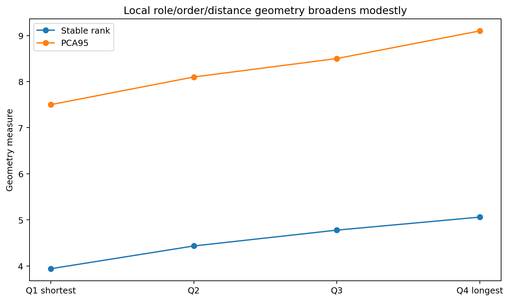

Figure 62. Local role/order/distance geometry expands gradually, but its growth is much smaller than the multiplication of relation units in the same sentences. Source: DEPENDENCY-ORDER-007.

### 20.5 Cross-language replication locates the common growth pattern

The nonlocal growth pattern is not carried by one large treebank. Maximum predicate nesting and predicate-pair tree distance increase from Q1 to Q4 in every measured language. The exact numerical scale varies by language: Arabic has the largest mean tree-depth increase (+6.91) and one of the largest predicate-pair path increases (+3.90), whereas Chinese shows a smaller depth increase (+1.91) with a still-positive predicate-nesting increase (+1.54). The common direction is more stable than the absolute scale.

The same language-by-language check also protects the local-width result. Chinese is the only language with a small negative Q1-to-Q4 arity change (-0.07); the other nine increase, but the mean local-arity delta (+0.27) is far smaller than the corresponding changes in predicate count, nesting and path length.

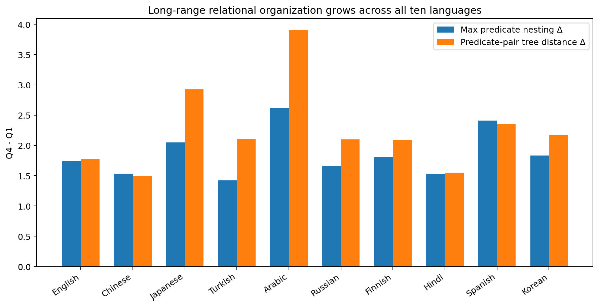

Figure 63. Maximum predicate nesting and predicate-pair tree distance increase from the shortest to the longest sentence quartile in all ten measured languages. Source: DEPENDENCY-ORDER-007.

### 20.6 A compact structural growth axis coordinates size, depth and nonlocality

The standard data-geometry diagnostic is applied to a seven-coordinate sentence-organization descriptor after z-scoring each coordinate within language: sentence length, tree depth, predicate count, mean local arity, mean dependency distance, long-arc fraction and maximum predicate nesting. This measured structural summary has stable rank 1.70, participation rank 2.55, TwoNN estimate 3.08 and PCA95 dimension 5. The first three principal modes carry 87.15% of the variance.

PC1 alone carries 58.73% of this structural variance and loads jointly on sentence length (0.446), predicate count (0.424), mean dependency distance (0.416), tree depth (0.410) and maximum predicate nesting (0.401). This is a directly measured coordinated complexity axis in the selected dependency-organization variables. It is distinct from the much wider whole-sentence lexical/surface clouds measured in NATLANG-COMPAT-004A/004B.

The geometry diagnostic also retains local detail: four-dimensional PCA preserves 62.7% of original 10-nearest-neighbour relations in the sentence-organization descriptor and eight dimensions preserve 82.6%. Across 20 independent 80% resamples, the mean stable-rank standard deviation is only 0.027. The compact growth axis is therefore reproducible for this structural measurement rather than an artifact of one subset.

Publication annotation. The source describes a seven-coordinate sentence-organization space but reports an eight-dimensional PCA neighborhood result here and in the geometry table. The recovered geometry_summary.csv and statistical_summary.json repeat that value without supplying the feature matrix needed to reconcile the dimensionality. The original numbers are retained for traceability; the 8D neighborhood claim should be treated as unresolved rather than as validated evidence.

Table 72. Data-geometry diagnostics for the sentence-level organization summary and predicate-local realization space. These are explicit structural measurement spaces, not claims about the dimensionality of unrestricted sentence meaning.

| Measurement space | Stable rank | Participation rank | PCA95 | TwoNN | Top-3 / neighborhood |
| --- | --- | --- | --- | --- | --- |
| Sentence organization (7 coordinates) | 1.70 | 2.55 | 5 | 3.08 | Top-3 87.15%; 4D kNN 62.7%; 8D kNN 82.6% |
| Predicate realization (21D) | 5.62 | 7.71 | 9.1 | — | Top-3 49.8% |

Source: DEPENDENCY-ORDER-007. Values and definitions follow the measurement contract in this section.

Publication annotation. The reported 8D neighborhood entry is subject to the dimensionality issue stated immediately above.

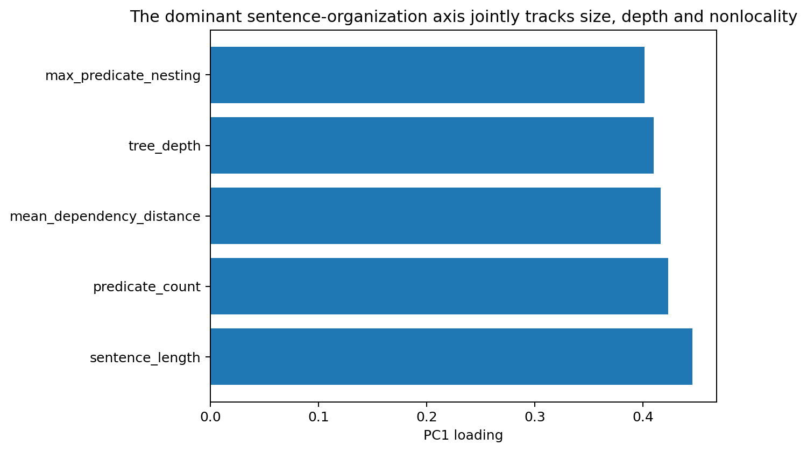

Figure 64. The dominant sentence-organization axis jointly increases size, relation count, dependency distance, tree depth and predicate nesting. Source: DEPENDENCY-ORDER-007.

### 20.7 DEPENDENCY-ORDER-007 interpretation and evidence package

DEPENDENCY-ORDER-007 extends the local-relation result into the long-range sentence graph. Longer sentences contain many more predicate-local relations, deeper dependency trees, longer attachments, more subordinate predicates and greater predicate-to-predicate path separation. The local participant inventory grows much more slowly, and the predicate-local role/order/distance geometry remains in a moderate-width regime. The measured construction therefore supports a compositional picture in which sentence complexity is built by multiplying and arranging bounded local relations across a growing nonlocal graph.

Evidence scope. The result is established on 18,355 official UD test sentences across the same ten languages used in RELATIONAL-ARITY-005, using the same predicate and participant contract. The structural-growth geometry refers to the explicitly measured dependency variables; the wider whole-sentence lexical and semantic data clouds remain separately represented by the NATLANG experiments.

Evidence availability. Recovered authored artifacts for DEPENDENCY-ORDER-007 are supplied under evidence/experiments/DEPENDENCY-ORDER-007/. The evidence index specifies the available results, figures, source records and analysis-code coverage. External source corpora are referenced separately.

### 20.8 Discussion - more intersections are only half the story; the city also builds overpasses

RELATIONAL-ARITY-005 gave us the first half of the city picture: long sentences look less like one gigantic intersection and more like a city containing many ordinary intersections. DEPENDENCY-ORDER-007 now adds the missing vertical dimension. As the city grows, it does not merely stamp out more intersections on a flat grid. Roads become longer, districts sit deeper inside other districts, and local junctions become connected through multi-step routes.

The numbers make that shift visible. A shortest-quartile sentence carries roughly one predicate relation and almost no predicate nesting. A longest-quartile sentence carries nearly five predicate relations, more than two predicate levels of maximum nesting on average, and a predicate-pair tree distance above 2.5. The local junction itself changes much less: participant arity rises only from about 1.17 to 1.44. Complexity has moved outward into the network among relation units.

This also explains why “low-dimensional language” needs a scale label every time we say it. The sentence-organization summary follows a strong low-dimensional growth trajectory: one principal axis simultaneously increases size, depth, relation count and nonlocal distance. Yet the individual predicate realization space still needs a richer role/order/distance repertoire, and the unrestricted whole-sentence clouds measured earlier are wider again. The geometry is layered rather than globally tiny.

Crossing dependencies are the useful anticlimax. They do increase, but their absolute counts stay small compared with the changes in depth and path length. The long-range problem exposed here is mainly one of hierarchical state carry and distant relation-to-relation coordination, not a world in which every sentence becomes a dense mesh of mutually crossing arcs.

### 20.9 Practical guidance for language architecture, context routing and MoE design

The combined 005-007 evidence now supports a layered implementation strategy: keep the common predicate-local composer compact and expandable, scale sentence capacity mainly through the number of relation states that can coexist, and provide a separate mechanism for hierarchical/nonlocal routing among those states. Token length alone is a weak engineering proxy for this structure; relation count, dependency depth and long-range path load are the more direct measured coordinates.

Table 73. Evidence-linked practical guidance from DEPENDENCY-ORDER-007.

| Measured result | Implementation guidance | Concrete validation |
| --- | --- | --- |
| Predicate count rises 1.05→4.76; local arity rises only 1.17→1.44. | Scale the number of active relation units before scaling the width of every relation workspace. | Hold local relation capacity fixed and sweep the number of relation slots across sentence-complexity quartiles. |
| Tree depth rises 3.33→7.20 and max predicate nesting 0.30→2.16. | Add hierarchical state carry: stack-like, recurrent or graph-routed relation state should preserve unfinished higher-level structures. | Measure recovery of nested predicate dependencies after truncating or scrambling parent-relation state. |
| Mean dependency distance doubles and long arcs rise from 6.7% to 19.1%. | Give relation states an explicit long-range addressing or retrieval path instead of relying only on local token adjacency. | Stress-test matched meanings under increasing surface separation with relation identity held fixed. |
| Predicate-pair tree distance rises 0.35→2.60 in all ten languages. | Route computation between relation units as a graph/path problem, not only as flat token attention. | Compare relation-graph routing against equal-capacity flat attention on held-out long-path sentences. |
| Local role/order/distance stable rank grows only 3.94→5.06. | Keep a moderate realization residual around the shared role skeleton rather than making local capacity scale linearly with sentence length. | Track local realization rank and overflow use across length bins and languages. |
| Structural PC1 carries 58.7% and jointly loads size, count, distance, depth and nesting. | Use measured structural complexity as a curriculum/routing coordinate instead of raw token count alone. | Bucket training by relation count + depth + distance and compare transfer against length-only buckets. |

Source: DEPENDENCY-ORDER-007. Values and definitions follow the measurement contract in this section.

Crossing dependencies form a sparse secondary tail in this campaign. Keep nonprojective handling as a supported fallback and maintain a dedicated crossing regression set, but size the main long-range mechanism from depth, dependency distance and predicate-path load.

## 21 Engineering validation of relational routing

RELATIONAL-ROUTER-008

The engineering construction uses the same ten-language Universal Dependencies test collection as RELATIONAL-ARITY-005 and DEPENDENCY-ORDER-007. It translates the measured language geometry into a runnable two-level representation and compares it with matched-capacity controls.

Question. The preceding campaigns measured a relatively narrow predicate-local relation space, while sentence complexity grew primarily through additional predicates, deeper dependency organization, longer paths and predicate nesting. RELATIONAL-ROUTER-008 asks whether an architecture that mirrors this separation - a compact local predicate composer plus a relation-to-relation hierarchical router - reconstructs measured nonlocal sentence organization more accurately than an equal-width flat relation interface.

### 21.1 Construction and matched-capacity controls

Local composer. Every predicate is represented by the same 21-coordinate role/order/distance vector used in DEPENDENCY-ORDER-007: seven participant-role counts, seven mean dependency directions and seven log mean dependency distances. An 8-dimensional PCA composer is fitted only on training predicates in each split.

Sentence interface. Both primary models expose exactly 49 sentence-level features and use the same six-output ridge head. Thirty-two coordinates are pooled moments of the 8D local predicate codes, followed by log predicate count. The final sixteen coordinates contain pairwise relation messages. In the flat control they are computed between surface-adjacent predicates; in the hierarchical model they are computed over the nearest predicate-ancestor edges in the dependency tree. Feature count, local-composer width and output-head capacity are therefore matched.

Adaptive construction. A sparse router uses the flat fast path by default and activates hierarchical routing only when predicate count is at least three or maximum predicate nesting is at least two. A shuffled-edge ablation preserves the same interface and relation-message count while replacing the true predicate-ancestor topology with deterministic incorrect within-sentence pairings.

Prediction task. All models jointly reconstruct six nonlocal organization coordinates measured directly from the tree: tree depth, mean dependency distance, maximum predicate nesting, mean predicate-pair tree distance, subordinate predicate count and crossing count. Performance is normalized RMSE; all scaling parameters are fitted on the training partition only.

Reader note. This is a reconstruction experiment supplied with annotated dependency trees. Both the routing edges and the target organization variables come from those trees; the adaptive gate also uses observed predicate nesting. The comparison therefore tests how effectively a compact interface encodes known structural information. End-to-end parsing, language generation and deployment compute savings are outside this experiment.

Table 74. Matched relational-router interfaces and controls.

| Component | Flat matched control | Hierarchical router | Adaptive sparse router |
| --- | --- | --- | --- |
| Local predicate composer | 8D PCA | 8D PCA | 8D PCA |
| Sentence feature width | 49 | 49 | 49 |
| Relation messages | Surface-adjacent predicate pairs | Nearest predicate-ancestor edges | Ancestor edges only when gate activates |
| Output head | 6-target ridge | Same 6-target ridge | Uses the matched flat/hierarchical heads |
| Routing rule | Always flat | Always hierarchical | predicate_count >= 3 or nesting >= 2 |

Source: RELATIONAL-ROUTER-008. Values and definitions follow the measurement contract in this section.

### 21.2 Correct hierarchical routing produces a small but consistent matched-capacity gain

On the deterministic 80/20 split, the flat matched control reaches normalized RMSE 0.67170. Replacing only the surface-adjacent message topology with true predicate-ancestor routing reduces the error to 0.66969. The adaptive router reaches 0.67011 while activating hierarchy on 39.2% of held-out sentences. The full hierarchy therefore improves the same-capacity structural reconstruction without widening the local composer or sentence feature interface.

Table 75. Random-split structural reconstruction error.

| Model | Random-split NRMSE | Difference from flat |
| --- | --- | --- |
| Flat matched control | 0.67170 | - |
| Hierarchical router | 0.66969 | -0.00201 |
| Adaptive sparse router | 0.67011 | -0.00159 |
| Shuffled-edge router | 0.67250 | +0.00081 |

Source: RELATIONAL-ROUTER-008. Values and definitions follow the measurement contract in this section.

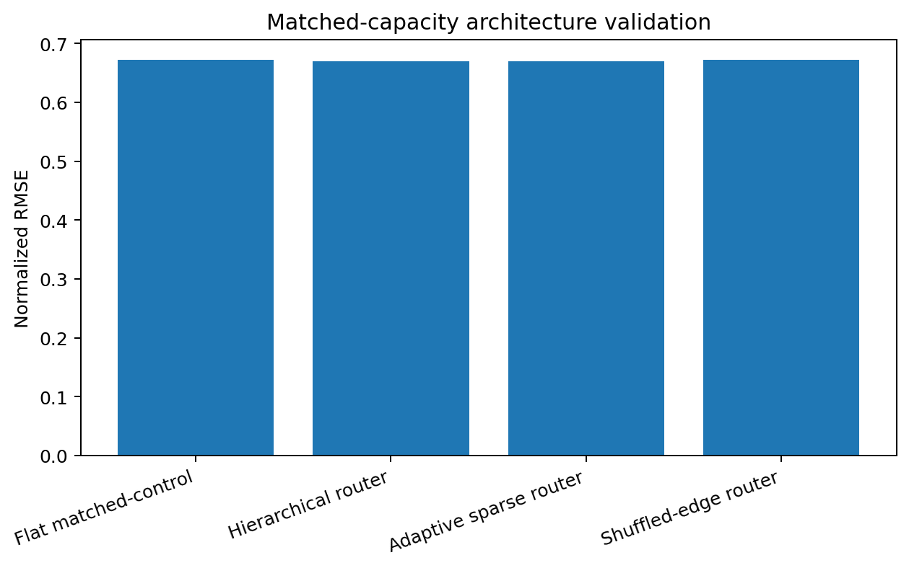

Figure 65. Matched-capacity structural reconstruction. Correct hierarchical routing gives the lowest random-split normalized RMSE. Source: RELATIONAL-ROUTER-008.

### 21.3 The gain replicates across all ten held-out languages

The construction was then evaluated ten times by holding out one complete language at a time. Correct hierarchical routing improves over the flat control in all ten held-out languages. Mean flat NRMSE is 0.70991 and mean hierarchical NRMSE is 0.70733, a mean paired improvement of 0.002579. A language-level bootstrap gives a 95% interval of 0.001313 to 0.004106, and the exact two-sided sign-flip probability for ten same-direction nonzero improvements is 0.001953. The adaptive router also improves over flat in all ten languages, with mean NRMSE 0.70751.

Table 76. Leave-one-language-out reconstruction and adaptive activation.

| Held-out language | Flat | Hierarchy | Adaptive | Adaptive activation |
| --- | --- | --- | --- | --- |
| English | 0.46854 | 0.46729 | 0.46705 | 32.6% |
| Chinese | 0.64474 | 0.63715 | 0.63728 | 67.7% |
| Japanese | 0.58392 | 0.58220 | 0.58238 | 60.3% |
| Turkish | 0.54235 | 0.54204 | 0.54151 | 23.8% |
| Arabic | 1.32383 | 1.32331 | 1.32282 | 60.0% |
| Russian | 0.69156 | 0.69072 | 0.69043 | 37.5% |
| Finnish | 0.61941 | 0.61637 | 0.61639 | 33.9% |
| Hindi | 0.83964 | 0.83743 | 0.83930 | 36.5% |
| Spanish | 0.71063 | 0.70468 | 0.70551 | 49.0% |
| Korean | 0.67449 | 0.67213 | 0.67242 | 47.1% |

Source: RELATIONAL-ROUTER-008. Values and definitions follow the measurement contract in this section.

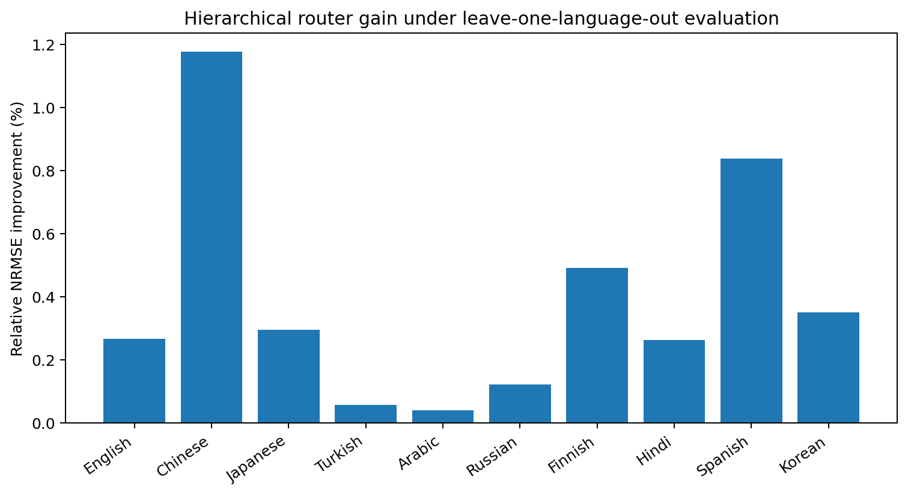

Figure 66. Relative hierarchical-router improvement under leave-one-language-out evaluation. The sign is consistent across all ten languages. Source: RELATIONAL-ROUTER-008.

### 21.4 The router helps most on the structural coordinates it was designed to carry

The six target coordinates separate where the topology-aware messages matter. Maximum predicate nesting improves from 0.39622 to 0.38474 NRMSE, a 2.90% relative reduction. Subordinate predicate count improves by 1.03%. Crossing count improves modestly. Tree depth and mean dependency distance are essentially unchanged. The hierarchy therefore contributes primarily to relation-to-relation organization rather than producing a uniform gain over every measured coordinate.

Table 77. Target-specific reconstruction error and relative improvement.

| Target | Flat NRMSE | Hierarchy NRMSE | Relative change |
| --- | --- | --- | --- |
| tree_depth | 0.74249 | 0.74314 | -0.09% |
| mean_dependency_distance | 0.75364 | 0.75386 | -0.03% |
| max_predicate_nesting | 0.39622 | 0.38474 | +2.90% |
| predicate_pair_tree_distance | 0.53087 | 0.53065 | +0.04% |
| subordinate_predicate_count | 0.38169 | 0.37777 | +1.03% |
| crossing_count | 1.00164 | 0.99902 | +0.26% |

Source: RELATIONAL-ROUTER-008. Values and definitions follow the measurement contract in this section.

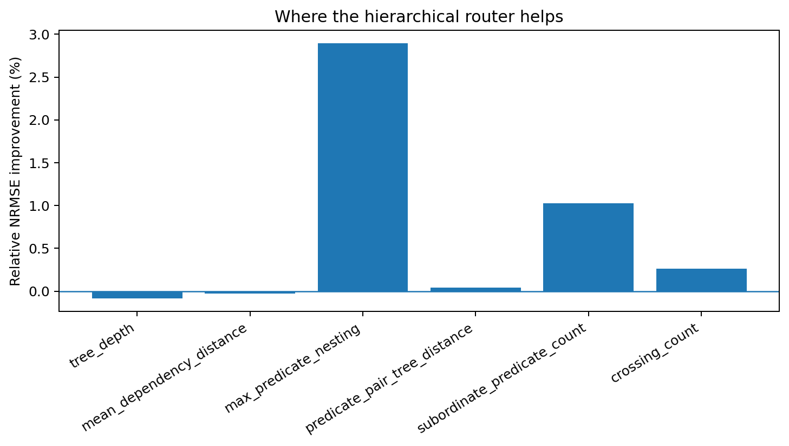

Figure 67. Target-specific gain. The largest improvement appears on predicate nesting, followed by subordinate-predicate organization. Source: RELATIONAL-ROUTER-008.

### 21.5 High-complexity sentences retain the same direction

The highest sentence-length quartile is substantially harder for both models. In this stratum the flat control reaches 0.95212 NRMSE and the hierarchical router reaches 0.94935. The lower 75% likewise moves from 0.53476 to 0.53312. The hierarchy therefore preserves its direction when relation count and long-range organization are largest, rather than deriving its average gain solely from simple sentences.

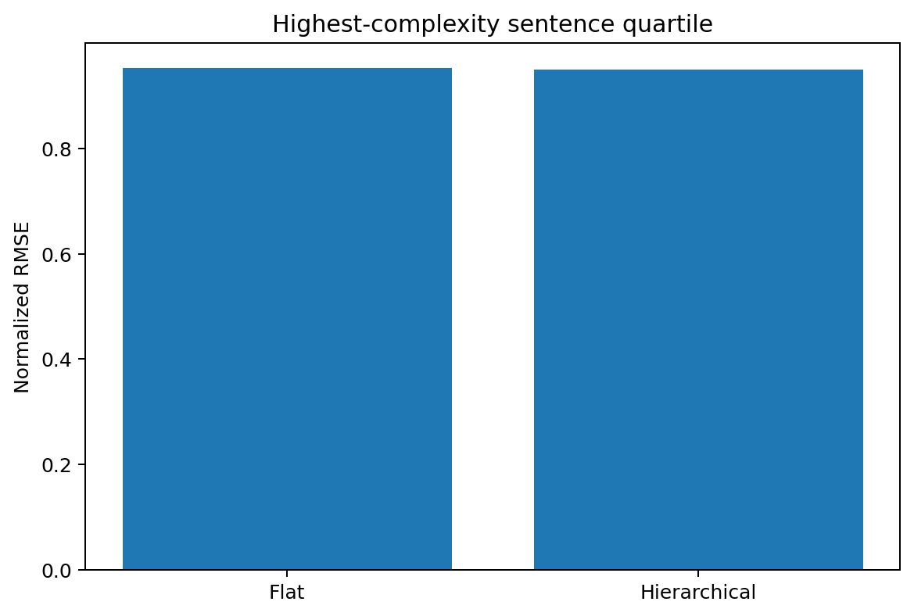

Figure 68. Matched-capacity comparison within the highest-complexity sentence quartile. Source: RELATIONAL-ROUTER-008.

### 21.6 Correct topology, not merely an extra processing stage, carries the gain

The shuffled-edge control keeps the same 49-dimensional interface and relation-message machinery but routes messages through deterministic incorrect predicate pairings. Its NRMSE is 0.67250, worse than both the correct hierarchical router (0.66969) and the surface-adjacent flat control (0.67170). The executed ablation therefore locates the gain in the measured relation topology: adding a routing stage alone does not reproduce it.

Publication annotation. The supplied reproduction script constructs the shuffled condition with one pair for each predicate after the first. Its hierarchical condition uses predicates with a measured predicate ancestor. These rules need not produce the same number of messages in every sentence, although the output feature width is identical. The source interpretation is retained; an exactly message-count-matched topology claim requires an additional check.

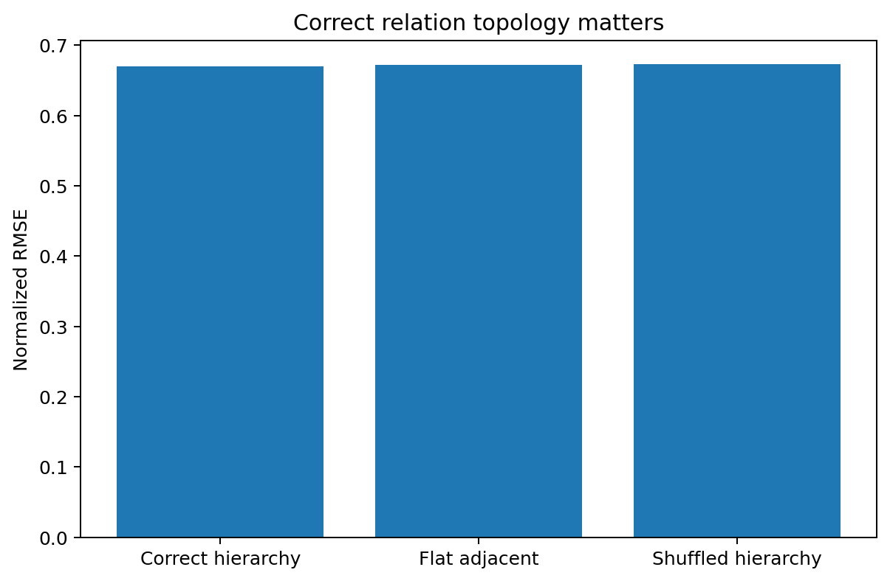

Figure 69. Edge ablation. Correct predicate-ancestor connectivity outperforms both surface-adjacent and shuffled relation routing. Source: RELATIONAL-ROUTER-008.

### 21.7 RELATIONAL-ROUTER-008 interpretation and evidence scope

RELATIONAL-ROUTER-008 provides a direct engineering construction from the preceding geometric measurements. A compact local predicate composer can be retained while nonlocal organization is handled by a separate graph-routed interface. Under matched feature width and an identical output head, correct predicate-ancestor routing produces a small but cross-linguistically consistent improvement in reconstructing measured sentence-organization coordinates. The largest gain appears on predicate nesting, the coordinate most directly tied to relation-to-relation hierarchy.

The adaptive construction further shows that the hierarchy can be invoked sparsely. On the random split, activating hierarchical routing on 39.2% of sentences reaches 0.67011 NRMSE, preserving most of the full-router improvement while leaving the remaining sentences on the flat fast path. This supplies an executed prototype of the earlier guidance to allocate nonlocal computation according to measured structural load rather than widening every local relation unit.

Evidence availability. Recovered authored artifacts for RELATIONAL-ROUTER-008 are supplied under evidence/experiments/RELATIONAL-ROUTER-008/. The evidence index specifies the available results, figures, source records and analysis-code coverage. External source corpora are referenced separately.

### 21.8 Discussion - the city map only helps when the roads connect the right intersections

The previous experiments gave us the city metaphor: language complexity grows mainly by adding many small intersections, then connecting them through deeper and longer routes. This experiment finally built that city into an actual machine. Every predicate first passes through the same small local composer. The machine then has two possible maps. One map connects predicates merely because they sit next to each other on the page. The other connects them because one predicate is actually an ancestor of another in the dependency structure.

The difference is not dramatic in aggregate, and that is informative. DEPENDENCY-ORDER-007 already showed that sentence organization has a strong low-dimensional growth axis, so pooled local statistics carry substantial information before the router does anything. The hierarchical layer earns its keep on the residue: nesting and subordinate coordination. It is less like replacing the whole engine and more like adding the correct road network on top of an already competent collection of local neighborhoods.

The shuffled-edge control makes the picture sharper. A routing layer with the wrong roads is not harmless decoration: it performs worse than the flat control. The architectural lesson is therefore not "graphs are better." The measured result is narrower and more useful: when the computation is routed between the relation units that the data actually links, a matched-width model reconstructs the corresponding nonlocal organization more accurately; when those links are scrambled, the benefit disappears.

The adaptive result is perhaps the most practical part. Most sentences do not need the full overpass system. A gate based on relation count and nesting activates the hierarchy for only about two-fifths of held-out sentences and keeps most of the observed gain. The geometry therefore suggests a computational body with cheap local streets almost everywhere and expensive bridges only where the sentence actually develops multi-relation structure.

### 21.9 Practical engineering guidance from the construction

Table 78. Practical guidance from relational-router construction.

| Measured construction result | Engineering action | Release / validation check |
| --- | --- | --- |
| 8D local composer + correct ancestor routing improves matched-width reconstruction | Keep local relation units compact; allocate extra capacity to relation-to-relation routing rather than widening every local unit. | Match feature/parameter budgets and compare flat versus hierarchy on the same held-out sentences. |
| 10/10 leave-one-language-out gains have the same sign | Treat the router as a language-general structural component candidate, with language-specific realization left in local/residual paths. | Require leave-one-language-out or leave-family-out evaluation before sharing the router across multilingual experts. |
| Largest gain is on predicate nesting and subordinate coordination | Use nesting/subordination diagnostics as primary health metrics for the nonlocal router. | Track nesting and subordinate-predicate reconstruction separately from aggregate loss. |
| Shuffled edges are worse than correct hierarchy and flat adjacency | Preserve explicit relation identity/topology; do not substitute arbitrary message mixing for measured structural links. | Include an edge-shuffle ablation in router regression tests. |
| Adaptive hierarchy activates on 39.2% of random-split test sentences | Use a flat fast path for low-load sentences and activate hierarchy from observed relation count/nesting thresholds. | Report router activation rate together with quality; tune the gate against structural load rather than token length alone. |
| High-complexity Q4 keeps the hierarchical advantage | Budget nonlocal routing capacity where predicate count, depth and path load are high. | Maintain a dedicated high-complexity test stratum instead of reporting only corpus-wide means. |

Source: RELATIONAL-ROUTER-008. Values and definitions follow the measurement contract in this section.

Engineering scope. The primary flat and hierarchical heads have the same interface width. The adaptive construction retains both fitted heads and uses tree-derived gating information. Its activation rate describes the routing decision; it is not a measured reduction in total deployment cost.

## 22 Evidence across linguistic scales

The natural-language line now contains seven complementary scales of evidence. LSP-003 shows that typologically diverse languages share concentrated local transition fields and differ in relational orientation and morphology. LSP-001/002 show that human simplification preserves narrow movement while reorganizing the trajectory. NATLANG-COMPAT-004A/004B separate whole-sentence surface geometry, matched-semantic compatibility and script identity. RELATIONAL-ARITY-005 measures the bounded local dependency anatomy directly. RELATION-COMPRESSION-006 shows that strong human simplification reduces predicate count substantially while leaving local arity and coarse role geometry near the same regime. DEPENDENCY-ORDER-007 adds the missing long-range layer: sentence complexity expands through hierarchy, dependency distance, predicate nesting and predicate-to-predicate paths.

This follows the parent MoE branch directly: expert boundaries are inferred from measured compatibility and training-transfer behavior. The executed language evidence now separates surface-code compatibility, bounded local relation structure, branch selection, realization recoding and nonlocal relation routing. These coordinates can be tested independently before any expert partition is assigned.

The TOOL-CHAIN-GEOMETRY-006B through 006G sequence supplies a complementary evidence branch on provenance, normalization, generated actions and schema support.

The natural-language evidence covers writing-system identity, morphology, dependency and relation structure, compression recoding and nonlocal organization. Tool-chain findings and linguistic findings retain their respective measurement scopes.

## 23 Integrated interpretation

### 23.1 From low-dimensional movement to linguistic anatomy

Chapter 3 originally established a mathematical fact: language-trained systems and language transition fields concentrate control energy into a few dominant modes. LSP-001 and LSP-002 add the linguistic anatomy of that fact. Human simplifiers preferentially remove peripheral coordinates and relation-realization material, then reorganize the remaining transition field without broadening its dominant spectrum.

### 23.2 Low local width and increasing compositional depth

The combined record motivates a sharper version of the earlier 2-3 degree-of-freedom hypothesis. It concerns local movement/relational arity rather than total language state dimension. Longer context increases rank modestly, operator families are richer than the movement space, and sentences can accumulate complexity through repeated state-dependent composition.

local movement width ~ 2-3 dominant directions; linguistic complexity grows through repeated composition and history

### 23.3 Coordinated compression as a control transformation

Random deletion and human simplification reach similar lengths through different geometry. Random deletion largely preserves the original top-three orientation and broadens the spectrum. Human simplification maintains spectral concentration and rotates the dominant subspace. This is the signature expected from coordinated control: a trajectory is reorganized around a small set of active directions rather than damaged by independent component removal.

### 23.4 Connection to the Chapter 3 operator picture

The compression results are naturally compatible with LANG-018. Surface tokens are handles for state-dependent transformations. Removing some handles changes the state in which the remaining operators act, so token function can shift even when the token survives. The near-zero survival-versus-code-shift correlation provides a direct empirical reason to keep lexical retention and functional semantics as separate measurements.

### 23.5 Programming languages are realizations inside the algorithmic-response regime

CODE-GEOMETRY-005A measures variation inside algorithmic response. Both normalized lexical transitions and canonical syntax transitions remain concentrated across the nine measured programming languages, whereas the active axes change with explicit typing, declaration structure, mutation, calls, indexing and operator form. The result supplies a concrete decomposition inside the algorithmic regime: shared algorithmic structure and programming-language-specific realization are separately measurable coordinates.

Binding, data flow, control flow and execution state provide additional measurement layers for distinguishing code form from value propagation and executable consequences. Compatibility based on parameter sharing requires its own training-transfer evidence.

### 23.6 Response regime is a higher-order coordinate than programming-language identity

RESPONSE-REGIME-004 directly fixes algorithm identity and changes the response form. Surface lexical rank contracts from natural-language procedural response through pseudocode to executable Python under an equal vocabulary budget, while the extracted procedural event field stays concentrated and task matching remains detectable across regimes. Combined with CODE-GEOMETRY-005A, the current record therefore separates two axes: response regime determines how a solution is externalized, and programming-language realization determines how an algorithmic response is encoded inside the executable branch.

### 23.7 Request-side target identity survives paraphrase-field rotation

RESPONSE-REGIME-004B1 fixes 57 executable SQL targets and changes the natural-language request realization across six curated paraphrase classes. The request transition field spans stable ranks 5.116-8.096 and can rotate to approximately 0.605 top-three overlap with the naive field, yet leave-one-style-out target recovery averages 74.56% Top-1 against approximately 1.7% randomized target identity. The resulting separation is operational: local surface geometry can change more than the target-specific structure used to identify the executable objective. Together with RESPONSE-REGIME-004, this places request realization, procedural response realization and executable representation on distinct measurable coordinates.

### 23.8 Tool chains add an external-state dynamical layer

TOOL-CHAIN-GEOMETRY-006 adds a new layer to the language/algorithmic hierarchy. A tool call is simultaneously a structured response and an intervention on an external state. Across BFCL, isolated function-call syntax, multi-turn trajectory success and broader web/memory performance separate empirically; in raw strong-model failures, final-state mismatch is the dominant evaluator category. Tool-chain geometry therefore has to track not only generated action tokens but also call-result identity and the world state produced by their ordered composition.

The model/harness boundary is itself measurable. The paired FC-versus-Prompt analysis produces large positive and negative deltas depending on model family, while provider protocols expose different continuation contracts. MoE or AGI routing should therefore treat tool-chain state as a joint model-plus-computational-body variable and derive sharing boundaries from measured future-state compatibility.

TOOL-CHAIN-GEOMETRY-006B converts that interface hypothesis into a controlled intervention. In the primary paired panel, the same frozen policy reaches 70.14% exact final-state accuracy under the complete adapter, 46.43% with truncated state handoff, 34.14% after call-result identity is removed and 47.14% under unnormalized result surfaces. Sequential return order does not repair missing identity, whereas explicit final-state verification recovers 21 completed-but-wrong trajectories. Strict versus best-effort schema handling changes trace behavior without changing any primary final-state outcomes.

TOOL-CHAIN-GEOMETRY-006C changes the policy family and implements the tool surface as typed JSON, then repeats the adapter interventions across three independently sampled panels. Canonical-prefix exact action accuracy stays between 91.55% and 92.93%, and baseline final-state accuracy between 73.50% and 79.50%. Across the pooled 600 paired worlds, state truncation reduces exact final-state accuracy by 46.33 percentage points and loss of call-result identity by 70.33 points; the identity effect is identical under parallel and sequential return order. In this structured policy, raw non-normalized backend JSON produces the same 5.50% endpoint because both raw-form and identity interventions disconnect the learned canonical bound-value coordinates. Schema mode and final verification are endpoint nulls in this policy, sharpening the distinction between persistent interface coordinates and policy-specific recovery mechanisms.

TOOL-CHAIN-GEOMETRY-006D then separates result provenance from normalization in a symmetry-controlled 2 x 2 factorial. Across 600 paired held-out worlds, the four cells reach 83.50%, 68.67%, 74.33% and 67.33% exact final-state accuracy. Provenance contributes +5.25 pp, normalization +10.92 pp and the positive interaction +7.83 pp, with the interaction concentrated entirely in multi-read tasks. TOOL-CHAIN-GEOMETRY-006E then holds the 006D planner, event reader and the same 600 worlds fixed while replacing direct structured action emission with unconstrained autoregressive JSON serialization. The generated surface reaches 83.50%, 69.00%, 74.33% and 67.67%, agrees with 006D on 99.83% of 2,400 paired outcomes and preserves the +7.83 pp interaction. The serializer additionally exposes a distinct repair/projection coordinate: 283 trajectories contain an invalid-plan projection and four SWAP outcomes are repaired by the generated action surface.

This places external-state tool use on a sharper hierarchy: action syntax is one coordinate, planner semantics another, and persistent state, result provenance, representation normalization, action serialization and world verification are separately measurable dynamical interfaces. 006E shows that a generated JSON surface can carry the upstream provenance/normalization geometry almost unchanged while also acting as its own semantic projection operator at the planner schema boundary. Compatibility measurements should therefore distinguish internal plan state, emitted action state and external world state rather than treating tool use as one response channel.

TOOL-CHAIN-GEOMETRY-006F then replaces the structured planner with an autoregressive semantic planner while retaining the generated JSON tool surface. The learned planner passes a competence gate and preserves a strong provenance effect (+8.92 pp pooled; +19.58 pp on multi-read tasks), while the normalization main effect contracts to +0.58 pp under matched training on the raw backend styles. This separates two classes of interface structure: raw representation can be absorbed into planner competence when it is present during training, whereas missing call-result identity continues to remove relational information needed for multi-result reassociation.

TOOL-CHAIN-GEOMETRY-006G then holds three raw result families out of planner training and measures the representation shift before executing the same worlds. The held-out raw prefixes are geometrically separable from the seen raw prefixes, while canonicalization maps paired seen/unseen prefixes to identical planner states. Final-state behavior follows the same split: the direct raw path collapses by 69.58 pp under schema shift, whereas the canonical path changes by 0.00 pp. This establishes training-support membership as an explicit coordinate of raw tool-result compatibility and places data-geometry preflight ahead of deployment routing.

### 23.9 Matched semantics exposes a heterogeneous compatibility graph

NATLANG-COMPAT-004A fixes sentence meaning by FLORES-200 row alignment and measures how much target-language surface structure can be recovered from another language on held-out meanings. The resulting graph is heterogeneous: pairwise transfer varies substantially, and a blocked holdout reduces the mean score. Compatibility is therefore an empirical relation indexed by the specified evaluation distribution and language pair.

### 23.10 Local movement width and whole-sentence cloud dimension are separate scales

The new sentence-cloud geometry closes an apparent gap in the earlier record. Local next-step language movement can remain concentrated into a few dominant directions even though the set of complete sentences across many meanings occupies a much wider surface manifold. Model design should therefore track at least two capacities separately: the width needed for local transformation and the state-space extent needed to represent the population of realizations.

### 23.11 Surface overlap must be subtracted before expert compatibility is inferred

The direct control shows that shared script and cognate-form overlap can dominate absolute retrieval. Transfer gain, script interventions and structural controls supply distinct compatibility coordinates. The measured graph is a screening map; neural expert boundaries require direct training-transfer validation.

### 23.12 Script identity and language identity are separable compatibility coordinates

NATLANG-COMPAT-004B holds meaning fixed and changes writing system across eight languages. Shared script is a strong direct surface coordinate: different languages in the same script are closer than the same language rendered in different scripts before learning. Matched transfer reverses this relation on average, and the script-neutral assay makes the language-specific continuity stronger still. Multilingual routing therefore needs at least two coordinates - surface-code compatibility and cross-code structural compatibility - rather than one language-name or embedding-distance axis.

### 23.13 Broad script recoding can wrap around narrower residual structure

The paired script-change vector occupies broad surface geometry (mean stable rank 14.96) but contracts to a mean stable rank of 4.39 after concrete glyph identity is removed. This complements the earlier local-movement result: language can use a narrow family of relational/control corrections while expressing those corrections through a much broader orthographic shell. The low-dimensional neighbourhood assay simultaneously shows that whole-sentence clouds retain substantial high-dimensional organization, so local movement width and representation capacity remain separate design quantities.

### 23.14 Sentence complexity multiplies local relations more than it widens them

RELATIONAL-ARITY-005 supplies the syntactic bridge between narrow local movement and broad whole-sentence geometry. Across 41,223 predicate-local structures, 97.36% contain three explicit participants or fewer. From the shortest to longest within-language quartile, predicate count rises by 3.73 per sentence on average, while local arity rises by only 0.24 and seven-role stable rank plateaus at approximately 4.94. The measured long sentence is therefore built primarily by composing more bounded relation units.

### 23.15 Abstract relation skeleton and realization geometry separate

The seven-role count field has mean stable rank 4.99, whereas adding signed dependency direction and distance raises mean stable rank to 6.26. This supplies a concrete multilingual decomposition for later transfer experiments: a comparatively compact relation skeleton can be tested as a shared substrate, while order/direction realization occupies additional coordinates that may require language- or regime-specific residual capacity.

### 23.16 Human compression preserves local relation width while increasing relation density

RELATION-COMPRESSION-006 shows that compression removes surface length and predicate nodes much faster than it changes local participant width. Original-to-strong token count falls by 35.5% and predicate count by 30.2%, while mean local arity changes from 1.060 to 1.041 and coarse role stable rank from 2.088 to 2.041. The remaining surface therefore becomes more predicate-dense. This provides a structural counterpart to the low-dimensional transition geometry preserved in LSP-002.

### 23.17 Compression changes mode from branch replacement toward net pruning

Alignment and target predicate counts separate source-branch non-recovery from actual net pruning. Mild compression has a replacement/re-expression lower bound of 84.2% of source non-recovery and only 3.8% net predicate-count reduction. Strong compression reverses this balance: replacement accounts for at least 35.9%, net pruning for 64.1%, and predicate count is 30.2% lower than the original. Role-signature-preserving surface recoding simultaneously rises to 53.2%, so strong simplification combines branch selection with active rewriting of the relation units that survive.

### 23.18 Long-range sentence complexity lives mainly between bounded relation units

DEPENDENCY-ORDER-007 extends the local-width result into the sentence graph. From Q1 to Q4, predicate count rises by +3.71 per sentence, tree depth by +3.87, maximum predicate nesting by +1.86 and predicate-pair tree distance by +2.25, all with the same positive direction across ten languages. Predicate-weighted local arity rises by only +0.27. The measured long-range complexity is therefore concentrated in relation multiplicity, hierarchy and nonlocal coordination rather than proportional widening of each local relation.

### 23.19 A low-dimensional structural growth axis coexists with wider local realization and sentence spaces

Within the explicit seven-coordinate dependency-organization descriptor, stable rank is 1.70 and PC1 carries 58.73% of variance by jointly increasing sentence length, predicate count, dependency distance, tree depth and predicate nesting. The predicate-local role/order/distance space is wider (mean stable rank 5.62; PCA95 9.1), and the earlier whole-sentence surface clouds are wider again. The combined record therefore supports a layered geometry: a coordinated global complexity trajectory, a moderate local realization repertoire and a substantially broader space of complete sentence contents.

### 23.20 Engineering construction validates the local-composer plus nonlocal-router decomposition

RELATIONAL-ROUTER-008 translates the measured geometry into a matched-capacity runnable architecture. The same compact local predicate composer is used in both models; replacing surface-adjacent relation messages with true predicate-ancestor routing yields a small but consistent improvement across ten held-out languages, and shuffled connectivity removes that advantage. The strongest gain occurs on predicate nesting and subordinate coordination. Together with RELATIONAL-ARITY-005 and DEPENDENCY-ORDER-007, this closes one engineering loop: bounded local relation units can be retained while nonlocal sentence complexity is represented through a separate, selectively activated routing layer.

## 24 References and source identities

Universal Dependencies treebanks: English-EWT, Chinese-GSDSimp, Japanese-GSD, Turkish-IMST, Arabic-PADT, Russian-SynTagRus, Finnish-TDT, Hindi-HDTB, Spanish-GSD, Korean-GSD.

Chang, T. A., Tu, Z., & Bergen, B. K. (2022). The Geometry of Multilingual Language Model Representations. EMNLP.

Jones, A., Wang, W. Y., & Mahowald, K. (2021). A Massively Multilingual Analysis of Cross-linguality in Shared Embedding Space. EMNLP.

Verma, A. A. K., Chatterjee, A., Gupta, M., & Chakraborty, T. (2026). Multilingual Language Models Encode Script Over Linguistic Structure. ACL. https://aclanthology.org/2026.acl-long.1554/

Asgari, E. et al. (2026). MorphBPE: Morphology-Aware Tokenization for Efficient LLM Training. Findings of ACL. https://aclanthology.org/2026.findings-acl.2068/

Guo, D. et al. (2020/2021). GraphCodeBERT: Pre-training Code Representations with Data Flow.

Cassano, F. et al. (2022/2023). MultiPL-E: A Scalable and Extensible Approach to Benchmarking Neural Code Generation.

IBM Project CodeNet (2021): large-scale multi-programming-language submissions dataset.

Berkeley Function Calling Leaderboard (BFCL), V3/V4; and Yao et al. (2024), tau-bench.

AGI x Mixture of Experts — Generative Mechanism State. Research record v1.5 (27 September 2026).

Berkeley Function Calling Leaderboard V4. Public leaderboard, last updated 12 April 2026; evaluation commit f7cf735 / bfcl-eval 2025.12.17. https://gorilla.cs.berkeley.edu/leaderboard

HuanzhiMao/BFCL-Result. Public model responses and score files; TOOL-CHAIN-GEOMETRY-006 uses the 2025-12-16 score snapshot. https://github.com/HuanzhiMao/BFCL-Result

tau-bench. tau3-Banking public leaderboard, accessed 27 September 2026. https://taubench.com/leaderboard/

OpenAI. Function calling documentation: call_id/function_call_output binding, strict mode and parallel_tool_calls. https://developers.openai.com/api/docs/guides/function-calling

Google AI for Developers. Gemini function calling and tool-combination documentation: compositional/parallel calls, stateful continuation, stateless full-history replay and tool-context signatures. https://ai.google.dev/gemini-api/docs/function-calling

Anthropic. Claude tool-use documentation: tool_use/tool_result binding, strict tool use and client/server tool execution. https://platform.claude.com/docs/en/agents-and-tools/tool-use/overview

Prabhakar, A. et al. (2025). APIGen-MT: Agentic Pipeline for Multi-Turn Data Generation via Simulated Agent-Human Interplay. arXiv:2504.03601.

Utama, P., Weir, N., Basik, F., Binnig, C., Cetintemel, U., Hättasch, B., Ilkhechi, A., Ramaswamy, S., & Usta, A. (2018). An End-to-end Neural Natural Language Interface for Databases. arXiv:1804.00401.

DataManagementLab. ParaphraseBench: a benchmark to test linguistic robustness. RESPONSE-REGIME-004B1 uses the 57-query x 6-variant test files and aligned patients_test.sql at repository commit 9c77daa11c7fa1fa16bbb2e314303b4017fb2220, accessed 27 September 2026.

NLLB Team / Costa-jussa et al. (2022). No Language Left Behind: Scaling Human-Centered Machine Translation. FLORES-200 supplies professionally translated aligned sentences; the official benchmark contains 3001 sentences across dev, devtest and hidden test splits and is distributed under CC-BY-SA 4.0.

FLORES-200 eight-language mirror used for NATLANG-COMPAT-004A: rnagamatsu/textanalytics_group2, `flores200_group2/`, eight pinned 997-row dev files. The source report identifies NATLANG_COMPAT_004A_Evidence_20260927.zip as the location of its Git blob records; that independent archive was not recovered for this edition.

FLORES-200 script-intervention source used for NATLANG-COMPAT-004B: common-parallel-corpora/common-parallel-corpora, pinned commit dbc2cd91df89c52dffe899efe7ea4dff63e172fc, 19 exact 997-row dev files covering eight same-language script pairs plus Hindi-Devanagari, Central Atlas Tamazight-Tifinagh and Cantonese-Traditional-Han controls. Exact Git blob SHAs are recorded in NATLANG_COMPAT_004B_Evidence_20260927.zip.

RELATIONAL-ARITY-005 uses the official test blobs from UniversalDependencies/UD_English-EWT, UD_Chinese-GSDSimp, UD_Japanese-GSD, UD_Turkish-IMST, UD_Arabic-PADT, UD_Russian-SynTagRus, UD_Finnish-TDT, UD_Hindi-HDTB, UD_Spanish-GSD and UD_Korean-GSD. Exact test-file Git blob SHAs and sentence counts are preserved in RELATIONAL_ARITY_005_Evidence_20260927.zip.

DEPENDENCY-ORDER-007 reuses the exact ten pinned Universal Dependencies test blobs from RELATIONAL-ARITY-005 and extends the executed contract to dependency depth, nonlocal attachment distance, predicate nesting, predicate-pair tree paths, crossings and role/order/distance realization geometry. Exact source identities are retained in DEPENDENCY_ORDER_007_Evidence_20260927.zip.

RELATION-COMPRESSION-006 uses the official MCTS dev/test originals and five human references from blcuicall/mcts together with UD Chinese GSDSimp train/dev/test for the supervised coarse predicate-role assay. Exact Git blob SHAs, parser-gate results, alignment sensitivity and executed numerical summaries are preserved in RELATION_COMPRESSION_006_Evidence_20260927.zip.

## 25 Evidence catalog

Table 79. Evidence catalog and reported study scopes.

| ID | Design and scope | Primary evidence | Current statement |
| --- | --- | --- | --- |
| Inherited LANG-016 | In parent Chapter 3 | Research_Report/REPORT_EN.md §26 | Language training concentrates future-control energy into approximately 2-3 dominant modes in the specified GRU assay |
| Inherited LANG-017 | In parent Chapter 3 | Research_Report/REPORT_EN.md §27 | Low-rank dominant transition geometry is measurable directly in the language teacher |
| Inherited LANG-018 | In parent Chapter 3 | Research_Report/REPORT_EN.md §28 and validation §49.4 | State-dependent fitted linguistic updates carry predictive structure; order contributes computation |
| Inherited LANG-019 | Hierarchy extension provisional | Research_Report/REPORT_EN.md §29, §49.4, §50.2 | Higher-level fitted residuals are concentrated; independent generators beyond complete closure remain a testable extension |
| LSP-001 | Initial survey | MCTS 3,615 pairs + CSS 766 pairs | Human simplification exhibits hierarchical peeling across 4,381 human pairs |
| LSP-002 | First paired geometry campaign | 449 paired MCTS sources; human and random-deletion controls | Human compression preserves low-dimensional word movement, rotates dominant axes and induces low-dimensional token recoding |
| CODE-GEOMETRY-005A | Controlled token/syntax phase | 10 matched algorithms x 9 languages; native parser/toolchain validation; canonical semantic-skeleton control; evidence ZIP | Within algorithmic response, matched programming-language surfaces preserve concentrated lexical and syntax-transition geometry while type/control/surface realization redistributes that structure. |
| LSP-003 | Cross-language survey | Ten UD treebanks plus literature-grounded morphology/script/signed-language survey | Natural languages share strongly concentrated local transition geometry while relational orientation, morphology and surface code vary. |
| RESPONSE-REGIME-004 | Initial controlled paired-response assay | 10 algorithms x natural-language procedural / pseudocode / executable Python; event-path control; mismatched-task control; deletion stress; evidence ZIP | Matched natural-language and algorithmic responses preserve a concentrated shared procedural event backbone while surface lexical width, binding locality and exact executability differ. |
| TOOL-CHAIN-GEOMETRY-006 | First public benchmark campaign | BFCL V4 109 configs; three 200-episode raw base files; tau3-Banking current leaderboard; provider protocol docs | Single-call, multi-turn and agentic performance form distinct measured axes; parameter/missing-function perturbations reduce chain accuracy; raw strong-model failures are dominated by external-state mismatch; FC/Prompt effects vary by model family |
| RESPONSE-REGIME-004B1 | Request-side paraphrase-invariance assay | ParaphraseBench 57 SQL targets x 6 curated NL variants; pinned source identities; transition geometry; leave-one-style-out target retrieval; 1,000-permutation controls; evidence ZIP | Paraphrase families change request-surface transition width/orientation while held-out executable-target identity remains strongly recoverable (mean Top-1 74.56% versus approximately 1.7% randomized target identity). |
| TOOL-CHAIN-GEOMETRY-006B | Controlled learned-policy adapter intervention; second task-sampling stress panel measured | Frozen 124,798-parameter BiGRU policy; 700-task primary paired panel x 7 adapters; second 700-task stress panel; exact world-state execution; paired bootstrap/McNemar; episode traces; evidence ZIP | Within the primary executable panel, removing call-result identity, truncating state handoff or bypassing result normalization causally reduces exact final-state accuracy under the same frozen policy; verification repairs 21 wrong-DONE trajectories; strict-vs-best-effort schema handling leaves all 700 primary final-state outcomes unchanged. |
| TOOL-CHAIN-GEOMETRY-006C | Three-panel typed-JSON cross-policy replication | Frozen four-head structured transcript policy; 12,000 train tasks / 62,268 decisions; three independent 200-task panels x seven adapters; JSON Schema executor; paired bootstrap/McNemar; episode traces; evidence ZIP | Across three independent panels, state truncation and loss of call-result provenance reproducibly reduce exact final-state accuracy under the same frozen policy; sequential ordering does not replace identity. Raw non-normalized result shapes are also active in this structured interface; schema and final-verification endpoints are null in this policy. |
| TOOL-CHAIN-GEOMETRY-006D | Symmetry-controlled 2 x 2 factorial | One frozen 545-coordinate structured event-slot policy; 5,000 training tasks / 90,696 decisions; three independent 200-task panels x four factorial cells; 2,400 executed trajectories; paired bootstrap; single- vs multi-read stratification; raw fixed-style control; evidence ZIP | With value visibility retained in all cells, exact accuracy is 83.50% / 68.67% / 74.33% / 67.33%. Provenance and normalization have positive main effects and a +7.83 pp interaction; the factorial separation is concentrated in multi-read tasks. |
| TOOL-CHAIN-GEOMETRY-006E | Generated-action surface transfer with matched 006D panels | Frozen final-006D planner/event reader; unconstrained autoregressive neural JSON emitter; exhaustive 153-action round-trip assay; same three 200-task panels × four cells; 2,400 trajectories; pilot diagnostics; evidence ZIP | Generated JSON preserves the 006D provenance × normalization geometry with 99.83% paired outcome agreement and the same +7.83 pp interaction. The serializer also projects invalid planner tuples onto legal actions, producing 283 projection episodes and four repaired SWAP outcomes. |
| TOOL-CHAIN-GEOMETRY-006F | Competence-gated end-to-end generative planner factorial | Autoregressive semantic planner + frozen 006E JSON emitter; exact final-006D 3 × 200 held-out panels; 2,400 executed trajectories; 10,840 oracle-prefix diagnostics; evidence ZIP | Generative planning preserves a strong provenance effect, especially for multi-result reassociation; raw/canonical normalization has no stable final-state main effect under matched training on the deployed raw style families. |
| TOOL-CHAIN-GEOMETRY-006G | Held-out raw-schema shift with geometry precheck | Generative planner trained on raw styles 0-2 only; styles 3-5 held out; 2,110 matched-prefix geometry rows per representation; 600 worlds x 2 schema regimes x 4 cells = 4,800 trajectories; oracle-prefix diagnostics; held-out-style controls; evidence ZIP | Direct raw compatibility is support-dependent: seen raw schemas remain usable, held-out raw schemas collapse, and canonical normalization removes the measured representation shift and restores final-state performance. Provenance remains a separate relational coordinate once values are readable. |
| NATLANG-COMPAT-004A | Matched-semantic eight-language surface-transfer assay | FLORES-200 dev: 997 aligned rows × 8 languages; 48D executed data geometry; 28 pair transfer graph; direct/permuted controls; random and blocked holdouts; evidence ZIP | Whole-sentence surface geometry is substantially wider than local movement; pairwise compatibility is heterogeneous and distribution-sensitive; direct script overlap and learned transfer gain are separable. |
| NATLANG-COMPAT-004B | Joint script-language disentanglement campaign | FLORES-200 dev: 8 same-language/different-script pairs × 997 meanings; 33 same-script cross-language controls; 33 different-script controls; surface and script-neutral geometry; random/blocked/permuted controls; evidence ZIP | Shared script dominates direct surface proximity, while same-language cross-script pairs preferentially gain under matched alignment; glyph-level recoding is broad and the script-neutral residual displacement is substantially narrower. |
| RELATIONAL-ARITY-005 | Joint natural-language campaign | 10 official UD test treebanks; 18,355 sentences; 41,223 predicate-local structures; RELATIONAL_ARITY_005_Evidence_20260927.zip | 97.36% of explicit predicate-local structures have <=3 participants; sentence complexity grows mainly through more predicate relations; abstract role geometry is narrower than role-plus-order realization. |
| RELATION-COMPRESSION-006 | Matched human-compression campaign | 507 MCTS source trajectories; UD Chinese GSDSimp parser gate; length-matched random deletion; RELATION_COMPRESSION_006_Evidence_20260927.zip | Human simplification preserves bounded local arity/role geometry as sentence length falls; mild compression is replacement/re-expression dominated, strong compression shifts toward net predicate pruning, and the retained surface becomes more relation-dense. |
| DEPENDENCY-ORDER-007 | Ten-language dependency-order campaign | 18,355 official UD test sentences; same pinned blobs as RELATIONAL-ARITY-005; evidence ZIP | Sentence complexity grows through relation count, hierarchy, dependency distance and predicate-to-predicate paths much more strongly than through local arity; a coordinated low-dimensional structural growth axis organizes these measured variables. |
| RELATIONAL-ROUTER-008 | Matched-capacity engineering validation | 16,264 predicate-bearing UD sentences; random split, 10 leave-one-language-out folds, shuffled-edge ablation; evidence ZIP | An 8D local predicate composer plus correct predicate-ancestor routing reconstructs measured nonlocal sentence organization slightly but consistently better than a matched-width flat control; the gain concentrates on nesting/subordinate coordination and disappears under shuffled topology. |

Source: the supplied research report and the recovered study artifacts. Package availability is listed separately in EVIDENCE_INDEX.md.

External corpora used in the topical extension. MCTS: Chong et al., 2024, Multi-Reference Chinese Text Simplification Dataset (LREC-COLING). CSS: Yang, Sun and Wan, 2023, A New Dataset and Empirical Study for Sentence Simplification in Chinese (ACL). ParaphraseBench: DataManagementLab benchmark associated with Utama et al. (2018); RESPONSE-REGIME-004B1 uses 57 aligned SQL targets and six curated natural-language variants per target from the pinned repository source set. FLORES-200: NLLB Team (2022); NATLANG-COMPAT-004A uses eight pinned 997-row dev language files with exact row alignment and source blob identities preserved in the evidence package.

## Research statement

Some hypotheses developed in this research have received substantive validation through engineering implementations. Data models are forthcoming.

In this report, the directly demonstrated construction is RELATIONAL-ROUTER-008, within the reconstruction task and controls described in Section 21.
