# Statistical Modelling and Shared Coordination

Data Zoo 05 · Internal Coordination · Experiments 001–089

[Publication overview](README.md) · [Evidence index](EVIDENCE_INDEX.md) · [Word report](Data_Zoo_05_Statistical_Modelling_and_Shared_Coordination_EN_v1.0.docx)

English publication edition v1.0 · 3 October 2026

When several measurements describe the same world, what should a model share, and what should remain local? This report brings together 89 experiments that first construct a shared coordination mechanism and then test when additional channels, shared computation and greater capacity improve real modelling tasks.

The experiments establish a usable distinction: a shared mechanism can exist without being the best default model for every task. The current evidence supports native statistical modelling first, statistical expert mixtures where they add reproducible value, and shared coordination where residual cross-channel information justifies it. Task-specific statistical baselines remain the selected models for the real tasks tested here.

The programme synthesis gives the final interpretation. The experimental record preserves the detailed methods, results, figures and qualifications from the supplied report, including unsuccessful gates, corrections and conditional tests that were not scored. The evidence index identifies the corresponding records for every experiment.

### Terms used in this report

| **Term**                  | **Meaning**                                                                                                                                                   |
|---------------------------|---------------------------------------------------------------------------------------------------------------------------------------------------------------|
| Native model              | A model that preserves the observation unit and statistical form of its own source.                                                                           |
| Shared ganglion or core   | The learned common coordination component; this is an architectural name, not a claim about biological equivalence.                                           |
| Channel state             | A changing state of one measurement channel, distinguished from its stable measurement operator and the common world state.                                   |
| Stat-MoE                  | A mixture of statistical experts whose combination is justified by out-of-fold risk.                                                                          |
| OOF                       | Out-of-fold predictions: each training observation is predicted by a model fitted without its held-out group.                                                 |
| Fixed gate                | A recorded acceptance rule. A source gate, development gate and held-out gate answer different questions.                                                     |
| RMSE and MAE              | Root mean squared error and mean absolute error. Lower values indicate smaller errors in the stated units.                                                    |
| Pinball loss and log loss | Losses for quantile and probability predictions, respectively. Lower is better; they are not hard-decision accuracy.                                          |
| AUROC AUPRC and ECE       | Areas under the ROC and precision–recall curves, and expected calibration error. Higher areas and lower calibration error are preferable within a fixed task. |

## Programme synthesis

Across 89 experiments, the programme moved from controlled mechanism construction to increasingly strict real-data tests. The final evidence does not support continuing to invest in a shared neural coordination layer as the default solution for the currently tested real tasks. The strongest retained engineering rule is narrower and more useful: model the data in its native statistical form first, use statistical mixtures only when experts show reproducible complementarity, and activate a shared coordination mechanism only when genuinely different channels demonstrate stable incremental value beyond an appropriate statistical comparator.

The programme retains data-oriented modelling as a decision process, native per-channel statistics, out-of-fold statistical routing, strict separation of observed evidence, missingness and derived model outputs, evaluation against fixed gates, and a shared ganglion as an optional coordination mechanism.

The evidence supports these conclusions within the tested conditions. It does not establish a general predictive advantage for the Shared Ganglion, identify insufficient 16-dimensional core capacity as the cause of the real-task results, or establish prospective historical prediction in the drug-development branch.

### Final claim ledger

Table 01. Final claim ledger. Programme synthesis from EXP001–089; experiment-specific evidence boundaries are stated in each row.

| **Claim**                                                                                   | **Terminal status**                  | **Evidence boundary**                                                                                                                                                                            |
|---------------------------------------------------------------------------------------------|--------------------------------------|--------------------------------------------------------------------------------------------------------------------------------------------------------------------------------------------------|
| Data-oriented modelling: architecture follows measured data structure                       | ESTABLISHED AS PROGRAMME RULE        | Repeatedly retained across real tasks; simple statistical models were kept when added channels or neural layers did not clear frozen gates.                                                      |
| Traditional statistics are components, not merely baselines                                 | SUPPORTED                            | EXP011–015 and later real tasks repeatedly showed that statistical modelling, calibration and routing can carry most or all usable signal.                                                       |
| Statistical MoE routing can outperform neural routing in the tested coarse evidence setting | SUPPORTED IN TESTED SETTING          | EXP015: availability+density OOF statistical routing outperformed the neural-routed committee across the tested availability regimes.                                                            |
| A shared coordination mechanism can exist and carry functional load                         | MECHANISM SUPPORTED                  | EXP001–010 established coordinated shared states, recurrent use, lesion sensitivity, temporal semantics and precision residual separation under controlled or limited real-measurement settings. |
| Shared Ganglion is the best default for new real tasks                                      | NOT SUPPORTED FOR CURRENT INVESTMENT | EXP017–089 did not produce a complete, independently qualified real-task gain over appropriate statistical comparators.                                                                          |
| The tested shared model was too small                                                       | NOT IDENTIFIED                       | EXP057–058 did not justify 32D/64D or longer training; these results do not diagnose insufficient capacity.                                                                                      |
| Prospective historical drug-translation prediction is established                           | NOT IDENTIFIED                       | EXP020–024 did not produce a qualified indication-specific dated terminal chronology.                                                                                                            |
| The framework should be discarded                                                           | NOT SUPPORTED                        | The mechanism remains valid and reusable; the current engineering decision is dormancy until new evidence can change the choice.                                                                 |

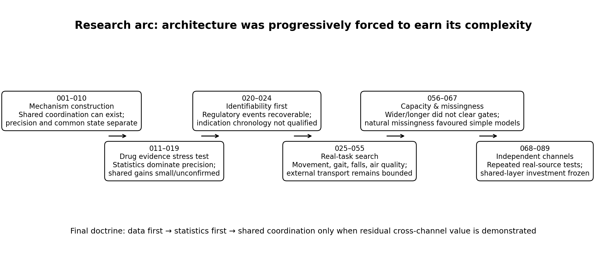

Figure 01. Research sequence across EXP001–089. This is a conceptual map of the reported experimental stages and their final interpretation; it is not a pooled estimate or a common validation sample.

## The modelling architecture

The project began with a higher coordination layer above separately learned mechanisms. The experiments produced a conditional architecture whose components are selected from measured data structure:

- Native data are first represented in their own observation geometry and measurement semantics.

- Within a data channel, conventional or domain-specific statistical experts are compared with grouped out-of-fold risk; a Stat-MoE is used only when that mixture earns its complexity.

- Calibrated channel states may then enter a shared recurrent ganglion when the scientific task contains genuinely different evidence channels with residual common structure.

- Task-specific precision models remain outside the common mechanism so that local accuracy does not force rewrites of shared state.

- Reality state is updated by observations that actually arrive. Model predictions are not promoted to new observations by default.

This layered separation is the durable technical output. The later experiments changed the default activation policy: the shared layer must now be earned by real incremental evidence rather than assumed because heterogeneous inputs exist.

## Mechanism construction in Experiments 001 to 010

The first ten experiments established that shared coordination is computationally possible and experimentally inspectable. These experiments should be read as mechanism work, not as evidence that the same architecture is automatically useful in every real predictive task.

Table 02. Mechanism construction in Experiments 001 to 010. Programme synthesis from EXP001–089; experiment-specific evidence boundaries are stated in each row.

| **Experiments** | **Durable mechanism result**                                                                                                                                                                                                  |
|-----------------|-------------------------------------------------------------------------------------------------------------------------------------------------------------------------------------------------------------------------------|
| 001             | Several learned local mechanisms can constrain a higher shared family; geometry-aware starts and coupled updates exposed the representation change.                                                                           |
| 002–004         | Same-world correspondence, not parameter sharing alone, reorganised heterogeneous observations into mutually usable internal coordinates; the effect replicated on a real pathology measurement table.                        |
| 005–006         | Stable measurement mechanism, fast channel state and shared reality state were separated; rewriting a whole model for transient drift was inferior to local state adaptation in the tested construction.                      |
| 007–008         | A single-use matrix was absorbable by surrounding networks; repeated recurrent use created a distinct role. Same-time evidence was made order-invariant while genuinely different times remained ordered.                     |
| 009–010         | Mixed evidence formed a common ganglion early, while later precision was better handled by local branches. Freezing the common core could preserve cross-data ability while local precision recovered specialist performance. |

Terminal interpretation: these experiments justify keeping a shared coordination mechanism in the toolbox. They do not justify turning it on by default in a new domain.

## Evidence modelling in Experiments 011 to 024

The drug-development branch was the first serious attempt to force the architecture into a real scientific evidence task. It also produced the clearest correction to the early neural emphasis.

Table 03. Evidence modelling in Experiments 011 to 024. Programme synthesis from EXP001–089; experiment-specific evidence boundaries are stated in each row.

| **Experiment(s)** | **What the real-data branch established**                                                                                                                                                                                                       |
|-------------------|-------------------------------------------------------------------------------------------------------------------------------------------------------------------------------------------------------------------------------------------------|
| 011               | On 26,278 Open Targets × ChEMBL target–disease pairs, a pairwise polynomial statistical model was the strongest standalone precision model; the ganglion approached it but showed seed variance.                                                |
| 012–015           | Statistics moved inside the architecture. Channel calibration reduced neural variance; a statistical model could act as a derived observer; neural committee routing did not help; direct OOF statistical routing was better and interpretable. |
| 016               | The system was mapped to 18 native Open Targets evidence pipelines with explicit provenance, ontology bridging and per-pipeline statistical routing interfaces.                                                                                 |
| 017               | Six native sources were trained. The validation-selected ganglion had test log-loss 0.194880 versus native Stat-MoE 0.196240, but the paired target 95% interval crossed zero.                                                                  |
| 018–019           | Source support, rather than architecture preference, controlled expansion. Only Cancer Gene Census passed the fixed support gate; frozen 6→7 onboarding changed test log-loss 0.194880→0.194580, again with an interval crossing zero.          |
| 020–024           | Historical drug outcome identification failed before modelling. A source-semantic regulatory event layer was eventually recovered in EXP022, but indication-specific event reconstruction remained unqualified in EXP023–024.                   |

Terminal interpretation: the drug branch supports the statistical-within-channel architecture and disciplined source qualification. It does not support a claim of prospective drug-development prediction or a confirmed shared-core advantage.

## Real task comparisons in Experiments 025 to 055

After the drug chronology boundary was reached, the programme searched for real tasks where additional channels could change a decision. The search included person-level movement and gait datasets, wearable and fall-related data, and environmental monitoring. The main contribution of this stage was not a new universal model; it was repeated separation of source qualification, development value, external compatibility and confirmation.

Table 04. Real task comparisons in Experiments 025 to 055. Programme synthesis from EXP001–089; experiment-specific evidence boundaries are stated in each row.

| **Route**                             | **Final interpretation**                                                                                                                                                                                   |
|---------------------------------------|------------------------------------------------------------------------------------------------------------------------------------------------------------------------------------------------------------|
| PADS / gait / MyGait                  | Real person-level multimodal signals were found, but direct external same-task confirmation was not established. Development signals remained bounded and were not relabelled as validated PD classifiers. |
| NHANES mortality audit                | Public follow-up time provenance was not adequate for an unaltered survival clock, so the line stopped before a survival model.                                                                            |
| Beijing PM2.5, EXP048                 | The clearest retained real-task model: an ordinary single-station ridge improved MAE over persistence by about 10.0%–22.3% across four fixed same-source time/station domains.                             |
| Cross-station / cross-city follow-ups | Extra same-time station information was below its practical gate; direct coefficient transport to a separate four-city source was not stable.                                                              |

EXP048 matters because it demonstrates the programme’s intended behaviour: when a simple statistical model clears predeclared real-data gates, keep it. Architectural sophistication is not a reward in itself.

## Capacity missingness and transport in Experiments 056 to 067

The hypothesis that the shared model might simply be too small was tested directly. EXP057 compared matched 16D and 32D configurations. Expanding only the core was worse in all three seeds; expanding interfaces and core produced a median validation log-loss gain of only 0.000239, below the fixed practical threshold. EXP058 extended the unchanged 16D model to a 4,000-epoch budget; median gain beyond 2,000 epochs was only 0.00002547 and no seed met the individual practical threshold.

These are stop-loss results, not a theorem that wider models never help. The correct terminal statement is narrower: the tested data, architectures and budgets did not justify more capacity, and the already viewed test was not reused to rescue the hypothesis.

The subsequent natural-missingness air-quality programme again favoured bounded statistical comparators. Local weather helped some same-station conditions but did not preserve a joint gain across held-out stations; London transport failed badly; later local adaptation did not clear the frozen 2025 gate. These results further weakened the case for activating a shared core on those tasks.

## Additional channel tests in Experiments 068 to 089

The final stage deliberately searched across real people, households, power zones, traffic, gas trials and CO exposure events for a setting in which extra contemporaneous channels had stable decision value.

Table 05. Additional channel tests in Experiments 068 to 089. Programme synthesis from EXP001–089; experiment-specific evidence boundaries are stated in each row.

| **Real route**                   | **Observed result and boundary**                                                                                                                                                                                |
|----------------------------------|-----------------------------------------------------------------------------------------------------------------------------------------------------------------------------------------------------------------|
| UCI HAR / WISDM                  | Combined inertial channels did not clear the fixed development value gates; external person-level tests remained unscored when development failed.                                                              |
| Household / submeter electricity | Additional channels did not clear the development gates for next-hour continuous or top-decile event outcomes; conditional future tests were left unopened.                                                     |
| Tetouan three-zone electricity   | Weather helped Zones 1 and 2 later, but Zone 3 worsened 10.561%, triggering the frozen overall stop. No peer-zone or joint arm earned selection.                                                                |
| I-94 traffic + weather           | Development MAE improved only 0.199%; interval crossed zero; 2018 remained unscored.                                                                                                                            |
| UCI309 gas trials, EXP085        | Eight sensors materially improved probability log-loss on independent held-out trials (0.931620→0.605626), but balanced accuracy was identical at 0.541667; the predeclared overall gain gate therefore failed. |
| UCI487 CO events, EXP088         | Fourteen sensors reduced development day-equal MAE 0.327732→0.286666 ppm (12.530%) and improved 9/10 concentration levels, but only 2/3 development days improved; later days were not scored.                  |

The last two cases are especially important. They show that real multichannel information can exist without qualifying the shared architecture: better probability quality is not automatically better hard decisions, and better mean error is not automatically stable across days.

## Final model choice

Task-specific statistical baselines remain the selected models for the current real tasks. The shared mechanism and its checkpoints are retained; further shared-layer expansion on these tasks is dormant.

EXP089 is the terminal engineering decision for the current evidence base. The real-task programme contains no case in which an added multichannel/shared architecture completed its own frozen downstream gate and directly established a Shared Ganglion advantage over the appropriate statistical comparator. The tested capacity expansions and longer training also failed their practical development gates. Therefore the rational allocation is to keep task-specific statistical baselines and stop expanding the shared core on these datasets.

This verdict is deliberately not universal. It does not diagnose that the ganglion is too small, prove that sharing fails in all domains, invalidate the mechanism experiments, or justify deleting the architecture. It says only that the current real tasks have not earned further shared-layer investment.

## Conditions for using the shared layer

Table 06. Conditions for using the shared layer. Programme synthesis from EXP001–089; experiment-specific evidence boundaries are stated in each row.

| **Reactivation condition** | **Required evidence**                                                                                                                               |
|----------------------------|-----------------------------------------------------------------------------------------------------------------------------------------------------|
| New observation unit       | A genuinely new, scientifically coherent unit—not a re-slicing of an already viewed test set.                                                       |
| Independent outcome        | Outcome labels or later time states not used in source selection, model design or previous confirmation.                                            |
| Qualified channel value    | At least one additional native channel must demonstrate stable incremental value beyond the appropriate narrow statistical baseline.                |
| Cross-domain need          | The task must require coordination across genuinely different residual information, not merely duplicate or correlated versions of the same signal. |
| Predeclared decision gate  | Magnitude, uncertainty and stability requirements fixed before the held-out result is viewed.                                                       |
| No capacity guessing       | A failed shared model does not authorize arbitrary width/epoch escalation; capacity changes require their own development evidence.                 |

Until these conditions exist, the default operational stack is: native data → appropriate statistics → optional statistical mixture → calibrated task output. Shared coordination remains dormant.

## Methodological conclusions

- Use a mathematical or statistical model when it adequately solves the measured problem.

- Evaluate source qualification, model value, development value, confirmation, probability quality, decision quality, average gain and stability as separate questions.

- Test capacity directly before using it to explain model performance.

- Keep observations, predictions and missingness distinct in the data model.

- Retain computational structures when their measured contribution justifies their cost.

The programme establishes a reproducible procedure for deciding when shared modelling is warranted. Its current decision combines a retained coordination mechanism with task-specific statistical model selection.

## Experimental record

The sections below retain the experimental sequence. Interpretations written at earlier stages describe the evidence then available; the programme synthesis gives the final model-selection decision after EXP089. All 89 identifiers are mapped in EVIDENCE_INDEX.md. EXP001–016 are supported by their recovered individual evidence packages; EXP017–089 by the consolidated research records.

## Experiment 001 Internal coordination of learned mechanisms

Experiment 001 examines a higher internal layer whose learning targets are the functions already learned by several small models. Seven local models each learned three parameters at different states of one controlled system. Their learned functions then jointly constrained a shared mechanism with one internal background coordinate per local model.

The curved coordination layer matched all seven local functions in 30 of 30 noiseless runs initialized from the local models' statistical geometry. Its median first simultaneous pass occurred after three internal updates. The linear layer reached an independently verified residual floor of 0.122899 RMSE. In the recorded trajectory, curvature appeared in the first update and the parameter Jacobian rank rose from 13 to 14.

### Questions and observed evidence

Table 07. Questions and observed evidence. EXP001; values and conditions follow the methods in this section.

| **Question**                                                  | **Observed evidence**                                                                                                                                                                  |
|---------------------------------------------------------------|----------------------------------------------------------------------------------------------------------------------------------------------------------------------------------------|
| Can learned local mechanisms become a shared learning target? | Seven learned functions jointly trained the higher layer; the inferred state correlated 1.000 with the hidden simulator state after affine alignment in the successful noiseless runs. |
| Where does the added capacity act?                            | Three shared curvature weights activated a curved mechanism family. The seven local parameter vectors expanded from rank one to rank two.                                              |
| How does initialization affect coordination?                  | All seven targets passed in 30/30 geometry starts and 11/30 random starts under the same 80-step coupled update budget.                                                                |
| What happens to noisy local learning?                         | The coordinated functions improved clean-output RMSE in 30/30 noise realizations. Median paired improvement was 17.24%, with a bootstrap 95% interval of 13.26% to 19.52%.             |

Evidence scope: a prescribed family of small polynomial-neuron models, an internally inferred background coordinate, and exact numerical access to every parameter and derivative. The simulator supplies a separate audit of the learned shared structure.

### Seven local models of one system

Each local model receives the same 17 input values from −1 to 1 and learns its own three output connections. Its fixed input neurons compute a constant, x, and x squared. The local function is:

$$f_{i}(x)\  = \ a_{i}\  + \ b_{i}x\  + \ c_{i}x^{2}$$

The seven datasets come from one mechanism observed at seven equally spaced hidden states from −1 to 1. For each state s, the three local coefficients follow a common curved family:

$$\theta(s)\  = \ \mu\  + \ vs\  + \ ws^{2}$$

Table 08. Seven local models of one system. EXP001; values and conditions follow the methods in this section.

| **Coefficient** | **Common offset μ** | **Linear change v** | **Curved change w** |
|-----------------|---------------------|---------------------|---------------------|
| a               | 0.25                | 0.7                 | 0.4                 |
| b               | 0.8                 | -0.25               | 0.35                |
| c               | -0.2                | 0.45                | -0.55               |

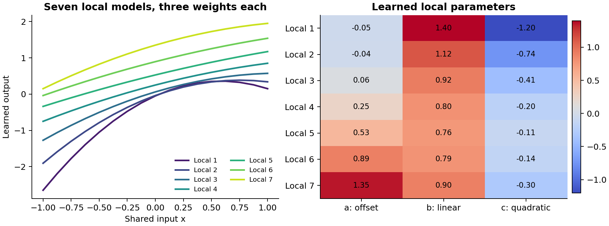

Figure 02. EXP001. Seven separately trained local models and their learned coefficient vectors. The plotted run uses noiseless observations and seed 0.

Local training used 500 gradient updates. Its result agreed with the exact three-parameter least-squares solution to an absolute coefficient tolerance of 10⁻⁸. The local targets were then frozen. The higher layer received these learned functions evaluated at the same 17 input values; hidden state labels and clean simulator outputs were reserved for the audit.

### The higher coordination layer

The higher layer generates the executable weights of every local model. It stores a common offset vector, a common direction vector, and, in the curved candidate, a common curvature vector. Each local model has its own adjustable scalar background state z. The curved map is:

$$\theta_{i}\  = \ \mu\  + \ vz_{i}\  + \ w{z_{i}}^{2}$$

Table 09. The higher coordination layer. EXP001; values and conditions follow the methods in this section.

| **Candidate**             | **Shared weights**     | **Internal states** | **Stored variables** |
|---------------------------|------------------------|---------------------|----------------------|
| Common constant reference | 3                      | 0                   | 3                    |
| Shared line               | 6                      | 7                   | 13                   |
| Shared curve              | 9                      | 7                   | 16                   |
| Independent local targets | 21 frozen coefficients | 0                   | 21 stored targets    |

The line and curve use one internal background coordinate. Their local mechanism clouds can occupy one and two linear directions, respectively. A one-dimensional curved family therefore carries two covariance directions in the three-dimensional coefficient space.

The state coordinates are centered and scaled to unit standard deviation after each update. The shared weights are transformed at the same time, preserving every generated local function exactly. This fixes two redundant coordinate freedoms; the line and curve have 11 and 14 effective continuous variables.

Two initializations were compared. The geometry start takes the first principal coordinate of the learned local coefficient cloud, adds a seeded perturbation, and normalizes it. The random start uses independent normal state values. Both start with zero curvature weights. Geometry initialization already organized the noiseless local states with median absolute correlation 0.9891 to the hidden simulator state; its initial function RMSE was 0.4747.

### Internal updates

Every update uses the residual vector from all 119 local target values and the complete Jacobian with respect to the shared weights and internal states. The coupled rule solves a damped, linearized system:

$$(\frac{J^{\mathsf{T}}J}{N}\  + \ \lambda I)\ \Delta p\  = \  - \frac{J^{\mathsf{T}}r}{N}$$

Here N is 119 and damping λ is 0.001. The ordinary joint-gradient control uses the same residuals, variables and initial state, with update −0.22 Jᵀr/N. Both rules cap the update norm at 1.0. These are fixed numerical update rules; the targets stay fixed throughout coordination.

### Simultaneous fit and convergence

The main comparison used 80 internal updates, two noise levels, two initializations, two mechanism families, two update rules and 30 seeds, giving 480 higher-layer fits. A simultaneous pass required every one of the seven local function RMSEs to be at most 0.01. All local targets contributed on every update.

Table 10. Simultaneous fit and convergence. EXP001; values and conditions follow the methods in this section.

| **Noiseless geometry start** | **Median target RMSE** | **All seven pass** |
|------------------------------|------------------------|--------------------|
| Line with joint gradient     | 0.131592               | 0/30               |
| Line with coupled update     | 0.122899               | 0/30               |
| Curve with joint gradient    | 0.052146               | 0/30               |
| Curve with coupled update    | 1.10 × 10⁻¹⁶           | 30/30              |

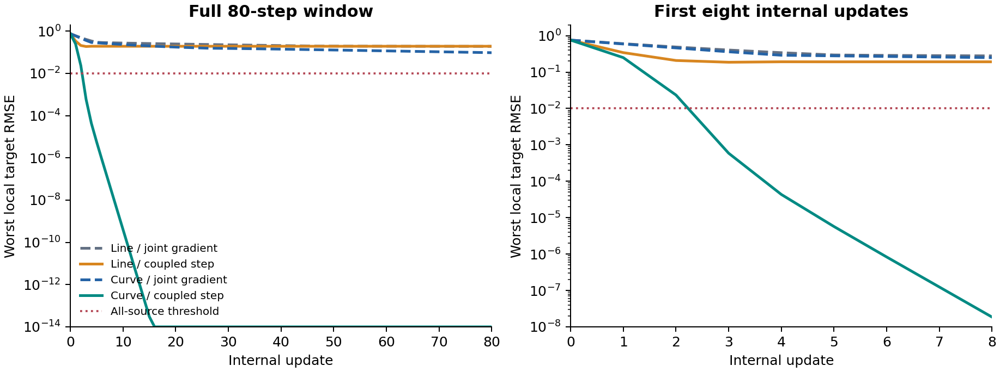

Figure 03. EXP001. Worst local target error during the recorded seed 0 run. The dotted line marks the predetermined per-local-model tolerance of 0.01.

The best possible shared-line fit was also computed directly as a rank-one approximation in function space. The coupled line solution agreed with that optimum within 9.72 × 10⁻¹⁷ RMSE across all 60 datasets. Its remaining error therefore locates a representation requirement: these local functions lie on a curve.

A follow-up used seeds 0 to 9 and longer budgets. With geometry initialization, both update rules achieved 10/10 simultaneous passes. The median first pass was 3 updates for the coupled rule and 458 for ordinary joint gradient. The final median target RMSEs were 1.09 × 10⁻¹⁶ and 6.62 × 10⁻⁵, respectively. Update counts describe convergence; each coupled update additionally solves a 16-variable linear system.

### Where the internal mechanism changes

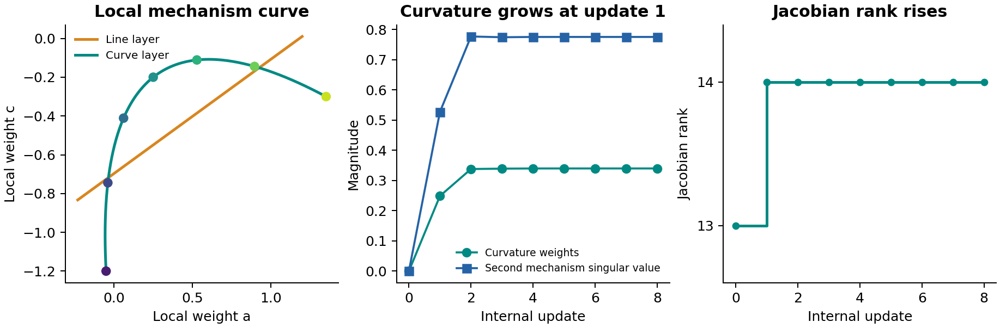

Figure 04. EXP001. Left: the generated mechanism family projected onto two local weights. Center: emergence of curvature and a second mechanism direction. Right: the parameter Jacobian rank. All panels use the recorded noiseless geometry-start seed 0.

Table 11. Where the internal mechanism changes. EXP001; values and conditions follow the methods in this section.

| **Update** | **Target RMSE** | **Worst local RMSE** | **Curvature norm** | **Jacobian rank** |
|------------|-----------------|----------------------|--------------------|-------------------|
| 0          | 0.463047        | 0.756676             | 0                  | 13                |
| 1          | 0.154708        | 0.249860             | 0.248804           | 14                |
| 2          | 0.016134        | 0.023455             | 0.338013           | 14                |
| 3          | 0.000407        | 0.000590             | 0.339294           | 14                |
| 5          | 0.00000464      | 0.00000570           | 0.339931           | 14                |

At initialization, all seven generated coefficient vectors occupy a line. The first coupled update makes the shared curvature vector nonzero. The second singular value of the centered coefficient cloud rises from numerical zero to 0.527297 and settles near 0.775295. The same update increases the Jacobian rank from 13 to 14, using the threshold 10⁻⁸ on eigenvalues of JᵀJ/N.

The observable change is therefore localized to the common curvature weights and their coupling to the seven internal background states. The generated weights of the local models move together as the common family changes shape. By update 3, every local function in this trace satisfies the target tolerance.

The coefficient-cloud rank describes the linear span of the curved mechanism. The fitted background still uses one coordinate. Recording both quantities keeps background dimension, parameter identifiability and visible covariance geometry distinct.

Analytical Jacobians were checked against central finite differences. The maximum error was 1.40 × 10⁻¹⁰. Coordinate normalization preserved generated coefficients to within 2.23 × 10⁻¹⁶. Full shared-weight, internal-state, per-target error and curvature-spectrum trajectories are included for seed 0 in every main condition.

### Initialization and noisy local learning

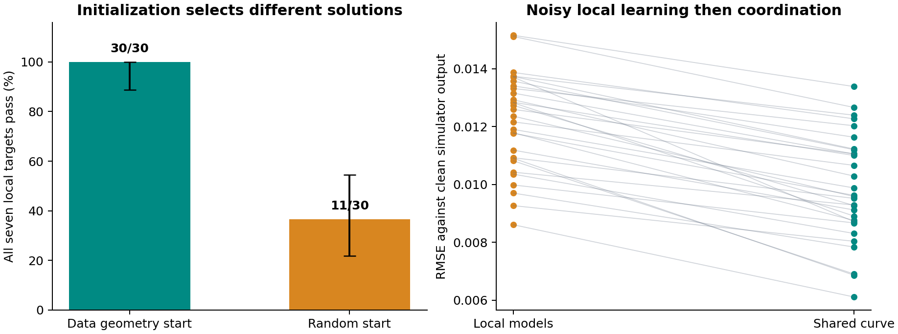

Figure 05. EXP001. Left: noiseless simultaneous-pass rates with Wilson 95% intervals. Right: paired clean-output errors before and after coordination in 30 datasets with observation-noise standard deviation 0.03.

At the 80-update budget, the curved coupled model passed all seven noiseless local targets in 30/30 geometry starts and 11/30 random starts. Their Wilson 95% intervals were 88.65% to 100% and 21.87% to 54.49%. Successful noiseless curve fits aligned with the hidden state with absolute correlation 1.000. The initialization comparison identifies the organization of local mechanisms as a consequential part of the process.

The extended random-start follow-up reached simultaneous tolerance in 3/10 coupled runs at 800 updates and 1/10 ordinary-gradient runs at 4000 updates. These are the first ten seeds from the main experiment. Different starting organizations can settle into different configurations even with additional internal updates.

For noisy observations, the frozen local functions carry their own estimation errors. With geometry initialization, the curved coupled layer had median target RMSE 0.006650 and median worst-local target RMSE 0.010586. Eleven of thirty runs met the same strict simultaneous tolerance of 0.01.

The independent clean-output audit showed improvement in every noisy dataset. The median per-run relative RMSE improvement was 17.24%, with a percentile bootstrap 95% interval of 13.26% to 19.52% over 20,000 paired resamples. Median clean-output RMSE was 0.012474 for the local teachers and 0.009600 for the coordinated functions. These two medians and the median paired relative improvement are separate summaries.

This result supports shared-structure denoising within the specified mechanism family. The higher layer was fitted to the learned local functions. The clean simulator outputs and hidden states entered the audit after fitting.

### Complete main experiment results

Each row contains 30 runs. Target error is the RMSE against the frozen local functions. Worst error is the largest of the seven local RMSEs. Geometry and random refer to the initialization of the internal background states.

Table 12. Complete main experiment results. EXP001; values and conditions follow the methods in this section.

| **Noise** | **Start** | **Family** | **Update** | **Target RMSE** | **Worst RMSE** | **Pass** |
|-----------|-----------|------------|------------|-----------------|----------------|----------|
| 0.00      | Geom      | Line       | Coupled    | 0.122899        | 0.191743       | 0/30     |
| 0.00      | Geom      | Line       | Joint GD   | 0.131592        | 0.192141       | 0/30     |
| 0.00      | Geom      | Curve      | Coupled    | 1.10e-16        | 1.91e-16       | 30/30    |
| 0.00      | Geom      | Curve      | Joint GD   | 0.052146        | 0.075591       | 0/30     |
| 0.00      | Random    | Line       | Coupled    | 0.122899        | 0.191743       | 0/30     |
| 0.00      | Random    | Line       | Joint GD   | 0.492645        | 0.822391       | 0/30     |
| 0.00      | Random    | Curve      | Coupled    | 0.105859        | 0.160508       | 11/30    |
| 0.00      | Random    | Curve      | Joint GD   | 0.269217        | 0.461805       | 0/30     |
| 0.03      | Geom      | Line       | Coupled    | 0.123723        | 0.193508       | 0/30     |
| 0.03      | Geom      | Line       | Joint GD   | 0.133069        | 0.193927       | 0/30     |
| 0.03      | Geom      | Curve      | Coupled    | 0.006650        | 0.010586       | 11/30    |
| 0.03      | Geom      | Curve      | Joint GD   | 0.052516        | 0.077523       | 0/30     |
| 0.03      | Random    | Line       | Coupled    | 0.123723        | 0.193508       | 0/30     |
| 0.03      | Random    | Line       | Joint GD   | 0.494042        | 0.823294       | 0/30     |
| 0.03      | Random    | Curve      | Coupled    | 0.099479        | 0.160017       | 6/30     |
| 0.03      | Random    | Curve      | Joint GD   | 0.271152        | 0.457723       | 0/30     |

Noise 0 uses identical underlying local functions across seeds and varies initialization. Noise 0.03 varies observation noise and initialization together. The pass intervals summarize these controlled simulation runs; the bootstrap interval summarizes variation across the thirty noisy realizations.

### What this experiment establishes

A higher layer can use several separately learned local mechanisms as its targets, infer a common internal coordinate, and change executable local parameters through a shared curved map. The added curvature freedom accounts for the representation change. The coupled update changes the speed of reaching a joint fit. Initialization changes which configurations are reached.

The measured evidence covers seven local models within a known polynomial feature family. The hidden background positions are inferred from the learned local mechanisms. The shared curve family is supplied as a candidate architecture, which makes parameter-level changes directly interpretable.

### Reproduction

The evidence package contains the exact implementation, generated observations, learned local targets, final higher-layer parameters, diagnostic trajectories, numerical summaries and figures. The main experiment uses 60 seven-model training configurations and 480 higher-layer fits. The budget extension adds 40 higher-layer fits.

Table 13. Reproduction. EXP001; values and conditions follow the methods in this section.

| **File or directory**          | **Contents**                                                                                                        |
|--------------------------------|---------------------------------------------------------------------------------------------------------------------|
| code/experiment.py             | Simulator, local training, shared line and curve networks, internal updates, derivative checks and main experiment. |
| code/controls.py               | Longer-budget follow-up, exact shared-line reference and initialization audit.                                      |
| code/analyze.py                | Summary statistics, paired bootstrap and all four figures.                                                          |
| protocol.json                  | Main fixed settings, seeds, noise levels and pass tolerance.                                                        |
| data/all_experiment_arrays.npz | Observations, frozen local coefficients, audit quantities and final fitted parameter vectors.                       |
| results/                       | Per-run metrics, complete group summaries, parameter trajectories and numerical verification.                       |
| manifest.json                  | SHA256 digest and byte count for every packaged file.                                                               |

Reproduction order: run experiment.py, controls.py and analyze.py with Python 3, NumPy, pandas and Matplotlib. The report builder additionally uses python-docx. The README gives the exact commands. Simulator-only arrays are labeled with audit_only in the archive.

## Experiment 002 Heterogeneous Reality Binding

**One internal reality, three deliberately different observation surfaces**

Experiment 002 asks whether one small system can reorganize three heterogeneous observation pathways around a shared internal reality when all three are generated by the same hidden simulator mechanism. The training signal never exposes the simulator state. Instead, each observed modality must generate the consequences seen by the other modalities for the same world state.

The experiment begins with a traditional self-generation phase in which each observation pathway only reconstructs its own surface. Without resetting parameters, the objective is then switched to reality binding: any one observed surface must generate all three same-world surfaces. This makes the learning history visible while allowing the common-world constraints to reorganize the existing system.

Table 14. Experiment 002 Heterogeneous Reality Binding. EXP002; values and conditions follow the methods in this section.

| **Question**                                                           | **Observed evidence**                                                                                                                                                                                                                                         |
|------------------------------------------------------------------------|---------------------------------------------------------------------------------------------------------------------------------------------------------------------------------------------------------------------------------------------------------------|
| Can different observation formats be bound to one internal coordinate? | Direct reality binding passed the fixed joint criterion in 5/5 seeds; median cross-modal test RMSE was 0.0463 and median normalized same-scene representation distance was 0.2259.                                                                            |
| Can a previously separated internal organization be reorganized?       | After 180 self-only updates, switching the same parameters to reality binding passed in 5/5 seeds; median cross-modal RMSE was 0.0594 and internal distance 0.2116.                                                                                           |
| Is shared parameterization alone sufficient?                           | No. Self-only training had median cross-modal RMSE 0.4753 and internal distance 1.5067; shuffled world pairing had 0.2935 and 1.2483.                                                                                                                         |
| Where does the first reorganization occur?                             | Across five seeds, the first binding update produced median parameter displacement 0.3808 in encoders, 0.0539 in decoders, and 0.0446 in the shared triangle core.                                                                                            |
| Which plasticity is required?                                          | Freezing the triangle core retained binding in 4/5 seeds at the matched budget and the fifth crossed the alignment threshold with a longer budget. Freezing encoders, freezing decoders, or allowing only the core to move did not reach the joint criterion. |

**Evidence scope.** Controlled simulator with 128 training worlds, 64 held-out worlds, three observation formats, five final-batch seeds and exact access to every model parameter. The hidden simulator coordinates are reserved for post-training audit.

### One hidden mechanism, three unlike observations

Each world is generated from two hidden simulator variables u and v. The simulator expands them into q = \[u, v, uv\]. The model never receives q. Three observation systems expose different consequences of the same q:

Table 15. One hidden mechanism, three unlike observations. EXP002; values and conditions follow the methods in this section.

| **Observer** | **Generated surface**                          | **Native representation**      |
|--------------|------------------------------------------------|--------------------------------|
| A            | Affine response of q                           | Three continuous values        |
| B            | Softmax response of q                          | Three-class probability vector |
| C            | Sigmoid response of q over fixed spatial bases | 4 × 4 intensity image          |

The three surfaces therefore share a complete generative cause while differing in shape, scale and output rule. Correct scene correspondence is the only training link that states that the observations belong to the same world.

### Small coordinated system

The system contains three modality-specific input encoders, one shared three-node triangle core, and three modality-specific output maps. All three encoders project into the same three-dimensional core; every core state can be decoded into A, B or C. No unit is assigned a semantic simulator variable and no loss aligns the internal state directly to q.

Table 16. Small coordinated system. EXP002; values and conditions follow the methods in this section.

| **Component**  | **Structure**                                                       | **Role in the experiment**                                              |
|----------------|---------------------------------------------------------------------|-------------------------------------------------------------------------|
| A encoder      | 3 → 10 → 3                                                          | Maps continuous observation into the shared coordinate                  |
| B encoder      | 3 → 10 → 3                                                          | Maps probability observation into the shared coordinate                 |
| C encoder      | 16 → 18 → 3                                                         | Maps image observation into the shared coordinate                       |
| Triangle core  | Three nonlinear nodes with six directed cross-edges plus self gains | Provides the common internal coordinate used by every observation route |
| A/B/C decoders | Shared-coordinate → native output surface                           | Render the common internal state back into each observer’s native world |

### Training regimes and controls

All final-batch conditions use the same simulator, held-out worlds, architecture and Adam learning rate 0.015. The main joint acceptance criterion was fixed for the final five-seed batch after pilot tuning: mean cross-modal held-out RMSE ≤ 0.08 and normalized same-scene internal representation distance ≤ 0.40.

Table 17. Training regimes and controls. EXP002; values and conditions follow the methods in this section.

| **Condition**          | **Schedule**                                        | **What is allowed to teach the system**                                                   |
|------------------------|-----------------------------------------------------|-------------------------------------------------------------------------------------------|
| Self only              | 180 self-generation updates                         | Each observed surface reconstructs itself only.                                           |
| Direct reality binding | 550 binding updates                                 | Any observed surface must generate A, B and C from the same world.                        |
| Self → binding         | 180 self updates + 700 binding updates              | Existing self-trained parameters are retained and reorganized by same-world consequences. |
| Shuffled worlds        | 180 self updates + 700 shuffled binding updates     | Cross-observer targets come from different worlds; self targets remain intact.            |
| Freeze controls        | Self → binding with selected parameter blocks fixed | Locates the plasticity used to achieve binding.                                           |

### Main result: reality binding creates a shared internal world

Table 18. Main result: reality binding creates a shared internal world. EXP002; values and conditions follow the methods in this section.

| **Condition**          | **Pass** | **Median cross RMSE** | **Median internal distance** | **Median audit R²** |
|------------------------|----------|-----------------------|------------------------------|---------------------|
| Self only              | 0/5      | 0.4753                | 1.5067                       | 0.9190              |
| Direct reality binding | 5/5      | 0.0463                | 0.2259                       | 0.9857              |
| Self → binding         | 5/5      | 0.0594                | 0.2116                       | 0.9811              |
| Shuffled worlds        | 0/5      | 0.2935                | 1.2483                       | 0.8317              |

Traditional self-generation learned each observation surface well while leaving the observation pathways in different internal coordinates. Direct same-world binding reduced the median cross-observer generation error by roughly one order of magnitude relative to self-only training and simultaneously collapsed same-scene internal representations into the same region.

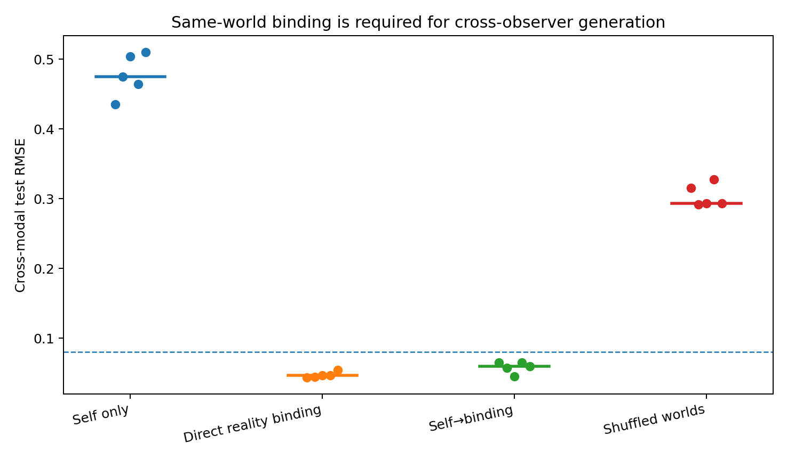

Figure 06. EXP002. Held-out cross-modal generation across the four main conditions. Points are five independent model seeds; horizontal segments mark medians. The dashed line is the final-batch cross-generation criterion.

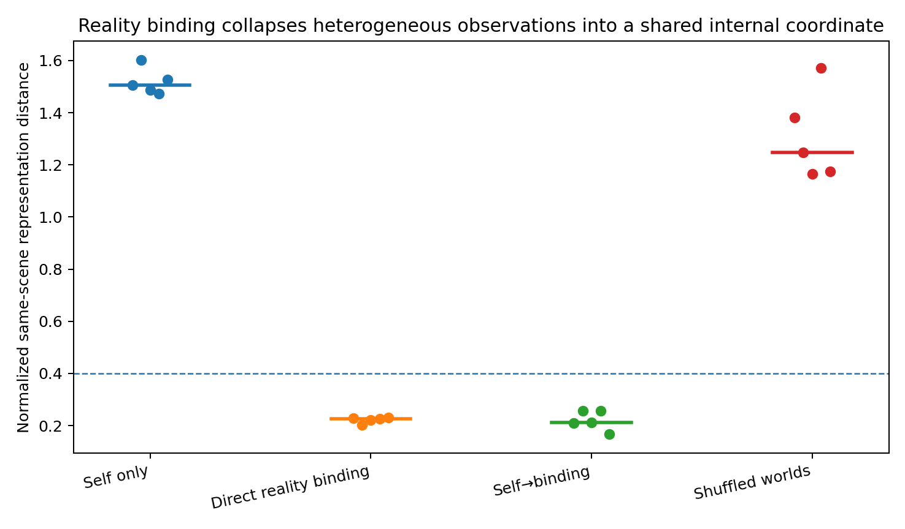

Figure 07. EXP002. Normalized distance among the three internal representations of the same held-out world. Same-world binding, rather than parameter sharing alone, produces the shared coordinate.

### Traditional self-generation learns the world information in incompatible coordinates

Post-training audit against the hidden simulator state clarifies the difference. Under self-only training, the three observation pathways individually retained substantial information about q: median linear audit R² values across five seeds were 0.938 for A, 0.808 for B and 0.978 for C. Yet their same-scene internal distance remained 1.507 and cross-generation remained poor. The failure was therefore not a simple absence of world information. The information existed in different internal coordinate systems.

Reality binding changes the requirement. The same internal state must now be usable by all three output maps. Direct binding retained high per-source audit R² while making the representations mutually compatible. This is the measured sense in which three unlike learned surfaces become one internal reality in this prototype.

### Reorganization after the objective switch

Seed 0 provides a complete parameter trajectory. Immediately before the switch, held-out cross-modal RMSE was 0.4355 and normalized same-scene internal distance was 1.5067. After a single binding update these became 0.3988 and 1.4436. By update 10 they were 0.2181 and 0.7701; by update 100 they were 0.0805 and 0.2153. The final 700-update values were 0.0650 and 0.2106.

Self-generation error temporarily rose during early reorganization and later recovered. The system therefore did not merely append a cross-modal readout onto a frozen self-trained organization. It moved through a transient configuration while rebuilding how the three observation routes occupied the shared coordinate.

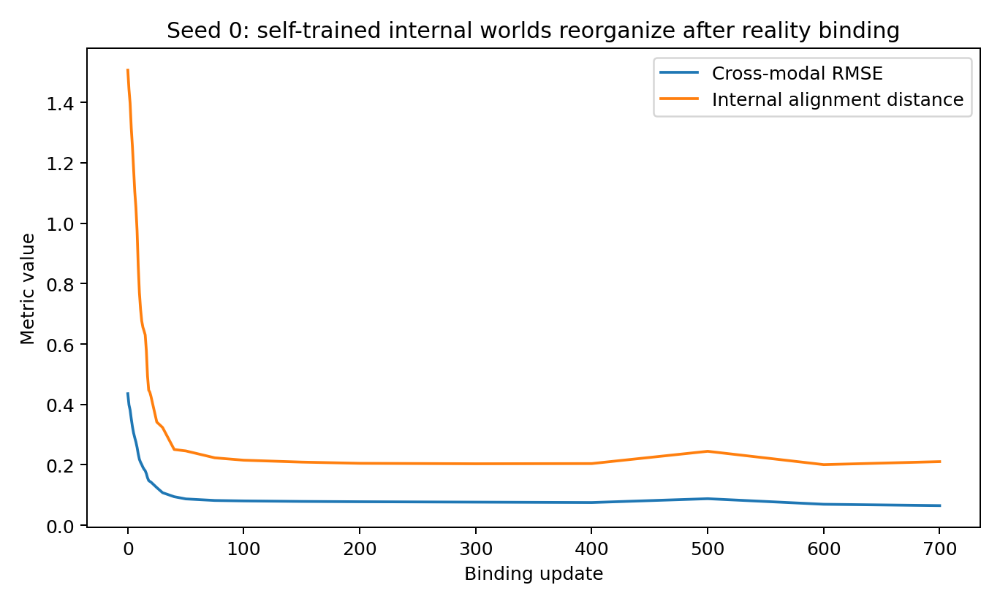

Figure 08. EXP002. Seed 0 after the switch from self-generation to reality binding. Existing observation-specific internal worlds collapse toward a common coordinate while cross-observer generation improves.

### The first internal change is concentrated at the observation interfaces

Across five seeds, the first binding update had median parameter displacement 0.3808 in the encoders, 0.0539 in the decoders and 0.0446 in the triangle core. Cross-modal held-out RMSE improved on that first update in all five seeds. Four of five seeds also immediately reduced same-scene internal distance; the remaining seed began its distance reduction on subsequent updates.

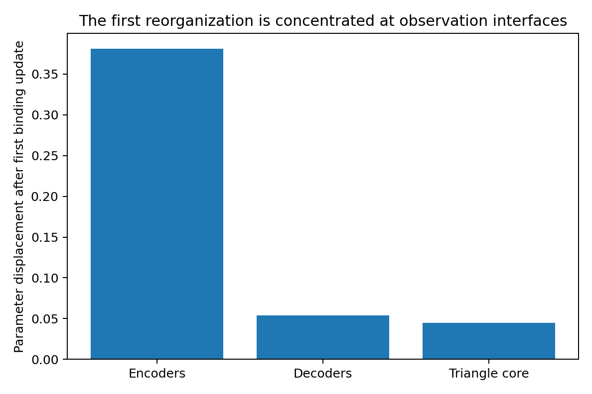

Figure 09. EXP002. Parameter displacement on the first reality-binding update, summarized by the median across five seeds. The earliest reorganization is dominated by the mappings from heterogeneous observations into the shared coordinate.

A detailed seed-0 diagnostic also records the three target-specific gradient directions acting on the shared core. Their pairwise cosine similarities change sign repeatedly during successful binding; they do not monotonically converge to a common direction. The observed coordination therefore occurs while local optimization pressures remain partly conflicting. The stable signal is geometric reorganization of the representations and interfaces, not disappearance of gradient conflict.

### Freeze controls locate the required plasticity

Table 19. Freeze controls locate the required plasticity. EXP002; values and conditions follow the methods in this section.

| **Plastic parameters during binding** | **Median cross RMSE** | **Median internal distance** | **Joint pass at 700 updates** |
|---------------------------------------|-----------------------|------------------------------|-------------------------------|
| All parameters                        | 0.0594                | 0.2116                       | 5/5                           |
| Encoders + decoders; core frozen      | 0.0435                | 0.2157                       | 4/5                           |
| Core + decoders; encoders frozen      | 0.2157                | 1.3523                       | 0/5                           |
| Encoders + core; decoders frozen      | 0.1918                | 0.2435                       | 0/5                           |
| Triangle core only                    | 0.2934                | 1.3166                       | 0/5                           |

The matched-budget core-frozen condition already achieved low cross-generation error. One seed ended just above the internal-distance threshold at 0.4168; with the same frozen core and a 1200-update binding budget it reached cross-modal RMSE 0.0448 and internal distance 0.3716. Core plasticity therefore accelerates some trajectories but is not the unique seat of coordination in this architecture.

Encoder plasticity has a different role. When the self-trained encoders are frozen, the system cannot rotate the heterogeneous observations into a mutually usable internal coordinate: median internal distance remains 1.3523 and cross-generation remains 0.2157. With decoders frozen, the encoders can make the internal states geometrically close, but the existing output maps cannot accurately render all three observation surfaces from that new coordinate. The coordinated solution uses both sides of the common internal state.

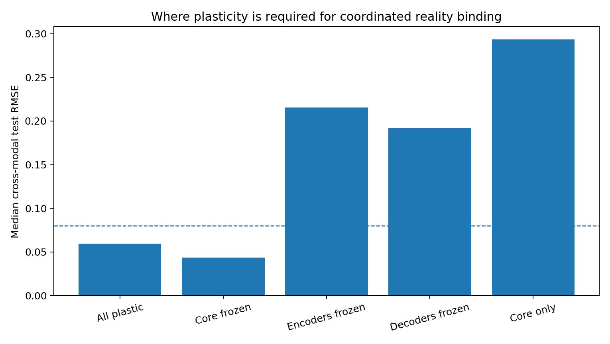

Figure 10. EXP002. Freeze controls after the self-generation phase. A fixed shared core can be coordinated around; fixed observation interfaces prevent accurate cross-observer closure.

### What Experiment 002 establishes

Three observation systems with different native outputs can be trained inside one small architecture so that any one observation produces a shared internal state capable of generating the other two. The common internal coordinate is learned from cross-observer consequence closure. It is not copied from the simulator state and it does not require the three observations to share a native representation.

The comparison with self-only learning is especially informative. Traditional generative learning can capture substantial information about the same hidden world separately in every pathway while still constructing incompatible internal coordinates. Reality binding adds a higher requirement: information learned through one observation must become executable through the generation rules of the others. Under that requirement, the previously separated internal organizations reorganize.

The shuffled-world control identifies the source of the constraint. Architecture sharing and identical optimization are retained while the factual correspondence among observers is broken. Binding then fails. In this controlled system, the pressure toward a common internal reality is supplied by the requirement that independently shaped observations remain mutually true of the same world.

### Evidence package and reproduction

The Experiment 002 evidence package contains the simulator and architecture code, final five-seed endpoint tables for eight conditions, the full seed-0 binding trajectory, first-update localization across five seeds, post-hoc simulator-state audits, complete pre/post parameter snapshots, figures, fixed protocol and SHA256 manifest. Audit-only simulator variables are explicitly labeled in the stored dataset.

Table 20. Evidence package and reproduction. EXP002; values and conditions follow the methods in this section.

| **Path**                                | **Contents**                                                                                       |
|-----------------------------------------|----------------------------------------------------------------------------------------------------|
| code/experiment.py                      | Simulator, heterogeneous encoders, triangle core, decoders, self and binding objectives.           |
| code/batch_conditions.py                | Final condition runner for the five-seed comparisons and freeze controls.                          |
| code/trace_seed0.py                     | Dense internal trajectory after the self→binding switch.                                           |
| results/all_runs.csv                    | Eight endpoint conditions × five seeds.                                                            |
| results/seed0_binding_trace.csv         | Cross-generation, internal alignment, audit R², gradient cosines and blockwise parameter movement. |
| results/first_binding_update_5seeds.csv | First-update localization across the five final seeds.                                             |
| results/seed0_parameters_pre_post.npz   | Complete model parameter snapshots immediately before binding and after 700 binding updates.       |
| data/reference_simulator_seed123.npz    | Train/test observations plus simulator-state arrays marked audit_only.                             |

## Experiment 003

**A 16 × 6 Common Core Across Natural Language and Code**

### Result in one paragraph

Six surface systems — English, Chinese, Japanese, Spanish, Python and JavaScript — described the same executable conditional function. **A single shared sequence generator** encoded every view through a 16-dimensional bottleneck and generated every requested surface from that bottleneck. No latent-alignment term was used. After Reality Binding, the median cross-view semantic-token accuracy reached **98.24%**, every one of the 30 directed cross-view retrieval tests recovered the correct held-out semantic scene in all three initializations, and free generations were functionally equivalent to the target program in a median **75.0%** of cross-view generations. Shuffling scene correspondence removed executable equivalence while preserving the same architecture and view marginals.

Table 21. Result in one paragraph. EXP003; values and conditions follow the methods in this section.

<table>
<colgroup>
<col style="width: 25%" />
<col style="width: 25%" />
<col style="width: 25%" />
<col style="width: 25%" />
</colgroup>
<thead>
<tr class="header">
<th><strong>Condition</strong></th>
<th><strong>Cross-view semantic accuracy</strong></th>
<th><strong>Scene retrieval</strong></th>
<th><strong>Executable equivalence</strong></th>
</tr>
</thead>
<tbody>
<tr class="odd">
<td>Self-only</td>
<td>83.44% 
(76.00–84.49%)</td>
<td>77.50% 
(59.57–86.28%)</td>
<td>13.44% 
(6.33–18.33%)</td>
</tr>
<tr class="even">
<td>Reality binding</td>
<td>98.24% 
(97.73–99.06%)</td>
<td>100.00% 
(100.00–100.00%)</td>
<td>75.00% 
(59.22–78.56%)</td>
</tr>
<tr class="odd">
<td>Shuffled pairing</td>
<td>52.75% 
(47.73–57.05%)</td>
<td>43.38% 
(38.43–62.30%)</td>
<td>0.00% 
(0.00–1.44%)</td>
</tr>
</tbody>
</table>

Values are medians and ranges over three independent initializations. Scene retrieval searches 200 held-out candidates in another view; executable equivalence compares free-generated functions on an independent x-grid.

### The 16 × 6 object

For every semantic scene j, the six input surfaces are encoded independently by the same network. The shared 16-dimensional state produced from each surface is stored as a column:

**Zⱼ = \[ z_EN z_ZH z_JA z_ES z_PY z_JS \] ∈ ℝ¹⁶ˣ⁶**

The six columns are never explicitly forced to be equal. Their only common requirement under Reality Binding is behavioral: a state produced from any one surface must generate all six correct surfaces for the same scene. The 16 × 6 matrix is therefore an observed internal object, not a prescribed alignment target.

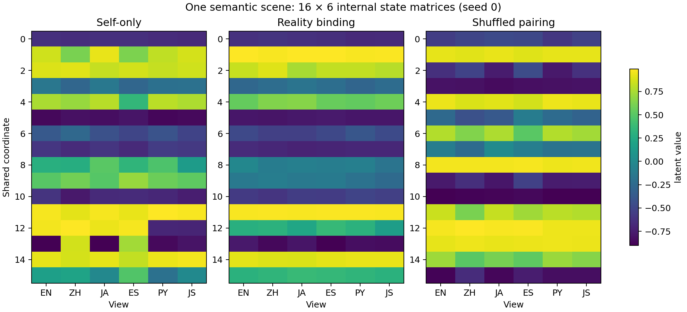

Figure 11. EXP003. One held-out scene under the three training conditions. Coordinate rows are model-internal and need not correspond across separately trained conditions; the within-panel column geometry is the relevant object.

### A controlled shared semantic mechanism

Each scene defines one executable piecewise-linear function with six semantic components: comparator, threshold and two affine branches. The canonical simulator is used to construct six surface descriptions and is held out from training as an audit object.

Table 22. A controlled shared semantic mechanism. EXP003; values and conditions follow the methods in this section.

<table>
<colgroup>
<col style="width: 28%" />
<col style="width: 71%" />
</colgroup>
<thead>
<tr class="header">
<th><strong>View</strong></th>
<th><strong>Example surface</strong></th>
</tr>
</thead>
<tbody>
<tr class="odd">
<td>English</td>
<td>if x is greater_than 0 , return 3 * x + 1 ; otherwise return 3 * x + 3 .</td>
</tr>
<tr class="even">
<td>Chinese</td>
<td>如果 x 大于 0 ， 则 返回 3 * x + 1 ； 否则 返回 3 * x + 3 。</td>
</tr>
<tr class="odd">
<td>Japanese</td>
<td>もし x が 0 より大きい なら 返す 3 * x + 1 ； それ以外 返す 3 * x + 3 。</td>
</tr>
<tr class="even">
<td>Spanish</td>
<td>si x es mayor_que 0 , devuelve 3 * x + 1 ; si_no devuelve 3 * x + 3 .</td>
</tr>
<tr class="odd">
<td>Python</td>
<td>def f ( x ) : if x &gt; 0 : return 3 * x + 1 
return 3 * x + 3</td>
</tr>
<tr class="even">
<td>JavaScript</td>
<td>function f ( x ) { if ( x &gt; 0 ) return 3 * x + 1 ; return 3 * x + 3 ; }</td>
</tr>
</tbody>
</table>

Train/test scenes use held-out parameter combinations. The model receives only the rendered surface sequences and language identifiers. Simulator parameters are not supplied to the learned core.

### One coordinated sequence model

All six views use one token embedding, one bidirectional recurrent encoder, one 16-dimensional bottleneck/core, one autoregressive recurrent decoder and one output vocabulary. A language embedding selects the requested surface form. The 16D state is provided at every decoding step so that semantic information remains available throughout generation.

**surface sequence → shared encoder → 16D state → 16×16 core transform → shared decoder + target-view ID → requested surface**

The first pilot objective was dominated by fixed syntax and produced a template-collapse solution. The reported run therefore weights program-defining tokens — numbers, comparator words/symbols and signs — more strongly while retaining the full sequence loss. This refinement makes scene-specific executable semantics the dominant binding requirement.

### Training conditions

Self-only uses only diagonal reconstruction: each source view generates itself. Reality Binding starts from the self-only checkpoint and samples cross-view source→target pairs from the same semantic scene. Shuffled pairing starts from the identical self-only checkpoint but replaces the target scene for cross-view pairs, preserving the six marginal surface distributions while breaking shared-world correspondence. Three independent model initializations were evaluated.

**No term of the form ‖zᵢ − zⱼ‖² is present.**

### The six views become a scene-specific common core

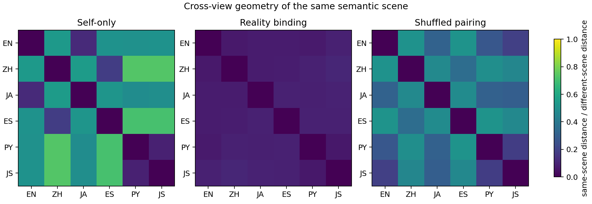

Figure 12. EXP003. Mean within-scene distances between the six view states, normalized by a different-scene distance scale. Binding produces a tight common scene state; shuffled pairing retains substantially larger scene-relative spread.

Across three initializations, the median same-scene/different-scene distance ratio fell from 0.437 after self-only learning to 0.084 after Reality Binding. The shuffled control was 0.416.

The stronger identity test is cross-view nearest-neighbor retrieval. Self-only recovered the correct scene with median accuracy 77.5%. Reality Binding reached 100% in every one of the 30 directed language/code pairs for every initialization. Shuffled pairing had median retrieval 43.4%, with a median worst-pair accuracy of only 4.5%.

Cosine similarity alone is not a sufficient core test. Both correct Binding and shuffled pairing can place states in nearly the same direction. The scene-retrieval and distance-ratio tests separate a scene-specific common core from a directionally collapsed representation.

### Generation and executable audit

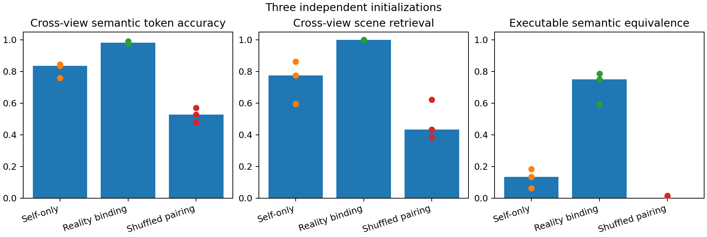

Figure 13. EXP003. Three independent initializations. Dots are seeds and bars are medians.

Reality Binding produced median cross-view semantic-token accuracy 98.24% and median exact free-generation accuracy 75.0%. The independently parsed generations implemented the same function on the audit grid in a median 75.0% of cross-view cases. The shuffled control had median executable equivalence 0.0%.

A post-training linear probe of the withheld simulator parameters increased from median R² 0.253 after self-only learning to 0.456 after Binding. The canonical simulator remains audit-only; this probe measures how directly the learned 16D state exposes the underlying executable mechanism.

### Where the new constraint acts internally

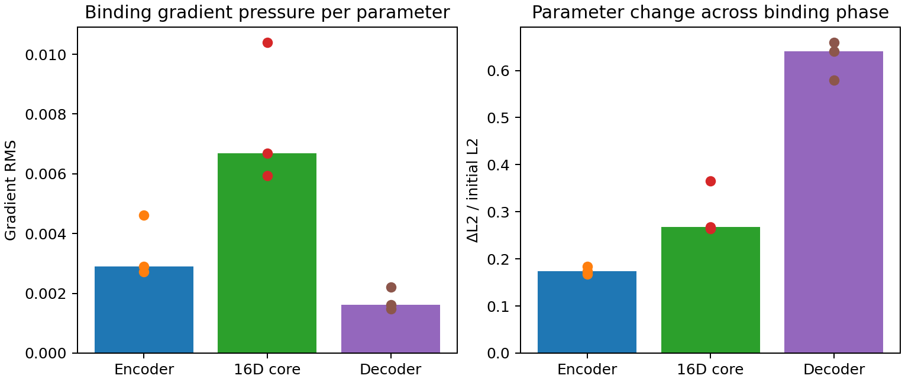

Figure 14. EXP003. Left: gradient pressure immediately after introducing same-scene cross-view binding, normalized per parameter. Right: relative parameter displacement from the self-only checkpoint through the binding phase.

At the binding transition, the per-parameter gradient RMS was highest in the 16D core in all three initializations: core 0.0067, encoder 0.0029, decoder 0.0016. This localizes immediate binding pressure directly to the shared core rather than defining the core only by architecture.

Across the full binding phase, the system reorganized jointly: median relative L2 displacement was 0.174 for the encoder, 0.268 for the core and 0.640 for the decoder. The executable common state is therefore produced by coordinated reparameterization around a shared bottleneck, while the core itself receives the strongest normalized pressure when the cross-view constraint first appears.

### Evidence statement

This experiment establishes a controlled multilingual/code case in which one learned 16-dimensional internal state can be reached from six surface systems and can generate all six surface systems for held-out semantic scenes. Same-scene correspondence is the intervention that distinguishes the successful common core from the shuffled control. The strongest measured signature is perfect cross-view scene retrieval across all 30 directed view pairs in all three initializations, together with high semantic generation accuracy and executable-function agreement.

The evidence is a controlled language-generation experiment with templated natural-language surfaces and executable program surfaces. The 16×6 state object, cross-view scene retrieval, shuffled-correspondence control and internal gradient and trajectory measurements provide a defined interface for comparisons with larger language models. Such a comparison was not performed in this experiment.

### Reproduction

The evidence archive contains the model/data generator, three self→binding→shuffle runs, trained state dictionaries, per-seed metrics, free-generation execution audit, geometry matrices, figures and SHA256 manifest. The canonical train/test split uses 800 training scenes and 200 held-out audit scenes from a fixed generated scene list.

## Experiment 004

**Reality Binding Across Six Real Measurement Views**

### Result in one paragraph

A real 569-sample pathology dataset was split into six non-overlapping measurement views of the same breast-mass FNA specimen. **Reality Binding** used the same 16-dimensional core design as Experiment 003: a state inferred from any one view had to generate all six same-sample views, with no direct latent-alignment loss. Across five initializations, median cross-view RMSE fell from **2.498 to 0.645**, exact held-out sample retrieval rose from **0.88% to 11.46%**, and same-sample latent distance contracted from **1.501 to 0.934**. Shuffling sample correspondence returned retrieval to near-random levels and cross-view RMSE toward the standardized mean-prediction scale. The result reproduces the core Reality Binding effect on real measured data while preserving a substantial view-specific residual component.

Table 23. Result in one paragraph. EXP004; values and conditions follow the methods in this section.

| **Condition**          | **Cross-view RMSE** | **Exact scene retrieval** | **Same-scene latent distance** |
|------------------------|---------------------|---------------------------|--------------------------------|
| Self only              | 2.4976              | 0.88%                     | 1.5011                         |
| Direct Reality Binding | 0.6447              | 11.46%                    | 0.9342                         |
| Self → Reality Binding | 0.6415              | 9.82%                     | 0.9721                         |
| Shuffled pairing       | 0.9736              | 1.05%                     | 1.3278                         |

Medians over five independent initializations. Exact retrieval searches the 114 held-out samples in another measurement view. Random top-1 retrieval is 0.88%. All feature values are standardized from the training split.

### One specimen, six real measurement views

The Wisconsin Diagnostic Breast Cancer dataset contains 569 specimens and 30 real-valued cell-nucleus morphology features computed from digitized fine-needle aspirate images. Ten morphology properties are reported as mean, standard error and worst-value summaries. The experiment uses a fixed stratified 455/114 train/test split; diagnosis is withheld from training and used only as an auxiliary audit label.

Table 24. One specimen, six real measurement views. EXP004; values and conditions follow the methods in this section.

| **View**           | **Five measurements**                                                      |
|--------------------|----------------------------------------------------------------------------|
| Mean size/shape    | mean radius, texture, perimeter, area, smoothness                          |
| Mean irregularity  | mean compactness, concavity, concave points, symmetry, fractal dimension   |
| SE size/shape      | radius, texture, perimeter, area, smoothness errors                        |
| SE irregularity    | compactness, concavity, concave-points, symmetry, fractal-dimension errors |
| Worst size/shape   | worst radius, texture, perimeter, area, smoothness                         |
| Worst irregularity | worst compactness, concavity, concave points, symmetry, fractal dimension  |

Source: Breast Cancer Wisconsin (Diagnostic), UCI Machine Learning Repository, DOI 10.24432/C5DW2B. The six views are an experimental partition of the 30 published features; each sample keeps its original same-specimen correspondence.

### The 16 × 6 data object

Each five-variable view has its own 5→32→16 encoder. All six encoders feed one shared 16×16 nonlinear core. Six 16→32→5 decoders reconstruct the requested measurement view. For held-out specimen j, encoding the six views independently produces:

**Zⱼ = \[ z₁ z₂ z₃ z₄ z₅ z₆ \] ∈ ℝ¹⁶ˣ⁶**

No distance penalty is applied between columns. Their relationship is measured after training. Under Reality Binding, each column is trained only through consequences: it must decode the other five measurement views belonging to the same specimen.

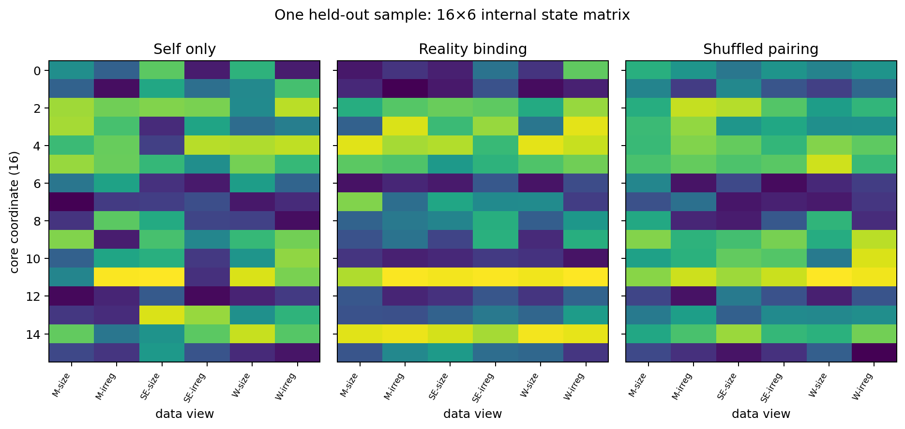

Figure 15. EXP004. One held-out specimen represented as a 16×6 internal state matrix. The panels show self-only, correct Reality Binding and shuffled-sample training. Coordinates are model-internal; the within-panel six-column structure is the measured object.

### Training intervention

Self-only trains the six diagonal paths viewᵢ→viewᵢ. Direct Reality Binding trains all 36 source→target paths using measurements from the same specimen. Self→Binding first establishes six separate self-reconstruction solutions and then introduces the 36-path same-specimen requirement without resetting parameters. Shuffled pairing starts from the same self-trained state but assigns cross-view targets from different training specimens while preserving each view’s marginal distribution.

**The intervention is specimen correspondence, not shared labels and not latent matching.**

### Real-data replication of Reality Binding

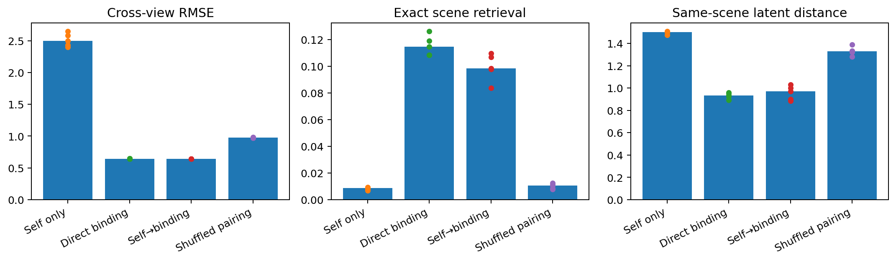

Figure 16. EXP004. Five independent initializations. Bars are medians and dots are individual seeds. Lower RMSE and latent distance are better; higher exact retrieval is better.

Correct Reality Binding improved all three primary measurements in 5/5 initializations. Median cross-view RMSE decreased by 74.2% relative to self-only training. Exact cross-view specimen retrieval reached 11.46%, 13.1× the random 1/114 reference and 13.1× the self-only median. Same-specimen latent distance contracted by 37.8%.

The shuffled control separated shared architecture from shared reality. Its median cross-view RMSE was 0.974, exact retrieval 1.05% and latent distance 1.328. Correct Binding outperformed shuffled pairing on cross-view RMSE in 5/5 seeds.

Diagnosis was never optimized. A logistic-regression audit on the mean six-view core state produced median held-out accuracy 95.6% after direct Binding, compared with 93.0% after self-only training. This auxiliary result shows that the coordinated state retains clinically relevant sample structure while its training target remains measurement reconstruction.

### The common component is structured, not complete

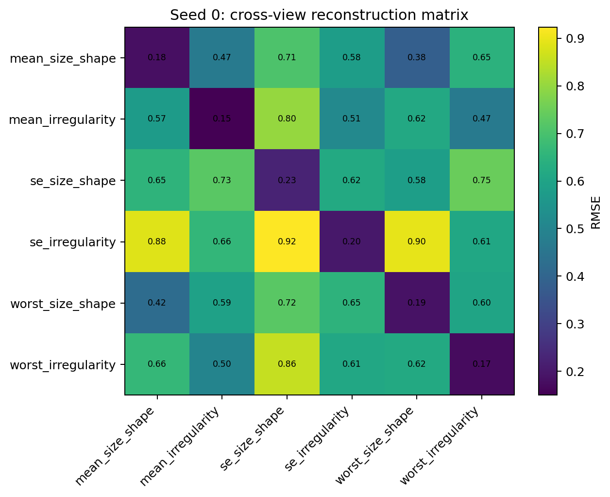

Figure 17. EXP004. Seed-0 test RMSE for every source-view→target-view path after Reality Binding. The diagonal is self-reconstruction; off-diagonal cells measure cross-view consequence prediction.

The 6×6 matrix reveals a nonuniform common mechanism. Mean size/shape and worst size/shape are among the strongest reciprocal links; mean irregularity and worst irregularity are also strongly coupled. Paths involving standard-error summaries are generally harder. The shared core therefore organizes predictable cross-view structure while retaining a measurable residual associated with view-specific information.

This residual is visible in the absolute floor: Reality Binding stabilizes near 0.64 standardized cross-view RMSE rather than approaching zero. On real measurements, the shared reality is the intersection of information carried across views, while each view also contributes additional variation. This produces a partial common core rather than the near-exact equivalence seen in the controlled multilingual/program experiment.

### Training history

Starting from six already-specialized self-reconstruction solutions still reached median cross-view RMSE 0.642, essentially matching direct Binding at 0.645. Its exact scene retrieval was 9.82% versus 11.46% for direct Binding, and its same-scene latent distance was 0.972 versus 0.934. The real-data system therefore reorganizes strongly after specialization while retaining a detectable geometric trace of the earlier coordinate organization.

### Where the new constraint enters

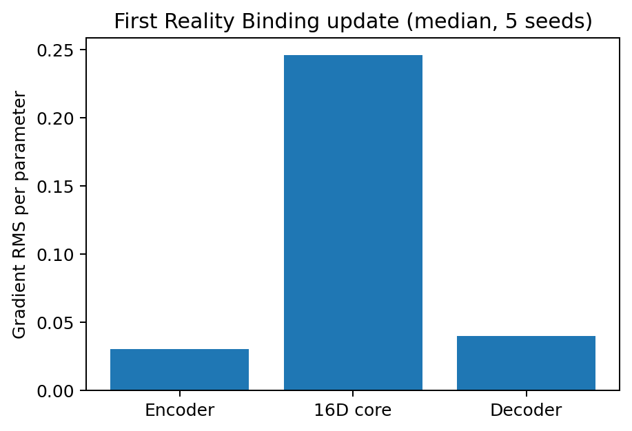

Figure 18. EXP004. Gradient RMS per parameter on the first full Reality Binding objective, measured immediately after self-only specialization. Values are medians over five seeds.

At the moment same-specimen cross-view constraints are introduced, the shared 16D core receives the highest normalized gradient pressure in every seed. Median gradient RMS per parameter is 0.0302 in the encoders, 0.2460 in the core and 0.0395 in the decoders; the core/encoder ratio is 8.14. This independently localizes the new coordination requirement at the shared core while the surrounding encoders and decoders participate in the subsequent reparameterization.

### Evidence statement

Experiment 004 establishes the Reality Binding effect on a real measured dataset: six disjoint feature views of the same specimen become substantially more cross-predictive, more geometrically coordinated and more specimen-identifiable when training preserves same-specimen correspondence across views. The shuffled-sample intervention identifies correspondence as the active organizing signal. The 16D core receives the largest normalized gradient pressure when the constraint is introduced.

The experiment also exposes the data-world regime that controlled language did not: a common mechanism can be strong without exhausting every observation. The measured cross-view floor and the heterogeneous 6×6 reconstruction matrix provide an empirical separation between shared mechanism and view-specific residual structure.

## Experiment 005 Channel Networks for Epidemiologic Measurement Distortion

Stable operators, dynamic drift, and reality-core localization

Experiment 005 moves the coordination architecture from multiple data views to an explicit measurement-process layer. Real diabetes-study patient measurements provide the shared biomedical backbone; six epidemiology-inspired channel operators create auditable calibration bias, heaping, detection limits, saturation, heteroscedastic noise and nonlinear assay response.

### Architecture and question

Shared perception → channel network → 16×16 shared reality core → target-channel network → shared generator. The main comparison asks what the channel module contributes under stable distortion, how a changing channel should be updated, and whether a new measurement system can be attached without rewriting the learned reality core.

Table 25. Architecture and question. EXP005; values and conditions follow the methods in this section.

| **Condition**                  | **Key median result**                  |
|--------------------------------|----------------------------------------|
| Stable affine channel          | cross RMSE 0.238; clean-state R² 0.974 |
| Stable neural channel          | cross RMSE 0.235; clean-state R² 0.975 |
| Drift + neural channel rewrite | focused RMSE 0.351 → 0.469             |
| Drift + 64-param state         | focused RMSE 0.351 → 0.341; core fixed |
| New channel, affine            | RMSE 0.310 → 0.216                     |
| New channel, neural            | RMSE 0.320 → 0.213                     |

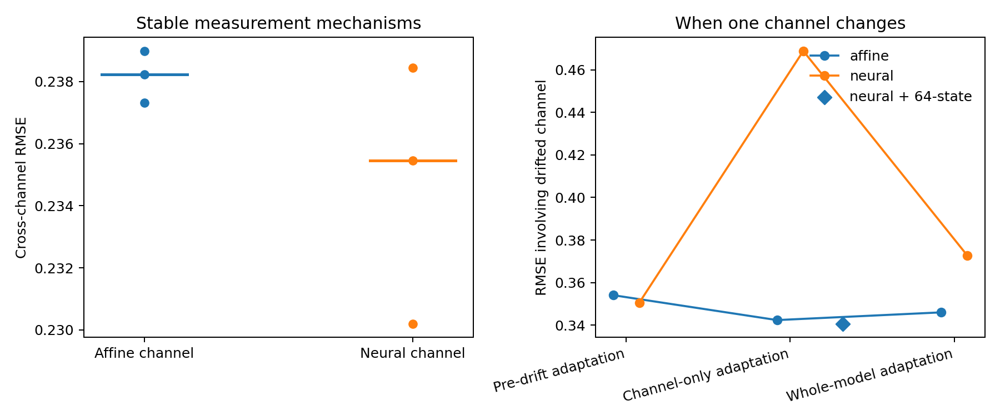

Figure 19. EXP005. Stable measurement operators and adaptation to channel drift on a real numerical backbone with controlled measurement distortions. Left: cross-channel RMSE for affine and neural channel networks, with seed points and median segments. Right: error involving the drifted channel under local or whole-model adaptation, including the separate 64-parameter state pilot. Lower RMSE is better.

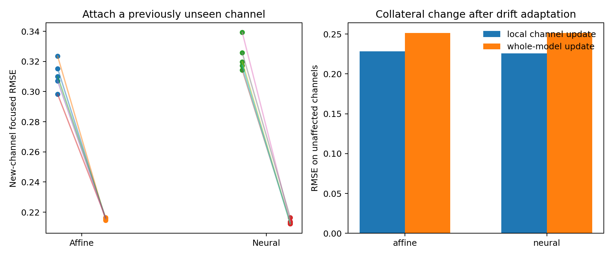

Figure 20. EXP005. New-channel attachment and collateral change under the same controlled measurement distortions. Left: paired error before and after attaching the held-out nonlinear channel. Right: RMSE on unaffected channels after local-channel or whole-model adaptation. Lower RMSE is better; the chart reports point summaries rather than uncertainty intervals.

### Observed mechanism

A flexible neural channel network is useful as a stable measurement operator: when the shared core is first learned from five channels, a new nonlinear sixth channel attaches slightly better with the neural operator than with a simple affine map. The same flexibility becomes counterproductive when short-lived drift is handled by rewriting the channel network itself. A separate low-dimensional state layer absorbs the transient change while preserving the learned channel mechanism and shared core. Whole-model adaptation moves the core and causes larger collateral error on unaffected channels.

### Engineering implication

The data architecture has three experimentally distinct time scales: shared reality, stable channel mechanism, and dynamic channel state.

## Experiment 006 Dynamic State Routing

Separating measurement drift from reality change

A recurrent channel-state layer was added around the stable neural measurement operators learned in Experiment 005 while the shared 16×16 reality core remained frozen. Across five independent initializations, the shared reality trajectory predicted the hidden world-change coordinate with median held-out R²=0.935; the affected channel state predicted measurement-drift strength with R²=0.646.

### Architecture and perturbation

Each episode contains 12 repeated observations from the real diabetes-study backbone and six learned measurement channels. After four stable steps, the episode contains either channel-6 drift, coherent world change, both changes, or neither. The dynamic module uses an 8D recurrent state per channel. Its shared GRU reads deviation from cross-channel consensus; small channel-specific heads modify the input and output sides of the stable channel mechanism. Stable channel networks and the 16×16 reality core remain frozen during dynamic-state learning.

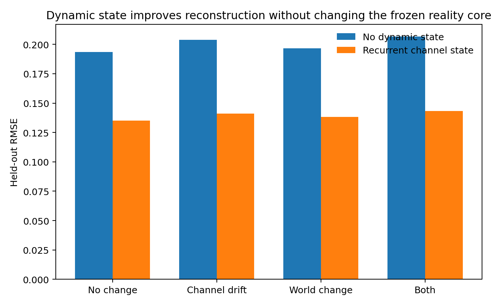

Figure 21. EXP006. Held-out reconstruction across no-change, channel-drift, world-change and combined episodes.

Median held-out RMSE with recurrent state was 0.135, 0.141, 0.138 and 0.143 across the four conditions, compared with 0.194, 0.204, 0.197 and 0.207 without dynamic state. Channel-6 drift RMSE fell from 0.206 to 0.133.

### Internal separation

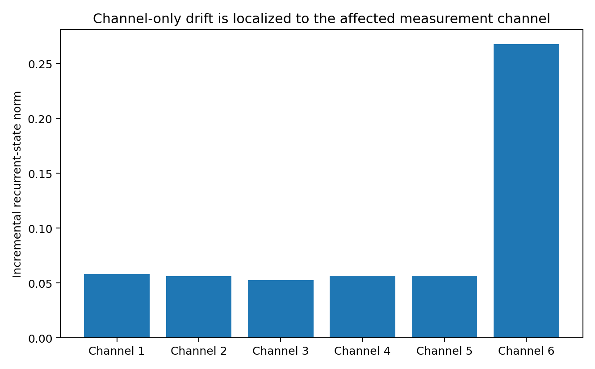

Figure 22. EXP006. Incremental recurrent-state energy under channel-only drift after subtracting matched no-change states.

Drift-induced state change localized to the affected channel at median 4.79× the average of the other channels. The drift coordinate remained readable from channel-6 state with median held-out R²=0.646. The common reality trajectory encoded coherent world change with median R²=0.935. Paired true-world movement of the reality state was 4.59× larger than its movement under channel-only drift.

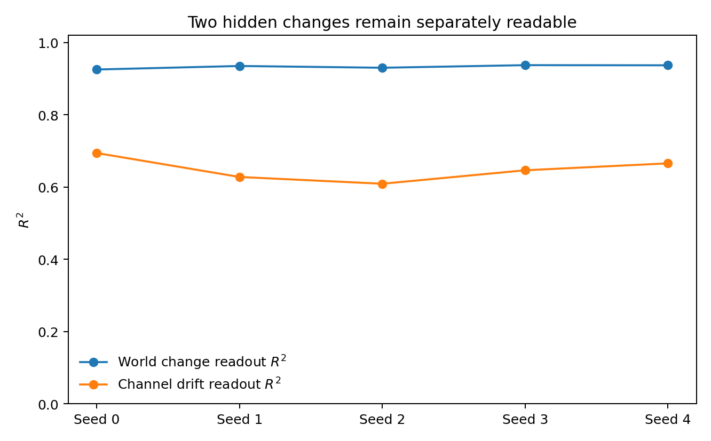

Figure 23. EXP006. Five-seed held-out audits of world-state and channel-drift information.

### Engineering implication

The data architecture now supports three distinct objects in one trainable system: a stable shared reality mechanism, stable channel-specific measurement mechanisms, and fast recurrent channel states. Cross-channel inconsistency drives local state updates, while coherent multi-channel change remains represented in the common reality trajectory. Combined episodes show that both can operate at the same time.

## Experiment 007 Embedded Recurrent Ganglion

Distributional channel targets and repeated current-evidence coordination

The revised experiment trains against independent repeat measurements rather than exact sample reconstruction. Each channel path contributes through its own input network A_c; one physical 16×16 matrix M repeatedly updates the current shared state as evidence events arrive; channel-specific output networks return five conditional quantiles for the current measurement distribution. With all six channels incorporated, the trainable shared ganglion reached median pinball loss 0.0608 across five seeds with 81.0% coverage of nominal 80% intervals. Fixed identity and fixed-random recurrent controls reached 0.0738 and 0.0806.

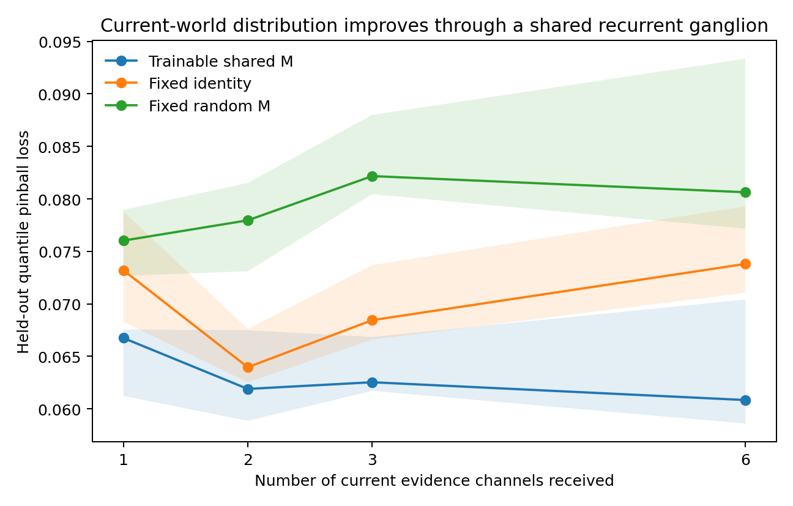

Figure 24. EXP007. Distributional score as current evidence accumulates.

### Why repeated use matters

A single-use shared matrix under the same distributional target scored 0.0631, essentially matching the no-matrix control at 0.0621. Reusing M between evidence events created a distinct computational role that the flanking networks could not absorb as one coordinate transform.

### Ganglion lesion

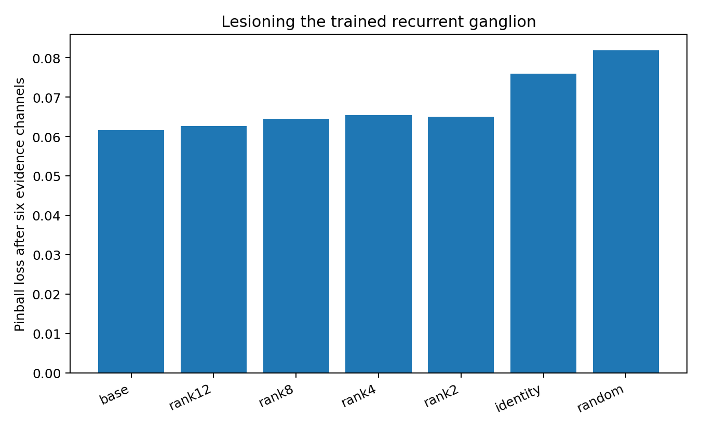

Figure 25. EXP007. Recurrent matrix replacement and rank lesions.

After six evidence channels, the intact learned matrix scored 0.0616. Identity and random replacements increased loss to 0.0759 and 0.0818. Rank truncations preserved substantially more function, indicating that the learned recurrent orientation carries more evidence than full matrix rank alone.

### Seventh-channel onboarding

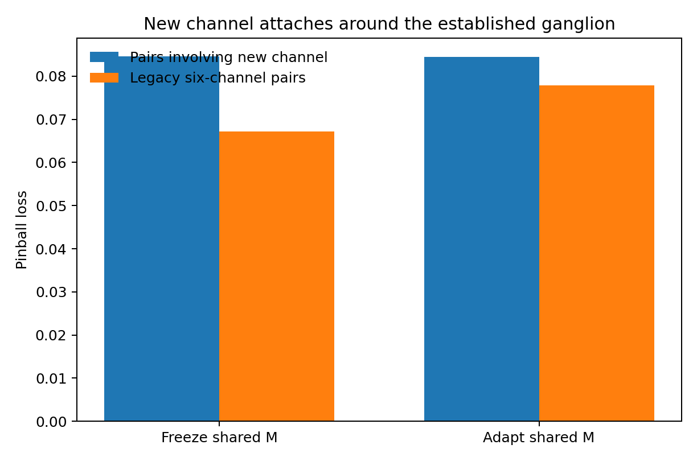

Figure 26. EXP007. New-channel attachment around a stable recurrent ganglion.

Training only A_7 and B_7 around a frozen M produced new-channel pair pinball 0.08456 and legacy loss 0.06725. Allowing M to move gave essentially the same new-channel score (0.08449) while legacy loss increased to 0.07790.

### Evidence order sensitivity

The recurrent state still depends on evidence order: after all six current observations, predicted medians have order-sensitivity standard deviation 0.094. The objective remains current-state reconciliation; inferred distributions are kept distinct from observed evidence.

## Experiment 008 Time-Aligned Evidence Coordination

Same-time commutativity and across-time current-reality separation

Evidence carrying one timestamp is now pooled before the shared 16×16 recurrent ganglion update. Evidence from later timestamps updates the ganglion again as a new current-reality slice. Across five seeds, same-time channel permutations changed predicted medians only at numerical precision (2.41e-08). In dynamic episodes, reversing the true three-slice chronology increased current pinball loss from 0.0557 to 0.0733; in static episodes the same reversal left the score unchanged (0.0545 versus 0.0543).

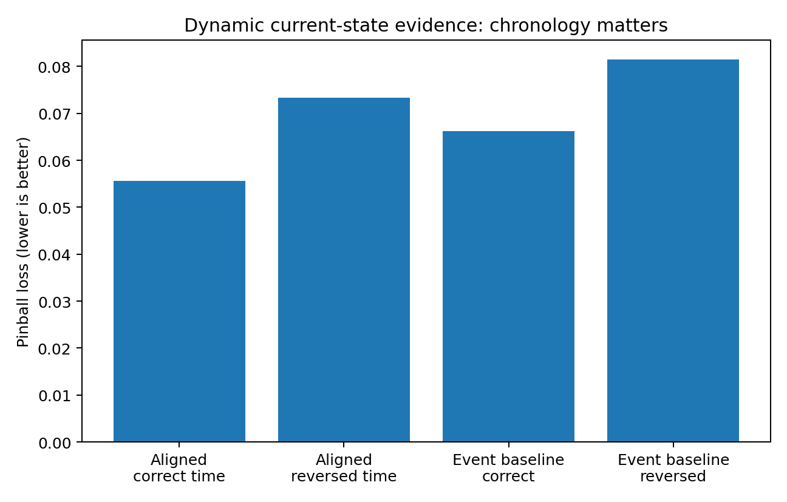

Figure 27. EXP008. Real chronology is retained only when the underlying world changes.

### Timestamp alignment

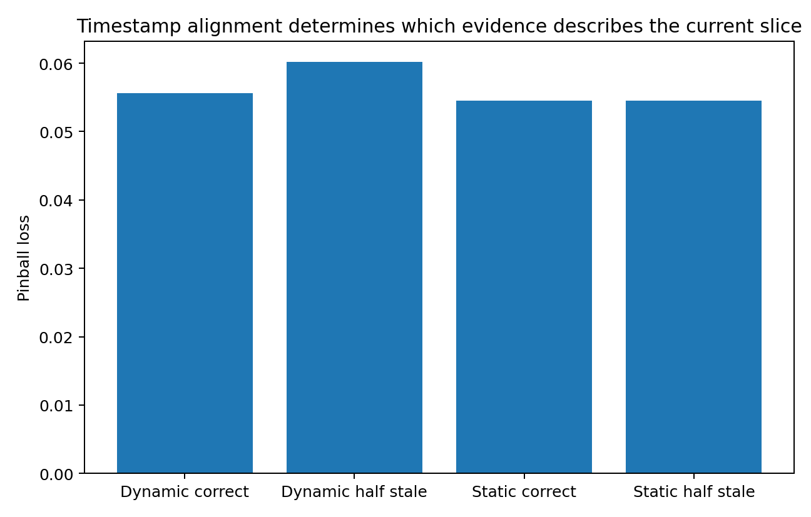

Figure 28. EXP008. Stale evidence relabeled as current changes the inferred reality only when the world has actually moved.

Relabeling half of the oldest measurements as current raises dynamic loss to 0.0602 and displaces the final state by 0.105; the same operation in static episodes leaves the score essentially unchanged. The audit-only current-state readout reaches held-out R² 0.972.

### Engineering consequence

Order should be removed only inside a shared temporal support. Chronology remains part of the model when observations refer to different realities. The shared ganglion therefore receives unordered evidence sets at each aligned time slice and recurrently carries the current reality between slices. Training and evaluation remain current-state distributional; no future observation is generated as an internal training target.

## Discussion after Experiment 008

Experiments 001–008 now define a general-purpose form of data-oriented modelling. The system does not force heterogeneous scientific data into one native representation. Perception networks handle the original data form; channel networks learn relatively stable measurement-specific structure and fast channel state; an embedded shared ganglion coordinates the evidence that refers to the same underlying reality. The shared state is updated by observations that have actually arrived, and output heads describe calibrated current-observation distributions rather than demanding exact pointwise reconstruction.

### A middle layer between universal and fully bespoke modelling

This line occupies a deliberately general-purpose position. At one extreme, a universal foundation model asks one large model to absorb many data types through a common representation. At the other extreme, precision data-oriented modelling can redesign features, losses, sampling, state variables and model structure around one particular dataset until the model closely matches that dataset's measured geometry and generation process. The present architecture sits between these extremes: each channel receives a reasonable native model, while the shared coordination layer provides a reusable way to combine heterogeneous evidence, maintain measurement-specific uncertainty and update a common current-reality state.

### Role of the channel networks

The channel network is therefore the principal place for data-specific adaptation. Stable and repeatable properties of an assay, sensor, experimental platform or statistical observation process can be stored in its channel parameters. Faster calibration drift or measurement-state changes can be represented by a dynamic channel state. The shared ganglion is reused across channels and across aligned evidence events, giving the system a common coordination mechanism without requiring every channel to use the same native model or the same observation geometry.

### Relation to precision data-oriented modelling

The evidence accumulated here supports this architecture as a reusable coordination scaffold. Precision data-oriented modelling remains a higher-resolution mode that requires additional dataset-specific structure: detailed empirical geometry, variable-specific mechanisms, tailored objectives, study-design information, specialized transformations and domain-specific constraints can all carry signal that a reusable channel interface intentionally compresses. A precision model can therefore be placed inside the perception and channel stages when a particular dataset justifies deeper specialization, while the shared ganglion continues to coordinate the parts of the evidence that are meaningfully common across channels.

This distinction sets the intended scope of the current line. The architecture is designed for scientific systems in which many heterogeneous data sources must be made mutually usable with acceptable calibration and moderate per-channel specialization. The highest-precision analysis of one narrowly defined dataset remains a separate modelling task, with this framework serving as the coordination layer around those specialized models rather than as their replacement.

## Experiment 009 Mixed Language–Statistical Ganglion Training

Same underlying patient reality, one controlled natural-language channel, one statistical measurement channel, and a shared 16×16 ganglion. Three branches started from matched initialization: numeric specialist, language specialist and mixed coordination. The mixed branch cycled numeric-only, text-only and joint evidence while every update was scored on both calibrated numerical remeasurement distributions and language semantic states.

Table 26. Experiment 009 Mixed Language–Statistical Ganglion Training. EXP009; values and conditions follow the methods in this section.

| **Condition**       | **Numeric self pinball** | **Language self accuracy** | **Num→Lang accuracy** | **Text→Num pinball** | **Both audit R²** |
|---------------------|--------------------------|----------------------------|-----------------------|----------------------|-------------------|
| Numeric specialist  | 0.0742                   | 30.7%                      | 25.8%                 | 0.2780               | 0.695             |
| Language specialist | 0.2888                   | 85.2%                      | 28.3%                 | 0.2856               | 0.528             |
| Mixed ganglion      | 0.0793                   | 80.0%                      | 72.5%                 | 0.1530               | 0.704             |

The mixed ganglion retained most specialist performance and acquired cross-modal use. Numerical evidence alone supported 72.5% language semantic accuracy. Text alone supported numerical pinball 0.153. With both evidence types the system reached numerical pinball 0.0859, language accuracy 84.3% and linear audit R² 0.704 for the underlying ten-dimensional patient state. The paired numeric/text state cosine gap was 0.314, versus approximately zero in the single-modality specialist branches.

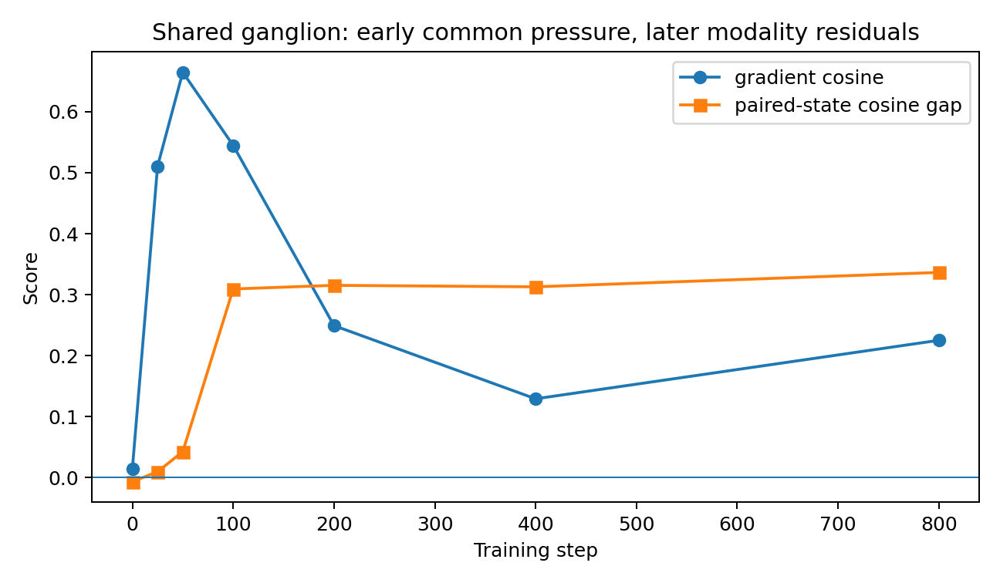

Figure 29. EXP009. Early common ganglion pressure followed by modality-specific residual optimization.

### Training-time geometry

Seed 0 showed strongly positive numerical-versus-language gradient cosine on the ganglion during the first 25–50 updates (0.511 and 0.665). Paired-state alignment formed rapidly and remained high while later task gradients diverged toward modality-specific residuals. Freezing the ganglion after update 200 produced essentially the same final mixed metrics as continued ganglion training: 0.0840 versus 0.0859 numerical pinball, 84.1% versus 84.3% language accuracy, and 0.7042 versus 0.7044 audit R².

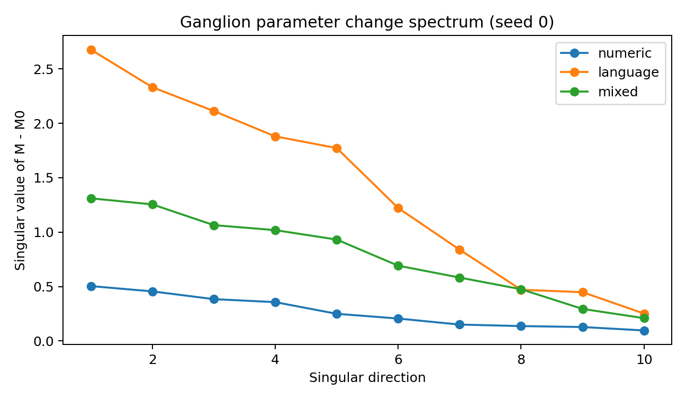

Figure 30. EXP009. Ganglion parameter-change spectra for specialist and mixed training (seed 0).

The numeric and language specialist ganglion displacements were nearly orthogonal (median cosine 0.052). The mixed displacement occupied a separate compromise geometry, with median cosine 0.206 to the numeric specialist and 0.418 to the language specialist. Its seed-0 displacement effective rank was 10.74.

### Causal ganglion lesion

Removing the first two singular directions of the learned mixed ΔM increased median numerical pinball to 0.1047 and reduced language accuracy to 74.2%. A matched-norm random perturbation produced 0.0932 and 82.4%. The learned directions therefore carry joint functional load across both data types.

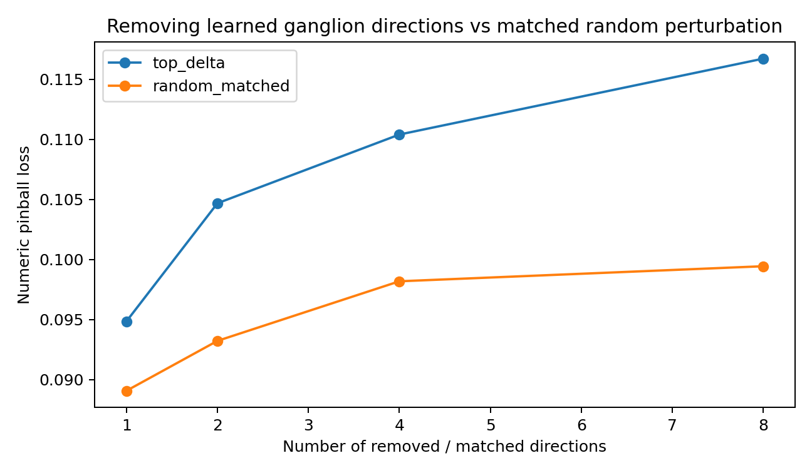

Figure 31. EXP009. Learned-direction lesions damage the mixed ganglion more than matched random perturbations.

### Engineering interpretation

This experiment provides the first mixed language–statistics training test of the general-purpose data-oriented modelling scaffold. The common ganglion forms early under mixed evidence, while later improvements are largely handled by modality-local pathways. Modality-specific continuation can move the ganglion substantially without improving the cross-modal pathway; keeping the established ganglion stable preserves the common state while specialist components continue adapting. This supplies a concrete training pattern for a reusable coordination core surrounded by increasingly specialized channel models.

Evidence scope: real 442-patient numerical scaffold; controlled nonlinear statistical measurement process; controlled natural-language paraphrases and semantic labels; three matched seeds. The experiment measures mixed-modality coordination rather than full pretrained-language-model behavior.

## Experiment 010 Shared Ganglion + Precision Residual

Experiment 010 implements the pending general-purpose-versus-precision comparison. The mixed numeric–language ganglion from Experiment 009 is frozen, and channel-specific precision experts are added only outside the shared mechanism. Each expert activates only when its own native evidence is present. Final outputs are residual blends between the common prediction and the local prediction, with validation-selected blend weights capped at 0.75 so the shared path remains present.

### Precision recovery

Across three matched seeds, numeric same-channel pinball improved from 0.0793 to 0.0745; the numeric specialist reference was 0.0742. This recovered 93.1% of the mixed-to-specialist gap. Language same-channel semantic accuracy improved from 80.0% to 83.7%, recovering 71.4% of its specialist gap.

With both evidence types present, numeric pinball improved from 0.0859 to 0.0745; language accuracy improved from 84.3% to 90.1%. All three seeds independently selected αnumeric = 0.75 and αlanguage = 0.50 after long precision training.

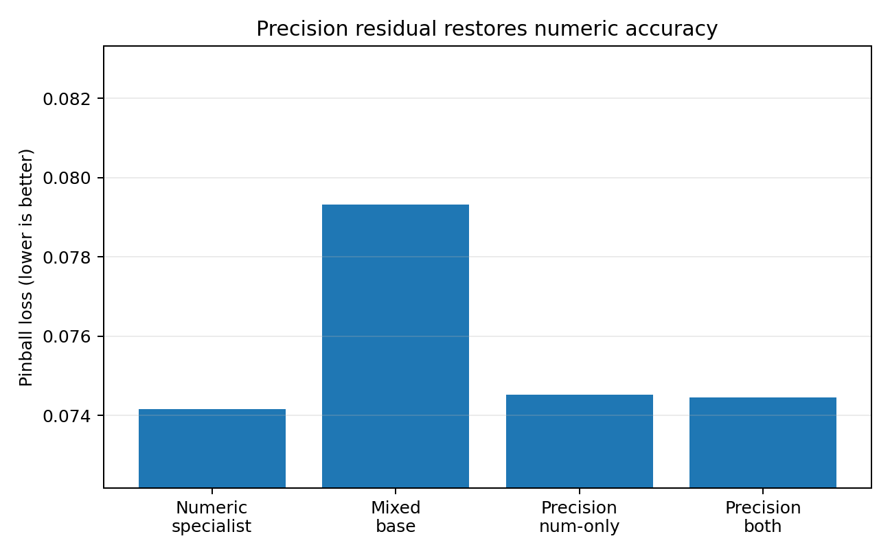

Figure 32. EXP010. Numeric specialist precision is largely recovered around a frozen shared ganglion.

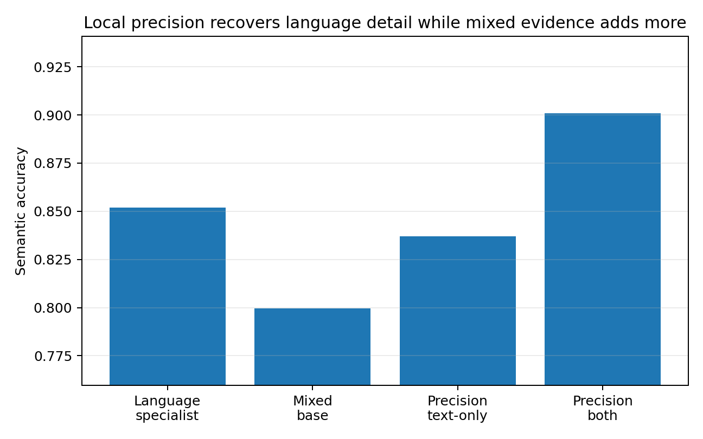

Figure 33. EXP010. Language detail is recovered locally, and mixed evidence provides additional semantic gain.

### Preservation of the common mechanism

Text→numeric and numeric→language outputs are exactly unchanged because local experts are inactive when their native evidence is absent. The shared ganglion therefore remains the sole path for cross-data inference. After precision recovery, lesioning the first two learned ganglion directions still degrades both local combined performance and cross-modal inference, establishing that local precision has not replaced the common mechanism.

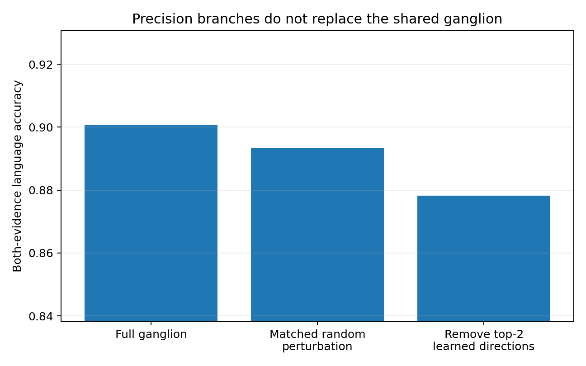

Figure 34. EXP010. Learned ganglion directions remain functionally important after precision recovery.

### Engineering interpretation

The result realizes the two-resolution data-oriented modelling scheme proposed after Experiment 008: a reusable general-purpose coordination layer carries what is common across data types, while channel-specific models spend additional capacity on high-resolution local structure. Small generic adapters contributed little in the short screen; meaningful precision recovery required a substantial, sufficiently trained local model. This keeps generality and precision as separate engineering budgets rather than asking one shared model to optimize both simultaneously.

## Experiment 011 Public Drug-Development Evidence First Contact

Experiment 011 moves the shared-ganglion architecture onto a public drug-development evidence problem. The dataset contains 26,278 Open Targets × ChEMBL target–disease pairs and six non-clinical evidence channels. A deterministic Ensembl-target split keeps each target entirely within train, validation or test. Clinical and overall aggregate scores are excluded from the inputs; the terminal label is Phase 4/approved versus Phase 1/2.

### Architecture and benchmark

Six channel-specific encoders map evidence score and evidence presence into 16 dimensions. Their states are coordinated by one shared 16×16 ganglion, followed by a probabilistic human-outcome head. The complete observed six-bit evidence state space is retained and weighted by the original pair counts. Reference models include prevalence, evidence count, linear evidence and pairwise polynomial evidence.

Table 27. Architecture and benchmark. EXP011; values and conditions follow the methods in this section.

| **Model**                    | **Log loss ↓** | **AUROC ↑** | **AUPRC ↑** | **ECE ↓** |
|------------------------------|----------------|-------------|-------------|-----------|
| Prevalence                   | 0.2035         | 0.3962      | 0.0426      | 0.0000    |
| Evidence-count logistic      | 0.1992         | 0.5972      | 0.0817      | 0.0037    |
| Linear evidence logistic     | 0.1981         | 0.6088      | 0.0885      | 0.0060    |
| Polynomial evidence logistic | 0.1973         | 0.6184      | 0.0919      | 0.0041    |
| Ganglion — best seed         | 0.1993         | 0.6150      | 0.0863      | 0.0072    |
| Ganglion — median seed       | 0.2040         | 0.5940      | 0.0811      | 0.0097    |
| Ganglion + precision — best  | 0.1973         | 0.6181      | 0.0900      | 0.0046    |

The polynomial statistical model currently retains the strongest standalone precision (test log loss 0.19734, AUROC 0.6184). The best ganglion seeds approach this level (best log loss 0.19928; best AUROC 0.6150) but show clear initialisation variance. A validation-selected shared-plus-precision blend reaches 0.19726 in the stronger seed, demonstrating that the common coordination state and a task-specific statistical head can be combined without asking the ganglion to carry the entire precision burden.

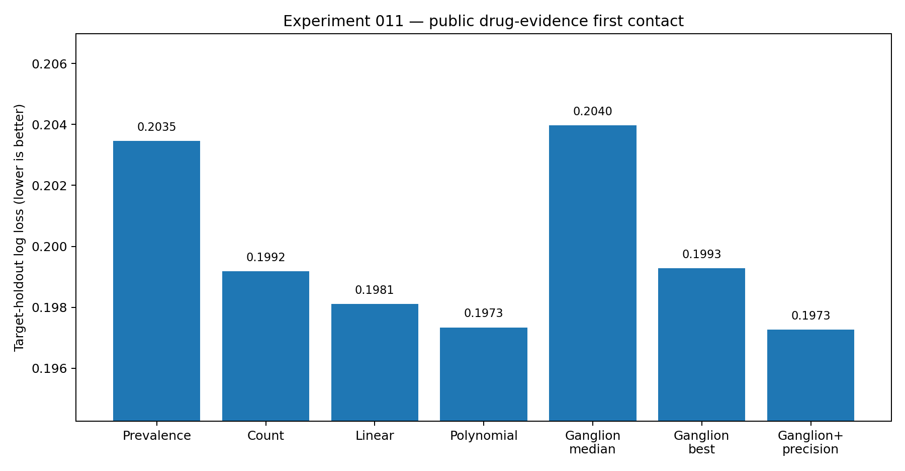

Figure 35. EXP011. Target-held-out log loss for conventional statistical baselines, five ganglion initializations and precision fusion in the 26,278-pair retrospective evidence task. The ganglion median and best run are separate summaries; the precision result uses the selected strong run. Lower log loss is better. No historical decision-date prediction is established.

### Interpretation

This first contact supports the architecture as a general coordination scaffold while locating the immediate engineering bottleneck in predictive precision and stability. The result matches the design established in Experiments 009–010: shared structure is learned centrally, whereas dataset- and decision-specific precision remains a separate modelling responsibility.

## Experiment 012 Statistically Enhanced PsyMoE

Experiment 012 keeps the public drug-development evidence task and target-level split from Experiment 011, but moves classical statistics inside the heterogeneous architecture. Each evidence channel receives a cubic logistic calibration layer before entering the shared 16x16 ganglion. A masked polynomial logistic model remains available as a task-specific precision head.

### Pipeline availability

Pipeline unavailability is represented separately from biological evidence absence. Training randomly exposes 3-6 of the six evidence pipelines; evaluation enumerates every combination with zero to three unavailable pipelines. This creates a direct test of the platform setting in which evidence lines can be absent while the underlying target-disease object remains the same.

Table 28. Pipeline availability. EXP012; values and conditions follow the methods in this section.

| **Model**               | **Full** | **-1 pipeline** | **-2 pipelines** | **-3 pipelines** | **Full seed SD** |
|-------------------------|----------|-----------------|------------------|------------------|------------------|
| Masked polynomial       | 0.197928 | 0.198397        | 0.198865         | 0.199479         | —                |
| Raw PsyMoE              | 0.197891 | 0.198353        | 0.198987         | 0.199928         | 0.000981         |
| Stat-PsyMoE             | 0.197868 | 0.198338        | 0.198942         | 0.199817         | 0.000372         |
| Stat-PsyMoE + precision | 0.197769 | 0.198229        | 0.198814         | 0.199459         | 0.000253         |

The statistical front-end improves Raw PsyMoE in all 12 seed-by-availability comparisons and reduces full-evidence seed SD from 0.000981 to 0.000372. The statistical precision head improves 11/12 additional comparisons and reduces seed SD to 0.000253. The strongest hybrid reaches 0.197397 full-evidence log loss, close to the Experiment 011 polynomial specialist (0.197343) while retaining explicit pipeline-availability handling.

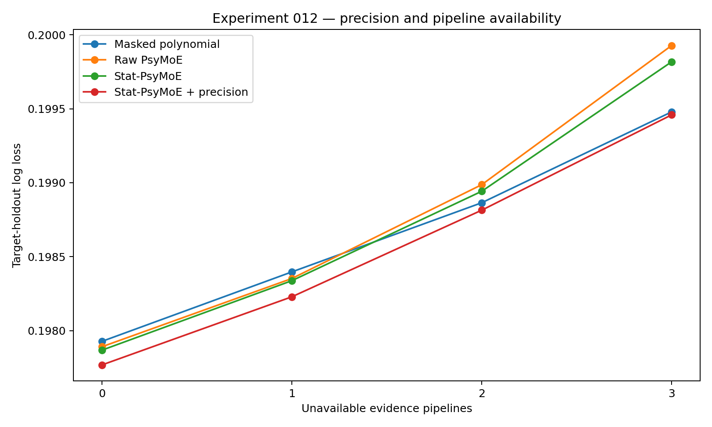

Figure 36. EXP012. Median target-held-out log loss across three matched neural initializations as zero to three of the six coarse evidence pipelines become unavailable. The masked polynomial comparator and calibrated or hybrid neural variants use the same availability regimes. Lower is better; connecting lines do not represent uncertainty intervals.

### Interpretation

The result supports a division of labour rather than a replacement claim: traditional statistics stabilises and calibrates each evidence line; the ganglion provides a reusable cross-line coordination state; and the precision head restores downstream interaction detail. The immediate gain is modest in absolute log loss but consistent across availability conditions, and the largest engineering improvement is reduced initialisation variance.

## Experiment 013 Statistical Observer as a Coordinated Evidence Channel

Experiment 013 treats the result of a conventional multivariable statistical model as a seventh observer inside the shared coordination architecture. The six biological evidence channels remain unchanged from the statistically enhanced architecture, while a masked polynomial model produces a derived global evidence view.

### Strict cross-fitted stacking

The seventh channel is produced with five-fold target-group cross-fitting inside the outer training partition. A training target therefore never receives a statistical-channel output from a model fitted on that target group. The seventh input contains the cross-fitted probability, log-odds, Bernoulli entropy and available-pipeline fraction. This is a derived model observer and is kept distinct from the six biological evidence sources.

Table 29. Strict cross-fitted stacking. EXP013; values and conditions follow the methods in this section.

| **Model**                             | **Full** | **-1 pipe** | **-2 pipes** | **-3 pipes** | **Full seed SD** |
|---------------------------------------|----------|-------------|--------------|--------------|------------------|
| Statistical observer only             | 0.197776 | 0.198202    | 0.198687     | 0.199351     | —                |
| Six-channel Stat-PsyMoE               | 0.197562 | 0.198029    | 0.198656     | 0.199417     | 0.000088         |
| \+ statistical observer channel       | 0.197543 | 0.198054    | 0.198583     | 0.199371     | 0.000090         |
| \+ output precision blend             | 0.197447 | 0.197969    | 0.198563     | 0.199292     | 0.000141         |
| Trained model, stat channel removed   | 0.198016 | 0.198910    | 0.199823     | 0.200986     | 0.000219         |
| Trained model, stat channel mispaired | 0.199612 | 0.202529    | 0.205209     | 0.206461     | 0.002099         |

Adding the statistical observer produces a small incremental median change under complete evidence (0.197562 -\> 0.197543) and improves three of four availability-regime medians. The stronger evidence is the damage control: removing the trained statistical channel raises median complete-evidence loss to 0.198016; mispairing the statistical result with the wrong evidence state raises it to 0.199612.

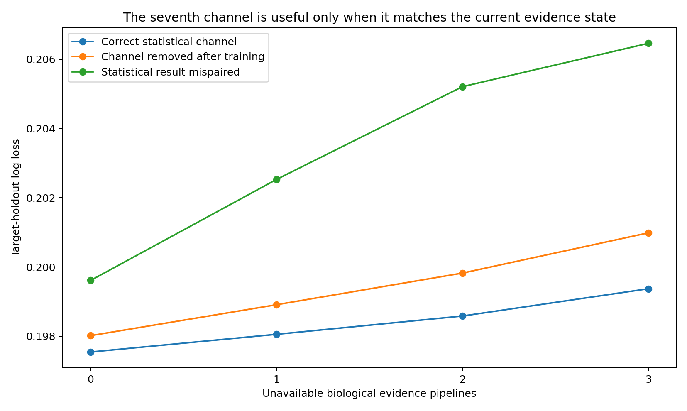

Figure 37. EXP013. Median target-held-out log loss under availability reduction, comparing a correctly paired statistical observer with its removal and mispairing. The observer is derived from target-group out-of-fold predictions and is distinct from native evidence. Lower is better; points summarize three seeds.

### Interpretation

Traditional statistics can therefore enter PsyMoE in more than one role. Channel-local statistics stabilise native evidence lines; a global statistical result can act as a coordinated derived observer; and a downstream precision head can still refine the terminal task. The derived observer adds little independent information because it is computed from the same six evidence lines, but the ganglion learns to use its structured summary jointly with the native channel states.

## Experiment 014 Statistical Observer Committee and Conditional Routing

Experiment 014 expands the single derived statistical observer from Experiment 013 into three strict target-group cross-fitted observers: additive logistic, pairwise-interaction logistic and beta-binomial empirical Bayes. The purpose is to measure whether different statistical inductive biases should be coordinated simultaneously and whether their value changes with biological-pipeline availability.

Table 30. Experiment 014 Statistical Observer Committee and Conditional Routing. EXP014; values and conditions follow the methods in this section.

| **Model**                         | **6 avail** | **5 avail** | **4 avail** | **3 avail** |
|-----------------------------------|-------------|-------------|-------------|-------------|
| Single interaction observer (013) | 0.197543    | 0.198054    | 0.198583    | 0.199371    |
| Naive 3-observer committee        | 0.197674    | 0.198191    | 0.198839    | 0.199651    |
| Routed committee                  | 0.198179    | 0.198600    | 0.199106    | 0.199789    |
| Additive observer only            | 0.199382    | 0.199008    | 0.199100    | 0.199630    |
| Interaction observer only         | 0.197809    | 0.198222    | 0.198699    | 0.199359    |
| Empirical-Bayes observer only     | 0.197511    | 0.198087    | 0.198845    | 0.199761    |

The observers have distinct evidence-regime profiles: empirical Bayes is strongest as a standalone observer with complete evidence (0.197511), while interaction is stronger when only three biological pipelines remain (0.199359 versus empirical Bayes 0.199761).

### Committee and routing result

A naive three-observer committee reaches median full-evidence log loss 0.197674; an explicit softmax-routed committee reaches 0.198179. Both remain behind the simpler single interaction-observer reference from Experiment 013 (0.197543). The router nevertheless learns stable non-uniform preferences rather than equal weights.

Table 31. Committee and routing result. EXP014; values and conditions follow the methods in this section.

| **Available bio pipelines** | **Additive** | **Interaction** | **Empirical-Bayes** |
|-----------------------------|--------------|-----------------|---------------------|
| 6                           | 0.049        | 0.573           | 0.382               |
| 5                           | 0.054        | 0.575           | 0.375               |
| 4                           | 0.060        | 0.576           | 0.368               |
| 3                           | 0.066        | 0.577           | 0.361               |

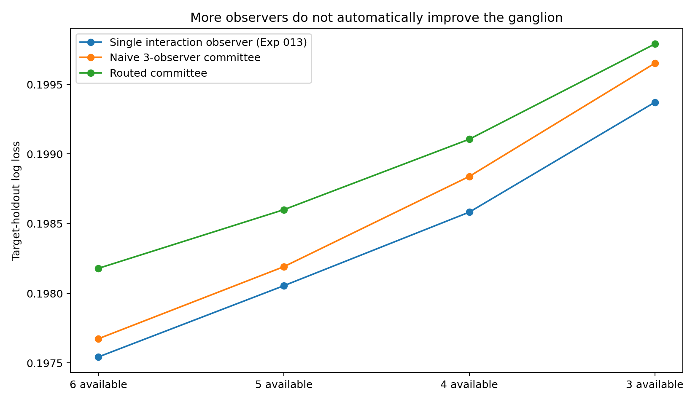

Figure 38. EXP014. Median target-held-out log loss for the single derived observer, naive three-observer committee and routed committee across four native-pipeline availability regimes. Lower is better; these are retrospective comparisons across three matched seeds, without historical evidence locking.

### Interpretation

Different statistical observers do capture different structures, but observer diversity alone does not justify a larger coordination mechanism on the current six coarse Open Targets evidence summaries. The current engineering choice remains the single cross-fitted interaction observer plus precision statistics. A routed committee is deferred until the 18 native Evidence Data Passport pipelines provide richer and more heterogeneous statistical objects.

## Experiment 015 Statistical Routing Below the Shared Ganglion

Experiment 015 replaces the neural committee router from Experiment 014 with direct statistical routing. Additive, interaction and empirical-Bayes experts remain strict target-group cross-fitted observers. Their mixture weights are selected by out-of-fold log-loss minimisation rather than by a neural gate.

Table 32. Experiment 015 Statistical Routing Below the Shared Ganglion. EXP015; values and conditions follow the methods in this section.

| **Model**                        | **Full** | **-1 pipeline** | **-2 pipelines** | **-3 pipelines** |
|----------------------------------|----------|-----------------|------------------|------------------|
| Additive                         | 0.199382 | 0.199008        | 0.199100         | 0.199630         |
| Interaction                      | 0.197809 | 0.198222        | 0.198699         | 0.199359         |
| Empirical-Bayes                  | 0.197511 | 0.198087        | 0.198845         | 0.199761         |
| Stat-MoE: availability           | 0.197657 | 0.198091        | 0.198668         | 0.199359         |
| Stat-MoE: availability + density | 0.197408 | 0.197904        | 0.198547         | 0.199334         |
| 014 neural routed committee      | 0.198179 | 0.198600        | 0.199106         | 0.199789         |
| 013 hybrid median                | 0.197447 | 0.197969        | 0.198563         | 0.199292         |

The availability+density Stat-MoE scores 0.197408 with full evidence and remains the strongest committee formulation across the first three missing-pipeline regimes. Its routing is interpretable: sparse evidence states are assigned mainly to empirical-Bayes shrinkage; states with multiple observed evidence classes shift toward the interaction expert.

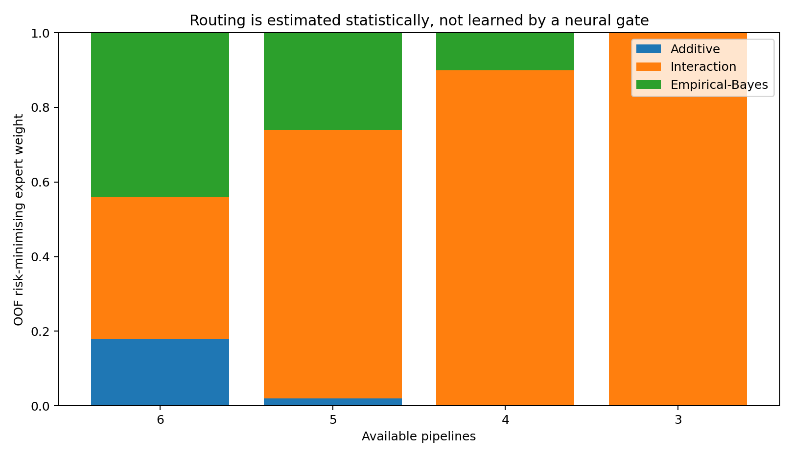

Figure 39. EXP015. Statistical mixture weights estimated from target-group out-of-fold risk for additive, interaction and empirical-Bayes experts, grouped by pipeline availability. Stacked weights sum to one; they are routing coefficients rather than predictive performance or uncertainty intervals.

### Architecture conclusion

The statistical mixture performs best before the shared ganglion. Passing it through the ganglion remains useful as a derived observer, but does not improve this coarse six-summary task beyond the standalone statistical mixture. This locates MoE routing below shared cross-channel coordination: use statistics to choose and combine statistical experts within a data channel, then use the ganglion to coordinate genuinely different channel states.

## Experiment 016 18-Pipeline Native Data Plane

### Construction question

Experiments 011-015 established the modelling hierarchy on six coarse Open Targets data-type summaries: statistics should select statistical experts inside a data channel, while the shared ganglion should coordinate genuinely different data channels. Experiment 016 moves the engineering object one level down, from six pre-aggregated summaries to the 18 native Evidence Data Passport lines.

### Open Targets 26.06 data plane

The integration is pinned to Open Targets release 26.06 for continuity with the existing drug-evidence experiments. The release exposes datasource-specific direct association metrics and source-specific evidence datasets. Every Passport line is now bound to a datasource identity and a source-level evidence route; the human clinical outcome remains outside the evidence inputs.

Table 33. Open Targets 26.06 data plane. EXP016; values and conditions follow the methods in this section.

| **Engineering object**                 | **Status**  | **Observed implementation**                                                                       |
|----------------------------------------|-------------|---------------------------------------------------------------------------------------------------|
| Passport pipelines mapped              | 18 / 18     | Each v0.1 line has a current 26.06 datasource identity.                                           |
| Datasource-level association route     | 18 / 18     | association_by_datasource_direct provides score, evidence count, novelty and timeseries.          |
| Current native evidence route          | 18 / 18     | Source-specific evidence table or official source-level dataset mapped.                           |
| Within-pipeline Stat-MoE specification | 18 / 18     | Candidate experts and OOF statistical routing role assigned.                                      |
| Time-lock semantics                    | 18 / 18     | Evidence/publication/curation/release dates are carried into the pipeline interface.              |
| Ontology version bridge                | Implemented | Legacy EFO IDs are bridged to 26.06 current IDs with disease obsoleteTerms/obsoleteXRefs/dbXRefs. |
| Shared-ganglion harness                | Implemented | 18 interfaces, availability-aware set aggregation, shared operator and terminal head.             |
| Frozen-ganglion onboarding             | Implemented | New pipeline can train its Stat-MoE/interface while established shared core stays frozen.         |

The public 26.06 release contains 42,394,639 evidence records overall. The release announcement reports, among other lines, 3,998,459 EVA/ClinVar germline evidence records, 3,044,078 GWAS credible-set evidence records, 7,758,975 IMPC mouse-model records and 26,191,349 Europe PMC literature records. These scale differences reinforce the within-pipeline modelling rule: evidence strings are not pooled as if they were exchangeable samples.

Table 34. Open Targets 26.06 data plane. EXP016; values and conditions follow the methods in this section.

| **26.06 evidence line**    | **Published release count** |
|----------------------------|-----------------------------|
| EVA / ClinVar germline     | 3,998,459                   |
| GWAS credible-set evidence | 3,044,078                   |
| Gene2Phenotype             | 5,050                       |
| Genomics England PanelApp  | 47,102                      |
| Project Score CRISPR       | 517                         |
| IMPC mouse model           | 7,758,975                   |
| Europe PMC literature      | 26,191,349                  |
| All evidence in release    | 42,394,639                  |

### Current-release compatibility corrections

The Passport concept remains stable, while two labels are updated to match the present release. The previous CRISPRbrain-specific line is broadened to the systematic CRISPR-screen route (datasource crispr_screen), preserving projectId, studyId, cell type, genetic background and contrast. The Project Score line maps to datasource crispr and the unified ProjectScore whole-genome CRISPR/Cas9 evidence dataset. ClinVar germline is represented by datasource eva.

The 26.06 ontology update also replaces many older EFO disease identifiers with Mondo identifiers. The integration harness therefore resolves the legacy terminal cohort through the current disease table using obsoleteTerms, obsoleteXRefs and dbXRefs before source-level joins. This version bridge is part of the data model rather than a post-hoc cleaning step.

### 18-pipeline registry

Table 35. 18-pipeline registry. EXP016; values and conditions follow the methods in this section.

| **Passport** | **Pipeline**                          | **26.06 datasourceId** | **Native route**                            | **Compatibility**                   |
|--------------|---------------------------------------|------------------------|---------------------------------------------|-------------------------------------|
| DP-GEN-01    | GWAS associations                     | gwas_credible_sets     | evidence_gwas_credible_sets                 | Verified native table               |
| DP-GEN-02    | Gene Burden                           | gene_burden            | evidence_gene_burden                        | Verified native table               |
| DP-GEN-03    | ClinVar                               | eva                    | evidence_eva                                | Verified native table               |
| DP-GEN-04    | Genomics England PanelApp             | genomics_england       | evidence_genomics_england                   | Verified native table               |
| DP-GEN-05    | Gene2Phenotype                        | gene2phenotype         | evidence_gene2phenotype                     | Verified native table               |
| DP-GEN-06    | UniProt literature                    | uniprot_literature     | evidence_uniprot_literature                 | Verified native table               |
| DP-GEN-07    | UniProt curated variants              | uniprot_variants       | evidence_uniprot_variants                   | Verified native table               |
| DP-GEN-08    | Orphanet                              | orphanet               | official Orphanet evidence dataset          | Official dataset + datasource route |
| DP-GEN-09    | ClinGen                               | clingen                | evidence_clingen / official ClinGen dataset | Official table/config route         |
| DP-SOM-01    | Cancer Gene Census                    | cancer_gene_census     | evidence_cancer_gene_census                 | Verified native table               |
| DP-SOM-02    | IntOGen                               | intogen                | evidence_intogen                            | Verified native table               |
| DP-PWY-01    | Cancer Biomarkers                     | cancer_biomarkers      | evidence_cancer_biomarkers                  | Verified native table               |
| DP-PWY-02    | Systematic CRISPR screens             | crispr_screen          | evidence_crispr_screen                      | Current-release generalized route   |
| DP-PWY-03    | Project Score / unified cancer CRISPR | crispr                 | evidence_crispr                             | Verified native table               |
| DP-PWY-04    | Reactome                              | reactome               | evidence_reactome                           | Verified native table               |
| DP-LIT-01    | Europe PMC                            | europepmc              | evidence_europepmc                          | Verified native table               |
| DP-RNA-01    | Expression Atlas                      | expression_atlas       | evidence_expression_atlas                   | Verified native table               |
| DP-ANM-01    | IMPC / PhenoDigm                      | impc                   | evidence_impc                               | Verified native table               |

The complete native geometry, Stat-MoE candidates, time-lock fields, ganglion export states and source references are maintained in Evidence_Data_Passport_18_Pipelines_v0.2_20261002.xlsx.

### Executable two-level hierarchy

For each native pipeline, the harness first preserves the source observation unit, hierarchy, uncertainty, time and provenance. Candidate statistical experts are then evaluated with strict target-group out-of-fold predictions and routed by out-of-fold risk, following Experiment 015. The selected mixture exports one calibrated pipeline state containing support/prediction, uncertainty, novelty/time and availability.

The 18 exported states enter pipeline-specific interfaces and an availability-aware evidence-set aggregation, followed by one shared ganglion. The ganglion does not choose statistical experts. Its role is limited to coordinating independently modelled evidence channels. The terminal human-outcome model is trained and evaluated after the evidence snapshot has been frozen.

### New-pipeline onboarding interface

The harness includes a frozen-ganglion onboarding operation. A held-out or newly available evidence source first trains its own native statistics, Stat-MoE and channel interface. Established ganglion parameters and existing channel interfaces can remain fixed. This creates the direct engineering test for the platform hypothesis: whether a new scientific evidence line can attach to an existing shared reality without rewriting the mature evidence system.

### Evidence status

Experiment 016 completes the release-specific source mapping, ontology/version bridge, 18-line modelling registry and executable training/onboarding harness. Its measured object is data-plane readiness rather than predictive accuracy. The harness specifies source-level cohort construction, within-pipeline Stat-MoE training, and a comparison of full end-to-end training with frozen-ganglion onboarding of a held-out pipeline; these are implemented interfaces, not reported 18-source predictive results.

### Reproducibility references

Open Targets Platform 26.06 release: https://blog.opentargets.org/open-targets-platform-26-06-has-been-released/

Open Targets downloads: https://platform.opentargets.org/downloads/so/access

Open Targets evidence documentation: https://platform-docs.opentargets.org/evidence

Datasource association schema: https://bedrock.bio/datasets/open_targets/tables/association_by_datasource_direct/

Open Targets 26.06 POS configuration: https://github.com/opentargets/pos/blob/main/config/config.yaml

## Experiment 017: six native evidence pipelines

Exploratory continuation of Experiment 016. The question was whether six actual Open Targets 26.06 datasources could supply distinct local statistical states to a shared ganglion, and how the resulting predictions compared with conventional baselines. This is a retrospective engineering and numerical study, not a prospective or clinical validation.

### Source bridge and local statistical states

A pinned 26,278-row terminal cohort mapped to 26,235 unique target–disease pairs through the 26.06 disease identifiers. One mapped pair had two phases but an identical negative binary label; both phases and source IDs were retained. The same target-disjoint split contained 17,702 training, 4,132 validation and 4,401 test pairs. Six native evidence tables contributed pair summaries: GWAS 540, Gene Burden 26, EVA 797, Expression Atlas 647, IMPC 408 and Europe PMC 11,942 available pairs. Distinct native fields were used inside each statistical channel, and five-fold target-group out-of-fold training selected local three-expert mixtures. The shared ganglion received only exported channel states, not raw evidence or the terminal outcome field.

EVA's extra 638 native-only pairs all had zero score and were mostly ‘evidence only’, so recorded-but-zero was separate from absent. Europe PMC included an impossible publication year 2120; publication dates were excluded from this model and could not establish a historical time lock. Gene Burden had 13 available training pairs, sharply limiting that channel's individual interpretation.

### Comparative results

In the first direct-association source-level run, the statistical mixture reached test Bernoulli log-loss 0.196175; the 250-epoch ganglion seeds scored 0.206666, 0.218476 and 0.201880. Their validation curves were still descending, so a separately recorded, post-result 1,000-epoch continuation retained the original run and reached 0.195742, 0.195433 and 0.195539. Its best validation seed's paired log-loss advantage over the statistical mixture was 0.000742 with a target-group 95% interval crossing zero.

The native-source run compared prevalence, evidence count, calibration-only, additive and pairwise logistic regression, empirical Bayes, native Stat-MoE and three ganglion seeds on the same 4,401 test pairs. Native Stat-MoE scored 0.196240. The ganglion seeds scored 0.194880, 0.195006 and 0.195098; validation selected seed 101. Its test Brier was 0.047771, AUROC 0.6482 and AUPRC 0.1209. The paired target-group log-loss difference against native Stat-MoE was -0.001361 \[-0.004207, +0.001225\]; the interval crossed zero. Native versus association-only statistical and ganglion comparisons also had intervals crossing zero.

### Controls, limits and archive

Pipeline shuffle worsened all three ganglion seeds to 0.214187–0.217816. Removing Europe PMC worsened them to 0.206668–0.206908, showing strong dependence on the broad literature source. A leading learned-direction lesion was more harmful than one matched random perturbation per seed, but one random comparison cannot identify the mechanism. All native ganglion runs reached the 1,000-epoch budget boundary. No further epoch tuning on this test partition was performed.

The original bridge-cache guard failure, phase-rule correction, negative 250-epoch results and later budget amendment remain separately indexed in the EXP017 record. EXP017 is a bounded retrospective experiment; prospective time locking and source holdouts were not established.

## Experiment 018: frozen-core onboarding support check

Experiment 018 asked whether three new native evidence lines—ClinGen, Gene2Phenotype and Orphanet—could join the saved six-source shared ganglion by training only new statistical channels and interfaces. The original six interfaces, core and outcome head were to stay frozen, with full nine-source retraining as a control. The same Open Targets 26.06 drug-terminal cohort and target split were the initial comparison surface.

### Observed data and stop

All three original native evidence tables were accessible, and the Experiment 017 checkpoints retained the expected six interfaces, core and outcome parameters. Yet the three added sources jointly occurred on only 21 of the 26,235 cohort pairs. Their union covered 11 train pairs and 4 validation pairs, with zero positives in both; test covered 6 pairs with one positive. ClinGen and Gene2Phenotype had no positive pair in any split; Orphanet had one, only in test. Orphanet's six cohort evidence scores were all 1. The pre-registered support stop triggered before model fitting.

### Interpretation

Status is STOPPED_AFTER_PREFLIGHT / VALID_DIAGNOSTIC_ONLY / NOT_IDENTIFIABLE. No nine-source local expert, frozen onboarding, end-to-end retraining, seed comparison or performance control was run. The result does not measure the new sources' predictive value and does not overturn Experiment 017. To assess this onboarding question, a different outcome cohort or source combination must be registered as a new experiment with an independent split; the already viewed test cannot become an unseen confirmation set.

The EXP018 evidence record preserves the plan, diagnostic outputs, figure and stop decision. Source availability and redistribution boundaries are documented in the publication evidence index.

## Experiment 019 Train and validation gated native source expansion

Experiment 019 retained the fixed Open Targets 26.06 drug-terminal cohort, disease bridge, target-disjoint split, six source-specific pipelines and saved shared ganglion. Its first question was which of the twelve remaining Passport native datasources could be evaluated on this cohort. Before inspecting the new source support, it fixed a per-source train/validation gate of 200/50 pairs, 10/3 terminal events and estimable native-state variation across at least ten training pairs. The previously viewed test was excluded from source selection and used only for final retrospective development reporting.

### One eligible line out of twelve

All twelve official 26.06 native tables were read. Only Cancer Gene Census passed: its 91,572 native rows intersected the cohort at 972 target-disease pairs, with 700 training pairs/53 events, 165 validation pairs/15 events and 107 test pairs/5 events. The other eleven lacked required pair or event support, including the ClinGen, Gene2Phenotype and Orphanet lines previously stopped in Experiment 018. They were not trained here. The Cancer Gene Census score had four training values, with variable mutation/tested-sample and literature context. Publication and evidence dates were present on 721 of 865 training/validation rows, but were not a historical time lock.

### Native statistics and conditional increment

Three target-group cross-fitted Cancer Gene Census experts used curated score, mutation context and study/publication support. Out-of-fold proper-loss routing assigned present records to a 0.55 mutation and 0.45 study mixture. Its validation log-loss was 0.207396, slightly below the single experts. A six-source M0 versus six-plus-CGC M1 stacker measured validation log-loss 0.198989 versus 0.198815; the paired target interval for M1 minus M0 was \[-0.001294, +0.000991\]. Training OOF inherits Experiment 017 routing rather than a fully nested outer fold, so validation is the cleaner increment check.

### Saved-core onboarding and controls

For each old seed, the six original interfaces, shared core and outcome head were frozen and only a 192-parameter CGC interface was trained. Validation selected seed 101. Its retrospective test log-loss was 0.194580 versus 0.194880 from the same old checkpoint: paired target difference -0.000300, 95% interval \[-0.000730, +0.000094\]. The interval crosses zero. A same-initialization all-parameter continuation selected by validation scored 0.195134 on test; it was fine-tuning, not a seven-source model started from scratch. All nine new saved states restored with their original checkpoint dependencies, reproducing validation predictions within 1.8e-7.

Shuffling the CGC state only among its 107 observed test pairs raised selected-seed log-loss from 0.194580 to 0.195000; its paired interval crossed zero. Frozen onboarding left predictions exactly unchanged on 1,846 old-supported test pairs without CGC. In a separate no-Europe-PMC background, CGC changed retrospective test loss only from 0.206908 to 0.206770 for the validation-selected seed, again with an interval crossing zero. Thus the new source did not establish a reliable reduction in Europe PMC dependence. The original Experiment 018 state remains STOPPED_AFTER_PREFLIGHT / NOT_IDENTIFIABLE.

### Evidence status

The result is COMPLETE / VALID_SCOPED / MIXED_UNCONFIRMED_RETROSPECTIVE. Native support, all failures, OOF and validation predictions, controls, original model outputs, paired intervals, training traces, checkpoints and recovery dependencies are in the Experiment 019 research record. An independent cohort or decision-date time lock is needed to evaluate whether the small CGC increment persists; the current viewed test cannot become an unseen confirmation set.

## Experiment 020 Historical data feasibility audit

Experiment 020 asked whether seven real evidence sources, restricted to what existed by a past decision date, could predict later human drug development outcomes. The audit began with the original terminal label and official Open Targets 26.06 clinical report, indication and target tables. It stopped at the registered STOP_A data gate before any training. The conclusion is that the audited public inputs do not yet identify the dated approval outcome required for this benchmark.

### Drug trajectories and missing approval dates

The inherited 26,278-row terminal source has target, disease, current phase and label but no drug ID or event date. A current 26.06 diagnostic mapping connects 18,458 old target-disease pairs to 40,607 drug-target-disease records, so pair-level phase collapses multiple drug histories. Across 29,315 regulatory or curated APPROVAL clinical reports, neither trialStartDate nor year is populated. The dates present on many AACT Phase 1 to 4 reports describe trial starts, not approval. The current drug-target-disease mapping and LLM-extracted trial entities cannot be backdated simply by filtering trial starts.

### Evidence dates and leakage

All seven 26.06 native evidence tables were scanned for date-field coverage without copying raw rows. Europe PMC has 65 rows dated later than the audit date; 84,609 rows have only publication-year granularity. Cancer Gene Census has 16,503 unknown-date rows and IMPC 1,049,082. A 25.12 archive contains seven same-named native tables, but no versioned row, score or ontology reconstruction was completed. Current date fields therefore do not qualify evidence for any chosen historical cutoff. No decision date, horizon, historical eligible cohort or confirmation split was created.

### Evidence status

Status is STOPPED_AFTER_HISTORICAL_DATA_AUDIT / VALID_SCOPED_AUDIT / NOT_IDENTIFIABLE_IN_AUDITED_DATA. M0 through M7, CGC historical increment, Europe PMC historical ablation, paired model intervals, stale-evidence and contamination audits were not run. No split or training lock, model checkpoint, maturity curve or confirmation score exists. The Experiment 020 research record holds the outcome chronology, seven-source leakage ledger, original URL indexes, all attempt outcomes and the independent audit report.

## Experiment 021 Regulatory outcome chronology reconstruction

Experiment 021 began from the STOP_A result of Experiment 020 and asked whether FDA original approval records could support a dated drug, indication, target and event chain. This exploratory attempt constructed source-specific original approval candidates from Drugs@FDA, the Orange Book and the Purple Book, then stopped when the corrected candidate failed the frozen manual validation gate. No indication-specific chronology or prediction model was produced.

### Original approval evidence and corrections

The current EVENT_A candidate table has 15,399 rows: 5,702 Drugs@FDA application submissions, 8,209 Orange Book NDA products and 1,488 Purple Book 351(a) products. They cover 5,376 NDA and 774 BLA application numbers, with source and strength duplication retained explicitly. The Purple CSV's two-digit year initially misdated 1924 approvals as 2024; the official August 2026 XLSX supplies complete years. Biosimilar 351(k) records and medical-gas original applications were excluded under recorded rules. Earlier invalid outputs and the failed first manual sample remain in the research record.

### Manual gate and information dates

A revised independent holdout verified 39 of 50 original approvals against selected FDA letters or Purple pages. Ten could not be verified from the available source and one BLA had a bulk-date versus linked-letter signature conflict. The frozen gate required at least 45 independently verified records. Twenty sampled product-versus-application date differences remained unresolved at product level or had inaccessible pages. Public-first dates and FDA database ingest dates remain unknown; the stored retrieval time is not either of them. These limits trigger STOP_5 and prevent the candidate table from qualifying as a model-ready chronology.

### Evidence status

Status is STOPPED_AFTER_EVENT_A_MANUAL_GATE / VALID_SCOPED_CANDIDATE_BUT_GATE_FAILED / CHRONOLOGY_NOT_QUALIFIED. EVENT_B indication texts, NCT trial histories, ChEMBL and Open Targets drug-target links, disease ontology mapping, complete trajectory sampling, survival follow-up, censoring and all prediction models were not run. The Experiment 021 record preserves original URLs, both manual samples, date conflicts, failures, current candidate data and the gate decision.

## Experiment 022 Source semantic regulatory chronology

Experiment 022 was registered after Experiment 021 stopped at its unified EVENT_A manual gate. It asked whether the FDA sources could support a regulatory chronology once product, license, application action and document dates were given their separate official meanings. The frozen ETL and event-semantic samples passed, and a source-semantic regulatory event layer is now available. The stopped findings of Experiments 020 and 021 remain unchanged. No prediction model ran in this study.

### Source events and corrected comparisons

The Orange Book contributes 8,209 NDA product approvals. The Purple Book monthly file contributes 1,488 original-submission product rows across 750 BLAs; the corresponding official BLA detail pages provide 750 BLA-level original licensure dates. Drugs@FDA contributes 87,291 NDA/BLA submission actions and 74,005 document metadata rows, all with unverified document roles. Product, license and application dates were not collapsed to one approval date. Four BLA page-versus-monthly anomalies were held at Tier C; 746 page-level license events entered Tier A.

All 10,998 Experiment 021 audit comparisons were classified by scope: 1,615 DIFFERENT_SCOPE_EXPECTED, 7,031 UNRESOLVED_SCOPE and 2,352 SOURCE_ONLY. Of the old 1,622 CONFLICT flags, 1,612 describe a later product than an application action, while ten still lack a resolved scope. There were zero eligible pairs of independent dates for the same product and event class. The same-scope conflict rate is unestimable; it is not a measured zero.

### Validation and qualified data layer

A newly sampled ETL gate matched all 75 of 75 official source rows. A separate 50-record event-semantic review classified all 50 correctly and found no catastrophic scope error. Twenty-five new BLA pages were independently re-read and matched the initial extraction. The Tier A table contains 8,955 unique events: 8,209 NDA products and 746 BLA original licenses. A separate Tier B table derives the first product date visible in the current Orange snapshot for 4,099 NDAs. These counts are regulatory events or applications, not independent drugs or indications.

### Evidence status

Status is REGULATORY_EVENT_LAYER_READY for the current FDA source-semantic layer. This is not CHRONOLOGY_READY_FOR_MODELLING: indication-specific approvals, drug–target and disease identity, historical first-public information, follow-up and censoring remain unbuilt. Current curation dates cannot be used as historical predictor availability.

## Experiments 023 to 067 Evidence led route and model decisions

This appendix records the research path after the source-semantic regulatory event layer in Experiment 022. Each experiment kept its own prior gate, attempted run, failure and closeout in the formal register. The figures below are observed results in their stated domains; a source pass is never a prediction pass, and a development result is never relabelled independent confirmation. The current engineering decision is to retain the simple comparator when a more complex model has no stable incremental value.

### Regulatory identification stopped before modelling

Experiments 023 and 024 tested whether contemporaneous FDA labels could identify an indication-specific terminal event. The fixed original-submission and efficacy-supplement metadata support in Experiment 023 was below the source gate. Experiment 024 found that some same-key Label PDFs were OTC packaging or question-and-answer material rather than the required prescribing indications document; its document-type gate failed. No indication endpoint or drug prediction model was reconstructed from those files. The source-semantic regulatory events of Experiment 022 remain useful as separately typed events, not as a drug–target–indication chronology.

### Person-level movement studies

Experiments 025–029 established 469 PADS person records with aligned questionnaire and bilateral wrist-task sources. Resting-task added value was not stable across the fixed split-repetition gate; a cognitive-task development comparison did improve across five splits, but six audited external sources did not provide direct same-task confirmation. Experiments 030–35 moved to GaitPDB: a paired dual-task control lacked enough healthy participants, a three-study numeric gate failed, and within-source Si signal and Si-to-Ga transfer were observed. Person/protocol independence across Ga and Si could not be established, and eight external force-source candidates did not identify a direct confirmation dataset. These are bounded development signals, not a validated PD classifier.

### MyGait and mortality source limits

Experiments 036–44 worked through MyGait file semantics, bilateral numeric input, person and date crosswalks, and a real prior-falls outcome. The final scoped PD analysis had 40 persons and 10 recorded prior fallers; adding the selected bilateral IMU feature to gait speed did not meet the five-split incremental gate, so that model line paused. Experiment 045 audited NHANES activity and public mortality linkage but found that some public follow-up time is replaced by synthetic values. It stopped before a genuine time-to-event model rather than treating the public duration as an unaltered event clock.

### Air-quality data and traditional statistics

Experiments 046–49 established the original UCI Beijing 12-station hourly PM2.5 source and a 24-hour real-observation task. A plain single-station ridge beat PM persistence by 10.0%–22.3% MAE across its frozen validation, future and whole-station domains. Adding other stations' same-time PM as one fixed mean feature improved only about 0.35%–0.67%, below its 3% gate; this did not justify a shared ganglion. Experiments 050–55 tested a separate four-city source: direct Beijing coefficients did not transport stably, while city-local ridge form improved on local persistence; 30-day adjustments did not reliably replace longer local history. These later comparisons reused already viewed domains and remain exploratory.

### Capacity and budget were tested directly

Experiment 056 found that the original 16-dimensional shared-core capacity cause was not identifiable from the archived run alone. Experiment 057 then trained matched B16, C32 and F32 alternatives on the real six-channel development split with three seeds. C32 was worse in all three; F32 had a median validation log-loss improvement of only 0.000239 and failed the fixed practical gain gate. The planned 64D ladder was stopped. Experiment 058 extended the unchanged 16D budget to 4,000 epochs with patience 500; the median gain was only 0.0000255 and none of three seeds met the individual practical threshold. Longer training was stopped. These results do not prove that all wider models fail; they directly rule out the tested practical gains under this data and budget. The previously exposed test was not rescored for model choice. Experiment 057's whole-table read before development filtering is recorded as a literal protocol deviation; no test label was used in training, validation or selection.

### Real natural missingness changed the scientific question

Experiment 059 selected Beijing station-hours where the target station's current PM2.5 field was truly absent, its value 24 hours later was actually measured, and at least eight neighbours had same-time PM. The five fixed time/station domains had 3,185/1,286/85/277/16 eligible pairs. Experiment 060 fit ordinary neighbour-only, local-weather-only and combined ridge models. Combined weather improved same-station 2016 MAE by 3.80% over neighbour-only, but was 0.42% worse at the two held-out stations and failed the frozen joint-value gate. Neighbour-only statistics stayed the simpler candidate; a shared core was not activated for this task.

### Official London source and cross-region failure

Experiment 061's twelve preselected UK-AIR 2024 stations yielded only eight with at least 6,000 ratified PM hours, leaving no possible eight-neighbour pair; its first link-selection error and corrected retry both remain recorded. Experiment 062 replaced preselection with the official AURN PM2.5 directory and a fixed London-region coordinate box. Two additional qualifying sites, Borehamwood Meadow Park and Thurrock, made ten sites and 667 same-definition natural-missingness pairs across 133 days. That source pass enabled Experiment 063's unchanged Beijing neighbour model to be tested. On those 667 pairs, the no-fit neighbour median had MAE 5.578 µg/m³, while the Beijing model had 14.386; all ten sites were worse. Direct coefficient transport was stopped. The geographic box is not the Greater London administrative boundary, and the current historical CSV snapshot is not evidence of what was publicly available in 2024 at each hour.

### Local adaptation failed its later-year MAE gate

Experiment 064 found 589 same-definition 2025 pairs across 151 days at the same ten stations. Experiment 065 fit three fixed 2024 alternatives: a single log-scale offset to the Beijing model, a local one-feature ridge, and a local eight-feature ridge. All improved 2024 in-sample MAE over the no-fit median, but none met the predeclared 2025 MAE magnitude, day-block interval and station-stability gate. The 2025 MAEs for no-fit B0, offset C0, one-feature M1 and eight-feature L1 were 4.094, 4.159, 4.028 and 4.112 µg/m³. M1's point gain was 1.62% with an interval crossing zero; L1 gave no added value over M1. The task keeps B0 as a bounded comparator, not a certified operational forecaster. The 2025 scores are already exposed and cannot be reused as a new confirmation set.

### Recent data and baseline-boundary stop

The secondary 2025 RMSE prompted a new, explicitly separate large-error question. Experiment 066 audited the current 2026 UK-AIR files before scoring it: only eight of the fixed ten sites reached 4,000 ratified hours in the January–August window, so the unchanged eight-neighbour definition had zero eligible pairs. Provisional observations were not promoted to ratified data; no 2026 model score was computed. Experiment 067 retrospectively asked whether prediction-time-known outage age justified withholding B0. Both years supported the 1–2-hour versus at-least-6-hour comparison, but the long/short MAE ratio was 1.182 in 2024 with an interval crossing zero and 0.579 in 2025 in the opposite direction. No outage-age rejection rule was added. These later subgroup results are retrospective and do not establish missingness causality or deployment safety.

### Current status and evidence index

As of this appendix, the drug indication chronology line remains stopped at identification; the PADS and gait signals remain bounded development results; the natural-missingness air-quality MAE line retains its no-fit baseline and has no supported neural or shared-ganglion upgrade. The 2026 large-error question is paused at ratified source support. Previous failed gates, exposed tests and source provenance remain fixed. Evidence records are identified by experiment in EVIDENCE_INDEX.md.

## Experiments 068 to 085 Real channel tests and source decisions

This appendix continues the experiment ledger after the capacity and natural-missingness studies. The objective was to find real observation units and outcomes for which an extra native measurement channel changes a statistical decision. Source qualification, development value and independent held-out value remain separate claims. No failed gate was relaxed, no already viewed test became confirmation, and the capacity of the shared model was not changed on speculation.

### Cross-person movement sources

Experiments 068 and 069 audited the original UCI HAR inertial source and then compared accelerometer, gyroscope and combined ordinary logistic models across people. Thirty people and six activities were available, with 21 development and nine official test people. The combined model's person-block development log-loss gain over acceleration alone was 0.023868, below the fixed 0.03 gate, and its interval crossed zero; the nine test people were not scored. Experiments 070–72 used the independent WISDM phone acceleration and gyroscope source. Fifty-one people passed the three-activity source gate; 2,601 paired windows entered the person-level model. Combining the sensors worsened development log loss by 0.023208, so the 11-person test remained unscored. The 21,424 extra same-timestamp rows for person 1629 were subsequently checked and found numerically identical rather than conflicting. Experiments 073 and 074 checked a four-device, 18-activity extension and a label-independent 12-activity episode definition. The required timestamp overlap was absent and only 39 people met the final episode intersection against the fixed 40-person gate. The four-device line stopped before modelling.

### Electricity demand and additional channels

Experiment 075 qualified a real 10-minute single-home energy source with 19,735 rows and genuine next-hour targets. Experiment 076 compared fixed own-history, indoor, weather and combined traditional models; the best added arm was worse by 0.001882 Wh in development, and all three development gates failed. Experiments 077–79 moved to four years of household power and three submeter channels. The original minute source had real missing data and sufficient true one-hour pairs across 2007–10. For next-hour total power, the best submeter arm improved 2009 daily MAE over own history by only 0.5400%; magnitude and day-stability gates failed, so 2010 was not scored. An independent top-decile next-hour event question improved 2009 log loss by 2.348%, but its day-stability and precision–recall gates failed; 2010 event performance also remained unscored. This source supplied real channels, but no qualified incremental model for these two outcomes.

### Shared-zone electricity did not pass later months

Experiment 080 qualified the UCI Tetouan city's 52,416 ten-minute rows, three simultaneously observed power zones and weather. Experiment 081 used January–August training, September–October development and November–December conditional test for a genuine next-hour outcome. Two of three zones passed their weather-over-own-history development gate, prompting the predeclared later-month score. In later months weather improved Zone 1 by 11.952% and Zone 2 by 5.213%, but worsened Zone 3 by 10.561%, beyond the frozen 2% maximum degradation; the overall decision was NO_LATER_MONTH_CHANNEL_GAIN. No zone selected a peer-zone or combined arm. Simple persistence was especially strong for Zone 3. These facts did not justify a cross-zone shared ganglion or a retrospective zone exception.

### Traffic weather gave no development gain

Experiment 082 audited the original UCI I-94 traffic source: 48,204 rows collapsed to 40,575 unique hours. Traffic counts agreed across repeated hours, while numerical weather conflicted in 78 temperature, nine rain and 32 cloud-hour groups; the source audit froze within-hour weather medians. Experiment 083 then fit fixed own-history and lagged-weather models on 2013–16, using 2017 for development and 2018 only if the development gates passed. Weather reduced day-equal MAE from 169.703 to 169.366 vehicles, a 0.199% change; the paired-day interval crossed zero and only 184 of 358 evaluated days improved. All three gates failed. The 2018 source support was counted, but no 2018 performance was scored. The result is a task-specific statistical stop, not a diagnosis that the model or shared matrix is too small.

### Real gas trials showed a probability and decision split

Experiment 084 found a clear trial unit in the UCI wind-tunnel gas experiment: 180 releases across 30 settings, six repeats each, with eight contemporaneous sensors. The first audit wrongly demanded strictly increasing timestamps; the original invalid result and implementation correction remain archived. Under the frozen monotone-time meaning, the second audit passed all seven source gates. Excluding settings in which the second gas source released nothing left 144 real trials, 72 CO and 72 methane. Experiment 085 split each of 24 nonzero settings into four training, one development and one held-out trial, selecting the strongest single sensor only within training. The eight-sensor logistic model improved development log loss from 0.556765 to 0.355475 and balanced accuracy from 0.625 to 0.792, passing all three development gates. On 24 held-out trials it improved log loss from 0.931620 to 0.605626, but both arms had balanced accuracy 0.542. The held-out accuracy-gain gate failed, so the overall decision was NO_TEST_MULTISENSOR_GAIN. The probability improvement is observed and retained; it is not a passed hard-decision or shared-architecture result.

### Current model decision and evidence index

The tested 32-dimensional and longer-budget shared-model changes from Experiments 057–58 did not meet practical validation gates; Experiments 068–85 supplied real people, homes, years, zones, hours and independent gas releases, and usually retained a simpler statistical comparator. The strongest new signal is gas-trial probability quality, with a failed held-out balanced-accuracy gate. Stat-MoE and Shared Ganglion remain inactive for these tasks. Existing test results are already exposed. Evidence records are identified by experiment in EVIDENCE_INDEX.md.

## Experiments 086 to 089 CO exposure units and model decision

This appendix records the final real sensor comparison without changing an earlier gate. The original file audit failed, a new episode-level question found identifiable experimental units, and the fixed later-day statistical comparison stopped at development stability. The model investment decision rests on the individual experiment records, not on a pooled score across unrelated tasks.

### The original daily source gate remained failed

Experiment 086 audited the original UCI 487 fourteen-sensor CO chamber archive in memory. Thirteen dated files and all twenty numeric columns were present, with 3,843,160 complete rows and simultaneous generated CO concentration records. The frozen source gate required at least four million complete rows and monotonically ordered time on every day. Both conditions failed: the complete-row count was below four million, and the 3 October 2016 file had one backward time step. Five of seven source checks passed, but the experiment stopped with no model. The UCI catalogue's roughly 4.095 million instance count was not substituted for the audited source count.

### A new experiment recovered real exposure units

Experiment 087 asked a different question while preserving Experiment 086's failure. Using the documented 900-second cleaning period followed by one hundred fixed 900-second exposure windows each day, it audited all thirteen original files. Every one of 1,300 scheduled windows met the predeclared row and stable central CO criteria, and each day had ten concentration levels. The single 6.992-second backward step occurred within window five, so it did not change any window assignment. This supports an episode-level source product for a new calibration question. It does not retroactively pass the old daily-file gate, nor does it turn sensor samples into independent experiments.

### Fourteen-sensor calibration stopped at day stability

Experiment 088 used all 1,300 time-defined exposure events, with the first seven days for training, three for development and three reserved for conditional later-day scoring. Fifteen conventional candidates were compared only within training days; sensor eleven was the best environmental-or-single-sensor comparator. On development days, a fixed fourteen-sensor gradient-boosted model reduced day-equal MAE from 0.327732 to 0.286666 ppm, a 12.530% relative improvement, and improved nine of ten concentration levels. It improved only two of the three development days, however; the 8 October day was slightly worse. The frozen three-part development gate failed, so the last three days were not scored. The source audit had already listed all dates' CO labels, and this task was explicitly exploratory rather than independent unseen-label confirmation.

### Current investment decision

Experiment 089 read the original gates and closeouts as a retrospective engineering decision audit. The Beijing twenty-four-hour single-station ridge in Experiment 048 remains the clearest bounded traditional statistical result, passing its four fixed same-source time and station domains. The tested thirty-two-dimensional shared expansion and longer training budget did not meet their practical development gates. Later real multi-channel tasks showed occasional probability or mean-error improvements, but no complete qualifying added-channel held-out result or direct Shared Ganglion gain over the appropriate statistical comparator. The decision is to keep task-specific statistical baselines and freeze new shared-core, Stat-MoE and Ganglion investment for these tasks until genuinely new, identifiable and independent data can change that choice. This is not evidence that wider models or sharing fail in every domain.

### Evidence and status

The individual plans, source audits, aggregate outputs, gates and reports for EXP086–088 retain their separate experiment identifiers. The retrospective evidence matrix and engineering decision are recorded under EXP089. No failed gate, exposed label set or unscored later-day result is reclassified in this synthesis.

## Final Synthesis Experiments 001–089

The complete programme ends with a conditional engineering verdict rather than a universal architecture claim. Controlled and limited real-measurement experiments establish that a shared coordination mechanism can form, can carry functional learned directions, can preserve same-time commutativity while retaining real chronology, and can coexist with local precision branches. The later real-task programme does not establish that this shared layer should be the default solution.

### Terminal engineering decision

**CURRENT_REAL_TASKS_KEEP_STATISTICAL_BASELINES_SHARED_CORE_FROZEN.** Keep the strongest task-specific statistical comparator for each current real task. Do not continue widening, lengthening or attaching new Stat-MoE / Shared Ganglion components on the already tested datasets merely to rescue the architecture. Preserve the mechanism, checkpoints, source products and failure records for future reactivation.

Table 36. Terminal engineering decision. EXP001–089; values and conditions follow the methods in this section.

| **Question**               | **Final status**           | **Basis**                                                                                                                                                              |
|----------------------------|----------------------------|------------------------------------------------------------------------------------------------------------------------------------------------------------------------|
| Mechanism existence        | Retained                   | EXP001–010 show that shared coordination can be learned and causally perturbed under controlled or limited real-measurement settings.                                  |
| Statistics-first design    | Retained                   | EXP011–015 and the later real-task suite repeatedly favour native statistical modelling before shared coordination.                                                    |
| Statistical expert routing | Retained in tested setting | Direct OOF statistical routing was stronger and more interpretable than neural committee routing in EXP015.                                                            |
| Real-task default Ganglion | Frozen                     | No later real added-channel task completed its own frozen downstream gate and directly established a Shared Ganglion gain over its appropriate statistical comparator. |
| Capacity explanation       | Not identified             | EXP057–058 did not justify wider or longer configurations; this does not prove the 16D core is globally sufficient.                                                    |
| Drug historical prediction | Not identified             | Regulatory source semantics were repaired in EXP022, but indication-specific historical outcome identification did not qualify in EXP023–024.                          |

### Pivotal real-task observations

EXP048 remains the clearest bounded statistical result: a single-station ridge improved 24-hour Beijing PM2.5 MAE over persistence by 10.0%–22.3% across four fixed same-source time/station domains. Later shared or transported additions did not produce a stronger qualified replacement.

EXP085 showed that eight real gas sensors improved held-out probability log-loss (0.931620 to 0.605626) while balanced accuracy remained 0.541667 in both arms. EXP088 showed a 12.530% development-day mean MAE improvement from fourteen sensors and improvement at 9/10 concentration levels, but only 2/3 development days improved, so later days were not scored. These results preserve real multichannel information without granting a shared-architecture pass.

### What the programme ultimately establishes

The strongest general conclusion is procedural: architecture must be earned by the measured data. Source qualification, observation unit, time semantics, missingness, statistical baseline, development value, held-out stability and external confirmation are separate questions. A shared mechanism is a conditional tool for residual cross-channel structure, not an automatic reward for having multiple inputs.

The default stack after Experiment 089 is therefore: native data → appropriate statistical model → optional statistically routed mixture → calibrated task output. Shared coordination remains dormant until genuinely new, identifiable and independent data demonstrate decision-changing residual channel value.

### Reactivation condition

A future experiment may reopen Stat-MoE or the Shared Ganglion only when it begins from a new real observation unit and independent outcome or later time state, fixes its practical magnitude/uncertainty/stability gate before scoring, and shows that added native channels carry information beyond an appropriate narrow statistical comparator. Already viewed tests, failed gates and source provenance remain fixed.

### Final doctrine

**Data first. Statistics first. Shared coordination only when earned.**

## Publication evidence

This edition combines the supplied final technical report and Living Report v0.27. Its 39 figures and 36 source tables retain the supplied scientific content. Reader guidance, captions and the glossary are editorial additions. Equations remain editable Word mathematics. Prospective task assignments, version-log paragraphs and instructions for preparing a release are omitted.

The public evidence collection includes original research code, protocols, aggregate outputs, training traces, figures and decision records. Source datasets, row-level derived observations and predictions joined to external observations are excluded. Original input files and the complete source archives remain preserved separately. SOURCE_AVAILABILITY.md and the exclusion inventory distinguish these scopes.

Some hypotheses developed in this research have received substantive validation through engineering implementations. Data models are forthcoming.
