# Data-Oriented Modelling: Heterogeneous Data and General Data Intelligence

Chapter 5 · Report 01 · English publication v1.0 · 2026-09-28

[Report overview](README.md) · [Word edition](Data_Oriented_Modelling_01_Heterogeneous_Data_and_General_Data_Intelligence_EN_v1.0.docx) · [Evidence index](EVIDENCE_INDEX.md) · [Publication notes](PUBLICATION_NOTES.md)

Data geometry, predictive states, conditional computation and distributed state coordination

Research chapter · Evidence recorded through 27 September 2026

Heterogeneous data require modelling choices that preserve their generating mechanisms, observation processes and native structure. This chapter develops an empirical framework for making those choices. Controlled experiments isolate the effects of capacity, memory, observability and parameter sharing; measurements of real communication and graph data characterize structures that models must retain; distributed execution studies examine how model-related state can be coordinated across computational resources.

### Reading map

Table 1. Reading map.

| Study group | Purpose |
| --- | --- |
| Foundational comparisons | Hierarchy, capacity, chemical signals, recorded animal communication, physical prediction and routing |
| Experiments 003–009 | Data geometry, observability, parameter sharing, hidden generating structure and drift |
| Experiments 010–014 | Persistent carriers, lifecycle relations, observation timing and measurement policy |
| Experiments 015–020 | Overlapping modules, resource availability, delayed depletion and integrated prediction |
| Experiments 021–025 | Architecture reuse across source structures and measured geometry of real graphs |
| Experiments 026–028 | Distributed corpus placement, retrieval, fault handling and consistent state updates |
| General discussion | Data-oriented modelling principles and the scope of their experimental support |

### Terms and measures

Table 2. Terms used in the chapter.

| Term | Meaning in this chapter |
| --- | --- |
| Predictive state / GMS | Information retained from observations and history to answer specified future-response queries |
| MoE | Mixture of experts; local prediction modules combined by a router |
| MSE / R² | Mean squared error / coefficient of determination; lower MSE and higher R² are generally preferable within the same task |
| d95 / r95 | Reported dimension or rank capturing 95% of the relevant spectrum under the experiment’s stated convention |
| Stable rank | A spectral measure of effective response complexity; distinct from parameter count |
| NMI / ARI | Normalized mutual information / adjusted Rand index for comparing partitions |
| Observability | Information about hidden state recoverable from the specified observations and history |
| Conditional innovation | Variation random given the model’s specified state or history |
| Rollout | Multi-step prediction using the model’s previous outputs as later inputs |
| Computational body | Operational metaphor for available modules, capacities, load history and their coordination; also retained in model identifiers |
| Owner / shard | The authority holding a state object / a physical partition of the corpus |
| CAS / DAG | Compare-and-set version check / directed acyclic graph of task dependencies |
| Recall@5 / exact set | Fraction of centralized top-5 items recovered / whether the entire top-5 set matches |
| LCC / CV | Largest connected component / coefficient of variation |

Comparisons use the metric and reference defined within each experiment. Source precision is retained; percentages may not reproduce exactly from rounded table entries. Figures retain the original measured results and labels. Evidence-record filenames identify the associated analyses; external raw datasets are not embedded in this document.

## 1. Research scope and evidence structure

General data intelligence is used here as an operational research framework: characterize the data, construct a predictive state suited to the task, allocate computation according to measured structure, and evaluate the resulting predictions and state updates. The evidence comprises the following connected studies.

Individual, cohort and study levels preserve different information about statistical generating mechanisms.

Greater model capacity can separate predictive states without a proportional increase in the number of dominant control directions.

Sequence-based predictive-state learning applies to a controlled chemical communication system with a structured signal space.

Real Bengalese finch sequences show that the same current syllable can have different next-syllable distributions under different histories.

Continuous honeybee dance directions show structure associated with the dance episode.

Quorum-sensing records encode relations among signal families and biological functions.

The controlled physical prediction task exhibits more active rule directions than the low-rank statistical examples in this report.

In WORLD-MOE-002, routing interventions affect long-horizon prediction under heterogeneous transition laws. A comparable modular advantage is absent under the homogeneous law tested.

The central modelling question is how variation in generating mechanisms changes the value of shared parameters, local modules and state-dependent routing. Later experiments treat modules as coordinated contributors whose functional roles are measured through their effects on prediction. These comparisons establish conditions for using conditional computation within the tested systems.

### 1.1 General data intelligence and automated model selection

Conventional task-oriented AutoML commonly starts from specified features, targets and evaluation metrics, then searches over models or hyperparameters. The framework studied here also examines the preceding modelling choices: how observations are generated, how they are measured, which history is informative, and which relationships should enter the predictive state. These questions guide the choice of memory, modules, topology and computation. The distinction concerns the emphasis of this framework; AutoML methods can also include representation and pipeline design.

The short context-to-next-response interface used in several experiments is a local scoring device, comparable to evaluating a next token from a finite prefix. The underlying modelling object is the mechanism that generates trajectories, relations and changes of state over longer horizons. Multi-step evaluation tests whether information captured at the local interface remains useful beyond one prediction.

Table 3. Modelling emphasis and task-oriented model selection.

| Aspect | Task-oriented AutoML | General data intelligence in this chapter |
| --- | --- | --- |
| Starting point | Specified task, features, targets and metrics | Observed data and their generating and observation processes |
| Emphasis | Model selection, combination and tuning | Predictive-state construction and mechanism-informed modelling |
| Computation | Search over task-specific candidates | Allocate memory, modules and native representations from measured structure |
| Local prediction | An element of the defined task | A scoring interface for evaluating a longer process |

Automated model selection asks which candidate performs best on a specified task. General data intelligence, as defined in this chapter, also asks which description of the generating and observation processes makes that task scientifically meaningful.

## 2. Generating mechanisms and predictive states

Text, images, movement, chemical structures and population tables differ in more than storage format. Their generating processes can have different effective dimensions, local curvature, memory, noise, symmetries and responses to perturbation. These properties affect what the model must retain and how it should predict.

Figure 1. Native structures across the studied data families. Sequences, graphs, sets, hierarchies and continuous fields retain different relationships. Predictive consequences provide a common comparison objective without requiring identical input encodings.

Table 4. Native structure and measured response geometry.

| Property | Language / birdsong | Chemical / QS | Population statistics | Physical systems |
| --- | --- | --- | --- | --- |
| Native structure | Discrete sequences | Molecular structure, graphs, mixtures | Sets, hierarchy, repeated measures | Object graphs, fields, contacts, occlusion |
| Time structure | History and order-sensitive composition | Concentrations, reactions, network timing | Multiple timescales and cohorts | Continuous dynamics and rollout |
| Measured response complexity | Few dominant directions in the examples considered | Synthetic chemical system: ≈3 dominant axes | Statistical simulator: ≈1–2 axes | Rule model: r95≈15 |
| Modelling concern | Context aliasing | Confusing structure with identity | Pooling away hierarchy or confounding | Rollout drift and mechanism switches |
| Candidate module | Sequence model | Graph or structural model | Hierarchical or set model | Dynamics or rule model |

A common modelling framework can preserve each source's native structure and compare representations through the future outcomes they distinguish.

### 2.1 Generative mechanism state

A generative mechanism state (GMS) is a representation of observation history that retains information relevant to the specified future-response queries. It can be distributed across learned features rather than expressed as an interpretable parameter table. Sufficiency is assessed against a stated prediction horizon and query set.

$$
s_t=\Psi(o_{\leq t})
$$

$$
F_t=\rho(s_t)
$$

$$
\hat{o}_{t+1}=F_t(o_{t-H+1:t})
$$

When several local transition functions are useful, a router can combine them conditionally on the predictive state.

$$
r_t=\operatorname{Router}(s_t),\qquad F_t=\sum_j r_{t,j}F_j(s_t)
$$

An expert's functional role is defined by its effect on the predicted response. Experts that produce equivalent responses across a specified probe set are approximately equivalent for those probes. Conversely, matching names or simulator labels do not establish equivalent computational roles. This is an operational comparison under the evaluated probes, rather than an identification claim over every possible future.

## 3. Foundational experiments

Table 5. Foundational experiment map.

| Experiment | Data | Question | Reported result |
| --- | --- | --- | --- |
| HIER-STAT-001 | Simulated population and cohorts | Information retained by hierarchy | Confounding R²: 0.672→≈0 after reassignment |
| STAT-SCALE-001 | Statistical simulator | Capacity and mechanism aliasing | State separation increases 2.7–3.5×; control rank stays low |
| SEMIOTIC-CHEM-001 | Synthetic chemical communication | Compositional signal prediction | Held-out Top-1 ≈28–32%; shuffled chemistry performs poorly |
| REAL-BIRD-001 | Bengalese finch song | Predictive information in history | K=1→5: 81.3%→86.5%; shuffled trend reverses |
| REAL-WAGGLE-001 | Honeybee directions | Episode-conditioned signal structure | Previous run: 35.3° mean error; global: 45.6° |
| QS-GRAPH-001 | Quorum-sensing records | Relational signal structure | Signal-family / role information ≈0.408 bit |
| WORLD-RULE-001 | Synthetic physical dynamics | Direct prediction and generated rules | Rule Generator improves one-step and rollout MSE |
| WORLD-MOE-002 | Homogeneous and heterogeneous laws | Functional routing contribution | Router interventions: eight-step error +10.9% / +19.9% |

### 3.1 HIER-STAT-001 Preserving statistical hierarchy

A population simulator first generates individual records and then cohort-level statistics. During training, the model receives no latent mechanism labels. It updates its mechanism state across four environments and predicts the causal response field in a held-out environment. The response field and latent confounding variables are known from the simulator.

Table 6. Statistical hierarchy intervention.

| Condition | Causal-curve MSE | Hidden-confounding R² |
| --- | --- | --- |
| Original cohort hierarchy | 0.427 | 0.672 |
| Same individual records reassigned across cohorts | 0.518 | -0.003 |

Evidence record: this foundational study is represented by the report’s methods, results and table transcription. Its coverage is listed in the [evidence index](EVIDENCE_INDEX.md).

Controlled simulation. Lower MSE indicates lower prediction error within the same task and target scaling. Higher probe R² indicates more decodable target-state information.

The main exposure effect remains comparatively readable after cohort reassignment, but effect modification, nonlinearity and hidden confounding become harder to recover. Variation across environments therefore carries mechanism information beyond the pooled individual records.

Cohort membership is part of the generating structure that this prediction task requires.

### 3.2 STAT-SCALE-001 Capacity and predictive-state separation

Figure 2. Capacity and state separation in the statistical simulator. Increasing model width separates paired confounding conditions in whitened predictive-state space. The table reports three training-coverage conditions and the corresponding prediction and probe measures.

Table 7. Capacity comparison at three coverage levels.

| Coverage | Sep w=8 | Sep w=128 | Conf R² w=8 | Conf R² w=128 | MSE reduction |
| --- | --- | --- | --- | --- | --- |
| 25% | 3.72 | 10.98 | 0.538 | 0.755 | 38.5% |
| 50% | 3.82 | 10.14 | 0.488 | 0.765 | 46.9% |
| 100% | 2.77 | 9.82 | 0.308 | 0.761 | 39.2% |

Evidence record: this foundational study is represented by the report’s methods, results and table transcription. Its coverage is listed in the [evidence index](EVIDENCE_INDEX.md).

Controlled simulation. Lower MSE indicates lower prediction error within the same task and target scaling. Higher probe R² indicates more decodable target-state information.

Within each coverage condition, the Spearman correlation between width and state separation is 1.00; across all 30 models it is approximately 0.98. State d95 remains approximately 1–2, and the stable rank of future control rises only from about 1.1–1.2 to 1.8–2.0.

The additional capacity primarily improves the separation of predictive states in this experiment; the dominant response directions remain few.

The result supports evaluating representational capacity separately from effective control rank. A low-rank response can benefit from a larger, overcomplete representation, so neither the shared state nor individual experts should be compressed solely on the basis of a low measured control rank.

### 3.3 SEMIOTIC-CHEM-001 Predictive states in structured chemical signals

Figure 3. Compositional holdout in a synthetic chemical communication system. Ten legal molecular combinations are excluded from training. Structure-aware models rank these held-out signals above the shuffled-chemistry control. The reported outcome is generalization within the controlled signal grammar.

Table 8. Held-out synthetic molecular combinations.

| Model | Top-1 | Top-5 | Mean rank |
| --- | --- | --- | --- |
| Transformer + structure | 31.9% | 90.6% | 2.90 |
| GRU + structure | 27.8% | 94.2% | 2.78 |
| Last-signal Markov | 21.9% | 84.7% | 3.91 |
| Shuffled chemistry | 0.0% | 1.6% | 30.27 |
| Random ranking | 1.67% | 8.33% | — |

Evidence: [001/experiment_spec.json](evidence/experiments/001/experiment_spec.json), [001/zero_shot_postprefix_summary.csv](evidence/experiments/001/zero_shot_postprefix_summary.csv).

Controlled simulation.

The models receive no labels for alarm, courtship or identity. They use species, environment and chemical history to construct a predictive state and predict the next signal's position in the structured signal space.

Table 9. History and chemical predictive-state geometry.

| Prefix signals | GRU latent-state mean R² | GRU state d95 | next-signal control stable rank |
| --- | --- | --- | --- |
| 0 | -0.005 | 4 | 3.22 |
| 1 | 0.659 | 8 | 2.93 |
| 2 | 0.698 | 11 | 2.85 |
| 3 | 0.706 | 12 | 2.81 |
| 4 | 0.715 | 13 | 2.80 |
| 5 | 0.711 | 11 | 2.74 |

Evidence: [001/GRU_state_control_geometry.csv](evidence/experiments/001/GRU_state_control_geometry.csv), [001/latent_communication_state_probe.csv](evidence/experiments/001/latent_communication_state_probe.csv).

Controlled simulation. Higher probe R² indicates more decodable target-state information.

In this controlled construction, history-conditioned prediction operates over structured chemical signals without natural-language input.

### 3.4 REAL-BIRD-001 History-dependent prediction in Bengalese finch song

Figure 4. Next-syllable prediction in real Bengalese finch sequences. Accuracy improves as history length increases. Shuffling syllable order within bouts preserves token counts but removes and eventually reverses this benefit. Cross-entropy is reported in bits.

Table 10. History-dependent next-syllable prediction.

| History K | Real Top-1 | Real cross-entropy (bit) | Shuffled Top-1 |
| --- | --- | --- | --- |
| 0 | 42.0% | 2.352 | 42.0% |
| 1 | 81.3% | 0.794 | 41.9% |
| 2 | 82.2% | 0.684 | 41.9% |
| 3 | 82.9% | 0.642 | 41.8% |
| 4 | 84.5% | 0.581 | 40.6% |
| 5 | 86.5% | 0.544 | 38.6% |

Evidence record: this foundational study is represented by the report’s methods, results and table transcription. Its coverage is listed in the [evidence index](EVIDENCE_INDEX.md).

Recorded Bengalese finch sequences. Cross-entropy is in bits.

A particularly clear example concerns the current syllable “i”. After S→i, the next syllable is again i in approximately 97.7% of cases; after d→i, it is a in approximately 95.5%. The Jensen–Shannon divergence between these next-syllable distributions is approximately 0.887 bit.

The current syllable alone therefore does not identify the predictive state in these recorded sequences.

### 3.5 REAL-WAGGLE-001 and QS-GRAPH-001 Continuous and relational communication data

#### 3.5.1 Continuous direction signals in honeybee dance

Table 11. Honeybee direction prediction.

| Predictor | Mean angular error | Median |
| --- | --- | --- |
| Global circular mean | 45.6° | 24.8° |
| Previous waggle run | 35.3° | 19.2° |
| Two-step constant angular velocity | 55.8° | 36.1° |

Evidence record: this foundational study is represented by the report’s methods, results and table transcription. Its coverage is listed in the [evidence index](EVIDENCE_INDEX.md).

Recorded honeybee directions. Angular errors are in degrees.

The previous waggle run predicts direction more accurately than the global history-free baseline. Two-step constant-angular-velocity extrapolation performs worse. Within-group dispersion is approximately 27.5°, compared with a mean separation of approximately 65.0° between group centres. These measurements are consistent with an episode-conditioned directional process.

#### 3.5.2 Relations among quorum-sensing signals and functions

Table 12. Quorum-sensing family and role information.

| Quantity | Value |
| --- | --- |
| QS gene/function entries | 134 |
| Signal families | 7 |
| Functional roles | Synthesis / Receptor / Quenching |
| H(role) | 1.389 bit |
| H(role \| signal family) | 0.982 bit |
| I(signal family; role) | 0.408 bit |

Evidence record: this foundational study is represented by the report’s methods, results and table transcription. Its coverage is listed in the [evidence index](EVIDENCE_INDEX.md).

QSDB records. Entropy and mutual information are in bits.

These records support a species–signal–receptor–response representation. The observed family–role dependence provides a relational constraint for modelling; it is distinct from a next-token sequence task.

### 3.6 WORLD-RULE-001 Predicting continuous physical transitions

The controlled physical model receives four past frames and predicts the next state, followed by autoregressive rollout. The simulator includes multiple objects with positions and velocities, gravity, drag, rotation, a central field, pairwise interactions, wind, mass and charge. This is a state-prediction experiment with a fixed target trajectory.

Table 13. Physical prediction by direct and generated-rule models.

| Metric | Direct predictor | Rule Generator |
| --- | --- | --- |
| One-step MSE | 5.06e-4 | 5.39e-6 |
| 3-step rollout MSE | 0.00753 | 0.000353 |
| 5-step rollout MSE | 0.0368 | 0.00385 |
| 9-step rollout MSE | 0.2577 | 0.0672 |

Evidence record: this foundational study is represented by the report’s methods, results and table transcription. Its coverage is listed in the [evidence index](EVIDENCE_INDEX.md).

Controlled simulation. Lower MSE indicates lower prediction error within the same task and target scaling.

The Rule Generator uses the predictive state to construct a local transition function and then applies that function to the observed world state. Its one-step MSE is approximately 94 times lower than that of the direct predictor, and its advantage persists through the reported rollout horizons.

Table 14. State and rule response geometry.

| Geometry | Result |
| --- | --- |
| Predictive-state r95 | ≈14 |
| Predictive-state stable rank | ≈7.88 |
| Functional rule-mode r95 | ≈15 |
| Functional rule-mode stable rank | ≈9.37 |

Evidence record: this foundational study is represented by the report’s methods, results and table transcription. Its coverage is listed in the [evidence index](EVIDENCE_INDEX.md).

Controlled simulation.

The measured result concerns iterative state forecasting through generated transition rules. Such forecasts can provide inputs to a separate planning procedure, but the present comparison evaluates prediction accuracy.

### 3.7 WORLD-MOE-002 Routing under homogeneous and heterogeneous transition laws

Figure 5. Controlled homogeneous-law comparison. GeneratedRule improves substantially over Direct. The matched-budget MoE has similar rollout error to GeneratedRule, showing that multiple visible phenomena do not by themselves establish a benefit from expert separation.

#### 3.7.1 Homogeneous transition law

Table 15. Homogeneous-law model comparison.

| Model | One-step MSE | 8-step rollout MSE |
| --- | --- | --- |
| Direct | 0.04735 | 0.67512 |
| GeneratedRule | 0.01363 | 0.35012 |
| MoE-Rule | 0.01416 | 0.34874 |

Evidence: [002/summary.json](evidence/experiments/002/summary.json).

Controlled simulation. Lower MSE indicates lower prediction error within the same task and target scaling.

The small matched-budget MoE provides little additional benefit over a single GeneratedRule, and routing can approach a uniform allocation. The result distinguishes complexity within one transition law from heterogeneity among laws.

#### 3.7.2 Heterogeneous transition laws

Figure 6. Controlled heterogeneous-law comparison. The observation format is held constant as the underlying law family changes. WorldMoE uses fewer parameters than GeneratedRule and achieves lower eight-step rollout MSE, despite slightly higher one-step and four-step error.

Table 16. Heterogeneous-law model comparison.

| Model | Params | One-step MSE | 4-step | 8-step |
| --- | --- | --- | --- | --- |
| GeneratedRule | 42,088 | 0.01468 | 0.24161 | 0.53892 |
| WorldMoE | 37,794 | 0.01538 | 0.24467 | 0.50963 |

Evidence: [002/matched_budget_models.csv](evidence/experiments/002/matched_budget_models.csv).

Controlled simulation. Lower MSE indicates lower prediction error within the same task and target scaling.

Table 17. Routing interventions.

| Router intervention | Mean 8-step penalty |
| --- | --- |
| Uniform routing | +10.94% |
| Shuffle routing across worlds | +19.91% |

Evidence: [002/router_ablation.csv](evidence/experiments/002/router_ablation.csv).

Controlled simulation.

WorldMoE has slightly higher one-step error but lower eight-step rollout error. Replacing its router with uniform weights or shuffling routing across worlds increases error, establishing a functional role for routing in this trained model.

The value of routing in these comparisons depends on transition-law structure and evaluation horizon.

#### 3.7.3 Expert roles and simulator labels

Normalized mutual information between the router's argmax and the four simulator law families is approximately 0.0087. The learned partition therefore has little alignment with the labels gravity, rotation, pairwise interaction and oscillation. The routing interventions establish predictive relevance; the low label agreement alone does not identify the alternative partition learned by the experts.

Expert roles can be characterized with removal, exchange and downstream-response probes. These measurements are more informative about computation than assigning semantic names to hidden units.

## 4. Conditional modelling principles

The preceding comparisons motivate a candidate modelling design: a predictive state with adequate representational capacity, native encoders for the observed structures, and local transition modules combined according to the current state. Each component requires task-specific validation.

Conditional modular computation includes more than top-k feed-forward experts in a Transformer. Neural fields, graph modules, recurrent components and specialized simulators can share this organization when the predictive state determines their contribution. This is an architectural family, not a claim that every data source requires the same implementation.

### 4.1 Empirical reasons to evaluate modular designs

Capacity matching. Generating mechanisms can differ in effective dimension and local response complexity. Comparisons should therefore assess the capacity available to each active module.

State separation. Sufficient capacity can reduce aliasing between histories with different futures; specialization is one candidate way to allocate that capacity.

Native structure. Sequence, graph, set, hierarchy and field encoders can preserve the relationships used by the prediction task.

Rollout stability. Small local transition errors can accumulate. WORLD-MOE-002 shows why one-step and long-horizon outcomes should be evaluated separately.

Sharing across modalities is a design hypothesis when representations support comparable future-response queries. The experiments here motivate testing that compatibility; they do not establish a single shared expert across language, vision, statistics and movement.

### 4.2 A modelling formulation

$$
e_t^{(m)}=E_m\!\left(o_t^{(m)}\right)
$$

$$
s_t=U(s_{t-1},e_t)
$$

$$
r_t=\operatorname{Router}(s_t,o_t)
$$

$$
F_t=\sum_j r_{t,j}F_j(s_t)
$$

$$
\hat{o}_{t+1}=F_t(o_{t-H+1:t})
$$

E_m preserves the native structure of modality m. The update U forms a predictive state s_t from history. The router uses the current state to weight local transition functions F_j. Shared states and modules are justified by their performance on the specified future-response tasks.

### 4.3 Transition prediction as a modelling objective

The physical studies evaluate whether a model can generate reliable state trajectories from observation history. The prediction pipeline is:

The observed world state is encoded as a predictive state, which generates the transition rule used to predict the next world state.

The sequence and physical experiments use a common history-to-future interface but have different measured response geometry. A separate planner could compare predicted trajectories against a goal. Predictive adequacy would then need evaluation within that closed-loop task, in addition to the forecasting tests reported here.

### 4.4 Hypotheses and empirical tests

The following comparisons make the proposed design criteria testable. The cross-modal alignment and closed-loop planning rows specify evaluation criteria; the present chapter's direct results concern the tasks documented in the experiment sections.

Table 18. Propositions and empirical tests.

| Proposition | Comparison and interpretation |
| --- | --- |
| Conditional routing helps under heterogeneity | Compare matched-budget long rollout with a shared model; test uniform and shuffled routing. Equal shared-model performance with insensitive routing would weaken the proposed benefit. |
| Experts have distinct functional roles | Remove or exchange experts and measure downstream responses. Complete interchangeability under the probe set would weaken a role-specific interpretation. |
| Predictive states can be shared across modalities | Test alignment of future-equivalent states using a common query set. This is a proposed cross-modal test. |
| Capacity reduces state aliasing | Measure coordinate-aware state separation and future-response robustness across capacity. Separation alone is insufficient if predictive behaviour does not improve. |
| Generated transitions help planning | Compare closed-loop transfer, planning and out-of-distribution rollout with and without rule generation. Closed-loop benefit is a separate evaluation target. |

### 4.5 Synthesis of the foundational comparisons

The foundational results connect modular design choices to measurable properties of the data-generating process.

A single transition law can be modelled effectively by a shared rule generator. Under the tested heterogeneous laws, conditional routing contributes to long-horizon prediction. The benefit depends on state identification, local capacity and the training objective.

The resulting candidate design combines:

adequate predictive-state capacity, native observation encoders, state-conditioned transition modules and generated local rules.

This design preserves the structure of each data family and evaluates its representation through prediction. It supplies a common experimental vocabulary for comparing modelling choices across heterogeneous sources.

### 4.6 Scope of the foundational evidence

The evidence supports conditional design criteria for the studied prediction tasks. Controlled generators permit interventions on mechanism, capacity and routing; recorded data establish observed temporal and relational structure.

The chemical compositional holdout is a synthetic structured-signal result.

The Bengalese finch analysis establishes history-dependent next-syllable distributions in the recorded song sequences.

The honeybee analysis measures episode-conditioned directional structure in the signal; receiver and follower behaviour are separate outcomes.

The QSDB analysis measures signal-family and functional-role dependence. Its contribution is a relational constraint rather than a trained graph generator.

WorldMoE is evaluated in controlled synthetic physics. Routing interventions demonstrate a functional contribution to prediction, and the low router–label NMI records weak alignment with the chosen simulator categories.

In STAT-SCALE-001, coverage combines unique-world diversity and repetitions per world. Width comparisons therefore provide the more directly isolated capacity result.

### 4.7 Data sources and foundational evidence records

Table 19. Source and evidence references.

| Source or experiment | Evidence reference | Use |
| --- | --- | --- |
| SEMIOTIC-CHEMICAL-GRAMMAR-001 | SEMIOTIC_CHEMICAL_GRAMMAR_001_bundle.zip | zero-shot molecule / latent state / control geometry |
| WORLD-RULE-MOE-002 | WORLD_RULE_MOE_002_bundle.zip | homogeneous vs heterogeneous law / router ablation |
| Bengalese finch | NickleDave/pomma → bl26lb16_sequences.txt | Recorded syllable sequences |
| Honeybee WDD | BioroboticsLab/WDD_paper → GroundTruthData/GTAverage.csv | waggle direction sequence proxy |
| QSDB | qhmu/QSDB → data/QSDB_qsgroups.txt | signal-family × function graph |
| Berlin2019 waggle/follower | Zenodo 7928121 | Related receiver / follower dataset |

External data sources: Bengalese Finch / pomma and the Bengalese Finch Song Repository. pomma · Bengalese Finch Song Repository

Waggle Dance Detection paper data and QSDB. WDD paper data · QSDB

Berlin2019 waggle/follower data are a related source for receiver-response analysis; the reported directional analysis uses the WDD data identified above. Zenodo 7928121

## 5. Data geometry and parameter sharing

### 5.1 WORLD-DATA-GEOMETRY-003 Dimension memory and transition-law heterogeneity

Mechanism heterogeneity motivates evaluating specialization; effective dimension helps determine the capacity needed within each module. History can identify the active generator as well as reconstruct past state.

#### 5.1.1 Experimental factors

WORLD-MOE-002 established a functional role for routing under heterogeneous laws. This factorial experiment isolates three properties of the generated data to test when a shared block or separate modules provide better predictions.

Intrinsic dimension: latent d=3 or d=14, with 20 observed dimensions. Observed PCA d95 is approximately 3 or 13, respectively.

Dynamical memory: first-order Markov dynamics or four-step memory.

Generator heterogeneity: one transition law or four hidden law families. Learned models receive no law-identity labels.

Each of the eight conditions is trained with two initializations. MonoBlock has approximately 10,688 parameters and the four-expert StateMoE approximately 10,332. Training minimizes next-state prediction loss; evaluation includes one-step error and four-step autoregressive rollout.

#### 5.1.2 Results under a matched total parameter budget

Table 20. Factorial dimension memory and heterogeneity comparison.

| Freedom | Memory | Generator | d95 | History gain | MoE rollout gain |
| --- | --- | --- | --- | --- | --- |
| d=3 | m=1 | laws=1 | 3 | -5.5% | +0.3% |
| d=3 | m=1 | laws=4 | 3 | 31.4% | -9.1% |
| d=3 | m=4 | laws=1 | 3 | -0.7% | -0.0% |
| d=3 | m=4 | laws=4 | 3 | 53.0% | -13.1% |
| d=14 | m=1 | laws=1 | 13 | -2.3% | -33.6% |
| d=14 | m=1 | laws=4 | 13 | 39.7% | -28.2% |
| d=14 | m=4 | laws=1 | 13 | 3.3% | -52.9% |
| d=14 | m=4 | laws=4 | 13 | 35.2% | -47.3% |

Evidence: [003/condition_summary.csv](evidence/experiments/003/condition_summary.csv).

Controlled simulation.

Under low-dimensional, single-law conditions, the matched-budget MoE and monolithic model perform similarly. Dividing the fixed budget among four experts reduces the capacity of each active block. In the higher-dimensional conditions with d95≈13, StateMoE rollout error is approximately 28–53% higher than MonoBlock error.

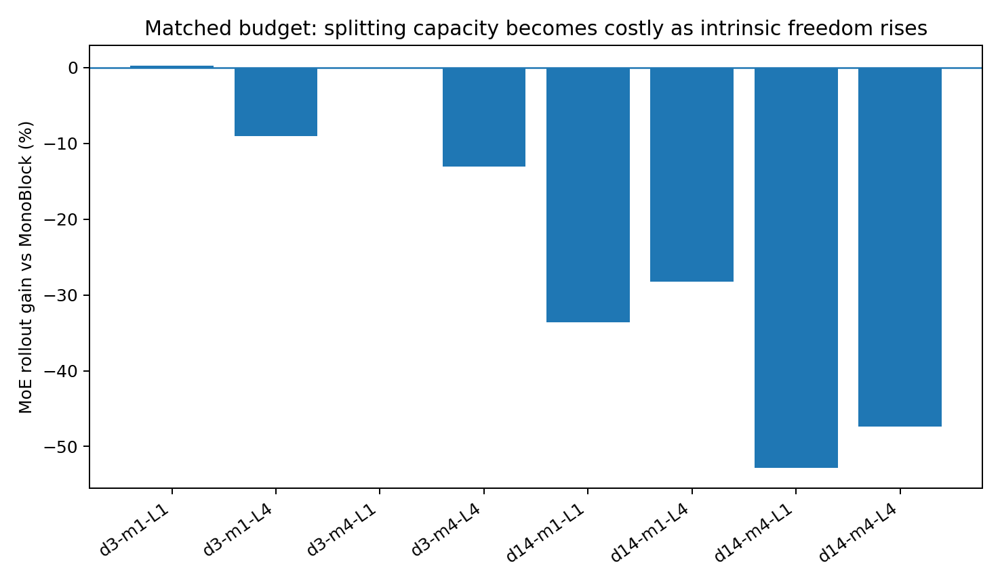

Figure 7. Matched-budget MoE rollout gains across the synthetic 2×2×2 design. Negative gains indicate higher error after partitioning. Each condition uses two model initializations.

Generator heterogeneity determines whether distinct local prediction functions may benefit from specialization.

Intrinsic dimension contributes to the representational capacity needed within each specialist.

Specialization must therefore be evaluated together with per-expert capacity. Routing among undersized modules can be functionally meaningful and still produce worse predictions than a single larger block.

#### 5.1.3 Routing interventions and overall model performance

Table 21. Router diagnostics under multiple laws.

| World | Router-law NMI | Norm. entropy | Uniform penalty | Shuffle penalty |
| --- | --- | --- | --- | --- |
| d=3, m=1 | 0.279 | 0.976 | 13.9% | 13.9% |
| d=3, m=4 | 0.342 | 0.921 | 43.7% | 51.1% |
| d=14, m=1 | 0.489 | 0.853 | 408.3% | 505.5% |
| d=14, m=4 | 0.435 | 0.908 | 103.1% | 120.9% |

Evidence: [003/router_summary.csv](evidence/experiments/003/router_summary.csv).

Controlled simulation.

In the multi-law conditions, router–family NMI is approximately 0.28–0.49. Replacing learned weights with uniform weights or exchanging them across samples increases rollout error by approximately 14–505%. These interventions establish that the router contributes to computation in the trained model.

Figure 8. Router interventions in synthetic multi-law conditions. Uniform and shuffled routing increase error even where the original MoE has higher overall error than MonoBlock. Routing contribution and architecture-level advantage are separate measurements.

The capacity comparisons and routing interventions identify two distinct constraints: recognizing the appropriate transition regime and providing sufficient capacity to model it.

#### 5.1.4 Capacity and oracle-routing comparisons

Table 22. Expert-capacity and oracle comparison.

| d | Model | Params | One-step MSE | Long rollout MSE |
| --- | --- | --- | --- | --- |
| 3 | MonoBlock | 10,688 | 0.01230 | 0.05170 |
| 3 | MatchedMoE | 10,332 | 0.01722 | 0.05847 |
| 3 | OvercompleteMoE | 25,104 | 0.01242 | 0.04983 |
| 3 | Oracle4xMono | 42,752 | 0.00658 | 0.00644 |
| 14 | MonoBlock | 10,688 | 0.01518 | 0.02176 |
| 14 | MatchedMoE | 10,332 | 0.03330 | 0.03206 |
| 14 | OvercompleteMoE | 25,104 | 0.01863 | 0.01932 |
| 14 | Oracle4xMono | 42,752 | 0.00597 | 0.00339 |

Evidence: [003/capacity_followup_summary.csv](evidence/experiments/003/capacity_followup_summary.csv).

Controlled simulation. Lower MSE indicates lower prediction error within the same task and target scaling. Oracle routing supplies true law identities and increases total parameters; it is a combined information and capacity comparison.

Figure 9. Capacity comparisons in heterogeneous long-memory conditions. Larger learned experts improve rollout. The oracle condition combines known law identities with four full-capacity blocks, so its advantage includes both routing information and additional capacity.

For d=14, MonoBlock rollout MSE is 0.02176 and matched-budget MoE MSE is 0.03206. Overcomplete experts reduce MSE to 0.01932, approximately 11.2% below MonoBlock. Four full-capacity experts routed by the true law identity achieve 0.00339, approximately 84.4% below MonoBlock. The oracle condition uses 42,752 parameters versus 10,688 for MonoBlock; its improvement cannot be assigned to routing alone.

The relevant questions are whether the transition field admits useful decomposition, whether each module has adequate capacity, and whether history identifies the local function to apply.

#### 5.1.5 History as system identification

In single-law first-order worlds, four frames offer almost no linear prediction gain over one. With four hidden first-order laws, the gain rises to approximately 31–40%. The extra history identifies the unobserved generator even though the physical transition equation remains first-order.

A process that is Markov in its full state can require history when part of that state or its governing regime is unobserved.

Memory requirements therefore include dynamical dependence and identification of hidden states or regimes. A recurrent predictive state can use history to estimate which generating mechanism is currently active.

#### 5.1.6 Data properties and modelling implications

Table 23. Data properties and architectural implications.

| Data property | Observed training effect | Modelling implication |
| --- | --- | --- |
| Higher intrinsic dimension | Splitting a fixed budget can underallocate each local function | Test adequate per-expert capacity |
| Multiple transition laws | Routing interventions affect long rollout | Evaluate state-conditioned modules |
| Longer dynamical memory | One frame omits predictive information | Retain history in state estimation |
| Hidden generator identity | History helps even with first-order latent dynamics | Evaluate system identification from history |
| Rollout sensitivity | One-step and rollout rankings can differ | Select models using the relevant horizon |

#### 5.1.7 Empirical design criteria

Estimate local response complexity and history requirements before allocating expert capacity. Evaluate routing through prediction and intervention, alongside comparisons with a shared model.

A useful conceptual summary of the interacting design variables is:

data geometry, generator ambiguity, per-expert capacity and routing quality jointly influence long-horizon predictive stability.

Table 24. Diagnostic axes beyond dimension.

| Diagnostic axis | Variation beyond effective dimension | Model comparison |
| --- | --- | --- |
| Curvature / nonlinearity | Equal d95 can have different local derivatives | Block width, expert count and routing sparsity |
| Conditional innovation | Unpredictable noise differs from structured dimension | Noise fit and shared-predictor performance |
| Partial observability | Hidden states can alias in current observations | History length, state dimension and specialization |
| Topology | Sequences, sets, graphs and fields preserve different relations | Native encoders and common encodings |
| Nonstationarity / switching | The generator can change within an episode | Routing response, lag and interference |
| Symmetry / gauge | Raw coordinates can contain representational redundancy | Functional response geometry and state size |
| Sparse events / heavy tails | Rare events can have large predictive consequences | Capacity allocation and retention of rare events |

#### 5.1.8 Results synthesis

Heterogeneity creates a potential benefit from specialization, and local response complexity determines the capacity required to realize it.

A small, evenly divided MoE can perform substantially worse than a monolithic model even when its routing is useful. Increasing expert capacity reverses the higher-dimensional rollout comparison. The oracle condition measures the combined benefit of known regime identities and larger total capacity.

These results support maintaining enough representational capacity to separate relevant mechanisms and testing specialization as a capacity-allocation choice. They do not establish a universal minimum state dimension or a universally preferred modular architecture.

#### 5.1.9 Evidence records

Table 25. Experiment 003 evidence records.

| Evidence record | Contents |
| --- | --- |
| WORLD_DATA_GEOMETRY_003_bundle.zip | Experiment evidence bundle |
| all_runs.csv | 8 conditions × 2 seeds × Mono/MoE results |
| condition_geometry.csv | d95, history gain and law separation by condition |
| condition_summary.csv | Factorial summary and MoE gain |
| router_summary.csv | Entropy, law NMI and routing interventions |
| capacity_followup.csv | Matched, overcomplete and oracle comparisons by seed |
| factorial_moe_gain.png | Matched-budget 2×2×2 comparison |
| capacity_ladder.png | Capacity comparisons at low and high dimension |
| router_intervention.png | Functional routing interventions |

### 5.2 WORLD-DATA-MICROSTRUCTURE-004 Curvature noise and anisotropy at fixed dimension

Equal dimension can accompany different training behaviour. This experiment examines partitionability, local response complexity and unpredictable innovation separately.

#### 5.2.1 Controlled design

After separating dimension, memory and heterogeneity in experiment 003, this study fixes dimension and varies the microstructure of the transition field.

All eight worlds have latent dimension 8, observation dimension 24, four local state-defined regimes, identical sequence length and the same optimization protocol. The manipulated factors are local curvature, conditional innovation noise and anisotropy.

Observed d95 equals 8 in every condition, so differences in this measured dimension cannot explain the performance comparisons.

Table 26. Microstructure interventions.

| Axis | Operational measure | Prediction requirement |
| --- | --- | --- |
| Local curvature | Change in the transition Jacobian within a small neighbourhood | Complexity of the local rule representation |
| Conditional innovation | Manipulated additive noise with known noise entropy | Unpredictable part of the future given inputs |
| Anisotropy | Uneven singular-value spectrum of the transition Jacobian | Retention of high-sensitivity directions |

#### 5.2.2 Results across the eight conditions

Table 27. Fixed-dimension condition comparison.

| Condition | d95 | Curvature | Cond.# | Mono rollout | Matched MoE | MoE gain |
| --- | --- | --- | --- | --- | --- | --- |
| C0_N0_A0 | 8 | 0.021 | 1.37 | 0.0336 | 0.0234 | +30.3% |
| C0_N0_A1 | 8 | 0.014 | 5.36 | 0.0099 | 0.0139 | -40.8% |
| C0_N1_A0 | 8 | 0.033 | 1.35 | 0.2543 | 0.2490 | +2.1% |
| C0_N1_A1 | 8 | 0.027 | 4.88 | 0.2441 | 0.2421 | +0.9% |
| C1_N0_A0 | 8 | 0.387 | 10.47 | 0.7456 | 0.8187 | -9.8% |
| C1_N0_A1 | 8 | 0.270 | 20.43 | 0.0953 | 0.1219 | -28.0% |
| C1_N1_A0 | 8 | 0.381 | 5.42 | 0.7054 | 0.7438 | -5.4% |
| C1_N1_A1 | 8 | 0.358 | 20.89 | 0.7574 | 0.8080 | -6.7% |

Evidence: [004/condition_comparison.csv](evidence/experiments/004/condition_comparison.csv).

Controlled simulation.

In the low-curvature, low-noise, isotropic condition C0_N0_A0, Mono rollout MSE is approximately 0.0336 and StateMoE MSE 0.0234, a 30.3% reduction. Increasing anisotropy leaves d95 at 8 and slightly reduces the curvature index, but raises the condition number from approximately 1.37 to 5.36; matched-budget MoE error becomes 40.8% higher than Mono error.

High curvature also changes the comparison. In C1_N0_A0, the curvature index is approximately 0.387, with Mono rollout MSE approximately 0.746 and matched MoE MSE 0.819. Combining high curvature and strong anisotropy produces local condition numbers of approximately 20–21.

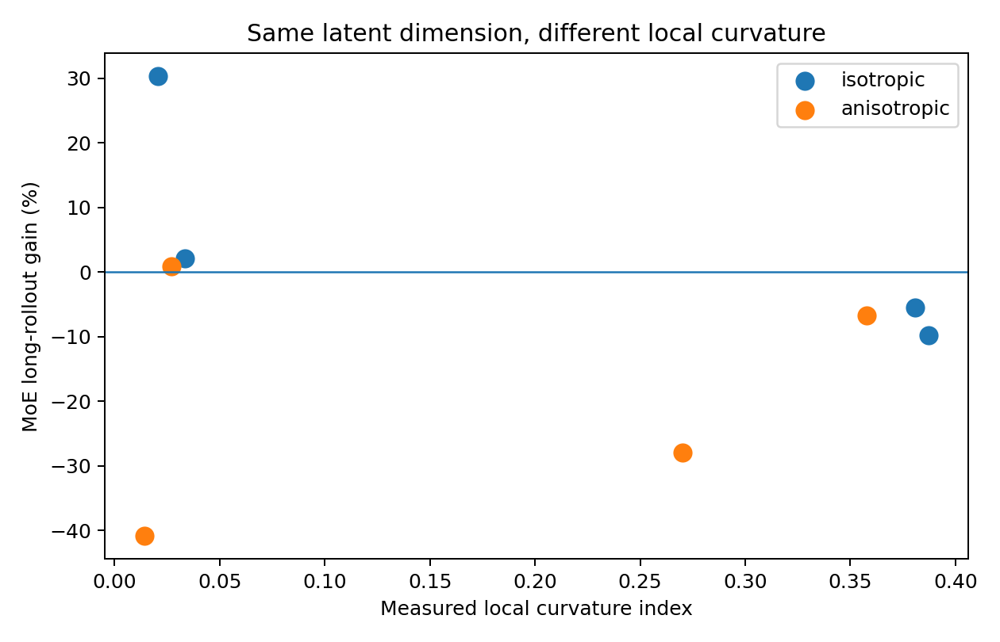

Figure 10. Curvature and matched-budget MoE rollout gain in synthetic worlds with d95 fixed at 8. The comparison isolates response geometry beyond the measured state dimension.

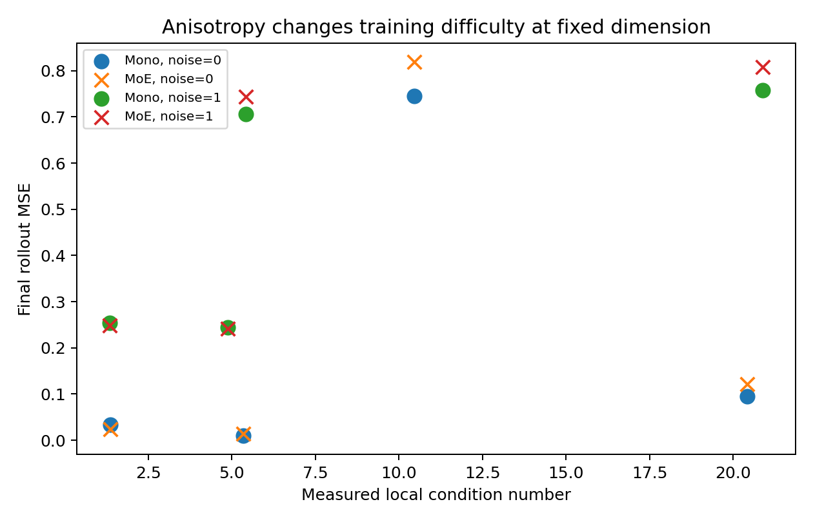

Figure 11. Anisotropy and prediction error at fixed intrinsic dimension. The plotted conditions vary local response sensitivity without changing d95.

#### 5.2.3 Conditional innovation and attainable prediction accuracy

Increasing innovation noise raises prediction error and narrows the gap between architectures. In low-curvature isotropic conditions, the MoE gain falls from 30.3% to 2.1%; in low-curvature anisotropic conditions, it changes from −40.8% to approximately +0.85%.

Innovation that is independent of the available history contributes an irreducible component to prediction error under the stated observation model.

This component should be distinguished from representational or estimation error. Additional capacity can model predictable structure, but the conditional innovation specified by the simulator remains random given the model's inputs.

#### 5.2.4 Capacity and regime-label interventions

Table 28. Capacity and quadrant-oracle interventions.

| Condition | Model | Final rollout MSE | Gain vs Mono |
| --- | --- | --- | --- |
| C0_N0_A0 | MonoBlock | 0.0336 | +0.0% |
| C0_N0_A0 | MatchedMoE | 0.0234 | +30.3% |
| C0_N0_A0 | OracleMoE | 0.0238 | +29.1% |
| C0_N0_A0 | OvercompleteMoE | 0.0145 | +56.9% |
| C0_N0_A1 | MonoBlock | 0.0099 | +0.0% |
| C0_N0_A1 | MatchedMoE | 0.0139 | -40.8% |
| C0_N0_A1 | OracleMoE | 0.0199 | -101.9% |
| C0_N0_A1 | OvercompleteMoE | 0.0072 | +27.1% |
| C1_N0_A0 | MonoBlock | 0.7456 | +0.0% |
| C1_N0_A0 | MatchedMoE | 0.8187 | -9.8% |
| C1_N0_A0 | OracleMoE | 1.1242 | -50.8% |
| C1_N0_A0 | OvercompleteMoE | 0.6986 | +6.3% |

Evidence: [004/capacity_oracle_comparison_with_baseline.csv](evidence/experiments/004/capacity_oracle_comparison_with_baseline.csv).

Controlled simulation. Lower MSE indicates lower prediction error within the same task and target scaling.

With larger experts, the MoE gain changes from −40.8% to +27.1% in C0_N0_A1 and from −9.8% to +6.3% in C1_N0_A0. In C0_N0_A0, the gain increases from 30.3% to 56.9%. The matched-budget comparison therefore reflects local capacity as well as partition structure.

The capacity sweep shows that curvature and anisotropy affect useful per-expert capacity even when global d95 is unchanged. It does not identify a universal minimum-capacity formula.

Routing by the simulator's quadrant labels performs worse than learned routing in all three representative conditions, especially under anisotropy and curvature. The simulator's labelled regions are therefore not the best computational partition among those evaluated.

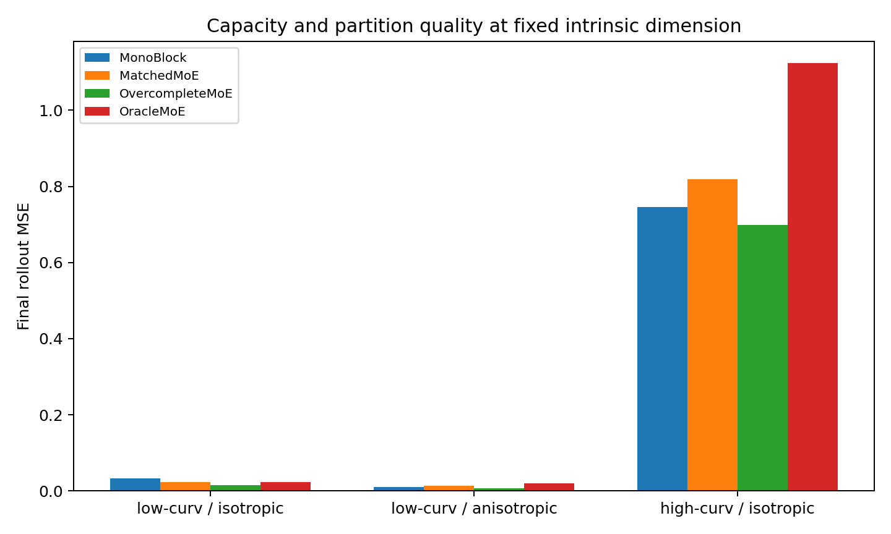

Figure 12. Matched, overcomplete and quadrant-oracle MoE comparisons. The synthetic intervention separates the effect of expert capacity from the effect of using the simulator's region labels.

#### 5.2.5 A multidimensional description of training geometry

Effective dimension d_eff describes the number of independent coordinates needed to represent the state distribution under the selected measure.

Local curvature κ_local describes how quickly the transition Jacobian changes across nearby states.

Anisotropy χ describes concentration of future sensitivity in a small number of high-gain directions.

Conditional entropy H(next | state) describes uncertainty in the next observation given the specified state information.

Observer memory τ_obs describes the history needed to identify a hidden state or generator, including when the full process is Markov.

Functional partitionability Π_F describes whether local response functions form reusable groups for computation.

We summarize these quantities as the descriptive profile G(d_eff, κ_local, χ, H_cond, τ_obs, Π_F, topology, nonstationarity, tails, …). G denotes a collection of diagnostics, not a fitted equation or universal training law.

#### 5.2.6 Implications for shared and modular models

A monolithic model makes its full capacity available across the transition field. This can help with high curvature, anisotropy or weakly separable local functions.

Modularity can improve rollout when reusable local functions exist, the router identifies them from predictive state, and each expert can represent the assigned function. These conditions are assessed through capacity sweeps and routing interventions.

High conditional innovation can narrow differences in attainable error between architectures.

Expert identity is evaluated through its effect on prediction rather than assigned solely from simulator labels.

The experiment supports considering partitionability, local capacity and conditional innovation together when comparing architectures.

#### 5.2.7 Evidence records

WORLD_​DATA_​MICROSTRUCTURE_​004_​bundle.zip

WORLD_​DATA_​MICROSTRUCTURE_​004/​condition_​comparison.csv

WORLD_​DATA_​MICROSTRUCTURE_​004/​data_​geometry.csv

WORLD_​DATA_​MICROSTRUCTURE_​004/​router_​intervention.csv

WORLD_​DATA_​MICROSTRUCTURE_​004/​capacity_​oracle_​comparison_​with_​baseline.csv

WORLD_​DATA_​MICROSTRUCTURE_​004/​curvature_​vs_​moe_​gain.png

WORLD_​DATA_​MICROSTRUCTURE_​004/​anisotropy_​vs_​error.png

WORLD_​DATA_​MICROSTRUCTURE_​004/​capacity_​oracle_​followup.png

### 5.3 WORLD-OBSERVABILITY-005 History and hidden-state reconstruction

History can recover some information hidden from the current observation and can identify an unobserved generator. Conditional innovation contributes a different source of uncertainty.

#### 5.3.1 What information does history supply

The simulator has an almost deterministic first-order latent process of dimension 8 and observation dimension 12. The two factors are full observation versus a rank-4 projection, and one generator versus four hidden generators fixed within each episode.

The models are a single-frame block, a four-frame RecurrentMono and a four-frame RecurrentMoE. They predict the next frame and autoregressive rollout without latent-state or law-identity supervision.

#### 5.3.2 Observability control

The full observation operator has single-frame rank 8; the partial operator has rank 4. The finite-history observability matrix formed from four frames has rank 8 in the partial condition. Thus, in this construction, directions missing from one frame remain recoverable from the temporal observations.

Finite-history observability distinguishes recoverable hidden-state information from conditional innovation under the specified model. Recovery also depends on conditioning and measurement noise.

Table 29. Observability and history comparison.

| Condition | Rank 1 | Rank 4 | Single MSE | Recurrent MSE | History gain | Recurrent rollout | MoE rollout | MoE gain |
| --- | --- | --- | --- | --- | --- | --- | --- | --- |
| P0_M0 | 8 | 8 | 0.0004 | 0.0012 | -163.3% | 0.0013 | 0.0021 | -59.9% |
| P0_M1 | 8 | 8 | 0.1058 | 0.0368 | +65.2% | 0.0145 | 0.0158 | -9.0% |
| P1_M0 | 4 | 8 | 0.0652 | 0.0020 | +97.0% | 0.0014 | 0.0017 | -14.3% |
| P1_M1 | 4 | 8 | 0.1115 | 0.0794 | +28.8% | 0.0187 | 0.0195 | -4.4% |

Evidence: [005/condition_comparison.csv](evidence/experiments/005/condition_comparison.csv).

Controlled simulation. Lower MSE indicates lower prediction error within the same task and target scaling.

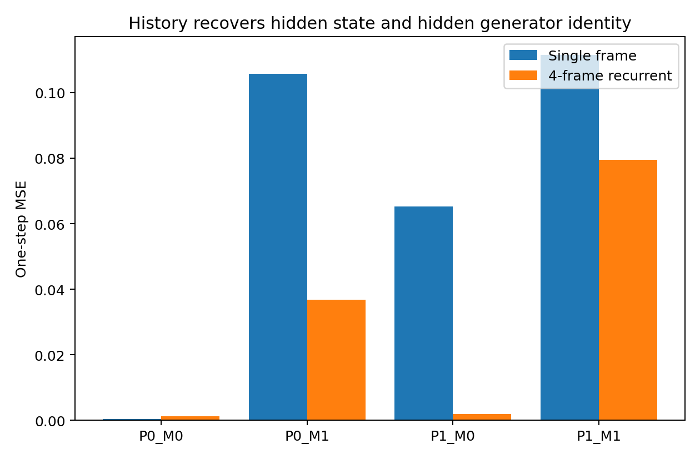

Figure 13. History gains in the synthetic observability design. The four conditions separate state reconstruction from hidden-generator identification. P denotes partial observation and M denotes multiple hidden generators.

#### 5.3.3 Interpretation of the four conditions

P0_M0, full observation and one law: SingleFrame MSE is approximately 0.0004 and RecurrentMono MSE approximately 0.0012. The current frame is sufficient for the tested transition, and the recurrent model introduces additional estimation and optimization costs.

P0_M1, full observation and multiple hidden laws: history reduces one-step MSE from approximately 0.1058 to 0.0368, a reported gain of 65.2%. Here the additional information identifies the generator.

P1_M0, partial observation and one law: the observability rank increases from 4 for one frame to 8 for four. History reduces MSE from approximately 0.0652 to 0.0020, a gain of approximately 97.0%, through hidden-state reconstruction.

P1_M1, partial observation and multiple laws: history supports both reconstruction and generator identification. The gain is approximately 28.8%, with greater residual error than when either requirement is isolated.

#### 5.3.4 Three sources of uncertainty

Conditional innovation is random given the specified history and inputs.

Partial observability hides state directions in the current frame. History recovers them when the observation dynamics provide sufficient information.

Generator ambiguity allows the same observed state to continue under different transition laws. History can help identify the active law.

An identification horizon is the history length needed for approximate predictive sufficiency under a specified query and error tolerance. It can exceed the dynamical order of the latent process.

#### 5.3.5 Memory and expert routing

Matched-budget RecurrentMoE has higher rollout error than RecurrentMono in all four conditions. Reported MoE gains are approximately −59.9%, −9.0%, −14.3% and −4.4% for full/single, full/multiple, partial/single and partial/multiple conditions. Partial observation therefore creates a state-estimation requirement that expert routing alone does not satisfy in this design.

Routing interventions still change prediction, so routing can be functionally relevant without yielding a net architectural advantage. Router–law NMI is only about 0.02 in the multi-law conditions, indicating weak correspondence with the simulator categories.

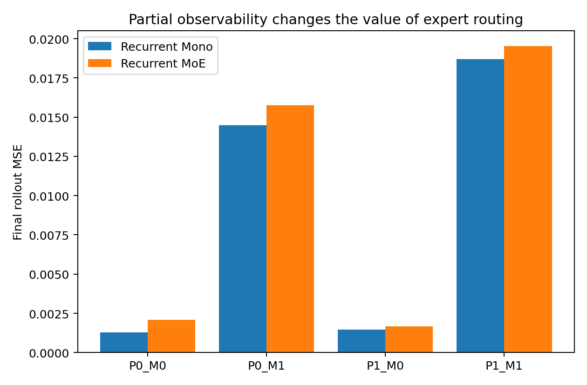

Figure 14. Recurrent prediction under partial observation. The synthetic comparison evaluates whether expert partitioning adds value after introducing history; RecurrentMono has lower rollout error in each tested condition.

#### 5.3.6 Observability diagnostics

Instantaneous rank rank(C): the latent directions visible in a single observation.

Finite-history rank rank(O_H): the directions recoverable from H observations under the specified dynamics.

Observability conditioning: the numerical sensitivity of hidden-state reconstruction.

Identification horizon H*: the shortest history meeting a specified predictive-sufficiency criterion.

The descriptive training profile becomes G(d_eff, κ_local, χ, H_cond, observability, H*, generator ambiguity, Π_F, topology, nonstationarity, tails, …).

#### 5.3.7 Implications for partially observed data

Occlusion, contact-dependent measurements, acoustic projections and aggregated population records are examples of observation processes that retain only part of an underlying state. The controlled result motivates testing both state reconstruction and generator identification before selecting a current-frame representation.

Evaluate expert routing on a predictive state with adequate information for the task, and measure state-estimation error separately from routing error.

#### 5.3.8 Evidence records

WORLD_​OBSERVABILITY_​005_​bundle.zip

WORLD_​OBSERVABILITY_​005/​condition_​comparison.csv

WORLD_​OBSERVABILITY_​005/​observability_​geometry.csv

WORLD_​OBSERVABILITY_​005/​router_​intervention.csv

WORLD_​OBSERVABILITY_​005/​history_​benefit.png

WORLD_​OBSERVABILITY_​005/​moe_​under_​partial_​observability.png

### 5.4 DATA-FUSION-PARTITION-006 Parameter sharing along a continuous mechanism field

Generating mechanisms can vary continuously with environment, state, scale and time. Source labels, differences in means or gaps in sample density do not by themselves determine where parameters should be separated. This experiment measures whether training in one data region helps or harms future prediction in another.

A useful partition criterion is the compatibility of the regions' predictive constraints under shared parameters.

#### 5.4.1 A continuous mechanism without discrete law boundaries

Context u lies in [−1, 1], and the local transition operator changes smoothly with u. Even the sharp-transition condition uses a continuous sigmoid rather than discrete mechanism labels.

Generator contrast measures the difference between the transition rules at the ends of the continuum.

Transition width controls whether that difference is spread broadly or concentrated in a narrow region.

Support connectivity controls whether the two ends are linked by dense observations or sparse bridge samples.

The training strategies are MonoFull, using all data jointly; HardSplitFull, dividing at u=0; SoftMoEFull, using continuous routing; and SharedResidualFull, combining a shared predictor with softly routed local residuals.

#### 5.4.2 Capacity control

With small experts, Mono performs best across the continuous conditions. Since each expert also has less capacity, this comparison mixes partition effects with undercapacity. A further comparison gives each expert a complete block equal in capacity to Mono and increases the endpoint mechanism contrast. This matches local block capacity, not total model size, and the ranking changes.

#### 5.4.3 Results with matched local block capacity

Table 30. Sharing strategies with matched local block capacity.

| Condition | Mono | Hard split | Soft MoE | Shared+residual | Interpretation |
| --- | --- | --- | --- | --- | --- |
| broad+dense | 0.0881 | 0.0469 | 0.0148 | 0.0334 | Soft routing retains continuous sharing and local specialization |
| broad+sparse | 0.0682 | 0.0608 | 0.0135 | 0.0256 | Soft routing has lower error despite sparse bridge samples |
| sharp+dense | 0.2008 | 0.0403 | 0.0636 | 0.0937 | Hard split has lower overall error; boundary cost is separate |
| sharp+sparse | 0.1961 | 0.0451 | 0.0814 | 0.1036 | Concentrated drift and weak bridge favour hard split overall |

Evidence: [006/fair_capacity_summary.csv](evidence/experiments/006/fair_capacity_summary.csv).

Controlled simulation. Each expert matches Mono block capacity; total model capacity is larger for modular models.

Relative to Mono, Soft MoE reduces error by 83.2% in broad+dense and 80.2% in broad+sparse conditions. In sharp+dense, Hard split reduces error by 79.9% and Soft MoE by 68.3%; in sharp+sparse, the reductions are 77.0% and 58.5%. The rate of mechanism change affects the value of each partition strategy.

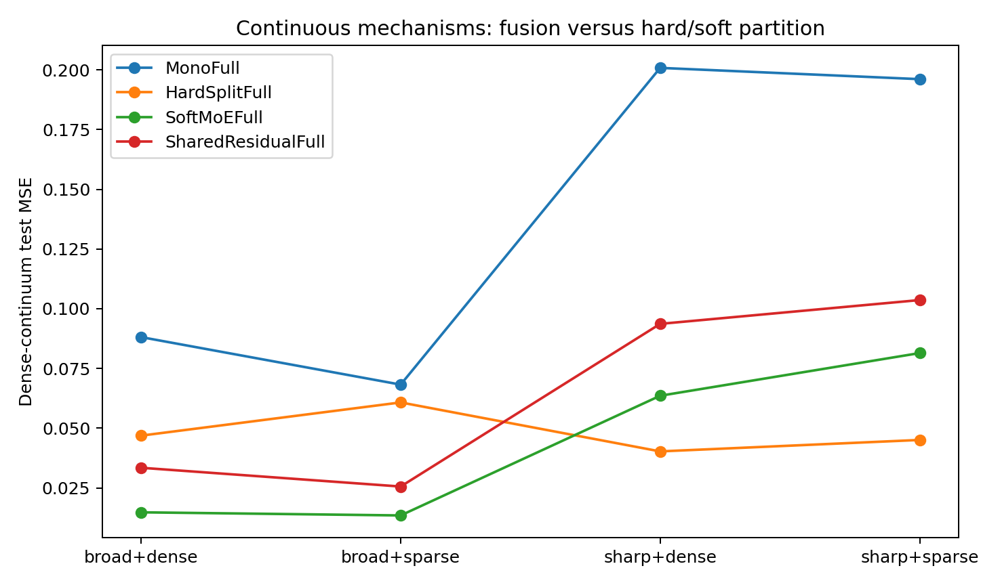

Figure 15. Prediction error under continuous generator drift. The synthetic comparison varies transition width and bridge density; experts have the same local block capacity as Mono, so modular models have larger total capacity.

#### 5.4.4 Prediction near hard boundaries

Overall MSE conceals a local cost of hard partitioning: the fitted model can be discontinuous where the true mechanism is continuous.

Table 31. Boundary error and response jumps.

| Condition | Hard boundary MSE | Soft boundary MSE | Hard jump | Soft jump |
| --- | --- | --- | --- | --- |
| broad+dense | 0.0946 | 0.0125 | 0.728 | 0.011 |
| broad+sparse | 0.1903 | 0.0156 | 0.963 | 0.013 |
| sharp+dense | 0.1356 | 0.0954 | 1.377 | 0.020 |
| sharp+sparse | 0.1900 | 0.1069 | 1.444 | 0.019 |

Evidence: [006/fair_capacity_summary.csv](evidence/experiments/006/fair_capacity_summary.csv).

Controlled simulation. Lower MSE indicates lower prediction error within the same task and target scaling.

A density gap is stronger evidence for a hard partition when it also coincides with persistent predictive incompatibility. Boundary error remains a separate evaluation criterion.

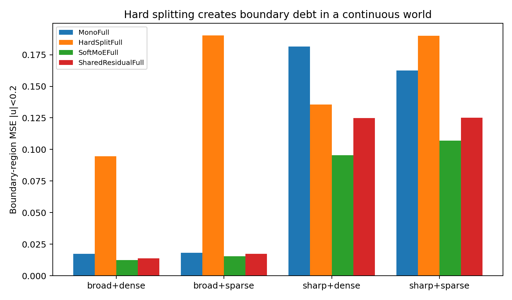

Figure 16. Boundary MSE and fitted response jumps in the continuous synthetic world. Hard splitting introduces larger discontinuities than soft routing in all four conditions.

#### 5.4.5 Training compatibility kernel

Local held-out transfer is measured by taking a small gradient update in region i and evaluating its effect on validation loss in region j.

K(i→j) = [L_j(θ) − L_j(θ − η∇L_i)] / L_j(θ). Positive K indicates that an update in i improves prediction in j; negative K indicates local negative transfer under that update.

Table 32. Local training transfer.

| Condition | Self gain | Adjacent transfer | Far transfer | Negative cells | Weakest adjacent edge |
| --- | --- | --- | --- | --- | --- |
| broad+dense | 0.0052 | +0.0045 | −0.0049 | 50.0% | −0.0007 |
| broad+sparse | 0.0049 | +0.0041 | −0.0044 | 48.4% | ≈0 |
| sharp+dense | 0.0076 | +0.0033 | −0.0021 | 51.6% | −0.0054 |
| sharp+sparse | 0.0071 | +0.0044 | −0.0033 | 51.6% | −0.0052 |

Evidence: [006/training_compatibility_summary.csv](evidence/experiments/006/training_compatibility_summary.csv).

Controlled simulation.

Across the four strongly heterogeneous conditions, adjacent regions generally help one another and distant regions interfere. The weakest adjacent edge occurs near the centre of the continuum, between bins 3 and 4. This supports local parameter sharing along a continuum rather than assuming two naturally isolated clusters.

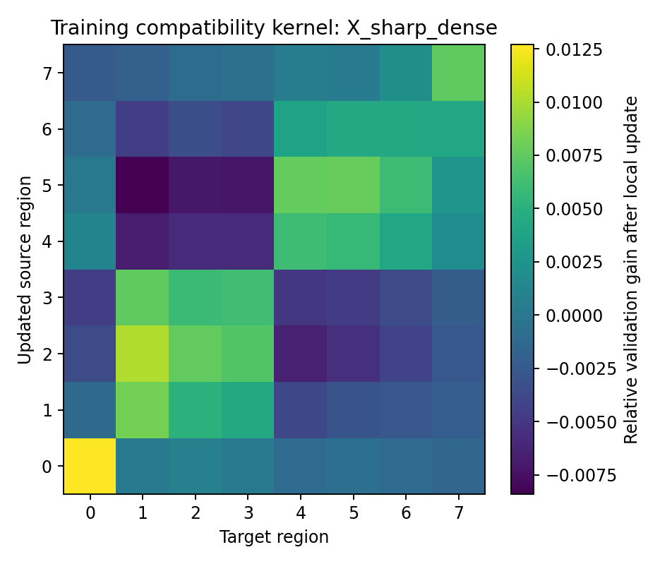

Figure 17. Training compatibility in the sharp+dense synthetic condition. Cells measure the change in held-out loss following a local update. Adjacent regions tend to share useful information; distant regions show negative transfer.

#### 5.4.6 Generator-contrast scan

Table 33. Generator-contrast scan.

| Contrast | Adjacent transfer | Far transfer | Negative fraction | Mono MSE | Soft MSE | Soft gain |
| --- | --- | --- | --- | --- | --- | --- |
| 0.15 | +0.0063 | +0.0019 | 4.7% | 0.0351 | 0.0315 | 10.2% |
| 0.45 | +0.0047 | −0.0004 | 20.3% | 0.0423 | 0.0362 | 14.4% |
| 0.90 | +0.0062 | −0.0020 | 29.7% | 0.0692 | 0.0535 | 22.7% |
| 1.50 | +0.0060 | −0.0039 | 39.1% | 0.1101 | 0.0739 | 32.8% |
| 2.40 | +0.0058 | −0.0046 | 43.8% | 0.2133 | 0.1149 | 46.1% |

Evidence: [006/contrast_compatibility_scan.csv](evidence/experiments/006/contrast_compatibility_scan.csv).

Controlled simulation. Lower MSE indicates lower prediction error within the same task and target scaling.

As contrast increases, adjacent transfer stays positive and distant transfer changes from positive to increasingly negative. The measured structure develops gradually from broad compatibility into local sharing with distant interference.

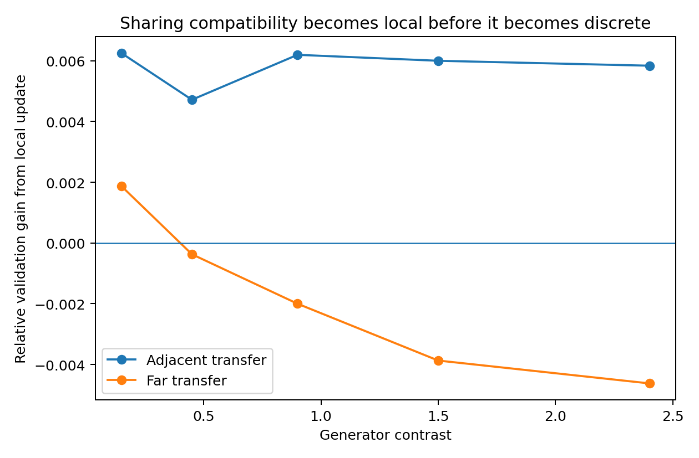

Figure 18. Training transfer across the generator-contrast scan. The synthetic experiment links increasing endpoint contrast to more negative distant transfer and a larger Soft MoE prediction gain.

#### 5.4.7 Criteria for fusion and partition

Measure predictive compatibility before selecting a parameter-sharing structure.

Fusion is a candidate when local rule divergence is low, near and distant transfer are nonnegative, and support is connected. Splitting then risks reducing the information available to each fitted block.

Soft partitioning is a candidate when adjacent transfer remains positive, distant transfer is persistently negative, and the generator varies continuously. A shared state with overlapping experts preserves local continuity.

Hard splitting is a candidate when persistent functional incompatibility is concentrated at a narrow boundary, bridge support or query weight is low, and the measured boundary cost is acceptable.

Variation due mainly to conditional innovation calls for uncertainty modelling. Partitioning is justified by systematic changes in the conditional response rather than random variation alone.

#### 5.4.8 Representing training compatibility as a graph

A training compatibility graph can use local predictive-state neighbourhoods as nodes. Node attributes record effective dimension, curvature, anisotropy, conditional uncertainty, observability and sample density. Edges record held-out transfer and support connectivity. This is a design representation motivated by the controlled comparisons.

Strong compatible paths support continued parameter sharing.

A gradual decline in compatibility supports overlapping experts or soft routing.

Persistent low or negative transfer identifies candidate boundaries for further evaluation.

Local capacity can be varied with measured response complexity rather than held equal by default.

The modelling procedure is to estimate local future responses, construct the compatibility graph, compare shared and partitioned models, allocate capacity, and evaluate joint retraining on held-out predictions.

#### 5.4.9 Related methodological work

Related work addresses local implicit functions (Ben-Shabat et al., Neural Experts, NeurIPS 2024), capacity and negative transfer (Khan, UAI 2026), smooth expert partitions for imbalanced regression (Rashiwa and Branco, Canadian AI 2026), and distribution shifts in pooled medical imaging data (Roy et al., MIDL 2026). The diagnostic used here measures actual held-out loss change after a local update. This locates the experiment within those methodological questions without asserting an exhaustive novelty comparison. Primary records: https://arxiv.org/abs/2410.21643 ; https://proceedings.mlr.press/v337/khan26a.html ; https://proceedings.mlr.press/v318/rashiwa26a.html ; https://proceedings.mlr.press/v315/roy26a.html .

#### 5.4.10 Evidence records

DATA_​FUSION_​PARTITION_​006_​bundle.zip

DATA_​FUSION_​PARTITION_​006/​fair_​capacity_​summary.csv

DATA_​FUSION_​PARTITION_​006/​training_​compatibility_​kernel.csv

DATA_​FUSION_​PARTITION_​006/​training_​compatibility_​summary.csv

DATA_​FUSION_​PARTITION_​006/​contrast_​compatibility_​scan.csv

DATA_​FUSION_​PARTITION_​006/​router_​curve_​X_​broad_​dense.csv

DATA_​FUSION_​PARTITION_​006/​router_​curve_​X_​sharp_​dense.csv

DATA_​FUSION_​PARTITION_​006/​fair_​capacity_​continuum.png

DATA_​FUSION_​PARTITION_​006/​boundary_​debt.png

DATA_​FUSION_​PARTITION_​006/​compatibility_​vs_​contrast.png

DATA_​FUSION_​PARTITION_​006/​compatibility_​kernel_​X_​sharp_​dense.png

### 5.5 HIDDEN-MANIFOLD-PARTITION-007 Discovering predictive geometry without latent coordinates

Partitioning can allocate local capacity continuously over a predictive space, with shared parameters retained across compatible regions.

#### 5.5.1 Experimental question

Experiment 006 supplies an explicit context coordinate u. This study hides the generator coordinate and supplies only a high-dimensional curved context and the current state. The construction tests whether observations that are distant in sensor space but governed by similar transition functions can be recognized as related.

The observed context lies on a two-turn curved manifold embedded in 12 dimensions. The true generating phase varies continuously along it.

The generator is periodic in phase. Regions separated by one full turn are distant in sensor space but have nearly identical future-generating rules.

Discovery uses raw context, a pilot model's predictive Jacobian or the measured training-transfer kernel. Latent phase and turn identity are excluded from discovery.

Latent phase is retained solely as evaluation truth.

#### 5.5.2 Observation predictive and training-compatibility geometry

Three data maps are compared, each measuring a different relationship.

Table 34. Three geometries for partition discovery.

| Geometry | Construction | Relationship measured |
| --- | --- | --- |
| Observation | Raw high-dimensional context distance or K-means | Proximity in sensor space |
| Predictive / generative | Pilot Jacobian J(x)=∂future/∂current-state | Similarity of local transition functions |
| Training compatibility | Held-out loss change after a local update | Benefit or interference under parameter sharing |

For equal generator phase at different turns, mean raw-context distance is 3.692 and mean predictive-signature distance is 0.323, or 8.8% of the raw distance. These are distances in their respective representations, so the numerical ratio is descriptive and depends on their scaling. The label-based recovery comparison provides a separate evaluation of phase structure.

Distant observations can implement similar local transition functions.

#### 5.5.3 Recovery of hidden phase structure

Table 35. Recovery of hidden phase partitions.

| Partition map | ARI vs hidden phase | NMI vs hidden phase |
| --- | --- | --- |
| RawGeometry | 0.533 | 0.570 |
| PredictiveJacobian | 0.798 | 0.796 |
| CompatibilityGraph | 0.247 | 0.344 |
| RandomLocal | 0.096 | 0.172 |

Evidence: [007/partition_recovery.csv](evidence/experiments/007/partition_recovery.csv).

Controlled simulation.

NMI with hidden phase is 0.570 for RawGeometry and 0.796 for PredictiveJacobian. The pilot model's response derivatives therefore recover the hidden generating structure more closely under this metric, without receiving the latent coordinate.

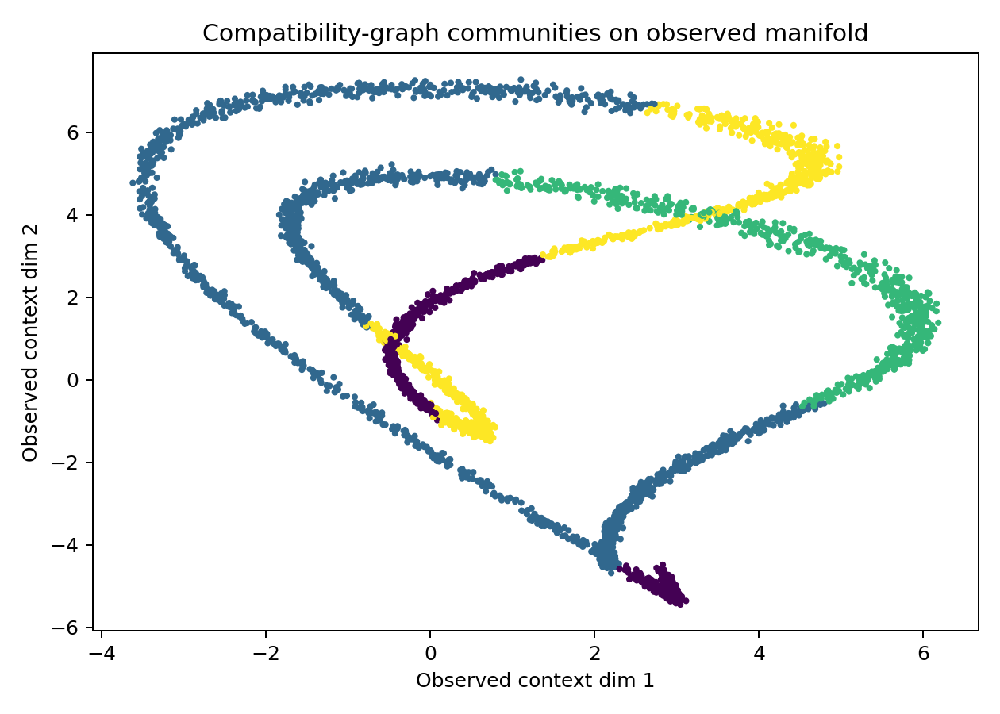

Figure 19. Discovered communities projected onto the observed synthetic manifold. Colours represent the discovered compatibility or predictive partition rather than supplied latent-phase labels.

#### 5.5.4 Hard partitions and shared parameters

Table 36. Hard-partition prediction.

| Training scheme | Test MSE | Boundary MSE | Non-boundary MSE |
| --- | --- | --- | --- |
| Mono | 0.0250 | 0.0217 | 0.0256 |
| OraclePhase | 0.0971 | 0.2052 | 0.0782 |
| PredictiveJacobian | 0.0978 | 0.1849 | 0.0826 |
| RawGeometry | 0.1482 | 0.1797 | 0.1427 |
| CompatibilityGraph | 0.1516 | 0.1597 | 0.1502 |
| RandomLocal | 0.2060 | 0.2232 | 0.2029 |

Evidence: [007/all_partition_performance_combined.csv](evidence/experiments/007/all_partition_performance_combined.csv).

Controlled simulation. Lower MSE indicates lower prediction error within the same task and target scaling.

PredictiveJacobian closely recovers phase structure, but independently training four hard-partitioned experts gives test MSE approximately 0.0978. MonoBlock achieves 0.0250, and even the oracle phase-quartile partition gives approximately 0.0971. Recovery of a meaningful map therefore does not establish that independent parameter blocks are the best use of it.

A functional map can guide additional local capacity and preserve sharing across a continuous transition field.

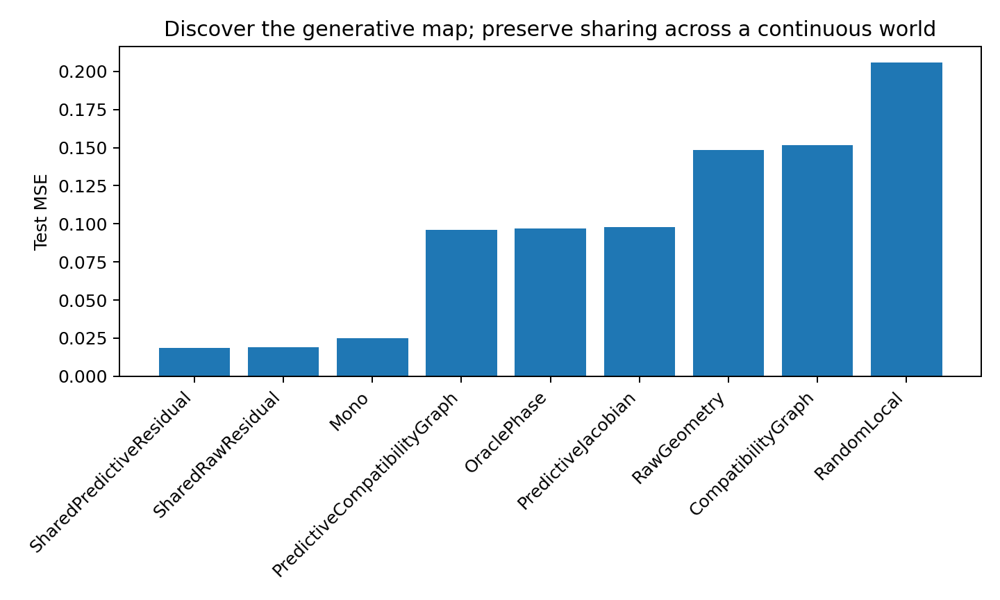

Figure 20. Prediction performance after discovering local structure. Hard partitions have higher error than Mono; shared predictors with soft residual experts retain continuity and improve the evaluated predictions.

#### 5.5.5 Local residual capacity over a shared predictor

Table 37. Shared prediction with local residuals.

| Architecture | Test MSE | Boundary MSE | Non-boundary MSE |
| --- | --- | --- | --- |
| SharedPredictiveResidual | 0.0187 | 0.0170 | 0.0190 |
| SharedRawResidual | 0.0188 | 0.0224 | 0.0182 |
| PredictiveCompatibilityGraph | 0.0961 | 0.0941 | 0.0964 |

Evidence: [007/all_partition_performance_combined.csv](evidence/experiments/007/all_partition_performance_combined.csv).

Controlled simulation. Lower MSE indicates lower prediction error within the same task and target scaling.

Retaining a shared trunk and continuously weighting four residual experts by predictive geometry reduces MSE from 0.0250 to 0.0187, approximately 25%. Raw-geometry soft residuals give similar overall MSE, 0.0188, but boundary MSE is 0.0224 versus 0.0170 for predictive residuals, a reduction of approximately 24%. The predictive map is particularly useful near the evaluated boundaries.

$$
\hat{y}(x)=f_{\mathrm{shared}}(x)+\sum_k w_k(\operatorname{generative\!\text{-}\!state}(x))r_k(x)
$$

The tested architecture combines a shared global function with overlapping local corrections. Experts act as overlapping neighbourhood models over the generating manifold.

#### 5.5.6 Dependence on neighbourhood construction

When the compatibility graph begins with raw-observation neighbourhoods, spectral communities have phase NMI 0.344. Constructing neighbourhoods in predictive-function space raises it to 0.516, still below 0.796 for direct PredictiveJacobian clustering.

The measured transfer kernel depends on the neighbourhood basis, update step size and adequacy of the pilot state. Predictive neighbourhoods improve this construction, but compatibility estimates should be checked for sensitivity to those choices.

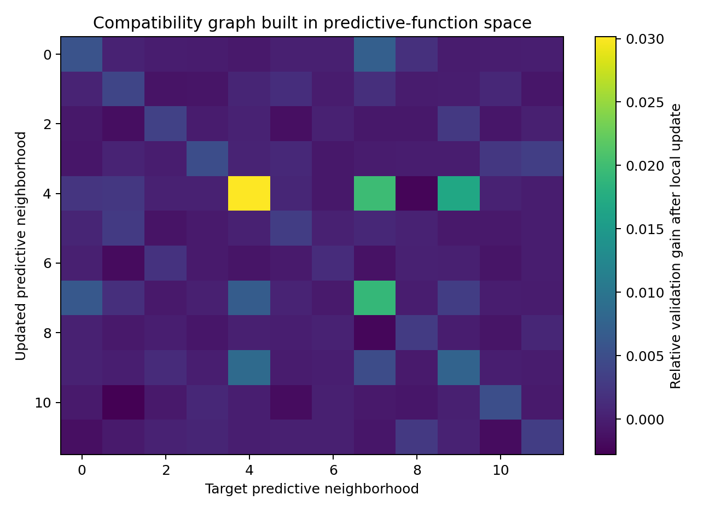

Figure 21. Training compatibility kernel constructed from predictive-function neighbourhoods in the synthetic manifold experiment. The node definition changes the structure recovered by the transfer diagnostic.

#### 5.5.7 An overlapping cover for local capacity

A partition map can specify where capacity is allocated, with overlapping rather than exclusive membership.

Together, experiments 006 and 007 support the following candidate procedure.

Estimate generating neighbourhoods through their predictive consequences.

Retain shared parameters across regions with compatible prediction constraints.

Vary local expert or residual weights continuously with predictive similarity.

Consider a hard boundary where negative transfer is persistent and the measured boundary cost is acceptable.

Allow observations to recruit multiple experts when their useful predictive structure overlaps.

The operational sequence is observation history, predictive-state estimation, generating neighbourhoods, an overlapping cover, and local capacity allocation.

#### 5.5.8 Implications for conditional computation

The result motivates continuous allocation of computation over a learned predictive geometry. A model can use shared parameters and overlapping local modules without assigning one expert to each named modality.

Conditional modular computation over a generating manifold includes shared trunks with soft residual fields and other state-dependent local modules. Top-k sparse routing is one implementation to compare against these alternatives.

#### 5.5.9 Evidence records

HIDDEN_​MANIFOLD_​PARTITION_​007_​bundle.zip

HIDDEN_​MANIFOLD_​PARTITION_​007/​partition_​recovery.csv

HIDDEN_​MANIFOLD_​PARTITION_​007/​partition_​performance.csv

HIDDEN_​MANIFOLD_​PARTITION_​007/​followup_​performance.csv

HIDDEN_​MANIFOLD_​PARTITION_​007/​compatibility_​kernel_​12x12.csv

HIDDEN_​MANIFOLD_​PARTITION_​007/​predictive_​neighborhood_​compatibility_​kernel.csv

HIDDEN_​MANIFOLD_​PARTITION_​007/​geometry_​audit.json

HIDDEN_​MANIFOLD_​PARTITION_​007/​combined_​partition_​performance.png

HIDDEN_​MANIFOLD_​PARTITION_​007/​predictive_​compatibility_​kernel.png

### 5.6 GENERATIVE-MANIFOLD-DRIFT-008 Routing under changing transition functions

This experiment holds the sensor manifold fixed and lets the transition operator behind each observed neighbourhood drift across eras. It separates migration of a discovered map from the prediction cost of using a stale router with fixed current experts.

#### 5.6.1 Controlled transition drift

The six eras use the same observation manifold and input distribution. Only the local transition phase changes, by 0.32 rad per era. A current map is rediscovered from predictive Jacobians in each era, and the era-0 router is retained as the stale map.

The controlled design removes ordinary covariate shift. The manipulated difference is the transition rule associated with the same observed location.

#### 5.6.2 Retraining experts under current and stale maps

Table 38. Drift with retrained experts.

| Era | Rule drift | Map migration | Mono MSE | Fresh map | Stale map | Stale penalty % |
| --- | --- | --- | --- | --- | --- | --- |
| 0.0000 | 0.0000 | 0.0000 | 0.3274 | 0.2278 | 0.2278 | 0.0000 |
| 1.0000 | 0.2216 | 0.2208 | 0.3360 | 0.2317 | 0.2436 | 5.1072 |
| 2.0000 | 0.4356 | 0.3542 | 0.3220 | 0.2386 | 0.2344 | -1.7429 |
| 3.0000 | 0.6349 | 0.3917 | 0.3310 | 0.2381 | 0.2371 | -0.4285 |
| 4.0000 | 0.8137 | 0.4958 | 0.3551 | 0.2667 | 0.2513 | -5.8030 |
| 5.0000 | 0.9676 | 0.5000 | 0.3280 | 0.2371 | 0.2316 | -2.2857 |

Evidence: [008/drift_summary.csv](evidence/experiments/008/drift_summary.csv).

Controlled simulation. Lower MSE indicates lower prediction error within the same task and target scaling.

By era 5, functional-rule drift is approximately 0.968 and aligned map migration approximately 0.50. Nevertheless, retraining experts from scratch under the old map does not consistently worsen error. Expert contents can adapt to an unchanged partition, so movement of a map alone is not evidence that its continued use is harmful.

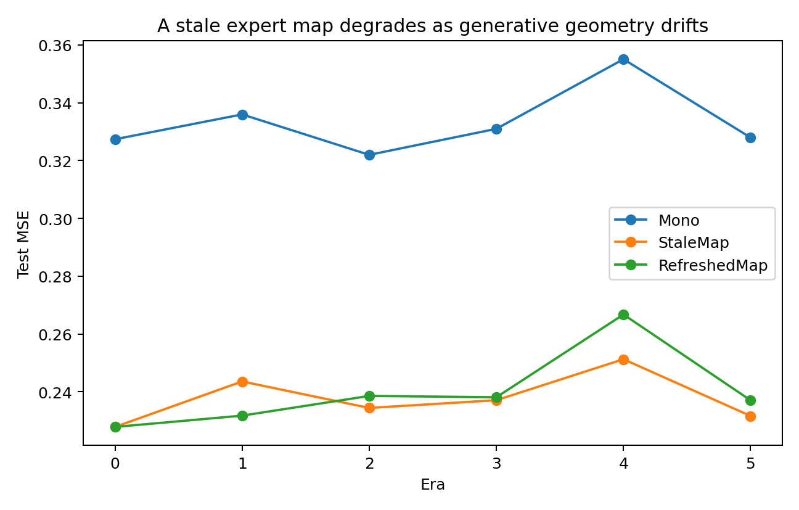

Figure 22. Current and stale maps when expert functions are retrained in each era. The synthetic comparison shows that parameter adaptation can absorb changes in the assignment map.

#### 5.6.3 Replacing the router with expert functions held fixed

Table 39. Stale routing with expert functions fixed.

| Era | Fresh route MSE | Stale route MSE | Penalty % | Rule drift | Map migration |
| --- | --- | --- | --- | --- | --- |
| 0.0000 | 0.2278 | 0.2278 | 0.0000 | 0.0000 | 0.0000 |
| 1.0000 | 0.2317 | 0.3982 | 72.5438 | 0.2216 | 0.2208 |
| 2.0000 | 0.2386 | 0.3197 | 34.0875 | 0.4356 | 0.3542 |
| 3.0000 | 0.2381 | 0.4429 | 85.9859 | 0.6349 | 0.3917 |
| 4.0000 | 0.2667 | 0.4246 | 59.4114 | 0.8137 | 0.4958 |
| 5.0000 | 0.2371 | 0.3990 | 68.5625 | 0.9676 | 0.5000 |

Evidence: [008/strict_routing_intervention_summary.csv](evidence/experiments/008/strict_routing_intervention_summary.csv).

Controlled simulation. Lower MSE indicates lower prediction error within the same task and target scaling.

With expert functions fixed, substituting stale routing raises MSE in eras 1–5 by approximately 72.5%, 34.1%, 86.0%, 59.4% and 68.6%. The relevant mismatch is between current expert functions and the states assigned to them.

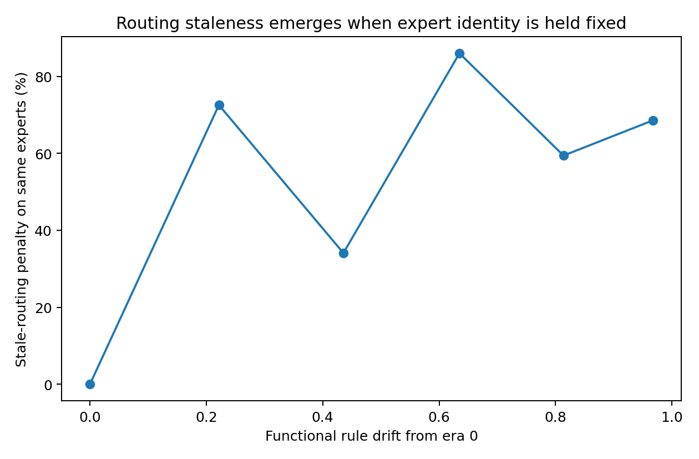

Figure 23. Stale-routing penalty with current expert functions held fixed. This intervention isolates routing mismatch from adaptation of expert contents.

#### 5.6.4 Criteria for changing expert allocation

Keep the current allocation when predictive compatibility and expert coverage remain stable.

Move or reassign routing regions when local response signatures drift but the existing experts retain sufficient capacity.

Consider additional capacity when a region has persistent multimodality or negative transfer within an expert.

Consider merging modules when their response and compatibility profiles converge persistently.

Consider removing a module when its distinct predictive contribution is negligible or its residual is adequately represented by the shared predictor.

These lifecycle rules are design criteria suggested by the routing experiment. Keep, move, duplicate, merge and delete operations are not all experimentally evaluated here.

#### 5.6.5 Time-dependent allocation of computation

The drift comparison motivates maintaining the correspondence between current predictive geometry and expert functions. A time-dependent router or periodic reassessment can represent that correspondence. Its benefit should be evaluated against retraining or retaining an existing allocation.

The proposed modelling sequence links observation history, predictive state, current generating geometry, expert allocation and the predicted transition.

#### 5.6.6 Evidence records

GENERATIVE_​MANIFOLD_​DRIFT_​008_​bundle.zip

GENERATIVE_​MANIFOLD_​DRIFT_​008/​drift_​summary.csv

GENERATIVE_​MANIFOLD_​DRIFT_​008/​strict_​routing_​intervention_​summary.csv

GENERATIVE_​MANIFOLD_​DRIFT_​008/​drift_​performance.png

GENERATIVE_​MANIFOLD_​DRIFT_​008/​map_​migration.png

GENERATIVE_​MANIFOLD_​DRIFT_​008/​strict_​stale_​routing_​penalty.png

### 5.7 GEOMETRY-MATCHED-MECHANISM-FAMILIES-009 Similar marginals and different transitions

Two data families can have nearly identical current-state geometry but different transition laws. This experiment tests whether history identifies that difference and whether routing on the identified mechanism improves rollout.

#### 5.7.1 Matched stationary marginals

Both hidden families are six-dimensional stationary Gaussian processes with marginal distribution N(0,I), a common observation basis, ρ=0.997 and isotropic process noise. Only the direction and angle of the orthogonal transition rotation differ. Family identity is constant within a trajectory and is withheld from learned models.

By construction, a single frame has no population-level information about family identity. The transition between frames carries that information.

Table 40. Family-identification diagnostics.

| Diagnostic | Value |
| --- | --- |
| Current-frame family classifier | 0.4898 |
| Two-frame transition classifier | 1.0000 |
| Normalized covariance difference | 0.2185 |
| Current mean difference | 0.1214 |

Evidence: [009/geometry_audit.json](evidence/experiments/009/geometry_audit.json).

Controlled simulation.

The current-frame classifier reaches 48.98% accuracy, close to chance; a two-frame transition classifier reaches 100%. The sample mean and covariance diagnostics quantify finite-sample differences despite the matched population marginals.

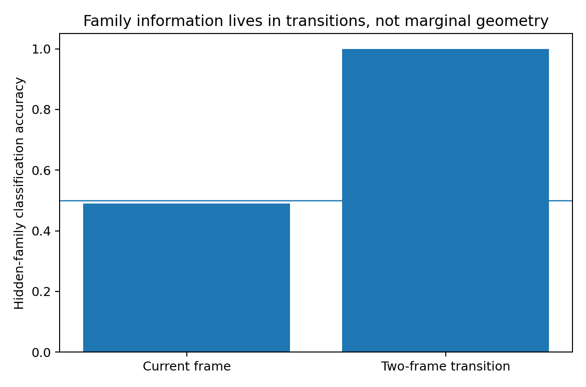

Figure 24. Family identification from current observations and transition pairs in the controlled Gaussian system. The family distinction is encoded in transitions rather than in the theoretical stationary marginal.

#### 5.7.2 Shared recurrence and alternative routers

Table 41. Prediction with alternative routers.

| Model | Params | One-step | Rollout-3 | Final rollout |
| --- | --- | --- | --- | --- |
| OracleMoE | 4934.00000 | 0.03973 | 0.08256 | 0.13395 |
| TransitionClusterMoE | 4934.00000 | 0.04019 | 0.08468 | 0.13586 |
| MonoRNN | 5406.00000 | 0.02425 | 0.14709 | 0.26418 |
| StateMoE | 4934.00000 | 0.03942 | 0.28065 | 0.49309 |
| SingleFrame | 2982.00000 | 0.30103 | 1.31456 | 1.60014 |

Evidence: [009/model_summary_with_unsupervised_routing.csv](evidence/experiments/009/model_summary_with_unsupervised_routing.csv).

Controlled simulation.

SingleFrame has final rollout MSE 1.600. MonoRNN uses history and reduces it to 0.264. OracleMoE, with the true family available to its router, reduces it further to 0.134, approximately half the MonoRNN value.

End-to-end StateMoE has router–family NMI approximately zero and final rollout MSE 0.493. A useful decomposition exists in the construction, but that training objective does not reliably discover it through free routing.

#### 5.7.3 Unsupervised transition signatures

For each four-frame history, the mean of adjacent-frame outer products forms an empirical transition signature. K-means with two clusters is applied to these signatures without family labels.

Cluster–family NMI is 0.9985, and aligned held-out family accuracy is 100%. Using the unsupervised cluster as a fixed router in the same 4,934-parameter expert architecture yields final rollout MSE 0.1359, close to the oracle value 0.1340.

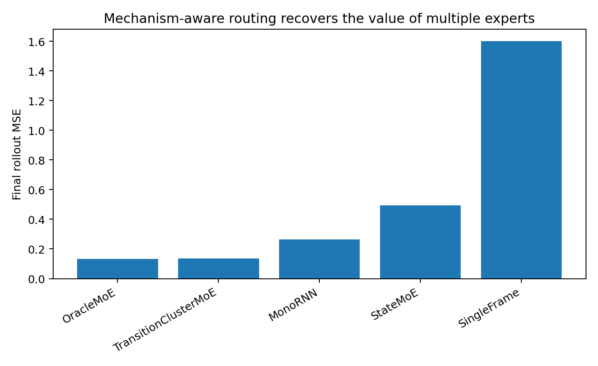

Figure 25. Rollout prediction with unsupervised transition-based routing. The controlled comparison holds the expert architecture fixed and contrasts discovered, learned and oracle assignments.

#### 5.7.4 Implications for data fusion and partition

Similarity of marginal observations does not establish compatibility of their transition functions.

When history identifies distinct conditional laws, state estimation can supply the information needed to compare shared and separate parameterizations.

MonoRNN fits both mechanisms within one recurrent model. Correctly routed modules achieve lower long-horizon error in this experiment.

A poorly performing free router should be evaluated separately from the usefulness of the proposed decomposition.

Conditional-future incompatibility and identifiability provide complementary partition diagnostics.

Parameter sharing should be evaluated in relation to the conditional response, as well as to the geometry of the observed samples.

#### 5.7.5 Relation to transition drift

Experiment 008 finds stale-routing penalties of approximately 34–86% when current experts are fixed. Experiment 009 finds that transition-aware routing nearly halves rollout error despite matched observation marginals. Together, these results connect useful expert allocation to the currently identifiable transition structure.

The modelling procedure is to estimate predictive state from history, identify the current transition family or continuum, and compare shared, overlapping and separated models with adequate capacity.

#### 5.7.6 Evidence records

GEOMETRY_​MATCHED_​MECHANISM_​FAMILIES_​009_​bundle.zip

GEOMETRY_​MATCHED_​MECHANISM_​FAMILIES_​009/​geometry_​audit.json

GEOMETRY_​MATCHED_​MECHANISM_​FAMILIES_​009/​model_​summary_​with_​unsupervised_​routing.csv

GEOMETRY_​MATCHED_​MECHANISM_​FAMILIES_​009/​router_​audit.csv

GEOMETRY_​MATCHED_​MECHANISM_​FAMILIES_​009/​state_​family_​probe.csv

GEOMETRY_​MATCHED_​MECHANISM_​FAMILIES_​009/​family_​identifiability.png

GEOMETRY_​MATCHED_​MECHANISM_​FAMILIES_​009/​model_​comparison_​with_​unsupervised_​routing.png

## 6. Tracking and observation processes

### 6.1 TRACKING-MECHANISM-DATA-010 Persistent carriers kinetics and identity

#### 6.1.1 The structure of tracking data

Many exposure and infectious-disease measurements can be viewed as delayed, mixed and partially observed projections of persistent sources or lineages. The modelling task includes reconstructing those persistent processes from measurements with different temporal responses.

Carrier activity produces transport and internal or lineage-related state, which in turn generates the measured markers.

$$
m_k(t)=\sum_j S_{kj}[K_k*c_j](t)+\varepsilon_k(t)
$$

Kinetic tracking concerns the temporal kernels linking sources to readouts. Identity tracking concerns continuity of the same latent carrier across time, including when different carriers have similar measured signatures.

#### 6.1.2 Controlled source and measurement system

The synthetic world has three persistent sources, each with four hidden compartments: source activity, environmental transport, internal biomarker burden and pathogen-like persistent burden. Twelve observation channels comprise four environmental markers, four biomarkers and four pathogen-like readouts. Training supplies neither source identity nor latent compartment state.

K0/K1 denotes homogeneous kinetics versus source-specific half-lives, uptake and persistence.

O0/O1 denotes well-separated versus strongly overlapping source signatures.

Snapshot uses the current observation. GlobalGRU maintains a fused recurrent state. CompartmentGRU maintains separate environmental, biomarker and pathogen-like measurement states. SourceTracker learns three persistent source-like slots.

#### 6.1.3 Measurement-system consistency

A pilot resampled the source-signature matrix separately across training, validation and test splits. This changes the assay mapping as well as the trajectories. Those pilot results are excluded from the source-tracking comparison reported here.

The reported experiment fixes the measurement/signature system across splits and regenerates individual trajectories. This isolates carrier tracking under a comparable marker-to-source mapping. Changes in that mapping constitute an additional measurement-domain shift.

#### 6.1.4 Results with a fixed measurement system

Table 42. Carrier tracking with a fixed measurement system.

| Condition | Snapshot rollout | GlobalGRU | CompartmentGRU | SourceTracker | Best latent R² | Slot→source R² |
| --- | --- | --- | --- | --- | --- | --- |
| K0_O0 | 1.049 | 1.264 | 1.349 | 1.284 | 0.979 | 0.957 |
| K1_O0 | 1.100 | 1.360 | 1.543 | 1.233 | 0.979 | 0.954 |
| K0_O1 | 0.660 | 0.672 | 0.707 | 0.750 | 0.860 | 0.762 |
| K1_O1 | 0.810 | 0.769 | 0.802 | 0.844 | 0.878 | 0.774 |

Evidence: [010/model_summary.csv](evidence/experiments/010/model_summary.csv), [010/slot_specialization.csv](evidence/experiments/010/slot_specialization.csv).

Evidence annotation: the CSV gives 0.6594661474 for K0_O1 / Snapshot and 0.8434720039 for K1_O1 / SourceTracker. Direct rounding to three decimals gives 0.659 and 0.843; the retained report displays 0.660 and 0.844. See [Publication notes](PUBLICATION_NOTES.md).

Controlled simulation. Higher probe R² indicates more decodable target-state information.

With clear source signatures, SourceTracker's post-hoc latent probe reaches approximately 0.979 and best slot-to-source matching approximately 0.95. Under strongly overlapping signatures, slot-to-source R² falls to approximately 0.76–0.77. In K1_O1, SourceTracker still has the highest latent-state probe among the four architectures, at 0.878.

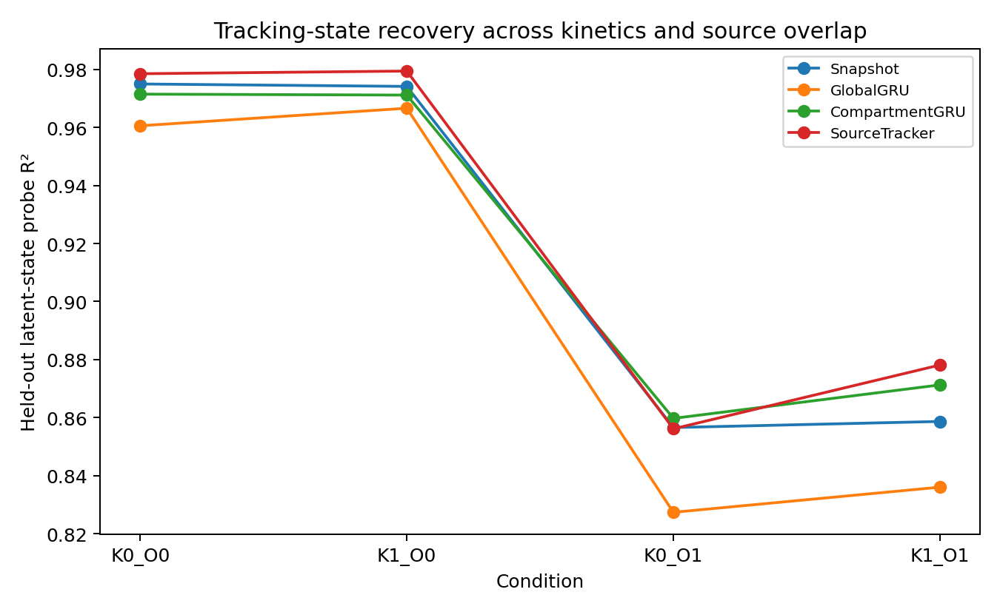

Figure 26. Recovery of latent carrier state in the fixed-measurement synthetic system. Post-hoc probes evaluate information retained by each architecture; latent states are not supplied during training.

#### 6.1.5 Forecast accuracy and mechanism-state fidelity

Snapshot remains competitive on rollout in several conditions because the marker burden is persistent. A model can exploit local autocorrelation to forecast short-term measurements without resolving the underlying sources.

Forecast error and fidelity to latent source state are distinct evaluation targets.

SourceTracker has more readable latent state in the hardest condition but not the lowest rollout error. GlobalGRU is more stable for longer predictions. A tracking evaluation should therefore report both forecast performance and source-state information.

#### 6.1.6 Measurement compartments and persistent carriers

CompartmentGRU separates measurement kinetics such as transport, uptake, clearance and persistence. SourceTracker separates persistent latent identities within mixed observations. The two decompositions describe different aspects of the same data.

measurement-family encoders → carrier/source slots → shared predictive state → future heads

The comparison motivates combining modality-specific kinetic states with persistent carrier slots; the combined hierarchy is a design proposal rather than a result established by these separate models.

#### 6.1.7 Sparse source-resolved anchors

In K1_O1, source-resolved anchors are observed at 12% of time points, representing occasional tracers, isotope-resolved measurements or lineage assays. Neither simple concatenation nor event-gated assimilation automatically improves tracking. NoAnchorSlots has latent R² approximately 0.879 and slot-to-source R² approximately 0.795; AnchorAwareSlots gives approximately 0.867 and 0.764. In this condition, ordinary markers and kinetics already contain substantial identity information.

The value of an additional source-specific measurement depends on the information it contributes conditional on the measurements and state already available.

#### 6.1.8 Anchors under identical ordinary signatures

A further construction gives all three sources identical ordinary marker signatures. Aggregate markers then leave source identity underdetermined, and source-resolved anchors are available at only 12% of time points.

Table 43. Sparse anchor supervision.

| Training contract | Main h1 MSE | Slot→source R² | Future-anchor MSE |
| --- | --- | --- | --- |
| Aggregate future only | 0.0549 | 0.584 | 1.149 |
| + sparse future-anchor loss | 0.0585 | 0.596 | 0.626 |

Evidence: [010/sparse_anchor_supervision_summary.csv](evidence/experiments/010/sparse_anchor_supervision_summary.csv).

Controlled simulation. Lower MSE indicates lower prediction error within the same task and target scaling. Higher probe R² indicates more decodable target-state information.

Adding prediction loss only at observed future-anchor events increases slot-to-source R² from 0.584 to 0.596 and reduces future-anchor MSE from 1.149 to 0.626. Aggregate one-step MSE increases slightly, from 0.0549 to 0.0585. Sparse auxiliary supervision therefore improves the identity-related readout, with a modest change in the probe and a trade-off in aggregate prediction.

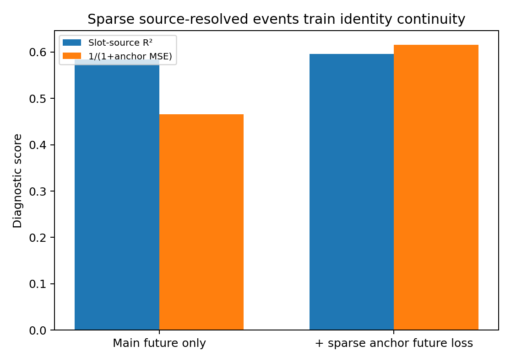

Figure 27. Sparse anchor supervision with identical ordinary source signatures. The synthetic comparison reports aggregate prediction, slot-to-source R² and future-anchor error as separate outcomes.

#### 6.1.9 Tracking geometry

G_track summarizes persistence, kinetic kernels, source overlap, observability, anchor value, assay stability and prediction horizon. It is a diagnostic profile for specifying the tracking task.

Persistence describes the continuing existence of a carrier across observations.

Kinetic kernels describe how measurements filter and delay past carrier activity.

Source overlap describes similarity of different carriers' observed signatures.

Observability describes whether the available history identifies carrier state from mixed measurements.

Anchor value describes the additional information supplied by source-resolved observations.

Assay stability describes consistency of the marker-to-source mapping across time and batches.

Objective horizon determines the relative reward for short-term persistence and retention of longer-term mechanism information.

#### 6.1.10 Mappings to exposure and infectious-disease research

An exposure model may connect source activity to air, dust, water or food; external markers; internal biomarkers; and outcomes. Transport, uptake, clearance and half-life create different temporal kernels. Internal biomarkers can mix contributions from several sources, and source-specific tracers can provide intermittent calibration. These are application mappings from the controlled design.

An infectious-disease model may connect a lineage or infected host to transmission, pathogen burden and assay readouts. Burden measurements and lineage-resolved measurements can have different frequencies and identity resolution. The modelling implication is to distinguish persistent lineage state from the assay process.

Experiment 010 evaluates persistent sources with fixed membership. Branching, genealogy and merging require additional structure and are examined through the subsequent controlled lifecycle studies.

#### 6.1.11 Candidate tracking architecture

continuous background measurements → modality-specific kinetic states → persistent carrier / lineage slots → event-gated sparse calibration → multi-horizon future heads

Tracking models may need to retain both past activity and the identity of the process that generated it.

#### 6.1.12 Evidence records

TRACKING_​MECHANISM_​DATA_​010_​CORRECTED_​bundle.zip

TRACKING_​MECHANISM_​DATA_​010_​CORRECTED/​model_​summary.csv

TRACKING_​MECHANISM_​DATA_​010_​CORRECTED/​slot_​specialization.csv

TRACKING_​MECHANISM_​DATA_​010_​CORRECTED/​anchor_​multihorizon_​summary.csv

TRACKING_​MECHANISM_​DATA_​010_​CORRECTED/​event_​gated_​summary.csv

TRACKING_​MECHANISM_​DATA_​010_​CORRECTED/​sparse_​anchor_​supervision_​summary.csv

TRACKING_​MECHANISM_​DATA_​010_​CORRECTED/​tracking_​state_​recovery.png

TRACKING_​MECHANISM_​DATA_​010_​CORRECTED/​sparse_​anchor_​supervision.png

### 6.2 DYNAMIC-CARRIER-TRACKING-011 Lifecycle events and irregular observation

Experiment 010 studies persistent sources with fixed membership. Here the set of active carriers changes through birth, branching, death and merging. Measurements also arrive either regularly or asynchronously. The controlled construction separates changes in the latent carrier set from changes in observation timing.

#### 6.2.1 A changing set of explanatory states

Lifecycle events change the number and relationships of active explanatory entities. A tracking representation must preserve the consequences of these events, including burdens that persist after source activity ends.

The proposed state comprises a dynamic explanatory set and a separate observation-process state.

Birth introduces an independently active source.

Branching creates a related identity and transfers part of the parent's state or history.

Death ends source forcing, but downstream environmental and biomarker burdens can persist.

Merging combines explanatory states without instantly removing accumulated burden.

Irregular sampling adds channel-specific observation timing. A missing value is distinct from biological zero, and elapsed time since measurement can be informative.

#### 6.2.2 Controlled lifecycle world

The synthetic world allows at most four persistent carriers and produces environmental markers and internal biomarkers. Source 3 has a signature deliberately similar to source 0. Each dynamic trajectory contains birth, branch, death and merge events in that order.

Regular sampling observes every channel continuously. Under irregular sampling, environmental channels are observed more often than biomarkers. The models receive channel masks and log(1 + time since last observation). Training loss uses future channels actually observed; evaluation uses the complete synthetic truth.

#### 6.2.3 Model comparisons

NaiveGRU receives zero-imputed values without masks or elapsed-time information.

MaskDeltaGRU receives values, masks and Δt, explicitly representing the observation process.

FixedSlots maintains four recurrent explanatory slots, all contributing to output.

DynamicSlots adds learned continuous presence gates and a very weak sparsity penalty to FixedSlots.

Training supplies no event labels, carrier identities or latent carrier states.

#### 6.2.4 Forecast performance and observation-process memory

Table 44. Lifecycle forecasting and latent-state probes.

| sampling | model | full MSE | event MSE | latent-state R² |
| --- | --- | --- | --- | --- |
| Regular | MaskDeltaGRU | 0.3331 | 0.3712 | 0.8029 |
| Regular | FixedSlots | 0.4095 | 0.4535 | 0.8291 |
| Regular | DynamicSlots | 0.5652 | 0.6108 | 0.8307 |
| Irregular | MaskDeltaGRU | 0.4322 | 0.4914 | 0.6066 |
| Irregular | FixedSlots | 0.5931 | 0.6599 | 0.6295 |
| Irregular | DynamicSlots | 0.6992 | 0.7595 | 0.6335 |

Evidence: [011/replicated_summary.csv](evidence/experiments/011/replicated_summary.csv).

Controlled simulation. Lower MSE indicates lower prediction error within the same task and target scaling. Higher probe R² indicates more decodable target-state information.

Across the two initialization runs, MaskDeltaGRU has the most stable future predictions. Its full MSE is 0.3331 under regular sampling and 0.4322 under irregular sampling. FixedSlots and DynamicSlots retain more decodable latent carrier information, but that improvement does not translate into lower prediction error.

Presence gating alone does not capture the state transfers and persistent burdens introduced by lifecycle events in this construction.

#### 6.2.5 Event-specific error

Table 45. Prediction error by lifecycle event.

| sampling | model | birth | branch | death | merge |
| --- | --- | --- | --- | --- | --- |
| Regular | MaskDeltaGRU | 0.220 | 0.316 | 0.443 | 0.515 |
| Regular | FixedSlots | 0.244 | 0.318 | 0.504 | 0.766 |
| Regular | DynamicSlots | 0.360 | 0.401 | 0.618 | 1.077 |
| Irregular | MaskDeltaGRU | 0.366 | 0.466 | 0.526 | 0.600 |
| Irregular | FixedSlots | 0.516 | 0.523 | 0.592 | 1.007 |
| Irregular | DynamicSlots | 0.612 | 0.582 | 0.652 | 1.186 |

Evidence: [011/replicated_summary.csv](evidence/experiments/011/replicated_summary.csv).

Controlled simulation.

Merging is the most difficult event across the compared architectures. MaskDeltaGRU merge MSE is 0.5149 under regular sampling and 0.5997 under irregular sampling. FixedSlots gives 0.7664 and 1.0065, and DynamicSlots is higher still. Merging requires reassignment of accumulated activity, burden and identity relationships.

Death also requires more than setting presence to zero. Source forcing stops, but environmental and biomarker compartments continue to decay with their respective half-lives. The state representation must retain these downstream tails.

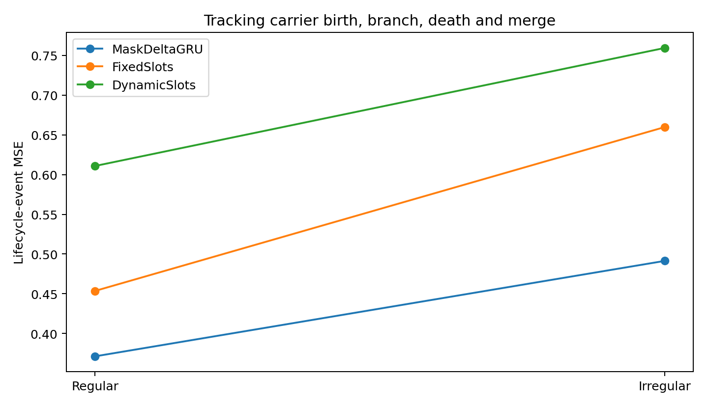

Figure 28. Lifecycle-event prediction error under regular and irregular sampling in the synthetic carrier world. Birth, branch, death and merge errors are evaluated against complete simulator truth.

#### 6.2.6 Latent-state information and its use by the predictor

Under regular sampling, latent-state R² is 0.8029 for MaskDeltaGRU, 0.8291 for FixedSlots and 0.8307 for DynamicSlots. Under irregular sampling, the values are 0.6066, 0.6295 and 0.6335. Slot states better preserve the latent decomposition under these probes, but the tested transition and decoder do not exploit it sufficiently for improved forecasting.

In the seed-23 audit, the correlation between DynamicSlots gate sum and effective carrier count is approximately 0.63 under regular sampling and 0.55 under irregular sampling. The gates carry count-related information, but branching and merging also require relational state changes.

#### 6.2.7 Lifecycle topology and the observation process

The tracking profile gains two additional sets of descriptors.

Observation-process geometry includes masks, intervals, asynchronous modalities and assay-trigger rules.

Carrier topology includes birth, branching, death, merging and the associated ancestry and burden-transfer relationships.

A candidate state representation is:

$$
S_t=\{\text{carrier states, relation edges, residual tails, observation clocks}\}
$$

Carrier states represent persistent processes; relation edges represent parentage or transfer; residual tails retain the effects of inactive sources; observation clocks record channel-specific staleness. These components define modelling requirements rather than recovered biological identities.

#### 6.2.8 Relational carrier state

The presence-gate comparison motivates the directed relation-state formulation evaluated in experiment 012. Its proposed components are:

Node states for persistent carriers and their dynamics.

Edge states for branching, merging, ancestry or shared-source relations.

Candidate new nodes when existing states cannot account for additional predictive structure.

Dormancy or death operations that stop source forcing and retain downstream tails.

Merge operations that explicitly transfer accumulated burden and relevant history.

An observation-process module that retains masks and elapsed time separately from carrier dynamics.

Carrier lifecycle and expert allocation both involve changing explanatory structure. Their semantic roles remain distinct, so a shared abstraction does not imply that carrier identities and computational experts are interchangeable.

#### 6.2.9 Evidence records

DYNAMIC_​CARRIER_​TRACKING_​011_​bundle.zip

DYNAMIC_​CARRIER_​TRACKING_​011/​model_​results_​seed23.csv

DYNAMIC_​CARRIER_​TRACKING_​011/​replicated_​summary.csv

DYNAMIC_​CARRIER_​TRACKING_​011/​replication_​seed47.csv

DYNAMIC_​CARRIER_​TRACKING_​011/​event_​error.png

### 6.3 DYNAMIC-CARRIER-GRAPH-012 Relational state transfer for forecasting

#### 6.3.1 Using carrier structure in prediction

Experiment 011 finds more decodable carrier state in slots but higher lifecycle prediction error than MaskDeltaGRU. Experiment 012 represents the tracking state as S_t={h_i, p_i, A_ij}_t: persistent carrier states h_i, continuous contribution strengths p_i and a learned directed relation field A_ij. This permits state messages between nodes during branching and merging.

#### 6.3.2 Controlled relational transfers

The lifecycle world extends experiment 011. Birth introduces carrier 2 independently; branching transfers part of carrier 0's source, environmental and biomarker history to the similar carrier 3; death ends carrier 1's forcing but preserves its tails; merging transfers carrier 3's source, environmental and biomarker burden into carrier 2. Regular and irregular sampling are evaluated separately. Event labels, carrier identities, relation edges and latent states are withheld during training.

#### 6.3.3 Architectures

MaskDeltaGRU receives values, masks and Δt. FixedSlots retains carriers without explicit relational operations. GraphSlots learns A_t[target, source] at each step and transmits messages from source to target nodes. GraphResidual adds a shared recurrent backbone, leaving common observation dynamics in the shared path and carrier-specific changes in relational residuals. ClockedGraphResidual also uses masks and measurement staleness to gate assimilation.

#### 6.3.4 Regular-sampling results

Table 46. Relational carrier prediction under regular sampling.

| Sampling | Model | Full MSE | Event MSE | Latent R² |
| --- | --- | --- | --- | --- |
| Regular | MaskDeltaGRU | 0.2454 | 0.2833 | 0.8365 |
| Regular | FixedSlots | 0.2815 | 0.3228 | 0.8744 |
| Regular | GraphSlots | 0.3129 | 0.3545 | 0.8645 |
| Regular | GraphResidual | 0.2093 | 0.2443 | 0.8790 |
| Regular | ClockedGraphResidual | 0.2172 | 0.2501 | 0.8762 |

Evidence: [012/model_summary_with_clocked_graph.csv](evidence/experiments/012/model_summary_with_clocked_graph.csv).

Controlled simulation. Lower MSE indicates lower prediction error within the same task and target scaling. Higher probe R² indicates more decodable target-state information.

Relative to MaskDeltaGRU, GraphResidual reduces overall future error by approximately 14.7% and lifecycle-event error by approximately 13.8%. Latent carrier-state R² rises from 0.8365 to 0.8790. In this condition, relational residuals improve both forecast performance and the evaluated latent-state representation.

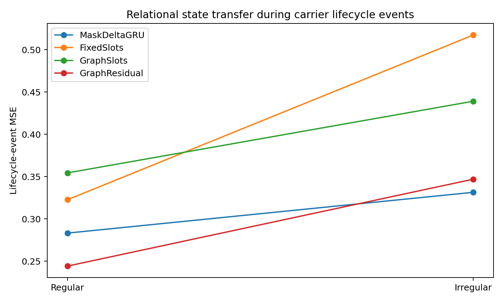

Figure 29. Lifecycle-event error under regular and irregular sampling in the synthetic relational carrier system. The comparison separates the benefit of relational computation from the effect of observation timing.

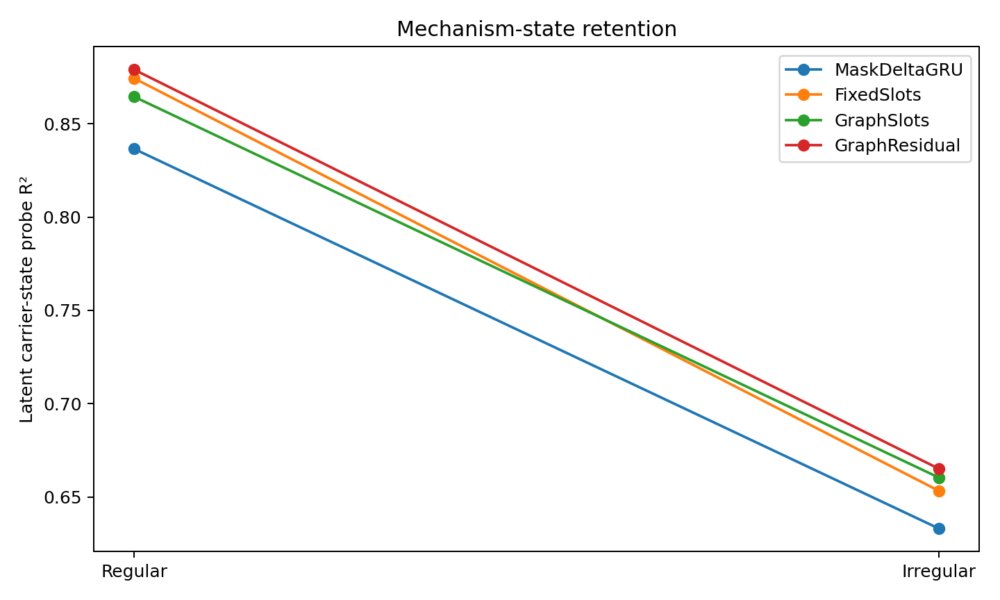

Figure 30. Latent carrier-state probe performance across architectures. R² measures post-hoc decodability of simulator state, which is withheld during training.

#### 6.3.5 Error by lifecycle event

Under regular sampling, GraphResidual birth, branch, death and merge MSEs are 0.1536, 0.2512, 0.2602 and 0.3599. Merging remains the hardest event, but its error is lower than MaskDeltaGRU's 0.3977. The result supports combining a shared predictive state with local relational transfer.

#### 6.3.6 Irregular-sampling results

Table 47. Relational carrier prediction under irregular sampling.

| Model | Full MSE | Event MSE | Latent R² |
| --- | --- | --- | --- |
| MaskDeltaGRU | 0.2884 | 0.3315 | 0.6331 |
| GraphResidual | 0.2972 | 0.3470 | 0.6651 |
| ClockedGraphResidual | 0.2972 | 0.3460 | 0.6737 |

Evidence: [012/model_summary_with_clocked_graph.csv](evidence/experiments/012/model_summary_with_clocked_graph.csv).

Controlled simulation. Lower MSE indicates lower prediction error within the same task and target scaling. Higher probe R² indicates more decodable target-state information.

GraphResidual retains higher latent-state fidelity under irregular sampling, but its event error is approximately 4.7% higher than MaskDeltaGRU's. ClockedGraphResidual reduces that error by only approximately 0.3% relative to GraphResidual and remains approximately 4.4% above MaskDeltaGRU. The tested scalar clock gate therefore provides only a small adjustment to asynchronous assimilation.

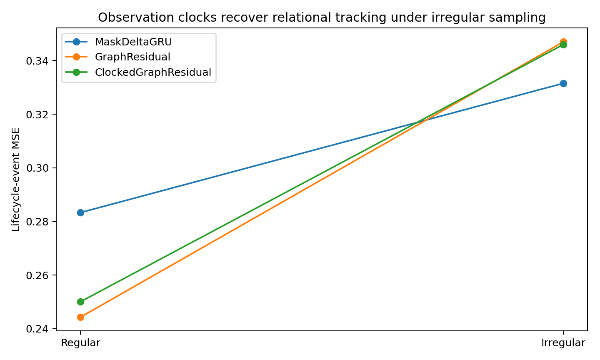

Figure 31. Effect of the observation-clock gate under irregular sampling. The synthetic comparison reports event error for the recurrent baseline and relational residual models.

#### 6.3.7 Learned edges and simulator genealogy

The simulator's branch edge 0→3 and merge edge 3→2 are used only for post-hoc evaluation. GraphResidual does not consistently assign higher weight to these edges. Under regular sampling, branch-edge weight is approximately 0.229 versus a non-true-source baseline of 0.257; merge-edge weight is approximately 0.248 versus 0.251. Under irregular sampling, the merge edge is slightly above baseline but the branch edge is not.

The supported interpretation is a useful computational relation field. The learned weights do not establish recovery of causal ancestry or biological genealogy.

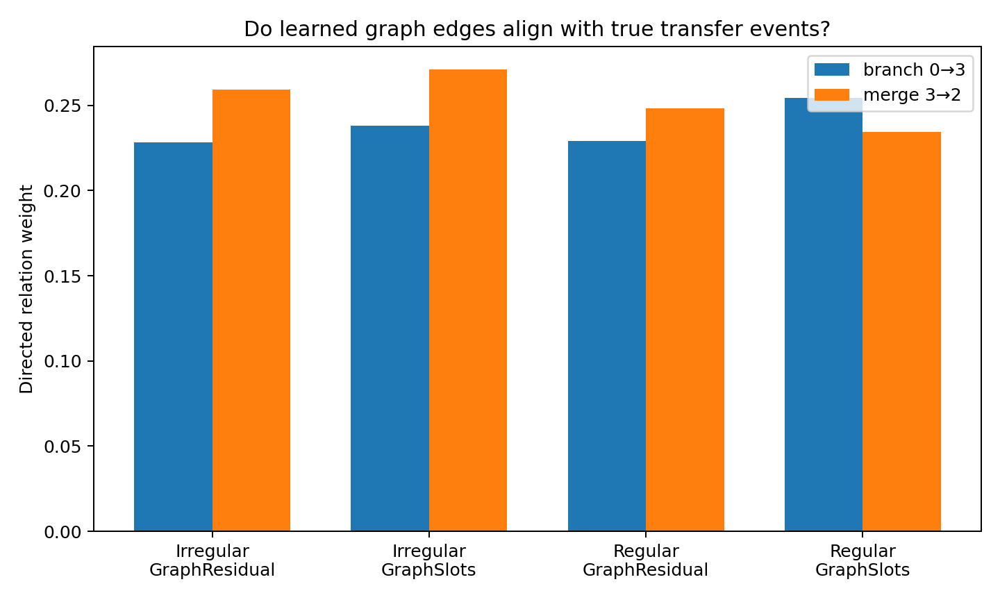

Figure 32. Post-hoc comparison of learned directed weights with the simulator's branch and merge edges. Edge weight is a computational quantity; alignment with known genealogy is evaluated separately.

#### 6.3.8 Two components of tracking state

The representation separates observation-process state O_t={mask, Δt, modality-specific evidence, uncertainty} from carrier relation state C_t={persistent nodes, functional relation field, residual tails}. Prediction combines shared dynamics with relational carrier residuals.

This organization resembles the shared-predictor-plus-local-residual structure evaluated earlier. Here the local components are persistent carrier states that exchange information through learned relations.

#### 6.3.9 Application mappings

For exposure modelling, source attribution may require source activity, transport history, internal-burden tails and continuity through mixture or substitution. Asynchronous measurement clocks should be represented separately from the exposure mechanism.

For infectious-disease tracking, a representation may need persistence, ancestry-related transfer, burden tails and assay clocks. The experiment supports testing such architectural components; the learned relation weights here have computational rather than validated genealogical meaning.

#### 6.3.10 Results synthesis

In the regular-sampling comparison, a shared predictive backbone with relational carrier residuals outperforms the tested graph-only tracker.

Carrier topology and observation timing introduce different state requirements: relational transfer for the former and asynchronous assimilation for the latter.

Decodable latent structure improves prediction only when the transition and output operators can use it effectively.

#### 6.3.11 Evidence records

DYNAMIC_​CARRIER_​GRAPH_​012_​bundle.zip

DYNAMIC_​CARRIER_​GRAPH_​012/​model_​summary_​with_​clocked_​graph.csv

DYNAMIC_​CARRIER_​GRAPH_​012/​relation_​audit_​summary.csv

DYNAMIC_​CARRIER_​GRAPH_​012/​clocked_​graph_​summary.csv

DYNAMIC_​CARRIER_​GRAPH_​012/​event_​error.png

DYNAMIC_​CARRIER_​GRAPH_​012/​latent_​state_​probe.png

DYNAMIC_​CARRIER_​GRAPH_​012/​relation_​edges.png

DYNAMIC_​CARRIER_​GRAPH_​012/​clocked_​graph_​event_​error.png

### 6.4 CONTINUOUS-TIME-EVENT-CARRIER-GRAPH-013 Observation events and physical time

#### 6.4.1 Time buckets and event sequences

This experiment compares fixed time buckets with original observation events when exposure markers, biomarkers or pathogen-like assays arrive asynchronously. It asks when the actual intervals contain predictive information beyond event content and order.

The relevant diagnostic is whether timing adds information that event values, order and observation density do not already supply.

#### 6.4.2 Continuous-time tracking construction

A fine-time simulator with internal dt=0.1 contains three persistent carriers and the chain source dynamics → environmental transport → slow biomarker burden. It includes branching, source death and merging. The observer sees only measurements at each assay's asynchronous sampling times.

Moderate and severe irregularity are tested. Every model receives the same history and predicts the complete observable state at a fixed horizon of +1.0 time unit from the query. This gives the forecasting target a common physical duration.

#### 6.4.3 Training representations

BucketGRU compresses the previous four time units into eight 0.5-unit buckets. Each bucket retains the last value, observation mask and elapsed time since the last observation.

EventGRU_NoTime retains event order and values but omits the true inter-event intervals.

EventGRU_Time retains the event sequence and true Δt.

CTGraphResidual combines event inputs, continuous exponential decay of carrier state, relational residuals and explicit propagation over the +1.0 horizon.

#### 6.4.4 Main representation comparison

Table 48. Buckets and events at a common physical horizon.

| Condition | Model | MSE all | Lifecycle MSE | No-lifecycle MSE | Latent R² |
| --- | --- | --- | --- | --- | --- |
| Moderate | BucketGRU | 0.2800 | 0.2783 | 0.2807 | 0.5394 |
| Moderate | NoTime EventGRU | 0.3648 | 0.3525 | 0.3703 | 0.5024 |
| Moderate | Timed EventGRU | 0.3177 | 0.3132 | 0.3197 | 0.4844 |
| Moderate | CTGraph | 0.4067 | 0.4001 | 0.4096 | 0.4885 |
| Severe | BucketGRU | 0.3838 | 0.3973 | 0.3786 | 0.4348 |
| Severe | NoTime EventGRU | 0.4494 | 0.4804 | 0.4374 | 0.4342 |
| Severe | Timed EventGRU | 0.3700 | 0.3683 | 0.3707 | 0.4420 |
| Severe | CTGraph | 0.4952 | 0.5491 | 0.4743 | 0.4268 |

Evidence: [013/model_summary.csv](evidence/experiments/013/model_summary.csv).

Controlled simulation. Lower MSE indicates lower prediction error within the same task and target scaling. Higher probe R² indicates more decodable target-state information.

Under moderate irregularity, BucketGRU has the lowest MSE, 0.2800. Under severe irregularity, EventGRU_Time reaches 0.3700 versus 0.3838 for BucketGRU, an improvement of approximately 3.6%. For lifecycle-crossing windows, the corresponding errors are 0.3683 and 0.3973, a reduction of approximately 7.3%.

Irregular observation alone does not determine which temporal representation performs best.

Buckets that retain masks and staleness can efficiently preserve relevant observation information. In the severe condition, retaining original event times improves prediction. CTGraphResidual has higher error than the simpler baselines in both conditions.

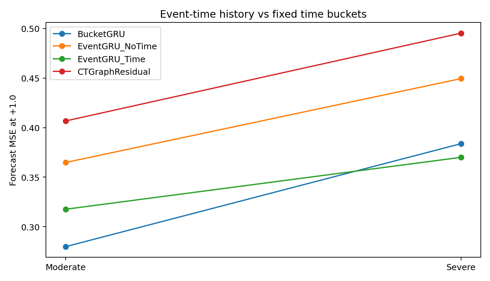

Figure 33. Fixed-bucket and event-time prediction under two levels of irregular sampling in the synthetic carrier world. Every model predicts the same +1.0 physical-time horizon.

#### 6.4.5 Sampling-density scan

Table 49. Sampling-density scan.

| Sampling | Obs frac | Bucket | NoTime event | Timed event | Timed vs Bucket | Lifecycle gain |
| --- | --- | --- | --- | --- | --- | --- |
| dense | 0.2367 | 0.3357 | 0.3754 | 0.4596 | -36.9% | -37.0% |
| mid | 0.1279 | 0.3560 | 0.3730 | 0.4400 | -23.6% | -17.6% |
| mid_dense | 0.1648 | 0.3060 | 0.3213 | 0.3974 | -29.9% | -38.0% |
| sparse | 0.0847 | 0.6642 | 0.5703 | 0.6877 | -3.5% | -0.4% |
| very_sparse | 0.0577 | 0.5400 | 0.3958 | 0.5144 | 4.8% | 5.9% |

Evidence: [013/sampling_density_scan_summary.csv](evidence/experiments/013/sampling_density_scan_summary.csv).

Controlled simulation.

At the very sparse observed fraction of approximately 0.058, Timed EventGRU improves over Bucket by approximately 4.8% overall and 5.9% in lifecycle windows. At denser settings, bucket compression generally performs better. NoTime EventGRU also performs strongly in some sparse settings, motivating the separate timing-identification control.

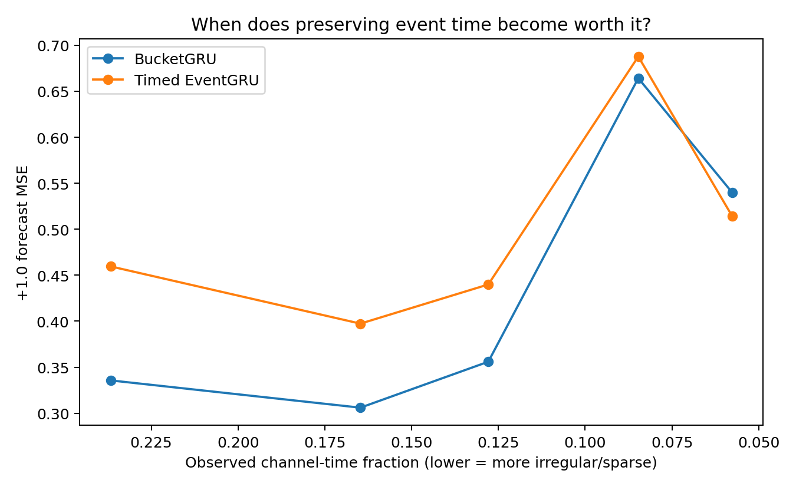

Figure 34. Prediction error across observed channel-time fractions. The synthetic scan compares fixed buckets, event order alone and events with true intervals; architecture rankings depend on the sampling condition.

#### 6.4.6 Identifying the information in timestamps

Event count, order and marker trajectories can act as surrogate clocks. A separate control fixes event count and the distribution of event values but randomizes inter-event gaps. The final burden is generated by exponential decay in physical time.

Table 50. Timing-identification control.

| NoTime MSE | Timed MSE | Timed gain |
| --- | --- | --- |
| 0.0197 | 0.0095 | 51.9% |

Evidence: [013/timing_identifiability_summary.csv](evidence/experiments/013/timing_identifiability_summary.csv).

Controlled simulation. Lower MSE indicates lower prediction error within the same task and target scaling.

Across three initializations, mean MSE decreases from 0.0197 without true time to 0.0095 with it, a reduction of approximately 51.9%.

When identical event values and order can lead to different futures because their intervals differ, elapsed time is part of the information required for prediction.

#### 6.4.7 Continuous-time relational computation

Adding continuous decay, relational messages and fixed-horizon propagation does not make CTGraphResidual outperform the simpler models. The regular-sampling advantage of GraphResidual in experiment 012 therefore does not transfer automatically to this asynchronous construction.

The comparisons motivate a layered design that estimates the observation process and predictive state before adding carrier-related residual computation.

#### 6.4.8 Temporal identifiability

Timing identifiability T_id describes whether physical time can be inferred sufficiently from event content, count, trajectory state or the sampling process, or whether explicit intervals add essential information.

The tracking profile includes persistence, kinetic kernels, source overlap, finite-history observability, anchor value, assay stability, objective horizon, sampling density and timing identifiability.

#### 6.4.9 Training implications

1. Select the training representation from the observation process. At higher density, fixed buckets with masks and staleness provide an effective compression in this experiment.

2. Test whether event intervals add information beyond content and count. In the controlled timing comparison, explicit Δt reduces MSE by approximately 51.9%.

3. Define forecasting targets at meaningful physical horizons. In irregular data, the next row can represent very different durations; horizons such as +24 h or +7 d should be specified according to the application.

4. Retain values, masks and elapsed time as distinct variables. Carrying a value forward should preserve the fact that no new measurement was made.

5. Check how observation frequency affects training weights. Subject-level weighting, event-count balancing or information-based sampling can prevent frequently measured individuals from dominating the objective unintentionally.

6. Evaluate lifecycle-crossing windows separately. Oversampling or a separate loss may be appropriate when rare transitions are central to the scientific objective; report the resulting weighting scheme.

7. Retain modality-specific clocks when measurement families have different sampling rates and kinetic half-lives.

8. Justify continuous-time graph complexity through measured improvement in forecasting, carrier-state fidelity or generalization across observation regimes. The CTGraphResidual comparison here favours simpler alternatives.

9. Specify mechanism objectives separately from next-value prediction. Source-resolved anchors, future-assay prediction, identity consistency or independent probes can assess attribution and lineage-related information.

#### 6.4.10 Application to data organization

For exposure research, assess each marker's kinetics and timing information before resampling all measurements to one frequency. Dense environmental observations can be represented in buckets, with sparse assays treated as state-correction events when appropriate. Define targets in physical time.

For infectious-disease research, assay clocks and identity resolution can differ across PCR, antigen, culture and sequencing. A lineage-resolved event may carry information distinct from a routine burden measurement. Intervals belong in the state transition when they affect the future process.

#### 6.4.11 Results synthesis

The modelling issue in asynchronous data is the predictive information carried by observation timing.

Buckets, event sequences and continuous-time states provide different information compressions. Their adequacy is tested against the observation process and prediction horizon.

Training representation and architecture should be evaluated together against the generating process.

#### 6.4.12 Evidence records

CONTINUOUS_​EVENT_​TRACKING_​013_​bundle.zip

CONTINUOUS_​EVENT_​TRACKING_​013/​model_​summary.csv

CONTINUOUS_​EVENT_​TRACKING_​013/​architecture_​comparison.csv

CONTINUOUS_​EVENT_​TRACKING_​013/​sampling_​density_​scan_​summary.csv

CONTINUOUS_​EVENT_​TRACKING_​013/​timing_​identifiability_​summary.csv

CONTINUOUS_​EVENT_​TRACKING_​013/​event_​vs_​bucket.png

CONTINUOUS_​EVENT_​TRACKING_​013/​sampling_​density_​threshold.png

CONTINUOUS_​EVENT_​TRACKING_​013/​latent_​probe.png

### 6.5 INFORMATIVE-SAMPLING-POLICY-014 When Missingness Is Generated by the World

Core question. When measurement timing is informative — abnormal exposure, disease burden, or pathogen state triggers additional testing — should the observation process itself enter the predictive state? And if it does, how do we stop a model from learning a hospital or cohort measurement policy as though it were biological law?

latent world state  →  measurement policy  →  observed data stream

#### 6.5.1 Experimental construction

The latent world dynamics are held fixed across all conditions. Only the measurement policy changes.

Policy A (“informative”) measures much more often when latent severity is high and after recent abnormal results.

Policy B uses similarly sparse monitoring but much weaker state dependence.

Policy C is a denser, more scheduled monitoring regime with little severity dependence.

The same held-out latent trajectories are re-observed under all three policies. Therefore policy-shift effects cannot be attributed to a different biological test population.

Table 51. Observation policies.

| Measurement policy | Observed fraction | corr(observation rate, latent severity) |
| --- | --- | --- |
| A_informative | 0.333 | 0.973 |
| B_weak | 0.219 | 0.658 |
| C_dense | 0.365 | 0.415 |

Evidence: [014/policy_audit.csv](evidence/experiments/014/policy_audit.csv).

Controlled simulation.

Interpretation. Under Policy A, the fact of being measured is itself highly informative about the hidden state. Missingness is therefore not merely absent information; it is partially generated by the state being inferred.

#### 6.5.2 Training strategies

ValueOnly_A — zero-imputed values only; trained under Policy A.

MaskDelta_A — values + measurement mask + time-since-last-measurement; trained under A.

JointPolicy_A — the same predictive state plus an auxiliary head that predicts the next measurement mask.

RepeatedA_MaskDelta — exact A-policy training set repeated three times; controls for extra optimization exposure.

PermutedMaskAug_MaskDelta reassigns A-like mask sequences across individuals. This preserves the observation-pattern statistics and breaks the individual-level association between state and measurement policy.

MultiPolicy_MaskDelta — one model trained across A, B and C policies, using the same underlying biological dynamics seen through multiple observation policies.

Table 52. Prediction under policy shift.

| Training strategy | Test A | Test B | Test C |
| --- | --- | --- | --- |
| ValueOnly_A | 0.514 | 0.626 | 0.514 |
| MaskDelta_A | 0.505 | 0.678 | 0.578 |
| JointPolicy_A | 0.521 | 0.698 | 0.595 |
| RepeatedA | 0.293 | 0.425 | 0.351 |
| PermutedMaskAug | 0.254 | 0.326 | 0.268 |
| MultiPolicy | 0.255 | 0.307 | 0.251 |

Evidence: [014/robustness_comparison.csv](evidence/experiments/014/robustness_comparison.csv).

Controlled simulation.

Policy diversity produces the strongest portable predictor in this constructed world. Repeating Policy A three times improves optimization but has higher shifted-policy error than multi-policy training. Counterfactual mask augmentation approaches multi-policy performance, particularly under A and C.

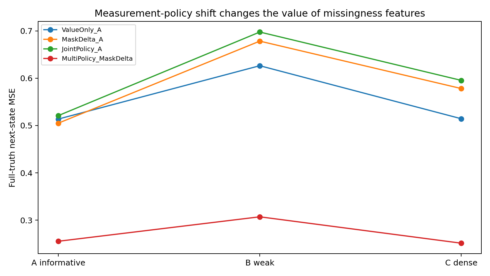

Figure 35. Measurement-policy shift changes the value and risk of missingness features.

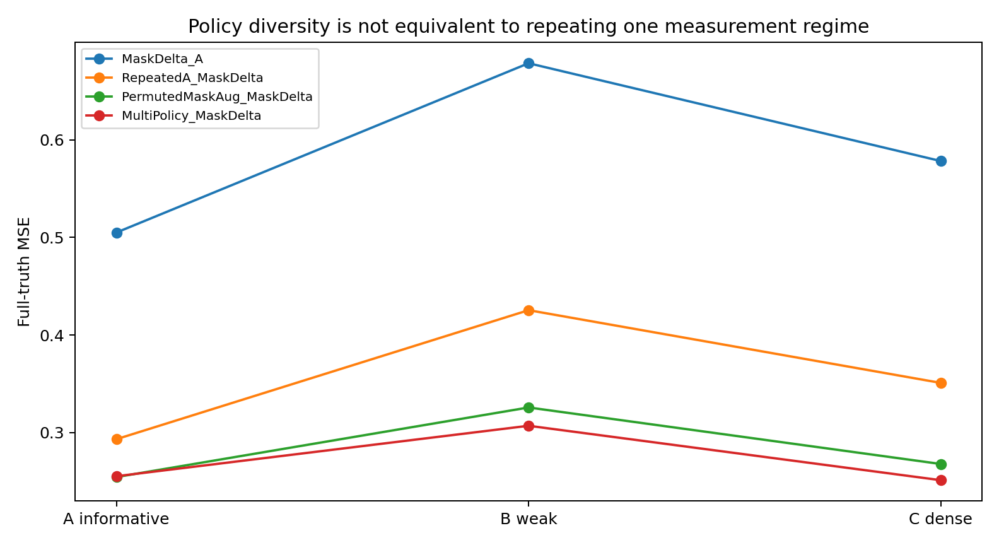

Figure 36. Policy diversity is not equivalent to repeating one measurement regime.

#### 6.5.3 Measurement policy is predictive evidence and a transportability hazard

A-only MaskDelta achieved MSE 0.505 under its own informative policy, but deteriorated to 0.678 under the weaker Policy B and 0.578 under dense Policy C even though the latent world trajectories were held fixed.

Jointly predicting the measurement policy did not rescue the world model. JointPolicy_A reached 0.521 / 0.698 / 0.595 under A/B/C and showed nearly the same policy-shift sensitivity as MaskDelta_A. The auxiliary policy head therefore learned the observation process without making the biological state model more portable.

Multi-policy training reduced MSE to 0.255 / 0.307 / 0.251 under A/B/C. Its latent-state probe was also highest or near-highest across policies (R² ≈ 0.891 / 0.784 / 0.834), indicating that robustness was accompanied by a stronger predictive representation of the latent world rather than merely flatter predictions.

#### 6.5.4 Matched-exposure controls: what caused the gain?

Table 53. Matched training-exposure controls.

| Model | A MSE | B MSE | C MSE | Mean shifted MSE |
| --- | --- | --- | --- | --- |
| MultiPolicy | 0.255 | 0.307 | 0.251 | 0.279 |
| PermutedMaskAug | 0.254 | 0.326 | 0.268 | 0.297 |
| RepeatedA | 0.293 | 0.425 | 0.351 | 0.388 |
| ValueOnly_A | 0.514 | 0.626 | 0.514 | 0.570 |
| MaskDelta_A | 0.505 | 0.678 | 0.578 | 0.628 |
| JointPolicy_A | 0.521 | 0.698 | 0.595 | 0.647 |

Evidence: [014/robustness_comparison.csv](evidence/experiments/014/robustness_comparison.csv).

Controlled simulation. Lower MSE indicates lower prediction error within the same task and target scaling.

Exact repetition control. RepeatedA_MaskDelta saw the same threefold number of training examples as MultiPolicy_MaskDelta but only one observation policy. It improved over A-only training, yet shifted-policy MSE remained 0.425 (B) and 0.351 (C), much worse than 0.307 and 0.251 for true multi-policy training.

Counterfactual mask augmentation reassigns realistic A-policy masks across individuals, preserving their temporal and marginal structure but breaking the person-specific state–policy relationship. MSE is 0.254 / 0.326 / 0.268 under A/B/C, close to the multi-policy model and lower than exact repetition.

#### 6.5.5 Counterfactual measurement-policy sensitivity

Table 54. Counterfactual policy sensitivity.

| Model | Same latent world, policy swap | Prediction disagreement |
| --- | --- | --- |
| JointPolicy_A | A_vs_B_weak | 0.1869 |
| JointPolicy_A | A_vs_C_dense | 0.1147 |
| MaskDelta_A | A_vs_B_weak | 0.1849 |
| MaskDelta_A | A_vs_C_dense | 0.1179 |
| MultiPolicy_MaskDelta | A_vs_B_weak | 0.1343 |
| MultiPolicy_MaskDelta | A_vs_C_dense | 0.1396 |
| ValueOnly_A | A_vs_B_weak | 0.1374 |
| ValueOnly_A | A_vs_C_dense | 0.1062 |

Evidence: [014/counterfactual_policy_summary.csv](evidence/experiments/014/counterfactual_policy_summary.csv).

Controlled simulation.

Interpretation. Changing only the observation policy can move model predictions. This counterfactual disagreement is direct evidence that the model is using the measurement process as part of its state estimate. That can be legitimate in-distribution evidence, but it is not invariant biological mechanism.

#### 6.5.6 Observation-policy geometry

Tracking Data Geometry therefore needs another explicit axis: M_policy = measurement-policy informativeness and transportability. A missingness pattern can simultaneously contain state information and institutional behavior.

observed stream = world dynamics × observation policy

A candidate factorization models the latent process and the observation policy separately: latent state predicts the measured future, and latent state together with site or protocol predicts observation propensity. The controlled comparison motivates testing this factorization when portability matters.

#### 6.5.7 Training implications

1. Treat measurement policy as part of the data-generating process. If abnormal states trigger more tests, mask and time-since-assay carry real information. Do not discard them automatically.

2. Do not let one institution define the world model. A-only MaskDelta deteriorated sharply under a policy-only shift even though biology was held fixed.

3. Evaluate observation-policy diversity as a training resource. In the constructed world, multiple policies expose the same latent dynamics and improve shifted-policy prediction.

4. Consider counterfactual mask augmentation when its measurement assumptions fit the application. Reassigning masks nearly matches multi-policy training here; application to a real cohort requires checking that the resulting observations and targets remain meaningful.

5. Extra epochs are not a substitute for policy diversity. RepeatedA_MaskDelta received equal threefold example exposure but remained substantially less robust.

6. Predict the measurement process only if the task needs it. The auxiliary policy head did not improve biological forecasting here. Operations/scheduling and world modeling are related but distinct objectives.

7. Separate invariant world dynamics from site/protocol policy. A practical architecture can maintain a shared world state and a site/protocol-conditioned observation-propensity model.

8. Evaluate counterfactually under policy swaps. For the same latent trajectory, resample measurement behavior. Prediction changes then diagnose policy dependence rather than biological shift.

9. Report matched-policy accuracy and policy-shift performance separately. High within-cohort accuracy can depend on a measurement pattern that changes at another site.

#### 6.5.8 Direct implications for exposure science and infectious-disease tracking

Exposure science: high-risk participants are often sampled more often after symptoms, unusual environmental measurements, or clinical concern. Frequency of urine/blood/indoor-air sampling can therefore encode both exposure state and study protocol. A model trained on one cohort may treat protocol as exposure signal unless policy diversity or augmentation is built into training.

Infectious disease: PCR, culture, antigen tests and sequencing are often ordered conditionally on symptoms, previous positives or outbreak suspicion. “A genome was sequenced” is itself a policy-dependent event; it should not automatically be interpreted as stronger evidence of a biological state without modeling the testing policy.

Multi-centre data can expose related latent processes under different observation rules. Their usefulness for learning shared dynamics should be evaluated together with biological and population differences between sites.

#### 6.5.9 Results synthesis

Informative missingness can improve state inference within a policy, but the same signal can become a shortcut under policy shift.

Observation-policy diversity is a distinct training resource. It cannot be replaced by simply repeating the same cohort.

Counterfactual mask augmentation approximates the multi-policy training benefit in this controlled experiment.

Training design must now distinguish world dynamics, observation dynamics and institutional decision policy.

#### 6.5.10 Evidence records

INFORMATIVE_​SAMPLING_​POLICY_​014_​bundle.zip

INFORMATIVE_​SAMPLING_​POLICY_​014/​policy_​audit.csv

INFORMATIVE_​SAMPLING_​POLICY_​014/​combined_​model_​summary.csv

INFORMATIVE_​SAMPLING_​POLICY_​014/​robustness_​comparison.csv

INFORMATIVE_​SAMPLING_​POLICY_​014/​counterfactual_​policy_​summary.csv

INFORMATIVE_​SAMPLING_​POLICY_​014/​matched_​exposure_​controls_​summary.csv

INFORMATIVE_​SAMPLING_​POLICY_​014/​policy_​shift_​performance.png

INFORMATIVE_​SAMPLING_​POLICY_​014/​matched_​policy_​controls.png

## 7. Resource-dependent computation

### 7.1 COORDINATED-EFFECTORS-015 Overlapping modules and perturbation training

#### 7.1.1 Question

This experiment compares exclusive routing with simultaneous recruitment of overlapping predictive modules, including their response to temporary module loss.

Motor coordination supplies a design analogy for overlapping contributions and load redistribution. The experiment operationalizes that analogy as a synthetic prediction task: modules contribute to a common output, and controlled removal tests whether the remaining computation preserves prediction. The measurements concern the computational design rather than biological motor physiology.

#### 7.1.2 Synthetic coordination world

A continuous predictive state generates a future-transition vector from one shared global dynamic plus four overlapping latent synergies. Multiple synergies are active simultaneously and two pairs have deliberately redundant future-effect directions. No true synergy label is supplied.

$$
F(x)=F_{\mathrm{shared}}(x)+\sum_k w_k(x)E_k(x)
$$

#### 7.1.3 Architectures and perturbation training

HardTop1 — exactly one expert contributes at a time.

SoftMixture — four experts can contribute simultaneously.

SharedResidual — a shared global predictor plus soft local effectors.

HardTop1_Perturb is HardTop1 trained with transient random expert dropout.

SoftMixture_Perturb is SoftMixture trained with the same perturbation schedule.

CoordinatedEffectors is SharedResidual trained with transient random expert dropout and the unchanged target response.

Matched architecture comparisons separate model structure from exposure to module perturbations during training.

#### 7.1.4 Lesion experiment

Table 55. Intact and perturbed module prediction.

| Model | Params | Intact MSE | Single-lesion MSE | Single penalty (%) | Dual-lesion MSE | Dual penalty (%) |
| --- | --- | --- | --- | --- | --- | --- |
| SharedResidual | 5124 | 0.0728 | 0.0918 | 26.0713 | 0.1266 | 73.9364 |
| CoordinatedEffectors | 5124 | 0.0755 | 0.0850 | 12.5645 | 0.1041 | 37.8860 |
| SoftMixture | 4614 | 0.0882 | 0.1323 | 50.2527 | 0.2145 | 143.6064 |
| SoftMixture_Perturb | 4614 | 0.0927 | 0.1152 | 24.2196 | 0.1605 | 73.0586 |
| HardTop1 | 4614 | 0.1164 | 0.1501 | 28.9738 | 0.2124 | 82.5305 |
| HardTop1_Perturb | 4614 | 0.1200 | 0.1336 | 11.3216 | 0.1641 | 36.7217 |

Evidence: [015/lesion_summary_with_training_ablation.csv](evidence/experiments/015/lesion_summary_with_training_ablation.csv).

Controlled simulation. Lower MSE indicates lower prediction error within the same task and target scaling.

SharedResidual and CoordinatedEffectors have identical parameterization. Perturbation training changes intact MSE from 0.0728 to 0.0755, reduces the average single-expert removal penalty from 26.1% to 12.6%, and reduces the dual-removal penalty from 73.9% to 37.9%.

Under the same dropout schedule, HardTop1's single-removal penalty falls from 29.0% to 11.3%. Its intact MSE is 0.1200, compared with 0.0755 for CoordinatedEffectors, and its perturbed absolute error is also higher. Both exclusive and overlapping routing learn backup computation; the shared overlapping design has the lower absolute errors in this comparison.

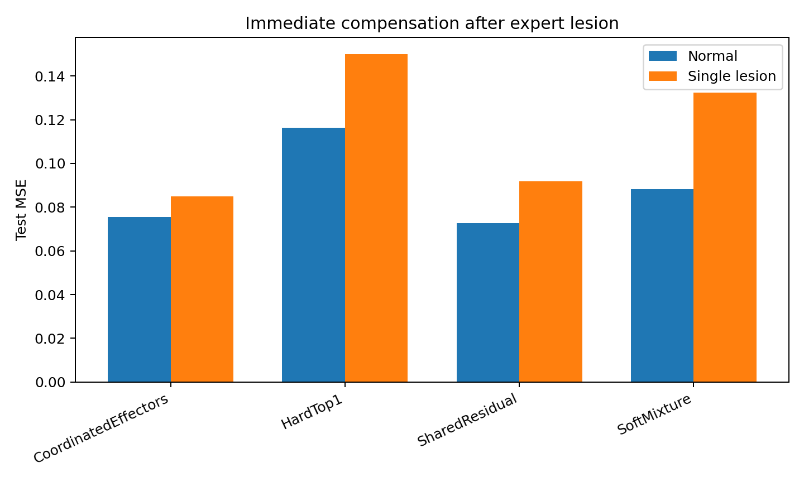

Figure 37. Immediate compensation after a single expert lesion.

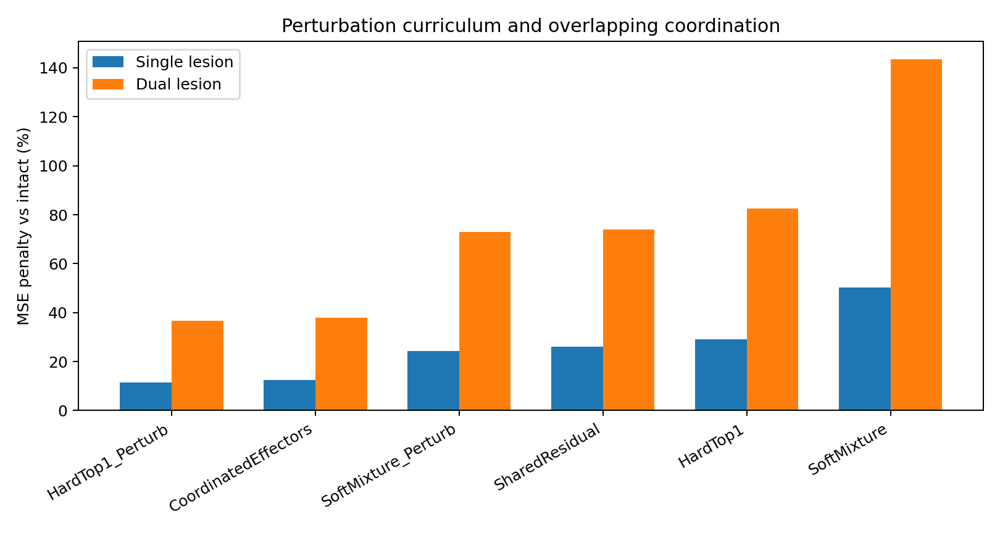

Figure 38. Lesion penalties after matched perturbation-training ablation.

#### 7.1.5 Perturbation curriculum effects

Table 56. Matched perturbation-training effects.

| Base model | Perturb-trained | Intact MSE change (%) | Single penalty reduction (pp) | Dual penalty reduction (pp) |
| --- | --- | --- | --- | --- |
| HardTop1 | HardTop1_Perturb | 3.15 | 17.65 | 45.81 |
| SoftMixture | SoftMixture_Perturb | 5.20 | 26.03 | 70.55 |
| SharedResidual | CoordinatedEffectors | 3.72 | 13.51 | 36.05 |

Evidence: [015/perturbation_training_effects.csv](evidence/experiments/015/perturbation_training_effects.csv).

Controlled simulation. Lower MSE indicates lower prediction error within the same task and target scaling.

All three architecture families have smaller removal penalties after perturbation training. Resilience depends on training exposure as well as the availability of alternative pathways.

The experiment separates substitute computation from training that makes use of it.

#### 7.1.6 Coordination geometry

Table 57. Output overlap and routing geometry.

| Model | Expert effect cosine | Max router weight | Router entropy |
| --- | --- | --- | --- |
| HardTop1 | 0.7412 | 1.0000 | 0.0000 |
| SoftMixture | 0.6153 | 0.3980 | 1.2772 |
| SharedResidual | 0.4537 | 0.4017 | 1.2773 |
| CoordinatedEffectors | 0.5979 | 0.3963 | 1.2848 |

Evidence: [015/coordination_geometry.csv](evidence/experiments/015/coordination_geometry.csv).

Controlled simulation.

SharedResidual and CoordinatedEffectors have nearly identical router entropy (about 1.28), yet perturbation training increases mean expert-output cosine from 0.454 to 0.598. The robustness change is therefore not explained by simply making the router more diffuse. The learned effectors themselves become more functionally substitutable.

#### 7.1.7 Discussion of overlapping functional roles

The useful part of the motor analogy is state-dependent contribution. A predictive module is characterized by the change it makes to the output under the current state. The following correspondences are conceptual aids for describing the computational experiment.

Predictive state supplies the information on which coordination is conditioned.

An expert or effector contributes a local response to the predicted transition.

The router allocates contributions among the available modules.

The shared backbone represents reusable dynamics.

Soft co-activation permits several modules to contribute simultaneously.

A lesion is an experimental removal or degradation of a module.

Reallocation changes contributions after a perturbation.

The perturbation schedule supplies training experience with unavailable modules.

The results show that functional specialization can coexist with overlap. SharedResidual and CoordinatedEffectors have similar routing entropy, yet training changes output similarity and removal penalties. Both the contributions learned by the experts and the allocation among them matter.

This distinction is consistent with the earlier capacity results: a representation can have substantial capacity but relatively few dominant local response directions. The relevant quantities should be measured separately in each task.

#### 7.1.8 Rapid post-lesion plasticity

Table 58. Router-only adaptation after removal.

| Model | Pre-adapt MSE | Post-router MSE | Router change (%) |
| --- | --- | --- | --- |
| CoordinatedEffectors | 0.0817 | 0.0809 | -1.0254 |
| HardTop1 | 0.1280 | 0.1353 | 5.4697 |
| SharedResidual | 0.0806 | 0.0794 | -1.4884 |
| SoftMixture | 0.1065 | 0.1038 | -2.5528 |

Evidence: [015/router_recovery_summary_corrected.csv](evidence/experiments/015/router_recovery_summary_corrected.csv).

Controlled simulation. Lower MSE indicates lower prediction error within the same task and target scaling.

Router-only adaptation produced only small improvements in the soft systems and could worsen HardTop1. The dominant robustness gain was learned during perturbation training, not recovered by a few post-lesion router updates. Immediate graceful degradation therefore needs to be built during training rather than assumed to emerge after failure.

#### 7.1.9 Training implications

1. Include temporary module loss in training when resilience to unavailable modules is an objective, and evaluate the resulting accuracy trade-off.

2. Report lesion curves as a standard MoE diagnostic: intact accuracy, average single-lesion, worst single-lesion and multi-lesion performance.

3. Separate redundancy from learned coordination. Soft routing creates potential substitute pathways, but perturbation training teaches the system to use them reliably.

4. Do not force one-to-one semantic ownership where the data generator is functionally redundant. Expert responsibilities should overlap when several mechanisms can realize similar future effects.

5. Retain a shared predictive backbone when global dynamics are reusable. Effectors should spend capacity on local corrections rather than relearning the entire world.

6. Use perturbations that match realistic computational failure modes: expert dropout, reduced capacity, delayed response, noisy output or temporary compute-budget cuts.

7. Train across changing available-compute sets. The router should learn w(s, A), where A is the set of currently available effectors.

8. Avoid optimizing only for load balance. Equal utilization is not equivalent to functional redundancy; the relevant target is coverage of future-effect directions after effectors are removed.

9. Evaluate recovery without rewriting expert internals. Router-only or small-controller adaptation is a stricter coordination test than full-model fine-tuning.

10. Evaluate expert-dropout training through both intact prediction and the ability to redistribute computation after module loss.

#### 7.1.10 Results synthesis

The experiment supports a stronger formulation than “soft MoE is robust”. The same architecture becomes markedly more damage-tolerant after it is trained to coordinate under temporary module loss. Hard routing can also learn backup selections, but its one-at-a-time bottleneck leaves much worse absolute intact and lesioned performance. The best observed compromise in this experiment is shared dynamics plus overlapping effectors plus perturbation-trained coordination.

The tested design combines shared dynamics, overlapping local contributions and coordination learned under module perturbations.

#### 7.1.11 Evidence records

COORDINATED_​EFFECTORS_​015_​bundle.zip

COORDINATED_​EFFECTORS_​015/​lesion_​summary_​with_​training_​ablation.csv

COORDINATED_​EFFECTORS_​015/​perturbation_​training_​effects.csv

COORDINATED_​EFFECTORS_​015/​coordination_​geometry.csv

COORDINATED_​EFFECTORS_​015/​router_​recovery_​summary_​corrected.csv

COORDINATED_​EFFECTORS_​015/​single_​lesion.png

COORDINATED_​EFFECTORS_​015/​lesion_​penalty_​ablation.png

### 7.2 AVAILABILITY-AWARE-COORDINATION-016 Routing with observable resource state

#### 7.2.1 Question

Experiment 015 tests complete module removal. This experiment varies available module capacity continuously, including cumulative depletion, persistent weakness and temporary outages.

The routing formulation is w_t=R(s_t, a_t, u_t), where s_t is task state, a_t is current module availability and u_t is recent load history. The term computational body denotes this internal resource state in the model labels used below.

#### 7.2.2 Prediction and resource dynamics

The target generator combines shared dynamics and four overlapping contributions. Module use consumes capacity and unused capacity recovers. The target trajectory is fixed across perturbations; only the predictor's internal resources change.

Full availability.

Persistent capacity depletion.

One persistently weak module.

Two scheduled temporary outages.

StateOnly, AvailabilityAware, FatigueAware_NoCurriculum and CoordinatedBody separate resource-state inputs from the perturbation-training schedule.

#### 7.2.3 Main result

Table 59. Prediction under resource conditions.

| Model | Healthy | Chronic fatigue | Weak effector | Outages |
| --- | --- | --- | --- | --- |
| StateOnly | 0.0855 | 0.1029 | 0.0963 | 0.0992 |
| AvailabilityAware | 0.0797 | 0.0953 | 0.0860 | 0.0910 |
| FatigueAware_NoCurriculum | 0.0847 | 0.1030 | 0.0920 | 0.0926 |
| CoordinatedBody | 0.0834 | 0.1007 | 0.0905 | 0.0947 |

Evidence: [016/scenario_summary.csv](evidence/experiments/016/scenario_summary.csv).

Controlled simulation.

AvailabilityAware has the lowest absolute error in this comparison. Under persistent depletion, a weak module and outages, MSE is 0.0953, 0.0860 and 0.0910, versus 0.1029, 0.0963 and 0.0992 for StateOnly. Observing current resource availability improves coordination in these tested conditions.

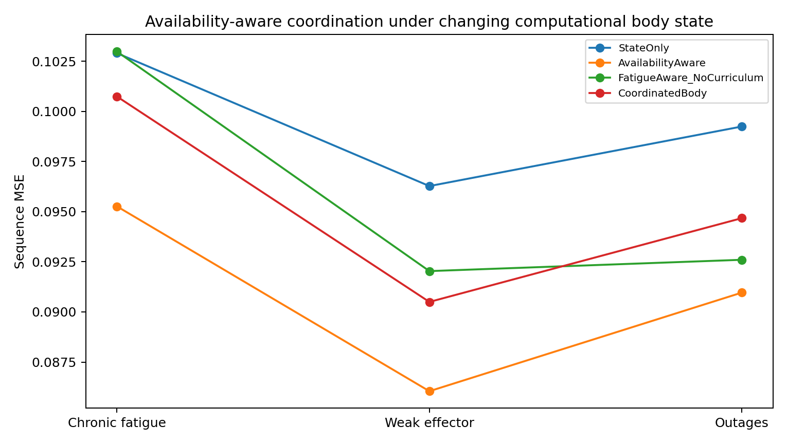

Figure 39. Availability-conditioned routing under the simulated resource regimes. The external prediction target is unchanged across internal capacity perturbations.

#### 7.2.4 Current availability and resource-history information

Table 60. Matched curriculum comparison.

| Scenario | Fatigue-aware / no curriculum | CoordinatedBody | Curriculum gain |
| --- | --- | --- | --- |
| healthy | 0.0847 | 0.0834 | 1.61% |
| chronic_fatigue | 0.1030 | 0.1007 | 2.18% |
| weak_effector | 0.0920 | 0.0905 | 1.67% |
| outages | 0.0926 | 0.0947 | -2.24% |

Evidence: [016/current_availability_sufficiency.csv](evidence/experiments/016/current_availability_sufficiency.csv).

Controlled simulation.

FatigueAware_NoCurriculum and CoordinatedBody use the same architecture. The curriculum yields small improvements in three scenarios and a small deterioration under outages. Current availability appears to carry most of the resource information useful to these models in this construction; additional history offers no systematic predictive advantage.

This comparison motivates testing the incremental information in resource history before introducing a more complex recurrent controller.

#### 7.2.5 Outage compensation and substitute pathways

Table 61. Substitute recruitment after outages.

| Model | Failed | Paired substitute | Δ desired weight | Δ realized load |
| --- | --- | --- | --- | --- |
| AvailabilityAware | 1 | 0 | 0.0211 | 0.0178 |
| AvailabilityAware | 2 | 3 | -0.0221 | -0.0119 |
| CoordinatedBody | 1 | 0 | 0.0101 | 0.0090 |
| CoordinatedBody | 2 | 3 | -0.0204 | -0.0122 |
| StateOnly | 1 | 0 | 0.0000 | 0.0000 |
| StateOnly | 2 | 3 | 0.0000 | 0.0000 |

Evidence: [016/substitution_audit_summary.csv](evidence/experiments/016/substitution_audit_summary.csv).

Controlled simulation.

StateOnly cannot change router weights in response to availability because availability is invisible to the router. Availability-aware systems do change desired load, but the predefined redundant pair is not recovered consistently: the 1→0 outage shows positive substitute recruitment whereas 2→3 does not. The result supports state-dependent re-coordination, not recovery of human-designed synergy labels.

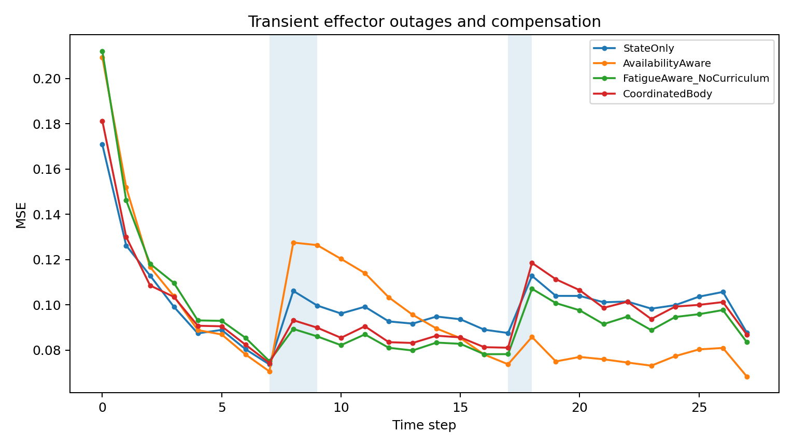

Figure 40. Time-resolved prediction error during scheduled module outages in the simulated availability experiment.

#### 7.2.6 Task state and resource state

The coordinator uses two state descriptions: the information needed for prediction and the resources currently available to perform that computation.

Runtime latency, queue depth, memory pressure, throttling, server loss and tool availability are possible application variables corresponding to the simulated availability state. Their benefit would require direct runtime evaluation.

The result also separates two earlier findings. COORDINATED-EFFECTORS-015 showed that discrete substitute pathways can be trained by lesion experience. AVAILABILITY-AWARE-COORDINATION-016 shows that when degradation is continuous and current availability is directly observable, body-state observability can matter more than recurrent fatigue history.

#### 7.2.7 Training implications

1. Expose current compute/body state to the coordinator. Availability-aware routing improved stressed-condition performance over a task-state-only router.

2. Test future-sufficiency before adding fatigue memory. If current availability already predicts future computational capability, longer body-history machinery is redundant.

3. Separate perturbation curriculum from body-state observability. Lesion experience teaches substitute pathways; availability inputs tell the router which pathways are currently usable.

4. Train across realistic availability ranges before inventing a larger recurrent controller. Random availability training was already competitive or better here.

5. Report late-horizon stress error. A coordinator can survive the first failure but exhaust substitutes later.

6. Audit actual substitution, not only final MSE. Measure desired router-weight changes and realized-load changes after local degradation.

7. Do not force human-designed synergy identities onto learned effectors. Functional roles should be defined by future effects.

8. For production MoE systems, include runtime compute variables in the routing state: latency, queue depth, memory pressure, expert health, external-tool availability and cost.

9. Add explicit planning over future fatigue only when current availability fails a future-sufficiency test.

#### 7.2.8 Results synthesis

The experiment supports conditioning routing on observed availability. The additional value of resource history depends on whether current telemetry captures the information relevant to later capacity and prediction.

#### 7.2.9 Evidence records

AVAILABILITY_​COORDINATION_​016_​bundle.zip

AVAILABILITY_​COORDINATION_​016/​scenario_​summary.csv

AVAILABILITY_​COORDINATION_​016/​robustness_​summary.csv

AVAILABILITY_​COORDINATION_​016/​current_​availability_​sufficiency.csv

AVAILABILITY_​COORDINATION_​016/​substitution_​audit_​summary.csv

AVAILABILITY_​COORDINATION_​016/​scenario_​performance.png

AVAILABILITY_​COORDINATION_​016/​outage_​recovery.png

### 7.3 ANTICIPATORY-COORDINATION-017 Routing under delayed resource depletion

#### 7.3.1 Question

This experiment introduces a hidden cumulative-wear variable that can precede a delayed capacity reduction. Current availability can remain high even near the threshold. Present routing therefore influences both current prediction and the resources available for later predictions.

Task state and estimated resource state determine routing; routing affects prediction and subsequent resource state.

#### 7.3.2 Hidden-future-risk control

A pilot allowed current availability to reveal most of the wear reservoir, as measured by a linear probe. The reported control changes the availability function to isolate information available from history beyond the current value.

Hidden wear q_t accumulates with module recruitment. Visible availability stays near one over a broad range and drops steeply near a threshold. Similar current availability can therefore coexist with different hidden wear. Current-state and history-based probes test whether the intended information difference is present.

#### 7.3.3 Models and training contracts

CurrentAvailability — task state + current availability only; trained on exogenous availability variation.

HistoryAware — recurrently sees task state, current availability and previous realized load; body-transition gradients are detached from current routing.

AnticipatoryCoordinator — identical recurrent architecture to HistoryAware, but trained end-to-end through delayed wear/capacity dynamics with late-weighted error and weak reserve costs.

HistoryAware versus AnticipatoryCoordinator is the critical same-architecture comparison. Observable inputs and parameterization are matched; only the training contract differs.

#### 7.3.4 Prediction and reserve capacity

Table 62. Prediction and final resource state.

| Model | Parameters | Mean MSE | Early MSE | Late MSE | Worst MSE | Final availability | Final wear |
| --- | --- | --- | --- | --- | --- | --- | --- |
| AnticipatoryCoordinator | 7114 | 0.0889 | 0.1153 | 0.0797 | 0.1629 | 0.9844 | 0.1737 |
| CurrentAvailability | 3540 | 0.1165 | 0.1328 | 0.1114 | 0.1675 | 0.8986 | 0.1528 |
| HistoryAware | 7114 | 0.1031 | 0.1235 | 0.0972 | 0.1646 | 0.8899 | 0.1936 |

Evidence: [017/summary.csv](evidence/experiments/017/summary.csv).

Controlled simulation. Lower MSE indicates lower prediction error within the same task and target scaling.

AnticipatoryCoordinator has mean MSE 0.0889, versus 0.1031 for HistoryAware and 0.1165 for CurrentAvailability. Relative to the matched HistoryAware architecture, late MSE falls from 0.0972 to 0.0797, approximately 18.0%, and final availability rises from 0.8899 to 0.9844. Training through resource dynamics improves both outcomes in this construction.

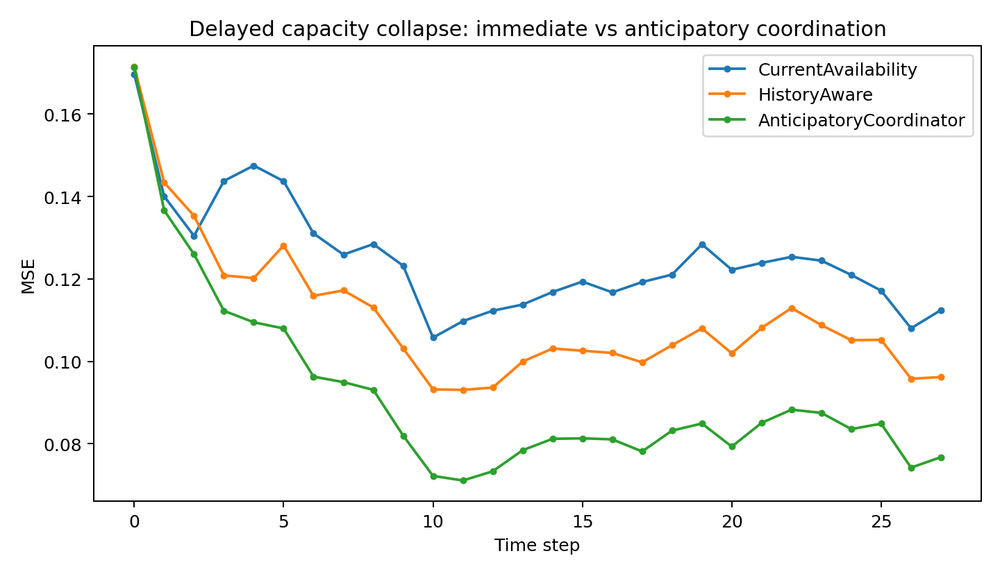

Figure 41. Delayed capacity collapse: immediate versus anticipatory coordination.

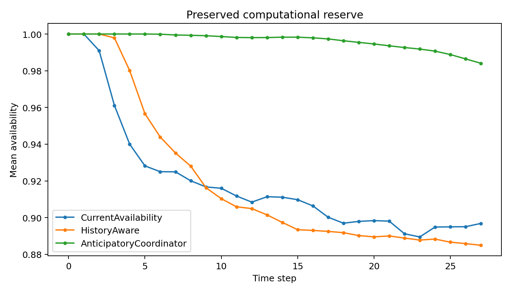

Figure 42. Anticipatory training preserves future computational reserve.

#### 7.3.5 The mechanism is load shaping, not simply lower total work

Table 63. Concentration of hidden wear.

| Model | Mean maximum wear | Late maximum wear | Mean wear SD across modules | Time above q>0.34 | Time above q>0.38 | Mean router entropy |
| --- | --- | --- | --- | --- | --- | --- |
| AnticipatoryCoordinator | 0.2063 | 0.3141 | 0.0801 | 0.0331 | 0.0087 | 1.3277 |
| CurrentAvailability | 0.3476 | 0.4044 | 0.1447 | 0.1998 | 0.1728 | 1.1568 |
| HistoryAware | 0.3292 | 0.4012 | 0.1399 | 0.2271 | 0.1812 | 1.1521 |

Evidence: [017/wear_distribution_summary.csv](evidence/experiments/017/wear_distribution_summary.csv).

Controlled simulation.

Because collapse is thresholded per effector, local concentration of wear matters more than mean wear alone. Relative to HistoryAware, AnticipatoryCoordinator reduces the fraction of effector-time above q>0.34 by 85.4% and late maximum hidden wear by 21.7%. The result is best described as intertemporal load shaping: work is distributed so fewer local effectors cross the delayed failure threshold.

#### 7.3.6 Hidden-body-state audit

Table 64. Hidden-wear probes.

| Model | Wear R² from history state | Wear R² from current availability |
| --- | --- | --- |
| AnticipatoryCoordinator | 0.4232 | 0.1786 |
| HistoryAware | 0.3707 | 0.3614 |

Evidence: [017/hidden_wear_probe_summary.csv](evidence/experiments/017/hidden_wear_probe_summary.csv).

Controlled simulation. Higher probe R² indicates more decodable target-state information.

For AnticipatoryCoordinator, the recurrent coordination state decodes hidden wear at R²≈0.423, whereas current availability alone reaches only R²≈0.179. The corrected experiment therefore succeeds at the intended sufficiency manipulation. HistoryAware also contains some hidden-wear information, but state estimation and planning remain separate problems: knowing a risky body state is not equivalent to learning what action to take because of its future consequences.

#### 7.3.7 Matched-history probe

Table 65. Matched-current-state history intervention.

| Model | Module 0 weight after heavy history | Module 0 weight after balanced history | Avoidance of module 0 | Routing L1 change |
| --- | --- | --- | --- | --- |
| AnticipatoryCoordinator | 0.2460 | 0.2493 | 0.0033 | 0.0254 |
| HistoryAware | 0.2907 | 0.2896 | -0.0010 | 0.0184 |

Evidence: [017/matched_history_probe_summary.csv](evidence/experiments/017/matched_history_probe_summary.csv).

Controlled simulation.

The probe holds current task inputs and availability fixed and varies previous load history. AnticipatoryCoordinator changes its routing distribution more strongly and slightly reduces module-0 recruitment after concentrated module-0 use. The modest effect supports history dependence but does not establish exact recovery of the simulator wear variable q.

#### 7.3.8 Discussion of intertemporal resource allocation

Experiments 015, 016 and 017 separately test compensation after module removal, reaction to current availability and anticipation of delayed depletion. In the third construction, present routing changes the capacity available later, making a sequence-level resource objective relevant.

In an applied computing system, a similar dependency could involve future latency, thermal state, queue pressure, quotas or memory. These examples describe potential resource dynamics; the measured result here uses the specified wear simulator.

Evaluate both future prediction error and the resource state left by current computation.

The matched comparison supports training a coordinator through delayed resource consequences when such dynamics are part of the task. It is a specific resource-allocation result, not a general account of intelligence or reasoning.

#### 7.3.9 Training implications

1. Run a future-sufficiency test on runtime resource telemetry. If current availability predicts future capacity, longer body memory is unnecessary; if delayed degradation remains, recurrent state becomes justified.

2. Train through resource dynamics when current routing changes future compute health. Myopic dropout or IID availability augmentation cannot by itself teach the cost of spending future capacity.

3. Use sequence-level and late-horizon objectives. Immediate prediction rewards consuming the strongest available expert; late-weighted losses expose delayed coordination failures.

4. Separate body-state estimation from body planning. A recurrent state may infer hidden wear without learning to conserve capacity; same-architecture training-contract ablations should test these separately.

5. Penalize local threshold risk, not only mean utilization. The current result is driven by reducing high-wear tails; mean load balance can miss catastrophic concentration.

6. Report reserve metrics with task metrics: late-horizon error, final availability, maximum per-effector wear and the fraction of effector-time above a failure-risk threshold.

7. Use matched-current-state / different-history probes. They reveal whether a router decision depends on future-relevant body history rather than only current task demand.

8. Expose direct telemetry when available. Thermal sensors, queue backlog, rate-limit remaining or memory pressure may be cheaper and more reliable than forcing a recurrent model to infer them indirectly.

9. For distributed MoE systems, treat compute scheduling as intertemporal control. Routing can affect later server health, cache state, queue length, network congestion or expert availability.

10. Match the perturbation schedule to the measured resource process. Experiments 015–017 distinguish module removal, observed capacity and hidden delayed depletion.

#### 7.3.10 Results synthesis

The positive result is not that recurrent routing is intrinsically superior. HistoryAware and AnticipatoryCoordinator share the same recurrent architecture. The advantage appears when training makes present routing responsible for delayed future body degradation.

State estimation and training through delayed consequences make separate contributions to resource-aware prediction.

#### 7.3.11 Evidence records

ANTICIPATORY_​COORDINATION_​017_​CORRECTED_​bundle.zip

ANTICIPATORY_​COORDINATION_​017_​CORRECTED/​summary.csv

ANTICIPATORY_​COORDINATION_​017_​CORRECTED/​hidden_​wear_​probe_​summary.csv

ANTICIPATORY_​COORDINATION_​017_​CORRECTED/​wear_​distribution_​summary.csv

ANTICIPATORY_​COORDINATION_​017_​CORRECTED/​matched_​history_​probe_​summary.csv

ANTICIPATORY_​COORDINATION_​017_​CORRECTED/​anticipatory_​vs_​history_​direct.csv

ANTICIPATORY_​COORDINATION_​017_​CORRECTED/​mse_​timecourse.png

ANTICIPATORY_​COORDINATION_​017_​CORRECTED/​availability_​timecourse.png

### 7.4 COMPUTATIONAL-BODY-WORLD-MODEL-018B Integrated resource-aware prediction

The integrated prototype combines the mechanisms evaluated in 015–017 within an autoregressive state predictor: predictive state, resource state, conditional coordination and overlapping local modules. Evaluation concerns generation of the fixed target trajectory under internal resource perturbations.

#### 7.4.1 Architecture

The prototype combines four mechanisms that had previously been tested separately:

a recurrent predictive state that carries the history needed to generate the next world;

a deliberately low-rank shared transition path for global/common dynamics;

four overlapping local effectors that carry most nonlinear transition capacity;

a coordination field that can condition on the world state and, in the full ComputationalBody version, on availability and recurrent body history.

history → predictive world state → body state → coordination field → overlapping effectors → next world

#### 7.4.2 Controls for shared-path capacity and perturbation conditions

A pilot had an overly capable shared backbone and identical healthy and depletion evaluation paths. The reported 018B comparison uses a rank-3 shared path and distinct healthy, depletion and module-removal resource dynamics. These controls make local module contribution and perturbation response separately measurable.

#### 7.4.3 Autoregressive world-generation result

Each model receives four true initial frames and generates the next 16 autoregressively. All conditions use the same target trajectory; the intervention changes only the model's internal computational resources.

Table 66. Autoregressive prediction under internal perturbations.

| Model | Body condition | Mean rollout MSE | Late MSE | Final availability |
| --- | --- | --- | --- | --- |
| DenseWorld | healthy | 0.0987 | 0.1358 | - |
| DenseWorld | lesion1 | 0.0987 | 0.1358 | - |
| DenseWorld | lesion2 | 0.0987 | 0.1358 | - |
| DenseWorld | fatigue | 0.0987 | 0.1358 | - |
| StaticWorldMoE | healthy | 0.1090 | 0.1393 | 1.000 |
| StaticWorldMoE | lesion1 | 0.1745 | 0.2856 | 0.765 |
| StaticWorldMoE | lesion2 | 0.2108 | 0.3778 | 0.765 |
| StaticWorldMoE | fatigue | 0.0928 | 0.1129 | 0.984 |
| ComputationalBody | healthy | 0.1066 | 0.1365 | 1.000 |
| ComputationalBody | lesion1 | 0.1235 | 0.1819 | 0.765 |
| ComputationalBody | lesion2 | 0.1172 | 0.1650 | 0.765 |
| ComputationalBody | fatigue | 0.0999 | 0.1208 | 0.982 |

Evidence: [018B/scenario_summary.csv](evidence/experiments/018B/scenario_summary.csv).

Controlled simulation. Lower MSE indicates lower prediction error within the same task and target scaling.

The key comparison is StaticWorldMoE versus ComputationalBody. Their intact performance is nearly matched (0.1090 versus 0.1066), but StaticWorldMoE deteriorates by about 60% and 93% after lesion of effectors 1 and 2. ComputationalBody deteriorates by only about 16% and 10% under the same lesions. DenseWorld remains a strong monolithic baseline at 0.0987 mean rollout MSE.

#### 7.4.4 The effectors are now necessary computation

Table 67. Shared-only ablation.

| Model | Shared-only rollout MSE |
| --- | --- |
| BodyAwareWorld | 0.5868 |
| ComputationalBody | 0.5530 |
| StaticWorldMoE | 0.5917 |

Evidence: [018B/effector_necessity.csv](evidence/experiments/018B/effector_necessity.csv).

Controlled simulation. Lower MSE indicates lower prediction error within the same task and target scaling.

Removing all local effectors raises rollout MSE to approximately 0.55–0.59. Thus the shared path alone does not account for the predictor's performance, and the module-removal comparison tests redistribution among functionally relevant components.

#### 7.4.5 Internal redistribution after lesion

Table 68. Redistribution after module removal.

| Model | Failed effector Δweight | Nonfailed total Δweight | Failed realized-load Δ |
| --- | --- | --- | --- |
| BodyAwareWorld | -0.0292 | +0.0292 | -0.2727 |
| ComputationalBody | -0.0479 | +0.0479 | -0.3077 |
| StaticWorldMoE | -0.0307 | +0.0307 | -0.2661 |

Evidence: [018B/redistribution.csv](evidence/experiments/018B/redistribution.csv).

Controlled simulation.

ComputationalBody shows the largest explicit redistribution in this audit: failed-module weight decreases by approximately 0.048 and the remaining modules gain the same total weight. Internal perturbation therefore changes the allocation of computation as well as the realized module outputs.

#### 7.4.6 Dependence on the training objective

BodyAwareWorld has intact mean rollout MSE approximately 0.375 and improves to approximately 0.125 after a lesion. Availability inputs alone therefore do not ensure a useful allocation. The anomalous ordering identifies an interaction between the training distribution, objective and intact configuration.

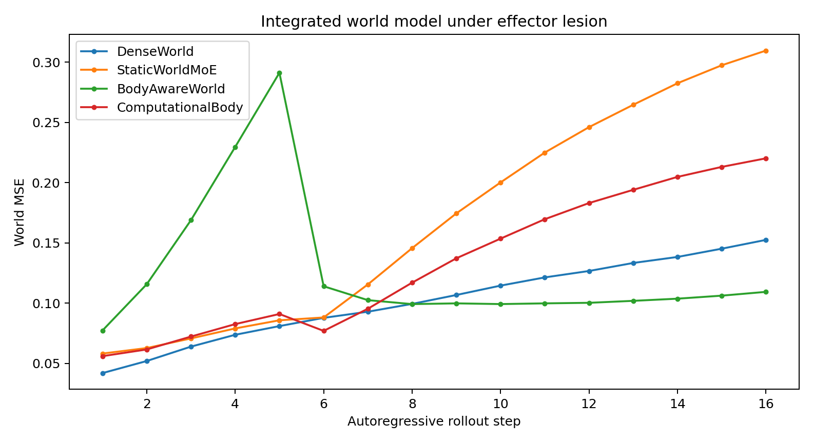

Figure 43. Long autoregressive world-generation error after effector-1 lesion.

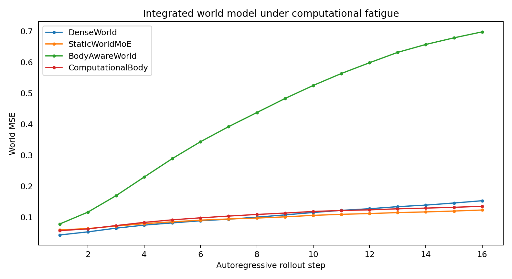

Figure 44. Long autoregressive world-generation error under cumulative computational fatigue.

#### 7.4.7 Discussion of the integrated predictor

The experiment combines predictive recurrence and resource-conditioned computation in one generator. A module perturbation changes the internal implementation of prediction without changing the external target.

The demonstrated design can preserve prediction under local module loss by reallocating contributions among the remaining modules, with the reported accuracy and resource costs.

Module roles are operationally defined by their state-dependent effects on output and by the extent to which alternatives preserve prediction after removal.

#### 7.4.8 Training implications

1. Make local effectors functionally necessary before interpreting robustness. A shared-only ablation should fail substantially if compensation is genuine.

2. Use a deliberately limited shared backbone for globally reusable world dynamics; allocate nonlinear local transition capacity to overlapping effectors.

3. Train the world model and coordination system as one loop whenever expert availability changes the effective forward computation.

4. Expose temporary expert lesions during training if graceful degradation is a deployment requirement; intact-only training does not teach substitute computation.

5. Evaluate long autoregressive trajectories. One-step teacher forcing can conceal internal-body instability that compounds over generated future frames.

6. Hold the target trajectory fixed when perturbing internal resources. This separates prediction difficulty from the resource intervention.

7. Measure redistribution as well as MSE: failed-effector weight, realized load and compensating weight on surviving effectors.

8. Examine interactions between the training objective and resource inputs when intact prediction is worse than perturbed prediction.

9. State the evaluation objective explicitly. This experiment tests autoregressive prediction and internal resource coordination.

#### 7.4.9 Results synthesis

The running prototype implements a recurrent predictor, a limited shared transition path and overlapping modules coordinated under changing availability. The reported evidence is the intact, removal and depletion comparison, together with shared-only and redistribution controls.

Prediction quality, functional module contribution and perturbation response are evaluated as distinct outcomes.

#### 7.4.10 Evidence records

COMPUTATIONAL_​BODY_​WORLD_​MODEL_​018B_​bundle.zip

COMPUTATIONAL_​BODY_​WORLD_​MODEL_​018B/​scenario_​summary.csv

COMPUTATIONAL_​BODY_​WORLD_​MODEL_​018B/​robustness.csv

COMPUTATIONAL_​BODY_​WORLD_​MODEL_​018B/​redistribution.csv

COMPUTATIONAL_​BODY_​WORLD_​MODEL_​018B/​effector_​necessity.csv

COMPUTATIONAL_​BODY_​WORLD_​MODEL_​018B/​lesion_​rollout.png

COMPUTATIONAL_​BODY_​WORLD_​MODEL_​018B/​fatigue_​rollout.png

### 7.5 CROSS-WORLD-STRESS-BATTERY-019 Prediction across transition regimes

The same integrated architecture is evaluated across several controlled transition regimes to measure its operating range.

Fixed architecture: predictive recurrent state → low-rank shared dynamics → overlapping effectors → recurrent body-aware coordination.

#### 7.5.1 World battery

smooth — stationary continuous dynamics;

switch — transition mechanism changes abruptly halfway through the trajectory;

curved — strongly state-dependent local curvature;

hidden_memory — a slowly evolving latent driver influences visible dynamics but is not directly observed.

#### 7.5.2 Controlling total contribution under availability gating

An initial implementation coupled availability-dependent allocation to the total strength of local transitions, so removing a module could improve calibration by reducing amplitude. The normalized comparison below separates these effects more directly.

#### 7.5.3 Normalized recruitment

The realized coordination field was changed from raw (wᵢaᵢ) to normalized recruitment ŵᵢ = wᵢaᵢ / Σⱼ wⱼaⱼ. Availability now primarily redistributes local computation rather than turning total local mechanism strength down.

#### 7.5.4 Corrected cross-world result

Table 69. Cross-regime prediction after gain normalization.

| World | Dense MSE | Body healthy | Body lesion | Body fatigue | Healthy gain vs dense (%) | Lesion degradation (%) | Fatigue degradation (%) |
| --- | --- | --- | --- | --- | --- | --- | --- |
| smooth | 0.164 | 0.169 | 0.170 | 0.151 | -3.104 | 0.281 | -10.801 |
| switch | 0.224 | 0.228 | 0.205 | 0.200 | -1.433 | -9.804 | -11.910 |
| curved | 0.463 | 0.583 | 0.593 | 0.546 | -25.997 | 1.711 | -6.337 |
| hidden_memory | 0.291 | 0.361 | 0.364 | 0.330 | -24.111 | 0.792 | -8.747 |

Evidence: [019/gain_normalization_comparison.csv](evidence/experiments/019/gain_normalization_comparison.csv).

Controlled simulation. Lower MSE indicates lower prediction error within the same task and target scaling.

After normalization, the integrated model has accuracy close to DenseWorld on smooth and switching dynamics and higher error on the high-curvature and hidden-memory conditions. The battery measures these regime-dependent differences separately from removal sensitivity.

Smooth: healthy body MSE 0.169 versus DenseWorld 0.164; lesion degradation ≈ 0.3%.

Switch: healthy body MSE 0.228 versus DenseWorld 0.224; lesion still improves performance (~9.8%), so this regime retains a calibration/regularization interaction.

Curved: healthy body MSE 0.583 versus DenseWorld 0.463; lesion degradation ≈ 1.7%.

Hidden-memory: healthy body MSE 0.361 versus DenseWorld 0.291; lesion degradation ≈ 0.8%.

Across all four worlds, lesion routing moves about 0.20–0.27 total weight away from the failed effector into the remaining effectors.

#### 7.5.5 Redistribution audit

Table 70. Redistribution across transition regimes.

| World | Failed weight Δ | Nonfailed weight gain | Failed realized-load Δ |
| --- | --- | --- | --- |
| curved | -0.256 | 0.256 | -0.300 |
| hidden_memory | -0.199 | 0.199 | -0.231 |
| smooth | -0.271 | 0.271 | -0.295 |
| switch | -0.204 | 0.204 | -0.228 |

Evidence: [019/normalized_redistribution.csv](evidence/experiments/019/normalized_redistribution.csv).

Controlled simulation.

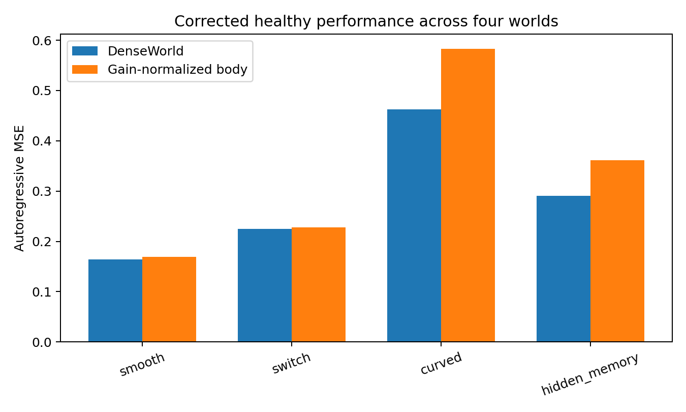

Figure 45. Healthy prediction error across four synthetic transition regimes using the fixed integrated architecture and DenseWorld baseline.

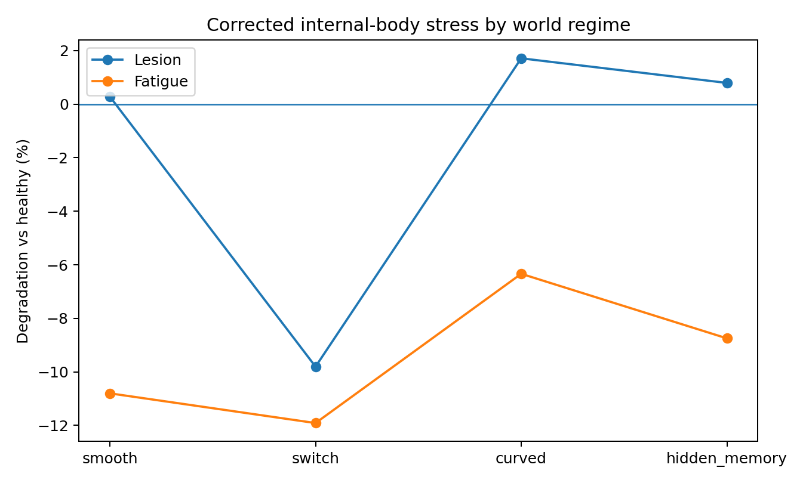

Figure 46. Prediction under module removal and depletion across the four synthetic regimes. The external target dynamics are held fixed within each regime.

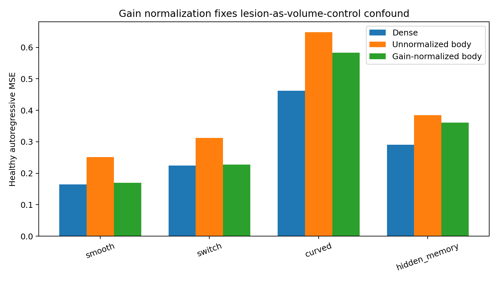

Figure 47. Effect of normalizing availability-weighted recruitment. The comparison diagnoses coupling between module allocation and total transition amplitude.

#### 7.5.6 Interpretation

The four-regime comparison defines an empirical operating range for this prototype.

The key correction from 019 is structural: when experts jointly represent one conserved functional contribution, body-state gating must separate allocation from total functional gain.

A useful comparison of added components should report whether improvements in difficult regimes also preserve prediction under module removal.

#### 7.5.7 Training implications

1. Keep one core architecture fixed across the stress battery; per-domain hand tuning is not evidence of generality.

2. Measure healthy accuracy and internal-body robustness separately. A model can be robust yet systematically underfit a world regime.

3. Preserve functional invariants under internal damage. If availability only reallocates responsibility, normalize or explicitly model total mechanism gain.

4. Treat lesion-improves-accuracy as a red flag for a confounded stress test.

5. Keep smooth, abrupt-switch, high-curvature and hidden-memory worlds as a permanent regression suite.

6. Assess high-curvature and hidden-memory conditions separately when selecting local capacity or state timescales.

7. Evaluate an added component across repeated seeds and regimes, including both intact and perturbed predictions.

#### 7.5.8 Results synthesis

Module loss redistributes approximately 0.20–0.27 total weight and produces little rollout deterioration in three regimes. In the switching condition, removal improves error, indicating a remaining calibration interaction. High-curvature and hidden-memory conditions have higher intact error than DenseWorld. Experiment 020 tests targeted changes to those two representation demands.

### 7.6 TARGETED-FAILURE-REPAIR-020 Curvature + Slow-State Repair

This experiment tests local nonlinear features and a slow predictive state in the high-curvature and hidden-memory conditions identified in 019. The central coordination design is held fixed, and the selected combination is evaluated with a second initialization across the four-regime battery.

#### 7.6.1 Architectural comparisons

Curvature Patch — local effectors receive a compact squared nonlinear feature channel; the low-rank shared pathway is unchanged.

Slow-State Patch — predictive state gains a low-dimensional slow component beside the fast recurrent state.

Dual Patch — combines both repairs with no change to body-state routing, gain normalization or lesion training.

AdaptiveDual adds a resettable slow-state component after a seed-specific switch-regime deterioration. Its results are retained as a comparison with the simpler fixed-slow Dual model.

#### 7.6.2 Two-seed regression result

Table 71. Two-seed comparison of the Dual model.

| World | Dense MSE | Baseline | Dual | Dual vs Dense | Lesion Δ |
| --- | --- | --- | --- | --- | --- |
| smooth | 0.157 | 0.142 | 0.117 | -25.5% | +2.4% |
| switch | 0.143 | 0.133 | 0.138 | -3.1% | +1.1% |
| curved | 0.653 | 0.641 | 0.554 | -15.2% | +0.8% |
| hidden_memory | 0.330 | 0.374 | 0.295 | -10.8% | +0.6% |

Evidence: [020/replicated_scorecard.csv](evidence/experiments/020/replicated_scorecard.csv), [020/replicated_summary.csv](evidence/experiments/020/replicated_summary.csv).

Controlled simulation. Lower MSE indicates lower prediction error within the same task and target scaling. Dual vs Dense is relative error change: negative values favour Dual. Lesion Δ is the increase relative to intact Dual.

Across two-seed means, Dual Patch has lower error than DenseWorld in all four regimes: smooth −25.5%, switch −3.1%, curved −15.2% and hidden-memory −10.8%. Single-module removal increases error by approximately 0.6–2.4%.

The resettable slow-state variant does not consistently improve the full comparison over the simpler fixed-slow Dual Patch.

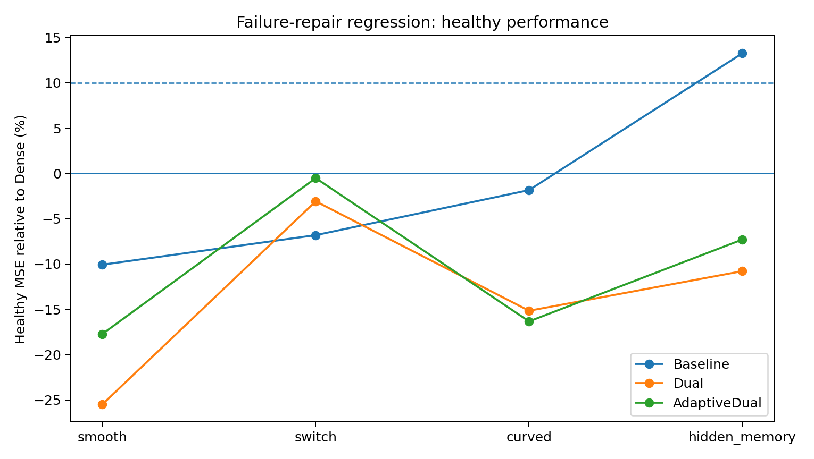

Figure 48. Intact prediction across the four synthetic regimes after adding curvature features and slow state. Reported summary comparisons use two initializations.

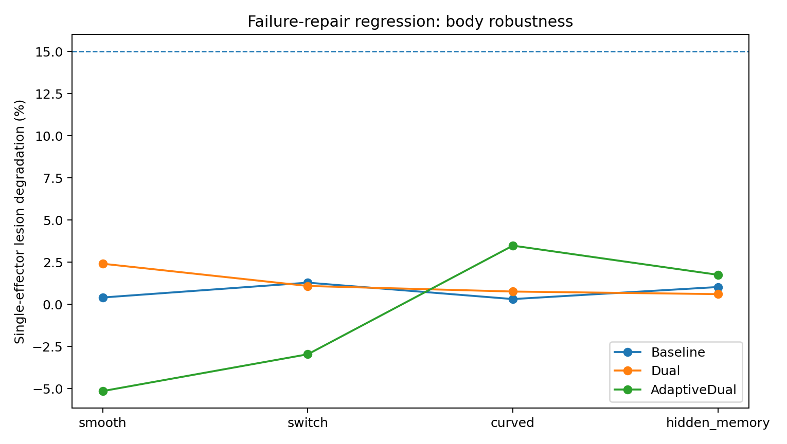

Figure 49. Single-module removal sensitivity for the tested architectural additions across the four-regime battery.

#### 7.6.3 Components of the Dual model

Fast predictive state remains responsible for immediately changing world geometry.

A compact slow predictive state preserves longer-lived latent causes and delayed context.

Each local effector gains a small curvature-sensitive nonlinear channel; the shared world pathway stays deliberately low-rank.

Availability-aware, gain-normalized coordination and lesion compensation are unchanged.

#### 7.6.4 Training implications

1. Repair repeated failure modes with local capacity rather than widening the whole system. Curvature was addressed inside effectors, not by expanding the shared backbone.

2. Give persistent hidden causes their own timescale. A fast-only predictive state was not enough for the hidden-memory regime.

3. Distinguish initial screening from evaluation on an additional seed and the complete condition set.

4. Keep healthy accuracy and internal-body robustness as separate hard gates. Better prediction does not excuse loss of compensation.

5. Evaluate added flexibility through observed predictive and perturbation outcomes.

6. Report smooth, switching, curved and hidden-memory conditions together with single-module removal when comparing changes to this design.

7. Assess improvements and deteriorations across the same condition set when selecting an additional component.

#### 7.6.5 Integrated model specification

history → fast predictive state + slow predictive state → computational body state → coordination field → gain-normalized overlapping effectors with local curvature capacity → next-world generation

The evaluated objective is autoregressive state prediction with internal resource perturbations.

## 8. Source structure and real graph data

### 8.1 MULTI-SOURCE-DATA-BATTERY-021 One Core Across Data Structures

This experiment tests reuse of one central predictive and coordination architecture across continuous trajectories, categorical events, unordered sets and graph-indexed node states. Architecture reuse is evaluated after training each source-specific system; it does not imply a single checkpoint has acquired all four tasks.

Source-specific adapters and decoders expose the native input and output structure. The central architecture is held fixed across the source comparisons.

#### 8.1.1 Fixed contract

Central core held fixed: fast predictive state + slow predictive state + low-rank shared pathway + four overlapping curvature-capable effectors + recurrent computational-body state + gain-normalized coordination.

Only source-specific adapter and decoder are allowed to change.

DenseCore baseline uses the same adapter and decoder, replacing only the central ComputationalBody with a monolithic recurrent core.

All sources are tested autoregressively, not only under teacher forcing.

The same persistent single-effector lesion is applied to every compatible source.

#### 8.1.2 Four source structures

Table 72. Source structures and native objectives.

| Source | Structure | Native metric | Boundary adapter |
| --- | --- | --- | --- |
| continuous | 8-D continuous trajectory | MSE | thin MLP adapter |
| event | categorical event stream from persistent hidden mechanism | cross-entropy + rollout accuracy | token embedding |
| set | unordered moving 2-D point set; permutation shuffled every frame | Chamfer distance | permutation-invariant item encoder |
| graph | node-state dynamics on a per-sample relation graph | node-state MSE | relation-aware message passing |

#### 8.1.3 Initial comparison

Table 73. Initial multi-source comparison.

| Source | Dense | Body healthy | Body lesion | Healthy gain vs Dense (%) | Lesion degradation (%) |
| --- | --- | --- | --- | --- | --- |
| continuous | 0.057 | 0.047 | 0.048 | 17.014 | 1.079 |
| event | 2.929 | 3.041 | 3.036 | -3.813 | -0.182 |
| set | 0.663 | 0.667 | 0.669 | -0.709 | 0.248 |
| graph | 0.019 | 0.034 | 0.035 | -78.448 | 4.667 |

Evidence: [021/cross_source_scorecard.csv](evidence/experiments/021/cross_source_scorecard.csv).

Controlled simulation.

Continuous, event and unordered-set sources satisfy the experiment's intact-performance and module-removal criteria. The initial graph system has much higher intact error than its DenseCore comparison, despite a modest removal penalty.

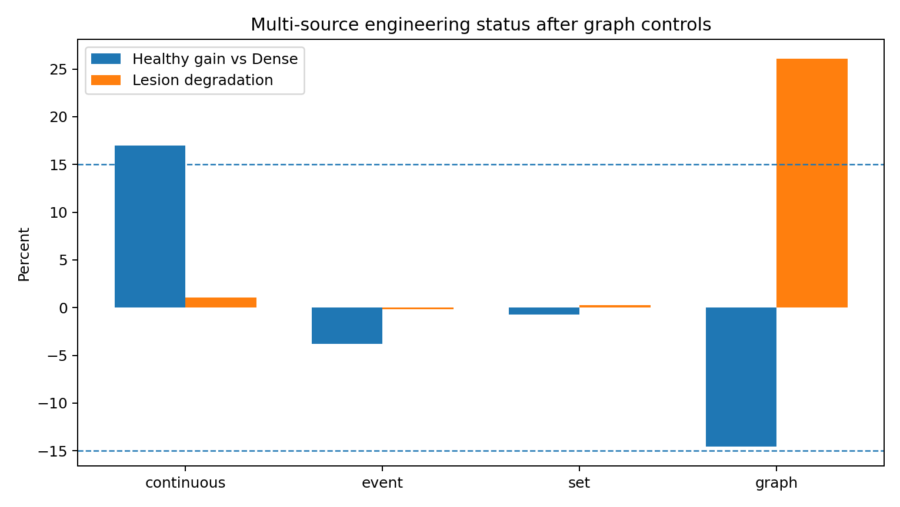

Figure 50. Multi-source prediction and perturbation outcomes after graph-adapter and training-duration comparisons. The source-native metrics differ and are evaluated within each source.

#### 8.1.4 Graph adapter with retained node identity

The initial graph adapter applies message passing and mean-pools node states. In this indexed node-prediction task, pooling loses information needed by the decoder. The alternative retains node identity after message passing and uses a thin linear compression layer. The central core is unchanged. Graph relabelling symmetries and indexed outputs should be handled explicitly; retaining node state here is a task requirement rather than a universal rejection of invariant graph summaries.

Table 74. Graph adapter preserving node identity.

| Model | Scenario | Rollout metric | Late metric |
| --- | --- | --- | --- |
| ComputationalBody_IDGraph | healthy | 0.0198 | 0.0275 |
| ComputationalBody_IDGraph | lesion1 | 0.0190 | 0.0256 |
| DenseCore_IDGraph | healthy | 0.0153 | 0.0159 |

Evidence: [021/graph_adapter_repair_summary.csv](evidence/experiments/021/graph_adapter_repair_summary.csv).

Controlled simulation.

Retaining node identity improves both models. At the shorter training schedule, ComputationalBody still has approximately 30% higher error than DenseCore; its module-removal criterion is satisfied.

#### 8.1.5 Matched longer-training comparison

Both graph models use the same longer training schedule with the identity-preserving adapter. Architecture, data and loss are held fixed. This tests sensitivity to training duration; matching duration alone does not demonstrate equal convergence.

Table 75. Matched longer-training comparison.

| Model | Scenario | Rollout metric | Late metric |
| --- | --- | --- | --- |
| ComputationalBody_IDGraph_long | healthy | 0.00906 | 0.00646 |
| ComputationalBody_IDGraph_long | lesion1 | 0.01142 | 0.01336 |
| DenseCore_IDGraph_long | healthy | 0.00791 | 0.00549 |

Evidence: [021/graph_long_training_summary.csv](evidence/experiments/021/graph_long_training_summary.csv).

Controlled simulation.

Intact graph error is 14.6% higher than DenseCore, within the reported tolerance of 15%. The same ComputationalBody checkpoint has a 26.1% error increase under single-module removal and therefore does not satisfy both evaluation criteria.

#### 8.1.6 Results by source structure

Table 76. Evaluation criteria by source.

| Source | Healthy gain vs Dense (%) | Lesion degradation (%) | Healthy | Lesion | Overall |
| --- | --- | --- | --- | --- | --- |
| continuous | 17.0 | 1.1 | PASS | PASS | PASS |
| event | -3.8 | -0.2 | PASS | PASS | PASS |
| set | -0.7 | 0.2 | PASS | PASS | PASS |
| graph | -14.6 | 26.1 | PASS | FAIL | FAIL |

Evidence: [021/final_cross_source_scorecard.csv](evidence/experiments/021/final_cross_source_scorecard.csv), [021/graph_long_training_audit.csv](evidence/experiments/021/graph_long_training_audit.csv).

Evidence annotation: the graph row uses the longer-training comparison in `graph_long_training_audit.csv`; `final_cross_source_scorecard.csv` records the preceding adapter comparison.

Controlled simulation. PASS/FAIL refers to the stated study criteria, not general task mastery.

Continuous, event and unordered-set models satisfy both reported criteria. The graph model satisfies the intact-error tolerance after longer training but exceeds the permitted removal degradation.

#### 8.1.7 Interpretation of architectural reuse

The same central ComputationalBody architecture can be trained behind thin adapters on continuous, categorical-event and unordered-set sources without redesigning the coordinator.

Removal sensitivity varies by source. The longer-trained graph model exposes a trade-off between intact accuracy and perturbation resilience.

The event model satisfies the architectural comparison criteria with rollout token accuracy approximately 0.137. Its categorical prediction quality should therefore be read through that absolute metric as well as its comparison with DenseCore.

The graph comparison identifies two requirements to evaluate together: retaining node-local predictive information and preserving substitute computation under module loss.

#### 8.1.8 Training implications

1. Adapter sufficiency is part of the system contract. A source-general core cannot reconstruct information discarded before entry.

2. Preserve the correct symmetry. Unordered sets need permutation invariance; identified graph nodes do not justify identity-destroying pooling.

3. Keep source-native objectives. Continuous and graph data use MSE, events use cross-entropy, and sets use Chamfer distance.

4. Separate healthy convergence from body robustness during checkpoint selection. A model can improve normal graph accuracy faster than lesion tolerance.

5. Compare training-duration sensitivity before attributing a difference entirely to architecture, and report the evidence used to judge convergence.

6. Thin adapters are preferred. If most of the work moves into a source-specific front end, the central-core generality claim becomes weak.

7. Evaluate both intact performance and resource-perturbation response within each source-native task.

#### 8.1.9 Architecture across source structures

source-specific thin adapter → fast predictive state + slow predictive state → computational body state → coordination field → gain-normalized overlapping effectors with local curvature capacity → source-specific decoder → next-source generation.

The tests demonstrate reuse of the central architecture across three source structures under the stated criteria. The graph task reveals a remaining trade-off within the reported comparison. The objective throughout is prediction of the next source state and its autoregressive continuation.

### 8.2 REAL-GRAPH-GEOMETRY-022 Measured structure in public graph data

This section characterizes five real graph datasets to inform representation and scale choices. It measures topology directly, separately from the synthetic graph-prediction comparison in 021.

Graph representation choices should be informed by the scale, mixing and local heterogeneity of the observed network.

#### 8.2.1 Real-data basis

Dolphins — 62-node bottlenose dolphin association network from Doubtful Sound, New Zealand.

Email-Eu-core — institutional email communication network; department labels are available for 42 departments.

ca-GrQc — arXiv General Relativity and Quantum Cosmology scientific collaboration network.

Facebook Combined — combined anonymized ego-network graph from the SNAP Facebook social-circles collection.

Cora — citation network of 2,708 scientific papers; canonical data include 5,429 citation records and 1,433 binary word attributes.

Measurement convention. Directed citation/email sources are symmetrized for the topology geometry reported below. Shortest-path, neighborhood-growth and spectral-gap comparisons use the largest connected component. Large-graph clustering values are deterministic node-sample estimates; they are not substituted for the source repositories' exact published clustering coefficients.

#### 8.2.2 Measured geometry: scale and mixing

Table 77. Largest-component scale and mixing.

| Dataset | LCC N | Mean distance | 2-hop coverage | 4-hop coverage | λ₂ (norm. Laplacian) |
| --- | --- | --- | --- | --- | --- |
| Dolphins | 62 | 3.357 | 33.19% | 77.52% | 0.0395 |
| Email-Eu-core | 986 | 2.610 | 44.35% | 99.61% | 0.2122 |
| ca-GrQc | 4158 | 6.065 | 0.78% | 14.11% | 0.0215 |
| Facebook Combined | 4039 | 3.667 | 18.04% | 78.69% | 0.0073 |
| Cora | 2485 | 6.269 | 1.82% | 16.57% | 0.0162 |

Evidence: [022/real_graph_geometry_metrics.csv](evidence/experiments/022/real_graph_geometry_metrics.csv).

Measurements from the real public datasets specified in this section.

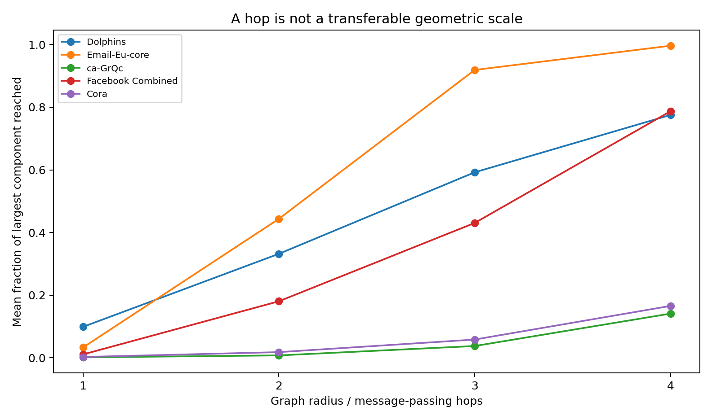

Figure 51. Neighborhood coverage by graph radius.

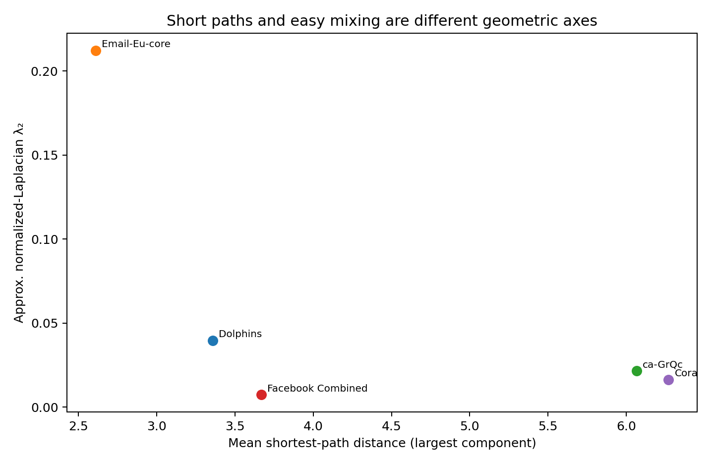

Figure 52. Mean graph distance and spectral connectivity are distinct axes.

#### 8.2.3 Measured geometry: hub structure and local mixing

Table 78. Degree heterogeneity and local mixing.

| Dataset | Mean degree | Degree CV | Degree Gini | Degree assortativity | Clustering* |
| --- | --- | --- | --- | --- | --- |
| Dolphins | 5.13 | 0.572 | 0.325 | -0.044 | 0.303 |
| Email-Eu-core | 32.58 | 1.136 | 0.544 | 0.032 | 0.452 |
| ca-GrQc | 5.53 | 1.433 | 0.555 | 0.703 | 0.687 |
| Facebook Combined | 43.69 | 1.200 | 0.541 | 0.125 | 0.608 |
| Cora | 3.90 | 1.341 | 0.405 | -0.058 | 0.288 |

Evidence: [022/real_graph_geometry_metrics.csv](evidence/experiments/022/real_graph_geometry_metrics.csv).

Measurements from the real public datasets specified in this section. *Large-graph clustering uses the deterministic sampled-node procedure described in the text.

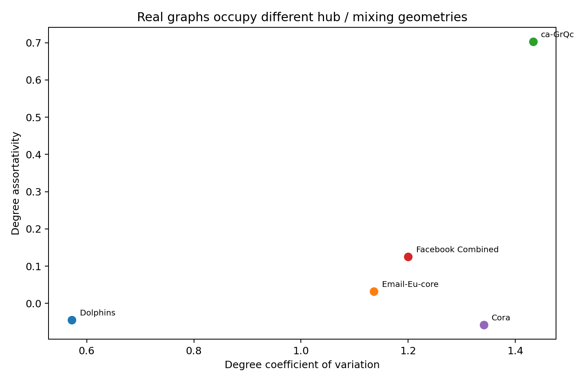

Figure 53. Degree heterogeneity and degree assortativity across real graph sources.

#### 8.2.4 Semantic-topology alignment

Email-Eu-core gives a direct label-based check. Across 24,929 retrieved directed email edges, 34.68% connect members of the same department. The random-pair expectation from department sizes is 4.76%, a 7.28× enrichment. Topology therefore carries strong semantic information, but most communication edges still cross departments.

#### 8.2.5 Empirical findings

A hop is not a transferable geometric unit. Two-hop coverage ranges from 0.78% of the ca-GrQc giant component and 1.82% of Cora to 44.35% of Email-Eu-core. A two-layer message-passing network therefore represents radically different spatial scales on different real graphs.

Short paths and easy mixing are separate axes. Email-Eu-core has mean distance ≈2.61 and λ₂≈0.212. Facebook is also compact (≈3.67) but has λ₂≈0.0073, indicating a much stronger spectral bottleneck despite short paths.

Degree CV exceeds 1 in Email, Facebook, Cora and ca-GrQc; the dolphin graph is more homogeneous. ca-GrQc is strongly assortative, approximately +0.70, and Cora and Dolphins are mildly disassortative.

A single graph dimension is inadequate. Finite-radius growth exponents vary by source and by node; polynomial and exponential fits can both look plausible over radii 1–4. The directly useful engineering object is the local expansion profile, not a single global dimension.

Topology and semantics are coupled but not identical. The 7.28× department enrichment in Email shows that edges are semantically informative, yet approximately 65% of email edges still cross department labels.

#### 8.2.6 Implications for graph representation

Fixed-hop aggregation is not scale invariant across real graph sources.

Global pooling can erase node-local predictive state in graphs with strong local degree, neighborhood-volume and community heterogeneity.

One global expert-mixture vector may be the wrong lesion geometry: removing one global effector removes the same functional direction at every node simultaneously.

These measurements identify graph-structure requirements. They do not constitute a new trained graph-model comparison.

#### 8.2.7 Training implications

1. Normalize graph context by measured neighborhood volume or diffusion scale rather than assuming raw hop count is comparable across datasets.

2. Use spectral/mixing diagnostics alongside shortest-path diagnostics; compact distance does not imply weak community bottlenecks.

3. Preserve node-local state until a task-specific sufficiency test demonstrates that global pooling is safe.

4. Audit degree and neighborhood-volume heterogeneity during batching and normalization; uniform aggregation is not geometry neutral.

5. Keep graph geometry in the training contract. A fixed GNN depth is not a fixed receptive-field scale.

6. Separate global expert lesions from local/spatial computation loss in robustness tests.

7. The graph regression suite is defined by the measured regimes: fast-mixing communication, modular social networks, sparse citation graphs, assortative collaboration graphs and small biological social graphs.

#### 8.2.8 Data provenance and method notes

Stanford SNAP: email-Eu-core, ca-GrQc and ego-Facebook dataset pages.

Cora: public citation edge list; canonical dataset has 2,708 papers, 5,429 links and 1,433 binary word attributes.

Dolphins: Lusseau et al. social association network (62 dolphins, 159 edges).

Raw edge data were retrieved from public GitHub mirrors when direct binary dataset download was unavailable in the execution environment.

λ₂ values are sparse power-iteration estimates of the second normalized-Laplacian eigenvalue on the largest connected component.

Neighborhood volumes B1–B4 and graph distances are deterministic sampled-BFS estimates; all reported dataset comparisons use the same procedure.

### 8.3 REAL-GRAPH-MULTILAYER-GEOMETRY-023 Attributes, Time, and Edge State

This section measures node attributes, temporal activity and signed edge state in real public datasets. The analyses characterize representation requirements independently of model training.

#### 8.3.1 Facebook node-attribute geometry versus topology

SNAP Facebook ego network 0 provides friendship edges, 224-dimensional anonymized profile vectors and social-circle annotations. The alter-only subgraph analyzed here contains 347 nodes and 2,519 edges. Nodes contain a mean of 9.56 active profile features.

Table 79. Facebook attributes and social circles.

| Pair type | Feature cosine | Feature Jaccard | Shared-circle fraction | Lift |
| --- | --- | --- | --- | --- |
| Friendship edge | 0.386 | 0.229 | 48.47% | circle 3.25× |
| Sampled non-edge | 0.355 | 0.206 | 14.93% | reference |

Evidence: [023/facebook_attribute_summary.csv](evidence/experiments/023/facebook_attribute_summary.csv).

Measurements from the real public datasets specified in this section.

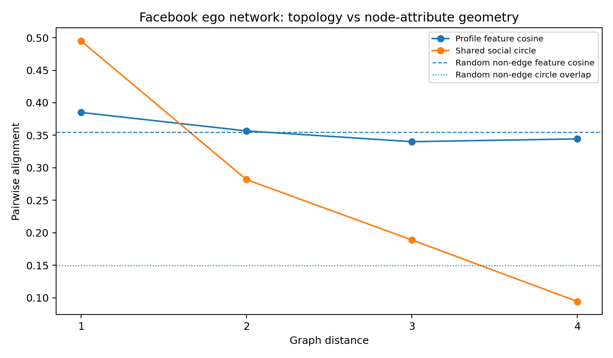

Figure 54. Facebook topology, profile features and social-circle alignment.

Profile-feature similarity declines from graph distance 1 to 3 only modestly (0.385 → 0.340), whereas shared-circle probability declines from 49.5% to 18.9%. The graph is therefore much more strongly aligned with explicit social-circle membership than with one pooled profile-feature cosine.

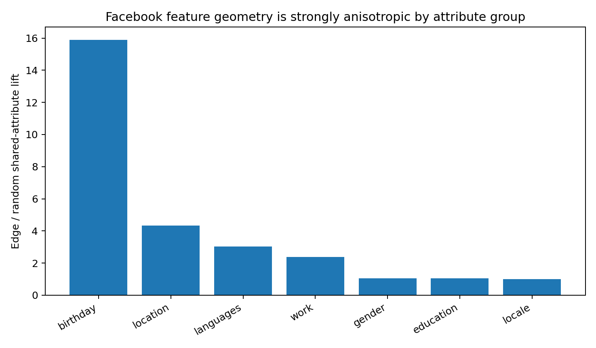

Figure 55. Edge enrichment differs sharply by Facebook feature family.

Feature families have different alignment with edges. Location, languages and work have enrichments of 4.34×, 3.03× and 2.37×. Locale, education and gender are near the sampled random-pair expectation at approximately 1.00×, 1.04× and 1.06×. Birthday has high lift but a very small base rate, so it receives little weight in the global interpretation.

#### 8.3.2 Email-Eu-core temporal edge geometry

The real temporal file contains 332,334 directed email events among 986 users over ~803.9 days, collapsing to 24,929 unique directed dyads.

Table 80. Email temporal-edge measurements.

| Measured quantity | Value |
| --- | --- |
| Repeated-event fraction | 92.50% |
| Events per unique directed dyad | 13.33 |
| Dyad event-count Gini | 0.777 |
| Top 10% dyads' share of events | 69.80% |
| Top 1% dyads' share of events | 26.56% |
| Median sender burstiness | 0.569 |
| Median dyad burstiness | 0.216 |
| Median repeat-dyad gap | 27.53 h |
| Consecutive 30-day edge-set Jaccard | 0.211 |
| Prior-window edge retention | 32.61% |
| Current-window new-edge fraction | 36.40% |

Evidence: [023/email_temporal_summary.csv](evidence/experiments/023/email_temporal_summary.csv).

Measurements from the real public datasets specified in this section.

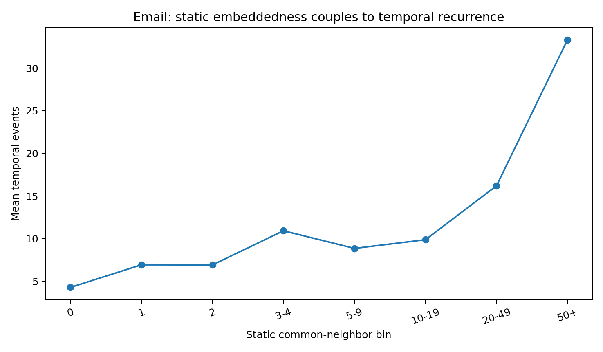

Figure 56. Static embeddedness and temporal recurrence in Email-Eu-core.

Static topology and temporal activity are coupled but not interchangeable. Log dyad event count correlates 0.282 with common-neighbor count. Dyads with 50+ common neighbors average 33.3 events and have median observed lifetime ~327 days; dyads with zero common neighbors average 4.29 events and have median lifetime 0 days. At the same time, consecutive 30-day active-edge sets overlap weakly (mean Jaccard 0.211), so the static graph is a long-time union over a substantially changing active relation field.

Important encoding caveat: SNAP creates a separate temporal edge for each recipient of an email. The very high global event-stream burstiness is therefore partly affected by multi-recipient messages and is not interpreted as a biological or behavioral timescale. Sender- and dyad-level burstiness are reported separately.

#### 8.3.3 Bitcoin-OTC signed / weighted edge-state geometry

Bitcoin-OTC contains directed trust ratings. The public signed-network mirror used for these calculations contains 5,881 nodes and 35,592 directed rated edges; 89.99% are positive and 10.01% negative.

Table 81. Bitcoin-OTC signed edge state.

| Quantity | Positive | Negative |
| --- | --- | --- |
| Mean absolute rating | 1.97 | 7.56 |
| Mean common neighbors | 4.61 | 5.45 |
| Median common neighbors | 2 | 3 |
| Mean endpoint degree geometric mean | 39.41 | 42.13 |

Evidence: [023/bitcoin_edge_attribute_summary.csv](evidence/experiments/023/bitcoin_edge_attribute_summary.csv).

Measurements from the real public datasets specified in this section.

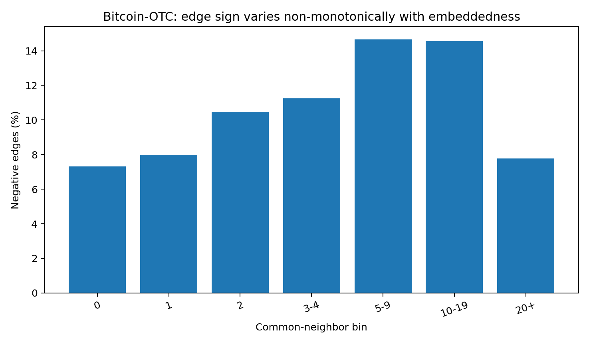

Figure 57. Bitcoin-OTC negative-edge frequency by static embeddedness.

Negative relations are not simply peripheral. Their fraction rises from 7.3% at zero common neighbors to ~14.6% at 5–19 common neighbors, then falls to 7.8% at 20+ common neighbors. Among reciprocal directed ratings, 97.46% agree in sign and rating values correlate 0.611. Edge sign and magnitude therefore form a dyad-specific relational state that is coupled to, but not determined by, static embeddedness.

#### 8.3.4 Combined measured geometry

Topology, node-attribute similarity, temporal activation and signed or weighted edges supply distinct measured descriptions. Their observed associations are incomplete, motivating separate state channels before testing whether a particular task permits their compression.

Facebook shows modest alignment of pooled profile similarity with edges and stronger alignment of social circles and selected feature families.

Email: a stable static edge union coexists with strong temporal turnover and extremely concentrated dyad activity.

Bitcoin-OTC: edge sign and magnitude carry relational state with a non-monotonic dependence on local embeddedness.

#### 8.3.5 Training implications

1. Keep node attributes, edge attributes and temporal activity as separate state channels until a sufficiency test justifies fusion.

2. Do not use one pooled node-feature metric as the graph's semantic geometry. Facebook feature families show strongly different topology alignment.

3. Do not treat a static adjacency matrix as the currently active graph when time matters. Email's static graph is a union over rapidly changing active edge sets.

4. Give temporal relations their own clocks. Node activity bursts and dyad recurrence have different timescales in the same real email network.

5. Treat signed / weighted edges as relation state rather than copying them into endpoint features. Bitcoin ratings are strongly dyad-specific and reciprocal.

6. Use topology-conditioned but not topology-determined relation models. Edge attributes and temporal persistence correlate with embeddedness, but the relationships are incomplete and sometimes non-monotonic.

7. Evaluate topology, node state, edge state and temporal activity before combining them into one representation. These measurements specify inputs for model comparison rather than demonstrate an improved graph core.

#### 8.3.6 Provenance and caveats

Facebook: SNAP ego-Facebook. Profile-feature meanings are anonymized; equality/shared categories remain measurable.

Email: SNAP Email-Eu-core temporal. Raw 332,334-event file was read from a public GitHub mirror; official SNAP statistics match the 986-node / 332,334-event / 803-day dataset.

Bitcoin-OTC: a public signed-network mirror containing source, target and rating was used for sign/topology calculations. It omits timestamps; no Bitcoin temporal statistic is claimed. SNAP documents the original SOURCE, TARGET, RATING, TIME format.

All reported pairwise and temporal quantities above were computed directly from the retrieved records; no synthetic graph data enter this experiment.

### 8.4 REAL-GRAPH-ACTIVE-FIELD-GEOMETRY-024 Static Neighbourhoods, Active Relations, and Time-Scale Separation

This analysis uses Email-Eu-core-temporal to measure the fraction of lifetime neighbourhoods active within finite windows, differences between node and dyad temporal variation, and associations of topology with relation persistence. The time axis is checked before windowed calculation.

Executive finding. In the real Email-Eu-core-temporal event stream, the long-run graph is much larger than the relation field occupied in any one window. Node-level activity changes more smoothly than directed relation composition, and topology-defined structural basins condition persistence without specifying the currently active edge.

#### 8.4.1 Data boundary and time-axis audit

Source. SNAP Email-Eu-core-temporal. The archived calculation parses 332,334 directed recipient-events across 986 users and 24,929 directed dyads. The validated public mirror is SteveHuntsman/PathHomologyDataAndScripts/email-Eu-core-temporal.txt, Git blob SHA 6d864f3a7d511359c8fc19c6a83b4e2302741669.

The timestamp stream contains one exceptional 271.816-day zero-event gap after day 525.522; the second-largest gap is only 5.476 days. Dynamic measurements therefore use complete windows inside the primary 525.522-day continuous observed segment. This keeps an observation boundary from being interpreted as a behavioural pause.

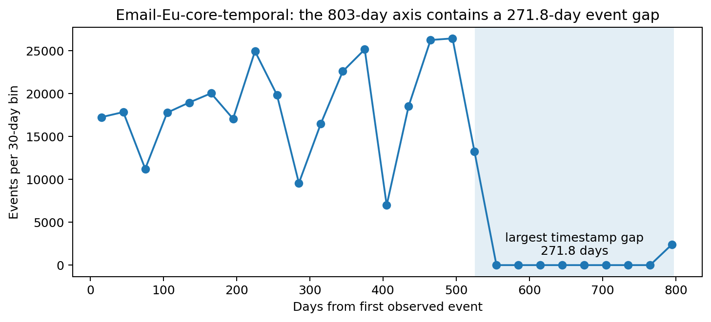

Figure 58. The timestamp axis contains one exceptional observation gap; dynamic windows are restricted to the continuous primary segment.

#### 8.4.2 Active neighbourhoods occupy a sparse slice of lifetime topology

Windowed measurements show a consistent separation between lifetime adjacency and current occupancy. Median active-neighbour coverage rises with the window, but even a 90-day window exposes only 40.0% of lifetime neighbours for the median active node. Event weighting makes the occupied support smaller still.

Table 82. Active neighbourhood coverage by window.

| Window | Complete windows | Median coverage | Active partners | Effective partners | Effective static coverage |
| --- | --- | --- | --- | --- | --- |
| 7 d | 75 | 10.0% | 3 | 2.67 | 7.6% |
| 14 d | 37 | 14.8% | 5 | 3.13 | 9.9% |
| 30 d | 17 | 22.5% | 7 | 3.70 | 12.6% |
| 60 d | 8 | 32.9% | 9 | 4.23 | 15.8% |
| 90 d | 5 | 40.0% | 10 | 4.49 | 17.7% |

Evidence: [024/active_neighbour_scale.csv](evidence/experiments/024/active_neighbour_scale.csv).

Measurements from the real public datasets specified in this section.

At 30 days, the median active node reaches 22.5% of its lifetime neighbours. Seven partners are present, but event concentration reduces that set to 3.70 equally occupied effective partners, corresponding to 12.6% effective static coverage.

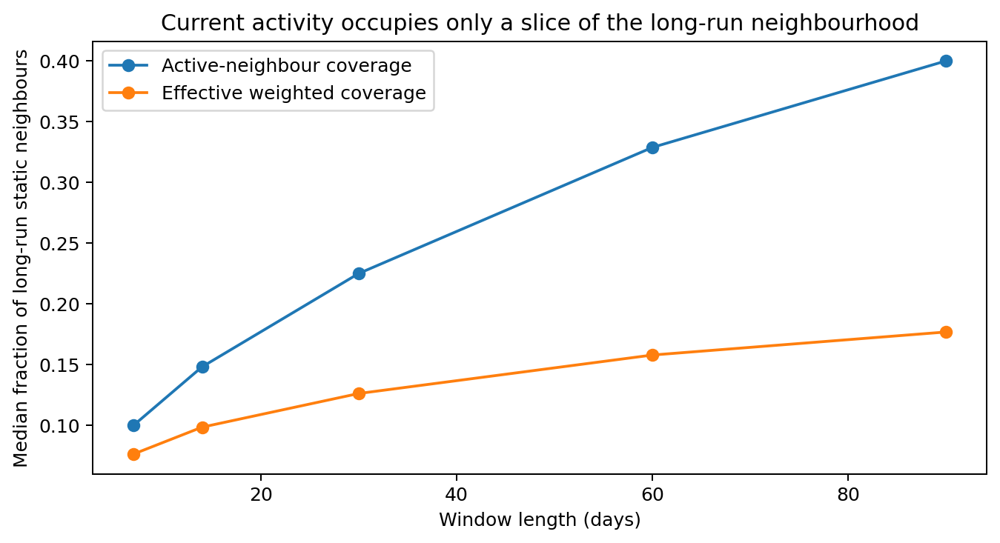

Figure 59. Longer windows expose more of lifetime topology, but the active relation field remains a minority slice.

#### 8.4.3 Node activity and directed relation activity occupy different temporal geometries

The distinction is visible directly in adjacent-window continuity. At 30 days, node-state cosine is 0.952 and directed-dyad cosine is 0.683. Across all 16 adjacent 30-day window pairs, node continuity is higher. The paired mean gap is 0.269. The envelope of who is active is therefore substantially smoother than the identity and weighting of the active directed relations.

Table 83. Node and dyad continuity and spectral support.

| Window | Node cosine | Dyad cosine | Node r95 | Dyad r95 | Node entropy rank | Dyad entropy rank |
| --- | --- | --- | --- | --- | --- | --- |
| 7 d | 0.866 | 0.494 | 55 | 64 | 25.24 | 56.25 |
| 14 d | 0.923 | 0.597 | 29 | 33 | 16.03 | 29.24 |
| 30 d | 0.952 | 0.683 | 13 | 15 | 8.40 | 13.55 |
| 60 d | 0.962 | 0.743 | 6 | 7 | 5.08 | 6.38 |
| 90 d | 0.965 | 0.766 | 4 | 4 | 3.20 | 3.79 |

Evidence: [024/temporal_state_geometry.csv](evidence/experiments/024/temporal_state_geometry.csv).

Measurements from the real public datasets specified in this section. Spectral ranks are bounded by the number of complete windows, which falls as window width increases.

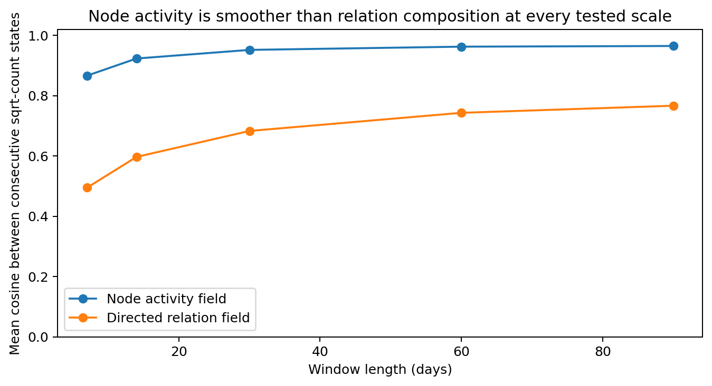

Figure 60. Node-level activity retains substantially more adjacent-window continuity than directed relation activity.

Across the measured scales, directed-dyad activity has broader entropy-effective spectral support than node activity. Wider windows reduce both ranks. These ranks are also bounded by the number of windows, which decreases as windows widen; within-scale node–dyad comparisons and cross-scale trends should therefore be interpreted separately.

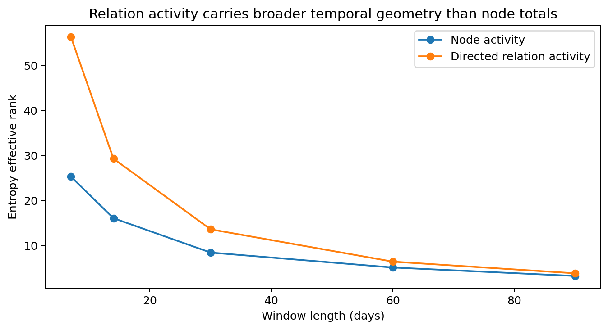

Figure 61. Directed-dyad state carries broader temporal spectral support across the measured scales.

#### 8.4.4 Degree changes the activity regime without turning lifetime topology into current occupancy

Static degree strongly changes the probability that a node remains active, but it does not make the whole lifetime neighbourhood active at once. The highest-degree group illustrates the separation most clearly: degree-78+ nodes are active in the next 30-day window 99.9% of the time, yet their median current-neighbour coverage is only 23.5%.

Table 84. Activity by static-degree group.

| Static degree | Nodes | Median coverage | Active next month | Median partner retention |
| --- | --- | --- | --- | --- |
| 1–6 | 247 | 33.3% | 50.6% | 1.000 |
| 7–22 | 252 | 21.1% | 87.5% | 0.500 |
| 23–44 | 240 | 21.4% | 98.5% | 0.571 |
| 45–77 | 147 | 22.2% | 99.3% | 0.562 |
| 78+ | 100 | 23.5% | 99.9% | 0.570 |

Evidence: [024/degree_strata_30d.csv](evidence/experiments/024/degree_strata_30d.csv).

Measurements from the real public datasets specified in this section.

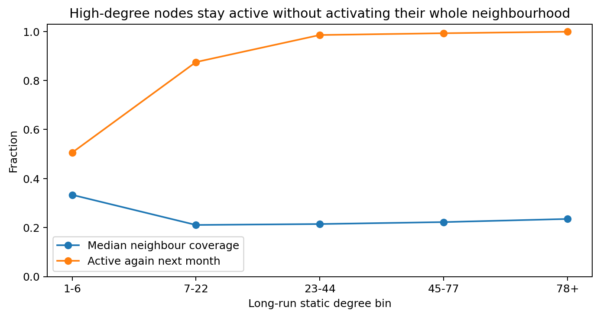

Figure 62. High-degree nodes' activity and occupied neighbourhoods in real Email-Eu-core-temporal data. Persistent node activity coexists with minority coverage of lifetime neighbours in a monthly window.

#### 8.4.5 Long-run topology forms a persistence landscape

A deterministic topology-only modularity probe yields 10 structural communities (Q=0.393). Cross-partition edges are 45.6% of long-run undirected topology but carry only 25.0% of primary-segment events. Relations inside the topology-defined basins recur more strongly and persist longer than cross-basin relations.

Table 85. Persistence within and across topology partitions.

| Relation class | Active dyads | Mean events/dyad | Median lifetime | Mean Jaccard | Mean retention |
| --- | --- | --- | --- | --- | --- |
| within partition | 13,488 | 17.62 | 118.92 d | 0.373 | 0.560 |
| cross partition | 10,772 | 7.34 | 4.80 d | 0.233 | 0.393 |

Evidence: [024/community_activity_30d.csv](evidence/experiments/024/community_activity_30d.csv).

Measurements from the real public datasets specified in this section.

Within-partition retention exceeds cross-partition retention in all 16 adjacent 30-day pairs. The mean within-minus-cross difference is 0.167, with bootstrap 95% interval 0.150–0.181. This partition is a topology-defined diagnostic partition; it is not presented as the institution’s department labels.

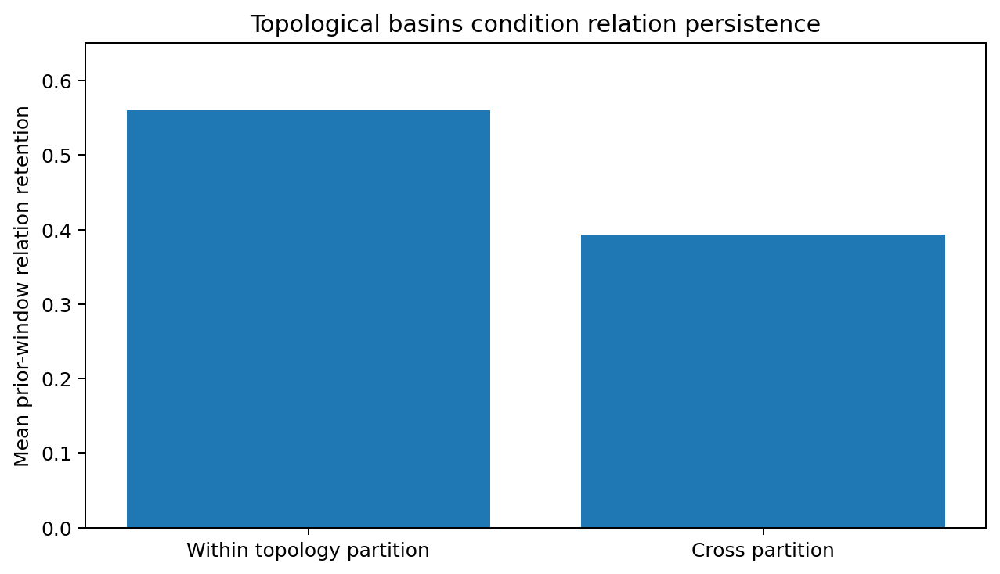

Figure 63. Relations inside topology-defined structural basins recur more strongly than cross-basin relations.

#### 8.4.6 Discussion the map is not the traffic

After 024, the graph is easier to picture if we stop treating an adjacency matrix as a photograph. The lifetime graph is closer to a road atlas: it records routes that have existed. The active relation field is the traffic on those roads now. At a 30-day scale the median active node uses only 22.5% of its lifetime neighbours, and event weighting contracts that already sparse set to 12.6% effective static coverage. The atlas is real, but most roads are dark in any one monthly snapshot.

The high-degree nodes make the distinction especially vivid. Their activity does not disappear: the degree-78+ group remains active into the next month 99.9% of the time. What changes is the occupied relation set. Those nodes still activate only 23.5% of their lifetime neighbours at the median. In engineering terms, high node activity is not evidence for dense simultaneous message passing over all stored edges. A model that equates “important/high-degree node” with “activate its whole neighbourhood” would be injecting computation into relations the real system is not currently using.

The node/dyad comparison adds a second moving layer. Node-state cosine at 30 days is 0.952; directed-dyad cosine is 0.683, and the node state is smoother in every adjacent monthly pair. The practical picture is a comparatively slow activity envelope with a faster relation microstate moving underneath it. The evidence therefore supports separate update clocks: one state can track whether a node is active, another can track which directed relations are carrying the activity.

The 10-community diagnostic associates topology with recurrence: mean retention is 0.560 within communities and 0.393 across them, with the same direction in all 16 adjacent monthly pairs. Long-run topology can therefore supply a persistence prior or routing bias, and current relation state can represent the activity observed within a particular window.

#### 8.4.7 Evidence-derived engineering guidance

1. Keep long-run adjacency and current relation activation as separate state objects.

2. Allow node activity and dyad activity to update on different temporal clocks.

3. Preserve active-neighbour sparsity and event-weight concentration before aggregation.

4. Use long-run topology as a persistence prior rather than as a substitute for current edge state.

5. Use static degree as a capacity or normalization coordinate rather than as a proxy for current occupancy.

#### 8.4.8 Evidence status

All 024 quantities above are taken from archived CSV/JSON outputs generated from the real Email-Eu-core-temporal event records. Validated mirror identity: SteveHuntsman/PathHomologyDataAndScripts/email-Eu-core-temporal.txt; Git blob SHA 6d864f3a7d511359c8fc19c6a83b4e2302741669; 5,517,753 bytes. No synthetic graph generator enters the reported measurements.

### 8.5 REAL-GRAPH-TEMPORAL-RENORMALIZATION-025 What Time Coarse-Graining Does to a Real Relation Field

Scope. Use the verified 024 real-data outputs at 7, 14, 30, 60 and 90 days to measure how active-neighbour exposure, weighted effective occupancy, node/dyad continuity, spectral support and edge turnover change as the temporal window is enlarged. This is a second-stage calculation over measured real-data tables; no generated event stream enters the analysis.

Executive finding. Longer windows expose more of the lifetime graph, but the newly exposed relations are increasingly low-weight. Temporal coarse-graining also narrows the node-versus-dyad gap without erasing it: even at 90 days, the active directed-edge set continues to turn over heavily.

#### 8.5.1 Multiscale summary

Table 86. Multiscale relation-field summary.

| Window | Raw coverage | Effective coverage | Active partners | Effective partners | Node cosine | Dyad cosine | Retention | New edges |
| --- | --- | --- | --- | --- | --- | --- | --- | --- |
| 7 d | 10.0% | 7.6% | 3 | 2.67 | 0.866 | 0.494 | 39.6% | 60.7% |
| 14 d | 14.8% | 9.9% | 5 | 3.13 | 0.923 | 0.597 | 45.3% | 54.9% |
| 30 d | 22.5% | 12.6% | 7 | 3.70 | 0.952 | 0.683 | 50.5% | 50.6% |
| 60 d | 32.9% | 15.8% | 9 | 4.23 | 0.962 | 0.743 | 54.3% | 47.3% |
| 90 d | 40.0% | 17.7% | 10 | 4.49 | 0.965 | 0.766 | 55.2% | 46.0% |

Evidence: [025/rg025_multiscale_renormalization.csv](evidence/experiments/025/rg025_multiscale_renormalization.csv).

Measurements from the real public datasets specified in this section.

#### 8.5.2 Neighbourhood exposure grows faster than effective occupancy

From 7 to 90 days, median raw active-neighbour coverage rises from 10.0% to 40.0% (4.00×). Effective static coverage rises from 7.64% to 17.69% (2.32×). A descriptive finite-range log-log fit gives exponents 0.545 and 0.329 respectively, with R² 0.9996 and 0.9985. These are finite-range descriptions of the measured five scales, not universal scaling laws.

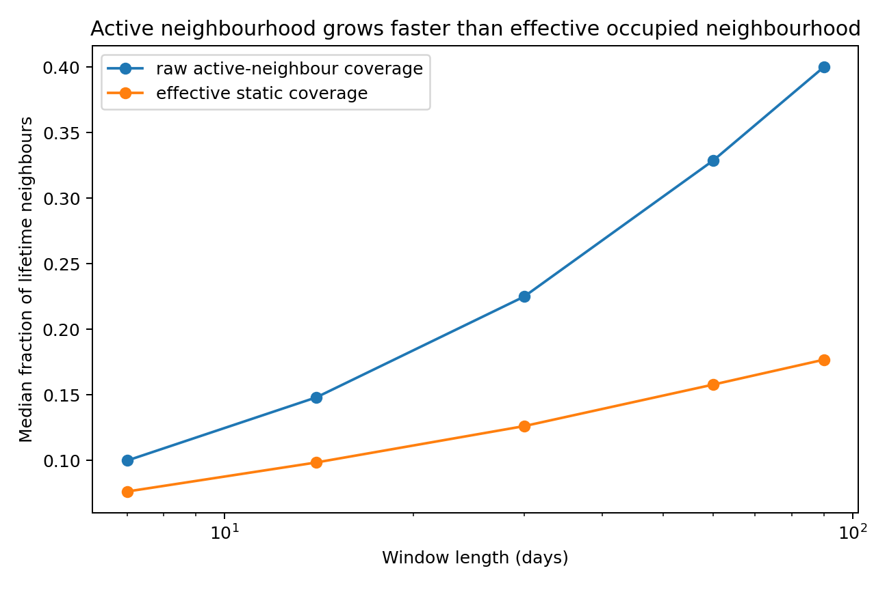

Figure 64. Raw neighbourhood exposure expands faster than weighted effective occupancy.

#### 8.5.3 Longer windows add partners faster than they add traffic-bearing support

Median active partners rise from 3 to 10, but effective partners rise only from 2.67 to 4.49. The effective/raw partner ratio therefore falls from 0.889 to 0.449. The extra names accumulated by a longer window increasingly occupy a light-use tail around a smaller traffic-bearing core.

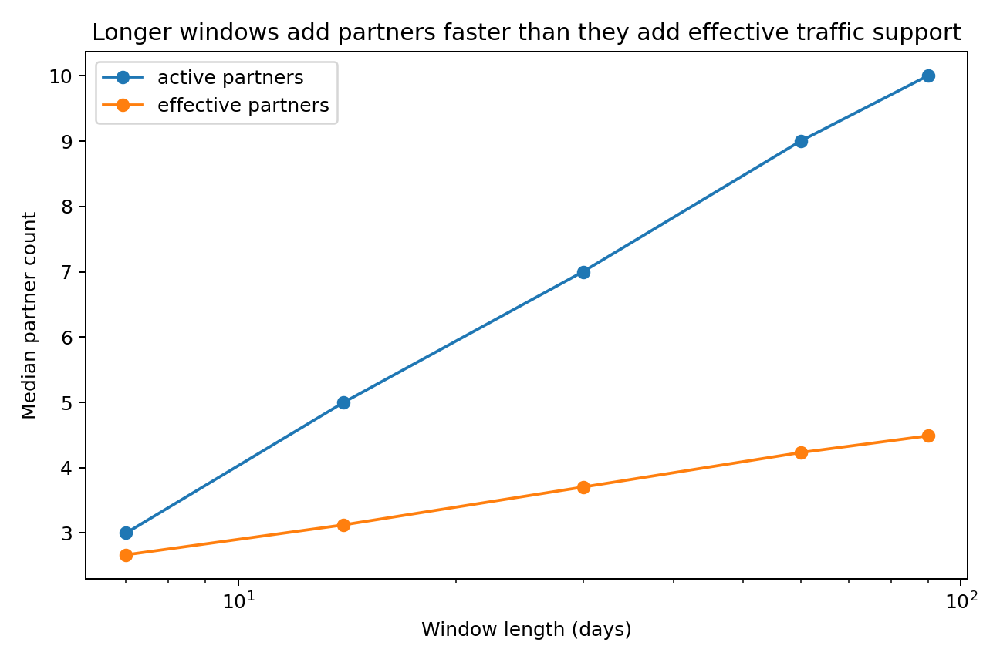

Figure 65. Partner count expands much faster than inverse-Herfindahl effective partner count.

#### 8.5.4 Coarse-graining compresses but does not erase node/dyad separation

The node-minus-dyad adjacent-window cosine gap falls from 0.372 at 7 days to 0.198 at 90 days. Its descriptive finite-range log-log exponent is −0.252 (R² 0.994). The dyad/node entropy-effective-rank ratio simultaneously falls from 2.229 to 1.185. Longer windows therefore make the two state layers look more alike, but the relation layer remains the faster and broader temporal object throughout the measured range.

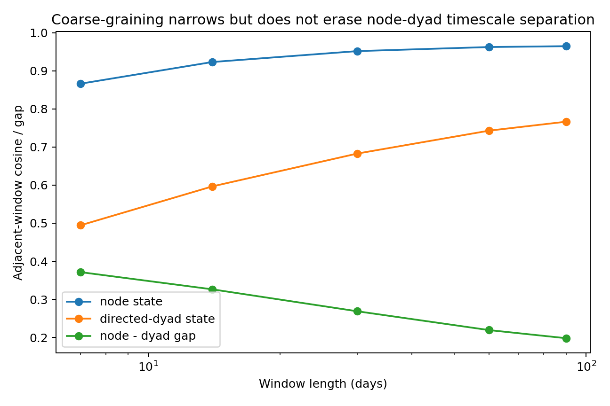

Figure 66. Longer windows make node and relation states look more alike, yet a continuity gap remains at every measured scale.

The spectral view points in the same direction: directed relation state retains broader temporal support, especially at short windows, and converges toward the node field as averaging becomes coarser.

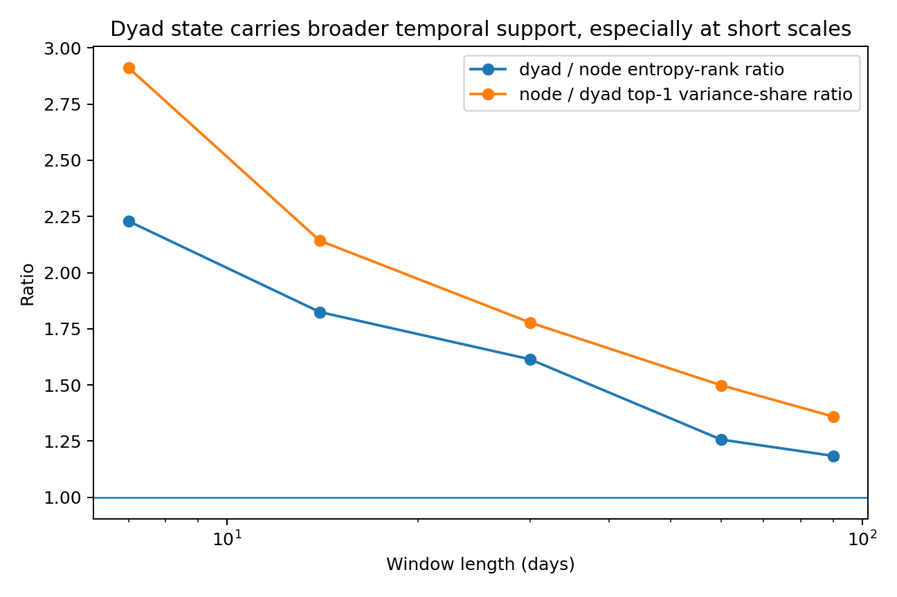

Figure 67. Directed relation state retains broader temporal support, especially at short windows.

#### 8.5.5 Ninety days still does not look static

Prior-edge retention increases from 39.6% at 7 days to 55.2% at 90 days. The current-window new-edge fraction declines from 60.7% to 46.0%. Thus, even across adjacent quarter-year windows, almost half of the currently active directed edges were absent from the preceding quarter-year window.

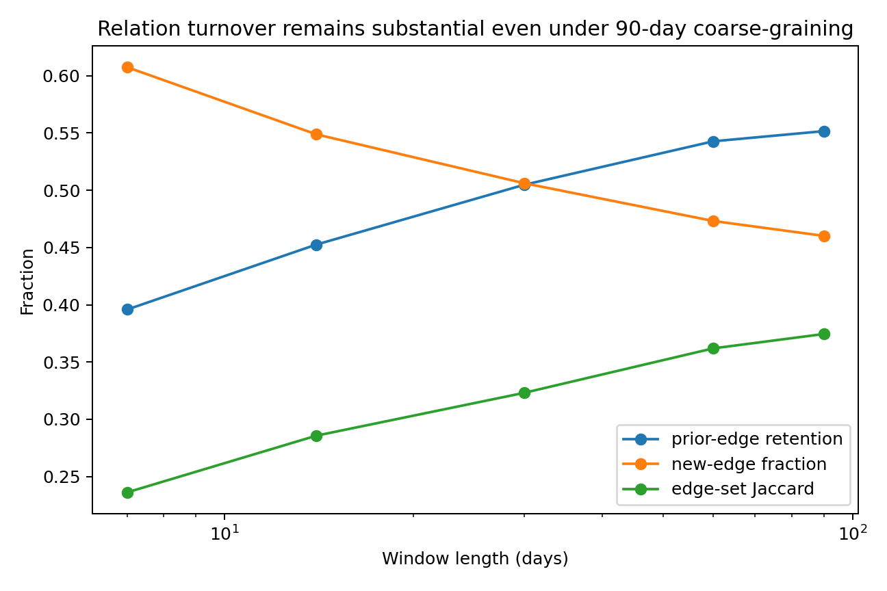

Figure 68. Relation turnover weakens with coarse-graining but remains substantial at 90 days.

#### 8.5.6 Discussion a longer shutter blurs traffic; it does not turn traffic into roads

025 changes the camera rather than the network. Open the temporal shutter from one week to three months and the frame naturally fills with more lifetime neighbours: raw coverage quadruples from 10.0% to 40.0%. But the weighted picture fills much more slowly; effective coverage rises only from 7.64% to 17.69%. The longer exposure is therefore not revealing a uniformly occupied neighbourhood. It is accumulating a growing halo of weakly used relations around a much smaller traffic-bearing core.

The partner counts tell the same story in a more intuitive unit. A median node moves from 3 active partners at 7 days to 10 at 90 days, yet its effective partner count rises only from 2.67 to 4.49. By the three-month window, more than half of the nominal partner set has little leverage on the weighted occupancy measure. For graph computation, that means “number of observed neighbours” and “amount of relation support” are different state variables; temporal aggregation renormalizes them at different rates.

Coarse-graining also squeezes the difference between node and relation dynamics. The continuity gap drops from 0.372 to 0.198, and the dyad/node entropy-rank ratio falls from 2.229 to 1.185. This is exactly the direction expected when a fast microstate is averaged under a slower envelope: some of the fast variation cancels inside the wider bin. The measured result is useful because the collapse is incomplete. Even at 90 days, the dyad state remains less continuous than the node state.

The edge-turnover result prevents a particularly tempting engineering shortcut. A quarter-year window may look visually “full”, but 46.0% of its active directed edges are new relative to the previous quarter. Static adjacency is therefore not recovered simply by choosing a coarse enough behavioural window within the measured range. The practical representation suggested by these measurements is multiscale: retain a long-run structural graph, maintain explicit relation state, and make the observation scale itself visible to the model rather than silently changing what a snapshot means.

#### 8.5.7 Evidence-derived engineering guidance

1. Make temporal resolution explicit in graph state; a 7-day snapshot and a 90-day snapshot are different observation scales.

2. Preserve both raw partner exposure and weighted effective occupancy because they renormalize at different rates.

3. Use multiscale temporal channels when the task spans more than one behavioural timescale.

4. Do not infer that relation state is redundant merely because coarse windows reduce node/dyad separation.

5. Keep long-run structure, node activity and relation activity available simultaneously when downstream tasks need both persistence and current interaction state.

#### 8.5.8 Evidence status

All 025 inputs are verified outputs from REAL-GRAPH-ACTIVE-FIELD-GEOMETRY-024 on the real Email-Eu-core-temporal dataset. The five-scale fits are descriptive finite-range summaries. Input SHA-256 hashes and the full 025 analysis script are archived in the evidence package. No synthetic graph or generated event stream enters 025.

## 9. Distributed state coordination

### 9.1 DISTRIBUTED-ONTOLOGY-COORDINATION-026 One logical corpus across physical owners

This experiment studies placement, routing, reduction and coordinator metadata after a logical corpus is distributed across owners. The workload is the actual 134-page research report available at the time of the experiment. Its sections and tables are partitioned and queried through a running multiprocess prototype. Here “ontology” denotes the corpus's identified state objects and dependencies, rather than a claim about machine cognition.

The same document objects are placed across 2, 4, 8 and 16 owners. Centralized retrieval provides a fixed reference. The comparison therefore measures distributed retrieval and coordination of this corpus rather than the capability of a newly trained language model.

#### 9.1.1 Document-derived workload

The frozen report yields 372 state objects: 287 section chunks and 85 table chunks, containing 199,208 UTF-8 bytes of text. Character 2–5-gram TF–IDF represents the mixed Chinese and English corpus using 30,000 features and 333,286 nonzero entries.

Five hundred queries are deterministically derived from the document, including single-section and adjacent-section composite queries. The corpus also supplies 1,409 semantic k-nearest-neighbour dependency edges. Centralized top-5 retrieval is the reference; each distributed method chooses which shards to contact. Agreement measures reproduction of that reference on this workload, rather than independently labelled semantic relevance.

#### 9.1.2 Placement locality and load balance

Table 87. Placement locality and load at 16 shards.

| 16-shard placement | Byte-load CV | Largest shard | Semantic edge cut |
| --- | --- | --- | --- |
| Hash | 0.291 | 9.24% | 93.3% |
| Chapter-greedy | 0.345 | 14.56% | 41.5% |
| Semantic K-means | 1.347 | 32.58% | 31.8% |
| Balanced semantic | 0.156 | 6.75% | 52.4% |

Evidence: [026/do026_summary_final.json](evidence/experiments/026/do026_summary_final.json).

Real document-derived workload with controlled placement, fault or update conditions. Timing is specific to the local prototype.

With 16 shards, hash placement cuts 93.3% of semantic neighbour edges. Semantic K-means reduces the edge cut to 31.8%, but byte-load CV rises to 1.347 and the largest shard holds 32.6% of the corpus.

Capacity-constrained balanced semantic placement has a largest-shard share of 6.75%, byte-load CV 0.156 and semantic edge cut 52.4%. It trades some locality for a more balanced physical allocation.

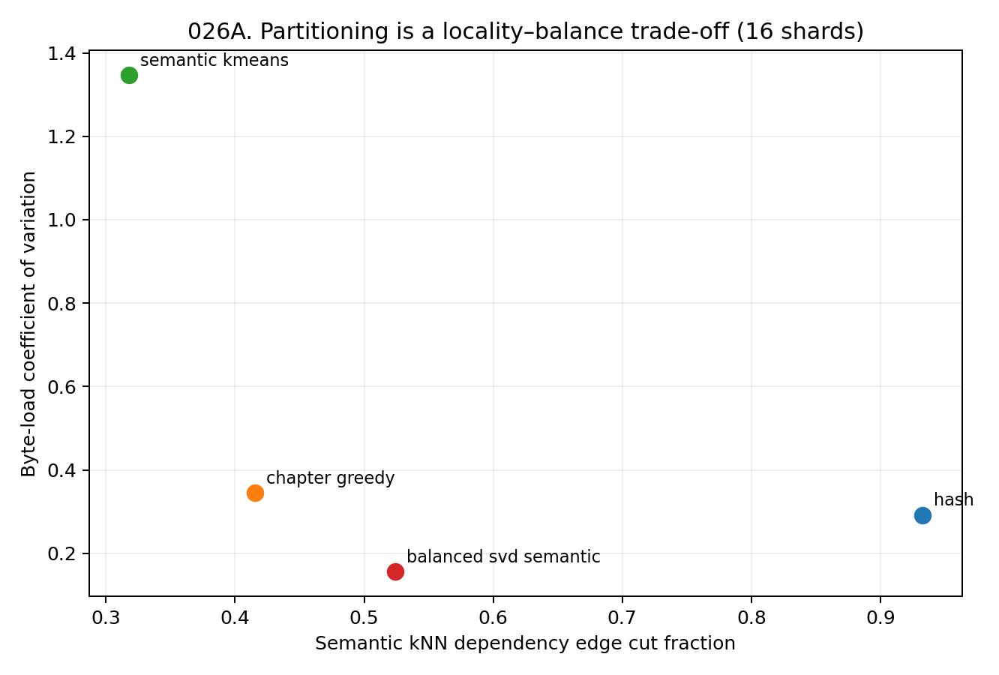

Figure 69. Locality and byte-load balance for 16-shard placement of the real document corpus. Edge cut is the fraction of semantic neighbour dependencies crossing shard boundaries.

#### 9.1.3 Coordinator metadata

A coordinator needs enough information to route queries without duplicating the owners' complete high-dimensional state. Two index designs are compared.

The exact envelope stores per-shard upper bounds for TF–IDF coordinates and supports branch-and-bound retrieval.

The compact router stores one or four 64-dimensional prototypes per shard and uses them to prioritize contacts.

Table 88. Compact routing against centralized retrieval.

| Shards contacted | Body scored | Mean recall@5 | Exact top-5 set |
| --- | --- | --- | --- |
| 1/16 | 5.9% | 48.8% | 9.6% |
| 2/16 | 11.7% | 70.1% | 26.4% |
| 4/16 | 23.8% | 88.4% | 58.2% |
| 8/16 | 47.1% | 98.4% | 92.2% |

Evidence: [026/do026_compact_router.csv](evidence/experiments/026/do026_compact_router.csv).

Real document-derived workload with controlled placement, fault or update conditions. Timing is specific to the local prototype.

With 16 shards and four 64-dimensional prototypes per shard, the routing map occupies 16,384 bytes, approximately 8.2% of the source text. Contacting eight shards gives mean recall@5 of 98.4% and exact top-5 set agreement of 92.2%, scoring approximately 47.1% of the corpus.

The 16-shard semantic-placement exact envelope achieves 100% top-5 agreement and contacts an average 6.09 shards. Its routing metadata occupies 1,087,736 bytes, 5.46 times the source text size. Exact pruning in this representation therefore carries a substantial coordinator-memory cost.

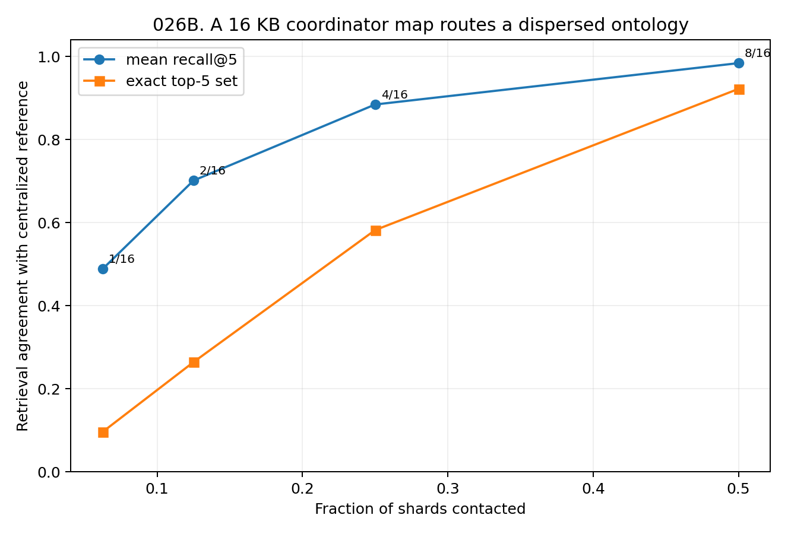

Figure 70. Compact routing with a 16 KB prototype map. Recall and exact-set agreement are measured against centralized top-5 retrieval as the fraction of contacted shards increases.

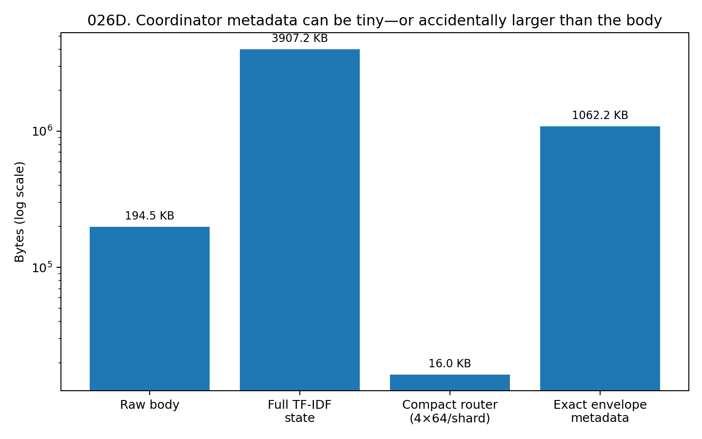

Figure 71. Coordinator metadata size for compact prototypes and high-dimensional exact envelopes. Sizes are compared with the frozen source text, not with a trained model's parameter memory.

#### 9.1.4 Multiprocess execution and orchestration overhead

Eight worker processes each hold their own shard. The coordinator dispatches batches, workers compute local top-5 candidates, and the coordinator merges the results. Timing uses 2,048 query executions obtained by repeating the real 500-query set, amortizing process startup without introducing additional query content.

Table 89. Single-machine execution throughput.

| Execution mode | Workers | Dispatch batch | Queries/s | Agreement |
| --- | --- | --- | --- | --- |
| Centralized best | 1 | 256 | 7667 | 100% reference |
| 8-worker broadcast | 8 | 256 | 2853 | 100% reference |
| 8-worker routed top-2 | 8 | grouped | 3694 | recall 73.3% / exact 27.2% |
| 8-worker routed top-4 | 8 | grouped | 2805 | recall 91.5% / exact 68.1% |
| 8-worker routed top-8 | 8 | grouped | 2089 | recall 100.0% / exact 100.0% |

Evidence: [026/do026_process_benchmark.csv](evidence/experiments/026/do026_process_benchmark.csv), [026/do026_routed_process_benchmark.csv](evidence/experiments/026/do026_routed_process_benchmark.csv).

Real document-derived workload with controlled placement, fault or update conditions. Timing is specific to the local prototype.

For this corpus of approximately 194.0 KB, centralized batching reaches 7,667 queries/s; eight-worker broadcast reaches 2,853 queries/s. The matching checksums confirm equivalent results. The lower multiprocess throughput measures orchestration overhead at this workload size.

Routing changes the throughput–agreement trade-off. Top-2 routing reaches 3,694 queries/s with recall@5 73.3%; top-4 reaches 2,805 queries/s with recall 91.5%. Contacting all eight routed shards restores 100% agreement at 2,089 queries/s.

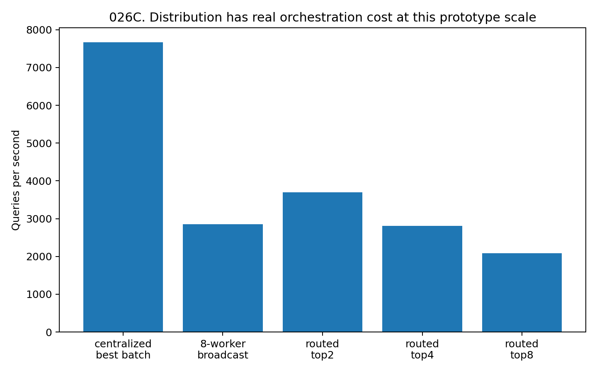

Figure 72. Measured throughput in the single-machine, eight-worker prototype. Centralized and distributed execution use the same document-derived queries; the result is specific to this implementation and workload.

#### 9.1.5 Dispatch granularity

Eight-worker broadcast rises from approximately 1,501 queries/s at batch size 16 to 2,785 at 64 and 2,853 at 256. A single batch of 2,048 falls to approximately 1,958. Intermediate batching best amortizes scheduling overhead in this machine and matrix configuration; the optimum is not a general constant.

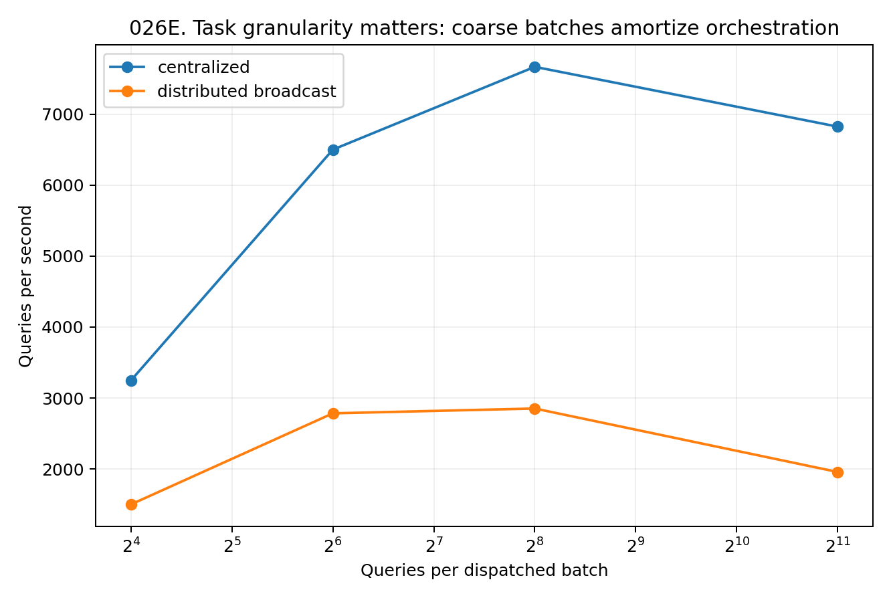

Figure 73. Broadcast throughput by dispatch batch size in the eight-process prototype. The timing comparison measures the balance between scheduling overhead and parallel execution at the reported workload size.

#### 9.1.6 Discussion of locality and coordination

The experiment makes three costs observable: cross-shard dependencies, coordinator metadata and execution overhead. For this small corpus, broadcasting to multiple workers is slower than centralized retrieval even when the results are identical.

Hash placement favours balance but separates semantic neighbours. Semantic clustering favours locality but concentrates load. Capacity-constrained placement provides an adjustable compromise between those objectives.

Compact prototypes guide many queries to relevant owners using much less metadata than exact envelopes. The 16 KB map achieves high recall at partial fan-out; the exact envelope consumes 5.46 times the text size. The appropriate choice depends on required agreement and memory budget.

The resulting design separates logical identity from physical ownership. The coordinator can maintain ownership, routing summaries, dependencies, versions and load; workers execute near their data and return candidates or updates. Progressive expansion of fan-out is a candidate strategy when the initial result is insufficient.

#### 9.1.7 Design implications

Use a unified object namespace with explicit physical ownership. An object's identity persists independently of where its state is stored.

Evaluate locality and capacity jointly. Balanced semantic placement limits the largest shard to 6.75% at 16 shards and preserves more locality than hash placement in this corpus.

Measure coordinator metadata explicitly. Routing prototypes, ownership, dependencies, versions and load should be budgeted alongside owner state.

Route computation to the state owner and return top-k candidates, summaries or deltas for reduction.

Make fan-out adjustable. Partial routing trades agreement for computation; complete contact can recover the centralized reference.

Batch dispatch at a granularity appropriate to the workload. Here 64–256 queries per batch substantially outperform batches of 16.

Represent multi-stage tasks through a dependency graph and owner map. This proposed extension coordinates dependencies without requiring all state to be recopied centrally.

#### 9.1.8 Evidence scope

The experiment includes actual corpus partitioning, semantic-edge cuts, load measurements, compact and exact-envelope routing, eight-worker multiprocessing and batch timing. The associated 026 evidence record contains the reported measurements, analysis scripts and figures.

### 9.2 DISTRIBUTED-ONTOLOGY-RESILIENCE-027 Replication latency and concurrent updates

This study applies shard loss, delayed responses and concurrent writes to the distributed corpus from experiment 026. It separately measures retrieval completeness, waiting time and preservation of shared-state updates.

The frozen workload contains 372 state objects, 500 document-derived queries and eight balanced semantic shards. Shard failures, a 350 ms delay and write contention are controlled interventions. Retrieval is compared with the frozen centralized top-5 reference.

#### 9.2.1 Single-shard loss and selective replication

Shards have unequal query importance. Shard 6 carries 18.4% of centralized top-5 hits, so losing one of eight shards need not remove exactly one eighth of reference information. Each shard is removed in turn and all 500 queries are rerun on the remaining accessible state.

Table 90. Replication and single-shard recovery.

| Redundancy policy | Sparse-state overhead | Mean failure recall@5 | Worst recall@5 | Mean routed-top4 recall |
| --- | --- | --- | --- | --- |
| No replica | 0.0% | 87.50% | 81.60% | 82.57% |
| Hot 25% | 35.7% | 94.62% | 91.84% | 91.00% |
| Boundary 25% | 36.0% | 94.62% | 92.20% | 91.31% |
| One backup/object | 100.0% | 100.00% | 100.00% | 98.49% |

Evidence: [027/do027_failure_policy_summary.csv](evidence/experiments/027/do027_failure_policy_summary.csv).

Real document-derived workload with controlled placement, fault or update conditions. Timing is specific to the local prototype.

Without replication, mean single-shard-failure recall@5 is 87.5% and the worst is 81.6%. Removing shard 0 retains 97.48% recall; removing shard 6 retains 81.6%. Balanced physical capacity therefore does not imply equal importance to this query set.

Replicating 25% of objects by query heat or boundary dependency raises mean recall to 94.615%. Worst recall is 91.84% for hot-object replication and 92.20% for boundary replication. Sparse-state storage overhead is approximately 35.7–36.0%, since the selected objects are larger than average.

One backup per object recovers 100% centralized top-5 results for all eight single-shard failures at 100% additional sparse-state payload. The comparison quantifies the storage–recovery trade-off between selective and complete replication.

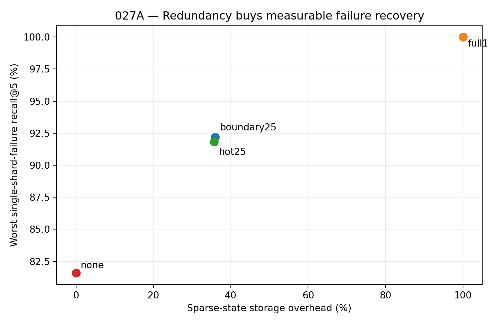

Figure 74. Replica overhead and worst-case recovery under single-shard loss. The real corpus is held fixed, and each of the eight owners is removed in turn.

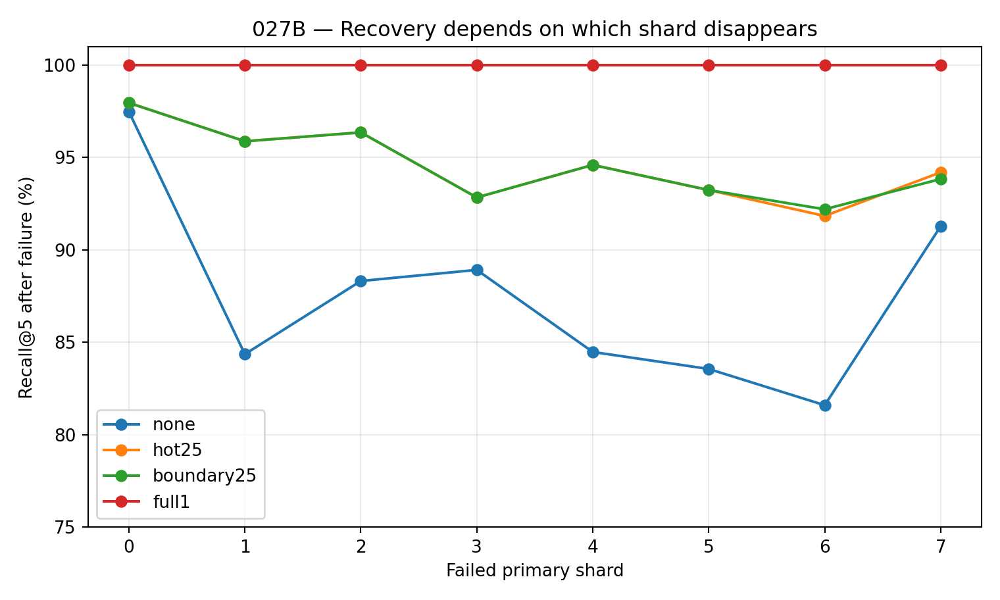

Figure 75. Recall after individual shard failures. Unequal losses reflect the distribution of centralized reference hits across the eight owners.

#### 9.2.2 Completion rules under a delayed shard

Shard 6 is delayed by 350 ms. Local results for the 500 queries are computed beforehand, and the process-level intervention changes their arrival time at the coordinator. Reported milliseconds measure orchestration waiting, not end-to-end retrieval latency, and are not directly comparable with experiment 026 throughput.

Table 91. Delayed-shard completion rules.

| Redundancy | Coordinator rule | Median orchestration wait | Recall@5 | Exact top-5 |
| --- | --- | --- | --- | --- |
| No replica | Wait all 8 | 351.58 ms | 100.00% | 100.0% |
| No replica | Continue at 7/8 | 1.19 ms | 81.60% | 49.0% |
| Hot 25% | Wait all 8 | 351.02 ms | 100.00% | 100.0% |
| Hot 25% | Continue at 7/8 | 1.25 ms | 91.84% | 73.0% |
| One backup/object | Wait all 8 | 351.25 ms | 100.00% | 100.0% |
| One backup/object | Continue at 7/8 | 1.23 ms | 100.00% | 100.0% |

Evidence: [027/do027_straggler_timeout.csv](evidence/experiments/027/do027_straggler_timeout.csv).

Real document-derived workload with controlled placement, fault or update conditions. Timing is specific to the local prototype.

Waiting for all eight owners preserves 100% exact-set agreement under each replication policy but incurs approximately 351 ms of waiting. The controlled delay dominates this barrier rule.

Continuing after seven responses reduces median waiting to approximately 1.2 ms. Without replicas, recall is 81.6%; hot-25% replication raises it to 91.84% with 73% exact-set agreement. One backup per object preserves 100% reference agreement without waiting for the delayed owner. Completion and redundancy policies therefore jointly determine the observed trade-off.

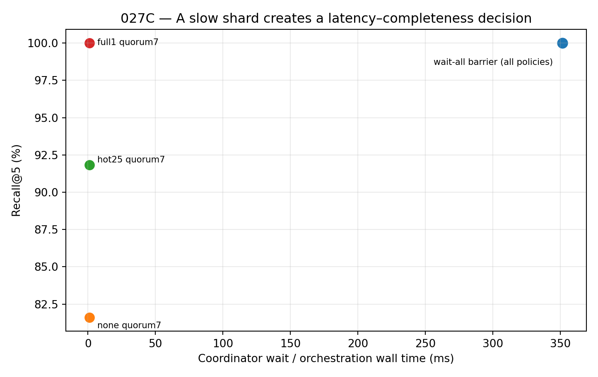

Figure 76. Waiting time and retrieval completeness under the 350 ms shard delay. The experiment compares an all-owner barrier with continuation after seven responses using three replication policies.

#### 9.2.3 Concurrent state updates

The corpus dependencies produce 1,860 directed update targets. These are repeated to 120,000 updates for stress timing, with eight processes executing the same update multiset. The test measures completeness of state mutation rather than the semantic correctness of learned content.

Table 92. Concurrent update synchronization.

| Update discipline | Median updates/s | Mean lost updates | Objects with count error |
| --- | --- | --- | --- |
| Naive shared RMW | 633,027 | 1.354% | 183.8 |
| One global lock | 411,215 | 0.000% | 0.0 |
| Ownership-scoped shard locks | 668,856 | 0.000% | 0.0 |

Evidence: [027/do027_update_summary.csv](evidence/experiments/027/do027_update_summary.csv).

Real document-derived workload with controlled placement, fault or update conditions. Timing is specific to the local prototype.

Uncoordinated shared read–modify–write reaches median throughput approximately 633,000 updates/s but loses an average 1.3545% of updates across five runs. Approximately 174–189 objects per run have incorrect final counts.

A global lock gives zero loss at approximately 411,000 updates/s. Ownership-scoped shard locks also give zero loss and reach approximately 669,000 updates/s. These are measurements on the tested machine and workload. They support resolving consistency locally at ownership boundaries without forcing every update through one global lock.

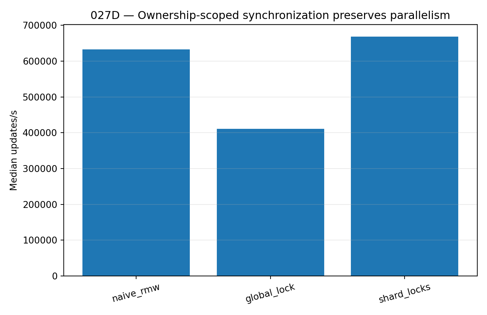

Figure 77. Throughput under three synchronization policies for 120,000 dependency-derived updates across eight processes. Global and shard-scoped locking both preserve update counts.

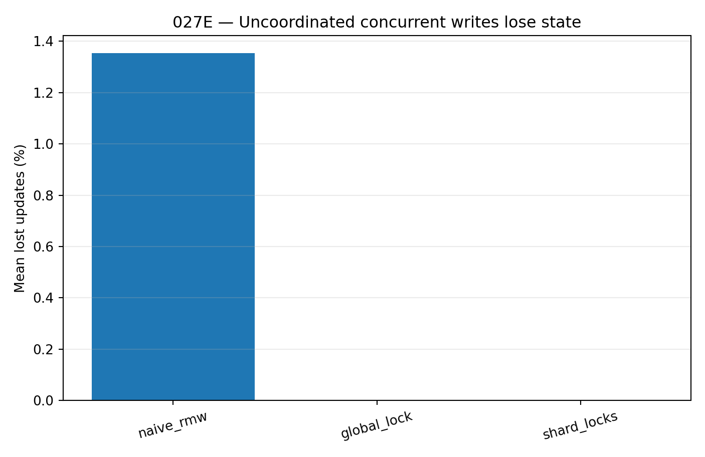

Figure 78. Lost updates under concurrent read–modify–write. The repeated stress runs isolate synchronization behaviour on the frozen corpus objects.

#### 9.2.4 Discussion of logical identity and physical availability

A failed owner need not erase an object's logical identity. Maintaining primary and backup ownership allows the system to locate the same identified object at an alternative physical location.

Query importance provides a separate replication criterion from storage balance. Shard 6 carries 18.4% of reference hits, and selective hot or boundary replication raises worst recall from 81.6% to approximately 92% in the tested failures.

A delayed response can be temporarily unusable under a task deadline. Completion conditions should therefore specify the required combination of agreement and waiting time. The barrier and seven-response comparison demonstrates this trade-off; deadline-dependent policies are a design implication.

Concurrent writes need an ordering discipline for each state object. Ownership-scoped synchronization preserves that order locally and permits updates to different shards in parallel. The test measures final counts, providing a concrete correctness criterion.

The distributed design combines one identity namespace with physical owners, replicas and local execution. Coordinator metadata records ownership, health, routing, dependencies, versions and completion requirements. These records support continuity of task and state across changes in availability.

#### 9.2.5 Coordination rules derived from the tests

Primary ownership: each mutable object has an authoritative writer at a given time. Migration changes owner and version without changing logical identity.

Selective redundancy: allocate replicas with reference to query demand and cross-shard dependencies. Replicating 25% of objects raises worst failure recall from 81.6% to approximately 92% here.

Replica location: include backup owners in coordinator state so fault handling can reroute without searching the entire corpus.

Completion policy: specify agreement, deadline and fallback requirements per task. The measured barrier and quorum strategies provide different operating points.

Local consistency: serialize or version writes at the owner boundary. Shard-scoped locking preserves all 120,000 stress updates and has higher median throughput than the global lock in this prototype.

Commit interface: send identity-bearing and version-bearing deltas to the authoritative owner, which orders accepted writes and returns the resulting version.

Recovery and load allocation: updating the owner map changes load and dependencies, so health and capacity belong in the same coordination state.

#### 9.2.6 A task execution loop

The measurements motivate the following execution design. Experiment 028 evaluates its integrated operation.

1. Resolve the task's object identities and dependency frontier.

2. Locate candidate owners using primary and backup mappings, health and compact routing summaries.

3. Select fan-out and completion rules according to agreement and deadline requirements.

4. Execute locally at state owners.

5. Reduce candidates or updates and identify missing results or stale versions.

6. Commit mutable deltas through the authoritative owner and record the new version.

7. Recover or rebalance ownership when availability changes.

The design combines the routing and placement measurements from 026 with replication, waiting-time and concurrent-update results from 027. These components motivate the integrated loop; their complete interaction is tested separately in 028.

#### 9.2.7 Evidence scope

The study includes removal of each of eight shards; none, hot25, boundary25 and one-backup replication; routed-top4 fault retrieval; a 350 ms delay on the most important shard; barrier and seven-response completion; and five timing runs of eight-process, 120,000-update workloads under three synchronization policies.

### 9.3 DISTRIBUTED-ONTOLOGY-PLAN-CONTINUATION-028 Task continuity across faults and version changes

Experiments 026 and 027 test placement, routing, faults, delays and writes separately. This study combines them in a persistent coordinator executing 240 query-derived task DAGs. A critical shard is lost, restored and delayed, and external updates advance object versions. Outcomes include task acceptance, retrieval agreement and final-state consistency.

The frozen workload retains the 372 objects, 500 query vectors, eight balanced semantic shards and dependencies from 026/027. The first 240 queries define 240 task graphs. Eight persistent worker processes perform actual sparse retrieval and owner-scoped state operations. Faults, the 350 ms delay and external version changes are controlled interventions.

#### 9.3.1 Continuous task sequence and coordinator conditions

The sequence contains 40 healthy tasks, 40 under critical-shard loss, 20 during recovery, 40 with a straggler, 40 in a second healthy phase, 40 with version conflicts and 20 in a final stable phase. Each task proceeds through routing, local retrieval, reduction, dependency expansion, owner read and commit.

Table 93. Persistent coordinator conditions.

| Condition | Adaptive route | Replica budget | Commit discipline | Failure handling |
| --- | --- | --- | --- | --- |
| Static barrier / none | No | None | Unsafe set | Wait/fail |
| Adaptive hot25 / unsafe | Yes | Hot 25% | Unsafe set | Health-aware + deferred log |
| Adaptive hot25 / versioned | Yes | Hot 25% | CAS + retry | Health-aware + deferred log |
| Adaptive full1 / versioned | Yes | One backup/object | CAS + retry | Health-aware + deferred log |

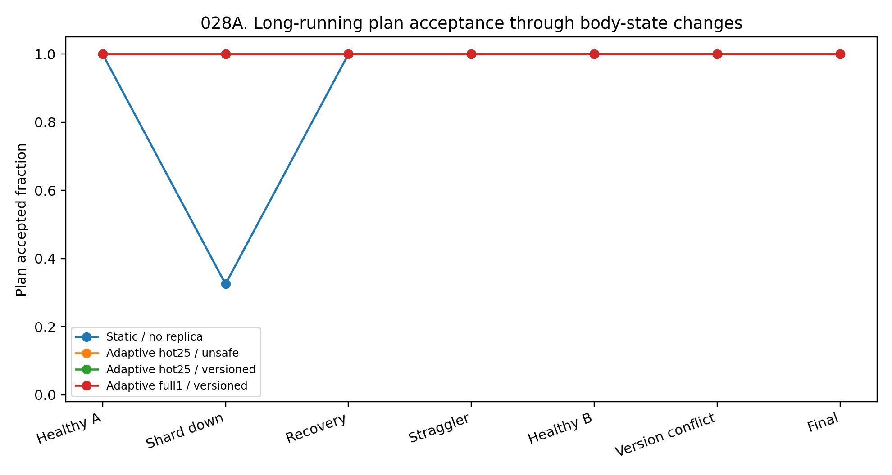

Figure 79. Task acceptance across seven operating phases in the 240-task workload. Critical-shard loss interrupts the static barrier condition.

#### 9.3.2 Task acceptance and retrieval completeness

Static barrier acceptance is 88.75% over all 240 tasks. During the 40-task critical-shard-loss phase, only 32.5% are accepted and phase recall@5 is 0.320. Adaptive hot25 and adaptive full1 maintain 100% acceptance.

During shard loss, hot25 recall@5 is 0.910 and full1 recall is 1.000. Over the full workload, mean recall is 0.905 and 0.9917, respectively. Acceptance and retrieval completeness therefore measure different aspects of continuity.

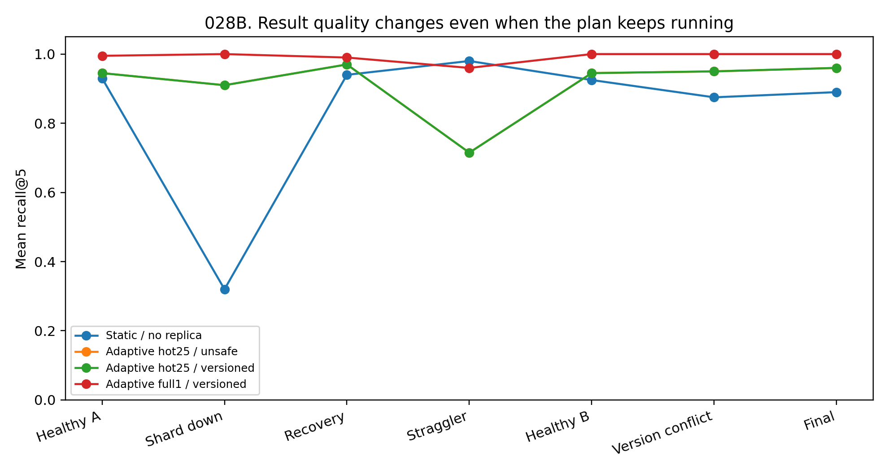

Figure 80. Mean recall@5 against centralized retrieval in each operating phase. The same document-derived workload is used across coordinator conditions.

#### 9.3.3 Remembering delayed owners

The static barrier waits for the shard with the injected 350 ms delay and has phase median latency 354.0 ms. Adaptive coordinators retain the first timeout in their health state and route subsequent tasks around the owner. Phase medians are 5.10 ms for hot25/versioned and 4.73 ms for full1/versioned, approximately 69.5 and 74.8 times shorter than static latency.

Bypassing the delayed owner reduces retrieval completeness when replicas omit relevant objects. Straggler-phase recall is 0.715 for hot25 and 0.960 for full1. Availability, latency and agreement are separate evaluation quantities.

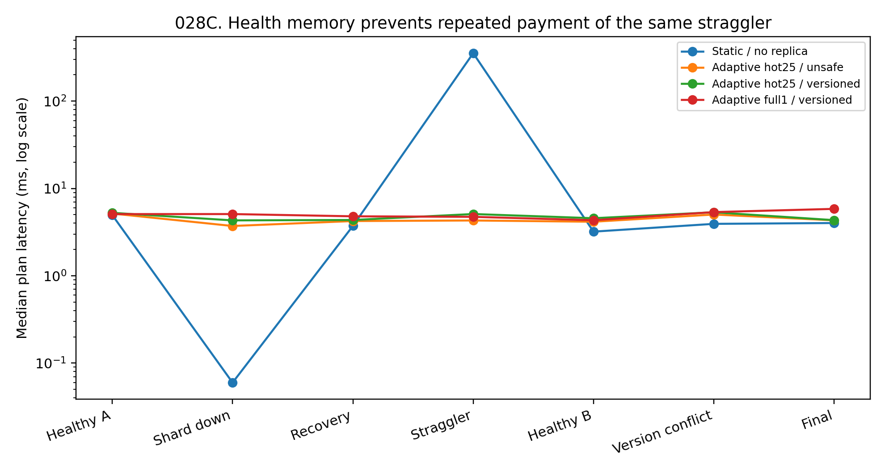

Figure 81. Phase median latency in the persistent coordinator prototype, shown on a logarithmic axis. Health memory changes later routing after the first delayed response.

#### 9.3.4 Deferred writes during owner loss

During shard loss, adaptive hot25 records 21 owner write intents and full1 records 26. The coordinator retains these in a deferred log and replays them when the owner returns. The corresponding replay counts are 21 and 26, and both final pending queues are empty.

Task acceptance can therefore precede physical completion of all writes. The experiment preserves the outstanding intents and closes them after owner recovery. The measured recovery concerns this tested owner-loss cycle; survival of the log across a coordinator crash is a separate property.

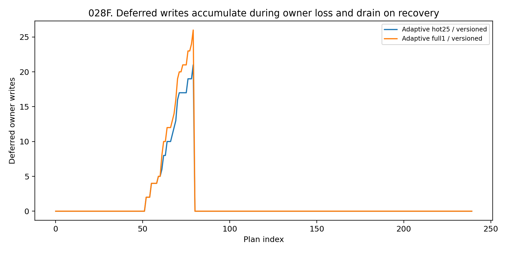

Figure 82. Deferred-write queues during owner loss and recovery. Logged writes are replayed when the owner returns, leaving no pending writes at the end of the tested sequence.

#### 9.3.5 Matched comparison of commit discipline

Adaptive hot25/unsafe and hot25/versioned use identical placement, routing, fault sequences and query workload, and have identical retrieval metrics. During 40 version-conflict tasks, 38 external updates collide with task writes. Unsafe commits leave 38 incorrect increments and an internal state error of 1.595%.

Versioned commits encounter the same 38 collisions and perform 38 compare-and-set retries. Final internal-state L1 error is zero. The matched control attributes this consistency difference to checking the expected version and recomputing the update.

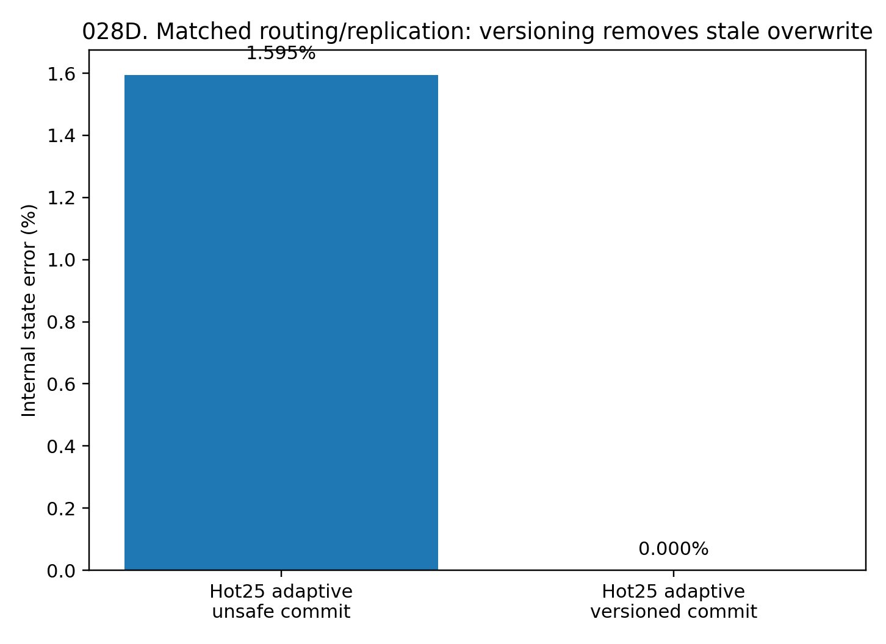

Figure 83. Matched hot25 commit comparison. Expected-version checks convert 38 stale-write collisions into 38 retries and eliminate the measured internal increment error.

#### 9.3.6 Final-state agreement

Table 94. Acceptance retrieval and final-state agreement.

| Condition | Accepted | Mean recall@5 | Internal state error | Final L1 error vs reference | Objects exact vs reference |
| --- | --- | --- | --- | --- | --- |
| Static / none | 88.75% | 0.824 | 1.846% | 19.31% | 49.19% |
| Adaptive hot25 / unsafe | 100.00% | 0.905 | 1.595% | 14.35% | 51.88% |
| Adaptive hot25 / versioned | 100.00% | 0.905 | 0.000% | 13.33% | 57.80% |
| Adaptive full1 / versioned | 100.00% | 0.992 | 0.000% | 1.50% | 93.55% |

Evidence: [028/do028_policy_summary.csv](evidence/experiments/028/do028_policy_summary.csv).

Real document-derived workload with controlled placement, fault or update conditions. Timing is specific to the local prototype. Internal write error and error against the centralized task reference are different outcomes.

Relative to the serial centralized task reference, final state L1 error is 19.31% for static, 13.33% for hot25/versioned and 1.50% for full1/versioned. In full1/versioned, 93.55% of object states exactly match the serial reference. Zero internal write error and zero error against the full reference are distinct criteria because routing can select different objects.

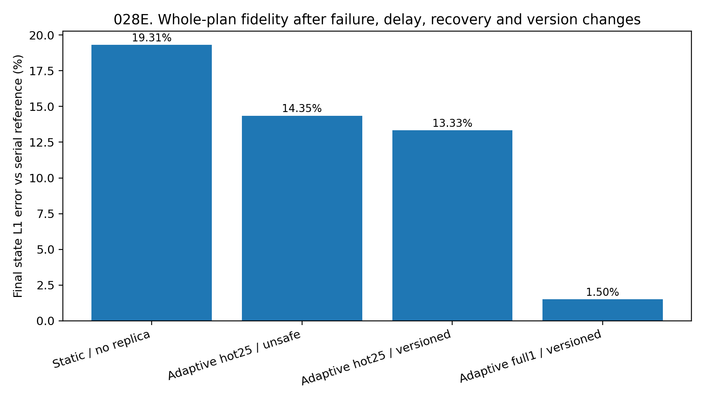

Figure 84. Final-state error after 240 tasks. The reference difference combines approximate routing, fault-dependent access and commit consistency; it is distinct from the isolated internal write-error measure.

#### 9.3.7 Discussion of continuity

The integrated workload tests whether task identity, result aggregation and writes remain coordinated as owners fail, slow down and receive concurrent updates. The coordinator's contribution is continuity of execution across these changes.

During critical-shard loss, 67.5% of static-barrier tasks lose their continuation condition. Adaptive execution retains task identity, write intents and ownership separately, allowing available work to proceed and deferred updates to complete after recovery.

After the first straggler timeout, the subsequent 39 tasks avoid repeatedly waiting 350 ms. Hot25 nevertheless has phase recall 0.715 because its replicas omit less frequently used objects; full1 reaches 0.960 with greater storage cost. Deadline and retrieval fidelity therefore require separate budgets.

Logical identity also requires an explicit write discipline. With otherwise matched conditions, version checks change 38 stale overwrites into recoverable retries. Object versions provide the temporal ordering needed for these state updates.

The tested continuity layer maintains task identity, health memory, owner mappings, deferred writes, commit versions and completion conditions. These are concrete system records through which a logical process continues across changing physical availability.

#### 9.3.8 Evidence scope

Corpus content, query vectors, shard assignments and dependencies are frozen from 026/027. The eight workers execute real local retrieval and owner-scoped operations; shard loss, delay and external version advances are controlled stress conditions. Latency describes this single-machine prototype. Acceptance, recall, deferred-write recovery, compare-and-set retries and final-state agreement are the principal experimental outcomes.

## 10. General discussion and conclusions

The chapter develops a data-oriented modelling principle: characterize the structure that generates and reveals the observations, preserve the information needed for the task, and organize computation accordingly. Across the experiments, dimension, timescale, topology, observation policy and continuity of state change which modelling choices are useful. General data intelligence names this common procedure for working across data structures; its components are evaluated through specific predictions, interventions and execution outcomes.

### 10.1 Predictive consequences as a common modelling objective

The statistical, chemical, birdsong, dance, quorum-sensing, physical and tracking studies show that similar surface formats can contain different predictive relationships. The common object is the information in current observations and history that constrains the specified future response.

This supplies a shared evaluation vocabulary for text-like sequences, graphs, continuous signals and event streams. Each representation can be asked which futures it distinguishes, which history it retains and which relations it preserves. Native encodings can differ even when the evaluation concerns these common questions.

### 10.2 Data geometry as an input to model selection

The geometry, microstructure, observability, fusion and hidden-manifold experiments establish that effective dimension is only one diagnostic. Data with the same measured dimension can differ in innovation noise, memory, observability, local compatibility and transition rules. These differences affect the observed training outcomes.

The real graph measurements add separate empirical layers. In Facebook, pooled profile cosine is only approximately 8.9% higher on friendship edges than sampled non-edges, but shared-circle membership has a 3.25-fold enrichment. In Email-Eu-core, median active-neighbour coverage is 22.5% at 30 days and 40.0% at 90 days. Node and directed-dyad activity also have different adjacent-window continuity. These measurements favour preserving the layers and their timescales as distinct modelling inputs.

The practical implication is to measure dimension, neighbourhood scale, temporal continuity, observation policy, relation state and training compatibility before assigning model capacity or selecting a representation.

### 10.3 Conditional computation as a tested design choice

WORLD-MOE-002 provides a condition-specific routing result. Under the homogeneous law, MoE and a shared rule generator perform similarly. Under heterogeneous laws, routing interventions change long-horizon predictions. Subsequent studies show that this contribution depends on adequate state information, local capacity and discovery of a useful partition.

The broader design family includes local residuals, recurrent modules and relational computation. The distributed studies concern a separate implementation layer: where identified data and updates are owned and executed. Both involve allocating computation, but worker placement is not evidence that neural experts have recovered data-generating mechanisms.

Modularity is therefore an empirical modelling choice. Its value is established through comparisons with shared models, routing interventions, capacity controls and held-out response performance.

### 10.4 Coordinating prediction under changing computational resources

Experiments 015–018B make resource-dependent prediction measurable. Availability, load history and substitute pathways enter the coordinator, and module perturbations test whether prediction can be maintained. The phrase “computational body” used in model identifiers refers operationally to these resource variables and module interactions.

The anticipation experiment separates resource-state estimation from training through delayed resource consequences. Its matched architecture comparison shows that the loss and training dynamics affect later prediction and reserve capacity. This is a result about conditional computation under a specified resource simulator.

The integrated predictor and multi-source comparisons test how those mechanisms operate within autoregressive models. Continuous, categorical-event and unordered-set sources satisfy the reported accuracy and perturbation criteria; the graph condition exposes a convergence–robustness trade-off. These are the measured conditions of architectural reuse.

### 10.5 An operational definition of general data intelligence

In this chapter, general data intelligence is the organized use of data diagnostics to choose representations, estimate predictive states and allocate computation across heterogeneous sources. It asks which native structures to preserve, which parameters to share, which histories to retain and how to test those decisions.

This emphasis complements automated model selection. The earlier questions concern the generating and observation processes, independent directions of variation, predictive timescales, relational layers, transfer between data regions and the location of useful capacity. Answers supply an empirical basis for architecture and training choices.

The experiments provide components of this procedure: diagnostic measurements, controlled comparisons and running coordination prototypes. Their combination defines a research framework; the document does not report an autonomous system that has learned to perform every diagnostic or select every architecture by itself.

### 10.6 Distributed state with continuous logical identity

Experiments 026–028 extend the analysis to execution and state ownership. At 16 shards, hash placement cuts 93.3% of semantic neighbour edges, and pure semantic clustering concentrates load. Balanced semantic placement limits the largest shard to 6.75% and preserves more locality than hash placement. Location and available capacity jointly affect the placement problem.

The compact routing map occupies approximately 8.2% of the text size. Contacting half the shards gives recall@5 98.4% and exact-set agreement 92.2% against centralized retrieval. The useful coordinator records are ownership, routing summaries, dependencies, health and versions, with their size and agreement costs explicitly measured.

A complete backup restores reference retrieval across all eight single-shard failures. Ownership-scoped locking preserves 120,000 concurrent dependency-derived updates at median throughput approximately 669,000 updates/s, exceeding the global-lock result on this machine. In the matched version test, 38 stale-write conflicts leave 38 incorrect increments with unsafe commits and zero internal increment error with versioned retries.

These experiments establish continuity conditions for the tested corpus and workload: stable logical identities, explicit owners, tracked dependencies, ordered commits and retained write intents through owner recovery. The results concern local multiprocess coordination with injected faults, rather than an untested claim about arbitrary distributed deployments.

### 10.7 A common procedure with heterogeneous internal representations

The unifying proposal is a shared procedure for measurement and evaluation. Predictive-state queries compare representations; conditional computation allocates modelling effort; ownership and versions coordinate distributed state. These operations can be studied together without assuming identical internal mathematics for every data source.

Continuous fields, events, graph relations, lifecycle objects and partially observed trajectories impose different representation requirements. The chapter documents which of those requirements were isolated, which comparisons improved prediction and which state-coordination mechanisms were executed.

Generality is therefore assessed as reuse of explicit procedures or components across stated conditions. It remains an empirical property of those comparisons, with source-specific encoders, objectives and observation processes made visible.

### 10.8 Evidence supporting the framework

Three evidence types support the chapter. Controlled generators isolate dimension, observability, innovation, drift and transition heterogeneity and measure their effects on learning. Recorded biological communication and public graph data supply direct measurements of temporal and relational structure. The document-derived multiprocess workload measures placement, retrieval, fault handling and update consistency under controlled stress.

Together, these studies support data geometry as a design input, predictive state as a task-dependent representation, conditional computation as an architecture to compare, and ownership/version/health records as coordination mechanisms. Each conclusion is attached to the experimental scale and outcome that supports it.

### 10.9 Conclusion

The recurring result is that a model's input format does not determine the structure it must learn. Equal dimension can conceal different curvature or noise; equal marginals can conceal different transitions; static adjacency can conceal a changing active relation field; one logical corpus can be partitioned across owners with measurable coordination costs.

Data-oriented modelling turns those differences into explicit design variables. It preserves predictive information, assigns capacity where the measured response requires it, and evaluates both prediction and state continuity under changes in observation or computational resources.

General data intelligence is developed here as a disciplined way to connect the structure of data with the organization and evaluation of computation.
