Learning Causal Structure from Data Geometry

Where Causal Information Resides and How Models Preserve It

Data-Oriented Modelling · Chapter 5 · Report 02 · English edition v1.0

Experiments CAUSAL-GEOMETRY-001–024

28 September 2026

This report examines where identifiable causal information resides in data geometry, how learned representations can preserve or distort it, and how preservation can be tested through transfer and intervention. Across 24 experiments, it connects local identifiability theory, real-data relation and response analyses, and generated mechanisms evaluated by their executable consequences.

## Executive summary

The question. Causal structure is not read directly from correlation. Under stated assumptions, information about direction and mechanism can appear in residual independence, conditional noise width, nonlinearity, changes across environments and intervention responses. The first part of this report locates and measures those distinctions, including settings where direction remains unresolved.

The learning problem. Compression and good prediction do not guarantee preservation of causal information. In CG-010, two SVD dimensions retain 84.6% of response energy but the corresponding downstream-role AUC is 0.361, compared with 0.671 for raw response components. Cross-system tests also show that a stable score can have the wrong causal interpretation. These results motivate retaining task-relevant local structure and evaluating source transport separately from sampling stability.

The constructive tests. Later experiments train explicit candidate mechanisms and test them through new queries, relation edits, evidence updates and sequential interventions. They demonstrate useful, reusable structure within known small synthetic systems, while real-data completion gains are mixed. The supported conclusion is a programme of representation and functional testing: preserve the distinctions needed for the causal operation of interest, then check them through consequences that the training readout alone does not establish.

## How to read the evidence

Read the evidence unit before the percentage: a cell, node, relation, intervention target, data source and synthetic world are different units. Repeated seeds, masks and queries do not create new independent worlds or targets.

Scores are task-specific. Direction accuracy concerns orientation; adjacency AUC concerns whether a direct edge is present; completion MSE concerns prediction; intervention-consequence accuracy tests a different property. Agreement or bootstrap stability alone does not establish causal validity.

Synthetic experiments permit exact structural consequences under their specified equations. Real-data reference graphs and benchmark directions are evaluation standards, not a guarantee that all confounding, off-target effects or measurement processes are resolved.

## Experiment map

CG-001–006: Where direction-breaking information occurs and how its local geometry changes.

CG-007–008 and the external pilot: Transfer between pairs, sources and datasets.

CG-009–016: Response propagation, compression, local causal roles and selective computation.

CG-017–022: Generated objects, reusable mechanisms and preservation under new operations.

CG-023–024: Observation coordinates, long rollout and sequential interventions.

## Abbreviations

| Term | Meaning |
| --- | --- |
| ANM | Additive noise model |
| AUC | Area under the ROC curve; 0.5 is random ranking |
| B / M | Generated relation matrix / temporal transition matrix; definitions are experiment-specific |
| CI | Confidence interval |
| DAG | Directed acyclic graph |
| GRU | Gated recurrent unit |
| IQR | Interquartile range |
| JS / KL | Jensen–Shannon / Kullback–Leibler divergence |
| LOIO / LOTO / LOPO | Leave one intervention / target / pair out |
| MAD | Median absolute deviation |
| MAE / MSE | Mean absolute / squared error |
| NLL | Negative log likelihood; lower is better; density NLL may be negative |
| NMF / SVD | Nonnegative matrix factorisation / singular value decomposition |
| PNL | Post-nonlinear model |
| REV | Reversal-compatible calibration family |
| RMS | Root mean square |
| SCM | Structural causal model |
| SNR | Signal-to-noise ratio |
| TV | Total variation of mixture weights |
| World Program | An explicit generated mechanism with a specified executor; an experiment label |

The full experiment record follows. Figures and tables are numbered consecutively in reading order; experiment identifiers remain CG-001–024. The evidence index distinguishes complete model records from early results retained only in reports.

## Abstract

Where does causal information reside in data, and what must a machine-learning model preserve to use it? This report studies the question through data geometry: conditional noise structure, nonlinear relations, distributional changes and intervention responses. Causal interpretation is conditional on the generating assumptions and available evidence. The experiments examine both where directional information can be identified and whether a learned representation retains the distinctions needed for new causal questions.

CG-001 distinguishes shape, change and response geometry. CG-002 constructs mechanisms in which the same residual mutual-information statistic reverses its directional interpretation. CG-003 measures the emergence of identifiability from a reversible linear-Gaussian baseline; CG-004 extends the analysis to several normal directions and measures how nuisance changes reshape their Fisher metric. CG-005 studies finite-radius curvature in explicit structural causal models, and CG-006 combines local charts with a geometry-based causal triage prototype. In two source-held-out Tübingen panels, CG-007 finds gains of approximately 13.2 and 15.2 percentage points from geometry conditioning. CG-008 transfers an observational atlas to Sachs protein measurements and compares it with information from experimental environments. CG-009–011 distinguish intervention propagation, shared response structure and local direct-edge information. CG-012 records unstable cross-system interpretation, including stable sign reversals; CG-013 tests selective calibration using two local anchors. CG-014 combines observational relation texture with a matched intervention response: direct-child AUC increases from 0.721 to 0.884 under leave-one-target-out evaluation. Response–node misalignment and child-label permutation controls give p≈0.017 and p≈0.010, respectively.

The first sixteen experiments support a mechanism-dependent account of causal information. Near the reversible sets defined in the controlled models, normal Fisher geometry organizes directional information; finite displacements require local charts and higher-order corrections. Transfer between real sources changes the interpretation of local measurements. In CG-008, observational and environment-change channels correctly orient 70.6% and 64.7% of the 17 reference direct edges; their six point-estimate agreements are all correct. CG-009 finds stronger descendant responses overall, primarily through location shifts, rather than a simple decline of amplitude with graph distance. CG-010 finds that a low-rank response tensor, with rank-1/2/3 cumulative energy of 70.9%/84.6%/92.3%, loses local role information when compressed: raw-component, SVD-2 and NMF-3 descendant AUCs are 0.671, 0.361 and 0.528. In CG-011, unique-target direct-child AUC is 0.721 for baseline relation geometry and 0.526 for correlation alone. A candidate downstream-role AUC of approximately 0.722 has permutation p≈0.283. CG-012–013 distinguish sampling stability from transfer validity. CG-015 finds direct-child AUC 0.88 under both PKC perturbations despite opposed response rankings. CG-016 obtains AUC 0.855 with matched-response computation on 54% of relations and 1.54 operator calls on average; always computing the response gives 0.884, whereas adding relation-change features unconditionally gives 0.811.

CG-017 studies generated intermediate objects in numerical models. Continuous states or numerical candidates are generated and fed into subsequent computation. Numerical feedback improves intervention-consequence distributions in constructed causal systems; the Sachs completion gains are smaller and vary by environment. Generation, evolution, feedback and predictive contribution can therefore be measured separately.

CG-018 organizes candidates into generated relational equations and predicts through internal simulation. On the same constructed systems, the two mechanism variants obtain original-query NLLs of −1.7701 and −1.7557, compared with −1.2082 for numerical candidates. Across three intervention targets, their NLLs are −1.6298 and −1.5457, compared with −0.6082. Sachs completion varies by target. Relation-edit experiments trace how temporary changes enter subsequent states and how their predictive effects contract during regeneration.

CG-019 reloads six frozen CG-018 mechanism checkpoints and tests new questions. Across twelve simultaneous double interventions, solving the generated relation system improves mean NLL by 0.3566 for Mechanism Blank and 0.2462 for Mechanism Feedback relative to adding two single-intervention answers. For edge deletion followed by intervention, editing the specified coordinate outperforms ignoring the deletion or editing the wrong coordinate. Predicted and true structural-edit displacements correlate at approximately 0.94, with directional agreement above 99%.

CG-020 makes generated relations B and candidate weights the only persistent state across iterations. With parameter-matched three-layer attention, four rounds of explicit state revision reduce two-seed mean NLL from −1.0106 to −1.1242 and MSE from 0.04890 to 0.04523. Saving only B and weights after round two permits exact continuation. Erasure, transplantation and relation reversal alter the endpoint; frozen iteration to twenty steps reaches stable or contracting updates.

CG-021 retains all candidate systems without a prescribed discrete selection rule. Pool8 has two-seed mean NLL −1.3220 versus −1.1443 for Pool3 and maintains approximately 7.44 effective candidates. Retaining only the three highest-weight candidates after training worsens NLL by 1.256 on average. Support evidence mainly revises relational content rather than eliminating candidates through their weights. It improves the scored query without automatically improving joint consistency across three queries; a brief support pulse leaves a persistent state trace.

CG-022 trains the explicit Pool8 state through consequence losses for single interventions, double interventions and relation edits. Frozen evaluation includes unseen intervention values, edge halving and edge sign reversal. The evidence-coupled variant improves held-out operator-bank NLL over CG-021 by 0.2264 on average, with a 100-group bootstrap 95% interval of 0.1923–0.2640 and improvement in 95/100 groups. Original-query performance is retained, correct support improves later operator consequences, and twenty-step iteration remains stable beyond the training window.

CG-023 combines equilibrium forcing-response and temporal-transition evidence from four-variable stable dynamical systems. Training temporal queries extend only to h=4. Under mixed evidence, frozen World Program MSE stays near 0.033 from h=8 to h=128, while Direct Attention reaches 0.591 at h=128. Permuting the evidence-token container leaves both models numerically unchanged, whereas reversing the within-token xₜ→xₜ₊₁ direction degrades prediction. Observation-window length and the extent of the represented generating mechanism are thus distinct experimental quantities.

CG-024 tests sequential intervention execution in the same 600 systems, using explicit (M, b, logits) states without GRU recurrence. Training introduces single impulses, state clamps and persistent forces at horizons 4–8; frozen execution extends to h=128. Across 100 paired test worlds, correct execution versus ignoring the event changes MSE by −0.00120 for impulses, −0.00116 for clamps and −0.19525 for persistent forces. An unseen persistent-force-plus-later-impulse combination improves by −0.00185 relative to omitting the second event. On the same passive panel, h=32/64/128 MSE falls from approximately 0.040/0.039/0.039 to 0.021/0.021/0.021. Under mixed evidence, weighted RMS distance from generated relations to true M falls from 0.338 to 0.191. The explicit state supports passive simulation, event execution at specified coordinates and times, and an untrained event combination within these constructed systems.

### Principal findings

In a single joint distribution, correlation strength alone does not supply a causal arrow. The relevant structures are those that fail to remain compatible with the reverse generating interpretation.

Different identification sources occupy different geometric directions. Non-Gaussianity and nonlinearity contribute shape geometry; environmental or temporal variation contributes change geometry; intervention propagation supplies response geometry.

The interpretation of a causal statistic can reverse with the generating mechanism. Its numerical value and its causal meaning are separate objects.

Geometry routing identifies a generating regime and selects a corresponding local causal operator. A soft mixture combines local interpretations when regime identity is uncertain.

Near the reversible baseline, directional information emerges continuously. In the heteroscedastic construction, D(Pα,𝓡G)=½ log E[exp(2α tanh X)]=0.394294α²+O(α⁴), and the directional score satisfies SNR≈0.812√[nD(P,𝓡G)]. The observed αc∝1/√n boundary follows this local information scaling.

Structural stochasticity can carry mechanism texture. Independent measurement noise blurs that texture.

In the multivariate normal-space construction, nuisance changes along the reversible set reshape the normal Fisher metric without creating directionality. Local information is organized by the normal Fisher quadratic form rather than a fixed Euclidean norm.

Information magnitude and mechanism direction are distinct. In CG-004, direction-matched readouts average 98.9% accuracy; mismatched readouts average approximately 49.9% at the same information level.

CG-005 recovers local Fisher scaling in explicit structural causal models. Across four pure and six mixed mechanisms, mean exact-JS/quadratic-JS ratio is 0.999 at normalized radius r=0.08. At r=0.82 it is 0.868, ranging from 0.599 to 1.073 across paths.

After all second-order Fisher cross-terms are removed, mixed mechanisms retain higher-order interactions that grow with radius. At r=0.82 these range from approximately −48.4% to +52.4% of exact JS.

Smooth divergences share a local Fisher second-order structure but separate at finite distance. In CG-005, Chernoff/JS rises from 1.002 at r=0.08 to 1.133 at r=0.82. A global causal distance therefore requires a specified inference task.

In CG-006, 24 finite-distance local charts reduce mean absolute error for exact causal JS from 0.00469 under the single-origin quadratic approximation to 0.000855. Adding local cubic terms reduces it to 0.000355: improvements of approximately 5.49-fold and 13.20-fold.

The CG-006 practical prototype achieves 94.7% direction accuracy on held-out pure structural models. Requiring |P−0.5|≥0.30 and reversible probability<0.40 gives 98.8% accuracy at 75.1% coverage and abstains on every member of the separate reversible set. Bootstrap resampling frequently returns weak ANM/PNL cases to an unresolved status. Stability and directional scores provide complementary diagnostics.

In CG-007, fixed directional readouts score 45.4% and 55.8% on two independent 18-pair, six-source panels; geometry-conditioned readouts score 58.6% and 71.0%. Combined official-weight accuracy rises from 51.37% to 65.74%. Atlas-support distance detects some source novelty, while Tarim and auto-mpg counterexamples distinguish geometric coverage from directional correctness.

In CG-008, an observational readout trained on 99 parseable scalar Tübingen pairs orients 70.6% of 17 Sachs reference direct edges correctly. Coefficient-drift geometry from nine Sachs environments scores 64.7%. Their point estimates agree on six direct edges, all correctly oriented. Across all 55 variable pairs, consensus-score AUC for direct-edge presence is 0.552 versus 0.647 for environment asymmetry. Consensus is most informative as an orientation gate for candidate relations.

CG-009 measures response geometry in Sachs perturbations. After within-intervention normalization, total-response AUC is 0.688 for descendants and 0.709 for direct children, with permutation p≈0.017 and p≈0.014. Location shift carries the strongest stable transmission signal, scale contributes less, and shape alone has no stable descendant signal in this analysis.

CG-010 finds a strongly low-rank 6×11×3 response tensor: rank-1/2/3 cumulative energy is approximately 70.9%/84.6%/92.3%. Nevertheless, raw location/scale/shape features yield descendant AUC 0.671 under leave-one-intervention-out validation, with within-intervention permutation p=0.0245, compared with 0.361 for SVD-2 and 0.528 for NMF-3 reconstructions. Global response compression and local causal-role modelling require separate representations.

CG-011 separates direct adjacency from downstream propagation. For 50 unique target–node relations, baseline geometry yields leave-one-target-out direct-child AUC 0.721, with p=0.0025 across 2,000 permutations; correlation alone yields 0.526. The strongest individual features include the heteroscedastic direction gap (AUC 0.667), forward heteroscedasticity (0.656), and nonlinear/residual geometry.

In CG-012, a child-texture operator trained on 50 Sachs relations correctly orients only 5/10 Tübingen pairs from ten sources. Of seven pairs with stable, mutually consistent point and bootstrap directions, five are correct and two are stably reversed. Sampling stability and transfer validity require separate assessment.

In CG-015, PKC G0076 and PMA perturbations have opposed raw response rankings, with Spearman correlation approximately −0.479. A baseline-relation-plus-matched-response confirmer trained on non-PKC targets gives direct-child AUC 0.88 under both conditions. P38 ranks first, and each top-three set contains only direct children. Exact enumeration of all 252 five-child label assignments gives joint-AUC p≈0.0079.

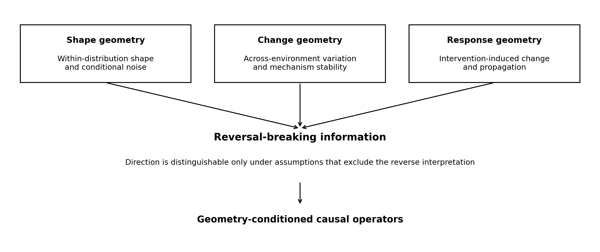

Figure 1. Framework connecting data geometry to geometry-conditioned causal operators. Shape and change geometry motivate CG-001–005; intervention-response geometry is subsequently measured in CG-009 onward. This is a conceptual diagram, not a quantitative result.

With frozen CG-018 models, CG-019 shows reuse of generated relations on untrained questions. Solving the relation system outperforms adding single-intervention answers for double interventions; editing the requested edge outperforms ignored or misplaced edits, and the resulting displacements closely track true structural-edit consequences.

CG-020 uses explicit relations as persistent computational state without GRU/RNN hidden-state recurrence. Four revisions improve both seeds over a parameter-matched one-pass model. B and weights can be saved independently and resumed exactly; edits propagate through subsequent state updates.

CG-021 retains a distributed candidate pool without prescribed discrete selection. Pool8 maintains approximately 7.44 effective candidates, and post-hoc top-three pruning worsens performance. New evidence changes relational content more than mixture concentration; local-query gains and consistency of the whole candidate system can diverge.

CG-022 trains explicit states through several consequence operators without supervising true B. Its evidence-coupled variant improves held-out intervention and edge-edit NLL by 0.2264 over the preceding Pool8 model and makes support evidence useful for subsequent operator consequences.

CG-023 combines equilibrium-response and temporal-transition coordinates. With temporal training limited to horizon four, the frozen World Program remains stable through horizon 128 under mixed evidence. Arbitrary context-container permutations preserve predictions, while reversing temporal generation degrades them. Storage order and meaningful generating coordinates are experimentally distinct.

## 1 Where causal information resides and what learning must preserve

The central question is how machine learning can retain the parts of data geometry that support causal distinctions. These need not be the highest-variance directions or the features most useful for a single prediction. A representation can fit observations well while losing local role information, confusing source-specific interpretations, or failing to execute a new intervention. Before asking how to preserve causal information, however, we must establish when the observed data contain information capable of identifying it. For two variables X and Y, the joint distribution admits both factorizations:

$$
P(X,Y)=P(X)P(Y\mid X)=P(Y)P(X\mid Y)
$$

The factorisations alone do not identify an arrow. Causal meaning comes from additional generating constraints, experimental variation or temporal structure. A representative structural model is:

$$
X=N_x,\qquad Y=f(X)+N_y,\qquad N_x\perp N_y
$$

If X→Y admits a simple function with independent noise while Y→X cannot simultaneously satisfy the same model class, the distribution contains directional information. LiNGAM uses non-Gaussian disturbances in linear systems; nonlinear additive-noise models use the generally asymmetric requirement of independent noise in the generating direction [1–2].

We use reversal-breaking information to mean generating constraints or data structures that cannot be preserved in both causal directions within the specified model family. This is an operational, assumption-dependent notion. It does not imply that every distribution contains a uniquely recoverable causal graph.

This formulation connects non-Gaussianity, nonlinearity, heteroscedasticity, environmental variation, temporal nonstationarity and intervention response. Their statistical forms differ, but each can make simplicity, independence, stability or locality hold preferentially in one generating direction.

### 1.1 Geometric locations of identifiable information

Shape geometry describes asymmetry within a distribution, including higher moments, conditional noise-fibre widths, nonlinear curvature and residual–input dependence. Change geometry describes how distributions move across environments, periods or domains, revealing which mechanisms remain stable. Invariant causal prediction and discovery from heterogeneous or nonstationary data exploit related principles [3,6]. Response geometry describes the directional propagation of intervention-induced changes as trajectories or response cones. Introduced in CG-001–005, this third component is measured in the later intervention experiments.

### 1.2 How learning can lose or distort the relevant distinctions

A model learns a representation under a particular objective. Variance preservation, reconstruction quality and predictive accuracy reward different properties from identifying a direct child or executing a changed mechanism. CG-010 makes this distinction measurable: most response energy lies in a small shared subspace, yet projecting into that subspace degrades downstream-role discrimination. CG-011 further separates baseline relation features useful for adjacency from dynamic changes potentially informative about propagation.

Distortion can also arise without dimensional compression. The same statistic can reverse its interpretation across mechanisms in CG-002, and an operator can be stably wrong after transfer in CG-012. Repeated feedback can preserve a computational dependency while amplifying prediction error in an unseen environment, as CG-017–018 show. These are different failure modes and should not be reduced to one claim that all machine learning merely learns correlation.

### 1.3 Preservation is a functional claim that requires testing

In this report, preserving causal information means retaining distinctions needed for a stated causal task under its assumptions. Relevant tests include orientation under mechanism or source holdout, local-role discrimination after compression, node-aligned response confirmation, reuse of one generated mechanism across queries, coordinate-specific edits and correct execution of events. No single metric establishes all of these properties.

The constructive experiments progressively strengthen the test. Numerical candidates are compared with generated equations; generated equations are reused under untrained operations; explicit objects are saved, edited and resumed; and learned dynamics is asked to reproduce evidence and propagate new events. CG-021 shows that improving one query can still reduce cross-query consistency. CG-024 shows that evidence replay and event-delta supervision improve several functional tests in the specified affine systems.

### 1.4 Scope of the argument

The experiments connect three questions: where identifying information is available, what a learning process retains or distorts, and how retained structure can be validated through consequences. They do not establish a universal causal learner. The theoretical results use defined model families; the Sachs and Tübingen analyses have limited independent sources or targets; and later executable-model results use small constructed systems. Predictive utility, mechanism recovery and identifiability remain distinct throughout.

## 2 Experimental programme and common measurements

The first five experiments progressively constrain the problem. CG-001 compares identification sources; CG-002 constructs opposite interpretations of one statistic; CG-003 varies a single normal departure from an exactly reversible baseline; CG-004 adds several normal directions and nuisance variation along the reversible set. CG-005 returns to explicit structural causal models with nonlinear means, heteroscedasticity, non-Gaussian residuals and observed environmental shifts, measuring finite-radius curvature, higher-order interactions and metric transfer.

Table 1. Overview. Experimental programme and common measurements

| Study | Question | Manipulations | Outputs |
| --- | --- | --- | --- |
| CG-001 | Which features break direction symmetry? | Non-Gaussianity, nonlinearity and environment shifts | Directional geometry and mechanism fingerprints |
| CG-002 | Does one statistic transfer across mechanisms? | Six X→Y mechanisms with conflicting signs | Shared head versus geometry routing/experts |
| CG-003 | When does information emerge from a nonidentifiable point? | α, n, structural noise σ, measurement noise τ | Transition surface, SNR and 1/√n scaling |
| CG-004 | Can normal directions share a local information scale? | Multiple normal directions and tangent nuisance | Local normal Fisher tensor and direction-matched readout |
| CG-005 | When does local Fisher geometry require higher-order correction? | Explicit M/H/S/E SCM, mixtures and tangent regimes ρ | finite-radius curvature、higher-order interaction、metric transport |

Source: supplied Overview record. Conceptual synthesis. Blank cells mean not reported or not applicable; model, unit and adjustment details are specified in the adjacent methods.

The common measurements characterize residual and conditional-distribution geometry after fitting both directions: residual mutual information, variation in conditional fibre width, residual shifts across environments, mechanism stability and residual-variance geometry. They serve as measurable candidates for reversal-breaking directions, with interpretation determined by the generating model.

## 3 CG-001 Sources of direction-breaking geometry

### 3.1 Motivation

CG-001 asks whether different mechanisms that break X↔Y symmetry leave distinguishable geometric signatures in the data. It uses the following generating family:

The base equation is:

$$
Y=0.9X+\frac{\beta}{3}X^3+\varepsilon
$$

Three symmetry-breaking components are activated separately: non-Gaussian strength p, nonlinear strength β and environmental displacement γ. In the environment experiment, only P(X) changes; P(Y|X) remains fixed. Each condition uses 24 independent seeds and 320 observations per environment.

### 3.2 Directional measurements

After fitting the forward and reverse directions, four measurement families are constructed:

$$
G=(I_{\mathrm{res}},\mathrm{CV}_{\mathrm{fibre}},D_{\mathrm{res,env}},D_{\mathrm{mech,env}})
$$

The four entries are, in order, mutual information between input and residual, the coefficient of variation of conditional fibre width, a distance between residual distributions across environments, and a distance between mechanisms across environments. These compact labels denote the same four geometric measurements.

These measurements ask how much input information remains in residuals, whether local noise thickness changes with the input, whether residual distributions drift across environments, and whether the generating function remains stable. A fibre is the conditional spread of Y at a fixed X=x. A stable mechanism with local noise can yield relatively regular fibres in its generating direction, whereas reverse fitting may produce distortion, compression or expansion.

### 3.3 Results

Table 2. CG-001. Results

| Information introduced | Strength | Most informative directional feature | Direction accuracy |
| --- | --- | --- | --- |
| Non-Gaussianity | p = 1.0 | Residual MI | 91.7% |
| Non-Gaussianity | p = 1.0 | Fibre geometry | 95.8% |
| Nonlinearity | β = 0.30 | Residual MI | 95.8% |
| Nonlinearity | β = 0.30 | Fibre geometry | 95.8% |
| Nonlinearity | β = 0.60 | Residual + fibre | 100% |
| Environment shift | γ = 0.25 | Residual shift | 100% |
| Environment shift | γ = 0.25 | Mechanism stability | 91.7% |
| Environment shift | γ ≥ 0.50 | Two forms of change geometry | 100% |

Source: supplied CG-001 record. Synthetic analysis. Higher AUC/accuracy indicates better discrimination. Blank cells mean not reported or not applicable; model, unit and adjustment details are specified in the adjacent methods.

At the linear-Gaussian baseline, the residual-MI directional gap is approximately −8.8×10⁻⁴ and directional information is negligible. Non-Gaussianity, nonlinearity or environmental drift progressively introduces directional geometry.

A random forest classifies the non-Gaussian, nonlinear and environment-shift families using geometric features alone with approximately 84.4% accuracy. Including absolute measurements from both directions increases this to approximately 87.5%. The environment-shift family is particularly distinct: 92 of its 96 datasets are classified correctly.

### 3.4 Discussion

Different identification sources occupy different geometric directions. Non-Gaussianity and nonlinearity contribute shape and fibre asymmetry, while environmental drift exposes mechanism stability through change geometry. Heterogeneity can therefore provide information about generation, as also emphasized in work on heterogeneous and nonstationary causal discovery [6].

The experiment supports describing identifiability through the reversal-breaking directions present in a dataset. It motivates mechanism-dependent interpretation of correlation and residual scores.

One environment supplies a single distribution P(X,Y); several environments supply a family {Pₑ(X,Y)}. Which components move and which remain stable become additional observations. Directional information can reside in distributional movement as well as distributional shape.

## 4 CG-002 Mechanism conflict

### 4.1 Rationale

A weighted combination of geometric indicators might appear sufficient to define one global causal score. CG-002 tests this possibility by constructing valid mechanisms in which the same statistic requires opposite interpretations. Stable conflict would make dependence of causal meaning on the generating mechanism directly testable.

### 4.2 Generating mechanisms

Six structural families all have true direction X→Y. Three are additive-like: nonlinear additive noise, saturation and a latent mixture. Three alter noise or observation structure: heteroscedastic, multiplicative and post-nonlinear mechanisms. Three strengths and thirty seeds per family, with 650 observations per dataset, produce 540 base systems. Randomly swapping the displayed variables gives 1,080 direction tasks.

The principal directional statistic is:

$$
\Delta I=I(X;\varepsilon_{X\to Y})-I(Y;\varepsilon_{Y\to X})
$$

### 4.3 Sign reversal of the same statistic

Table 3. CG-002. Sign reversal of the same statistic

| True generating mechanism with X→Y | Mean ΔI |
| --- | --- |
| Nonlinear ANM | −0.077 |
| Saturating | −0.122 |
| Mixture | −0.099 |
| Heteroscedastic | +0.079 |
| Multiplicative | +0.145 |
| Post-nonlinear | +0.222 |

Source: supplied CG-002 record. Synthetic analysis. Blank cells mean not reported or not applicable; model, unit and adjustment details are specified in the adjacent methods.

The first three families give lower residual MI in the correct direction; the other three give higher residual MI in that direction. Since the generating arrow remains X→Y throughout, the reversal concerns interpretation of the statistic rather than a change in causal labels.

The counterexample distinguishes a causal statistic from its meaning. The relevant relationship is causal meaning = F(statistic, generating geometry).

### 4.4 Architecture comparisons

With ΔI as the only input, one shared threshold rule achieves approximately 51.3% mean accuracy across twenty independent train/test splits. Supplying oracle mechanism identity and learning a simple local rule for each mechanism raises accuracy to approximately 97.95%. The data and statistic are unchanged; mechanism context changes their interpretation.

The input is then expanded to four directional gaps: ΔMI, Δfibre, Δheteroscedasticity and Δresidual variance. Several architectures are compared.

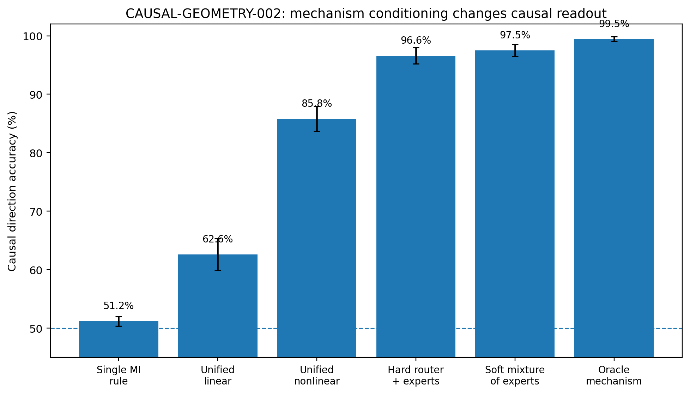

Figure 2. CG-002 architecture comparison using the same directional features. Geometry conditioning changes how well the features support direction prediction. Error bars show the reported standard deviation across repeated splits.

Table 4. CG-002. Architecture comparisons

| Architecture | Direction accuracy |
| --- | --- |
| Single MI rule | 51.2 ± 0.8% |
| Unified linear（4 geometry） | 62.6 ± 2.7% |
| Unified nonlinear（4 geometry） | 85.8 ± 2.1% |
| Hard geometry-router + experts | 96.6 ± 1.4% |
| Soft mixture of experts | 97.5 ± 1.0% |
| Oracle mechanism + experts | 99.45 ± 0.39% |

Source: supplied CG-002 record. Synthetic analysis. Higher AUC/accuracy indicates better discrimination. Blank cells mean not reported or not applicable; model, unit and adjustment details are specified in the adjacent methods.

The geometry router receives direction-invariant inputs such as min(GXY,GYX), max(GXY,GYX) and |GXY−GYX|. Swapping X and Y leaves its inputs unchanged. It classifies the six mechanism families with 95.64±1.86% accuracy; using that output to choose the sign interpretation of ΔI gives approximately 94.86% direction accuracy.

A permutation control leaves causal data, ΔI and expert rules fixed and shuffles only the geometry-to-mechanism correspondence. Correct routing scores approximately 95.68%; 500 shuffled routings average 49.995±2.67%, with a 95% range of approximately 44.4%–54.9%. Performance depends on the correspondence between geometry and the appropriate local interpretation.

### 4.5 Mechanism conditioning

The soft mixture has higher direction accuracy than the router's mechanism-classification accuracy. A system can retain probabilities over several mechanisms and combine local interpretations through posterior weighting:

$$
P(X\to Y\mid G)=\sum_m P(M_m\mid G)P(X\to Y\mid M_m,G)
$$

This connects to independent causal mechanisms and competitive mechanism decomposition [4]. A rich-feature control also shows that a unified nonlinear model supplied with sufficiently informative absolute geometry reaches approximately 99.7±0.4%. The supported relationship is therefore geometry-conditioned causal reading, 𝒞=𝒞(G(D)); explicit experts and sufficiently expressive unified models can both implement it.

A router with experts offers an interpretable modular implementation. A unified model can encode the same conditioning implicitly when its inputs are sufficiently rich. Mechanism conditionality is the common functional requirement in these comparisons.

## 5 CG-003 The identifiability boundary

### 5.1 Emergence from a reversible baseline

CG-003 asks how large a mechanism difference must be before direction can be recovered. It removes nonlinear means, environment labels and other alternative cues, starting from a reversible linear-Gaussian model and opening only heteroscedastic structural geometry.

$$
X\sim\mathcal N(0,1)
$$

$$
Y=X+\sigma\exp(\alpha\tanh X)\varepsilon,\qquad\varepsilon\sim\mathcal N(0,1)
$$

At α=0, conditional noise width is constant and the model is linear-Gaussian. Increasing α introduces only the following conditional-variance structure:

$$
\operatorname{Var}(Y\mid X=x)=\sigma^2\exp(2\alpha\tanh x)
$$

The construction isolates the emergence of directionality from other generating changes.

### 5.2 Mechanism strength and sample size

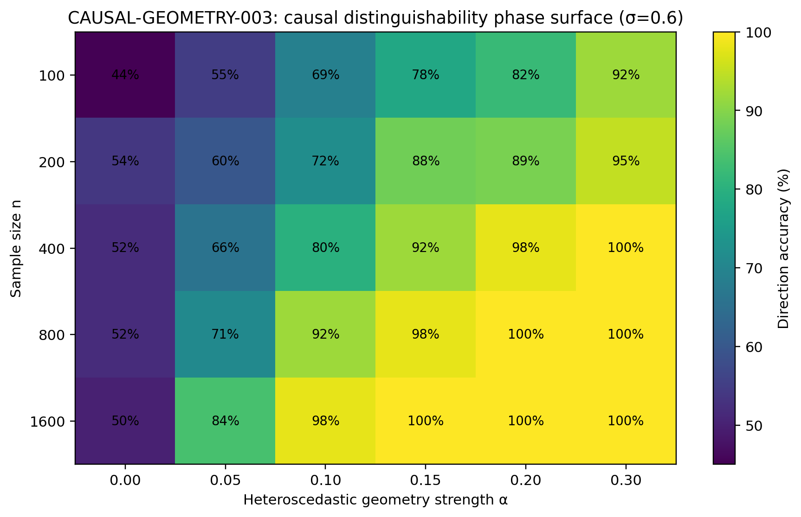

Figure 3. Direction-identification accuracy as a function of heteroscedastic strength α and sample size n at σ=0.6. The α=0 column remains near chance. Results come from the CG-003 synthetic parameter grid.

The minimum α needed for approximately 80% direction accuracy decreases as n increases:

Table 5. CG-003. Mechanism strength and sample size

| n | α₈₀ | α₈₀√n |
| --- | --- | --- |
| 100 | 0.181 | 1.81 |
| 200 | 0.125 | 1.77 |
| 400 | 0.100 | 2.00 |
| 800 | 0.071 | 2.01 |
| 1600 | 0.044 | 1.77 |

Source: supplied CG-003 record. Synthetic analysis. Blank cells mean not reported or not applicable; model, unit and adjustment details are specified in the adjacent methods.

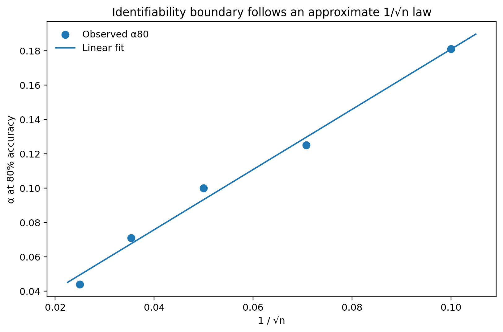

Figure 4. The 80% identification threshold is approximately linear in 1/√n in CG-003. The product α₈₀√n remains of similar magnitude across the measured sample sizes.

The detectable geometric difference depends on sample size. Repeated observations accumulate weak mechanism differences into recoverable directionality; stronger differences need fewer observations to reach the same accuracy.

### 5.3 Directional signal-to-noise ratio

For a directional geometry score S, define:

$$
\mathrm{SNR}=\frac{\mathbb E[S]}{\mathrm{SD}(S)}
$$

Across the parameter grid, observed accuracy is closely approximated by:

$$
P(\mathrm{correct})\approx\Phi(\mathrm{SNR})
$$

The correlation is approximately r=0.998 and mean absolute error approximately 0.007. In the small-α region:

$$
\mathrm{SNR}\approx\kappa(\sigma)\alpha\sqrt n,\qquad R^2\approx0.987\text{–}0.994
$$

Direction identification becomes a detection problem. The mean directional deformation increases with mechanism strength while estimation uncertainty decreases with sample size.

### 5.4 Structural randomness and measurement noise

Increasing σ does not make this task harder. Here σ scales randomness inside the mechanism: variation in the width of σexp(α tanh X)ε is the texture being measured. Increasing it amplifies that texture. Empirically, α₈₀√n decreases from approximately 3.65 at σ=0.3 to 1.87 at σ=0.6 and approximately 1.35–1.36 at σ=1.0–1.5.

Independent measurement noise is then added separately: Xobs=X+τξX and Yobs=Y+τξY. This observation noise blurs the directional geometry.

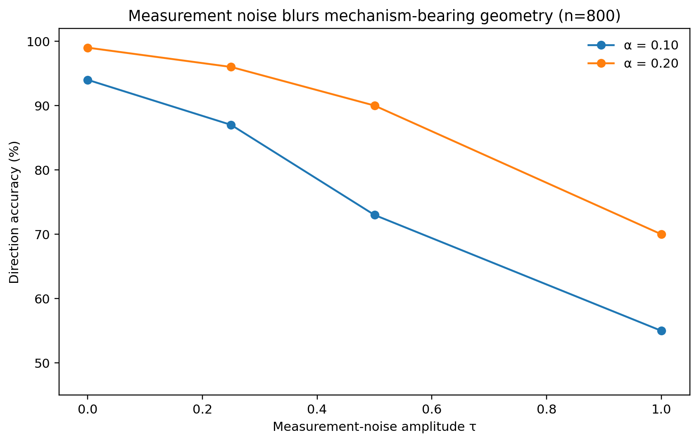

Figure 5. CG-003 separates structural stochasticity from independent measurement noise. Structural randomness can carry mechanism texture; increasing observation-noise scale τ reduces detectability of that texture.

Randomness inside the generating mechanism can be informative. Independent measurement noise convolves and blurs that information, reducing the directional signal-to-noise ratio.

### 5.5 Exact distance to a reversible model family

To distinguish the direction of a distributional change from its magnitude, two continuous perturbations are constructed near the same reversible baseline:

$$
X\sim\mathcal N(0,1),\quad Y=aX+\sigma\varepsilon,\quad\varepsilon\sim\mathcal N(0,1),\quad\varepsilon\perp X
$$

Let 𝓡G be the family of all nondegenerate bivariate Gaussian joint distributions. Within the linear-Gaussian additive-noise model, both regression directions have independent Gaussian residuals. Thus 𝓡G is the reversal-compatible manifold for this experiment's model class.

The normal perturbation introduces heteroscedasticity alone:

$$
Y=aX+\sigma\exp[\alpha h(X)]\varepsilon,\qquad h(X)=\tanh X
$$

Because h(X) is odd under the standard normal distribution, E[h(X)]=0. For every α, the forward KL projection of Pα onto the Gaussian family is the Gaussian Q* with matching mean and covariance. Joint entropy and covariance are directly calculable, giving:

$$
D(P_\alpha,\mathcal R_G)=D_{\mathrm{KL}}(P_\alpha\Vert Q^*)=\tfrac12\log\mathbb E\{\exp[2\alpha h(X)]\}
$$

The expansion around α=0 is:

$$
D(P_\alpha,\mathcal R_G)=\alpha^2\operatorname{Var}[h(X)]+O(\alpha^4)
$$

For standard-normal X and h(X)=tanh(X), numerical integration gives Var[tanh(X)]=0.394294. Local normal Fisher information is therefore 𝓘⊥=2Var[tanh(X)]=0.788589. The perturbation's geometric strength has an explicit information scale.

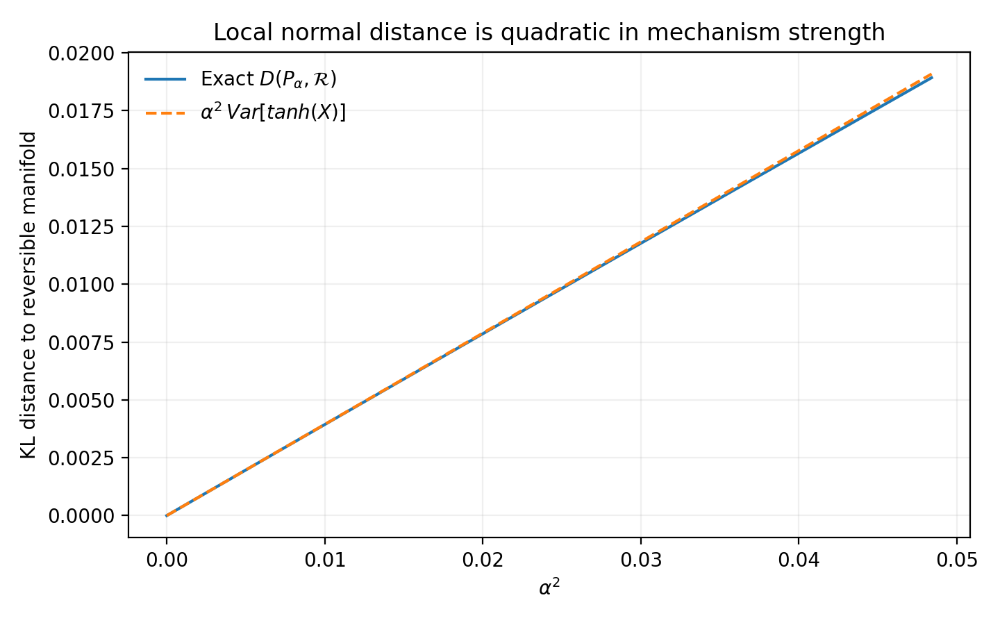

Figure 6. Exact KL distance from the CG-003 heteroscedastic construction to the linear-Gaussian reversal-compatible family. At small α it closely follows α²Var[tanh(X)].

### 5.6 Matched KL tangent and normal controls

The tangent perturbation is:

$$
Y=(a+\delta)X+\sigma\varepsilon
$$

This can substantially alter the joint distribution while remaining within 𝓡G, so D(Pδ,𝓡G)=0. Its KL divergence from the baseline P0 is:

$$
D_{\mathrm{KL}}(P_\delta\Vert P_0)=\frac{\delta^2}{2\sigma^2}
$$

For the normal heteroscedastic perturbation, total KL divergence from the same baseline is:

$$
D_{\mathrm{KL}}(P_\alpha\Vert P_0)=\tfrac12\{\mathbb E[\exp(2\alpha h(X))]-1\}
$$

For each α, δ can be chosen so that the tangent and normal perturbations have identical total KL divergence. This controls how much the distribution changes while varying whether the path remains within or departs from the reversible family.

Table 6. CG-003. Matched KL tangent and normal controls

| Matched α | Total KL change | Matched tangent δ | Normal accuracy at n=800 | Tangent accuracy at n=800 |
| --- | --- | --- | --- | --- |
| 0.04 | 0.000631 | 0.0355 | 71.0% | 47.6% |
| 0.08 | 0.002527 | 0.0711 | 88.0% | 51.1% |
| 0.15 | 0.008914 | 0.1335 | 99.3% | 52.3% |
| 0.20 | 0.015907 | 0.1784 | 100.0% | 54.5% |

Source: supplied CG-003 record. Synthetic analysis. Higher AUC/accuracy indicates better discrimination. Blank cells mean not reported or not applicable; model, unit and adjustment details are specified in the adjacent methods.

Across four matched distances and three sample sizes, the twelve tangent-control cells average 51.0% direction accuracy, with between-cell SD 2.2%. The normal perturbations become identifiable as nD(P,𝓡G) increases. In this construction, the component leaving the reversible family carries directional information; total distributional distance alone does not determine it.

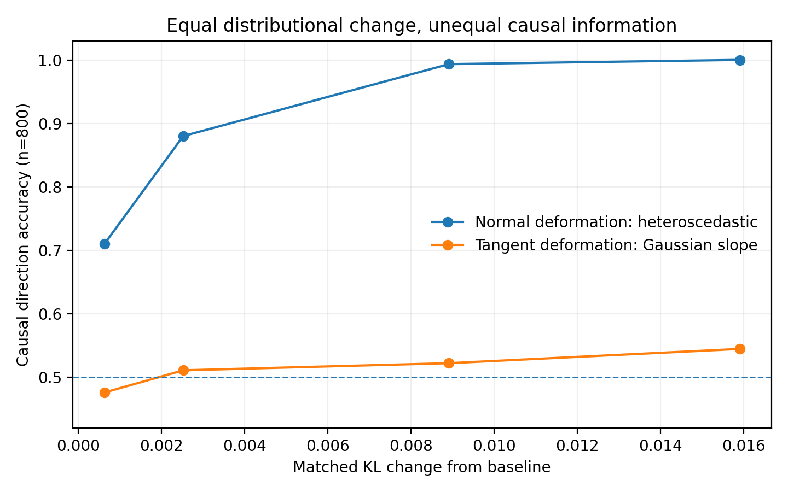

Figure 7. CG-003 matched-KL comparison at n=800. Tangent and normal perturbations have the same divergence from baseline. Tangent paths remain reversible and near chance, while normal departures increasingly reveal direction.

### 5.7 Scaling by accumulated information

The grid uses n∈{100,200,400,800,1600,3200} and α∈{0,0.015,0.025,0.04,0.06,0.08,0.10,0.15,0.20}. Forward and reverse residual-width geometry define score S. Across cells with α>0, its empirical SNR approximately follows:

$$
\mathrm{SNR}(S)\approx0.812\sqrt{nD(P_\alpha,\mathcal R_G)},\qquad R^2=0.9938
$$

Observed accuracy and Φ(SNR) correlate at 0.9972, with mean absolute error 0.0097. For this mechanism and score, the two-dimensional (α,n) surface is closely organized by the accumulated information coordinate nD(P,𝓡G).

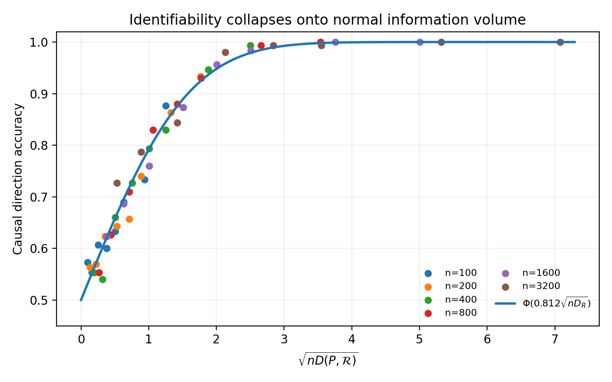

Figure 8. CG-003 accuracies for different α and n approximately collapse onto a common curve against √[nD(P,𝓡G)]. The solid line is Φ(0.812√[nD]).

The fitted scaling places 80%, 90% and 95% direction accuracy at nD(P,𝓡G)≈1.07, 2.49 and 4.10, respectively. These thresholds describe the recorded mechanism family and directional score, combining sample size and departure from reversibility into one accumulated-information coordinate.

## 6 CG-004 Multiple normal directions and nuisance variation

### 6.1 Rationale

CG-003 organizes identifiability along one heteroscedastic normal direction by information distance from a reversible family. CG-004 asks whether several reversal-breaking mechanisms share a local information scale and whether nuisance movement within the reversible set changes the information carried by a fixed normal displacement. It constructs a multidimensional normal subspace.

The hypothesis is that local directional information is described by a normal quadratic form weighted by the Fisher metric.

### 6.2 An exactly decomposable reversal slice

CG-004 uses an analytically tractable direction-neutral set. With swap operator 𝒮(x,y)=(y,x), define:

$$
\mathcal R_{\leftrightarrow}=\{P:\mathcal S_{\#}P=P\}
$$

This is the set of distributions invariant under variable exchange. It supplies a controlled local slice for testing the geometry; the reversal-compatible family in a general causal model may be broader. The baseline P₀ is an exchange-symmetric correlated bivariate Gaussian with ρ=0.65.

Under the Fisher inner product ⟨f,g⟩P=EP[fg], symmetric scores s(x,y)=s(y,x) are tangent and antisymmetric scores q(x,y)=−q(y,x) are normal. Exchange symmetry of P₀ gives:

$$
\mathbb E_0[s(X,Y)q(X,Y)]=0
$$

Tangent–normal orthogonality follows algebraically from exchange parity in this slice.

### 6.3 Four normal modes and tangent nuisance

Four antisymmetric prototypes represent H, conditional-width or heteroscedastic structure; M, nonlinear conditional means; S, residual skew or shape; and T, residual tail width. Gram–Schmidt orthogonalization in the P₀ Fisher inner product, ordered H→M→S→T, gives q=(qH,qM,qS,qT). Numerical checks give E₀[q]=0 and E₀[qqᵀ]=I₄, with exchange error zero to machine precision.

Three exchange-symmetric nuisance scores represent common mean, correlation and radial scale; a fourth condition combines them. Nuisance distributions are generated by:

$$
p_\eta(z)\propto p_0(z)\exp\{\eta^T s(z)\}
$$

For every η, pη remains in 𝓡↔. A unit normal vector u then introduces directional asymmetry:

$$
p_{d,\theta,u,\eta}(z)\propto p_\eta(z)\exp\{d\theta u^Tq(z)\},\qquad d\in\{+1,-1\}
$$

Variable exchange maps d=+1 exactly to d=−1, allowing d to encode the local direction. The experiment tests pure H/M/S/T modes and mixed HM, MS, H−M+S and ALL directions, with θ∈{0.03,0.06,0.10,0.15} and n∈{100,400,1600}.

### 6.4 Nuisance variation reshapes the normal metric

For each tangent regime, define the local normal Fisher metric:

$$
G_N(\eta)=\mathbb E_{p_\eta}[qq^T]
$$

At baseline G_N(0)=I₄. Movement along 𝓡↔ changes the scale and coupling of these initially orthogonal normal coordinates.

Table 7. CG-004. Nuisance variation reshapes the normal metric

| Tangent regime | λmin | λmax | condition no. | max \|off-diag\| |
| --- | --- | --- | --- | --- |
| none | 1.000 | 1.000 | 1.00 | 0.000 |
| common mean | 0.491 | 1.705 | 3.47 | 0.501 |
| correlation | 0.618 | 1.474 | 2.38 | 0.367 |
| radial scale | 0.622 | 2.005 | 3.23 | 0.323 |
| combined | 0.731 | 1.728 | 2.36 | 0.375 |

Source: supplied CG-004 record. Synthetic analysis. Blank cells mean not reported or not applicable; model, unit and adjustment details are specified in the adjacent methods.

Nuisance variation creates no directional preference but changes the information associated with an equal-sized normal parameter displacement. A fixed Euclidean length ‖β‖ consequently gives different information scales across regimes.

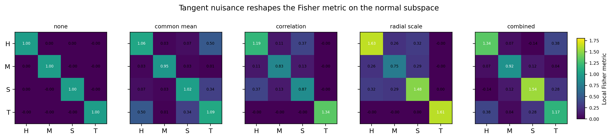

Figure 9. Local normal Fisher matrices across CG-004 tangent regimes. The baseline is orthogonalized to the identity; direction-neutral nuisance movement changes normal-coordinate scaling and coupling.

### 6.5 Exact projection and information scaling

Write ψu(z)=uᵀq(z). The distributions p+ and p− are swapped images with equal normalizing constants. Their forward KL projection onto the exchange-symmetric set is obtained orbit by orbit:

$$
M(z)=\tfrac12[p_+(z)+p_-(z)]
$$

The exact normal distance is:

$$
D_R=D_{\mathrm{KL}}(P_+\Vert M)=\mathbb E_{P_+}[\log2-\log(1+\exp(-2\theta\psi_u))]
$$

It also equals the Jensen–Shannon divergence between the two swapped directional distributions. For small θ:

$$
D_R=\tfrac12\theta^2u^TG_N(\eta)u+O(\theta^4)
$$

For n independent observations, the directional log-likelihood ratio is 2θΣψu. A local central-limit approximation gives:

$$
P(\mathrm{correct})\approx\Phi\!\left(\theta\sqrt{nu^TG_Nu}\right)\approx\Phi\!\left(\sqrt{2nD_R}\right)
$$

The numerical results closely follow this relation. Over θ≤0.10, five tangent regimes, eight normal directions and three sample sizes, the exact-moment SNR versus √(2nD_R) fit has slope 1.00197 and R²=0.999995. Relative to moment-based accuracy, raw θ√n has MAE 0.01310; Fisher-corrected θ√(nI) has MAE 0.000061; √(2nD_R) has MAE 0.000149.

Direct Monte Carlo direction decisions use 160 independent datasets per cell. With binomial sampling variation, empirical accuracy versus Φ(√(2nD_R)) has MAE 0.0179 and correlation 0.9801. Pure and mixed modes follow the same information curve without separating into distinct mechanism families.

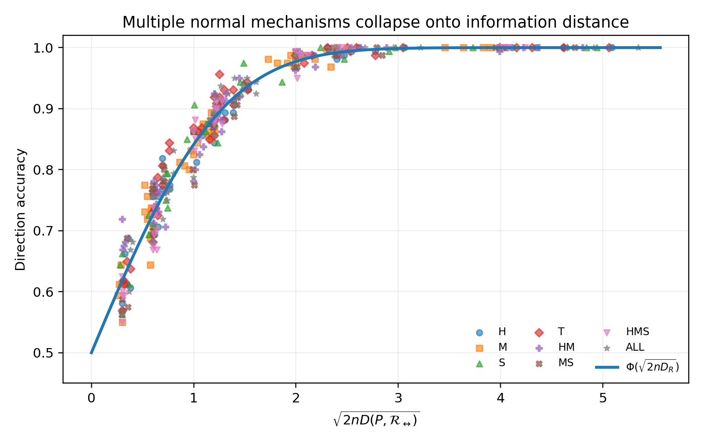

Figure 10. CG-004 direction accuracy for four pure and four mixed normal modes under five tangent regimes, organized by √(2nD_R). The solid curve is Φ(√(2nD_R)).

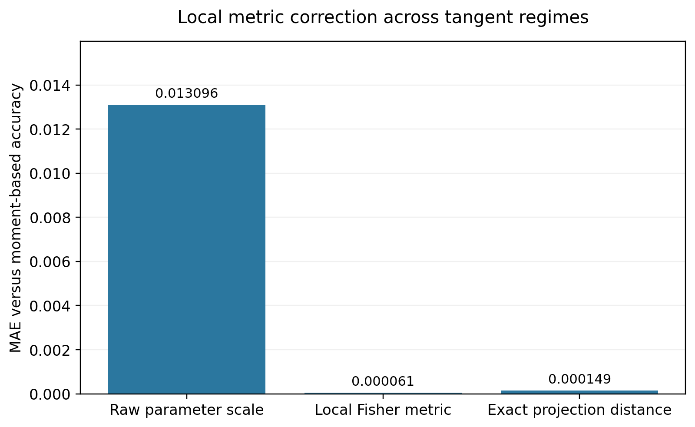

Figure 11. Accuracy-approximation errors across CG-004 regimes. The raw parameter scale θ√n produces systematic mismatch; the local Fisher correction or exact projection distance reduces moment-level error by approximately two orders of magnitude.

### 6.6 Information magnitude and mechanism direction

The scalar D_R describes information magnitude but does not select the appropriate normal readout. At θ=0.08, n=800 and η=0, each pure H/M/S/T mode generates data and each of four readouts predicts direction. Fisher orthogonalization gives the modes the same local information scale.

Matched readouts average 98.91% accuracy; the twelve mismatched combinations average 49.95%. Equal information magnitude does not imply a transferable readout across normal directions.

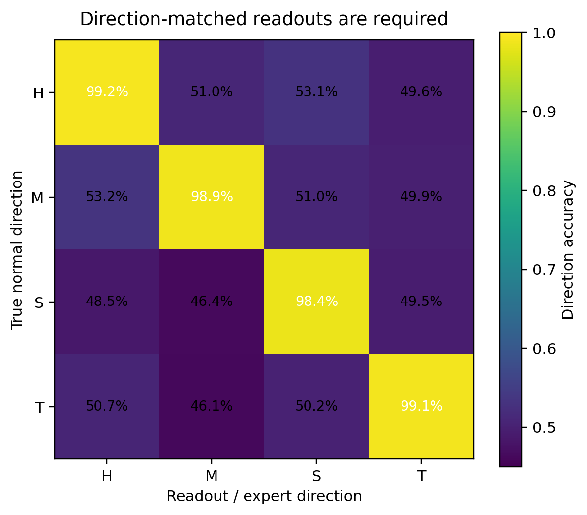

Figure 12. Cross-transfer of CG-004 readouts between normal mechanisms. Diagonal entries use matched directions; off-diagonal entries average approximately chance performance.

As a converse control, θ is set to zero while five nuisance regimes are evaluated by all four readouts. These twenty cells average 49.54% accuracy, with between-cell SD 1.59%. Tangent variation alters the data and metric without introducing an arrow; normal variation supplies directionality that requires an appropriate local decoder.

### 6.7 From a scalar distance to a local tensor

The CG-003 expression ΛC≈nD(P,𝓡) remains a scalar summary of information magnitude. For normal displacement β∈N_P𝓡, the fuller local expression is:

$$
\Lambda_C(\beta;\eta)\approx\frac n2\beta^TG_N(\eta)\beta
$$

G_N(η) describes how normal coordinates are scaled, coupled and combined in the current tangent regime. Recoverable direction requires nonzero normal coordinates with sufficient information norm and a readout suited to their mechanism direction.

This gives the CG-002 router a geometric interpretation: estimate the regime position η, normal coordinates β and local metric G_N(η). An expert decodes a particular normal direction. Soft mixtures can retain uncertainty about coordinates or regime instead of assigning one hard class.

Three quantities are relevant to representation: the direction-neutral tangent state, the normal departure and the metric or operator that interprets it locally. A rich unified network may encode these implicitly; a modular mixture can represent them explicitly. The experiment supports this conditional organization within its constructed family.

CG-004 establishes √(2nD_R) as a detection coordinate in its exchange-symmetric slice. Section 7 tests the corresponding quantities in explicit structural models with non-Gaussianity, heteroscedasticity, nonlinearity and environmental variation.

## 7 CG-005 Curvature and mixed mechanisms in structural models

### 7.1 Rationale

CG-004 establishes a common information scale for small normal perturbations after local metric calibration. CG-005 transfers this analysis from the controlled slice to structural causal models in which several reversal-breaking mechanisms can coexist.

The questions concern the effective radius of the Fisher quadratic approximation, departures caused by mixed mechanisms, and the transfer of a fixed metric between tangent regimes.

### 7.2 Four continuously adjustable mechanisms

The environment E∈{−1,+1} is observed. For each tangent baseline ρ∈{0.20,0.50,0.65,0.85}, define:

$$
X=\beta_E E+U,\qquad U\sim\mathcal N(0,1)
$$

$$
Y=\rho X+\beta_M\tanh(X^2-1)+\sqrt{1-\rho^2}\exp\{\beta_H\tanh X\}\varepsilon_{\beta_S}
$$

The residual distribution is a bounded exponential-tilt family:

$$
p_{\beta_S}(\varepsilon)\propto\phi(\varepsilon)\exp\{\beta_S\tanh(\varepsilon^2-1)\}
$$

M controls nonlinear conditional means; H controls heteroscedastic width; S controls non-Gaussian residual shape; E controls environmental displacement of the upstream variable. At β=0, (X,Y) is a standardized bivariate Gaussian with correlation ρ and exact exchange symmetry. The four coordinates continuously introduce candidate normal departures from this baseline.

For z=(E,X,Y), use 𝒮(E,X,Y)=(E,Y,X). Both pβ(z) and pβ(𝒮z) have explicit densities, giving the single-observation log-likelihood ratio:

$$
\ell_\beta(z)=\log p_\beta(E,X,Y)-\log p_\beta(E,Y,X)
$$

### 7.3 Local normal Fisher geometry

At β=0, let a=∂βℓβ|β=0. The four directional scores are:

$$
a_M=f_M(X)Z_f/s_0-f_M(Y)Z_r/s_0
$$

$$
a_H=f_H(X)(Z_f^2-1)-f_H(Y)(Z_r^2-1)
$$

$$
a_S=q(Z_f)-q(Z_r),\qquad a_E=E(X-Y)
$$

Here s₀=√(1−ρ²), Z_f=(Y−ρX)/s₀, Z_r=(X−ρY)/s₀, f_M(x)=tanh(x²−1), f_H(x)=tanh x and q(z)=tanh(z²−1). Define:

$$
G(\rho)=\mathbb E_0[aa^T]
$$

Changing ρ moves within the reversible linear-Gaussian family and therefore acts as tangent variation. The resulting G(ρ) changes substantially:

Table 8. CG-005. Local normal Fisher geometry

| ρ | λmin | λmax | condition no. | max \|off-diag\| |
| --- | --- | --- | --- | --- |
| 0.20 | 0.296 | 2.466 | 8.33 | 0.827 |
| 0.50 | 0.583 | 2.510 | 4.31 | 0.311 |
| 0.65 | 0.514 | 2.305 | 4.49 | 0.166 |
| 0.85 | 0.274 | 3.917 | 14.28 | 1.146 |

Source: supplied CG-005 record. Synthetic analysis. Blank cells mean not reported or not applicable; model, unit and adjustment details are specified in the adjacent methods.

The explicit structural models reproduce the effect found in CG-004: changing only the direction-neutral Gaussian baseline changes the scales and couplings of the same reversal-breaking coordinates.

### 7.4 Fisher normalization and finite-radius departure

Each raw direction d is normalized by the current metric so that different mechanisms start at the same local information level:

$$
\beta(r,d,\rho)=\frac{rd}{\sqrt{d^TG(\rho)d}}
$$

As r approaches zero, every normalized direction has the same second-order Jensen–Shannon divergence:

$$
D_{\mathrm{JS}}(P_\beta,\mathcal S_{\#}P_\beta)=r^2/8+\text{higher-order terms}
$$

Four pure directions, M/H/S/E, and six mixtures, MH, MS, HE, MHS, ALL and CONFLICT, are tested. Deterministic 64×64 Gauss–Hermite quadrature integrates expectations over X and residuals. The reported divergences therefore avoid Monte Carlo sampling fluctuation.

Table 9. CG-005. Fisher normalization and finite-radius departure

| Fisher radius r | mean exact/quadratic | range | mean Chernoff/JS |
| --- | --- | --- | --- |
| 0.08 | 0.999 | 0.955–1.053 | 1.002 |
| 0.16 | 0.995 | 0.912–1.100 | 1.007 |
| 0.28 | 0.981 | 0.847–1.146 | 1.021 |
| 0.42 | 0.958 | 0.774–1.162 | 1.043 |
| 0.60 | 0.920 | 0.688–1.137 | 1.080 |
| 0.82 | 0.868 | 0.599–1.073 | 1.133 |

Source: supplied CG-005 record. Synthetic analysis. Blank cells mean not reported or not applicable; model, unit and adjustment details are specified in the adjacent methods.

At r=0.08, ten mechanism directions across four tangent regimes closely follow the quadratic approximation. By r=0.82, equal local radii correspond to different exact information values. H, MH, MS and several broader mixtures show marked curvature; pure E and S remain closer to quadratic over this range. The common local scale has a finite domain of accuracy.

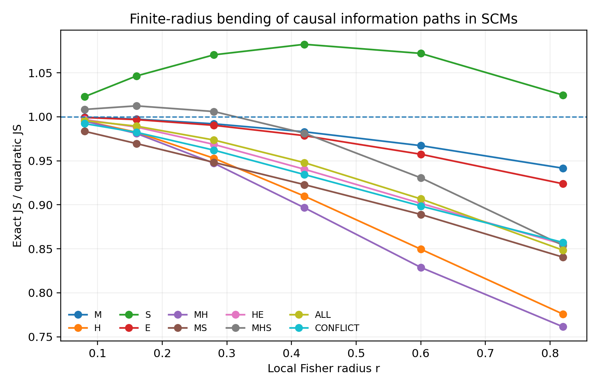

Figure 13. Exact JS divided by the local Fisher quadratic approximation in CG-005 structural models. Paths meet near the reversible baseline and separate as normalized radius increases.

### 7.5 Scaling of the quadratic remainder

Averaging |D_JS−r²/8| over forty structural-model paths at each radius, then fitting on logarithmic scales for r≤0.42, gives:

$$
\operatorname{mean}|D_{\mathrm{JS}}-D_{\mathrm{JS}}^{(2)}|\approx0.0245r^{3.18}
$$

The fitted exponent emerges after removing the Fisher second-order contribution. In information geometry, third-order divergence terms relate to statistical connections and Amari–Chentsov-type tensors [8]. This experiment measures a systematic remainder with approximately cubic scaling; it does not estimate the full third-order tensor. Local cubic quantities are examined in CG-006.

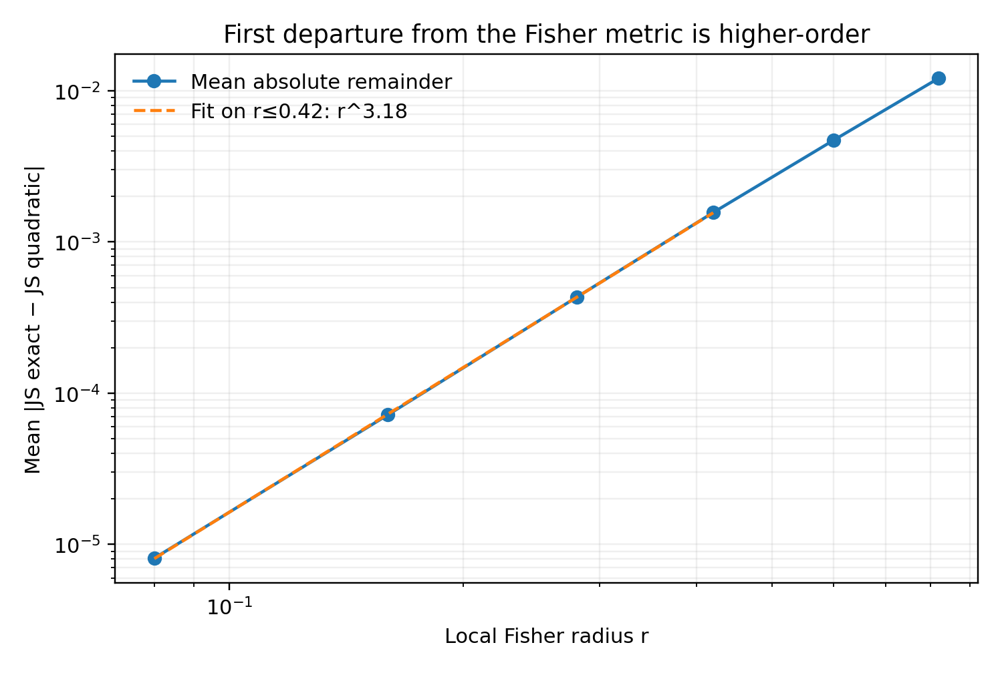

Figure 14. Mean CG-005 remainder after subtracting the quadratic approximation. The fitted power-law exponent is 3.18 over r≤0.42.

### 7.6 Higher-order synergy and cancellation

Subtracting the sum of single-mechanism divergences from a mixed-mechanism divergence would also count second-order Fisher cross-terms. The corrected interaction is therefore defined as:

$$
I_{\mathrm{HO}}=\left[D_{\mathrm{mix}}-\sum_j D_j\right]-\left[D_{\mathrm{mix}}^{(2)}-\sum_jD_j^{(2)}\right]
$$

The second bracket removes all quadratic cross-terms in βᵀGβ. The remaining I_HO measures finite-radius interactions beyond the local quadratic tensor, which grow with radius.

Table 10. CG-005. Higher-order synergy and cancellation

| r | mean I_HO / D_mix | range |
| --- | --- | --- |
| 0.16 | −1.1% | −9.2% to +9.7% |
| 0.28 | −2.2% | −16.5% to +15.6% |
| 0.42 | −3.5% | −25.3% to +20.5% |
| 0.60 | −5.1% | −36.5% to +26.4% |
| 0.82 | −6.9% | −48.4% to +52.4% |

Source: supplied CG-005 record. Synthetic analysis. Blank cells mean not reported or not applicable; model, unit and adjustment details are specified in the adjacent methods.

At r=0.82, the MH path at ρ=0.20 shows approximately +52.4% additional synergy, while the MS path at ρ=0.85 shows approximately −48.4% additional cancellation. Both paths were normalized at the origin to the same Fisher norm but bend differently at finite distance.

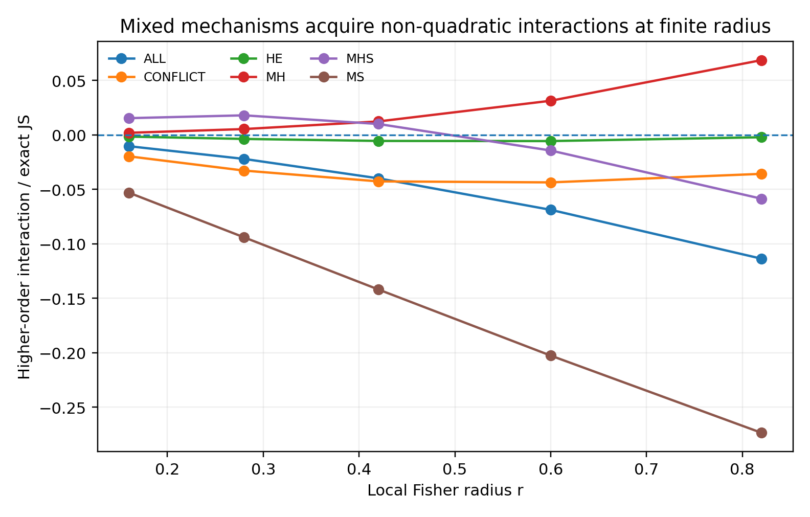

Figure 15. CG-005 mixed-mechanism interactions after removing all second-order Fisher cross-terms. Both synergy and cancellation increase with radius.

### 7.7 Transfer between tangent regimes

For a direct transfer test, all directions are normalized once using G_ref at ρ=0.65 and then evaluated at other ρ values. A fixed metric gives exact-JS MAE 0.001532; using each regime's own G(ρ) reduces it to 0.000145, an approximately 10.5-fold improvement.

Table 11. CG-005. Transfer between tangent regimes

| ρ | frozen-metric MAE | local-metric MAE |
| --- | --- | --- |
| 0.20 | 0.001831 | 0.000101 |
| 0.50 | 0.000945 | 0.000059 |
| 0.65 | 0.000093 | 0.000093 |
| 0.85 | 0.003257 | 0.000329 |

Source: supplied CG-005 record. Synthetic analysis. Lower NLL, MSE and MAE indicate better performance; these metrics are on different scales. Blank cells mean not reported or not applicable; model, unit and adjustment details are specified in the adjacent methods.

The explicit models again show that nuisance movement reshapes the normal metric. A representation that stores β without its tangent state or local metric can assign the wrong information length to the same raw displacement.

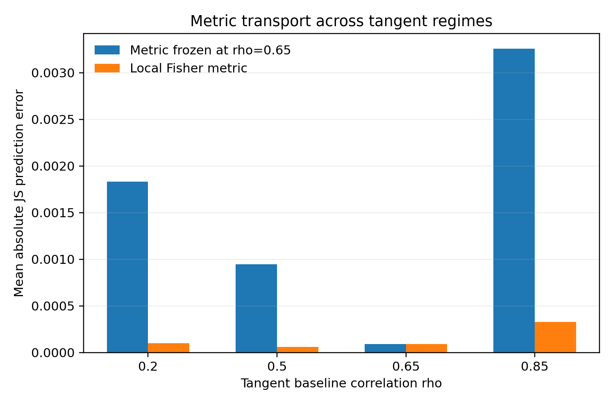

Figure 16. CG-005 metric transfer. Freezing the metric at ρ=0.65 produces systematic error across regimes; local G(ρ) substantially improves the approximation.

### 7.8 Local agreement and task-specific global divergence

The common information scale in CG-003–004 relies on second-order structure near reversibility. CG-005 computes both exact JS and Chernoff information for binary directional testing. Symmetry of P and its swapped image fixes the Chernoff optimum at exponent 1/2:

$$
C(P,\mathcal S_{\#}P)=-\log\int\sqrt{p(z)p(\mathcal Sz)}\,dz=-\log\mathbb E_P\exp(-\ell/2)
$$

Chernoff information gives the optimal asymptotic error exponent for independent-observation Bayesian binary testing [9]. Near reversibility, JS, Chernoff and other smooth divergences share Fisher second-order structure: mean Chernoff/JS is 1.002 at r=0.08. At r=0.82 the mean ratio is 1.133.

Thus ΛC=nD(P,𝓡) provides a local information framework. At finite distance, divergence choice specifies an operational question. JS/KL-type quantities naturally describe projection onto a reversible set; Chernoff information directly addresses the asymptotic error exponent of binary direction testing.

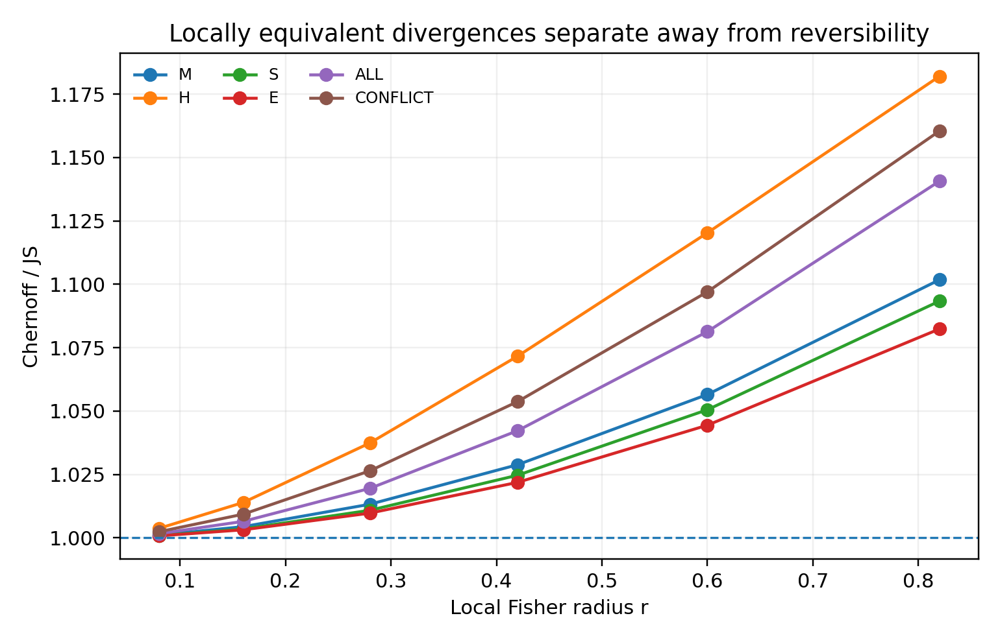

Figure 17. CG-005 Chernoff/JS ratio increases with normalized radius. Locally equivalent information measures separate at finite distance, making task specification necessary for a global distance.

### 7.9 Implications for a causal atlas

The results distinguish three levels: local Fisher quadratic geometry; higher-order curvature and mechanism interactions; and global information quantities tied to particular tasks. Each adds structure beyond the preceding level.

For a broad family of heterogeneous systems, these results motivate an atlas of local charts. Each chart records tangent regime η, normal coordinates β and local metric G_N(η), with transition relations between charts. Beyond one chart's useful radius, the representation can move to a nearby chart, update its metric or retain several charts through a soft mixture.

An expert can represent a local chart or operator, while a router estimates chart position, metric and available normal directions. CG-005 particularly motivates mixtures of local metrics: the metric of a fixed mechanism direction changes with regime, and equal local radii lead to different finite-distance divergences.

## 8 Synthesis of the geometric interpretation

### 8.1 Reversal-compatible families

Let 𝓡 denote observed distributions that admit equally valid forward and reverse explanations within a specified mechanism family. Linear-Gaussian models supply a familiar example. Starting at P₀∈𝓡, consider a small distributional perturbation:

$$
P_\alpha=P_0+\alpha v+\cdots
$$

Its direction relative to 𝓡 matters as well as its size. Tangent movement in T₍P₀₎𝓡 can change the distribution while preserving reversal compatibility. A normal component v⊥ leaves that set and introduces direction-breaking information under the specified assumptions.

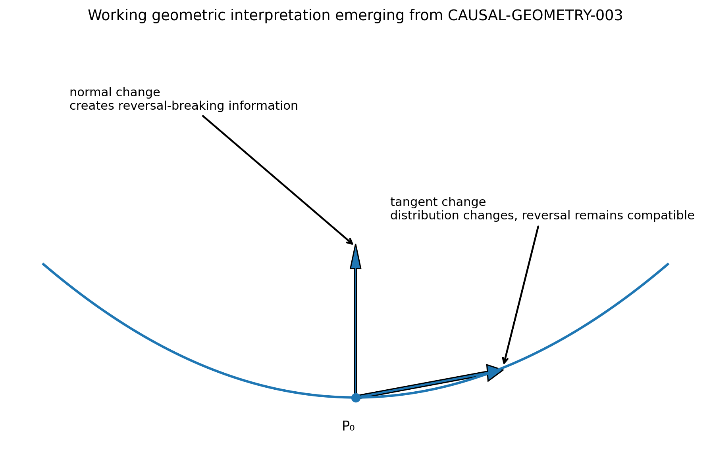

Figure 18. Geometric interpretation of the controlled models. Tangent distributional changes preserve reversal compatibility; normal departures introduce directional asymmetry. The CG-003 matched-KL and information-scaling experiments in Sections 5.5–5.7 test this distinction. Source: Overview, supplied experiment record.

The working formulation is causal information as direction-breaking departure from the specified reversal-compatible family 𝓡.

### 8.2 The inverse square-root sample-size boundary

Near P₀, a small perturbation has a locally quadratic divergence. For KL divergence:

$$
D_{\mathrm{KL}}(P_\alpha\Vert P_0)\approx\tfrac12\alpha^2\mathcal I
$$

Here 𝓘 is local Fisher information along the mechanism direction. With n independent observations, accumulated information is approximately:

$$
D_n\approx\tfrac n2\alpha^2\mathcal I
$$

When nα²𝓘 reaches a fixed magnitude, the directional alternatives become reliably distinguishable, giving:

$$
\alpha_c\sim\frac1{\sqrt{n\mathcal I}}
$$

This explains the approximately constant α₈₀√n in CG-003. The relevant quantities are departure from the causal-reversal equivalence class and the number of independent observations accumulating information about that departure.

### 8.3 Accumulated distance from reversible geometry

A local candidate quantity is:

$$
\Lambda_C=nD(P,\mathcal R),\qquad D(P,\mathcal R)=\inf_{Q\in\mathcal R}D(P,Q)
$$

Near the reversible set, smooth divergences share Fisher second-order structure. CG-005 verifies the corresponding local agreement across four explicit mechanism components. At finite distance, higher-order terms separate: Chernoff/JS increases from 1.002 at r=0.08 to 1.133 at r=0.82. Global use of ΛC therefore requires an operational definition of D and, where needed, transition relationships between local charts.

### 8.4 Consequences for model architecture

CG-001–005 motivate the following organization:

$$
D\to G(D)\to P(M\mid G)\to\{\mathcal C_1,\mathcal C_2,\ldots\}\to P(\mathrm{causal\ structure})
$$

G(D) is a data-geometry profile, M a generating mechanism or regime, and 𝒞m a locally appropriate causal operator. The earlier experiments establish mechanism dependence; CG-005 shows that both information length and approximation error also depend on locality. Explicit mixtures can implement an atlas through routing, local operators and metrics, retaining alternative charts near boundaries or mixed regimes. A sufficiently rich unified model could represent the same conditional structure internally.

The functional contribution of routing is the correct association of geometry with a causal operator. In CG-002, shuffling that association returns performance to chance even though the data, statistic and expert rules are retained.

### 8.5 Relation to established identification methods

This perspective connects LiNGAM's non-Gaussian structure, additive-noise independence, invariant causal prediction's stable mechanisms and heterogeneous/nonstationary discovery's changing distributions as different sources of reversal-breaking information [1–3,6]. Nonlinear ICA with auxiliary variables likewise illustrates how additional temporal, environmental or other structure can alter identifiability [5].

Three points follow from the recorded experiments: a statistic's sign interpretation can depend on mechanism; finite-sample identification can be treated as detection of a directional geometric signal; and the common Fisher description is local, with higher-order interactions and task-dependent divergences emerging at finite distance.

### 8.6 Distance after projection

The matched-KL controls make ΛC directly testable in the CG-003 family. Divergence from a fixed baseline counts both tangent movement and normal departure. Directional information in this construction is associated with the normal component, so the useful operation is to project relative to reversible geometry and then accumulate the remaining information.

Write a small perturbation near P₀∈𝓡 as v=v∥+v⊥, with v∥∈T_P₀𝓡 and v⊥ in the Fisher-orthogonal normal space. The local working form is:

$$
D(P,\mathcal R)\approx\tfrac12\langle v_\perp,v_\perp\rangle_F,\qquad\Lambda_C\approx\tfrac n2\langle v_\perp,v_\perp\rangle_F
$$

The slope perturbation is tangent: it can have nonzero divergence from P₀ while D(Pδ,𝓡G)=0. The heteroscedastic perturbation has zero first-order covariance change at α=0 and introduces normal statistical structure with local Fisher information 0.788589. Equal total KL divergence consequently produces different direction-identification performance on the two paths.

This also connects CG-001 and CG-002: different mechanisms supply different normal directions. A geometry-conditioned operator identifies the relevant reversible regime and departure direction before interpreting the directional measurement.

For representation learning, the proposed objective is to distinguish tangent from normal variation and permit the local metric to change with tangent state. Preserving variance texture, higher-order shape, environmental dependence and mechanism coordinates supplies the information needed for local causal reading and for investigating transitions beyond one chart.

## 9 CG-006 Causal atlas, connection proxy and geometry-first triage

### 9.1 From a single origin to an atlas

CG-005 showed that the Fisher metric at the origin provides a common scale within a sufficiently small neighbourhood. At finite radius, however, the SCM exhibits an approximately cubic remainder, synergy or antagonism between mechanisms, and metric changes across tangent regimes. CG-006 therefore tests whether multiple finite-distance centres, each describing a local neighbourhood and joined by soft transitions, can extend the local account of causal information to finite radii.

The second objective is practical: causal geometry must eventually operate on observed data with unknown generating equations. A geometry-first triage branch takes only raw X/Y and, optionally, environment labels E. It characterises geometry, assesses the plausible identifiability regime and the strength of direction evidence relative to reversible-region noise, and can return unresolved.

### 9.2 Atlas construction multiple local charts

The four-dimensional explicit SCM parameter space from CG-005 is evaluated at tangent regimes ρ = 0.35, 0.65 and 0.85. The origin Fisher tensor G(ρ) whitens the normal coordinates: x = Lᵀβ, with ‖x‖ defining the local Fisher radius. Training and test locations are sampled inside the four-dimensional ball 0 < r ≤ 0.90.

Each regime uses 24 K-means chart centres. A chart fits a quadratic or cubic local polynomial jet to exact reversal JS in whitened local coordinates, rather than memorising mechanism labels. Prediction softly weights the three nearest charts by local distance. Comparators are a single-origin Fisher quadratic, a single-origin cubic jet, a quadratic atlas and a cubic atlas.

The cubic jet is a computational proxy for a statistical connection or third-order correction: it measures the first local nonlinear structure beyond the quadratic Fisher term. These coefficients have not been uniquely identified with coordinate components of a particular classical α/β connection.

Table 12. CG-006. CG-006 causal-atlas reconstruction error. All methods predict the same exact swap-direction JS divergence; they differ in the use of one origin or multiple local charts and in polynomial order.

| Representation | Mean MAE for exact causal JS | Gain vs origin quadratic |
| --- | --- | --- |
| Single-origin quadratic | 0.004690 | 1.00× |
| Single-origin cubic | 0.002716 | 1.73× |
| Atlas quadratic | 0.000855 | 5.49× |
| Atlas cubic | 0.000355 | 13.20× |

Source: supplied CG-006 record. Synthetic analysis. Lower NLL, MSE and MAE indicate better performance; these metrics are on different scales. Blank cells mean not reported or not applicable; model, unit and adjustment details are specified in the adjacent methods.

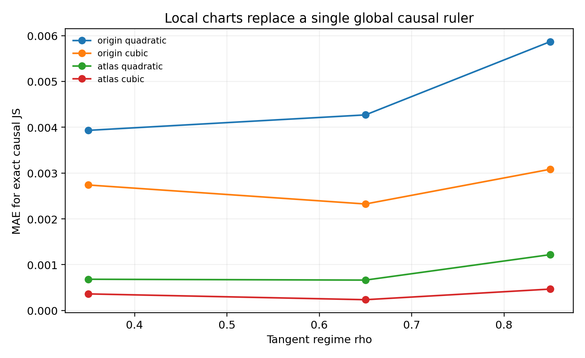

Figure 19. Reconstruction error for exact causal JS across three tangent regimes. Local charts outperform a fixed origin metric; cubic terms further reduce error in each regime. Source: CG-006, synthetic experiment.

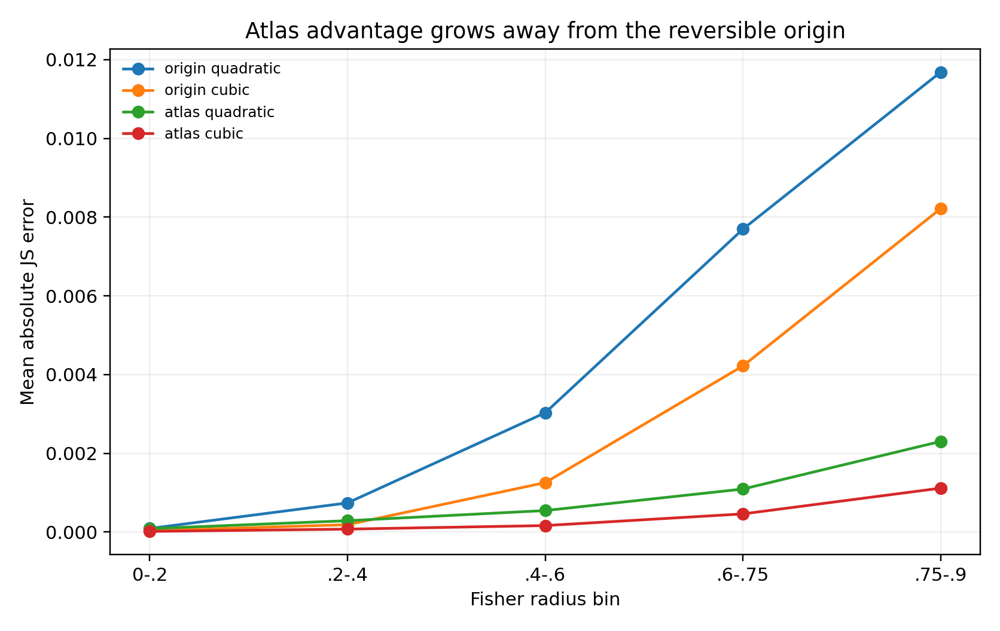

Figure 20. Atlas performance as a function of Fisher radius. At r = 0.75–0.90, mean absolute error is approximately 0.01169 for the origin quadratic and 0.00111 for the cubic atlas. Source: CG-006, synthetic experiment.

### 9.3 Local charts at finite radius

Averaging across ρ, MAE is 0.004690 for the origin quadratic, 0.002716 for the origin cubic, 0.000855 for the quadratic atlas and 0.000355 for the cubic atlas. The atlas models improve on the origin quadratic by approximately 5.49× and 13.20×; the cubic atlas improves on the quadratic atlas by approximately 2.41×.

Near the origin, using training radii r ≤ 0.36, fitting the quadratic Fisher remainder with a cubic local jet improves MAE by approximately 4.39×, 5.04× and 4.93× across the three regimes. This directly supports the approximately r³ remainder in CG-005: the first higher-order term absorbs substantial local structure beyond the metric.

The atlas uses locality rather than removing it. Below r = 0.2, both the origin quadratic and quadratic atlas are already accurate. At r = 0.6–0.9, the origin approximation deteriorates, while multiple charts express each problem as a small displacement from a nearby centre. This explains the advantage of an atlas in this curved causal space.

### 9.4 A geometry-first causal triage prototype

The prototype does not access true SCM parameters or mechanism labels. For variables displayed in arbitrary order as A and B, it fits both A→B and B→A. Its directional profile includes residual conditional-mean dependence, residual-fibre width variation, dependence between input and |residual| or residual², residual skewness and kurtosis, nonlinear regression gain, cross-environment changes in mechanism coefficients and residual variance, and normalised prediction error. Direction-wise minima, maxima and absolute gaps, together with marginal shape/change features, enter a direction-invariant soft router.

The router estimates membership in REV, ANM, heteroscedastic, non-Gaussian, environment-shift and post-nonlinear charts. Within-chart operators read the directional gaps, and their probabilities are mixed using the router posterior. The REV chart is an explicit abstention channel, allowing the output to indicate proximity to a reversal-compatible region.

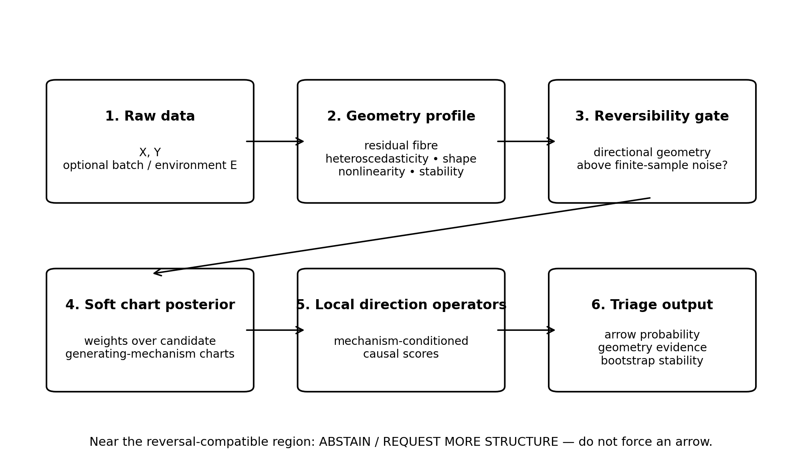

Figure 21. Geometry-first triage workflow: construct a data-geometry profile, assess reversibility and chart membership, combine directional readouts, and report geometric evidence with resampling stability. Source: CG-006, synthetic experiment.

Table 13. CG-006. Initial geometry-triage dictionary. Feature patterns inform the chart/router; their directional meaning is interpreted by a local operator. No individual feature is equated with causality.

| Observed geometry | Initial interpretation | Candidate operator or action |
| --- | --- | --- |
| Residual mean dependence | Greater conditional-mean residual independence in one direction | ANM / nonlinear mean |
| Residual width / \|residual\| dependence | Input-dependent conditional-noise width | heteroscedastic mechanisms |
| Residual skew / kurtosis | Independent residuals and higher-order marginal shape | non-Gaussian / LiNGAM-like |
| Nonlinear gain | Linear-model inadequacy and conditional-mean curvature | nonlinear / post-nonlinear |
| Cross-environment coefficient stability | Stability of P(Y\|X) across batches | environment / change geometry |
| Cross-environment residual variance | Stability of mechanism noise across environments | environment / change geometry |
| Symmetric reversibility profile | Both directions compatible with a reversible chart | abstain / request more structure |

Source: supplied CG-006 record. Synthetic analysis. Blank cells mean not reported or not applicable; model, unit and adjustment details are specified in the adjacent methods.

Table 14. CG-006. A geometry-first causal triage prototype

| Test set | Method | Direction accuracy | Coverage | REV abstain |
| --- | --- | --- | --- | --- |
| validation | unified_linear | 80.4% |  |  |
| validation | unified_nonlinear | 89.1% |  |  |
| validation | soft_geometry_atlas | 89.9% |  |  |
| validation | atlas_selective_p80 | 97.7% | 63.0% | 95.5% |
| external_pure | unified_linear | 83.1% |  |  |
| external_pure | unified_nonlinear | 92.4% |  |  |
| external_pure | soft_geometry_atlas | 94.7% |  |  |
| external_pure | atlas_selective_p80 | 98.8% | 75.1% | 100.0% |
| external_mixed | unified_linear | 98.9% |  |  |
| external_mixed | unified_nonlinear | 100.0% |  |  |
| external_mixed | soft_geometry_atlas | 100.0% |  |  |
| external_mixed | atlas_selective_p80 | 100.0% | 97.8% |  |

Source: supplied CG-006 record. Synthetic analysis. Higher AUC/accuracy indicates better discrimination. Blank cells mean not reported or not applicable; model, unit and adjustment details are specified in the adjacent methods.

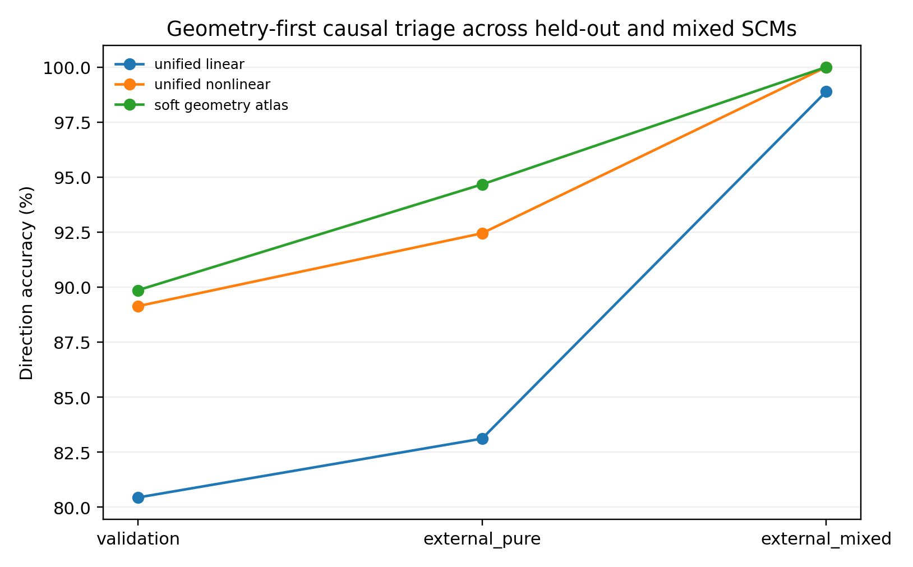

Figure 22. Direction accuracy on held-out and previously unseen mixed SCMs. The soft atlas reaches 94.7% on held-out pure SCMs; the strongest models approach saturation on the tested mixed mechanisms. Source: CG-006, synthetic experiment.

### 9.5 Assessing whether a direction can be called

On independent held-out pure SCMs with parameter ranges different from calibration, accuracy is 94.67% for the soft atlas, 92.44% for the unified nonlinear learner and 83.11% for the unified linear model. The atlas and nonlinear baseline both reach 100% on mixed mechanisms absent from the router's training categories. These mixtures have strong directional geometry; the result tests robustness to the specified combinations, not arbitrary unseen SCMs.

On held-out pure SCMs, requiring P(cause-left) ≥0.80 or ≤0.20 and P(reversible) <0.40 yields 98.82% accuracy at 75.11% nonreversible coverage. All external REV datasets receive abstention in this point-estimate benchmark. Pooling external nonreversible datasets gives 99.22% selective accuracy at 81.59% coverage. The prototype is therefore best interpreted as a triage tool, rather than a complete DAG estimator for every dataset.

Held-out HET, ENV, NG and MIX families each reach 100% point-estimate accuracy; ANM reaches 88.9% and PNL 84.4%. A geometry profile thus informs both the proposed direction and the conditions under which it is credible.

### 9.6 Bootstrap stability and abstention

New external datasets undergo 10 row-bootstrap replicates, each recomputing all geometry, router posteriors and directional probabilities. A stable call requires at least 80% of replicates to give the same high-confidence direction. Stable unresolved status requires at least 80% to fail the directional gate.

Table 15. CG-006. Bootstrap stability and abstention

| Family | Datasets with stable direction | Datasets stably unresolved |
| --- | --- | --- |
| ANM | 0.0% | 66.7% |
| ENV | 100.0% | 0.0% |
| HET | 100.0% | 0.0% |
| MIX | 100.0% | 0.0% |
| NG | 66.7% | 0.0% |
| PNL | 0.0% | 66.7% |
| REV | 0.0% | 66.7% |

Source: supplied CG-006 record. Synthetic analysis. Blank cells mean not reported or not applicable; model, unit and adjustment details are specified in the adjacent methods.

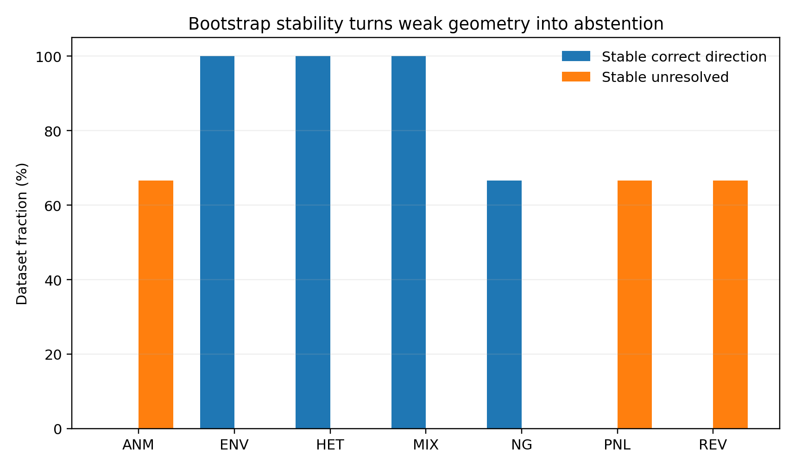

Figure 23. Bootstrap stability and abstention in the synthetic pilot. HET, ENV and MIX yield stable directions; ANM, PNL and REV more often yield stable unresolved status. Source: CG-006, synthetic experiment.

The external point benchmark abstained on all REV datasets, but only 2/3 of the REV datasets in the bootstrap pilot were stably unresolved; the remaining dataset fluctuated across resamples. ANM and PNL showed similar instability. Practical output should therefore include directional probability, reversibility probability, bootstrap stability and regime posterior.

### 9.7 Interpretation of the causal atlas

The two branches address different scales of the same framework. CG-006A uses local charts to reconstruct finite-radius causal information within a specified generating space: a metric/connection problem. CG-006B infers chart membership and departure from reversal compatibility from raw data: a chart-recognition/triage problem.

An experimental chart comprises a geometry fingerprint, normal mechanism coordinates, local metric, higher-order jet, directional operator and validity radius. Soft chart posteriors express local explanatory weights; transitions describe movement between coordinates. Reversibility and bootstrap analyses quantify the available directional resolution.

CG-006B remains preliminary triage calibrated on synthetic systems. Its supported purpose is to assess whether directional asymmetry is repeatable, which generating geometry it resembles, and whether its strength and stability justify formal causal analysis.

## 10 A practical interface from geometry to causal analysis

### 10.1 Recommended analytical sequence

First construct a geometry profile. Fit flexible conditional models in both candidate directions and retain residual mean dependence, conditional-width/fibre geometry, higher-order residual shape, nonlinear gain, environment/batch stability and sensitivity to measurement noise. Add change/response geometry when temporal order, repeated measurements or interventions are available. This profile informs the use of PC, GES, LiNGAM or other causal learners.

Second apply a reversibility/identifiability gate. The question is whether normal information relative to a candidate reversal-compatible geometry exceeds finite-sample noise, rather than whether association exists. Directional gaps, bootstrap stability and calibrated reversible-chart posteriors provide operational approximations. The quantity nD(P,𝓡), or a learned surrogate, is a theoretical target for a more explicit gate.

Third perform geometry-conditioned orientation. The router supplies chart posteriors; local operators interpret the same directional statistics and combine them softly. Diffuse chart membership, unstable bootstrap results or high reversibility probability warrant unresolved status. State which additional evidence could help: more observations, another environment, temporal ordering, a natural experiment or an intervention.

Fourth use triage to inform formal causal analysis and study design. Strong heteroscedastic fibres motivate conditional-scale models; cross-environment invariance motivates multi-environment methods; non-Gaussian independent residuals motivate ICA/LiNGAM-like methods. Near reversal compatibility, additional environments or interventions may be more informative than greater model complexity on identically distributed data.

### 10.2 Standard output a geometry card

For each candidate pair or variable group, report: candidate-direction probability; reversibility probability; separate shape/change/response evidence vectors; soft regime/chart posterior; bootstrap stability; directional-call or unresolved status; and the type of additional observation expected to be informative. The card connects each preliminary arrow to the data conditions supporting it.

### 10.3 Interfaces to causal transmission and variable decomposition

CG-001–008 address distinguishability through theory and external real-data tests. CG-009 studies data features of causal transmission, calculating response geometry in Sachs intervention environments and distinguishing targets, direct children, more distant descendants and nondescendants.

Variable decomposition asks which coordinates preserve a component's generating role across environments, interventions and time. CG-002–005 suggest retaining enough geometry to estimate tangent state, normal coordinates and local metrics. Beyond a chart's validity radius, a model needs coordinate updates, operator changes or chart mixtures. Early compression can discard heteroscedasticity, local thickness, higher-order shape, environmental dependence and mechanism interactions.

The resulting representation requirements are: tangent/generating regime; normal mechanism coordinates; local metric and higher-order correction; chart-transition uncertainty; and post-intervention propagation geometry.

## 11 Real-data external validation a cross-domain triage pilot

### 11.1 Testing observed systems

The synthetic and explicit-SCM experiments isolate reversal-breaking geometry, local metrics, higher-order correction and atlases. Observed systems introduce unknown mechanisms, mixed variable types, complex tails and outliers, and statistics whose directional interpretation can change across sources. This pilot computes profiles from a public cause–effect benchmark and tests orientation on held-out pairs.

The Tübingen Cause–Effect Pairs benchmark provides observational pairs, reference directions and weights intended to reduce repeated-source bias. The pilot uses strict leave-one-pair-out (LOPO) validation on 18 scalar pairs from diverse sources. Full scalar-pair geometry extraction supports the subsequent pair- and source-grouped analyses.

### 11.2 Design geometry-only model inputs

The 18 pairs cover meteorology, abalone, subsistence income, cars, urinary GAG, geysers, arrhythmia, concrete, liver function, diabetes, seasonal temperature, traffic, indoor/outdoor temperature, UN development indicators, stocks, network traffic, solar radiation and housing rents. Official metadata determine cause/effect columns, which are presented in both orders. Both orientations of a test pair are withheld together, preventing leakage through its mirrored counterpart.

Each direction yields cross-fitted linear and cubic residual MSE, nonlinear gain, input–residual/residual²/|residual| dependence, fibre-variance CV, residual skewness/kurtosis and histogram entropy. Direction-free context comprises association strength, marginal skewness/kurtosis and direction-wise minima, maxima and absolute gaps. A unified linear readout uses directional gaps alone; a conditioned readout permits interactions with the direction-free context. Summaries use official pair weights.

### 11.3 Results on real data

Table 16. External pilot. Results on real data

| Method | Weighted direction accuracy | Coverage | Interpretation |
| --- | --- | --- | --- |
| Unified directional gaps | 61.82% | 100% | Fixed interpretation of all directional evidence |
| Geometry-conditioned | 84.90% | 100% | Context-dependent interpretation of directional evidence |
| Selective, margin ≥ 0.10 | 98.88% | 80.12% | Abstain on low-confidence pairs |
| Selective, margin ≥ 0.20 | 98.86% | 78.78% | Stricter screening |
| Selective, margin ≥ 0.30 | 100.00% | 45.92% | High-confidence pilot subset |

Source: supplied External pilot record. Real-data analysis. Higher AUC/accuracy indicates better discrimination. Blank cells mean not reported or not applicable; model, unit and adjustment details are specified in the adjacent methods.

Weighted LOPO direction accuracy is 61.82% with fixed directional-gap interpretation and 84.90% with geometry conditioning. The need for regime-dependent interpretation observed in CG-002 therefore also appears in these real pairs.

Selective triage labels near-0.5 probabilities unresolved. A margin ≥0.10 yields 98.88% accuracy at 80.12% weighted coverage; margin ≥0.30 yields 100% accuracy on 45.92% of the pilot. These results support preliminary screening on this dataset, not a universal performance estimate for real SCMs.

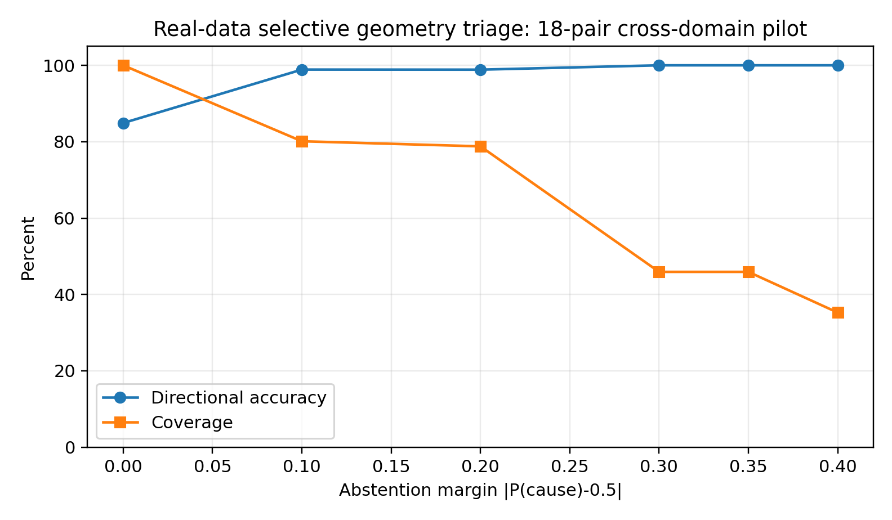

Figure 24. Weighted LOPO selective triage on 18 Tübingen pairs. Increasing the abstention margin improves observed direction accuracy while reducing coverage. Source: External pilot, supplied real-data analysis.

### 11.4 Informative successes and failures

High-confidence correct examples include pair0042 (day of year→temperature), pair0068 (open HTTP connections→bytes sent, with the cause in column 2 in official metadata), pair0018 (age→GAG concentration) and pair0005 (age→abalone length). Multiple residual, shape and scale features provide mutually supporting directional asymmetries.

Pair0065 (two stock returns) has a direction probability near 0.5; pair0019 (current geyser duration→next interval) is also nearly unresolved. Pair0064 (drinking-water access→infant mortality) receives a wrong direction with moderate margin. Model margin therefore requires calibration against resampling, source shift and a richer mechanism atlas.

Individual rules also reverse: greater nonlinear gain does not consistently identify the correct direction, and heteroscedasticity or residual tails can conflict across pairs. A geometry card should report informative axes, their agreement, resampling stability and proximity to reversal compatibility.

### 11.5 Practical implications of the pilot

Compute cross-fitted profiles in both directions, estimate direction-free context, interpret gaps through local operators, and use bootstrap plus source-aware calibration to choose a call or unresolved status. Additional data should address the missing evidence: more samples for unstable scale geometry, new environments for weak change evidence, ordering for temporal questions, or intervention/natural-experiment evidence near reversibility.

A Data Geometry Diagnostic can identify reversal-breaking evidence, select plausible causal operators and flag unresolved pairs before formal discovery. Its role is to guide analysis and data collection, not establish causality by itself.

## 12 CG-007 Source transfer and atlas-support stress tests

### 12.1 Pair and source generalisation

The 18-pair pilot improved weighted accuracy from 61.82% to 84.90%, with selective accuracy near 98.9%. CG-007 changes the holdout unit from pair to source: all pairs from a test source are excluded together. This tests transfer to an unseen generating environment, beyond a previously unseen relationship.

Two independent panels each contain six sources and three scalar pairs per source. Panel A comprises DWD, Abalone, auto-mpg, concrete, liver disorders and Pima Indian diabetes. Panel B comprises UNdata, Moffat, Mahecha, Solly, S. Armagan Tarim and D. Janzing. Across 36 pairs and 12 sources, each outer fold withholds one complete source, including both mirrored orientations of every test pair.

### 12.2 Source-held-out performance

Table 17. CG-007. Source-held-out performance

| Real-source holdout | Directional gaps only | Geometry-conditioned | Absolute gain |
| --- | --- | --- | --- |
| Panel A | 45.40% | 58.62% | +13.22 pp |
| Panel B | 55.79% | 71.01% | +15.22 pp |
| Weighted pooled panels | 51.37% | 65.74% | +14.37 pp |

Source: supplied CG-007 record. Real-data analysis. Blank cells mean not reported or not applicable; model, unit and adjustment details are specified in the adjacent methods.

Directional gaps alone achieve 45.40% and 55.79% in panels A and B; geometry conditioning achieves 58.62% and 71.01%. Officially weighted pooled accuracy rises from 51.37% to 65.74%. Both panels therefore show gains of approximately 13–15 percentage points under source shift.

Source-held-out accuracy is substantially below pair-held-out accuracy. Source transfer additionally requires adequate coverage of the tangent regime, measurement process, sampling design and mechanism mixture. Source shift is thus a substantive part of causal geometry.

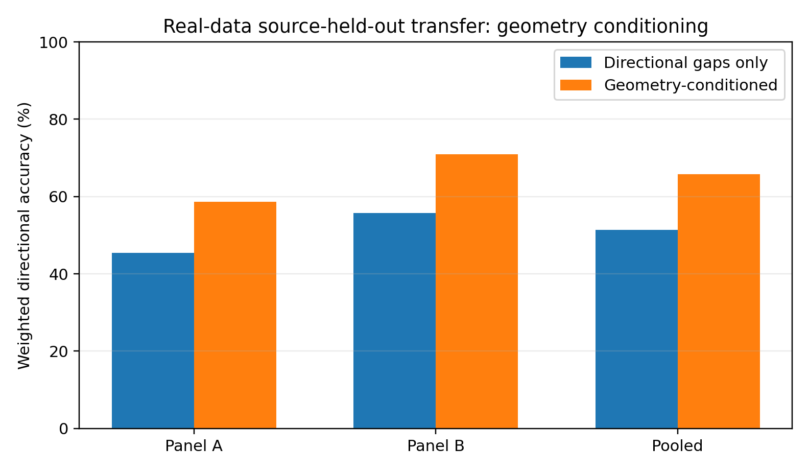

Figure 25. Direction accuracy in two independent real-data source-held-out panels. Conditioning improves both panels, but performance remains below pair-level holdout. Source: CG-007, supplied real-data analysis.

### 12.3 Source heterogeneity

Table 18. CG-007. Source heterogeneity

| Held-out source | Geometry-conditioned accuracy |
| --- | --- |
| DWD | 33.27% |
| Abalone | 100% |
| auto-mpg | 33.33% |
| concrete | 66.67% |
| liver | 66.67% |
| pima | 66.67% |
| UNdata | 100% |
| Moffat | 0% |
| Mahecha | 66.67% |
| Solly | 100% |
| Tarim | 100% |
| D. Janzing | 100% |

Source: supplied CG-007 record. Real-data analysis. Higher AUC/accuracy indicates better discrimination. Blank cells mean not reported or not applicable; model, unit and adjustment details are specified in the adjacent methods.

Source-level conditioned accuracy ranges from 0% for Moffat to 100% for several sources. Marginal distributions, noise, sampling resolution and mechanism mixtures can change the local metric and informative normal directions. This provides an empirical counterpart to the local-chart account in CG-002–006.

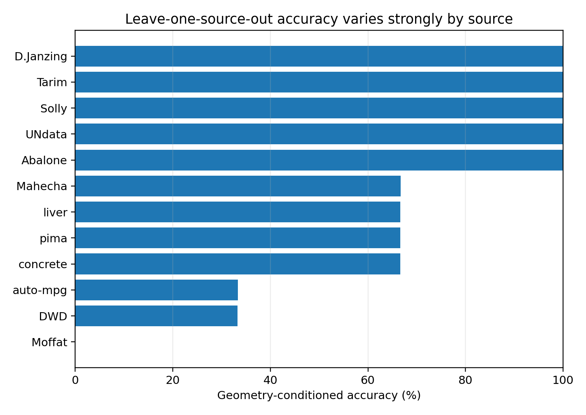

Figure 26. Leave-one-source-out accuracy across 12 real sources. Large heterogeneity motivates explicit source-aware calibration. Source: CG-007, supplied real-data analysis.

### 12.4 Atlas-support gating

A label-free support score uses direction-free geometry. In each outer fold, training sources define a standardised neighbourhood; the 90th percentile of training-pair leave-one-out nearest-neighbour distances is the support threshold. Test pairs are classified as inside or outside support by their distance to the training atlas.

Table 19. CG-007. Atlas-support gating

| Policy | Direction accuracy | Coverage |
| --- | --- | --- |
| Panel A all calls | 58.62% | 100% |
| Panel A：support gate | 62.98% | 85.34% |
| Panel B all calls | 71.01% | 100% |
| Panel B：support gate | 75.15% | 58.33% |
| Panel B：support + margin≥0.10 | 85.81% | 51.08% |

Source: supplied CG-007 record. Real-data analysis. Higher AUC/accuracy indicates better discrimination. Blank cells mean not reported or not applicable; model, unit and adjustment details are specified in the adjacent methods.

The gate raises panel A accuracy from 58.62% to 62.98% at 85.34% coverage and panel B accuracy from 71.01% to 75.15% at 58.33% coverage. In panel B, also requiring margin ≥0.10 yields 85.81% accuracy at 51.08% coverage. Support distance therefore carries useful transport information.

Support is not an error detector. All three DWD pairs lie outside support, with mean standardised distance approximately 12.09 against a training threshold near 1.20, consistent with poor transfer. Only about one third of Moffat pairs are supported and accuracy is 0%. Conversely, all Tarim pairs are unsupported yet 3/3 are correct; all auto-mpg pairs are supported yet accuracy is approximately 33%. Distance measures geometric novelty and coverage, not causal truth.

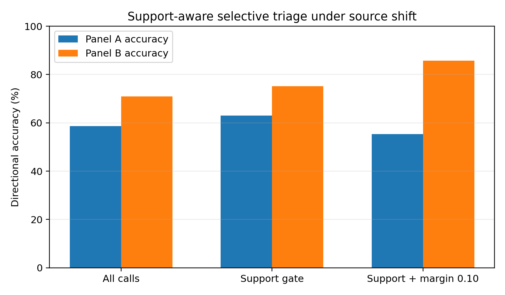

Figure 27. Support-aware selective triage under source shift. Gating improves both panels; adding a margin improves panel B further. The most effective thresholds differ between panels. Source: CG-007, supplied real-data analysis.

### 12.5 Limits of margin-based abstention

Higher margins were more reliable in pair holdout, but this relationship fails under source holdout: increasing panel A's margin threshold reduces selective accuracy. Margin describes within-chart confidence; a new source can produce confident use of an inappropriate chart. Within-chart directional uncertainty and between-chart transport uncertainty require separate treatment.

A nested control chooses margin and support thresholds using only inner source-held-out predictions. With five sources available for inner calibration in panel A, it yields 46.06% accuracy at 58.57% coverage. Transport calibration itself requires enough independent sources; small-source threshold tuning is insufficient.

### 12.6 A source-aware diagnostic

A geometry card should include both within-pair reversal-breaking evidence and transport coordinates: distance to the training atlas, sources represented by neighbouring charts, support for the local metric, and calibration coverage of comparable sources. Directional calls require both forms of evidence to be adequately supported.

The workflow is: raw pairs/batches; geometry profile; reversibility/identifiability gate; atlas-support/source-shift gate; conditioned local operators; bootstrap stability; transport-calibrated confidence; call or unresolved status; and an indication of informative additional data.

The result supports a two-level diagnostic rather than a fixed cross-source accuracy claim. Geometry conditioning can improve orientation, while source shift changes its local interpretation. Atlas coverage and transportability must be assessed before a causal score is interpreted.

## 13 CG-008 Cross-dataset atlas transfer and dual-geometry consensus

### 13.1 Transfer to a distinct experimental system

CG-007 separates pair from source generalisation. CG-008 transfers the diagnostic beyond Tübingen to a system with different generating processes, variable organisation and experimental design, rather than further tuning within one benchmark.

The external system is the Sachs protein-signalling dataset, which measures phosphorylated proteins and phospholipids in single cells under molecular stimulation/intervention [11]. The analysis uses 11 variables, 853 cells in observational condition cd3cd28, and nine files labelled as real experimental conditions in the public mirror. GroundTruth.csv specifies 17 directed direct interactions. Five ICAM2 combination conditions labelled simulated are excluded from the main analysis.

Two separately constructed evidence channels are evaluated. One transfers a Tübingen observational-geometry readout unchanged to Sachs. The other uses Sachs conditional-mechanism changes across its nine environments without Tübingen direction labels. Their agreement is tested as a preliminary orientation signal; separate construction does not guarantee statistically independent errors.

### 13.2 External observational atlas Tübingen to Sachs

Training uses 99 consistently parseable scalar pairs from the CausalDiscoveryToolbox Tübingen resources, with official weights and mirrored orientations. Inputs retain the CG-006–007 schema: cross-fitted linear/cubic errors, nonlinear gain, input–residual/residual²/|residual| dependence, fibre-width variation, residual skewness/kurtosis/entropy, and interactions between directional gaps and direction-free geometry. Sachs edge labels are not used for training or tuning.

Direct transfer correctly orients 12/17 Sachs reference edges, or 70.59%. The gaps-only readout also achieves 12/17: conditioning retains signal but adds no overall accuracy in this cross-dataset test. This is consistent with a shift to a new statistical chart.

Only 3/17 reference edges lie within the Tübingen atlas's 90% nearest-neighbour support region; some standardised support ratios greatly exceed 1. Support distance measures historical coverage. The 70.6% accuracy therefore occurs in a substantially novel geometric space.

### 13.3 Within-Sachs multi-environment change geometry

For each A→B candidate, standardised cubic conditional models are fitted within all nine environments. Readouts include robust MAD drift in coefficients, residual mean/variance shifts and conditional drift within pooled-X quantile bins. The prespecified direction rule favours the conditional mechanism with less cross-environment drift.

Accuracy on 17 direct edges is 47.06% for residual shift, 52.94% for binned conditional drift and 58.82% for their simple combined readout; coefficient drift gives 11/17 = 64.71%, the strongest fixed environment readout here. Distinct mechanism channels should be retained, since a single invariance score can mix directly altered and stable mechanisms.

Across all 55 unordered pairs, coefficient-drift asymmetry distinguishes the 17 direct edges from other pairs with AUC 0.647, compared with 0.352 for observational margin. It provides a candidate-prioritisation signal, but is insufficient for network reconstruction by itself.

Table 20. CG-008. Within-Sachs multi-environment change geometry

| Evidence channel | Task | Observed result | Supported use |
| --- | --- | --- | --- |
| Tübingen observational geometry → Sachs | Orientation of 17 known direct edges | 12/17 = 70.6% | Cross-dataset orientation screening |
| Sachs coefficient-drift change geometry | Orientation of 17 known direct edges | 11/17 = 64.7% | Within-dataset environment evidence |
| Sachs coefficient-drift asymmetry | Direct edge versus other pair | AUC = 0.647 | Relationship prioritisation |
| Observational margin | Direct edge versus other pair | AUC = 0.352 | Unsuitable as a standalone adjacency score |
| Dual-consensus score | Direct edge versus other pair | AUC = 0.552 | Orientation gate rather than adjacency replacement |

Source: supplied CG-008 record. Real-data analysis. Blank cells mean not reported or not applicable; model, unit and adjustment details are specified in the adjacent methods.

### 13.4 Consensus between two geometric channels

The observational and coefficient-drift channels agree on 6/17 direct edges (35.29%): Raf→Mek, PKA→Mek, PKC→Mek, PKA→Erk, PKA→Akt and PKC→P38. All six match the reference directions. Agreement is applied at test time and is not fitted using Sachs ground truth.

external observational geometry  ∩  within-dataset change geometry  →  high-precision orientation subset

Agreement functions as an orientation gate. Across all 55 pairs, the channels agree on 30.91%, including pairs without a direct reference edge. Agreement about A→B does not establish direct adjacency. A consensus score has only 0.552 AUC for edge existence, despite 100% observed orientation accuracy within the six agreeing known edges.

A practical workflow first identifies candidate relationships using multivariate structure, environment asymmetry, domain design or other adjacency evidence, and then applies the two directional channels. Edge existence and orientation require different criteria.

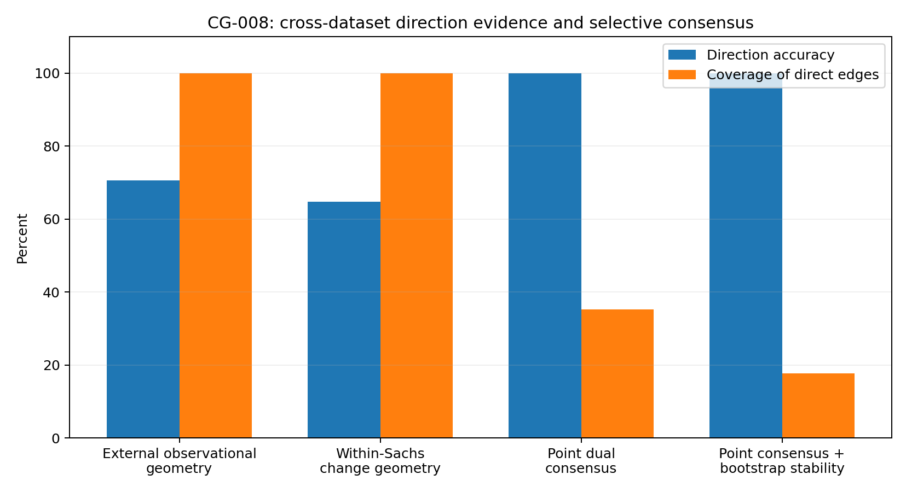

Figure 28. Cross-dataset orientation in CG-008. Point consensus correctly orients 6/17 direct edges (35.3% coverage). Requiring at least 70% bootstrap channel agreement reduces this subset to 3/17.

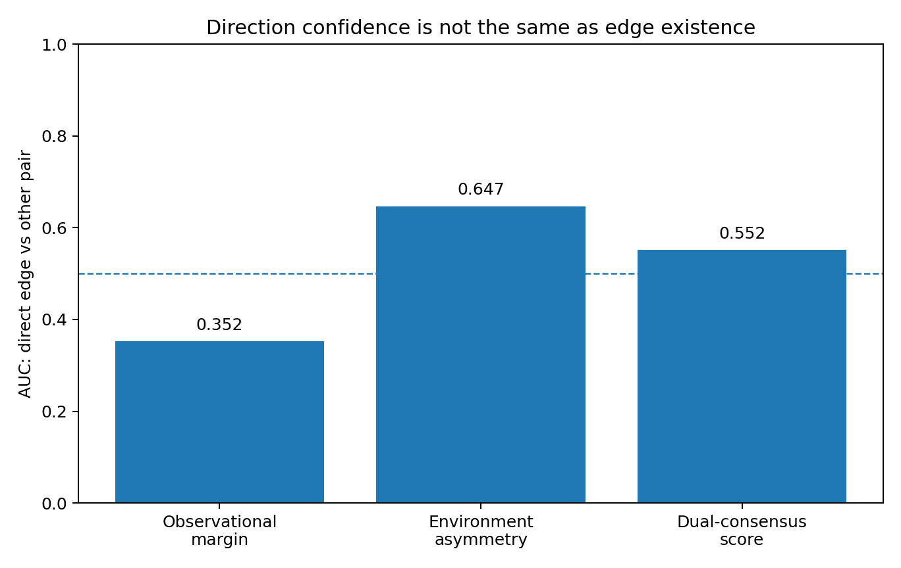

Figure 29. Orientation confidence and adjacency are different tasks. Across 55 Sachs pairs, environment asymmetry gives direct-edge AUC 0.647 and consensus gives 0.552. Source: CG-008, supplied real-data analysis.

### 13.5 Candidate screening across all 55 pairs

The reference graph contains 17 direct-edge pairs, five ancestral pairs connected only by longer paths and 33 pairs without a directed path. The top five consensus-ranked pairs include three direct edges: 60% precision versus a 17/55 = 30.9% base rate. All selected direct edges have correct orientation. The top 10 and top 15 each have 40% direct precision, again with correct directions for their direct edges.

An illustrative label-free threshold of consensus score ≥0.20 selects 6/55 pairs, including four direct edges: 66.7% precision, all four correctly oriented, and 23.5% direct-edge recall. This supports low-coverage prioritisation for review or further experiments in this dataset.

Table 21. CG-008. Candidate screening across all 55 pairs

| Consensus threshold | Selected pairs | Direct precision | Orientation accuracy of selected direct edges | Direct recall |
| --- | --- | --- | --- | --- |
| ≥ 0.02 | 17 | 35.3% | 100% | 35.3% |
| ≥ 0.05 | 15 | 40.0% | 100% | 35.3% |
| ≥ 0.10 | 10 | 40.0% | 100% | 23.5% |
| ≥ 0.15 | 8 | 50.0% | 100% | 23.5% |
| ≥ 0.20 | 6 | 66.7% | 100% | 23.5% |

Source: supplied CG-008 record. Real-data analysis. Higher AUC/accuracy indicates better discrimination. Blank cells mean not reported or not applicable; model, unit and adjustment details are specified in the adjacent methods.

### 13.6 Bootstrap agreement

A 10-replicate bootstrap pilot recomputes both channels using the main geometry parameters. The observational channel resamples cd3cd28 cells; the change channel separately resamples each environment. Ground truth does not enter the agreement gate.

Among the six point-consensus edges, PKC→P38, PKC→Mek and PKA→Mek have agreement rates ≥0.70 and retain correct directions whenever their channels agree. Raf→Mek, PKA→Erk and PKA→Akt have rates approximately 0.60, 0.40 and 0.50, respectively. Point consensus plus agreement ≥0.70 selects 3/17 = 17.65% of direct edges, with 3/3 correct in this pilot.

Plcg→PIP2 exposes a limitation: its channels disagree at the point estimate but agree in 80% of resamples, systematically in the wrong direction. Stability addresses sampling variation; shared mismatch, intervention targeting or chart bias can cause stable errors. Agreement, resampling stability and transport/model support must remain separate outputs.

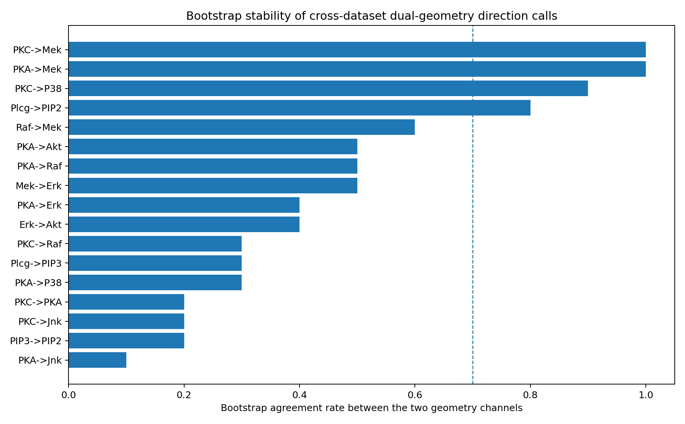

Figure 30. Bootstrap channel-agreement rates for 17 Sachs reference edges, based on 10 replicates. The dashed line marks 0.70. Both unstable point agreements and stable wrong agreements occur. Source: CG-008, supplied real-data analysis.

### 13.7 A diagnostic for applied research

Three tasks remain distinct. Relationship candidacy prioritises pairs, here supported by environment-asymmetry AUC 0.647. Orientation compares external-atlas and local-environment directions. Transport/stability assesses atlas support, resampling agreement and whether the environments directly alter the tested mechanism.

The geometry card records pair-level shape; multi-environment change; external-atlas probability; local-environment direction; channel agreement; bootstrap agreement rate; atlas support/source novelty; relationship priority; Directional or Unresolved status; and informative additional evidence. It supports triage and experimental prioritisation, while multivariate learning, domain constraints and interventions address the final network.

A new dataset supplies its own tangent/change geometry; the existing atlas supplies an external, prior-like local reference. Combining them requires evidence integration rather than assuming global metric transport. External chart experts, dataset-local experts and a consensus/abstention layer connect the operators of CG-002, the local metric of CG-004 and the atlas of CG-006.

### 13.8 Scope of the cross-dataset findings

The test connects 99 Tübingen scalar observational pairs with an 11-variable Sachs network, 17 reference edges and nine real environments. External geometry retains some directional information; local environment geometry provides another directional/candidate channel; their agreement identifies a high-precision, low-coverage subset. Bootstrap separates stable from sampling-sensitive agreement, while also exposing stable shared errors.

## 14 CG-009 Response geometry and causal transmission

### 14.1 From orientation to propagation

CG-001–008 examine identifiability and transfer of orientation rules. CG-009 asks how a known perturbation propagates through a network. Using the Sachs reference network and experimental conditions, it compares the response geometry of targets, direct children, more distant descendants and nondescendants.

The initial expectation of monotonically decreasing amplitude with distance was not supported. Analysis therefore shifted to response support: whether descendants rank higher than nondescendants within an intervention. This change was motivated by the observed results and should be understood as exploratory.

### 14.2 Interventions and reference condition

The reference is cd3cd28. Four conditions with measured targets and reachable measured descendants enter the transmission analysis: G0076→PKC, U0126→Mek/Erk, and supplementary PMA→PKC and β2cAMP→PKA. The first two are targeted inhibitors sharing the CD3/CD28 background; the latter two are activators with different stimulation contexts and retain separate condition-type labels. Akt-inhibitor and LY294002/Akt-axis conditions are excluded from downstream-distance tests because Akt has no measured descendants in the reference graph; they enter response-pattern similarity analysis.

### 14.3 Computing response geometry

For each condition–node pair, concentrations are log-transformed. Location is the difference in log medians, standardised by the average robust scale of the intervention and reference. Scale is |log(IQR_intervention/IQR_reference)|. Shape is RMS distance between fixed quantiles from 5% to 95%, after separate centring and IQR standardisation. Total response is the Euclidean norm of these three components.

To separate propagation from overall intervention strength, each component is rank-normalised across the 11 nodes within an intervention. Pooled AUC asks whether descendants rank systematically higher within their own intervention, rather than which intervention is strongest overall.

### 14.4 Response support without monotonic amplitude decay

Across the four informative conditions, total-response AUC is 0.6878 for descendant versus nondescendant and 0.7092 for direct child versus nondescendant. With 5,000 within-intervention permutations of response-rank/network-position correspondence, reported p-values are 0.0172 and 0.0140. Descendants occupy higher response ranks on average, with a stronger signal for direct children.

This does not mean all descendants are top responders. Mean descendant enrichment among the top three nodes is 0.829, with permutation p = 1.0. The supported pattern is a distributional rank shift, not concentration in a fixed set of the largest peaks.

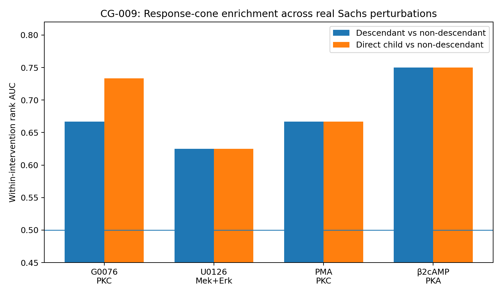

Figure 31. Response-cone enrichment in four real Sachs perturbations. AUC uses within-intervention normalised response ranks; 0.5 denotes random ranking. G0076/U0126 are matched-background inhibitors; PMA/β2cAMP are supplementary activators. Source: CG-009, supplied real-data analysis.

### 14.5 Which response components carry transmission information?

Across four conditions, location gives descendant AUC 0.6865 (p = 0.0112) and child AUC 0.7108 (p = 0.0098). Scale gives 0.6561 (p = 0.0358) and 0.6471 (p = 0.0594); shape gives 0.5344 (p = 0.342) and 0.5817 (p = 0.194). Total-response AUCs are 0.6878 and 0.7092.

Restricting to matched-background G0076 and U0126 preserves this ordering: descendant/child AUCs are 0.6875/0.7576 for location, 0.6193/0.6439 for scale, 0.4943/0.5000 for shape and 0.6648/0.7348 for total response. In these data, location shifts carry the clearest transmission signal, scale adds secondary information, and standardised shape deformation does not provide stable descendant ranking.

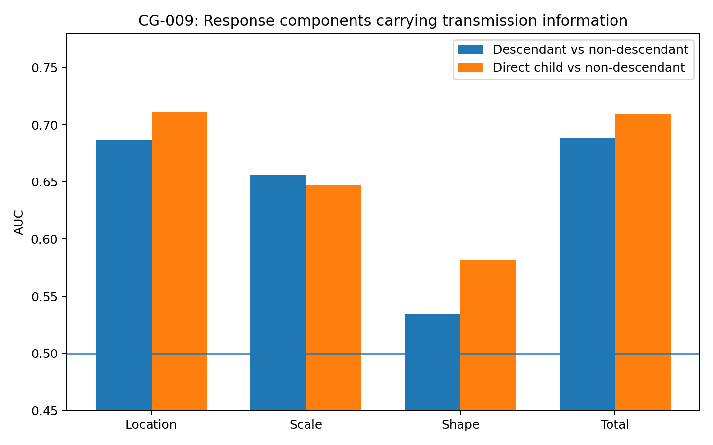

Figure 32. Response-component discrimination in CG-009. Location separates descendants and direct children most strongly, followed by scale; shape alone is near chance. All values derive from within-intervention ranks in the Sachs data.

Table 22. CG-009. CG-009 transmission discrimination by response component.

| Component | Desc AUC | Child AUC | p(desc) | p(child) | Matched-only Desc/Child |
| --- | --- | --- | --- | --- | --- |
| Location | 0.687 | 0.711 | 0.011 | 0.010 | 0.688 / 0.758 |
| Scale | 0.656 | 0.647 | 0.036 | 0.059 | 0.619 / 0.644 |
| Shape | 0.534 | 0.582 | 0.342 | 0.194 | 0.494 / 0.500 |
| Total | 0.688 | 0.709 | 0.014 | 0.010 | 0.665 / 0.735 |

Source: supplied CG-009 record. Real-data analysis. Higher AUC/accuracy indicates better discrimination. Blank cells mean not reported or not applicable; model, unit and adjustment details are specified in the adjacent methods.

Record note: the total-response row retains the component-analysis permutation values (0.0135973 and 0.0097980). The response-cone summary and main prose instead report 0.0171966 and 0.0139972. Both supplied records have the same AUCs; their p-values are not interchangeable. No new permutation run was performed for this edition.

### 14.6 Response vectors and mechanism identity

Across six conditions, absolute response magnitudes form 11-node vectors. Among 15 condition pairs, Akt-inhibitor and LY294002/Akt-axis have the highest cosine similarity, 0.8875. This is a limited indication of similar response support for overlapping pathway perturbations. There are few conditions, and LY294002 concerns the PI3K/PIP3/Akt axis; the result does not establish universal agreement for a shared target.

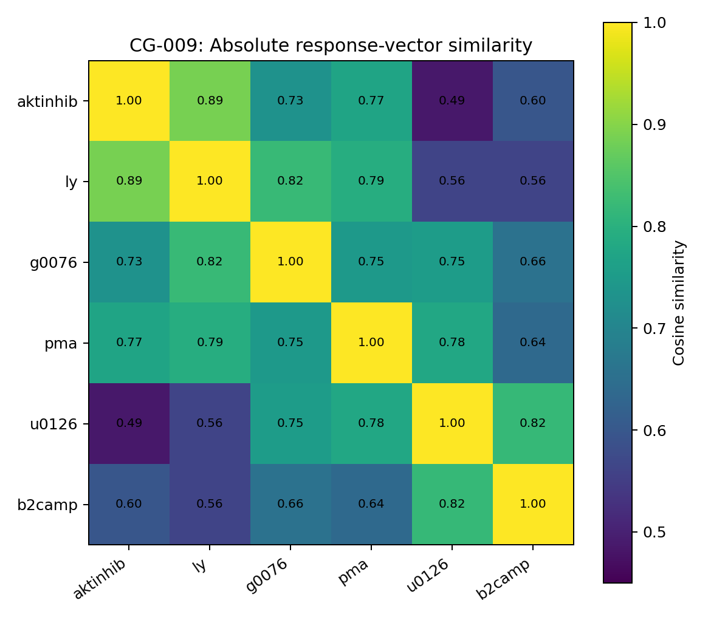

Figure 33. Cosine similarity of absolute response vectors across six Sachs perturbations. Akt-inhibitor and LY/Akt-axis have the largest similarity, approximately 0.887, among 15 pairs. Source: CG-009, supplied real-data analysis.

### 14.7 A data description of causal transmission

Three measurable objects emerge: response support (where descendant ranks shift upward), response composition (whether location, scale or shape carries the shift), and response identity (similarity of multidimensional perturbation patterns). They describe where change propagates, how distributions change and which mechanisms produce similar patterns.

For intervention, natural-experiment or multi-environment studies, a response card can report target-relative graph/candidate distance, node-wise location/scale/shape, within-intervention ranks, descendant-cone enrichment, resampling stability and similarities between intervention response vectors, extending a comparison of outcome means.

Amplitude does not decrease reliably with graph distance; the target need not respond most strongly, and a direct child can respond more. A response field with support, components and mechanism fingerprints is therefore more faithful to these observations than a scalar that decays along every DAG edge.

### 14.8 From response geometry to variable decomposition

CG-009 defines intervention-relative support and location/scale/shape components. Section 15 arranges these into a multi-intervention, multi-node tensor to locate shared variation and local causal-role information.

## 15 CG-010 Variable decomposition, shared response programmes and local causal roles

### 15.1 Compression and causal-role information

Following the response-support result, CG-010 asks whether responses decompose into a few shared programmes and whether geometry alone can distinguish direct children, distant descendants and nondescendants. The reference DAG supplies role labels, not input features.

Strict leave-one-intervention-out validation withholds an entire perturbation. Decompositions and supervised readouts are established on the other five interventions before projecting or classifying the unseen one. This tests intervention transfer rather than interpolation among nodes from the same drug condition.

### 15.2 The 6 × 11 × 3 response tensor

The Sachs reference condition is cd3cd28 (853 cells). Targets follow the public condition manifest: Akt inhibitor→Akt (911 cells), G0076→PKC (723), Psitectorigenin→PIP2 (810), U0126→Mek (799), PMA→PKC (913) and β2cAMP→PKA (707). Each has a measured target.

For each intervention–node pair, the three CG-009 components are computed relative to cd3cd28: robust log-median location shift, absolute log-IQR ratio and standardised quantile-shape distance. The resulting T[e,v,c] has six interventions, 11 nodes and three components. The DAG enters role labelling, not decomposition features.

Graph distance from the intervention target assigns the 66 units to six targets, 17 direct children, five distant descendants and 38 nondescendants. Supervised evaluation excludes targets, which are normally known from experimental design, and asks about the remaining nodes.

For SVD/NMF, components are divided by their full-tensor RMS to prevent location dominating purely by scale: 1.9023 for location, 0.4148 for scale and 0.3115 for shape. Supervised models use original components, standardised within each training fold. The full-tensor normalisation is a preprocessing feature of the reported decomposition analysis.

### 15.3 Shared low-rank response structure

Unfolding the normalised tensor into a 6 × 33 intervention-by-(node×component) matrix, uncentred SVD explains 70.88% of total energy in one dimension, 84.55% in two, 92.29% in three and 97.05% in four. A small number of global programmes describes much of the overall response variation.

Table 23. CG-010. Low-rank decomposition of the response tensor. SVD reports cumulative energy; NMF reports relative Frobenius reconstruction error.

| Decomposition | 1 component | 2 components | 3 components | 4 components |
| --- | --- | --- | --- | --- |
| SVD cumulative energy | 70.9% | 84.6% | 92.3% | 97.0% |
| NMF relative error | 0.540 | 0.393 | 0.280 | 0.177 |

Source: supplied CG-010 record. Real-data analysis. Blank cells mean not reported or not applicable; model, unit and adjustment details are specified in the adjacent methods.

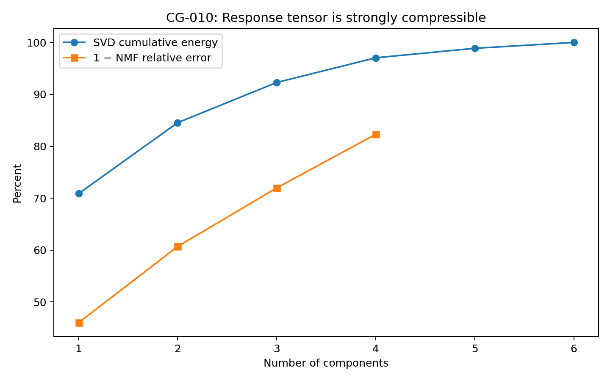

Figure 34. Response-tensor compression. Three SVD dimensions capture 92.3% of energy; NMF reconstruction error decreases as the number of components increases. Source: CG-010, supplied real-data analysis.

NMF gives complementary nonnegative structure. With k = 3, relative error is 0.280. Factor 1 is dominated by location responses, especially PKA, Mek, Plcg, Akt and P38, with greatest intervention weight for G0076. Factor 2 emphasises Jnk scale/shape, PKC shape/scale and PKA scale, with high weights for PMA, Akt-inhibitor and U0126. Factor 3 is dominated by β2cAMP and highlights PKC shape, P38 scale and Mek location. These factors are not predefined pathway labels or established biological pathway entities.

### 15.4 Learning protocol and feature comparisons

Binary classification compares 22 downstream nodes (children plus distant descendants) with 38 nondescendants. Three-class classification distinguishes 17 children, five distant descendants and 38 nondescendants. Every evaluation leaves out all nodes of one intervention. L2-regularised logistic/softmax readouts use class balancing within training folds.

Six feature sets are compared: total magnitude; raw location/scale/shape; raw components plus within-intervention ranks; rank-2 SVD reconstruction; NMF-3 reconstruction; and a raw/rank/SVD hybrid. SVD/NMF bases are fitted on the five training interventions; test responses are projected without their role labels.

Table 24. CG-010. Leave-one-intervention-out classification. The graph is absent from input features; graph-derived labels supervise and evaluate the role readout.

| Feature set | Binary AUC | Binary bal. acc. | 3-class macro F1 | 3-class bal. acc. |
| --- | --- | --- | --- | --- |
| Total magnitude | 0.652 | 0.671 | 0.435 | 0.448 |
| Raw components | 0.671 | 0.681 | 0.516 | 0.506 |
| Components + ranks | 0.671 | 0.605 | 0.391 | 0.387 |
| SVD-2 reconstruction | 0.361 | 0.510 | 0.331 | 0.351 |
| NMF-3 reconstruction | 0.528 | 0.555 | 0.485 | 0.476 |
| Hybrid | 0.463 | 0.578 | 0.374 | 0.361 |

Source: supplied CG-010 record. Real-data analysis. Higher AUC/accuracy indicates better discrimination. Blank cells mean not reported or not applicable; model, unit and adjustment details are specified in the adjacent methods.

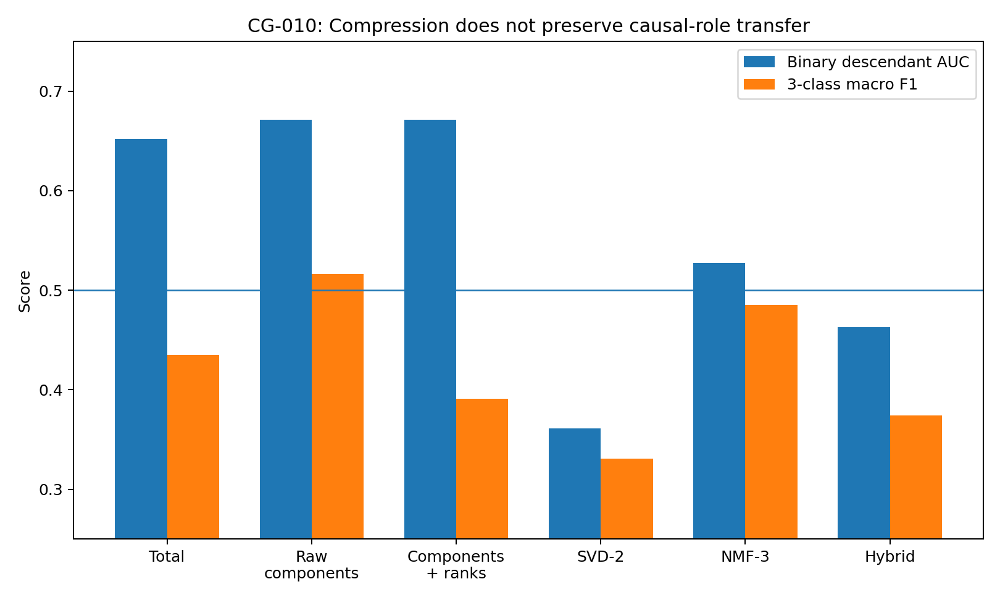

Figure 35. Cross-intervention role learning. Raw components perform most consistently; low-rank reconstruction does not preserve the same descendant-role transfer signal. Source: CG-010, supplied real-data analysis.

### 15.5 Global compression does not preserve all local roles

Binary AUC rises from 0.652 for total magnitude to 0.671 for the three raw components, with balanced accuracy 0.681. In 2,000 within-intervention label permutations preserving class counts, raw-component AUC has p = 0.0245. This supports a modest transfer signal across the six observed interventions.

Compression reduces role discrimination: SVD-2 AUC is 0.361, NMF-3 0.528 and the raw/SVD hybrid 0.463. Yet two SVD dimensions capture 84.6% of response energy. High-energy directions and directions informative about target–descendant roles are therefore different in this experiment.

Mechanism-level variation and causal localisation require distinct coordinates. Low-rank factors describe the overall response programme, while node-local geometry preserves role information that early shared-latent compression can discard.

### 15.6 Three-class role discrimination

With only five distant-descendant units, three-class inference is difficult. Raw components give macro-F1 0.516 and balanced accuracy 0.506; total magnitude gives 0.435/0.448 and NMF-3 0.485/0.476. These are small-sample signals of propagation level, not a reliable mature classifier of children versus distant descendants.

A practical diagnostic can first assess downstream membership and retain child-versus-distant status as a lower-confidence auxiliary output.

### 15.7 An unsupported shortcut low rank versus off-target residuals

An additional exploratory test treats SVD-2 as shared response and its residual as intervention-specific/off-target variation. Among high-response nodes, mean residual-energy fraction is approximately 0.128 for descendants and 0.304 for nondescendants.

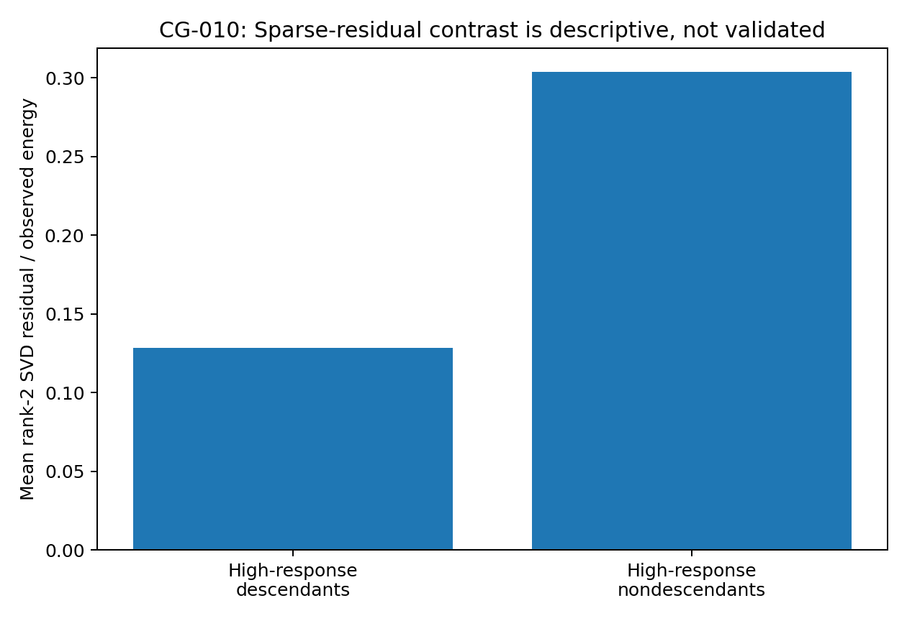

Figure 36. SVD-2 residual fractions among high-response descendants and nondescendants. The contrast is descriptive; within-intervention permutation does not support its use as an off-target detector. Source: CG-010, supplied real-data analysis.

Permuting downstream labels among high-response nodes while preserving intervention-specific counts gives p = 1.0. The proposed identification of low rank with shared causal programme and sparse residual with off-target response is therefore unsupported here.

### 15.8 Representation implications

The findings motivate separate global and local representations. Low-rank/NMF factors describe intervention-wide programmes, mechanism identity and source state; an uncompressed local stream retains node-wise location, scale, shape and other local changes for role readout.

Global intervention state can supply environmental context, while local response geometry describes each variable's role within that context. Their combination remains an architectural hypothesis motivated by these results.

A variable-response card can present raw components, intervention-relative ranks, global factor weights and role predictions side by side, preserving the distinction between intervention-wide variation and local response position.

### 15.9 Scope and relation-level extension

All decompositions and classifiers use real Sachs responses from six measured-target interventions and one reference, not synthetic tensors. The graph supplies target-relative labels and is excluded from model features. Binary AUC 0.671 has within-intervention permutation p = 0.0245; three-class macro-F1 0.516 remains limited by five distant descendants.

CG-011 adds pre-intervention pair geometry, intervention-induced relation changes and node response for each target–candidate relation. It evaluates both intervention and target holdout, separating downstream membership, direct adjacency and propagation depth.

## 16 CG-011 Relational response operators adjacency and downstream propagation

### 16.1 Target node relations as the analytical object

CG-010 showed that low-rank compression can preserve energy while impairing role prediction. CG-011 therefore models a target–node relation using three observations: its baseline geometry, its intervention-induced change and the candidate node's response.

Direct-child inference asks whether a pair resembles a local causal channel; response-cone inference asks how intervention effects extend downstream. A single combined score can mistake shared response for direct coupling.

### 16.2 Data and leakage controls

The same six Sachs measured-target conditions and cd3cd28 reference are used. Targets come from the public manifest. Graph-derived labels are excluded from features. Removing each target itself leaves 60 intervention–target–candidate units: 17 children, five distant descendants and 38 nondescendants.

LOIO withholds a whole intervention. Leave-one-target-out (LOTO) is stricter: testing PKC withholds both G0076→PKC and PMA→PKC, preventing target identity learned from one perturbation from leaking into the other. A deduplicated analysis further uses five unique targets with 10 candidate nodes each, yielding 50 unique relations.

known target T + candidate V  →  {baseline relation, relation change, node response}  →  causal role

### 16.3 Node, baseline-relation and relation-change inputs

Node features comprise location, scale, shape, total response and their four intervention-relative ranks. Baseline features use cd3cd28 target–node geometry: forward residual nonlinearity, heteroscedastic dependence, input–|residual| dependence, fibre-width variation, residual skewness/kurtosis and forward/reverse gaps in nonlinearity, heteroscedasticity, fibre geometry and residual MSE. Change features compare correlation, nonlinearity, heteroscedasticity, fibres, residual shape, cubic error and polynomial coefficients before/after intervention, and include node–target differences in all response components.

The supervised readout is a class-weighted ridge operator. With 60 rows and only five independent targets, a regularised linear model permits a more interpretable test of information location than a high-capacity network.

### 16.4 Different geometries for adjacency and downstream membership

Under LOTO, descendant AUC is 0.611 for node response, 0.642 for baseline relations, 0.713 for relation changes and 0.722 for node response plus changes. This suggests that propagation extent may depend on intervention-induced deformation rather than the static relation alone.

Direct-child AUC instead peaks at 0.769 for baseline geometry, compared with 0.642 for node response, 0.665 for change and 0.714 for node plus change. Combining node, baseline, change and global state reduces it to 0.583. Indiscriminate feature combination can blur direct coupling and shared activation.

Table 25. CG-011. Relation-role learning under strict target holdout. The strongest input blocks differ for direct children and downstream membership.

| Feature block | LOTO descendant AUC | LOTO direct-child AUC | Interpretation |
| --- | --- | --- | --- |
| Node response only | 0.611 | 0.642 | Single-node response after perturbation |
| Baseline relation | 0.642 | 0.769 | Pre-intervention target–node geometry |
| Relation change | 0.713 | 0.665 | Intervention-induced target–node relation change |
| Node + change | 0.722 | 0.714 | response cone + relation deformation |
| Full relation + global | 0.719 | 0.583 | Shared responses can obscure direct adjacency |

Source: supplied CG-011 record. Real-data analysis. Higher AUC/accuracy indicates better discrimination. Blank cells mean not reported or not applicable; model, unit and adjustment details are specified in the adjacent methods.

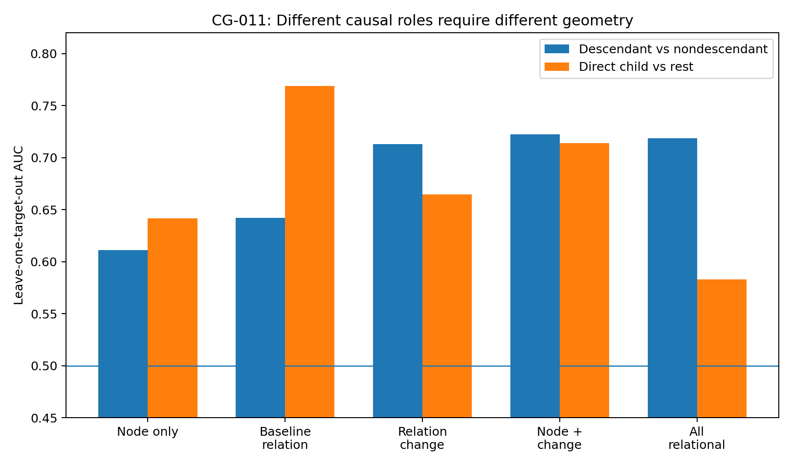

Figure 37. LOTO role discrimination. Baseline geometry is strongest for direct children; intervention-induced changes provide a candidate downstream signal. Source: CG-011, supplied real-data analysis.

### 16.5 Deduplicated direct-child validation

PKC baseline geometry is repeated across G0076 and PMA intervention rows. To remove this repeated weight, the analysis uses unique targets Akt, PKC, PIP2, Mek and PKA, each paired with 10 other nodes. Of these 50 relations, 12 are direct children in the reference graph.

An 11-feature baseline ridge operator gives LOTO AUC 0.7215. In 2,000 within-target child-label permutations preserving child counts, p = 0.00250. The signal therefore persists after removing duplicated PKC relations.

Raw correlation alone has child-discrimination AUC 0.526. Residual width, heteroscedasticity, nonlinearity and directional gaps carry more information than association magnitude in this analysis.

Table 26. CG-011. Deduplicated direct-child validation

| Baseline relation feature | Discrimination AUC | Direction in children | Interpretation |
| --- | --- | --- | --- |
| Heteroscedastic direction gap | 0.667 | Higher | Greater directional conditional-width asymmetry |
| Forward heteroscedasticity | 0.656 | Higher | Target-dependent forward residual scale |
| Residual skew | 0.643 | Lower | Less skewed forward residuals in children |
| Nonlinearity direction gap | 0.638 | Higher | Greater directional nonlinear-gain asymmetry |
| Cubic-MSE direction gap | 0.636 | Lower | Systematic directional fit-error differences |
| Forward nonlinearity gain | 0.621 | Higher | Greater forward nonlinear improvement |
| Fibre-width variation | 0.603 | Higher | More variable conditional fibre width |
| Raw correlation | 0.526 | Slightly higher | Near-chance discrimination |

Source: supplied CG-011 record. Real-data analysis. Higher AUC/accuracy indicates better discrimination. Blank cells mean not reported or not applicable; model, unit and adjustment details are specified in the adjacent methods.

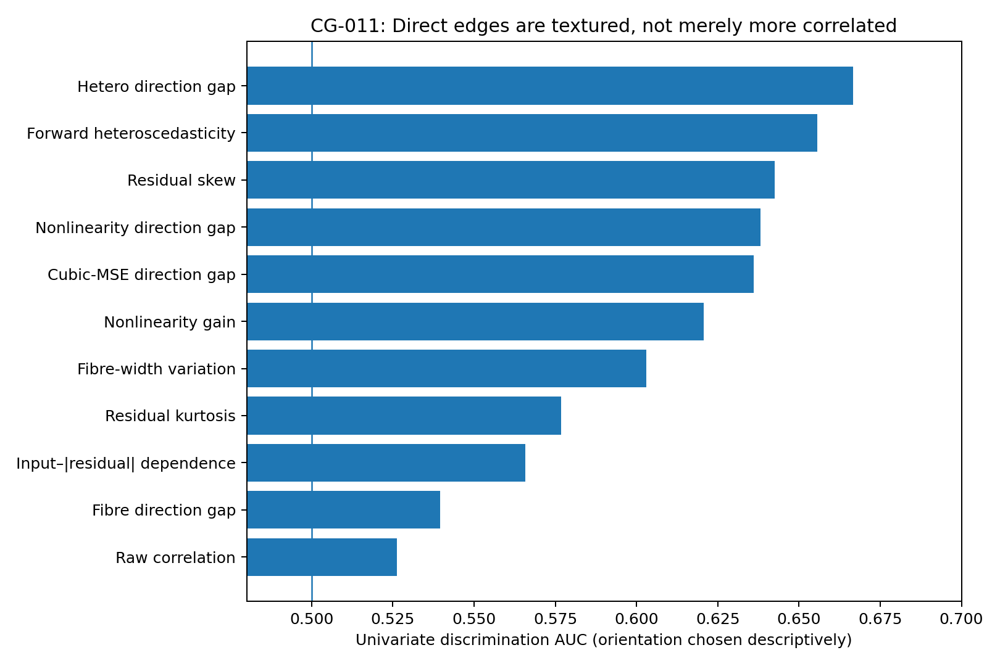

Figure 38. Direct-edge discrimination is concentrated in residual, heteroscedastic and nonlinear features; raw correlation is near chance. Source: CG-011, supplied real-data analysis.

### 16.6 Downstream transfer remains uncertain

Node response plus relation change gives descendant LOTO AUC 0.722, versus 0.611 for node response alone. However, 500 within-intervention permutations preserving descendant counts give p ≈0.283. This is a candidate effect, not validated general cross-target propagation learning.

This does not contradict CG-009's response-rank AUC ≈0.688 and p ≈0.017. CG-009 tests whether descendants respond more strongly within observed interventions; CG-011 tests whether a supervised rule transfers from other targets to a new one. The latter requires more independent targets.

Observable structure and learnable transferable structure are distinct. For this transfer question, the effective independent evidence is closer to five intervention targets than to the thousands of measured cells.

### 16.7 Direct versus distant descendants under target shift

Only five of 22 downstream rows are distant descendants, so this analysis is exploratory. Under LOIO, child-versus-distant AUCs are 0.800 for baseline, 0.824 for change and 0.824 for all local relational features. Under LOTO, baseline falls to 0.306, whereas change gives 0.647, node plus change 0.682 and all local relations 0.718.

The pattern is consistent with target-specific static adjacency features: seeing another intervention on the same target helps, but does not establish transfer of propagation depth to an unseen target. Dynamic relation changes retain more information. With five distant descendants, this interpretation remains a hypothesis for other systems.

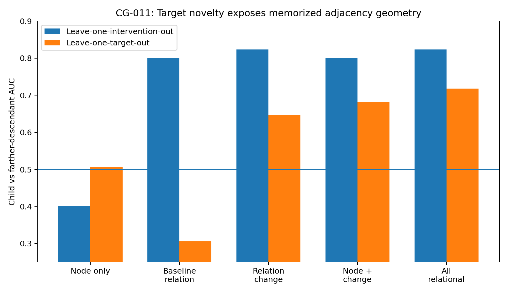

Figure 39. Child-versus-distant transfer under intervention and target holdout. Baseline performance collapses under target holdout; change features retain more signal. The distant-descendant sample is only n = 5. Source: CG-011, supplied real-data analysis.

### 16.8 Separate coupling and propagation readouts

A local-coupling stream can use baseline residual, fibre, heteroscedastic and nonlinear geometry to form a direct-child prior. A propagation stream uses node response and relation changes after intervention. Global state may contextualise the metric, but the observed full-feature decline cautions against indiscriminate concatenation.

baseline edge texture  →  direct-child prior

intervention-induced relation deformation + node response  →  downstream propagation evidence

A static card can report correlation, nonlinearity, heteroscedasticity, fibre width, directional gaps and a child prior. A dynamic card adds response components, target-relative response, relation changes, downstream score and depth uncertainty. Possible outputs include likely direct child, likely indirect downstream relation, no stable downstream evidence and unresolved.

### 16.9 Evidence boundaries

All reported geometries use real Sachs observations. Baseline direct-child evidence is strongest: intervention-row LOTO AUC 0.769 with 500-permutation p ≈0.002, and deduplicated AUC 0.721 with 2,000-permutation p = 0.0025. Correlation alone gives 0.526.

Downstream LOTO AUC 0.722 has p ≈0.283 and is not a validated general propagation classifier. Child-versus-distant AUC ≈0.718 has only five distant cases. The evidence is stronger for local adjacency features than for transferable propagation-role learning.

In these data, direct edges can appear as directional residual, conditional-fibre and nonlinear structure rather than stronger correlation. Intervention responses then describe change over that structure. Baseline coupling and propagation are distinct geometric layers.

### 16.10 Cross-system test design

CG-012 trains on the 50 unique Sachs baseline relations and tests direction on 10 Tübingen pairs from different sources, assessing whether these local edge features transfer to another system.

## 17 CG-012 A small cross-system transfer test

### 17.1 Scope of the 10-pair test

CG-011 found transferable baseline child information within Sachs. CG-012 tests portability using the same 50 unique baseline relations, including 12 reference children, and 10 external Tübingen pairs from 10 sources. This deliberately small test evaluates transfer without fitting a second large perturbation atlas.

The external sources are DWD meteorology, Abalone, auto-mpg, geysers, concrete, liver function, traffic, UN public-health indicators, housing rent and MOPEX hydrology. Directions come from benchmark metadata and never enter Sachs training. A Tübingen cause–effect pair is not equivalent to a direct molecular edge; the test asks whether a child-feature operator transfers as a broader direction prior across different tasks.

### 17.2 A child-likeness readout

A class-weighted ridge operator is trained on 50 Sachs relations using 11 baseline features: correlation, forward nonlinear gain, heteroscedasticity, input–|residual| dependence, fibre-width variation, residual skewness/kurtosis and forward–reverse gaps in nonlinearity, heteroscedasticity, fibres and cubic MSE.

The same extractor evaluates both orders of each external pair. The operator supplies a child-likeness score, not a calibrated causal probability; the higher-scoring order is the predicted direction. Each external pair has 20 bootstrap replicates.

### 17.3 Point-estimate transfer 5/10 correct

Only five of 10 external directions are correct. Features predictive of direct children in Sachs do not automatically identify the correct direction in other real systems. This result does not support a universal directional interpretation of the operator.

Table 27. CG-012. CG-012 cross-system transfer. Margin is the Sachs child-likeness score in the benchmark direction minus that in reverse. Bootstrap known-direction rate is the fraction of 20 resamples selecting the benchmark direction.

| Pair | Source | Benchmark known direction | Sachs score margin | Bootstrap known-dir |
| --- | --- | --- | --- | --- |
| 0001 | DWD | Altitude → Temperature | +0.743 | 1.00 |
| 0005 | Abalone | Age → Length | +2.102 | 1.00 |
| 0013 | auto-mpg | Displacement → Fuel use | −1.050 | 0.00 |
| 0019 | geyser | Duration → Next interval | −0.982 | 0.00 |
| 0025 | concrete | Cement → Strength | −0.091 | 0.80 |
| 0033 | liver | Alcohol → MCV | +0.903 | 1.00 |
| 0047 | traffic | Day type → Car count | +1.162 | 0.95 |
| 0064 | UNdata | Water access → Infant mortality | −0.997 | 0.35 |
| 0086 | housing | Apartment size → Rent | +0.177 | 0.85 |
| 0093 | MOPEX | Precipitation → Runoff | −0.433 | 0.30 |

Source: supplied CG-012 record. Real-data analysis. Blank cells mean not reported or not applicable; model, unit and adjustment details are specified in the adjacent methods.

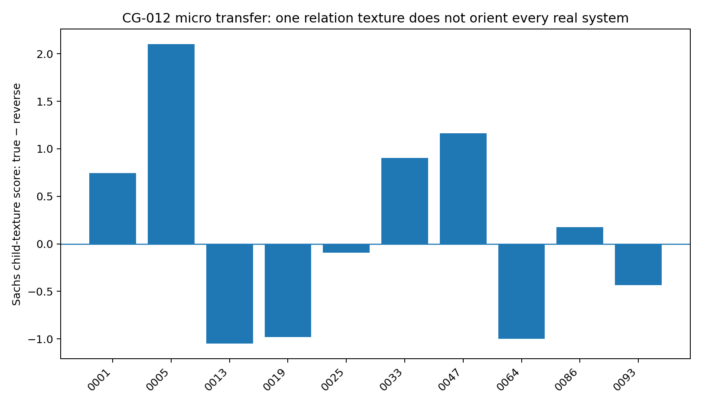

Figure 40. Transfer margins for 10 real pairs. Large, stable margins occur for both correct and incorrect directions, indicating more than weak-signal failure. Source: CG-012, supplied real-data analysis.

### 17.4 Four bootstrap outcome types

Stable concordance requires agreement between the point estimate and bootstrap majority. Seven pairs satisfy this criterion: five stably correct and two stably reversed. Pair0025 has point–bootstrap discordance; pair0064 and pair0093 remain unstable.

Pair0013 and pair0019 select the wrong direction in all 20 bootstrap replicates. Resampling stability therefore does not establish transport validity: a transferred operator can consistently misinterpret a new system.

For pair0025, full-sample margin is −0.091, but 16/20 resamples select the reference direction and median bootstrap margin is +0.143. This sensitivity warrants unresolved status.

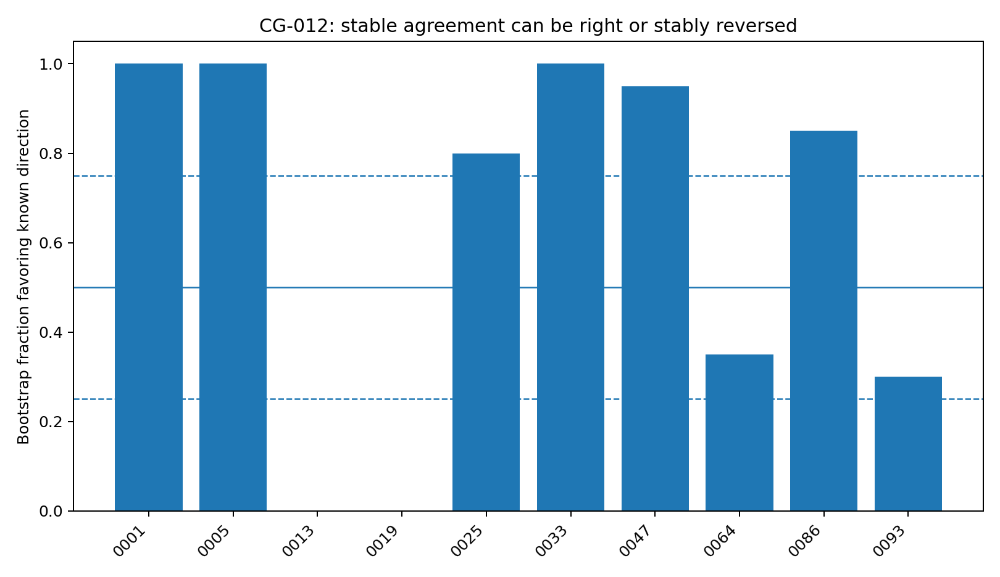

Figure 41. Bootstrap known-direction rates distinguish stable correct, stable reversed, point–bootstrap discordant and unstable outcomes. Source: CG-012, supplied real-data analysis.

### 17.5 Regime-dependent interpretation

The residual/fibre/noise features align with benchmark directions in DWD, Abalone, liver, traffic and housing pairs but reverse stably in auto-mpg and geysers. This is consistent with the sign changes in CG-002 and source shift in CG-007: feature interpretation depends on the generating regime.

Richer features describe local mechanisms in greater detail, but that detail does not establish a universal operator. A changed mechanism coordinate system can produce consistently wrong readings in the old coordinates.

Stability means the operator repeatedly encounters similar geometry; it does not guarantee that the geometry retains its causal meaning across systems. Bootstrap addresses sampling variation, not chart mismatch.

### 17.6 Local anchors for transport assessment

An external atlas should supply a prior. A few locally known directions or small interventions can assess whether its sign and scale require recalibration. Calls can expand only with adequate support; conflicting point, bootstrap or chart-support evidence warrants unresolved status.

CG-013 tests two-anchor calibration on these 10 pairs, comparing observational proximity with transfer of directional interpretation. Individual test pairs are withheld from anchor selection.

## 18 CG-013 Two-anchor chart calibration

### 18.1 Can two labelled anchors assess local polarity?

CG-012 yields 5/10 correct with two stably reversed pairs. CG-013 asks whether two locally known directions can indicate whether to retain or reverse an external operator's sign, without adding a larger model or benchmark.

An anchor supplies polarity: + if the Sachs operator matches its known direction, − if it needs reversal. Test-pair anchors are chosen using direction-free geometry; the test direction never enters neighbour selection. The test concerns local transfer of polarity, not complete retraining.

### 18.2 Protocol and distance blocks

Direction-free features are recomputed for the same 10 pairs: marginal correlation, skewness and tail weight, plus minima, maxima and absolute gaps of directional residual features. Distances use median/MAD standardisation across the 10 unlabelled pairs. Each pair is tested with anchors drawn from the other pairs.

Point-anchor rules are compared with a conservative rule admitting only CG-012 bootstrap-stable anchors, defined by known-direction rates ≥0.75 or ≤0.25. A call requires the nearest two stable anchors to share polarity; disagreement returns unresolved. Random stable-anchor consensus supplies a control for the benefit of receiving two labels.

Four prespecified distance blocks are evaluated: full geometry, marginal geometry, edge features (nonlinearity, heteroscedasticity and fibres), and residual shape. This tests whether features useful for local child prediction also define transport neighbourhoods.

### 18.3 Selective improvement with stable agreeing anchors

Uncalibrated accuracy is 5/10. One nearest point anchor gives 4/10, as does distance weighting of two point anchors. Requiring two point anchors to agree yields 40% coverage and only 2/4 correct. Proximity alone does not restore transfer.

Requiring two nearest bootstrap-stable anchors with matching polarity gives 4/5 correct at 50% coverage. It correctly retains pair0001, pair0033, pair0047 and pair0086. Pair0019 remains wrong because both selected anchors recommend retaining the Sachs sign.

The observed value is primarily selective: disagreement causes abstention. This is a preliminary transport-consensus gate, not evidence of a recovered coordinate transformation.

Table 28. CG-013. Selective improvement with stable agreeing anchors

| Method | Coverage | Accuracy |
| --- | --- | --- |
| Sachs zero-shot | 100% | 50% |
| One nearest point anchor | 100% | 40% |
| Two nearest point anchors with polarity consensus | 40% | 50% |
| Two nearest point anchors with distance weights | 100% | 40% |
| Two nearest stable anchors with polarity consensus | 50% | 80% |
| Two nearest stable anchors with distance weights | 100% | 50% |
| Two random stable anchors with polarity consensus | 57.1% | 41.4% |

Source: supplied CG-013 record. Real-data analysis. Higher AUC/accuracy indicates better discrimination. Blank cells mean not reported or not applicable; model, unit and adjustment details are specified in the adjacent methods.

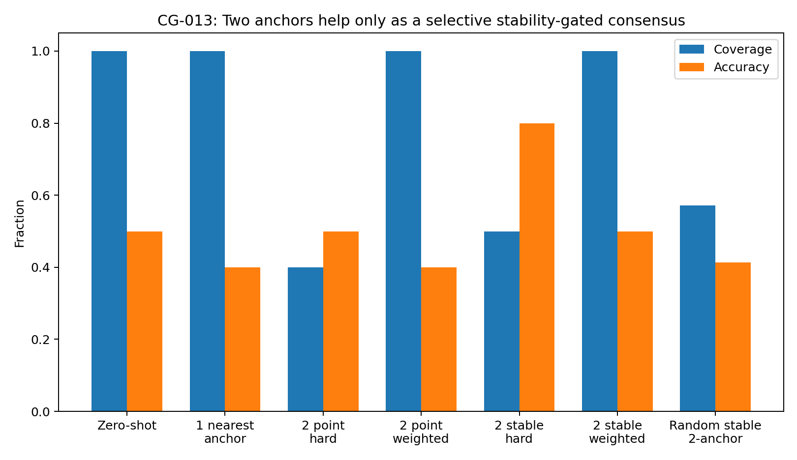

Figure 42. Two-anchor performance. Only the stable-nearest-consensus rule achieves 4/5 correct here, at the cost of half the coverage. Source: CG-013, supplied real-data analysis.

### 18.4 Comparison with random stable anchors

Enumerating random stable-anchor pairs and requiring agreement gives approximately 57.1% coverage and 41.4% accuracy, compared with 50% and 80% for nearest stable anchors. With only five calls, evidence is weak: using 41.4% as a rough chance rate, the one-sided probability scale for at least 4/5 is approximately 0.10.

The five calls indicate a selective signal within the tested subset. The full 10-pair results and dependent combinatorial control define its limited scope.

### 18.5 Polarity does not form clear geometric clusters

In full geometry, mean standardised distance is 2.101 between same-polarity pairs and 2.069 between opposite-polarity pairs. In edge-feature space, the corresponding values are 1.769 and 1.683. Opposite polarities are slightly closer in both cases; clear local polarity clustering is absent.

Features useful for direct-child readout within Sachs are therefore not automatically coordinates for cross-system polarity. Local prediction and transport mapping require different evidence.

Table 29. CG-013. Prespecified direction-free distance-block comparison. The marginal weighted result of 8/10 is exploratory because n = 10 and several blocks are compared. No block shows clear same-polarity clustering.

| Geometry block | Stable hard coverage | Stable hard accuracy | Stable weighted accuracy | Same-pol. dist. | Opp.-pol. dist. |
| --- | --- | --- | --- | --- | --- |
| Full | 50% | 80% | 50% | 2.101 | 2.069 |
| Marginal | 40% | 75% | 80% | 2.176 | 2.127 |
| Edge texture | 80% | 50% | 40% | 1.769 | 1.683 |
| Residual shape | 70% | 42.9% | 30% | 2.036 | 2.099 |

Source: supplied CG-013 record. Real-data analysis. Higher AUC/accuracy indicates better discrimination. Blank cells mean not reported or not applicable; model, unit and adjustment details are specified in the adjacent methods.

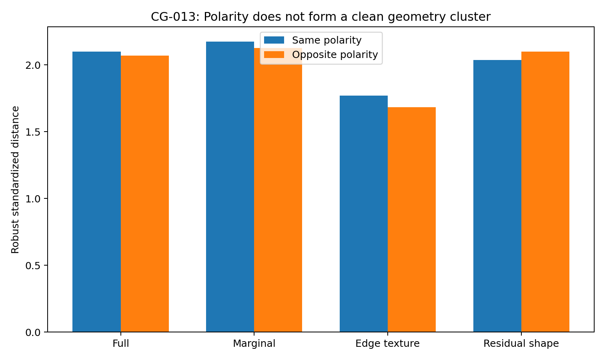

Figure 43. Mean within- and between-polarity distances in four blocks. The expected separation for a smoothly clustered polarity field is not observed. Source: CG-013, supplied real-data analysis.

### 18.6 Consensus without a learned transition law

Two stable agreeing anchors can support a limited call; disagreement prompts abstention. This rule does not explain why polarity changes or establish a continuous polarity field.

Stable error persists for pair0019, whose nearest stable anchors both recommend + although its correct polarity is −. Anchor consensus may share a wrong transport assumption and must be considered alongside mechanism/source support and local experimental evidence.

Geometric proximity is not necessarily mechanism proximity. Useful anchors may need similar measurement processes, variable types, perturbation channels or source families. The present bivariate direction-free features do not establish those neighbourhoods.

### 18.7 Operational use of two anchors

Obtain a candidate direction from the external atlas, then choose a few known local directions with plausible mechanism similarity. Two stable, same-polarity anchors provide one piece of support; disagreement gives unresolved. Weak source/mechanism support should still prevent a forced call.

The output is transport status—KEEP, FLIP or UNRESOLVED—rather than a new calibrated probability model. The experiment offers preliminary support for selective gating, not recovery of an arbitrary new chart from two anchors.

### 18.8 Sample structure

There are 10 external pairs and five stability-gated calls. Random-anchor combinations share tests and anchors and are not independent replicates. The marginal weighted 8/10 must not be selected retrospectively as the main result.

Evidence: cg013_two_anchor_summary.csv; cg013_full_geometry_anchor_details.csv; cg013_geometry_block_ablation.csv; cg013_polarity_distance.csv; run_cg013_two_anchor.py.

## 19 CG-014 One-intervention edge confirmation

### 19.1 The incremental value of one intervention

Baseline edge features provide a local prior but may transfer poorly; large responses alone do not distinguish direct from indirect effects. CG-014 asks whether one target intervention improves candidate direct-child confirmation after observational screening.

The design uses cd3cd28 and one measured-target intervention for each of five targets. Each target has 10 candidates, yielding 50 relations with 12 reference children. All analyses use LOTO, withholding the test target's 10 relations together.

### 19.2 Three complementary information blocks

Baseline features comprise correlation, nonlinear gain, heteroscedasticity, input–|residual| dependence, fibre variation, residual skewness/kurtosis and directional gaps in nonlinearity, heteroscedasticity, fibres and cubic MSE. They characterise the relation before intervention.

Node-response features comprise robust location, scale, shape, total response and within-intervention ranks. Relation-change features describe how target–node residual, fibre and nonlinear geometry changes. The blocks are assessed separately and in combination.

baseline relation → candidate skeleton; one intervention → matched node response; combine only after both are measured

### 19.3 Baseline plus matched response

LOTO AUC is 0.721 for baseline relations, 0.711 for node response and 0.726 for relation change. Each alone has moderate discrimination.

Combining baseline with correctly node-aligned response raises AUC to 0.884, a reported gain of 0.162 over baseline. Baseline plus change gives 0.807; all features give 0.763. The advantage is specific to complementary, aligned information rather than feature count.

Table 30. CG-014. One-intervention confirmation under target holdout. All candidates for the test target are withheld together.

| Feature set | LOTO AUC |
| --- | --- |
| Baseline relation texture | 0.721 |
| One-intervention node response | 0.711 |
| Relation change | 0.726 |
| Baseline + response | 0.884 |
| Baseline + relation change | 0.807 |
| All features | 0.763 |

Source: supplied CG-014 record. Real-data analysis. Higher AUC/accuracy indicates better discrimination. Blank cells mean not reported or not applicable; model, unit and adjustment details are specified in the adjacent methods.

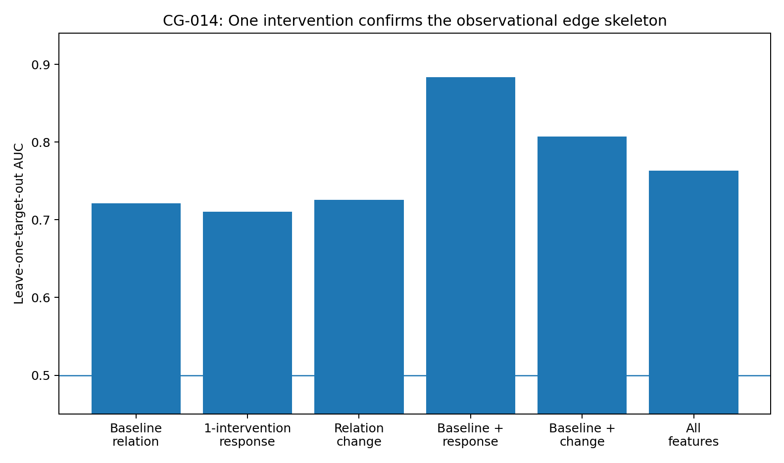

Figure 44. Direct-child discrimination is strongest for baseline relations combined with matched node responses. Source: CG-014, supplied real-data analysis.

### 19.4 Alignment and label-permutation controls

A response-misalignment control preserves each intervention's response distribution but randomly assigns profiles to other candidate nodes within that target. Among 1,000 permutations, approximately 1.7% reach the observed aligned AUC. The observed gain is +0.162; median misaligned gain is approximately +0.022.

A second control preserves each target's child count while permuting labels. Approximately 1.0% of 1,000 permutations reach the observed combined AUC. The informative addition is which response belongs to which node under the intervention.

Correct response–node alignment contributes evidence in this design; adding an unmatched condition does not provide the same information.

### 19.5 Prioritising the first candidate

PKC, Mek and PKA have measured outgoing children; Akt and PIP2 do not in this reference graph. Among the three positive targets, baseline Top-1 precision is 2/3 and baseline plus response is 3/3. Mean Top-2 and Top-3 precision do not improve, so the strongest benefit is prioritisation of the first candidate, not perfect graph recovery.

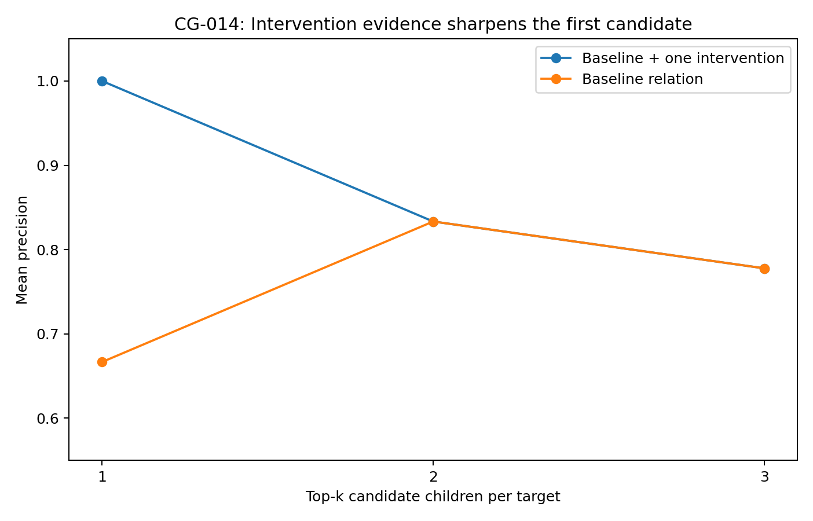

Figure 45. Top-1 precision among three targets with measured children improves to 3/3 with matched response. This is a small candidate-confirmation result. Source: CG-014, supplied real-data analysis.

### 19.6 Interpreting complementary structural and response evidence

Baseline conditional-noise, fibre and nonlinear geometry describes plausible local channels. An intervention supplies node-specific response evidence relative to that structural prior.

Response-only AUC 0.711 is limited because strong responses can be direct, indirect or shared. Baseline AUC 0.721 is limited because a plausible local relation remains a prior. Their combination tests whether a plausible channel also shows the corresponding node-specific response after target perturbation.

Baseline plus change is useful at 0.807 but below baseline plus response at 0.884; combining all features reduces AUC to 0.763. Structured complementarity matters more than indiscriminate accumulation.

In this experiment, candidate confirmation is strongest when pre-intervention relation features and matched perturbation responses support the same relationship.

### 19.7 A minimal study workflow

Compute observational relation features and prioritise candidates; choose a target for one intervention; calculate node-wise location/scale/shape relative to baseline; combine with the relation prior; and retain unresolved status for candidates lacking adequate agreement.

observational skeleton → choose target → one intervention → matched response → confirm / unresolved

The model can prioritise an informative local experiment. If the intervention does not sharpen the candidate evidence, greater model complexity alone should not be treated as confirmation of a direct edge.

### 19.8 Sample structure and perturbation dependence

The study contains five targets and 50 relations; Top-1 3/3 concerns only the three targets with outgoing measured children. AUC and permutation controls support the contribution of aligned response. CG-015 compares G0076 and PMA at PKC to assess dependence on perturbation method.

Evidence: cg014_auc_summary.csv; cg014_controls.csv; cg014_topk.csv; CG014_PROTOCOL_AND_RESULT.md.

## 20 CG-015 Same target, different perturbations

### 20.1 Does confirmation depend on perturbation method?

CG-014 uses one perturbation per target. CG-015 asks whether a substantially different perturbation changes confirmation, or whether baseline relations and target identity preserve direct-child discrimination.

The test uses PKC and 10 candidates under G0076 on a CD3/CD28 background and PMA with a different activation context. These are not matched doses, directions or backgrounds. The confirmation operator is trained only on other targets, then applied separately to both PKC conditions.

### 20.2 Different raw responses, similar class discrimination

Raw total-response rankings have Spearman correlation approximately −0.479. The two interventions therefore do not produce a similar amplitude ordering across the 10 candidates.

Combining baseline geometry with each condition's matched response gives direct-child AUC 0.88 in both cases. Mean child-minus-nonchild score gaps are 1.046 for G0076 and 1.073 for PMA. Class separation persists even though raw amplitudes and complete rankings change.

Table 31. CG-015. Same-target, different-perturbation results. Raw responses differ, while child-class discrimination remains similar.

| Readout | G0076 | PMA |
| --- | --- | --- |
| Direct-child AUC | 0.880 | 0.880 |
| Child − nonchild mean score gap | 1.046 | 1.073 |
| Top-1 precision | 1/1 | 1/1 |
| Top-3 precision | 3/3 | 3/3 |
| Top-5 precision | 4/5 | 4/5 |

Source: supplied CG-015 record. Real-data analysis. Blank cells mean not reported or not applicable; model, unit and adjustment details are specified in the adjacent methods.

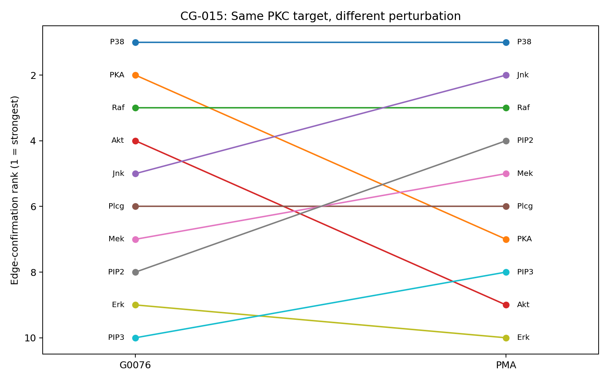

Figure 46. PKC candidate rankings under G0076 and PMA. P38 ranks first in both and both Top-3 sets contain only reference children, although internal child rankings change. Source: CG-015, supplied real-data analysis.

### 20.3 Stable first candidate, moderate overall rank agreement

P38 ranks first in both conditions. G0076's Top-3 is P38, PKA and Raf; PMA's is P38, Jnk and Raf. Top-3 overlap is 2/3 and Top-5 overlap is 60%. Full-score Spearman correlation is approximately 0.491 and Kendall τ approximately 0.333. Random node remapping gives p ≈0.072 for Spearman and p ≈0.185 for Top-3 overlap.

The findings do not establish perturbation-invariant ranking. They support the narrower result that an operator trained on other targets separates the child class under both tested perturbations.

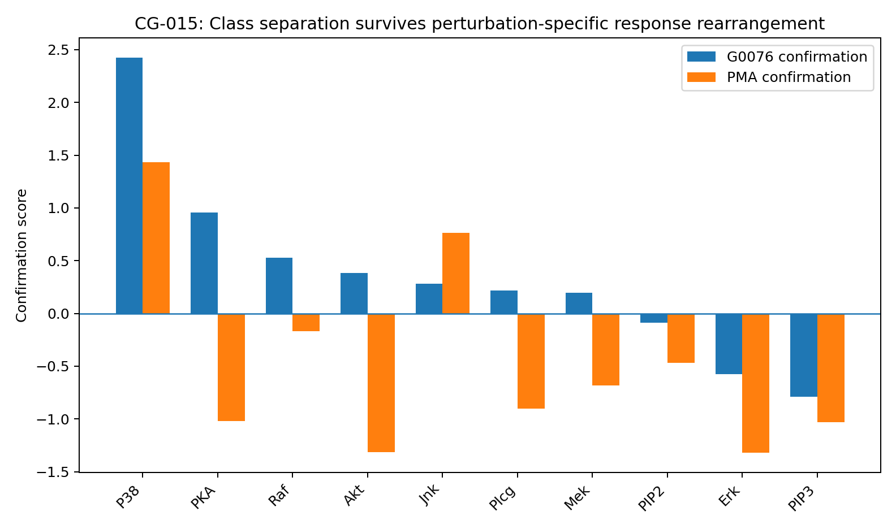

Figure 47. PKC confirmation scores under two perturbations. Node order changes, while overall child/nonchild separation persists. Source: CG-015, supplied real-data analysis.

### 20.4 Exact small-sample controls

PKC has five reference children and five nonchildren, giving C(10,5) = 252 possible label assignments. Enumerating all assignments, approximately 0.79% achieve AUC at least 0.88 in both conditions (exact p ≈0.0079).

The union of the two Top-3 sets has four nodes. Both sets contain only children if those four receive child labels and the fifth child is selected from the other six: 6/252 ≈2.38%. This remains a one-target result, but the observed joint concentration is uncommon under the enumerated label control.

### 20.5 Structural class information despite response reordering

The negative raw-rank correlation makes this more informative than two similar response profiles. PKA moves from confirmation rank 2 under G0076 to rank 7 under PMA; Jnk moves from rank 5 to rank 2. Child-class AUC nevertheless remains 0.88/0.88.

Different perturbations change activation pattern and magnitude, while baseline geometry constrains interpretation of the resulting responses. The confirmation operator combines structural context with the response specific to the intervention.

One intervention is therefore not equivalent to a single amplitude-based edge test. It supplies a perturbation-specific response field that must be interpreted relative to the target's baseline local geometry.

### 20.6 Evidence boundaries

Only one target and two perturbations are tested. Node-ranking agreement is moderate and its remapping control does not cross conventional significance thresholds. The strongest result is class-level: equal AUC, similar mean score gaps and entirely child-labelled Top-3 sets.

Within this system, perturbation method substantially reorders responses while baseline-plus-response discrimination of direct children remains similar. Generalisation to other targets remains untested here.

Evidence: cg015_pkc_candidate_rankings.csv; cg015_summary.csv; CG015_PROTOCOL_AND_RESULT.md.

## 21 Modelling implications representations, hypotheses and causal inference

The experiments raise a representation question: how can a data model construct and evaluate explanations when a statistic changes meaning across generating mechanisms or a transferred operator reverses sign? The relevant research objects are internal representations, candidate hypotheses and the organisation of computation.

Data ↔ representations ↔ hypotheses ↔ models/operators ↔ simulated or observed consequences ↔ revised representations.

Data can inform computation, while model-generated representations and hypotheses can change how subsequent observations are interpreted. Such iteration requires evaluation against observable consequences.

### 21.1 Geometry profiles as task-dependent descriptions

Effective degrees of freedom, shape, change, response and local relation features distinguish data regimes. Some directions carry substantial discriminating information; others leave several explanations compatible. A profile can contextualise priors, analogies, simulations and generated variables.

The relevant profile depends on the task. Directions explaining response energy need not distinguish causal roles, as CG-010 demonstrates.

### 21.2 Generating regimes and local interpretations

A statistic's causal interpretation can change with the generating mechanism. Multiple local explanations may therefore remain compatible with the same observations. Chart transitions and mixtures provide ways to organise, rather than prematurely collapse, these alternatives.

The same statistic under different local contexts can support different candidate causal interpretations.

The stable reversals in CG-012 identify systematic transport mismatch. They motivate source-specific transformations but do not by themselves identify the correct transformation.

### 21.3 Operators as composable computational objects

Predictors, direction readouts, intervention-response models, local controllers and statistical transformations can be parameterised or composed. Generated variables and relations can then become inputs to later computations. Whether these constructions help is an empirical question.

Capacity, internal representation and execution path determine which computations a model can express. Expanded states, candidate branches, reused intermediate results and revised local representations provide distinct experimental design choices.

### 21.4 Global, local and generated structure

CG-010 separates low-rank global response variation from local role information. A model can retain global context, local relations and temporary generated variables in parallel, with their contributions evaluated separately.

Global summaries, local relations and generated intermediate structures need not determine one another.

### 21.5 Transport mismatch as a modelling target

CG-012–013 motivate testing whether an operator should be retained, reversed or transformed for a new source. Candidate bridge models and multiple interpretations can be compared through their predicted consequences.

The location, direction and size of a mismatch provide diagnostics for a transition model, but are not proof that a valid transition has been learned.

### 21.6 Iterative representation and simulation

Geometry profiles, charts, operators and prediction readouts are concrete comparison units. A model can also feed hypotheses and simulated consequences back into its state. The later experiments test restricted implementations of this iterative organisation.

Data ↔ generated representations ↔ hypotheses ↔ computation/simulation ↔ consequences ↔ revised representations.

### 21.7 Connection to the experimental record

CG-001–006 study reversal-breaking geometry and local charts. CG-007–015 test real sources, dataset transfer, perturbation response and relation features. Together they connect causal information to generating geometry, mechanism-dependent interpretation, intervention-induced changes and representation-dependent information loss.

These observations motivate explicit tests of intermediate computational objects linking data, models, simulation and new observations.

### 21.8 Generated intermediate objects in data models

Measurement tables do not directly display their generating mechanisms. A data model can introduce a candidate relation, temporary variable or mechanism and use it in subsequent calculation. Here, a chain-of-thought-like structure means an experimentally specified sequence of generated numerical or mechanistic objects, not access to a model's private reasoning.

Intermediate objects may be graphs, equations, hypotheses, hidden states, counterfactual configurations or simulation results. Their relevance is whether generated consequences improve later computation and prediction.

A generic state-transition description is:

Current state → candidate representation, hypothesis, simulation, operator, memory or observation → updated state.

A data-reasoning state may contain continuous values, symbols, relational graphs, programme fragments or parallel candidate models. CG-017 implements continuous states and numerical candidates and measures their contribution to subsequent generation and final prediction.

An action chain organises operations; a generated-object chain carries intermediate objects forward. These are distinct, potentially overlapping aspects of a concrete computational design.

Generated intermediate objects provide a shared interface between data operations, simulation and hypothesis revision.

An auxiliary line in geometry is a useful analogy: it is introduced rather than observed, but may expose relationships. Likewise, a temporary variable or local equation should be judged by the relationships and testable consequences it enables.

### 21.9 Mathematical components and computational composition

Linear models, GLMs, survival models, state-space models, graph operators, ODE/PDE systems, Bayesian updates, causal adjustment, bootstrap and permutation offer reusable priors, transformations and simulation components.

Composed operators, new coordinate combinations and local equations enlarge the set of representable computations. Their utility must be assessed for the task and data regime in which they are used.

Priors, observations, simulation, language, neural representations and external experiments can play different roles. Experimental comparisons should identify which component changes predictions or improves model checking.

CG-016 measures differences between operator combinations. Related noncommutative control results in Chapter 3 motivate treating order, recurrence and branching as measurable design variables.

### 21.10 Candidate causal models and their consequences

An observational distribution can be compatible with multiple generating models. Latent variables, direction, selection, feedback and measurement processes can each alter the interpretation of the same table.

Candidate models can posit confounding, mediation, feedback, hidden state, measurement mechanisms or reverse direction, then generate comparable observational and interventional consequences. New environments or interventions can discriminate among these alternatives when their implications differ.

Observed data → candidate causal models → simulated or measured consequences → revised candidate models.

Direction geometry, local features, perturbation responses and cross-source reversals constrain different mechanism possibilities. Identifiability analysis can distinguish candidates or expose structures absent from the current candidate set.

Concrete questions are how to retain multiple hypotheses, execute a provisional model and revise it after a conflicting consequence. CG-017–024 test restricted forms of these operations in specified data systems.

This framework links the earlier geometry results to generated intermediate objects without inferring unrestricted capability from the tested benchmarks.

## 22 CG-016 Selective computation in a restricted execution prototype

### 22.1 State-dependent continuation

CG-016 tests whether a simple policy can use a baseline score to decide whether to execute a second, predefined matched-response computation. It concerns selective execution in one small causal task.

The experiment reuses CG-014's five Sachs targets and 50 candidate relations under LOTO. Test-target edge labels are excluded from training.

Only numerical features are used, excluding semantic information in variable names to isolate this design choice.

### 22.2 Three predefined operators

A0, BaselineRelation, computes observational target–node features. A1, MatchedResponse, computes candidate response from the target intervention. A2, RelationChange, computes pre/post-intervention deformation of the relation. These are the experiment's predefined operations.

An escalation rule uses the magnitude and training-distribution position of the A0 score. Scores in a low-confidence interval trigger A1; others retain A0. Each outer fold selects its uncertainty quantile using inner LOTO on the remaining targets. The policy state consists of these input quantities.

Baseline score → optional matched-response computation → updated score.

### 22.3 Additional operations do not monotonically improve discrimination

A0 alone gives AUC 0.721 and balanced accuracy 0.645. Adding A1 to every relation gives 0.884 and 0.783, reproducing the complementary response evidence in CG-014.

Unconditionally adding A2 reduces AUC to 0.811 and balanced accuracy to 0.629. Under these features and this panel, additional operations do not monotonically improve usable child information.

This establishes a task-specific stopping tradeoff in the tested pipeline.

Table 32. CG-016. Fixed and adaptive computation under LOTO. The adaptive policy retains much of the response gain while reducing pair-level operator calls.

| Policy | LOTO AUC | Balanced acc. | Mean operator calls | A1 response fraction |
| --- | --- | --- | --- | --- |
| Baseline only | 0.721 | 0.645 | 1.00 | 0% |
| Always add matched response | 0.884 | 0.783 | 2.00 | 100% |
| Always go deeper (+ relation change) | 0.811 | 0.629 | 3.00 | 100% |
| Nested adaptive Data Action Chain | 0.855 | 0.754 | 1.54 | 54% |
| Reverse control: escalate confident pairs | 0.779 | 0.658 | 1.54 | 54% |

Source: supplied CG-016 record. Real-data analysis. Higher AUC/accuracy indicates better discrimination. Blank cells mean not reported or not applicable; model, unit and adjustment details are specified in the adjacent methods.

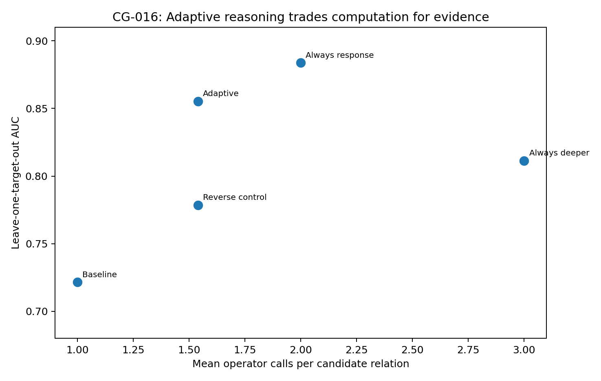

Figure 48. Discrimination versus computation in CG-016. The nested policy lies between baseline-only and always-response; adding relation change reduces performance in this experiment.

### 22.4 Nested selection uses response on 54% of relations

With thresholds chosen only through inner validation, adaptive AUC is 0.855 and balanced accuracy 0.754. Matched response is called for 54% of relations, reducing mean calls from 2.00 to 1.54.

Relative to baseline, always-response adds approximately 0.162 AUC and adaptive execution approximately 0.134. The saving concerns pair-level computation, not laboratory interventions.

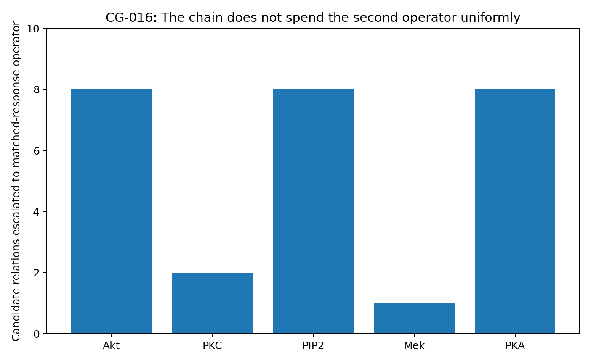

Figure 49. Number of candidate relations escalated to matched response for each held-out target. Allocation varies with the current scores. Source: CG-016, supplied real-data analysis.

### 22.5 Selected cases are harder for the baseline

The policy selects 27/50 relations. On that subset, baseline AUC is 0.595 and accuracy 66.7%; adding response raises AUC to 0.873 and accuracy to 81.5%.

Baseline uncertainty therefore identifies a subset that benefits from additional matched-response information in this task.

### 22.6 Equal-budget controls

Escalating the most confident pairs instead gives AUC 0.779 and balanced accuracy 0.658 at the same budget. Across 10,000 random equal-budget policies, mean AUC is 0.824, median 0.822 and the 95th percentile 0.866; approximately 11.5% reach or exceed 0.855.

These controls suggest useful targeting by the heuristic, but random allocation can attain comparable results often enough that the small-sample advantage should remain qualified.

### 22.7 No reduction in target-level interventions

A1 requires a target intervention. If any relation for a target is escalated, that laboratory intervention may still be needed, and multiple nodes may be measured together.

All five held-out targets have at least one escalated relation. This policy therefore saves no target-level interventions under the observed cost structure.

Pair-level computational savings and target-level experimental costs must be reported separately.

### 22.8 Performance and cost

The policy directs additional response computation toward difficult baseline cases, producing a measurable performance–cost tradeoff.

Selective invocation is one experimentally established component that could be combined with intermediate hypotheses or internal simulation, subject to separate evaluation.

The lower performance of fixed BRC than BR shows that the value of an added feature block depends on its interaction with the task and readout.

Selective execution allocates computation; generated objects determine its intermediate material. These are complementary modelling questions.

### 22.9 Supported result

In this five-target, 50-relation task, uncertainty-guided response invocation yields AUC 0.855 with 54% response calls, exceeding baseline and reverse allocation while retaining much of the always-response gain. On selected cases, AUC rises from 0.595 to 0.873.

The experiment connects baseline uncertainty, local prediction difficulty and benefit from additional computation within this specified design.

Evidence: cg016_policy_summary.csv; cg016_nested_folds.csv; cg016_controls.csv; CG016_PROTOCOL_AND_RESULT.md; Figures 48–49.

## 23 CG-017 Generated intermediate objects in iterative data models

This experiment transfers Chapter 3's feedback questions to data modelling and causal inference. A model encodes input, generates an intermediate object, feeds it into subsequent computation and produces further candidates. The tests examine prediction, multiple possible consequences and task-dependent value of different representations.

Two generated-object formats are studied: continuous feedback states and numerical prediction candidates. Both are returned to later recurrent states.

The record comprises 72 independent training runs and 144 feedback-intervention evaluations. Numerical candidates improve synthetic test NLL to −1.2082 from the blank-recurrence value −1.0740, consistently across three seeds. On real data, MSE is 1.6313 versus 1.6371, only a 0.35% improvement; cutting the trained feedback branch improves MSE further to 1.6186. The central question is which objects help in which tasks.

### 23.1 Connections to Chapter 3

CHAIN-CONTROL-006 separated visible token names from numerical feedback in a small RNN: relabelling while preserving feedback left answers unchanged, whereas changing feedback could alter later branches and answers. This motivates examining the objects actually consumed by a data model—vectors, relations, predictions or equations—and their computational consequences.

CONTROL-FLOW-011 showed that prior tokens can alter later control direction and gain. Here, local input sensitivity tests whether different intermediate objects change responses to the same original variables.

DIRECT-COT-STATE-027 compared Direct, Blank and relational chains within one model. It motivates a blank-recurrence control for extra depth versus explicit feedback. The four routes here are trained separately on different tasks, so this is a transfer of experimental structure, not of conclusions. Chapter 3's STORE/RESET finite systems supply related examples of constructible state operations.

### 23.2 Four routes and shared training conditions

$$
z_t=G_\theta(h_t,D),\qquad h_{t+1}=\mathrm{GRU}_\theta([E(D),z_t],h_t)
$$

A two-layer tanh encoder maps input D to a 48-dimensional E(D), also used as initial state. Recurrent routes perform four GRU updates, each receiving the same encoding and 16-dimensional feedback. The encoding stays fixed while the recurrent state changes its use. Training supervises only the final prediction; no intermediate target is supplied.

Table 33. CG-017. Four routes and shared training conditions

| Route | Intermediate object | Feedback and computation |
| --- | --- | --- |
| Direct | Final prediction | Direct encoder-to-output path; low-computation reference |
| Blank | Zero vector | Four recurrent updates with zero feedback |
| Continuous | 16-dimensional continuous state | Tanh readout fed into the next update |
| Structured | Numerical prediction candidates | Three consequence vectors and weights in synthetic tasks; hidden-variable predictions in real tasks |

Source: supplied CG-017 record. Synthetic and real-data panels. Blank cells mean not reported or not applicable; model, unit and adjustment details are specified in the adjacent methods.

Seeds are 11, 22 and 33. Adam uses learning rate 0.002. Synthetic training has 1,200 updates with batch size 96; real-data training has 800 with batch size 64. Development loss is checked every 100 updates, and the best development checkpoint is retained. Routes share batch indices within a seed; test data do not select checkpoints.

All models instantiate the same modules, but active paths and parameter counts differ. Total parameters are 21,052 synthetic and 21,195 real. Direct uses 3,852/3,995 encoder/head parameters. Blank and Structured modules total 20,268/20,411; Continuous uses all parameters. Blank's zero-input columns and Structured's padded columns include inactive weights. The main comparison is between equally deep recurrent routes; Direct also differs in depth and active capacity.

Structured denotes prediction drafts in predefined numerical slots. Candidate values and weights are learned; candidate count, variable identities and format are specified by the experiment. Generated relations and mechanisms are examined in subsequent experiments.

### 23.3 Interventional consequences of observationally equivalent worlds

Three Gaussian SCMs are constructed: X₀→X₁→X₂, a fork from the middle node, and X₂→X₁→X₀. Independent |a| and |b| range from 0.25 to 0.85 with random signs. Each variable has unit marginal variance and all worlds share Cov(X₀,X₁)=a, Cov(X₁,X₂)=b and Cov(X₀,X₂)=ab. Independent equation-noise variances are one minus the squared parent coefficient. Variable labels are randomly permuted.

Each parameter group generates 128 observational samples, with the same sample covariance supplied across its three worlds. Inputs comprise covariance, query target and, optionally, the mean response to one support intervention on a different target. The query sets its target to 1 and asks for the three-dimensional mean. Structural equations provide exact query truth; support means include noise corresponding to 128 samples.

Parameter groups split 400/100/100 into training/development/test. Each contains three worlds with and without support, giving 2,400/600/600 task instances. Without support, identical inputs can have different interventional consequences, requiring a distribution over possibilities.

All routes output three isotropic Gaussian components with learned means, softmax weights and fixed standard deviation 0.15. Final loss is mixture NLL. Continuous-density NLL can be negative and depends on bandwidth; comparisons here share that bandwidth.

### 23.4 Numerical candidates improve synthetic consequence distributions

Table 34. CG-017. Numerical candidates improve synthetic consequence distributions

| Route | Test NLL | Mean MSE | Consequence coverage |
| --- | --- | --- | --- |
| Direct | -0.7761 | 0.04186 | 73.78% |
| Blank | -1.0740 | 0.03859 | 79.11% |
| Continuous | -1.0875 | 0.03741 | 77.22% |
| Structured | -1.2082 | 0.03812 | 80.89% |

Source: supplied CG-017 record. Synthetic and real-data panels. Lower NLL, MSE and MAE indicate better performance; these metrics are on different scales. Blank cells mean not reported or not applicable; model, unit and adjustment details are specified in the adjacent methods.

Structured improves NLL over Blank by 0.1342. Across seeds, Blank is −1.0217/−0.9827/−1.2177 and Structured −1.2665/−1.1273/−1.2309. Structured also improves both no-support (−1.0227 versus −0.8940) and support conditions (−1.3937 versus −1.2540).

Continuous has the lowest mean-prediction MSE, 0.03741. Structured has better distribution NLL and nearest-candidate MSE, the latter 0.01932. Representation value therefore depends on whether the task evaluates the mean or the organisation of multiple possibilities.

World coverage is computed only without support: a true consequence is covered if a candidate with weight ≥0.10 lies within RMS distance 0.20. Coverage is 80.89% for Structured and 79.11% for Blank. Nearby true consequences may share a candidate, so coverage does not establish recovery of separate mechanism identities.

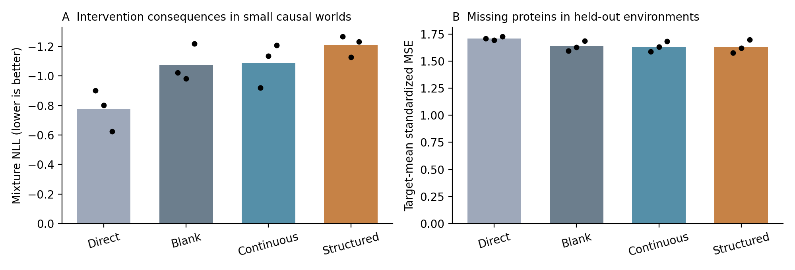

Figure 50. Four routes on synthetic and real panels. Bars are three-seed means and points are seeds; real results first average equally over five held-out targets. Lower synthetic NLL is better. Source: CG-017, synthetic and Sachs real-data analyses.

### 23.5 Variable completion in unseen real perturbation environments

The real panel uses CORNETO's naturally log-transformed Sachs version. The manifest identifies cd3cd28 plus Akt inhibition, G0076, psitect, U0126, PMA and b2camp, targeting AKT, PKC, PIP2, MEK, PKC and PKA. A fixed 200 cells per condition yields 1,400 cells.

One intervention target is withheld, with both PKC conditions withheld together. Remaining cells split 80%/20% into training/development, and standardisation uses training cells only. Eight fixed masks each hide five variables and retain six; all masks of a cell stay in the same partition. Inputs contain observed values and masks, without intervention labels or graph. The task is conditional completion in a new perturbation environment.

Table 35. CG-017. Variable completion in unseen real perturbation environments

| Held-out target | Direct | Blank | Continuous | Structured |
| --- | --- | --- | --- | --- |
| AKT | 0.4448 | 0.4529 | 0.4528 | 0.4516 |
| MEK | 1.8637 | 1.7585 | 1.7719 | 1.7684 |
| PIP2 | 0.7298 | 0.7197 | 0.7244 | 0.7148 |
| PKA | 1.6085 | 1.5209 | 1.5133 | 1.5437 |
| PKC | 3.8965 | 3.7333 | 3.7024 | 3.6782 |
| Equal-target mean | 1.7087 | 1.6371 | 1.6329 | 1.6313 |

Source: supplied CG-017 record. Synthetic and real-data panels. Blank cells mean not reported or not applicable; model, unit and adjustment details are specified in the adjacent methods.

Equal-target mean MSE falls from 1.7087 for Direct to 1.6371 for Blank. Continuous and Structured give 1.6329 and 1.6313, improvements over Blank of 0.25% and 0.35%. Structured improves three of five targets but is worse for MEK and PKA.

PKC has the largest error and contributes strongly to average differences. Cells, masks and seeds are repeated measurements; the five targets are the cross-environment comparison units. Target- and seed-level results are retained. The real panel tests completion, while the synthetic panel separately tests interventional consequences.

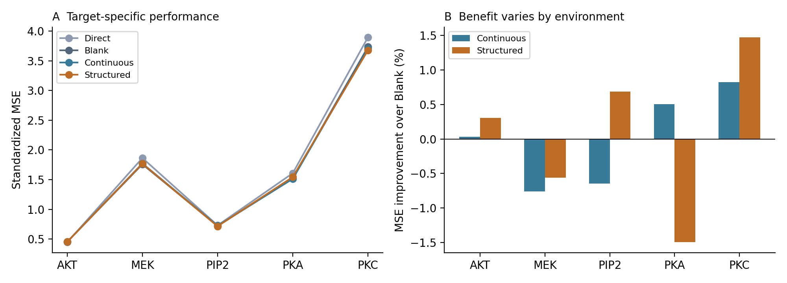

Figure 51. Completion MSE by held-out target and improvement relative to Blank. Positive improvement denotes lower error; points average the three seeds. Source: CG-017, Sachs real-data completion analysis.

### 23.6 Cutting, transplanting and editing intermediate objects

After training, inputs and weights are fixed while feedback is: zeroed at all four steps; transplanted from another case at step two; increased by 1 in one coordinate at step two; or restored unchanged at step two. Donor and recipient share query target/support status or real-data mask; donors are selected by a fixed within-group cycle. The edited coordinate is the first hidden variable in real data or the first coordinate of the first synthetic candidate. Subsequent states regenerate freely.

Only the explicit z-feedback branch is cut; GRU hidden-state recurrence remains intact. Donors are not matched on all attributes, and zeroing or large edits may create states outside the training distribution. Results describe these specified computational interventions.

Table 36. CG-017. Cutting, transplanting and editing intermediate objects

| Panel and route | Cut Δloss | Transplant Δloss | Edit Δloss |
| --- | --- | --- | --- |
| Synthetic Continuous | +0.28859 | +0.00759 | +0.00227 |
| Synthetic Structured | +0.40504 | +0.00232 | +0.00702 |
| Real Continuous | -0.00706 | -0.00383 | -0.00060 |
| Real Structured | -0.01272 | -0.00256 | +0.00615 |

Source: supplied CG-017 record. Synthetic and real-data panels. Blank cells mean not reported or not applicable; model, unit and adjustment details are specified in the adjacent methods.

Cutting Continuous/Structured feedback increases synthetic NLL by 0.2886/0.4050; Structured changes from −1.2082 to −0.8032. All three seeds show benefit from this branch in the trained synthetic model. Transplants and edits change later generation but have much smaller mean loss effects.

On real data, cutting feedback decreases MSE by 0.0071/0.0127; Structured improves from 1.6313 to 1.6186. A computationally used branch can therefore transmit unhelpful training-environment dependence under transfer.

Transplant-induced prediction RMS shifts are 0.00791/0.00459 for synthetic Continuous/Structured and 0.02807/0.02128 for real data. The next generated token also changes. Unchanged restoration reproduces the original prediction exactly, with maximum displacement 0. Participation, transplantability and predictive benefit are separate quantities.

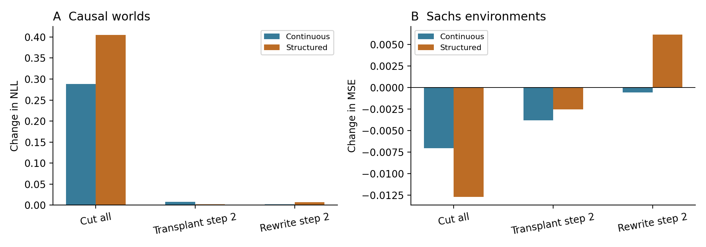

Figure 52. Loss changes after intermediate-object interventions. Synthetic units are NLL; real units are standardised MSE. Positive means worse and negative means better; panel scales are not directly comparable. Source: CG-017, synthetic and Sachs real-data analyses.

### 23.7 Candidate evolution through recurrence

Reading each recurrent state with the same output head shows decreasing synthetic test NLL. Intermediate outputs are not separately supervised and initial errors are large. Figure 53 averages all test instances and three seeds.

An illustrative difficult case is chosen by maximum separation among the three true no-support consequences, using seed 11. For do(X₂=1), the compatible outcomes are (−0.842,0,1), (−0.842,−0.838,1) and (0,−0.838,1). Two generated candidates receive weights approximately 0.534 and 0.460; the third receives 0.006.

The two main candidates still mix consequences from different worlds, and the low-weight candidate violates the target's required value. This motivates testing candidates that encode mechanisms able to generate consequences. The example is selected for ambiguity; aggregate claims use the full frozen test set.

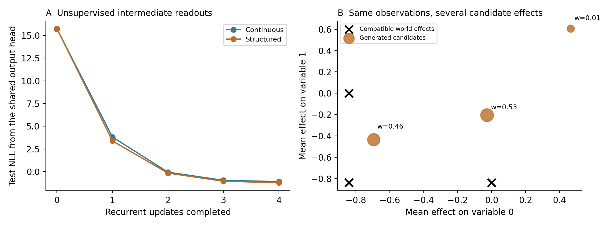

Figure 53. Left: shared-head test NLL by recurrent stage, with stage 0 before recurrence. Right: illustrative ambiguous case; crosses mark compatible true consequences, circles generated candidates, and labels/sizes indicate mixture weights. Source: CG-017, synthetic experiment.

### 23.8 Local input sensitivity

For the first eight predefined test cases per feedback model, finite differences with step 0.001 estimate the Jacobian of predicted means with respect to numerical inputs. Nine covariance coordinates are perturbed in synthetic tasks and 11 value coordinates in real tasks, comparing fixed original versus transplanted feedback by relative Frobenius difference. Real probes include masked input coordinates, and covariance perturbations are not restricted to the symmetric positive-definite manifold.

Mean relative Jacobian changes are 3.66%/3.32% for synthetic Continuous/Structured and 8.30%/5.12% for real data. Mean cosine similarities remain near 1. These local probes show small changes in numerical responsiveness, not population effects: the first eight cases can include repeated worlds or masks.

The participation ratio of centred generated-token covariance is approximately 4.40/4.18 in synthetic routes and 4.24/6.36 in real routes. This describes concentration of token variation and depends on format, scaling and sample distribution; it is not itself a capability measure.

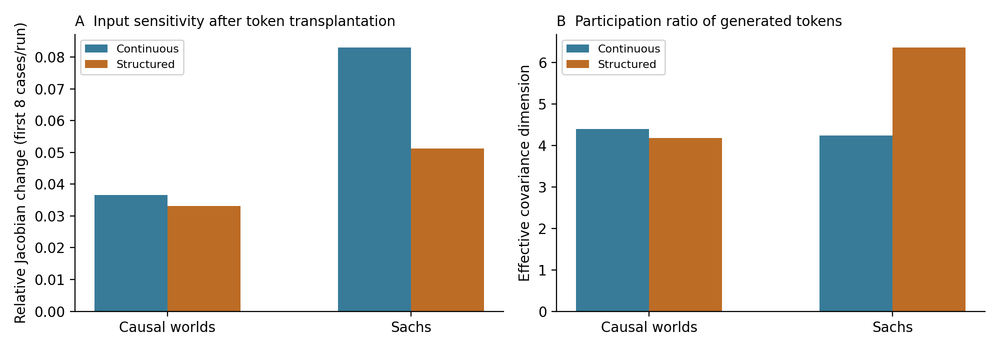

Figure 54. Local input-sensitivity changes and token covariance participation ratios. Values are descriptive run means from the specified probes. Source: CG-017, synthetic and Sachs real-data analyses.

### 23.9 Interpretation

Generated numerical objects have a measurable computational role: returning them to the model changes later objects and final predictions. This extends feedback experiments to completion and interventional consequence modelling.

Benefits depend jointly on format and task. Numerical candidates help the synthetic consequence distribution, whereas real-data improvements are dominated by recurrence and the additional feedback gain is small. Values, relations, local laws and mechanism hypotheses therefore merit separate comparisons.

Multiple candidates provide a limited representation of observational ambiguity and can be reweighted by intervention evidence. The present implementation adjusts predefined numerical slots; it does not establish unrestricted invention of new explanatory structures.

The results connect object format, feedback dependence and environment transfer, motivating the explicitly tested relation and mechanism representations that follow.

Sources: Sachs et al. (2005), Science, DOI 10.1126/science.1105809; CORNETO datasets/sachs/v1 measurements.tsv and condition_manifest.csv. Chapter 3 reference: Data-Oriented-Modelling-Reports, Research_Report/REPORT_EN.md, source snapshot c4be597eea26c1f70e941b0357a513f56edef9c1. Download provenance and SHA-256 are recorded in the evidence metadata.

## 24 CG-018 Generated relations and internal mechanism simulation

CG-018 extends numerical candidates into three sets of local equations. Conditions are imposed on each, consequences are solved, and relations plus simulated outputs can feed later states. A candidate can thus answer several interventions through the same internal structure.

There are 36 new training runs, reuse of four CG-017 routes and 72 internal-intervention evaluations of mechanism-feedback models. Both mechanism routes improve synthetic consequence distributions; real completion effects differ by target. Matched architectures and internal edits separate generated structure from repeated feedback.

### 24.1 Executable local models

A numerical answer records one consequence; local equations also specify interactions and how a change propagates from different entry points. CG-018 implements this distinction through candidates that can be subjected to new conditions.

The model generates three relation matrices B and mixture weights w, plus offsets b for real completion. Diagonals are zero and each row's absolute sum is at most 0.95, ensuring a stable linear solve. Candidates may contain signed couplings and feedback cycles; coefficients and weights are learned through final prediction loss.

$$
B_t,b_t,w_t=G_\theta(h_t),\qquad s_t=S(B_t,b_t,D)
$$

For synthetic queries, the internal solver replaces the target equation with the value 1 and solves the remaining means, computing all three target interventions each round. In real completion, six observed variables are fixed and affine equations solve five hidden variables. Candidate outputs are combined using w.

The synthetic generator receives covariance, support response and support target, but no query target. The final query selects among three precomputed consequences. Cross-query relation consistency is therefore architectural; relation content is learned.

### 24.2 Mechanism routes and training

Table 37. CG-018. Mechanism routes and training

| Route | Recurrent input | Final output |
| --- | --- | --- |
| Mechanism Blank | Data encoding and zero feedback | Generate equations and solve |
| Mechanism Feedback | Data encoding plus projected relations, weights and simulated consequences | Generate equations and solve |

Source: supplied CG-018 record. Synthetic and real-data panels. Blank cells mean not reported or not applicable; model, unit and adjustment details are specified in the adjacent methods.

Both routes use 48-dimensional state and four GRU updates. Feedback projects matrices, weights, simulated consequences and real offsets into a 16-dimensional token. Only final prediction is supervised. Blank and Feedback share module shapes, initialisation seeds and training batches.

Synthetic splits remain 400/100/100 parameter groups, each with three equivalent worlds and support/no-support conditions; training uses the original query. Sachs reuses 1,400 cells, eight masks, five target holdouts and training-only standardisation. Seeds are 11/22/33; Adam learning rate is 0.002, with 1,200 synthetic updates at batch 96 and 800 real updates at batch 64. Development selection occurs every 100 steps.

Mechanism models have 21,934 synthetic and 46,351 real parameters, compared with 21,052/21,195 in CG-017. Cross-family comparisons therefore change structure, inductive bias and capacity; the two mechanism routes control those module differences.

### 24.3 Synthetic consequence distributions

Table 38. CG-018. Synthetic consequence distributions

| Route | Synthetic NLL | Synthetic mean MSE | Real MSE |
| --- | --- | --- | --- |
| Direct | -0.7761 | 0.04186 | 1.7087 |
| Blank | -1.0740 | 0.03859 | 1.6371 |
| Continuous | -1.0875 | 0.03741 | 1.6329 |
| Numerical candidates | -1.2082 | 0.03812 | 1.6313 |
| Mechanism Blank | -1.7701 | 0.04001 | 1.6528 |
| Mechanism Feedback | -1.7557 | 0.03977 | 1.6605 |

Source: supplied CG-018 record. Synthetic and real-data panels. Lower NLL, MSE and MAE indicate better performance; these metrics are on different scales. Blank cells mean not reported or not applicable; model, unit and adjustment details are specified in the adjacent methods.

Mechanism Blank/Feedback give NLL −1.7701/−1.7557 versus −1.2082 for numerical candidates, improving in all three seeds. Original-query no-support coverage is 98.78%/97.11% versus 80.89%, using RMS ≤0.20 and weight ≥0.10.

Mean MSE instead is 0.04001/0.03977 for mechanism routes, 0.03812 for numerical candidates and 0.03741 for continuous feedback. The mechanism advantage concerns distributional organisation more than the mean: a mean summarises the centre, while a mixture can represent distinct possible outcomes.

Feedback wins in seed 11; Blank wins in seeds 22 and 33. Similar average NLL locates the main improvement in generated equations plus solver readout. Feedback dependence is separately assessed by intervention on trained models.

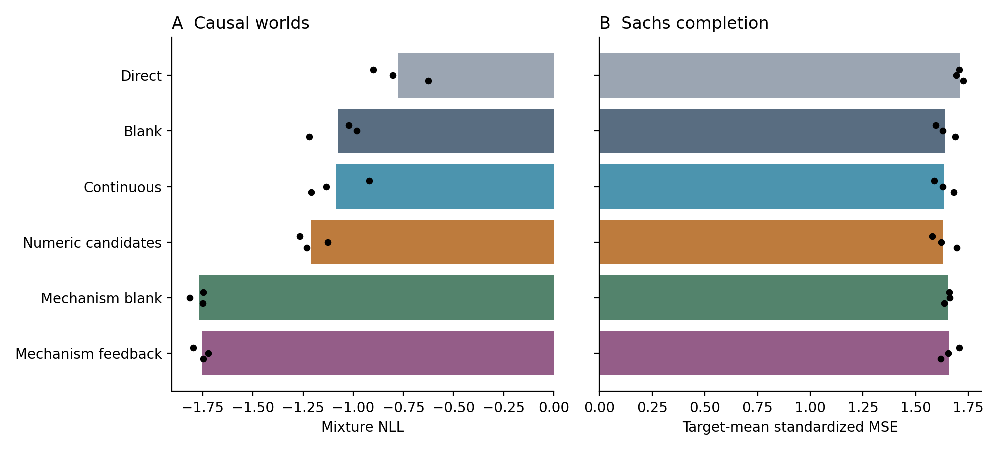

Figure 55. Original-query and real-completion performance across six routes. Points denote three training seeds; real results average targets equally. Lower NLL/MSE is better. Source: CG-018, synthetic and Sachs real-data analyses.

### 24.4 Reusing a candidate across three intervention queries

Each test context is evaluated at all three query targets with covariance and support fixed. This includes the original query and two replacements; with support, one replacement queries the support target itself. The 12 CG-017 synthetic checkpoints are evaluated identically.

Table 39. CG-018. Reusing a candidate across three intervention queries

| Route | Mean three-query NLL |
| --- | --- |
| Direct | -0.3185 |
| Blank | -0.5843 |
| Continuous | -0.4457 |
| Numerical candidates | -0.6082 |
| Mechanism Blank | -1.6298 |
| Mechanism Feedback | -1.5457 |

Source: supplied CG-018 record. Synthetic and real-data panels. Lower NLL, MSE and MAE indicate better performance; these metrics are on different scales. Blank cells mean not reported or not applicable; model, unit and adjustment details are specified in the adjacent methods.

Three-query NLL is −1.6298/−1.5457 for mechanism Blank/Feedback versus −0.6082 for numerical candidates. Query-switch checks show maximum change in generated relations of 0 and target-clamping error of 0 for all new checkpoints, confirming the intended architectural consistency.

A stricter descriptive measure concatenates three queries into a nine-dimensional consequence vector and requires one candidate of weight ≥0.10 to lie within joint RMS 0.20. Across three worlds in each of 100 no-support groups, joint coverage is 66.67%/55.00% for Blank/Feedback. Joint coverage imposes more structure than answering individual queries well.

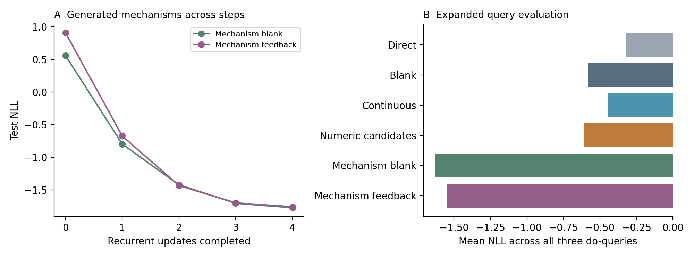

Figure 56. Shared mechanism-head NLL by recurrent stage and mean NLL across three queries. Intermediate-stage values are descriptive; training loss is applied after update four. Source: CG-018, synthetic experiment.

### 24.5 The generated relation matrices

The illustration uses no-support group 532, selected in CG-017 for maximally separated true outcomes, and seed 11. True worlds share covariance with key couplings approximately −0.842 and −0.838. Generated weights are approximately 0.294, 0.433 and 0.273.

Candidates are matched to true matrices by minimum total matrix distance for display only. Major couplings resemble some true relations, but extra links and cycles also appear. Matched all-query consequence RMS distances are 0.155, 0.328 and 0.285.

Unlike the earlier example with two dominant numerical candidates, all three mechanism candidates retain substantial weight. Their common and differing relations can now be assessed through multiple consequences rather than one answer.

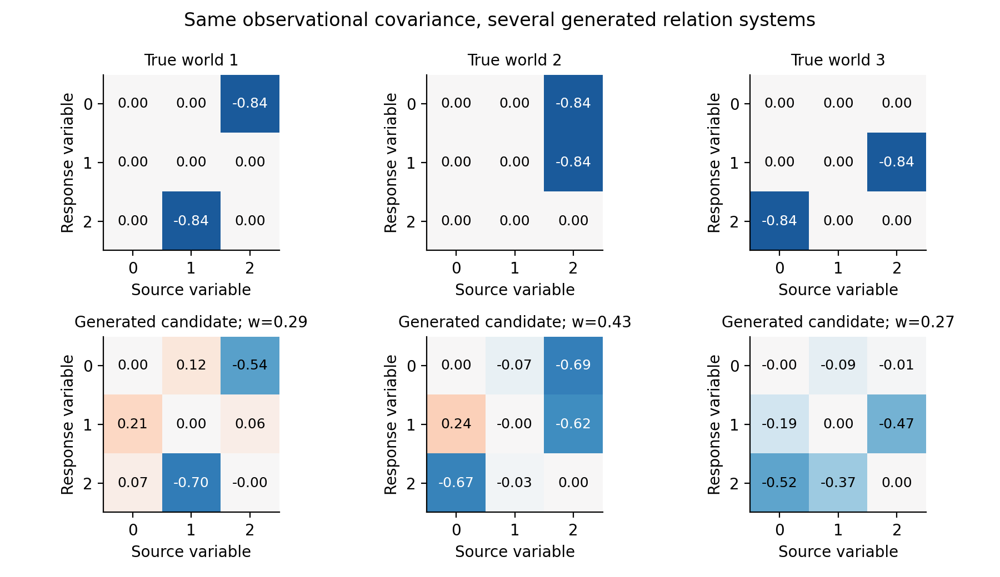

Figure 57. Three true and three generated relation matrices under the same observations. Rows are response variables, columns source variables and colours range from −1 to 1. Matching is for visual comparison; weights are model outputs. Source: CG-018, synthetic experiment.

### 24.6 Feedback of relations and simulated consequences

Four operations are applied to trained Mechanism Feedback: cut all explicit feedback; zero simulated consequences while retaining relations/weights; flip the largest-magnitude edge in the highest-weight candidate at step two; or retain the original process. After an edge edit, later relations regenerate. Inputs, parameters and GRU hidden-state transmission stay fixed.

Table 40. CG-018. Feedback of relations and simulated consequences

| Internal operation | Synthetic ΔNLL | Real ΔMSE |
| --- | --- | --- |
| Cut feedback | +0.14852 | -0.03969 |
| Zero simulated consequences | +0.06270 | -0.06953 |
| Temporary edge sign flip | -0.00084 | -0.00051 |
| Original process | +0.00000 | +0.00000 |

Source: supplied CG-018 record. Synthetic and real-data panels. Lower NLL, MSE and MAE indicate better performance; these metrics are on different scales. Blank cells mean not reported or not applicable; model, unit and adjustment details are specified in the adjacent methods.

Synthetic NLL changes from −1.7557 to −1.6071 when feedback is cut and to −1.6930 when simulated outputs are zeroed. The trained model uses both relations and consequences beneficially. Separately trained Mechanism Blank achieves −1.7701, showing that training-route comparisons and internal interventions answer different questions.

For real completion, original MSE 1.6605 improves to 1.6209 after cutting feedback and 1.5910 after zeroing simulated consequences. Current feedback can amplify errors in unseen environments; retaining relations while reducing repeated use of generated values helps here.

Generated matrices and simulated values are distinct computational objects. Their separate ablations show how an internally consistent prediction process may still propagate an environment-specific bias.

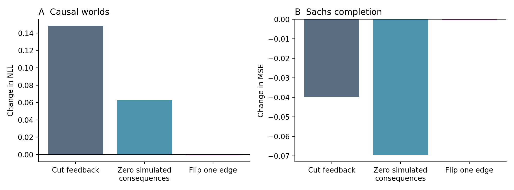

Figure 58. Loss changes after internal interventions. Positive denotes deterioration. When simulated consequences are zeroed in feedback, relations and weights remain available and final predictions still use the equation solver. Source: CG-018, synthetic and Sachs real-data analyses.

### 24.7 Propagation of a temporary edge edit

An edge flip immediately changes simulated consequences; subsequent generation retains the original context and hidden state while receiving the edited relation through feedback. The design tracks how a temporary modification is incorporated and attenuated.

For the first 32 predefined test inputs per run, synthetic prediction RMS displacement is 0.16495 at editing, then 0.01493, 0.00455 and 0.00233. Real displacement is 0.12927, 0.01513, 0.00898 and 0.00689. These are run means; real traces include eight masks of four cells and are descriptive repeated measurements.

The next relation matrix also changes, with full-test mean RMS shifts 0.01657 synthetic and 0.00270 real. Final prediction effects are smaller as relations regenerate.

Attenuation occurs for a temporary edit with context continuously retained. Both propagation and reduction of the edit are observed within four recurrent updates; this does not establish robustness to arbitrary persistent changes.

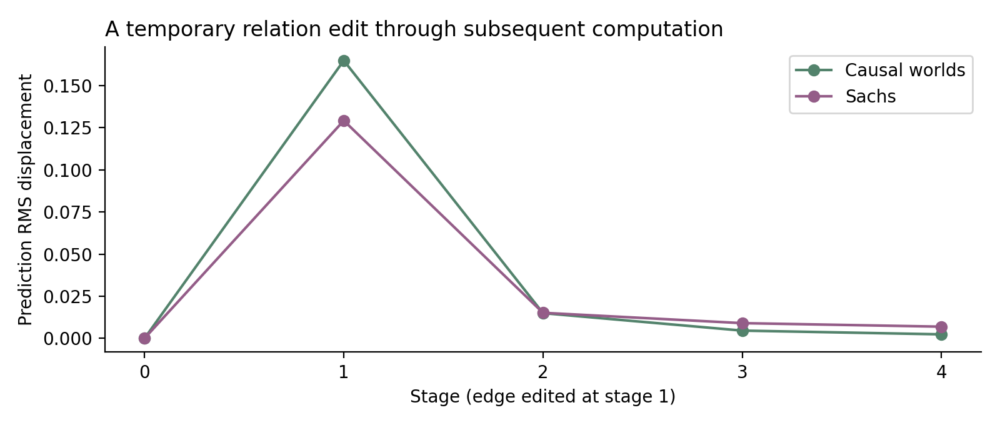

Figure 59. Prediction displacement after a temporary edge flip in the fixed trace subset. Editing occurs at stage 1; later stages regenerate freely. Source: CG-018, synthetic and Sachs real-data analyses.

### 24.8 Local equations and real environment differences

Table 41. CG-018. Local equations and real environment differences

| Held-out target | Numerical candidates | Mechanism Blank | Mechanism Feedback |
| --- | --- | --- | --- |
| AKT | 0.4516 | 0.4445 | 0.4649 |
| MEK | 1.7684 | 1.7582 | 1.7999 |
| PIP2 | 0.7148 | 0.7606 | 0.7398 |
| PKA | 1.5437 | 1.4741 | 1.5096 |
| PKC | 3.6782 | 3.8265 | 3.7885 |

Source: supplied CG-018 record. Synthetic and real-data panels. Blank cells mean not reported or not applicable; model, unit and adjustment details are specified in the adjacent methods.

Equal-target MSE is 1.6528/1.6605 for mechanism Blank/Feedback versus 1.6313 for numerical candidates. Mechanism Blank is better for AKT, MEK and PKA; numerical candidates are better for PIP2 and PKC. Representation suitability varies by environment.

Real-data equations depend on the input cell and mask and are learned from completion loss. They express the model's local computational relations and offsets, not verified biological mechanisms. Synthetic SCMs provide the separate setting with known equations and exact do-consequences.

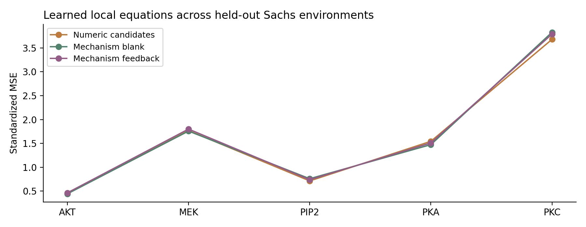

Figure 60. Completion performance for five unseen targets. Points average three seeds; both PKC perturbations belong to the same holdout group. Source: CG-018, Sachs real-data completion analysis.

### 24.9 Generated structure as reusable computation

Adding relations lets a candidate answer different intervention entry points through one common structure.

The specified equation format supplies the computation rule, while learning supplies coefficients and links. Its synthetic distributional gains can be evaluated jointly across questions.

Generating a relation and repeatedly consulting its consequences are different operations. Both mechanism routes learn useful synthetic candidates, and trained Feedback uses its simulated outputs. Real-data ablations show that the same loop can preserve a biased interpretation under shift.

Temporary editing demonstrates state evolution: an altered object changes later relations, while continuing context progressively reduces prediction displacement.

The experiment implements a concrete loop of generated equations, solved consequences and optional return to the recurrent state. Known synthetic systems permit causal checks; real perturbation data measure environment-dependent conditional prediction. The two panels support different claims.

Evidence: CG-018 reuses Sachs/CORNETO sources and CG-017 splits. The record includes 36 checkpoints, 72 internal-intervention evaluations, cross-query outputs and provenance. External measurements must be acquired from their sources; public release contents are specified in the evidence inventory.

## 25 CG-019 Cross-question reuse of generated mechanisms

CG-019 evaluates the six frozen CG-018 mechanism checkpoints on operations absent from training, without further learning. The question is whether generated relations are reusable computational structures beyond the original query.

### 25.1 Frozen-model evaluation

Mechanism Blank and Feedback, each with seeds 11/22/33, retain the 100 independent test parameter groups and 600 task instances spanning three equivalent worlds and support/no-support conditions. There are no gradient updates, development selection or new checkpoint choices. Final generated matrices B and weights w are reused directly.

Simultaneous double-do uses three target pairs and four sign combinations (+1,+1), (+1,−1), (−1,+1), (−1,−1): 12 untrained queries and 7,200 evaluations per checkpoint. The relational method replaces two equations and solves again. The comparison adds the same candidate's two single-do consequences linearly and then restores the two imposed target values.

Requested-edge deletion removes one of the true world's two nonzero edges r←s, then queries do(Xs=1). The same coordinate is deleted in every generated candidate before solving. True B defines the requested edit and exact evaluation consequence, but is not supplied to the generator. Each checkpoint has 1,200 requested-edge queries.

Controls either ignore the edit or delete each of four off-diagonal coordinates absent from the true graph. The latter was added after the main effect to distinguish coordinate-specific semantics from generic weakening. Paired effects are aggregated within 100 independent groups and then across seeds; 95% intervals use 10,000 group-bootstrap replicates.

### 25.2 Double-do solving relations versus combining answers

Table 42. CG-019. Double-do: solving relations versus combining answers

| Route | Relation-solve NLL | Single-do addition NLL | NLL improvement | Relation-solve coverage |
| --- | --- | --- | --- | --- |
| Mechanism Blank | −1.5281 | −1.1715 | +0.3566 | 92.89% |
| Mechanism Feedback | −1.4916 | −1.2454 | +0.2462 | 92.96% |

Source: supplied CG-019 record. Synthetic analysis. Lower NLL, MSE and MAE indicate better performance; these metrics are on different scales. Blank cells mean not reported or not applicable; model, unit and adjustment details are specified in the adjacent methods.

Both mechanism routes favour relational re-solving. Blank mean MSE falls from 0.04278 to 0.03952 (approximately 7.6%); Feedback falls from 0.04275 to 0.04085 (4.4%). Coverage rises from 88.63% to 92.89% and from 89.70% to 92.96%, respectively.

After averaging worlds, support conditions and 12 queries within groups, Blank NLL improvement is 0.3566 (95% CI 0.2977–0.4197), with 94/100 groups improving. Feedback improvement is 0.2462 (0.2050–0.2899), with 95/100 improving. All 12 query configurations improve after seed averaging.

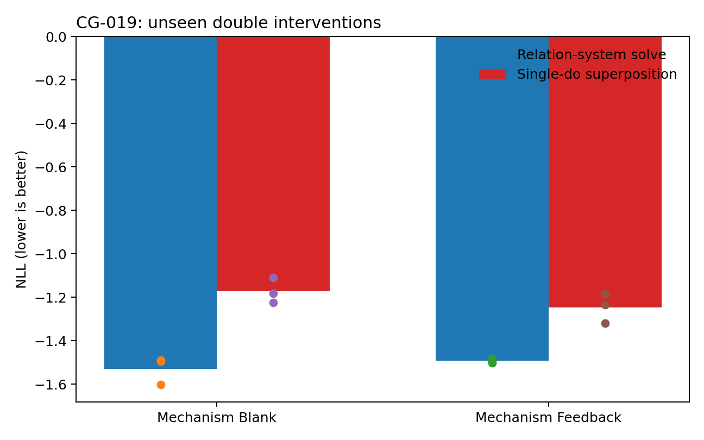

Figure 61. Models trained on single-variable +1 interventions are tested on simultaneous two-variable interventions with both signs. Re-solving generated relations outperforms adding single-do outputs. Bars are three-seed means; points are seeds. Source: CG-019, synthetic experiment.

### 25.3 Requested versus incorrect edge coordinates

Table 43. CG-019. Requested versus incorrect edge coordinates

| Route | Correct deletion NLL | Wrong deletion NLL | Ignored deletion NLL | Correct deletion MSE | Coverage |
| --- | --- | --- | --- | --- | --- |
| Mechanism Blank | −2.1140 | −0.8006 | −0.5015 | 0.02218 | 99.47% |
| Mechanism Feedback | −2.1043 | −0.9602 | −0.7134 | 0.02220 | 98.97% |

Source: supplied CG-019 record. Synthetic analysis. Lower NLL, MSE and MAE indicate better performance; these metrics are on different scales. Blank cells mean not reported or not applicable; model, unit and adjustment details are specified in the adjacent methods.

Blank NLL is −2.1140 after the correct edit, −0.8006 after wrong-coordinate edits and −0.5015 when ignoring the instruction. Feedback gives −2.1043, −0.9602 and −0.7134. Correct editing reduces MSE relative to ignoring by approximately 63.6% and 61.1%.

Correct-edit NLL improvements over ignoring are 1.6125 (95% CI 1.4903–1.7360) for Blank and 1.3909 (1.2757–1.5113) for Feedback, with all 100 groups improving. Improvements over wrong-coordinate edits are 1.3133 (1.2160–1.4106) and 1.1441 (1.0531–1.2408), again in 100/100 groups.

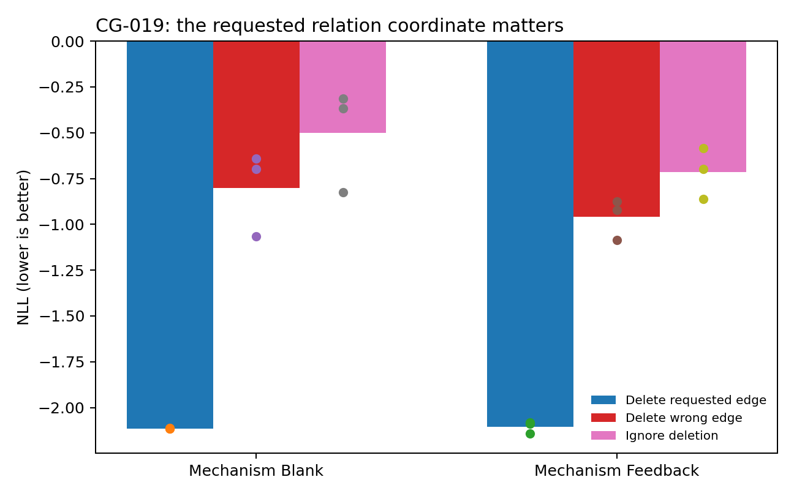

Figure 62. Correct coordinate deletion, wrong coordinate deletion and no deletion for the same requested edit. The aligned coordinate yields the best consequence distribution across both routes. Source: CG-019, synthetic experiment.

### 25.4 Coordinate-specific intervention effects

For the deleted edge's response variable, correlation between true-SCM and generated-model response displacement averages r = 0.9453 for Blank and 0.9382 for Feedback across seeds. Displacement signs agree in 99.33% and 99.47% of cases.

Generated coordinates therefore carry useful direction and consequence information under an external edit. Predicted magnitudes are attenuated, so this is not coefficient-by-coefficient recovery of the true SCM.

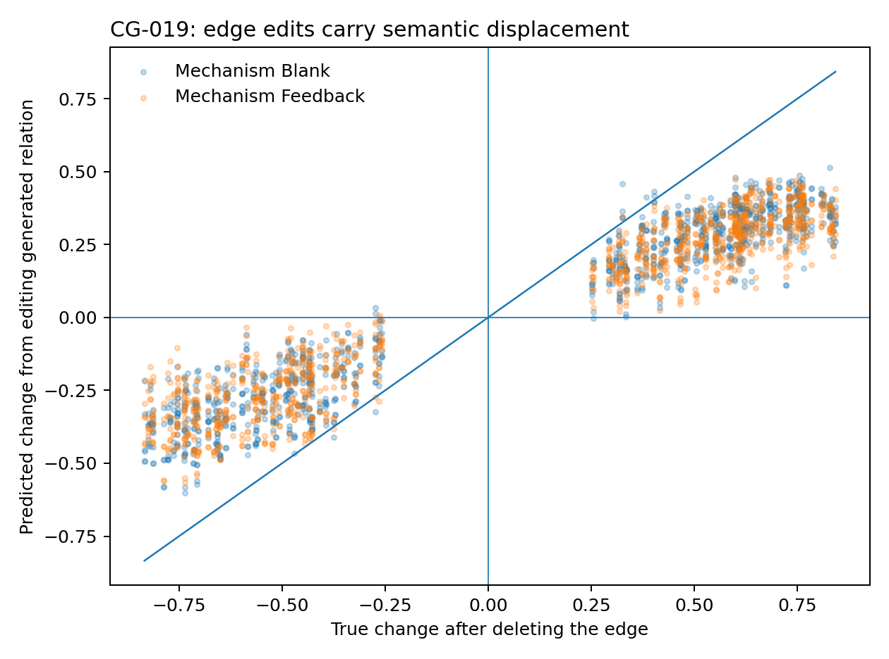

Figure 63. Response displacement after deleting a held-out true edge: true SCM on the horizontal axis and edited generated mechanism on the vertical axis. Predictions are averaged over three seeds. Both routes retain sign and relative-magnitude structure. Source: CG-019, synthetic experiment.

### 25.5 Interpretation of reusable structure

Frozen generated relations remain useful under simultaneous clamping and edge deletion in these three-variable worlds. They support operations beyond the original answer format.

Simultaneous clamping changes the governing equations together; adding isolated single-do answers does not reproduce that operation. Re-solving improves distributions in 94–95% of independent groups, supporting structural reuse for these combined queries.

The edit control tests where a change is applied. Correct, incorrect and absent edits yield distinct results, with the correct-coordinate advantage in all groups. This provides operational meaning for the generated matrix coordinates.

Blank performs at least as well as Feedback, including slightly better double-do NLL. Executability of the generated relation object is supported more strongly than superiority of repeated simulated-output feedback.

The same generated object accepts untrained combined interventions and local edits and produces directionally aligned consequences. Its value is measured through reuse, modification and solution, not merely an interpretable appearance.

### 25.6 Evidence and verification

All main results use six frozen CG-018 synthetic checkpoints. Query-level records retain 7,200 double-do and 1,200 requested-edge evaluations per checkpoint plus four wrong-edge alternatives per request. Reload checks find finite predictions/matrices, zero diagonals and maximum absolute row sum approximately 0.9500001, consistent with the numerical constraint.

The evidence supports executable cross-question structure in known three-variable linear SCMs, without refitting. Query records, group bootstrap, checkpoints, synthetic contexts, figures and verification code are included in the CG-019 record.

## 26 CG-020 Explicit object-state iteration

CG-018 retained a 48-dimensional GRU hidden state alongside relation feedback. CG-020 removes that parallel memory: only three matrices B and three candidate logits persist across updates. Fixed observation/support context is re-encoded each round; there is no recurrent hidden state or other cross-round latent cache.

The same three-variable worlds permit exact do-consequences. Four training updates define the scoring window, while the object transition is separately tested for continuation, saving, editing and longer rollout.

### 26.1 Attention controls for depth and persistent objects

Context comprises covariance and optional support response/target. Query target is excluded from generation. State Oₜ = (Bₜ,ℓₜ) contains three 3×3 matrices with zero diagonal and row-absolute-sum bound 0.95, plus three logits. Each transition encodes current state and fixed context as tokens, applies attention and forms a constrained relational update.

All routes use 32-dimensional tokens, four-head attention, 64-dimensional feed-forward layers and zero dropout. Seeds 11/22 each train for 450 updates, batch 64, Adam learning rate 0.0015. Development checkpoints are selected every 50 steps; batch RNG rules match within seed. Only final consequence-mixture loss supervises training.

Table 44. CG-020. Attention controls for depth and persistent objects

| Route | Parameters | Attention organisation | Explicit updates |
| --- | --- | --- | --- |
| OnePass-1 | 9,286 | One block | 1 |
| OnePass-3 | 26,374 | Three untied blocks | 1 |
| Tied6 | 9,286 | One block repeated six times within one generation | 1 |
| World4-3 | 26,374 | Three untied blocks as shared transition core | 4 |

Source: supplied CG-020 record. Synthetic analysis. Blank cells mean not reported or not applicable; model, unit and adjustment details are specified in the adjacent methods.

OnePass-3 and World4-3 each have 26,374 parameters. The former generates once; the latter makes B and logits the sole persistent state and applies its shared three-layer transition four times. Tied6 repeats one block six times inside one generation, controlling a different form of computational depth without added parameters.

### 26.2 Matched-parameter comparison

Table 45. CG-020. Matched-parameter comparison

| Route | Two-seed mean NLL | Mean MSE | No-support consequence coverage |
| --- | --- | --- | --- |
| OnePass-1 | −0.9427 | 0.04741 | 90.17% |
| OnePass-3 | −1.0106 | 0.04890 | 91.17% |
| Tied6 | −0.8149 | 0.04831 | 86.67% |
| World4-3 | −1.1242 | 0.04523 | 92.67% |

Source: supplied CG-020 record. Synthetic analysis. Lower NLL, MSE and MAE indicate better performance; these metrics are on different scales. Blank cells mean not reported or not applicable; model, unit and adjustment details are specified in the adjacent methods.

OnePass-3 to World4-3 NLL improves from −0.9299 to −1.0894 in seed 11 and from −1.0913 to −1.1591 in seed 22. Mean gain is 0.1136, with group-bootstrap 95% CI 0.0517–0.1795 after aggregating 600 instances into 100 groups. NLL improves in 57/100 groups, with larger positive effects. Mean MSE falls from 0.04890 to 0.04523 (approximately 7.5%); 74/100 groups improve, with difference CI 0.00241–0.00504.

OnePass-3 improves on OnePass-1 on average but not in both seeds; Tied6 mean NLL is −0.8149. The consistent matched-parameter result concerns repeated revision of an explicit object, not a general benefit from more block calls.

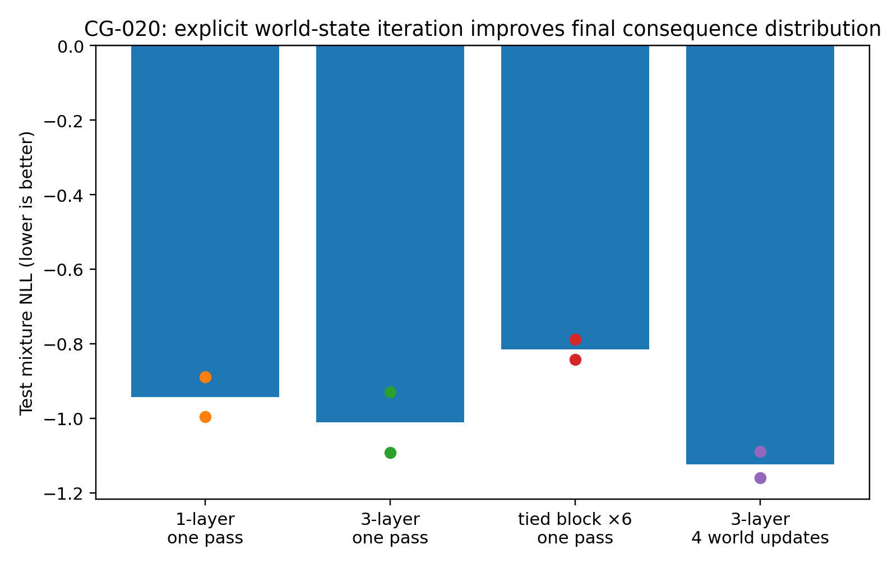

Figure 64. Four attention routes without recurrent hidden state. Bars are two-seed mean NLL and points individual seeds. World4-3 improves both seeds relative to the parameter-matched OnePass-3. Source: CG-020, synthetic experiment.

### 26.3 Save and resume using only the object

After update two, only B₂ and logits₂ are serialised. Restarting updates three/four from fixed context and this object reproduces uninterrupted output elementwise, with maximum error 0 in both seeds. The explicit object is sufficient for continuation in this implementation.

Calling OnePass-3 four times while resetting B/logits before each call produces the same result as one call, again with maximum difference 0. Repeated invocation without persistent state does not accumulate information.

### 26.4 Erasure, transplantation and editing

At step two, World4-3 state is either zeroed; transplanted from another parameter group with matched query/support status; or edited by reversing the largest edge in the highest-weight candidate. Recipient context and model parameters are fixed, followed by two more updates.

Table 46. CG-020. Erasure, transplantation and editing

| Condition | seed 11 NLL | seed 22 NLL | Change from own baseline |
| --- | --- | --- | --- |
| Baseline | −1.0894 | −1.1591 | — |
| Erase at step 2 | −1.0603 | −1.1572 | +0.0292 / +0.0019 |
| Transplant at step 2 | −1.0116 | −1.1430 | +0.0779 / +0.0161 |
| Flip one edge, then continue | −1.0650 | −1.1532 | +0.0244 / +0.0058 |

Source: supplied CG-020 record. Synthetic analysis. Lower NLL, MSE and MAE indicate better performance; these metrics are on different scales. Blank cells mean not reported or not applicable; model, unit and adjustment details are specified in the adjacent methods.

All three operations worsen final NLL in both seeds. A transplanted object still alters final predictions despite preserved recipient context and two remaining updates. The object therefore participates in subsequent computation rather than serving only as a displayed output.

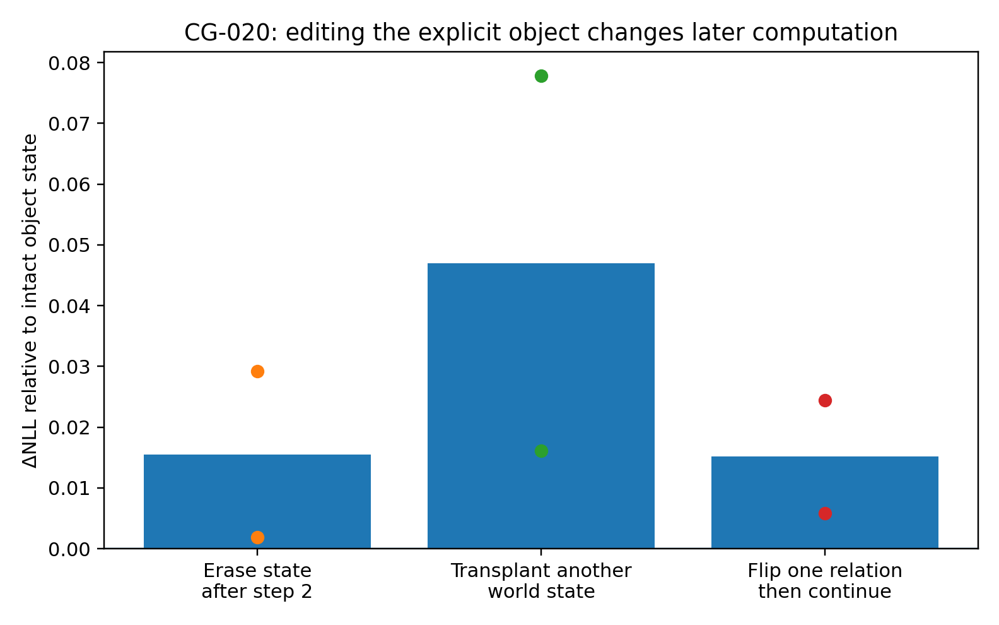

Figure 65. NLL changes after step-two state interventions and continued updates. Positive denotes deterioration; each point is a training seed. Source: CG-020, synthetic experiment.

### 26.5 Edge-edit propagation without hidden recurrence

At editing, prediction RMS shifts are 0.11583/0.09566 for seeds 11/22. After one explicit update they shrink to 0.02967/0.01105 and at update four to 0.01191/0.00252.

The transition reads edited B together with fixed context to generate the next B. No parallel recurrent state can retain the previous trajectory. The observed attenuation therefore occurs through explicit-object revision conditioned on context.

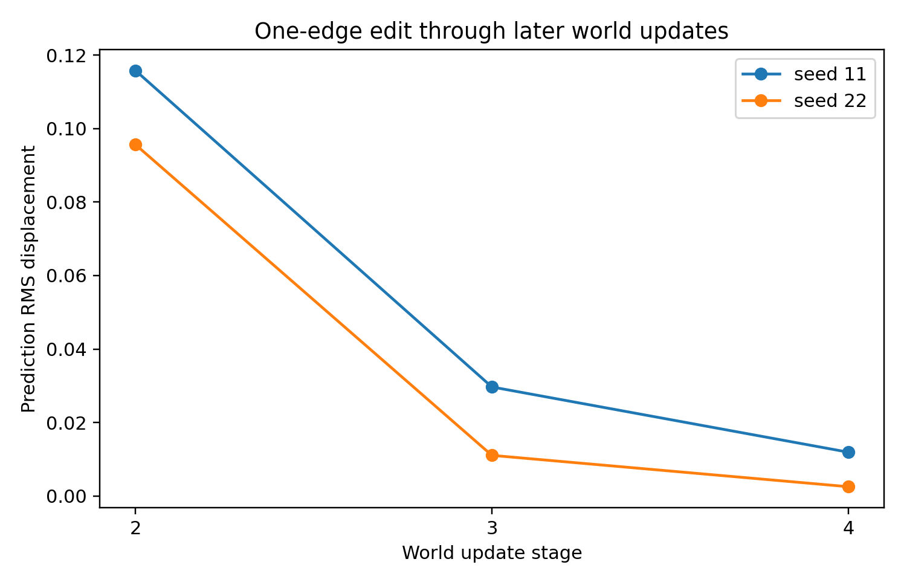

Figure 66. Prediction displacement after a step-two edge flip. Both seeds show a large immediate shift followed by attenuation through explicit updates. Source: CG-020, synthetic experiment.

### 26.6 Extending four-step training to 20 updates

Frozen World4-3 is run for 20 updates on the first 200 predefined test cases. Seed 22 approaches a fixed point: adjacent-B RMS falls from 0.04170 at step two to approximately 4×10⁻⁶ at step 10 and 7.8×10⁻⁸ at step 20. NLL moves from −0.7327 at step four to approximately −0.7319.

Seed 11 exhibits a shrinking two-cycle: B-step RMS falls from 0.07861 to 0.00672 by step 20, while NLL alternates around −0.65 to −0.66. Averaging seeds, NLL is −0.6988 at step four and −0.6975 at step 20; B-step RMS falls from 0.06016 at step two to 0.00336. The tested rollout remains stable or contracting beyond training length.

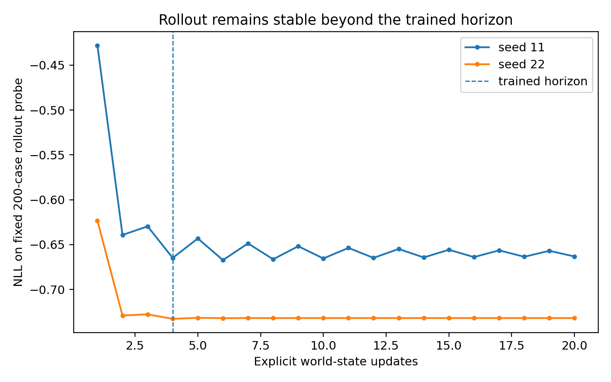

Figure 67. Frozen World4-3 rollout to 20 updates after training only at update four. Both seeds remain within a stable performance range on the fixed subset. Source: CG-020, synthetic experiment.

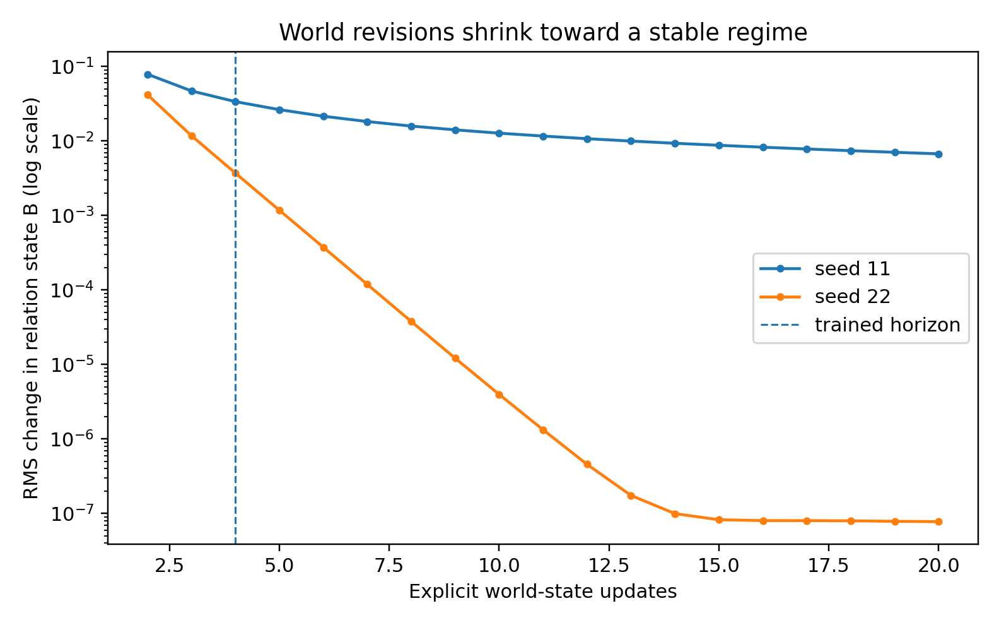

Figure 68. RMS change between successive relation states, on a logarithmic scale. Seed 22 approaches a fixed point; seed 11's alternating updates shrink. Source: CG-020, synthetic experiment.

### 26.7 Reuse under combined interventions and edge edits

Double-do mean NLL is −1.0607 for OnePass-3 and −1.0655 for World4-3, with inconsistent seed-wise direction. Performance is retained rather than clearly improved.

Correct-edge-deletion NLL improves from −1.6945 to −1.8524 in both seeds. World4-3 edit displacements correlate with true effects at mean r = 0.9613, with 99.75% sign agreement. Explicit refinement preserves edit semantics and improves this consequence distribution.

### 26.8 Interpretation of explicit persistent state

The save/resume result locates the entire persistent computational state in B and candidate weights. It removes the ambiguity between using the generated object and relying on a parallel recurrent memory.

Repeated attention within one generation and repeated revision of an explicit object are distinct designs. Tied6 provides no corresponding gain here, while matched-parameter World4-3 improves both seeds. The relevant difference is the state supplied to subsequent computation.

Longer rollout shows either near-fixed-point behaviour or contracting alternation beyond the four-step training window. This is a finite stability probe, not a guarantee for arbitrary horizons.

Across CG-017–020, intermediate numerical candidates become relations, reusable mechanisms and then serialisable persistent states. The resulting implementation supports execution, revision and continued rollout of explicit statistical models.

### 26.9 Evidence and verification

Four architectures × two seeds yield eight new checkpoints on the shared synthetic split, without external measurements. World4-3 diagonals are exactly zero; maximum row sums are 0.8919/0.8893. Resume error is 0 for both seeds. The record contains checkpoints, logs, instance results, 100-group bootstrap, edits, 20-step rollout, code, protocol and Figures 64–68.

## 27 CG-021 An unpruned hypothesis pool

CG-021 retains multiple explicit candidate models without KEEP/DROP/BRANCH rules, winner selection or top-k pruning. There are no candidate-to-true-world assignments or sparsity, entropy or diversity objectives. All candidates remain present; final consequence loss changes relations and mixture mass continuously.

The three-variable panel and four-update score are a restricted probe of candidate-state organisation, evidence uptake and consequence generation. Longer state use remains a separately testable property.

### 27.1 Candidate capacity without discrete selection

Both routes share a three-layer attention transition with 32-dimensional tokens, four heads, feed-forward width 64 and zero dropout. Each candidate token contains a complete 3×3 B and one logit; self-attention links candidates and three variable-context tokens. Diagonals are zero and absolute row sums are bounded by 0.95.

Pool3 and Pool8 provide three and eight candidates. Proposal seeds have no assigned semantic roles. Parameter counts are 26,764 and 26,924, a difference of 160. Seeds 11/22 train for 450 updates with batch 64 and Adam learning rate 0.0015. Supervision is final mixture NLL after update four.

In support-present tasks, the first two rounds receive covariance only; round three reveals support response and target. This permits within-model comparison before and after evidence without specifying which candidate should survive.

Table 47. CG-021. Candidate capacity without discrete selection

| Route | Candidate capacity K | Parameters | Discrete selection rule | Supervision |
| --- | --- | --- | --- | --- |
| Pool3 | 3 | 26,764 | None | Final consequence NLL |
| Pool8 | 8 | 26,924 | None | Final consequence NLL |

Source: supplied CG-021 record. Synthetic analysis. Blank cells mean not reported or not applicable; model, unit and adjustment details are specified in the adjacent methods.

### 27.2 Use of the wider candidate pool

Table 48. CG-021. Use of the wider candidate pool

| Route | Two-seed mean test NLL | Mean MSE | Effective count before/after evidence |
| --- | --- | --- | --- |
| Pool3 | −1.1443 | 0.04622 | 2.848 → 2.938 |
| Pool8 | −1.3220 | 0.04520 | 7.436 → 7.444 |

Source: supplied CG-021 record. Synthetic analysis. Lower NLL, MSE and MAE indicate better performance; these metrics are on different scales. Blank cells mean not reported or not applicable; model, unit and adjustment details are specified in the adjacent methods.

Pool8 improves final NLL in both seeds. Across 100 independent groups, mean improvement over Pool3 is 0.1777 (10,000-bootstrap 95% CI 0.0993–0.2617), with 64/100 groups improving. MSE decreases from 0.04622 to 0.04520. Cardinality and a small number of seed parameters both change, so the result supports usable extra capacity here, not a universally optimal pool size.

Pool8 effective candidate count is 7.436 before evidence and 7.444 after; Pool3 changes from 2.848 to 2.938. Mass remains distributed across most available candidates rather than collapsing to a few winners.

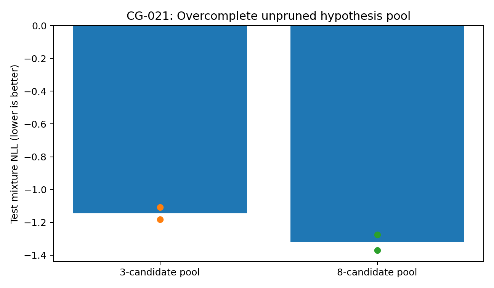

Figure 69. Test NLL for Pool3 and Pool8 without discrete selection rules. Bars average two seeds; points show each seed. Source: CG-021, synthetic experiment.

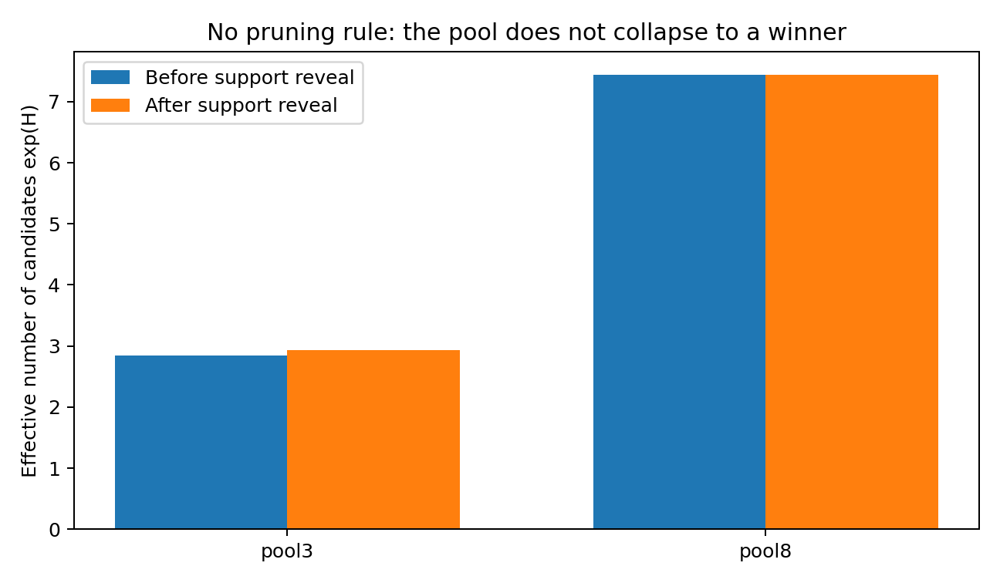

Figure 70. Effective candidate count exp(H) before and after support. Pool8 retains nearly its full eight-candidate distribution. Source: CG-021, synthetic experiment.

### 27.3 Evidence primarily changes relations

With new support, relation-update RMS rises from 0.0601 to 0.0739 for Pool3 and from 0.0447 to 0.0549 for Pool8, approximately a fifth larger. Weight total variation changes only from 0.1010 to 0.1094 and from 0.0423 to 0.0443.

Evidence therefore acts more strongly on relation content than on wholesale mixture-mass redistribution, especially in Pool8. The experiment does not show discrete selection of a single correct world.

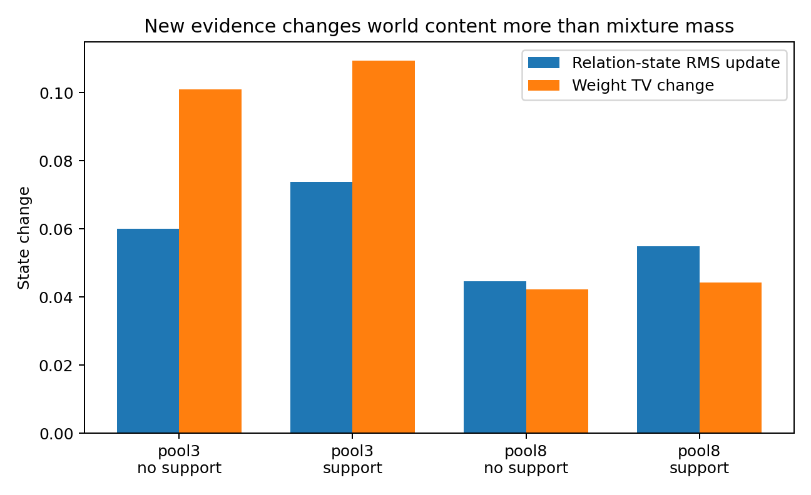

Figure 71. Changes from rounds two to four in B RMS and weight total variation, with and without newly revealed support. The added effect is larger on relation content. Source: CG-021, synthetic experiment.

### 27.4 Evaluation-only pruning

Frozen Pool8 is evaluated after retaining only the top three weights and renormalising. A second comparison averages results over all 56 three-of-eight subsets. Neither operation appears in training.

Top-3 pruning worsens group NLL by 1.256 (95% CI 1.049–1.477); the full pool wins in 91/100 groups. Averaging all three-candidate subsets worsens NLL by 0.861, with the full pool better in all 100 groups.

Information in this trained mixture is distributed across the candidate population. Post-hoc reduction to three disrupts its consequence distribution; this does not rule out differently trained sparse models.

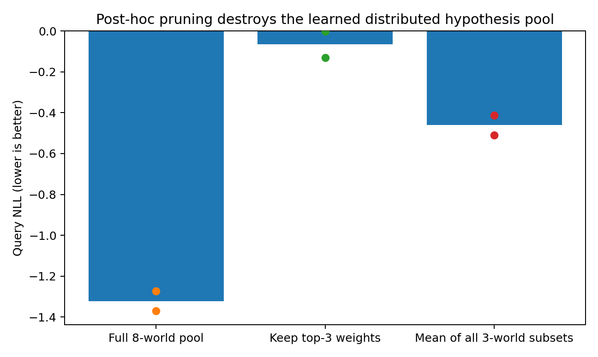

Figure 72. Frozen Pool8 pruning controls. Top-3 retention and averaging three-candidate subsets both worsen the trained mixture NLL. Source: CG-021, synthetic experiment.

### 27.5 Query benefit versus cross-query consistency

Persistent support improves the scored-query NLL over no support by 0.0753 for Pool3 and 0.0298 for Pool8, with the same direction in all four checkpoints.

Across all three do-queries on the same final relations, average improvement is approximately −0.0017 for Pool3 and −0.0509 for Pool8. Support helps the scored query without necessarily improving joint consequence consistency.

Final-task supervision can produce a useful explicit computational state without identifying the true generating mechanism. Improvement on one readout may coexist with deterioration on unscored queries.

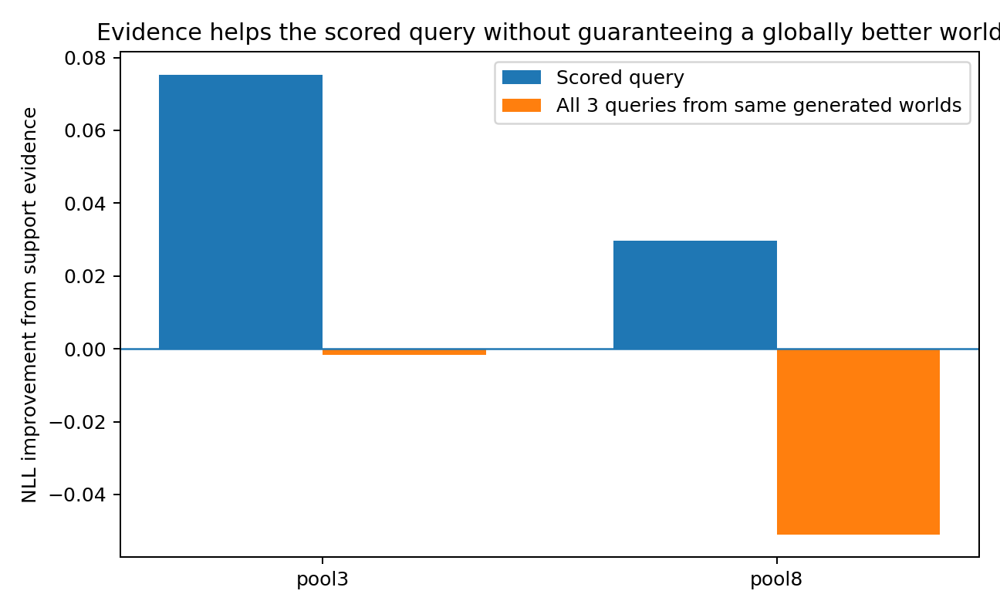

Figure 73. Support effects on the trained query and three-query evaluation. Local predictive gain does not automatically imply global mechanism consistency. Source: CG-021, synthetic experiment.

### 27.6 A transient support pulse

Support is shown only at round three and removed at round four. Approximately 44.9%/43.4% of the induced relation-state displacement remains for Pool3/Pool8 after removal. Final predictions differ from never-support by RMS 0.0116/0.0105. The explicit state therefore retains a trace of transient evidence.

The pulse nevertheless worsens query NLL by approximately 0.0097/0.0194 relative to never-support. Persistent support in rounds three/four is required for the positive effects above. Storing evidence and using a one-time observation beneficially are different achievements.

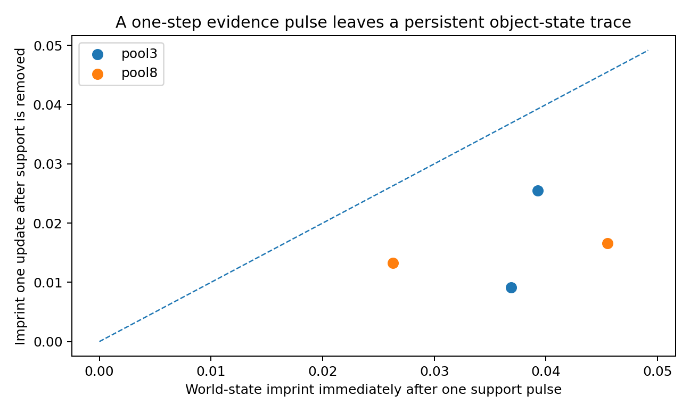

Figure 74. Relation-state imprint at the support pulse in round three and after support removal in round four. The dashed line denotes complete retention. Source: CG-021, synthetic experiment.

### 27.7 Support transplanted from another compatible world

Support from another true world in the same observationally equivalent group is supplied while recipient covariance/query stay fixed. Prediction RMS changes average 0.0321/0.0255 for Pool3/Pool8. Mean recipient-minus-donor consequence NLL is +0.142/+0.083, indicating average movement toward donor consequences.

Donor NLL is lower in only approximately 42%/41% of individual cases. Evidence content affects the population, but does not produce a simple discrete switch to the donor world.

### 27.8 Distributed hypothesis representations

Without imposed selection, eight candidates retain substantial mass and evidence primarily revises their contents. The observed organisation differs from a predefined competition ending in one surviving hypothesis.

Both pruning controls show that a simple top-k list does not capture the full trained distribution. This is a distributed candidate representation under this objective, not evidence that all tasks require unpruned pools.

The population stores, changes and responds to evidence, but remains distinct from a globally correct causal model. The scored-query versus joint-query discrepancy identifies an important limit of task-local supervision.

Persistent, editable candidate populations permit separate measurement of their organisation, evidence-induced deformation and cross-query consistency, without encoding a discrete selection policy in advance.

### 27.9 Evidence and verification

Four new checkpoints cover two pools and two seeds. Reloaded predictions, B trajectories and logits reproduce saved values with maximum error 0. Diagonals are zero and row sums below 0.891. Support/no-support twins are identical through round two, before evidence revelation. Records include training, dynamics, group bootstrap, pruning, support pulses, transplants, Figures 69–72 and checkpoints.

## 28 CG-022 Consequence-supervised executable mechanism models

CG-022 retains explicit state, attention updates and a wide candidate pool while changing supervision: the same generated relations must support several operations and their consequences. The focus is functional reuse of the learned model.

The three-variable system is a restricted test environment. Training randomises internal update length between three and six rounds; frozen evaluation extends to 20. This distinguishes the training window from the evaluated continuation range.

### 28.1 Shared architecture and changed objectives

The architecture follows Pool8: eight candidate relation systems, persistent state only (Bₜ,logitsₜ), three attention layers per update, token width 32, four heads and feed-forward width 64. There is no recurrent hidden state, pruning or candidate-to-truth assignment.

The experimentally varied component is the training objective. It tests whether supervision over multiple consequences produces relation matrices that remain useful under different operations.

True B is neither input nor an intermediate training label. Supervision concerns post-operation consequences; coordinate-specific delete, half and sign-flip behaviour must arise through these tasks.

### 28.2 Training and held-out operation banks

The 21 training operations comprise six single-do interventions at ±1, nine double-do interventions over three pairs and three sign patterns, and deletion of each of six off-diagonal coordinates followed by source do(+1). Each batch samples six operations to be answered by the same generated population.

The 30 held-out operations include single-do at ±0.5/±1.5, withheld double-do value combinations, and halving or sign-flipping a relation followed by source intervention. Frozen generated matrices execute these operations without new training.

Table 49. CG-022. Training and held-out operation banks

| Stage | Operation type | Count | Used in training |
| --- | --- | --- | --- |
| Training | single-do：±1 | 6 | Yes |
| Training | Double-do with three value patterns | 9 | Yes |
| Training | edge delete + source do | 6 | Yes |
| Frozen test | single-do：±0.5 / ±1.5 | 12 | No |
| Frozen test | held-out double-do values | 6 | No |
| Frozen test | edge half + source do | 6 | No |
| Frozen test | edge sign-flip + source do | 6 | No |

Source: supplied CG-022 record. Synthetic analysis. Blank cells mean not reported or not applicable; model, unit and adjustment details are specified in the adjacent methods.

### 28.3 Three objective variants

Broad operator training optimises sampled-bank NLL alone. It improves held-out NLL from the CG-021 baseline −1.148 to −1.243, but worsens original-query NLL from −1.322 to −1.219. Broader supervision changes the tradeoff between readouts.

Balanced training combines original-query loss, operator-bank loss and a support-observation term. It achieves original-query NLL −1.376 and held-out-bank NLL −1.370, improving both endpoints.

Evidence-coupled training additionally rewards better downstream consequences with correct support than in a support-masked counterfactual run of the same case. It does not assign candidate identities. Final two-seed NLL is −1.371 for original queries, −1.656 for training operations and −1.374 for held-out operations.

Table 50. CG-022. Three objective variants

| Variant | Original query NLL | Training bank NLL | Held-out bank NLL |
| --- | --- | --- | --- |
| CG-021 Pool8 | −1.3220 | −1.4652 | −1.1480 |
| Broad operator training | −1.2195 | −1.5801 | −1.2426 |
| Balanced | −1.3765 | −1.6428 | −1.3705 |
| Evidence-coupled | −1.3712 | −1.6557 | −1.3744 |

Source: supplied CG-022 record. Synthetic analysis. Lower NLL, MSE and MAE indicate better performance; these metrics are on different scales. Blank cells mean not reported or not applicable; model, unit and adjustment details are specified in the adjacent methods.

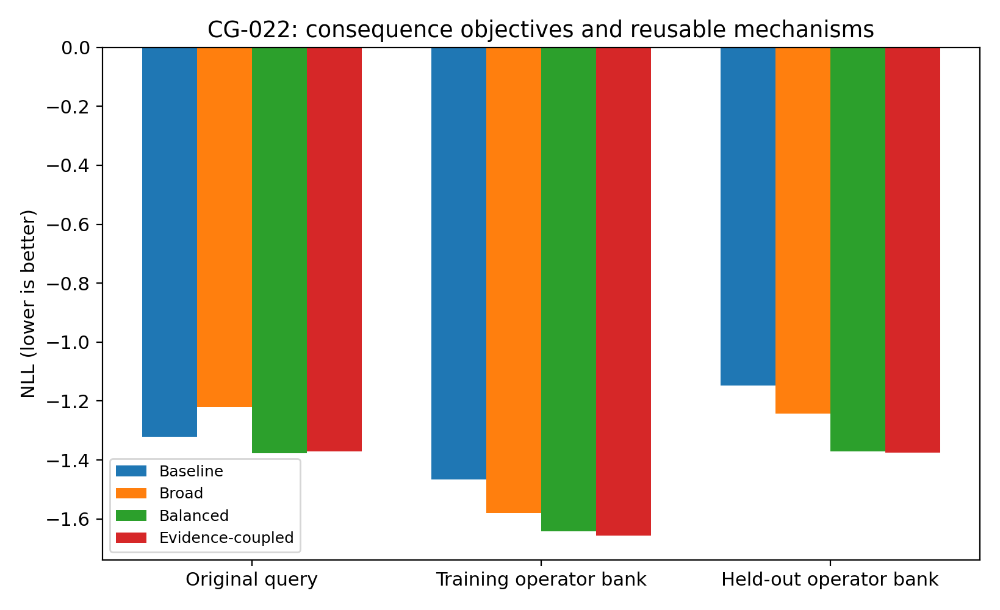

Figure 75. Objective comparisons. Broad operation training trades original-query performance for wider operation skill; balanced and evidence-coupled objectives retain both. Values are from the supplied training/evaluation records. Source: CG-022, synthetic experiment.

### 28.4 Generalisation to untrained operations

After averaging repeated instances and seeds within 100 independent groups, Evidence-coupled improves held-out-bank NLL over CG-021 by 0.2264 (10,000-bootstrap 95% CI 0.1923–0.2640), with 95/100 groups improving. Training-bank gain is 0.1905 (0.1639–0.2184), also in 95/100 groups.

Original-query gain is 0.0492, with 64/100 groups improving and CI −0.0134–0.1072. This supports retention with a small observed gain, not a definite population advantage on the original query.

Held-out single-do NLL improves from −1.2251 to −1.3908; double-do from −1.3502 to −1.6246; edge-half from −1.5710 to −1.6849; and sign-flip from −0.3685 to −0.7809. Each family has a paired group-bootstrap improvement interval above zero.

Table 51. CG-022. Generalisation to untrained operations

| Held-out family | CG-021 Pool8 NLL | Evidence-coupled NLL | Mean improvement | 95% bootstrap CI |
| --- | --- | --- | --- | --- |
| New single-do values | −1.2251 | −1.3908 | 0.1657 | 0.1168–0.2156 |
| Held-out double-do | −1.3502 | −1.6246 | 0.2744 | 0.2298–0.3207 |
| Edge half | −1.5710 | −1.6849 | 0.1139 | 0.0920–0.1370 |
| Edge sign-flip | −0.3685 | −0.7809 | 0.4125 | 0.3167–0.5129 |

Source: supplied CG-022 record. Synthetic analysis. Lower NLL, MSE and MAE indicate better performance; these metrics are on different scales. Blank cells mean not reported or not applicable; model, unit and adjustment details are specified in the adjacent methods.

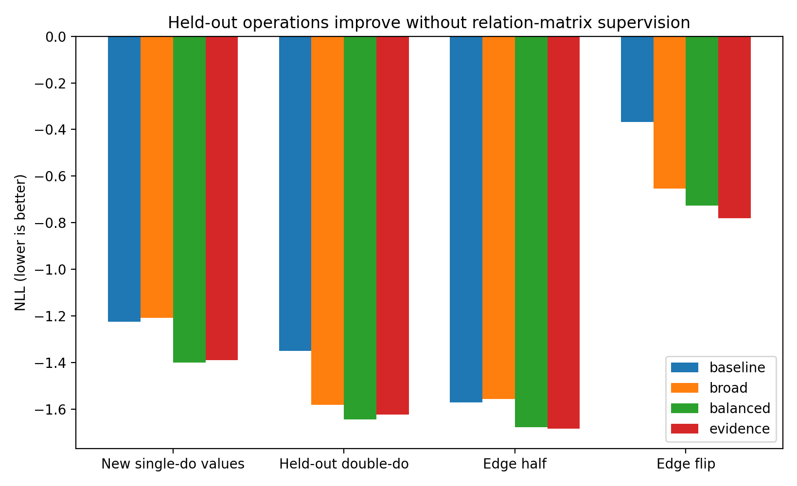

Figure 76. Four held-out operation families executed through generated relations without B supervision. The tests alter values, combine interventions and edit relation coefficients. Source: CG-022, synthetic experiment.

### 28.5 Support improves downstream operation use

Correct support improves support-observation NLL by 0.0646 in Balanced and 0.1359 in Evidence-coupled. On held-out operations, Evidence-coupled gains 0.0273 relative to masking support in the same case, positive in both seeds. Support therefore contributes modest downstream benefit.

Wrong-support transplantation changes original-query NLL by only +0.0022 on average. For cases with recipient/donor consequence RMS >0.4, the change is +0.0036 and donor consequences are preferred in approximately 53.7%. The model is not a hard switch to whichever world supplies support.

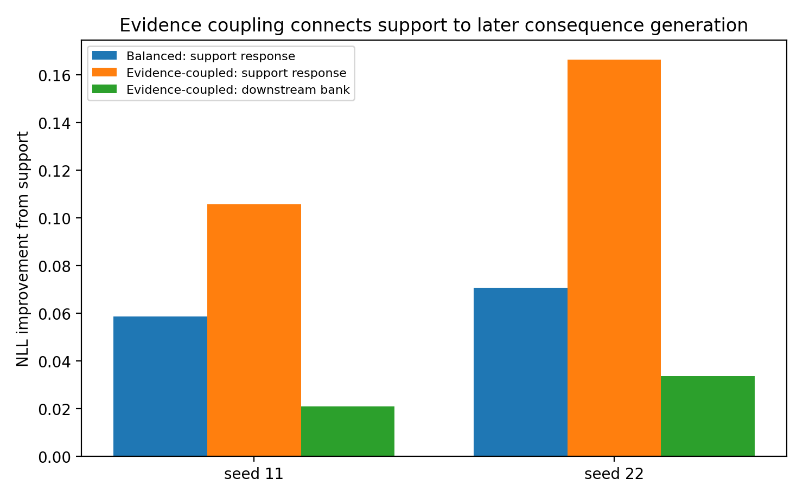

Figure 77. Support use under balanced and evidence-coupled objectives. Evidence coupling strengthens both support reconstruction and its contribution to held-out operations. Source: CG-022, synthetic experiment.

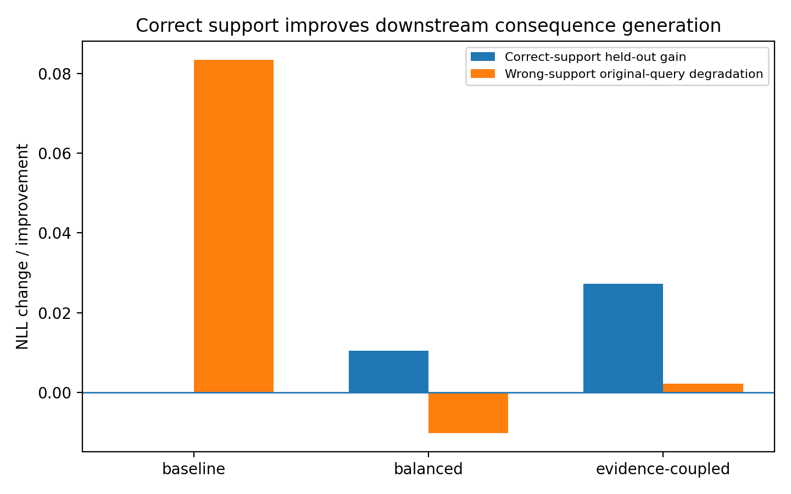

Figure 78. Correct-support downstream gain and wrong-support original-query change. Effects indicate modest continuous revision rather than a specified discrete world switch. Source: CG-022, synthetic experiment.

### 28.6 Consequence accuracy versus parameter recovery

Weighted B distance changes only from approximately 0.2549 to 0.2536, and best-candidate distance from 0.1769 to 0.1663, while held-out NLL improves by 0.2264.

The objective improves functional execution more strongly than exact parameter recovery. An internal relation model may approximate consequences over an operation family without reproducing every true coefficient. These are distinct evaluation endpoints.

### 28.7 Continuation beyond the training window

On the first 200 fixed test instances, frozen Evidence-coupled held-out-bank NLL is −1.3334 at update four and −1.3303 at update 20. Adjacent-state RMS is approximately 1.70×10⁻⁶ at update 20.

The learned transition remains usable over the tested extended rollout and approaches a stable state. The finite test does not establish unlimited continuation.

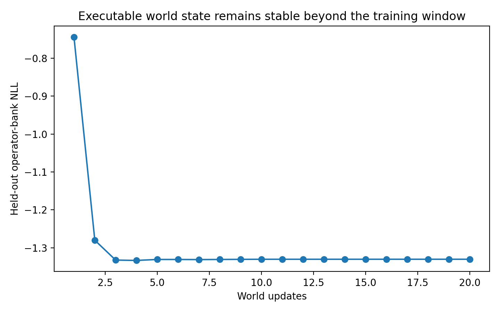

Figure 79. Frozen rollout to 20 updates. Held-out-operation NLL remains stable as relation updates approach a fixed point. Source: CG-022, synthetic experiment.

### 28.8 Functional evaluation of generated mechanisms

The principal test is execution of 30 held-out operations: changed intervention values, combined interventions, half-strength edges and sign reversals. This gives an operational criterion for the generated relation model.

The three objectives show why training must address original-task performance, cross-operation reuse and evidence-dependent consequences together. Broadening tasks alone can weaken the original readout; balanced supervision restores it, and evidence coupling improves support use.

The eight candidates remain distributed. Their common interface supports solving, deleting, scaling and flipping relations, while support modifies later consequences and state updates continue beyond training length.

Within this synthetic system, consequence-only supervision produces an explicit model with improved cross-operation functionality. Parameter recovery remains a separate, only modestly improved property.

### 28.9 Verification and evidence

Six new checkpoints cover three objectives and two seeds. Reloaded B/logit trajectories have maximum error 0; diagonals are zero and maximum row sum is 0.8889. Saving only (B₂,logits₂) and resuming to update four reproduces final state exactly. Records include operator results, 100-group bootstrap, support controls, 20-step rollout, Figures 75–78, logs and checkpoints.

## 29 CG-023 Observation coordinates and executable dynamics

CG-023 tests whether one generated mechanism can integrate different observation coordinates and produce states beyond the training horizon, extending the operation-based evaluation of CG-022.

Container order and generating order are separated. Permuting evidence rows should not change their meaning; temporal direction, forcing-to-equilibrium response and forecast horizon are semantic coordinates that the model must retain.

### 29.1 Two observation types from one system

The experiment creates 600 stable four-variable affine worlds, xₜ₊₁ = Mxₜ + b. Spectral radii are approximately 0.72–0.90 and maximum absolute row sums are at most 0.95. Complete worlds split 400/100/100 into training/development/frozen test.

Equilibrium tokens contain external forcing u and exact x* = (I−M)⁻¹(b+u); transition tokens contain (xₜ,xₜ₊₁). Mixed context contains four of each. Container positions are randomly permuted with no positional encoding, while within-token temporal roles retain direction.

World Program maintains eight explicit (Mₖ,bₖ,logitₖ) candidates as its only persistent state. Each update uses three attention layers; the model has 59,974 parameters. Direct Attention uses three evidence-attention layers but predicts from evidence/query without an executable relation model; it has 89,636 parameters. Seeds are 11/22. Training temporal queries have horizons 1–4, context size varies 4–8 and internal updates vary 3–6.

### 29.2 Short-horizon performance

Direct has lower best development MSE: 0.1124/0.1206 across seeds versus 0.1570/0.1724 for World Program. Executable structure does not win at every short prediction point. The main test concerns changed coordinates and horizons outside training.

### 29.3 Frozen rollout to 128 steps

Temporal queries extend to h = 8/16/32 and then 64/128. Under mixed evidence, World Program MSE remains approximately 0.033 from h = 8 to 128, whereas Direct reaches 0.0706 at h = 64 and 0.5909 at h = 128.

Across 100 independent test worlds, World-minus-Direct MSE is −0.00396 at h = 8 (95% CI −0.00705 to −0.00094), −0.03753 at h = 64 (−0.04471 to −0.03029) and −0.55780 at h = 128 (−0.58631 to −0.52998). World Program is better in all 100 worlds at h = 128.

Table 52. CG-023. Frozen rollout to 128 steps

| Mixed temporal horizon | Direct MSE | World Program MSE |
| --- | --- | --- |
| 4 | 0.03769 | 0.03762 |
| 8 | 0.03665 | 0.03269 |
| 16 | 0.03375 | 0.03303 |
| 32 | 0.03371 | 0.03305 |
| 64 | 0.07058 | 0.03305 |
| 128 | 0.59085 | 0.03305 |

Source: supplied CG-023 record. Synthetic analysis. Lower NLL, MSE and MAE indicate better performance; these metrics are on different scales. Blank cells mean not reported or not applicable; model, unit and adjustment details are specified in the adjacent methods.

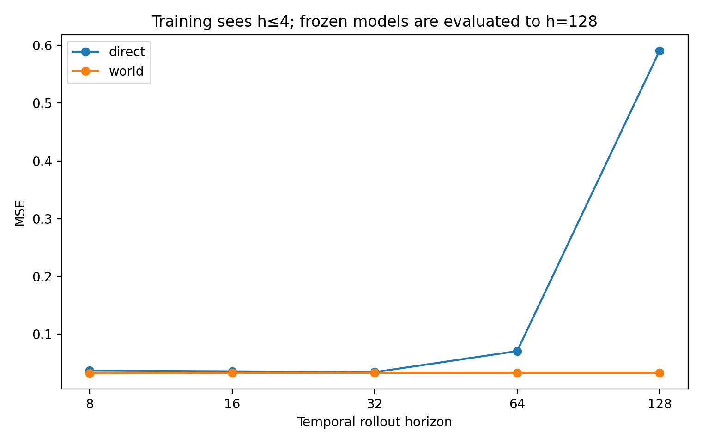

Figure 80. Temporal training covers h ≤4; frozen evaluation extends to h = 128. The generated executor remains stable under mixed evidence, while the direct decoder deteriorates at distant query coordinates. Source: CG-023, synthetic experiment.

### 29.4 Integrating equilibrium and transition evidence

For World Program, mixed evidence improves temporal MSE over transition-only evidence by approximately 0.0070–0.0074 at h = 8/16/32/64/128. Each 100-world bootstrap interval is below zero, with approximately 66–67% of worlds improving.

For Direct, mixed and temporal-only performance are similar at h = 8–32, but mixed-minus-temporal MSE is +0.0343 at h = 64 and +0.3754 at h = 128. The explicit model first maps both observation types into common M,b before executing the query.

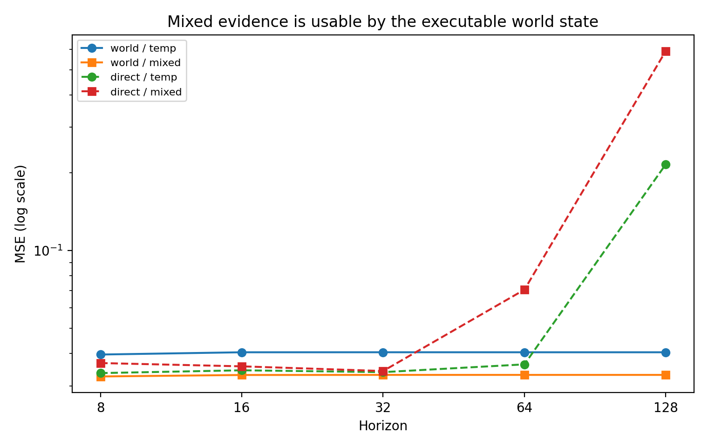

Figure 81. Temporal-only and mixed evidence from the same worlds. Explicit dynamics integrates both observation types; the direct readout is more sensitive to the additional evidence at extreme horizons. Source: CG-023, synthetic experiment.

For in-range equilibrium forcing, World Program improves from 0.2228 with equilibrium-only evidence to 0.2014 with mixed evidence, but the group interval crosses zero. Direct worsens from 0.1392 to 0.2791, with difference CI +0.1109 to +0.1704. Extrapolated forcing is harder for both and does not preserve the mixed-evidence advantage for World Program.

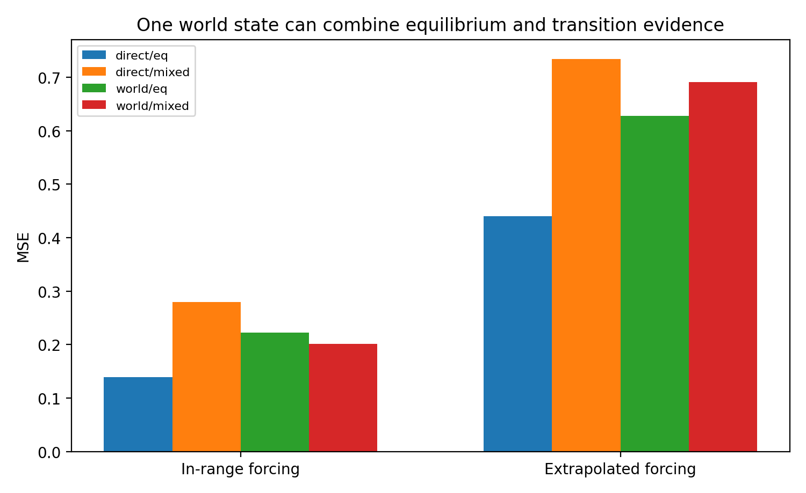

Figure 82. Equilibrium queries with pure and mixed evidence. The in-range World Program improvement is descriptive; extrapolation to larger forcing remains difficult. Source: CG-023, synthetic experiment.

### 29.5 Container permutation versus temporal reversal

Changing evidence-token order yields maximum prediction differences ≤4.77×10⁻⁷ in both models; maximum MSE difference after reversing container order is approximately 2.24×10⁻⁸. Row placement is not used as time.

Reversing each transition internally from (xₜ,xₜ₊₁) to (xₜ₊₁,xₜ), while preserving container and type, worsens performance. At mixed h = 16, World MSE rises from 0.03306 to 0.08018 and Direct from 0.03365 to 0.09838. Across h = 8/16/32, reversal adds approximately 0.0469 to World MSE (95% CI 0.0394–0.0547).

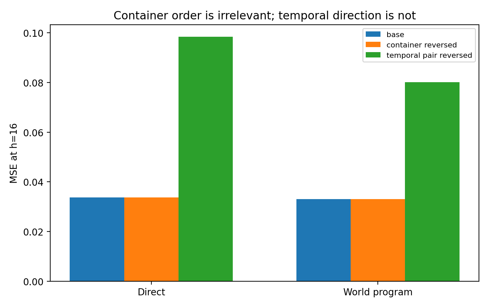

Figure 83. Container reversal leaves predictions unchanged to numerical precision; reversing the within-token temporal relation worsens them. Source: CG-023, synthetic experiment.

The result supports applying permutation invariance to semantically arbitrary container axes while preserving meaningful generating coordinates. Time, space, dose, stage and intervention order require task-appropriate treatment rather than blanket order removal.

### 29.6 Explicit-state continuation

Saving only (M,b,logits) after update two and resuming updates three/four reproduces the final state exactly in both seeds, with maximum error 0.

After training with three to six updates, fixed mixed contexts are iterated to 20. Mean adjacent-relation RMS shrinks to approximately 2.17×10⁻⁸. Internal model-refinement length and external temporal forecast horizon are different coordinates.

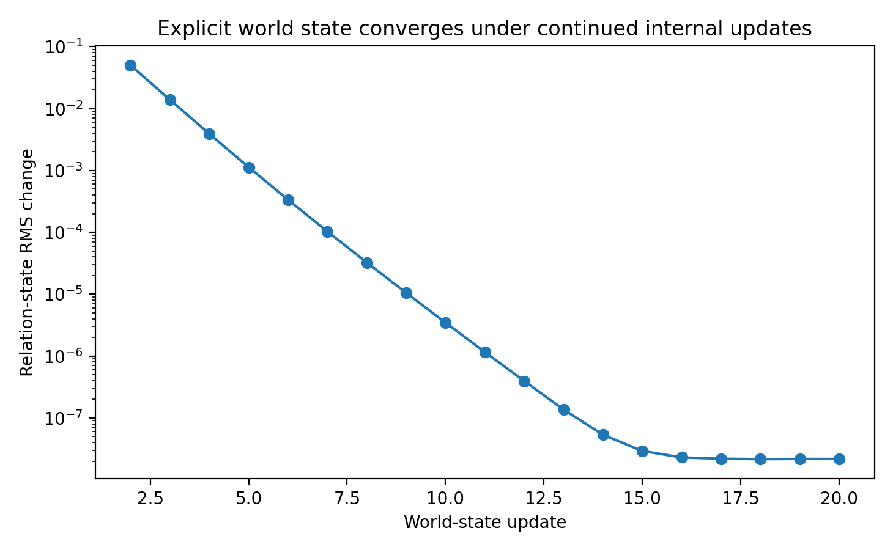

Figure 84. Relation-state updates beyond the training window. Adjacent M changes reach approximately 2.17×10⁻⁸ at update 20. Source: CG-023, synthetic experiment.

### 29.7 Untrained sequential-shock stress test

A supplementary test adds a mid-rollout shock absent from training. It provides no stable additional accuracy: early shocks decay in these stable systems, and later shocks do not yield a consistent advantage over ignoring the event.

CG-023 therefore supports passive long rollout, mixed-coordinate integration and semantic temporal direction in this model family. Accurate sequential intervention propagation does not follow automatically; CG-024 trains and tests it explicitly.

### 29.8 Independent REAL45 PPFM comparison

No real PPFM model is retrained here. The evidence includes a prior independent REAL45 architecture comparison: with two seeds and 450 updates, attention MSE is 0.04795 for one layer, 0.04317 for three layers (9.98% lower) and 0.04310 for six. Parameter-matched tied-six gives 0.04646. All attention variants preserve MSE to numerical precision when four context tokens are reordered.

REAL45 supports studying architecture beyond the superficial number of context tokens and avoiding arbitrary presentation-order semantics. CG-023 separately tests preservation of genuine transition direction and execution beyond the local training horizon. These are independent evidence panels.

### 29.9 Interpretation and limits

A small context and short scoring horizon do not alone define the range of an explicitly executable model. The relevant test is whether the inferred mechanism remains useful beyond those windows.

Direct performs well locally, including on development data; at h = 64/128 it must extrapolate its query readout, whereas World Program repeatedly applies its inferred affine rule. The advantage is established within stable affine dynamics, whose long-run contraction also limits accumulated effects.

Equilibrium responses and transitions are different observations of the same M,b. Modelling their shared generating structure can make them complementary, although forcing extrapolation remains unresolved.

The order controls distinguish arbitrary row arrangement from the direction of a physical transition. Invariance should remove presentation dependence without erasing generating coordinates.

### 29.10 Verification and evidence

Two seed bundles contain World/Direct checkpoints. Both World models select update 250 and both Direct models update 500; training continues to the registered 700 updates without later reselection at 650/700. Reloaded state resume error is 0, maximum container-order prediction difference is 4.77×10⁻⁷ and maximum relation row sum is 0.9455. Records include code, fixed synthetic worlds, predictions, bootstrap, long horizons, order/shock controls, Figures 80–84 and the prior REAL45 summary.

## 30 CG-024 Sequential intervention execution

CG-024 asks whether an inferred dynamical model can receive a new event during rollout and propagate its consequences. It extends CG-023's passive execution with explicit event tests.

The same 600 stable four-variable affine worlds are used. Eight (Mₖ,bₖ,logitₖ) candidates remain the only persistent state, without recurrent hidden memory, pruning or direct M,b supervision. New training targets concern event consequences.

### 30.1 Three primitive events and an unseen combination

Impulse adds a signed shock to one coordinate at a specified time. Clamp sets that coordinate to a specified value at that time. Persistent force changes one coordinate of b from event onset onward. Training endpoints range from h = 4–8, with events one to four steps before the endpoint. Frozen tests extend to h = 16/32/64/128.

An unseen combination starts persistent force at h−4 and adds an impulse at h−2. The generated dynamics executes both in temporal order. Paired controls ignore the event, use the wrong variable or time, or omit the second event.

### 30.2 Initial event-supervised model

Initial training adds event-consequence supervision to CG-023 while retaining passive-rollout and equilibrium losses. Persistent force improves relative to ignoring or mistargeting, but impulse/clamp often perform worse than ignoring; the unseen combination does not consistently beat executing only the first event.

Persistent force changes the background repeatedly, whereas transient events require accurate propagation through M. Errors in local relations can therefore be more damaging for impulse/clamp. This motivates consistency objectives that test the generated model against observed local changes.

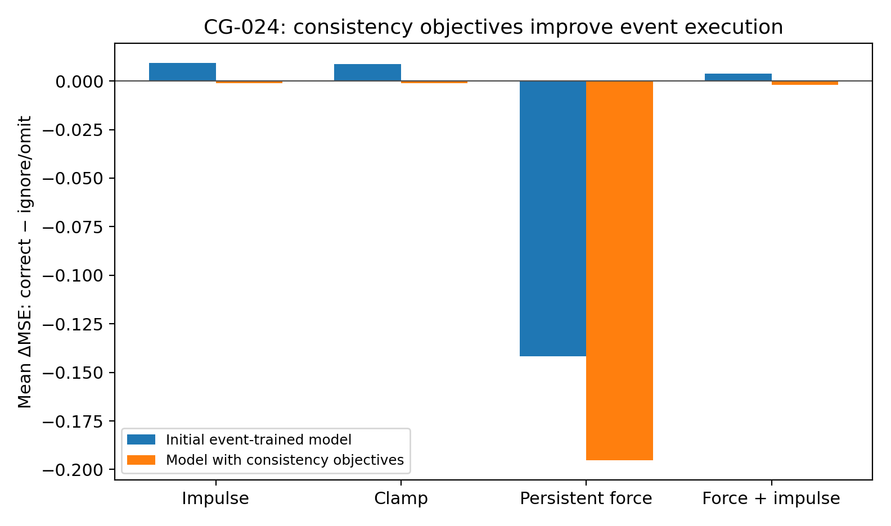

Figure 85. Initial and final sequential-execution models. Persistent force works in the initial variant; consistency training improves impulse, clamp and the unseen combination relative to ignore/omission controls. Source: CG-024, synthetic experiment.

### 30.3 Evidence replay and event-delta consistency

The final objective adds evidence replay: generated dynamics must reproduce observed transition pairs and equilibrium responses under their forcing. Event-delta consistency additionally matches the difference between event and no-event endpoints, alongside endpoint accuracy.

True matrices are not supervision targets. Training uses observable transitions, equilibrium responses and consequences. The model must replay measured local changes and predict the additional effect of an operation.

### 30.4 Correct event, variable and time

Table 53. CG-024. Negative differences mean lower error under correct execution. Intervals are paired-bootstrap 95% CIs across 100 independent test worlds.

| Operation | Correct − ignore/omit ΔMSE | Correct − wrong variable ΔMSE | Correct − wrong time ΔMSE |
| --- | --- | --- | --- |
| Impulse | -0.00120 [-0.00245, -0.00025] | -0.00146 [-0.00261, -0.00032] | -0.00089 [-0.00180, -0.00015] |
| Clamp | -0.00116 [-0.00197, -0.00041] | -0.00192 [-0.00324, -0.00069] | -0.00082 [-0.00142, -0.00026] |
| Persistent force | -0.19525 [-0.21821, -0.17421] | -0.38055 [-0.41921, -0.34456] | -0.01392 [-0.01812, -0.01000] |
| Force + impulse (unseen) | -0.00185 [-0.00321, -0.00067] | — | — |

Source: supplied CG-024 record. Synthetic analysis. Lower NLL, MSE and MAE indicate better performance; these metrics are on different scales. Blank cells mean not reported or not applicable; model, unit and adjustment details are specified in the adjacent methods.

Record note: the persistent-force timing column uses the one-step-late control. The earlier-onset control is reported separately in the text. The supplied combination CI lower bound is −0.00321454, which rounds to −0.00321 as in this table; the source prose used −0.00322.

Impulse correct-minus-ignore MSE is −0.00120 (95% CI −0.00245 to −0.00025); correct-minus-wrong-variable is −0.00146 and correct-minus-wrong-time −0.00089. Clamp differences are −0.00116, −0.00192 and −0.00082. All corresponding intervals lie below zero, supporting functional use of event identity, target and timing in this test.

Persistent-force differences are −0.19525 versus ignoring and −0.38055 versus the wrong variable, with all 100 worlds favouring correct execution. Correct timing improves on one-step-delayed onset by −0.01392 (CI −0.01812 to −0.01000). Compared with onset two steps early, the mean difference is only −0.00052 and its interval crosses zero: longer exposure can partly compensate for remaining amplitude error. Timing discrimination is clearest for impulse/clamp and delayed forcing.

For the unseen force-plus-impulse combination, complete execution improves on omitting the second event by −0.00185 MSE (reported prose CI −0.00322 to −0.00067). The second operation contributes after temporal composition on the same state.

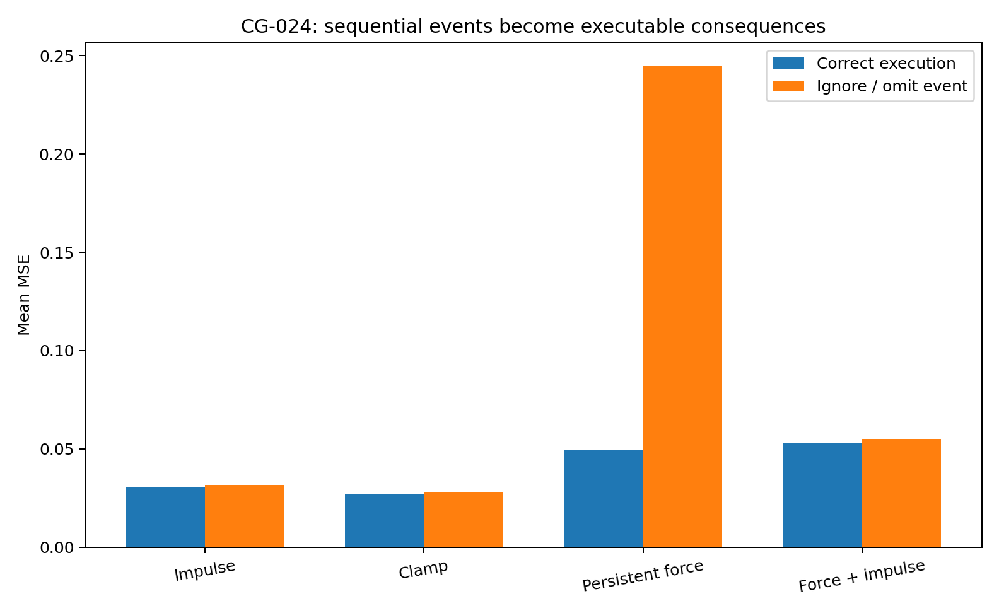

Figure 86. Final sequential-operation evaluation. Correct execution improves over the primary ignore/omission control for all three primitives and the unseen two-event combination. Source: CG-024, synthetic experiment.

### 30.5 Event execution beyond the training horizon

Training remains at h = 4–8. Frozen execution at h = 16/32/64/128 retains aggregate gains for all four operation types. Persistent-force effects are largest; impulse/clamp effects are smaller but yield world-level paired improvements when aggregated across horizons.

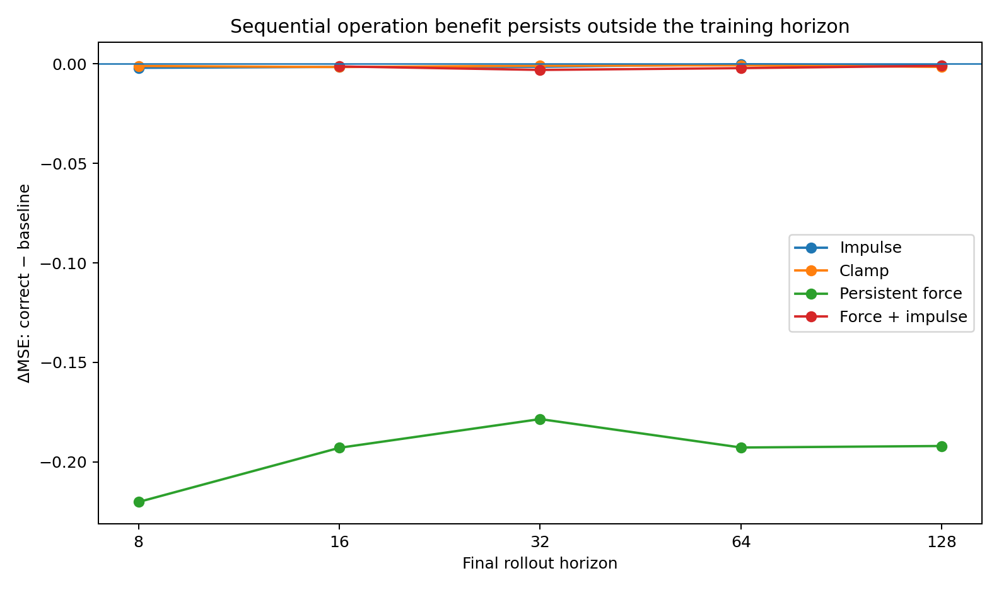

Figure 87. Operation effects beyond training length. The vertical axis is correct-minus-ignore/omit MSE; negative values favour correct execution. Source: CG-024, synthetic experiment.

### 30.6 Passive rollout after event training

Table 54. CG-024. Passive capability retention. CG-024 final and CG-023 checkpoints are compared on the same frozen test panel.

| Passive horizon | CG-023 MSE | CG-024 final MSE | ΔMSE | Worlds improved |
| --- | --- | --- | --- | --- |
| 32 | 0.04006 | 0.02092 | -0.01914 | 92% |
| 64 | 0.03893 | 0.02092 | -0.01801 | 93% |
| 128 | 0.03885 | 0.02092 | -0.01793 | 93% |

Source: supplied CG-024 record. Synthetic analysis. Lower NLL, MSE and MAE indicate better performance; these metrics are on different scales. Blank cells mean not reported or not applicable; model, unit and adjustment details are specified in the adjacent methods.

At h = 32/64/128, passive MSE falls from 0.04006/0.03893/0.03885 to 0.02092/0.02092/0.02092. All three paired-bootstrap intervals lie below zero, with approximately 92–93% of independent worlds improving.

The combined transition-replay, equilibrium and event objectives improve passive dynamics as well as event execution in this panel. Their effects are not restricted to an event-only readout.

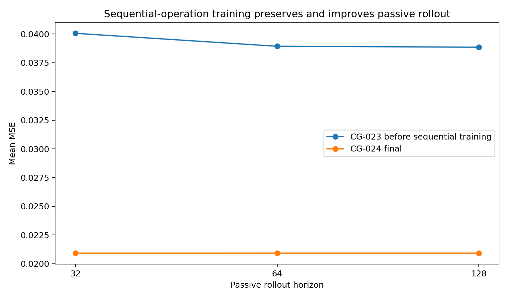

Figure 88. Passive long-horizon performance before and after sequential-operation training, evaluated on the same panel. Source: CG-024, synthetic experiment.

### 30.7 Relation-state calibration

Without direct true-M labels, weighted M RMS distance falls from 0.3327 to 0.1974 under equilibrium evidence, from 0.3316 to 0.1914 under temporal evidence and from 0.3378 to 0.1909 under mixed evidence. Weighted b distance also decreases. This coincides with improved transient-event propagation.

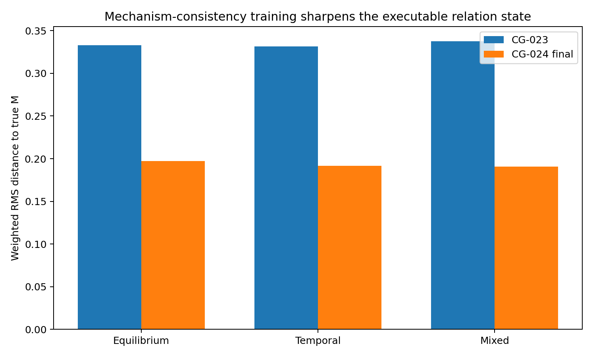

Figure 89. Relation-state diagnostics after consistency training. Generated relations move closer to the true dynamics under all three evidence types, despite no direct matrix supervision. Source: CG-024, synthetic experiment.

### 30.8 Implications for preserving causal information in learned models

CG-017–024 progresses from numerical candidates to generated relations, cross-query editing, explicit persistent states, unpruned populations, operation-supervised models, long passive rollout and sequential event execution. Each stage tests a different functional property of the learned representation.

The initial event model handles persistent forcing more readily than transient propagation. Replaying observed transitions and matching event increments improves impulse, clamp and unseen sequential composition in the final model.

A representation trained only for one answer may become an effective readout without retaining reusable mechanism structure. Requiring it to replay observations, execute interventions, compose events and generalise across horizons provides stronger tests of the information it preserves.

Within the specified synthetic systems, the resulting state can be saved, edited, reused across questions and executed through new events. These are demonstrated model functions with defined scope; broader systems require their own identifiability assumptions and evaluations.

### 30.9 Verification and evidence

Two independent seeds are retained, including initial and final checkpoints and logs. Final checkpoints are selected at additional-training steps 450 and 400. Saving (M,b,logits) after update two and resuming to update four gives maximum state error 0 in both. Maximum row sums are 0.9055/0.9385, below 0.95. Frozen evaluation contains 13,600 per-world/per-horizon operation rows; all four primary acceptance CIs have upper limits below zero. The record includes models, code, both variants, timing controls, passive retention, mechanism diagnostics, Figures 86–89 and final_acceptance.json.

## References

[1] Shimizu, S., Hoyer, P. O., Hyvärinen, A., & Kerminen, A. (2006). A Linear Non-Gaussian Acyclic Model for Causal Discovery. Journal of Machine Learning Research, 7, 2003–2030. https://jmlr.org/papers/v7/shimizu06a.html

[2] Hoyer, P. O., Janzing, D., Mooij, J. M., Peters, J., & Schölkopf, B. (2008). Nonlinear causal discovery with additive noise models. Advances in Neural Information Processing Systems 21. https://proceedings.neurips.cc/paper/2008/hash/f7664060cc52bc6f3d620bcedc94a4b6-Abstract.html

[3] Peters, J., Bühlmann, P., & Meinshausen, N. (2016). Causal inference by using invariant prediction: identification and confidence intervals. Journal of the Royal Statistical Society: Series B, 78, 947–1012. https://doi.org/10.1111/rssb.12167

[4] Parascandolo, G., Kilbertus, N., Rojas-Carulla, M., & Schölkopf, B. (2018). Learning Independent Causal Mechanisms. Proceedings of ICML 2018, PMLR 80, 4036–4044. https://proceedings.mlr.press/v80/parascandolo18a.html

[5] Hyvärinen, A., Sasaki, H., & Turner, R. (2019). Nonlinear ICA Using Auxiliary Variables and Generalized Contrastive Learning. Proceedings of AISTATS 2019, PMLR 89, 859–868. https://proceedings.mlr.press/v89/hyvarinen19a.html

[6] Huang, B., Zhang, K., Zhang, J., Ramsey, J., Sanchez-Romero, R., Glymour, C., & Schölkopf, B. (2020). Causal Discovery from Heterogeneous/Nonstationary Data. Journal of Machine Learning Research, 21(89), 1–53. https://www.jmlr.org/papers/v21/19-232.html

[7] Duchi, J. (2026). Statistics and Information Theory, lecture notes. Local KL divergence in regular parametric families has a second-order expansion governed by Fisher information. Stanford University. https://web.stanford.edu/class/ee377/lecture-notes.pdf

[8] Ay, N., Jost, J., Lê, H. V., & Schwachhöfer, L. (2017). Information Geometry. Springer, Cham. https://doi.org/10.1007/978-3-319-56478-4

[9] Chernoff, H. (1952). A Measure of Asymptotic Efficiency for Tests of a Hypothesis Based on the Sum of Observations. The Annals of Mathematical Statistics, 23(4), 493–507. https://doi.org/10.1214/aoms/1177729330

[10] Mooij, J. M., Peters, J., Janzing, D., Zscheischler, J., & Schölkopf, B. (2016). Distinguishing cause from effect using observational data: methods and benchmarks. Journal of Machine Learning Research, 17(32), 1–102. Tübingen Cause–Effect Pairs benchmark.

[11] Sachs, K., Perez, O., Pe’er, D., Lauffenburger, D. A., & Nolan, G. P. (2005). Causal protein-signaling networks derived from multiparameter single-cell data. Science, 308(5721), 523–529. https://doi.org/10.1126/science.1105809

## Appendix A Terminology

Table 55. Terminology. Appendix A Terminology

| Term | Operational meaning |
| --- | --- |
| Reversal-breaking information | Generating constraints or structures not simultaneously preserved under reversal, within the stated assumptions. |
| Shape geometry | Higher-order shape, curvature, conditional noise fibres and residual dependence within a distribution. |
| Change geometry | Distribution shifts and mechanism invariance across environments, time or domains. |
| Response geometry | Propagation of location, scale and shape changes across variables after perturbation; measured in Sachs from CG-009 onward. |
| Geometry-conditioned causal operator | The causal readout depends on generating geometry: C = C(G(D)). |
| Reversal-compatible manifold 𝓡 | Distributions compatible with both directions under a specified mechanism family. |
| Structural stochasticity | Stochasticity within the generating mechanism whose amplitude or shape can carry mechanism information. |
| Measurement noise | Observational perturbation independent of the target mechanism that reduces detectable geometric SNR. |

Source: supplied Terminology record. Definitions. Blank cells mean not reported or not applicable; model, unit and adjustment details are specified in the adjacent methods.

## Appendix B Practical research checklist

Define the causal operation. State whether the task is orientation, adjacency, effect prediction, mechanism editing or sequential execution. List the assumptions under which the required information is identifiable.

Retain several geometric channels. Preserve conditional mean, scale, residual shape, environment changes and matched intervention responses until their task contribution has been tested.

Test the proposed compression. Compare causal-task performance before and after compression. Report information lost at local nodes or relations even when reconstruction or explained energy remains high.

Use the right holdout unit. Keep mirrored pairs together; withhold whole sources or intervention targets for transfer claims. Aggregate repeated queries within their independent world or target before inference.

Separate stability from validity. Report resampling stability, atlas support and mechanism assumptions separately. Stable errors in CG-008 and CG-012 show why one cannot substitute for another.

Validate generated structure by operations. Test new queries, correct versus wrong relation edits, save/resume, evidence masking and event timing. Report failed controls alongside successful ones.

Permit unresolved results. Do not force orientation or a direct-edge label when the available geometry, transport support or independent evidence is insufficient.

## Appendix C Evidence availability

EVIDENCE_INDEX.md maps all 24 experiments and the external pilot to available records. CG-001–002 and the pilot are report-only; CG-003–008 have partial assets; CG-014–016 lack execution scripts. Later records include code, synthetic systems, checkpoints and results. Reproducibility therefore varies by experiment.

External measurements and per-cell real-data prediction/trace arrays are excluded. Retained materials comprise aggregate analyses, model parameters, masks, row indices and preprocessing summaries. Real-data reanalysis requires obtaining provider observations separately.

The verification directory records integrity checks and selected result reaggregations. These checks do not independently rerun training, original permutations or biological experiments.

Some hypotheses developed in this research have received substantive validation through engineering implementations. Data models are forthcoming.

## Later evidence update — 2 October 2026

**Evidence status: causal-geometry measurements retained; project-level interpretation revised.**

The numerical and experimental findings of CG-001–CG-024 remain at their stated evidence levels. In particular, the identifiability boundary, local Fisher geometry, chart-transition measurements, source-transfer failures, intervention-response geometry and executable mechanism tests remain part of the current evidence base.

A higher-level interpretation has changed.

Section 10.1 presents a practical historical sequence in which a geometry profile is followed by a reversibility/identifiability gate and geometry-conditioned orientation. That remains a useful **causal triage interface** for deciding how strongly a proposed directional interpretation is supported by the available observations.

It is no longer the project-level role assigned to causal modelling.

The current framework treats causal modelling as a generator and reviser of possible worlds:

**observed data → multiple possible causal worlds → simulated, imagined or measured consequences → comparison with observations and constraints → revised worlds → further consequences**

Under this interpretation, identifiability is a measurable property of a candidate world under specified assumptions and available evidence. It constrains confidence, transport and experiment design; it does not terminate the modelling process when a unique world is unavailable. Multiple compatible worlds can be retained and distinguished by subsequent observations, interventions or simulated consequences.

This later framing is already anticipated by Section 21 of the original report:

**Data ↔ representations ↔ hypotheses ↔ models/operators ↔ simulated or observed consequences ↔ revised representations.**

The revision therefore changes the hierarchy of the report rather than its executed results. Sections 1–20 provide measurements and local operators for constructing and testing candidate worlds; Sections 21–30 point toward the current iterative world-generation view.

See [Evidence Supersession Audit — 2026-10-02](../../EVIDENCE_SUPERSESSION_AUDIT_20261002.md).

