# Modelling Hypothesized Mechanisms Underlying Data

Data-Oriented Modelling · Chapter 5 · Report 03 · English v1.0 · 2026-09-28

[Overview](README.md) · [Word edition](Data_Oriented_Modelling_03_Modelling_Hypothesized_Mechanisms_Underlying_Data_EN_v1.0.docx) · [Evidence index](EVIDENCE_INDEX.md)

Chapter 5  Data Oriented Modelling  |  Report 03  |  28 September 2026

Attention geometry and the roles of local scale relations and training coverage

This report examines how assumptions about data generation, observation and valid states can guide model design. The experiments connect attention-induced geometric distortion with local-scale relations, coverage-aware training and the choice of admissible state-transition operators.

### Executive summary

The experiments support a modelling procedure in which explicit assumptions about geometry, sampling, task structure and valid states define a small set of candidate operations. A validation probe within the training data then chooses which operation to use. Here, a hypothesized mechanism is a testable account of those relationships; evidence is assessed through the behaviour of the resulting model operations.

Local-scale relations and geometry constraints improve several classification, propagation and regression comparisons. Separating structural learning from prevalence clarifies the role of training weights. Discrete graph experiments further distinguish scoring a relation from generating a valid next state: the tested attention mixtures require near-single-state selection or a separate projection to satisfy the graph-state requirements.

Validation on four additional datasets refines the procedure. A group-choice model improves ModeChoice log-likelihood, relation-based scores improve Les Misérables edge recovery, and Poisson modelling gives a small deviance gain in RAND HIE. Forced coverage correction increases Engel error. These outcomes make an unchanged baseline and abstention operational alternatives, with the intended target determining which metric governs selection.

The report brings together tested hypotheses, unsuccessful candidates, numerical results and operational decision rules. Comparisons use the controls within each experiment: protocols, random splits, label fractions and scale settings differ across experiments. Sections 16, 20 and 21 describe the evidence available for each stage.

## Contents

[1 Hypotheses and evidence](#1-hypotheses-and-evidence)

[2 Attention and low density gaps](#2-attention-and-low-density-gaps)

[3 Label assisted tests of gap occupancy](#3-label-assisted-tests-of-gap-occupancy)

[4 Unsupervised tests of topological distortion](#4-unsupervised-tests-of-topological-distortion)

[5 Neighbour selection and state aggregation](#5-neighbour-selection-and-state-aggregation)

[6 Screening candidates based on local compression](#6-screening-candidates-based-on-local-compression)

[7 The elastic local scale metric](#7-the-elastic-local-scale-metric)

[8 SpringGraph and relations across scales](#8-springgraph-and-relations-across-scales)

[9 Geometry constraints around standard attention](#9-geometry-constraints-around-standard-attention)

[10 Criteria for replacing the aggregation operator](#10-criteria-for-replacing-the-aggregation-operator)

[11 Training coverage and sampling density](#11-training-coverage-and-sampling-density)

[12 Coverage aware structure learning](#12-coverage-aware-structure-learning)

[13 A method linking geometry and target mechanisms](#13-a-method-linking-geometry-and-target-mechanisms)

[14 Retained candidates and unsuccessful defaults](#14-retained-candidates-and-unsuccessful-defaults)

[15 Implications for human and machine prediction](#15-implications-for-human-and-machine-prediction)

[16 Evidence sources and methodological reference](#16-evidence-sources-and-methodological-reference)

[17 Validation of the complete modelling procedure](#17-validation-of-the-complete-modelling-procedure)

[18 State legality in discrete graphs](#18-state-legality-in-discrete-graphs)

[19 Separating relation scores from state generation](#19-separating-relation-scores-from-state-generation)

[20 Selecting operators from the relation mechanism](#20-selecting-operators-from-the-relation-mechanism)

[21 Precommitted validation on additional datasets](#21-precommitted-validation-on-additional-datasets)

[22 Conclusions](#22-conclusions)

## Key terms and abbreviations

Sections 2 to 16 establish the geometric and training comparisons. Sections 17 to 20 test the procedure and graph-state operators. Section 21 evaluates precommitted choices on additional datasets and presents the consolidated method.

| Term | Meaning in this report |
| --- | --- |
| Hypothesized mechanism | An explicit assumption about how observations, relations or target states arise, used to derive and test candidate model operations. |
| Support and coverage | Support is the domain of admissible or empirically represented states. Coverage describes how observations occupy that domain. |
| Local scale and scale trace | A local scale summarizes nearby distances. A scale trace records that quantity across several neighbourhood sizes. |
| Relation operator | An operation that defines or scores connections between observations or entities. |
| State-transition operator | An operation that produces the next state and must satisfy the target state’s structural requirements. |
| Geometry guard | A local mask, distance bias or update gate that constrains attention using anchored data geometry. |
| Wrapper exhaustion | The tested corrections meet their safety criteria only by suppressing useful mixing or update amplitude. |
| Micro-probe | A small validation comparison used to select an operation. In the final procedure it uses training data only. |
| No-op and abstention | No-op retains the unchanged baseline. Abstention withholds a model choice or prediction when evidence is insufficient. |
| Prevalence calibration | Adjustment of output probabilities to the occurrence frequencies relevant to the target population. |
| Kernel | Used broadly for a relation or state operation. The term does not always denote a positive-semidefinite kernel function. |

AA: Adamic–Adar; AP: average precision; AUC: area under the receiver operating characteristic curve; BMI: body mass index; CN: common neighbours; IPW: inverse-propensity weighting; kNN: k-nearest neighbours; MAE: mean absolute error; N_eff: effective number of attention neighbours; NLL: negative log-likelihood; PA: preferential attachment; pp: percentage points; RBF: radial basis function; RMSE: root mean squared error; SOP: standard operating procedure; SVD: singular value decomposition. MDM is retained as the experiment-series identifier. Q, K and V denote attention queries, keys and values.

## 1 Hypotheses and evidence

The investigation began with a specific hypothesis: on unevenly distributed data, attention may obscure gaps, discontinuities and differences in local scale by connecting and mixing observations. Successive experiments narrowed this idea to an operational principle. A model should account for local scale and observed coverage when it defines relations, propagates information and assigns training weights.

Table 1. Hypotheses assessed across the experiments.

| ID | Hypothesis | Assessment | Evidence |
| --- | --- | --- | --- |
| H1 | Global attention can bridge low-density gaps and rearrange local geometry. | Supported in the tested settings | Gap occupancy rises by 38.2% in Breast Cancer and 117.4% in Digits. Global attention retains fewer neighbours than local attention in all four datasets. |
| H2 | Blocking cross-gap relations always preserves attention as a valid state-transition operator. | Rejected | Across three discrete graphs, mixing adjacency rows produces non-edge mass, self-loops and asymmetry even under an observed-neighbour mask. Meeting safety thresholds requires N_eff close to 1. |
| H3 | Local compression scale can define a data-derived relation scale. | Supported | Elastic local distances produce repeated gains across four classification datasets and Diabetes regression, especially in sparse regions. |
| H4 | Adding higher-order acceleration and jerk features improves modelling. | Rejected as a default | Long spring traces, higher-order differences and enforced acceleration penalties repeatedly overfit or reduce performance. |
| H5 | A scale trace is more informative than one fixed local scale. | Supported | Datasets prefer different k values. Direct averaging can reduce performance; routing among scale families is more stable. |
| H6 | Uneven training density should always trigger inverse-density loss weighting. | Rejected | Simple inverse-density weights are unstable across datasets and slightly reduce Diabetes regression performance. |
| H7 | Structural learning and occurrence frequency should be treated separately. | Supported | Diabetes BMI coverage balancing reduces macro-RMSE from 65.43 to 60.22 and overall RMSE from 64.01 to 63.37. |
| H8 | Wrapper exhaustion can guide replacement of attention aggregation. | Positive instance observed | Karate, Davis and Florentine retain state violations under admissible neighbour relations; the tested safe settings have N_eff close to 1. |
| H9 | A diagnostic requires interpretation under the target mechanism before selecting an action. | Supported | BMI, s4 and age respond differently to coverage balancing. Natural RMSE and macro-RMSE also support different decisions on the same data. |
| H10 | Structural learning can be separated from prevalence and followed by output calibration. | Supported | Balanced Digits training improves balanced accuracy and recall but raises log-loss. Prevalence calibration recovers about 80% of the additional log-loss. |
| H11 | Reweighting cannot create missing support. | Supported | Biased sampling reduces peripheral Digits accuracy from 93.13% to 86.99%; oracle inverse-propensity weighting restores it only to 87.59%. |
| H12 | Attention may score proposals while another operation generates admissible discrete states. | Supported | Global discrete projection restores valid graph form. Relation-only edge gating preserves observed support and symmetry; binary state generation remains a separate requirement. |
| H13 | Operator selection should reflect state constraints, relation order and the hypothesized mechanism. | Supported | Davis path orders 1, 2 and 4 give AUC 0.500 for missing cross-partition edges. Three hops give 0.753; degree-normalized three-hop relations give 0.806. |
| H14 | Insufficient relation evidence is a valid decision outcome. | Supported | Florentine candidates are weak across 100 edge-recovery splits, mostly with AUC approximately 0.43–0.60. The graph has limited cycle redundancy and clustering. |
| H15 | Mechanism diagnostics can directly specify the final operation before downstream results are inspected. | Partially supported | ModeChoice, RAND HIE and Les Misérables improve on their principal metrics. Forced coverage correction fails on Engel, favouring candidate generation followed by selection. |
| H16 | A diagnostic can be equated directly with an action. | Rejected | Despite uneven Engel coverage, forced balancing raises macro-RMSE from 130.08 to 135.07. A nested probe chooses the unchanged model in 63 of 80 outer splits. |
| H17 | An unchanged baseline and abstention must be formal candidates. | Supported | The Engel probe selects ordinary training in 78.75% of outer splits and substantially reduces the loss from automatic correction. |
| H18 | Diagnostics should identify admissible losses and candidate families before a precise algorithm is selected. | Supported | RAND HIE deviance improves by only about 0.067% under Poisson modelling, with variance about seven times the mean. ModeChoice improves NLL while accuracy is nearly unchanged. |

Assessments refer to the stated experiments and objectives. The hypothesis identifiers are retained for continuity; later sections specify evidence scope and qualifications.

Model design starts by specifying the relations, scales and coverage supported by the observations, together with the intended target: observed frequency, structural regularity or a hypothesized generative mechanism.

## 2 Attention and low density gaps

Real data occupy dense regions, sparse regions, discontinuities, holes, branches and structures at several scales. Standard attention forms a content-dependent weighted mixture of candidate states. When two observed states receive nonzero weight, their aggregate can lie in a region that the observations do not occupy.

$$
z_i=\sum_j a_{ij}v_j
$$

This creates two distinct questions. Does attention connect distant states that should remain separate? And, even with the correct neighbours, does weighted mixing generate inadmissible states? Constraints around attention can address the first question. The second concerns the aggregation operator itself.

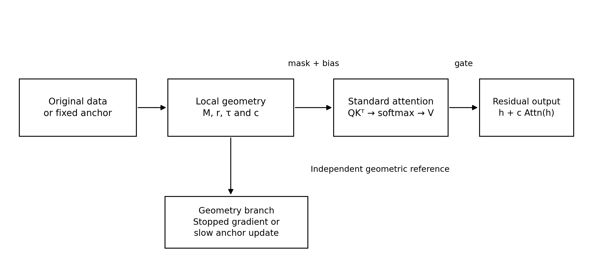

Figure 1. Geometry constraints around standard attention. An anchored representation defines admissible relations, local distances and update gates; attention scores relevance within those relations. The separate geometry branch uses a stopped gradient or a slowly updated anchor. This is a schematic of the proposed computation, with no measured quantities or error bars.

## 3 Label assisted tests of gap occupancy

Experiment MDM-ATTN-001

### Research question

MDM-ATTN-001 uses labels to define low-density regions between classes. It tests whether a single standard dot-product attention update increases the fraction of observations occupying those regions.

### Data and design

The datasets are Iris, Wine, Breast Cancer Wisconsin and Digits. Features are standardized, and low-density regions between classes are measured in a low-dimensional space of dominant variation. The comparison includes the original geometry, global attention and attention restricted to a local neighbourhood.

### Results

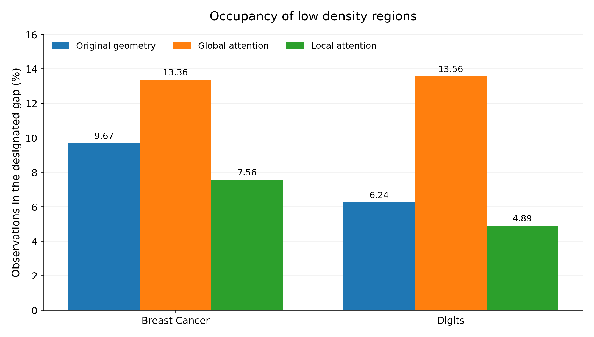

Figure 2. Occupancy of low-density regions in Breast Cancer Wisconsin and Digits before and after one attention update. Bars show percentages of observations in the designated regions under the same recorded protocol. Global attention increases occupancy, while local attention retains more of the original separation. Values are preserved from the archived figure; uncertainty intervals were not supplied.

In Breast Cancer, gap occupancy rises from 9.67% to 13.36% with global attention, a relative increase of 38.2%. In Digits it rises from 6.24% to 13.56%, a relative increase of 117.4%. Restricting attention to local neighbours gives occupancy of 7.56% and 4.89%, respectively. A temperature scan on Wine shows a similar pattern: as the weights become more dispersed, occupancy rises from the original 5.86% to 8.54% at temperature 4.

### Interpretation

These measurements make the initial geometric hypothesis testable. A wider relation range permits connections across low-density valleys; local restriction substantially reduces this effect. Part of the distortion therefore arises from neighbour selection and can be addressed while retaining the attention aggregation formula.

## 4 Unsupervised tests of topological distortion

Experiment MDM-ATTN-002

MDM-ATTN-002 removes the class labels and measures the original k-nearest-neighbour structure, trustworthiness and mutual-kNN connectivity. The experiment asks whether attention still rearranges neighbourhoods and compresses naturally separated structures when class boundaries play no role in the measurement.

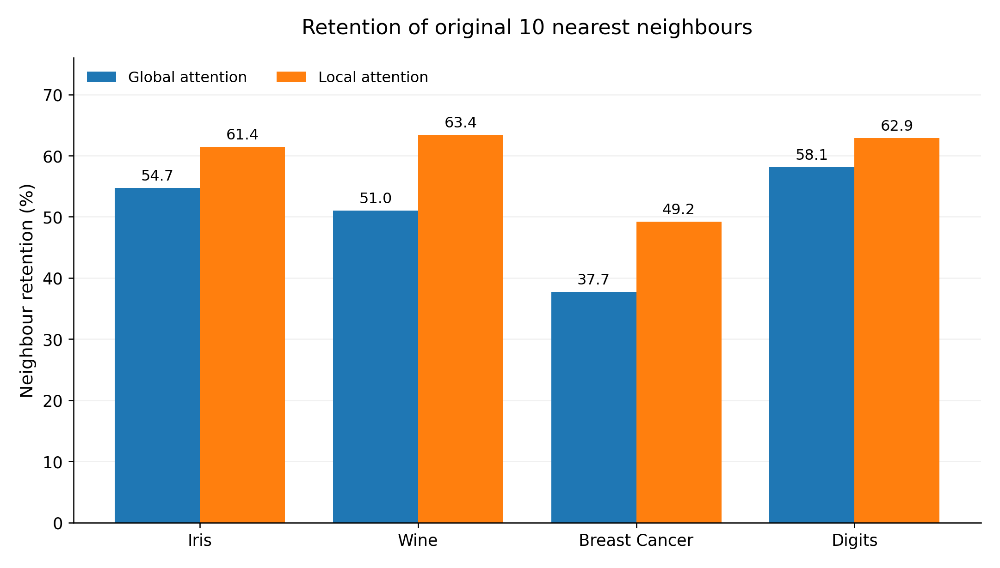

Figure 3. Retention of original 10-nearest-neighbour sets after one attention update. Bars give the archived percentage retained for each dataset. Local attention retains more neighbours than global attention in all four datasets. The figure reports point values without uncertainty intervals.

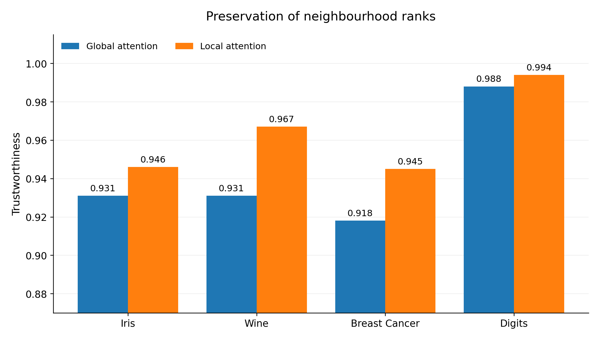

Figure 4. Trustworthiness after one attention update on four real datasets. Higher values indicate better preservation of neighbourhood ranks relative to the original geometry. Local attention exceeds global attention in all four comparisons. Values come from the archived experiment figure; no uncertainty intervals are shown.

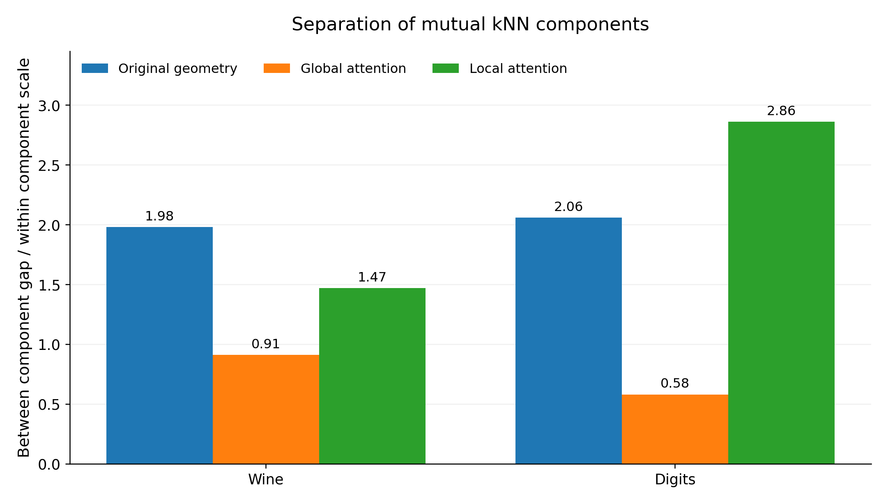

Figure 5. Relative separation of structures identified by mutual-kNN connectivity in Wine and Digits. The recorded measure compares the gap between components with their within-component scale. Larger values indicate stronger separation. Bars reproduce the archived point values for the original geometry, global attention and local attention.

In Wine, global attention reduces relative separation from 1.98 to 0.91; in Digits, from 2.06 to 0.58. Local attention gives 1.47 and 2.86, respectively. The observed operation is a broader geometric rearrangement: peripheral points may move towards dense regions, and separated groups may move closer together.

Architectures carry structural assumptions. A recurrent unit introduces an ordering of observations; attention permits states judged relevant to be mixed. Data-oriented modelling treats those assumptions as hypotheses whose usefulness must be evaluated against the data and the task.

## 5 Neighbour selection and state aggregation

The experiments distinguish two sources of error in attention.

- Relation error occurs when the operator connects regions that should remain separate. A local graph, geometry mask or local-scale bias can constrain these connections.

- Aggregation error occurs when a convex mixture of correctly selected neighbours lies outside the empirical data support. This concerns the weighted state-aggregation operator.

The decision to replace an operator should therefore follow a test of aggregation after neighbour selection has been constrained. Section 10 defines an operational criterion for exhausting the available corrections around attention.

## 6 Screening candidates based on local compression

Experiment MDM-SPRING-001

MDM-SPRING-001 starts from a mechanical analogy: densely sampled regions resemble compressed springs, while sparse regions resemble extended springs. The initial proposal was to derive a directional quantity, analogous to acceleration, from changes in local compression. Experiments then tested which parts of this analogy produced useful modelling operations.

Table 2. Screening of local compression candidates.

| Candidate | Operation | Observed result | Disposition |
| --- | --- | --- | --- |
| Local density scalar | Append ρᵢ as a feature. | Limited gain. | Retain as a diagnostic. |
| Inverse-density loss | Increase the loss weight of sparse observations. | Unstable across datasets. | Reject as a universal default. |
| Local spring force | Construct a direction from differences in local compression. | Gains in datasets including Digits. | Retain as an experimental feature. |
| Higher-order spring trace | Append scale changes, acceleration, jerk or second differences as a long feature sequence. | Repeated overfitting. | Reject as a default input. |
| Global spring RBF kernel | Insert local scale into a global kernel. | Gains in isolated datasets. | Reject as a universal kernel. |
| Acceleration penalty or directed pressure | Penalize abrupt compression changes or direct propagation from high to low pressure. | Reduced performance in Digits and Iris. | Reject. |
| Elastic local-scale metric | Change the regional distance scale while retaining coordinates. | Repeated classification and regression gains. | Retain. |
| SpringGraph relations | Reweight relations on the same local edge set. | Consistent gains with few labels. | Retain. |

These are the recorded candidate-screening outcomes, not results under one common benchmark. Retention means eligibility for a task-specific comparison.

The stable component was local natural scale. Acceleration, jerk and longer mechanical feature sequences added complexity without consistent gains. Local scaling instead changes how distance is interpreted across regions with different sampling density.

## 7 The elastic local scale metric

Experiment MDM-SPRING-002

MDM-SPRING-002 estimates a natural length rᵢ from the k-nearest neighbours of each point, then expresses pairwise distance in units of the surrounding local scale.

$$
r_i=\frac{1}{k}\sum_{j\in N_k(i)}\lVert x_i-x_j\rVert
$$

$$
\tau_{ij}=\frac{\lVert x_i-x_j\rVert}{\sqrt{r_i r_j}}
$$

Technical note. The local-scale construction is a normalized dissimilarity. Its name in the experiment series does not establish the triangle inequality. The displayed formula assumes positive local scales; duplicate observations with rᵢ = 0 require a defined numerical treatment.

This operation retains the observed coordinates and creates no intermediate state. With a fixed local candidate graph, it changes the interpretation of distance while preserving the admissible neighbourhood.

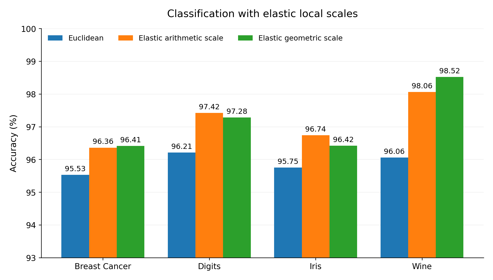

Figure 6. Classification accuracy with ordinary Euclidean distance and two elastic local-scale variants under the fixed setting recorded in the source. The arithmetic and geometric variants are retained as distinct series. Both improve on the Euclidean comparison in all four datasets. Bars reproduce archived percentages; uncertainty intervals were not supplied.

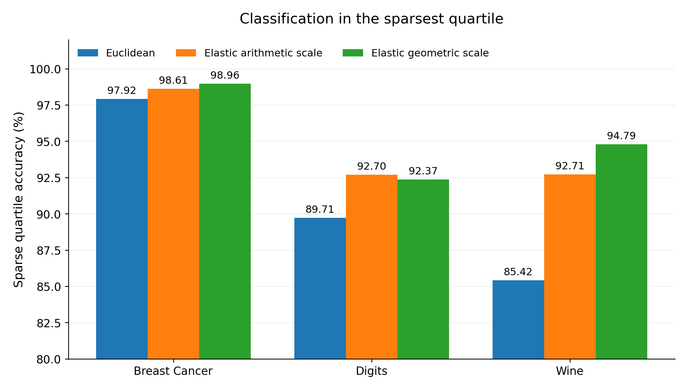

Figure 7. Classification accuracy in the sparsest quartile under the archived local-scale comparison. The elastic variants show larger gains in Wine and Digits than in Breast Cancer. Percentages and series labels reproduce the source figure; no uncertainty intervals are shown.

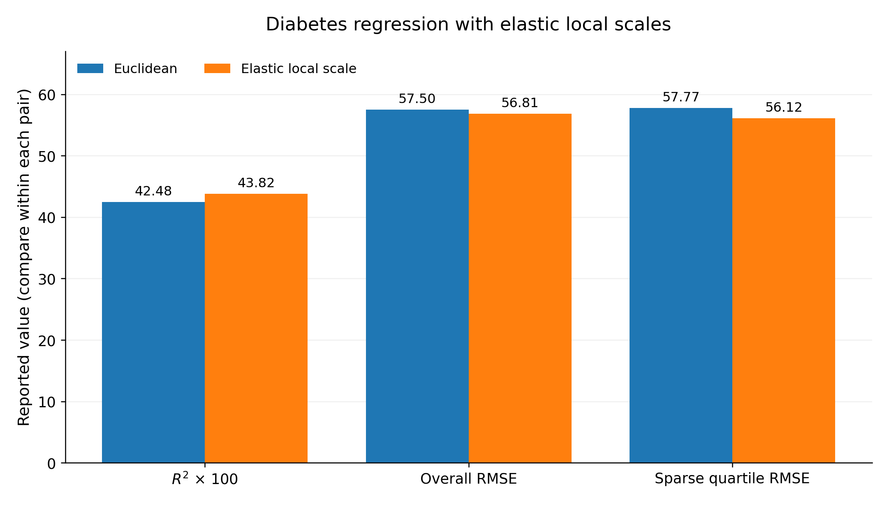

Figure 8. Diabetes regression with Euclidean and elastic local distances. The three recorded measures are R² multiplied by 100, overall RMSE and sparse-quartile RMSE. Higher R² and lower RMSE indicate improvement; the measures have different units and should be read within each pair. Bars show archived point values without uncertainty intervals.

These results specify what local equalization means operationally. The observed geometry remains in place, while the model interprets proximity using a regional scale. The adjustment is to the distance measure used by the model.

### Relation to established local scaling

Pointwise local scaling has an established precedent. Zelnik-Manor and Perona introduced affinities based on individual local scales in Self-Tuning Spectral Clustering at NIPS 2004, addressing multiscale data and background clutter. Local scaling is therefore used here as an existing mathematical component. The experimental emphasis is its combination with restricted neighbourhoods, scale traces, relation operators, attention constraints and coverage-aware training.

## 8 SpringGraph and relations across scales

Experiment MDM-SPRING-003

MDM-SPRING-003 applies elastic distance to graph relations. It keeps the same local kNN edge set and uses τᵢⱼ to rescale relation strength. Any gain therefore arises from interpreting the existing edges differently, rather than from adding more edges.

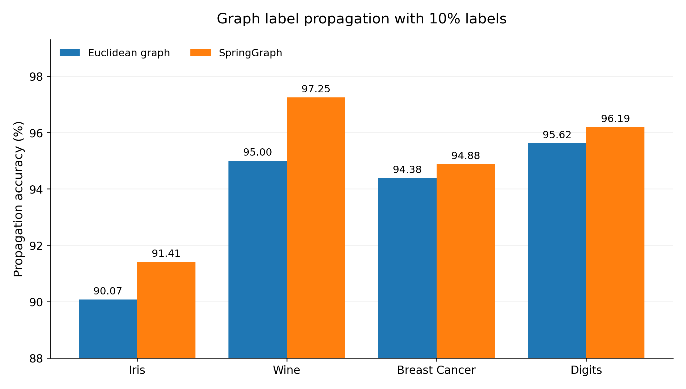

Figure 9. Graph-based label propagation with 10% labelled observations. SpringGraph reweights the same local candidate edges used by the Euclidean graph. The archived propagation accuracies favour SpringGraph in all four datasets. Bars show point values, with no uncertainty intervals supplied.

The multiscale comparisons show different preferences: Digits and Iris favour smaller k, Wine continues to improve as k increases, and Breast Cancer is relatively stable at intermediate scales. A single local scale can therefore be represented as a scale trace across several neighbourhood sizes.

$$
R_i=[r_i(k_1),r_i(k_2),\ldots,r_i(k_m)]
$$

Directly averaging scales reduces performance in some comparisons. Selecting the minimum tension also introduces a mechanical preference for larger scales, undermining its physical interpretation. A more stable implementation treats the scales as a set of relation experts and uses a data-level or task-level router to choose among them.

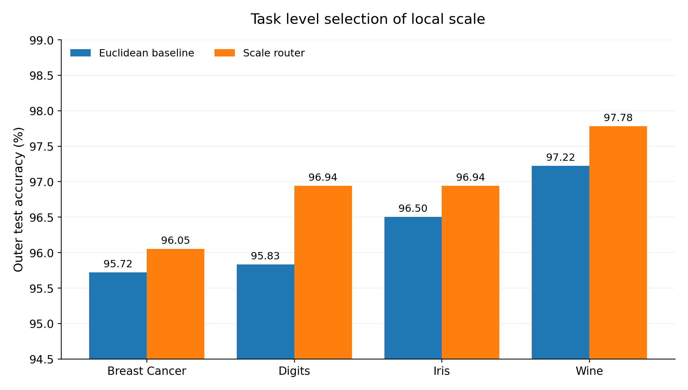

Figure 10. Outer-test classification accuracy for a task-level local-scale router and the Euclidean baseline. The recorded router comparison improves accuracy in all four datasets. These values belong to a separate routing protocol and should be compared within this figure. Uncertainty intervals were not supplied.

PSYMOE is treated here as an external system interface, using the definition in its separate engineering documentation. The present report specifies relation operators, diagnostics and presets that such an interface could use.

## 9 Geometry constraints around standard attention

Experiment MDM-ATTN-003

MDM-ATTN-003 evaluates corrections around attention before replacing its aggregation operator. The standard query–key product, softmax and value aggregation remain in place. Geometry constraints enter the logits and the residual update.

$$
L_{ij}=\frac{Q_iK_j^T}{\sqrt{d}}-\lambda\tau_{ij}^{2}+\log M_{ij}
$$

$$
A_{ij}=\operatorname{softmax}_{j}(L_{ij})
$$

$$
h_i^{\prime}=h_i+c_i\cdot\operatorname{Attention}(h_i)
$$

- Mᵢⱼ specifies local visibility in the original data or a fixed anchor representation. Relations across an unconnected gap receive zero mask weight.

- τᵢⱼ is the elastic local-scale distance. Attention scores task relevance while the distance term penalizes geometrically costly relations.

- cᵢ is a boundary or discontinuity gate. It reduces the residual update near density valleys or abrupt neighbourhood changes.

- The geometry branch uses a stopped gradient or a slowly updated anchor. Its reference geometry therefore remains sufficiently independent of the transformations being evaluated.

The data geometry determines which relations are admissible; attention determines relative importance within those relations.

## 10 Criteria for replacing the aggregation operator

Experiment MDM-ATTN-004

MDM-ATTN-004 introduces wrapper exhaustion as a decision criterion. Standard attention remains a candidate wherever geometry constraints preserve useful performance and meaningful mixing. Replacement becomes relevant when satisfying the geometric requirements forces the surrounding corrections to suppress the attention operation itself.

$$
N_{\mathrm{eff},i}=\exp\left(-\sum_j A_{ij}\log A_{ij}\right)
$$

N_eff measures the effective number of neighbours used by attention. If geometric safety requires N_eff to approach 1, or requires the residual gate cᵢ to approach 0, the operation is effectively reduced to single-state selection or a vanishing update.

Table 3. Attention corrections and effective mixing.

| Dataset | Local attention | Geometry constrained | Spring relation | Effective neighbours | Interpretation |
| --- | --- | --- | --- | --- | --- |
| Digits | 88.90% | 89.59% | 91.55% | 4.22 → 2.78; about 1.25 with stronger λ | The correction recovers some performance; stronger constraints suppress mixing. |
| Wine | 93.96% | 95.35% | 96.10% | About 1.03 | Near single-neighbour operation still trails Spring. |
| Breast Cancer | 94.17% | 94.68% | 93.70% | No comparable collapse observed | The correction is sufficient in this comparison; retain attention. |

Accuracy is in percent; higher is better. N_eff is an effective count. Each row is interpreted within its recorded protocol. The values are early report-level results, separate from the 5% label experiment in Table 6.

A complementary test examines local convex mixtures. First calibrate an empirical support test so that it rarely rejects genuine held-out observations. Then measure how often mixtures of admissible neighbours fall outside that support. Frequent rejection of mixtures identifies an aggregation problem that masks, biases and gates can reduce only by restricting mixing.

$$
V_{\mathrm{mix}}=\Pr\left(\sum_j\alpha_j x_j\notin S_{\mathrm{data}}\right)
$$

$$
\alpha_j\geq0,\qquad\sum_j\alpha_j=1
$$

The proposed replacement criterion combines four observations: admissible local relations, collapse of effective neighbour count or residual amplitude under safety constraints, persistent performance loss relative to a relation operator that avoids state mixing, and frequent support violations in a local convex-mixture probe. Their joint occurrence motivates replacing the state-aggregation operation.

## 11 Training coverage and sampling density

Experiment MDM-TRAIN-001

MDM-TRAIN-001 examines how uneven coverage affects learning even when relations are well constrained. Equal weight per observation gives densely sampled regions more total gradient contribution. A roughly bell-shaped sampling distribution illustrates the issue: many observations occur near the centre and few at the margins.

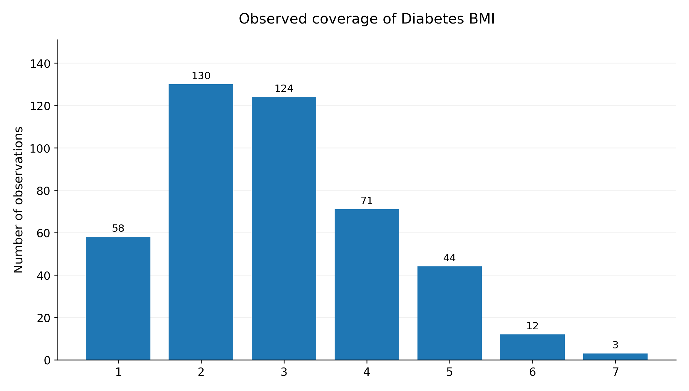

Figure 11. Observed Diabetes BMI coverage in seven equal-width intervals. The interval counts are 58, 130, 124, 71, 44, 12 and 3, totalling 442 observations. The two most populated adjacent intervals contain 254 observations, or 57.5%. These are observed counts, with no error bars.

Uniform inverse-density weighting proved too broad a response. Simple rᵢ² loss weights gave small or inconsistent gains in Breast Cancer, Digits and Wine, and slightly reduced Diabetes regression performance. Low density does not by itself establish greater relevance to the target, and natural prevalence may be part of the mechanism being modelled.

## 12 Coverage aware structure learning

Coverage-aware learning separates the response pattern within observed regions from the frequency with which those regions occur. The first concerns structural learning; the second concerns prevalence calibration. Clipped region weights can give observed regions more comparable training influence.

$$
L=\frac{\sum_i w_i\ell_i}{\sum_i w_i},\qquad w_i\propto\frac{1}{n(C_i)}\quad\text{(clipped weights)}
$$

In Diabetes BMI, equal-width coverage regions were used to balance training contribution. The following comparison summarizes 50 random splits.

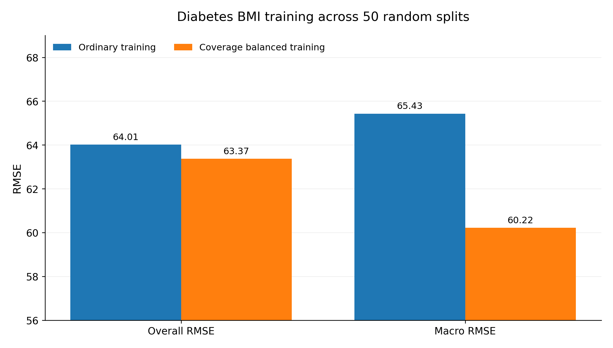

Figure 12. Overall RMSE and macro-RMSE under ordinary and coverage-balanced training on Diabetes BMI. Values are the archived means over 50 random splits. Macro-RMSE gives equal importance to the evaluated regions. Lower values indicate smaller error; no split-level uncertainty intervals are available with this early-stage figure.

Overall RMSE falls from 64.01 to 63.37, while macro-RMSE falls from 65.43 to 60.22. A scan across continuous variables finds clear macro-RMSE improvements for BMI, s3, s6, blood pressure and s5; age, s1 and s2 show no stable gain.

Coverage imbalance is therefore a diagnostic that opens a candidate correction. Whether to enable balanced structure learning depends on the declared objective and a validation probe. When the output represents natural occurrence probabilities, calibration must preserve or restore the relevant prevalence.

Reweighting reallocates influence among observations already present. A region with inadequate support requires additional observations, restricted extrapolation or explicit uncertainty. Giving an isolated observation an arbitrarily large weight does not supply the missing structure.

## 13 A method linking geometry and target mechanisms

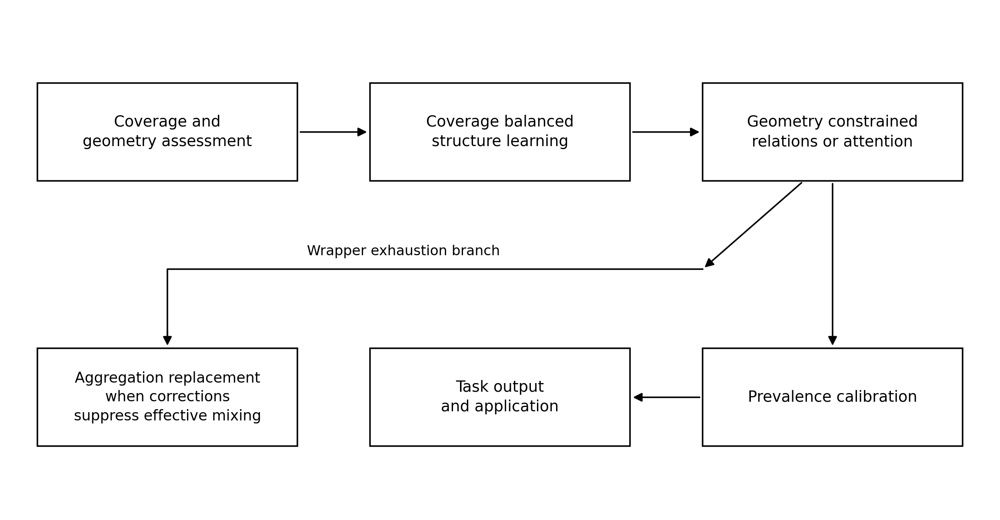

Figure 13. Method overview linking coverage and geometry assessment, structure learning, constrained relations, prevalence calibration and task output. The branch from constrained attention identifies cases requiring a different state-aggregation operator. This is a schematic; Sections 17 and 21 specify how validation probes choose whether each operation is enabled.

Data-oriented modelling has two complementary design requirements.

1. Observed geometry constrains admissible relations through local scales, gaps, discontinuities, coverage, anisotropy and natural neighbourhoods.

1. The intended target distinguishes structural regularity from frequency of occurrence. Learning structure may require balancing the influence of sampling density; estimating natural prevalence requires retaining or restoring frequency information.

A data model therefore relates the process that generates observations to the process by which they are sampled. Its design must specify observed coverage, the relations used to read that coverage and the level of the mechanism that the output is intended to represent.

## 14 Retained candidates and unsuccessful defaults

Table 4. Candidate disposition after the initial experiments.

| Disposition | Candidate | Interpretation |
| --- | --- | --- |
| Retain | Geometry mask | Constrain connections across gaps and discontinuities around attention. |
| Retain | Elastic local-scale bias | Interpret distance using regional scale within the same local neighbourhood. |
| Retain | SpringGraph relations | Reweight relations without moving observations; stable results with few labels. |
| Retain | Scale trace | Describe local compression at several observation radii for diagnosis and routing. |
| Retain | Task or data-block router | Choose Euclidean, Spring or other relations using data evidence; gains in four outer-test classification comparisons. |
| Retain conditionally | Coverage-balanced structure learning | Give observed regions more comparable training influence when the target and validation support it. |
| Retain | Prevalence calibration | Restore the relevant occurrence frequencies after structural learning. |
| Reject as a default | Long spring-trace features | Directly stacking higher-order quantities can overfit. |
| Reject as a default | Uniform inverse-density loss | Low density need not imply greater target importance; relevant prevalence can be lost. |
| Reject as a default | Simple multiscale averaging | Averaging can obscure the local structure preferred by a particular dataset. |
| Reject as a default | Minimum tension across scales | Mechanically favours larger scales, weakening the intended interpretation. |
| Reject as a default | Always-on Spring messages | Benefits Digits and Iris but adds noise in Wine and Breast Cancer; relation reweighting is more stable. |

Retained operations remain conditional on the target and validation results. Sections 17 and 21 make the unchanged baseline an explicit alternative.

## 15 Implications for human and machine prediction

The experiments establish a design discipline. Sequence order, permissible mixing, the interpretation of density and the choice of distance scale are modelling assumptions that deserve explicit examination. The relevant questions concern local connectivity, compression, gaps and whether repeated sampling of one region is dominating the training set.

The task supplies a second set of questions. Learning a structural response requires attention to where observations occur and how they influence the fit. Estimating real-world probabilities additionally requires preserving or calibrating prevalence.

Both human and machine prediction involve choices about what counts as important. The proposed method separates those choices: data constrain feasible geometry, the task defines the target mechanism, and the model learns under both sets of requirements.

Attention remains useful in the tested Breast Cancer setting after geometric correction. Digits and Wine show signs of wrapper exhaustion under the compared protocols. The operational goal is a diagnostic rule that determines whether a particular operator is suitable for a given dataset and target.

The original acceleration analogy helped motivate this investigation even though it did not survive as the preferred formula. It directed attention to the local scale, compression, boundaries and coverage surrounding each observation. The retained representation is a state described across scales, or scale-space state.

## 16 Evidence sources and methodological reference

### Evidence scope

The early experiments are represented by the numerical results and figures preserved in the source report. Their corresponding evidence directory contains 18 original embedded figures and 21 exported report tables. It provides report-level records for those experiments; later sections additionally draw on per-split result files. Comparisons across different protocols, label fractions, scale settings or random splits establish direction and context, while direct numerical contrasts use matched conditions within a protocol.

The evidence archive supplies exact report-embedded records for the early experiments, per-split CSVs and a protocol sketch for MDM-KERNEL-002, and staged scripts plus per-split CSVs for MDM-​SOP-​BLIND-​VALIDATION-​003. The early split-level data and executable analyses are not included. Summary values in the later CSVs were checked against the report, and all 81 listed archive checksums matched.

The early experiments use the public Iris, Wine, Breast Cancer Wisconsin, Digits and Diabetes datasets. Controlled sampling experiments retain or remove actual observations to alter coverage; they add no synthetic observations.

### Methodological reference

Zelnik-Manor, L. and Perona, P. (2004). Self-Tuning Spectral Clustering. Advances in Neural Information Processing Systems 17, 1601–1608. This provides the established local-scale affinity construction used as a foundation here.

[Self-Tuning Spectral Clustering — original proceedings](https://proceedings.neurips.cc/paper/2004/hash/40173ea48d9567f1f393b20c855bb40b-Abstract.html)

### Findings from the initial experiments

- Geometry constraints address connections across gaps, local-scale mismatch and excessive updates near boundaries.

- Replacement of the aggregation operation becomes relevant when admissible relations still yield states outside support, accompanied by collapse in N_eff or residual amplitude under safety constraints.

- The retained relation candidates are sparse operators informed by local scales and scale traces.

- The retained training principle separates coverage-aware structural learning from prevalence calibration.

- Together, the geometric diagnosis and the declared target mechanism determine the candidate model operations.

## 17 Validation of the complete modelling procedure

Experiment MDM-SOP-001

MDM-SOP-001 evaluates the procedure as a whole. It declares a target mechanism, assesses the data and observation process, uses diagnostics to define candidates, and applies a small validation probe to choose among coverage correction, a geometry guard, local-scale relations and no change. The question is whether this procedure selects different operations for different datasets and targets.

The main finding is that diagnosis and action must be separated. Data identify a possible issue, the target determines its relevance, and the validation probe determines which response is useful.

### Changing the target changes the value of a correction

Coverage-balanced structure learning is applied separately to BMI, s4 and age in the Diabetes dataset. Evaluation includes RMSE under the natural test distribution and macro-RMSE giving equal importance to equal-width regions. With the data, model and training correction fixed within each comparison, the two metrics assess different intended targets.

Table 5. Coverage balancing under two evaluation targets.

| Probe | Evaluation target | Baseline | Balanced coverage | Change |
| --- | --- | --- | --- | --- |
| Diabetes BMI | Natural RMSE | 64.18 | 63.20 | −0.98 |
| Diabetes BMI | Macro-RMSE | 65.55 | 60.33 | −5.22 |
| Diabetes s4 | Natural RMSE | 69.51 | 69.55 | +0.04 |
| Diabetes s4 | Macro-RMSE | 70.77 | 68.64 | −2.13 |
| Diabetes age | Natural RMSE | 75.85 | 75.87 | +0.02 |
| Diabetes age | Macro-RMSE | 71.68 | 71.85 | +0.17 |

Real Diabetes observations. Lower RMSE is better; errors retain the target scale used in this probe. Change is balanced minus baseline. Macro-RMSE weights evaluated regions equally. This protocol is distinct from Figure 12.

BMI gives the clearest positive result: coverage balancing improves natural-distribution RMSE and produces a larger gain for the macro objective. For s4, natural RMSE changes very little while macro-RMSE improves. Age supplies a counterexample: uneven density alone does not justify equalization. Automatic inverse-density correction is therefore rejected as a general rule.

### Geometry guards require a no change option

A relation-propagation probe with 5% labelled observations first restricts attention to a local candidate graph, then compares the addition of a geometry guard. Fifty random label splits assess the consistency of its effect.

Table 6. Geometry guards with five percent labels.

| Dataset | Local attention | Geometry guard | Gain pp | Median N_eff | Guard win rate |
| --- | --- | --- | --- | --- | --- |
| Breast Cancer | 70.98% | 80.84% | +9.86 | 3.62 | 100% |
| Digits | 92.07% | 93.12% | +1.05 | 6.84 | 98% |
| Wine | 93.83% | 94.82% | +0.98 | 10.05 | 74% |
| Iris | 87.89% | 87.99% | +0.10 | 13.90 | 24% |

Fifty random label splits on real data; accuracies and win rates are percentages, and pp means percentage points. Win rate is the fraction of splits favouring the guard. The reported Wine gain is +0.98 pp; subtraction of the displayed rounded accuracies gives +0.99 pp. The original values are retained.

The evidence favours a geometry guard for Breast Cancer and Digits, with a more modest case for Wine. Iris shows little average benefit. Retaining the unchanged model as an explicit candidate allows the method to decline an unnecessary correction.

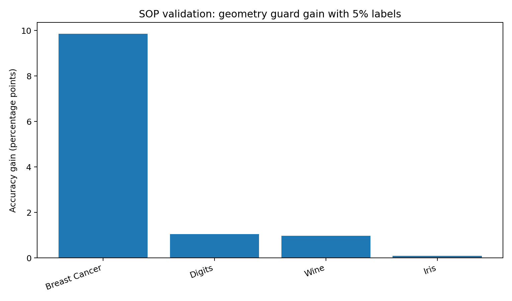

Figure 14. Accuracy gain from a geometry guard over local attention with 5% labels. Bars summarize the recorded mean gains across 50 random label splits, in percentage points. The corresponding accuracy, effective-neighbour and win-rate values appear in Table 6. No uncertainty intervals are shown.

### Separating structural learning from prevalence

The Digits task distinguishes digit 0 from all other digits. Its natural prevalence is approximately 9.94%. Balanced structure training gives the two classes more comparable training influence, after which output probabilities are calibrated to the natural prevalence.

Table 7. Structural learning and prevalence calibration.

| Training or calibration | Balanced accuracy | Recall for digit 0 | Log-loss |
| --- | --- | --- | --- |
| Natural training | 98.68% | 97.43% | 0.01220 |
| Balanced structure training | 99.10% | 98.60% | 0.01737 |
| Natural prevalence restored | ≈99.10%* | ≈98.60%* | 0.01322 |

Real Digits 0-versus-rest task. Higher accuracy and recall, and lower log-loss, are better. *The approximate post-calibration entries are retained from the source. A monotone probability adjustment preserves ranking; fixed-threshold accuracy and recall require their own evaluation or an equivalently adjusted threshold. Their preservation does not follow from ranking alone.

The source reports that calibration primarily restores the probability scale and log-loss while preserving the ordering of predictions. Approximately 80% of the additional log-loss introduced by balanced training is recovered. The approximate balanced-accuracy and recall entries are retained as reported; their interpretation is specified in the table note.

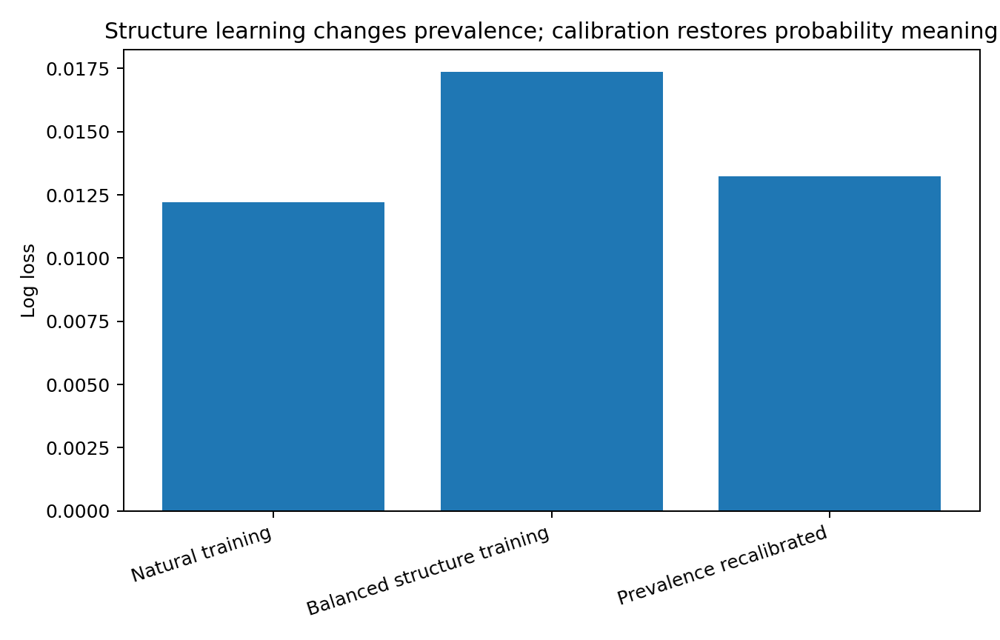

Figure 15. Log-loss for natural training, balanced structure training and prevalence calibration in the Digits 0-versus-rest task. The recorded values are 0.01220, 0.01737 and 0.01322. Lower log-loss is better. The chart preserves the source result without uncertainty intervals; calibration addresses the probability interpretation of the output.

### Missing support and inverse propensity weighting

A second Digits experiment retains and removes actual observations so that central observations are easier to sample than peripheral ones. Approximately 49.9% of training observations remain. Oracle inverse-propensity weighting is then given the true sampling probabilities to test how much of the lost information can be recovered by weighting.

Table 8. Biased coverage and oracle weighting.

| Condition | Overall accuracy | Peripheral quartile accuracy |
| --- | --- | --- |
| Complete training coverage | 94.12% | 93.13% |
| Centre-biased sampling | 92.47% | 86.99% |
| Oracle inverse-propensity weighting | 92.44% | 87.59% |

Real Digits observations under controlled retention and removal. Higher accuracy is better. The peripheral quartile is the sparsest 25% evaluated in the recorded protocol; the oracle uses the true sampling probabilities.

Peripheral accuracy falls from 93.13% to 86.99% under biased sampling and reaches 87.59% with oracle weighting. This recovers approximately one tenth of the loss. When support is missing, the appropriate responses include obtaining more observations, restricting extrapolation or expressing uncertainty.

### Decision rules supported by the validation

1. Declare the target mechanism before selecting a metric: natural prevalence, uniform structural coverage, local relations and state transitions require different assessments.

2. Use density imbalance, scale heterogeneity and gaps to identify candidate operations. Each diagnostic identifies something to investigate.

3. Compare every proposed correction with an unchanged baseline in the same small validation probe.

4. Separate structural learning from prevalence calibration. The declared target determines whether coverage balancing is relevant.

5. Treat inadequate support as an information boundary. Reweighting reallocates existing observations.

## 18 State legality in discrete graphs

Experiment MDM-KERNEL-001

MDM-KERNEL-001 tests the proposed wrapper-exhaustion criterion in a setting with explicit state constraints. The earlier tabular experiments often retained useful attention after local masks, scale biases or residual gates. Here the target state is a simple undirected graph, whose adjacency matrix must be binary, symmetric and free of self-loops. These constraints define a discrete, nonconvex state space.

### Data and target mechanism

Table 9. Graph datasets and target states.

| Observed network | Nodes | Edges | Target state |
| --- | --- | --- | --- |
| Zachary Karate Club | 34 | 78 | Topology of a simple undirected graph. |
| Davis Southern Women | 32 | 89 | Discrete state of a bipartite affiliation graph. |
| Florentine Families | 15 | 20 | Discrete state of a family-relation network. |

Observed network counts. The state requirements here concern discrete topology; they differ from tasks using continuous hidden node representations.

$$
A\in\{0,1\}^{n\times n},\qquad A=A^T,\qquad\operatorname{diag}(A)=0
$$

Notation. In the graph sections, A is an adjacency matrix and W contains attention weights. Earlier attention equations use Aᵢⱼ for attention weights. The symbols are local to those definitions.

The task is to determine whether an operator maps a valid graph state to another valid graph state. Attention can serve a different purpose in node representations or classification. When the output itself represents discrete topology, state legality becomes a primary evaluation criterion.

### Restricting relations to observed neighbours

Attention accesses only the node itself and its observed one-hop neighbours. Queries and keys use normalized adjacency profiles, and the values are the original binary adjacency rows. The mask therefore excludes global connections across unrelated regions.

$$
W=\operatorname{softmax}(\beta S+\log M),\qquad M=A\lor I,\qquad B=WA
$$

If the resulting matrix B fails the graph-state constraints, the remaining issue is the weighted averaging of neighbouring adjacency states under this restricted relation set.

### State violations during effective mixing

At β = 2, the median effective neighbour count exceeds 2 in all three graphs. This representative setting retains substantial mixing and also produces mass on original non-edges, asymmetry and self-loops.

Table 10. Graph state diagnostics at beta 2.

| Network | Median N_eff | Non-edge mass | Symmetry error | Mean self-loop mass | Local 0.5 edge F1 |
| --- | --- | --- | --- | --- | --- |
| Karate Club | 3.163 | 45.27% | 49.87% | 45.07% | 0.794 |
| Davis Southern Women | 3.435 | 43.03% | 30.94% | 40.47% | 0.729 |
| Florentine Families | 2.915 | 21.10% | 23.20% | 30.53% | 0.987 |

Single graph-state comparison at β = 2. Higher edge F1 is better; lower leakage, symmetry error and self-loop mass are better. Percentages preserve the source diagnostics. Non-edge leakage also measures fidelity to the original support; it is an additional requirement beyond binary, symmetric, zero-diagonal graph form.

Florentine illustrates the distinction between a continuous proposal and the state recovered after projection. Thresholding almost restores the original edges, yet the unprojected attention output has 21.10% non-edge mass and 23.20% symmetry error. A successful projection does not make the preceding continuous aggregate a binary graph state.

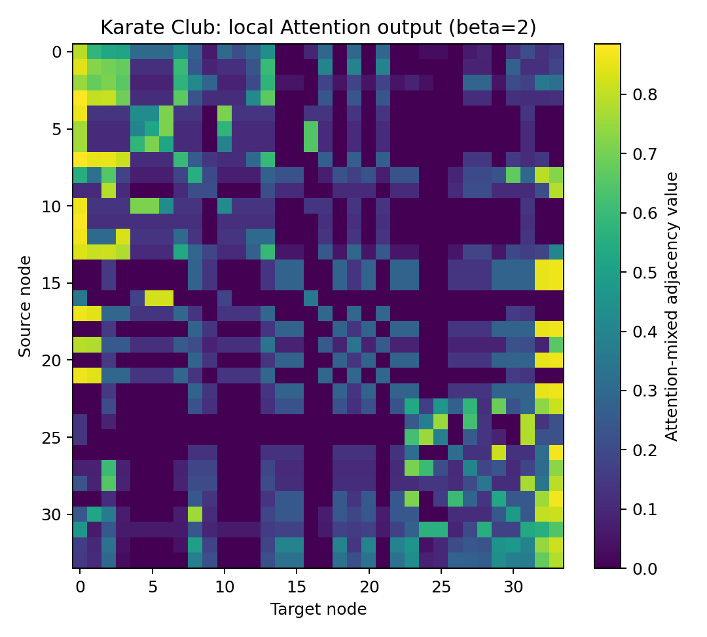

Figure 16. Attention output B = WA for Karate Club at β = 2, with the mask limited to each node and its observed neighbours. Rows and columns index source and target nodes; colour shows the mixed adjacency value. The original archived heatmap displays the continuous state produced by aggregation. It has no uncertainty intervals.

### Safety thresholds and effective neighbour count

The working safety thresholds are non-edge leakage ≤5%, symmetry error ≤5% and mean self-loop mass ≤5%. Median N_eff ≥2 is used as a provisional requirement for meaningful mixing of multiple states. Increasing β makes the weights more selective; the table records the first tested setting meeting all three safety thresholds.

Table 11. First tested settings satisfying the working safety thresholds.

| Network | First safe β | Median N_eff | Non-edge mass | Symmetry error | Self-loop mass |
| --- | --- | --- | --- | --- | --- |
| Karate Club | 16 | 1.0005 | 0.034% | 0.359% | 0.093% |
| Davis Southern Women | 8 | 1.0137 | 0.220% | 0.176% | 0.186% |
| Florentine Families | 8 | 1.0121 | 0.276% | 1.131% | 0.824% |

Working safety thresholds are ≤5% on each of the three diagnostics. These tolerances and N_eff ≥2 are operational criteria for this experiment. Meeting a tolerance is approximate agreement with the required state, rather than exact binary legality.

The tested settings contain no case that meets all three thresholds while maintaining median N_eff ≥2. Approaching the original legal state requires self-attention close to 1, effectively copying the original adjacency row. This is a positive instance of wrapper exhaustion under the stated protocol: safety is obtained by suppressing the mixing operation.

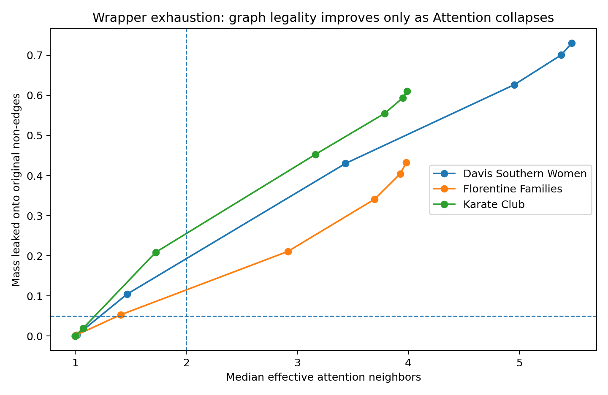

Figure 17. Non-edge leakage versus median effective neighbour count across the archived β scan on three real graphs. Each point is a tested setting; connecting lines show the scan trajectory. Dashed lines mark 5% leakage and N_eff = 2. The low-leakage settings approach single-state copying. The figure retains the original plotted scan; split-level records are not available for this early experiment.

### Projection as the state generating operation

Two post-processing operations are compared. A fixed local threshold of 0.5 provides limited control over symmetry and global edge structure. A stronger projection symmetrizes B and Bᵀ, removes the diagonal and selects the highest-scoring edges using the known original edge count as oracle information.

Table 12. Local and global projection.

| Network | N_eff at β 2 | Local 0.5 edge F1 | Global oracle edge F1 | Interpretation |
| --- | --- | --- | --- | --- |
| Karate Club | 3.163 | 0.794 | 0.962 | Large recovery with global projection. |
| Davis Southern Women | 3.435 | 0.729 | 0.966 | Large recovery with global projection. |
| Florentine Families | 2.915 | 0.987 | 1.000 | Almost complete recovery. |

Same β = 2 graph states as Table 10. Higher F1 is better. The global projection uses the original edge count as oracle information; its result should be interpreted under that information advantage.

The projection clarifies the division of responsibility. Attention can generate scores or proposals, while a discrete projection enforces the next state's legality. The effective state-transition operation then consists of proposal generation followed by constrained selection.

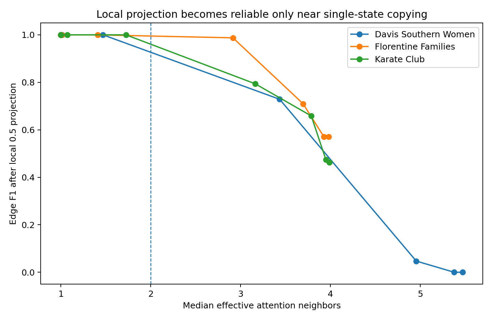

Figure 18. Edge F1 after local thresholding at 0.5, plotted against median N_eff in the archived graph experiment. Higher F1 indicates closer recovery of the original edge set. Each point is a tested β setting; the dashed line marks N_eff = 2. Most comparisons recover the original structure reliably only near single-state copying. No uncertainty intervals are shown.

### A relation operator preserving observed support

A minimal alternative avoids averaging complete neighbouring states. It assigns a gate to each observed edge.

$$
R=A\odot\exp(\beta S)
$$

The adjacency matrix A acts as the support mask. Non-edge leakage is therefore zero for every β; symmetry of A and S preserves symmetry of R, and the diagonal remains zero. This control establishes that reweighting observed relations and averaging adjacency states have different structural consequences. It is a relation-weighting operation whose discrete state interpretation requires the distinction described below.

Technical note. R preserves the original edge support, symmetry and zero diagonal, but its entries are generally real weights. These properties define an admissible weighted relation matrix. Producing a binary graph still requires a discrete selection rule; the binary support of R recovers A when all retained edge weights are positive.

### Implications for state transition design

For a target requiring every intermediate state to belong to a discrete or nonconvex admissible set, the tested attention aggregation leaves that set during effective mixing. Single-state selection or an explicit projection can restore the required state form. The operational response is to assign state generation to discrete selection, constrained projection or another suitable operation, while retaining attention scores where they are useful.

This conclusion applies to the specified requirement to maintain discrete graph states. Attention used for hidden representations or node classification serves a different target. Operator suitability depends on what the model state is required to mean.

## 19 Separating relation scores from state generation

The combined procedure distinguishes relation scoring, state aggregation and projection into the admissible state space. The following ten steps express the method supported by MDM-SOP-001 and MDM-KERNEL-001.

1. Declare the intended target: natural frequency, uniform structural coverage, continuous local relations, discrete legal states or another specified mechanism.

2. Fix the observation or geometry anchor used to evaluate transformations. Keep the reference sufficiently independent of the model updates being assessed.

3. Examine coverage, support, local-scale traces, density valleys, topology, discrete or combinatorial constraints and the observation process.

4. Form a candidate set containing the unchanged baseline, coverage correction, geometry guards, local-scale relations, projection and replacement operators where relevant. A diagnostic opens a candidate comparison.

5. Use a small validation probe aligned with the target. Natural RMSE and macro-RMSE may support different choices.

6. When the issue is neighbour selection, evaluate local masks, scale biases and boundary gates around attention. Record N_eff, support leakage and geometric distortion.

7. Retain the attention operator when admissible settings maintain N_eff ≥2, meet state requirements and provide adequate performance.

8. Treat safety achieved only through N_eff approaching 1 or a residual gate approaching 0 as exhaustion of the tested corrections. Reconsider attention's role in state generation.

9. Where attention scores remain useful, use them as proposals for discrete selection, constrained projection or a relation-based state operation.

10. Separate structural learning from prevalence calibration. Respond to missing support with additional data, restricted extrapolation or explicit uncertainty.

The data constrain relations, the target determines evaluation, the observation process identifies relevant sampling adjustments, and the admissible state space determines the role of each operator.

The graph-state experiments use the canonical real networks distributed with NetworkX 3.6.1. Original adjacency matrices are binarized directly from those graphs, without adding nodes or edges. The attention calculation is restricted to the original self-and-neighbour mask.

## 20 Selecting operators from the relation mechanism

Experiment MDM-KERNEL-002

MDM-KERNEL-002 examines the choice of a replacement operation after wrapper exhaustion. The question is which candidates match the admissible states and relation structure of the data.

### Research question and edge recovery protocol

The experiment uses Zachary Karate Club, Davis Southern Women and Florentine Families. Approximately 15% of observed edges are withheld in each split, and candidates use the remaining structure to rank the missing relations.

Only actual observed edges serve as positives. The protocol preserves connectivity in the one-mode graphs and aims to retain at least one observed edge at each endpoint in all graphs. Each dataset has 100 random edge-holdout splits. Evaluation uses ROC AUC, average precision and Recall@k, where k is the number of withheld edges in that split.

### Candidate operations

The candidates represent three approaches to recovering relations.

1. Attention followed by projection. Each node mixes states within its observed self-and-neighbour set; the resulting values supply missing-edge scores.

2. Singular value decomposition. A low-rank approximation to the observed adjacency matrix supplies relation scores.

3. Relation-native operations. Paths, common neighbours and resource-allocation quantities score possible edges directly within the admissible relation space.

The third approach takes edge existence as its basic prediction target, using relation structure directly rather than requiring a newly aggregated node state.

### Bipartite parity in Davis Southern Women

Davis Southern Women is an affiliation network with women in one partition and events in the other. Admissible edges cross between the partitions. Its observed adjacency matrix has the block form below.

$$
A=\begin{bmatrix}0&B\\B^T&0\end{bmatrix}
$$

Even powers A², A⁴ and so forth return to the same partition. Odd powers A³, A⁵ and so forth can reach the opposite partition. The bipartite structure therefore constrains which path orders can supply scores for missing cross-partition edges.

Table 13. Davis recovery by adjacency path order.

| Path order p | AUC | Average precision | Recall@k |
| --- | --- | --- | --- |
| 1 | 0.500 | 0.074 | 0.162 |
| 2 | 0.500 | 0.074 | 0.162 |
| 3 | 0.753 | 0.219 | 0.231 |
| 4 | 0.500 | 0.074 | 0.162 |
| 5 | 0.702 | 0.196 | 0.215 |
| 7 | 0.668 | 0.178 | 0.193 |

Means over 100 recorded Davis edge-holdout splits. Higher values are better. Recall@k uses k equal to the number of withheld edges. At path orders with tied zero scores, AUC is 0.500; nonzero Recall@k can arise from tie ordering and is not evidence of useful ranking.

Orders 1, 2 and 4 all yield AUC 0.500. At order 3, AUC reaches 0.753. Normalizing three-hop contributions by intermediate-node degree raises AUC to 0.806.

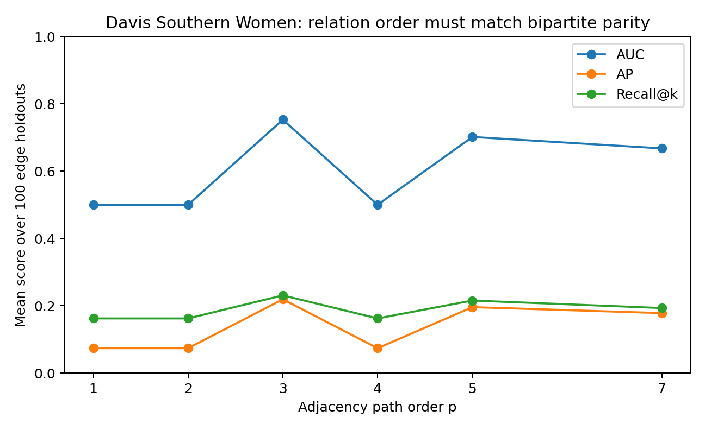

Figure 19. Davis Southern Women edge recovery using adjacency powers 1, 2, 3, 4, 5 and 7. Points are mean AUC, average precision and Recall@k over 100 recorded edge-holdout splits. Odd path lengths can cross the bipartition; the direct adjacency score is zero for withheld edges. The original figure displays means without error bars; per-split values are supplied in the evidence archive.

### Different graphs favour different candidates

Table 14. Graph specific edge recovery.

| Dataset | Operator | AUC | Average precision | Recall@k |
| --- | --- | --- | --- | --- |
| Davis | Attention followed by projection | 0.500 | 0.074 | 0.162 |
| Davis | Degree-normalized three-hop relations | 0.806 | 0.276 | 0.301 |
| Davis | SVD | 0.817 | 0.296 | 0.297 |
| Karate | Attention followed by projection | 0.622 | 0.043 | 0.015 |
| Karate | Adamic–Adar | 0.719 | 0.137 | 0.174 |
| Karate | SVD | 0.746 | 0.159 | 0.178 |
| Florentine | Attention followed by projection | 0.560 | 0.106 | 0.073 |
| Florentine | Adamic–Adar | 0.570 | 0.084 | 0.077 |
| Florentine | SVD | 0.435 | 0.070 | 0.037 |

Means over 100 recorded splits per graph. Higher AUC, average precision and Recall@k are better. Candidate prevalence and graph size differ, so direct comparisons use methods within each graph. The Davis three-hop row includes degree normalization.

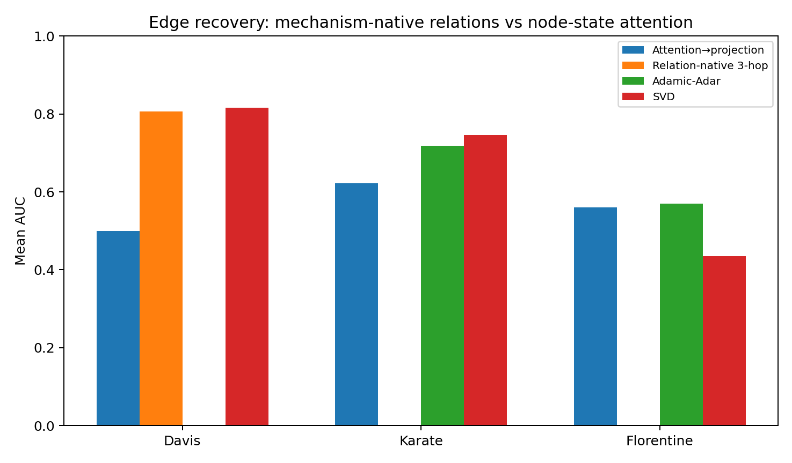

Figure 20. Mean edge-recovery AUC over 100 recorded splits per graph. The comparison includes attention proposals, SVD and relation-based candidates appropriate to each graph. Empty positions are unplotted candidates, not measured zero scores. The evidence archive supplies per-split results; the original figure displays means without error bars.

Karate and Davis contain sufficient relation redundancy for path-based and low-rank operations to recover withheld edges. Karate has an average clustering coefficient of approximately 0.571 and cycle rank 45. The source report also records AUC 0.792 for a separate third-order path probe, compared with 0.622 for the attention proposal in this experiment.

Evidence note. The separate Karate third-order value 0.792 is retained from the report. The supplied supplementary per-split table records resource allocation, preferential attachment, geodesic closure and Katz comparisons, rather than that raw third-order probe.

Florentine has 15 nodes, 20 edges, cycle rank 6 and average clustering approximately 0.16. Relatively few redundant paths remain after edge removal, and the tested candidates perform weakly. Under these conditions, the procedure can report insufficient relation evidence and abstain from selecting a replacement.

### A procedure based on admissible relations

Operator selection after wrapper exhaustion follows five steps.

1. Specify the state: continuous weights, binary edges, symmetric relations, bipartite relations or another constrained object.

2. Specify admissible transformations, including which entities can be related and which mixtures have a meaningful state interpretation.

3. Derive the relevant path types or minimum nontrivial relation order from the structure.

4. Compare a small set of compatible candidates in a validation probe, including an unchanged baseline or abstention where appropriate.

5. Assign an operator a state-transition role when its relation evidence and state-validity checks support that use.

Davis illustrates the reasoning. An even path length cannot score a cross-partition affiliation. Three hops provide the first nontrivial path-based alternative to the direct edge, which is absent by construction in the recovery task.

### The role of attention proposals

Attention can remain a proposal layer when its scores help rank candidates. The tested Davis attention-state proposal has AUC 0.500, so that particular proposal supplies no ranking information in this protocol. A relation operator consistent with the bipartite algebra is then a more useful candidate.

### Interpreting path structure

A bipartite network can be pictured as a transport system connecting residential areas and event venues. Starting in a residential area, one step reaches a venue, two steps return to a residential area and an odd number of steps reaches a venue again. This alternating structure determines which paths can answer a cross-partition relation question.

Modelling hypothesized mechanisms underlying data consequently includes specifying the algebra of admissible computations. State constraints and meaningful paths help derive the candidate operations.

### Findings from the relation comparisons

The comparisons support the following operational conclusions.

After wrapper exhaustion, derive replacement candidates from state constraints and relation structure.

Davis supplies a clear case of relation-order matching: even-order paths return to the wrong partition for the target edge, while three hops provide the first nontrivial compatible path.

Karate supports the use of multihop and low-rank relation recovery in a network with redundant paths.

Florentine demonstrates a valid insufficient-evidence outcome when relation redundancy is limited.

The usefulness of attention as a proposal layer is itself a question for the validation probe.

Evidence for MDM-KERNEL-002 includes per-split CSV results, summary tables, a Davis path-order scan, graph diagnostics and the two figures in this section. The accompanying Python file is a protocol sketch; the recorded CSV files provide the executed results.

## 21 Precommitted validation on additional datasets

Experiment MDM-​SOP-​BLIND-​VALIDATION-​003

The earlier datasets were used to develop the procedure. MDM-​SOP-​BLIND-​VALIDATION-​003 assesses it on four additional datasets by recording decisions from design, feature geometry, measurement semantics or graph topology before calculating downstream performance. Outcomes and scores are then examined against those recorded predictions.

The four datasets represent different tasks: Travel Mode Choice, Engel household expenditure from 1857, the RAND Health Insurance Experiment and the Les Misérables coappearance network. The archived precommitment record has SHA-256 hash 9fe8186f86ddd697e29544bf8d4089aa1ff47fe49fcc987bbeb36d659e243159.

Protocol scope. The archived scripts and matching hash support a staged precommitment followed by score calculation. The hash identifies the recorded file; it does not independently certify when the file was created. For Les Misérables, the design-stage diagnostics examine the full original topology before edge removal. This is a precommitted operator comparison using that topology, rather than validation on an entirely unobserved graph.

The protocol fixes the target mechanism and candidate operation before evaluating the downstream result. The original predictions remain the reference when results disagree with them; those disagreements inform revisions to the procedure.

### Precommitted targets and predictions

#### ModeChoice

Target: Predict one selected alternative within each individual choice set.

Candidate: GROUP_CHOICE_KERNEL.

Recorded prediction: Flat i.i.d. row training is mechanism-misaligned. A group-normalized conditional-choice likelihood should improve held-out choice-set log loss and should not reduce choice-set accuracy.

#### Engel

Target: Recover the food-expenditure response law across the observed income support, giving comparable importance to different income regions.

Candidate: COVERAGE_​BALANCED_​STRUCTURE_​TRAINING.

Recorded prediction: Equal-width coverage-balanced training should improve macro-RMSE across income regions; ordinary RMSE may improve less or remain similar because natural occupancy is intentionally not the primary target.

#### RAND HIE

Target: Predict visit counts with a likelihood consistent with count-valued observations.

Candidate: COUNT_LIKELIHOOD_KERNEL.

Recorded prediction: A Poisson log-link learner should improve Poisson deviance over a Gaussian/Ridge baseline; RMSE need not be the main winner because the target mechanism is count likelihood.

#### Les Misérables

Target: Recover held-out relations in a one-mode undirected relation network.

Candidate: RELATION_NATIVE_KERNEL.

Recorded prediction: Because the observed graph has substantial path/cycle redundancy, path- or neighborhood-native scores (3-hop/Adamic-Adar/SVD) should outperform a simple degree/prevalence baseline; no state-mixing kernel is required.

### ModeChoice and the choice set likelihood

ModeChoice contains 210 individuals with four travel alternatives each. The task predicts one selected alternative per individual choice set. The precommitted candidate is a group-normalized conditional-choice likelihood, compared with logistic training that treats the 840 rows as independent binary outcomes.

Implementation detail. Both models use standardized travel-time and cost variables together with alternative indicators. Complete individuals are held out, and both sets of test scores are normalized within each choice set before NLL and accuracy are calculated. The comparison therefore concerns the training objective under a common group-level evaluation.

Table 15. ModeChoice validation.

| Metric | Flat logistic | Group-choice model | Difference |
| --- | --- | --- | --- |
| Choice-set NLL | 1.0070 | 0.9394 | 6.72% improvement |
| Choice-set accuracy | 70.63% | 70.26% | −0.37 pp |

Means over 60 splits holding out complete individuals, with 70% of individuals used for training. NLL is evaluated within each choice set after normalizing scores for both models. Lower NLL and higher accuracy are better; pp means percentage points.

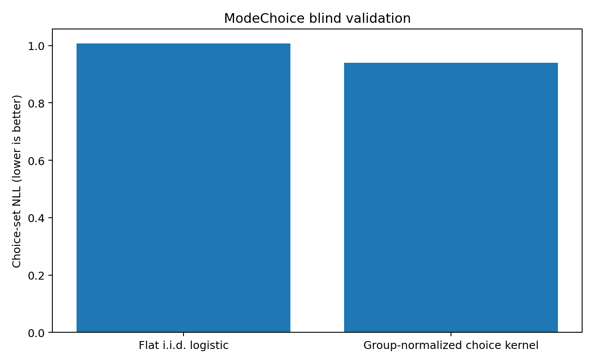

Figure 21. Mean choice-set negative log-likelihood over 60 group-held-out ModeChoice splits. The flat logistic comparison gives 1.0070 and the group-normalized model 0.9394. Lower values indicate better probabilistic prediction. The original figure shows means without error bars; the archive includes each split's results.

Across 60 group-held-out splits, mean choice-set NLL falls from 1.0070 to 0.9394, a reduction of approximately 6.72%, with improvement in 90% of splits. Mean choice accuracy changes from 70.63% to 70.26%, a decrease of 0.37 percentage points; the distribution of paired accuracy differences spans zero. The principal probability objective improves, while the additional precommitted condition that accuracy should not decrease is unmet in the mean result.

The choice-set mechanism specifies the quantity to optimize when probabilistic choice is the target. A task concerned specifically with top-choice accuracy still requires evaluation on that metric.

### Engel and automatic coverage correction

Engel has strongly uneven income coverage. Eight equal-width income intervals contain 138, 70, 19, 6, 1, 0, 0 and 1 observations. The ratio of the 90th to the 10th percentile of local scale is approximately 7.34. The precommitment predicts that coverage-balanced structure training will improve macro-RMSE across income regions.

Table 16. Engel coverage correction.

| Metric | Ordinary training | Forced coverage balance | Assessment |
| --- | --- | --- | --- |
| Overall RMSE | 106.76 | 109.90 | Higher error |
| Macro-RMSE | 130.08 | 135.07 | 3.83% higher error |

Means over 120 random 70/30 train/test splits. Lower error is better, in the dataset’s food-expenditure units. Eight equal-width bins are defined from training income; macro-RMSE averages only test bins containing at least two observations. Those bins average 4.3 per split, so the metric does not evaluate the empty income regions.

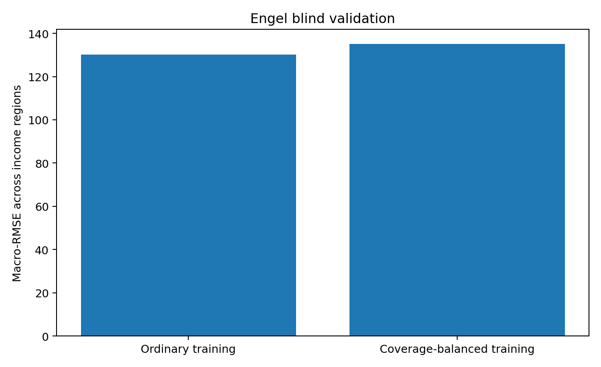

Figure 22. Mean macro-RMSE for ordinary and forced coverage-balanced training over 120 Engel splits. The recorded values are 130.08 and 135.07; lower is better. In the implementation, the macro average includes test regions with at least two observations. The original chart shows means without error bars.

The prediction fails in this comparison. Across 120 random splits, macro-RMSE rises from 130.08 to 135.07, a deterioration of approximately 3.83%; ordinary RMSE rises from 106.76 to 109.90. Uneven geometry identifies a coverage question to test, while these results determine whether weighting is useful for the selected model and objective.

A subsequent nested probe compares ordinary and coverage-balanced training using only the training portion of each outer split. It selects the unchanged model in 63 of 80 outer splits, or 78.75%.

The follow-up uses four-fold inner validation of cubic spline ridge regression with six knots and ridge penalty 1.0. Coverage weights come from eight equal-width training-income bins, are clipped between 1/8 and 8, and are normalized to mean 1. Outer tests remain separate from this selection. The 80 outer splits use different seeds from the original 120-split comparison.

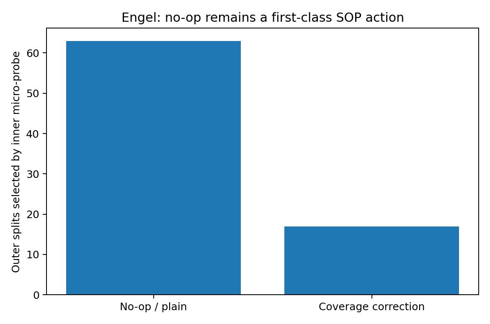

Figure 23. Decisions of the training-only nested probe in Engel. Four-fold inner validation selects ordinary training in 63 of 80 outer splits and coverage correction in 17. Bars are selection counts. This follow-up uses a separate set of outer splits from the 120-split comparison in Figure 22.

In this nested experiment, outer macro-RMSE is 138.88 for the selector, 145.53 for forced correction and 138.10 for always using ordinary training. The selector reduces the harm from automatic correction, although always using the unchanged baseline remains slightly better on average. This demonstrates the practical role of giving the unchanged model equal standing in the candidate set.

### RAND HIE and the choice of a count model family

Table 17. RAND HIE validation.

| Metric | Gaussian ridge | Poisson log link | Assessment |
| --- | --- | --- | --- |
| Poisson deviance | 4.1718 | 4.1690 | Predicted direction with a very small gain |
| RMSE | 4.349 | 4.361 | Slightly higher error |
| MAE | 2.587 | 2.595 | Slightly higher error |

Means over 25 random 75/25 train/test splits. Lower deviance, RMSE and MAE are better. RMSE and MAE use medical-visit counts. Ridge predictions are clipped to a positive value for the deviance calculation; model and penalty settings follow the archived script.

The precommitment uses the documented meaning of mdvis as a nonnegative count of medical visits to select a count likelihood. Mean Poisson deviance falls from 4.1718 to 4.1690, a relative improvement of approximately 0.067%, with improvement in 64% of 25 splits. RMSE and MAE are slightly higher with the Poisson model.

After outcome inspection, mdvis has mean approximately 2.86 and variance approximately 20.29, a ratio of about 7.1. This motivates a finer distinction between choosing a candidate family and selecting a specific model. The source proposes comparisons involving Poisson, negative-binomial and Tweedie formulations, with the exact choice determined by a validation probe and the outcome support. The technical note below clarifies the support of the Tweedie family.

Technical note. For a strict count likelihood, the candidate distribution must have the required count support. The Tweedie family includes Poisson at power 1, whereas powers between 1 and 2 define a compound Poisson–Gamma outcome with a continuous positive component. Those members require a corresponding outcome interpretation. See the distribution table in the official documentation

[TweedieRegressor — distribution families](https://scikit-learn.org/stable/modules/generated/sklearn.linear_model.TweedieRegressor.html)

### Les Misérables and relation based recovery

Table 18. Les Misérables relation recovery.

| Relation operator | Mean AUC over 100 splits |
| --- | --- |
| Preferential attachment | 0.775 |
| Common neighbours | 0.907 |
| Adamic–Adar | 0.914 |
| Three-hop score A³ | 0.856 |
| Rank-8 SVD | 0.827 |
| Neighbour-profile cosine | 0.882 |

Means over 100 graph splits, each holding out 30 observed edges and sampling 30 original non-edges as controls. Higher ROC AUC is better. Scores use the remaining unweighted graph; the source network includes edge weights.

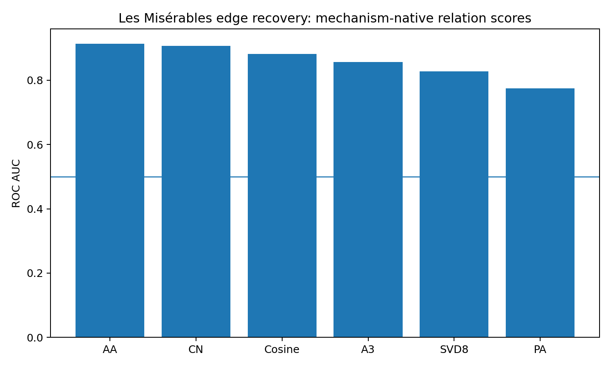

Figure 24. Mean ROC AUC over 100 Les Misérables edge-holdout splits. AA is Adamic–Adar, CN common neighbours, A3 a three-hop score, SVD8 a rank-8 approximation, and PA preferential attachment. Each split compares 30 withheld real edges with 30 sampled original non-edges. The horizontal line marks AUC 0.5; the original bars show means without uncertainty intervals.

The original Les Misérables graph has 77 nodes, 254 edges, cycle rank 178 and average clustering approximately 0.573. These diagnostics motivate path- and neighbourhood-based candidates before downstream scoring. Across 100 edge-holdout splits, preferential attachment gives AUC 0.775, common neighbours 0.907, Adamic–Adar 0.914, three-hop scoring 0.856 and neighbour-profile cosine 0.882. Adamic–Adar improves mean AUC by approximately 17.9% relative to preferential attachment and exceeds it in all 100 splits.

### Assessment of the precommitted predictions

Table 19. Assessment of precommitted predictions.

| Dataset | Precommitted operation | Observed assessment | Implication for the procedure |
| --- | --- | --- | --- |
| ModeChoice | Group-normalized choice model | Principal NLL target improves; mean accuracy is slightly lower. | Mechanism assumptions identify a relevant loss; evaluate other task metrics separately. |
| Engel | Direct coverage correction | Prediction fails. | A diagnostic opens a candidate comparison, including the unchanged baseline. |
| RAND HIE | Poisson count model | Predicted deviance direction with a very small effect. | Choose a family before selecting its precise member. |
| Les Misérables | Relation-based operator | Strong improvement over the degree-based comparison. | State constraints and redundant paths help constrain useful candidates before downstream scoring. |

The principal-metric direction is favourable in three datasets. This count describes the tested comparisons; ModeChoice also had a separate accuracy condition that was not met in the mean result.

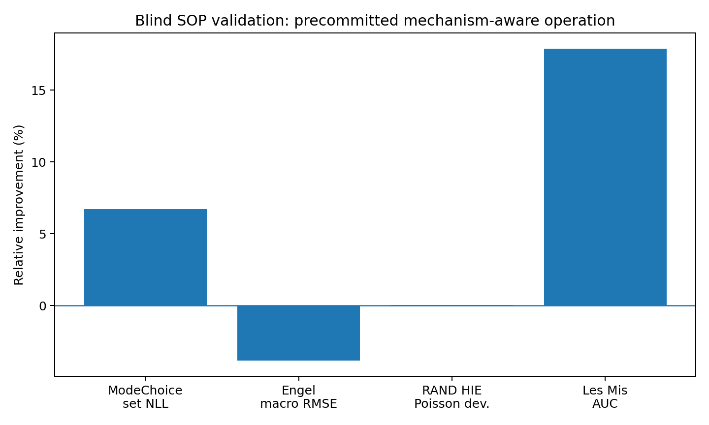

Figure 25. Relative change in each precommitted principal metric. Positive values indicate improvement: a reduction in ModeChoice NLL, Engel macro-RMSE or RAND HIE deviance, or an increase in Les Misérables AUC over preferential attachment. The graph bar uses the highest mean AUC among the evaluated relation candidates, Adamic–Adar. These are task-specific comparisons with different denominators, not a common effect-size scale. The figure shows no uncertainty intervals.

Three of the four principal metrics move in the predicted direction; Engel moves against it. The ModeChoice accuracy condition also remains unmet in the mean comparison. Together, the outcomes support using mechanism assumptions to constrain the candidate space, followed by training-only selection that retains an unchanged baseline or abstention where appropriate.

### A procedure informed by the validation results

1. Declare the target: natural frequency, coverage of observed structure, probabilistic choice, count generation, valid graph states or another explicit objective.

2. Record the design and data diagnostics before examining downstream performance. These may include coverage, local scales, choice sets, measurement type, topology and admissible states.

3. Use diagnostics to generate candidate families. Mathematical state constraints can directly exclude inadmissible operations; other diagnoses require empirical comparison before enabling a correction.

4. Include an unchanged baseline and, where the evidence is inadequate, abstention alongside more complex operations.

5. Use a low-cost probe within the training data to choose among the unchanged model, constraints around attention, loss families, relation operators and state-transition operators.

6. Match evaluation to the declared target. Assess probabilistic likelihood directly when probabilities are the target, and assess regional coverage directly when equal regional performance is the target.

7. Address missing support through additional sampling, restricted extrapolation or explicit uncertainty. Weighting acts on existing observations.

8. For attention, first evaluate geometry masks, local scales and boundary gates. Record N_eff and departures from the required state space.

9. Reconsider attention's state-generation role after the tested corrections are exhausted. Useful attention proposals can feed an operation that produces admissible states.

10. Let mechanism diagnostics determine which operation families merit comparison, and let the validation probe choose the implementation.

A hypothesized mechanism constrains which operations are admissible candidates. Observed results determine which candidate is enabled for the stated task.

## 22 Conclusions

The investigation connects a local question about attention and data gaps with a broader modelling procedure. Data geometry constrains relations, the observation process identifies relevant sampling effects, the target mechanism determines the loss, and the admissible state space constrains aggregation. A training-only probe then selects an unchanged model, a correction around attention, a proposal-and-projection design, a replacement operation or abstention.

The additional-dataset validation gives complementary evidence. Les Misérables shows how topology can identify useful relation families before their downstream scores are known. Engel demonstrates the value of testing a proposed correction against the unchanged model. Together, they support a procedure in which explicit mechanism assumptions guide candidate selection and measured outcomes determine use.

The resulting method links data geometry, observation mechanisms, target mechanisms and state legality to a candidate operation family, then uses a training-only probe to select an unchanged model, correction, replacement or abstention.

The final validation uses the public Travel Mode Choice, Engel and RAND HIE datasets distributed with statsmodels, and the Les Misérables coappearance network distributed with NetworkX from Knuth's Stanford GraphBase. The archived validation scripts generate the reported per-split results from these sources.
