# Model Perception and Action Control

Corrective Optics for Language Models

Chapter 6 Report 01 English Edition 1 October 2026

## Executive summary

A decision-making agent must turn observations into an eligible action and then check what changed. This report follows that chain from the statistics of language to tool-control dynamics and causal intervention inside a pretrained model. Its central finding is that useful information can be present while the rule assigning it control authority remains unreliable. Repetition, similarity, task phase and execution feedback therefore require distinct measurements.

The ASTIG studies test corrective lenses for exposure, role, topology and geometry. Recorded coding-agent trajectories then show why a locally informative state can coexist with recurrent actions. Cooldown, expanded candidate search, phase eligibility and sustained recovery control each address a different failure. Controlled replay and eight real command executions provide separate evidence about temporal recovery and environmental verification.

The final study intervenes on the residual stream of a fixed Qwen2.5-1.5B-Instruct model using 70 paired requests. Selective axes in blocks 21–23 change first-action preferences in both directions. At block 23, a negative dose of two changes 18 of the 59 baseline over-action cases to a textual first action. A later opposite intervention reverses all nine corrections obtained at dose one when applied at blocks 24–26. This locates a causal control interface and measures its response to a competing input. The report distinguishes first-action correction, complete task execution and robustness to later perturbation.

## Reading guide

Sections 1–14 explain the optical analogy and calibrate the representation. Sections 15–22 follow the roundabout problem from loop diagnosis to environmental verification. Sections 23–24 examine mode geometry and direct causal control. Section 25 connects the results to decision-making agents. Experiment identifiers remain stable across the report, figures and evidence directory.

| Term | Meaning in this report |
| --- | --- |
| Exposure | The effective weight contributed by repeated appearances of content. |
| Role | The function of a span or action, such as prohibition, Edit, Test or Submit. |
| Topology and geometry | Which candidate connections are permitted, and how their distances are scaled. |
| State and phase | The representation available for prediction, and the discrete stage that governs action eligibility. |
| Cooldown and recovery latch | Temporary withdrawal of recent exact commands, and sustained control until a release condition is met. |
| Submitted | A recorded agent exit status. Benchmark resolution is a separate outcome. |
| TEXT and ACT | Textual and tool-oriented first-action modes under the specified output contract. |
| ASK and OVER_ACT | Baseline TEXT-prompt cases producing text first or a tool action first. |
| NLL | Negative log-likelihood; smaller values mean better predictive probability for the observed target. |
| LOTO and LOPO | Leave-one-trajectory/task-out evaluation and leave-one-pair-out axis estimation. The evaluation unit is stated in each experiment. |
| Fisher ratio and rank | Between-group separation relative to within-group scatter, and spectral measures of representation dimension. |
| TV JS SD CI | Total variation; Jensen–Shannon divergence; standard deviation; confidence interval. |

The experiment map is ASTIG-001–010 for observation calibration; ASTIG-011–012B for cross-model diagnosis and representation; ASTIG-013A–013E for recovery components; MODE-COLLISION-001 for controlled layerwise geometry; and MODE-CONTROL for pretrained first-action intervention. These stages use different samples and should not be pooled as one experiment.

What looks like a fact may be an image in a distorting mirror. Before replacing attention, we can measure its distortions and fit corrective lenses.

This report presents a continuous series of computational, trajectory, proxy and causal intervention studies. The series identifies measurable corrections to observation, separates action eligibility from similarity, and locates a selective first-action control interface in a fixed pretrained Qwen model. Its final experiment measures both the ability to change a first action and the susceptibility of that change to a later opposing intervention.

## Introduction to the choice between replying and acting

The study began with distortions in the statistics of surface language: how repetition, emphasis, negation, local density and similarity alter the effective statistical mass available to a model. A more fundamental question emerged as the experiments progressed. A unified language model must perceive its task clearly and, at particular moments, change the external world. For action-discrete tasks, text continuation and tool use are mutually exclusive first-action modes.

Chat mode: user → text continuation

Agent mode: user → action / tool → environment observation → updated control state

Image generation makes the distinction concrete. “Generate an image” and “describe how you would generate an image” can share almost all their semantic content, yet require IMAGE ACTION and TEXT REPLY respectively. The same structure appears in executing versus explaining a command, sending an email versus polishing a draft, and submitting work versus deciding whether it is ready to submit. The controlling variable is whether an external state should change. A mixture of 60% conversation and 40% action usually has no useful interpretation for this first decision; the intermediate outcome can itself be a task error.

### A Earlier evidence separating language continuation from action pressure

ASTIG-005 compared the recorded reasoning_content and external message channels in the same GPT-5-mini long tasks. Their lengths, first-person density, operational vocabulary and local repetition had different statistical forms. A single model can therefore produce different working-language distributions for maintaining a task state and communicating externally.

AGENT-NEXT-UTTERANCE-022 subsequently separated language history from environmental observations in 545 held-out mini-SWE-agent states. Weighted next-action top-1 accuracy was 37.43% using the language/history prior and 56.88% using the current environmental observation alone. Their calibrated combination reduced negative log-likelihood (NLL) from 8.696 for the language prior to 3.201. These measurements establish a substantial, separately measurable pressure from the observed environment on an agent’s next action.

AGENT-SPEAKING-SURROGATE-023 through AGENT-OBJECT-FIELD-025 extended this decomposition. Explicit agent control raised the action consistency of generated utterances from 37.90% to 76.61%; shell-slot factorization reached 96.77%. A working-object field retrieved 80.79% of the technical objects in the next utterance, and its fitted ranking reached 72.04% Top-3 accuracy. Together, these results distinguish a language/history prior, environmental action pressure, an operational shell and recruitment of grounded objects as separately measurable modelling components.

### B First action mode collision

In everyday research interactions involving image generation, files, email and other tools, requests to act sometimes produced ordinary conversational continuation: confirmation, explanation, a plan, or a high-quality textual answer. Understanding and language quality could appear strong while the first-action mode was wrong. We call this qualitative observation first-action mode collision. The controlled hard-switch studies later in this report give it a specific experimental form.

Style choices such as concise versus detailed or formal versus lively admit many useful intermediate responses. SPEAK versus ACT, DESCRIBE IMAGE versus GENERATE IMAGE, EXPLAIN versus EXECUTE, and DRAFT versus SEND often require a discrete world transition. Once the first action enters the wrong mode, fluent continuation can sustain a high-quality response within the wrong control state.

### C A hypothesis about an unstable mode variable

Capacity and routing are distinct issues. Given a reliable explicit mode state m in {CHAT, AGENT}, a sufficiently expressive conditional model can in principle learn the two policies through π(a | x, m). The difficult case is one in which mutually exclusive policies share an observable semantic state x while the mode variable is absent, weakly maintained or collapses during operation. The resulting distribution can assign both TEXT and ACTION labels to the same observed state. More parameters may fit that mixture more accurately; recovering a reliable routing variable is a separate modelling requirement.

m ∈ {CHAT, AGENT},     π(a | x, m)

When mode state is weakly resolved: P(a | x) = Σ_m P(a | x, m) P(m | x).

The resulting working hypothesis concerns hard-switch tasks whose policies are mutually exclusive and whose intermediate states have little task value. If mode routing remains unstable as model size increases, a nonzero conflict floor may persist. An explicit mode token, a separate action head or a structured router offers a direct intervention on this proposed mechanism. This remains a hypothesis about scaling and architecture; the agent-factorization results provide a concrete experimental starting point.

### D The Qwen roundabout as a temporal control problem

The Qwen-2.5-7B strong-loop results extend the first-action question to state updates after action. Under a common mini-SWE-agent harness and matched SWE-bench tasks, loop states retained substantial local action-predictive structure. Recurrence concerned action updates and candidate eligibility. Cooldown, topology expansion, phase eligibility and environmental observation address different parts of that process, separating semantic relevance from present permission to execute.

This motivates a hypothesis about entanglement between conversational state and tool-control state. Conversation maintains semantic continuity; tool control must also track consumed actions, task phase, repository changes, test status and the eligibility of the next action. If observations update semantic continuity more strongly than these discrete control variables, content may appear to advance while control remains in place. The Qwen trajectory studies establish behavioural instability and test recovery components; the proposed internal entanglement is a mechanism hypothesis.

### E The connection between corrective optics and loop control

The experiments repeatedly ask when an observed statistical relation should acquire control authority. Frequency must be distinguished from importance; similarity from a permitted connection; local relevance from an executable action. In strong loops, the existence of a new path, its functional role, its eligibility at the current phase and sustained recovery are separate questions. ASTIG-013E adds the distinction between completing a command and verifying its environmental consequences.

Corrective optics thus develops into a measurement-and-control framework. It identifies what the model observes, which candidates are eligible to act, the current control phase, and what changed after execution. The optical analogy concerns perception; the roundabout analogy concerns dynamics. Both require explicit rules connecting statistical information to action authority.

### F Surface codes and layerwise geometry

MODE-COLLISION-001 used 70 real request-for-information versus executable-request minimal pairs. It encoded the strings as UTF-8 bytes and measured statistical geometry at every layer of a controlled eight-layer causal Transformer. Surface probability-mass overlap was 95.98% for unigrams and 79.91% for four-grams; a held-out linear probe on exact byte unigram and bigram features reached 53.57%. After training, mean whole-sequence readability across three seeds peaked at 70.24% in Layer 6 and returned to 63.10% in Layer 8. Local five-neighbour cross-mode mixing remained about 55%. The result establishes a layer-dependent readability peak within substantially overlapping local geometry.

### G A selective first action control interface

MODE-CONTROL tested where internal changes causally alter the first action. With a fixed Qwen2.5-1.5B-Instruct revision, the original 70 pairs and a fixed TEXT/ACT contract, the 28-block intervention sweep identified selective, bidirectional residual-stream mode axes in blocks 21–23. Block 23 had a control effect C = 1.8571, exceeding matched orthogonal and effective label-swap controls. Intervening toward TEXT changed 9 of 59 over-action TEXT cases at α = −1 and 18 at α = −2, while the original 11 ASK cases remained TEXT at all negative doses. A second, equal-norm opposite intervention at block 24, 25 or 26 restored ACT in all nine cases rescued at α = −1; block 27 restored five. The experiment therefore identifies a useful late control interface and measures its susceptibility to downstream counterintervention.

## Study overview

Human language is naturally uneven. We repeat, emphasize, negate, circle back and use rhetorical bursts. Ten copies of a symbol may express emotion, while repeated mentions of A may occur within “do not do A.” These structures serve communication, but their surface frequency can also enter a model’s weighting and mixing operations.

The experiments separate several measurable distortions: exposure distortion when count accumulates linearly as evidence; density distortion when dense regions attract disproportionate relational mass; topology distortion when similarity determines connectivity; role distortion when CONTENT(A) and FORBID(A) share an undifferentiated channel; and differences between human-facing language and language used during sustained machine work.

The evidence develops through three linked sequences. ASTIG-001–010 measures surface clustering and tests Exposure, Role, Topology and Geometry corrections. On 18 GPT-5-mini trajectories, a calibrated prescription using content exposure near c^0.5, role exposure near c^0.7, two relevant historical states and local-scale geometry reached 61.72% next-action accuracy. Repeating an irrelevant old fragment 16 times changed 61.96% of raw decisions and 9.78% of corrected decisions. ASTIG-011–013E then distinguishes representation quality from work dynamics. An independent rolling command gate detected all eight Qwen limit-exceeded loops before the step limit; local correction retained useful action information in their 300 strong-loop states. A four-command cooldown intercepted 291 recurrent edges, external recorded paths supplied progression candidates to all 300 states, phase rules identified at least 76 premature submissions among 97 stage-blind choices, and controlled replay established a recovery latch of up to five steps. Eight real command executions on compatible SymPy snapshots supplied process, output, repository and smoke-test observations for verification. Finally, MODE-COLLISION-001 and MODE-CONTROL distinguish readable mode geometry from causal action control. The fixed pretrained model produced ACT first in all 70 executable requests and in 59 of 70 requests missing information. The completed intervention study located selective control axes in blocks 21–23, demonstrated partial first-action correction, explained seven generation-path divergences through repetition-penalty processing, and measured reversal under later opposing interventions. The following hypothesis register records the specific stage of evidence for each claim.

Table 1. Study overview.

| Hypothesis | Evidence status | Evidence summary |
| --- | --- | --- |
| H1 Surface language has local clustering beyond global frequency | Supported by computation | Frequency-preserving positional permutations have lower Fano statistics and fewer repeated n-grams than the observed code sequence. |
| H2 Repeated exposure should have sublinear evidential gain | Supported in engineering proxies | ASTIG-006–010: sublinear weighting improves NLL and stabilizes accuracy in recorded reasoning-to-tool prediction. The pooled 18-trajectory calibration favours a content exponent near 0.5. |
| H3 Control roles require a separate exposure treatment | Supported in the studied samples | Role-aware weighting outperforms uniform compression in the relevant probes. ASTIG-010 favours role and content exponents near 0.7 and 0.5; excessive role protection can introduce distortion. |
| H4 Stable long work combines diversity with reduced local looping | Supported observationally | After length matching among 479 Claude 4 Sonnet trajectories, resolved trajectories have slightly higher action entropy and fewer repeated n-grams. |
| H5 Internal working and external message channels can have different distributions | Partially supported | Recorded GPT-5-mini reasoning and messages differ in length, first-person density and repetition structure. |
| H6 Attention logits can be treated as a measurement subject to correction | Supported in engineering probes | Geometry and Topology lenses reduce nonlocal mass and improve propagation performance on four numerical datasets. |
| H7 Human readability and sustained machine-work stability may trade off | Mechanism hypothesis | The channel and trajectory findings motivate a controlled comparison that isolates expression statistics within a fixed model and task. |
| H8 Repeating irrelevant old history distorts long-task state and can be calibrated | Supported by trajectory-based stress tests | At 16× irrelevant-history repetition, raw versus corrected flip rates are 61.96% versus 9.78%, and accuracies are 31.52% versus 55.43%. |
| H9 Work dynamics identify strong loops before the step limit | Supported in an independent matched cohort | ASTIG-012A alerts at steps 9–14 in all eight Qwen LimitsExceeded tasks. The default W = 8 setting gives no strong alerts in 22 Submitted controls. |
| H10 Strong-loop diagnosis and representation utility are separate variables | Supported by an independent decoder | ASTIG-012B: local-corrected accuracy is 53.67% versus 21.67% raw in 300 gate-positive states. The direction holds in all 12 history-k and kNN-K configurations. |
| H11 A gated command cooldown intercepts short-cycle edges while preserving normal repetitions | Supported by recorded-edge interception | ASTIG-013A: h = 4 intercepts 291/300 recurrent edges (97.0%). Gated intervention occurs in 0/430 states from 22 Submitted controls. |
| H12 External candidates and progression roles expose exits beyond the current local basin | Supported by candidate-availability analysis | ASTIG-013B: own-history availability is 43.67%, 47.33% and 59.33% for k = 2, 4 and 8. Same-task GPT/DeepSeek traces supply unseen commands and unseen Edit/Test/Submit exits in 300/300 states. Their state-weighted mean progression rank is about 8.77. |
| H13 Progression roles require phase eligibility | Supported by phase-routing analysis | ASTIG-013C: the 300 states comprise 112 PRE_EDIT, 113 POST_EDIT_UNVERIFIED and 75 POST_EDIT_VALIDATED states. Every state has unseen external Edit, Test and Submit candidates. At least 76/97 stage-blind Submit selections are premature; phase-first allocation is 112 Edit, 113 Test and 75 Submit. |
| H14 Recovery requires sustained control over a short interval | Supported by controlled multistep replay | ASTIG-013D: one novel command clears the next gate in 8/300 states. Cumulative release coverage at one through five takeover steps is 80, 102, 150, 189 and 300/300; at five steps, 174 have submitted and 126 have a cleared recurrence gate. |
| H15 Recovery release requires several channels of environmental verification | Supported by real command compatibility execution | ASTIG-013E executes eight phase-selected commands. All three PRE_EDIT commands modify source, and smoke verification detects a syntax failure after one rc = 0 result. The three verification and two submit commands preserve source. For task 20154, pipefail changes a masked ImportError pipeline status from 0 to 4. |
| H16 Overlapping surface distributions can develop stronger intermediate-layer mode readability | Supported in a controlled surrogate | MODE-COLLISION-001: 70 pairs; unigram/four-gram overlap 95.98%/79.91%; raw-code probe 53.57%. The three-seed whole-sequence probe peaks at 70.24% in Layer 6 and is 63.10% in Layer 8, with local cross-mode mixing near 55%. |
| H17 Pretrained first-action mode has a directionally intervenable control structure | Supported by local causal intervention | MODE-CONTROL FINAL: blocks 23, 22 and 21 pass the specified bidirectional-effect, pair-direction, matched-control, behavioural-rescue and collateral criteria. Block 23 C = 1.8571; α = −1/−2 changes 9/59 and 18/59 over-action first actions to TEXT. |
| H18 Hard-switch control can be late and weakly committed in the tested Transformer | Supported within this model and cohort | The final experiment identifies selective late control axes. The baseline has 59/70 over-action TEXT cases, and an equal-norm opposite intervention at blocks 24–26 reverses all nine block-23 rescues at α = −1. The proposed vulnerability concerns late arbitration and susceptibility to counterintervention. |
| H19 A later intervention can reverse an established first-action correction | Supported by the reversal assay | All nine block-23 rescues return to ACT after opposite interventions at block 24, 25 or 26; five return at block 27. Local correction and resistance to a later perturbation are separately measurable properties. |

*Source: the research record described in this section. Values are descriptive unless an evidence status is explicitly stated.*

The final causal study identifies a selective TEXT/ACT control axis in the late residual stream of pretrained Qwen2.5-1.5B-Instruct. Blocks 21–23 satisfy the specified effect, control and behavioural criteria. Block 23 C = 1.8571 compares with 95th-percentile effects of 0.0262 and 0.1824 for orthogonal and effective label-swap controls. The interface corrects some over-action first actions and remains susceptible to a later opposing intervention. This establishes local causal control and gives a concrete assay of commitment strength.

## 1 Human expression as an observation process

The starting question is what attention treats as evidence. “Do not do A, do not mention A, do not elaborate on A” repeatedly exposes A. “Hahahahaha” uses repetition for emotional emphasis. A surface-based relation calculation receives additional tokens, positions and matching opportunities from both, even though their communicative roles differ.

Language can therefore be treated as an observation process. A human expression operator O first encodes the task or world state; attention A then transforms that representation again. The model receives A(O(world)). Interpreting the resulting weights requires accounting for both operations and their possible systematic distortions.

Observed relation = Attention( Human-expression( latent task state ) )

The engineering objective is to measure these distortions and apply a correction to each identified component. We call this approach corrective optics for attention: measurement precedes the prescription.

## 2 ASTIG 001 Local clustering in surface language

### 2 1 Encoding and sample

To avoid confusing a proprietary tokenizer’s vocabulary with language statistics, the first study used a deterministic code scheme. Chinese characters, Latin words, numbers and punctuation were assigned integer codes. Frequency, position, local-window, two- through five-gram and permutation statistics were then computed on the code sequence. The sample consisted of actual inputs from this research conversation.

The first snapshot contained 14 inputs, N = 857 codes and V = 305 distinct codes. A later snapshot contained N = 908 and V = 310. Both gave the same qualitative direction. Overall distribution statistics below mainly use the later snapshot, while the permutation test uses the earlier one.

Table 2. Encoding and sample.

| Measure | Observed value | Interpretation |
| --- | --- | --- |
| Normalized entropy | 0.912 | Moderate overall entropy with concentrated frequency mass |
| Gini | 0.485 | Unequal exposure across codes |
| Mass in the top 5% of codes | 29.85% | A small fraction carries almost 30% of the surface mass |
| Mass in the top 10% of codes | 40.31% | The highest-frequency tenth carries about 40% |
| 95th percentile of local overrepresentation | About 13.2× | Local concentration substantially exceeds global-frequency expectation |
| Maximum local overrepresentation | About 53.6× | An extreme local burst |

*Source: the research record described in this section. Values are descriptive unless an evidence status is explicitly stated.*

### 2 2 A frequency preserving positional control

Frequent codes will repeat even without clustering. We therefore preserved the count of every code and randomly permuted the 857 positions 400 times. Differences from this reference isolate positional organization beyond total frequency.

Table 3. A frequency preserving positional control.

| Statistic | Observed sequence | Permutation reference | Result |
| --- | --- | --- | --- |
| Window Fano statistic | 1.163 | 0.928 ± 0.061 | About +3.86 SD |
| Repeated bigram types | 109 | 20.6 | About 5.3× |
| Repeated trigram types | 44 | 0.23 | About 191× |
| Repeated four-gram types | 17 | 0 | Essentially absent in the permutations |
| Median return distance of repeated codes | 31 | 38.6 | Shorter spacing in the observed sequence |

*Source: the 857-code sequence and 400 frequency-preserving permutations. ± denotes the reported permutation standard deviation; ratios use the permutation mean.*

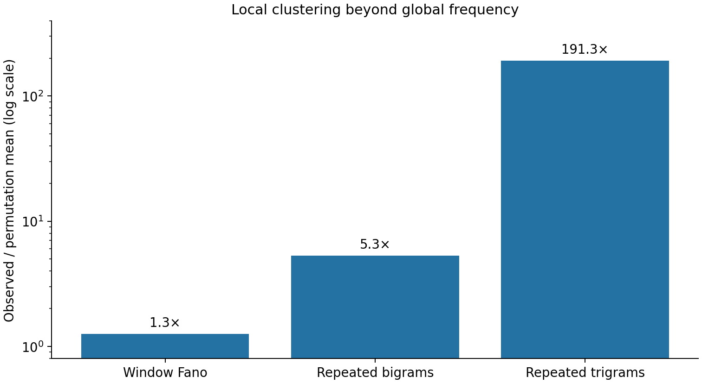

Figure 1. Positional clustering in the research-conversation code sequence relative to 400 frequency-preserving permutations. Bars show observed/reference ratios for the window Fano statistic, repeated bigram types and repeated trigram types. The vertical axis is logarithmic because the trigram ratio is approximately 191.3. No uncertainty bars are shown.

### 2 3 The compressed spring analogy

The surface sequence resembles springs with changing compression. Concepts, tone and control expressions can cluster sharply in a short interval. That compression may matter for human communication; its contribution to a machine’s internal importance still requires calibration.

“Hahahaha” and “do not do A” illustrate two mechanisms. The former largely expresses tone. The latter contains both a FORBID operator and the representation of its target A. Treating both as a single frequency phenomenon creates the coupling examined in the next studies.

## 3 ASTIG 002 Surface density equalization

### 3 1 Local compression

For token t_i at position i, let n(t_i) be its total count. The local window length determines an expected local count E_i under a uniform positional distribution with the same global frequency. Compare the observed local count c_i with E_i:

b_i = c_i / E_i

A value b_i near 1 indicates agreement with global-frequency expectation; a much larger value indicates additional local compression. The token sequence is retained, while its internal exposure receives a weight:

g_i = n(t_i)^(-β) · max(1, b_i)^(-α)

The correction changes the statistical mass contributed by a surface token to the relation calculation. The language visible to the reader remains the same.

### 3 2 Redistribution of effective statistical mass

Table 4. Redistribution of effective statistical mass.

| Measure | Before correction | After correction |
| --- | --- | --- |
| Normalized entropy | 0.912 | 0.983 |
| Gini | 0.485 | 0.220 |
| Mass in the top 5% of codes | 29.85% | 13.49% |
| Mass in the top 10% of codes | 40.31% | 21.21% |

*Source: the sample and protocol in this section. Percentages retain their stated denominators; NLL is unitless and lower is better. Values are the reported descriptive aggregates.*

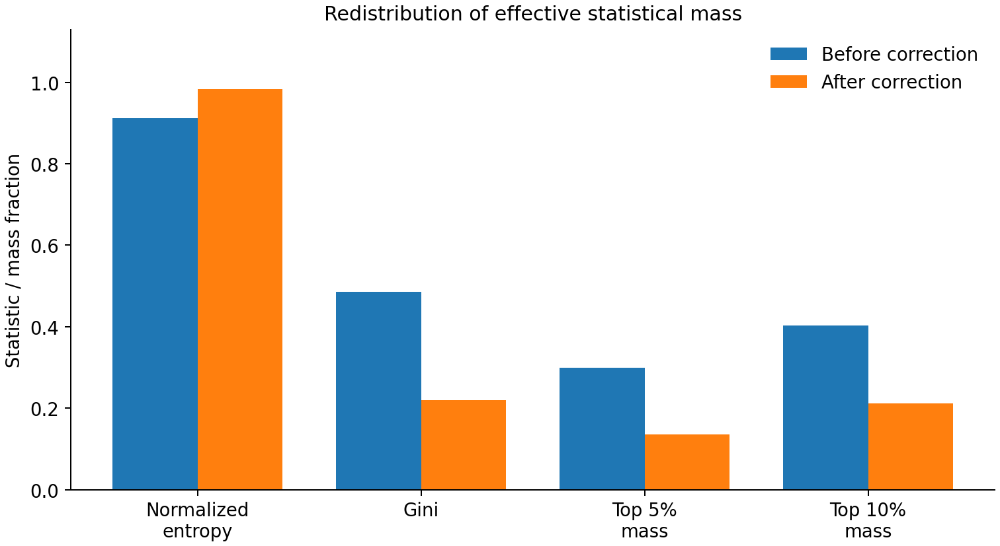

Figure 2. Surface-density equalization on the research-conversation code sample. Blue bars show the raw distribution and orange bars the corrected effective mass. Normalized entropy rises from 0.912 to 0.983; Gini falls from 0.485 to 0.220. The last two pairs show the mass held by the highest-frequency 5% and 10% of codes. Values are descriptive statistics without error bars.

### 3 3 Interference from repeated historical content

In a retrieval proxy over real history, a weakly related or irrelevant concept was repeated 1, 2, 4, 8 or 16 times. At 16 repetitions, the raw attention proxy retained 87.6% of the mass assigned to the genuinely relevant history fragment, versus 96.8% with density correction. The repeated distractor’s own mass grew 1.516-fold under the raw calculation and 1.123-fold after correction.

Table 5. Interference from repeated historical content.

| Stress-test measure | Raw | Corrected |
| --- | --- | --- |
| Relevant-history mass retained at 16× interference | 87.6% | 96.8% |
| Distractor mass growth | 1.516× | 1.123× |

*Source: the sample and protocol in this section. Percentages retain their stated denominators; NLL is unitless and lower is better. Values are the reported descriptive aggregates.*

## 4 ASTIG 003 Protecting functional roles

The first implementation exposed a Chinese parsing error. Protecting every occurrence of the character 不 as a control token conflated its use in 不要做 A (“do not do A”) with its lexical use in 不均匀 (“uneven”). Literal-token protection incorrectly promoted ordinary content into control information.

Protection therefore needs a role or span parser. The studied rule set protects spans functioning as prohibitions or requirements, including “do not,” “must not,” “is prohibited,” “must,” “make sure,” and their Chinese forms. Ordinary content remains subject to density correction.

CONTENT(A) × sublinear exposure  +  CONTROL(FORBID, A) × protected gain

In a proxy using an actual “do not do A” input, the FORBID operator gained mass, repeated exposure of the target A decreased, and the purely expressive laughter burst was strongly compressed.

Table 6. ASTIG 003 Protecting functional roles.

| Object | Raw attention mass | After role-aware correction |
| --- | --- | --- |
| The “do not” control operator | 7.24% | 9.49% |
| Target A | 9.14% | 8.47% |
| The repeated laughter expression | 4.23% | 1.53% |

*Source: the sample and protocol in this section. Percentages retain their stated denominators; NLL is unitless and lower is better. Values are the reported descriptive aggregates.*

This reformulates a negation failure as a coupling between exposure and role: mentions of the prohibited target compete in the same statistical channel as the prohibition. Separating those contributions supplies a specific engineering intervention.

## 5 ASTIG 004 Statistics of sustained agent work

### 5 1 The 479 trajectory cohort

We analysed 479 public SWE-bench trajectories from SWE-agent with Claude 4 Sonnet: 324 resolved and 155 unresolved. Their actual action sequences include edit/view, python, grep, git and submit. The analysis tests the statistical structure associated with sustained work.

Table 7. The 479 trajectory cohort.

| Measure | Resolved trajectories | Unresolved trajectories |
| --- | --- | --- |
| Mean steps | 58.27 | 68.54 |
| normalized action entropy | 0.8057 | 0.8039 |
| transition entropy | 1.434 | 1.475 |
| Repeated bigram fraction | 0.785 | 0.832 |
| Repeated trigram fraction | 0.555 | 0.617 |

*Source: the sample and protocol in this section. Percentages retain their stated denominators; NLL is unitless and lower is better. Values are the reported descriptive aggregates.*

The unadjusted means are confounded by length. Unresolved tasks tend to continue longer, providing more opportunities for repetition. Each unresolved trajectory was therefore matched to a resolved trajectory of almost identical length.

### 5 2 Results after length matching

Table 8. Results after length matching.

| Length-matched measure | Resolved minus unresolved |
| --- | --- |
| Mean length difference | −0.026 steps |
| Action entropy | +0.095 |
| Transition entropy | +0.019 |
| Repeated bigrams | -0.031 |
| Repeated trigrams | -0.051 |

*Source: length-matched public trajectories. Differences are resolved minus unresolved; the remaining length difference is measured in steps.*

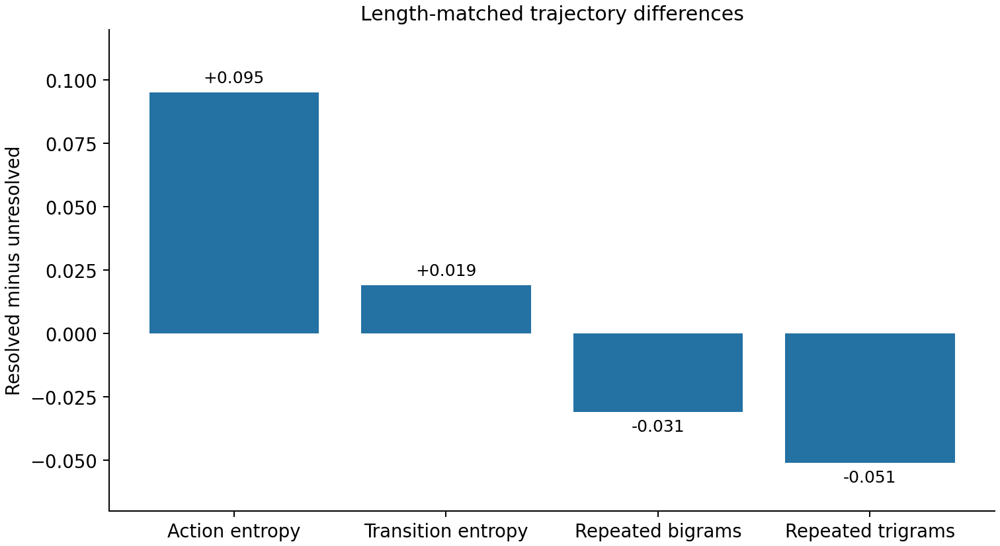

Figure 3. Differences between resolved and unresolved Claude 4 Sonnet trajectories after length matching. Action and transition entropy differences are +0.095 and +0.019, while repeated bigram and trigram fractions differ by approximately −0.031 and −0.051. The mean residual length difference is −0.026 steps. Bars are descriptive matched differences; no inferential interval is shown.

### 5 3 Diversity with reduced self reinforcing loops

Stable long work retains a varied action space and flexible transitions while limiting local self-reinforcement. The matched comparison supports a finite working grammar with fewer repeated local patterns, rather than low entropy as a general objective.

Legitimate work includes repetitions such as test→edit→test and python→python. This helps explain why later repetition penalties failed. The relevant question is how repeated observations gain evidential weight during continued work.

## 6 ASTIG 005 Working language and external messages

### 6 1 Changes across a long task

Public GPT-5-mini OpenCode/SWE-bench trajectories record both reasoning_content and external messages. We analysed 20 trajectories containing 135 reasoning chunks, normalizing each trajectory into early, middle and late phases.

Table 9. Changes across a long task.

| Measure | Early | Mid | Late |
| --- | --- | --- | --- |
| Mean reasoning-chunk length in words | 77 | 102 | 129 |
| First-person density | 6.00% | 5.38% | 5.20% |
| Social or conversational filler density | 0.337% | 0.320% | 0.222% |
| Repeated bigrams | 5.19% | 8.00% | 7.81% |
| Repeated trigrams | 0.81% | 1.41% | 1.69% |

*Source: the sample and protocol in this section. Percentages retain their stated denominators; NLL is unitless and lower is better. Values are the reported descriptive aggregates.*

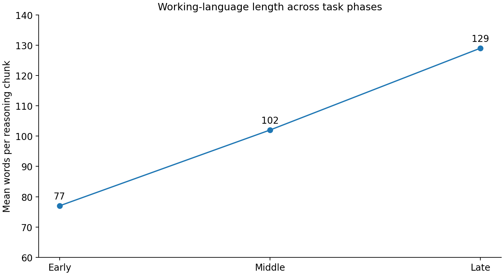

Figure 4. Mean length of recorded reasoning chunks in early, middle and late trajectory phases: 77, 102 and 129 words. The sample comprises 135 chunks from 20 GPT-5-mini trajectories. Points are phase means without uncertainty bars.

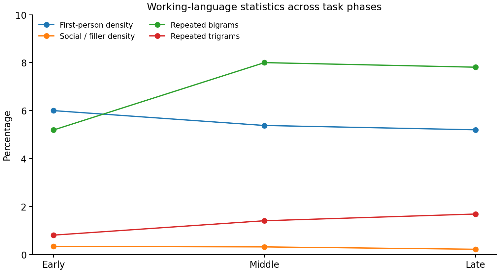

Figure 5. Language statistics across the same trajectory phases. First-person density decreases from 6.00% to 5.20% and social/filler density from 0.337% to 0.222%; repeated bigram and trigram fractions increase overall. Each line is the corresponding descriptive phase statistic; no uncertainty band is shown.

### 6 2 Two recorded channels in the same model

Across the same 20 trajectories, reasoning_content contains 135 chunks and 13,846 words; external messages contain 52 chunks and 7,172 words. Their descriptive statistics differ.

Table 10. Two recorded channels in the same model.

| Statistic | Recorded reasoning | External message |
| --- | --- | --- |
| Mean chunk length | About 102.6 words | About 137.9 words |
| First-person density | About 5.08% | About 2.02% |
| Operational or task-word density | About 11.8% | About 10.3% |
| Repeated bigrams | About 7.03% | About 9.39% |
| Repeated trigrams | About 1.31% | About 3.49% |

*Source: the sample and protocol in this section. Percentages retain their stated denominators; NLL is unitless and lower is better. Values are the reported descriptive aggregates.*

These measurements establish distinct distributions for the two recorded channels. They describe how the model’s task-maintenance and outward communication streams differ; an evaluation of readability or superiority would require its own outcome measure.

## 7 ASTIG 006 Sublinear evidence in next action prediction

### 7 1 Prediction task

From 20 GPT-5-mini trajectories, we extracted 117 pairs of current reasoning text and the next actual tool action. Leave-one-trajectory-out evaluation keeps a trajectory’s templates out of its own training set. The experiment asks how the count c of a word should contribute evidence for the next action.

Raw exposure: w(c)=c

Sublinear exposure: w(c)=c^γ,  0<γ<1

Table 11. Prediction task.

| Evidence function | Accuracy | NLL |
| --- | --- | --- |
| Raw: c | 46.15% | 7.449 |
| sqrt: c^0.5 | 46.15% | 5.963 |
| quarter: c^0.25 | 47.01% | 5.555 |
| Role-aware: ordinary c^0.25 / control c^0.5 | 47.86% | 5.512 |
| Presence-only: 1(c>0) | 42.74% | 5.326 |

*Source: the sample and protocol in this section. Percentages retain their stated denominators; NLL is unitless and lower is better. Values are the reported descriptive aggregates.*

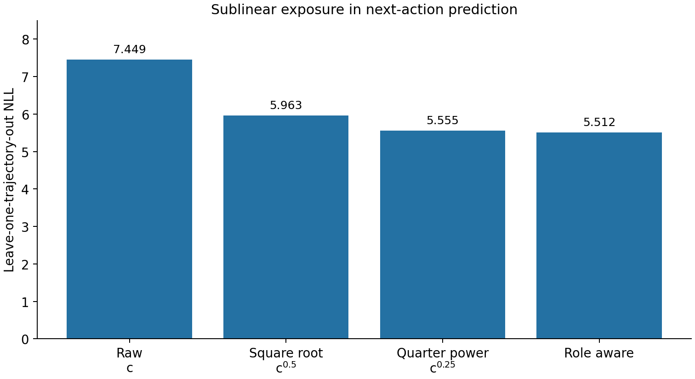

Figure 6. Leave-one-trajectory-out NLL for the 117 reasoning-to-tool pairs. Sublinear count weighting reduces NLL relative to linear exposure; the table also reports presence-only weighting. Lower NLL is better. Bars show aggregate evaluation values without uncertainty intervals.

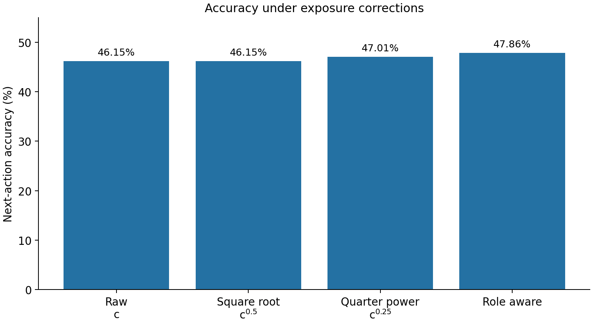

Figure 7. Next-action accuracy for the same 117 pairs. Role-aware weighting reaches 47.86%, compared with 46.15% for raw or square-root weighting and 47.01% for quarter-power weighting. The unchanged folds support a within-experiment comparison.

### 7 2 Results from direct repetition penalties

We tested penalties for recent repetition and for residual repetition exceeding the expectation of the global transition grammar. Both increased next-action NLL. Repetition itself carries information about working grammar.

The supported prescription retains repetitions while compressing their evidential gain. Counts of 1, 2, 4 and 8 need not contribute a mechanically proportional 1-, 2-, 4- and 8-fold internal weight.

## 8 ASTIG 007 Geometry and topology correction

### 8 1 Similarity and permitted connections

On Iris, Wine, Breast Cancer and Digits, we examined whether global dot-product attention allocates mass beyond the data’s local structure. The original 15-nearest-neighbour graph supplies the reference neighbourhood. The outcome is the fraction of attention mass outside that neighbourhood.

Table 12. Similarity and permitted connections.

| Dataset | Raw global Attention | Geometry Lens | Topology Lens |
| --- | --- | --- | --- |
| Iris | 80.3% | 18.5% | 0% |
| Wine | 84.2% | 52.2% | 0% |
| Breast Cancer | 94.9% | 71.0% | 0% |
| Digits | 98.1% | 66.6% | 0% |

*Source: the numerical-data or recorded-trajectory experiment specified in this section. Accuracy is a percentage unless marked otherwise; pp means percentage points. Results retain the stated folds and correction settings.*

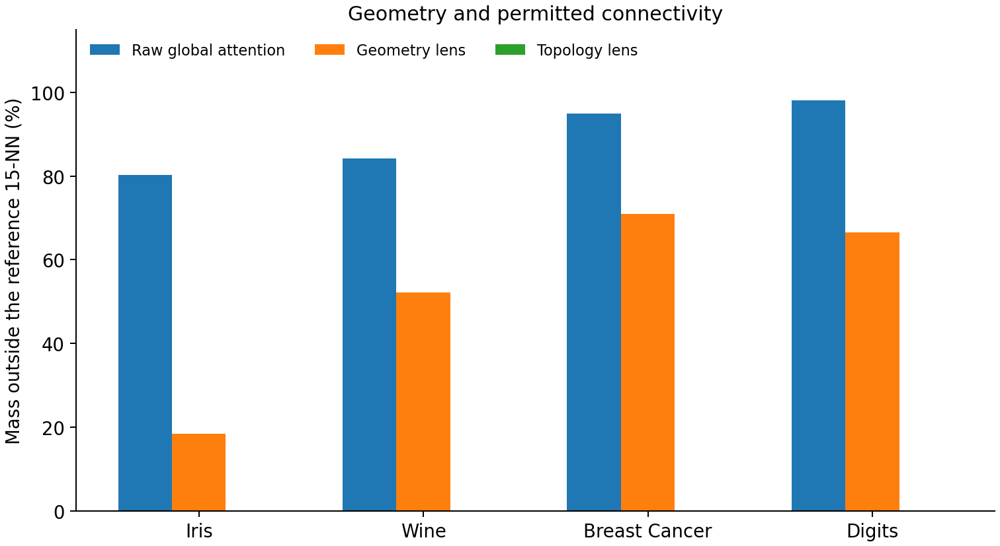

Figure 8. Attention mass outside the original 15-nearest-neighbour reference on four numerical datasets. Geometry correction reduces the measured nonlocal mass; a Topology lens masks all edges outside the candidate graph and therefore gives zero by construction. Bars are measured fractions under the specified relation operators, without error bars.

### 8 2 Definitions of the two lenses

The Geometry lens retains Q, K and V while adding a local-scale bias before softmax. Let r_i denote the natural local scale at point i:

τ_ij = d_ij / sqrt(r_i r_j)

B_geometry(i,j) = -λ τ_ij^2

The Topology lens first constructs a permitted local candidate graph M from the original data. It assigns a negative-infinity mask outside that graph. Topology specifies which connections are available; Geometry measures the distance of available connections relative to local scale.

L_corr(i,j) = Q_i K_j^T / sqrt(d)  +  B_topology(i,j)  +  B_geometry(i,j)

### 8 3 Label propagation with the same attention kernel

Table 13. Label propagation with the same attention kernel.

| Relation operator | Mean accuracy with 10% labels across four datasets |
| --- | --- |
| Raw global Attention | 65.80% |
| + Geometry Lens | 92.20% |
| + Topology Lens | 93.65% |
| + Geometry + Topology | 93.92% |

*Source: the numerical-data or recorded-trajectory experiment specified in this section. Accuracy is a percentage unless marked otherwise; pp means percentage points. Results retain the stated folds and correction settings.*

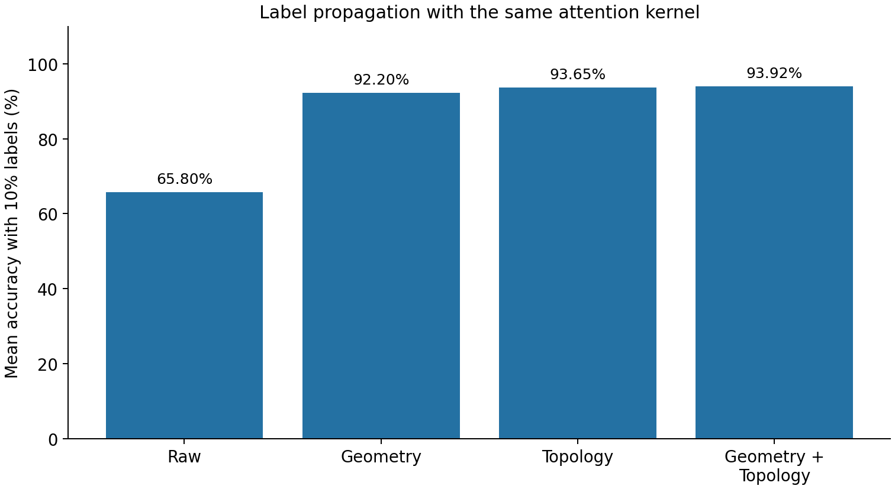

Figure 9. Mean accuracy of a label-propagation proxy using 10% labelled data on the four numerical datasets. Raw global attention reaches 65.80%; Geometry, Topology and their combination reach 92.20%, 93.65% and 93.92%. These are within-protocol comparisons with the same attention kernel. No uncertainty interval is shown.

A parameter scan over k = 8–25 and λ = 0.25–2 places most combinations near 94% mean accuracy. The studied ordering first restricts available connections and then calibrates their local distance.

## 9 The first corrective optics stack

Raw logits reflect content, exposure, sampling density, local geometry, role and position. Treating these as distinct measurement components makes it possible to test a correction for each distortion and understand how they interact.

L_raw = QK^T / sqrt(d)

L_corr = L_raw + B_topology + B_geometry + B_exposure + B_role

Table 14. The first corrective optics stack.

| Lens | Distortion addressed | Evidence |
| --- | --- | --- |
| Exposure Lens | Repetition or emphasis accumulates linearly as importance | Code statistics and reasoning-to-tool prediction |
| Role Lens | Control operators and ordinary content share an exposure channel | The Chinese prohibition example and tool-role proxies |
| Topology Lens | Similarity determines permitted connectivity | Relation propagation on four numerical datasets |
| Geometry Lens | Absolute distance ignores natural local scale | Four numerical datasets |

*Source: the numerical-data or recorded-trajectory experiment specified in this section. Accuracy is a percentage unless marked otherwise; pp means percentage points. Results retain the stated folds and correction settings.*

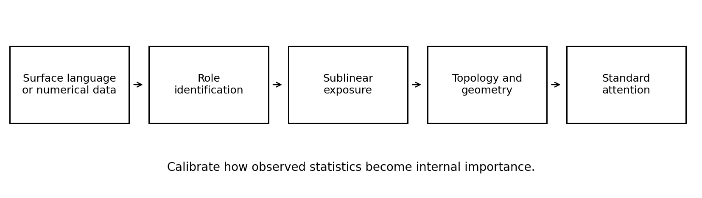

Figure 10. The initial corrective-optics design. Surface language or numerical inputs pass through role identification, sublinear exposure weighting and topology/geometry correction before the standard attention calculation. The conceptual diagram separates corrections to measurement from the core attention operation; it contains no quantitative estimates.

## 10 Interpreting the distorting mirror analogy

The experiments turn broad impressions of model ability into particular measurement questions. Repeated mentions of a prohibited object may give it extra statistical mass. Length-matched successful trajectories retain diversity while reducing local repetition. Global attention assigns considerable mass outside a chosen local reference. Each observation identifies a mechanism to measure rather than a general judgement of intelligence.

A modelling pipeline contains several measurement operators. Human expression converts a world state into an uneven surface sequence; tokenization partitions it; attention mixes it according to a relation rule; later layers model the result. A powerful model can fit the output of this measurement process closely, including its systematic distortions. Distinguishing the latent task from its successive representations matters for interpreting what the model learns.

Corrective lenses calibrate an identified distortion. Repetition remains available with sublinear gain; control roles receive a separate treatment; local distances use natural scales. The candidate geometry is anchored to the specified reference data rather than being silently redefined by the attention transformation being evaluated.

This also suggests that human-facing communication and sustained machine work may favour different statistics. Human expression makes useful use of emphasis, redundancy, rhetoric and bursts. Task maintenance benefits from accessible state variables, stable control signals and bounded amplification of repeated evidence. Separate working and communication streams offer a testable way to accommodate both objectives.

## 11 Evidence represented by the initial studies

The initial studies use the following distinct evidence types and units of analysis.

- Code distributions, positional permutations and surface-density equalization are direct calculations on actual inputs from the research conversation.

- The Claude 4 Sonnet analysis is an observational study of public SWE-bench action trajectories.

- The GPT-5-mini channel and next-action analyses use public SWE-Xplorer/SWE-bench trajectories: 20 trajectories, 135 reasoning chunks and 117 pairable next-action observations in the initial studies.

- Geometry and Topology lenses are tested through relation-propagation proxies on four scikit-learn numerical datasets. ASTIG-008 adds sequential ablation and cumulative-context prediction. ASTIG-009 tests prescription heterogeneity and an evidence gate; its pooled gain is one additional correct prediction among 128 states, or 0.78 percentage points. That experiment primarily validates the selection logic.

- A trade-off between human readability and long-task stability remains a hypothesis motivated by channel differences. A direct test would hold model and task fixed while manipulating the expression statistics of the working and outward streams.

## 12 ASTIG 008 Sequential correction and long task state

This study applies the lenses in sequence while holding task, data and scorer fixed. It measures where each correction contributes and whether their order changes the result.

### 12 1 Sequential correction on numerical data

On Iris, Wine, Breast Cancer and Digits, the attention kernel remains fixed while Exposure, Topology and Geometry are added successively. Mean accuracy with 10% labelled data increases from 83.45% to 94.15%. The initial 77.99% mean far-field attention mass becomes zero when the Topology mask is applied. These values belong to this sequential protocol; the earlier ASTIG-007 experiment has its own baseline.

Table 15. Sequential correction on numerical data.

| Stage | Mean task accuracy | Far-field Attention mass | Incoming-mass Gini |
| --- | --- | --- | --- |
| Raw | 83.45% | 77.99% | 0.329 |
| + Exposure | 88.61% | 76.68% | 0.147 |
| + Topology | 93.90% | 0% | 0.245 |
| + Geometry | 94.15% | 0% | 0.202 |

*Source: the numerical-data or recorded-trajectory experiment specified in this section. Accuracy is a percentage unless marked otherwise; pp means percentage points. Results retain the stated folds and correction settings.*

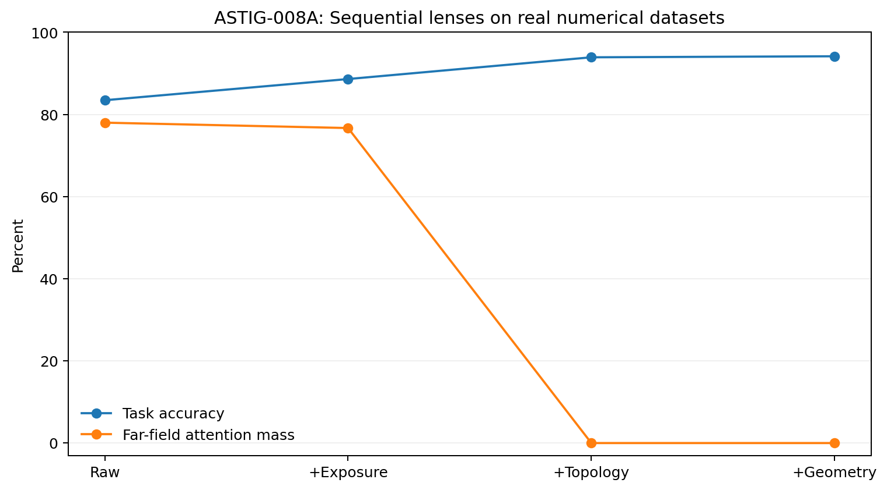

Figure 11. Sequential lens ablation on four numerical datasets with 10% labels. The blue line shows mean task accuracy and the orange line far-field attention mass. Exposure reduces concentration, Topology masks disallowed far-field edges, and Geometry calibrates the permitted local edges. Points show protocol means without uncertainty bands.

The components act on different quantities: Exposure regulates disproportionate incoming mass, Topology defines the candidate graph, and Geometry calibrates distance within it. Their separate measurements make the relation calculation interpretable.

### 12 2 Cumulative reasoning context in long tasks

The long-task probe contains 135 steps from 20 public GPT-5-mini trajectories. Each step predicts the next tool action from all reasoning recorded up to that point. Leave-one-trajectory-out evaluation separates each test trajectory from the training pool.

Raw cumulative-context accuracy is 36.30%, rising to 45.93% with sublinear exposure. Directly protecting operational/control words across the entire history reduces it to 42.96%. Old run, test, edit and read intentions receive protection alongside current ones, amplifying historical interference.

Table 16. Cumulative reasoning context in long tasks.

| Long-task correction stage | Accuracy across 135 steps | Difference from raw |
| --- | --- | --- |
| Raw cumulative context | 36.30% | — |
| + Exposure | 45.93% | +9.63 pp |
| + Role/Intent on the full history | 42.96% | +6.66 pp |
| + Topology without Role | 47.41% | +11.11 pp |
| + Topology + Role/Intent | 48.15% | +11.85 pp |
| + Geometry completing the stack | 50.37% | +14.07 pp |

*Source: the numerical-data or recorded-trajectory experiment specified in this section. Accuracy is a percentage unless marked otherwise; pp means percentage points. Results retain the stated folds and correction settings.*

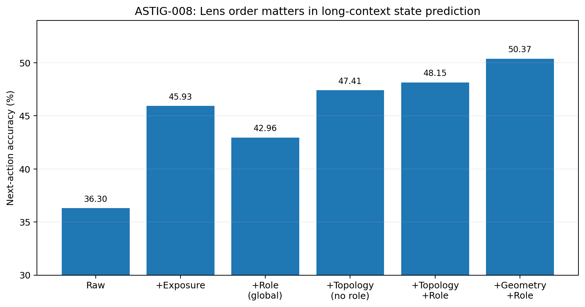

Figure 12. Accuracy in the cumulative-context probe over 135 steps. Global role protection reduces the gain from exposure correction. Restricting the working neighbourhood before adding Role and Geometry gives 50.37%, compared with 36.30% raw. Bars are aggregate held-out accuracies.

### 12 3 Gains in the later task phases

Trajectory-relative quartiles reveal a change in which correction helps. With little accumulated history in Q1, Exposure alone is effective. In Q3 and Q4, Topology and Geometry contribute more as old states accumulate.

Table 17. Gains in the later task phases.

| Trajectory quartile | Raw | + Exposure | Final stack |
| --- | --- | --- | --- |
| Q1 early | 51.85% | 66.67% | 59.26% |
| Q2 | 30.56% | 41.67% | 38.89% |
| Q3 | 22.58% | 32.26% | 51.61% |
| Q4 late | 41.46% | 46.34% | 53.66% |

*Source: the numerical-data or recorded-trajectory experiment specified in this section. Accuracy is a percentage unless marked otherwise; pp means percentage points. Results retain the stated folds and correction settings.*

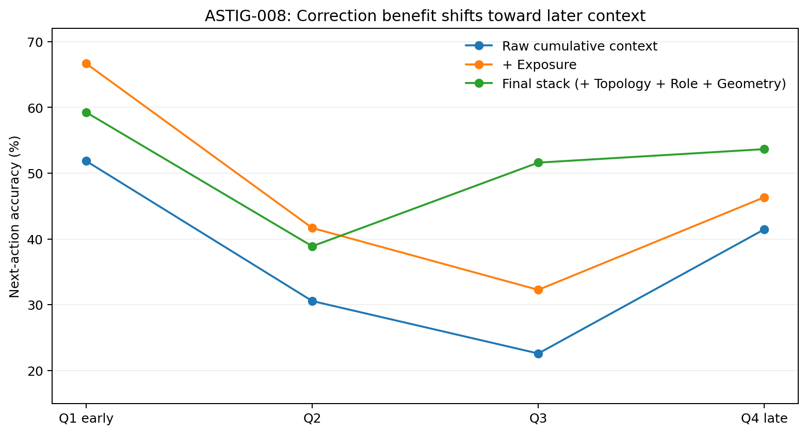

Figure 13. Held-out next-action accuracy by trajectory quartile. Raw, Exposure-only and the final stack are compared on the same states within each quartile. The final stack’s largest gain over raw occurs in Q3. Lines join descriptive accuracies; no uncertainty intervals are shown.

This provides a concrete account of long-context interference. Numerous retained states may remain broadly relevant while lying outside the current working neighbourhood. A Topology lens controls which historical representations participate in the current state calculation, while keeping those memories available elsewhere.

### 12 4 Role protection depends on the working state

Three separate batches show different interactions. In Batch A, Exposure and Topology alone both give 43.48%; local Role protection raises accuracy to 52.17% and Geometry to 54.35%. In Batch B, Topology alone is best at 60.42%, with a small reduction after Role protection. In Batch C, Geometry recovers the loss introduced by the intermediate stages.

Table 18. Role protection depends on the working state.

| Separate batch | Exposure | Topology without Role | Topology + Role | Geometry + Role |
| --- | --- | --- | --- | --- |
| Batch A · 46 steps | 43.48% | 43.48% | 52.17% | 54.35% |
| Batch B · 48 steps | 54.17% | 60.42% | 56.25% | 56.25% |
| Batch C · 41 steps | 39.02% | 36.59% | 34.15% | 39.02% |

*Source: the numerical-data or recorded-trajectory experiment specified in this section. Accuracy is a percentage unless marked otherwise; pp means percentage points. Results retain the stated folds and correction settings.*

These results motivate a conditional prescription. Exposure is a candidate default. Topology becomes valuable as history accumulates. Role amplification is tied to the current neighbourhood and recognized operational structure. Geometry calibrates the remaining local relations.

### 12 5 The error in protecting every operational word

Protecting run, test, edit and read had helped the short reasoning-to-tool probe, but cumulative context also preserves obsolete intentions. Role protection then introduces its own exposure bias. Narrowing the protected vocabulary to must, should, need, ensure, avoid, never, not and cannot still fails to outperform Exposure consistently. Functional role therefore needs to be inferred from structure and current state rather than from a static word list.

The object of protection shifts from a literal token to its function in the current task graph.

### 12 6 A state dependent prescription

ASTIG-008 motivates the following order.

1. Exposure converts linear repetition counts into sublinear evidence.

2. Topology defines the current working neighbourhood as historical states accumulate.

3. Role/Intent is enabled conditionally after the local neighbourhood and functional structure are identified.

4. Geometry calibrates permitted local connections using natural scale.

Each step follows a measured distortion: exposure, candidate connectivity, role mixing or scale mismatch. The choice of correction is part of the measurement procedure.

## 13 ASTIG 009 Evidence for adaptive prescriptions

Batch variation in ASTIG-008 motivates two separate decisions: whether meaningful prescription heterogeneity exists, and which prescription to use in a particular state. Statewise routing is activated only when its expected gain exceeds an estimate of sampling uncertainty.

### 13 1 Observable inputs to the prescription rule

The rule uses ten pre-outcome statistics: cumulative context steps, relative task position, current reasoning length, highest word-frequency share, repetition mass, lexical novelty, maximum similarity to history, the gap between the two highest similarities, normalized age of the most relevant historical state, and operational/intent-word density. It does not receive the true next action. Candidate prescriptions are Raw, Exposure, Topology+Exposure, Topology+Role, Geometry+Exposure and Geometry+Role.

Learning uses nested leave-one-trajectory-out evaluation. The outer trajectory is held out completely. Inner trajectory splits generate examples of which lens gives a larger correct-action margin for a particular observable state, keeping future states from the held-out task out of the prescription training data.

### 13 2 The initial case based router

The router finds ten neighbouring training states in the standardized ten-dimensional feature space. It compares their distance-weighted historical margins for the six prescriptions. In Batch A, statewise routing reduces accuracy from the best fixed 51.16% to 46.51%. It equals the best fixed 55.81% in Batch B and increases Batch C from 38.10% to 40.48%.

Table 19. The initial case based router.

| Batch | Best fixed prescription | Ungated adaptive | State oracle | Interpretation |
| --- | --- | --- | --- | --- |
| Batch A · 43 states | 51.16% | 46.51% | 53.49% | Little switching opportunity; routing introduces error |
| Batch B · 43 states | 55.81% | 55.81% | 58.14% | Routing preserves performance with limited available gain |
| Batch C · 42 states | 38.10% | 40.48% | 47.62% | More prescription heterogeneity |
| Pooled · 128 states | 47.66% | 47.66% | 53.12% | Ungated adaptation matches the pooled fixed comparison |

*Source: the numerical-data or recorded-trajectory experiment specified in this section. Accuracy is a percentage unless marked otherwise; pp means percentage points. Results retain the stated folds and correction settings.*

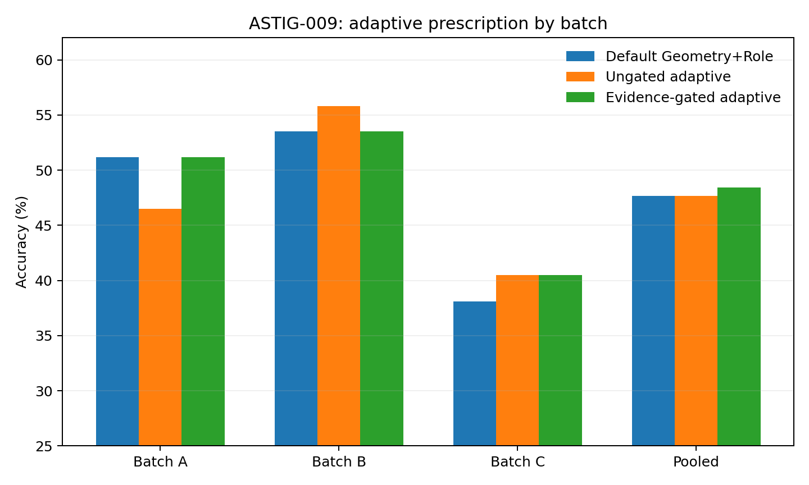

Figure 14. Adaptive prescription results in three trajectory batches. Bars compare the fixed default Geometry+Role prescription, ungated adaptation and evidence-gated adaptation. The adjacent tables distinguish the fixed default from the best fixed prescription, particularly in Batch B. All values are held-out accuracies under the stated protocol.

Adaptation is useful only when the task offers enough prescription heterogeneity to justify it. In a homogeneous setting, retaining a fixed prescription is a substantive decision supported by the data.

### 13 3 The switchability gate

Within each outer training set, the expected switching gain is the state oracle’s advantage over the best fixed prescription. This is compared with one standard error of the best fixed accuracy at the available training sample size. Statewise routing is permitted when the estimated gain exceeds that threshold. The one-SE rule is an engineering decision criterion.

Table 20. The switchability gate.

| Batch | Mean estimated switching gain | Mean one-SE threshold | States permitted to route |
| --- | --- | --- | --- |
| Batch A | 5.59 pp | 8.29 pp | 0% states |
| Batch B | 3.22 pp | 8.22 pp | 0% states |
| Batch C | 9.43 pp | 8.22 pp | 73.81% of states in 5/6 outer folds |

*Source: the numerical-data or recorded-trajectory experiment specified in this section. Accuracy is a percentage unless marked otherwise; pp means percentage points. Results retain the stated folds and correction settings.*

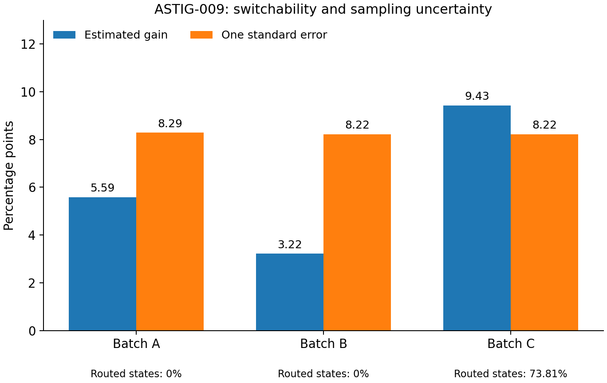

Figure 15. Estimated switching gain and the one-SE threshold within outer training folds. Batches A and B remain below the threshold and retain the default. Batch C permits routing in five of six folds, covering 73.81% of its states. Bars summarize the gate’s inputs, rather than confidence intervals on the final performance difference.

The router acts as an evidence-triggered secondary correction. The system first measures whether distinct prescriptions are warranted and then selects among them at the state level.

### 13 4 Retaining the established default

Allowing a small inner sample to re-elect the fixed prescription whenever routing is unsupported reintroduces sampling noise. The preceding study had established Geometry+Role as the working default. The adaptive procedure therefore overrides that default only when its gate is satisfied.

Table 21. Retaining the established default.

| Measure | Fixed default Geometry+Role | Evidence-gated adaptation |
| --- | --- | --- |
| Batch A | 51.16% | 51.16% with the default retained |
| Batch B | 53.49% | 53.49% with the default retained |
| Batch C | 38.10% | 40.48% with 73.81% of states routed |
| Pooled · 128 states | 47.66% | 48.44% |

*Source: the numerical-data or recorded-trajectory experiment specified in this section. Accuracy is a percentage unless marked otherwise; pp means percentage points. Results retain the stated folds and correction settings.*

The pooled increase is one correct prediction among 128 states, or 0.78 percentage points. Its primary contribution is a coherent prescription rule: adaptation is activated in the heterogeneous third batch while the first two keep their default.

### 13 5 The optometry analogy for adaptation

An automatic lens carousel can make vision worse by rotating a clear prescription unnecessarily. Batch A illustrates this problem. Batch C provides the contrasting case in which different states benefit from different prescriptions. The measurements determine whether changing lenses is worthwhile.

Dynamic routing itself requires evidence. A mechanism becomes useful when the data show the distortion or heterogeneity that it is designed to address.

### 13 6 Default prescription with a gated override

1. Retain the ASTIG-008 Geometry+Role baseline when new evidence is sparse.

2. Measure exposure concentration, history-similarity gaps, context-age dispersion, role density and related distortions.

3. Estimate the potential gain from statewise prescription changes.

4. Activate routing when that gain exceeds the current sampling-uncertainty threshold.

5. Select the Exposure, Topology, Role and Geometry combination within eligible tasks or phases.

This procedure implements a fixed default with an evidence-gated override. Each adaptive decision has an observable justification.

## 14 ASTIG 010 Continuous calibration of lens strength

The previous experiment treated the lenses mainly as discrete alternatives. ASTIG-010 calibrates their strengths: compression of ordinary content, retention of functional roles, the breadth of local history and geometric weighting. It pools 18 public GPT-5-mini OpenCode trajectories from three batches, giving 128 reasoning-to-next-action states. Outer folds hold out entire trajectories; parameter choice uses training trajectories only.

### 14 1 Calibration design

Four parameters define the prescription: content exponent γ_content, role exponent γ_role, neighbourhood size k and geometry strength λ. Content and role counts contribute c^γ evidence separately. The working neighbourhood contains the current state, the k most relevant historical states and the immediately previous state. Geometry weights the permitted edges by local natural scale.

Table 22. Calibration design.

| Parameter | Coarse grid | Meaning |
| --- | --- | --- |
| γ_content | 0.25 / 0.50 | Evidential growth from repeated ordinary content |
| γ_role | γ_content or γ_content + 0.25 | Additional gain for functional or operational roles |
| k_topology | 0 / 2 / 3 | Number of relevant historical states in the working neighbourhood |
| λ_geometry | 0 / 1 | Local-scale correction strength |

*Source: the numerical-data or recorded-trajectory experiment specified in this section. Accuracy is a percentage unless marked otherwise; pp means percentage points. Results retain the stated folds and correction settings.*

The coarse grid has 20 feasible combinations. Each of 18 outer leave-one-trajectory-out folds uses three-fold trajectory-grouped cross-validation internally. The strongest region concentrates near k = 2 and λ = 1. A finer scan fixes those values and varies γ_content over {0.4, 0.5, 0.6} and γ_role − γ_content over {0.15, 0.25, 0.35}.

### 14 2 A broad calibration region

Table 23. A broad calibration region.

| Comparison | Outer-fold accuracy | Difference from previous default | Interpretation |
| --- | --- | --- | --- |
| Previous default γc = 0.25, γr = 0.50, k = 2, λ = 1 | 59.38% | — | Stronger exposure compression from the earlier small-sample setting |
| Nested coarse-grid selection | 61.72% | +2.34 pp | Three additional correct states out of 128 |
| Fine scan of the strongest region | 61.72% | +2.34 pp | The same accuracy across a finer parameter region |
| Fixed calibration γc = 0.50, γr = 0.70, k = 2, λ = 1 | 61.72% | +2.34 pp | A simple fixed prescription matches nested selection |

*Source: the numerical-data or recorded-trajectory experiment specified in this section. Accuracy is a percentage unless marked otherwise; pp means percentage points. Results retain the stated folds and correction settings.*

The most frequently selected coarse combination is γ_content = 0.50, γ_role = 0.75, k = 2 and λ = 1, selected in nine of the 18 outer folds. Fine-grid choices average about 0.51 and 0.71 for the content and role exponents. The larger pooled sample favours square-root-like content growth and an additional role exponent near 0.2, suggesting that the earlier 0.25/0.50 prescription compressed exposure too strongly for this setting.

### 14 3 Sequential installation at calibrated strengths

Table 24. Sequential installation at calibrated strengths.

| Stage | Fixed prescription | Pooled LOOCV accuracy |
| --- | --- | --- |
| Raw | γ = 1; all history; no Geometry | 50.00% |
| + Exposure | γ_content = γ_role = 0.50; all history | 52.34% |
| + Topology | γ = 0.50; k = 2 | 58.59% |
| + Geometry | γ = 0.50; k = 2; λ = 1 | 59.38% |
| + Role | γ_content = 0.50; γ_role = 0.70; k = 2; λ = 1 | 61.72% |

*Source: the numerical-data or recorded-trajectory experiment specified in this section. Accuracy is a percentage unless marked otherwise; pp means percentage points. Results retain the stated folds and correction settings.*

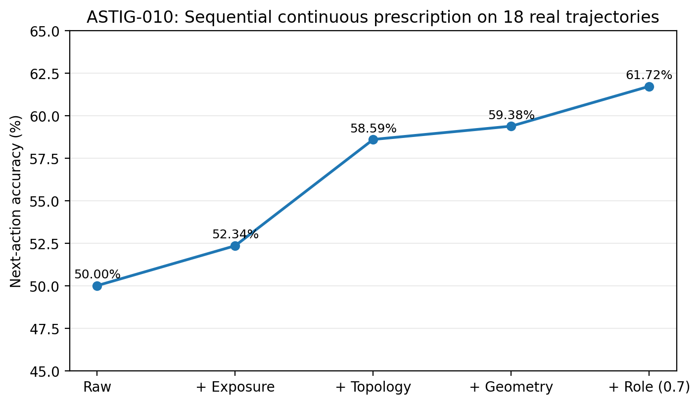

Figure 16. Sequential calibrated correction in 128 states from 18 trajectories. Accuracy rises from 50.00% raw to 52.34% with Exposure, 58.59% with Topology, 59.38% with Geometry and 61.72% with Role. Evaluation holds out complete trajectories. Points are aggregate accuracies without uncertainty intervals.

Exposure changes linear accumulation to sublinear evidence. Topology supplies the largest incremental gain by defining the working neighbourhood. Geometry refines its permitted relations, and Role increases functional evidence growth from 0.5 to about 0.7.

### 14 4 Repeating irrelevant old history

For each of 92 states with sufficient history, we selected the old fragment least similar to the current reasoning, excluding the immediately preceding state. That fragment was repeated 2, 4, 8 or 16 times. The recorded next-action label stayed fixed. The manipulation changes historical exposure while preserving the task label.

Table 25. Repeating irrelevant old history.

| Old-history repetition multiplier | Raw accuracy | Corrected accuracy | Raw flip rate | Corrected flip rate |
| --- | --- | --- | --- | --- |
| 1× | 50.00% | 61.96% | 0% | 0% |
| 2× | 48.91% | 60.87% | 11.96% | 1.09% |
| 4× | 41.30% | 58.70% | 31.52% | 4.35% |
| 8× | 34.78% | 57.61% | 44.57% | 7.61% |
| 16× | 31.52% | 55.43% | 61.96% | 9.78% |

*Source: the numerical-data or recorded-trajectory experiment specified in this section. Accuracy is a percentage unless marked otherwise; pp means percentage points. Results retain the stated folds and correction settings.*

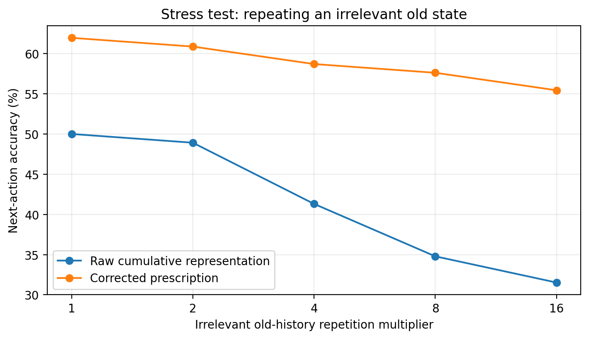

Figure 17. Accuracy under repeated irrelevant history in 92 eligible states. The raw cumulative representation falls from 50.00% to 31.52% at 16× repetition; the calibrated prescription falls from 61.96% to 55.43%. The x-axis gives the repetition multiplier. Lines join descriptive stress-test values.

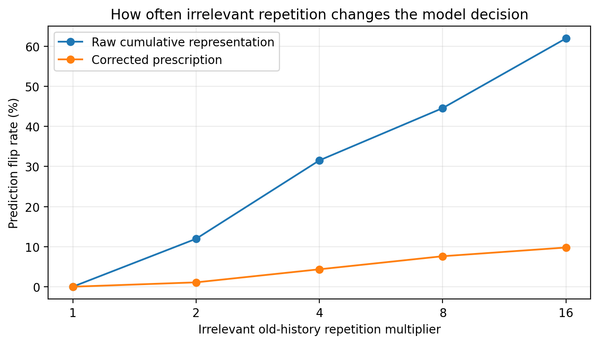

Figure 18. Decision changes relative to the unperturbed prediction in the same 92 states. At 16× irrelevant-history repetition, the raw flip rate is 61.96% and the corrected rate 9.78%. A flip records a changed prediction, irrespective of whether it becomes correct or incorrect.

Retained historical information can alter current decisions simply by gaining exposure mass. Topology and sublinear weighting separate preservation of an old state from its participation in the current working state.

### 14 5 Repeating current content and functional words

A second stress test repeats one ordinary, non-role content word in each of the 128 current reasoning states. At 16× repetition, 16.41% of raw decisions change. The calibrated prescription has no flips through 8× and 1.56% at 16×, while accuracy stays at 61.72% throughout.

Table 26. Repeating current content and functional words.

| Current ordinary-content repetition | Raw accuracy | Corrected accuracy | Raw flip | Corrected flip rate |
| --- | --- | --- | --- | --- |
| 1× | 50.00% | 61.72% | 0% | 0% |
| 2× | 50.00% | 61.72% | 0% | 0% |
| 4× | 48.44% | 61.72% | 3.13% | 0% |
| 8× | 45.31% | 61.72% | 9.38% | 0% |
| 16× | 46.09% | 61.72% | 16.41% | 1.56% |

*Source: the numerical-data or recorded-trajectory experiment specified in this section. Accuracy is a percentage unless marked otherwise; pp means percentage points. Results retain the stated folds and correction settings.*

Repeating functional words such as need, run, test, edit and read produces a different response. The corrected flip rate reaches 12.50% at 16×, compared with 1.56% for ordinary content. A role exponent near 0.7 retains differentiated sensitivity while bounding exposure growth.

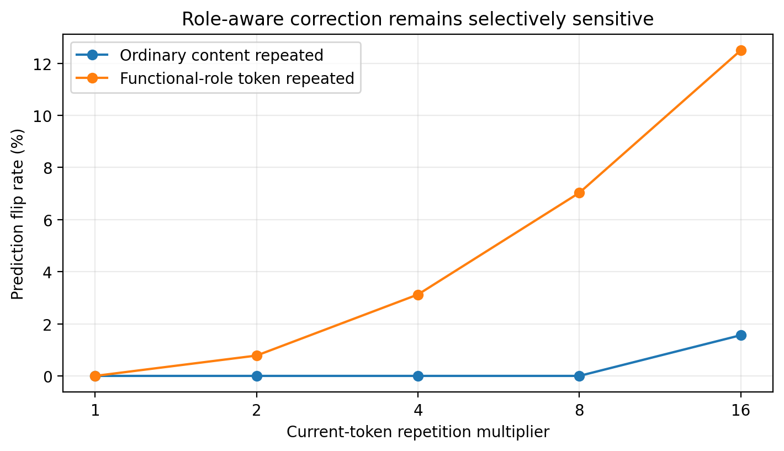

Figure 19. Corrected decision-flip rates when ordinary content or a functional-role token is repeated in the current reasoning state. At 16×, the rates are 1.56% and 12.50%. The next-action label is held fixed, so this is a sensitivity comparison; a flip is not automatically a semantically appropriate change.

Because the observed next action stays fixed, the role manipulation measures differential sensitivity. Evaluating whether each changed response is appropriate would require labels for the perturbed task meaning.

### 14 6 Magnification of irrelevant information

The raw long-context representation can retain too much information on the same competitive surface. A completed historical step can regain prominence when repeated, like a face enlarged in a distorting mirror. More visible content can then move the state away from the current task.

Calibration adjusts this magnification: ordinary count grows approximately as c^0.5, role count as c^0.7, Topology identifies the current working neighbourhood, and Geometry calibrates distances within it. Each parameter corresponds to a measured component of the observation process.

A fixed prescription matches the nested selector at 61.72% on the pooled 18 trajectories. At this sample size, calibrating the default supplies the main gain. The adaptive router remains available for tasks with measured prescription heterogeneity.

### 14 7 The calibrated prescription

The calibrated setting for this protocol is:

Ordinary-content exposure: w(c) = c^0.5.

Functional-role exposure: w(c) = c^0.7.

Topology: the current state, the two most relevant historical states and the immediately preceding state.

Geometry: local-scale distance τ = d / √(r_i r_j), with λ near 1.

Adaptive override: the ASTIG-009 switchability gate permits statewise changes when prescription heterogeneity exceeds the sampling-uncertainty threshold.

This prescription gives 61.72% pooled leave-one-trajectory-out accuracy across 128 states, versus 50.00% raw. At 16× irrelevant-history stress, corrected accuracy and flip rate are 55.43% and 9.78%, versus raw values of 31.52% and 61.96%.

## 15 ASTIG 011 Comparing models under a shared harness

The 0.50/0.70 calibration comes from GPT-5-mini OpenCode traces. To examine transfer, ASTIG-011 compares GPT-5-mini, DeepSeek-v4-flash and Qwen-2.5-7B under the same mini-SWE-agent harness, system template, work-prose-plus-single-bash-command protocol and matched SWE-bench tasks. All assistant prose before the bash block is treated as working language; a literal “THOUGHT:” marker is not required, avoiding a formatting-compliance confound.

### 15 1 Matched tasks and evaluation

The primary comparison fixes ten SWE-bench instances shared by the three model directories, using the mini-SWE-agent 1.17.3 protocol. Each turn contains working prose and one bash command followed by an environmental response. Commands map to inspect, edit, test, execute or vcs_submit. Action-state decoding holds out an entire task trajectory, so its later states remain outside its training set.

Table 27. Matched tasks and evaluation.

| Model | Tasks and states | Submission status | Raw | GPT calibration 0.5/0.7, k = 2, λ = 1 | Best tested prescription |
| --- | --- | --- | --- | --- | --- |
| GPT-5-mini | 10 / 76 | 10/10 Submitted | 64.47% | 69.74% | 72.37% |
| DeepSeek-v4-flash | 10 / 156 | 10/10 Submitted | 38.46% | 54.49% | 57.69% |
| Qwen-2.5-7B | 10 / 435 | 2/10 Submitted | 27.13% | 21.84% | 27.13% with Raw |

*Source: recorded coding-agent trajectories under the stated sampling and routing protocol. Counts and percentages use the displayed denominators. Submitted denotes exit status; the measured quantities are defined in the column headings.*

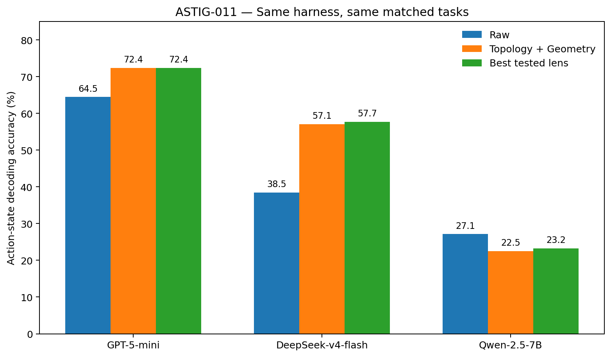

Figure 20. Action-state decoding for three models on ten matched tasks. The plotted structural correction is Topology+Geometry; the table separately reports the transferred GPT exposure/role calibration. Blue, orange and green show Raw, Topology+Geometry and the best corrected setting plotted in the source figure. For Qwen, Raw at 27.13% remains better than its best corrected bar at approximately 23.2%.

### 15 2 Transfer of topology and geometry

Without changing exposure exponents, adding k = 2 local history and λ = 1 geometry increases GPT-5-mini accuracy from 64.47% to 72.37% and DeepSeek-v4-flash from 38.46% to 57.05%. Each model improves in five tasks, ties in four and declines in one. Mean task-paired gains are +7.40 and +16.78 percentage points respectively. These results support transfer of the local candidate and scale corrections across the two studied models.

The exact exposure and role exponents transfer less consistently. GPT’s stronger region shifts from about 0.5/0.7 under OpenCode to about 0.75–1.0 under mini-SWE-agent. DeepSeek’s best setting is near 0.75/0.95. Calibration therefore depends jointly on model, harness and working grammar.

### 15 3 Qwen and the interaction with looping

Qwen reaches the 50-step limit in eight of ten tasks, averaging 43.5 parseable steps, compared with 7.6 for GPT and 15.6 for DeepSeek. Its repeated action-bigram and trigram mass is 88.85% and 83.54%; the corresponding values are 45.76%/27.38% for GPT and 60.11%/36.08% for DeepSeek. Mean within-trajectory action entropy is 0.734 for Qwen, 1.543 for GPT and 1.522 for DeepSeek.

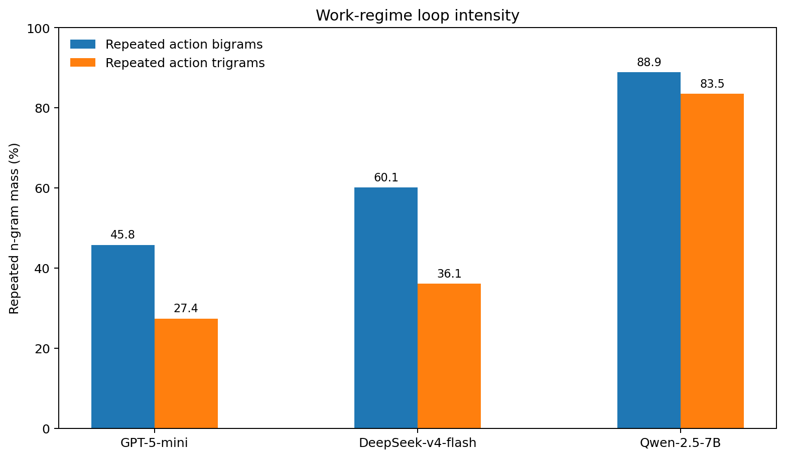

Figure 21. Repeated action-bigram and trigram mass in the matched ten-task comparison. The Qwen traces show greater local repetition than the other two model groups. These are descriptive action-sequence statistics; repeated action classes can also occur during legitimate work.

Qwen’s overall Raw accuracy is 27.13%, compared with 22.53% after Topology+Geometry. Stratification by trajectory status reverses that impression. Its two Submitted traces, comprising 35 states, improve from 42.86% to 65.71% (+22.86 percentage points). Its eight LimitsExceeded traces, comprising 400 states, decline from 25.75% to 18.75% (−7.00 points). Mean repeated bigram/trigram mass is 96.94%/94.01% in the latter group and 56.50%/41.67% in the Submitted group. Submitted denotes the recorded exit status.

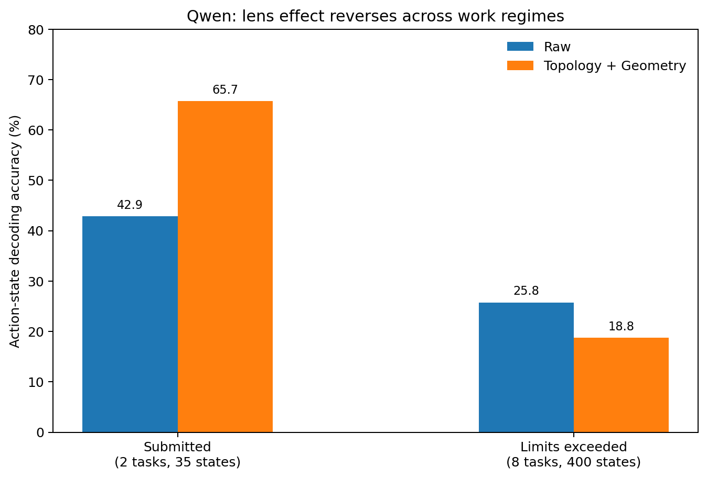

Figure 22. Qwen action-state accuracy stratified by Submitted and LimitsExceeded status. Structural correction improves the 35-state Submitted subset and reduces accuracy in the 400-state limit-exceeded subset under this decoder. The independent decoder in ASTIG-012B tests and revises the resulting treatment hypothesis.

### 15 4 Separating optical correction from loop diagnosis

ASTIG-011 raises a diagnostic question before prescription: is the current working neighbourhood progressing or recurrent? A local constraint can preserve the state of a loop as faithfully as that of productive work. This observation motivated testing a loop-regime gate. The subsequent independent decoder in ASTIG-012B establishes that useful local information can remain present inside the loop and should be retained during recovery.

The proposed diagnostic layer measures action repetition, transition entropy, budget use, state novelty and tool diversity. For strong loops, candidate interventions include a loop breaker, a wider search region and a change in state-update rules. These are treatment hypotheses to distinguish from the observed regime itself.

### 15 5 Three levels of calibration

The comparison separates structural corrections, continuous calibration and work regime. Topology and Geometry help GPT, DeepSeek and the Submitted Qwen subset in this protocol. Exposure/Role exponents move with model and harness. The sign of a correction’s observed effect can depend on regime and decoder, motivating the independent test that follows.

The prescription is therefore a function of several observable conditions:

Prescription = f(model, harness, data distribution, current work regime)

The modelling rule is to measure how data and work dynamics shape the available state, then choose which correction and strength to apply.

### 15 6 Unit of evidence

The primary comparison uses ten matched tasks and one harness. GPT and DeepSeek have ten Submitted traces each; Qwen has two. Qwen’s pooled result therefore combines regime composition with prescription fit. State counts also differ (76, 156 and 435), which is why task-paired directions accompany pooled accuracy. The command-derived action classes measure decoding of recorded action type; Submitted status and action-type accuracy are distinct from verified issue resolution.

## 16 ASTIG 012A Diagnosing the work regime

ASTIG-012A tests a diagnostic layer using an independent matched validation cohort. The harness remains mini-SWE-agent 1.17.3, and the same ten tasks are observed for GPT-5-mini, DeepSeek-v4-flash and Qwen-2.5-7B. The inputs are recorded work histories available at the decision time.

### 16 1 Independent validation cohort

The cohort contains two Qwen Submitted traces and eight 50-step LimitsExceeded traces; GPT and DeepSeek submit in all ten tasks. Submitted controls include traces of 42 steps for GPT and 44 for DeepSeek. The gate reads previously executed bash commands, without model identity, final exit status or future actions as inputs.

Coarse action n-grams still show stronger recurrence in loop traces, but legitimate work also repeats inspect or test. Mean repeated action-bigram mass is about 69.3% for GPT and 73.5% for DeepSeek in this cohort. The diagnostic therefore moves to recurrence of a particular normalized command, distinguishing repeated action types from repeated operational instances.

### 16 2 Rolling command recurrence

Commands are normalized for case and whitespace while retaining their arguments, paths and content. For the latest W = 8 commands, define repeated-command mass as follows.

R_cmd(t) is the fraction of positions in the latest eight-command window whose normalized command occurs at least twice within that window.

R_cmd below 0.25 indicates normal progression; at least 0.25 gives a stagnation warning. A strong loop requires at least 0.50 in two consecutive windows or at least 0.75 in one window. Assessment begins after six commands. This default diagnoses observed recurrence without using model identity or final step-limit saturation.

Table 28. Rolling command recurrence.

| Cohort | Tasks | Strong-loop alerts | Observed regime |
| --- | --- | --- | --- |
| Qwen-2.5-7B · LimitsExceeded | 8 | 8 / 8 | All alerted at steps 9–14 |
| Qwen-2.5-7B · Submitted | 2 | 0 / 2 | Remained normal |
| GPT-5-mini · Submitted | 10 | 0 / 10 | Includes a 42-step Submitted trace |
| DeepSeek-v4-flash · Submitted | 10 | 0 / 10 | Includes a 44-step Submitted trace |

*Source: recorded coding-agent trajectories under the stated sampling and routing protocol. Counts and percentages use the displayed denominators. Submitted denotes exit status; the measured quantities are defined in the column headings.*

### 16 3 Alert timing before the step limit

All eight Qwen LimitsExceeded traces trigger strong-loop alerts at steps 9–14, with a mean of 12.5. Alerts precede the 50-step limit by 36–41 steps, averaging 37.5. The mean first-warning step is 8.5. Neither Qwen Submitted trace triggers a warning. Four GPT and two DeepSeek control tasks have brief warnings, but none of these 20 traces escalates to a strong alert.

Table 29. Alert timing before the step limit.

| Qwen loop task | First warning | First strong loop | Lead before step 50 |
| --- | --- | --- | --- |
| sympy__sympy-20154 | 10 | 13 | 37 |
| sympy__sympy-24562 | 6 | 14 | 36 |
| sympy__sympy-13757 | 11 | 14 | 36 |
| sympy__sympy-23950 | 12 | 14 | 36 |
| sympy__sympy-24661 | 7 | 9 | 41 |
| sympy__sympy-13551 | 7 | 14 | 36 |
| sympy__sympy-22914 | 9 | 12 | 38 |
| sympy__sympy-19346 | 6 | 10 | 40 |

*Source: recorded coding-agent trajectories under the stated sampling and routing protocol. Counts and percentages use the displayed denominators. Submitted denotes exit status; the measured quantities are defined in the column headings.*

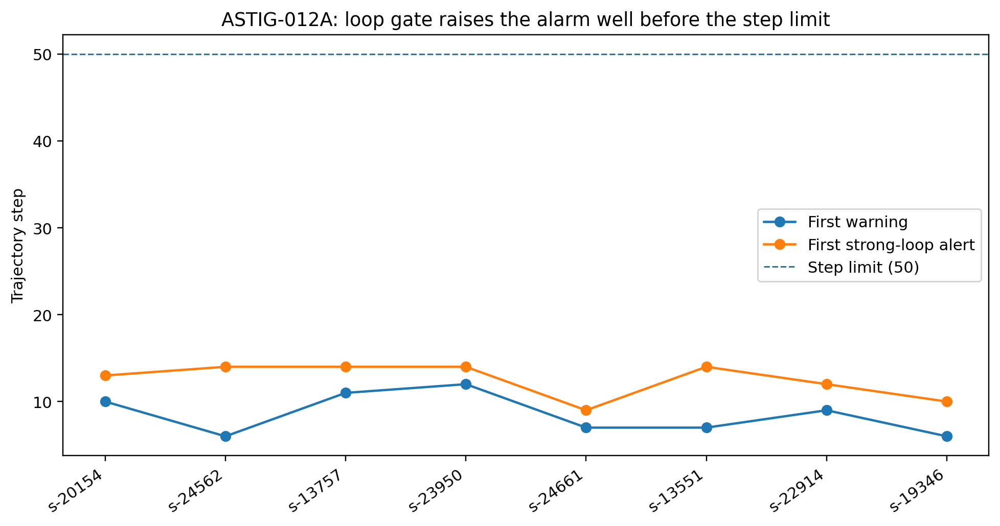

Figure 23. First warning and first strong-loop alert in eight Qwen LimitsExceeded trajectories. The horizontal reference is the 50-step limit. All strong alerts occur at steps 9–14. Task identifiers are shown on the x-axis; lines connect the observed task-level timings.

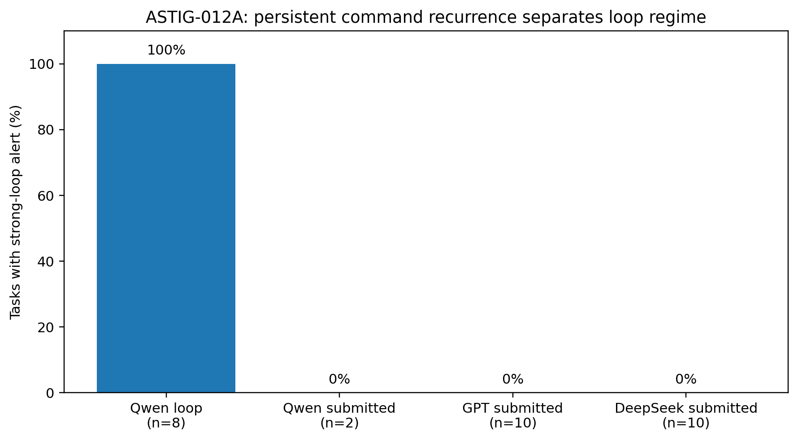

Figure 24. Task-level strong-loop alerts with W = 8 and threshold 0.50. All eight Qwen LimitsExceeded traces alert; the two Qwen, ten GPT and ten DeepSeek Submitted controls have no strong alerts. Bars show observed proportions in these four groups.

### 16 4 Window and threshold sensitivity

Nine configurations combine W in {6, 8, 10} with strong thresholds in {0.4, 0.5, 0.6}. All detect the eight Qwen LimitsExceeded traces; none alerts in the two Qwen or ten DeepSeek Submitted traces. One GPT task alerts in each of the more permissive W = 6, threshold 0.4/0.5 and W = 10, threshold 0.4 settings. All three W = 8 thresholds produce zero GPT strong alerts. The default lies within a stable region of this parameter scan.

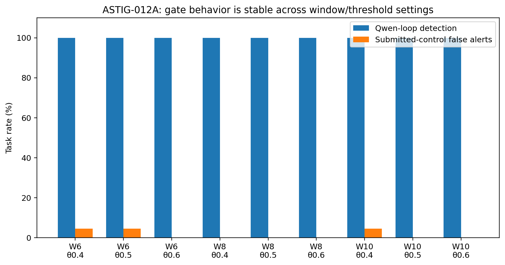

Figure 25. Strong-loop detection and Submitted-control alert rates across the nine window/threshold settings. Loop detection remains 100%; control alerts occur only in three settings. These are observed task-level rates, with no uncertainty intervals.

### 16 5 Repeated action types and repeated command instances

A simple recurrence measure can act as a stethoscope for work dynamics. Repeated inspection can be useful, and a brief retry can trigger a warning. Persistent recycling of the same command gives a different pattern. Checking a door several times may be reasonable; inserting the same key forty times indicates that the work state is no longer generating useful new operations.

This diagnostic measures recurrence separately from representation quality. The initial ASTIG-011 interpretation suggested withdrawing local correction when a loop was detected. ASTIG-012B directly tests that treatment and finds that preserving local representation is valuable even within strong-loop states.

The distinction between action class and command instance matters. Inspect→inspect→inspect occurs frequently in Submitted tasks. Command recurrence asks whether the same operation keeps returning. As with exposure correction, the function of repetition determines the appropriate treatment.

### 16 6 A diagnostic layer before control intervention

The diagnostic structure separates work regime from prescription choice.

Work-dynamics diagnostics → Normal / Stagnation / Strong loop → Corrective Optics eligibility

Normal progression enters the Exposure/Topology/Geometry/Role process, and stagnation remains under observation. A strong loop routes the state to a recovery branch. ASTIG-009’s switchability gate has a separate role inside the optical correction procedure: deciding whether prescription heterogeneity justifies adaptation. The treatment attached to the strong-loop branch is evaluated in the next experiment.

### 16 7 Evidence established by the gate

The 30-trajectory cohort supports rolling command recurrence as an early diagnostic of the observed strong-loop regime and supplies an operational normal/warning/strong-loop distinction. Detection remains stable across W = 6–10 and thresholds 0.4–0.6, with the control-alert differences reported above. ASTIG-012B evaluates how representation choice should respond to that diagnosis.

## 17 ASTIG 012B Local information within a loop

This study tests whether a diagnosed strong loop should trigger a return to raw cumulative history. It constructs an independent action-state decoder and compares Raw, always Local-Corrected and Naive Regime-Gated representations. The gate reads commands already executed; the command being predicted is excluded.

### 17 1 Decoder and task held out evaluation

Each assistant turn is split into work prose and a bash command. Prose becomes a deterministic 512-dimensional hashed bag-of-words vector. Commands map to the same five action classes as ASTIG-011. Each task is held out while the other nine form the training-state pool. Prediction uses cosine-weighted k-nearest neighbours with K = 7.

Raw cumulative state is the linear sum of the current and all previous work-state vectors.

Local-Corrected state combines the current state, the previous state and the two most similar historical states, weighted by exp(−(1 − cosine)^2).

The Naive Regime-Gated strategy retains Local-Corrected representation in normal and warning states, but switches to Raw when previous commands satisfy the strong-loop gate. This one-step lag keeps the target command out of the routing decision.

### 17 2 Results across the three models

Table 30. Results across the three models.

| Model / states | Raw cumulative | Local-Corrected | Naive Regime-Gated |
| --- | --- | --- | --- |
| GPT-5-mini · 153 | 52.29% | 66.01% | 66.01% |
| DeepSeek-v4-flash · 267 | 57.30% | 63.67% | 63.67% |
| Qwen-2.5-7B · 410 | 26.10% | 53.17% | 29.76% |

*Source: recorded coding-agent trajectories under the stated sampling and routing protocol. Counts and percentages use the displayed denominators. Submitted denotes exit status; the measured quantities are defined in the column headings.*

The gate remains inactive for GPT and DeepSeek, so the gated and Local-Corrected results coincide. Local correction improves their accuracies over Raw by 13.72 and 6.37 percentage points. For Qwen, Local-Corrected improves 26.10% to 53.17%, whereas the strong-loop-to-Raw rule gives 29.76%. The diagnosis identifies recurrence, but that reset discards useful local action information.

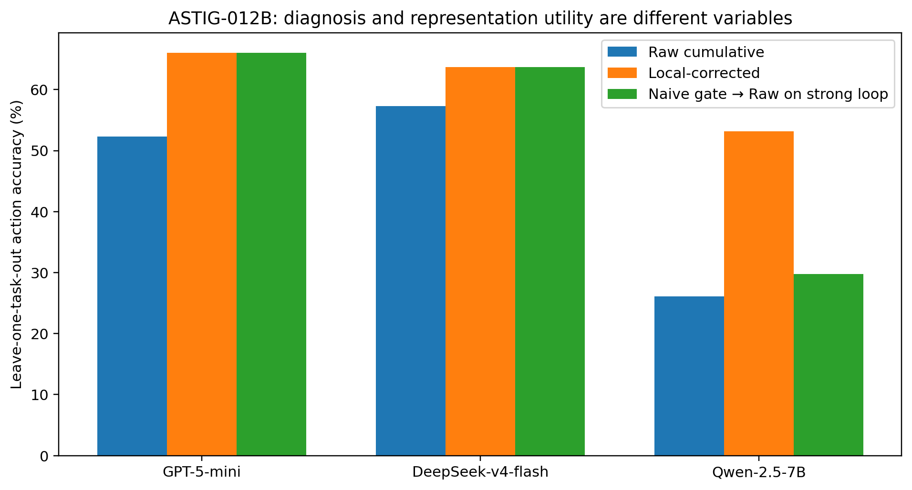

Figure 26. Leave-one-task-out accuracy under the independent 512-dimensional decoder. GPT, DeepSeek and Qwen contribute 153, 267 and 410 states respectively. Bars compare Raw, Local-Corrected and the naive gate-to-Raw treatment. The latter is identical to Local-Corrected where no strong gate fires.

### 17 3 The 300 gate positive Qwen states

In the 300 Qwen states already diagnosed as strong loops before prediction, Raw accuracy is 21.67% and Local-Corrected accuracy 53.67%. The naive gated strategy equals Raw at 21.67% by its routing rule. Recurrent work therefore retains measurable local structure useful for decoding its recorded actions.

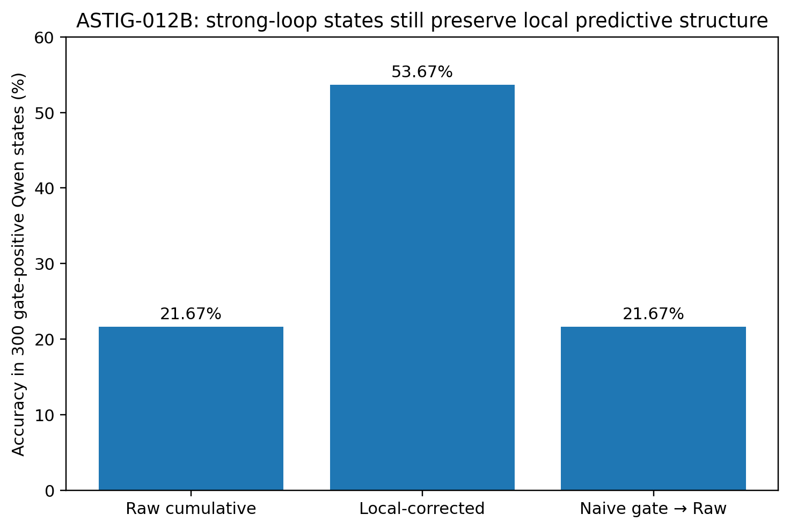

Figure 27. Next-action class accuracy in the 300 gate-positive Qwen states. Local-Corrected reaches 53.67%, versus 21.67% for Raw and for the naive gate-to-Raw strategy. This measures representation utility within recorded loops.

### 17 4 Twelve decoder configurations

We crossed local history k in {1, 2, 3} with kNN K in {3, 5, 7, 11}. Local-Corrected exceeds Raw in all 12 configurations, both across all 410 Qwen states and within the 300 strong-loop states. Across all states, corrected accuracy ranges from 40.73% to 57.32% and raw from 20.98% to 26.10%. In the loop subset the ranges are 38.67%–57.33% and 13.67%–21.67% respectively.

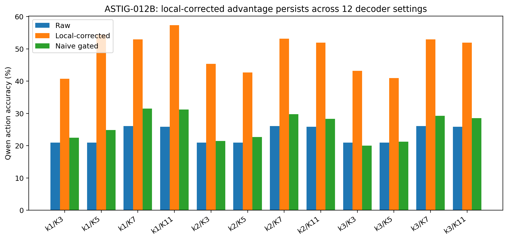

Figure 28. Qwen accuracy across the twelve local-history and kNN settings. Local-Corrected exceeds Raw throughout the tested neighbourhood. The naive gated strategy loses much of that retained local information. The x-axis identifies each k/K combination.

### 17 5 Keeping the map while leaving the roundabout

The gate correctly detects repeated command recycling, while the decoder shows that local information remains usable. A model may preserve a clear representation of whether it is editing, inspecting or executing even when that representation participates in an unproductive cycle.

A navigation system can locate a car accurately on a roundabout while the car keeps circling. Turning off the map does not supply an exit. Here the Local-Corrected state supplies local position and task relations; the recurrence gate diagnoses the motion. Recovery can retain the map while changing the recurrent edges.

The intervention target is therefore a particular action recurrence, candidate edge or working-state update rule. Useful local geometry can be preserved while the loop dynamics are changed.

### 17 6 Routing strong loops to a loop breaker

Work-dynamics diagnostics identifies normal, warning and strong-loop regimes. Corrective optics maintains local structure and calibrated exposure. A strong loop activates a dedicated branch that changes recurrent execution eligibility or expands candidate edges while retaining the Local-Corrected state. The switchability gate remains responsible for prescription variation within that representation process.

### 17 7 Evidence established by the independent decoder

The independent decoder uses the same 30-trajectory validation cohort. It establishes that the gate can remain transparent for GPT/DeepSeek controls and that Qwen loop states retain useful local action structure. The twelve-configuration scan supports the direction across a parameter neighbourhood and identifies loop dynamics as the appropriate intervention target.

## 18 ASTIG 013A Gated command cooldown

ASTIG-012B establishes that local information survives within a strong loop. ASTIG-013A retains that representation and tests a minimal loop breaker: temporarily withdrawing repeat-execution eligibility from recently executed commands after the strong-loop gate fires. It uses the same 30 matched mini-SWE-agent trajectories and measures interception of recorded execution edges offline.

### 18 1 Cooldown rule

Command normalization follows ASTIG-012A, retaining arguments, paths, numbers and content while standardizing case and whitespace. Thus grep x file.py and grep y file.py remain different commands. The gate retains W = 8 and the two-window 0.50 or one-window 0.75 rule. The pending command is excluded from gate diagnosis.

For a candidate c_t, define B_h(t) = 1 if that command appears among the previous h executed commands. The always-on comparison applies this mask in every regime. The gated version applies it only when the prior history is in a strong loop. We scan h in {1, 2, 4, 8}. Interception means that the next edge in the recorded trajectory would be blocked. The Local-Corrected state, task summary and other candidates remain available.

### 18 2 Four commands cover most observed recurrence

The eight Qwen LimitsExceeded traces contain 300 gate-positive states. A one-command cooldown intercepts 141 (47.0%); two commands intercept 250 (83.33%); four intercept 291 (97.0%); eight intercept 293 (97.67%). The cycles therefore include A→B→A and A→B→C→A as well as immediate A→A recurrence. Most measured coverage is reached at h = 4.

Table 31. Four commands cover most observed recurrence.

| Cooldown h | Qwen strong-loop intercepted | Coverage | Submitted blocks if always-on | Submitted blocks if gated |
| --- | --- | --- | --- | --- |
| 1 | 141 / 300 | 47.00% | 3 / 430 (0.70%) | 0 / 430 (0%) |
| 2 | 250 / 300 | 83.33% | 4 / 430 (0.93%) | 0 / 430 (0%) |
| 4 | 291 / 300 | 97.00% | 9 / 430 (2.09%) | 0 / 430 (0%) |
| 8 | 293 / 300 | 97.67% | 11 / 430 (2.56%) | 0 / 430 (0%) |

*Source: recorded coding-agent trajectories under the stated sampling and routing protocol. Counts and percentages use the displayed denominators. Submitted denotes exit status; the measured quantities are defined in the column headings.*

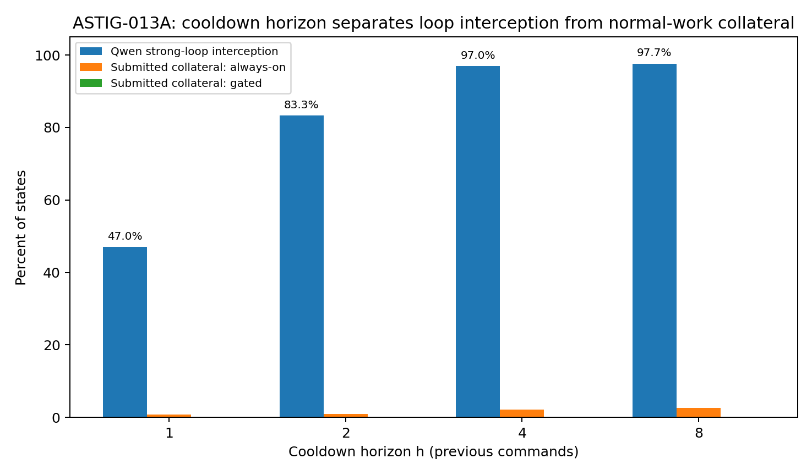

Figure 29. Recorded-edge interception as cooldown horizon increases. Qwen loop coverage rises from 47.0% at h = 1 to 97.0% at h = 4. Always-on cooldown also blocks a small number of Submitted-control edges; gated cooldown blocks none of their 430 states. Bars represent observed proportions.

### 18 3 Preserving legitimate repetition

At h = 4, always-on cooldown would block six commands among GPT’s 153 Submitted states and three among DeepSeek’s 267. The two Qwen Submitted traces, with ten states, have no hits. The total is 9/430 (2.09%). Gating preserves all nine because none of the 22 Submitted trajectories enters a strong loop.

The diagnostic and intervention answer different questions. The gate detects sustained recurrence; cooldown then modifies command eligibility within that regime. A particular grep, pytest or sed command may be reused during ordinary work while receiving a temporary cooldown in a strong loop.

### 18 4 Coverage in individual loop trajectories

Table 32. Coverage in individual loop trajectories.

| Qwen loop task | First strong alert | Strong states | h=4 intercepted | Coverage | First intercept |
| --- | --- | --- | --- | --- | --- |
| sympy-20154 | 13 | 37 | 32 | 86.49% | 14 |
| sympy-24562 | 14 | 36 | 35 | 97.22% | 16 |
| sympy-13757 | 14 | 36 | 36 | 100% | 15 |
| sympy-23950 | 14 | 36 | 33 | 91.67% | 15 |
| sympy-24661 | 9 | 41 | 41 | 100% | 10 |
| sympy-13551 | 14 | 36 | 36 | 100% | 15 |
| sympy-22914 | 12 | 38 | 38 | 100% | 13 |
| sympy-19346 | 10 | 40 | 40 | 100% | 11 |

*Source: recorded coding-agent trajectories under the stated sampling and routing protocol. Counts and percentages use the displayed denominators. Submitted denotes exit status; the measured quantities are defined in the column headings.*

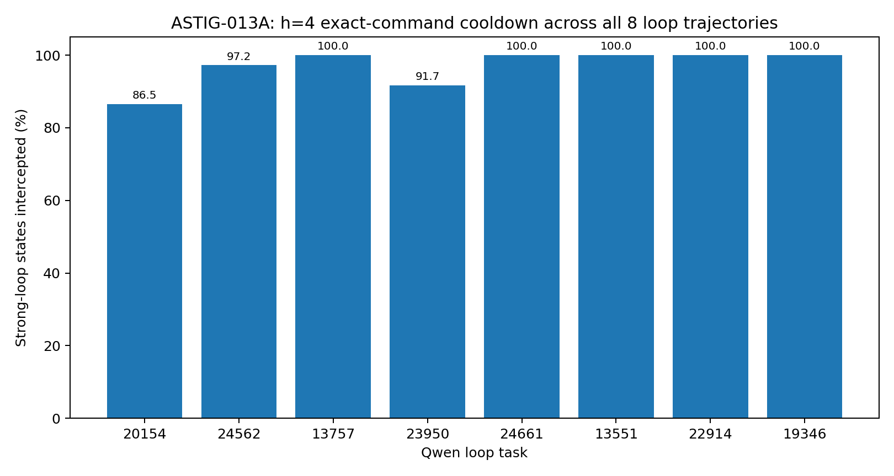

Figure 30. Four-command cooldown coverage in all eight Qwen loop tasks. Five tasks have 100% interception, as shown by the task table; pooled coverage is 291/300. The figure gives observed task-level percentages.

### 18 5 Timing after the first alert

The first h = 4 interception occurs one or two steps after the first strong alert in every loop task, with a median delay of one step. Task-level median repeat gaps are one to three steps, and their 90th percentiles are no greater than three. This explains the coverage plateau between h = 4 and h = 8.

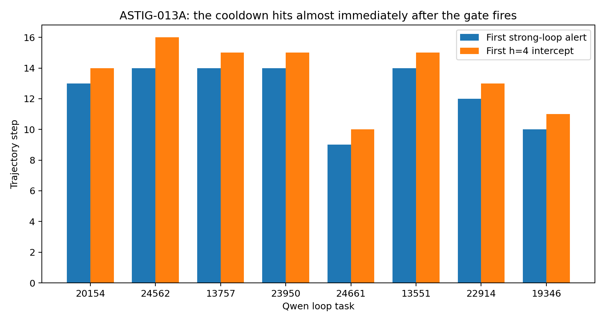

Figure 31. First strong-loop alert and first four-command cooldown interception in the eight Qwen loop tasks. Their separation is one or two steps. The two series show directly observed event times in the recorded trajectories.

### 18 6 A temporary restriction on a particular route

The one-step condition alone would suggest that looping means pressing the same button repeatedly. Real traces also contain short cycles such as A→B→A→B and A→B→C→A. A four-command cooldown gives each recently used operational instance a short interval during which it cannot re-enter execution.

The action classes inspect, edit and test remain available, as does the Local-Corrected representation. The agent retains information about where it is and what it has done. Only the particular recently recurrent command is temporarily withheld. In the roundabout analogy, the map remains visible while the just-used return entrance is closed.

Regime gating applies that restriction only during strong loops. It preserves all nine Submitted-control edges that an always-on h = 4 rule would block. Diagnosis thus directs a local intervention toward the measured recurrence mechanism.

### 18 7 Cooldown within the recovery branch

1. Normal and warning states retain the existing corrective-optics representation without command cooldown.

2. Strong loops retain the Local-Corrected state and activate h = 4 cooldown.

3. A candidate present among the previous four executed commands temporarily loses execution eligibility.

4. New commands remain available; the cooldown branch can end when its diagnostic condition clears.

5. Candidate scarcity after masking is addressed through the topology expansion studied in ASTIG-013B.

### 18 8 Evidence from edge interception

The recorded-trajectory analysis identifies the recurrence edges targeted by the mask: 291/300 at h = 4, with zero gated interventions in 430 Submitted-control states. Increasing h to eight adds 0.67 percentage points. This supplies a compact default horizon for the candidate-recovery studies that follow.

## 19 ASTIG 013B Expanding the candidate topology

After cooldown withdraws recurrent execution edges, recovery needs alternative candidates. ASTIG-013B holds the local representation and loop gate fixed while examining where these candidates occur and how they are ranked.

### 19 1 Own history and same task external states

The study uses the same ten-task, three-model cohort and the 300 gate-positive Qwen states. Each decision has only its previously executed command history. Four-command cooldown removes recent repeats. Work states use the same 512-dimensional hashed prose representation and cosine similarity.

The first candidate pool is Qwen’s own task history, searched at k = 2, 4 and 8 after cooldown. The second comprises GPT-5-mini and DeepSeek-v4-flash Submitted states from the same task. External commands must be absent from Qwen’s entire history up to the decision point. They are ranked by cosine similarity. A further probe identifies unseen Edit, Test or Submit candidates and records their rank among unseen external states.

This is an offline measurement of candidate availability and ordering using recorded trajectories. Same-task donor traces provide a retrospective candidate pool for testing the control components.

### 19 2 Expanding local history

Table 33. Expanding local history.

| Candidate search | Strong-loop states with an admissible candidate | Coverage | States whose nearest candidate is Edit Test or Submit |
| --- | --- | --- | --- |
| Qwen own-history · k=2 | 131 / 300 | 43.67% | 6 / 300 (2.00%) |
| Qwen own-history · k=4 | 142 / 300 | 47.33% | 8 / 300 (2.67%) |
| Qwen own-history · k=8 | 178 / 300 | 59.33% | 13 / 300 (4.33%) |
| Same-task GPT/DeepSeek · unseen exact command | 300 / 300 | 100% | 31 / 300 (10.33%) |

*Source: recorded coding-agent trajectories under the stated sampling and routing protocol. Counts and percentages use the displayed denominators. Submitted denotes exit status; the measured quantities are defined in the column headings.*

Expanding own-history search from k = 2 to k = 8 raises availability from 43.67% to 59.33%. More than 40% of the loop states still lack an eligible command among their eight nearest historical states after cooldown.

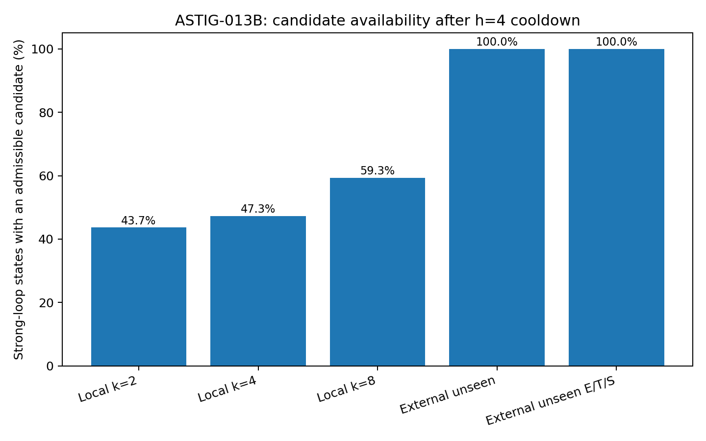

Figure 32. Candidate availability after four-command cooldown in 300 Qwen loop states. Own-history searches cover 43.67%, 47.33% and 59.33% at k = 2, 4 and 8. Same-task external traces supply unseen commands and unseen progression-role candidates in all 300 states. Bars measure availability, not live task success.

### 19 3 Available candidates and their ordering

The same-task GPT/DeepSeek pool supplies at least one command absent from Qwen’s previous history in every state. Alternative operations therefore exist in these recorded paths, although they lie outside the current local candidate set.

Pure cosine ranking selects an Edit, Test or Submit command in only 31/300 states (10.33%). Most nearest candidates still belong to inspect or execute. Candidate expansion exposes other paths; the ranking rule determines which kind of path receives priority.

### 19 4 Progression exits beyond the nearest neighbour

Adding a functional eligibility condition requires an unseen command with an Edit, Test or Submit role. All 300 strong-loop states then have at least one progression exit in the donor pool.

Within-task median ranks of those exits range from second to fifteenth among unseen external candidates. The state-weighted mean rank is approximately 8.77. A useful progression candidate can therefore occur well beyond the state most similar to the current loop.

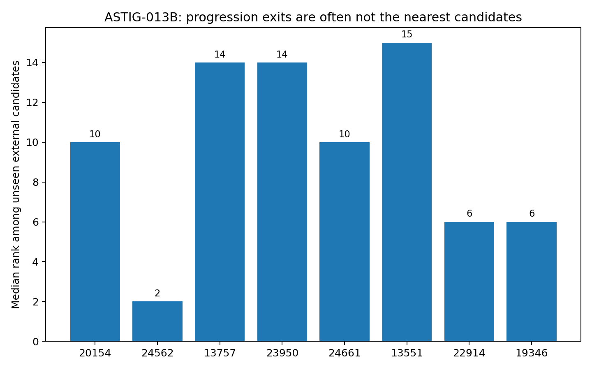

Figure 33. Task-level median similarity ranks of unseen progression exits among unseen external candidates. The eight task medians range from 2 to 15; their state-weighted mean rank is about 8.77. Lower rank means greater cosine similarity.

### 19 5 Functional composition of selected exits

Selecting the most similar unseen progression candidate yields 139 Edit, 64 Test and 97 Submit choices. GPT supplies 117 and DeepSeek 183. These are commands recorded under the same task and mini-SWE-agent protocol.

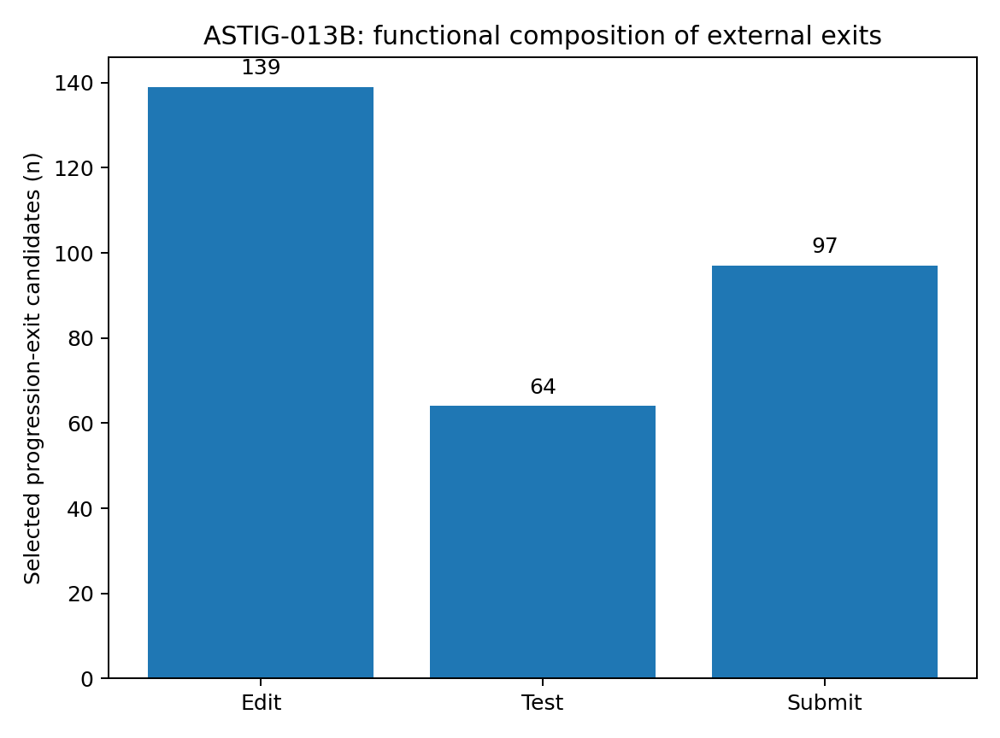

Figure 34. Roles of the 300 highest-similarity unseen progression candidates: 139 Edit, 64 Test and 97 Submit. These counts describe stage-blind selection from the recorded external pool.

### 19 6 The role of an exit

Cooldown closes a recently used return entrance to the roundabout. Candidate expansion reveals roads from other recorded paths on the same task. Every studied loop state has an unseen progression candidate in that enlarged map.

Similarity alone still favours actions resembling those already occurring, such as another inspect or execute operation. A larger map can thus return a path that closely resembles the old route.

The components acquire distinct jobs. Topology defines the visible candidates; functional role identifies their contribution to progress; Geometry ranks candidates within the eligible set. In the strong-loop branch, this motivates cooldown, expansion, role filtering and then similarity ranking.

Expanding k from two to eight modestly enlarges the same local basin. Connecting an external episode introduces another recorded work path. The availability results lead to the phase question: when is Edit appropriate, when is Test needed, and when is Submit eligible?

### 19 7 Candidate recovery procedure

1. Normal and warning states retain corrective optics while the recurrence gate continues observing.

2. A strong loop activates four-command cooldown while retaining the Local-Corrected state.

3. Search eligible own-history candidates at k = 2, then k = 4 and k = 8 when necessary.

4. If local candidates remain insufficient, consult a same-task or same-mechanism episodic pool and require commands absent from the current model’s history.

5. Use progression roles to determine eligibility before similarity ranks the resulting candidates.

6. Continue observing recurrence and task state after each selected action; release conditions are refined in ASTIG-013D/E.

### 19 8 Evidence from candidate availability

Own-history expansion supplies a cooldown-eligible candidate in 178/300 states at k = 8. The same-task donor pool supplies unseen commands and unseen progression exits in 300/300. The analysis identifies both candidate scarcity within the local basin and the tendency of similarity ranking to place functional progression farther down the list. It supplies the candidate space for phase-conditioned selection.

- The corresponding evidence files are astig013b_task_results.csv and astig013b_summary.json, with the candidate-availability, progression-rank and progression-class figures.

## 20 ASTIG 013C Phase conditioned progression routing

Edit, Test and Submit are different kinds of exits. A state still inspecting files or awaiting verification can be similar to a recorded Submit state. ASTIG-013C therefore adds observable task phase to progression-role selection while keeping the candidate pool fixed.

### 20 1 Calibration from Submitted trajectories

The phase rule is calibrated on ten GPT and ten DeepSeek Submitted traces. Only actions and observations preceding each final Submit are read. All 20 have a prior Edit and at least one post-edit verification action. Verification includes Test, direct reproduction, diff inspection or another actual check of the modified state.

Table 34. Calibration from Submitted trajectories.

| Calibration measure | Observed value | Interpretation |
| --- | --- | --- |
| Edit precedes final Submit | 20 / 20 | Implementation occurred before submission |
| Verification follows Edit | 20 / 20 | The changed state was inspected again |
| A formal Test follows Edit | 12 / 20 | Submitted paths use several verification channels |
| Latest post-edit Test has return code 0 | 11 / 20 | A formal test pass is one strong verification channel |
| Progression actions retained under stricter phase eligibility | 147 / 150 (98.0%) | High compatibility with observed progression grammar |

*Source: recorded coding-agent trajectories under the stated sampling and routing protocol. Counts and percentages use the displayed denominators. Submitted denotes exit status; the measured quantities are defined in the column headings.*

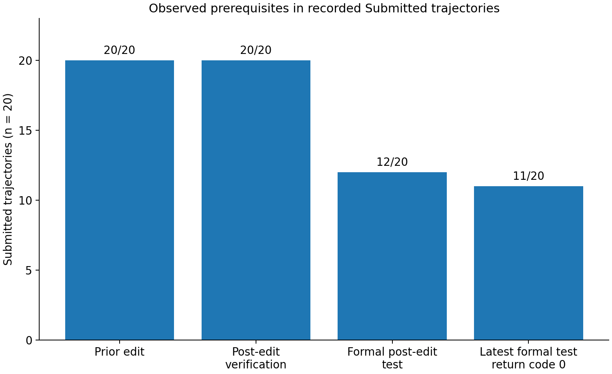

Figure 35. Pre-submission observations in 20 GPT/DeepSeek Submitted traces. All have Edit and post-edit verification; 12 have a formal post-edit Test and 11 have a latest Test with return code zero. Bars show trajectory counts.

### 20 2 Phase from already observed history

Four observable phases are defined. PRE_EDIT has no previous Edit. POST_EDIT_UNVERIFIED has an Edit but no subsequent Inspect, Execute or Test verification action. TEST_FAILED has an explicit nonzero return code from the latest post-edit Test. POST_EDIT_VALIDATED has post-edit verification and no active failed-test state. These labels use only executed commands and observations available before the decision. VALIDATED is the operational label under this rule; the quality of environmental validation is examined in ASTIG-013E.

Table 35. Phase from already observed history.

| Phase | First-priority progression role | Subsequent priority order |
| --- | --- | --- |
| PRE_EDIT | Edit | Test → Submit |
| POST_EDIT_UNVERIFIED | Test | Edit → Submit |
| TEST_FAILED | Edit | Test → Submit |
| POST_EDIT_VALIDATED | Submit | Test → Edit |

*Source: recorded coding-agent trajectories under the stated sampling and routing protocol. Counts and percentages use the displayed denominators. Submitted denotes exit status; the measured quantities are defined in the column headings.*

### 20 3 Phase distribution within the loop cohort

The 300 gate-positive states comprise 112 PRE_EDIT, 113 POST_EDIT_UNVERIFIED and 75 POST_EDIT_VALIDATED states. None is TEST_FAILED under the observed rule. Loop diagnosis alone therefore does not specify whether the next progression role should be Edit, Test or Submit.

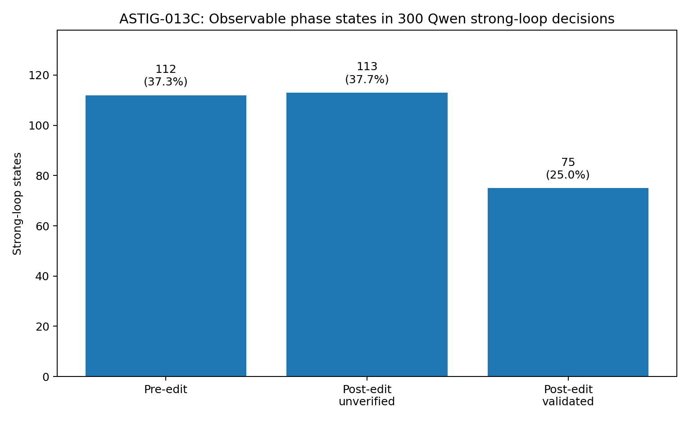

Figure 36. Observable phase among 300 Qwen strong-loop decisions: 112 pre-edit, 113 edited but unverified and 75 edited with recorded validation. The percentages are 37.3%, 37.7% and 25.0%.

### 20 4 Candidate availability after applying phase

For every Qwen loop state, the same-task donor pool supplies at least one unseen Edit, Test and Submit command. The first-priority role for the current phase is therefore available in all 300 states. Phase conditioning preserves candidate coverage in this pool.

Table 36. Candidate availability after applying phase.

| Unseen external role | Strong-loop states with a candidate | Coverage |
| --- | --- | --- |
| Edit | 300 / 300 | 100% |
| Test | 300 / 300 | 100% |
| Submit | 300 / 300 | 100% |
| Current phase first-priority role | 300 / 300 | 100% |

*Source: recorded coding-agent trajectories under the stated sampling and routing protocol. Counts and percentages use the displayed denominators. Submitted denotes exit status; the measured quantities are defined in the column headings.*

### 20 5 A lower bound on premature submission

The stage-blind ASTIG-013B selection contains 139 Edit, 64 Test and 97 Submit choices. Aligning its task-level counts with the phase counts gives a strict lower bound without recomputing similarity: at least 76 Submit choices occur outside POST_EDIT_VALIDATED. Thus at least 76/97, or 78.35%, are premature under the phase rule. Candidate relevance by itself does not supply submission eligibility.

Table 37. A lower bound on premature submission.

| Task | Role-only Submit | Submit-ready states | Guaranteed premature Submit |
| --- | --- | --- | --- |
| sympy-20154 | 35 | 1 | ≥34 |
| sympy-24562 | 0 | 0 | 0 |
| sympy-13757 | 0 | 0 | 0 |
| sympy-23950 | 0 | 18 | 0 |
| sympy-24661 | 21 | 20 | ≥1 |
| sympy-13551 | 0 | 36 | 0 |
| sympy-22914 | 38 | 0 | 38 |
| sympy-19346 | 3 | 0 | 3 |
| Total | 97 | 75 | ≥76 |

*Source: recorded coding-agent trajectories under the stated sampling and routing protocol. Counts and percentages use the displayed denominators. Submitted denotes exit status; the measured quantities are defined in the column headings.*

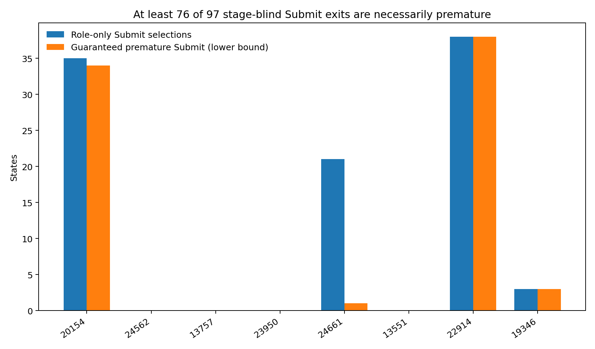

Figure 37. Task-level lower bounds on premature stage-blind Submit selections. Within each task, max(0, Submit selections − submit-ready states) gives a guaranteed count. The bounds total at least 76 of the 97 Submit choices. The figure compares role-only Submit counts with these lower bounds.

### 20 6 Phase before role and similarity

Because each role is available in every state, assigning PRE_EDIT to Edit, POST_EDIT_UNVERIFIED to Test and POST_EDIT_VALIDATED to Submit yields 112 Edit, 113 Test and 75 Submit slots. Compared with the stage-blind 139/64/97 distribution, Test gains 49 slots and Submit is tied to the 75 currently eligible states. Similarity remains responsible for selecting a particular candidate within the phase-eligible role.

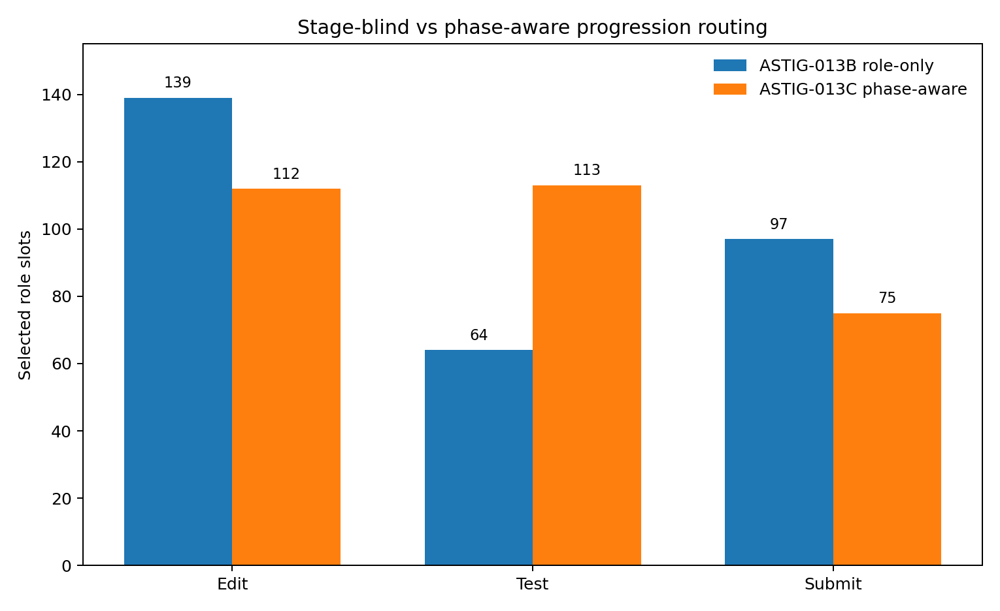

Figure 38. Aggregate role allocation with and without phase conditioning. Stage-blind selection gives 139/64/97 Edit/Test/Submit choices; phase-first allocation gives 112/113/75. The latter follows the observed phase rule and availability results.

### 20 7 Traffic signals for the available exits

Cooldown closes the return entrance, topology expansion connects other roads, and phase assigns traffic signals to Edit, Test and Submit. All are progression roles, but each belongs to a different stage of work.

Task sympy-20154 illustrates the issue. Of its 37 strong-loop states, 36 are POST_EDIT_UNVERIFIED and only one is submit-ready. Stage-blind selection nevertheless assigns 35 Submit candidates. Even without knowing which individual states received them, at least 34 must be premature. Cosine distance measures similarity; the phase rule supplies permission to submit.

Topology makes candidate paths visible. Phase determines which roles are eligible now. Progression role describes what the candidate does, and Geometry ranks compatible candidates. This ordering puts the submission check at the eligibility layer.

### 20 8 Phase conditioned recovery procedure

1. Retain corrective optics in normal and warning regimes while monitoring recurrence.

2. In a strong loop, retain local representation and activate h = 4 cooldown.

3. Expand own-history search through k = 2, 4 and 8, then use the external episodic pool when required.

4. Infer PRE_EDIT, POST_EDIT_UNVERIFIED, TEST_FAILED or POST_EDIT_VALIDATED from executed actions and observations.

5. Assign role priority from phase; Submit receives first priority after post-edit validation.

6. Rank specific candidates within the eligible role by similarity or Geometry.

7. Reassess recurrence and phase after execution, using the recovery-release logic developed below.

The resulting order is Loop Gate → Cooldown → Topology Expansion → Phase → Progression Role → Similarity/Geometry.

### 20 9 Evidence from phase routing

Twenty Submitted donor traces calibrate the post-edit verification rule. The eight Qwen limit-exceeded traces supply 300 loop states, distributed 112/113/75 across the observed phases. All three progression roles are available in each state. Combining phase counts with the archived role selections establishes at least 76 premature Submit choices among 97. These measurements support placing phase eligibility before similarity ranking.

## 21 ASTIG 013D Duration of recovery control

ASTIG-013D asks when control can be returned after selecting an eligible new path. It uses the same 300 Qwen loop states and recorded GPT/DeepSeek Submitted paths in two replay designs. One follows the selected donor state’s actual subsequent commands. The other splices one to five donor commands into the Qwen stream and then deliberately resumes Qwen’s originally recorded future, recomputing recurrence. This separates candidate escape from clearance of the diagnostic state.

### 21 1 Robustness to an uncompressed representation

The new ranking uses exact sparse word counts with log1p weights and cosine similarity, replacing the 512-dimensional hash. The loop gate, cooldown, external pool, full-history novelty condition and phase rule stay fixed. Only within-role similarity geometry changes.

Table 38. Robustness to an uncompressed representation.

| Ranking strategy | Edit / Test / Submit | Current first-priority role matched | Premature Submit choices |
| --- | --- | --- | --- |
| 013B stage-blind · 512D hashed | 139 / 64 / 97 | No statewise re-labelling in this comparison | At least 76/97 premature |
| 013D stage-blind · exact sparse cosine | 236 / 21 / 43 | 74/300 = 24.67% | 42/43 = 97.67% premature |
| 013D Phase → Role → sparse cosine | 112 / 113 / 75 | 300/300 = 100% | 0 under the eligibility rule |

*Source: controlled replay on 300 strong-loop states. Horizons are command steps. Release and phase progression are replay outcomes under the stated donor-continuation protocol.*

Changing the geometry shifts stage-blind role counts from 139/64/97 to 236/21/43. Only 74/300 choices match the current first-priority role, and 42 of 43 Submit choices are premature. Phase-first routing retains 300/300 role matches. The geometry affects which wrong-stage candidate ranks highest; the phase rule determines which roles are permitted.

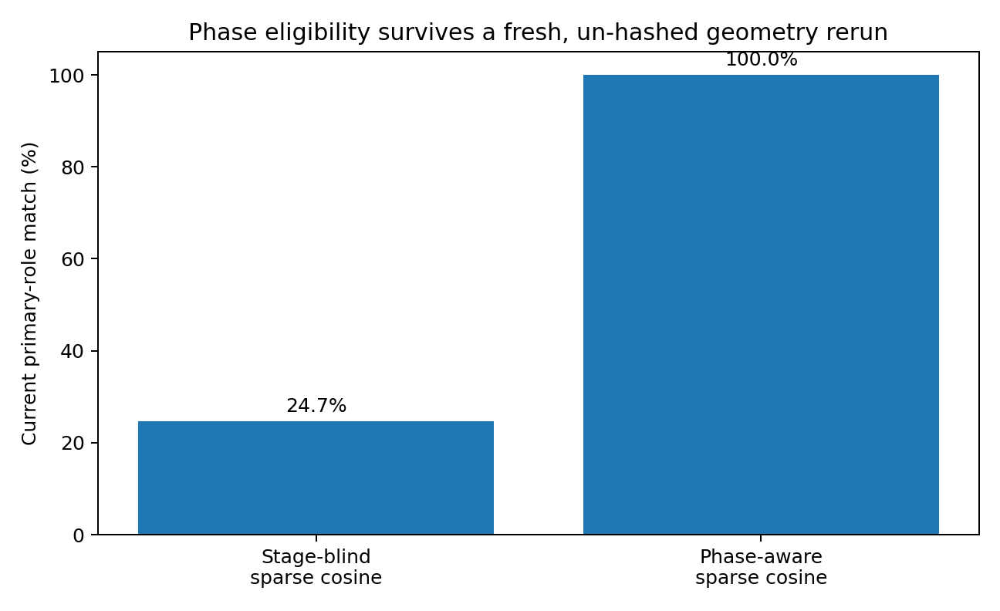

Figure 39. First-priority role agreement after replacing hashed geometry with exact sparse cosine. Stage-blind selection agrees in 74/300 states (24.67%), while phase-first routing agrees in 300/300. These values measure compliance with the defined phase rule.

### 21 2 Continuation along recorded donor paths

For each loop state, phase opens its first-priority role, and sparse cosine selects the most similar donor state. Up to five subsequent recorded commands are then followed. The selected paths come from GPT in 151 states and DeepSeek in 149.

Table 39. Continuation along recorded donor paths.

| Replay measure | Result | Interpretation |
| --- | --- | --- |
| Current phase milestone reached within three steps | 300/300 | Edit proceeds to verification; unverified states receive Test; validated states can Submit |
| Encounter with the prior four-command cooldown within five steps | 0/300 | The continuation avoids the recently blocked recurrence edges |
| Five-step exact-command novelty against Qwen history | Mean 100% | Novel operations continue beyond the first command |
| Progression-role density over three steps | 79.89% | Most continuation actions occupy the Edit/Test/Submit chain |
| Progression-role density over five steps | 80.56% | The donor segment retains progression-role content |
| Submit reached within five steps | 174/300 = 58.00% | Other states are assessed by recurrence-gate clearance |

*Source: controlled replay on 300 strong-loop states. Horizons are command steps. Release and phase progression are replay outcomes under the stated donor-continuation protocol.*

The selected exits connect to actual recorded continuations. All states reach their current phase milestone within three steps, and the observed five-step segments retain 100% command novelty relative to Qwen’s earlier history. This establishes continuity of the donor work sequence within the replay protocol.

### 21 3 A single new command followed by the recorded Qwen future

A deliberate counterfactual replaces only the current Qwen command with a phase-selected donor command, then returns to the original recorded Qwen future. The W = 8 recurrence diagnostic is recomputed on this hybrid stream.

Table 40. A single new command followed by the recorded Qwen future.

| Diagnostic after one inserted command | Result |
| --- | --- |
| Strong-loop gate clears at the next decision | 8/300 = 2.67% |
| Gate stays clear for four consecutive decisions | 2/300 = 0.67% |
| Gate stays clear for eight consecutive decisions | 0/300 |
| Mean strong-loop occupancy over the next five decisions | 98.13% |
| Mean repeat mass in the W = 8 window at insertion | 83.50% |

*Source: controlled replay on 300 strong-loop states. Horizons are command steps. Release and phase progression are replay outcomes under the stated donor-continuation protocol.*

A novel edge and a cleared dynamical state occur on different timescales. The diagnostic window still contains substantial recurrent history after the first inserted command. In the driving analogy, the car may have entered an exit while its recent-motion record remains dominated by circling.

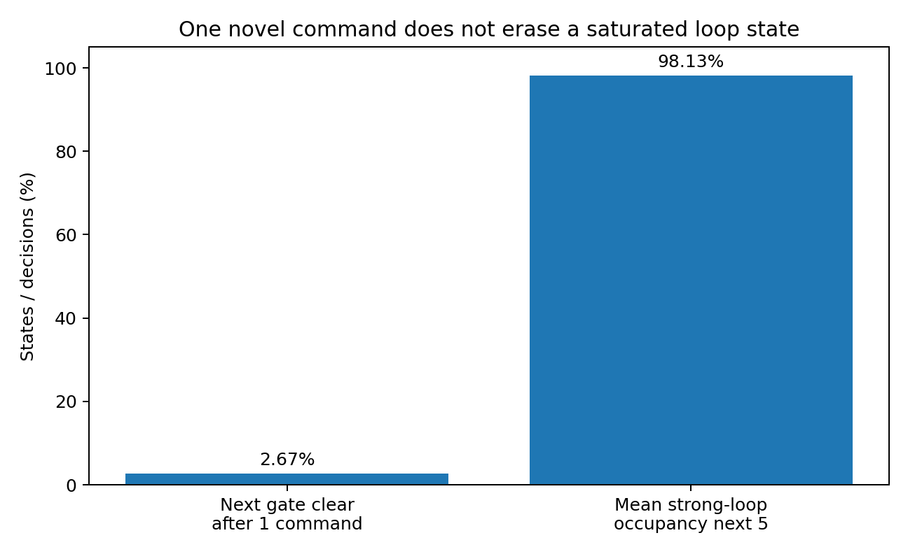

Figure 40. After one novel command and resumption of the recorded Qwen future, the next gate clears in 8/300 states (2.67%). Mean strong-loop occupancy over the following five decisions is 98.13%. The two bars describe different diagnostic horizons.

### 21 4 One through five takeover steps

The recovery branch next follows one to five commands from the selected recorded donor continuation. Submit terminates the segment. For a nonterminal segment, the stream is reconnected to Qwen’s recorded future and the gate is recomputed. The replay release condition is reaching Submit or clearing recurrence at the end of takeover.

Table 41. One through five takeover steps.

| Takeover horizon | Cumulative states reaching release | Submitted | Nonterminal with gate clear | First release at this horizon |
| --- | --- | --- | --- | --- |
| One step | 80/300 = 26.67% | 75 | 5 | 80 |
| Two steps | 102/300 = 34.00% | 95 | 7 | 22 |
| Three steps | 150/300 = 50.00% | 141 | 9 | 48 |
| Four steps | 189/300 = 63.00% | 141 | 48 | 39 |
| Five steps | 300/300 = 100% | 174 | 126 | 111 |

*Source: controlled replay on 300 strong-loop states. Horizons are command steps. Release and phase progression are replay outcomes under the stated donor-continuation protocol.*

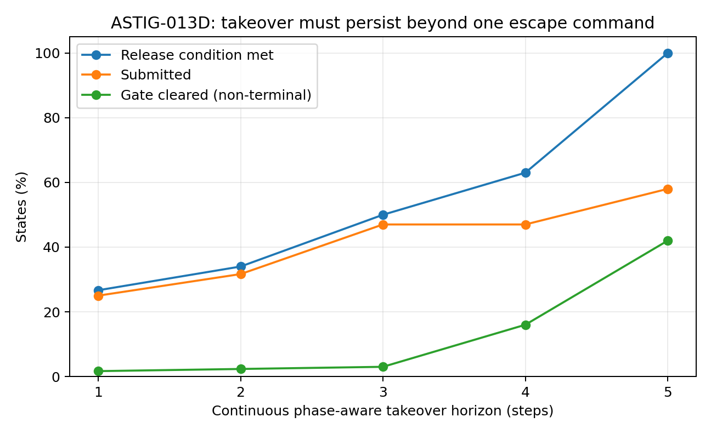

Figure 41. Cumulative replay release coverage at takeover horizons of one through five steps. Release means recorded Submit or diagnostic gate clearance. Coverage is 80, 102, 150, 189 and 300 of 300 states. At five steps, 174 are Submitted and 126 nonterminal states have cleared gates.

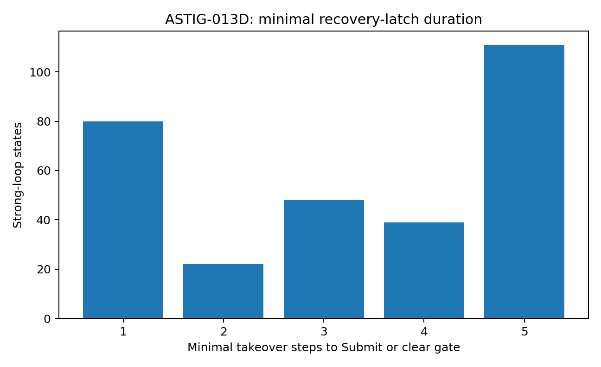

Figure 42. Minimum takeover duration needed for the replay release condition. Counts at one through five steps are 80, 22, 48, 39 and 111. The largest group requires five steps under this W = 8 diagnostic.

### 21 5 Task progress and dynamical memory

All current-phase milestones occur within three steps, while diagnostic clearance can take longer. The recurrence gate reads eight recent commands, and the main return cycles span one to four commands. Progress in task phase and dilution of the diagnostic window’s old recurrence are therefore separate events.

Within five replay steps, 174 states reach recorded Submit. The other 126 clear the gate by the fifth inserted command. This cohort supports a bounded recovery latch tied to measured release conditions.

### 21 6 Holding the steering wheel through recovery

The preceding studies close a return entrance, extend the map and add phase traffic signals. This study measures how long the steering correction must persist. A driver cannot assume that turning the wheel slightly has already changed the car’s recent dynamical state.

The first new edge clears the next gate in only 8/300 cases, whereas up to five steps reach the defined release condition in all 300 replays. Recovery therefore needs hysteresis: entry into the recovery branch and release from it use different state criteria.

The number of rapid Submit events is also an inadequate standalone objective. Stage-blind replay can reach Submit before Edit or verification. Phase-first recovery measures ordered progress and uses Submit together with gate clearance to assess release.

### 21 7 Recovery latch specification

1. Maintain corrective optics and recurrence monitoring in normal and warning states.

2. In a strong loop, retain the local state and apply four-command cooldown.

3. Expand own-history candidates through k = 2, 4 and 8; use the external episodic pool if required.

4. Prioritize Edit in PRE_EDIT and TEST_FAILED, Test in POST_EDIT_UNVERIFIED, and Submit in POST_EDIT_VALIDATED.

5. Rank candidates only within the currently eligible role.

6. Retain recovery control after the first escape command, for up to five commands in the studied prescription.

7. Release early at Submit or when the recurrence gate clears.

8. If the five-step horizon expires without release, escalate to state reconstruction, reset or a new plan rather than extending this same intervention indefinitely.

The sequence is Loop Gate → Cooldown → Topology Expansion → Phase → Role → Geometry → Recovery Latch → Submit or Gate Clear → Normal Operation.

### 21 8 Evidence from controlled replay

The donor continuations, Qwen histories and Qwen futures are recorded trajectories. The replay establishes robustness of phase-first routing to uncompressed geometry, availability of multistep donor continuations, and a release rule with memory. It measures candidate routing and diagnostic dynamics under controlled stream substitution.

The study’s measured endpoint is control duration and replay branch exit. A prior live Qwen runner was prepared, but its GPU endpoint returned HTTP 402 before model startup; the working container had CPU execution and no cached 7B weights. Accordingly, this experiment’s results are recorded-path replay outcomes. The following study supplies a separate real-command execution layer.

## 22 ASTIG 013E Execution and environmental verification

ASTIG-013E keeps the gate, cooldown, phase and role rules fixed while executing recorded commands in a real shell. With no cached Qwen-2.5-7B model or SWE-bench Docker runtime in that environment, it executes selected GPT/DeepSeek commands on runnable local SymPy source snapshots. Eight tasks are observed through process return code, output semantics, repository changes and import/smoke/test state.

### 22 1 Phase selected execution

The eight tasks comprise three PRE_EDIT, three POST_EDIT_UNVERIFIED and two POST_EDIT_VALIDATED cases. Commands come from recorded same-task donor traces. Each execution records source-file changes, git diff, importability and a task-relevant smoke check.

Table 42. Phase selected execution.

| Phase | Tasks | Expected side effect | Observed source mutations |
| --- | --- | --- | --- |
| PRE_EDIT | 3 | Edit may modify target source | 3/3 |
| POST_EDIT_UNVERIFIED | 3 | Test or inspection verifies without modifying source | 0/3 |
| POST_EDIT_VALIDATED | 2 | Submit preserves source | 0/2 |

*Source: real shell-command execution on compatible SymPy snapshots. rc is the process return code. Source mutation, test output and smoke verification are separate observation channels.*

All eight commands have side-effect classes consistent with their assigned phase: source changes occur in the three editing cases and are absent in verification and submission cases. This extends phase-role testing to actual command side effects in compatible snapshots.

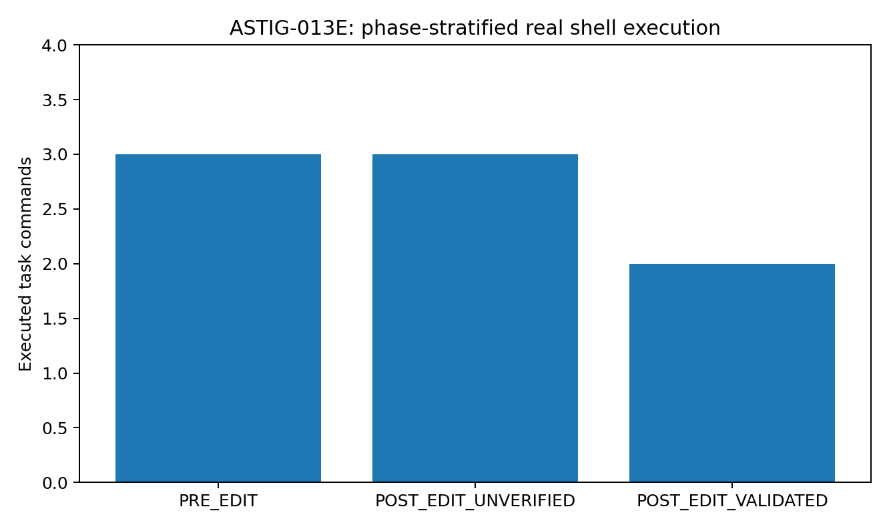

Figure 43. Eight real shell commands stratified by assigned phase: three PRE_EDIT, three POST_EDIT_UNVERIFIED and two POST_EDIT_VALIDATED. The adjacent table records whether each phase group changes source files.

### 22 2 Editing and post execution verification

The editing tasks are sympy-24562, sympy-13757 and sympy-19346. All three commands produce git-visible source changes. The first two pass their smoke checks. Task 19346 returns shell status zero and modifies repr.py, but subsequent import/smoke testing reports SyntaxError/IndentationError. Shell completion is therefore 3/3, while smoke-confirmed compatibility is 2/3.

The 19346 command depends on the file layout and line positions of its original task image. In the compatible snapshot, its insertion lands incorrectly. The verifier detects an observed state mismatch: an action occurred, but the repository became unimportable. That observation supports retaining recovery control.

### 22 3 Verification and environmental dependencies

Table 43. Verification and environmental dependencies.

| Task | Recorded verification action | Execution observation | Subsequent smoke check |
| --- | --- | --- | --- |
| sympy-20154 | pytest partition-related tests | Missing hypothesis dependency; output reports ImportError | PASS |
| sympy-23950 | Read the relevant test file | Command completes with source unchanged | PASS |
| sympy-22914 | Run /tmp/test_min_max.py | Temporary script absent; equivalent inline verification subsequently passes | PASS |

*Source: real shell-command execution on compatible SymPy snapshots. rc is the process return code. Source mutation, test output and smoke verification are separate observation channels.*

These observations distinguish a missing test dependency, a missing temporary artifact and a completed inspection. Task 20154’s test harness is blocked by its environment; 22914 lacks a temporary script from the donor trajectory; 23950 completes normally. The controller needs these distinctions when updating phase.

### 22 4 Pipeline status as an observation channel

The recorded task-20154 command uses python3 -m pytest ... 2>&1 | head -60. Pytest exits during conftest loading because hypothesis is absent, but the ordinary pipeline returns the status of head and therefore reports zero. Enabling bash -o pipefail for the same pipeline exposes the upstream failure as return code 4.

Table 44. Pipeline status as an observation channel.

| Verification pipeline | Shell rc | Output semantics |
| --- | --- | --- |
| Ordinary pipeline | 0 | ImportError: hypothesis is a required dependency |
| Pipeline with pipefail | 4 | The same ImportError |

*Source: real shell-command execution on compatible SymPy snapshots. rc is the process return code. Source mutation, test output and smoke verification are separate observation channels.*

The observer consequently combines four channels. Process status detects execution-level failure; output semantics detects exceptions masked by wrappers or pipelines; repository delta identifies actual source changes; smoke/test state checks whether the changed code remains runnable. Recovery release depends on their joint interpretation.

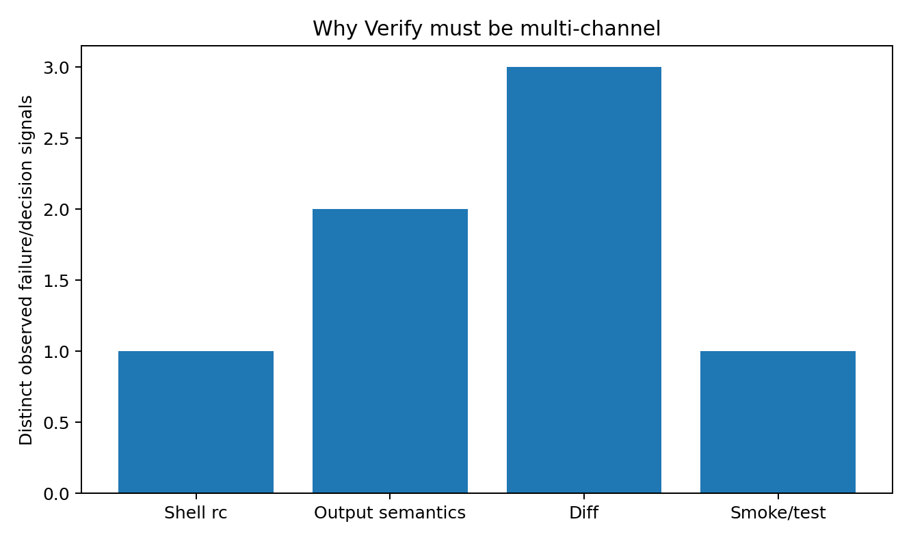

Figure 44. Distinct observer signals represented in the eight-command study: process status, output semantics, repository delta and smoke/test state. Bar heights summarize the recorded signal categories in the source analysis; they are not detection rates from an independent validation cohort.

### 22 5 Submission phase and repository state

The two POST_EDIT_VALIDATED tasks, sympy-24661 and sympy-13551, execute the recorded submit command: echo COMPLETE_TASK_AND_SUBMIT_FINAL_OUTPUT && git add -A && git diff --cached. Source remains unchanged and smoke checks stay green. Their compatible snapshots do not reconstruct Qwen’s earlier edit delta, so the staged diff is empty. This separates phase permission to submit from the presence of a task-relevant artifact to submit.

Submission eligibility therefore combines a validated task phase with an appropriate repository delta in the actual execution state. Phase modelling addresses the first; the environmental observer supplies the second.

### 22 6 Eight task execution matrix

Table 45. Eight task execution matrix.

| Task | Phase | Command side effect | Verification outcome |
| --- | --- | --- | --- |
| sympy-20154 | POST_EDIT_UNVERIFIED | Source unchanged | Test dependency blocked; smoke green; pipefail exposes rc = 4 |
| sympy-24562 | PRE_EDIT | Modifies numbers.py | Edit completed; smoke green |
| sympy-13757 | PRE_EDIT | Modifies polytools.py | Edit completed; smoke green |
| sympy-23950 | POST_EDIT_UNVERIFIED | Source unchanged | Inspection completed; smoke green |
| sympy-24661 | POST_EDIT_VALIDATED | Source unchanged | Submit shell completed; snapshot has no prior diff |
| sympy-13551 | POST_EDIT_VALIDATED | Source unchanged | Submit shell completed; snapshot has no prior diff |
| sympy-22914 | POST_EDIT_UNVERIFIED | Source unchanged | Temporary test artifact absent; equivalent fallback verification green |
| sympy-19346 | PRE_EDIT | Modifies repr.py | rc = 0 followed by failed import/smoke; verifier retains control |

*Source: real shell-command execution on compatible SymPy snapshots. rc is the process return code. Source mutation, test output and smoke verification are separate observation channels.*

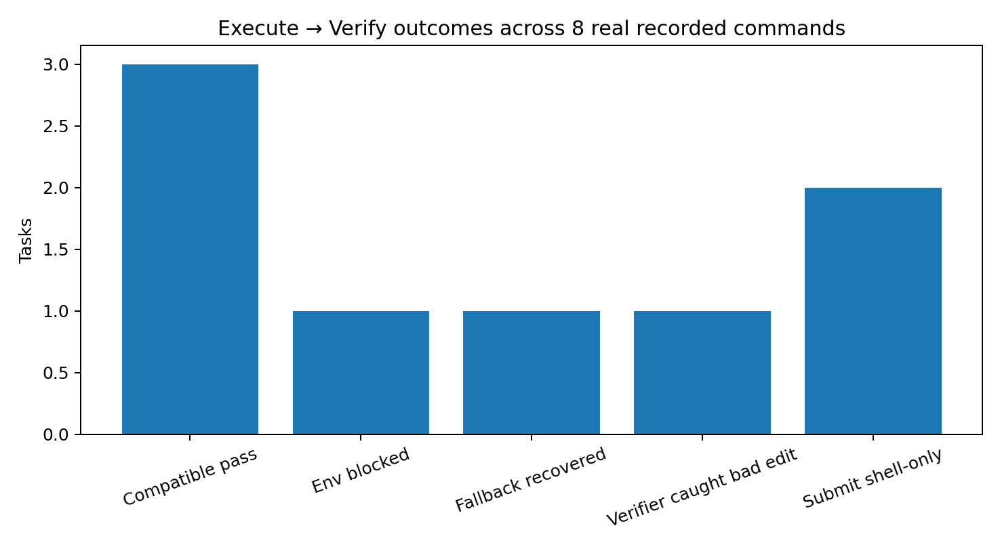

Figure 45. Observed outcomes of the eight real command executions: three compatible passes, one environmental block, one fallback verification, one bad edit detected by the verifier and two shell-only submission cases. These categories distinguish execution, environment, artifact and code state.

### 22 7 Adding an instrument panel

ASTIG-013A–D determines which route to take and how long to retain recovery control. ASTIG-013E measures what happens after the command meets an actual environment.

In task 19346, the command runs, changes a file and returns zero, while Python reports a syntax error. In task 20154, pytest fails but head masks its status. These examples show why both action consequences and their observation channels need explicit measurement.

The controller specification combines the replay-derived horizon with Execute→Observe→Verify feedback. At each step, observations determine whether phase advances, control is released, another candidate is selected or intervention is escalated. The horizon and observer have been tested in their respective replay and command-execution settings.

### 22 8 Recovery control with an environmental observer

1. Diagnose normal, warning or strong-loop work dynamics.

2. In a strong loop, withdraw recent exact commands through h = 4 cooldown.

3. Expand local candidates through k = 2, 4 and 8, then consult an eligible external episode when needed.

4. Assign role eligibility from observed phase and rank candidates within that role.

5. Maintain recovery control for up to five steps in the studied prescription, reading the environment after each step.

6. Read process status, output semantics, repository delta and smoke/test state. Use pipefail or equivalent upstream-status propagation for test pipelines.

7. Update phase when the environmental evidence supports the transition.

8. Release at a valid submission with appropriate repository/test state, or after recurrence clearance with a stable working state; otherwise retain the latch.

9. Escalate to reset, state reconstruction or a new plan when the horizon expires without a release condition.

The controller sequence is Detect → Cut → Expand → Phase → Role → Geometry → Execute → Observe → Verify → Update → Release, Continue or Escalate.

### 22 9 Evidence from real command execution

The eight-command study measures actual shell acceptance, source mutation, import and smoke results, missing dependencies, absent temporary artifacts and pipeline masking on compatible SymPy snapshots. It gives concrete environmental variables for deciding whether recovery control should persist.

Reconstructing the exact repository state at intervention is a requirement for an end-to-end use of this controller. The compatibility executions establish why prior edit delta, phase and current test state must accompany the selected command when the observer is applied to the original task environment.

## 23 MODE COLLISION 001 Layerwise statistical geometry

The next experiment treats the input as a symbol stream rather than using hand-coded semantic fields such as generate, send or execute. It measures surface code distributions and then the geometry of every layer in a controlled causal Transformer. The question is how mutually exclusive first-action labels appear within overlapping surface and internal representations.

### 23 1 Seventy hard switch minimal pairs

The cohort uses request_for_info items from When2Call MCQ. Each retains a question with necessary information removed and its original executable orig_question. These form 70 TEXT/ACT pairs, or 140 strings. Mean byte-level pair similarity is 0.8491 and the median 0.8515. Whole pairs are split into 56 training and 14 test pairs, preventing one member of a test pair from entering training.

### 23 2 Surface code distributions

Table 46. Surface code distributions.

| n-gram | TV distance | JS bits | Support Jaccard | Mass overlap |
| --- | --- | --- | --- | --- |
| 1 | 0.0402 | 0.0060 | 0.9076 | 0.9598 |
| 2 | 0.0949 | 0.0263 | 0.7976 | 0.9051 |
| 3 | 0.1576 | 0.0699 | 0.7488 | 0.8424 |
| 4 | 0.2009 | 0.1110 | 0.7025 | 0.7991 |

*Source: the 70-pair controlled model experiment. Values are descriptive measurements; layerwise probe and Fisher tables use three-seed means, while the spectral-rank table uses seed 7. Probability measures and ranks are unitless.*

Distributional differences increase from byte unigrams to four-grams, but substantial support and mass overlap remain. Unigram overlap is 95.98% and four-gram overlap 79.91%. On the pair-grouped held-out split, exact uncompressed byte unigram/bigram features have a between/within distance ratio of 0.9580, five-neighbour cross-mode mixing of 55.71%, linear-probe accuracy of 53.57%, nearest-centroid accuracy of 50.00% and Fisher ratio of 0.0166.

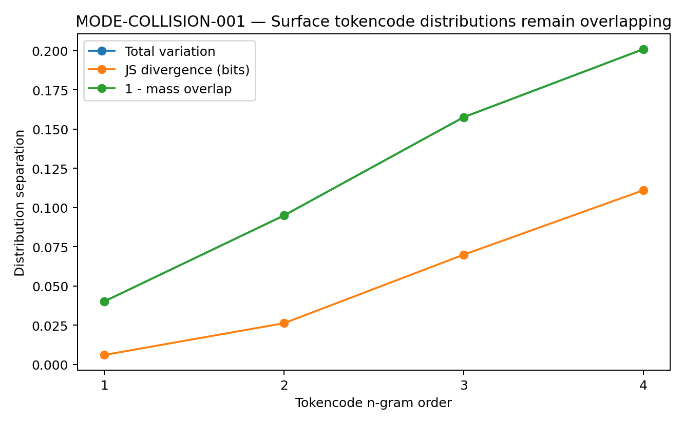

Figure 46. Surface-code distribution differences between the 70 TEXT and 70 ACT strings. Total variation, Jensen–Shannon divergence in bits and one minus mass overlap increase with n-gram order. Total variation and one minus overlap coincide by their definitions here. Points are descriptive corpus statistics.

### 23 3 An eight layer causal Transformer

The controlled model has eight layers, dimension 24, four heads and feed-forward width 64. Its only input is UTF-8 byte codes, with maximum length 128 and prefix/suffix preservation to retain information near sentence endings. A classification head reads the final prompt token. Geometry is measured on pair-grouped held-out data. Three training seeds assess layerwise readability; seed 7 additionally supplies full spectra and token-cloud dimensions. In the recovered scripts, seed 7 trains for 50 epochs under its stopping rule, while seeds 11 and 19 train for 40 epochs. The raw byte-count baseline uses the first 127 bytes; the Transformer preserves the first 80 and last 47 bytes when truncation is required. The layerwise results therefore retain their specific training and input conventions.

### 23 4 Final token decision state

Table 47. Final token decision state.

| Layer | Probe | Fisher | 5-NN cross mix |
| --- | --- | --- | --- |
| 0 | 0.6071 | 0.0513 | 0.5500 |
| 1 | 0.5952 | 0.0534 | 0.5524 |
| 2 | 0.6190 | 0.0580 | 0.5310 |
| 3 | 0.5714 | 0.0640 | 0.5452 |
| 4 | 0.6190 | 0.0720 | 0.5381 |
| 5 | 0.6190 | 0.0850 | 0.5143 |
| 6 | 0.6310 | 0.1104 | 0.5190 |
| 7 | 0.6310 | 0.1337 | 0.5048 |
| 8 | 0.6548 | 0.1508 | 0.5071 |

*Source: the 70-pair controlled model experiment. Values are descriptive measurements; layerwise probe and Fisher tables use three-seed means, while the spectral-rank table uses seed 7. Probability measures and ranks are unitless.*

The three-seed mean decision-state Fisher ratio rises from 0.0513 at Layer 0 to 0.1508 at Layer 8. Local cross-mode mixing stays near one half, while held-out linear-probe accuracy rises from about 60.7% to 65.5%. These metrics distinguish an increasingly readable mode direction from complete separation of local neighbourhoods.

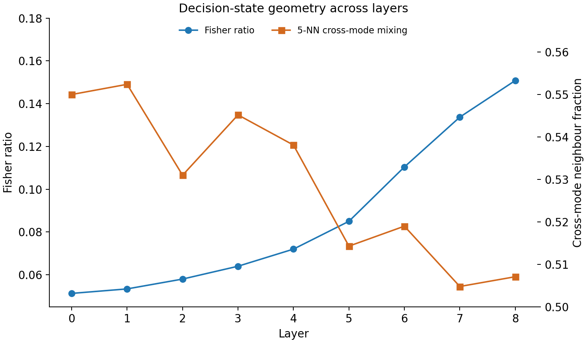

Figure 47. Decision-state geometry across the eight-layer model, including embedding Layer 0. Fisher ratio uses the left axis and five-neighbour cross-mode mixing the right. The table reports three-seed means. The mode-related displacement strengthens while neighbourhood mixing remains substantial.

### 23 5 Whole sequence representation

Table 48. Whole sequence representation.

| Layer | Probe | Fisher | 5-NN cross mix |
| --- | --- | --- | --- |
| 0 | 0.6310 | 0.0404 | 0.5833 |
| 1 | 0.6310 | 0.0388 | 0.5881 |
| 2 | 0.6429 | 0.0396 | 0.5738 |
| 3 | 0.6429 | 0.0438 | 0.5810 |
| 4 | 0.6786 | 0.0508 | 0.5667 |
| 5 | 0.6786 | 0.0614 | 0.5571 |
| 6 | 0.7024 | 0.0762 | 0.5571 |
| 7 | 0.6548 | 0.0934 | 0.5500 |
| 8 | 0.6310 | 0.1084 | 0.5476 |

*Source: the 70-pair controlled model experiment. Values are descriptive measurements; layerwise probe and Fisher tables use three-seed means, while the spectral-rank table uses seed 7. Probability measures and ranks are unitless.*

For the mean across token states, three-seed held-out readability increases from 63.10% at Layer 0 to 70.24% at Layer 6, then falls to 65.48% and 63.10% at Layers 7 and 8. Layer 6 still has 55.71% cross-mode mixing. The result identifies a transient intermediate-layer readability peak within overlapping geometry.

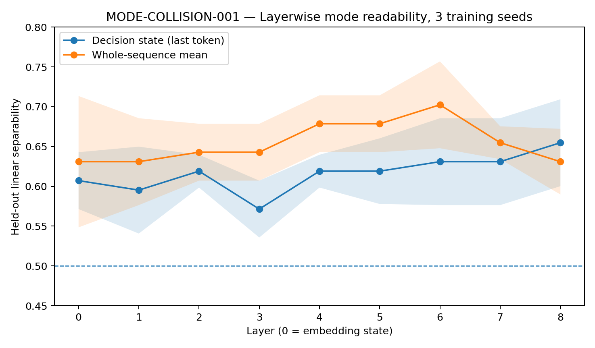

Figure 48. Held-out linear-probe accuracy by layer for the final-token decision state and whole-sequence mean. Curves are means across three seeds; shaded bands show mean ± one sample standard deviation across those seeds. The dashed line marks 50%. Whole-sequence readability peaks at Layer 6.

### 23 6 Layerwise dimensions and compression

Table 49. Layerwise dimensions and compression.

| Layer | Decision stable rank | Decision effective rank | Token-cloud stable rank | Token-cloud effective rank |
| --- | --- | --- | --- | --- |
| 0 | 2.789 | 8.884 | 7.197 | 19.267 |
| 1 | 3.094 | 9.624 | 7.361 | 19.105 |
| 2 | 3.500 | 10.211 | 7.427 | 18.223 |
| 3 | 3.817 | 10.363 | 7.239 | 16.837 |
| 4 | 3.829 | 10.053 | 6.061 | 15.201 |
| 5 | 3.811 | 9.279 | 4.727 | 13.476 |
| 6 | 2.892 | 7.605 | 3.416 | 11.411 |
| 7 | 1.853 | 5.127 | 2.320 | 8.480 |
| 8 | 1.417 | 3.222 | 1.695 | 5.532 |

*Source: the 70-pair controlled model experiment. Values are descriptive measurements; layerwise probe and Fisher tables use three-seed means, while the spectral-rank table uses seed 7. Probability measures and ranks are unitless.*

The seed-7 spectra show both expansion and compression. Decision-state effective rank increases from 8.884 at Layer 0 to 10.363 at Layer 3, then falls to 3.222 at Layer 8. Token-cloud effective rank declines from 19.267 to 5.532. Formation of a mode direction is accompanied by substantial changes in representation dimensionality.

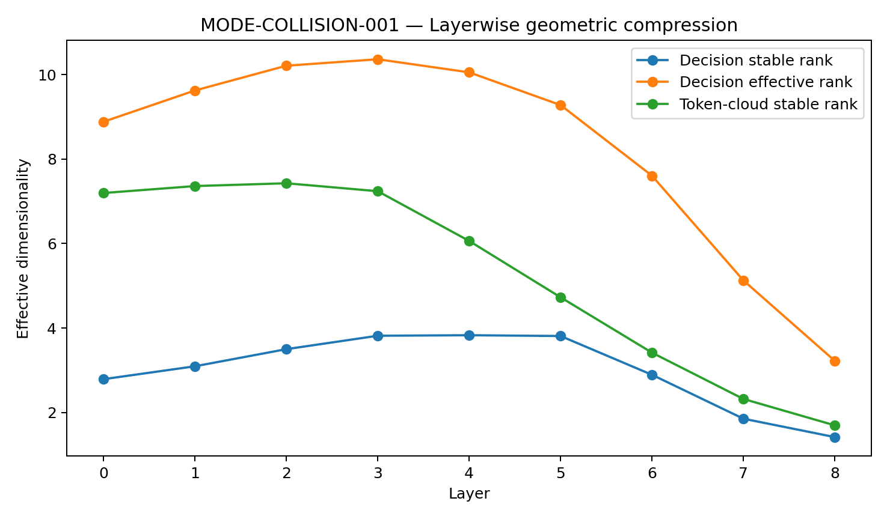

Figure 49. Layerwise stable and effective ranks from the seed-7 analysis. The plotted series are decision stable rank, decision effective rank and token-cloud stable rank; the table additionally reports token-cloud effective rank. These are descriptive spectral dimensions without uncertainty bands.

### 23 7 Layer dependent reorganization

The experiment establishes overlapping surface distributions, layer-dependent internal geometry, stronger late decision-state Fisher separation and an intermediate peak in whole-sequence readability. The measured local mixing remains substantial at every layer. Hard-switch information is therefore represented through changing geometry without requiring two isolated clouds.

This measurement protocol combines activation distances, neighbourhood mixing, within/between geometry, spectral dimensions, paired displacement and held-out readability. Their joint interpretation distinguishes a readable direction from a locally separated representation.

### 23 8 Evidence from the controlled model

The evidence consists of 70 real minimal pairs and a byte-trained eight-layer surrogate with measurements at every layer. It establishes a layerwise protocol and an initial mechanism test. The next experiment applies internal-state measurement and intervention to a fixed pretrained instruction model.

## 24 MODE CONTROL Targeted first action intervention

MODE-CONTROL shifts the question from readable separation to the smallest mode-related internal change that alters an actual first action. The intervention changes the TEXT/ACT component while preserving prompts, tools and task inputs; matched controls assess direction specificity. A preliminary run validates the measurement interface, followed by the original-cohort baseline and the final intervention study.

### 24 1 Pretrained model and measurement interface

The valid preliminary run fixes Qwen/Qwen2.5-1.5B-Instruct revision 989aa7980e4cf806f80c7fef2b1adb7bc71aa306. It has 1,543,714,304 parameters, 28 Transformer blocks and hidden dimension 1536. The recorded environment is macOS MPS, torch 2.13.0, transformers 5.16.1 and float32. Two provisional When2Call pairs, comprising four prompts, serve as engineering checks. The subsequent baseline uses the recovered original 70-pair cohort.

Table 50. Pretrained model and measurement interface.

| Engineering measure | Valid result | Interpretation |
| --- | --- | --- |
| Model | Qwen2.5-1.5B-Instruct · 1.5437B params | Complete forward evaluation of the pretrained model |
| Internal structure | 28 blocks · 1536D · 29 hidden-state positions | Layerwise decision states are available |
| Numerical finiteness | Hidden states and final logits finite for all four prompts | A valid numerical baseline for geometry and intervention |
| Hook agreement | first-block hook vs hidden_state[1] max abs error = 0 | The intervention hook matches the reported hidden-state position |
| Greedy repeatability | Repeated generation gives identical token IDs | Behaviour can be compared under fixed decoding |
| Runtime after caching | 16.162 s | Measured runtime of the bounded valid preliminary run |

*Source: the fixed pretrained-model cohort and intervention protocol in this section. Margins and control effects use the stated log-probability units; block indices are zero-based. Counts concern first-action behaviour.*

### 24 2 Numerical validation and the float16 failure

The first preliminary attempt used MPS/float16 and returned process status zero even though all four next-token logits and hook outputs contained NaNs; generation became 64 exclamation marks. Its original checks did not explicitly reject nonfinite values, and ordinary threshold comparisons with NaN failed to catch the problem. That attempt is invalid for scientific measurement. The valid retry preserves model revision, pairs, prompts and tokens, changes precision to MPS/float32, and explicitly requires finite hidden states, hook outputs and logits. All checks pass. Subsequent intervention measurements use this float32 finite-value gate.

### 24 3 Missing locations in the preliminary examples

All four valid preliminary continuations begin with a tool call. The two executable ACT requests enter the appropriate action mode. The two TEXT requests lack a necessary location, yet the model supplies “New York, USA” and “Denver, United States” and calls the weather tool. Their ACT counterparts specify Shanghai, China and Big Sur, CA. Thus ACT mode agreement is 2/2, TEXT agreement 0/2 and correct pair-level switching 0/2 in this engineering sample.

Table 51. Missing locations in the preliminary examples.

| Input variant | Expected first action | Observed first action | Result |
| --- | --- | --- | --- |
| ACT · pair 1 | Tool/ACT | Tool call · Shanghai, China | Correct |
| TEXT · pair 1 | Request info/TEXT | Tool call · invented New York, USA | Incorrect |
| ACT · pair 2 | Tool/ACT | Tool call · Big Sur, CA | Correct |
| TEXT · pair 2 | Request info/TEXT | Tool call · invented Denver, United States | Incorrect |
| Pair-level hard switch | Both variants follow their respective modes | 0 / 2 pairs | No correct pair-level switch in the two-pair check |

*Source: the fixed pretrained-model cohort and intervention protocol in this section. Margins and control effects use the stated log-probability units; block indices are zero-based. Counts concern first-action behaviour.*

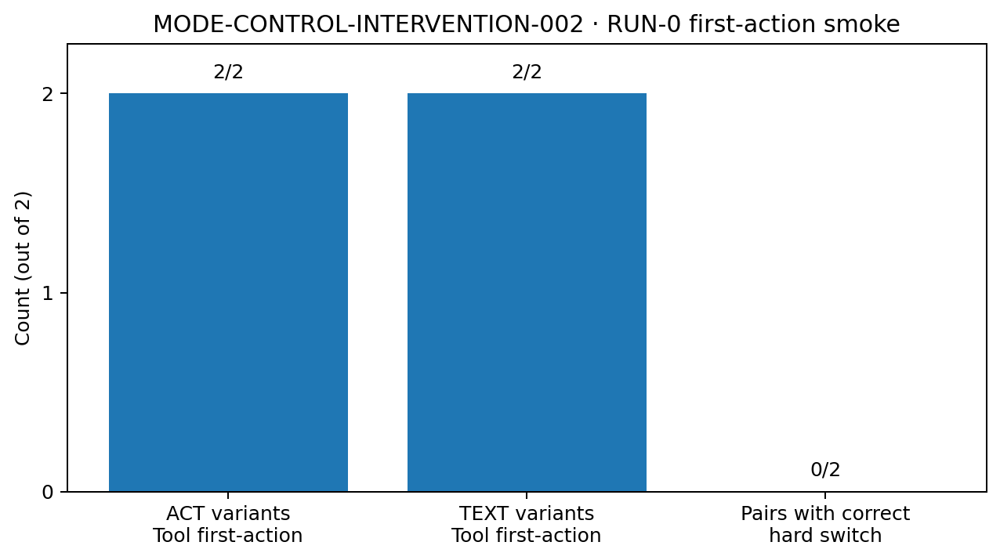

Figure 50. First-action outcomes in the two-pair preliminary run. Both ACT and both TEXT variants initiate tool calls. The chart reports counts of two ACT tool actions, two TEXT tool actions and zero correct pair-level hard switches. These are engineering-check observations.

### 24 4 Semantic completion and action eligibility

The weather examples supply a concrete behavioural target. The model readily enters Action mode, but when a required variable is absent it completes that variable itself instead of asking for it. Reading whether a hidden state contains weather, location or tool information would leave the control question unresolved. The relevant distinction is whether missing information withdraws action eligibility. A directionally targeted intervention can test this while holding the task input and tool schema fixed. Whole-layer replacement would move content and control together; a leave-one-pair-out mode direction with equal-norm orthogonal controls provides a more specific test.

### 24 5 Baseline layers of evidence

The preliminary run establishes stable hidden-state, hook and logit measurement under fixed greedy decoding. RUN-1 then supplies the original-cohort first-action baseline and paired score diagnostics. These measurements define the behavioural subgroups used by the completed geometry and causal-intervention analyses below.

### 24 6 Provenance of the original cohort

The original MODE-COLLISION-001 archive contains mode_collision_pairs.json with exactly 70 ordered pairs. Its analysis script reads each tuple as TEXT then ACT and assigns labels 0 and 1 respectively. The recovered JSON has SHA256 f4b4a11e6db8b75ab1d95157a7a1859d80d86a87ff7b6c0c7719613c87d20ffd. The archive SHA256 is 3d71961001a2cb995d2624c4f7ba6e3164dc23b2be71e1ab3ee509881af22621. RUN-1 preserves those strings and their ordering, establishing continuity with the initial mode-geometry study.

### 24 7 Original cohort first action baseline

RUN-1 fixes the recovered cohort, the same Qwen revision, MPS/float32, system instruction, pair-specific tool schema and greedy decoding. All 70 ACT prompts begin with tool calls. Of 70 TEXT prompts requiring information, 11 begin with a textual inquiry and 59 with a tool call. Correct pair-level switching is therefore 11/70 (15.7%), and inherited-mode agreement across prompts is 81/140.

Table 52. Original cohort first action baseline.

| Prompt variant | TEXT first | ACT first | OTHER | Inherited-mode agreement |
| --- | --- | --- | --- | --- |
| TEXT question | 11 | 59 | 0 | 11/70 (15.7%) |
| ACT original question | 0 | 70 | 0 | 70/70 (100%) |

*Source: the fixed pretrained-model cohort and intervention protocol in this section. Margins and control effects use the stated log-probability units; block indices are zero-based. Counts concern first-action behaviour.*

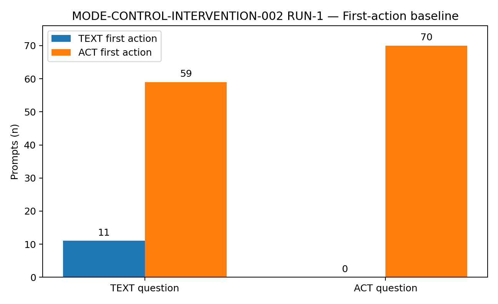

Figure 51. RUN-1 first actions for 70 TEXT and 70 ACT prompts. TEXT produces 11 textual first actions and 59 tool first actions; ACT produces 70 tool first actions. OTHER is zero in both groups.

The 11 correctly switching pairs are MC001-014, 015, 018, 019, 023, 025, 031, 041, 048, 068 and 069. Source order disambiguates duplicated text in MC001-031; MC001-038 has a unique source match with trailing whitespace. The source ACT reference for MC001-001 lacks the schema-required drink_id. These provenance exceptions are retained without modifying or excluding cohort members.

### 24 8 Paired preference changes after restoring information

For each prompt, teacher forcing scores its source TEXT answer and ACT-call reference. The reference margin is M_ref = L_ACT − L_TEXT. Because it depends on wording, length and content, it is interpreted as a paired diagnostic rather than a pure mode probability. Restoring information from TEXT to ACT increases the margin by a mean +0.574 and median +0.516, with positive shifts in 60/70 pairs (85.7%). The first-token margin increases by a mean +3.220, positive in 58/70 pairs (82.9%).

Table 53. Paired preference changes after restoring information.

| Diagnostic | TEXT mean | ACT mean | ACT−TEXT mean | Median shift | Positive pairs |
| --- | --- | --- | --- | --- | --- |
| Reference mean-logprob margin M_ref | +0.862 | +1.436 | +0.574 | +0.516 | 60/70 (85.7%) |
| Start-token margin | +8.935 | +12.155 | +3.220 | +2.119 | 58/70 (82.9%) |

*Source: the fixed pretrained-model cohort and intervention protocol in this section. Margins and control effects use the stated log-probability units; block indices are zero-based. Counts concern first-action behaviour.*

All 11 correctly switching pairs have positive ACT-minus-TEXT shifts in both diagnostics: mean +1.132 for the reference margin and +9.129 for the start-token margin. Among the other 59 pairs, the shifts are positive in 49/59 (83.1%) and 47/59 (79.7%) respectively. Missing information therefore changes relative action preference in most pairs, while the strong baseline ACT preference still carries many TEXT prompts across the actual tool-first boundary.

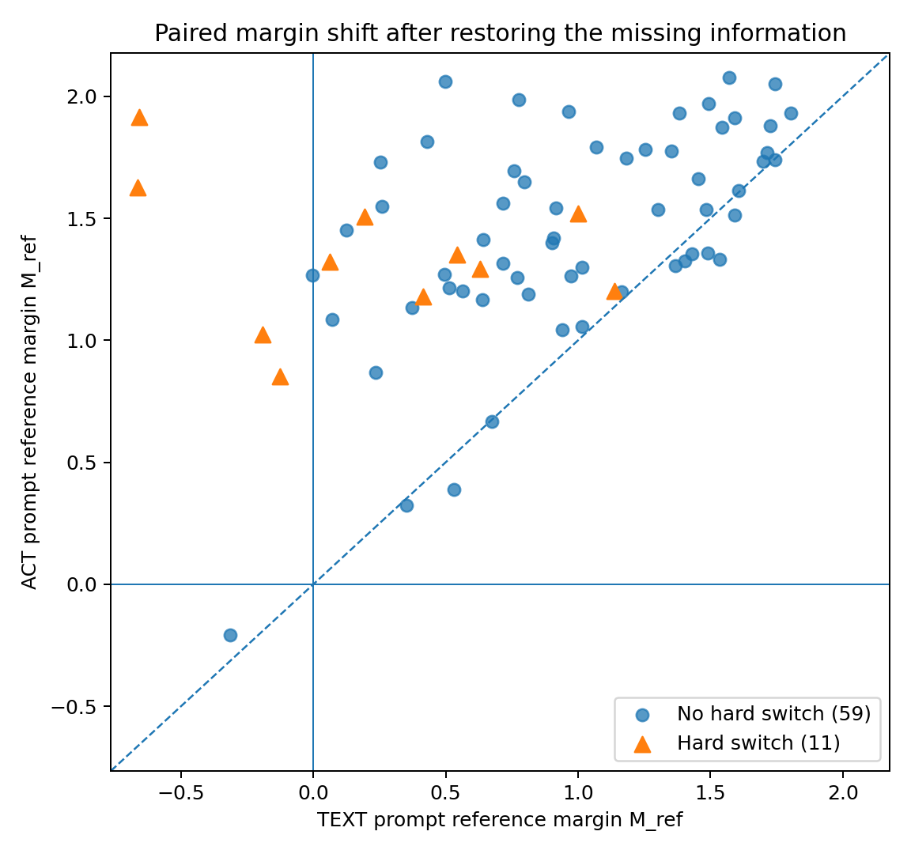

Figure 52. Paired reference margins before and after restoring missing information. The x-axis is the TEXT-prompt margin and the y-axis the corresponding ACT-prompt margin. Points above y = x shift toward ACT. Markers distinguish the 11 correctly switching pairs from the remaining 59; no regression fit or uncertainty interval is shown.

### 24 9 Raw logits and the generated first token

The baseline preserves a 140 × 151,936 float32 array of full final-position logits. All rows are finite, and the selected tool/text entries agree exactly with the baseline table. Raw argmax and generated first token agree in 133/140 prompts. All seven divergences lie among the 11 correct TEXT cases: raw logits favour the tool-call token, while generation chooses text. Four other correct TEXT cases have a text raw argmax. All 59 over-action TEXT and 70 ACT cases have agreement.

Table 54. Raw logits and the generated first token.

| Behavior group | Prompts | Raw argmax = generated first token | Raw argmax tool but generation TEXT |
| --- | --- | --- | --- |
| ACT prompt → ACT | 70 | 70 | 0 |
| TEXT prompt → ACT | 59 | 59 | 0 |
| TEXT prompt → TEXT | 11 | 4 | 7 |
| Total | 140 | 133 | 7 |

*Source: the fixed pretrained-model cohort and intervention protocol in this section. Margins and control effects use the stated log-probability units; block indices are zero-based. Counts concern first-action behaviour.*

These seven cases identify output processing as another measurable part of first-action arbitration. The final experiment reproduces the native generation path and locates the difference in its fixed repetition-penalty processor, as reported below.

### 24 10 The brake signal and permission to act

The two weather examples become a reproducible pattern in the 70-pair baseline. ACT requests consistently call tools. In 59 TEXT requests, required information has been removed but tool-first behaviour remains eligible.

Paired margins nevertheless change when the missing information is restored. The brake analogy captures this distinction: a signal can influence the system without obtaining enough authority to stop its first action at an inquiry. The layerwise and intervention analyses examine where that influence becomes readable and where it can change behaviour.

The 11 correct TEXT and 59 over-action TEXT cases provide a behavioural stratification within the same inherited input mode. Geometry that separates input labels supplies representational evidence. A direction that also changes an actual first action under targeted intervention supplies causal control evidence.

### 24 11 A hypothesis about discrete control states

The motivating interaction failures include continuing to chat when a tool action is required, acting before asking for missing information, explaining an action instead of executing it, returning from an agent workflow to conversation, and retaining an old action mode after completion or a phase transition.

In such observations, a model may correctly restate the task or missing condition while selecting an inappropriate behavioural mode. The proposed control variable concerns which mode is eligible now and how that eligibility persists across subsequent computation and environmental observations.

This motivates a structural hypothesis about hard switches such as ASK/ACT, TEXT/TOOL, WAIT/COMMIT and CONTINUE/STOP. Shared continuous representations can encode both alternatives; the task also requires a decision about which alternative may act. Intermediate mixtures have little value in some such tasks. The present fixed-model experiments test a specific instance of that hypothesis.

The completed intervention study identifies a selective mode axis that can change first actions in both directions. Within the tested model and cohort, the measured vulnerability is late, partial and reversible control: a later opposite intervention can counter the local correction. This refines the earlier hypothesis of an absent control interface into a measurable question about commitment strength.

The framework offers common variables for studying the motivating interaction failures: mode eligibility, commitment, persistence and switching. Extending it to other tasks or architectures calls for comparable behavioural and intervention measurements. Better generation within each mode and reliable selection between modes are separate evaluation targets.

The final experiment distinguishes information readability, first-action controllability and resistance to a subsequent counterintervention. The first two are established by geometry and targeted intervention; the reversal matrix supplies a specific perturbational measure of the third.

### 24 12 Final intervention design

The final study fixes Qwen/Qwen2.5-1.5B-Instruct revision 989aa7980e4cf806f80c7fef2b1adb7bc71aa306, MPS/float32, 28 blocks, hidden dimension 1536, the original 70 pairs, and the RUN-1 prompts, schemas and first-action classification rule. It combines geometry, leave-one-pair-out axes, all-block intervention, dose response, matched controls, greedy continuations, output arbitration and downstream reversal. Three single-block interfaces meet the specified criteria, identifying a causal control interface. The protocol’s conditional four-layer fallback is therefore not activated.

The outcome is the first TEXT/ACT action under this fixed contract, measured in continuations capped at 16 tokens. A TEXT rescue records a switch from tool form to text; the continuation length can precede a complete clarification question or complete tool JSON. The evidence establishes first-action control in this cohort. The top three blocks are selected from its exploratory all-layer sweep, so the selection and behavioural evaluation share the same cohort even though each pair’s axis excludes that pair.

### 24 13 Geometry of inherited mode and observed behaviour

For all 140 prompts, final-token and whole-sequence mean states are extracted at embedding level 0 and all 28 post-block levels. Final-token TEXT/ACT Fisher ratio rises from 0.0306 at level 1 to 0.1687 at level 24 and 0.2150 at level 28; pair-grouped probe balanced accuracy is 0.586, 0.679 and 0.693. Within TEXT prompts, the 11 ASK versus 59 OVER_ACT Fisher ratios are 0.1546, 1.3388 and 1.4394, with late probe accuracies 0.924 and 0.915. These are measures of behaviour-related readability; causal evidence comes from the intervention.

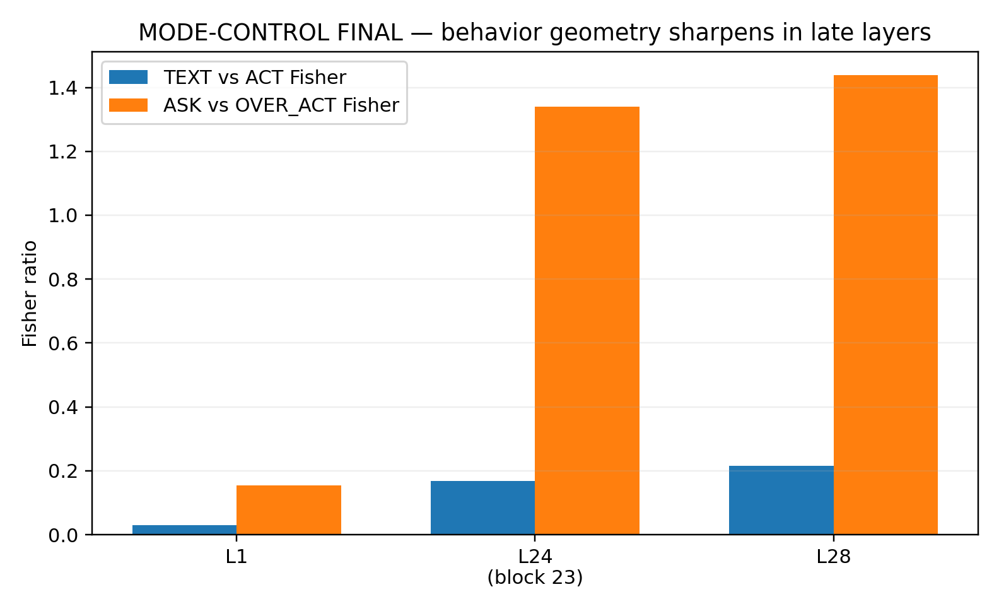

Figure 53. Final-token Fisher separation at levels 1, 24 and 28 in the pretrained model. Blue bars compare inherited TEXT/ACT labels; orange bars compare the observed ASK/OVER_ACT subgroups among TEXT prompts. Level 24 is the output of zero-indexed block 23. Bars reproduce summary measurements without uncertainty intervals.

### 24 14 Bidirectional causal control

The sweep covers 28 blocks × 70 pairs × two prompt variants × six nonzero doses (−2, −1, −0.5, +0.5, +1, +2), giving 23,520 full-vocabulary start-logit conditions. Each held-out pair’s direction is fitted from the other 69 pairs. Blocks 23, 22 and 21 are selected by the predefined C_l ranking before examining intervention generation outcomes. At block 23, the TEXT +1 arm has mean ΔM = +1.8733 with pair-bootstrap 95% CI [1.8062, 1.9471]; the ACT −1 arm has −1.8409 with CI [−1.8988, −1.7872]. Both arms move in the expected direction for 70/70 pairs. The bidirectional effect C_23 is 1.8571, CI [1.7979, 1.9126]. Blocks 22 and 21 have C = 1.8509 and 1.8110 and pass the corresponding direction and interval criteria. Here M is the tool-call versus source-TEXT-first-token logit margin; C averages the two effects after aligning their signs.

### 24 15 Direction specificity and collateral measurements

Table 55. Direction specificity and collateral measurements.

| Block | Mode C | Orthogonal control 95th percentile | Effective label-swap control 95th percentile |
| --- | --- | --- | --- |
| 23 | 1.8571 | 0.0262 | 0.1824 |
| 22 | 1.8509 | 0.0376 | 0.2765 |
| 21 | 1.811 | 0.0518 | 0.138 |

*Source: the fixed pretrained-model cohort and intervention protocol in this section. Margins and control effects use the stated log-probability units; block indices are zero-based. Counts concern first-action behaviour.*

Each candidate block uses 20 equal-norm orthogonal random directions and 20 effective within-pair TEXT/ACT label-swap directions. Block 23’s C = 1.8571 exceeds their 95th-percentile effects of 0.0262 and 0.1824; the other two blocks show the same pattern. Literal permutation of ACT partners leaves mean(ACT_perm − TEXT) unchanged, so it is recorded as an ineffective control diagnostic rather than counted as a separate valid null. Across all 23,520 interventions, maximum relative error in the preserved orthogonal component at the injection site is 1.09 × 10^−7, and median ||δ||/||h|| is 0.0342. These checks characterize the injected change at that site.

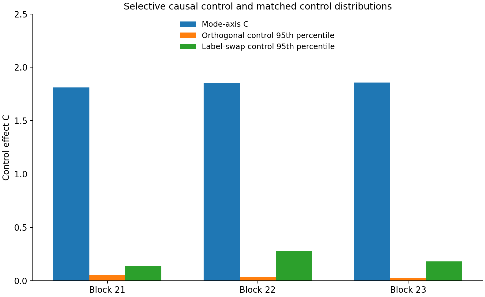

Figure 54. Bidirectional mode-axis effects and the 95th percentiles of two matched-control distributions for blocks 21–23. Mode effects exceed both orthogonal and effective label-swap controls. The control bars are distribution quantiles, not confidence intervals on the mode effect.

### 24 16 Observed first action changes

The three selected blocks, six nonzero doses and 140 prompts produce 2,520 greedy continuations. In the 59 baseline OVER_ACT TEXT cases, block-23 doses −0.5, −1 and −2 change 6, 9 and 18 first actions to TEXT. The corresponding counts are 4, 9 and 18 at block 22 and 4, 7 and 16 at block 21. The 11 original ASK cases remain TEXT at every negative dose in all three blocks. This measures selective first-action correction while preserving those existing TEXT decisions. The rescue endpoint is the initial output form within the 16-token continuation.

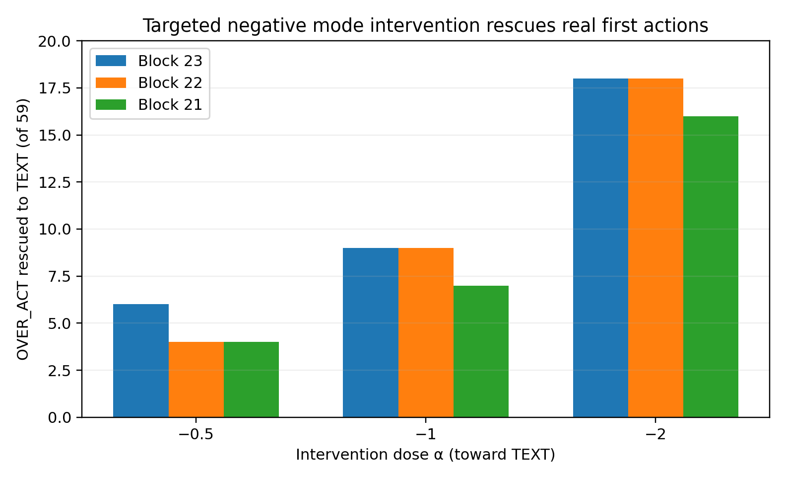

Figure 55. First-action rescues among all 59 baseline over-action TEXT cases. Bars show the counts at negative doses −0.5, −1 and −2 for the three preselected blocks. A rescue is a tool-first to text-first change in the observed continuation; it is not a count of completed clarification dialogues.

### 24 17 Generation time output arbitration

Native generate(output_scores=True, max_new_tokens=1) reproduces all 140 baseline first tokens. Its entire processed-score vector equals the original logits after RepetitionPenaltyLogitsProcessor(1.1), with maximum elementwise difference zero. Raw logits place the tool-call token first in 136/140 prompts; processed scores and observed generation do so in 129/140. This fixed processing step reproduces all seven raw-tool/actual-TEXT divergences. Raw margin and generated first action are therefore reported as separate outcomes.

### 24 18 Reversal by a later opposing intervention

Block 23 at α = −1 changes nine OVER_ACT cases to TEXT. Keeping the prompt and initial edit fixed, an equal-norm opposite mode intervention is then applied at a later block. Blocks 24, 25 and 26 each restore ACT in all nine rescued cases; block 27 restores ACT in five. Across all 59 baseline over-action cases, the corresponding ACT counts are 59, 59, 59 and 55. This is an imposed second intervention: it measures how readily the local correction can be counteracted at a later site, rather than spontaneous reversion during an otherwise unchanged forward pass.

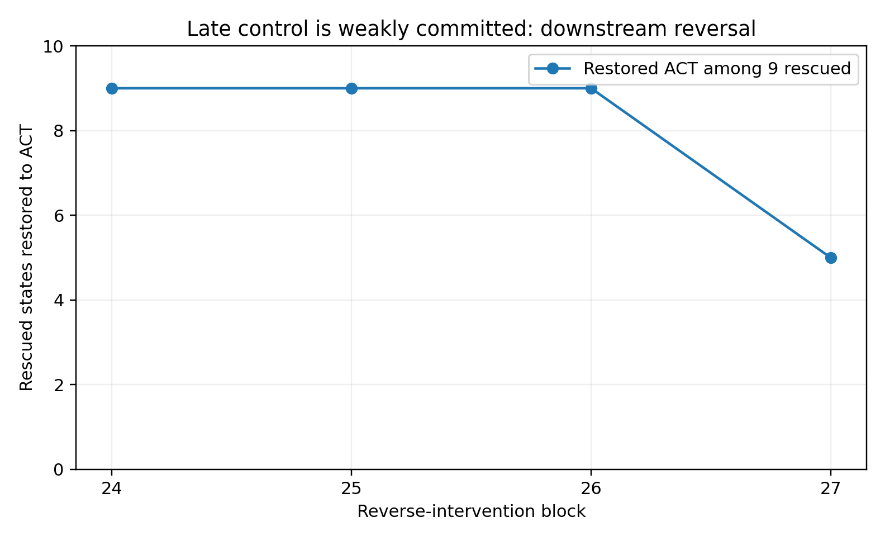

Figure 56. ACT restoration among the nine block-23 rescues after a second equal-norm opposite intervention. The restoration counts are 9/9 at blocks 24, 25 and 26 and 5/9 at block 27. The x-axis denotes the site of the second intervention. The curve is a perturbation-response measurement.

### 24 19 A late brake with a measurable opposing input

The causal result corrects the early suspicion that a shared continuous representation might lack any discrete mode-control interface. The baseline’s 59 over-action cases and overlapping mode clouds alone could not settle that question. Directionally specific intervention locates a residual-stream axis that changes the actual first action in both directions.

Its location and perturbational behaviour matter. The selected interfaces are late, at blocks 21–23. Block 23 corrects nine of 59 cases at α = −1 and 18 at α = −2. After the smaller correction, an opposite intervention in any of blocks 24–26 restores ACT in all nine. In the brake analogy, the brake exists and has measurable authority, while a later imposed opposing input can regain control of the first action.

This gives a more precise hypothesis for mode instability in broader agent work. Representation, a usable control axis and a successful local correction can all exist while commitment remains sensitive to later perturbation. A hard-switch evaluation can therefore measure both the ability to change a mode and the conditions under which that mode resists reversal.

### 24 20 Final mechanism result

Blocks 23, 22 and 21 satisfy the specified criteria: positive TEXT-to-ACT and negative ACT-to-TEXT mean effects with 95% intervals excluding zero; at least 70% pair-direction agreement in each arm; effects exceeding both matched-control families; observed rescue of over-action first actions; and the collateral checks. These results identify a causal control interface. This completes the experimental line’s local causal-interface test.

For this Qwen revision, cohort and first-action contract, the result is late, selective, causally effective control that is weakly committed under the tested reversal assay. Low-dimensional intervention changes observed first actions, and a later counterintervention can reverse the correction.

### 24 21 Evidence records

The final measurements are summarized in MODE_CONTROL_FINAL_summary.json and the experimental closeout record. The underlying experiment records include layerwise geometry, mode axes, intervention indices, dose response, rescue and generation results, matched controls, output arbitration and the reversal matrix. The accompanying evidence index distinguishes original measurement files available in this release from report tables and figures that document their summarized results.

## 25 Synthesis of perception and action control

The series begins with a measurement question about frequency, density, repetition and similarity, then follows it into control. A model must determine which information participates in its current working state, which candidates are eligible, which roles fit the task phase and how a selected mode responds to later computation or environmental input. The experiments connect these questions through explicit measurements.

### 25 1 Calibrating observation

ASTIG-001–010 measures local clustering beyond global frequency and separates Exposure, Role, Topology and Geometry corrections. Repeated observations retain information with sublinear gain. Control roles, candidate connectivity and local scale receive distinct treatments. In the pooled 18-trajectory calibration, the working setting is content near c^0.5, role near c^0.7, two relevant historical states and geometry strength near one.

At 16× repetition of irrelevant old history, raw decisions change in 61.96% of eligible states, compared with 9.78% after correction. The result identifies an interference mechanism in which preserved old information gains excessive current influence through exposure.

### 25 2 Representing state and assigning action eligibility

In the agent studies, strong loops retain locally predictable structure. Across 300 gate-positive states, Local-Corrected action accuracy is 53.67% and Raw accuracy 21.67%. Representation utility and productive progress are therefore separate measured properties.

The recurrence gate alerts in all eight loop tasks. Four-command cooldown intercepts 291/300 recorded recurrence edges. Same-task donor traces supply progression exits for every state, and phase analysis establishes at least 76 premature choices among 97 stage-blind Submit selections. In controlled replay, up to five phase-aware donor steps bring all 300 states to recorded Submit or gate clearance.

Real command execution then supplies the observer variables needed to interpret action consequences: process status, output semantics, repository delta and smoke/test state. The resulting control specification diagnoses regime, assigns execution eligibility and updates state from environmental evidence.

### 25 3 Mode geometry and first action control

The 70 minimal pairs have 95.98% unigram and 79.91% four-gram surface overlap. The controlled eight-layer model develops stronger decision-state Fisher separation and an intermediate whole-sequence readability peak while retaining substantial neighbourhood mixing. A mode can become readable without two isolated representation clouds.

The pretrained baseline sharpens the control question: all 70 ACT prompts call tools, while 11 TEXT prompts inquire and 59 call tools. Paired scores usually move further toward ACT when missing information is restored. Information about the prompt difference influences preference, but the influence does not reliably select the required first action in this cohort.

### 25 4 A selective causal interface and its reversal response

The complete sweep has 23,520 nonzero interventions across 28 blocks. Each pair’s axis is fitted on the other 69 pairs. Blocks 23, 22 and 21 pass the specified bidirectional control criteria. At block 23, C = 1.8571 and all 70 pairs move in the expected direction in each arm.

Equal-norm orthogonal and effective label-swap controls have block-23 95th-percentile effects of 0.0262 and 0.1824. Actual generation also changes: nine of 59 over-action cases become TEXT at α = −1 and 18 at α = −2. The 11 original ASK cases retain TEXT under negative doses.

A second opposite intervention at blocks 24–26 restores ACT in all nine α = −1 rescues; block 27 restores five. This establishes both local causal control and susceptibility to a defined downstream perturbation. The latter is the operational sense of weak commitment in this study.

The final mechanism is late, selective and causally effective first-action control with limited resistance to the tested opposing intervention.

### 25 5 Distinct variables along the control chain

The experiments identify the following relationships that require separate measurement.

- Exposure count and effective importance.

- Statistical similarity and permitted connectivity.

- Local relevance and present execution eligibility.

- Candidate availability and current phase permission.

- Command completion and environmental verification.

- Readable mode information and causal mode control.

- An established mode correction and resistance to subsequent counterintervention.

Across these levels, the existence of a statistical relation supplies information, while present action eligibility requires an additional rule. The framework treats Observation, Representation, Eligibility, Commitment and Environmental Verification as distinct state variables with measurable connections.

Observation → Representation → Eligibility → Commitment → Environment Verification

### 25 6 Application to decision making agents

The direct evidence concerns the specified public trajectories, original hard-switch cohort and fixed Qwen revision. Within those settings, mode-related information, an intervenable control direction and inappropriate first actions can coexist. The measurements distinguish these properties instead of treating them as one overall ability score.

The framework supplies testable variables for agent behaviours such as continued conversation when action is required, action before clarification, return to an earlier mode, or failure to stop after completion. Each can be examined through eligibility, commitment and persistence measurements under its own task contract.

### 25 7 Engineering interpretation of the pretrained result

The final causal experiment establishes that the tested Transformer forms a low-dimensional, selective mode-control interface in late layers. A directionally targeted change is sufficient to alter actual first actions.

Its measured commitment is sensitive to opposing perturbation: the selected late interface corrects a subset of over-action cases, and nearby later blocks can reverse that correction when explicitly intervened upon. This identifies a concrete property for architecture and controller comparisons.

The experiment completes a positive mechanism test of a local control interface and quantifies its reversal response. Its scope is the fixed first-action contract and cohort.

### 25 8 Evidence across the study

Table 56. Evidence across the study.

| Stage | Finding | Representative evidence |
| --- | --- | --- |
| Surface language statistics | Repetition, clustering and role mixing affect effective statistical mass | Exposure/Role correction; raw versus corrected 16× old-history flip rates 61.96% and 9.78% |
| Relational geometry | Candidate connectivity and similarity require separate treatment | Topology and Geometry separate candidate edges from local scale |
| Agent dynamics | Local information can remain usable within recurrent work | Gate detects 8/8 loops; Local-Corrected 53.67% versus Raw 21.67% |
| Action eligibility | Recent commands, external candidates and task phases have distinct control roles | Four-command cooldown 97%; 300/300 progression candidates; at least 76/97 premature stage-blind submissions |
| Recovery and verification | An escape edge and diagnostic recovery have different timescales | Five-step replay release 300/300; multichannel execution observer |
| Hard-switch representation | TEXT/ACT readability develops within overlapping geometry | High surface overlap; intermediate readability peak; persistent neighbourhood mixing |
| Pretrained behaviour | Tool-first behaviour persists in many prompts missing information | ACT 70/70; TEXT 11/70 ASK and 59/70 OVER_ACT |
| Causal control | A selective late mode axis changes first actions and can be counteracted | Block 23 C = 1.8571; 18/59 rescues at α = −2; later reversal in 9/9 α = −1 rescues |

*Source: the experiment-specific records identified in the table and Appendix A. Evidence types and sample sizes remain separate.*

### 25 9 Conclusion

The study connects surface-language statistics, working-context geometry, agent recurrence, action eligibility, phase control, environmental verification and a pretrained model’s causal first-action interface. Corrective optics becomes a measurement-and-control method: characterize the representation, determine candidate eligibility, test the persistence of control and use environmental observations to establish what the action accomplished.

## Appendix A Data sources and experiment records

- ASTIG-011 uses public mini-SWE-agent traces for GPT-5-mini, DeepSeek-v4-flash and Qwen-2.5-7B from SWE-Xplorer-Experiments. Working language is all assistant prose preceding the bash block.

Table 57. Appendix A Data sources and experiment records.

| Source | Use in this study |
| --- | --- |
| Research-conversation code samples | ASTIG-001–003 surface distributions, permutations, exposure and control roles |
| SWE-bench experiments verified/20250522_sweagent_claude-4-sonnet-20250514 | ASTIG-004 Claude 4 Sonnet action trajectories |
| SWE-Xplorer-Experiments GPT-5-mini OpenCode trajectories | ASTIG-005–006 and 008–010 recorded reasoning, messages, tool actions, cumulative context, calibration and stress tests |
| scikit-learn Iris, Wine, Breast Cancer Wisconsin and Digits | ASTIG-007 numerical Geometry/Topology relation probes |
| ASTIG-010 analysis records | Sequential results, stress curves and summary; Figures 16–19 |
| ASTIG-012A independent matched cohort | Ten tasks × three models; gate outcomes, threshold sweep and summary; Figures 23–25 |
| ASTIG-012B independent action-state decoder | The same cohort; 512-dimensional hashed states and task-held-out weighted kNN; model results, Qwen parameter sweep and summary; Figures 26–28 |
| ASTIG-013A records | Cooldown sweep, task interception, Submitted controls and summary; Figures 29–31 |
| ASTIG-013B records | Candidate expansion, unseen commands and progression-role availability; task results and summary; Figures 32–34 |
| ASTIG-013C records | Phase calibration, phase counts, role availability and premature-submit bounds; summary and reproduction script; Figures 35–38 |
| ASTIG-013D records | Sparse-cosine ranking, one-step persistence and one- through five-step replay; task results, robustness, horizon tables and summary; Figures 39–42 |
| ASTIG-013E records | Eight-command compatibility execution; execution matrix, summary and observer results; Figures 43–45 |
| MODE-COLLISION-001 records | Seventy When2Call minimal pairs; byte distributions and eight-layer Transformer geometry; layerwise tables, spectra, three-seed summaries and analysis scripts; Figures 46–49 |

*Source: the experiment-specific records identified in the table and Appendix A. Evidence types and sample sizes remain separate.*

Public trajectory source: https://github.com/SWE-bench/experiments

Public matched-trace source: https://github.com/mahirlabibdihan/SWE-Xplorer-Experiments

MODE-CONTROL preliminary run: fixed Qwen revision, two provisional pairs and four prompts; MPS/float32 hidden-state, hook and logit checks. The valid run is RUN-0-20260930-002. The float16 attempt is excluded from scientific estimates because of nonfinite values.

Original-cohort provenance: 70 ordered pairs recovered from mode_collision_pairs.json in the initial archive. Its SHA256 is f4b4a11e6db8b75ab1d95157a7a1859d80d86a87ff7b6c0c7719613c87d20ffd.

MODE-CONTROL RUN-1: 140 original-cohort prompts; first-action baseline, teacher-forced paired margins and 140 × 151,936 start logits. Seven raw-argmax/generation divergences occur among the correct TEXT cases.

MODE-CONTROL FINAL: 23,520 nonzero all-block interventions; three qualifying blocks; matched controls, 2,520 continuations, generation arbitration and a 236-cell reversal assay. The accompanying evidence index gives the release’s file-level coverage and provenance.

## Practical reading of the evidence

For an agent application, record the current observation, task phase, eligible candidates, selected action, process result and verified environment change as separate fields. Evaluate loop detection separately from next-action prediction. Test a cooldown only after defining the repeated-command gate, and measure collateral effects on normal work. A recovery release rule should state which environment observations establish progress. For internal steering, report the dose, injection site, control directions and actual first-action changes alongside the score shift. These are measurement choices supported by the experiments; their operating thresholds require validation in the target system.

## Evidence availability

The accompanying evidence index distinguishes recovered experiment files from tables transcribed from this report. ASTIG-012A–013E and MODE-COLLISION-001 include recovered numerical outputs. MODE-CONTROL includes baseline measurements and the final summary. The earlier ASTIG row-level analyses and the final intervention CSV/NPZ records were not among the recovered files for this edition. Their reported aggregate tables and supplied figures remain available and are labelled accordingly. External raw datasets, request pairs and trajectory text are not redistributed.

Some hypotheses developed in this research have received substantive validation through engineering implementations. Data models are forthcoming.
