# Internal Motion and Assembly in Neural Models

[Chapter 7](../README.md) · [Word report](01_Internal_Motion_and_Assembly_in_Neural_Models.docx) · [Evidence index](EVIDENCE_INDEX.md)

Data-Oriented Modelling · Chapter 7 · Report 1

## Overview

We followed internal states through trained neural models and measured how their geometry changed. The resulting picture is a computation made of moving, interacting parts: directional state changes, relative fragment registration, identity-specific coupling and a later handoff to the output. The experiments progressively sharpen this picture. Parameter decomposition identifies coupled rotation and deformation. Matched fragments reveal how relative geometry becomes organized. Training replay locates the emergence of functional identity, and continuous shape constraints separate rigid transport from deformational steering.

## Question and experimental setting

How do learned parameters produce the internal objects that a model moves and combines during a computation? The central assay uses an eight-layer causal Transformer with hidden width 24, four attention heads and feed-forward width 64. Seventy paired TEXT and ACT prompts are split into 56 training pairs and 14 held-out pairs. Fragment-specific assays use the 67 pairs meeting the minimum fragment-size rule, comprising 54 training and 13 held-out pairs. A separate pretrained instruction-model cohort supplies the directional-control observations.

## Terms used in this report

**Table 1. Terms used in this report**

| Term | Meaning in the experiments |
| --- | --- |
| State trajectory | A sequence of hidden states across network depth. |
| Fragment | A group of prompt-conditioned token states whose identity and relations can be measured. |
| Shared fragment S | Token positions shared by the two members of a matched prompt pair. |
| Delta fragment D | Changed or inserted positions distinguishing the paired prompts. |
| Decision state Y | The final non-padding token state used by the classifier. |
| Registration | Relative alignment measured between fragments. |
| Cycle closure | Agreement between composed and direct relative maps. |

## 1  Coupled parameter and state motion

We first separate the motion of a hidden state during inference from the change of the operators learned during training.

*Experiment ROTATIONAL-DYNAMICS-001 and 002*

### Question

Does the internal trajectory behave like a directional motion across depth, and can learned Q/K/V/O matrices be decomposed into functionally distinct rotational and stretch components?

### Model and data

- Exact MODE-COLLISION-001 controlled causal Transformer

- 8 blocks, hidden width 24, 4 attention heads, FF width 64

- 70 real TEXT/ACT minimal pairs = 140 strings

- 56 pairs train / 14 held out

- seed 7

- trained baseline: train accuracy 1.000; held-out accuracy 0.5714

### State trajectory result

For every string, the last-token hidden state was recorded at embedding output and after every Transformer block, yielding a 9-point trajectory in 24 dimensions.

Across 140 trajectories:

- mean top-2 SVD energy = 0.9841

- median top-2 SVD energy = 0.9864

- mean phase-direction coherence in each trajectory's fitted 2D plane = 1.000

- layer-order permutation null mean = 0.3506

- 96.43% of trajectories exceeded their permutation null at p < 0.05

- mean successive turning angle = 0.4067 rad (~23.3 degrees)

- turn-sign consistency = 0.8867, vs null 0.6930

The observed layerwise paths therefore occupy an unusually low-dimensional plane and traverse that plane in a strongly order-dependent direction. This supports a real rotational description of state motion rather than a static cloud-only description.

### Shared dynamic mode test

A single linear transition operator was fitted on all train-pair layer transitions and tested on held-out pairs.

- held-out R² = 0.9744

- complex-eigenvalue fraction = 0.8333

- mean absolute phase of complex modes = 0.0754 rad

- shuffled-transition null mean R² = -0.0856

- empirical null p = 0.0244

However, an identity-plus-mean-shift baseline already achieves R² = 0.8900, reflecting residual-network continuity. A scalar-identity baseline reaches 0.8996; adding a rotation raises this only to 0.9075, while a stretch-only map reaches 0.9384 and the full linear map reaches 0.9744. Thus the shared dynamics contain genuine rotational components, but rotation alone is not the dominant complete explanation.

### Layerwise transition maps

Across the eight transitions, held-out mean R² values are:

- identity: 0.9247

- scalar identity: 0.9345

- scaled rotation: 0.9335

- stretch-only: 0.9620

- full linear map: 0.9893

Early layers gain modestly from the rotational factor beyond scalar identity; late layers require increasingly strong non-rotational deformation. The fitted deviations from identity contain nearly balanced antisymmetric and symmetric components (mean antisymmetric fraction 0.4687).

### Parameter polar decomposition

Every square attention matrix Q, K, V and O was decomposed as W = R S, with R orthogonal and S symmetric positive semidefinite. Initial and trained factors were then recombined.

Across 32 matrices:

- rotation-only hybrid relative error to trained W: 0.8351

- stretch-only hybrid relative error: 0.8014

- rotation-only was closer for 28.1% of matrices

- mean learned rotation magnitude: 0.2524 rad

- mean stretch log-RMS change: 0.2988

By matrix family, Q is the notable exception: preserving learned rotation and restoring initial stretch is slightly closer to trained Q than preserving learned stretch with initial rotation. K, V and O lean toward the stretch component.

### Causal hybrid test

With all other trained parameters held fixed, all Q/K/V/O matrices were replaced by polar hybrids:

- trained baseline held-out accuracy: 0.5714

- learned rotation + initial stretch: 0.5357; train 0.9375

- initial rotation + learned stretch: 0.6071; train 0.9732

- fully restored initial Q/K/V/O: 0.5000; train 0.8750

The current controlled evidence therefore supports coupled rotational and deformational parameter mechanics, not a pure rotation-only account. The natural explanatory unit is larger than a scalar weight. The executed data support treating parameter blocks as transformation operators and separating their motion into operational components. Internal state trajectories can be highly rotational even when the parameter update that generates them combines rotation with strong stretch/deformation.

### ROTATIONAL DYNAMICS 002 Parameter motion through training

### Question

Is the rotational factor merely an algebraic decomposition of the final matrix, or does it itself move coherently during learning?

### Design

The same controlled model was retrained with seed 7. Q/K/V/O polar factors were frozen at epochs:

0, 1, 2, 5, 10, 20, 30, 40, 50. For each matrix, the rotational distance and stretch distance from initialization were tracked. The observed chronological path was compared with 300 random permutations of the intermediate checkpoints while keeping the same start and end states.

### Result

Across 32 Q/K/V/O matrices:

- final mean rotation from initialization = 0.2524 rad

- final mean stretch displacement = 0.2244 relative units

- rotational path efficiency = 0.5732

- shuffled-order rotational efficiency = 0.2284

- all 32 matrices had chronological rotational-path p < 0.05

- stretch path efficiency = 0.6390

- shuffled-order stretch efficiency = 0.2489

- all 32 matrices also had chronological stretch-path p < 0.05

Mean rotation from initialization progressed:

- epoch 1: 0.0484 rad

- epoch 5: 0.1040

- epoch 10: 0.1612

- epoch 20: 0.2060

- epoch 30: 0.2310

- epoch 40: 0.2376

- epoch 50: 0.2524

The corresponding stretch displacement also increased smoothly from 0.0241 at epoch 1 to 0.2244 at epoch 50. The rotational factor is not merely a retrospective factorization artifact. During optimization it follows a coherent chronological path that is substantially shorter and more directed than random reorderings of the same checkpoints. The same is true for the stretch factor. In this controlled model, learning therefore moves parameter operators through a coupled trajectory with both angular and deformational components.

The strongest supported statement is:

A trained parameter matrix is usefully treated as a moving transformation operator. Its learning trajectory contains a coherent rotational component, while stretch/deformation evolves alongside it and remains functionally important. This is materially different from interpreting individual scalar weights as isolated explanatory units.

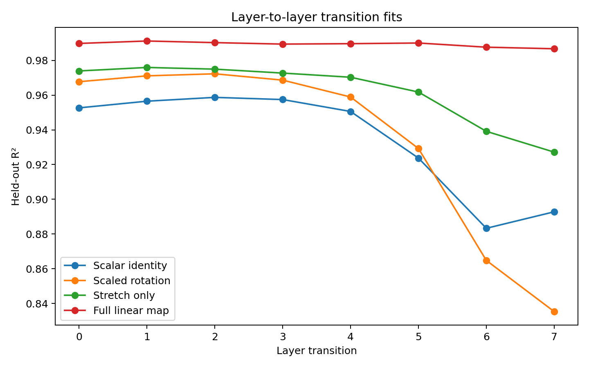

**Figure 1.** Layer transition fits. Controlled eight-layer Transformer. The panels compare transition fits, polar factors and their training trajectories. Source: ROTATIONAL-DYNAMICS-001 and 002.

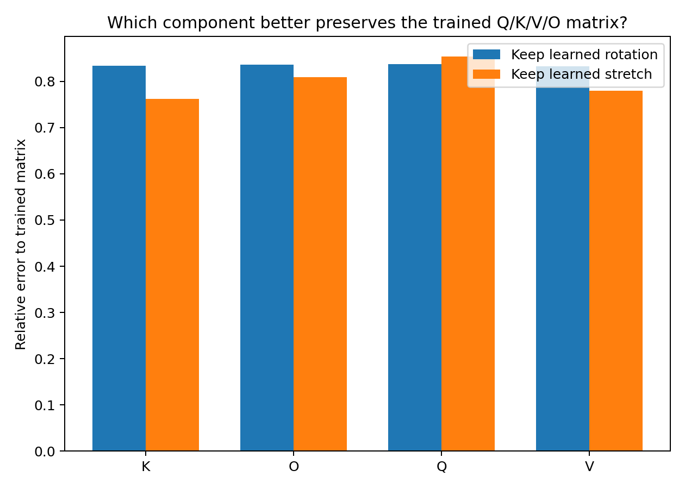

**Figure 2.** Parameter polar decomposition. Controlled eight-layer Transformer. The panels compare transition fits, polar factors and their training trajectories. Source: ROTATIONAL-DYNAMICS-001 and 002.

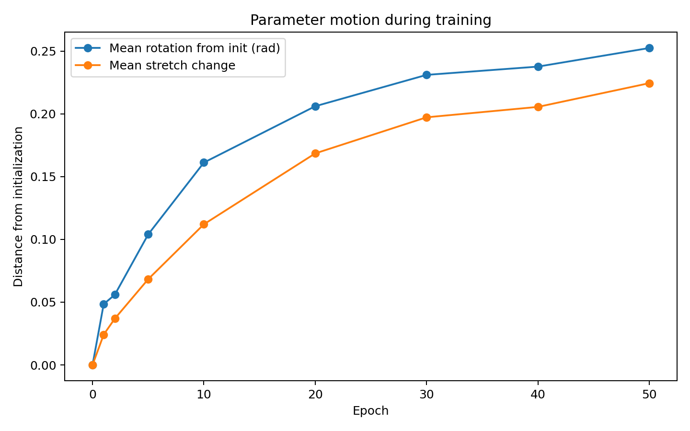

**Figure 3.** Parameter motion training. Controlled eight-layer Transformer. The panels compare transition fits, polar factors and their training trajectories. Source: ROTATIONAL-DYNAMICS-001 and 002.

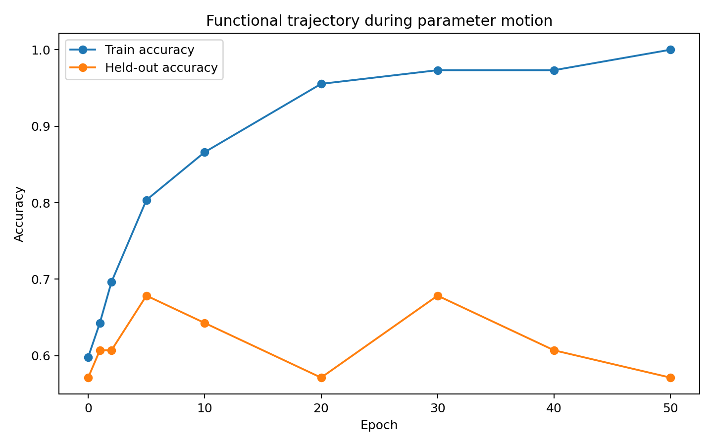

**Figure 4.** Training performance. Controlled eight-layer Transformer. The panels compare transition fits, polar factors and their training trajectories. Source: ROTATIONAL-DYNAMICS-001 and 002.

## 2  Directional alignment and its behavioral effect

The next question is which directions matter to the output. Paired prompts and orientation-preserving controls give that question a causal test.

*Experiment ROTATIONAL-DYNAMICS-001A to 001C*

Reanalysis of the pretrained 1.5 billion parameter instruction model hard-switch cohort shows that matched TEXT→ACT displacement directions become increasingly coherent with depth. Mean paired-displacement cosine rises from 0.211 at level 1 to 0.466 at level 24 and 0.478 at level 28. By level 24, 95.5% of the eventual alignment gain is already present, while only 74.9% of the eventual Fisher-separation gain has accumulated. This supports an alignment-first, separation/commitment-later sequence rather than treating directional coherence and class separation as the same event.

The late direction is causal rather than a passive readout. Blocks 21–23 pass the frozen bidirectional intervention gate; block 23 reaches control score C=1.8571, approximately 70.9× the equal-norm orthogonal-control 95th percentile. An opposite-direction intervention at blocks 24–26 restores ACT in 9/9 rescued states. The causal direction is therefore actionable but dynamically contestable.

### ROTATIONAL DYNAMICS 001B output anchored backward alignment trace

In the exact controlled Transformer, matched pair displacements progressively rotate toward their own terminal orientation. Mean cosine to terminal direction follows 0.195 → 0.289 → 0.375 → 0.471 → 0.587 → 0.730 → 0.868 → 0.966 → 1.000 across embedding plus eight blocks. The median remaining angle falls from 79.7° to 0°. 88.6% of pairs reduce terminal angle at every transition, and 90–100% turn toward their terminal orientation at each individual transition.

The motion is mainly tangential rather than simple radial growth: the mean tangential fraction of stepwise change energy is 0.777, 0.780, 0.859, 0.898, 0.885, 0.839, 0.840, 0.905 across the eight transitions. Pair-displacement trajectories remain almost planar (mean top-2 energy 0.9803). Training pairs also rotate into the learned output-head axis: mean cosine rises from 0.078 to 0.962. Held-out pairs can follow a coherent terminal-directed path while still ending poorly aligned to the trained readout (final mean head cosine 0.118, held-out accuracy 0.5714). Internal trajectory coherence and external readout compatibility are therefore separable.

### ROTATIONAL DYNAMICS 001C orientation only causal intervention

Orientation was then changed while preserving pair midpoint and ACT–TEXT separation norm. At the embedding output, the unmodified model has training pair margin 12.054 and training accuracy 1.000. Rotating fully away from the terminal direction (α=-1) drives the mean margin to −1.872 and accuracy to 0.429; α=-0.5 gives margin 6.759, accuracy 0.795. A half-turn toward the terminal direction (α=+0.5) gives margin 12.186, accuracy 1.000, while forcing the full endpoint orientation too early (α=+1) gives margin 10.597, accuracy 0.946. Equal-angle random-plane turns are less specific.

This is important for the current mechanism model: the useful object is not merely the final orientation. The model follows an ordered transformation schedule. A correct endpoint forced too early is not equivalent to following the learned sequence of local transformations.

### Unified parameter to behavior chain

The consolidated evidence now supports the following working chain:

parameter-operator motion → low-dimensional state motion → fragment formation → directed relative registration → cycle closure → output-compatible region → behavioral commitment.

The arrows are not equally established.

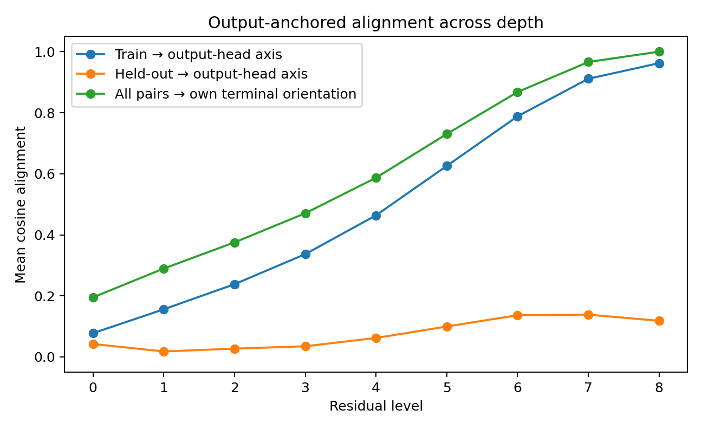

**Figure 5.** Output anchored alignment. Controlled matched-prompt study. Directional alignment, tangential movement, training coadaptation and orientation intervention are evaluated along the same model lineage. Source: ROTATIONAL-DYNAMICS-001A to 001C.

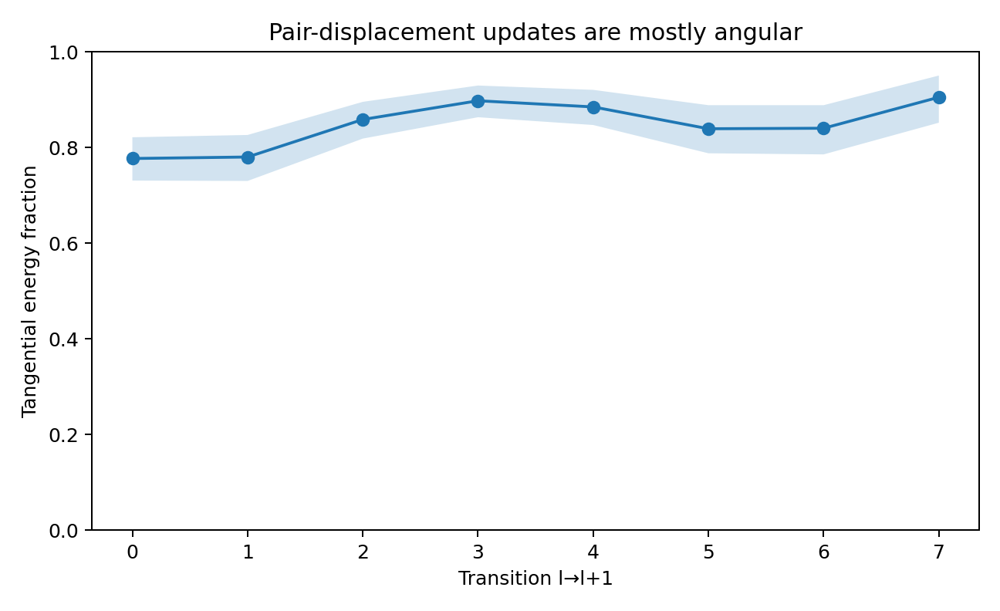

**Figure 6.** Tangential fraction of displacement-change energy across layer transitions in the controlled matched-prompt model. The line shows the mean; the shaded band is a bootstrap 95% confidence interval from 3,000 resamples. Source: ROTATIONAL-DYNAMICS-001A to 001C.

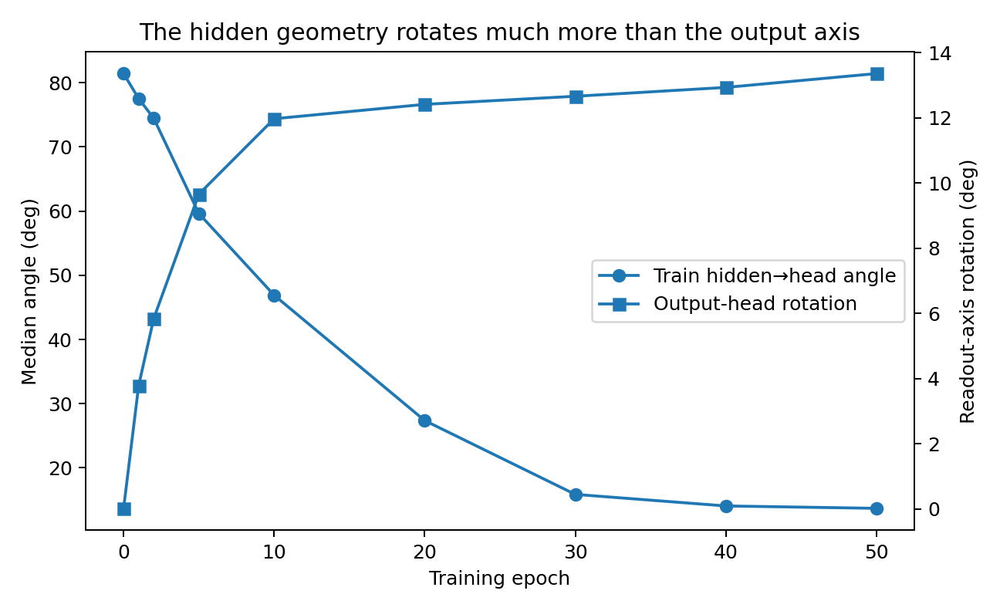

**Figure 7.** Training coadaptation. Controlled matched-prompt study. Directional alignment, tangential movement, training coadaptation and orientation intervention are evaluated along the same model lineage. Source: ROTATIONAL-DYNAMICS-001A to 001C.

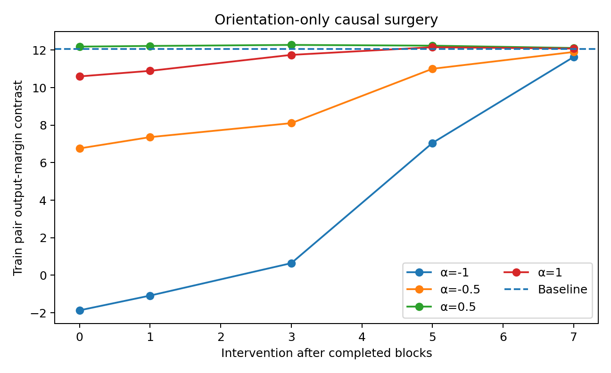

**Figure 8.** Orientation intervention. Controlled matched-prompt study. Directional alignment, tangential movement, training coadaptation and orientation intervention are evaluated along the same model lineage. Source: ROTATIONAL-DYNAMICS-001A to 001C.

## 3  Relative registration of information fragments

A useful internal direction can be defined relative to another part of the computation. The shared prompt, its changed fragment and the decision state provide three objects whose pairwise maps can be compared.

*Experiment ROTATIONAL-PUZZLE-001 and 002*

### Question

Does the model behave as if locally formed fragments are progressively registered into a mutually compatible orientation before output, rather than merely moving through a sequence of unrelated hidden-state coordinates? The experiment tests the operational signature of a rotational-puzzle mechanism. It does not assume an absolute internal axis. The key invariant is whether relative transformations among fragments become increasingly self-consistent across depth.

### Experimental setting

The fragment-registration experiment uses the frozen eight-layer, 24-dimensional controlled Transformer described above. The 70 paired prompts provide an unchanged evaluation lineage for the fragment assays.

### Fragment construction

The original 70 real TEXT/ACT minimal pairs were reused. On the ACT member of each pair, byte positions were divided mechanically by sequence alignment into:

- S — shared fragment: bytes unchanged relative to the paired TEXT prompt;

- D — delta fragment: inserted or changed bytes that distinguish the ACT prompt;

- Y — decision state: the final non-padding token state used by the classifier.

A pair was retained when the shared fragment contained at least 12 byte tokens and the delta fragment at least 2. This produced 67 usable pairs, split by the frozen pair rule into 54 train / 13 held out.

At every representation depth (embedding plus 8 Transformer blocks), three 24-dimensional point clouds were formed by averaging the S and D token states and recording Y. Orthogonal Procrustes maps were fitted on train pairs:

R_SD : S → D, R_DY : D → Y, R_SY : S → Y. The core puzzle quantity compares the composed path R_SD R_DY with the direct path R_SY. A fragment-identity null permutes D across train pairs while preserving the marginal S, D and Y distributions.

### Relative path closure strengthens with depth

The held-out distance between the composed S→D→Y path and the direct S→Y path was:

- layer 0: 0.8073 (identity-null mean 0.8217)

- layer 1: 0.8610 (null 0.8944)

- layer 2: 0.8504 (null 0.9086)

- layer 3: 0.7355 (null 0.8822)

- layer 4: 0.6332 (null 0.8436)

- layer 5: 0.5561 (null 0.7908)

- layer 6: 0.4854 (null 0.7437)

- layer 7: 0.4282 (null 0.7089)

- layer 8: 0.3844 (null 0.6773)

The raw path gap falls strongly with depth (Spearman ρ = -0.95, p = 8.76e-5). More importantly, the ratio of real path gap to shuffled-fragment null falls monotonically from 0.9824 to 0.5676 (Spearman ρ = -1.00 across the nine sampled depths).

From layer 3 onward, the real held-out path gap is smaller than the fragment-identity null at empirical p < 0.05; layers 4–8 reach the minimum attainable p under 250 permutations (p = 0.003984) except layer 3 (p = 0.0199).

This is the strongest current puzzle-style signature: the relative transformation carried by the correct fragment identity becomes increasingly transitive across depth. The result is invariant to a global choice of coordinates because it compares relative orthogonal maps rather than absolute hidden-state axes.

### Operator closure across depth

The Frobenius cycle error ||R_SD R_DY - R_SY|| is also below the shuffled-fragment null at several depths, including layers 2, 3, 5, 6, 7 and 8. Its depth trend is not monotonic, so the executed evidence supports progressive held-out relational path closure more strongly than a claim that a single global orthogonal operator itself converges monotonically.

### The delta fragment begins to align with the decision state in the middle late stack

A separate D→Y identity control asks whether the correct delta fragment predicts its own held-out decision state better than shuffled delta identities. The true held-out cosine rises from approximately zero/negative in the early stack to:

- layer 5: 0.1363 vs null mean -0.0052 (p = 0.0598)

- layer 6: 0.1588 vs null mean -0.0023 (p = 0.0558)

This is a directional rather than threshold-crossing result. It places the strongest delta-to-decision alignment in the same middle/late region where cycle closure has already become strong.

### Learned fragment rotation planes are dynamically privileged

A causal probe was then run at representations 4 and 6. For each layer, the two dominant directions of train-set delta-fragment states defined a data-derived 2D plane. Held-out delta fragments were rotated by 45 degrees inside that plane, with total perturbation energy fixed to 3% of the full content-state norm. The same perturbation energy was then applied using 30 random orthonormal 2D planes.

Representation 4:

- learned-plane delta retention at final layer: 1.9078 × initial perturbation energy

- random-plane null mean: 1.2140 ×

- empirical p = 0.0323

Representation 6:

- learned-plane delta retention: 1.5147 ×

- random-plane null mean: 1.0216 ×

- empirical p = 0.0323

Thus a rotation applied along the fragment's own data-derived plane propagates more strongly through the remaining network than an equal-energy rotation in arbitrary planes. At representation 6, despite this strong internal propagation, the mean final decision-margin change is approximately 0.0001, and the decision-state perturbation is only 0.0311 × initial energy. The executed evidence therefore supports a distinction between a privileged internal transmission direction and the final readout's robustness to that local disturbance.

### Causal propagation results

The matched-energy perturbation experiment supports privileged propagation, not automatic snap-back correction. A 45-degree learned-plane delta rotation persists more strongly inside the delta fragment than an equal-energy random local perturbation (representation 4: 1.9078 vs 1.2657; representation 6: 1.5147 vs 1.0271). The final decision can remain stable while the rotated fragment continues to propagate internally.

The evidence therefore currently supports this mechanism-level statement:

Fragments are not behaving like arbitrary coordinates. Their correct cross-fragment correspondences become progressively more cycle-consistent with depth, and rotations in data-derived fragment planes propagate preferentially through later computation. This is compatible with a rotational-puzzle account in which useful computation is organized around relative registration among locally formed fragments. Relational closure and privileged rotational propagation motivate the formation and readout assays that follow.

### Preliminary independent initialization check

An independent initialization (seed 11, 35 training epochs) reproduced the direction of the closure result at lower magnitude: the real/null held-out path-gap ratio averaged approximately 0.913 over layers 0–2 and 0.803 over layers 6–8. This observation adds an independent-seed directional check to the complete seed-7 mechanism assay. The experiment shifts the natural unit of analysis from an absolute hidden-state coordinate to a relative transformation network. For this data, the model's internal organization is better captured by whether independently localized fragments can be composed into a consistent path than by whether any single fragment occupies a fixed direction. This gives a concrete operational interpretation to the rotational-puzzle intuition without requiring a privileged global axis.

### ROTATIONAL PUZZLE 002 Human Strategy Trace and Operational Alignment

### Motivation

The motivating picture is a jigsaw in which a smaller piece moves relative to a larger receiving assembly. This analogy suggests measurable questions about relative motion, fitting and the time at which a useful output first becomes readable. The experiment therefore asks a narrower mechanistic question: once an output-compatible state is available, do the model's subsequent turns still follow privileged directions rather than arbitrary equal-sized turns, and does the smaller delta fragment move relative to the larger shared fragment as an assembly-like anchor?

### Operational alignment definition

Because no privileged internal definition of “aligned” is assumed, alignment is defined operationally from the frozen trained output head. At each representation depth, the final LayerNorm and classifier head are applied directly to the current decision-token state. Two markers are retained:

- stable answer alignment: the earliest depth from which every remaining frozen-head prediction is correct;

- best readout alignment: the depth with minimum correct-class cross-entropy.

This deliberately allows internal geometry to continue moving after the answer has become stably readable.

### Answer compatible states appear early but most angular motion happens afterward

Across 140 TEXT/ACT samples, 91.43% reach a stable-answer layer somewhere in the stack. The median stable-answer depth is layer 1, whereas the median minimum-loss depth is layer 8. Among samples with stable answer alignment, the median cumulative decision-state angular motion after the stable-answer point is 1.612 rad, representing 85.51% of the sample's total layerwise angular motion.

Thus “the answer is already readable” and “the internal state has stopped turning” are empirically distinct. The model usually continues substantial geometric motion after a stable answer-compatible configuration first appears.

### Equal sized random turns are systematically worse than the model s actual turns

For every sample and every layer transition, the actual decision-state turn was compared with 300 random turns that preserve the same target norm and the same angular displacement but randomize the direction of rotation. The frozen output head supplies the operational score.

The mean percentile of the actual turn against this matched random-turn distribution rises strongly through depth:

**Table 2. Relative registration of information fragments**

| transition | actual-turn percentile | actual mean loss change | random-turn expected loss change |
| --- | --- | --- | --- |
| 0→1 | 0.653 | +0.0983 improvement | -0.0021 |
| 1→2 | 0.691 | +0.1047 | -0.0064 |
| 2→3 | 0.744 | +0.0821 | -0.0081 |
| 3→4 | 0.837 | +0.0921 | -0.0055 |
| 4→5 | 0.893 | +0.1145 | -0.0066 |
| 5→6 | 0.914 | +0.0666 | -0.0087 |
| 6→7 | 0.919 | -0.0671 | -0.0073 |
| 7→8 | 0.914 | -0.0994 | +0.0207 |

Source: ROTATIONAL-PUZZLE-001 and 002. The experimental setting and definitions are given in the associated text.

Before stable answer alignment, 58.43% of actual turns beat the median matched random turn (exact binomial p = 8.64e-4). After stable answer alignment, this rises to 96.34% (p ≈ 1.13e-179).

The late-stack result is particularly informative. Transitions 6→7 and 7→8 can worsen the frozen intermediate-head loss on average, yet their chosen directions still rank around the 91st–92nd percentile against equal-sized random turns. The late turn is therefore not equivalent to “keep descending the frozen readout loss”; it remains a highly selected internal direction even when the already-readable answer is no longer monotonically optimized by this proxy.

### The small delta fragment moves relative to the larger shared assembly

The ACT member of each minimal pair was again split into a large shared fragment S and a smaller delta fragment D. For each layer transition, an orthogonal map was fitted on train-set S states and treated as the shared-frame motion. Held-out residual motion was then measured for S itself and for D under that same shared map.

At every one of the eight transitions, the delta fragment has larger residual motion than the shared fragment. The median D/S residual ratio ranges from 1.24× to 2.30×; across all held-out fragment-transition observations, D > S is strongly supported (one-sided Wilcoxon p = 3.46e-10).

The strongest ratios occur at the first transition (1.83×) and the final transition (2.30×). This provides a model-side analogue of a piece-to-assembly strategy: after accounting for the motion of the larger shared frame, the smaller information-bearing fragment continues to undergo additional relative movement.

### Post alignment training continues to rotate parameters while outputs remain fixed

The seed-7 trained checkpoint from ROTATIONAL-DYNAMICS-001 already had 100% train accuracy and train NLL 0.004964. This checkpoint was treated as an output-aligned starting state and optimization of the same training objective was continued for 25 additional epochs at a reduced learning rate.

By post-alignment epoch 25:

- train accuracy remained 100%;

- train prediction agreement with the aligned checkpoint remained 100%;

- train NLL fell further to 0.000420;

- mean Q/K/V/O polar-rotation distance from the aligned checkpoint reached 0.02531 rad;

- train-logit RMS drift reached 0.9378.

Thus the same discrete training answers can remain completely unchanged while the parameter operators continue to rotate and the logits continue to move substantially. This supports treating “output alignment” as a region or first-passage condition rather than a unique terminal parameter orientation.

### Experimental setting

The selected-direction and piece-to-assembly signatures were measured in the same frozen eight-layer controlled Transformer used in the preceding registration experiment.

The strongest combined reading is now:

- output compatibility can appear before internal motion ends;

- actual layerwise turns are strongly preferred over equal-angle random alternatives;

- the smaller delta fragment moves relative to a larger shared frame;

- parameter operators can continue rotating after the training outputs are already fixed.

This is consistent with a strategy-like rotational process rather than undirected geometric drift. The current evidence does not assign a unique semantic meaning to any absolute axis and does not require a monotonic notion of alignment. “Alignment” is treated operationally as reaching an output-compatible configuration; subsequent motion can continue. The natural object is no longer a static coordinate or a single final aligned state. For this system, a more informative description is a trajectory of selected transformations with first-passage output compatibility. This gives a concrete empirical form to the idea that a model can “find a usable fit” and continue transforming afterward without losing the answer.

## 4  Formation and readout of a functional fragment

Tracking shape, collective motion and output access together reveals where a fragment forms and where the final decision begins to depend on it.

*Experiment ROTATIONAL-PUZZLE-003*

### Why this experiment

ROTATIONAL-PUZZLE-001 established increasing cycle closure among the shared context fragment S, the changed/instruction fragment D, and the decision state Y. ROTATIONAL-PUZZLE-002 showed that layerwise turns are strongly selected relative to equal-angle random alternatives, that D moves more than the larger shared frame S, and that output-compatible states can appear long before internal motion ends.

The remaining question was therefore not whether the system moves or rotates, but where the fragment itself becomes a coordinated computational piece.

No absolute hidden-state axis was defined as the target. Fragment birth was approached through coordinate-light signatures:

- internal shape stability — do the D tokens preserve their mutual geometry across a layer transition better than equal-sized groups of shared tokens?

- collective motion — do D tokens move in a more common direction than matched shared-token groups?

- relative registration — does the already-measured S→D→Y path continue to close relative to shuffled fragment identities?

- readout handoff — does the decision token increasingly allocate attention to D, and does causally removing those attention edges matter more than removing matched shared-token edges?

This design separates “a piece exists,” “a piece is moving,” and “the output pathway is using the piece.”

### Fragment construction

For each ACT member of the original matched pair, sequence alignment with the TEXT member divided byte-token positions into:

- S: unchanged shared positions;

- D: inserted or changed positions;

- Y: the final non-padding decision token.

Pairs were retained when S contained at least 12 tokens and D at least 2 tokens, producing 67 usable pairs. Every null comparison used equal-sized subsets drawn from the same prompt's shared positions, so fragment size and prompt identity were held fixed.

### A transient fragment shape emerges before late readout

Across each transition, the pairwise-distance matrix of the D-token cloud was compared before and after the layer. Translation, global orientation, and isotropic scale were removed, leaving a shape-drift measure. Each D shape was compared with 100 equal-sized shared-token groups from the same prompt.

The mean percentile of D shape stability against this matched null was:

**Table 3. Formation and readout of a functional fragment**

| transition | shape-stability percentile | fraction above null median | one-sided binomial p |
| --- | --- | --- | --- |
| 0→1 | 0.576 | 0.567 | 0.164 |
| 1→2 | 0.627 | 0.612 | 0.0432 |
| 2→3 | 0.627 | 0.627 | 0.0249 |
| 3→4 | 0.631 | 0.687 | 0.00153 |
| 4→5 | 0.560 | 0.597 | 0.0710 |
| 5→6 | 0.466 | 0.448 | 0.836 |
| 6→7 | 0.433 | 0.433 | 0.889 |
| 7→8 | 0.389 | 0.403 | 0.957 |

Source: ROTATIONAL-PUZZLE-003. The experimental setting and definitions are given in the associated text.

The key pattern is not monotonic rigidification. D first becomes more shape-preserving than matched shared-token groups, with the strongest evidence around 3→4, and then becomes more deformable in the late stack. Across transition depth, shape-stability percentile declines overall (Spearman ρ = −0.786, p = 0.0208) after its early/middle peak.

Thus the computational fragment is better described as a soft piece than a rigid jigsaw tile: a locally coherent shape appears, but later computation is free to deform it.

### Collective fragment motion strengthens as rigid shape relaxes

For each transition, every D token's displacement vector was normalized and the length of their mean direction was measured. A value near one means that the tokens move as a common object; matched shared-token groups provide the null.

Mean motion-coherence percentile rose from approximately chance at 0→1 (0.502) to 0.593 at 7→8. Transition 4→5 showed the clearest threshold-crossing group result: 62.7% of fragments exceeded their matched null median (p = 0.0249). The depth trend was positive (Spearman ρ = 0.643, p = 0.0856).

At the same time, the D centroid increasingly executes larger turns relative to matched shared groups (depth Spearman ρ = 0.738, p = 0.0366).

Taken together with the shape-preservation result, the model does not simply freeze D into a rigid local configuration. It increasingly moves D collectively while allowing its internal shape to change.

### Data driven stage detection finds three phases

A multivariate strategy trace was constructed without assigning human stage labels in advance. Seven measured quantities were combined across the eight layer transitions:

- actual-turn selectivity against equal-angle random turns;

- immediate frozen-head loss change;

- angular step size;

- D/S piece-to-assembly residual ratio;

- real/null cycle-closure gap ratio;

- D shape-stability percentile;

- D collective-motion percentile.

Exhaustive piecewise-constant segmentation gave:

- one-segment SSE: 56.00;

- best two-segment SSE: 22.37;

- best three-segment SSE: 12.47.

The best three-segment partition was:

transitions 0–2 | transitions 3–5 | transitions 6–7

or, in representation-depth terms:

depth 0→3 | depth 3→6 | depth 6→8.

A 2,000-replicate pair bootstrap placed the first cut at index 3 in 56.7% of replicates (with neighboring alternatives at 2 and 4) and the second cut at index 6 in 75.8%. The exact joint 3/6 cut was the most common solution (996/2000 = 49.8%).

The measured content of the three phases is:

### Phase I local fragment formation search 0 3

D develops above-null shape preservation while actual-turn selectivity rises from 0.653 to 0.744. Relational closure is still relatively weak.

### Phase II directed registration closure 3 6

Actual-turn selectivity rises from 0.837 to 0.914; the real/null closure-gap ratio falls from 0.751 to 0.653; the smaller D fragment continues moving more than the shared frame. This is the clearest region in which a formed fragment is being actively registered into the larger computation.

### Phase III late handoff reconfiguration 6 8

Actual turns remain extremely selected (~0.92 percentile) even though the frozen intermediate output loss can worsen. D's rigid-shape advantage has disappeared, while collective motion and relative turning remain strong. This is consistent with a late reconfiguration rather than a terminal frozen pose.

### The decision pathway begins selectively reading D late

The exact self-attention weights from the final decision token were reconstructed at all eight Transformer layers. For each prompt, attention density per D token was compared with attention density per S token and with 200 equal-sized matched shared-token subsets.

The mean D/S attention-density ratio rose almost monotonically:

0.919 → 0.952 → 0.966 → 0.980 → 1.072 → 1.169 → 1.187 → 1.171

Depth correlation: Spearman ρ = 0.976, p = 3.31×10⁻⁵.

The matched-null percentile of D attention rose strictly monotonically from 0.340 at layer 0 to 0.578 at layer 7 (Spearman ρ = 1.00). At layer 7, 61.2% of fragments exceeded the matched-null median (one-sided binomial p = 0.0432).

This indicates a late readout handoff: the information-bearing fragment is not preferentially read by the decision token in the early stack; selective attention to it grows only after the fragment-formation and registration phases are already underway.

### Attention edge ablation gives a held out causal readout signal

On the 13 held-out ACT pairs, the decision token's self-attention edges to D were blocked at one layer at a time. The control blocks the same number of shared-token positions, sampled to approximately match their distance from the decision token.

The strongest selective causal effect occurred at layer 7:

- mean output-margin penalty when D edges were blocked: +0.00570;

- mean penalty under matched shared-token blocking: −0.01980;

- D-block penalty percentile against matched controls: 0.706;

- 11/13 held-out pairs had D-block penalties above the matched-control median;

- exact one-sided binomial p = 0.0112.

No earlier layer crossed this held-out causal gate. This causally separates fragment formation from fragment use: the fragment's local geometry and registration signatures arise earlier, while the decision token becomes selectively dependent on direct access to that fragment only at the end of the stack.

### Secondary wrong piece transplant probe

A separate in-distribution intervention transplanted the relative D state from another real ACT prompt into the recipient's own S frame. The mean output-margin penalty moved from negative in the early stack to positive at representations 6 and 7:

- rep 0: −0.143;

- rep 3: −0.0886;

- rep 5: −0.0175;

- rep 6: +0.0535;

- rep 7: +0.1067.

The pair-level effects are heterogeneous, so this probe is retained as directional evidence. Its sign change is nevertheless consistent with the stronger late specificity seen in the attention experiments.

### Mechanistic synthesis

The executed evidence now supports a more specific form of the rotational-puzzle account:

- A local information-bearing piece acquires a temporarily stable internal shape.

- That piece then undergoes selected collective motion relative to the larger shared frame.

- Cross-fragment transformation paths become progressively more cycle-consistent during this motion.

- The piece is not rigid: its internal geometry can deform substantially in the late stack while its collective trajectory remains organized.

- Only late in the stack does the decision pathway selectively read the piece strongly enough that removing the relevant attention edges produces a held-out causal effect.

- Output compatibility can therefore appear before the internal transformation process has ended.

A compact description is:

local piece formation → directed transport/registration → relational closure → late readout handoff → continued reconfiguration

This is closer to a soft rotational puzzle than to a rigid jigsaw: pieces are locally coordinated objects, but their internal shape remains transformable while their relative placement becomes computationally useful. The data indicate that the useful modeling unit is not an absolute hidden coordinate and not even a permanently rigid latent object. A more faithful object is a temporally localized, relation-bearing fragment whose shape, direction, and readout accessibility evolve at different depths.

For data-oriented model analysis, this implies that “representation,” “transport,” “registration,” and “readout” should be measured separately. Collapsing them into one embedding similarity or one probe score hides the actual sequence of operations.

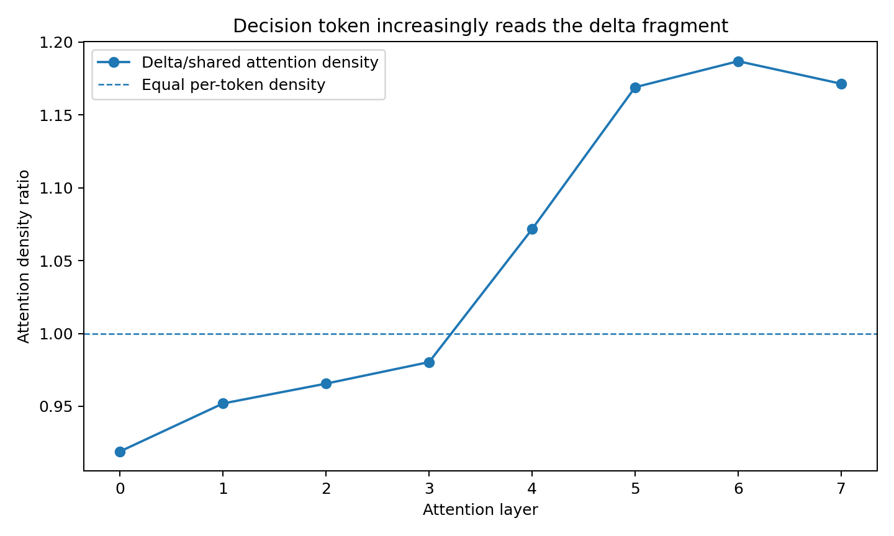

**Figure 9.** Attention handoff. Controlled Transformer, 67 usable matched pairs. These measurements locate fragment formation, registration and late readout dependence. Source: ROTATIONAL-PUZZLE-003.

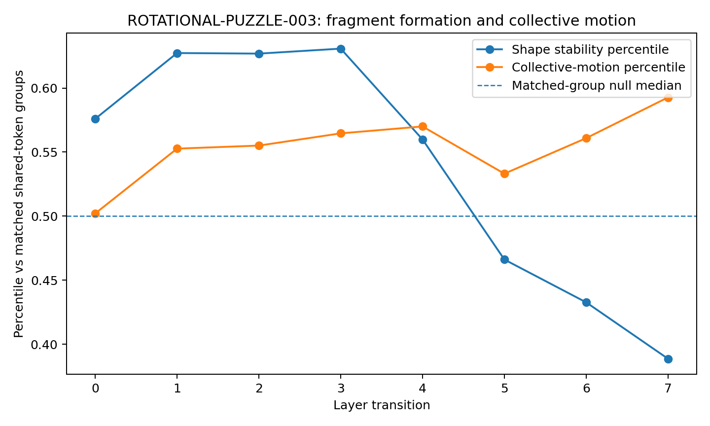

**Figure 10.** Fragment dynamics. Controlled Transformer, 67 usable matched pairs. These measurements locate fragment formation, registration and late readout dependence. Source: ROTATIONAL-PUZZLE-003.

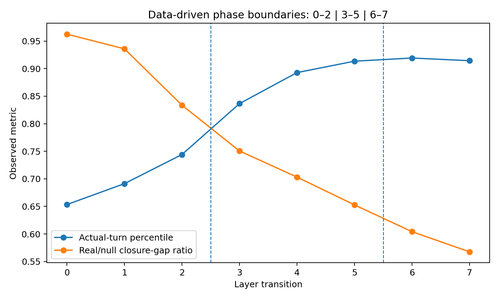

**Figure 11.** Phase boundaries. Controlled Transformer, 67 usable matched pairs. These measurements locate fragment formation, registration and late readout dependence. Source: ROTATIONAL-PUZZLE-003.

## 5  Identity specific coupling within the moving assembly

Per-token attention density, total attention mass and coordinated motion answer different questions. The following measurements separate those observables while tracking the same fragment identities.

*Experiment ROTATIONAL-PUZZLE-003 coupling analysis*

### Question

When a task-specific delta fragment begins to participate in the decision computation, is the event visible as increasing decision-token attention, as collective fragment motion, or as identity-specific coupling between the correct fragment and the downstream decision state? This experiment follows the existing rotational-puzzle construction. ACT prompts are split by exact byte-level alignment into a large shared fragment S, a task-specific delta fragment D, and the final decision state Y. The same frozen 54-train / 13-held-out usable-pair split is preserved.

The central distinction is operational: a contiguous group of tokens can move coherently for generic geometric reasons. A stronger connection signature requires the correct D fragment to couple to Y more strongly than a same-shaped fragment mask shifted elsewhere in the same prompt.

### Attention mass and fragment coupling

At each Transformer block, the exact per-head self-attention weights from the decision token were recovered. Reconstructing the native layer output from the extracted attention path gave maximum absolute error 1.91e-6.

Across held-out ACT prompts, mean decision attention mass assigned to upstream D tokens remains approximately flat:

**Table 4. Identity specific coupling within the moving assembly**

| Block | True D attention mass | Same-shape shifted-mask null | D fraction of visible upstream tokens |
| --- | --- | --- | --- |
| 1 | 0.1950 | 0.2111 | 0.2175 |
| 2 | 0.2021 | 0.2115 | 0.2175 |
| 3 | 0.2057 | 0.2110 | 0.2175 |
| 4 | 0.2073 | 0.2106 | 0.2175 |
| 5 | 0.2064 | 0.2106 | 0.2175 |
| 6 | 0.2035 | 0.2098 | 0.2175 |
| 7 | 0.2029 | 0.2098 | 0.2175 |
| 8 | 0.2035 | 0.2100 | 0.2175 |

Source: ROTATIONAL-PUZZLE-003 coupling analysis. The experimental setting and definitions are given in the associated text.

The model therefore does not create the fragment–decision relationship by simply assigning progressively larger attention mass to D. The decision token looks at D at roughly its available-token share throughout the stack.

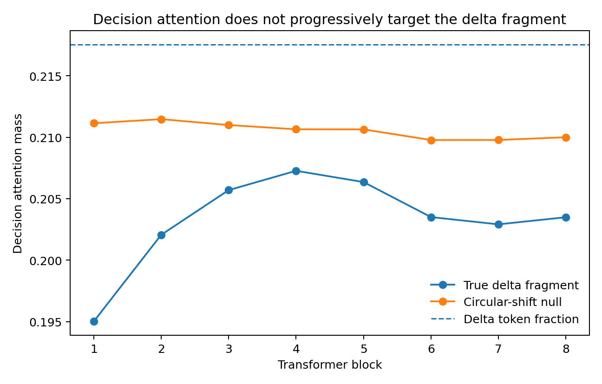

**Figure 12.** Attention mass assigned to the changed fragment D across eight blocks. True D masks are compared with same-shape shifted masks and the fraction of visible upstream tokens. The controlled Transformer supplies 67 usable paired prompts. Source: ROTATIONAL-PUZZLE-003 coupling analysis.

### Block internal co motion is a generic local structure property

For each layer transition, a shared-frame orthogonal transport was fitted from train-set S tokens. Held-out token motion was then measured after subtracting this shared-frame transport. The D tokens become increasingly coherent as a group under a simple random-token-set null. A stricter circular-shift null preserves the exact shape and spacing of the D mask while moving it to another location in the same prompt. Under this stronger control, same-shaped shifted token blocks show comparable within-block co-motion.

For example, true D within-block residual-motion coherence is 0.4445 / 0.4908 / 0.5111 at transitions 3/4/5, versus 0.4616 / 0.4964 / 0.5010 for the same-shape shifted masks. The evidence therefore localizes ordinary within-block synchrony to a general local-structure effect. A contiguous token group can move together without yet establishing a task-specific connection.

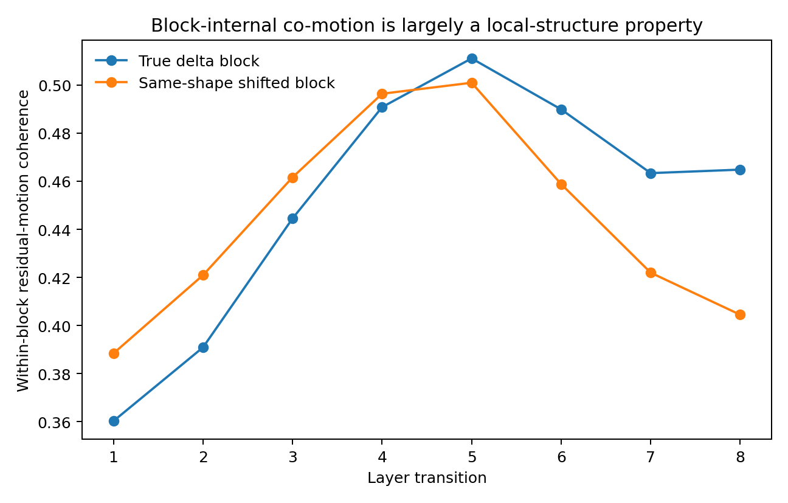

**Figure 13.** Residual-motion coherence of the true changed fragment D and same-shape shifted-mask controls across depth. Shared-frame motion is removed before computing within-block coherence in the 67-pair controlled Transformer cohort. Source: ROTATIONAL-PUZZLE-003 coupling analysis.

### The correct D fragment begins to co move specifically with Y in the middle stack

The identity-specific result appears when the shared-frame residual motion of D is compared with the shared-frame residual motion of Y.

**Table 5. Identity specific coupling within the moving assembly**

| Transition | True D-to-Y residual-motion cosine | Same-shape shifted-fragment null | Empirical p |
| --- | --- | --- | --- |
| 1 | 0.1372 | 0.0965 | 0.1856 |
| 2 | 0.1750 | 0.1478 | 0.2874 |
| 3 | 0.2947 | 0.1916 | 0.0140 |
| 4 | 0.3502 | 0.1850 | 0.0040 |
| 5 | 0.2179 | 0.1010 | 0.0719 |
| 6 | -0.0411 | -0.0664 | 0.4052 |
| 7 | -0.2089 | -0.1427 | 0.6507 |
| 8 | -0.1983 | -0.1667 | 0.5609 |

Source: ROTATIONAL-PUZZLE-003 coupling analysis. The experimental setting and definitions are given in the associated text.

The task-specific fragment–decision coupling is therefore concentrated in a middle-stack connection window, strongest at transitions 3–4. Later layers continue moving but no longer keep D and Y in the same residual direction.

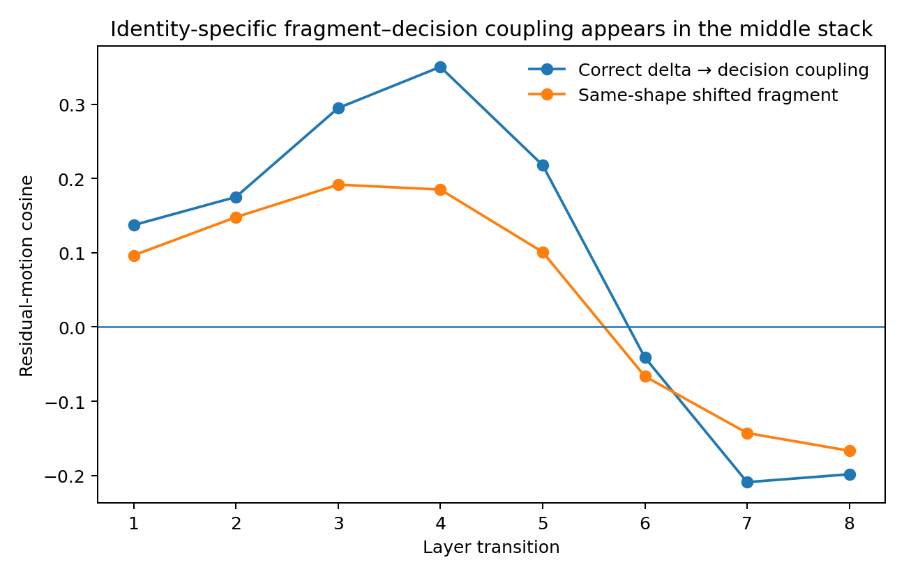

**Figure 14.** Identity-specific coupling between the changed fragment D and decision state Y. Residual-motion cosine is compared with same-shape shifted-fragment controls at each transition. Source: ROTATIONAL-PUZZLE-003 coupling analysis.

### The coupling window coincides with relational cycle closure

ROTATIONAL-PUZZLE-001 independently measured the held-out S→D→Y path gap relative to a shuffled-fragment identity null. The real/null path-gap ratio falls from 0.982 at depth 0 to 0.834 at depth 3 and 0.751 at depth 4, then continues to 0.568 by depth 8. The real path first beats the fragment-identity null at empirical p<0.05 at layer 3, and layers 4–8 reach p=0.003984 under the 250-permutation resolution.

The new co-motion result and the previous closure result therefore localize the same transition region from independent observables:

correct-fragment D-to-Y co-motion appears at transitions 3–4 while correct-fragment relational closure becomes significant from layer 3 onward.

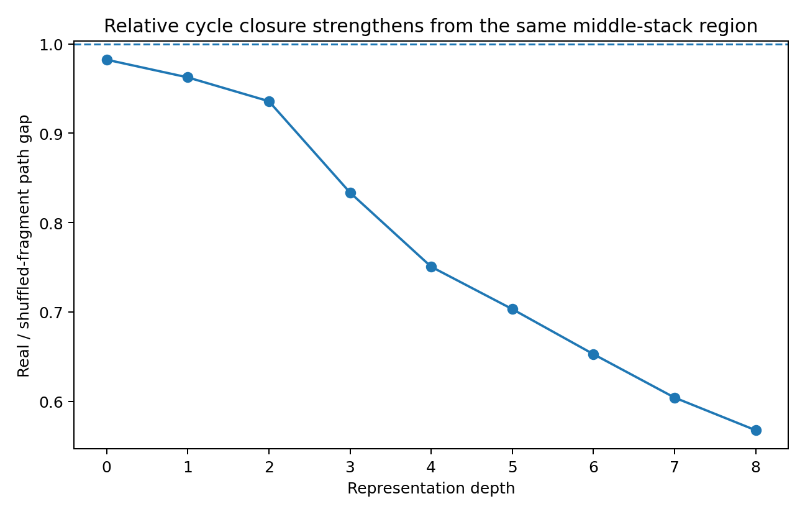

**Figure 15.** Real-to-null ratio of the S→D→Y relational closure gap across depth. Values below one indicate tighter closure than the matched null. The shared fragment S, changed fragment D and decision state Y are followed in the controlled Transformer. Source: ROTATIONAL-PUZZLE-003 coupling analysis.

### Orientation perturbation changes propagation without gross attention reweighting

The RP001 learned-plane rotation intervention was repeated while recording decision attention to the perturbed upstream D fragment. Across injection layers, the mean change in D attention mass from a +45° learned-plane rotation is small (absolute mean changes from approximately 0.00019 to 0.00177). No injection layer exceeds the matched 20-random-plane null at p<0.05 for attention-mass change.

This result fits the earlier privileged-propagation finding: the learned fragment plane can alter downstream transmission while the scalar amount of attention allocated to the fragment changes very little. The useful variable is therefore the state carried through the connection, not simply how much attention weight is assigned to that position set. A direct decomposition of the attention value contribution likewise shows that no single D-only self-attention contribution reproduces the middle-stack coupling peak. The observed connection is distributed across the full block transformation rather than reducible to one scalar attention statistic.

### Interpretation what counts as a connection

The executed controls sharpen the rotational-puzzle mechanism.

A contiguous token group moving together is a real geometric event, but the same behavior also appears in same-shaped shifted token groups. The identity-specific signature is stronger:

the correct fragment begins to share a directed residual motion with the decision state at the same depth where the correct fragment identity begins to close the S→D→Y relation.

This gives a practical definition of computational connection for this model: connection is not a static edge and not an attention spike. It is the onset of task-specific coordinated transformation between the correct internal objects.

The resulting sequence is now:

local token block → fragment-relative motion → identity-specific D-to-Y coupling → cycle closure → later relative reorientation → output-compatible region.

The human rotating-puzzle analogy remains a strategy-level analogy only. The model-side mechanism measured here is a low-dimensional, state-conditioned coordination process among token groups. The experiment shows why model interpretation should follow the data geometry rather than choose a diagnostic in advance. Attention mass, generic within-block motion, identity-specific co-motion and cycle closure answer different questions. In this dataset, the connection event is best localized by relative motion conditioned on fragment identity, not by absolute hidden coordinates or raw attention magnitude.

The natural object for the next model is therefore a dynamic relation: which objects begin to transform together, under which state, and when that coordinated motion becomes compositionally consistent.

## 6  Interface locking and continued movement

A fragment can establish a stable interface while the assembled object keeps moving. Matched token masks and equal-sized translations test that distinction.

*Experiment ROTATIONAL-PUZZLE-004*

### Question

The experiment uses the simplest puzzle/blocks interpretation. If the changed fragment D has actually clicked into the larger shared assembly S, the correct S–D interface should become more geometrically stable than the same-shaped token pattern placed elsewhere in the same prompt. A second causal test asks whether moving D along structured, in-distribution piece-motion directions behaves differently from an equal-norm arbitrary displacement.

### Does the correct piece click into the shared assembly

For every held-out ACT prompt and every layer transition, the mean pairwise distances between all shared-fragment tokens S and all delta-fragment tokens D were measured before and after the transition. The resulting cross-fragment strain was compared with 1,000 circularly shifted copies of the exact D position pattern inside the same prompt. The control therefore preserves fragment size and position pattern while changing which tokens occupy the putative piece.

Lower strain means the S–D interface preserves more of its geometry across the transition.

**Table 6. Interface locking and continued movement**

| transition | correct D strain | shifted-shape control | relative reduction | paired p | held-out pairs with lower strain |
| --- | --- | --- | --- | --- | --- |
| 1 | 0.032343 | 0.032467 | 0.17% | 0.527 | 7/13 |
| 2 | 0.043393 | 0.046713 | 7.07% | 0.01331 | 11/13 |
| 3 | 0.060642 | 0.065559 | 7.27% | 0.008545 | 12/13 |
| 4 | 0.074170 | 0.079815 | 6.70% | 0.01074 | 12/13 |
| 5 | 0.084095 | 0.090677 | 6.82% | 0.01074 | 12/13 |
| 6 | 0.104611 | 0.111851 | 6.16% | 0.01331 | 11/13 |
| 7 | 0.160329 | 0.166039 | 3.34% | 0.02869 | 10/13 |
| 8 | 0.216971 | 0.218306 | 0.46% | 0.1527 | 8/13 |

Source: ROTATIONAL-PUZZLE-004. The experimental setting and definitions are given in the associated text.

Executed result. Transition 1 shows no identity-specific interface stabilization. From transition 2 through transition 7, the correct D–S interface is more stable than the same-shaped shifted control. The largest and most reproducible effect occupies transitions 2–6: the correct interface shows about 6–7% less cross-fragment strain, with 11–12 of 13 held-out prompts moving in the same direction at each transition. Transition 8 returns close to the shifted control.

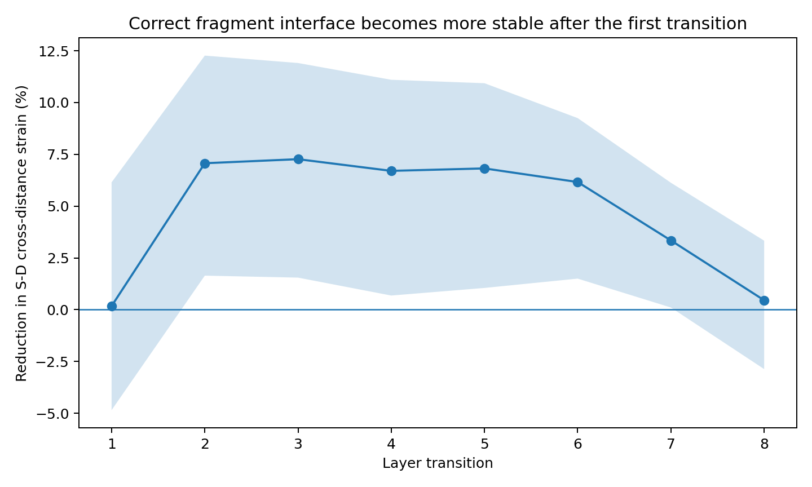

**Figure 16.** Correct-fragment interface locking across depth. Source: ROTATIONAL-PUZZLE-004.

This gives a direct mechanical signature for piece locking. The first transition behaves like free search. By the second transition, the correct small piece begins to preserve its relation to the larger shared assembly better than an identically shaped token pattern placed elsewhere.

### Connection to the earlier puzzle timeline

The click-in signal precedes and overlaps two independently measured events from the earlier experiments:

- correct-fragment cycle closure becomes significant from layer 3 onward;

- D-to-decision co-motion becomes identity-specific around transitions 3–4;

- late decision-token dependence on D becomes causal at layer 7.

Taken together, the executed measurements support a simple sequence:

piece finds the assembly → interface stabilizes → relational loop closes → decision path reads the assembled piece

### Are all equal sized moves equally disruptive

The entire D block was translated without changing its internal shape. Two structured directions were tested against equal-norm random directions:

- a nudge toward the relative D–S pose observed in another real training prompt;

- a radial nudge along the current D–S relative direction.

The perturbation norm was fixed at 3% of the local delta-state norm. The remaining layers were then executed normally and the final decision-state displacement and output-margin change were measured.

### Real pose direction versus random direction

**Table 7. Interface locking and continued movement**

| injection layer | final-Y shift ratio (real-pose/random) | output-margin ratio |
| --- | --- | --- |
| 1 | 0.877 | 0.884 |
| 2 | 0.874 | 0.900 |
| 3 | 0.933 | 0.865 |
| 4 | 0.945 | 0.874 |
| 5 | 0.982 | 1.015 |
| 6 | 1.014 | 1.052 |

Source: ROTATIONAL-PUZZLE-004. The experimental setting and definitions are given in the associated text.

### Radial D S direction versus random direction

**Table 8. Interface locking and continued movement**

| injection layer | final-Y shift ratio (radial/random) | output-margin ratio |
| --- | --- | --- |
| 1 | 0.656 | 0.481 |
| 2 | 0.552 | 0.288 |
| 3 | 0.592 | 0.370 |
| 4 | 0.708 | 0.458 |
| 5 | 0.735 | 0.445 |
| 6 | 0.930 | 0.888 |

Source: ROTATIONAL-PUZZLE-004. The experimental setting and definitions are given in the associated text.

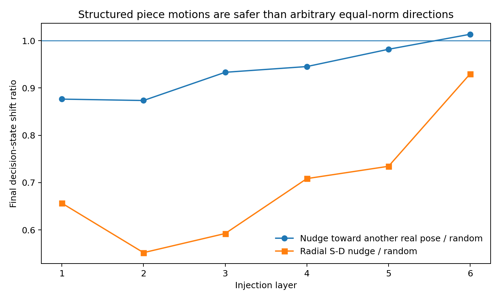

**Figure 17.** Structured fragment motions versus matched random directions. Source: ROTATIONAL-PUZZLE-004.

Executed result. Structured piece-motion directions are generally safer than arbitrary equal-norm directions in the early and middle stack. Nudging D toward another real pose produces only about 0.87–0.95× the final decision-state displacement of a random direction through layers 1–4. Radial D–S motion is even less disruptive through layers 1–5, with final-Y shift ratios about 0.55–0.73.

The evidence therefore localizes the connection variable more precisely: the model does not behave as if one Euclidean distance from S defines a single rigid socket. It supports a structured family of legal piece motions. The correct S–D interface is preferentially preserved, while motion along data-supported directions can continue without breaking the answer.

The useful object is the moving relation between pieces. The same fragment can continue to rotate or translate while its interface with the current assembly remains unusually stable. The executed evidence therefore supports modeling fragment computation with two simultaneous quantities: interface preservation and allowed motion.

For this dataset, the simplest working picture is now:

pick up piece → move/turn it along legal directions → click into the assembly → keep moving the larger assembly → hand the assembled relation to the decision path

### Experimental scope

The click-in result is direct held-out evidence in the controlled 8-layer model. The legal-motion result is a causal perturbation result in the same model. The separate pretrained instruction-model cohort establishes behaviorally actionable late directions; token-level replication of this fragment assay was not part of that cohort.

## 7  Rotation translation and moving pivots

The assembled state has several kinds of motion. We next fit increasingly expressive transformations and measure how the local center of rotation changes with depth.

*Experiment ROTATIONAL-DYNAMICS-003*

### Question

Two mechanical questions were tested directly: whether the effective rotation center remains fixed across depth, and whether layerwise motion is pure rotation or includes translation. Valid token states were treated as point clouds in the common 24-dimensional residual coordinate system. Each layer transition was fitted with a proper rigid map Y ≈ X R + t with det(R)=+1.

### Rotation and translation are both present

Mean held-out step R²: translation only 0.200; rotation about origin only 0.243; full rigid rotation+translation 0.425; full affine 0.821. Adding rotation after translation contributes about 0.225 additional held-out step R². The full affine operator contributes a further 0.396 beyond rigid motion. Held-out displacement energy separates into approximately 20.6% centroid translation, 22.8% proper rotational rearrangement, and 56.6% remaining affine/assembly-related change.

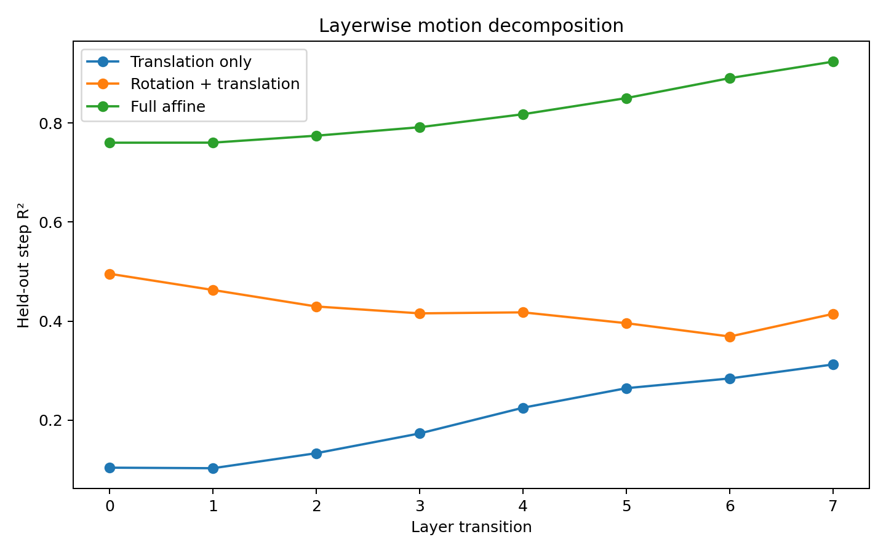

**Figure 18.** Layerwise motion decomposition. Source: ROTATIONAL-DYNAMICS-003.

### Local pivot constraints and residual translation

A very distant rotation center can imitate translation. The pivot was therefore constrained to lie within a multiple of the current cloud radius. Median residual translation fractions were:

**Table 9. Rotation translation and moving pivots**

| allowed pivot distance | median residual translation fraction |
| --- | --- |
| 0.25 × cloud radius | 0.761 |
| 0.50 × cloud radius | 0.597 |
| 1.00 × cloud radius | 0.433 |
| 2.00 × cloud radius | 0.291 |
| 5.00 × cloud radius | 0.093 |

Source: ROTATIONAL-DYNAMICS-003. The experimental setting and definitions are given in the associated text.

With a pivot constrained within one cloud radius, 43.3% of the rigid translation remains. At two radii, 29.1% remains. Only when the center is allowed to lie several assembly radii away does most translation become geometrically absorbable into a distant-pivot rotation.

### The effective rotation center moves with depth

At the primary 10° near-invariant-subspace definition, bootstrap-normalized adjacent pivot drift was:

**Table 10. Rotation translation and moving pivots**

| adjacent transforms | pivot drift / cloud radius |
| --- | --- |
| 0→1 | 0.124 (95% bootstrap 0.115–0.132) |
| 1→2 | 0.159 (95% bootstrap 0.149–0.173) |
| 2→3 | 0.284 (95% bootstrap 0.268–0.302) |
| 3→4 | 0.229 (95% bootstrap 0.138–0.288) |
| 4→5 | 0.111 (95% bootstrap 0.102–0.339) |
| 5→6 | 0.938 (95% bootstrap 0.130–1.048) |
| 6→7 | 0.607 (95% bootstrap 0.543–1.055) |

Source: ROTATIONAL-DYNAMICS-003. The experimental setting and definitions are given in the associated text.

For the early/middle stack, same-layer bootstrap center-estimation noise has median magnitude only about 0.019–0.034 cloud radii, while adjacent-center drift is about 0.124–0.284 radii. The pivot motion is therefore much larger than the observed estimation jitter in this regime. Late layers contain larger near-invariant subspaces and correspondingly less precisely localized pivots.

A second test avoids direct coordinate comparison: using a transition’s own pivot gives mean held-out R² 0.309, whereas borrowing pivots from other layers gives mean R² 0.135. This is strong layer-specific pivot information.

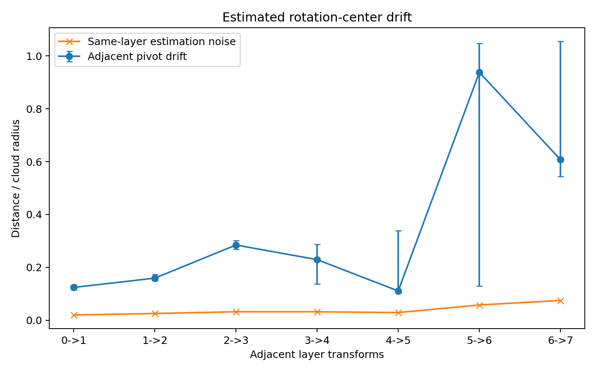

**Figure 19.** Estimated rotation-center drift in units of cloud radius. Error bars are bootstrap 95% confidence intervals. Orange estimates show drift attributable to estimation noise. Source: ROTATIONAL-DYNAMICS-003.

### Layer specific centers describe the observed motion

A single shared pivot across all eight layer rotations gives mean held-out R² 0.276. Allowing a different local pivot at each layer gives 0.307. Restoring the residual translation term gives full rigid R² 0.425. Pivot movement contributes about 0.031 held-out R² beyond a single fixed center, and the residual translation term contributes about 0.118 beyond moving-center rotation alone.

### The same result remains inside the large shared assembly

**Table 11. Rotation translation and moving pivots — panel 1 of 3**

| kind | Translation R² | Rigid R² | Affine R² | translation fraction |
| --- | --- | --- | --- | --- |
| all | 0.200 | 0.426 | 0.822 | 0.205 |
| delta | 0.258 | 0.487 | 0.833 | 0.281 |
| shared | 0.188 | 0.414 | 0.821 | 0.193 |

Source: ROTATIONAL-DYNAMICS-003. The experimental setting and definitions are given in the associated text.

**Table 12. Rotation translation and moving pivots — panel 2 of 3**

| kind | rotation fraction | deformation fraction | axial translation fraction 10deg | pivot offset over radius |
| --- | --- | --- | --- | --- |
| all | 0.229 | 0.566 | 0.897 | 0.207 |
| delta | 0.239 | 0.480 | 0.897 | 0.178 |
| shared | 0.230 | 0.577 | 0.867 | 0.276 |

Source: ROTATIONAL-DYNAMICS-003. The experimental setting and definitions are given in the associated text.

**Table 13. Rotation translation and moving pivots — panel 3 of 3**

| kind | pivot drift over radius median |
| --- | --- |
| all | 0.236 |
| delta | 0.188 |
| shared | 0.292 |

Source: ROTATIONAL-DYNAMICS-003. The experimental setting and definitions are given in the associated text.

The large shared component closely tracks the whole-cloud result. Translation and pivot migration therefore remain present when the analysis is restricted to the large common assembly rather than being created only by the small changed fragment.

### Mechanistic interpretation

The executed evidence supports a layerwise motion containing rotation + pivot migration + translation + assembly/affine change. Rotation is real, but it does not occur around one stationary global center. A local rigid subassembly can rotate, translate through residual space, dock with a new fragment, and then acquire a different effective pivot as the larger assembly continues to move.

## 8  How training builds functional fragment identity

Training replay turns the preceding runtime description into a developmental question: when does a geometrically recognizable part acquire a task-specific role?

*Experiment FRAGMENT-ORIGIN-PARAMETER-MECHANICS-001*

### Question

The previous experiments established that local fragments can form, move, register, click into larger assemblies, and remain dynamically active after the output is already readable. This experiment moves one level earlier and asks three questions:

- How does a fragment emerge during training?

- Where is a fragment when it is not currently being used?

- What are the parameters: stored fragments, or the machinery that creates and transforms fragments?

The experiment deliberately separates geometric pre-structure from functional fragment identity. A group of tokens can look coherent before training merely because of input/position geometry. A learned fragment is therefore not defined by shape alone; its correct identity must become selectively useful to downstream relational closure and readout.

### Exact replay contract

The original MODE-COLLISION controlled Transformer was retrained from the archived initialization with the original seed, data split, optimizer and update order. Checkpoints were retained at epochs 0, 1, 2, 5, 10, 20, 30, 40 and 50.

The replay is exact:

- initialization versus archived initialization: maximum absolute parameter difference = 0.0;

- epoch-50 checkpoint versus the archived frozen trained checkpoint: maximum absolute parameter difference = 0.0.

All earlier ROTATIONAL-PUZZLE results can therefore be placed on this same training trajectory without model-substitution ambiguity.

### Apparent piece ness exists before learning

At epoch 0 the delta-token group D already shows non-random-looking geometric structure on some shape/interface measures. Mean mid-stack shape-stability percentile is 0.750, and the mean transition-2→6 interface-strain reduction versus same-shaped shifted controls is 2.81%.

This is a crucial negative result. These metrics cannot by themselves define fragment birth. Token identity, sequence position and the untrained architecture already create geometric grouping. Training does not begin from an isotropic featureless cloud.

The functional markers tell a different story. At initialization, the held-out D→Y identity advantage is −0.0479, and the mean layer-3→8 real/null cycle-closure ratio is 0.9049. Wrong-piece donor swaps have mean effects approximately centered on zero.

The correct distinction is therefore:

pre-geometric piece-like material ≠ learned functional fragment.

### Functional fragment identity is acquired gradually

The D→Y identity advantage evolves:

- epoch 0: −0.0479

- epoch 2: −0.0019

- epoch 5: +0.0278

- epoch 10: +0.0444

- epoch 20: +0.0582

- epoch 30: +0.1534

- epoch 40: +0.2217

- epoch 50: +0.1367

The first positive D→Y identity signal occurs at epoch 5; it exceeds +0.05 by epoch 20. Relational closure strengthens earlier: the mean real/null cycle-closure ratio falls below 0.85 by epoch 10, reaches 0.6568 at epoch 40, then partially relaxes to 0.6848 at epoch 50.

Training accuracy crosses 95% at epoch 20 and reaches 100% at epoch 50.

Thus the observed order is approximately:

geometric material already present → relational closure strengthens → correct fragment identity becomes useful → behavior reaches full training accuracy.

The final ten epochs are not a monotone “tightening.” D→Y identity advantage peaks at epoch 40 and then falls while train accuracy reaches 100%. This is consistent with the earlier post-alignment result: once an output-compatible solution exists, internal geometry can continue to reorganize.

### Wrong piece sensitivity becomes late and state conditioned

A donor-swap intervention preserves each D fragment’s internal shape but shifts its centroid toward another real training fragment at a fixed representation. Early in training (epochs 0–20), mean wrong-piece penalties remain near zero. By epoch 30–40 a positive mean penalty appears in some representations, and at epoch 50 the strongest measured mean penalty is 0.118 at representation 3.

However, the effect is concentrated rather than universal: many individual prompt/donor swaps still leave margin unchanged or even improve it. The evidence therefore does not support a single globally privileged fragment pose or identity. It supports state-conditioned functional specialization: late training creates contexts in which substituting the wrong piece becomes costly.

### Fragment formation is distributed across learned operators

Parameter-component intervention provides the cleanest answer.

Starting from the random initialization and transplanting only the final learned component:

**Table 14. How training builds functional fragment identity**

| Variant | Train accuracy | Closure ratio | D→Y identity advantage |
| --- | --- | --- | --- |
| Initialization | 59.8% | 0.896 | −0.039 |
| + learned attention | 69.6% | 0.746 | +0.015 |
| + learned FFN | 79.5% | 0.811 | +0.072 |
| + learned attention + FFN | 99.1% | 0.708 | +0.157 |
| Full final model | 100.0% | 0.684 | +0.155 |

Source: FRAGMENT-ORIGIN-PARAMETER-MECHANICS-001. The experimental setting and definitions are given in the associated text.

Neither learned attention nor learned FFN alone recreates the trained system. Together, while embeddings, normalization and readout remain at initialization, they restore 99.1% train accuracy and essentially the full D→Y identity advantage.

The reverse intervention agrees. Resetting attention inside the final model lowers train accuracy to 87.5% and D→Y identity advantage to +0.078. Resetting FFN lowers train accuracy to 79.5% and the identity advantage to +0.067.

The useful fragment machinery is therefore co-adapted across transformation blocks. In this model, attention and FFN form the dominant functional substrate, but neither is a self-contained fragment store.

### Where parameter movement occurred

From initialization to epoch 50, the fraction of total squared parameter-update energy is:

- attention: 41.78%

- FFN: 34.96%

- embedding + positional parameters: 21.41%

- normalization: 1.56%

- readout head: 0.29%

Update energy is not the same as causal importance, but it shows that most training movement occurred inside the two operator families that also show the strongest transplant/reset effects. Earlier polar-decomposition experiments add an important refinement: Q/K/V/O parameter matrices followed coherent training trajectories containing both rotation and stretch (final mean rotation from initialization ≈ 0.252 rad; stretch displacement ≈ 0.224 relative units). The scalar values are therefore usefully interpreted as coordinates of learned operators, not as isolated stored facts.

### A concrete fragment instance lives in runtime activation geometry

The final model was run twice on the same prompts. Every recorded hidden state reproduced exactly: maximum absolute difference 0.0. With the parameters held fixed but the prompt changed, the D-fragment centroid varies strongly across examples. Mean between-prompt D-centroid distance grows from 2.606 at the embedding representation to 8.063 at the final representation, a 3.09× increase.

Therefore the trained parameters do not contain one prompt-specific D vector waiting to be retrieved. They generate a different fragment trajectory for each input. In this stateless controlled Transformer, once a forward pass is discarded, the prompt-specific activation fragment is gone unless an external system explicitly retains the activations/cache. What persists is the parameterized capacity to regenerate related fragment dynamics when another input is processed.

This statement is architecture-specific at the runtime level. Recurrent models and autoregressive deployments with retained state/cache can carry an instantiated fragment across steps. The broader distinction still holds: parameters define reusable transformation laws; activations instantiate the current object.

### What the parameters are current working answer

The strongest evidence-supported formulation is:

Parameters are not a warehouse of finished fragments. They are a distributed, co-adapted set of transformation operators that shape which prompt-conditioned activation fragments can form, how those fragments move, how their interfaces stabilize, and how they couple to downstream readout.

A useful four-level decomposition is:

- Parameter substrate — persistent learned coefficients / operator geometry.

- Pre-geometric material — input- and architecture-induced local grouping that can exist even before learning.

- Functional fragment — a local activation structure whose correct identity participates in learned closure and downstream computation.

- Runtime fragment instance — the particular prompt-conditioned activation object currently moving through the model.

This resolves the apparent question “where is the fragment normally?”: the instance is not normally sitting anywhere in a stateless model. The reusable possibility of forming that class of fragment is encoded in the learned operator system. Fragment detection must not begin from static clustering alone. Initialization already contains piece-like geometry. A valid fragment assay should require at least one functional criterion: identity-specific closure, selective downstream coupling, causal donor sensitivity, or reproducible assembly participation.

Likewise, parameter interpretation should move from individual scalar weights toward operator-level interventions. The meaningful question is not “which weight stores this piece?” but “which learned transformation family is necessary and sufficient for this piece to become a functional object under the relevant data conditions?”

### Experimental scope

This experiment is an exact replay of one controlled 8-layer Transformer and therefore establishes mechanism in that system, not a universal law for all architectures. The geometric pre-structure result is especially model/data dependent. Parameter transplant hybrids are deliberately out-of-distribution combinations; their value is mechanistic localization, not performance benchmarking.

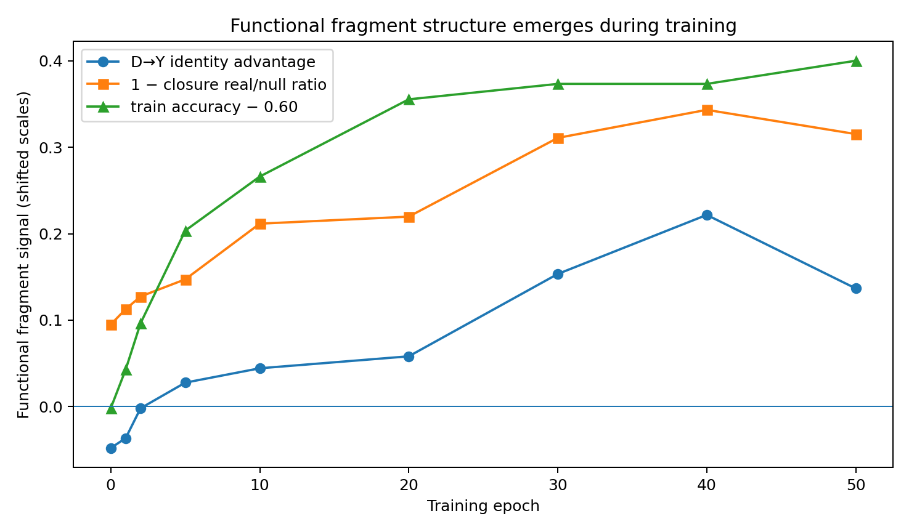

**Figure 20.** Fragment emergence. Exact replay of the controlled training trajectory. Geometry, functional coupling, parameter intervention and prompt-conditioned runtime states are measured separately. Source: FRAGMENT-ORIGIN-PARAMETER-MECHANICS-001.

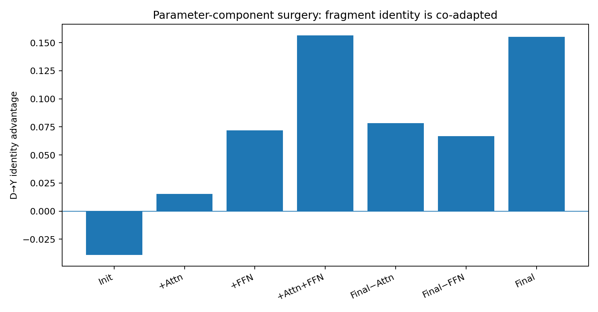

**Figure 21.** Parameter intervention. Exact replay of the controlled training trajectory. Geometry, functional coupling, parameter intervention and prompt-conditioned runtime states are measured separately. Source: FRAGMENT-ORIGIN-PARAMETER-MECHANICS-001.

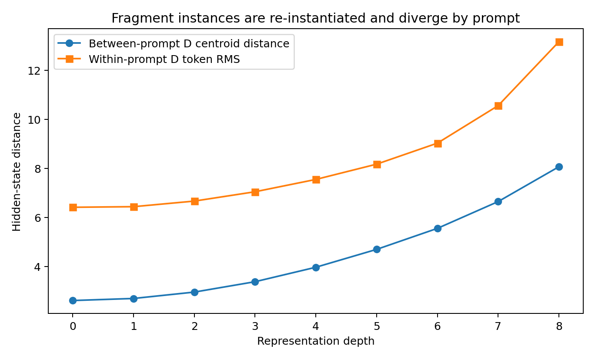

**Figure 22.** Runtime fragment location. Exact replay of the controlled training trajectory. Geometry, functional coupling, parameter intervention and prompt-conditioned runtime states are measured separately. Source: FRAGMENT-ORIGIN-PARAMETER-MECHANICS-001.

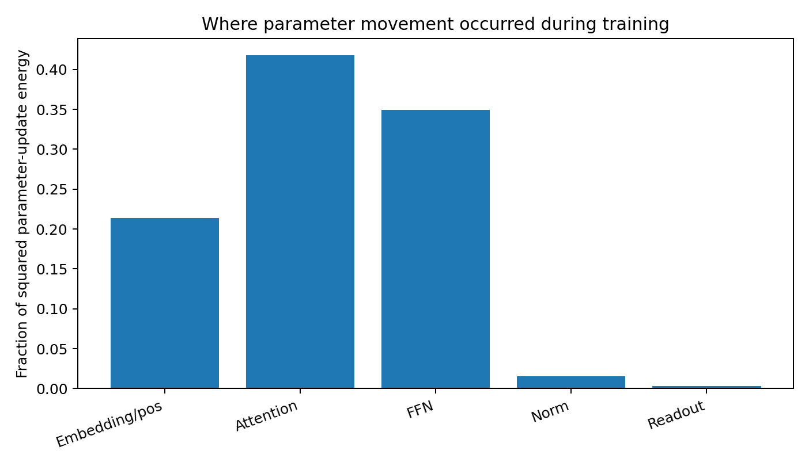

**Figure 23.** Parameter update energy. Exact replay of the controlled training trajectory. Geometry, functional coupling, parameter intervention and prompt-conditioned runtime states are measured separately. Source: FRAGMENT-ORIGIN-PARAMETER-MECHANICS-001.

## 9  Rigid transport and deformational steering

Finally, a continuous rigid clamp preserves the fragment shape after every local transformation. The resulting paths reveal how transport and shape change contribute to the native computation.

*Experiment DEFORMATION-TRANSPORT-001*

### Question

The dynamic-fragment program had already established that internal fragments translate, rotate, change interface geometry, and undergo non-rigid reconfiguration. The unresolved causal question is stronger:

Does a fragment need to reshape itself in order to move through the computation, or is self-deformation merely an accompanying phenomenon? The experiment therefore separates rigid-body motion from internal deformation and intervenes directly on the delta fragment D while keeping the rest of the hidden state unchanged at the intervention boundary.

### Experimental object

The experiment uses the same 70 matched TEXT/ACT prompts and the exact frozen TinyCausal checkpoint used by ROTATIONAL-PUZZLE-001–004. The ACT-side delta fragment D is defined mechanically by byte-level sequence alignment with the paired TEXT prompt. Sixty-seven pairs satisfy the frozen fragment-size gate, yielding 54 train and 13 held-out pairs.

The full forward pass is recorded at 18 frames:

embedding → L0.attn → L0.ffn → … → L7.attn → L7.ffn → final norm.

For every sublayer transition, the D-token cloud at frame t is fitted to the D-token cloud at t+1 by a proper Kabsch rigid transform. The next-state cloud is decomposed as:

$$
D_{t+1}=R_tD_t+b_t+E_t
$$

The non-rigid motion fraction is the residual energy ‖E_t‖² divided by total D-cloud motion energy.

### Native fragment motion contains substantial non rigid reconfiguration

On the frozen held-out cohort, the mean non-rigid fraction of D-fragment motion is:

- attention residual transitions: 0.170;

- FFN residual transitions: 0.266;

- early four sublayers: 0.172;

- middle six sublayers: 0.187;

- late six sublayers: 0.279.

The mean deformation fraction increases with depth (Spearman ρ=0.653, p=0.00610). Individual sublayer means range from approximately 0.118 to 0.345. Thus native fragment motion is neither pure rigid transport nor pure deformation: most displacement energy is rigidly explainable, while a substantial and increasingly large component changes internal shape.

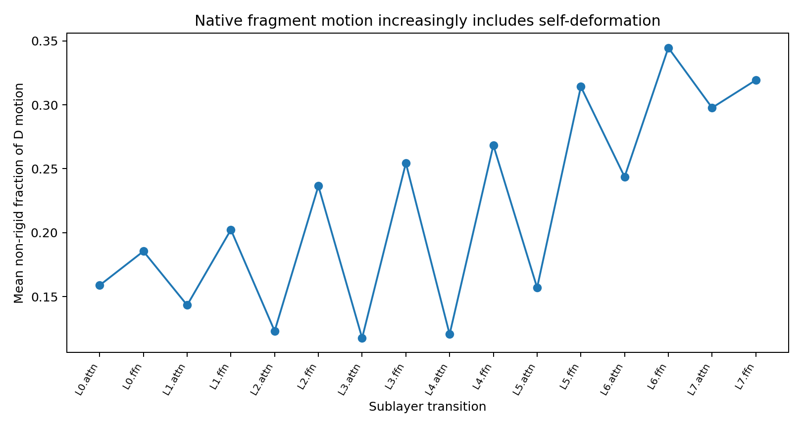

**Figure 24.** Native non-rigid fraction across sublayer transitions. Source: DEFORMATION-TRANSPORT-001.

### One step deformation dose

At each of the 16 raw sublayer transitions, the exact native D next-state is replaced by:

$$
D_{t+1}(\alpha)=D_{t+1}^{\mathrm{rigid}}+\alpha E_t,\quad\alpha\in\{0,0.25,0.5,0.75,1\}
$$

The D centroid is numerically matched to the native centroid at the intervention boundary. Therefore the intervention does not place the fragment in the wrong overall location. α=0 removes only self-deformation; α=1 reproduces the native D state. A second control circularly shifts the native residual vectors across D-token identities. This preserves the residual-vector multiset, Frobenius norm, and singular values, but assigns the deformation pattern to the wrong token positions.

### One missing deformation step is recoverable

A single rigid-only clamp causes a small but systematic future geometric deviation on held-out pairs when averaged within pair over all 16 possible intervention locations:

- mean future D-centroid divergence: +0.01173 fragment radii; 95% pair-bootstrap CI 0.00994–0.01361; directional Wilcoxon p=1.22×10⁻⁴;

- mean future D-shape divergence: +0.04666 relative distance error;

- mean future S–D interface divergence: +0.02339;

- final transport-direction cosine decreases by only 0.000216.

The corresponding wrong-deformation control produces larger geometric divergence:

- centroid divergence +0.01331 radii;

- shape divergence +0.06029;

- interface divergence +0.03257.

However, one-step deformation removal does not systematically damage final margin. Later layers can substantially repair the missing deformation. This already argues against the strongest “deformation is the propulsion mechanism” account.

### Continuous rigid clamp

The decisive experiment removes self-deformation repeatedly. Starting from one of eight preregistered raw frames (embed, L0.ffn, …, L6.ffn), every subsequent attention and FFN sublayer is allowed to execute normally. Immediately after each sublayer, only D is projected onto the closest rigid transform of its own previous state. The projection preserves whatever centroid translation and global rotation the current network attempted but removes all new internal shape change before the next sublayer.

Four conditions are compared:

- rigid-only: zero self-deformation at every subsequent sublayer;

- half-deformation: retain 50% of each newly generated non-rigid residual;

- native: retain 100%;

- wrong-deformation: retain the full deformation residual magnitude/spectrum but circularly assign residual vectors to the wrong D-token positions.

When the rigid clamp starts at the embedding frame, D pairwise geometry remains fixed to numerical precision: maximum relative shape change across the complete run is 1.94×10⁻⁷.

### Rigid transport continues under shape preservation

A perfectly rigid D fragment still traverses the entire network.

On the held-out cohort, the native D-centroid path length is 2.343 fragment radii on average. Under continuous rigid clamp it becomes 2.775 radii, a mean ratio of:

The mean held-out path-length ratio is 1.187×. All 13/13 held-out pairs travel farther under the rigid clamp (one-sided Wilcoxon p=1.22×10⁻⁴). On the train cohort, the corresponding ratio is 1.171×; 50/54 pairs travel farther (p=4.50×10⁻¹⁰).

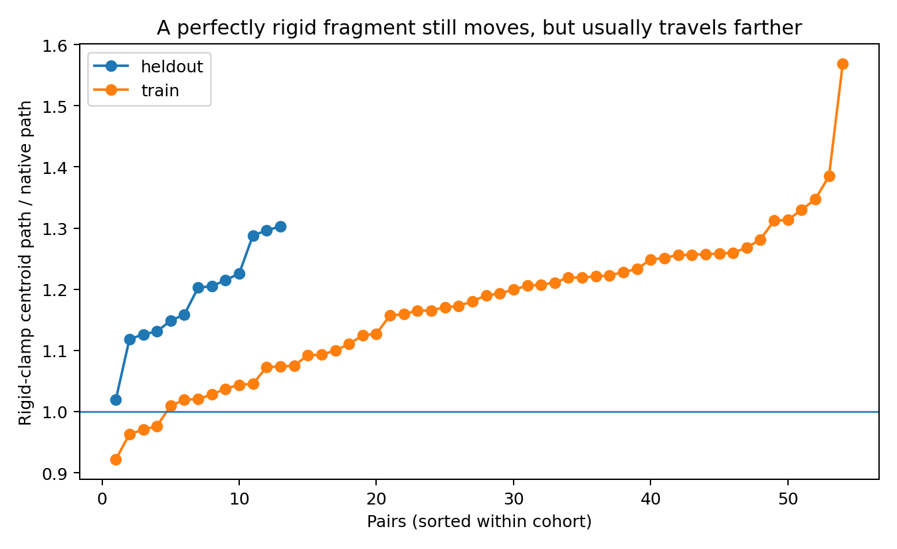

**Figure 25.** Rigid-clamped fragments continue moving but usually travel farther. Source: DEFORMATION-TRANSPORT-001.

This is a direct falsification of the strongest hypothesis:

Self-deformation is not required for gross fragment translation through this network. Locking the fragment into a perfect rigid body does not stop transport. In fact, the rigid fragment typically accumulates a longer centroid path.

### Self deformation controls the native trajectory and interface geometry

Although gross motion survives, the native route does not. With the continuous rigid clamp active from the embedding frame, held-out mean future S–D interface geometry diverges from native by 0.0797. Retaining half of native deformation reduces this to 0.0490, while full native deformation returns it to numerical zero. The same monotone ordering occurs in every held-out pair: within-pair Spearman correlation between deformation dose and interface divergence is −1.0.

Wrong deformation is worse than no deformation for interface placement. From the embedding start:

- held-out rigid-only interface divergence: 0.0797;

- held-out wrong-deformation divergence: 0.0925;

- wrong minus rigid: +0.0128, positive in 12/13 pairs, p=2.44×10⁻⁴.

The train cohort reproduces the same pattern:

- rigid-only 0.0890;

- wrong deformation 0.1028;

- difference +0.01384, positive in 50/54, p=4.75×10⁻¹⁰.

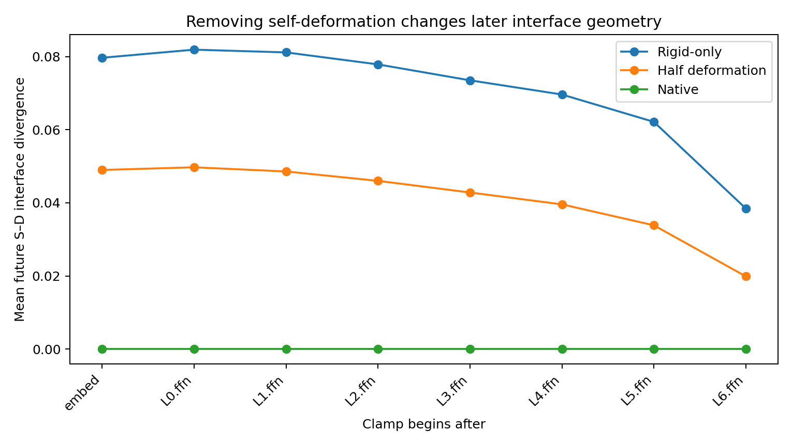

**Figure 26.** Continuous deformation dose controls later interface divergence. Source: DEFORMATION-TRANSPORT-001.

Therefore self-deformation is not just extra motion energy. The state-specific deformation pattern carries information about how the fragment should remain geometrically compatible with the surrounding assembly.

### Deformation and output behavior

On the 54 correctly learned training states, clamping D rigid from the embedding frame changes:

- accuracy: 100% → 96.30%;

- mean correct margin: 6.0506 → 5.7968 (Δ −0.2538).

Retaining half the native deformation restores 100% train accuracy and reduces the mean margin penalty to −0.0763. Full wrong deformation also yields 96.30% accuracy and a larger mean margin penalty of −0.3112. The functional effect is concentrated earlier in the stack. If the continuous rigid clamp begins at L3.ffn, train accuracy remains 100% and mean margin change is approximately −0.0439; beginning at L5.ffn leaves accuracy at 100% with mean margin change approximately −0.0008.

The held-out cohort behaves differently: the rigid clamp can improve the average held-out margin and accuracy. Baseline ACT accuracy is 61.54%; rigid clamping from the embedding raises it to 69.23%. This negative/generalization result is important. Native self-deformation is part of the learned training trajectory, but it is not synonymous with universally better output behavior. In some held-out cases, suppressing that learned deformation acts like a regularizing intervention.

### Verdict

The experiment separates three claims that should no longer be conflated.

- Does a fragment reshape while moving? — Yes. Native D motion contains substantial non-rigid energy, especially in FFN and later transitions.

- Must a fragment reshape in order to move at all? — No. A perfectly rigid fragment still traverses the network and actually travels about 17–19% farther in centroid path length.

- Does the native self-deformation matter? — Yes. Removing it causes systematic future path/interface divergence; restoring deformation dose monotonically restores native geometry; assigning the same deformation pattern to the wrong token positions disrupts the interface even more.

The best current mechanical description is therefore not “deformation is propulsion.” It is closer to:

Rigid transport provides gross motion; self-deformation provides trajectory shaping and interface accommodation. A useful physical analogy is a soft object moving through a constrained assembly process: it can still be pushed through while rigid, but it follows a less native, longer path and fits surrounding structures differently. The analogy is interpretation; the executed statement is the rigid-clamp result above.

The functional fragment should not be represented by either a static shape or a centroid trajectory alone. Its relevant state includes at least:

- rigid pose / centroid motion;

- internal deformation state;

- surrounding interface geometry;

- the coupling between those quantities over time.

Together, these measurements support recording both transport and deformation in an architecture-agnostic fragment instrument, rather than treating deformation as residual noise after removing a rigid fit.

## 10  What the experiments establish

The measured computational object is a prompt-conditioned assembly with evolving shape, position and relative orientation. Learned operator families generate functional fragments; relative interfaces organize their interaction; and rigid transport together with state-specific deformation shapes the path to downstream use. The distinction between parameter substrate and runtime fragment instance gives this account a concrete developmental basis.

## Implications for Data Oriented Modelling

Model analysis can follow the relations required by the data and measure how those relations form, move and couple to the output. Fragment identity, relative closure, motion components and causal downstream effects provide complementary coordinates for that analysis. Together they turn the puzzle analogy into a set of measurable operations.

## Experimental sources

- Experiment ROTATIONAL-DYNAMICS-001 and 002

- Experiment ROTATIONAL-DYNAMICS-001A to 001C

- Experiment ROTATIONAL-PUZZLE-001 and 002

- Experiment ROTATIONAL-PUZZLE-003

- Experiment ROTATIONAL-PUZZLE-003 coupling analysis

- Experiment ROTATIONAL-PUZZLE-004

- Experiment ROTATIONAL-DYNAMICS-003

- Experiment FRAGMENT-ORIGIN-PARAMETER-MECHANICS-001

- Experiment DEFORMATION-TRANSPORT-001
