# Reasoning Dynamics and Discrete Output

[Chapter 7](../README.md) · [Word report](02_Reasoning_Dynamics_and_Discrete_Output.docx) · [Evidence index](EVIDENCE_INDEX.md)

Data-Oriented Modelling · Chapter 7 · Report 2

## Overview

A generated token is both an observation of the current internal state and an input to the next computation. We study that loop by measuring hidden-state turns, token-conditioned motion and the future trajectories that follow an apparently identical output. The experiments connect two time scales. Relation-level traces show large angular reorientations during reasoning; token-level traces reveal recurring local actions within those relations. Continuation experiments then show how hidden geometry inside one visible token region carries information about what happens next.

## Question and experimental setting

How does a continuous internal trajectory become a sequence of discrete outputs that also helps control its own continuation? The evidence combines two independently initialized 48-state recurrent reasoners, a ten-dimensional token-level control system, readout and continuation assays, and an early prompt-phase trajectory analysis. Each experiment retains its own model, sampling unit and number of observed transitions.

## Terms used in this report

**Table 1. Terms used in this report**

| Term | Meaning in the experiments |
| --- | --- |
| CoT | A generated chain of intermediate reasoning tokens. |
| Angular movement | The directional component of a hidden-state change. |
| Readout | The map from the hidden state to output scores. |
| Token region | Hidden states that yield the same discrete token under the specified selection rule. |
| Continuation | The generated trajectory following the current state or prefix. |

## 1  The output loop

The mosaic picture is useful here: each symbol displays a coarse view of a richer internal configuration, while its feedback changes the next configuration.

*Experiment Discrete readout synthesis*

The sequence-output metaphor needs one important correction. The internal structure is not assumed to literally become one-dimensional before emission. In the decoder family studied here, the current high-dimensional state is mapped to vocabulary logits and then converted into a discrete token by the output rule:

z_t = W_out h_t + b,

x_t = Q(z_t),

where Q denotes the realized token-selection operation (for example greedy selection or sampling from the vocabulary distribution). The user-facing token is therefore a discretized symbolic readout of the current internal configuration. The most useful visual analogy is not flattening the whole cloud into a line, but placing a coarse mosaic over a much richer moving object: one discrete tile is emitted at each generation step.

The sequence is one-dimensional in temporal order, but each emitted symbol is the result of a discrete readout from a much richer state. The selected token is then appended to the context and becomes part of the condition for the next computation. The process is therefore a feedback loop:

internal configuration → discrete token → expanded context → new internal configuration → next discrete token.

This distinction matters because a sequence can preserve only a partial, quantized view of the internal dynamics while still actively participating in those dynamics.

## 2  Reasoning steps as directional state changes

We begin at the scale of complete relation steps, where the archived state and movement norms support an exact angular decomposition.

*Experiment COT-MOTION-001*

### Question

The earlier reasoning-control program already established that chain-of-thought is an explicit self-generated control trajectory: a generated thought action changes the state from which the next action is selected. The unresolved question was what kind of motion those control actions actually produce. COT-MOTION-001 asks a narrower geometric question: when a genuine relation-bearing CoT step moves the recurrent state, is the displacement primarily radial (changing state magnitude) or angular (changing state direction), and is entering or leaving answer-readiness explained by turn size?

### Frozen data

The experiment uses the two exact-generation models retained in STOPPING-GEOMETRY-022. Each is a 48-state GRU trained on the complete 64-question six-bit hierarchical-XOR universe. Direct, blank-think and relation-bearing CoT generation are exact; the CoT route contains five genuine relation steps. For every question and CoT depth k=0...5, the archived observables include hidden-state norm, movement norm, answer-readiness and answer margin.

This yields 640 genuine relation transitions: 64 questions × 5 transitions × 2 independent seeds.

### Exact angular decomposition

For consecutive hidden states h_k and h_(k+1), let

$$
r_k=\|h_k\|,\quad r_{k+1}=\|h_{k+1}\|,\quad d_k=\|h_{k+1}-h_k\|
$$

The inter-state angle is recovered exactly from the cosine rule:

$$
\cos(\theta_k)=\frac{r_k^2+r_{k+1}^2-d_k^2}{2r_kr_{k+1}}
$$

The squared displacement decomposes exactly as

$$
d_k^2=(r_{k+1}-r_k)^2+2r_kr_{k+1}[1-\cos(\theta_k)]
$$

The first term is radial change. The second is directional/angular change. No hidden vector reconstruction or fitted projection is required for this decomposition.

### Genuine CoT motion is overwhelmingly angular

Across all 640 transitions, mean turning angle is 1.1522 rad (66.02°). The mean fraction of squared displacement attributable to angular change is 99.779%; the median is 99.889%. The minimum angular fraction over all 640 transitions is still 98.507%. Every transition exceeds 95% angular contribution, and 97.03% exceed 99%.

The two independent seeds agree on the qualitative result:

- seed 22022: mean angle 1.2004 rad; mean angular share 99.730%

- seed 22023: mean angle 1.1040 rad; mean angular share 99.827%

Thus, in this exact recurrent reasoning system, the five relation-bearing CoT steps are not primarily expanding or contracting state magnitude. They repeatedly reorient the state.

### The turns become somewhat smaller but remain directional throughout the chain

Mean angle by genuine relation transition is:

**Table 2. Reasoning steps as directional state changes**

| CoT transition | Mean angle | Mean angular share |
| --- | --- | --- |
| 0→1 | 1.2916 rad (74.00°) | 99.503% |
| 1→2 | 1.1538 rad (66.11°) | 99.852% |
| 2→3 | 1.1081 rad (63.49°) | 99.834% |
| 3→4 | 1.1170 rad (64.00°) | 99.912% |
| 4→5 | 1.0906 rad (62.49°) | 99.794% |

Source: COT-MOTION-001. The experimental setting and definitions are given in the associated text.

The first relation action makes the largest coarse-grained turn (~74°); later relation steps settle near 62–66°. The archived states are sampled once per genuine relation step, not once per generated token, so this experiment establishes angular relation-step control, not a claim that every individual token performs a 60° rotation. Token-scale motion can be substantially finer.

### Direction and answer readiness

The old stopping result showed that readiness is non-monotonic: a genuine correct relation action can move a model from ready to not-ready and later back to ready. COT-MOTION-001 asks whether those boundary crossings simply use larger turns.

They do not. Mean turn angles are tightly overlapping:

**Table 3. Reasoning steps as directional state changes**

| Transition type | n | Mean angle | Mean correct-signed margin change |
| --- | --- | --- | --- |
| NN | 137 | 1.1596 rad (66.44°) | +1.015 |
| NR | 150 | 1.1378 rad (65.19°) | +11.117 |
| RN | 90 | 1.1672 rad (66.88°) | -9.140 |
| RR | 263 | 1.1515 rad (65.97°) | +2.082 |

Source: COT-MOTION-001. The experimental setting and definitions are given in the associated text.

Across all four readiness-transition classes, a Kruskal–Wallis test gives H=2.535, p=0.469. Among already answer-ready states, 90/353 (25.50%) leave readiness at the next genuine relation step, while 263/353 remain ready. Their mean turn angles are 1.1672 and 1.1515 rad; the mean difference is 0.0158 rad, with bootstrap 95% CI [−0.0198, 0.0500] and Mann–Whitney p=0.353.

The same conclusion survives conditioning on seed, relation depth and current answer token: matched cells show no consistent sign in the RN-minus-RR angle difference. Therefore an identical immediate answer can sit in states that respond differently to the next CoT action even when the next turn has a similar magnitude.

### Turn angle and answer margin

Turn angle has only a very weak relation to the change in correct-signed answer margin: Spearman ρ = -0.086 (p=0.030). Total step norm is even less informative: ρ = -0.037 (p=0.344). This aligns with the earlier finite-work result from COT-BUDGET-GEOMETRY-021: a local linear gradient-dot-motion approximation correlates only about 0.24 with the exact finite margin gain, while numerical path integration closes the actual finite gain to ~3.6e-5. The useful object is therefore a directed nonlinear state transition, not a scalar amount of computation or displacement.

### Integration with the rotational puzzle results

The result supplies the missing bridge between the old control program and the newer motion program:

- The old work established that visible CoT is a self-generated motor-control trajectory over predictive state.

- COT-MOTION-001 shows that the coarse relation-step movement in that trajectory is almost entirely directional/angular rather than radial.

- ROTATIONAL-PUZZLE-002 independently showed that equal-angle random directions are systematically worse than the model's actual layerwise turns, especially after the answer is already readable.

- ROTATIONAL-PUZZLE-003 localized fragment formation, directed registration/closure and late readout handoff as separable phases.

Together these results suggest a more concrete interpretation of CoT motor control: a thought action supplies another opportunity to reorient and re-register internal relations. The visible text is the control action; the state motion is the computational consequence. The current evidence does not imply that CoT is a dedicated rotation module, nor that every token corresponds to a fixed-angle micro-rotation. It supports a weaker and more useful statement: in the exact reasoning system measured here, genuine CoT actions move hidden state overwhelmingly by reorientation, and whether the move helps or harms the immediate answer is determined by state-conditioned direction rather than turn magnitude.

The natural control variable is not CoT length. A length budget counts how many state transformations are permitted but discards their geometry. A better object is the sequence

thought action → local transformation → relative state orientation → continuation stability.

This reframes “more thinking” as “more control opportunities.” Longer CoT can refine internal compatibility, but it can also rotate an already-answer-ready state out of the current output-compatible region. The stopping problem and the rotational-puzzle problem are therefore two views of the same dynamics: one observes when the trajectory crosses an output boundary; the other asks what transformation the trajectory is performing while it crosses.

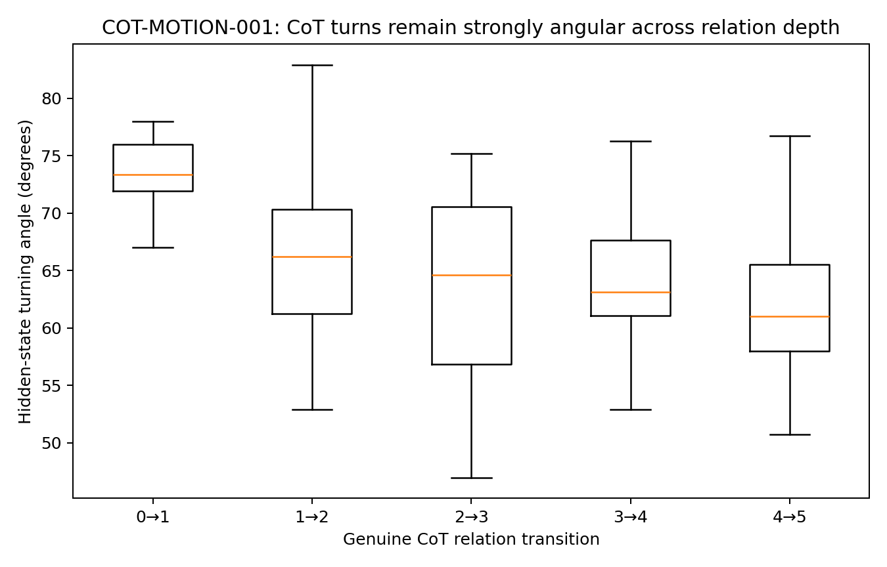

**Figure 1.** Angle by step. Two independently initialized recurrent reasoners and 640 relation-step transitions. The figures show stepwise angle, readiness transitions and answer-margin changes. Source: COT-MOTION-001.

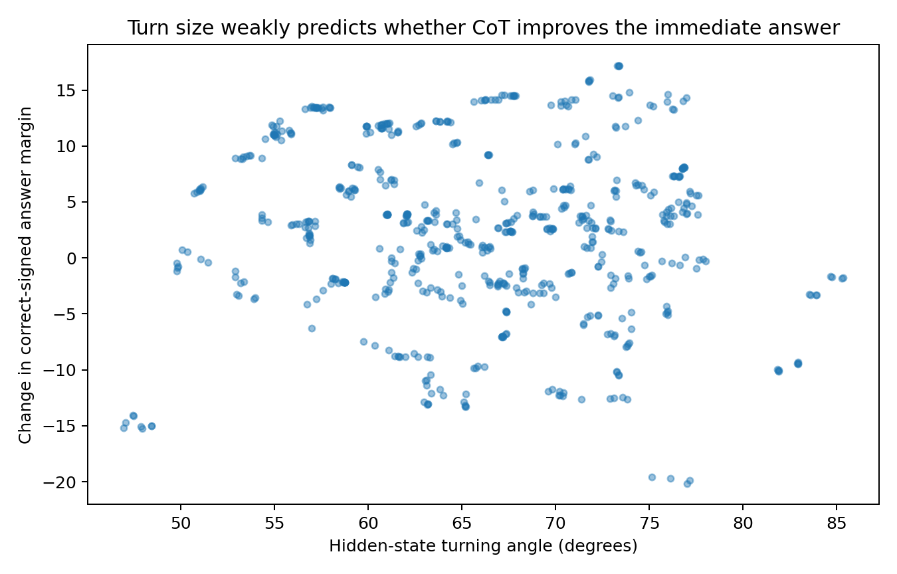

**Figure 2.** Angle vs margin. Two independently initialized recurrent reasoners and 640 relation-step transitions. The figures show stepwise angle, readiness transitions and answer-margin changes. Source: COT-MOTION-001.

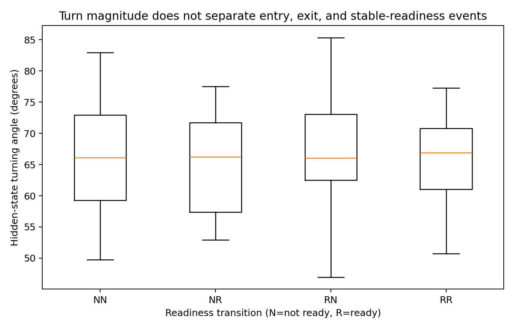

**Figure 3.** Readiness turns. Two independently initialized recurrent reasoners and 640 relation-step transitions. The figures show stepwise angle, readiness transitions and answer-margin changes. Source: COT-MOTION-001.

## 3  The local action of an emitted token

Recording every token exposes the smaller transformations through which a reasoning relation is executed.

*Experiment COT-MOTION-002*

### Question

COT-MOTION-001 established that genuine relation-bearing CoT steps in the exact reasoning system are overwhelmingly angular state movements. The new question is finer: what happens at the visible-token scale, where the model must emit a discrete token and feed that token back into the next recurrent update? This directly incorporates the current working interpretation: CoT was already established as motor control in the earlier program; the unresolved object is the motion being controlled. A token is treated here not as a passive transcript but as a discrete action in an autoregressive feedback loop.

### Frozen token level evidence

The experiment re-analyses PROMPT–CoT–ANSWER CONTROL FIELD 007, which had already expanded eight complete prompt→CoT→answer trajectories into explicit token-level states. The archive contains 352 visible tokens, their 10-dimensional hidden states, 6-dimensional token embeddings, exact recurrent-state Jacobians A_t, token-input Jacobians B_t, future-trajectory control axes, and adjacent control-of-control measurements.

There are 344 consecutive hidden-state transitions, including 248 transitions whose target token is in the CoT phase. No model is retrained and no hidden state is reconstructed from a fitted surrogate.

### Token level CoT movement is again overwhelmingly angular

Across the 248 CoT-token transitions, mean turn angle is 75.75° and median 70.72°; the interquartile range is 62.22°–87.29°. Mean angular contribution to squared displacement is 99.006%, with median 99.836%. Bootstrap over the eight independent question trajectories gives a 95% interval of 75.34°–76.22° for the question-level mean angle and 98.980%–99.036% for angular share.

This corrects one part of the verbal working picture. In this small 10-dimensional GRU, a visible CoT token is not a tiny angular nudge. It is a large discrete angular pulse. The hypothesis that large language models implement the same control with much smaller layer- or feature-level micro-turns remains open; it is not established by this system.

### Token identity behaves like a reusable movement primitive

Movement directions are highly token-specific. Across different questions, the mean cosine between movement directions produced by the same CoT token is 0.9528, whereas pairs with different tokens average −0.1016. A leave-one-question-out predictor that uses only the token identity to predict the 10D movement vector achieves mean cosine 0.9789 and only 3.94% of the global-centroid MSE; all eight held-out questions improve.

The result is not solely a same-position artifact. For recurrent tokens appearing at different positions, cross-position movement-direction cosine remains high: 0 0.909, 1 0.893, ; 0.982, compute 0.834, result 0.965, and xor 0.936. Token roles also have sharply different turn magnitudes: for example, result averages 43.59°, xor 63.92°, 0 74.40°, compute 77.60°, and ; 115.64°.

In this controlled recurrent system, the visible token therefore behaves like a discrete movement command rather than a neutral label emitted after the computation is already finished.

### State geometry after a shared token

A shared token applies a stereotyped movement but does not reset all contexts to one hidden state. For pairs of trajectories receiving the same CoT token, pre-token and post-token pairwise state distances have Spearman ρ = 0.922. The median post/pre distance ratio is 0.369 (mean 0.401): the token often compresses the state geometry, but the ordering of which states are near or far is strongly preserved.

This supplies a concrete mechanism for an important observation: the same visible token can be emitted from different internal orientations and can leave the model in different next states. A token is therefore both a shared discrete action and an operation applied to a state that still carries continuous trajectory information.

### The token input has a measurable directional contribution

Using the archived local input Jacobian, the first-order token-input drive B_t e_t has mean cosine 0.424 with the actual CoT hidden-state movement (question-bootstrap 95% interval 0.420–0.427). The corresponding local state-linear term A_t h_{t-1} alone has mean cosine only 0.022 under this simple decomposition. Because a nonlinear GRU is not globally decomposable into these two local linear terms, this is not an exact causal accounting of the step. It nevertheless shows that the discrete token input carries a substantial local directional component.

The earlier CONTROL FIELD experiment independently found that the CoT future-control frame itself rotates by about 49.3° on average and that the actual token action projects substantially onto the local top-two future-control plane. The present finite hidden-state measurement therefore matches the older differential control-field picture.

### Why an already correct model may keep moving

The current working model should explicitly separate continuous internal configuration from discrete autoregressive emission. A useful schematic is:

continuous hidden configuration → discrete token readout/action → token re-injection → next hidden transformation.

Or, schematically, h_t → y_t → E(y_t) → h_{t+1}.

The key point is that y_t is not only a report of h_t; once emitted, it becomes part of the next control input. The model therefore cannot be assumed to finish a continuous registration process in silence and only then speak. It interleaves internal reorientation with discrete token actions. This gives a concrete interpretation to the observation that “the first visible output can be identical while the later CoT path differs.” Identical tokens do not imply identical hidden orientations. COT-MOTION-002 shows exactly the required geometry: the same token applies a highly reproducible angular operation, yet distinct pre-token states remain distinctly ordered after that operation. The next recurrent step therefore begins from different continuous states even when the visible action was the same.

This also clarifies why output compatibility need not equal complete internal registration. A state can already lie in a region from which the current output token is correct, while the relative internal configuration still supports multiple later trajectories. Longer CoT provides additional transformation opportunities, but each additional emitted token is also another discrete control pulse and therefore another opportunity to refine, redirect, or destabilize the trajectory.

The evidence does not establish that token emission is the sole reason alignment is imperfect, nor that large language models use the exact large-angle pulses seen in this tiny GRU. It does support the stronger architectural interpretation that autoregressive emission participates in the dynamics rather than merely narrating them.

### Integrated interpretation with the rotational puzzle line

The combined working chain is now:

fragment/state configuration → selected local transformation → discrete token action → token-conditioned next transformation → relative registration / closure → output-compatible region.

This extends the earlier conclusion that CoT is motor control. The new evidence identifies visible tokens as repeatable angular control primitives in a controlled autoregressive system, while the fragment experiments show that useful internal directions and relative closures are not reducible to one global axis. The natural unit of analysis is neither a token nor a hidden state in isolation. It is a state-conditioned token operator: the same discrete action can induce a characteristic local turn while preserving continuous information about where the system came from. For model design and diagnosis, the relevant object is therefore the sequence of state-conditioned transformations and their compositional stability, not raw CoT length.

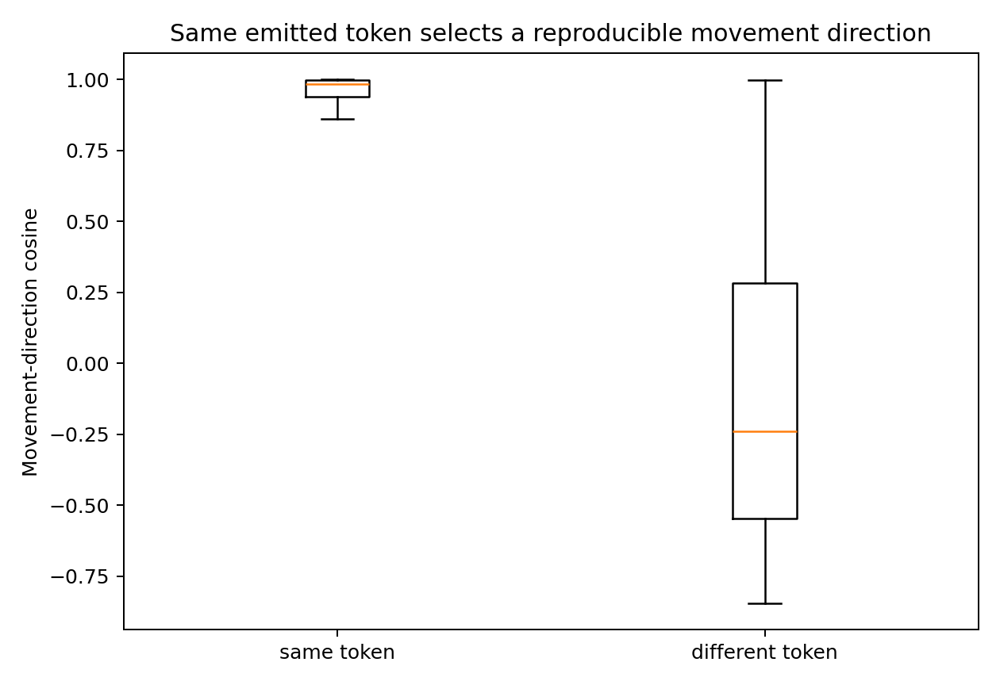

**Figure 4.** Pairwise movement-direction cosine for transitions that emit the same token or different tokens. The token-level control system supplies 344 consecutive transitions, including 248 chain-of-thought transitions; boxes summarize the resulting cosine distributions. Source: COT-MOTION-002.

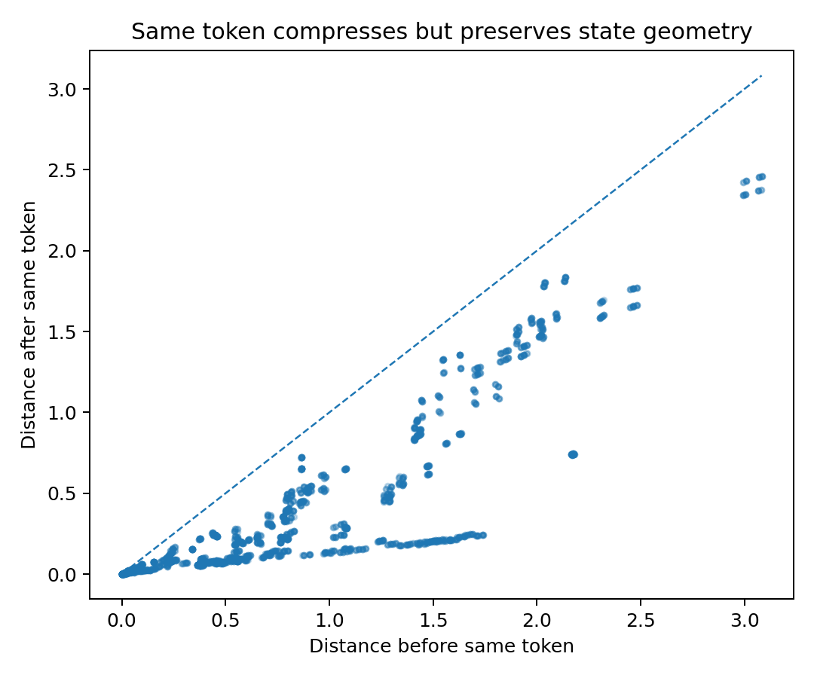

**Figure 5.** Pairwise hidden-state distance before and after the same emitted token. Each point compares one pair of internal configurations; the dashed line is the identity line. The token-level control system supplies 344 consecutive transitions, including 248 chain-of-thought transitions. Source: COT-MOTION-002.

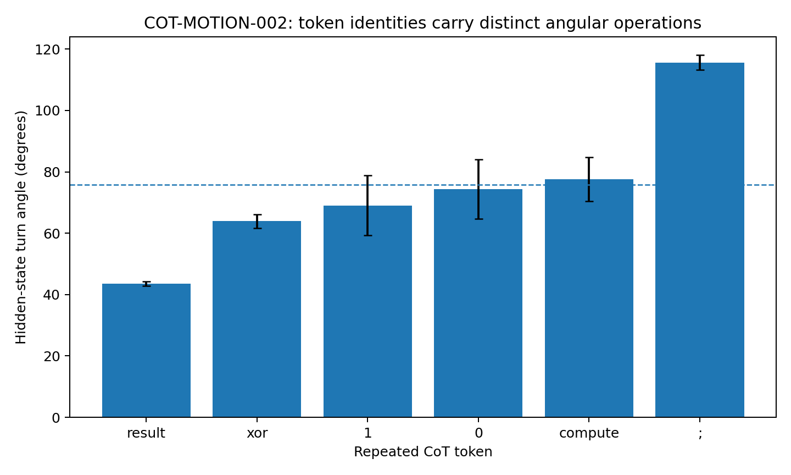

**Figure 6.** Token angles. Token-level control system with 344 consecutive transitions, including 248 chain-of-thought transitions. Token-angle error bars show across-transition standard deviation. Source: COT-MOTION-002.

## 4  One visible token and several possible futures

The same output symbol can sit above different internal states. Matched-token and matched-answer comparisons reveal which hidden differences carry through to later behavior.

*Experiment READOUT-FUNNEL-001*

### Question

The mechanical picture separates a high-dimensional moving internal configuration from the narrow autoregressive interface through which only one discrete token is emitted at a time. Tokenization combines dimensional reduction with discretization: many continuous internal configurations can be rendered as the same discrete tile.

READOUT-FUNNEL-001 asks two linked questions:

- How much continuous hidden geometry is collapsed into the same visible token tile, and does the hidden geometry inside one tile still predict later surface trajectory?

- When the current answer is already correct, how often does the future CoT still leave correctness, and can multidimensional state geometry predict that instability better than current confidence alone?

The experiment does not assume that tokenization is literally a geometric projection of fixed dimension. “Funnel” and “mosaic” are operational names for two measurable many-to-one mappings: continuous state → discrete token, and internal state → human-visible current correctness.

### Data and experimental setting

### Arm A token mosaic

PROMPT–CoT–ANSWER CONTROL FIELD 007 contains eight complete prompt→CoT→answer trajectories, 352 visible tokens, and a 10-dimensional hidden state at every token. The CoT portion contains 31 token positions per question. All measurements below use the archived states directly.

### Arm B surface correctness versus future stability

STOPPING-GEOMETRY-022 contains two independently initialized exact-generation 48-state GRUs. Each model solves all 64 hierarchical-XOR questions with a five-step genuine relation-bearing CoT. Every CoT depth stores current answer correctness, confidence, margin, local boundary-radius proxy, state norm, movement and logit change. This arm uses 353 states that are currently answer-ready and still have at least one genuine CoT step remaining.

### The visible token is a coarse mosaic tile over continuous hidden geometry

Across the 31 CoT positions, 22/31 positions emit exactly the same current token for all eight questions. At those positions, the visible token contains no information about which of the eight continuous states is present, even though the hidden states remain distinct. Using a position-wise ANOVA-style variance decomposition, current token identity explains on average 28.87% of between-question hidden-state variance (position-bootstrap 95% CI 12.89%–45.00%). Equivalently, 71.13% remains invisible to the current token on average.

The final binary answer label is an even narrower surface: across the same CoT positions it explains only 8.65% of hidden variance on average (95% CI 1.82%–18.25%), leaving 91.35% unresolved. The residual geometry inside a token tile is not arbitrary high-dimensional noise. Among 38 position×token cells with at least four states, median participation ratio is 1.001 and median top-2 energy is 99.9997%. In this small GRU, one discrete token often covers a thin continuous filament rather than one point.

### The same visible tile can conceal different future surface paths

At the 22 structural positions where all eight questions currently emit the same token, there are 616 same-tile state pairs. Of these pairs:

- 71.75% diverge somewhere in the next five visible tokens (position-bootstrap 95% CI 65.91%–77.76%);

- 83.44% diverge somewhere in the next ten visible tokens (95% CI 77.44%–88.80%).

The result survives an even narrower human-visible condition. Among 310 pairs with both the same current token and the same final answer token, 59.68% still differ somewhere in the next five visible tokens and 65.48% differ within the next ten. Thus a current token — and even the combination of current token plus eventual binary answer — can hide multiple distinct continuation trajectories.

### Hidden geometry inside one token tile predicts the later surface trajectory

The hidden differences concealed by a shared token are not inert. For each state, the nearest hidden-state neighbor among states carrying the same current token was compared with the average same-token alternative. Over the next five tokens, the hidden-nearest same-token neighbor has 6.75 percentage points less surface Hamming divergence than the average same-token alternative (position-bootstrap 95% CI 3.16–10.36 pp; position-level one-sided Wilcoxon p=0.000739). Over ten tokens, the advantage is 6.83 pp (95% CI 3.59–10.37 pp; p=0.000446).

A second analysis normalizes hidden distance within each token position. Same-token pairs that later diverge within five tokens occupy a higher hidden-distance rank than pairs that stay surface-identical (0.545 vs 0.467, Mann–Whitney p=0.000355). The ten-token comparison is 0.538 vs 0.447, p=0.000441. The effect is modest rather than deterministic, but it is exactly the signature required by the mosaic interpretation: information removed from the current visible tile remains present in continuous state geometry and reappears in later output.

### Current output and subsequent continuation

In the independent STOPPING archive, 123/353 = 34.84% of states that are currently answer-ready later leave the answer-ready set if genuine CoT continues.

High confidence does not remove the problem. Among 159 currently correct states with confidence at least 0.999, 48 (30.19%) later leave readiness. The median current confidence is lower for future-unstable than future-stable states (0.9750 vs 0.9987), so confidence contains some signal, but a high value is not a clearance certificate.

For predicting whether a currently correct state remains correct for all remaining genuine CoT steps:

- current confidence AUROC = 0.662;

- absolute margin AUROC = 0.662;

- local boundary-radius proxy AUROC = 0.637;

- question-grouped 8-fold logistic model using the full current observable geometry AUROC = 0.935, balanced accuracy = 0.852.

The multivariate model is not yet the proposed trajectory-tube clearance statistic, but it establishes the essential point: future stability is a property of the broader state geometry, not of the currently visible correct answer alone.

### Dimensional reduction followed by mosaicization

The current mechanical picture now has two distinct lossy operations. First, a rich internal relational cloud is brought into a state compatible with the autoregressive output interface. Second, the interface commits to one token from a discrete vocabulary. The second operation is not merely “lower dimension”; it is quantization. A continuously varying family of internal configurations is rendered as the same categorical tile.

A useful shorthand is:

continuous relational cloud → readout-compatible slice → discrete token mosaic → human semantic reading.

The spoon/fork-through-a-slit analogy clarifies why this matters. Seeing the handle outside the slit certifies only that one visible part has passed. The larger object can already be in a different orientation behind the wall. READOUT-FUNNEL-001 gives the controlled-model analogue: states under the same current token tile can retain predictive continuous geometry, and many currently correct states later leave correctness under continued genuine CoT.

The mosaic should therefore not be treated as the state itself. A token is a lossy tile placed over a continuous moving object. The tile can be identical while the hidden object underneath differs in pose, relational closure, and future trajectory.

The result also sharpens the status of CoT. A reasoning token is simultaneously:

- a coarse visible sample of the current internal configuration;

- a discrete control action that is fed back into the next update;

- a quantized boundary condition that cannot reveal all of the continuous geometry it helps move.

This is why the visible chain can look simpler, noisier, or even temporarily wrong while the underlying computation remains a structured dynamical process.

This experiment gives a concrete reason not to use the visible token sequence as the sole state description. The data show a many-to-one map from continuous state to token identity, followed by future re-expansion of hidden differences into distinct surface trajectories. A DOM analysis should therefore preserve both levels:

continuous cloud geometry + discrete emitted tile. The appropriate unit is a state-conditioned quantized control process, not a string alone.

### Experimental scope

The token-mosaic arm is measured in one small 10D controlled GRU with eight trajectories; the future-stability arm is measured in two independent exact 48-state GRUs on the six-bit reasoning world. These two archives establish complementary pieces of the funnel picture but do not yet measure one full high-dimensional Transformer trajectory tube from hidden cloud through vocabulary logits to human semantic judgment.

The current evidence supports:

- many continuous states can share one current token;

- hidden geometry concealed by the token predicts later surface trajectory;

- current correct readout can precede later loss of correctness;

- multivariate state geometry predicts future stability much better than current confidence alone.

It does not yet establish a universal readout-funnel dimension or a literal fixed-dimensional slit in large language models.

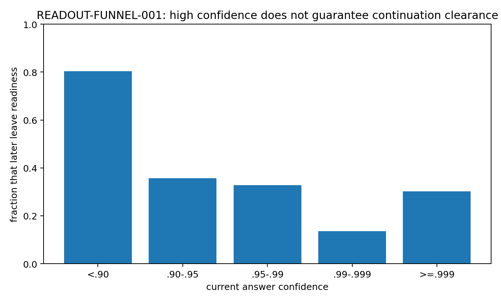

**Figure 7.** Confidence vs future exit. Archived token-level and relation-level continuation assays. Each panel retains the source study sampling unit; predictions are evaluated with the reported held-out grouping. Source: READOUT-FUNNEL-001.

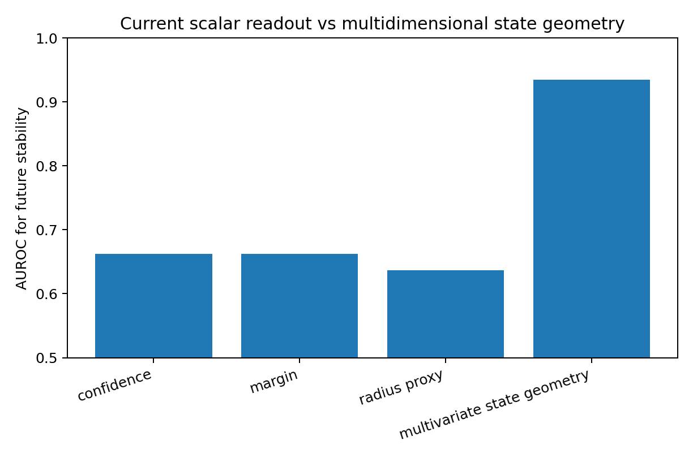

**Figure 8.** Future stability auc. Archived token-level and relation-level continuation assays. Each panel retains the source study sampling unit; predictions are evaluated with the reported held-out grouping. Source: READOUT-FUNNEL-001.

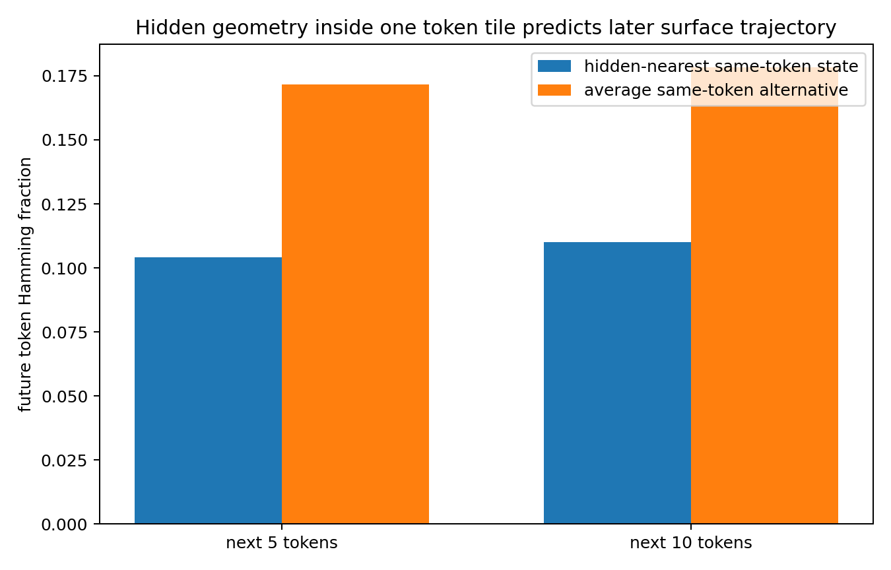

**Figure 9.** Hidden geometry predicts future. Archived token-level and relation-level continuation assays. Each panel retains the source study sampling unit; predictions are evaluated with the reported held-out grouping. Source: READOUT-FUNNEL-001.

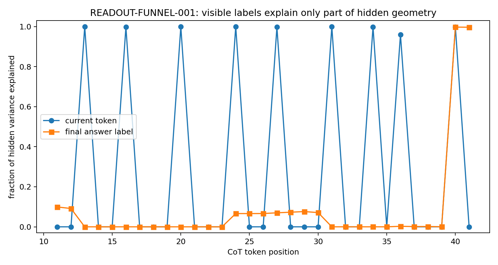

**Figure 10.** Hidden variance projection. Archived token-level and relation-level continuation assays. Each panel retains the source study sampling unit; predictions are evaluated with the reported held-out grouping. Source: READOUT-FUNNEL-001.

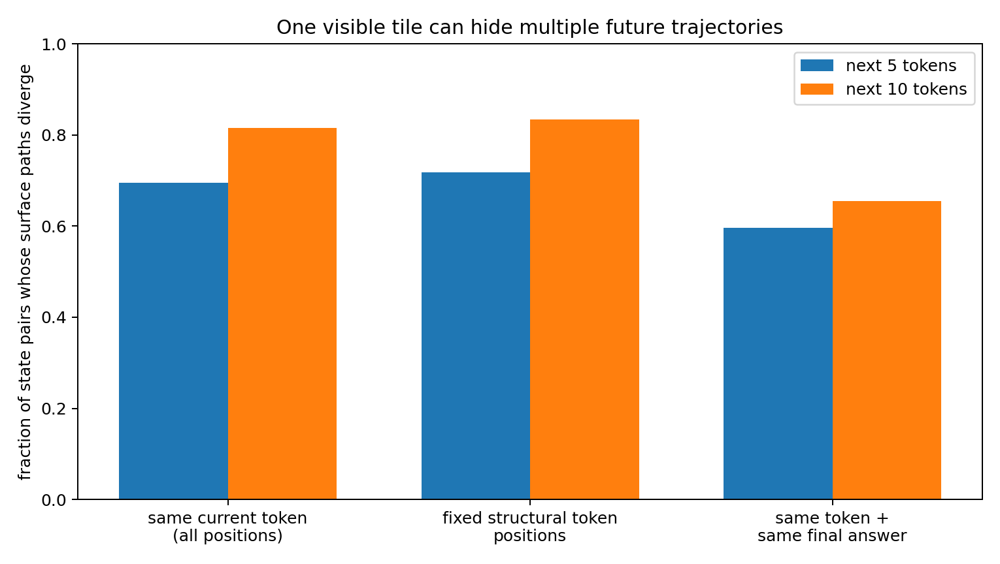

**Figure 11.** Same tile future divergence. Archived token-level and relation-level continuation assays. Each panel retains the source study sampling unit; predictions are evaluated with the reported held-out grouping. Source: READOUT-FUNNEL-001.

## 5  The trajectory begins during the prompt

The motion record can be extended backward to the period before the first visible reasoning token.

*Experiment Pre-reasoning trajectory study*

### Question

What becomes organized before the first visible reasoning token? The analysis treats the prompt and early reasoning sequence as a continuous internal movie rather than as a static hidden-state snapshot. It asks whether a motion scaffold, answer geometry, or coherent rotation is already present before visible CoT begins.

### Data

The frozen archive contains 8 complete prompt→CoT→answer trajectories, 352 visible tokens, 344 adjacent 10-dimensional hidden-state transitions, including 80 prompt transitions and 248 CoT transitions. No model was retrained. Hidden positions were reconstructed only up to a common translation by cumulatively summing the archived exact transition vectors; all reported relative geometry is translation-invariant.

### A low dimensional motion scaffold exists during the prompt

Across all prompt transitions, the first two movement modes explain 92.30% of centered displacement energy; effective rank is 2.35. For comparison, CoT movement has top-2 energy 85.07% and effective rank 3.20. Thus the pre-CoT phase is not an unstructured cloud waiting for reasoning to begin. Its movement is already concentrated into a small dynamical subspace.

The prompt and CoT top-2 motion subspaces also overlap strongly: their two principal angles are 9.81° and 37.30°. At least one major CoT movement direction is therefore substantially present before visible reasoning starts.

### The early scaffold is highly reusable across questions

At each prompt position, movement directions across the eight questions are nearly identical (mean pairwise cosine approximately 0.99). Even the literal values 0 and 1, when they recur at different prompt slots, reuse similar movement primitives: cross-position mean cosine is 0.910 for 0 and 0.894 for 1. At the same value slot, the mean movement directions induced by 0 and 1 remain extremely close (cosine 0.985–0.997 across slots), while differing in smaller directional/magnitude components. This supports an engineering picture in which prompt ingestion first runs a common movement program and encodes the particular data as relatively small deviations within it.

### The first coherent turning regime appears before visible CoT

Five-frame dynamic windows were scanned across the prompt. Windows ending before the final prompt segment do not show a consistent turn sign. The final pre-CoT window, states t6→t10, changes sharply: mean turn-sign coherence becomes 1.000 across all eight trajectories.

A 10,000-draw frame-order shuffle preserving the same five states gives mean coherence 0.567; the observed ordered sequence has empirical p=0.00020. The first visible CoT token (compute) occurs at t11. Therefore the model enters a coherent directional-turning regime before the first visible reasoning token is emitted.

### Early motion and later answer organization

The eight questions divide evenly into final answer 0 and 1. At every prompt position, exact balanced-label permutation tests fail to show significant final-answer separation. The first per-position exact permutation value of p=0.0286 appears at t40, late in CoT, where leave-one-out nearest-centroid accuracy reaches 1.0 and remains 1.0 thereafter. This timing result is exploratory and is not presented as a multiple-testing-corrected change-point claim.

This matters because it separates two objects:

- early formation: a low-dimensional, reusable motion scaffold and a coherent turning regime;

- late formation: a geometry that cleanly separates the final discrete answer.

The early trajectory trace therefore does not support the idea that the final answer is simply sitting fully formed in the prompt state. It supports a dynamical preparation process that precedes answer-specific organization.

### The early trajectory repeatedly reorients rather than monotonically approaching the endpoint

Cosine between the cumulative prompt state and its own terminal state oscillates strongly: after value-token positions it can be high (for example mean 0.925 at t2, 0.858 at t4, 0.818 at t8), then falls again around structural prompt tokens (reason, :) before CoT begins. Thus early computation is not a monotone march toward the terminal vector. It repeatedly approaches and leaves terminal-like orientations while the common motion scaffold is being executed.

### Engineering interpretation

The earliest observable object is best described as a motion scaffold, not an answer representation. In this system, visible reasoning begins only after the internal dynamics have already become low-dimensional and, in the final prompt window, directionally coherent.

A practical pre-CoT instrument should therefore report at least:

- local motion rank / top-2 energy;

- cross-context movement-direction consistency;

- sliding-window turn-sign coherence;

- prompt→CoT subspace overlap;

- answer-separation strength as a separate channel.

The desired signature is a transition from shared motion scaffold to coherent turning before the first emitted reasoning token, followed later by answer-specific geometric separation.

### Experimental scope

This is a small frozen 10D recurrent control system with eight question trajectories. The evidence directly establishes the timing relationship in this system. It provides an engineering target for later large-language-model recording: capture prompt-internal frames rather than beginning instrumentation only after the first CoT token.

## 6  Reading a sequence as successive views of computation

The earlier replay and control-field measurements supply a concrete way to read a complete reasoning sequence: follow how each prefix changes the space of possible continuations.

*Experiment Token replay and control-field synthesis*

The earlier tokenwise CoT experiments can now be re-read as measurements of this same process across generation time.

#### TOKEN REPLAY 001 future tomography of successive token slices

A 54-token self-generated CoT from a 2-layer decoder-only Transformer was replayed through the first 50 token positions. Every prefix was independently cold-started, and 16 complete continuations were sampled from each prefix. Some adjacent token steps produced abrupt collapse of the complete-future distribution; in the synthetic case, one critical intermediate token changed a still-broad future into 16/16 continuations reaching one final value.

The direct measurement remains a change in conditional future distribution. Under the present synthesis, each prefix can be treated as a successive discrete slice of an evolving internal configuration, and a future-collapse event marks a point at which the remaining trajectories have sharply narrowed.

#### CONTROL FLOW trajectory trace 006 the local control frame rotates from token to token

The 6D embedding map was full rank, but future-control energy remained effectively low-dimensional: mean mode-1 energy 60.42%, top-2 cumulative energy 85.02%, mean stable rank 1.733. The dominant future-control direction rotated strongly between adjacent CoT positions: mean 48.13°, median 51.91°, maximum 82.80°. This is direct evidence that successive visible tokens are associated with substantially different local control orientations even when the readable embedding space itself is not low-rank.

#### CONTROL FLOW 011 one token changes how the next token can act

In the small state-gated RNN mechanism experiment, the first CoT token could rotate the next token’s answer-control direction by as much as 48.977° while the next visible code token had not yet switched; the downstream control-gain ratio reached 7.993×. The realized token therefore acts as more than a passive transcript. It changes the state from which the next computational action is taken.

The combined interpretation is:

a reasoning token is a discrete observation of the current configuration and simultaneously a new boundary condition for the next configuration. Full CoT is therefore better treated as a time-ordered series of quantized cross-sections than as a complete verbal dump of the internal process.

### Why correct now and correct after more reasoning can differ

The spoon/fork-through-a-slit analogy provides a simple geometric interpretation of several familiar trajectory types.

If a narrow handle reaches the outlet first, the currently visible slice may already correspond to the correct answer even though a wider part of the internal assembly has not yet passed. Continued generation can then force a large reorientation, producing a trajectory of the form:

correct → correct → reconfiguration → wrong.

Conversely, if a wide or badly oriented part reaches the outlet first, early visible slices can be poor while continued motion finds a viable orientation:

wrong → reorientation → correct.

A configuration that is already well matched to the output interface can also support a good direct answer without an extended trajectory. The executed controlled-model evidence already separates early output compatibility from motion completion: 91.43% of states admit a first layer from which the frozen readout remains correct, with median stable-answer depth at layer 1, yet the median cumulative angular motion after that point is 1.612 rad, accounting for 85.51% of total layerwise angular motion among those states.

The useful distinction is therefore:

- visible correctness: what the current discrete readout says;

- trajectory compatibility: whether the remaining internal configuration can continue through later transformations while preserving the required output relation.

The first can occur before the second has settled.

### Continuous motion and discrete transitions

The moving object need not be smooth like a spoon. The executed results already support a mixture of continuous motion and stage-specific assembly events. A useful working form is therefore piecewise-smooth dynamic assembly:

continuous rotate/translate → interface event → new assembly → continuous motion → next interface event.

If the outlet samples a smoothly changing region of the configuration, the visible CoT can drift gradually. If the internal geometry reaches a new fragment, a new interface, or a sharp change in active assembly, the discretized output can change abruptly. A sudden token-level change therefore need not imply that the underlying computation had no trajectory; it can be the first visible mosaic tile after a structural transition.

### Operational analogies and the measured object

**Table 4. Reading a sequence as successive views of computation**

| Analogy | What it captures | Measured counterpart |
| --- | --- | --- |
| Rotating puzzle | relative pose must become compatible | cycle closure, privileged rotation planes, D–Y coupling |
| Building blocks | smaller pieces become larger assemblies | S–D interface locking, hierarchical aggregation |
| Molecular binding / conformation | coupling is directional and changes the motion of the combined object | identity-specific co-motion, legal motion after docking, moving local pivots |
| Screw motion | progress can require simultaneous rotation and translation | RD003 rotation + translation decomposition |
| Spoon/fork through a slit | a visible correct slice can precede later collision/reorientation | early output compatibility followed by continued angular motion |
| Mosaic | the external token is a discrete readout of a richer current state | vocabulary logits followed by discrete token selection |

Source: Token replay and control-field synthesis. The experimental setting and definitions are given in the associated text.

These analogies are useful because each points to an observable dynamic quantity. They are not used as substitutes for measurement; they organize the measurements already obtained.

### Data Oriented Modelling implication from representation analysis to motion measurement

The accumulated results change the practical target of model introspection.

A static hidden-state snapshot can miss the computation in the same way that a single photograph can miss a rotating mechanism. The more informative object is a synchronized movie of:

- fragment and assembly identities;

- merge / split or interface-lock events;

- rotation, translation and affine residual motion;

- moving pivots or pivot subspaces;

- internal rigidity and cross-fragment strain;

- identity-specific co-motion;

- cycle-closure strength;

- future-distribution entropy / branching;

- output compatibility;

- the discrete token emitted at the same stage.

This is the direct bridge between the original data-cloud idea and the rotational-dynamics experiments: the model is treated as operating on a structured cloud, while the experiment measures how that cloud changes through time.

## 7  What the output sequence reveals

The measurements support a feedback-coupled description of reasoning. Internal state changes generate output probabilities, a token-selection rule produces a symbol, and that symbol helps define the next transition. State-conditioned direction and future-response geometry connect the visible sequence to its continuing computation. The spoon or fork passing through a slit remains a useful analogy. One narrow portion may fit early, while a later portion requires another orientation. A reader can therefore distinguish the correctness of the currently visible slice from the compatibility of the continuing route. The experiments supply those two measurements separately.

## Implications for Data Oriented Modelling

For sequential data, the model can be studied through the consequences of local transitions. Token identity, hidden orientation, conditional future distributions and continuation survival together describe the computation at a resolution that a final answer alone compresses.

## Experimental sources

- Experiment Discrete readout synthesis

- Experiment COT-MOTION-001

- Experiment COT-MOTION-002

- Experiment READOUT-FUNNEL-001

- Experiment Pre-reasoning trajectory study

- Experiment Token replay and control-field synthesis
