# How Loss Functions Shape Reasoning

[Chapter 7](../README.md) · [Word report](03_How_Loss_Functions_Shape_Reasoning.docx) · [Evidence index](EVIDENCE_INDEX.md)

Data-Oriented Modelling · Chapter 7 · Report 3

## Overview

Training objectives shape both the region in which an output is accepted and the route by which internal states approach that region. We study this effect by starting matched branches from the same checkpoint and varying the loss boundary, the force beyond it, the direction of that force and the locations where it enters the computation. The sequence moves from analytic output regions to complete autoregressive trajectories. The final experiment directly measures the topology and thickness of the resulting low-loss regions, crosses trained bodies with readout heads, and tests autonomous passage. Together these assays give loss design a geometric and dynamical description.

## Question and experimental setting

How do the form and placement of a training objective alter the internal path that produces a reasoning sequence? The program begins with a solved eight-layer controlled classifier and continues with a two-layer arithmetic reasoner of width 64, four attention heads and feed-forward width 128. The generator is trained on 9,000 four-step modulo-10 traces and evaluated using 1,200 held-out traces. Within each intervention campaign, branches share the stated starting parameters, batch order and update schedule; reported causal contrasts use that campaign’s matched evaluation.

## Terms used in this report

**Table 1. Terms used in this report**

| Term | Meaning in the experiments |
| --- | --- |
| Margin | Correct-output score minus the relevant competing score. |
| Outlet | A region satisfying the specified output objective or excess-loss threshold. |
| Entry | Correct production of the first intermediate result. |
| Passage | Correct autonomous continuation across the measured sequence. |
| Forced tail | Continuation after supplying the exact prefix through the first result. |
| Contact surface | Token or layer locations through which an auxiliary training force acts. |
| CE | Cross-entropy. |
| pp | Percentage points. |

## 1  Objectives define output regions

The first intervention begins after the training task is already solved. Changing the objective reveals how many internal arrangements can support the same discrete answer.

*Experiment LOSS-OUTLET-GEOMETRY-001*

### Question

What is the mathematical “outlet” imposed by training loss, and does changing only that outlet causally redirect the internal data-cloud trajectory?

### Exact outlet geometry

Using signed output margin m = logit(correct) - logit(wrong) and an excess-objective threshold of 0.1:

- hard CE: m ≥ 2.255 — one-sided open region;

- soft-target CE (q=0.9): 0.935 ≤ m ≤ 4.080 — bounded band centered near log(9)=2.197;

- hinge margin 6: m ≥ 5.900 — threshold gate with a flat region beyond it;

- target-margin 3: 2.370 ≤ m ≤ 3.630 — narrow bounded band;

- multi-exit CE: simultaneous CE gates at depths 3, 5 and 8 — a trajectory corridor rather than one terminal gate.

### Same solved checkpoint different outlets

Starting state: train accuracy 1.000, train NLL 0.004964. All branches start from the exact same parameters. After 30 low-learning-rate continuation epochs, all remain 1.000 train-accurate but settle at different median signed margins: baseline 6.225; continued CE 7.058; soft CE 2.182; hinge-m6 6.754; target-margin3 2.909; multi-exit CE 6.926. The loss reshapes the internal route more than the final readout axis. Final-depth mean state angles relative to the shared CE checkpoint are 54.52° (soft CE), 43.12° (target-margin3), 14.58° (multi-exit), 14.35° (hinge) and 13.97° (continued CE), while output-axis rotation is only about 2.38°–4.35°.

### Outlet thickness

At random raw-state perturbation radius 0.30 of the median state norm, the fraction remaining inside each branch's own excess-loss≤0.1 outlet is 0.988 (baseline CE), 1.000 (continued CE), 0.855 (soft CE), 0.964 (hinge-m6), 0.601 (target-margin3), and 1.000 (multi-exit CE). Discrete training classification remains essentially unchanged, establishing that “still correct” is broader than “still inside the objective-preferred outlet.”

### Corridor result

The fraction of train samples that simultaneously pass CE≤0.1 at depths 3, 5 and 8 rises from 0.286 in the baseline checkpoint to 0.741 after multi-exit training. An objective can therefore define a corridor through the computation, not just a final acceptance region.

The data cloud and the loss-defined outlet are coupled parts of the computation. Data determine which structures must be assembled; the objective specifies which configurations count as successful exits and how different deviations are penalized. Changing only the outlet geometry is sufficient to redirect the internal trajectory of an already-solved network.

## 2  Entering and traversing a reasoning route

Autoregressive generation makes the route observable. Entry, final-answer accuracy and whole-chain passage are measured separately.

*Experiment LOSS-OUTLET-GEOMETRY-002B*

### Question

Does loss-defined outlet geometry separately control how easily a reasoning trajectory enters a correct route and how well that trajectory survives after entry?

### Design

A 2-layer causal Transformer (d_model=64, 4 heads, FF=128) was trained on 9,000 four-step modulo-10 reasoning traces and evaluated on 1,200 held-out traces. The shared base checkpoint received 320 full-chain CE updates. Eight worlds then start from the exact same parameters; seven receive 80 additional AdamW updates (lr=5e-4) while only the objective changes.

The outlet worlds are: frozen full CE; continued full CE; answer-only CE; CE on the five result/answer slots; soft full CE (q=0.9); five result-slot hinge gates at margin 4 plus 0.05 full CE; five finite target-margin gates centered at 4 plus 0.05 full CE; and a layerwise corridor that applies CE readout pressure at both Transformer depths. Generation uses 40 held-out tasks × 16 samples per world at temperature 0.9 with a common sampling seed. Entry is correctness of the first intermediate result. A second assay supplies the exact prefix through that first result and resamples the remaining route.

### A terminal answer gate can coexist with a weak autonomous route

The answer-only world retains teacher-forced final-answer accuracy 100%, yet free generation gives entry 69.53%, final-answer success 22.50%, and exact-chain success 11.88%. After the exact first result is forced, remaining result accuracy is 38.36%. The executed system therefore separates endpoint readout from route construction.

### First entry and post entry passage are distinct outlet coordinates

Continued full CE reaches entry 96.88%, exact chain 76.88%, and forced-tail result accuracy 85.86%. Five target-margin result gates reach entry 97.34%, exact chain 78.59%, and forced-tail accuracy 87.38%. Paired-task bootstrap differences between these two top regimes cross zero for entry, final, exact-chain and forced-tail metrics. Result-slot CE, hinge result gates, and the layerwise corridor all retain approximately 95–97% first-entry rates while occupying lower post-entry regions: forced-tail accuracy 80.39%, 80.86%, and 78.28%, respectively. Outlet geometry continues to shape the trajectory after first entry.

### Gate placement and passage

Explicit supervision ranges from 1 gate to 44 layer×token gates. The descriptive correlation between gate count and sampled exact-chain rate across the eight worlds is -0.014. Five target-margin gates reach 78.59% exact-chain success, compared with 62.66% for the 44-site layer corridor. The evidence therefore identifies gate placement and shape as the useful design variables.

### Soft outlets expose the discrete token mosaic effect

Soft full CE retains teacher-forced response-token accuracy 99.82% and greedy exact-chain accuracy 96.25%, but temperature-0.9 sampled exact-chain success is only 9.22%. Mean entropy at the five result gates is 0.903 nats, compared with 0.226 for continued hard CE and 0.177 for target-margin gates. Across all eight worlds, the descriptive entropy/exact-chain correlation is -0.953.

This result directly connects outlet geometry to discrete tokenization: the correct modal path can remain present while local probability spread makes sampled symbolic passage unstable.

### Path geometry and passage

The soft-full world has the smallest cumulative sampled hidden-state angle (26.62 rad), while continued full CE and target-margin gates are 33.23 and 32.58 rad. Passage quality therefore depends on compatibility with the outlet rather than on minimizing movement. The loss is part of the geometry of computation. The data define the arithmetic relations that must be carried; the objective determines which configurations are rewarded, where gates are placed, whether acceptable states form thresholds or finite bands, and whether compatibility is enforced at one endpoint, selected semantic checkpoints, every token, or multiple depths. These choices causally alter both internal movement and robustness at the discrete token interface.

dynamic data cloud → loss-defined passage → discrete token mosaic

The three components are experimentally separable: a model can have a correct endpoint without a stable route; it can have a deterministic modal route without stochastic clearance; and it can build a robust route with a small number of well-placed finite-margin gates.

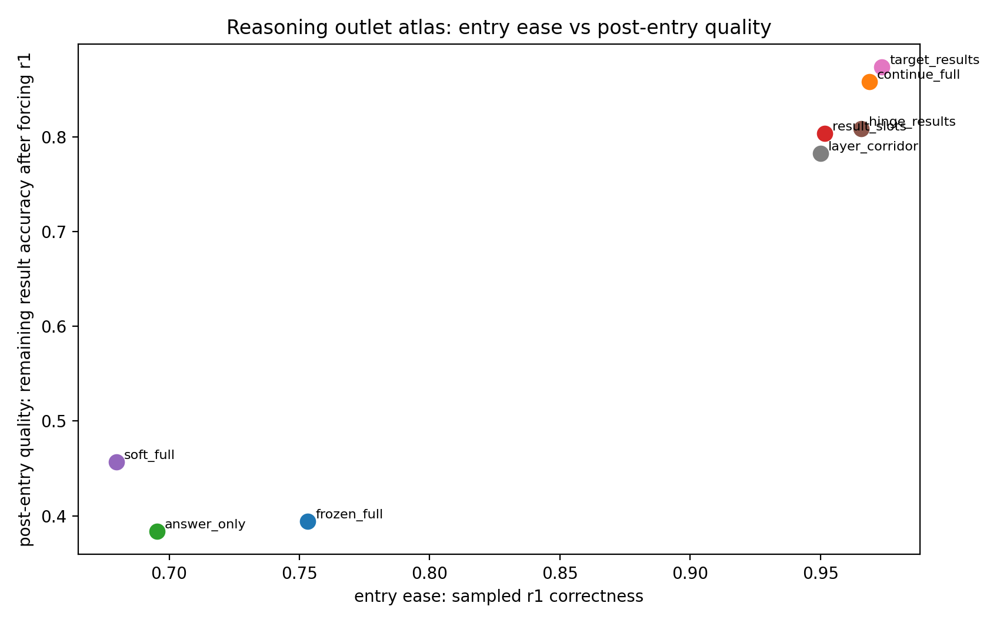

**Figure 1.** Reasoning outlet atlas. Two-layer arithmetic reasoner. Objective variants share the starting checkpoint; generation uses 40 held-out tasks with 16 samples per world at temperature 0.9. Source: LOSS-OUTLET-GEOMETRY-002B.

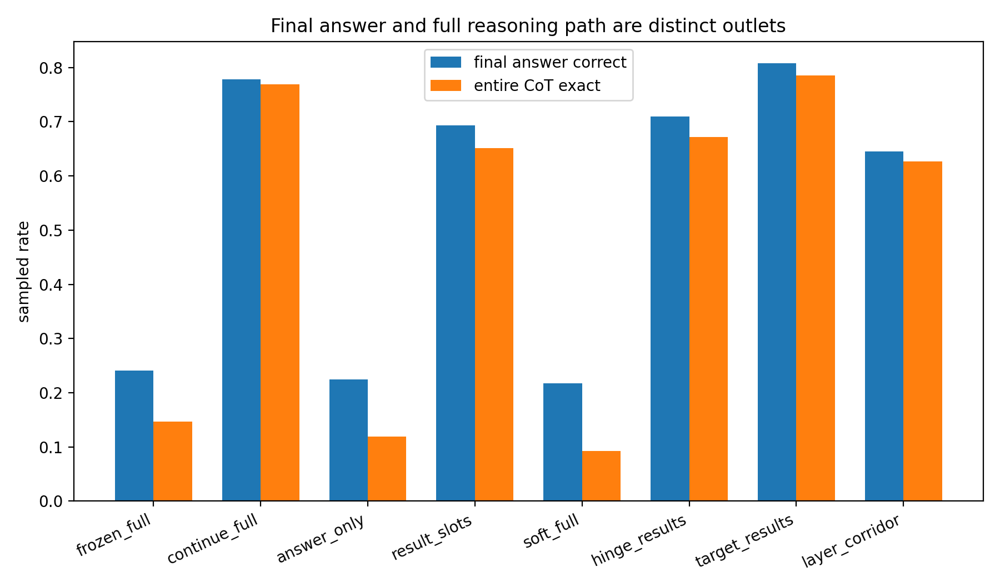

**Figure 2.** Final vs fullchain. Two-layer arithmetic reasoner. Objective variants share the starting checkpoint; generation uses 40 held-out tasks with 16 samples per world at temperature 0.9. Source: LOSS-OUTLET-GEOMETRY-002B.

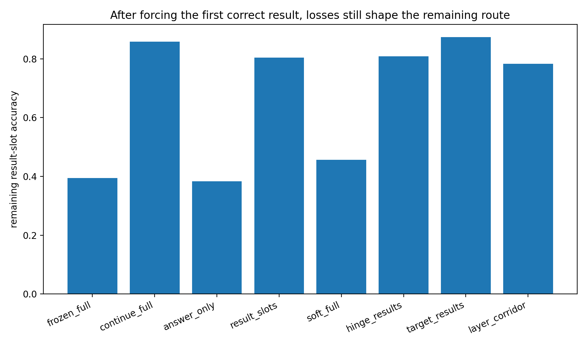

**Figure 3.** Forced entry tail quality. Two-layer arithmetic reasoner. Objective variants share the starting checkpoint; generation uses 40 held-out tasks with 16 samples per world at temperature 0.9. Source: LOSS-OUTLET-GEOMETRY-002B.

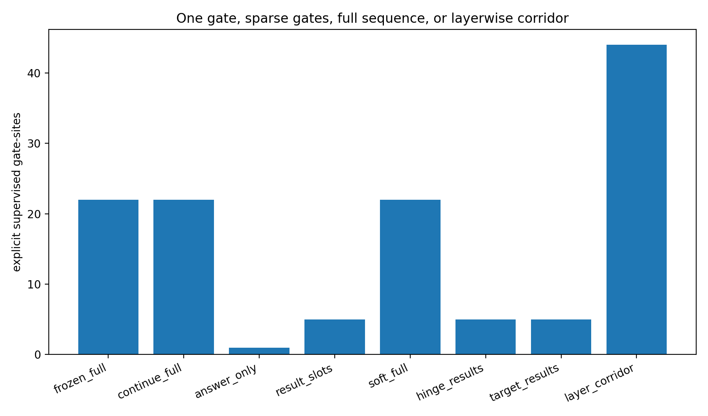

**Figure 4.** Supervised gate sites. Two-layer arithmetic reasoner. Objective variants share the starting checkpoint; generation uses 40 held-out tasks with 16 samples per world at temperature 0.9. Source: LOSS-OUTLET-GEOMETRY-002B.

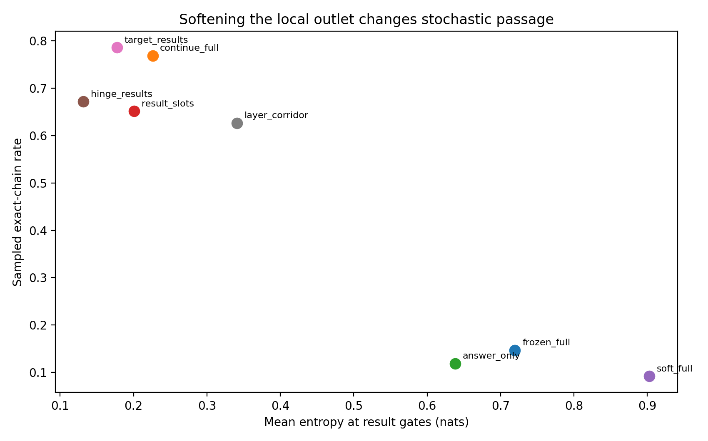

**Figure 5.** Entropy vs exact chain. Two-layer arithmetic reasoner. Objective variants share the starting checkpoint; generation uses 40 held-out tasks with 16 samples per world at temperature 0.9. Source: LOSS-OUTLET-GEOMETRY-002B.

## 3  Mapping the outlet continuously

A center-by-width sweep replaces named objective categories with directly controlled geometric coordinates.

*Experiment LOSS-OUTLET-GEOMETRY-003*

### Question

How do outlet center and width continuously reshape entry, post-entry survival and complete autoregressive reasoning?

### Design

The exact shared reasoner from OUTLET-002B is reused. Every world starts from the same parameters, sees the same 60 mini-batches in the same order, and changes only the finite result-margin band [c-w, c+w]. Centers are 2,3,4,5,6; half-widths are 0.25,0.75,1.5,3.0. A 0.05 full-chain CE term preserves response format.

### Core results

- A genuine center × width phase surface appears. Screening exact-chain success peaks around centers 4–6 with narrow/moderate bands.

- Widening the same center can sharply reduce complete passage. In 40×16 validation, center 2 falls 0.425→0.163, center 4 0.695→0.427, and center 5 0.713→0.597 when half-width expands 0.25→3.0. Paired task bootstraps exclude zero for these three contrasts.

- The lower boundary c-w is the strongest simple geometric coordinate of exact-chain passage across the 20 cells: Spearman ρ = 0.859, p=1.23e-6. Result-gate entropy is inversely associated: ρ = -0.845, p=2.79e-6. The upper boundary has only ρ = 0.247, p=0.293.

- Nominal “inside-band” occupancy is not a passage metric by itself. The center-2 / half-width-3 outlet places 99.3% of teacher-forced result states inside [−1,5], yet validated autonomous exact-chain success is only 16.3%.

- Continued hard CE remains strongest on this task: validated exact-chain 0.789, versus 0.713 for the best validated finite band. The executed evidence therefore supports outlet-task matching rather than a generic narrow-band advantage.

### Working interpretation minimum clearance

The most useful simple mechanical picture is a lower clearance wall. A reasoning state needs enough signed separation from competing vocabulary mosaics to survive repeated discrete tokenization. Making an outlet wider can be harmful when the additional accepted region includes low-margin states. In this task, the lower edge carries much more information about passage than the upper edge.

This updates the running slit/mosaic analogy: the objective does not merely decide whether a configuration is “inside.” It determines whether accepted configurations have enough clearance to keep passing through successive discrete token cuts.

### The outlet interpretation

- Data cloud: the moving internal object.

- Puzzle / building blocks / molecular binding: relative registration and identity-specific assembly.

- Screw: progress can require rotation + translation along a path longer than endpoint displacement.

- Spoon/fork through a slit: a currently correct visible slice can precede later collision/reorientation.

- Mosaic: token emission discretizes a richer current configuration; autoregressive stability requires local probability clearance, not only a correct modal token.

- OUTLET-003 update: a larger acceptance region can produce worse passage. “Outlet size” must therefore be replaced by outlet geometry + minimum clearance + route survival.

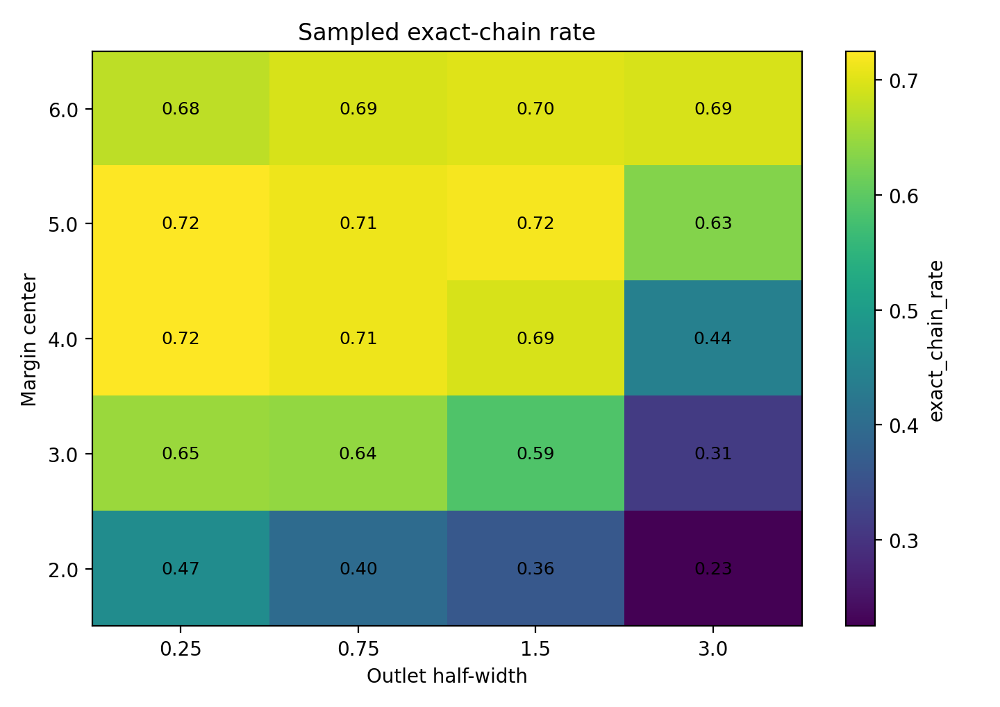

**Figure 6.** Exact chain rate. Twenty matched finite-band worlds. Center and half-width vary while the common starting checkpoint and 60-batch schedule are fixed; validation contrasts use paired tasks. Source: LOSS-OUTLET-GEOMETRY-003.

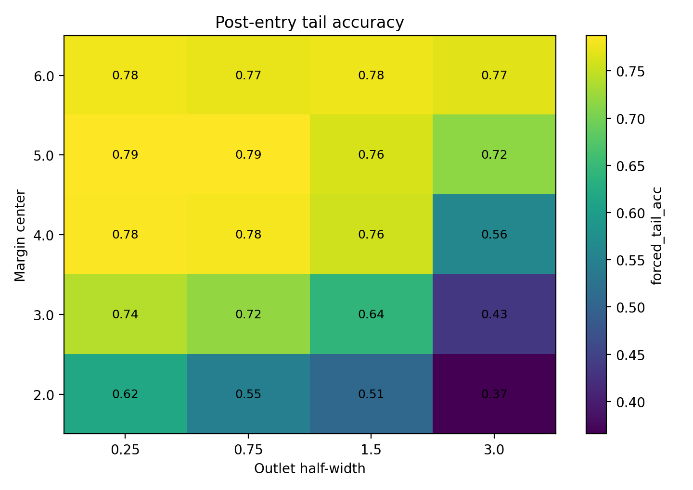

**Figure 7.** Forced tail acc. Twenty matched finite-band worlds. Center and half-width vary while the common starting checkpoint and 60-batch schedule are fixed; validation contrasts use paired tasks. Source: LOSS-OUTLET-GEOMETRY-003.

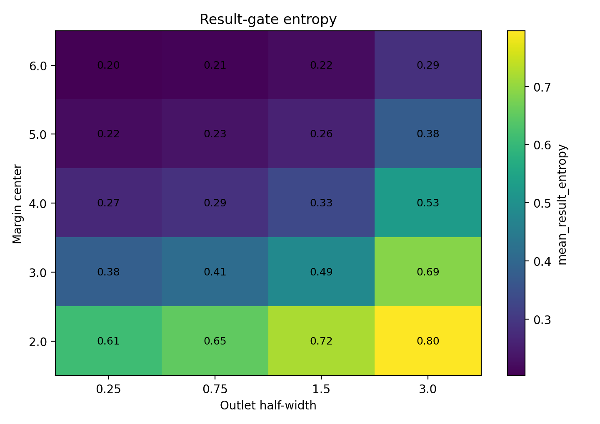

**Figure 8.** Mean result entropy. Twenty matched finite-band worlds. Center and half-width vary while the common starting checkpoint and 60-batch schedule are fixed; validation contrasts use paired tasks. Source: LOSS-OUTLET-GEOMETRY-003.

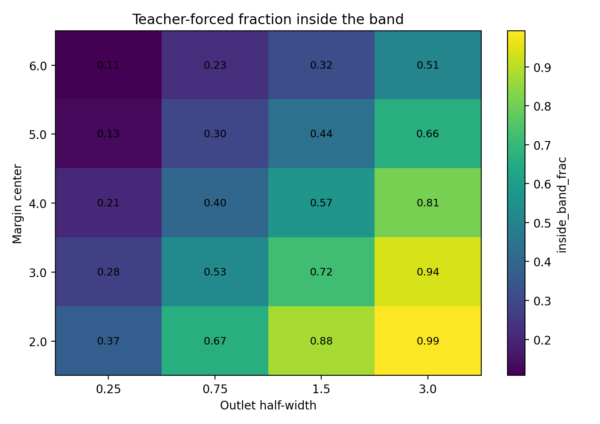

**Figure 9.** Inside band frac. Twenty matched finite-band worlds. Center and half-width vary while the common starting checkpoint and 60-batch schedule are fixed; validation contrasts use paired tasks. Source: LOSS-OUTLET-GEOMETRY-003.

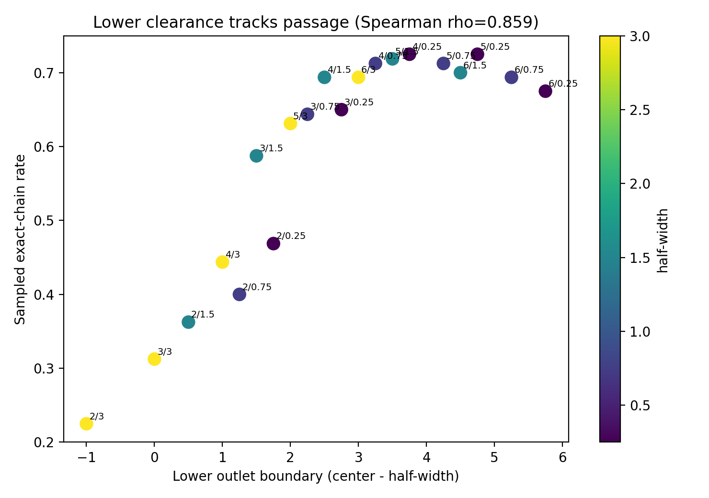

**Figure 10.** Lower boundary. Twenty matched finite-band worlds. Center and half-width vary while the common starting checkpoint and 60-batch schedule are fixed; validation contrasts use paired tasks. Source: LOSS-OUTLET-GEOMETRY-003.

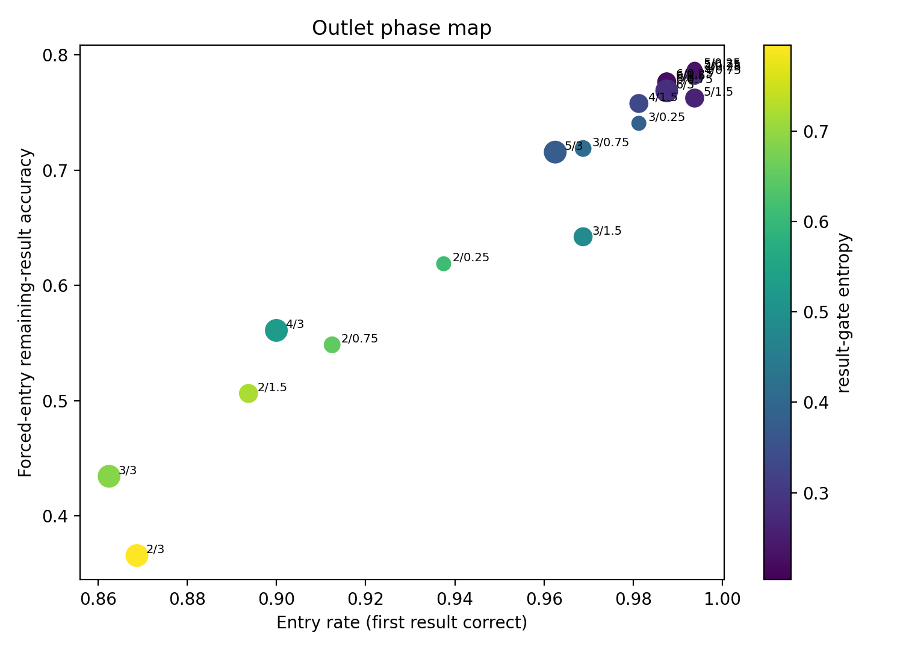

**Figure 11.** Entry passage. Twenty matched finite-band worlds. Center and half-width vary while the common starting checkpoint and 60-batch schedule are fixed; validation contrasts use paired tasks. Source: LOSS-OUTLET-GEOMETRY-003.

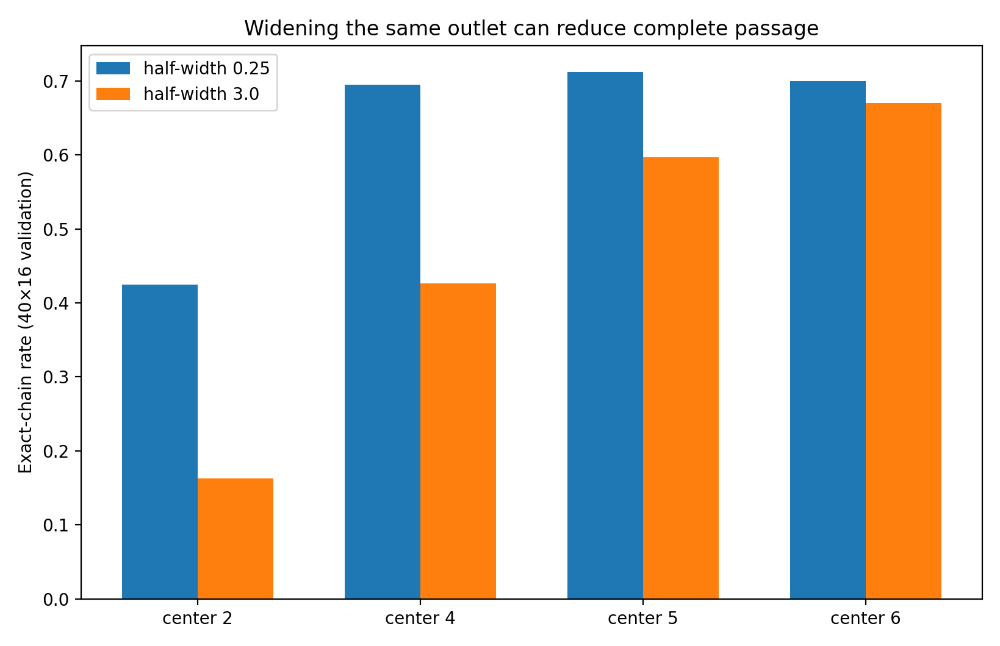

**Figure 12.** Width validation. Twenty matched finite-band worlds. Center and half-width vary while the common starting checkpoint and 60-batch schedule are fixed; validation contrasts use paired tasks. Source: LOSS-OUTLET-GEOMETRY-003.

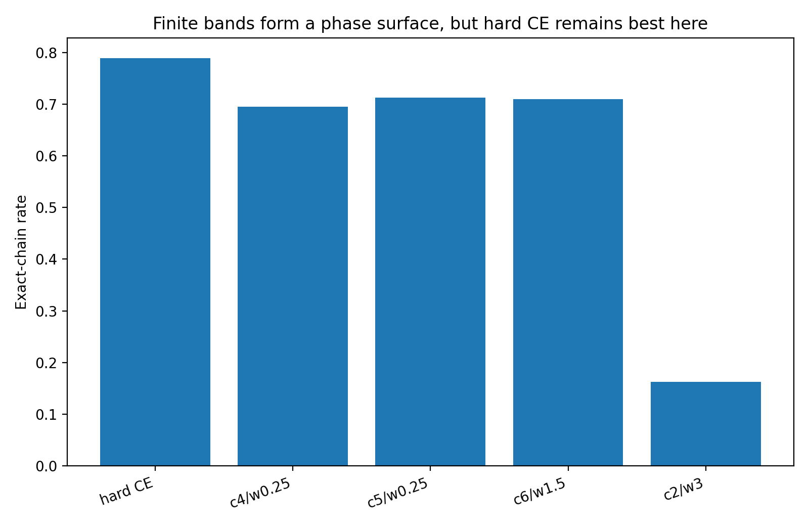

**Figure 13.** Vs CE. Twenty matched finite-band worlds. Center and half-width vary while the common starting checkpoint and 60-batch schedule are fixed; validation contrasts use paired tasks. Source: LOSS-OUTLET-GEOMETRY-003.

## 4  Minimum clearance and the upper boundary

Holding the lower wall fixed makes the effect of an upper ceiling identifiable within the same reasoning task.

*Experiment LOSS-OUTLET-GEOMETRY-004*

### Question

When the minimum result-margin clearance is held fixed, does an upper ceiling improve passage, restrict passage, or become irrelevant? This experiment separates the lower wall from the upper ceiling while retaining the same arithmetic reasoning task, architecture, checkpoint, optimizer, mini-batches, and 0.05 full-chain CE stabilizer.

### Design

Lower walls are L={2,3,4,5,6}. For each lower wall, four outlet geometries are trained from the same base checkpoint:

- open: m ≥ L;

- tight ceiling: L ≤ m ≤ L+0.5;

- moderate ceiling: L ≤ m ≤ L+1.5;

- wide ceiling: L ≤ m ≤ L+3.0.

The main outlet penalty is squared distance outside the allowed region. Continued hard CE from the same base checkpoint is retained as a separate reference because it is an open objective with a persistent downhill gradient rather than a flat post-clearance shelf. High-power validation uses 40 held-out arithmetic tasks × 16 sampled trajectories per variant at temperature 0.9. Paired task bootstrap uses 10,000 replicates.

### A tight ceiling is harmful when minimum clearance is low

At L=2, adding a ceiling only 0.5 margin units above the lower wall reduces validated exact-chain passage from 61.72% to 51.25%. The paired difference for open minus tight-ceiling passage is +10.47 percentage points, bootstrap 95% CI [+7.19, +13.91]. The same effect remains after the first reasoning result is forced correct: forced-tail accuracy falls from 75.47% to 70.00%, difference +5.47 pp, 95% CI [+3.05, +7.93].

The local probability geometry moves in the same direction. In screening, the tight ceiling raises mean result-token entropy from 0.377 to 0.545 nats and pulls the median result margin from 2.409 to 2.022. The model is therefore prevented from using additional margin to stabilize repeated discrete token emission. At L=3, the same ceiling effect is smaller but still present for complete passage: 70.16% open versus 67.97% tight ceiling; open-minus-ceiling difference +2.19 pp, 95% CI [+0.31, +4.22]. The forced-tail difference is small and its interval spans zero.

### Once the lower wall demand is high the ceiling becomes mostly inactive

At L=4, open and L+0.5 ceiling worlds validate at 70.78% and 71.09% exact-chain passage; the paired interval spans zero. At L=6, the corresponding values are 69.38% and 69.53%, again with no resolved difference. At L=5, the tight-ceiling world is only 0.63 pp higher than open in exact-chain passage; this very small paired effect has a bootstrap interval below zero for the open-minus-ceiling contrast, while forced-tail accuracy remains effectively unchanged.

The geometry explains why. In these high-L worlds, most teacher-forced result states remain below the requested lower wall after the fixed 60-update budget. For example, the open L=4/5/6 worlds place approximately 61.1% / 72.1% / 78.2% of result states below the lower wall. The operative bottleneck is therefore reaching minimum clearance; an upper ceiling constrains only a minority of already-high-margin states.

Wide ceilings are effectively identical to open outlets when the learned state cloud rarely reaches them. In high-power validation, L4_open and L4_g3 have identical exact-chain rate 70.78%; L5_open and L5_g3 are both 69.22%.

### Open boundaries and continuing training force

Continued hard CE reaches validated exact-chain passage 81.09%, substantially above every tested lower-wall objective. Open lower-wall worlds achieve 61.72% / 70.16% / 70.78% / 69.22% / 69.38% for L=2..6.

Paired exact-chain deficits of the open worlds relative to continued hard CE are:

- L=2: −19.38 pp, 95% CI [−23.75, −15.00];

- L=3: −10.94 pp, 95% CI [−15.63, −6.41];

- L=4: −10.31 pp, 95% CI [−15.00, −5.94];

- L=5: −11.88 pp, 95% CI [−16.88, −7.03];

- L=6: −11.72 pp, 95% CI [−16.72, −7.03].

The same ordering is present after forced entry. Continued hard CE forced-tail accuracy is 86.13%, compared with 75.47–81.76% across the open lower-wall variants. This isolates a new design variable. Outlet boundary geometry and the loss field inside/after the outlet are distinct. A one-sided lower-wall penalty largely stops exerting its main force after sufficient clearance is reached, whereas hard CE continues to reward additional separation with a diminishing but nonzero slope.

### Passage tracks post entry route quality more strongly than nominal outlet occupancy

Across the 20 screening worlds, exact-chain passage is strongly associated with forced-entry tail quality: Spearman ρ = 0.823, p=8.21e-6. Nominal inside-outlet occupancy is much weaker and negative in this grid (ρ = -0.340, p=0.143). This extends OUTLET-003. A state being classified as geometrically “inside” an outlet says little by itself about autonomous reasoning. What matters is whether the objective produces enough discrete-token clearance and a route that remains stable after each mosaic-like emission.

### Working interpretation wall ceiling and slope

The outlet now has three separable mechanical components:

- lower wall: the minimum clearance required to distinguish the correct token from competitors;

- upper ceiling: a cap on further separation;

- loss slope / force field: whether the objective continues to pull the state forward after it has crossed the nominal wall.

The current arithmetic reasoner uses all three concepts differently. A premature ceiling is damaging when clearance is still scarce. Once the lower wall itself is the bottleneck, the ceiling becomes mostly irrelevant. Continued hard CE remains strongest because it combines an open outlet with a persistent margin-improving slope. In the running slit/screw/mosaic analogy: the lower wall specifies how much room the object needs to clear the edge; the ceiling determines whether it may keep rotating farther into free space; the loss slope determines whether there is still a force encouraging that continued motion after the first part has cleared.

The objective should be analysed as a geometric field, not only as a scalar score or an acceptance region. Two losses can define similar decision-compatible regions while inducing different trajectories because their gradients remain different inside and beyond those regions. Outlet geometry therefore has both a boundary and a vector field.

### Boundary sweep measurements

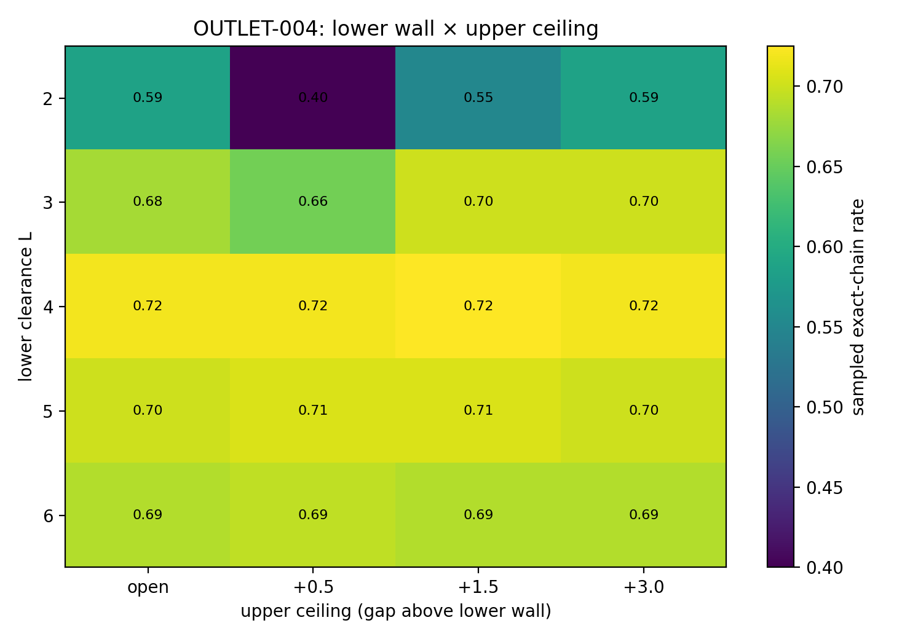

**Figure 14.** Exact-chain passage across lower-wall and ceiling geometries. Source: LOSS-OUTLET-GEOMETRY-004.

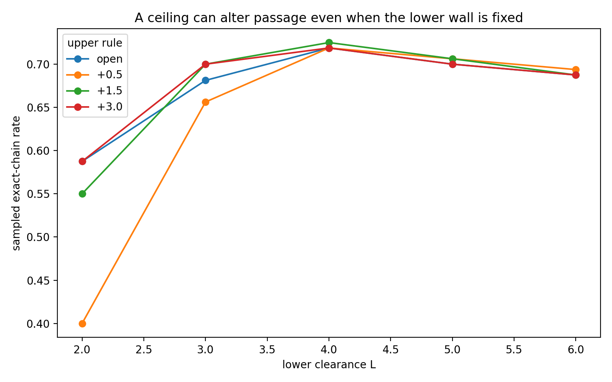

**Figure 15.** Ceiling effects at fixed minimum clearance. Source: LOSS-OUTLET-GEOMETRY-004.

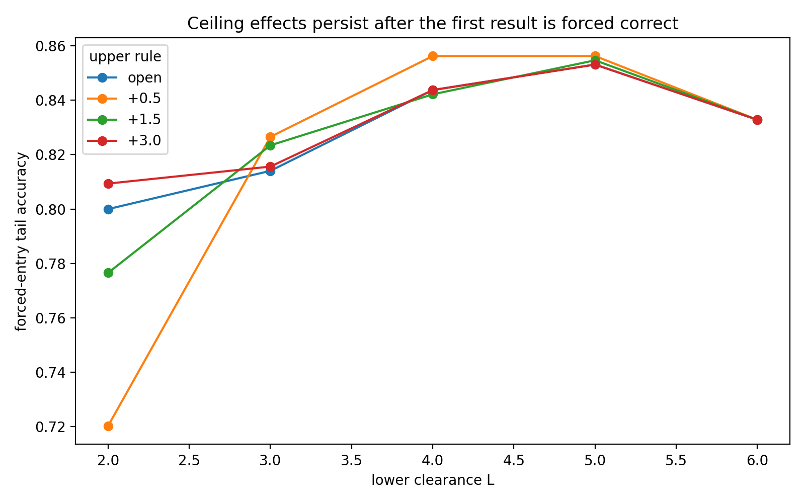

**Figure 16.** Post-entry route quality after the first result is forced correct. Source: LOSS-OUTLET-GEOMETRY-004.

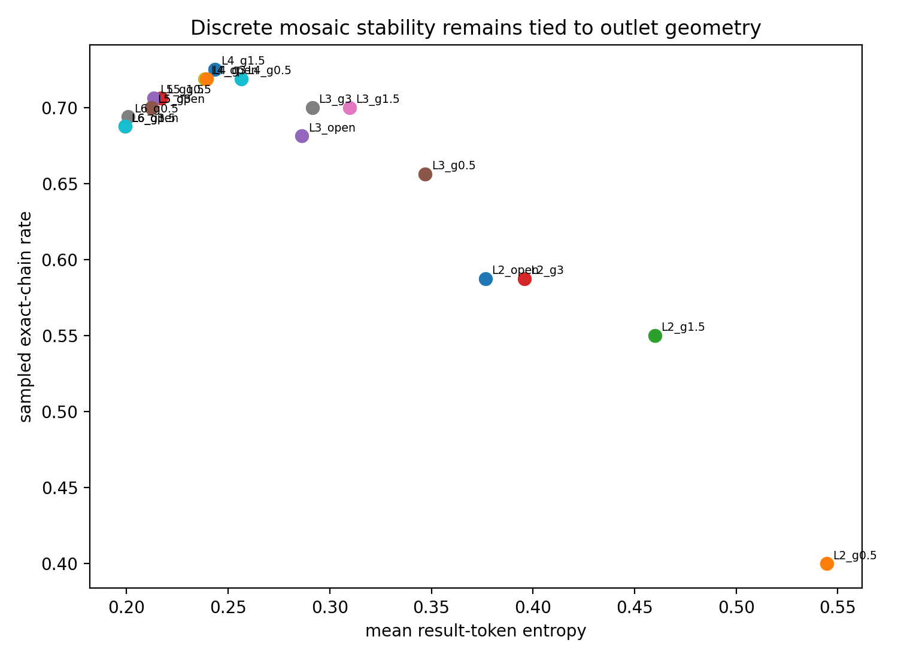

**Figure 17.** Result-token entropy versus autonomous passage. Source: LOSS-OUTLET-GEOMETRY-004.

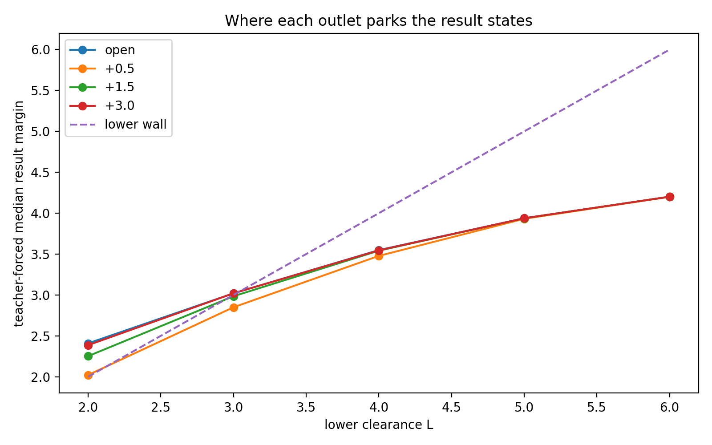

**Figure 18.** Where each outlet geometry parks the result-state margins. Source: LOSS-OUTLET-GEOMETRY-004.

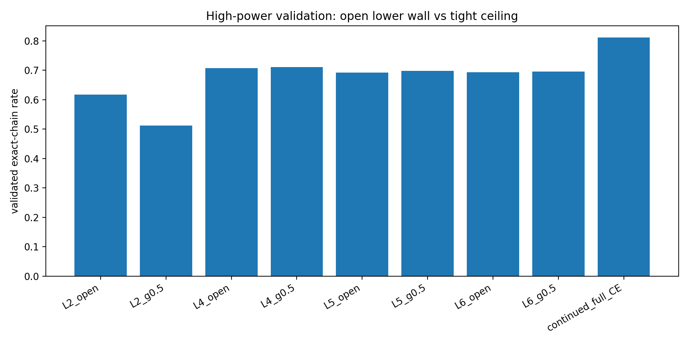

**Figure 19.** High-power validation of open lower walls, tight ceilings, and continued hard CE. Source: LOSS-OUTLET-GEOMETRY-004.

## 5  The force beyond the boundary

A state can cross the nominal wall while training still changes its margin and continuation behavior. A calibrated post-wall force isolates that contribution.

*Experiment LOSS-OUTLET-GEOMETRY-005*

### Question

After the lower clearance boundary is held fixed, does continued post-clearance force change autonomous reasoning passage?

### Isolation design

The same solved two-layer arithmetic reasoner, dataset, optimizer, starting checkpoint, 60 mini-batches and mini-batch order are used in every world. Lower walls are L = {2, 4, 6}. For each lower wall, the below-wall force is identical: squared distance back toward the wall. The only manipulated quantity is the force applied after a result state crosses the wall.

Post-wall force multipliers are k = {0, 0.25, 1, 4, 16}. Above the wall the engineered tail is calibrated as k·exp(−m); below the wall this tail term is constant and therefore contributes zero tail gradient. k=0 is a flat hinge-like shelf. k=1 matches the natural exponential tail scale of hard CE near the same margin; k=4 and k=16 create stronger feed forces.

To isolate result-gate force, the small background CE term supervises only non-result response tokens. Result digits are controlled by the engineered wall/force objective. The same-budget hard-CE model is trained for the identical 60 mini-batches as a reference. High-power validation uses 40 held-out tasks × 16 sampled trajectories per world at temperature 0.9; paired task bootstrap uses 10,000 replicates.

**Table 2. High-power exact-chain passage with boundary held fixed and post-wall force varied.**

| Lower wall | k=0 | k=0.25 | k=1 | k=4 | k=16 |
| --- | --- | --- | --- | --- | --- |
| L=2 | 60.00% | 60.47% | 60.47% | 61.88% | 66.56% |
| L=4 | 68.91% | 68.91% | 68.91% | 69.06% | 68.44% |
| L=6 | 67.50% | 67.50% | 67.50% | 67.50% | 67.34% |

Source: LOSS-OUTLET-GEOMETRY-005. The experimental setting and definitions are given in the associated text.

### Post wall feed force rescues a low clearance outlet

At L=2, validated exact-chain passage rises from 60.00% on the flat shelf to 66.56% at k=16. Across the five force levels, the force multiplier and validated exact-chain passage have Spearman ρ = 0.975 (p=0.00482).

The k=16 feed improves exact-chain passage by +6.56 percentage points over k=0; paired bootstrap 95% CI [+3.28, +10.00] pp. The same effect survives forced entry: tail-result accuracy rises 74.73% → 79.41%, difference +4.69 pp, 95% CI [+2.27, +7.23] pp.

Teacher-forced geometry moves with the intervention: median result margin rises 2.408 → 3.410, mean result-token entropy falls 0.379 → 0.270 nats, and the fraction of result states below the wall falls 33.7% → 22.2%. The executed evidence therefore supports a genuine feed-force effect when minimum clearance is low.

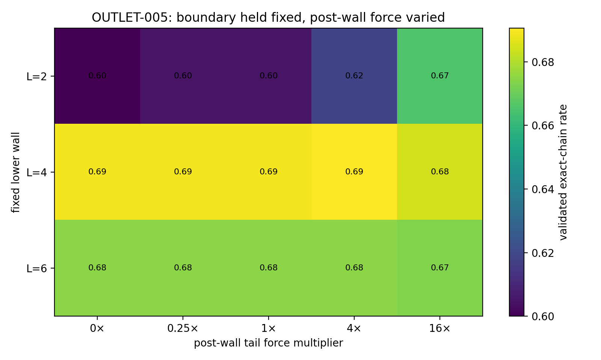

**Figure 20.** Boundary held fixed: validated reasoning passage across post-wall feed-force levels. Source: LOSS-OUTLET-GEOMETRY-005.

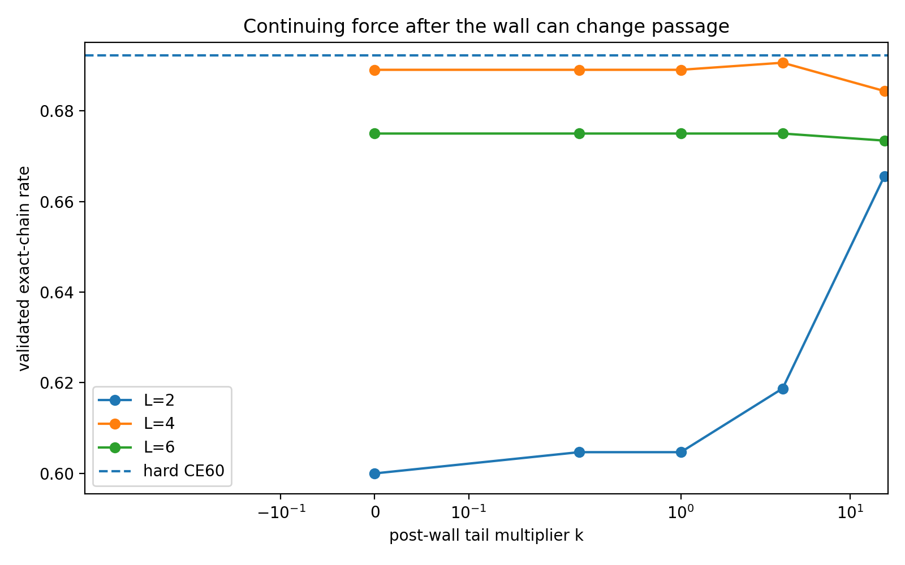

**Figure 21.** Force response is strongly boundary-dependent: low-clearance passage improves with feed, while L=4/6 remain nearly flat. Source: LOSS-OUTLET-GEOMETRY-005.

### The same force becomes nearly inactive once the wall is already high

At L=4, validated exact-chain passage stays in a narrow 68.44–69.06% range across k=0→16. All force-versus-flat paired differences are below one percentage point, with bootstrap intervals at or across zero. Forced-entry tail accuracy remains approximately 81.3–81.4%.

At L=6, k=0/0.25/1/4 all validate at 67.50% exact-chain passage and k=16 at 67.34%; forced-entry tail accuracy is 79.96% in every force condition. After the fixed update budget, approximately 61% of L=4 result states and 78% of L=6 result states still lie below their wall, so the common below-wall force remains the dominant pressure and post-wall feed has little opportunity to act.

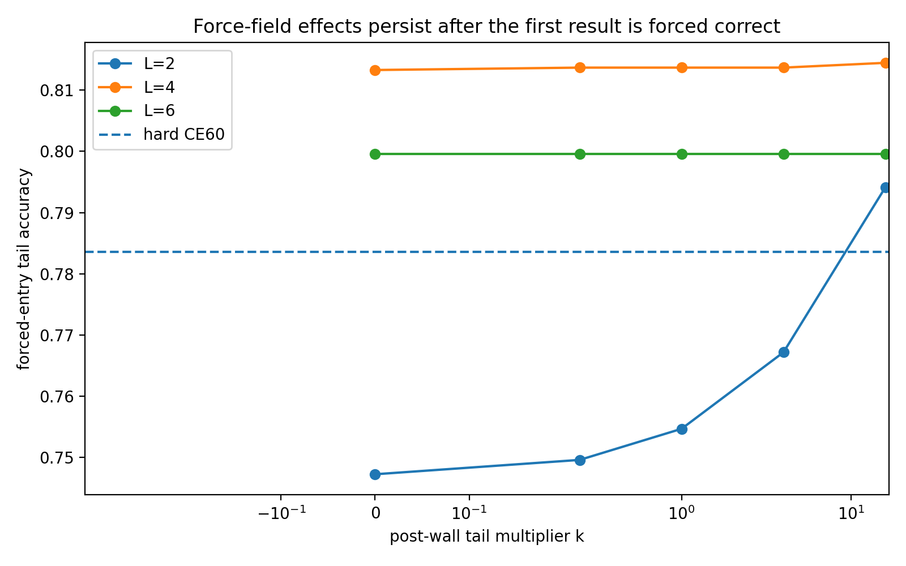

**Figure 22.** The feed-force effect persists after first-result forcing only in the low-clearance regime. Source: LOSS-OUTLET-GEOMETRY-005.

### Boundary dependent force response

- Low wall (L=2): stronger post-wall feed raises margin, lowers token entropy and improves whole-chain survival.

- Intermediate wall (L=4): route quality is already set mainly by the clearance wall and shared computation; extra feed changes passage little.

- High wall (L=6): most states are still being driven toward the wall, so post-wall feed is largely inactive within the fixed update budget.

The machining interpretation is therefore conditional: feed force is useful when the part has crossed an under-demanding gate but still lacks discrete-token stability; it is redundant while the dominant problem is reaching the requested clearance itself.

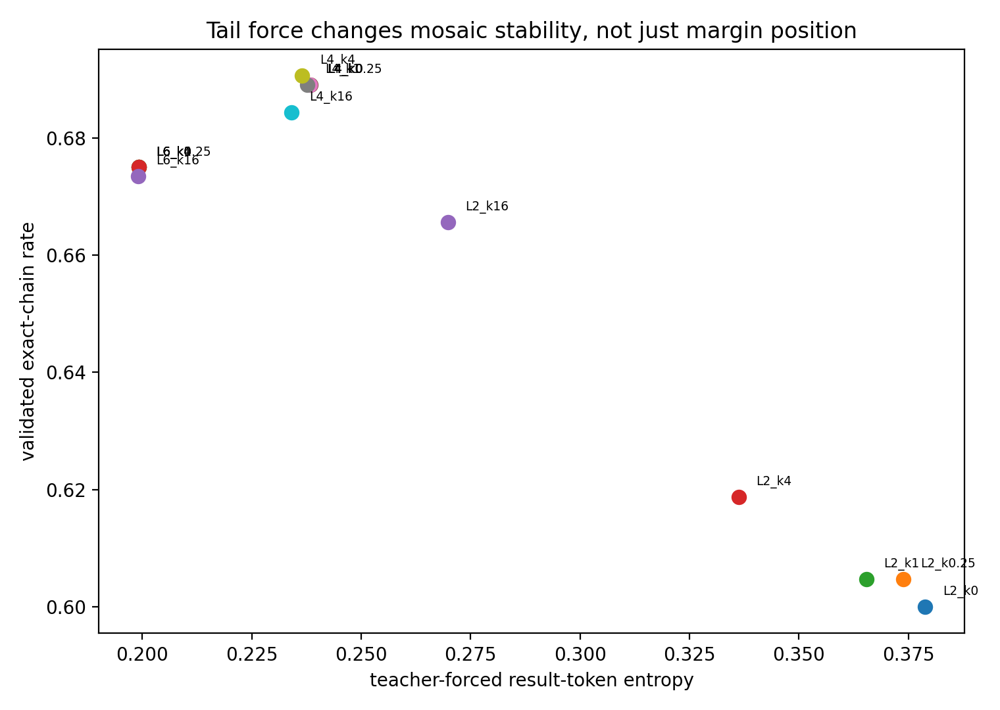

**Figure 23.** Feed force changes token-level mosaic stability together with autonomous passage. Source: LOSS-OUTLET-GEOMETRY-005.

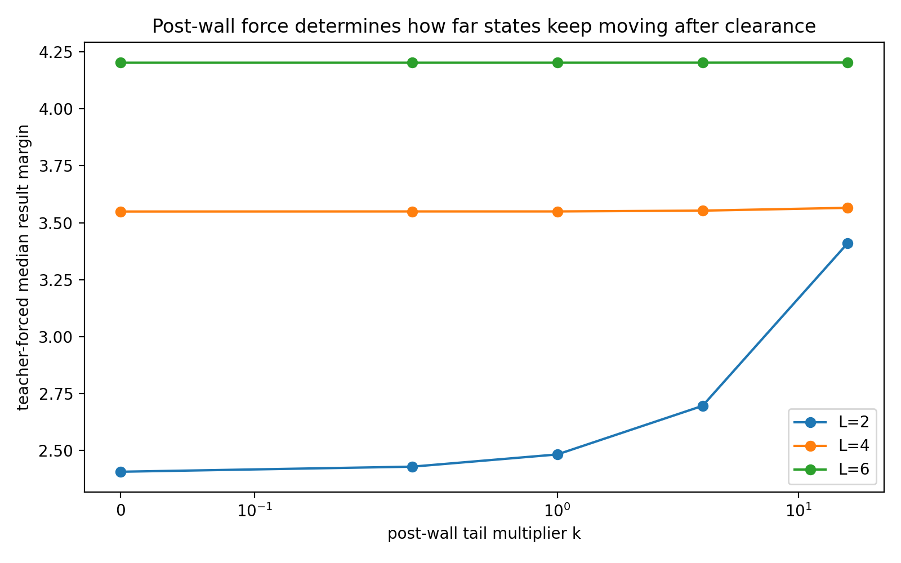

**Figure 24.** Stronger feed moves L=2 states farther past the wall; high-wall state clouds remain dominated by below-wall pressure. Source: LOSS-OUTLET-GEOMETRY-005.

### Engineered boundary feed fields can match the same budget hard CE passage

The same-budget hard-CE reference validates at 69.22% exact-chain passage. L2_k16 reaches 66.56%; its paired difference from hard CE is −2.66 pp with a bootstrap interval spanning zero. L=4 force worlds cluster at 68.4–69.1%, also overlapping hard CE in exact-chain passage. This comparison is interpreted within OUTLET-005 only. OUTLET-004 used a different continued-CE checkpoint/update history and therefore has different absolute reference rates. The current causal comparison is the within-campaign one: all force worlds and CE60 share the same start and the same 60-batch schedule.

### Working interpretation the outlet is a boundary plus a feed field

The machining analogy is now experimentally separable. The lower wall is the clearance gauge; the upper ceiling is a hard stop; the post-wall tail is the feed force. OUTLET-005 shows that the third component has causal leverage at low clearance even when the boundary itself is unchanged. The outlet is therefore better represented as a geometric boundary plus a state-dependent vector field than as a passive hole.

### Machine shop translation

- Data cloud = the moving internal workpiece.

- Puzzle/building blocks/molecular binding = fragment registration and assembly into larger moving components.

- Screw = progress can require rotation plus translation along a route longer than endpoint displacement.

- Spoon/fork through a slit = a visible correct slice can precede a later collision and reorientation.

- Mosaic = token emission discretizes a richer internal configuration; local probability clearance determines whether repeated cuts stay on-route.

- Lower wall = minimum clearance gauge; upper ceiling = hard stop; post-wall tail = feed force after nominal clearance.

- OUTLET-005 = feed force repairs low-clearance passage, while high-clearance worlds are dominated by the effort required to reach the wall itself.

Loss design specifies both where states are encouraged to go and how force continues to act along the route. Two objectives with the same nominal decision-compatible region can induce different computation because their gradients differ after first passage. In this reasoning task, post-clearance force interacts strongly with lower-wall placement.

## 6  Where an equal force enters the computation

Equal gradient norms give a common magnitude scale. The contact experiment then changes the direction and computational location of the intervention.

*Experiment LOSS-OUTLET-GEOMETRY-006*

### Question

If clearance and total training-force magnitude are held fixed, does it matter where that force enters the computation? OUTLET-006 isolates loss anisotropy by holding the common lower wall, model, data, optimizer, 60 mini-batches and auxiliary gradient norm fixed while changing only the token/layer contact surface.

### Isolation design

- Common lower wall L=2 on all five reasoning/result gates.

- Identical structural-token CE and identical lower-wall penalty in every world.

- Every auxiliary gradient is rescaled at every update to parameter-space norm 2.0 before addition to the common gradient.

- Contact surfaces: first result; middle results r2+r3; fourth result; final answer; all five result gates; five matched structural sites; full response; and a cross-layer result corridor. no_aux is the common-wall control.

- Final evaluation uses common random numbers across variants: 40 held-out tasks × 32 sampled trajectories at temperature 0.9. Paired task bootstrap uses 20,000 replicates.

### Core quantitative result

**Table 3. Where an equal force enters the computation**

| Contact | Exact chain | Entry | Forced tail | Median margin | Final drift |
| --- | --- | --- | --- | --- | --- |
| no aux | 58.52% | 94.14% | 72.64% | 2.293 | 10.8° |
| r1 | 59.61% | 96.80% | 71.66% | 2.569 | 11.2° |
| mid | 60.78% | 94.38% | 75.33% | 2.449 | 11.0° |
| r4 | 57.27% | 93.98% | 72.38% | 2.317 | 11.0° |
| answer | 58.83% | 94.30% | 71.68% | 2.458 | 24.7° |
| all results | 60.94% | 94.84% | 73.93% | 2.473 | 9.9° |
| structure sites | 58.13% | 93.98% | 72.56% | 2.489 | 14.6° |
| full response | 63.83% | 94.84% | 75.92% | 2.472 | 9.8° |
| layer corridor | 59.22% | 93.91% | 73.14% | 2.362 | 11.9° |

Source: LOSS-OUTLET-GEOMETRY-006. The experimental setting and definitions are given in the associated text.

The strongest executed contact is the full response. Relative to no auxiliary force, exact-chain passage rises 58.52% → 63.83%, a paired improvement of +5.31 pp (95% CI +3.91 to +6.80 pp). Forced-entry tail accuracy rises by +3.28 pp (95% CI +2.21 to +4.43 pp).

The same equal-norm force applied only to all five result gates improves passage less: 60.94% exact-chain. Full-response contact exceeds all-results contact by +2.89 pp exact-chain (95% CI +1.72 to +4.30 pp) and +1.99 pp forced-tail accuracy (95% CI +1.02 to +3.22 pp). The middle-result contact r2+r3 also improves complete passage versus no-aux: +2.27 pp exact-chain (95% CI +0.86 to +3.75 pp) and +2.70 pp forced-tail (95% CI +1.35 to +4.10 pp).

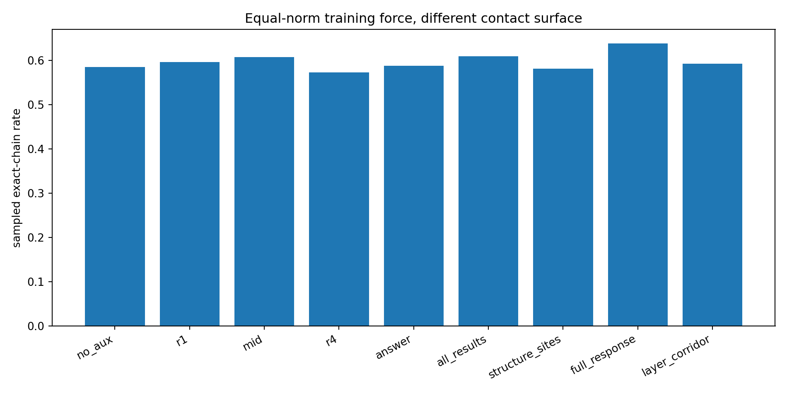

**Figure 25.** With identical auxiliary gradient norm, sampled exact-chain passage depends on the contact surface through which the force enters computation. Source: LOSS-OUTLET-GEOMETRY-006.

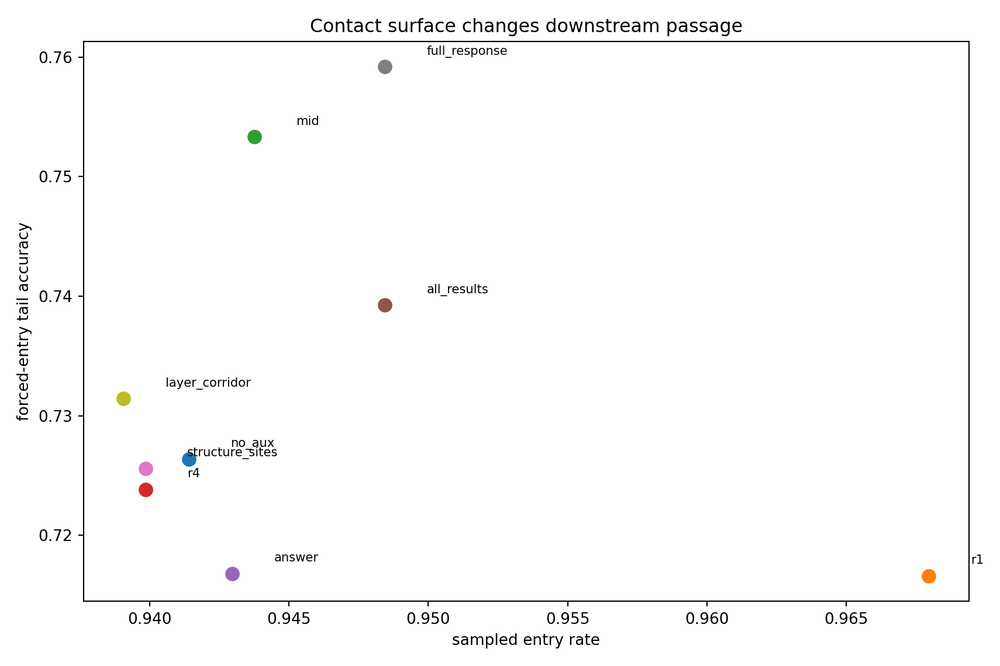

**Figure 26.** Contact surface separates entry ease from downstream survival after the first result is forced correct. Source: LOSS-OUTLET-GEOMETRY-006.

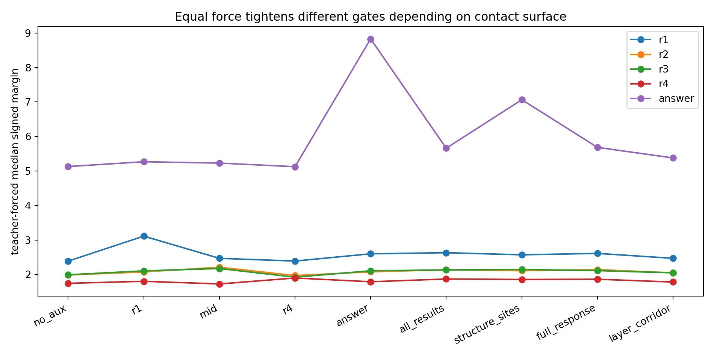

**Figure 27.** Equal-norm force tightens different reasoning/result gates depending on where it is applied. Source: LOSS-OUTLET-GEOMETRY-006.

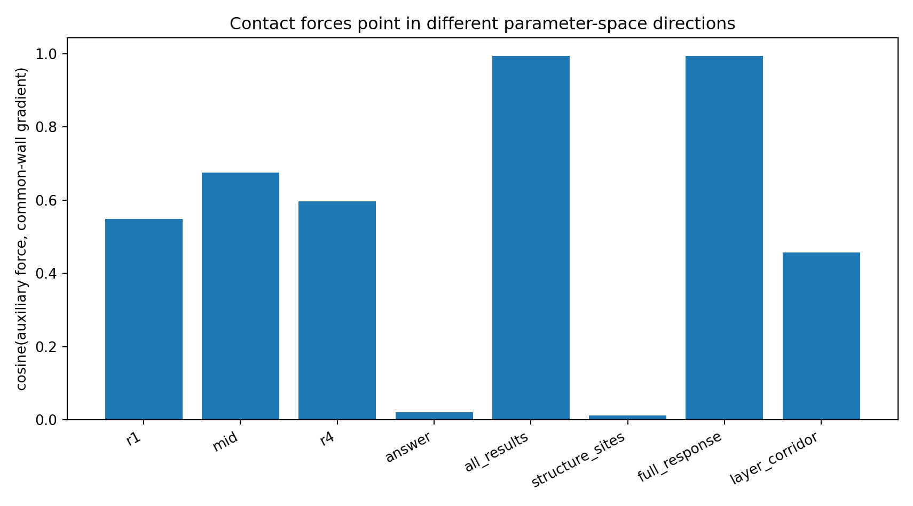

**Figure 28.** Contact forces point in different parameter-space directions relative to the common lower-wall gradient. Source: LOSS-OUTLET-GEOMETRY-006.

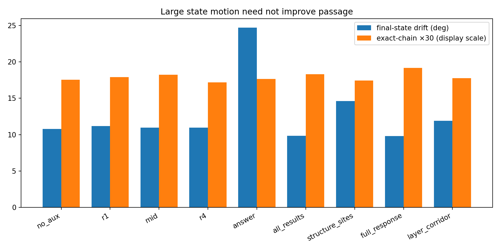

**Figure 29.** Large endpoint/state motion is not sufficient for reliable passage; answer-only force is the clearest counterexample. Source: LOSS-OUTLET-GEOMETRY-006.

### Endpoint movement and route formation

Answer-only force raises the teacher-forced final-answer margin to 8.83, versus 5.13 under no auxiliary force, and produces 24.7° mean final-state drift from the common base checkpoint. Yet exact-chain passage is 58.83%, only +0.31 pp versus no-aux with a bootstrap interval spanning zero. Endpoint pressure and route formation are therefore experimentally separable.

### Equal norm direction controls

Before normalization, auxiliary gradient norms differ by more than two orders of magnitude. At the common base checkpoint, answer-only raw auxiliary gradient norm is only 0.0745, while r1 is 6.02. Every executed auxiliary intervention is nevertheless rescaled to the same norm 2.0 at every update. The directions also differ. Answer-only force is nearly orthogonal to the common lower-wall gradient (cosine 0.021); all-results and full-response forces are almost aligned with it (0.994 and 0.993); the layer corridor is intermediate (0.457). Equal magnitude therefore does not imply equal computational action.

### Working interpretation the loss has a contact surface

The machining picture now has three independently manipulated terms: clearance geometry, force magnitude, and contact surface/direction. OUTLET-006 holds the first two fixed and changes only the third; complete autonomous reasoning still changes. The simplest mechanical reading is a guided assembly. Pushing only the finished end can move the endpoint dramatically without improving the path. Distributing the same total force along the response behaves more like a guide rail: several local states are nudged in mutually compatible directions and downstream passage becomes more stable.

### Machine shop translation

- Force magnitude = how hard the optimizer pushes in parameter space.

- Contact surface = where the same normalized push enters the computation: one gate, several gates, the final answer, the entire response, or a cross-layer corridor.

- Answer-only = pushing hard on the finished end of the workpiece. It can produce large endpoint motion without improving the guide path.

- Full-response = distributing the same total push along the guide rail. In OUTLET-006 this yields the strongest complete autonomous passage.

- OUTLET-006 update = the loss is not only a boundary plus a force magnitude; it has direction and contact topology. Equal-norm loss forces are computationally anisotropic.

### Experimental scope

This campaign uses one solved arithmetic reasoner, one fixed starting checkpoint, one 60-mini-batch training schedule, and one auxiliary force norm. The natural engineering unit of a loss is not only its scalar value, acceptance region, or global gradient norm. For sequential computation, the location and direction through which training pressure enters the computation graph are empirically consequential. Loss design can therefore be treated as placement of force on a dynamic data assembly.

## 7  Direction contact timing and depth

The next set of matched interventions varies the remaining force coordinates and follows their effects through the whole reasoning route.

*Experiment OUTLET-007 to OUTLET-012*

Sequential loss action is best described as a time-dependent vector field with direction, contact topology, schedule and depth. Distributed late-stage response guidance transfers across initialization and task mechanism; naive error-triggered feedback does not.

**Table 4. Direction contact timing and depth**

| Experiment | Controlled variable | Primary executed result | Engineering meaning |
| --- | --- | --- | --- |
| 007 | Force direction | Middle sector ~62.3% vs answer-only 57.2% | Preferred force sector |
| 008 | Contact position/length | Full response 62.8%; mid7 strongest tail | Distributed guide rail |
| 009 | Timing/order | Ramp-up 66.7%; front<back; order hysteresis | Late feed, non-commutative history |
| 010 | Network depth | Final 61.9% > layer1 58.1% | Avoid early pose locking |
| 011 | Feedback policy | Naive feedback < uniform < ramp-up | Dashboard needs phase-aware control |
| 012 | Transfer | Full response +9.1 pp seed, +14.4 pp new task | Rule transfers |

Source: OUTLET-007 to OUTLET-012. The experimental setting and definitions are given in the associated text.

### OUTLET 007 Force Direction Atlas

Equal-norm force rotated from answer-only toward full-response produces a broad preferred sector. Exact-chain rises from 57.19% at answer-only to 62.34% at the 0.50–0.75 interpolation; the half-rotation gain is +5.16 pp (95% CI +3.13 to +7.19 pp).

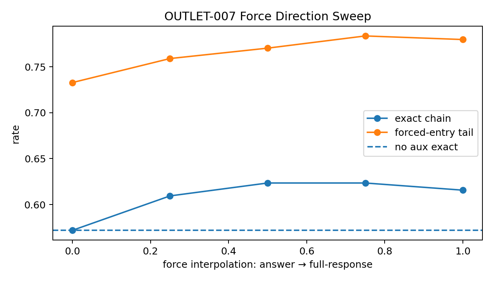

**Figure 30.** Continuous equal-norm force-direction sweep. Source: OUTLET-007 to OUTLET-012.

### OUTLET 008 Contact Position x Length

Full-response contact gives the best whole-chain passage (62.81%, +5.63 pp versus no-aux), while the middle seven-token window has the strongest forced-entry tail signal (76.09%). Distributed route support and middle-tail leverage are separable.

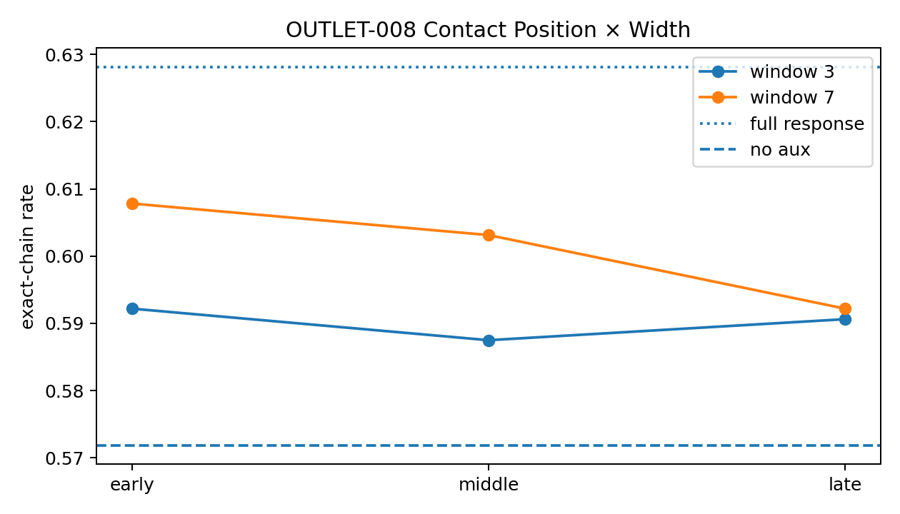

**Figure 31.** Contact position and length scan. Source: OUTLET-007 to OUTLET-012.

### OUTLET 009 Feed Schedule and Hysteresis

Equal impulse is not exchangeable in time. Back-loaded beats front-loaded; ramp-up beats ramp-down by +4.53 pp; answer→full-response beats the reverse order by +4.84 pp. Pulsed force is weak.

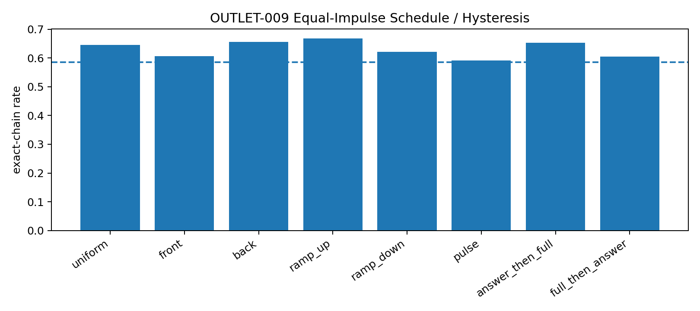

**Figure 32.** Equal-impulse schedule and hysteresis. Source: OUTLET-007 to OUTLET-012.

### OUTLET 010 Depth Contact

Final-layer result contact (61.88%) beats layer-1 contact (58.13%) by +3.75 pp. Multi-depth clamping does not dominate final-stage guidance.

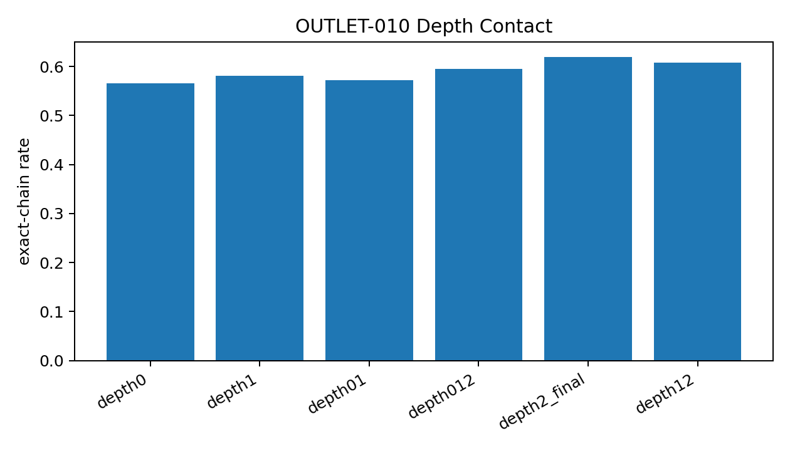

**Figure 33.** Equal-norm force applied at different network depths. Source: OUTLET-007 to OUTLET-012.

### OUTLET 011 Closed Loop Machining

Naive clearance and entropy feedback underperform uniform feed. Delayed/adaptive policies recover but do not beat the open-loop ramp-up schedule. Early large error is not automatically an intervention signal.

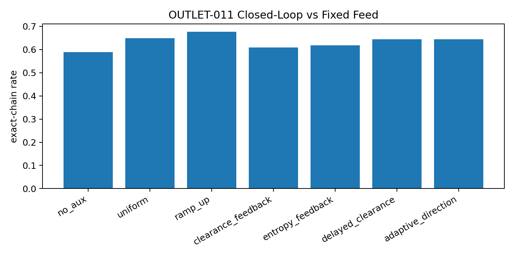

**Figure 34.** Closed-loop policies versus fixed schedules. Source: OUTLET-007 to OUTLET-012.

### OUTLET 012 Transfer Gate

Full-response contact beats answer-only by +9.06 pp under independent initialization and +14.38 pp on the affine-recurrence task. It also beats early-layer contact in both worlds. Ramp-up adds +1.41 pp on the new task where headroom remains.

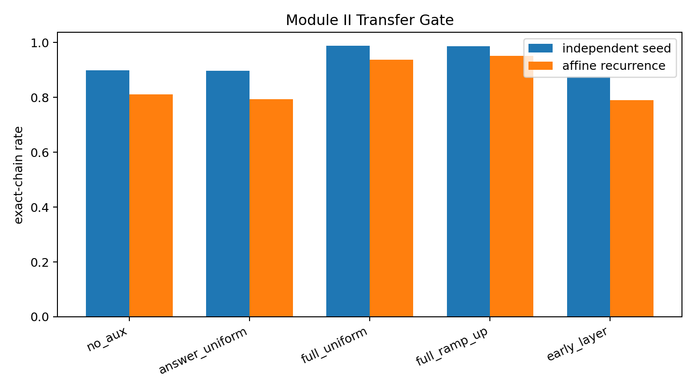

**Figure 35.** Transfer of module engineering rules. Source: OUTLET-007 to OUTLET-012.

### Integrated engineering laws

- Direction: equal-norm force has preferred sectors; loss action is anisotropic.

- Contact topology: guide the route, not only the endpoint. Full-response contact is the most reproducible whole-chain intervention.

- Time: spend force late enough for the assembly to mature; equal impulse is hysteretic and non-commutative.

- Depth: late readout-side guidance is more effective than early pose locking in this reasoner.

- Feedback: instrumentation requires phase semantics; naive error-triggered feedback can make the route worse.

- Transfer: distributed late-stage response guidance replicates across an independent seed and a second multi-step mechanism.

### Machine shop interpretation

- Data cloud = moving internal object; mosaic = discrete token emission from a richer current configuration.

- Clearance = minimum margin required for robust repeated tokenization.

- Feed force = optimizer pressure after clearance.

- Contact surface = where equal-norm pressure enters the computation.

- Guide rail = distributed response contact; endpoint hammering can move the final state without building the route.

- Clamp = depth-local force; early clamping can freeze an immature pose.

- Machining history = same total impulse applied in different order gives different internal passage.

- Inspection is not control = a large observed error can be a normal early state rather than a command to intervene.

### Force field synthesis

Module II supports treating the loss as a time-dependent vector field applied through selected computational surfaces.

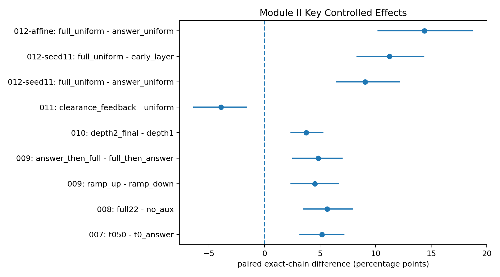

**Figure 36.** Selected paired exact-chain effects across Module II. Source: OUTLET-007 to OUTLET-012.

## 8  Measured feedback and training control

A feedback controller combines a sensor with an action rule. These experiments compare the resulting closed-loop policies with the matched scheduled guidance that the same system already supports.

*Experiment M4-019 to M4-024*

### Experimental question

Can the Module-II loss force field and Module-III load-bearing scaffold observables be turned into a closed-loop controller that outperforms the best open-loop ramp-up schedule under matched gradient budget?

### Frozen system and control contract

- Primary system: the same 2-layer arithmetic reasoner, shared solved checkpoint, L=2 lower-clearance wall, 60 post-training updates and common held-out Monte Carlo evaluation used in Modules II–III.

- Closed-loop sensors: result entropy, below-clearance fraction, training phase, and an online input-interface sensitivity proxy computed from the future-result loss gradient with respect to layer-1 current-step input b contextual states.

- Matched-force control: controllers use the same total auxiliary-gradient impulse as the ramp-up baseline. The controller can reallocate force through time but receives the same total force exposure.

- Causal reference: Module-III same-token contextual-state swaps define the load-bearing joint map independently of the online gradient proxy.

### M4 019 Input interface sensitivity and causal load

The online future-loss gradient probe samples the current-step input b1–b4 contextual states at positions 14/18/22/26. Its four-position association with causal input-interface damage is Spearman ρ = 0.20 (p=0.80). Routing force directly from this proxy reduces exact-chain passage by about 3.6 percentage points relative to ramp-up. The comparison distinguishes input sensitivity from the causal load measured by contextual-state replacement.

### M4 020 Closed loop ablation under normal operation

Phase-aware entropy feedback successfully removes the specific failure of naive immediate error feedback, but it does not robustly exceed the tuned ramp-up schedule. In contrast, online joint routing is actively harmful. The full controller that combines phase, entropy and gradient-joint routing inherits this damage. The strongest normal-operation lesson is therefore conservative: phase semantics matter; uncalibrated structural routing should not be automated.

**Table 5. Measured feedback and training control**

| Controller | Exact chain | Forced-entry tail | Result entropy |
| --- | --- | --- | --- |
| ramp up | 0.654 | 0.778 | 0.359 |
| phase entropy | 0.655 | 0.780 | 0.357 |
| phase joint | 0.618 | 0.756 | 0.377 |
| full closed | 0.623 | 0.765 | 0.372 |
| delayed full | 0.655 | 0.780 | 0.357 |

Source: M4-019 to M4-024. The experimental setting and definitions are given in the associated text.

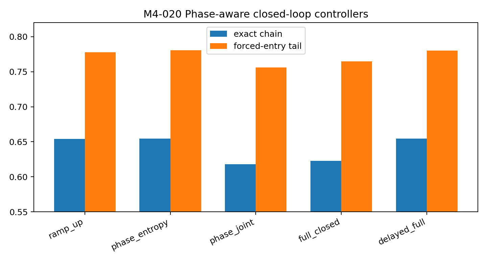

**Figure 37.** Phase+entropy matches ramp-up; gradient-based joint routing degrades route survival. Source: M4-019 to M4-024.

### M4 021 Closed loop under matched force controls

The closed-loop controller was compared with ramp-up at three matched auxiliary-force exposure levels (60, 90 and 120). At each matched level the closed-loop exact-chain difference is only 0.2–0.5 percentage points and all paired bootstrap intervals cross zero. The executed result is that the present feedback signal does not change passage relative to ramp-up under matched force exposure.

**Table 6. Measured feedback and training control**

| Total impulse | Ramp-up exact | Closed-loop exact | Closed − ramp |
| --- | --- | --- | --- |
| 60 | 0.602 | 0.605 | +0.004 |
| 90 | 0.618 | 0.623 | +0.005 |
| 120 | 0.629 | 0.631 | +0.002 |

Source: M4-019 to M4-024. The experimental setting and definitions are given in the associated text.

### M4 022 Sensors and control under a route perturbation

A standardized mid-route adversarial parameter perturbation was injected at step 30. The hard fault was large enough in calibration to reduce teacher-forced all-result correctness from about 0.854 to 0.218 immediately. Entropy, below-clearance fraction and common route loss all spike after the fault, so the instrumentation clearly detects the collision. Nevertheless, phase+entropy and delayed feedback do not repair autonomous passage faster than ramp-up: final exact-chain rates remain about 0.498–0.500, with paired intervals crossing zero. The missing object is therefore not a fault detector but a fault-to-action repair model.

**Table 7. Measured feedback and training control**

| Fault controller | Exact chain | Forced-entry tail | Final entropy |
| --- | --- | --- | --- |
| hard phase only | 0.498 | 0.677 | 0.435 |
| hard phase entropy | 0.500 | 0.677 | 0.437 |
| hard delayed full | 0.499 | 0.679 | 0.436 |

Source: M4-019 to M4-024. The experimental setting and definitions are given in the associated text.

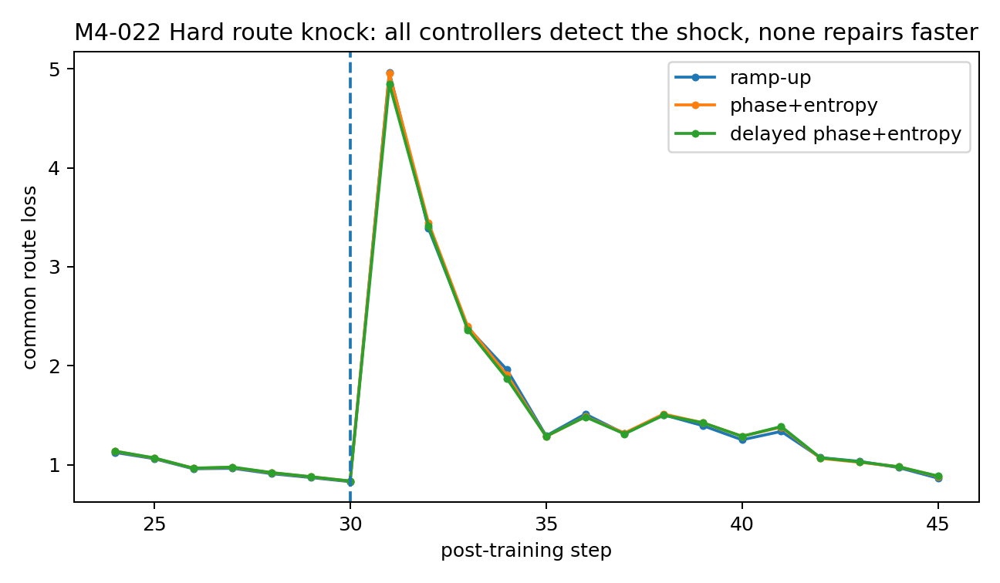

**Figure 38.** The hard route knock is visible to all sensors, but current closed-loop policies do not accelerate repair. Source: M4-019 to M4-024.

### M4 023 Middle route contact and scheduled guidance

A heuristic middle-route contact rule replaces the gradient router. It recovers much of the passage lost under gradient-based routing, while pure ramp-up remains stronger. This executed comparison establishes the effect of that contact rule; it does not establish that a causal load map specifies an optimal actuator location.

**Table 8. Measured feedback and training control**

| Routing rule | Exact chain | Forced-entry tail |
| --- | --- | --- |
| ramp up | 0.635 | 0.776 |
| gradient router | 0.602 | 0.747 |
| causal ramp | 0.627 | 0.779 |
| causal entropy | 0.630 | 0.779 |

Source: M4-019 to M4-024. The experimental setting and definitions are given in the associated text.

### M4 024 Transfer gate

The phase-aware controller does not acquire a transferable advantage. On independent seed11 it is significantly below ramp-up in exact-chain passage (−0.625 pp; 95% CI −1.094 to −0.234 pp) in a near-ceiling regime. On the affine recurrence task the exact-chain difference is small and uncertain (+0.156 pp), while forced-entry tail passage is slightly worse. The evidence therefore supports transfer of the open-loop machining rule from Module II, not transfer of the present closed-loop policy.

**Table 9. Measured feedback and training control**

| Transfer world | Policy | Exact chain | Forced-entry tail |
| --- | --- | --- | --- |
| seed11 | phase only | 0.990 | 0.993 |
| seed11 | phase entropy | 0.984 | 0.992 |
| seed11 | delayed full | 0.984 | 0.992 |
| affine | phase only | 0.970 | 0.991 |
| affine | phase entropy | 0.971 | 0.988 |
| affine | delayed full | 0.971 | 0.988 |

Source: M4-019 to M4-024. The experimental setting and definitions are given in the associated text.

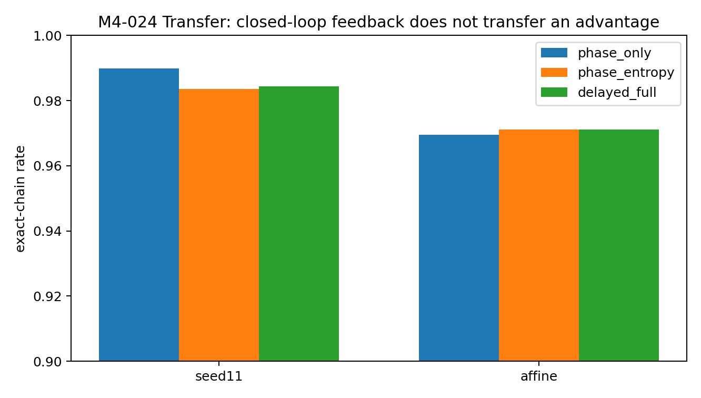

**Figure 39.** The current feedback controller does not transfer a performance advantage across seed or recurrence mechanism. Source: M4-019 to M4-024.

### Sensor measurements and controller effects

Module IV establishes a no-go boundary that is essential for the engineering program. The system now has useful instruments: entropy/clearance expose discrete passage instability, and causal contextual-state intervention exposes load-bearing scaffold joints. But these observations do not yet specify a correct control action. A gradient-based joint proxy is miscalibrated; causal calibration prevents unsafe routing but does not identify a better-than-ramp action; phase+entropy feedback matches a strong open-loop schedule but does not reliably beat it or repair an induced route fault faster under matched force exposure.

The strongest supported engineering statement is therefore: closed-loop control requires an explicit fault-to-action model. A diagnostic signal, even a causal one, cannot be treated as an actuator command without measuring which corrective force direction/contact/timing restores the damaged route.

### Interpreting feedback interventions

- Dashboard versus controller: an instrument panel can correctly show high temperature or low clearance without telling the operator which valve to turn. Observability and controllability are separate engineering problems.

- Gradient gauge versus load cell: the online input-interface gradient proxy placed its largest sensitivity on b4, while corrected same-token contextual intervention placed the largest seed7 input-interface damage on b2. The mismatch remains Spearman ρ ≈ 0.20, so raw gradient sensitivity is not a causal load measure.

- Seeing a collision is not repairing it: the hard route knock produces an immediate entropy/clearance/common-loss alarm, yet scalar feedback does not recover faster than ramp-up.

- Causal load does not equal optimal push point: intervention tells us where the scaffold breaks when swapped; it does not automatically tell us where an external training force should be applied to repair it.

- Ramp-up is not a primitive baseline: on this predictable curriculum it is a strong phase prior. A closed-loop system must add information beyond the known developmental schedule to beat it.

- Outlet leak, scaffold-joint failure, early-clamp rigidity, endpoint overdrive and route displacement are distinct fault classes that may require different corrective forces.

## 9  The geometry produced by the loss

The closing experiment returns to the trained hidden states themselves. Local boundary probes, interpolation, body/readout crosses and autonomous generation connect objective form to the geometry that was actually learned.

*Experiment M8-045 to M8-051*

### Question and design

Module VIII returns the program to its primary question: how does the training loss shape the output-compatible region itself? Seven branches start from the same already-solved checkpoint and receive the same 60 mini-batches with the same optimizer; only the loss form changes. The representative objectives are a lower wall at margin 2, full response CE, result-only CE, a hinge shelf at margin 4, a bounded margin band [2.5,3.5], a q=0.9 soft-target finite optimum, and a cross-layer corridor objective. Scaffold variables are not the research target in this module.

**Table 10. The geometry produced by the loss**

| Loss world | Median margin | 10–90% margin | Result entropy | Autonomous exact chain |
| --- | --- | --- | --- | --- |
| lower wall | 2.90 | 2.02–5.59 | 0.256 | 0.762 |
| full CE | 4.17 | 2.78–6.89 | 0.126 | 0.923 |
| result CE | 4.21 | 2.80–6.82 | 0.123 | 0.883 |
| hinge shelf | 4.42 | 3.26–6.45 | 0.097 | 0.763 |
| bounded band | 2.90 | 2.18–3.56 | 0.284 | 0.781 |
| soft target | 2.03 | 1.37–2.67 | 0.655 | 0.603 |
| layer corridor | 3.67 | 2.27–5.94 | 0.185 | 0.844 |

Source: M8-045 to M8-051. The experimental setting and definitions are given in the associated text.

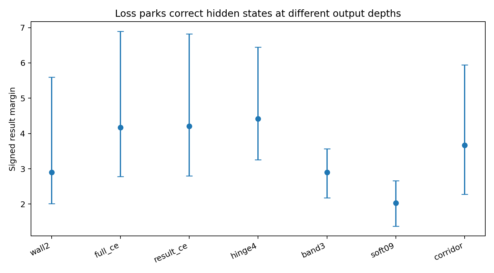

**Figure 40.** Output-margin distributions of correct hidden states under different training losses. Points show medians; error bars span the 10th to 90th percentiles. The matching distribution summary is reported in the associated table. Source: M8-045 to M8-051.

### M8 046 Terminal outlet topology one wall versus two walls

The hidden-state probe starts from objective-compatible final states, computes the local result-margin normal, and moves the state in both normal directions while holding the readout fixed. Lower-wall, CE, hinge and final-corridor worlds are effectively one-sided: 98.8–100% of probed states leave the outlet in one normal direction and remain inside in the other over the tested radius. Bounded-band and soft-target worlds are exactly bilateral in the same assay: 100% of probed states hit an outlet boundary in both normal directions. The loss therefore determines whether the terminal low-loss region is open on one side or bounded on both sides.

**Table 11. The geometry produced by the loss**

| World | One-sided frac | Bilateral frac | Nearest normal wall | Tangential radius |
| --- | --- | --- | --- | --- |
| wall2 | 1.000 | 0.000 | 1.148 | 9.720 |
| full ce | 0.988 | 0.000 | 2.034 | 12.099 |
| result ce | 0.994 | 0.000 | 2.075 | 12.806 |
| hinge4 | 1.000 | 0.000 | 1.247 | 8.952 |
| band3 | 0.000 | 1.000 | 0.335 | 6.742 |
| soft09 | 0.000 | 1.000 | 0.232 | 3.200 |
| corridor | 1.000 | 0.000 | 1.868 | 11.513 |

Source: M8-045 to M8-051. The experimental setting and definitions are given in the associated text.

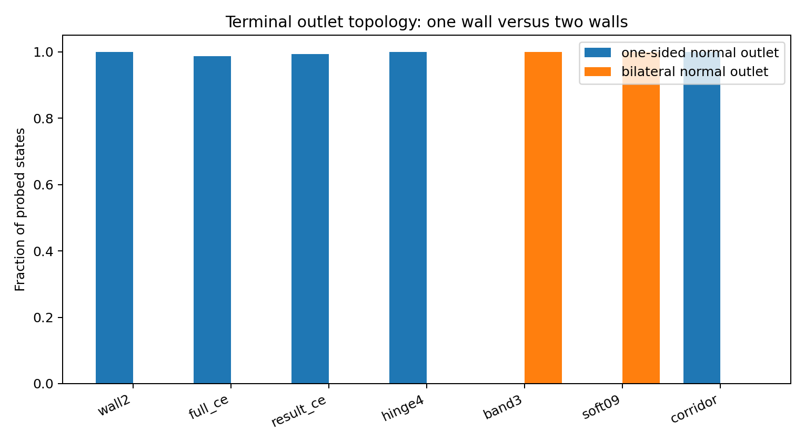

**Figure 41.** Objective form selects one-wall or two-wall terminal outlet topology. Source: M8-045 to M8-051.

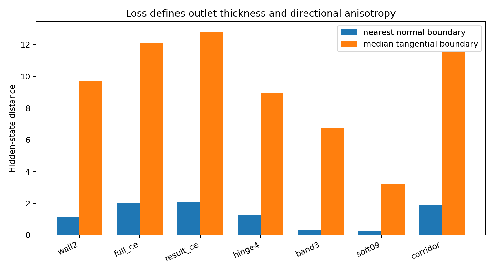

**Figure 42.** Bounded objectives form thin, highly anisotropic low-loss sheets: narrow in the outlet-normal direction and much wider tangentially. Source: M8-045 to M8-051.

The bounded band has a median nearest-normal thickness of 0.335 hidden-state units but a median tangential radius of 6.742; soft-target is thinner still (0.232 normal versus 3.200 tangential). These are state-space measurements, not only analytic margin inequalities.

### M8 047 Correct class region stays connected while bounded low loss regions become thin curved subsets

For pairs of held-out final states with the same correct result digit, straight hidden-state interpolation remains class-correct along the entire path in every tested world. The low-loss set behaves differently. Open objectives retain 100% whole-path compatibility, while the bounded band retains only 24.2% and soft-target 45.8%. Thus the loss is not fragmenting the class-correct basin into isolated answer pockets; it is carving a thin curved low-loss subset inside a broader connected correct region.

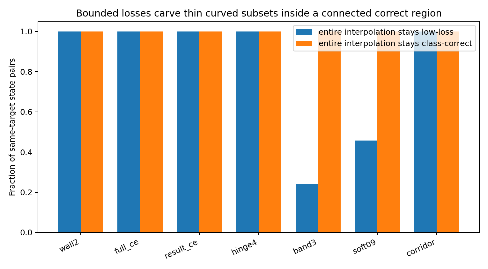

**Figure 43.** Class correctness remains connected, while bounded low-loss outlets occupy thin curved subsets of that connected region. Source: M8-045 to M8-051.

### M8 048 Terminal geometry and trajectory geometry are different objects

Across all worlds, the final layer approaches the result outlet through a strongly tangential motion component: mean tangential fractions are about 0.75–0.87 rather than near zero. Loss therefore does not simply drive hidden states straight along the output normal. The corridor objective is distinctive because it reshapes the route before the terminal outlet: layer-1 median result margin rises to −2.15, compared with roughly −3.06 to −3.46 for the wall/CE/hinge worlds, and its final-step motion has the largest normal alignment (mean cosine 0.651). The corridor is therefore primarily a path constraint, whereas band/soft objectives primarily change terminal outlet topology.

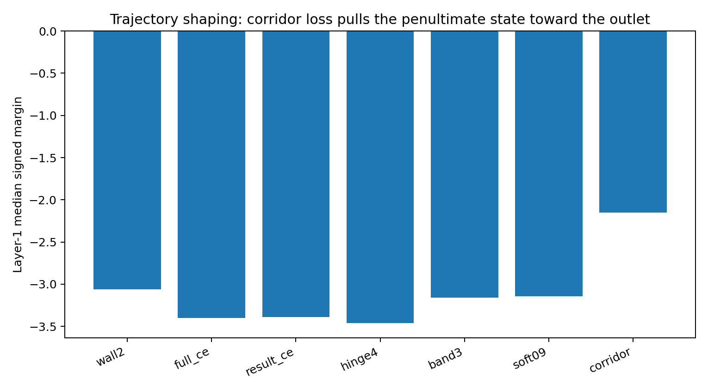

**Figure 44.** Cross-layer corridor loss pre-positions penultimate states closer to the final outlet. Source: M8-045 to M8-051.

### M8 049 Contributions of hidden state and readout

A 7×7 body/readout cross evaluates every loss-trained hidden-state body through every loss-trained norm+head. Two-way variance decomposition of median margin attributes 74.4% of the across-cell variation to the hidden-state body, 25.3% to the readout, and only 0.2% to interaction. The soft-target body rotates by about 23.3° from the wall2 body on matched held-out states, while its digit-head rows rotate only about 4.85°. Loss shaping is therefore primarily internal-state relocation relative to the outlet, with a smaller readout contribution.

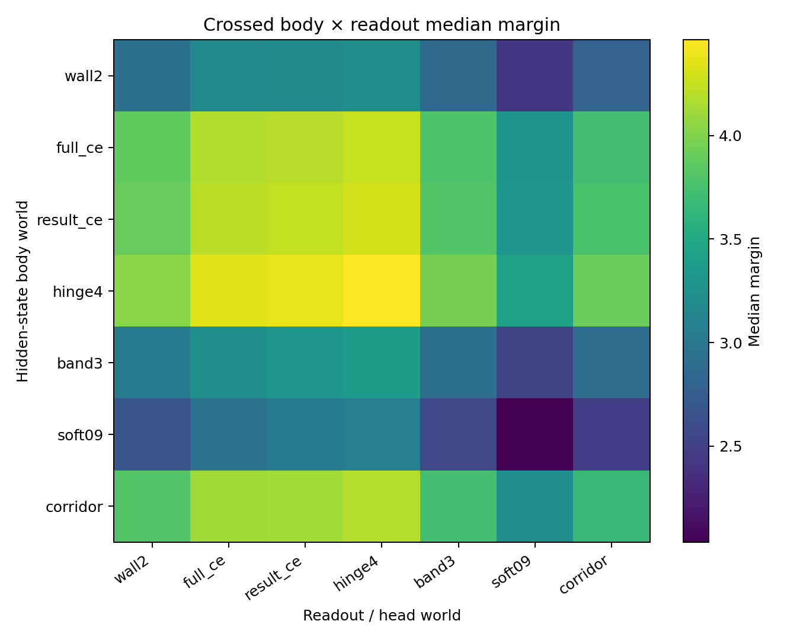

**Figure 45.** Crossed body × readout assay: most margin parking differences follow the hidden-state body rather than the final head. Source: M8-045 to M8-051.

### M8 050 Outlet geometry changes autonomous passage

All seven branches remain essentially perfect under teacher forcing, but autonomous sampling differs sharply. Full CE reaches 92.3% exact-chain passage, result-only CE 88.3%, corridor 84.4%, band 78.1%, wall 76.3%, hinge 76.3%, and soft-target 60.3%. With common random numbers, full CE exceeds soft-target by +31.95 percentage points exact-chain (95% paired task-bootstrap CI +29.06 to +35.00 pp), band by +14.14 pp (+11.72 to +16.64), and wall by +16.02 pp (+13.36 to +18.83). These comparisons do not imply that an open outlet is universally preferable; they establish that loss-shaped outlet geometry materially changes route survival even when the correct teacher-forced endpoint is already available.

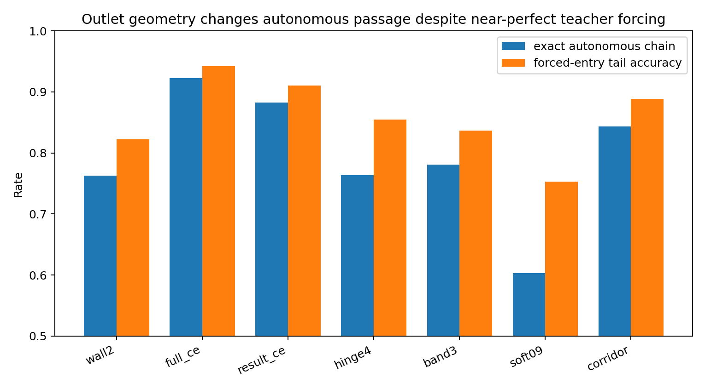

**Figure 46.** Near-perfect teacher-forced correctness coexists with large differences in autonomous passage across loss-shaped outlets. Source: M8-045 to M8-051.

### M8 051 Topology transfers across initialization and generating mechanism

The defining topology survives both an independent initialization and a different affine recurrence task. In both transfer worlds, lower-wall and hinge objectives are 100% one-sided under the local normal assay, while bounded-band and soft-target objectives are 100% bilateral. Absolute radii change, but the one-wall versus two-wall distinction does not. The outlet topology is therefore a stable consequence of the loss form in this controlled family rather than an accident of one checkpoint.

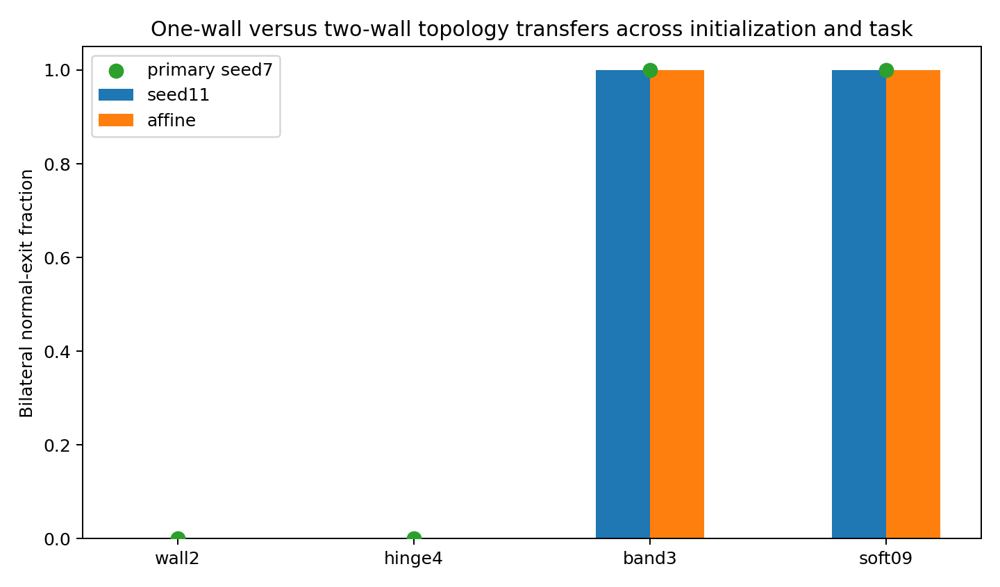

**Figure 47.** One-wall versus two-wall outlet topology transfers across seed and task mechanism. Source: M8-045 to M8-051.

### Learned acceptance regions and approach trajectories

The executed evidence supports a two-part description. First, the terminal objective determines outlet topology: lower-bound and CE-like objectives form one-sided open regions; finite-band and soft-target objectives form bilateral thin low-loss sheets inside a broader connected class-correct region. Second, losses can reshape the approach trajectory independently of terminal topology: a cross-layer corridor leaves the final outlet one-sided but moves penultimate states closer and aligns the final transition more strongly toward the output normal. The loss is therefore not merely a scalar score at the endpoint. It specifies a geometric acceptance region and a vector field that trains internal states to approach, enter and occupy that region.

A further mechanistic result is that most of the observed outlet parking difference is carried by the hidden-state body rather than by the readout head. This supports the earlier working picture that training reshapes the internal data cloud around an output interface rather than only rotating the final classifier.

### Synthesis

Together, the matched loss branches establish a two-part mechanism: the objective shapes the terminal low-loss acceptance region and the trajectory approaching it. Body/readout hybrids attribute most margin relocation to the hidden-state body, while autonomous sampling measures the behavioral consequence of each resulting outlet. The one-sided versus bilateral topology also transfers across the tested initialization and recurrence mechanism.

## Implications for Data Oriented Modelling

Loss design becomes a measurable part of model design. The data specify the relations the computation must carry, while the objective shapes acceptance boundaries and the training field around them. In the controlled reasoning family, measurements of clearance, contact, trajectory position and autonomous passage identify which aspects of that field explain the resulting behavior.

## Experimental sources

- Experiment LOSS-OUTLET-GEOMETRY-001

- Experiment LOSS-OUTLET-GEOMETRY-002B

- Experiment LOSS-OUTLET-GEOMETRY-003

- Experiment LOSS-OUTLET-GEOMETRY-004

- Experiment LOSS-OUTLET-GEOMETRY-005

- Experiment LOSS-OUTLET-GEOMETRY-006

- Experiment OUTLET-007 to OUTLET-012

- Experiment M4-019 to M4-024

- Experiment M8-045 to M8-051
