# Formation and Handoff of Internal Computation

[Chapter 7](../README.md) · [Word report](04_Formation_and_Handoff_of_Internal_Computation.docx) · [Evidence index](EVIDENCE_INDEX.md)

Data-Oriented Modelling · Chapter 7 · Report 4

## Overview

Repeated computation recruits internal states that carry a local relation forward until the next result is formed. We call these load-bearing states a computational scaffold. Their identity is established by replacing contextual states while preserving visible token identity and measuring the resulting change in later computation. The experimental sequence follows the scaffold through formation, deliberate redistribution, architectural relocation and functional testing. Across these changes, a local handoff role remains observable: damage is concentrated at the next computational result, and later teacher-forced results recover after that result is supplied.

## Question and experimental setting

How does training create an internal interface for the next computation, and which part of its function follows the interface when its physical carrier changes?

The main system is a controlled two-layer arithmetic reasoner. Experiments combine matched loss branches, same-token contextual-state replacement, training checkpoints, parameter rollback and seven response serializations. Transfer measurements use an independent initialization and the altered recurrence x(t+1) = (2x(t) + b(t)) mod 10.

## Terms used in this report

**Table 1. Terms used in this report**

| Term | Meaning in the experiments |
| --- | --- |
| Scaffold | A contextual state with a measured causal role in carrying later computation. |
| Carrier | The token position or interface that holds that state. |
| Teacher forcing | Supplying the correct preceding tokens while measuring the next output. |
| Handoff | The transfer of local computational responsibility to the next result state. |
| Delta CE | Change in cross-entropy after a matched intervention. |

## 1  Locating the states that carry the route

Geometric coherence, output clearance and causal dependence provide different measurements of the same trajectory. Context-preserving replacement locates which state actually carries a later result.

*Experiment M3-013 to M3-018*

### Experimental question

Can the loss-defined force field be causally connected to the internal dynamic assembly that supports autoregressive reasoning, rather than only to output margin or token entropy?

### Frozen system and scope

- Same 2-layer arithmetic reasoner and controlled post-training worlds from Loss Machining Module II.

- Primary seed-7 force worlds: no auxiliary force, answer-only force, full-response force, ramp-up full-response force, and early-layer clamp.

- Transfer checks: independent seed-11 addition reasoner and a distinct affine recurrence x(t+1)=(2x(t)+b(t)) mod 10.

- Dynamic fragments are the four STEP–input–RESULT–value blocks plus the ANSWER block; contextual-state intervention preserves visible token identity while exchanging hidden relational state across tasks.

### M3 013 014 Dynamic assembly atlas and force to assembly trajectory

Coarse assembly geometry changes under force interventions, but does not move in one simple direction. Answer-only force lowers the identity-specific assembly score while aggressively lowering entropy and increasing margin. Full-response and ramp-up force preserve assembly geometry while also improving clearance. Early-layer clamping can increase the coarse assembly score yet produce the weakest passage among the selected worlds. Assembly and passage are therefore separable.

**Table 2. Locating the states that carry the route**

| Force world | Assembly score | Result entropy | Median margin | Exact chain |
| --- | --- | --- | --- | --- |
| no aux | 0.0693 | 0.406 | 2.293 | 0.589 |
| answer | 0.0548 | 0.364 | 2.458 | 0.601 |
| full | 0.0666 | 0.374 | 2.472 | 0.644 |
| ramp up | 0.0669 | 0.359 | 2.542 | 0.671 |
| early | 0.0702 | 0.443 | 2.167 | 0.563 |

Source: M3-013 to M3-018. The experimental setting and definitions are given in the associated text.

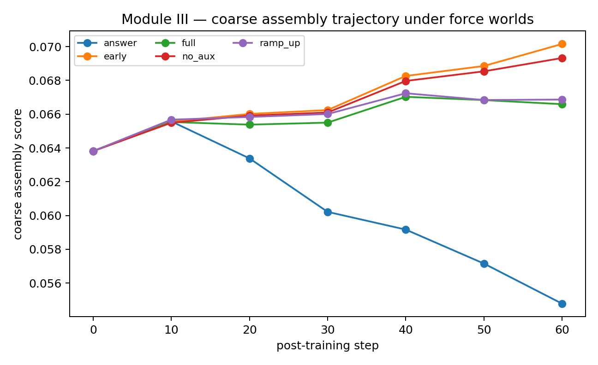

**Figure 1.** Coarse assembly score during the same 60-step post-training trajectory. Source: M3-013 to M3-018.

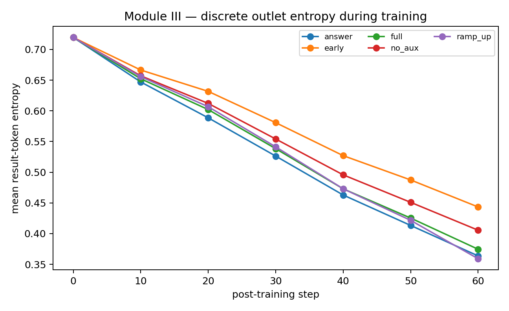

**Figure 2.** Result-token entropy falls under all worlds, but at different rates and with different assembly trajectories. Source: M3-013 to M3-018.

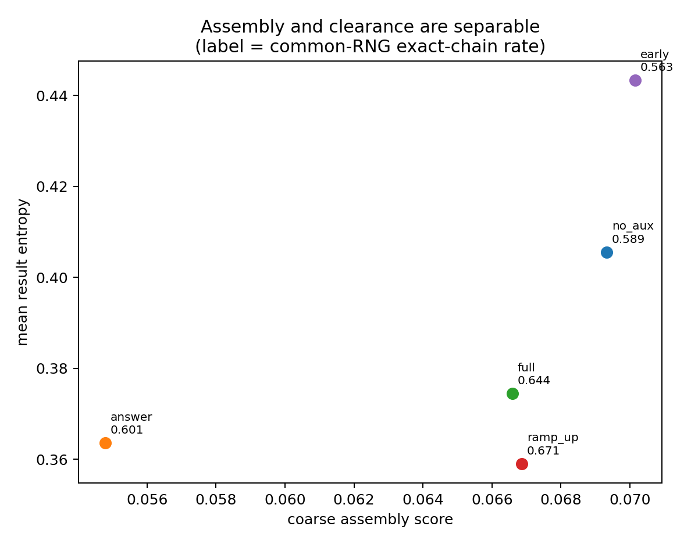

**Figure 3.** Good passage occupies a joint assembly/clearance regime rather than a single geometric axis. Source: M3-013 to M3-018.

### M3 015 Geometry entropy and passage

A grouped five-fold cross-validation held out task identities across force worlds. Result-token entropy alone predicts autonomous exact-chain survival well, whereas the coarse geometry bundle (co-motion, rigidity, translation fraction and effective rank) does not generalize as a task-level predictor. Adding the coarse geometry bundle to entropy worsens cross-validated performance. The dashboard must therefore distinguish descriptive shape metrics from load-bearing mechanism metrics.

**Table 3. Locating the states that carry the route**

| Predictor set | CV RMSE | CV R² | Pred–obs corr |
| --- | --- | --- | --- |
| entropy only | 0.088 | 0.641 | 0.801 |
| margin only | 0.127 | 0.243 | 0.494 |
| assembly only | 0.159 | -0.172 | 0.007 |
| entropy plus assembly | 0.100 | 0.538 | 0.738 |
| all | 0.113 | 0.407 | 0.672 |

Source: M3-013 to M3-018. The experimental setting and definitions are given in the associated text.

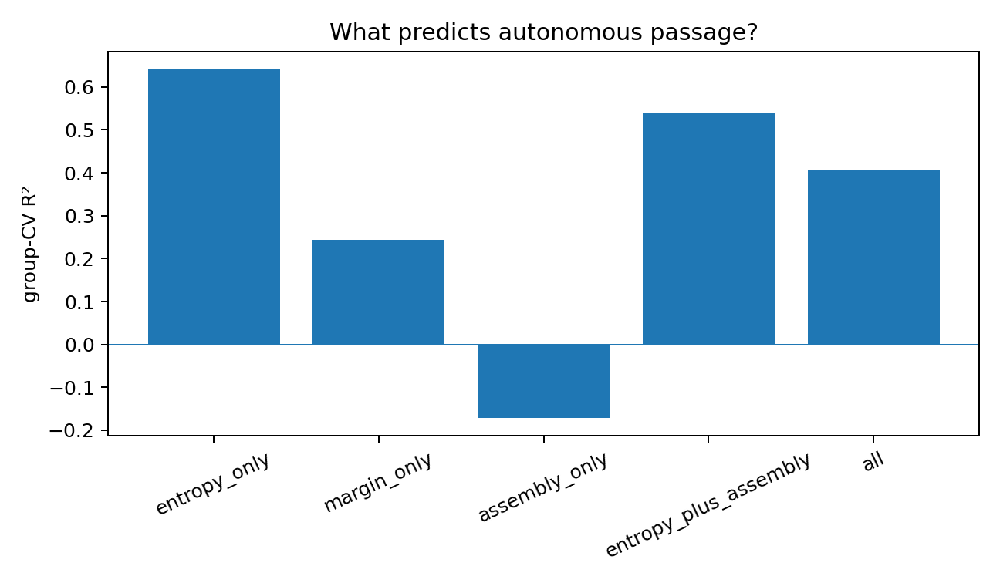

**Figure 4.** Coarse assembly geometry is not a substitute for discrete passage stability. Source: M3-013 to M3-018.

### M3 016 Identity preserving contextual state intervention

The decisive test preserves visible token identity and replaces only the layer-1 contextual hidden state with that of the same token in another problem. In seed-7 addition, STEP boundaries carry the dominant free-continuation load; current-step input b states are also strongly load-bearing. RESULT markers and result-value states have milder effects.

### M3 017 Load bearing interface timing

After the first result is forced correct, the seed-7 map places the strongest structural load on STEP2–STEP4. Among current-step input interfaces, b2 is the most sensitive. RESULT2–RESULT4 marker states have mild effects in this addition task.

### M3 018 Transfer scaffold class transfers exact load carrier does not

The corrected scaffold result survives transfer with an important qualification. Independent seed11 develops a late STEP scaffold while true RESULT markers remain mild. Under affine recurrence, current-step input b states and true RESULT markers become load-bearing. The transferable result is task-conditioned load-bearing topology, not a universal token, layer, or coordinate.

The complete token-position map and quantitative swap atlas are given in the following formation analysis.

Module III closes part of the force→assembly→passage chain, but with a sharper object than simple geometric clustering. Loss force changes the balance between assembly coherence and token-level clearance. Coarse geometry alone is not a reliable passage predictor. Causal intervention identifies contextual structural joints whose relational state is required for the route to survive. In the primary task, distributed/ramp-up force preserves assembly while improving clearance; answer-only force improves the endpoint while weakening coarse assembly; early clamping can over-organize coarse geometry without producing a traversable route.

The strongest supported engineering statement is: a sequential reasoner needs both a stable discrete outlet and a task-appropriate load-bearing scaffold. The scaffold is carried by contextual states, not by token strings alone, and its topology changes with the generating mechanism.

### The assembly interpretation

- Material versus joint: both structural and content-bearing interfaces can become load-bearing contextual infrastructure. Which carrier is recruited depends on the task-generating mechanism, response architecture, and training history; token names are not the mechanism.

- A pretty rigid cloud is not enough: early clamping can increase coarse assembly while making the route worse. The object must be assembled in a way that remains compatible with repeated mosaic-like tokenization.

- The slit/mosaic outlet and the assembly are complementary: entropy/clearance governs whether each discrete cut survives; contextual joints govern whether the larger route remains mechanically connected.

- The exact load-bearing joint is not universal. Seed changes can move the joint, and a recurrence that explicitly reuses prior results can make numerical result states themselves load-bearing.

- Continuous geometry and causal load provide complementary views. The motion trace describes the evolving assembly, and interface sensitivity identifies the states that support its continued computation.

## 2  How a local interface becomes load bearing

The corrected token-position map fixes the identity of each intervention. Training checkpoints then show how local prediction pressure develops into support for future computation.

*Experiment M5-025 to M5-032*

### Exact token positions and intervention identities

The exact serialization places STEP at positions 13/17/21/25, current-step input b at 14/18/22/26, RESULT markers at 15/19/23/27, result values at 16/20/24/28, and ANSWER at 29. All contextual-state interventions in this report are interpreted using these token identities.

**Table 4. How a local interface becomes load bearing**

| Computational interface | Token positions |
| --- | --- |
| STEP boundary | 13, 17, 21, 25 |
| Current input b | 14, 18, 22, 26 |
| RESULT marker | 15, 19, 23, 27 |
| Result value | 16, 20, 24, 28 |
| ANSWER marker | 29 |

Source: M5-025 to M5-032. The experimental setting and definitions are given in the associated text.

The online gradient proxy samples current-step input interfaces b1–b4 at positions 14/18/22/26. Its four-position association with causal input-interface damage is Spearman ρ = 0.20 (p=0.80), establishing the measured relationship between that proxy and the corrected causal assay.

### M5 025 load bearing atlas

With the first result r1 forced correct, same-token contextual-state swaps were rerun using the correct layer-1 token positions. In seed7 ramp-up, STEP boundary states are the dominant joints: swapping all four STEP states collapses exact-tail passage to zero. Current-step input b states are also strongly load-bearing. True RESULT markers and result-value contextual states are mild in this add task. The ANSWER marker is also important late in the chain.

**Table 5. How a local interface becomes load bearing**

| Swap | Exact tail | Tail result accuracy |
| --- | --- | --- |
| none | 0.680 | 0.770 |
| STEP markers | 0.000 | 0.124 |
| input b | 0.328 | 0.438 |
| RESULT markers | 0.653 | 0.754 |
| result values | 0.669 | 0.766 |
| ANSWER marker | 0.336 | 0.684 |

Source: M5-025 to M5-032. The experimental setting and definitions are given in the associated text.

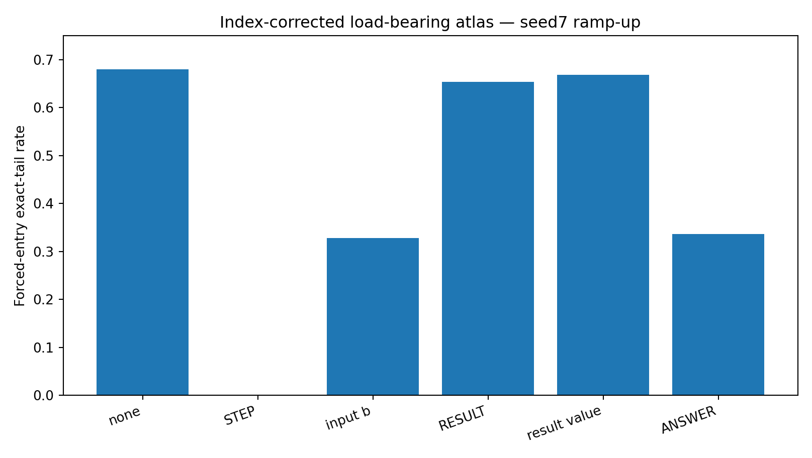

**Figure 5.** Seed-7 scaffold atlas. STEP boundaries and current-step input interfaces, not RESULT markers, carry the dominant causal load in free continuation. Source: M5-025 to M5-032.

### M5 026 Scaffold genesis during training

The same seed7 reasoner was retrained from its exact random initialization and frozen repeatedly. Teacher-forced contextual intervention keeps every visible symbol correct, so the measured damage is downstream internal dependence rather than a next-token formatting artifact. STEP dependence is negligible through most early training, begins to rise around updates 200–240, and then crystallizes sharply during the late competence transition: STEP-swap future-result delta-CE rises from 0.078 at step 240 to 1.848 at step 320, while result-slot accuracy rises toward its mature regime. The scaffold is therefore learned late rather than inherited from architecture.

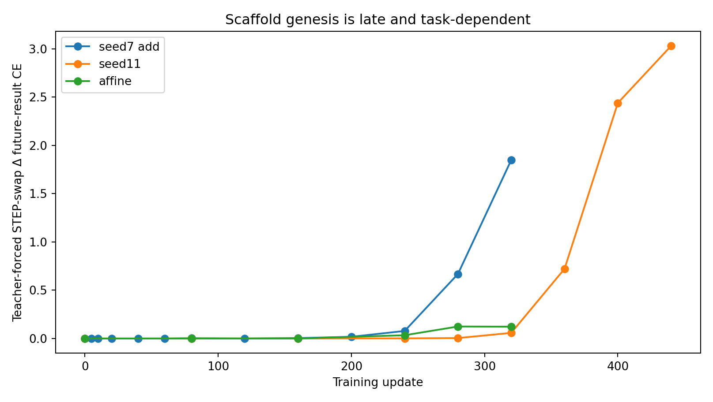

**Figure 6.** STEP scaffold load emerges late. An independent seed reproduces the late transition; affine recurrence recruits a different mature load topology. Source: M5-025 to M5-032.

### M5 027 028 What training pressure creates the scaffold

The training objective first turns STEP into a local operation interface and later recruits that interface for future computation. Early in training, the largest gradient on the layer-1 STEP state comes from predicting the next current-step input b. Once that local retrieval problem becomes easy, its gradient collapses, while the future result/answer gradient on the same STEP state grows. At step 320 the future-result gradient norm on STEP is about 66× the immediate b-prediction gradient. The same interface has therefore been secondarily recruited as a carrier for future computation.

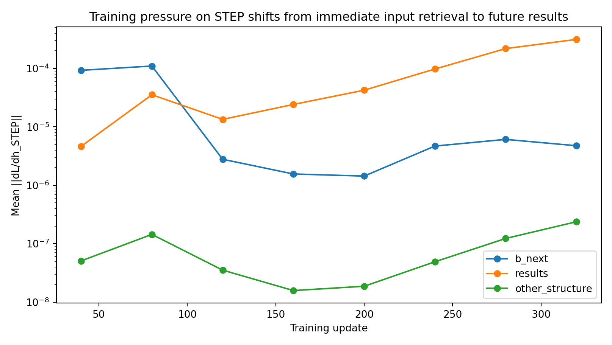

**Figure 7.** Training pressure on STEP shifts from immediate input retrieval to future result prediction. Source: M5-025 to M5-032.

Loss-source interventions support a balanced-interface account rather than a “more STEP loss is better” account. Removing the four STEP→b prediction targets prevents normal arithmetic learning and nearly eliminates STEP scaffold dependence. Overweighting those same targets 5× also harms arithmetic and yields weak STEP dependence. Removing the loss that predicts the literal RESULT marker, by contrast, produces very high result accuracy while redistributing causal load onto STEP, input-b, result-value and ANSWER states. Scaffold topology therefore reorganizes when the objective changes.

**Table 6. How a local interface becomes load bearing**

| Training objective | Result acc | All-results acc | STEP swap ΔCE |
| --- | --- | --- | --- |
| full | 0.806 | 0.342 | 1.848 |
| no b loss | 0.380 | 0.001 | 0.000 |
| b x5 | 0.284 | 0.000 | 0.021 |
| no step target | 0.363 | 0.002 | 0.301 |
| no result marker target | 0.981 | 0.910 | 0.908 |
| result value x5 | 0.450 | 0.000 | 0.153 |

Source: M5-025 to M5-032. The experimental setting and definitions are given in the associated text.

### M5 029 The scaffold can be untrained and regrown

A mature model was then forced to train with layer-1 STEP contextual states swapped across examples. This augmentation explicitly makes the current STEP scaffold unreliable. After 80 updates, STEP-swap delta-CE falls from 1.848 to 0.007 while result accuracy remains 0.864. Ordinary continuation instead drives scaffold load higher (delta-CE 2.907) and near-perfect performance. Restoring ordinary training after scaffold-neutralizing augmentation rapidly recovers task performance to 0.9995 while STEP dependence regrows more slowly. Extended retraining reaches 100% result accuracy while STEP load continues rising. Functional competence can therefore be implemented with substantially different scaffold topologies.

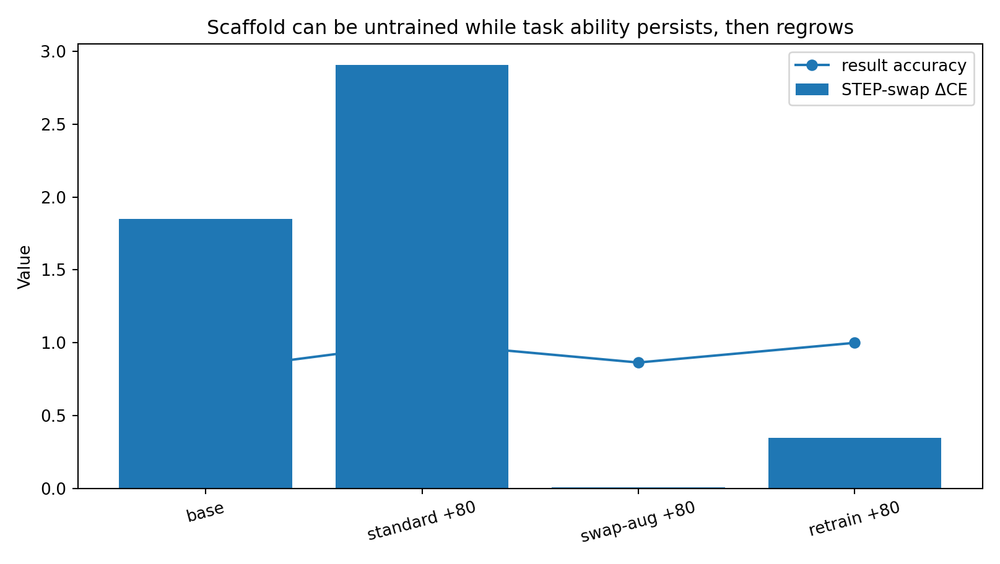

**Figure 8.** STEP dependence can be deliberately untrained, while much of the task remains solvable; ordinary training then regrows the scaffold. Source: M5-025 to M5-032.

### M5 030 Where the late scaffold is stored

Parameter rollback isolates the late step240→320 change. Replacing mature embeddings/positional embeddings with step240 values barely changes STEP dependence (1.848→1.823). Rolling back attention pathways has much larger effects: layer-0 attention reduces STEP delta-CE to 0.916 and layer-1 attention to 0.578; rolling back both complete Transformer layers reduces it to 0.108. FFN-only rollbacks retain much more scaffold load. The late recruitment therefore resides primarily in learned cross-position attention routing rather than lexical embedding storage.

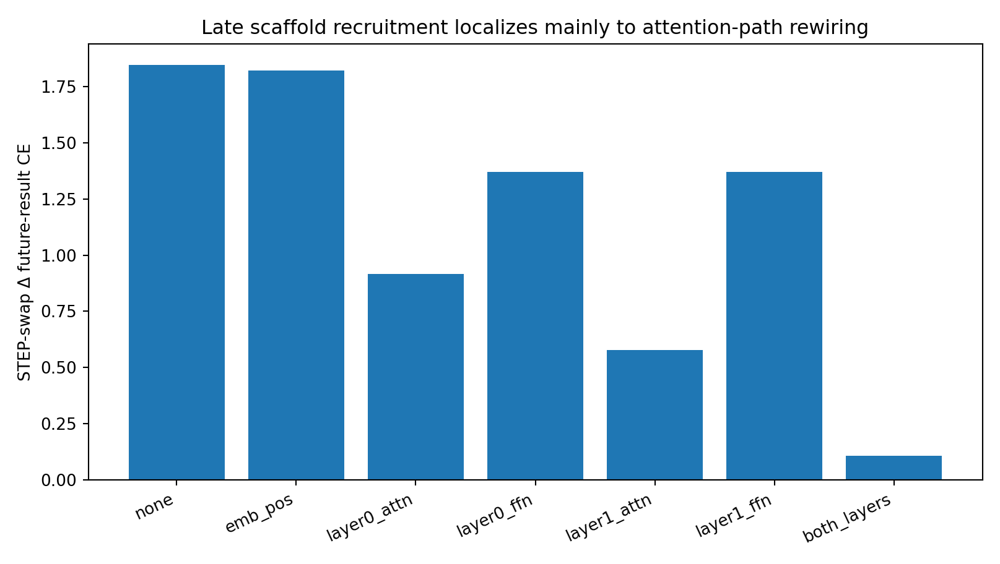

**Figure 9.** Late STEP recruitment is concentrated in attention-path rewiring, especially the second Transformer layer. Source: M5-025 to M5-032.

### M5 031 Training order changes the scaffold birth path

To isolate history near the actual birth window, two models started from the identical step240 checkpoint and received the same 80 post-checkpoint updates and the same two emphasized loss components, differing only in order. Interface-emphasis then result-emphasis yields higher final result accuracy (0.854 vs 0.755) and stronger STEP dependence (1.705 vs 1.373) than the reverse order. Scaffold topology is therefore path-dependent even over a short late-training interval.

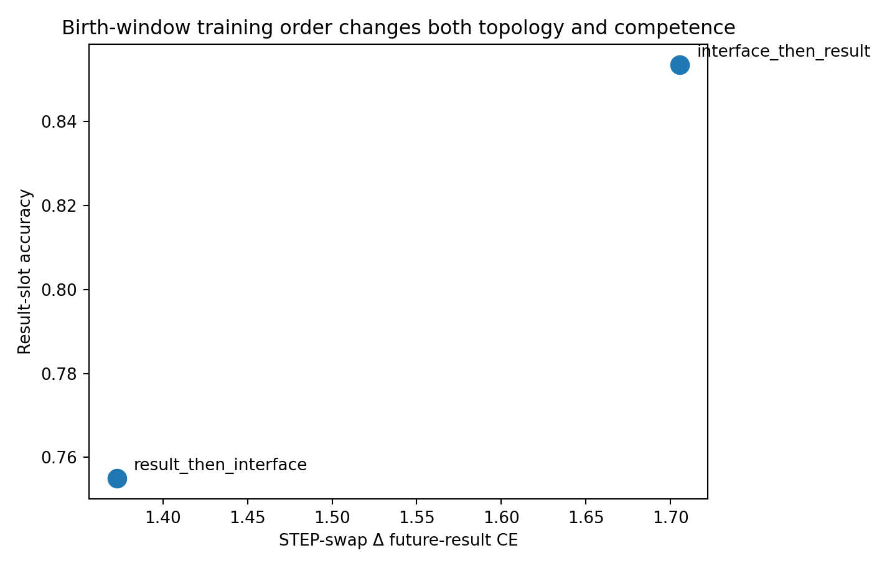

**Figure 10.** Swapping the order of late interface/result training changes both final competence and STEP scaffold load. Source: M5-025 to M5-032.

### M5 032 Transfer the class of scaffold transfers the exact load topology does not

Independent seed11 reproduces late STEP crystallization: the teacher-forced STEP-swap delta-CE remains near zero through step 280, reaches 0.058 at step 320, then rises to 0.721/2.439/3.030 at steps 360/400/440. The affine recurrence task follows a different mature topology. At its step320 checkpoint, teacher-forced downstream damage is dominated by input-b states (ΔCE≈1.45), RESULT markers (≈2.08) and the ANSWER marker (≈1.26), while STEP itself contributes only ≈0.12 and result-value states are near zero. Free continuation nevertheless remains sensitive to STEP because STEP controls the next visible current-step input. The load-bearing network is therefore task-conditioned and measurement-context dependent.

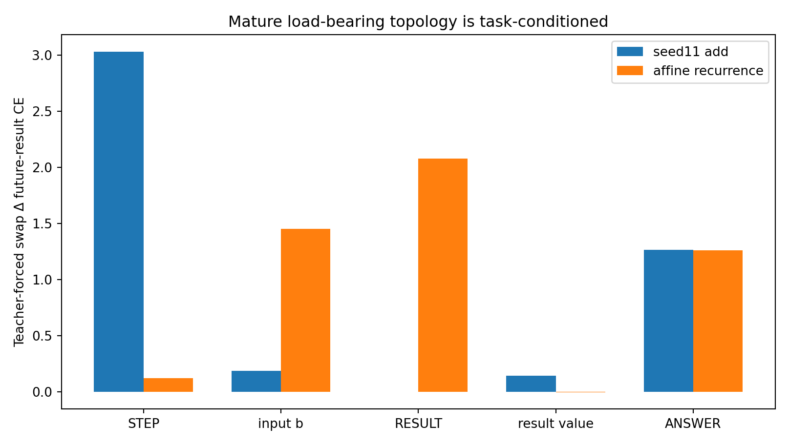

**Figure 11.** Mature teacher-forced load topology differs between independent add and affine-recurrence mechanisms. Source: M5-025 to M5-032.

### Formation of a reusable interface

The executed evidence supports a developmental mechanism rather than a fixed semantic-slot account. Training first makes a repeated boundary state useful for a local operation (in addition, STEP learns to retrieve the next current-step input). Once that interface is reliable, later future-result gradients increasingly route computation through it. Late attention rewiring consolidates this reuse into a load-bearing scaffold. Because the process is path-dependent and plastic, training can unload the scaffold, redistribute computation elsewhere, and later recruit it again.

The strongest current description is: local interface acquisition → downstream gradient recruitment → attention-path consolidation → task-conditioned load-bearing topology. Token names are not the mechanism. The optimization history selects convenient interfaces and turns them into computational infrastructure.

## 3  Moving the interface moves the computational load

Changing the response serialization gives training a different set of repeatable interfaces. Mature models reveal where the computation is subsequently carried.

*Experiment VI-033 to VI-038*

### Question and frozen controls

Module V showed that a load-bearing scaffold is learned rather than hard-coded. Module VI therefore changes the response architecture itself and asks where training places causal load when a preferred interface is moved, split or removed. All seed7 architecture worlds reuse the same underlying arithmetic tasks, the exact Module-V random initialization for the original vocabulary, the same Transformer core, optimizer, batch sequence and learning rate. Extra STEP1–STEP4 rows are initialized from the original STEP row. Inactive extra tokens are masked from each world’s softmax so the shared-STEP baseline reproduces the original training condition. Slow architectures are trained to maturity rather than compared only at a fixed undertrained checkpoint.

**Table 7. Moving the interface moves the computational load**

| Architecture | Repeated block | First ≥90% all-results | All-results at maturity | Dominant mature load | Swap ΔCE |
| --- | --- | --- | --- | --- | --- |
| shared | [STEP b RESULT r] ×4 | 400 | 1.000 | pre boundary | 3.23 |
| specific | [STEP1 b RESULT r] … [STEP4 b RESULT r] | 560 | 0.985 | input b | 3.04 |
| post | [b RESULT r STEP] ×4 | 320 | 0.905 | input b | 3.50 |
| no step | [b RESULT r] ×4 | 280 | 0.948 | result value | 3.19 |
| no result | [STEP b r] ×4 | 280 | 0.969 | input b | 5.56 |
| bare | [b r] ×4 | 240 | 0.934 | input b | 4.31 |
| double | [STEP b RESULT r STEP] ×4 | 400 | 0.915 | input b | 2.92 |

Source: VI-033 to VI-038. The experimental setting and definitions are given in the associated text.

### VI 033 Blueprint changes optimization speed

The architectures do not merely change where a mature model stores information; they change how quickly a reusable computation is discovered. The bare b→r chain reaches the 90% all-results gate by update 240; no-STEP and no-RESULT by 280; post-result STEP by 320; shared STEP and double-boundary by 400; STEP1–STEP4 requires 560 updates. Shorter responses contribute to some of these differences, but sequence length is not a complete explanation: post-result STEP has the same token count as shared STEP and is far ahead at update 320 (0.905 versus 0.351 all-results), while step-specific markers have the same block length as shared STEP yet mature much later. Interface reuse and placement therefore materially shape scaffold discovery.

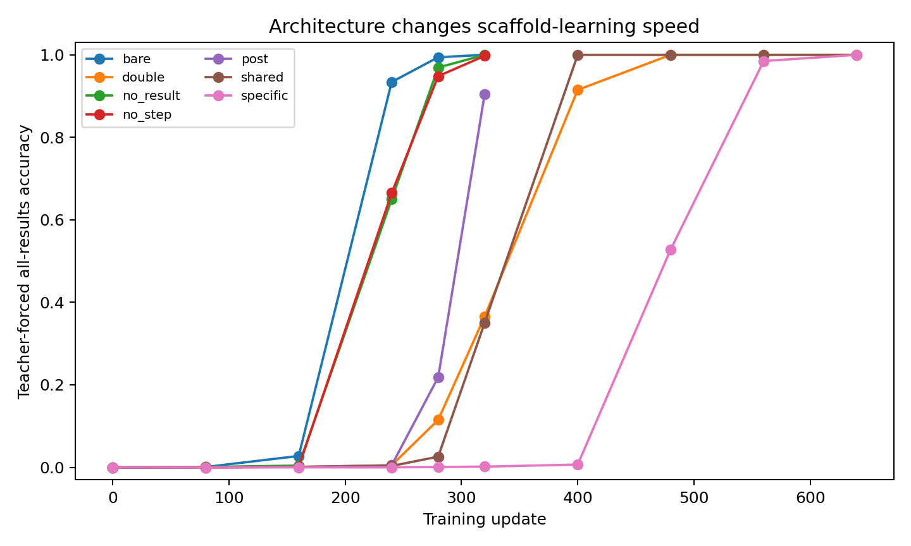

**Figure 12.** All-results competence across training for seven response blueprints. Source: VI-033 to VI-038.

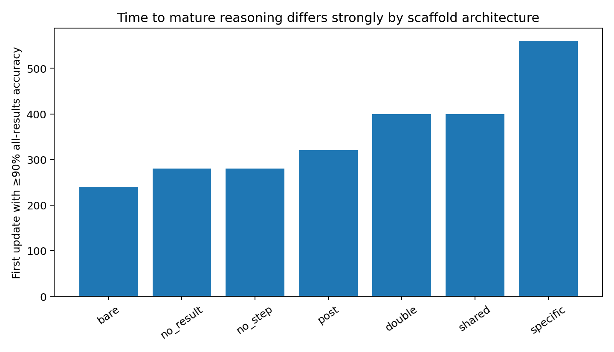

**Figure 13.** First observed checkpoint reaching at least 90% teacher-forced all-results accuracy. Source: VI-033 to VI-038.

### VI 034 035 Relocation of computational load

At matched mature competence, different blueprints produce different load-bearing topologies. Shared STEP turns the repeated pre-operation boundary into the dominant scaffold. When STEP is removed, load moves primarily onto the result-value states. When RESULT is removed—or when both STEP and RESULT are removed—load moves onto the current-step input b states. Moving STEP after the result likewise leaves input b as the principal load-bearing interface. Splitting STEP into STEP1–STEP4 delays learning and, after maturation, the largest causal load is again carried by input b rather than by the specialized markers. Adding both pre- and post-boundaries also leaves input b and result values as the dominant mature structure.

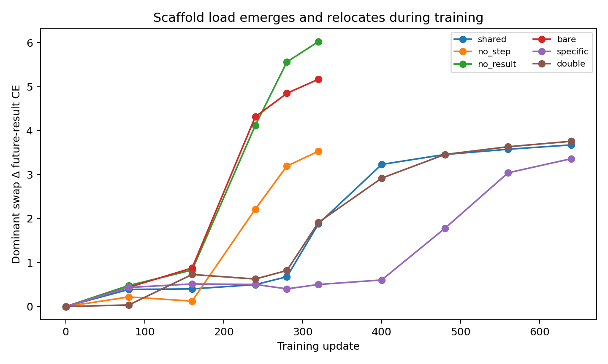

**Figure 14.** Dominant contextual-swap load grows at different times and on different interfaces as the blueprint changes. Source: VI-033 to VI-038.

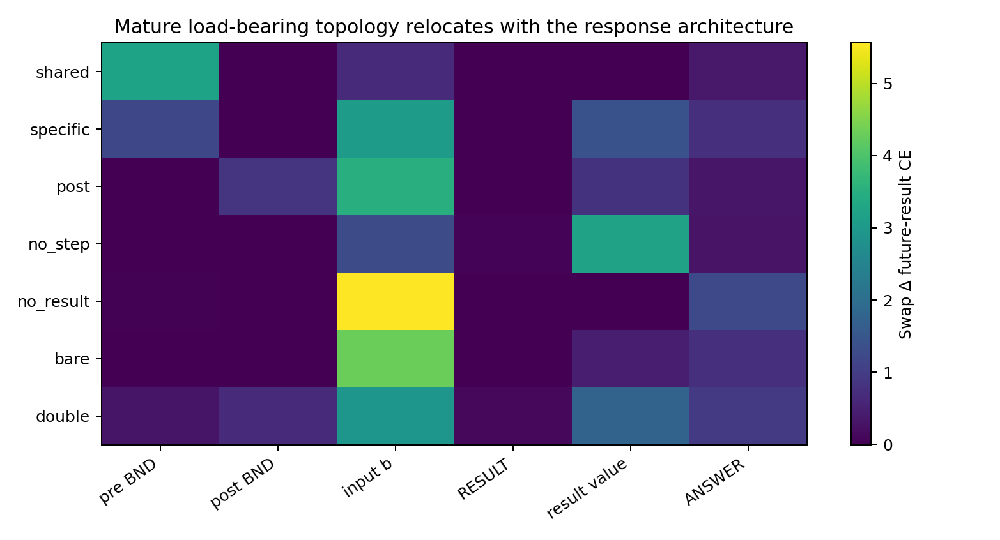

**Figure 15.** Mature causal load map. The same task can be implemented with radically different internal scaffolds. Source: VI-033 to VI-038.

### VI 036 037 Relocated scaffolds causally carry free continuation

The relocation is not a teacher-forced readout artifact. After forcing the first arithmetic result correct, the dominant contextual interface is swapped across examples while every visible token identity at the swapped position is preserved. At mature competence, autonomous exact-tail reasoning collapses from 0.988 to 0.000 for shared STEP, 0.923 to 0.025 for mature step-specific architecture after swapping its newly dominant input-b interface, 0.764 to 0.000 for post-result STEP after input-b swap, 0.977 to 0.002 for no-STEP after result-value swap, 0.984 to 0.009 for no-RESULT after input-b swap, 0.992 to 0.023 for the bare architecture after input-b swap, and 0.816 to 0.125 for double-boundary after input-b swap. The model therefore reconstructs a causally load-bearing route even when the original marker scaffold is removed.

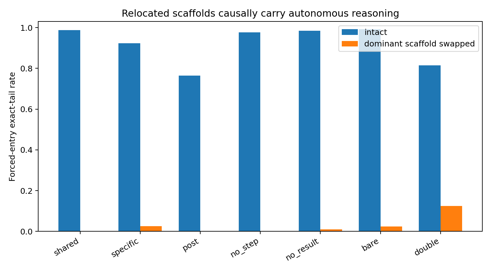

**Figure 16.** Same-token contextual-state intervention collapses autonomous continuation at the scaffold selected by each architecture. Source: VI-033 to VI-038.

### VI 038 Transfer to a different recurrence mechanism

The same architecture manipulations were repeated for x(t+1)=(2x(t)+b(t)) mod 10. The original shared-STEP world learns this mechanism slowly and its dominant measured load at update 320 is the RESULT marker (ΔCE≈2.91), consistent with Module V’s task-conditioned topology. Removing STEP allows the task to reach full teacher-forced competence and shifts dominant load to result values (ΔCE≈2.84); removing RESULT shifts it to input b (≈5.03); moving STEP after the result preserves RESULT as the dominant joint (≈2.43). Autonomous intervention confirms the transferred scaffolds: no-STEP result-value swap reduces forced-tail exact passage 0.989→0.009, no-RESULT input-b swap 0.997→0.000, and post-result RESULT-marker swap 0.616→0.044.

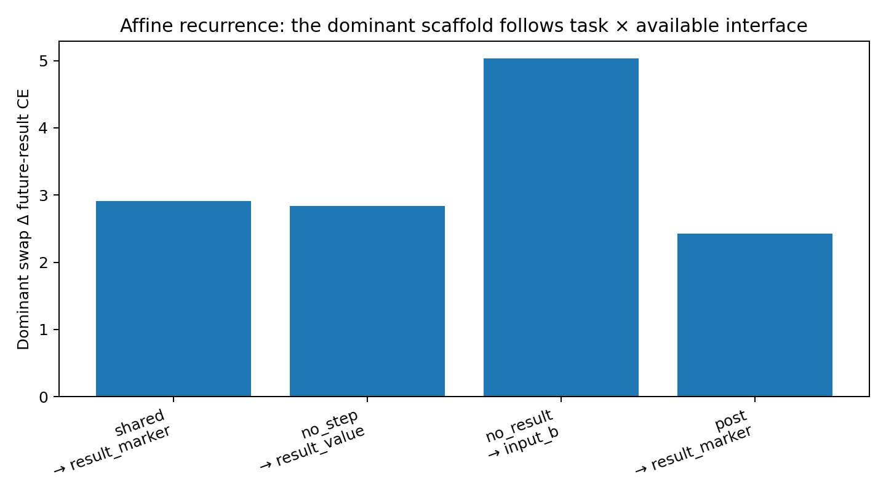

**Figure 17.** Affine recurrence selects a different scaffold, but still relocates load according to the interfaces made available by the response architecture. Source: VI-033 to VI-038.

### Learned topology of the scaffold

The combined evidence changes the architectural interpretation. A marker token is not a scaffold merely because it is repeated or human-readable. Training recruits whichever interface is both available and reusable for the task’s future computation. A shared STEP boundary is unusually easy to reuse across steps, so it can crystallize into a strong scaffold quickly. When that shared boundary is split into step-specific symbols, moved after the computation, or removed, the model redirects future load into content-bearing interfaces such as the current input b, the current result value, or—under affine recurrence—the RESULT marker. The computational structure survives while its physical carrier changes.

The architecture results also explain why “more explicit structure” is not automatically better. Adding a second boundary or assigning a unique boundary token to every step increases the amount of formatting the model must learn and can delay the emergence of a common computational interface. Conversely, removing markers can make the task easier by exposing a shorter, more direct recurrent relation, but this does not eliminate internal organization; it forces organization to reappear in different contextual states.

The response format is part of the data-generating environment seen by the learner. Its repeated symbols, positions and adjacency relations determine which interfaces are consistently available for repeated recruitment, and therefore where optimization can build internal infrastructure. The supported object is not “the meaning of STEP” but an emergent load-bearing topology selected jointly by task mechanism, sequence architecture and training history.

SCAFFOLD RELOCATION FOUND. Removing or moving an explicit boundary does not remove the need for internal infrastructure. Training reconstructs a new scaffold on the remaining reusable interfaces. Shared interfaces accelerate scaffold crystallization; specialized or redundant markers can delay it. The same external function therefore admits multiple causal internal architectures, and the architecture can steer which one training discovers.

## 4  The function that survives relocation

The final tests align models by computational role. They ask which result is affected first, how the effect propagates, and what recovers after the correct result is supplied.

*Experiment M7-039 to M7-044*

### Central question

Modules V–VI established that training creates load-bearing contextual scaffolds and that their physical carrier can relocate when the response architecture changes. Module VII asks what mechanical function follows the scaffold during an actual forward computation. The primary relocation comparison uses mature shared-STEP, no-STEP, no-RESULT and post-STEP models. Transfer tests additionally use an independent-seed shared-STEP checkpoint at step 400 (result-slot accuracy 0.903) and affine-recurrence models with result-value or RESULT-marker scaffolds.

### M7 039 Attention and causal load across architectures

Mean future-result attention to the scaffold differs strongly across the four primary architectures: shared STEP 0.088, no-STEP result-value 0.210, no-RESULT input-b 0.015, and post-STEP input-b 0.051. The same carriers also show different co-motion, relative-turn and strain profiles. Because all four carriers are independently causal for continuation, attention magnitude and one fixed geometric motion pattern are not universal definitions of scaffold function.

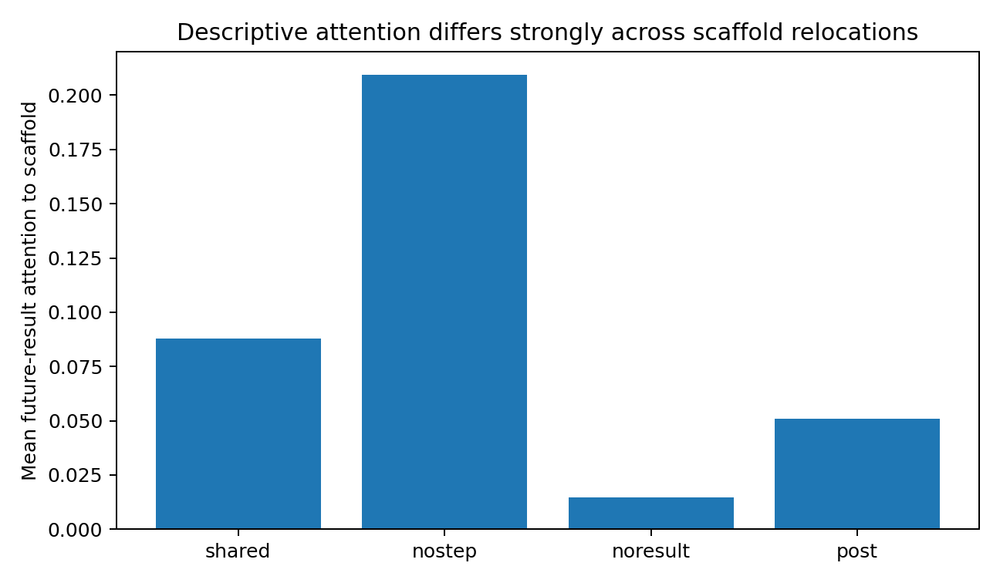

**Figure 18.** Future-result attention to the causal scaffold is highly architecture-dependent; causal load is not identified by attention magnitude alone. Source: M7-039 to M7-044.

### M7 041 Coordinate measurements and local handoff

If the scaffold acted as a shared coordinate origin, expressing neighboring states as neighbor minus scaffold should reduce cross-step or cross-task dispersion. It does the opposite in every measured condition. Across 20 world/layer/role conditions, the between-step relative/absolute dispersion ratio is never below 1 (minimum 1.001, median 1.810); within-step task variance likewise increases in all conditions. The tested scaffolds therefore are not supported as simple coordinate-frame origins.

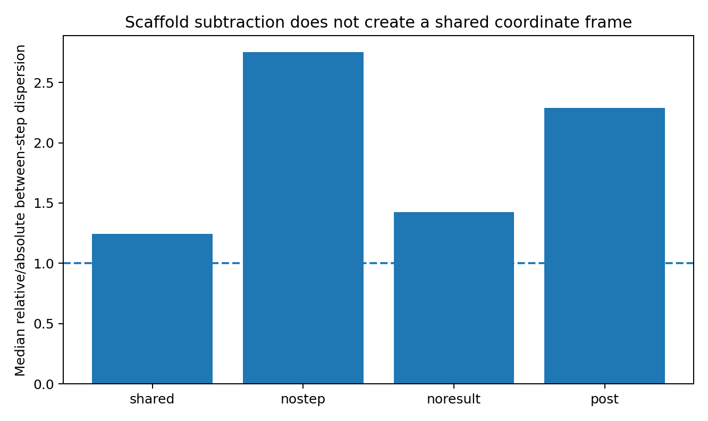

**Figure 19.** Registering neighboring states to the scaffold increases rather than reduces step dispersion. A simple shared-coordinate mechanism is not supported. Source: M7-039 to M7-044.

### M7 040 First break propagation identifies a local computational handoff

The decisive causal pattern appears when the step-2 scaffold contextual state is replaced by the same visible token from another task. The scaffold swap sharply damages the next computational result but has little residual effect on still-later teacher-forced results once that next result is supplied correctly. This is true even though the carrier and intervening serialization differ across architectures.

**Table 8. The function that survives relocation — panel 1 of 2**

| World | Scaffold carrier | Immediate serialized target | Immediate next-token drop | Next-result drop |
| --- | --- | --- | --- | --- |
| shared | STEP | current input b | 12.13 | 8.04 |
| nostep | result value | next-step input b | 6.85 | 8.07 |
| noresult | input b | current result value | 13.21 | 13.21 |
| post | input b | RESULT marker → current result | -0.40 | 10.68 |

Source: M7-039 to M7-044. The experimental setting and definitions are given in the associated text.

**Table 9. The function that survives relocation — panel 2 of 2**

| World | Later-result \|drop\| | Locality ratio |
| --- | --- | --- |
| shared | 0.073 | 111x |
| nostep | 0.061 | 132x |
| noresult | 0.092 | 144x |
| post | 0.073 | 146x |

Source: M7-039 to M7-044. The experimental setting and definitions are given in the associated text.

The serialization-specific bridge differs. Shared STEP immediately controls retrieval of the current input b; no-STEP result-value controls the next-step input b; no-RESULT input-b directly controls the current result value; post-STEP input-b first emits a nearly constant RESULT marker and then controls the current result one token later. Despite these differences, the common causal landmark is the next computational result. Once that result is teacher-forced back into the sequence, later result margins recover almost completely.

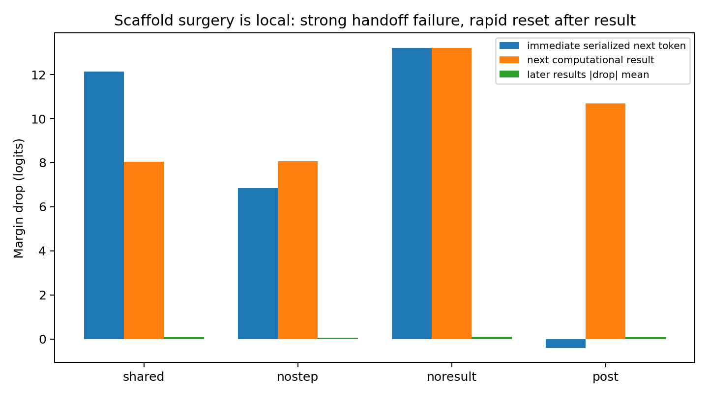

**Figure 20.** Scaffold intervention produces a large local handoff failure at the next computational result, followed by rapid recovery after that result is supplied. Source: M7-039 to M7-044.

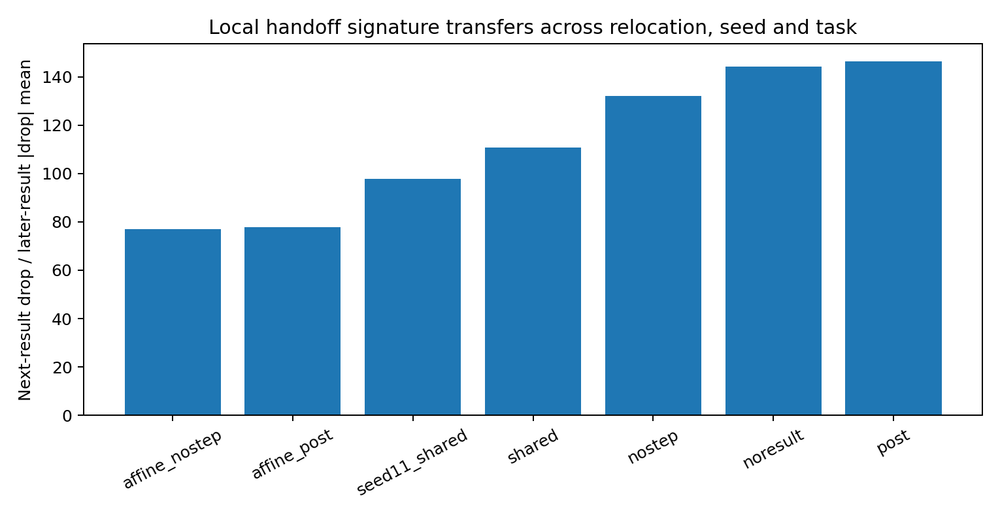

**Figure 21.** Next-result dependence dominates later-result residual effects by roughly two orders of magnitude across architecture relocation, seed and task transfer. Source: M7-039 to M7-044.

### M7 042 The scaffold state is phase and binding specific

Token identity is not enough. Within the same problem, the step-k scaffold was replaced by the same scaffold carrier from the previous step only when the visible token identity matched. Shared STEP therefore provides the cleanest phase test because every STEP token is identical. At steps 2–4, previous-step replacement reduces the immediate next-token margin by 16.72, 16.91 and 16.61 logits, larger than or comparable to cross-task same-token replacement. No-STEP result-value and no-RESULT input-b carriers show the same qualitative dependence when equal-token adjacent steps are available. Post-STEP input-b does not need its contextual state to emit the constant RESULT marker, but phase/cross-task replacement strongly damages the subsequent arithmetic result. The scaffold therefore carries a step-specific relation/binding state rather than generic lexical identity.

**Table 10. The function that survives relocation**

| World | Equal-token tasks | Previous-step state: immediate drop | Cross-task same-token: immediate drop |
| --- | --- | --- | --- |
| shared | 800 | 16.72 | 12.13 |
| nostep | 90 | 17.31 | 6.41 |
| noresult | 83 | 11.97 | 13.82 |
| post | 83 | -0.62 | -0.39 |

Source: M7-039 to M7-044. The experimental setting and definitions are given in the associated text.

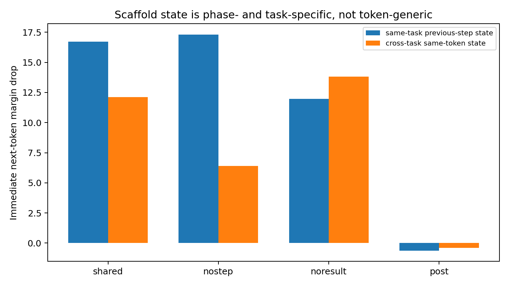

**Figure 22.** Same-token state replacement shows that scaffold function depends on the current step/task relation, not on token identity alone. Source: M7-039 to M7-044.

### M7 043 Relocation invariance the carrier moves the local handoff role survives

Role-level comparison identifies a local computational handoff across the four primary add-task architectures. The next-result margin drop is 8.04–13.21 logits; the mean absolute later-result drop is 0.061–0.092 logits. The resulting locality ratio is 111–146. The carrier moves among STEP, result-value and input-b states while the strong immediate dependence follows the computational role.

### M7 044 Seed and task transfer

The local handoff pattern transfers to an independent initialization and altered recurrence. In the archived role-level summary, the independent-seed shared-STEP model loses 4.63 logits at the next result and 0.047 mean absolute logits at later results. Affine no-STEP loses 8.69 and 0.113; affine post-STEP loses 6.24 and 0.080. These are the same aggregations used in the accompanying table.

**Table 11. The function that survives relocation**

| Transfer world | Result accuracy | Next-result drop | Later-result \|drop\| | Locality ratio |
| --- | --- | --- | --- | --- |
| seed11 shared | 0.903 | 4.63 | 0.047 | 98x |
| affine nostep | 1.000 | 8.69 | 0.113 | 77x |
| affine post | 0.982 | 6.24 | 0.080 | 78x |

Source: M7-039 to M7-044. The experimental setting and definitions are given in the associated text.

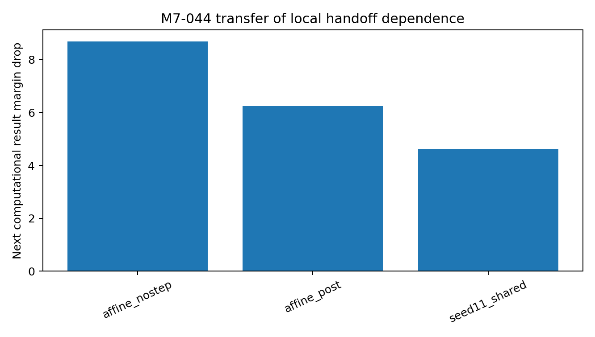

**Figure 23.** The local handoff dependence transfers to an independent seed and a different recurrence mechanism. Source: M7-039 to M7-044.

### Mechanistic verdict transient relation handoff register

Module VII supports a positive mechanical description: the mature scaffold acts as a transient, phase-specific relation/binding handoff state. It preserves the local task state needed to traverse the serialization between the current interface and the next computational result. When the scaffold is corrupted, the next result decision collapses. When that correct result is externally supplied, the system largely resets and later results recover, indicating that responsibility has been handed to the newly formed result state rather than stored indefinitely in the old scaffold.

This mechanism is narrower than a global memory state and different from a coordinate origin. It is also not defined by attention magnitude. The serialization format determines how long the bridge is: STEP may hand off through input b and RESULT; result-value may hand off directly to the next input; input-b may produce a result directly or through a RESULT marker. What relocates is the physical carrier, while the common functional archetype is a short-range computation-to-result relay.

### Evidence boundary and Data Oriented Modelling implication

The local handoff result is established by state replacement in controlled two-layer arithmetic reasoners, with transfer to one independent initialization and one altered recurrence mechanism. Across these systems, the response format changes the internal route by changing which contextual state carries the next computational handoff. For Data-Oriented Modelling, the important object is the observed transition structure in the serialized data: training recruits contextual states that bridge locally required relations until a new sufficient state is emitted. Model interpretation should therefore follow the task’s repeated transition interfaces rather than assigning fixed meanings to token types.

## 5  A complete local handoff

The resulting sequence is developmental and functional. Training first makes a local interface reliable, later gradients recruit it for downstream work, and learned cross-position pathways consolidate that role. Changing the objective or serialization redistributes the carrier. State replacement then identifies the role that survives: a temporary, phase-specific relation that supports the next result.

## Implications for Data Oriented Modelling

Repeated transition structure in the data gives the model candidate interfaces for computational reuse. A mechanism-level analysis can therefore track interface acquisition, causal load and handoff timing together. The measured function belongs to the relation being carried, while the token position holding it can change across learned implementations.

## Experimental sources

- Experiment M3-013 to M3-018

- Experiment M5-025 to M5-032

- Experiment VI-033 to VI-038

- Experiment M7-039 to M7-044
