# Attention Coordination and Candidate Routing

[Chapter 7](../README.md) · [Word report](05_Attention_Coordination_and_Candidate_Routing.docx) · [Evidence index](EVIDENCE_INDEX.md)

Data-Oriented Modelling · Chapter 7 · Report 5

## Overview

Attention supplies several candidate lists to a shared computation. We study how those lists narrow, how their contributions interact and when an explicit routing rule can guide them productively. The evidence develops from frozen-state interventions into training protocols with measured routing authority. Candidate identity, persistent corrective disagreement and the scale of the routed object each matter. The final protocol grants routing authority progressively as candidate rankings stabilize, linking an engineering decision to a measured property of the developing model.

## Question and experimental setting

How can parallel candidate selection be coordinated while preserving the contributions that support the later computation? The core is the controlled eight-layer, width-24 Transformer with 70 matched TEXT/ACT pairs. The initial held-out cohort contains 14 pairs or 28 states. Later experiments use a separate shadow cohort, independent initialization seeds and task/architecture transfer. Cohort-specific results retain their original evaluation status.

## Terms used in this report

**Table 1. Terms used in this report**

| Term | Meaning in the experiments |
| --- | --- |
| RCR | Ranked candidate routing, with explicit proposal tiers. |
| Head contribution | One attention head’s contribution after the shared output projection. |
| Corrective opposition | An opposing contribution whose removal harms the measured output. |
| Dynamic parcel | A small group identified by recent coordinated movement. |
| Routing authority | The strength with which the proposed routing policy acts on the native candidates. |
| NLL | Negative log likelihood. |

## 1  Candidate selection before assembly

We first measure what attention selects and compare its selections with later assembly membership.

*Experiment ATTENTION-CANDIDATE-NARROWING-001*

### Question

Under the working “computational assembly line” interpretation, attention is not assumed to be the reasoning process itself. The narrower hypothesis is operational: attention reduces and reallocates the set of token-level candidates that are available to the subsequent hidden-state dynamics. If this is true, attention concentration should become measurable as candidate-set compression, attended candidates should increasingly predict membership in a subsequent co-motion assembly, and preserving the attention weight distribution while changing which tokens receive those weights should causally alter correct computation.

### Data and measurement

The frozen controlled Transformer has 8 layers, 4 attention heads, hidden width 24, and the same 70 matched TEXT/ACT cohort used in the prior rotational-puzzle experiments. The held-out split contains 14 pair IDs / 28 prompts. Dynamic assemblies are defined from the already validated five-frame co-motion movie using complete-linkage rigidity clustering, not static hidden-state clustering.

For the last real query token at each layer, BOS and self-attention are excluded from the external candidate list and the remaining attention mass is renormalized. Candidate concentration is measured by entropy effective count, 80%/90% mass count, and top-k mass. Future assembly membership is measured over the next five residual-stream frames where available.

### Candidate compression appears progressively after an early expansion

On held-out prompts, mean effective candidate fraction is:

0.888 → 0.912 → 0.900 → 0.882 → 0.852 → 0.819 → 0.791 → 0.753.

After a small layer-1 broadening, the list contracts steadily. Across all eight layers, Spearman correlation with depth is ρ = −0.929, p = 0.000863.

The fraction of context tokens required to carry 80% of attention mass falls from 0.659 at layer 0 to 0.565 at layer 7, while top-1 mass rises from 0.0568 to 0.0904. This is measurable candidate compression, but not a single monotone funnel from the first layer onward. The early layer slightly broadens before later layers progressively concentrate.

### Multi head attention behaves more like parallel candidate lists than one shared funnel

Averaging heads hides substantial specialization. On held-out prompts:

- Head 0: effective candidate fraction falls from 0.712 to 0.391; its 80%-mass list falls from 0.510 to 0.264 of context tokens.

- Head 3: remains broad, changing from 0.776 to 0.800 effective fraction.

Thus the four heads do not implement the same narrowing schedule. In this checkpoint, at least one head becomes a sharply selective candidate gate while another remains a broad retrieval channel. This supports a parallel-search interpretation more than a single global attention funnel.

### Late attention begins to predict which tokens will join the next dynamic assembly

For each layer, attention weights were tested against membership in the decision token's future five-frame co-motion component. Early layers show little reliable association. At layer 5 on the held-out split:

- mean AUC for predicting future assembly membership from current attention = 0.6245;

- bootstrap 95% CI = 0.5534–0.6939;

- one-sided Wilcoxon vs 0.5: p = 0.000777;

- matched top-m candidate recall enrichment = 1.500× relative to random-size expectation;

- bootstrap 95% CI = 1.085–1.955; p = 0.0225;

- attention mass on future assembly members exceeds their raw token fraction by +0.0184 on average; bootstrap 95% CI +0.0050 to +0.0319; p = 0.00382.

The effect is therefore stage-specific. Attention is not globally equivalent to assembly membership; by the mid/late stack, its candidate ordering becomes informative about which tokens subsequently co-move with the decision state.

### Preserving concentration but swapping candidate identity causally damages correct computation

The clean causal test uses correctly learned training states, where the frozen model is already 100% correct. Attention concentration and the multiset of weights are held fixed; only the source-token identities receiving those weights are permuted. Both TEXT and ACT are scored with signed correct-class margin.

For last-query candidate-identity permutation, the fraction of 28 correct states whose correct margin is reduced is:

0.750, 0.786, 0.750, 0.750, 0.786, 0.857, 0.964, 0.893 across layers 0–7.

The dependence becomes especially strong late:

- layer 5: 24/28 = 85.7% harmed, binomial p = 8.999×10⁻5;

- layer 6: 27/28 = 96.4% harmed, p = 1.08×10⁻7, mean correct-margin penalty 0.0984;

- layer 7: 25/28 = 89.3% harmed, p = 1.37×10⁻5.

Flattening the last-query external attention weights also harms 27/28 states at layer 6. Permuting candidate identity for all query rows gives a similar late dependence. The held-out set is not used as the primary causal correctness gate because the frozen checkpoint has only partial held-out accuracy: an intervention can improve an already-wrong held-out prediction without showing that candidate identity is mechanistically irrelevant. The training-correct cohort is therefore the cleaner causal test of dependency.

### Working interpretation

The executed evidence supports a more precise version of the “attention as warehouse picking” analogy:

large context inventory → multiple head-specific candidate lists → progressively selective late retrieval → candidate identities increasingly predict future co-motion membership → subsequent hidden dynamics perform assembly/reorientation.

Attention is therefore useful as a candidate gate, not as a complete account of reasoning. The later internal movie remains necessary to observe rotation, translation, joining, splitting, and mosaic-boundary approach.

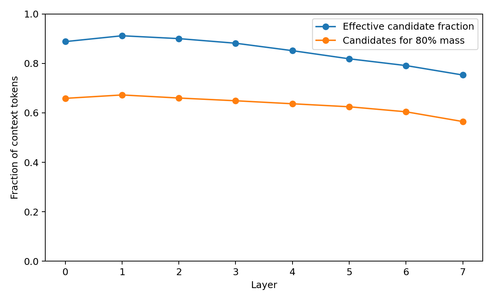

**Figure 1.** Candidate funnel. Frozen controlled Transformer. Candidate concentration, head specialization, later assembly membership and identity-preserving weight controls are measured by depth. Source: ATTENTION-CANDIDATE-NARROWING-001.

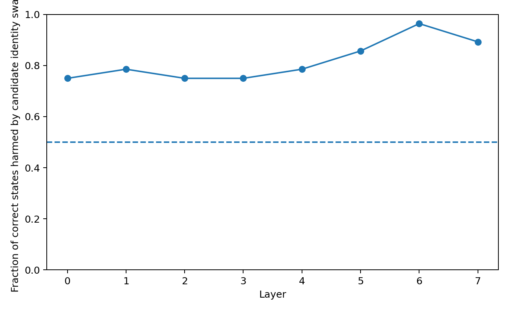

**Figure 2.** Causal candidate identity. Frozen controlled Transformer. Candidate concentration, head specialization, later assembly membership and identity-preserving weight controls are measured by depth. Source: ATTENTION-CANDIDATE-NARROWING-001.

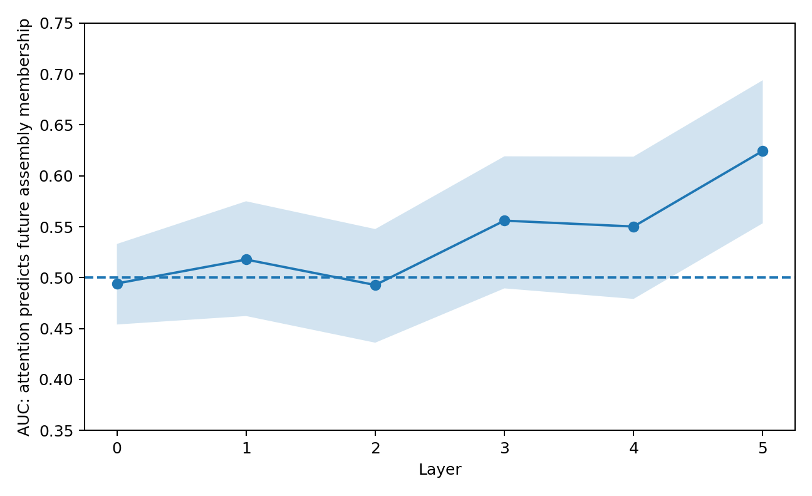

**Figure 3.** Future assembly auc. Frozen controlled Transformer. Candidate concentration, head specialization, later assembly membership and identity-preserving weight controls are measured by depth. Source: ATTENTION-CANDIDATE-NARROWING-001.

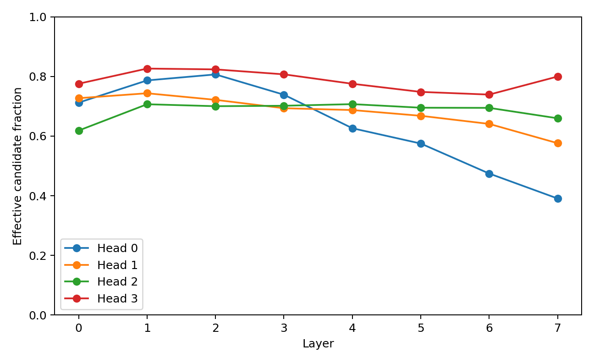

**Figure 4.** Head specialization. Frozen controlled Transformer. Candidate concentration, head specialization, later assembly membership and identity-preserving weight controls are measured by depth. Source: ATTENTION-CANDIDATE-NARROWING-001.

## 2  Parallel proposals and shared output interaction

Different heads can maintain different candidate resolutions. Their projected outputs reveal where those parallel proposals reinforce or oppose each other.

*Experiment ATTENTION-PIPELINES-002 to COORDINATOR-004*

### Question

The previous attention experiment supported a candidate-gating interpretation: attention narrows candidate identities and late-layer candidates predict membership in later co-motion assemblies. The present campaign asks a more engineering-oriented question inspired by the multiscale-language line:

- Do attention heads act as distinct candidate pipelines with different effective scales?

- Do those pipelines interfere in the output space?

- Is “preventing pipeline conflict” as simple as forcing heads apart?

- Can a minimal coordinator improve behavior by intervening only on anti-consensus head components?

The term scale is measured here in two separate senses: candidate resolution (how many candidates remain effectively active) and context span (how far backward the candidates lie). These are not assumed to be the same object.

### Multiscale specialization is mainly candidate resolution not simple near far distance

Held-out headwise analysis shows strong divergence in candidate resolution late in the stack. Head 0 compresses its effective candidate fraction from 0.712 at layer 0 to 0.391 at layer 7, while head 3 remains broad (0.776 → 0.800).

However, their mean normalized retrieval distance is much closer than this resolution contrast: at layer 7, head 0 has expected normalized lag 0.577 and head 3 0.511. In this model, the cleanest multiscale distinction is therefore not “local head versus global head”; it is closer to narrow precision pipeline versus broad search pipeline. This directly parallels the earlier multiscale-language result at a more operational level: different channels can preserve different observation resolutions without requiring each channel to occupy a different physical context radius.

### Parallel pipelines partially cancel in the shared output space

Head attention outputs were decomposed into their bias-free contributions after the shared output projection. At layer 5, the held-out mean fraction of head pairs with negative cosine is 0.571, and the mean pairwise cosine is -0.016. The cooperation ratio, defined as ‖Σₕ cₕ‖ / Σₕ ‖cₕ‖, falls to 0.529 before recovering to 0.631 at layer 7. This establishes a measurable pipeline-cancellation quantity. It does not by itself classify negative contributions as harmful; opposition can also implement correction or constraint satisfaction.

### Forcing pipelines apart is not a good coordination rule

Four last-query interventions preserved each head's attention concentration while altering candidate routing:

- within_scale: candidate identities shuffled only within local/meso/global distance bands;

- full_perm: identities shuffled across the whole context;

- homogenize: all heads receive the same candidate ranking while preserving each head's weight multiset;

- separate: head rankings are forcibly shifted apart to maximize candidate separation.

On correctly learned training states, exact candidate identity matters increasingly in late layers. At layer 6, full_perm reduces correct-class margin by 0.1477 on average and harms 94.6% of states. Even within_scale shuffling still costs 0.1327, showing that preserving coarse near/mid/far scale is not sufficient; which concrete piece is retrieved matters. Crucially, forced separation is not superior to homogenization. At layer 6, separate costs 0.0543, whereas homogenize costs only 0.0265. Similar ordering appears at layers 5 and 7. The evidence therefore rejects the simple engineering rule “make pipelines independent / orthogonal so they cannot fight.”

### Anti consensus output components are a more promising coordination target

A second causal test left attention retrieval unchanged and operated only on the per-head output contributions at the decision token. For each head, the component pointing directly against the sum of the other heads was identified. Three deterministic interventions were tested:

- half_conflict: remove half of the anti-consensus component;

- clip_conflict: remove the full anti-consensus component while retaining orthogonal content;

- amplify_conflict: double the anti-consensus component.

On held-out states at layer 5, clip_conflict changes correct-class margin by +0.0292 on average, whereas amplify_conflict changes it by -0.0251. The same sign pattern is present across all four tested late layers: clipping is directionally favorable on average and amplification is unfavorable. The effect is heterogeneous and small relative to the already-large margins on learned training examples. Negative head opposition therefore should not be globally deleted. It is better treated as a conditional coordination signal.

### A first frozen coordinator candidate

A minimal coordinator was selected using training data only. Candidate layer and conflict-energy threshold were chosen to maximize mean training correct-margin gain, then frozen before held-out evaluation. The selected rule is:

- operate at layer 5;

- if anti-consensus conflict energy exceeds 0.000709 of head-output energy, clip only the anti-consensus component;

- otherwise leave the layer untouched.

Training accuracy remains 100%. On held-out states, the frozen rule is applied to 23/28 samples, raises mean correct-class margin by 0.0292, and changes accuracy from 57.1% to 60.7%: 1 state rescued, 0 originally-correct states lost. The held-out bootstrap 95% interval for mean margin gain is [-0.0032, 0.0643], so this remains an engineering candidate, not an upgraded general result.

### Interpretation do not let the pipelines fight needs a precise meaning

The present evidence changes the design target. The useful rule is not:

different pipeline → different scale → force separation.

A better working interface is:

parallel candidate pipelines → preserve exact retrieved pieces → allow complementary opposition → detect wasteful anti-consensus output → minimally coordinate only that component. In the industrial-computation analogy, multiple workers may legitimately pull a component from different sides while fitting it. The harmful case is not disagreement itself; it is net cancellation that consumes representational motion without contributing to the shared downstream assembly.

This gives a directly measurable engineering variable:

PIPELINE_CONFLICT_ENERGY = anti-consensus head-output energy / total head-output energy.

It can be combined with the existing candidate-resolution, assembly, rotation, reconfiguration, and mosaic-edge telemetry. The experiment again favors deriving architecture from measured data structure rather than assigning head roles in advance. In this model, candidate resolution specialization emerged clearly, simple context-distance specialization did not, and forced head separation was not beneficial. The candidate coordinator arose from the observed output-space cancellation geometry rather than from a prescribed modular architecture.

## 3  The contribution history behind useful disagreement

A contribution ledger separates opposition that corrects the computation from opposition that harms it. Temporal persistence and subsequent assembly membership supply additional context.

*Experiment ATTENTION-CONTRIBUTION-005 to HISTORY-GATE-007*

### Question

The previous pipeline experiments established that multiple attention heads maintain distinct candidate-resolution profiles and partially cancel after the shared output projection. The open engineering question was whether negative head-to-head alignment is one phenomenon or two: useful correction versus wasteful interference.

This experiment builds a dynamic contribution ledger that links, for every layer/head/state:

candidate selection → candidate persistence → current/future assembly membership → head-output direction → exact decision-query head ablation → correct-margin effect. A head is called corrective opposition when its output points against the sum of the other heads (consensus cosine < 0) but removing that head reduces the correct-class margin (causal utility > 0). It is called destructive opposition when it points against consensus and removing it improves the correct-class margin (causal utility < 0). These labels are operational consequences, not semantic interpretations.

### Disagreement splits almost evenly into correction and waste

Held-out contains 353 negative-consensus head states. Of these:

- 192 / 353 = 54.4% are corrective opposition;

- 161 / 353 = 45.6% are destructive opposition.

Across all held-out head states, the four sign quadrants are:

- cooperative support: 293;

- cooperative harm: 250;

- corrective opposition: 192;

- destructive opposition: 161.

Mean exact causal utility is +0.2230 for corrective opposition and -0.3438 for destructive opposition. Therefore a negative inter-head cosine is not itself an error signal. Roughly half of the opposing flows are causally useful in this frozen cohort.

### Useful opposition is disproportionately connected to future assembly membership

The clearest assembly result occurs in the middle stack, layers 3–5. For opposing heads:

- corrective opposition candidates have mean future-assembly enrichment 1.357x;

- destructive opposition candidates have mean future-assembly enrichment 0.905x;

- two-sided Mann–Whitney p = 0.01581.

Layer 3 is the sharpest single-layer example: corrective enrichment 1.237x versus destructive 0.483x (p=0.0286). This supplies a concrete mechanical interpretation for one class of disagreement: an opposing pipeline can be useful because it is retrieving candidates that later become members of the decision-centered co-motion assembly, even when its current output direction disagrees with the other heads.

### Useful opposition has a longer dynamic lineage

Held-out dynamic history distinguishes the two opposing classes in simple univariate measurements:

- candidate-set Jaccard to the same head one layer earlier: 0.657 corrective vs 0.617 destructive, p=0.11291 (directional, not individually significant);

- candidate-set Jaccard two layers back: 0.465 vs 0.411, p=0.02640;

- head contribution direction cosine to the previous layer: 0.898 vs 0.858, p=0.03053.

The useful opposing flow is therefore more temporally persistent on average: it tends to retain candidate identity and continue along a similar contribution direction across successive pipeline stages. This is consistent with a persistent corrective branch rather than a one-frame collision.

### Simple instantaneous classification is still insufficient

A frozen train-only logistic classifier using current-time observables (consensus cosine, norm, candidate resolution, candidate uniqueness, and current assembly hit) does not generalize well to held-out opposing heads. Adding short dynamic history also does not produce a reliable pooled classifier (held-out AUROC remains below 0.5 in this small cohort); the only notable per-layer result is layer 7 at AUROC 0.662.

This negative result is important for the engineering design: the coordinator should not pretend that a single static threshold can identify useful versus harmful disagreement. The dynamic contrasts are real at the population level, but individual routing remains context dependent.

### A conservative history gate preserves the rescue while intervening on fewer heads

A deliberately simple coordinator was trained only on the frozen training cohort. It preserves opposing heads whose candidate list and contribution direction are sufficiently persistent across layers and clips only the anti-consensus component of more transient opposing heads.

Training selects layer 5 with:

- previous-layer candidate Jaccard threshold = 0.800;

- previous-layer contribution-direction cosine threshold = 0.9811.

Frozen held-out evaluation:

**Table 2. The contribution history behind useful disagreement — panel 1 of 2**

| Coordinator | Accuracy | Rescued | Harmed | States touched |
| --- | --- | --- | --- | --- |
| History gate | 60.7% | 1 | 0 | 67.9% |
| Clip all negative-consensus heads | 60.7% | 1 | 0 | 96.4% |

Source: ATTENTION-CONTRIBUTION-005 to HISTORY-GATE-007. The experimental setting and definitions are given in the associated text.

**Table 3. The contribution history behind useful disagreement — panel 2 of 2**

| Coordinator | Mean heads modified | Mean correct-margin gain |
| --- | --- | --- |
| History gate | 1.04 | +0.0208 |
| Clip all negative-consensus heads | 2.04 | +0.0292 |

Source: ATTENTION-CONTRIBUTION-005 to HISTORY-GATE-007. The experimental setting and definitions are given in the associated text.

The history gate does not outperform full negative-head clipping on margin; its engineering value is sparsity. It obtains the same one-state rescue and zero-harm accuracy outcome while modifying about half as many heads per state. The held-out sample remains small, so this is an engineering candidate, not a promoted universal coordinator.

The pipeline picture is now more specific:

broad/narrow candidate retrieval → persistent or transient branch → candidate enters or misses later assembly → head contributes with or against other heads → useful correction or destructive cancellation → shared output

The important distinction is not agree / disagree. It is:

Does this dissenting flow have a stable lineage, and does it carry candidates that participate in later assembly? This provides the first contribution-accounting language for "productive disagreement" versus "pure internal friction". Do not pre-assign permanent semantic roles to heads and do not force pipeline orthogonality. Preserve candidate identity and dynamic lineage. Coordination should operate on measured interaction history and causal contribution, using the smallest intervention required to remove wasteful cancellation while retaining persistent corrective branches.

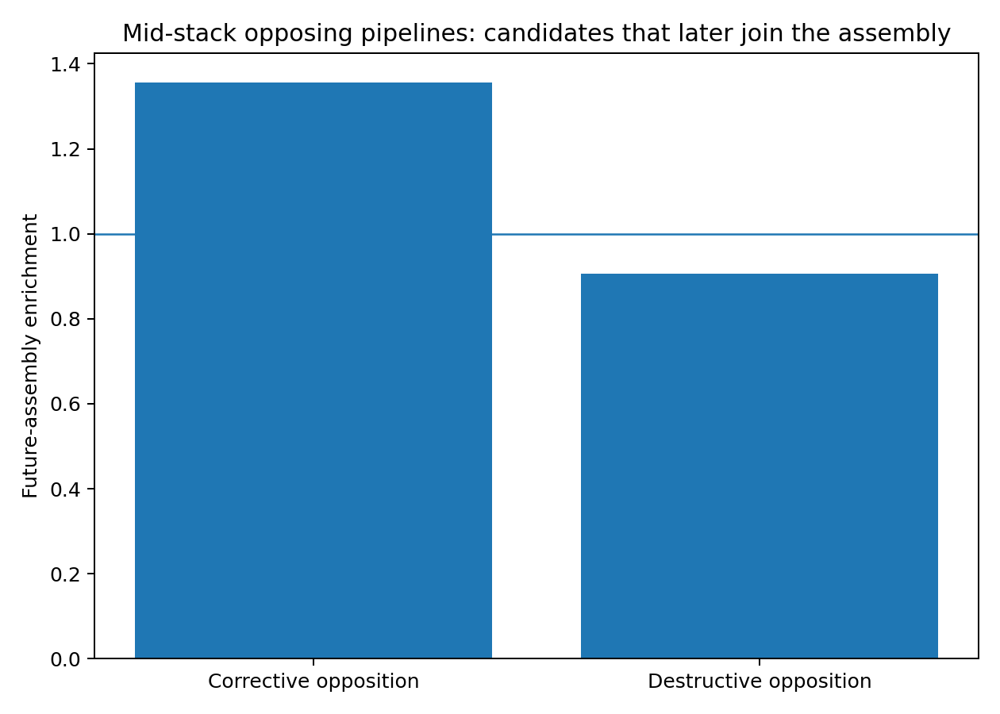

**Figure 5.** Future assembly. Held-out head interventions distinguish helpful and harmful opposing contributions. The history-gated comparison reports both output effects and the number of modified heads. Source: ATTENTION-CONTRIBUTION-005 to HISTORY-GATE-007.

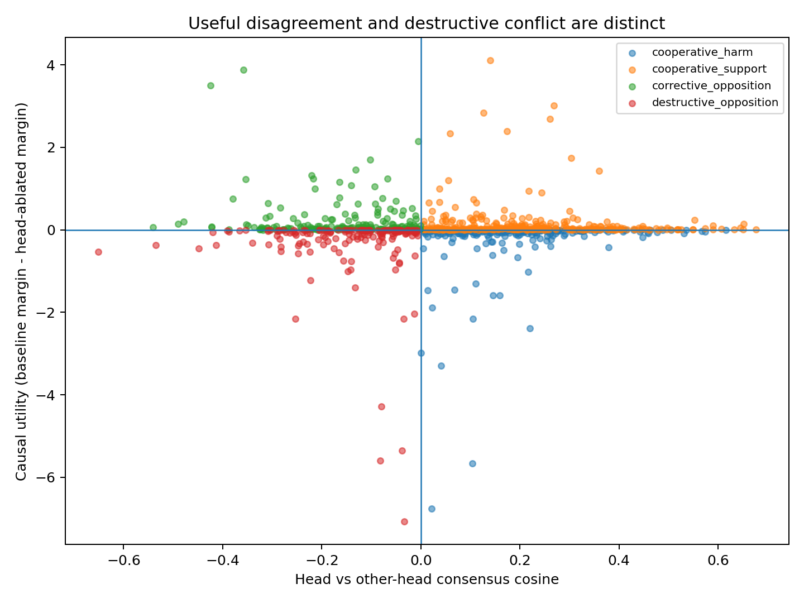

**Figure 6.** Quadrants. Held-out head interventions distinguish helpful and harmful opposing contributions. The history-gated comparison reports both output effects and the number of modified heads. Source: ATTENTION-CONTRIBUTION-005 to HISTORY-GATE-007.

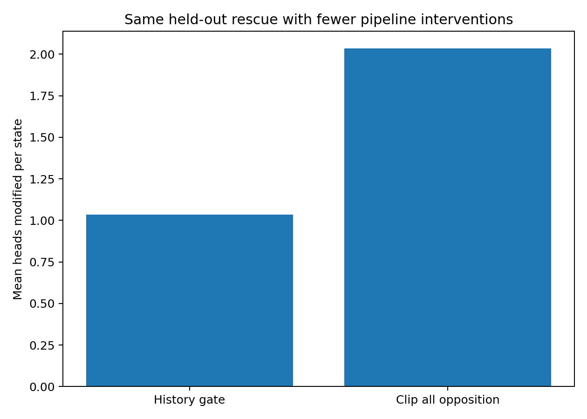

**Figure 7.** Sparsity. Held-out head interventions distinguish helpful and harmful opposing contributions. The history-gated comparison reports both output effects and the number of modified heads. Source: ATTENTION-CONTRIBUTION-005 to HISTORY-GATE-007.

## 4  Giving candidates explicit priorities

The first routing prototype gives each head a graded proposal list. Frozen controls compare this interface with temperature sharpening, shared selection and variable recommendation budgets.

*Experiment RCR-008 to RCR-011*

### Graded Pipeline Proposals and a History Aware Coordinator

### Engineering question

The preceding attention experiments established three constraints:

- different attention heads maintain different candidate resolutions;

- candidate identity matters causally;

- negative inter-head contribution is not uniformly harmful — some opposing heads carry useful corrective candidates into later assemblies.

The present prototype therefore does not isolate heads or force them to agree. It tests a weaker coordination interface: each pipeline may continue to propose candidates, but proposals are graded and the coordinator intervenes only on historically unsupported destructive conflict.

### Prototype A Ranked Candidate Routing RCR

For the last-query attention row of each head, external context candidates are ranked and assigned a fixed proposal budget:

- PRIMARY: rank 1; one slot per head;

- SECONDARY: ranks 2–3;

- RESERVE: ranks 4–7;

- BACKGROUND: all remaining candidates.

The existing attention weight remains the continuous within-tier confidence. A tier multiplier supplies an additional proposal grade. Thus ranking does not replace the learned attention score; it adds an explicit priority hierarchy.

Train-only search selected, for the renormalized RCR prototype:

- intervention layer: 6;

- SECONDARY multiplier: 0.60;

- RESERVE multiplier: 0.15;

- BACKGROUND multiplier: 0.03.

The modified row is renormalized after grading. This version therefore redistributes a fixed per-head attention budget rather than allowing abstention.

### Prototype B minimal automatic market handoff

A minimal implementation of the proposed "automatic transport" idea was also tested. Every head first produces its own PRIMARY / SECONDARY / RESERVE ranking. If any head nominates a token as PRIMARY or SECONDARY, that token is promoted to at least SECONDARY status in the other heads' candidate weighting. This creates a small shared candidate market while preserving the original candidate identities and head-specific weights.

Train-only selection chose layer 6 with multipliers 0.40 / 0.15 / 0.03.

### Prototype C abstention variable recommendation budget

Vanilla softmax forces every head's attention row to sum to one. Even an uncertain head must therefore spend a full unit of recommendation mass. To test explicit uncertainty, graded candidates were also evaluated without renormalization after tier suppression. This allowed a head to become quieter when most of its mass lay outside high-ranked candidates.

Two ranking rules were tested:

- attention-weight ranking;

- output-space contribution ranking, using attention × projected value-vector norm.

A partial-abstention blend between baseline and graded attention was also tested. The mechanism strongly increased inter-head cooperation, but aggressive budget reduction produced large negative margin outliers on several held-out samples. It is therefore retained as an engineering direction, not the selected prototype.

### Prototype D history aware conflict gate RCR

The previous HISTORY-GATE-007 result was integrated before RCR.

At layer 5, an opposing head is clipped only when both of the following indicate weak pipeline history:

- candidate-set continuity below the frozen threshold Jaccard < 0.80;

- contribution-direction continuity below cosine < 0.981102.

The gate removes only the anti-consensus component; orthogonal information is retained. Layer 6 then applies the frozen RCR hierarchy above.

This two-stage system is the current RCR-v0 coordinator candidate:

pipeline history gate → ranked proposal routing → ordinary downstream computation.

### Frozen held out results

Evaluation contains 14 held-out matched pairs = 28 TEXT/ACT states. No held-out state was used to select the layer or grading multipliers.

**Table 4. Giving candidates explicit priorities — panel 1 of 2**

| System | Held-out accuracy | Rescued | Harmed | Mean Δ correct margin |
| --- | --- | --- | --- | --- |
| Baseline | 57.14% | — | — | — |
| RCR | 60.71% | 1 | 0 | +0.00895 |
| Minimal market handoff | 60.71% | 1 | 0 | +0.01314 |
| Temperature sharpening control | 60.71% | 1 | 0 | +0.03051 |
| History gate only | 60.71% | 1 | 0 | +0.02078 |
| History gate + RCR | 60.71% | 1 | 0 | +0.03701 |

Source: RCR-008 to RCR-011. The experimental setting and definitions are given in the associated text.

**Table 5. Giving candidates explicit priorities — panel 2 of 2**

| System | Median Δ correct margin | States with margin improvement |
| --- | --- | --- |
| Baseline | — | — |
| RCR | +0.02621 | 18/28 |
| Minimal market handoff | +0.01095 | 15/28 |
| Temperature sharpening control | −0.00037 | 14/28 |
| History gate only | ~0 | 15/28 |
| History gate + RCR | +0.02625 | 18/28 |

Source: RCR-008 to RCR-011. The experimental setting and definitions are given in the associated text.

The combined system therefore produced the most favorable held-out mean and retained the positive RCR median, but the held-out cohort remains small. At the matched-pair level (n=14), the combined mean correct-margin gain was +0.0370 with bootstrap 95% interval −0.0549 to +0.1626. The current evidence therefore supports an engineering candidate, not a confirmed generalization gain.

### Comparison with generic attention sharpening

A temperature-only control was selected on training data and frozen before held-out evaluation (layer 6, τ=0.55). It reached the same 60.71% held-out accuracy and a held-out mean margin gain of +0.0305. The combined history-gate + RCR system exceeded temperature sharpening by only +0.0065 mean margin on held-out, with a pair-bootstrap interval crossing zero.

Therefore the executed evidence supports:

- explicit proposal grading is operationally viable;

- its hierarchy is interpretable and composable with pipeline-history signals;

- the present experiment does not establish superiority over ordinary continuous attention sharpening.

### What the candidate market changed

At layer 6 on held-out states:

- baseline head cooperation ratio: 0.5771;

- RCR cooperation ratio: 0.5817;

- market-handoff cooperation ratio: 0.5839.

Conflict-energy fraction:

- baseline: 0.02700;

- RCR: 0.02993;

- market handoff: 0.02675.

The minimal market therefore slightly increased cooperation while slightly reducing measured conflict energy. It did not yet improve held-out accuracy beyond RCR.

### Abstention result useful but too aggressive

Removing the post-grading renormalization allowed pipeline recommendation mass to fall to roughly one third of the vanilla unit budget. At layer 5:

- held-out cooperation rose from 0.5292 to 0.5884 in the contribution-ranked abstention variant;

- mean head recommendation budget fell to 0.331;

- nevertheless, a small number of important weak-signal cases suffered large negative margin shifts.

Partial abstention raised the mean budget to ~0.46–0.47 and preserved the one held-out rescue with zero categorical harms, but its mean held-out margin remained negative because of the same outliers. The operational conclusion is positive and specific: variable pipeline loudness is feasible, but recommendation budget must be state/history-conditioned rather than globally suppressed.

### Current engineering architecture

The evidence supports the following prototype architecture:

- each pipeline freely searches its candidate field;

- candidates receive explicit proposal levels (PRIMARY / SECONDARY / RESERVE / BACKGROUND);

- the original continuous score is retained inside each tier;

- pipeline history is tracked across layers;

- persistent corrective opposition is protected;

- historically unsupported anti-consensus components may be minimally clipped;

- downstream assembly and output remain unchanged.

This is different from forced head orthogonalization or mandatory specialization. The coordinator does not decide what each pipeline should search for. It only manages proposal priority and destructive cancellation after those proposals have emerged.

## 5  Placing confidence inside the proposal list

The confidence experiments compare whole-head control with the finer choice of spacing between proposal tiers, then evaluate those choices on a separate cohort.

*Experiment RCR-012 to RCR-015*

### Goal

The previous RCR-v0 prototype introduced explicit PRIMARY / SECONDARY / RESERVE / BACKGROUND proposal grades and composed them with a sparse history-aware conflict gate. The present campaign tests the next engineering question: where should confidence live?

Three alternatives were executed:

- whole-head learned budget — a small train-only credit model predicts how loudly a head should speak;

- whole-head self-confidence budget — pipeline loudness is derived from its own candidate/history statistics;

- adaptive tier spacing — the head remains fully active, but the distance between PRIMARY, SECONDARY, RESERVE and BACKGROUND changes with its confidence/history.

A fully untouched set of 28 matched pairs (56 states) that had been neither training nor original held-out data was then used as a shadow cohort. A frozen temperature-sharpening control was evaluated on the same shadow states.

### Learned whole head credit does not generalize

The train-only credit model used candidate persistence, contribution-direction persistence, candidate concentration, consensus direction and head-output norm. It predicted whether single-head ablation showed positive causal utility.

- train AUROC: 0.554

- held-out AUROC: 0.533

The controller therefore cannot reliably infer good head / bad head from the current history features. Train selection consequently chose only a very small attenuation (mean budget about 0.971 on held-out). The resulting RCR-v2 margin gain (+0.0352) did not improve on fixed RCR+history (+0.0370). Engineering decision: do not use a central learned utility classifier as the primary budget controller.

### Whole head self confidence is also too coarse

A second controller derived budget only from the pipeline's own proposal geometry: attention logit gap, entropy/concentration, and candidate/contribution history. Train selection again converged to a near-no-op budget: mean held-out budget 0.9885 and mean minimum-head budget 0.9800.

Held-out result:

- accuracy: 57.14% → 60.71%

- rescued/harmed: 1 / 0

- mean margin gain: +0.0357

The result preserves the rescue but does not exceed fixed RCR. This confirms the earlier abstention finding: scaling an entire head is too coarse because weak candidates can still carry useful information. Engineering decision: confidence should primarily change proposal hierarchy inside a pipeline, not mute the whole pipeline.

### Adaptive tier spacing is the better confidence interface

The proposal grades themselves were made history-conditioned. High-persistence pipelines receive a larger PRIMARY-to-SECONDARY separation; low-persistence pipelines retain a flatter candidate hierarchy rather than being silenced.

Train-only selection chose history continuity as the confidence source and the following confident/uncertain grade ranges:

- SECONDARY: 0.30 ↔ 0.70

- RESERVE: 0.05 ↔ 0.22

- BACKGROUND: 0.015 ↔ 0.040

On the original frozen held-out cohort:

- accuracy: 57.14% → 60.71%

- rescued/harmed: 1 / 0

- mean margin gain: +0.0397

- fixed RCR+history: +0.0370

The adaptive gain is slightly larger but not clearly separated from fixed RCR.

### Shadow cohort fixed and adaptive RCR both generalize

The untouched 28-pair shadow cohort has baseline accuracy 100%, so categorical rescue is impossible; margin preservation and improvement are the relevant tests.

### Fixed RCR history gate

- accuracy remains 100%

- mean correct-margin gain: +0.0396

- pair-bootstrap 95% CI: [+0.0223, +0.0594]

- fraction improved: 75.0%

### Adaptive tier spacing history gate

- accuracy remains 100%

- mean correct-margin gain: +0.0391

- pair-bootstrap 95% CI: [+0.0183, +0.0610]

- fraction improved: 76.8%

Direct adaptive-minus-fixed difference is approximately −0.00049, with bootstrap interval crossing zero. The adaptive mechanism therefore does not yet outperform the simpler fixed grade scheme.

### Shadow control separates RCR from generic sharpening

The temperature value τ=0.55 had been selected on training data and was frozen before shadow evaluation.

On the shadow cohort:

- temperature-only mean margin gain: -0.0305, 95% CI [-0.1378, +0.0298]

- history-gate + temperature: -0.0238, 95% CI [-0.1245, +0.0339]

- fixed RCR + history: +0.0396

- adaptive RCR + history: +0.0391

Direct paired shadow comparison:

- fixed RCR − temperature: +0.0700, 95% CI [+0.0068, +0.1880]

- adaptive RCR − temperature: +0.0695, 95% CI [+0.0059, +0.1881]

- fixed RCR − gate+temperature: +0.0634, 95% CI [+0.0053, +0.1731]

This second untouched cohort is the first executed evidence in this line that the RCR effect is not adequately explained as ordinary attention sharpening.

The results support the following compact routing design:

free within-head search → sparse history conflict gate → explicit candidate tiers → downstream assembly

Keep fixed tier grades as the default because they generalize as well as the adaptive scheme. Keep adaptive tier spacing as an optional light modulation channel. Do not deploy large whole-head abstention or a learned good/bad-head classifier.

The key architectural interface is therefore not a new replacement for softmax. It is an explicit layer above within-head ranking:

- candidate rank: which piece is PRIMARY / SECONDARY / RESERVE;

- pipeline lineage: whether this line has a persistent work history;

- cross-pipeline coordination: whether disagreement is corrective or wasteful;

- optional light confidence modulation: change grade spacing without silencing the pipeline.

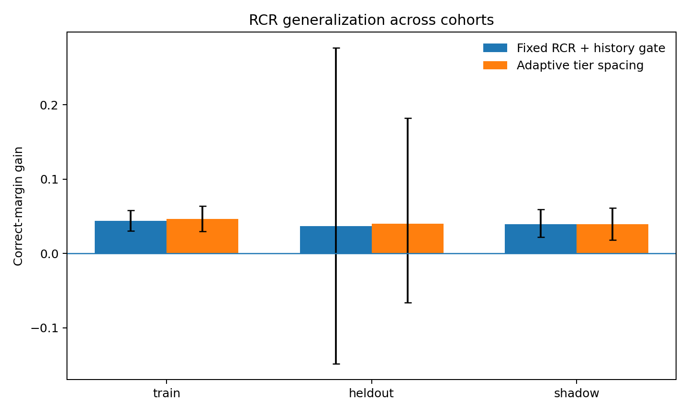

**Figure 8.** Cohort generalization. Frozen held-out and shadow-cohort comparisons. The panels retain separate cohort baselines and contrast tiered routing with temperature controls. Source: RCR-012 to RCR-015.

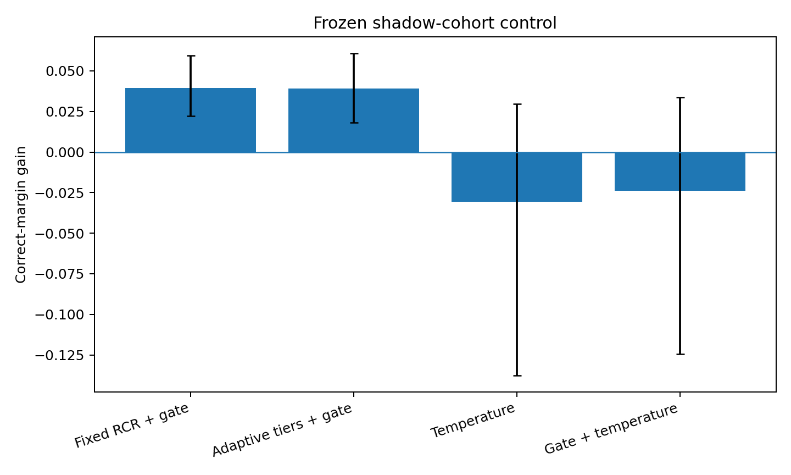

**Figure 9.** Shadow controls. Frozen held-out and shadow-cohort comparisons. The panels retain separate cohort baselines and contrast tiered routing with temperature controls. Source: RCR-012 to RCR-015.

## 6  Choosing the scale of the routed object

Tracking individual tokens and small moving parcels makes the routing unit itself an experimental variable.

*Experiment PIECE-LOGISTICS-016 to DUAL-SCALE-022*

### Engineering question

After head-level contribution accounting and RCR, the next question was whether routing credit should move from whole heads to the individual candidate pieces they transport. The campaign therefore tracked candidate genealogy, tested causal piece value, varied the physical scale of a routed unit, and finally combined token-level and dynamically discovered small-parcel routing.

The central result is a scale correction:

The useful routing unit is not well described by either an isolated token or a full co-moving assembly. The strongest new signal appears at a finer dynamic parcel scale of roughly four tokens, while token-level ranking remains an important independent channel.

### Piece logistics ledger

Each context token received a cross-layer logistics record containing:

- current PRIMARY / SECONDARY / RESERVE tier;

- number of heads recommending it;

- attention mass;

- cumulative tier and attention history;

- consecutive recommendation length;

- re-entry count;

- cross-head handoff count;

- tier escalation / demotion;

- current and next dynamic-assembly membership.

A train-only logistic model attempted to predict whether a currently external token would newly join the decision-centered assembly at the next observable stage.

### Result

Prediction was weak:

**Table 6. Choosing the scale of the routed object**

| Cohort | AUROC | Average precision | Event mean AUROC | Top-k enrichment |
| --- | --- | --- | --- | --- |
| Train | 0.565 | 0.141 | 0.529 | 0.888x |
| Held-out | 0.528 | 0.112 | 0.524 | 1.120x |
| Shadow | 0.550 | 0.121 | 0.546 | 1.210x |

Source: PIECE-LOGISTICS-016 to DUAL-SCALE-022. The experimental setting and definitions are given in the associated text.

Held-out joiners do receive slightly more current attention mass than non-joiners (0.05646 vs 0.05212; p=4.54e-5), but the full genealogy does not form a reliable next-assembly-entry oracle. Engineering implication: next assembly join is too local and noisy to serve as the primary candidate-credit target.

### Logistics aware token RCR

The frozen 016 join predictor was used as an additional within-tier multiplier on top of RCR. Train-only search selected layer 6 with only a small logistics modulation.

### Result

The logistics-aware version retained the existing RCR rescue but added little beyond fixed RCR:

- Held-out: 57.14% → 60.71%, rescue 1 / harm 0; mean margin gain +0.03942.

- Shadow: 100% retained; mean margin gain +0.04013.

- Logistics minus fixed RCR: +0.00241 held-out and +0.00058 shadow; both pair-bootstrap intervals cross zero.

Verdict: candidate genealogy is useful as telemetry, but this particular next-join credit should not control routing.

### Causal piece manifest

A more direct target was then tested. At layers 5 and 6, each currently recommended token was removed from the decision-query attention row across heads, the remaining row was renormalized, and the exact downstream model was rerun. The margin change defined causal piece utility.

### Result

Individual-token utility was extremely small and difficult to predict from logistics:

- Held-out useful/non-useful AUROC: 0.528 at layer 5 and 0.495 at layer 6.

- Shadow AUROC: 0.576 at layer 5 and 0.595 at layer 6.

- Attention mass itself has only weak utility correlation.

This is a second, independent indication that the byte/token position is too fine a physical routing unit in this controlled language system.

### Coarse dynamic parcels

Candidate tokens were therefore grouped using only the preceding five hidden-state frames. Complete-linkage dynamic-rigidity clustering produced past-only parcels; no future state was used. The initial q=0.01 rigidity threshold produced approximately 7–8 parcels per held-out/shadow input, with mean parcel size about 9.7–10.6 tokens.

Routing PRIMARY / SECONDARY / RESERVE grades at this whole-parcel scale preserved one held-out rescue but underperformed token RCR on the untouched shadow cohort:

- Held-out mean margin gain +0.0269.

- Shadow mean margin gain +0.00908.

- Shadow parcel-minus-token difference −0.03047 (95% pair-bootstrap CI −0.05152 to −0.01381).

Interpretation: a completed or near-completed co-moving assembly is too coarse to be the basic logistics package.

### Multiscale parcel sweep

The dynamic-rigidity threshold was then swept over train-calibrated null quantiles. Tightening the threshold creates more, smaller parcels.

**Table 7. Choosing the scale of the routed object**

| Null quantile | Train parcel count | Train mean size | Held-out accuracy | Held-out mean gain | Shadow mean gain |
| --- | --- | --- | --- | --- | --- |
| 0.001 | 15.73 | 3.83 | 64.29% | +0.10355 | +0.01819 |
| 0.0025 | 11.23 | 5.36 | 60.71% | +0.07266 | +0.01758 |
| 0.005 | 9.02 | 6.69 | 60.71% | +0.04726 | +0.01598 |
| 0.010 | 6.89 | 8.82 | 60.71% | +0.02691 | +0.00908 |
| 0.020 | 5.23 | 11.87 | 60.71% | +0.03635 | +0.00718 |

Source: PIECE-LOGISTICS-016 to DUAL-SCALE-022. The experimental setting and definitions are given in the associated text.

Train-only selection chooses q=0.001. On held-out it rescues 2 states and harms 0, raising accuracy 57.14% → 64.29%. On the untouched shadow cohort it preserves 100% accuracy and gives +0.01819 mean margin (95% pair-bootstrap CI +0.00796 to +0.03088).

However, the fine-parcel route is not a drop-in replacement for token RCR: shadow parcel-minus-token margin is −0.02136 (95% CI −0.03446 to −0.00925). Key scale result: the best pure parcel unit is small (~4 tokens), but token-level routing still carries independent useful information.

### Scale selection gate

A train-only gate attempted to select token routing versus fine-parcel routing from parcel geometry (parcel count, mean size, largest size, singleton fraction). The train optimum almost always chose token routing and selected parcel routing for only 7.1% of train states; it selected none on held-out or shadow. Verdict: a simple static parcel-geometry gate does not generalize as a scale selector.

### Dual scale routing

The final prototype stops forcing token and parcel scales to compete for the same routing identity.

- Token RCR remains the primary proposal lane.

- The q=0.001 dynamic parcel route supplies a bonus only.

- Parcel information can promote a token proposal but cannot suppress a token proposal.

- The existing layer-5 sparse history conflict gate is retained.

Train-only search selected parcel-bonus strength lambda = 2.0; the gain curve is broad from 1.25–3.0 rather than a sharp optimum.

### Frozen evaluation

**Table 8. Choosing the scale of the routed object**

| Cohort | Base acc. | Dual-scale acc. | Rescued / harmed | Mean margin gain | Pair-bootstrap 95% CI |
| --- | --- | --- | --- | --- | --- |
| Train | 100% | 100% | 0 / 0 | +0.04583 | +0.03148 to +0.06262 |
| Held-out | 57.14% | 60.71% | 1 / 0 | +0.09284 | −0.08869 to +0.37359 |
| Shadow | 100% | 100% | 0 / 0 | +0.04224 | +0.01953 to +0.07014 |

Source: PIECE-LOGISTICS-016 to DUAL-SCALE-022. The experimental setting and definitions are given in the associated text.

Direct controls on the untouched shadow cohort:

- dual-scale minus token RCR: +0.00269 (CI crosses zero);

- dual-scale minus temperature sharpening: +0.07271 (95% CI +0.00370 to +0.20207);

- dual-scale minus history-gated temperature: +0.06604 (95% CI +0.00297 to +0.18523).

Thus dual-scale routing does not yet significantly beat fixed token RCR, but it preserves token-RCR's second-cohort behavior, improves average margin slightly, and remains distinctly better than frozen generic sharpening.

### Engineering interpretation

The campaign rejects two overly simple logistics models:

- one token = one physical piece — too fine; single-token causal value is small and difficult to predict;

- one co-moving assembly = one transport package — too coarse; whole-assembly routing suppresses useful local resolution.

The executed evidence instead supports a hierarchy:

token proposals + fine dynamic parcels (~4 tokens) → later larger assemblies.

This matches the broader multiscale-language result: observation scale and assembly scale need not be the same. A pipeline can preserve fine token-level bids while also carrying a small group-level tag that says, in effect, “these nearby/co-moving proposals belong to one shipment.”

### Current engineering default

The current preferred candidate architecture is:

free within-head search → sparse history-aware anti-cancellation gate → token PRIMARY / SECONDARY / RESERVE grading + fine dynamic-parcel bonus → ordinary downstream assembly.

The parcel bonus is additive and cannot veto token-level evidence. This prevents a coarse assembly from swallowing necessary weak local signals.

## 7  Granting routing authority during learning

A training intervention acts on developing candidate lists. Delaying and then increasing its authority tests when the underlying selections are ready for that intervention.

*Experiment RCR-023 to RCR-026*

### Engineering question

The previous experiments established three useful facts in the controlled 8-layer Transformer:

- attention heads differ in candidate resolution rather than behaving as interchangeable pipelines;

- candidate identity matters causally;

- cross-head opposition contains both useful correction and destructive cancellation.

The engineering objective is therefore not to force heads to agree. It is to expose a lightweight routing protocol in which each pipeline can rank its proposals while preserving useful disagreement.

The resulting interface is Ranked Candidate Routing (RCR):

- one PRIMARY candidate;

- two SECONDARY candidates;

- four RESERVE candidates;

- remaining candidates receive a low background multiplier.

The frozen tier multipliers are 1.00 / 0.60 / 0.15 / 0.03.

### Post hoc robustness across initialization seeds

The frozen post-hoc router was evaluated across seeds 3, 7, 11, 19, and 29.

On the router-shadow cohort—examples already learned by the base model but not used to tune the router—the dual-scale router produced positive mean signed-margin gain in 5/5 seeds:

0.0387, 0.0422, 0.0285, 0.0381, 0.0285.

On the model-unseen held-out cohort, gains depended strongly on the underlying model initialization:

-0.1643, +0.0928, +0.0079, -0.0710, -0.0892. This separates two uses of the method. Post-hoc RCR consistently improves routing confidence when the underlying model has already learned the relevant examples, while genuine unseen-task generalization remains controlled by the base model's learned representation.

### Training RCR from epoch 1

RCR was next inserted directly into layer 6 during training.

Across five seeds, mean model-unseen held-out accuracy was:

- baseline: 55.00%

- RCR from epoch 1: 55.00%

The mean was unchanged, and one initialization (seed 29) lost accuracy. This identifies a concrete training-time failure mode: very early attention rankings are still unstable, so hard candidate tiers can amplify arbitrary initial rankings before a useful candidate ordering has formed.

### Warm start RCR

A competence-triggered schedule was then introduced. Training begins with standard attention. RCR activates only after training accuracy first reaches 80%, then linearly ramps from standard attention to full tiering over 10 epochs. The trigger uses training behavior only; held-out examples do not determine the activation point.

Across the same five seeds:

- baseline mean held-out accuracy: 55.00%

- fixed-from-start RCR: 55.00%

- warm-start RCR: 57.86%

Mean accuracy gain over baseline: +2.86 percentage points.

Seed-level behavior:

- accuracy improved in 2/5 seeds;

- accuracy was unchanged in 3/5;

- accuracy decreased in 0/5.

Held-out NLL:

- baseline mean: 2.3598

- fixed RCR mean: 2.2574

- warm-start RCR mean: 2.1237

Warm-start change: -0.2361, with NLL improved in 4/5 seeds.

The strongest seed-level example is seed 3:

- baseline: 42.86%

- RCR from epoch 1: 46.43%

- warm-start RCR: 53.57%

Seed 29 shows the complementary stabilization result:

- baseline: 46.43%

- RCR from epoch 1: 39.29%

- warm-start RCR: 46.43%

Thus the warm-start schedule preserved the intended routing intervention while removing the observed accuracy harm from premature hard tiering in this five-seed pilot.

### Runtime and parameter cost

RCR adds zero trainable parameters.

A naive Python loop implementation produced substantial avoidable overhead. Replacing per-sample/per-head sorting with a vectorized batched top-k implementation reproduced the same routing operation and reduced the CPU batch benchmark to:

- baseline median: 62.10 ms

- vectorized RCR median: 65.94 ms

- median overhead: 6.19%

Benchmark: batch size 28, maximum sequence length 128, 54,610-parameter controlled model, 4 CPU threads. This is a Python/PyTorch prototype benchmark rather than a fused-kernel estimate.

### Current engineering conclusion

The executed evidence supports a practical design with three properties:

- explicit proposal tiers provide a routing interface richer than global temperature sharpening;

- warm activation matters because candidate ranks become useful only after the model has learned an initial ordering;

- the routing layer can remain parameter-free and has modest overhead when vectorized.

The current strongest architecture is therefore:

standard attention warm-up → gradual RCR activation → PRIMARY / SECONDARY / RESERVE candidate routing.

The earlier history-gate and dual-scale parcel results concern complementary inference-time modules. Their combination with the warm-start training protocol was not evaluated in this campaign.

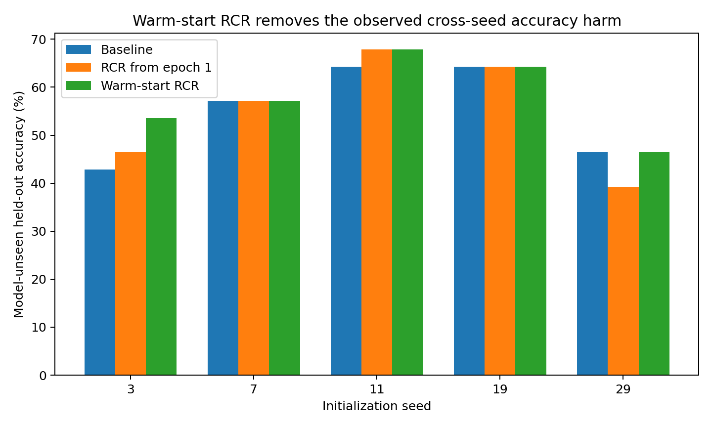

**Figure 10.** Held-out accuracy under native training and warm-start Ranked Candidate Routing across five independent initializations of the controlled model. Each seed is evaluated under the matched task and training protocol. Source: RCR-023 to RCR-026.

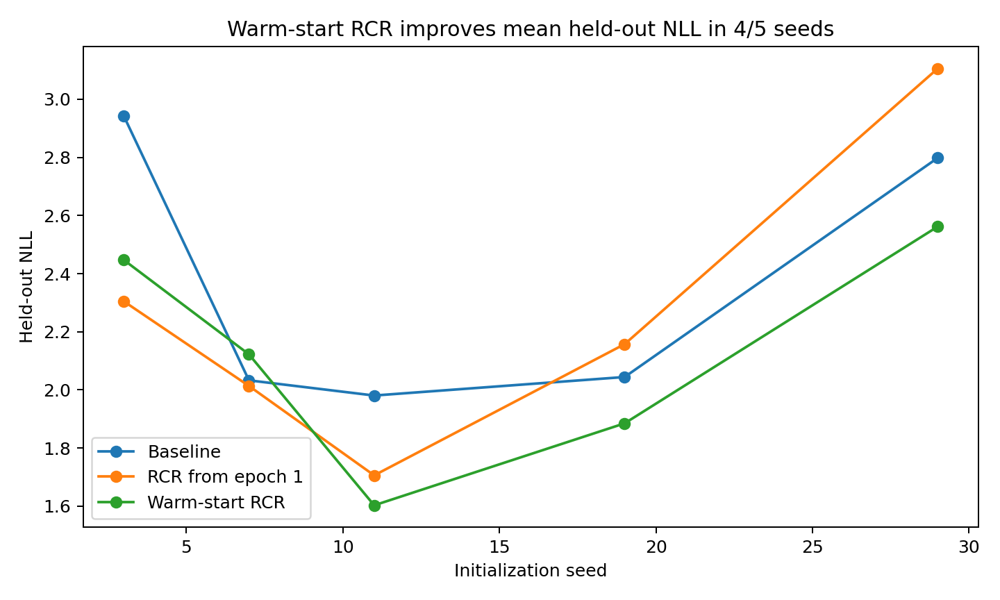

**Figure 11.** Held-out negative log-likelihood under native training and warm-start Ranked Candidate Routing across five independent initializations. Lower values indicate better predictive likelihood. Source: RCR-023 to RCR-026.

## 8  Adapting the protocol across tasks and architectures

Transfer makes candidate count and intervention depth part of the measured protocol. The same rule is evaluated after normalizing its scale and locating its operating layer.

*Experiment RCR-027 to RCR-031*

### Why this campaign was necessary

The preceding five-seed experiment established a positive within-task result for warm-start Ranked Candidate Routing (RCR): on the original 8-layer, 24-dimensional MODE-COLLISION model, warm-start RCR increased mean model-unseen held-out accuracy from 55.00% to 57.86% across five seeds, improved mean held-out NLL, added no trainable parameters, and incurred approximately 6.19% median CPU overhead in the vectorized prototype.

The present campaign deliberately moved away from that favorable setting. Its purpose was to identify which parts of RCR are genuine engineering interfaces and which parts were accidental properties of the original experimental geometry.

Two stressors were introduced:

- a different retrieval task with much shorter contexts;

- different Transformer depths and widths on the original task.

No positive result was assumed in advance.

### Cross task transfer absolute candidate counts do not transfer

The first transfer task contains four named slots (A/B/C/D) with random binary values in random order. A random query requests one slot value. The task requires candidate selection but differs materially from the original TEXT/ACT mode-collision task. The original RCR uses seven promoted candidates (1 PRIMARY + 2 SECONDARY + 4 RESERVE). In the original task, the mean available candidate sequence length is 74.68 tokens, so the promoted set covers about 9.4% of the candidate field.

In the new retrieval task, the mean candidate length is only 39.54 tokens. Reusing the same absolute top-7 therefore promotes approximately 17.7% of the candidate field.

The first two seed tests showed the expected transfer failure:

- seed 3: 68.33% → 68.00%;

- seed 7: 68.00% → 65.33%.

The failure is informative: the transferable object is not “seven items.” It is the relative candidate bandwidth.

### Scale normalized RCR

RCR was therefore rewritten to preserve the original 9.4% promoted-candidate bandwidth, while retaining the original tier proportions and multipliers. No new task-specific tier weights were tuned.

Across five initialization seeds:

**Table 9. Adapting the protocol across tasks and architectures**

| Seed | Baseline acc. | Scale-RCR acc. | Δ acc. | Δ NLL | Δ signed margin |
| --- | --- | --- | --- | --- | --- |
| 3 | 68.33% | 68.00% | -0.33 pp | -0.0473 | -0.0991 |
| 7 | 68.00% | 69.33% | +1.33 pp | -0.0456 | +0.1439 |
| 11 | 63.67% | 65.33% | +1.67 pp | +0.0035 | +0.1823 |
| 19 | 67.00% | 67.67% | +0.67 pp | +0.0037 | +0.2127 |
| 29 | 68.67% | 65.00% | -3.67 pp | +0.2119 | -0.0548 |

Source: RCR-027 to RCR-031. The experimental setting and definitions are given in the associated text.

The mean accuracy was 67.13% baseline vs 67.07% scale-RCR. Three seeds improved, one was approximately flat, and one seed (29) showed a concentrated failure. Mean signed margin increased by +0.0770, but the mean NLL did not improve because the seed-29 failure was large.

The result supports a narrower claim than universal task transfer:

RCR candidate bandwidth must be expressed relative to the available candidate field. Scale normalization repairs the obvious absolute-top-k mismatch, but task transfer remains initialization-dependent in this pilot. This negative boundary is important for the practical paper: a routing protocol should specify its scale, not merely its integer top-k.

### Cross architecture transfer the intervention layer is also part of the protocol

The next stress test returned to the original MODE-COLLISION task and changed the Transformer architecture. A fixed “75%-depth” layer mapping was first tested in a 6-layer/24D model. For seed 7, inserting RCR at layer 4 reduced held-out accuracy from 60.71% to 57.14%. This establishes a second non-transferable constant: the successful layer index from one architecture cannot be mapped mechanically by depth fraction alone.

### 1 Training only self location

A training-only self-location rule was introduced. When training accuracy first reaches 80%, the model evaluates an RCR intervention at every layer using training correct-margin gain only and selects the best layer. The selected layer is then frozen and RCR is ramped in over ten epochs.

Executed results:

**Table 10. Adapting the protocol across tasks and architectures**

| Architecture | Seed | Baseline | Self-locating RCR | Δ acc. | Selected layer |
| --- | --- | --- | --- | --- | --- |
| 4L32D | 7 | 60.71% | 64.29% | +3.57 pp | 3 |
| 4L32D | 11 | 60.71% | 67.86% | +7.14 pp | 3 |
| 4L32D | 19 | 53.57% | 50.00% | -3.57 pp | 2 |
| 6L24D | 7 | 60.71% | 60.71% | +0.00 pp | 5 |
| 6L24D | 11 | 64.29% | 64.29% | +0.00 pp | 3 |

Source: RCR-027 to RCR-031. The experimental setting and definitions are given in the associated text.

The 4-layer/32D architecture produced two clear improvements and one failure; its three-seed mean accuracy moved from 58.33% to 60.71%. In the 6-layer/24D architecture, self-location removed the seed-7 accuracy harm caused by the fixed depth rule, but did not increase accuracy in the two tested seeds.

### 2 Greedy layer selection is itself an engineering risk

The 4L32D seed-19 failure is especially informative. The greedy self-locator chose layer 2 because its training margin gain was slightly largest. A fixed last-layer intervention preserved baseline accuracy, whereas the greedy selection reduced accuracy. A one-standard-error late tie-break was therefore tested: among layers statistically close to the training-best layer, choose the deepest. It correctly moved the seed-19 intervention back to layer 3, but the subsequently continued training still finished below baseline accuracy. Thus layer selection is only part of the instability; training trajectory and stopping behavior also matter.

The current evidence therefore supports self-location as a necessary interface, not as a solved locator algorithm.

### The factory interpretation

The research metaphor is intentionally retained because it generated concrete engineering variables.

The sequence was:

“Imagine a factory.” Attention behaves like candidate retrieval rather than the whole computation. Different heads behave like parallel proposal pipelines. Some pipelines search broadly; others become selective. Their outputs can oppose one another. Opposition can be either useful correction or destructive cancellation. Candidate proposals can therefore be graded as PRIMARY / SECONDARY / RESERVE rather than being treated as an undifferentiated normalized mass.

That apparently unserious factory picture directly generated:

- candidate-resolution measurements;

- causal candidate-identity swaps;

- useful-opposition vs destructive-conflict tests;

- history-aware conflict gates;

- ranked proposal tiers;

- parcel-scale routing;

- warm-start activation;

- candidate-bandwidth normalization;

- layer self-location.

### Established routing protocol

The strongest executed result remains the original within-task multi-seed warm-start experiment:

- 5 seeds;

- mean held-out accuracy 55.00% → 57.86%;

- no seed-level accuracy degradation;

- mean held-out NLL improvement;

- zero extra trainable parameters;

- ~6.19% median CPU overhead in the vectorized prototype.

The present campaign establishes three engineering findings:

- absolute top-k is not a transferable interface — candidate bandwidth should be scale-normalized;

- fixed layer position is not a transferable interface — routing location should be selected from model state rather than copied as an integer;

- Transfer is not uniform: cross-task and cross-architecture stress tests reveal seed-dependent failures.

The measured routing benefit is bounded by task, architecture and initialization.

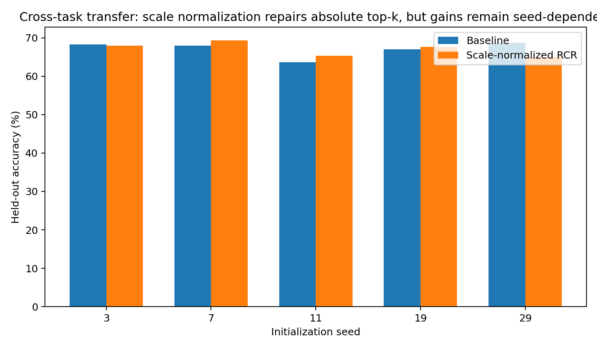

**Figure 12.** Cross task accuracy. Task and architecture transfer experiments. Candidate fractions and intervention depth are evaluated within each matched model/task condition. Source: RCR-027 to RCR-031.

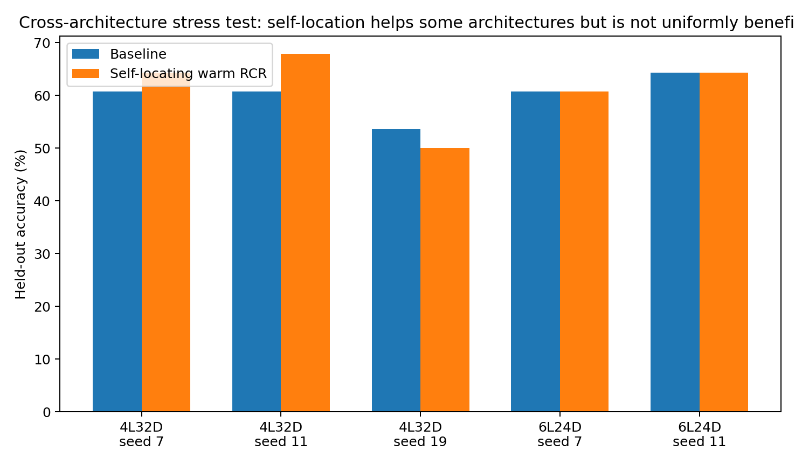

**Figure 13.** Cross arch accuracy. Task and architecture transfer experiments. Candidate fractions and intervention depth are evaluated within each matched model/task condition. Source: RCR-027 to RCR-031.

## 9  Ranking stability as the control signal

The closing protocol monitors the proposals themselves on a fixed sentinel set and raises routing authority in measured increments.

*Experiment RCR-032 and RCR-033*

### Question

The previous warm-start RCR granted routing authority after the model reached a task-competence threshold. The transfer campaign showed that task competence and candidate-ranking maturity are separate objects. EXP032–033 therefore monitors the proposal list itself. A small fixed sentinel set is evaluated every five epochs. RCR authority remains at zero until task competence is present and candidate rankings begin to stabilize. Thereafter routing authority is earned progressively in 0.25 increments rather than switched on all at once.

The final homogeneous six-seed evaluation uses the same progressive ranking-stability protocol for every seed.

### Result

Across six initialization seeds:

- baseline mean held-out accuracy: 52.38%

- ranking-stability RCR mean accuracy: 60.12%

- mean change: +7.74 percentage points

- accuracy improved in 5/6 seeds

- unchanged in 1/6

- decreased in 0/6

Mean held-out NLL changed from 2.4409 to 2.1557; NLL improved in 5/6 seeds.

Per seed:

**Table 11. Ranking stability as the control signal — panel 1 of 2**

| seed | baseline acc. | stability-RCR acc. | Δ acc. | baseline NLL |
| --- | --- | --- | --- | --- |
| 3 | 42.86% | 57.14% | +14.29 pp | 2.9432 |
| 7 | 57.14% | 60.71% | +3.57 pp | 2.0327 |
| 11 | 64.29% | 67.86% | +3.57 pp | 1.9804 |
| 19 | 64.29% | 67.86% | +3.57 pp | 2.0442 |
| 29 | 46.43% | 46.43% | +0.00 pp | 2.7983 |
| 43 | 39.29% | 60.71% | +21.43 pp | 2.8467 |

Source: RCR-032 and RCR-033. The experimental setting and definitions are given in the associated text.

**Table 12. Ranking stability as the control signal — panel 2 of 2**

| seed | stability-RCR NLL | competence epoch | full authority |
| --- | --- | --- | --- |
| 3 | 2.5019 | 15 | 35 |
| 7 | 1.9206 | 5 | 25 |
| 11 | 1.7476 | 10 | 30 |
| 19 | 1.9378 | 10 | 30 |
| 29 | 2.8217 | 10 | 40 |
| 43 | 2.0046 | 10 | 35 |

Source: RCR-032 and RCR-033. The experimental setting and definitions are given in the associated text.

The most difficult initialization, seed 43, improves from 39.29% to 60.71% and from NLL 2.8467 to 2.0046.

### Why this is different from the earlier warm start

The old trigger asks:

has the model become competent enough on the training task?

The new telemetry asks an additional question:

have the proposal pipelines stopped rapidly changing which candidates they promote? Candidate-ranking maturity is visibly delayed relative to first task competence. Full authority occurs between epochs 25 and 40 in this campaign. On the five seeds shared with the previous competence-only warm-start experiment, ranking-stability authority increases mean final accuracy from approximately 57.86% to 60.00%. NLL is not uniformly better than the competence-only schedule, so the current gain is primarily in held-out classification stability rather than universal calibration.

### Engineering interpretation

The factory analogy now has a measurable authority protocol:

candidate pipelines begin operating → task competence appears → promoted lists stabilize → routing authority is gradually granted.

The useful state variable is therefore not just model competence. It is logistics maturity. This result also explains why early hard RCR was unstable: it gave authority to proposal rankings before the rankings themselves had settled.

### Scope

This is still a controlled-model result. The ranking-stability threshold and sentinel strategy are engineering choices, and the transfer experiments already show that RCR is not a universal improvement on every task or architecture. The evidence supports ranking stability as a real training-stage signal and a useful control variable for RCR activation.

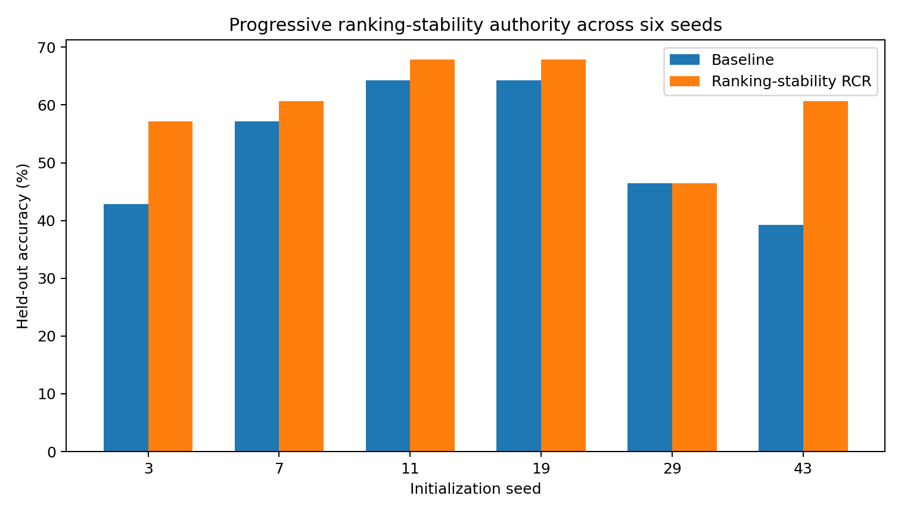

**Figure 14.** Accuracy. Six independent initialization seeds under the same progressive ranking-stability protocol. Bars show native and stability-triggered held-out accuracy. Source: RCR-032 and RCR-033.

## Implications for Data Oriented Modelling

Coordination can be designed from the measured behavior of candidate selection. Identity, temporal lineage, contribution effects and ranking stability identify different parts of the problem. The resulting protocol preserves free candidate search while applying explicit priorities at a measured scale and a measured stage of development.

## Experimental sources

- Experiment ATTENTION-CANDIDATE-NARROWING-001

- Experiment ATTENTION-PIPELINES-002 to COORDINATOR-004

- Experiment ATTENTION-CONTRIBUTION-005 to HISTORY-GATE-007

- Experiment RCR-008 to RCR-011

- Experiment RCR-012 to RCR-015

- Experiment PIECE-LOGISTICS-016 to DUAL-SCALE-022

- Experiment RCR-023 to RCR-026

- Experiment RCR-027 to RCR-031

- Experiment RCR-032 and RCR-033
