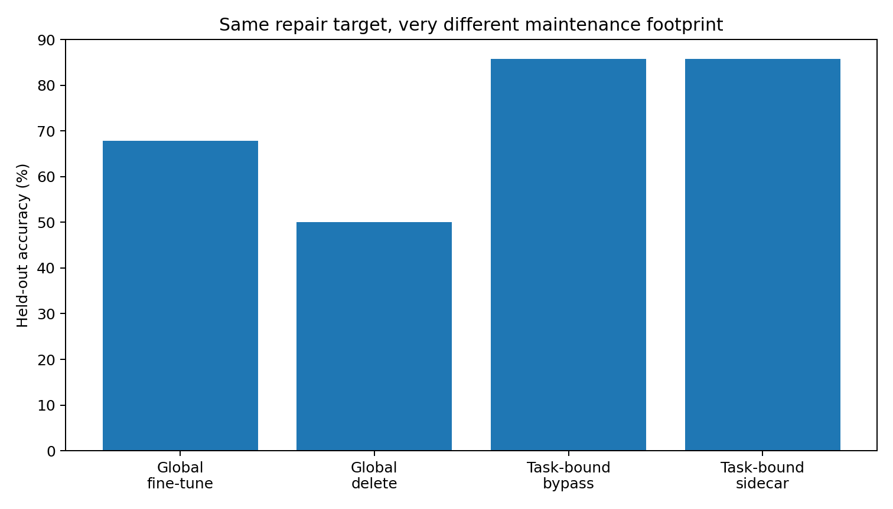
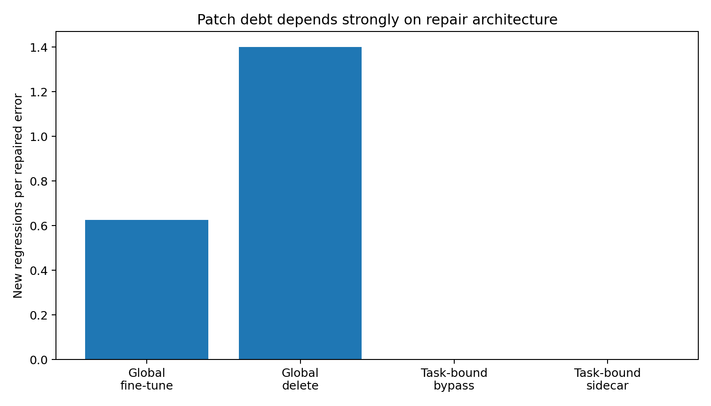
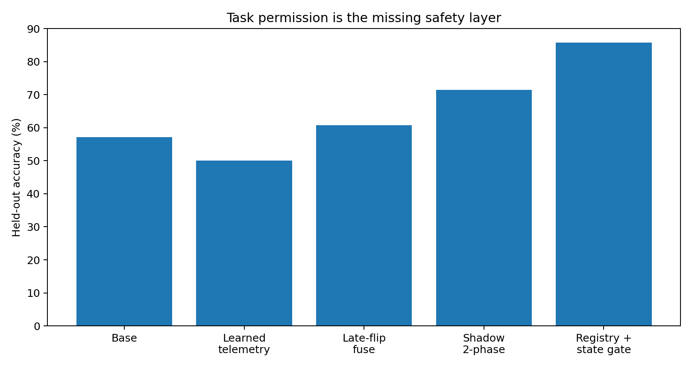
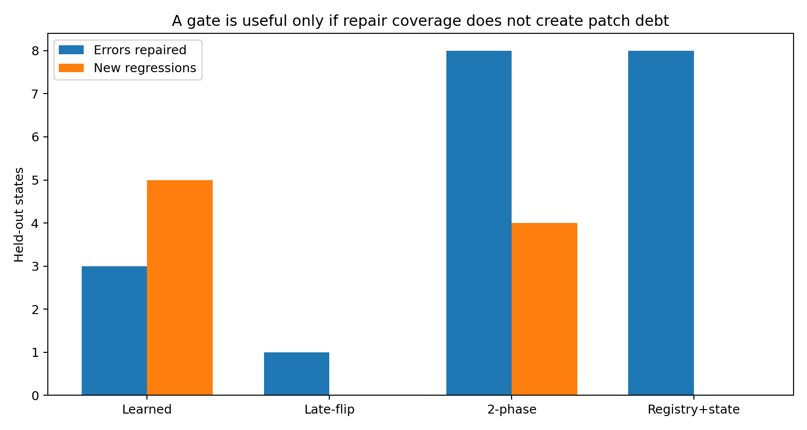
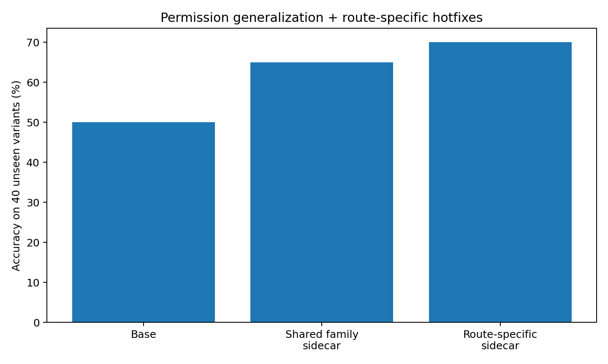
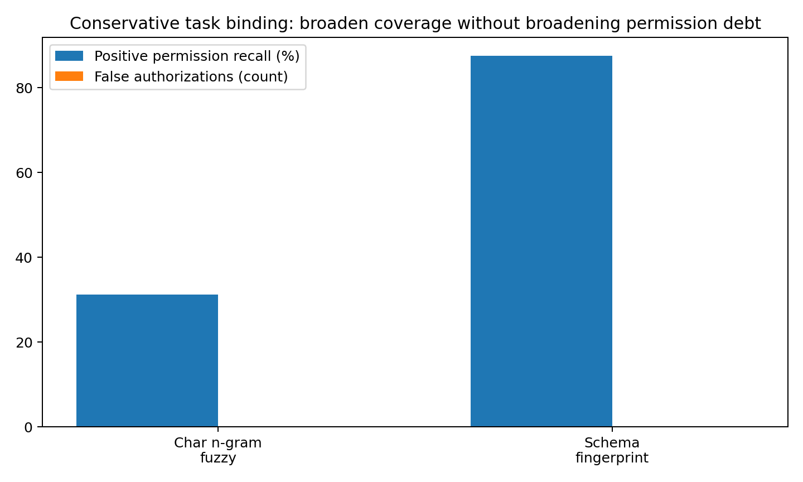
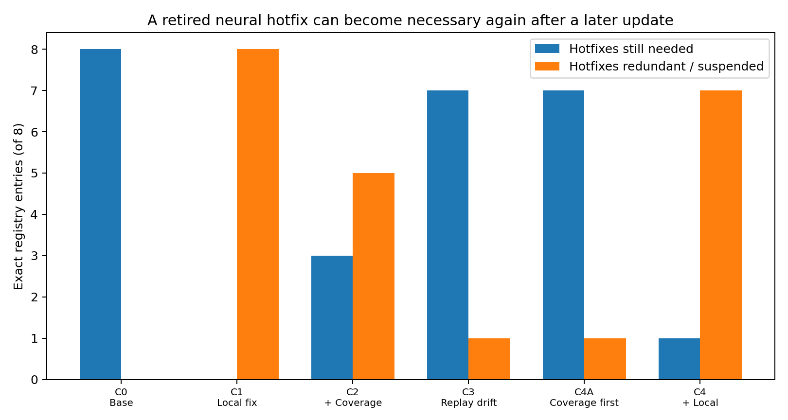
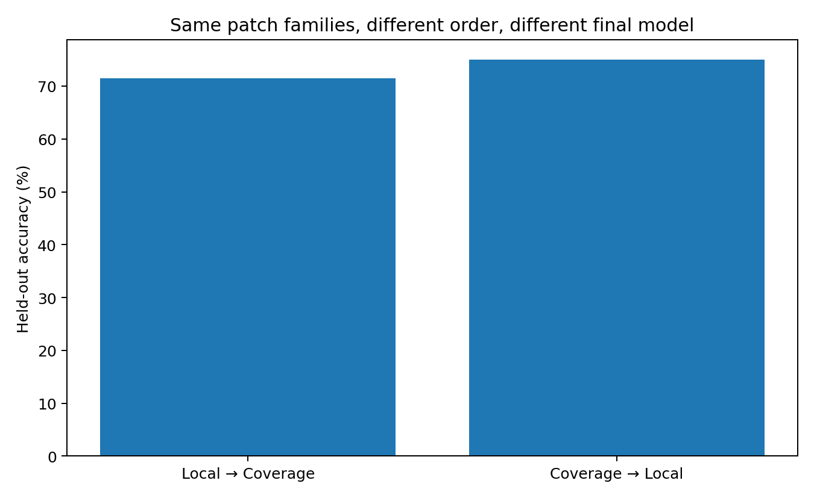
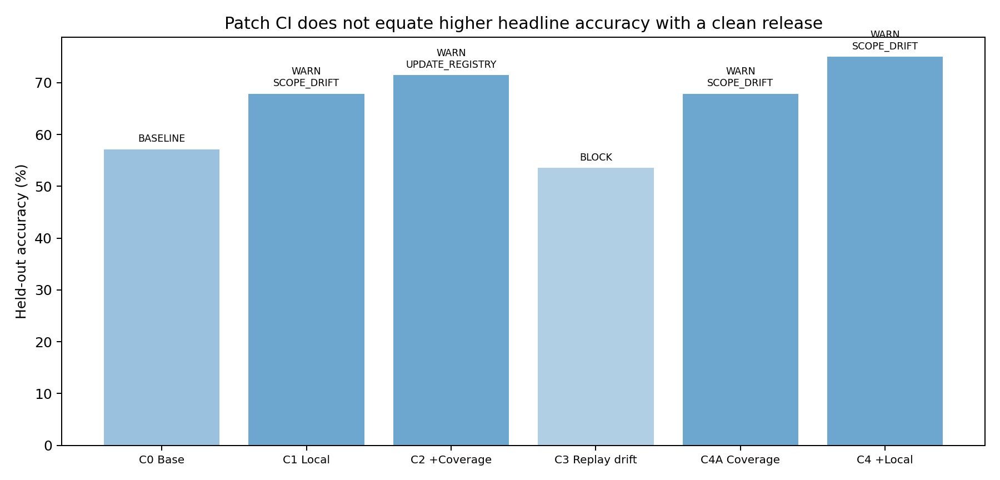

# Error Diagnosis and Local Repair

[Chapter 7](../README.md) · [Word report](06_Error_Diagnosis_and_Local_Repair.docx) · [Evidence index](EVIDENCE_INDEX.md)

Data-Oriented Modelling · Chapter 7 · Report 6

## Overview

A model error can be examined as a sequence of events inside a working computation. We trace candidate provenance and hidden-state motion, distinguish the observed path symptom from the intervention that repairs it, and evaluate how a local repair changes the rest of the model. The campaign builds a complete maintenance sequence. Scoped bypasses and detachable adapters supply repair actions; task and state permissions govern their activation; a versioned registry tracks their lifecycle; and checkpoint integration evaluates the model and its compatible repair set together.

## Question and experimental setting

Which part of the computation explains a particular failure, and how can the resulting repair be maintained across tasks and model updates? The main experiments use the controlled eight-layer, width-24 TEXT/ACT Transformer. Initial diagnosis examines 12 natural errors among 28 held-out states. The local repair comparison uses eight diagnosed repair tasks; later permission studies distinguish exact registered tasks from frozen paraphrase and sibling tests. Once a task is used to construct a patch, results on that task describe repair behavior, while the separately identified evaluation cohorts describe transfer.

## Terms used in this report

**Table 1. Terms used in this report**

| Term | Meaning in the experiments |
| --- | --- |
| Path symptom | The observed sequence of output-compatible and incompatible states. |
| Repair signature | The subsystem intervention that restores the measured result. |
| Bypass | A scoped suppression of a selected local update. |
| Sidecar | A detachable residual repair module attached to a frozen model. |
| Task permission | A registry decision about which task may use a repair. |
| State permission | A runtime decision about whether its current state warrants committing that repair. |
| Patch debt | New regressions divided by repaired errors. |
| CI | Continuous integration of checkpoints and compatible repair records. |

## 1  Tracing the work before the output

The first step records where each selected piece came from, how it moved and which discarded candidates remain relevant to the final state.

*Experiment TOKEN-PROVENANCE-036 and MOTION-037*

The provenance interface was evaluated on the frozen seed-43 controlled 8-layer / 4-head Transformer. The frozen model held-out accuracy is 0.3929. Six representative held-out states were traced. Every source token is retained in the ledger; every token that enters PRIMARY / SECONDARY / RESERVE at any layer is tracked as a route; promoted tokens that later disappear from all heads are explicitly retained in the discard yard.

For every promoted source token, a local causal edge test is performed at its last promoted layer by removing that source token from the final-query attention row across all heads, renormalizing the attention row, and rerunning the downstream network. Positive Δ emitted margin means the candidate supported the actually emitted token; negative Δ means it opposed the emitted token.

The first executed display therefore separates three objects that had previously been conflated: routing history, discard history, and causal support for the emitted token. Evidence boundary: EXP036 traces the single final TEXT/ACT decision token of the controlled classifier. It is the machinery required for a later autoregressive token-by-token provenance movie, not yet a claim that every token of a long LLM generation has been traced.

Artifacts include the full node/edge/event network, every-token ledger, text trace, and HTML logistics display.

### Aggregate logistics result

Across the six sentinel states, 386 source tokens were audited. 273 entered PRIMARY / SECONDARY / RESERVE at least once; 159 of those were ultimately discarded and 114 survived in the promoted set to the final layer. Discard and causal value are nearly orthogonal in this first trace. Among the 159 discarded candidates, 79 had positive emitted-token causal support immediately before discard and 80 had negative support. Among the 114 final surviving candidates, 58 had positive final emitted-token support and 56 had negative support.

Therefore the display must not encode discarded = useless or survived = useful. Logistics fate and causal function are separate variables.

The network also contains genuine rerouting: 50 / 273 promoted tokens re-entered the promoted set after at least one background interval, with up to two re-entry events for a source token. 84 source tokens reached PRIMARY at least once, and 35 of those PRIMARY-ever tokens were nevertheless ultimately discarded. This is the strongest qualitative finding of EXP036: the candidate network is not a monotone funnel. It behaves as a dynamic logistics system with promotion, demotion, re-entry, survival, and discard, while causal usefulness can change independently of final logistics status.

### Purpose

EXP036 established a complete logistics ledger: which source tokens were proposed, promoted, demoted, retained, discarded, and whether a final-query attention ablation at the token's last promoted layer supported or opposed the emitted TEXT/ACT token. The ledger was complete but visually dense. EXP037 converts the same provenance machinery into a motion-coded movie. The aim is deliberately simple enough for public explanation while keeping the underlying 24-dimensional measurements available.

The movie asks five intuitive questions at each internal frame:

- which pieces are rotating inward;

- which pieces are being pushed inward;

- which pieces merge into the query-centered dynamic assembly;

- which candidates are kicked out of the promoted band;

- which candidates are demoted / fading out.

### Operational action definitions

The motion labels are not semantic interpretations.

For each source token, the experiment forms its 24D relative vector to the query token, r = h_source - h_query, at every exact internal frame. Consecutive movement is decomposed into a radial component along the previous relative vector and a tangential component orthogonal to it.

- PUSH_IN: inward radial movement dominates (push_share ≥ 0.55) while the piece remains in the promoted logistics field.

- ROTATE_IN: tangential movement dominates (tangential_share ≥ 0.72, relative-vector turn ≥ 4°) while the promoted piece moves inward / is being promoted.

- KICK_OUT: a piece that was PRIMARY / SECONDARY / RESERVE becomes BACKGROUND in all heads at the next attention update.

- MERGE_IN: the source token newly joins the same five-frame dynamically rigid component as the query token. Components use the previously validated complete-linkage dynamic-strain detector, recalibrated on the seed-43 training states at the 1% identity-scrambled null threshold.

- FADE_OUT: a tier demotion that does not immediately remove the candidate from the promoted band.

- final_norm: explicitly tagged as a coordinate-remapping frame rather than literal physical assembly motion.

The display position is a public-facing 2D projection. The action label itself is calculated from the original 24D motion, not from the screen projection.

### Measured motion events

Across the six sentinels, recorded major logistics-motion events include:

- major ROTATE_IN: 265

- major PUSH_IN: 6

- stable MERGE_IN: 135

- KICK_OUT: 210

- FADE_OUT: 134

The public movie applies two clarity filters: rotate/push subtitles require at least the within-frame median motion magnitude, and MERGE_IN requires two-frame persistence. The unfiltered motion table is retained separately, so the public simplification does not discard the underlying measurements. The refined events are retained in TOKEN_MOTION_037_events_refined.csv; every source token, including background pieces, remains in TOKEN_MOTION_037_frame_metrics_refined.csv.

### Motion categories and provenance

EXP036 answered the forensic question: what happened to every piece? EXP037 answers the cinematic question: what is happening right now?

The public display therefore separates:

- the central hidden-motion arena;

- current action subtitles (↻ rotate in, → push in, ⊕ merge, ✕ kick out, ↓ fade);

- a discard yard;

- the emitted-token margin timeline;

- an expert inspector exposing the original 24D turn, radial/tangential shares, tier, head, rank, causal sign, and dynamic-component membership.

### Experimental scope

EXP037 is still a pre-output controlled-classifier movie. It traces how source pieces are routed and moved toward the single final TEXT/ACT decision.

### Checkpoint reconstruction validation

The seed-43 baseline checkpoint was deterministically reconstructed from the original training protocol and checked against the archived provenance measurements. The reconstruction reproduced the archived held-out accuracy exactly (0.392857) and held-out NLL to within 0.00024 (archived 2.84669; rebuilt 2.84693). Re-running EXP036 on the reconstructed model reproduced 386/386 tier paths exactly, 386/386 discard statuses exactly, and the mean absolute change in last-promoted causal margin was 2.94×10⁻⁵ (maximum 7.04×10⁻⁴).

Therefore the provenance ledger and the 18-frame hidden-state movie used in EXP037 are operationally the same seed-43 model lineage.

## 2  The trained output geometry and the runtime path

A fixed output head supplies an operational reference for following a decision through depth. The factory analogy then links that reference to the path actually taken by the model.

*Experiment BLUEPRINT-FIELD-038*

### Working idea

This experiment avoids the language of hidden verbal thoughts. The operational question is:

Does supervised training through loss create an output-compatible geometric blueprint, and do runtime state trajectories behave like construction processes that may approach, cross, or miss that blueprint?

Two measurable objects are used:

- readout blueprint axis: b = W_{ACT} - W_{TEXT}

- training product prototype axis: p = mean(h_{ACT}) - mean(h_{TEXT}) at the final normalized decision state.

### Loss really does draw the output geometry

At initialization, the output axis and training prototype axis have cosine 0.582. After training, the cosine is 0.989.

At each checkpoint, the full-batch cross-entropy descent direction for the output-axis difference was computed from the current training states and current prediction errors. The actual subsequent output-axis update aligns with that loss-implied direction:

- mean cosine: 0.669

- median cosine: 0.699

The actual output-axis update also aligns with the current class-prototype direction, mean cosine 0.745. This is direct evidence that the training examples, filtered through the loss, participate in constructing the output-compatible geometry.

### The blueprint itself barely needs to rotate

The final output axis is only 13.4° away from its initialization orientation. The dominant training change is therefore not a readout vector rotating through a huge semantic arc. Much of the work happens inside the representation: training progressively manufactures decision-state differences that fit the output coordinate system. For this reason, blueprint field is more accurate than “one answer vector.” The final solution is a joint agreement between a relatively stable output coordinate system and internal parameters that learn to shape incoming data into that coordinate system.

### Runtime construction toward the blueprint

For every matched TEXT/ACT pair, the ACT−TEXT decision-state displacement was measured at every depth and compared with the final trained blueprint axis.

### Training pairs

Mean cosine by depth:

[0.07764, 0.15594, 0.238169, 0.336626, 0.463845, 0.625733, 0.788163, 0.911204, 0.962353] The mean angle falls from 85.4° at the embedding output to 15.1° at the final layer.

### Held out pairs

Mean cosine by depth:

[0.042343, 0.017881, 0.027144, 0.034842, 0.062189, 0.099647, 0.136595, 0.138513, 0.118308] Final mean cosine is only 0.118, compared with 0.962 for training pairs. The final train−held-out alignment gap is 0.844, with pair-bootstrap 95% interval [0.475, 1.206]. This gives a concrete failure mode: the blueprint can be present while unfamiliar input geometry fails to be transformed into the shape required by that blueprint.

### It was right and then became wrong is visible geometrically

The frozen final output head was applied to the decision token after every depth. A state is in the target readout region when the target-signed margin is positive.

Among the 12 held-out states that are wrong at the final output:

- 8 / 12 = 66.7% entered the correct target region at an earlier depth and later left it.

- mean best-to-final drop in target-signed blueprint score: 5.225.

This should not be described as “the model consciously knew the answer.” The supported statement is narrower:

A runtime state can transiently occupy the region that the trained readout would classify correctly, then subsequent computation can move it out of that region before the final readout. This is a mechanical version of “early answer right, final answer wrong.”

### Relation to the factory blueprint analogy

The current evidence supports the following working chain:

training data → loss → parameter updates → output-compatible blueprint field

At inference:

incoming cargo → candidate routing → assembly / rotation / reconfiguration → blueprint compatibility → emitted output

The blueprint is not a hidden sentence-like plan. It is a learned region of acceptable finished geometry.

### Output geometry and learned transformation routes

The numerical result above is easy to flatten into a conventional sentence such as “training and held-out representations differ.” That sentence is correct, but it loses the reason this experiment was designed in the first place.

The more useful picture is this:

Loss can give the factory a drawing of an acceptable finished product without giving the factory a universal way to manufacture every possible raw material into that product.

This distinction separates two questions that are often collapsed into one:

- Does the model possess an output-compatible target geometry?

- Can the current input actually be transformed into that geometry by the production machinery the model learned?

The present experiment gives strong evidence that these are not the same question. The trained readout / product geometry is very clear on the training distribution, yet held-out pair displacements often fail to rotate into it.

### The blueprint

The blueprint is not a hidden English sentence saying “the answer should be ACT.” It is a learned acceptance geometry created by the interaction of the training data, the loss, the output head, and the internal representation.

In factory language, the loss repeatedly tells the system:

“This finished object passes inspection.” “That one does not.” “Change the machinery so that more of the training material leaves the line in the acceptable shape.” Over training, the factory and the inspection station come into agreement. In this experiment, the final training prototype axis and the output axis reach cosine 0.989. That is the drawing.

### The machinery

The machinery is everything that must happen before the final inspection:

- candidate retrieval;

- routing;

- rotation;

- translation;

- fragment formation;

- parcel formation;

- assembly;

- splitting and reassembly;

- late readout alignment.

The model therefore does not merely learn what a correct finished object looks like. It also learns a collection of transformation routes that can take familiar input material toward that finished geometry. That is the manufacturing process.

### The manufacturable region

Once the blueprint and machinery are separated conceptually, a third object appears naturally:

the manufacturable region — the region of input / state space for which the learned machinery has a workable route into the blueprint-compatible output region. This region need not include all possible inputs.

Some raw material may be highly familiar. The factory has processed many similar orders before, so a well-tested route exists:

raw material → candidate routing → assembly → blueprint-compatible product

Some material may be unfamiliar but nearby. Existing machinery can be reused with modest reorientation:

unfamiliar material → partial re-routing → reassembly → approximate blueprint match

Other material may fall outside the learned production domain:

unfamiliar material → no reliable route → repeated reconfiguration → wrong finished geometry

And a fourth case, which we already observe, is especially revealing:

raw material → correct blueprint region → further processing → leaves blueprint region → wrong final output. In this case the factory briefly made a product that would have passed inspection, then continued machining it until it no longer did.

### Output knowledge and its operational realization

When an intermediate hidden state lies in the correct readout region, it is tempting to say:

“The model knew the answer at that point.” That language is unnecessary and can be misleading.

What was actually observed is more concrete:

At that depth, the current product already satisfied the geometric criterion learned by the final readout. Nothing stronger is required. The factory analogy helps here. A partially assembled object can already fit the final quality-control gauge. If an unnecessary later operation bends it out of tolerance, the earlier object was not “thinking the correct answer.” It was simply already manufacturable into an accepted product — and was then over-processed.

This is exactly what the held-out error paths make visible. Among the 12 final held-out errors, 8 had already entered the correct readout region earlier.

### Input coverage and available transformation routes

A particularly important consequence is that a model can possess a very clean blueprint and still perform poorly on genuinely unfamiliar material.

The failure is not necessarily:

“The model does not know what the answer should look like.”

It may instead be:

“The factory does not possess a production route from this raw material to that known acceptance geometry.” This is a much more useful engineering distinction. The output criterion can be intact. The readout can be intact. The loss can have carved a very sharp target. And yet the input can remain outside the part of state space that the learned machinery can reliably transform.

This is why a held-out error should not be treated as one undifferentiated event.

### Training data may expand the manufacturable region

This picture also gives a mechanical interpretation of apparent “capability emergence.”

Suppose the original learned manufacturable domain is:

Ω₀

After additional training examples, loss modifies the routing and transformation machinery. The blueprint may move only slightly, while the set of inputs that can actually be delivered to it expands:

Ω₀ → Ω₁ with Ω₁ containing input regions that were previously unreachable. From the outside, the model may appear to have suddenly “learned a new capability.”

From inside the factory, a simpler description may be:

a new class of raw material finally acquired a viable production route. No mystical phase transition is required for this interpretation. The production boundary moved. This does not claim that every observed capability jump has this cause. It gives a concrete hypothesis that can be measured.

### The four objects we should keep separate

The current research line should therefore maintain four distinct objects:

- Blueprint — the output-compatible geometry induced by training and loss.

- Machinery — the learned transformations, routing operations, assemblies, rotations, and readout-facing operations.

- Manufacturable region — the subset of possible input / internal geometries for which those learned operations provide a viable route to the blueprint.

- Construction trajectory — what happens to one specific input on one specific forward pass.

These four objects answer different questions. A blueprint can be good while the machinery is inadequate. The machinery can be adequate for familiar material but fail outside its manufacturable region. A trajectory can temporarily reach the blueprint and later leave it. A final error can therefore come from very different mechanical causes.

### The factory interpretation in operational terms

The factory language is not intended as a literal claim about physical machinery inside a Transformer. It is retained because it generated experimentally testable distinctions that would otherwise be easy to miss.

The sequence of reasoning was:

“Loss gives the system a target.” “A target is not the same thing as a method for reaching it.” “Therefore we should measure both the blueprint and the reachable production domain.” “If a sample is wrong, ask whether the material was routed badly, assembled badly, over-processed after becoming correct, or never belonged to a region the learned machinery could transform.”

The diagnosis experiments below test these alternatives through matched subsystem interventions.

### Data Oriented Modelling implication

The Data-Oriented Modelling implication is straightforward:

Generalization should be studied as a property of the relationship between data geometry and learned manufacturability, not only as a scalar accuracy difference between train and test sets. The relevant question is not merely whether an example was unseen.

It is:

- how far its geometry lies from previously manufacturable material;

- whether an existing route can be reused;

- whether the route nearly succeeds;

- where the transformation becomes incompatible with the blueprint;

- whether new training data expands the reachable region or merely sharpens the same old route.

This reframes “unknown generalization” into a measurable production-boundary problem.

### Main conclusion

The strongest readable object before output is not a sentence-like thought. It is the relationship between the current assembly and a training-derived output-compatible geometry. Training through loss makes the internal class geometry and readout axis nearly collinear; training-pair runtime trajectories rotate strongly into that geometry; held-out trajectories often fail to do so; and some final errors occur after the state has already passed through the correct readout region.

## 3  Diagnosing the subsystem and testing its repair

A depthwise symptom becomes actionable when matched attention-side and feed-forward interventions identify a repair signature.

*Experiment FAULT-DIAGNOSTIC-039 to 042*

### Engineering goal

The previous experiments produced a training-derived blueprint and a motion/logistics movie. The next engineering question is not “why did the model make an error?” in the abstract. It is:

Which subsystem failed, how can we tell, and does the repair implied by that diagnosis actually work? The diagnostic system was deliberately built like a service manual. It uses active probes and counterfactual bypass tests rather than relying on verbal interpretation.

### Path symptoms and subsystem repair signatures

A major result of this campaign is that BLUEPRINT_EXIT is a path symptom, whereas ROUTING, ASSEMBLY, and MANUFACTURABILITY_GAP are repair/root-cause signatures.

The two axes are:

### Axis A path symptom

- BLUEPRINT_EXIT: the runtime state entered the correct readout region at an earlier depth and later left it.

- NEVER_REACHED: the state never entered the correct readout region.

### Axis B subsystem repair signature

- ROUTING: attention-side bypass is the minimal effective repair.

- ASSEMBLY: FFN-side bypass is the minimal effective repair.

- MANUFACTURABILITY_GAP: no local attention or FFN bypass repairs the error.

This two-axis design prevents a common attribution mistake. A sample may exhibit blueprint exit because of a routing failure or blueprint exit because of an assembly failure.

### Diagnostic probes

### Probe 1 Depth readout probe

The frozen final readout is applied after every depth.

This probe answers:

Did the product ever pass the final inspection geometry before the model finished processing it?

Natural held-out errors:

- final errors: 12 / 28

- blueprint-exit errors: 8 / 12

- never-reached errors: 4 / 12

### Probe 2 Attention cargo probe

At a chosen layer, only the decision token's attention update is replaced with the norm-matched attention update from a nearby successful same-label training trajectory. The FFN and all downstream computation remain unchanged.

This is a deliberately narrow intervention:

“If the same machine received a known-good cargo delivery at this station, would the product recover?” A single-station version and a suffix/trajectory version were executed.

### Probe 3 FFN processing probe

The same procedure is applied to the FFN update while leaving the attention cargo untouched.

It asks:

“If the cargo stays the same but the local processing action is replaced by a known-good action, does the product recover?”

### Probe 4 Circuit breaker bypass

The strongest engineering probe removes the need for a donor altogether.

- routing probe: set the selected decision-token attention update(s) to zero;

- assembly probe: set the selected decision-token FFN update(s) to zero.

A rescue therefore means:

simply skipping the suspected work station is better than letting it continue processing. This is much stronger evidence for attribution than a correlational probe.

### Natural error diagnosis

**Table 2. Diagnosing the subsystem and testing its repair**

| Case | Path symptom | Root repair signature | ATTN bypass layers needed | FFN bypass layers needed | Repair |
| --- | --- | --- | --- | --- | --- |
| 0 ACT | Blueprint exit | ASSEMBLY | — | 5 | FFN bypass: 3-7 |
| 10 ACT | Blueprint exit | ASSEMBLY | 8 | 3 | FFN bypass: 5-7 |
| 25 ACT | Blueprint exit | ASSEMBLY | 8 | 1 | FFN bypass: 1 |
| 35 TEXT | Blueprint exit | ASSEMBLY | 1 | 1 | FFN bypass: 3 |
| 55 ACT | Blueprint exit | ASSEMBLY | — | 3 | FFN bypass: 5-7 |
| 15 TEXT | Never reached | Coverage gap | — | — | coverage expansion / retraining |
| 20 TEXT | Never reached | Coverage gap | — | — | coverage expansion / retraining |
| 25 TEXT | Never reached | Coverage gap | — | — | coverage expansion / retraining |
| 55 TEXT | Never reached | Coverage gap | — | — | coverage expansion / retraining |
| 35 ACT | Blueprint exit | ROUTING | 1 | 7 | ATTN bypass: 1 |
| 40 TEXT | Blueprint exit | ROUTING | 3 | — | ATTN bypass: 5-7 |
| 50 TEXT | Blueprint exit | ROUTING | 4 | — | ATTN bypass: 4-7 |

Source: FAULT-DIAGNOSTIC-039 to 042. The experimental setting and definitions are given in the associated text.

Root-cause counts across the 12 natural errors:

- routing-rooted: 3

- assembly-rooted: 5

- manufacturability gap: 4

The strongest separation is the manufacturability group. All four NEVER_REACHED TEXT failures resist every local single-layer and suffix attention/FFN bypass tested here.

### Repair result the eight blueprint exit errors are locally repairable

Every one of the 8 blueprint-exit natural errors has a targeted circuit-breaker repair:

- routing-rooted cases recover by bypassing an attention stage or late attention suffix;

- assembly-rooted cases recover by bypassing an FFN stage or FFN suffix.

No correct hidden state is transplanted. No answer token is injected. The repair is only:

stop the diagnosed bad subsystem from continuing to modify the decision state.

Under an oracle service-mode diagnosis (the evaluation system knows that the case is wrong and runs the probes), the 16 already-correct held-out states plus 8 locally repaired errors would correspond to:

85.71% correct before attempting any manufacturability repair. This number is an upper bound for the current diagnostic/repair machinery, not a claim of deployable autonomous accuracy: deciding that an answer is wrong still requires an external correctness signal or validator.

### Concrete repair patterns

Several cases are especially clean.

### Routing rooted blueprint exits

Pairs 40/TEXT and 50/TEXT cannot be rescued by FFN bypass. They are rescued by bypassing late attention routing:

- pair 40/TEXT: bypass the final 3 attention layers

- pair 50/TEXT: bypass the final 4 attention layers

These are strong routing signatures: leaving processing intact while shutting off the late cargo-routing updates repairs the final decision.

### Assembly rooted blueprint exits

Examples include:

- pair 25/ACT: bypassing one FFN layer is sufficient;

- pair 35/TEXT: one FFN bypass repairs the output;

- pair 10/ACT and pair 55/ACT: bypassing the final 3 FFN layers repairs the output;

- pair 0/ACT: a longer FFN suffix bypass is needed.

These cases received the right-enough cargo to become locally repairable, but downstream processing destroys the acceptable geometry.

### Coverage expansion for unserved inputs

The four NEVER_REACHED TEXT errors are:

- pair 15/TEXT

- pair 20/TEXT

- pair 25/TEXT

- pair 55/TEXT

For these, no local attention or FFN bypass produces a correct output. Long donor-trajectory probes can eventually force them into the correct region, but only by replacing several consecutive processing stages. That is exactly the signature expected from a manufacturing-coverage gap rather than a single broken station.

### Leave one gap out coverage expansion

A first repair test was performed.

For each of the four gap pairs:

- that pair was kept completely unseen;

- the other three gap pairs were added to a small repair-training set;

- the original training data remained in replay;

- the model was fine-tuned with the same fixed recipe;

- the omitted gap pair was tested.

For the unseen target TEXT sample, all four margins moved toward the correct side:

- pair 15: +3.244

- pair 20: +0.803

- pair 25: +3.991

- pair 55: +5.963, crossing the decision boundary and becoming correct.

Thus 4/4 unseen gap targets moved in the desired direction and 1/4 was fully rescued. This is a positive but incomplete result. It supports the idea that training on nearby failure geometry can expand the manufacturable region, but the current repair schedule does not yet solve the whole region.

### Evaluation of a path stability objective

A fixed auxiliary training loss was tested that applies the final readout to several late intermediate states and adds a small cross-entropy penalty intended to keep late representations compatible with the blueprint.

Result:

- accuracy: 57.14% → 57.14%

- NLL: 2.0327 → 2.1275

The number of final errors and blueprint-exit errors did not improve.

This negative result matters. It says:

“keep every late layer classifiable” is too crude a repair. The successful repairs are subsystem-specific. A routing problem should not be repaired by globally pushing every representation toward the readout axis, and an assembly problem should not be treated as a generic classification-margin problem.

### Engineering repair manual

**Table 3. Diagnosing the subsystem and testing its repair**

| Fault | How to identify it | First repair | Long-term repair |
| --- | --- | --- | --- |
| Blueprint exit | depth readout shows correct-region entry followed by exit | run routing/assembly probes and activate the relevant circuit breaker | add trajectory monitoring; prevent the diagnosed late subsystem from overwriting a valid state |
| Routing | attention bypass repairs with fewer changes than FFN bypass | attenuate/bypass the offending attention stage | RCR, history-aware candidate routing, routing-maturity control |
| Assembly | FFN bypass repairs with fewer changes than attention bypass | attenuate/bypass the offending FFN stage | train/regularize the diagnosed processing stage, not the whole network |
| Coverage gap | never reaches blueprint; no local bypass repairs it | do not keep tuning a local router | expand training coverage, add adapters/new route capacity, retrain on neighboring failure geometry |

Source: FAULT-DIAGNOSTIC-039 to 042. The experimental setting and definitions are given in the associated text.

### The central engineering lesson

The important step is no longer merely to say:

“the model generalized badly.”

The diagnostic system can now ask:

Did the product become correct and then get damaged? Was the late cargo routing harmful? Was the cargo acceptable but the processing action harmful? Or did the factory never possess a local route for this material at all? Those questions lead to different interventions. That is the practical value of the blueprint/factory picture: it turns one scalar error into a repairable fault tree.

### Experimental scope

This campaign uses a controlled 8-layer, 24-dimensional Transformer and a binary TEXT/ACT task. The active diagnostic probes use known evaluation labels to determine whether a counterfactual repair truly rescues an error. The current result is therefore a post-error engineering diagnostic system, not yet a fully autonomous runtime self-repair system.

## 4  Following faults through successive patches

Repairing one group changes the shared model received by the next repair. Complete fault transitions therefore become part of the result.

*Experiment FAULT-MIGRATION-043*

### Question

After a fault has been diagnosed and repaired, does the system simply contain one fewer fault?

The working hypothesis was the opposite:

A repair changes the whole parameterized production system. Removing one local bottleneck may expose another bottleneck, create a new regression, or even make a previously repaired fault become dominant again. This is the neural-network analogue of maintaining a long-lived software system: the patch is not applied to an isolated module with fixed surroundings. It changes the operating point of the rest of the system.

### Fast maintenance telemetry

EXP039–042 produced a relatively expensive causal diagnosis using single-layer and suffix circuit breakers. Repeating that full diagnostic after every training patch would be unnecessarily costly.

EXP043 therefore introduces a deliberately cheaper monitoring label:

- zero each single decision-token attention update, one layer at a time;

- zero each single decision-token FFN update, one layer at a time;

- measure the correct-margin change;

- whichever subsystem family gives the larger best local improvement is called the dominant local vulnerability.

The labels are therefore:

- ROUTING-dominant

- ASSEMBLY-dominant

- GAP if neither single-layer bypass even improves the margin.

These are maintenance telemetry labels, not replacements for the full root-cause diagnosis in EXP039–042.

### Maintenance history 1 Routing Assembly Routing Assembly

Every patch uses:

- the currently erroneous samples with the requested dominant vulnerability;

- full replay of the original training set;

- 60 AdamW update steps;

- learning rate 8e-5;

- patch-loss weight 3.

The observed system trajectory is:

**Table 4. Following faults through successive patches**

| Stage | Accuracy | Routing-dominant errors | Assembly-dominant errors |
| --- | --- | --- | --- |
| Baseline | 57.1% | 5 | 7 |
| Patch Routing | 64.3% | 0 | 10 |
| Patch Assembly | 75.0% | 4 | 3 |
| Patch Routing again | 71.4% | 1 | 7 |
| Patch Assembly again | 82.1% | 2 | 3 |

Source: FAULT-MIGRATION-043. The experimental setting and definitions are given in the associated text.

The first Routing patch removes the observed Routing-dominant failures from the error pool, but the remaining errors become entirely Assembly-dominant. Repairing Assembly then makes Routing reappear. The third patch is especially important: targeting the newly reappeared Routing failures reduces accuracy from 75.0% to 71.4% and expands the Assembly-dominant error pool.

This is not monotonic repair. It is fault migration.

Across the four maintenance transitions:

- error → correct transitions: 24

- correct → error regressions: 17

- samples with a repeated fault state: 11 / 28

- samples repaired and later broken again: 11 / 28

Examples:

- pair 40/TEXT: Routing → Correct → Routing → Correct → Routing

- pair 50/TEXT: Routing → Correct → Routing → Correct → Routing

- pair 15/ACT: Correct → Assembly → Correct → Assembly → Correct

- pair 30/ACT: Correct → Assembly → Correct → Routing → Assembly

The phrase “fix A, reveal B, then see A again” is therefore directly observed in this controlled system.

### Maintenance history 2 Assembly Routing Assembly Routing

Starting from the exact same base model but reversing the first maintenance decision produces a different trajectory:

**Table 5. Following faults through successive patches**

| Stage | Accuracy | Routing-dominant errors | Assembly-dominant errors |
| --- | --- | --- | --- |
| Baseline | 57.1% | 5 | 7 |
| Patch Assembly | 78.6% | 5 | 1 |
| Patch Routing | 67.9% | 1 | 8 |
| Patch Assembly again | 89.3% | 2 | 1 |
| Patch Routing again | 85.7% | 0 | 4 |

Source: FAULT-MIGRATION-043. The experimental setting and definitions are given in the associated text.

This history peaks at 89.3%, then falls to 85.7% after the final Routing patch.

Again, fixing the currently visible family creates regressions elsewhere:

- error → correct transitions: 24

- correct → error regressions: 16

- recurrent-state samples: 13 / 28

- repaired and later broken again: 11 / 28

### Maintenance history is part of the resulting model

The two adaptive maintenance histories end at:

- R→A→R→A: 82.1%

- A→R→A→R: 85.7%

Their final correctness decisions disagree on 9 / 28 held-out states.

Mean absolute difference in target-signed margin is:

3.363

This is strong evidence of maintenance-path dependence, but one qualification is essential:

The active target set was re-diagnosed after every patch. Therefore the two histories do not contain exactly the same patch examples in a different mathematical order. This result demonstrates path-dependent adaptive maintenance. The strict fixed-cohort order experiment later in this report isolates order effects using the same two update cohorts.

### The paired seesaw is especially revealing

Several matched TEXT/ACT pairs alternate which member is correct after different maintenance updates. This means a patch can move the decision boundary rather than cleanly repairing a single isolated capability.

A particularly vivid pattern is:

repair the TEXT-side failure → ACT-side counterpart breaks → repair the new bottleneck → TEXT-side failure returns.

For a system trained through many rounds of post-training, alignment updates, safety tuning, capability patches, and data refreshes, this behavior is exactly why a final failure cannot necessarily be traced to one isolated “bad module.”

### Evaluating the complete repair footprint

The maintenance unit should not be:

“Did patch A fix example A?”

It should be:

“What fault distribution exists after patch A, which previously correct states regressed, and which old bottlenecks became active again?” Every patch therefore needs an automatic post-patch re-diagnosis.

The minimal maintenance loop is:

diagnose → patch → global regression sweep → re-diagnose → update fault graph

not:

diagnose → patch → close ticket

### Patch debt and fault state machines

The evidence motivates a new engineering object:

### Fault State Machine

Each evaluation item carries a state over maintenance history:

CORRECT / ROUTING-dominant / ASSEMBLY-dominant / GAP / ... A patch is an operator that moves many items through this state space at once.

The important quantity is not only how many states become correct. It is the full transition matrix:

- how many errors are fixed;

- how many correct items regress;

- which fault families absorb the displaced errors;

- whether a previously suppressed fault returns.

This is the neural-network equivalent of technical debt produced by patches.

### Relation to training history

This experiment gives a concrete version of the earlier “ten-year codebase” discussion. The final model is not only the result of a set of training examples. It is the result of a sequence of updates applied to a changing parameter state. A later patch is trained on a system already reshaped by earlier patches.

Therefore:

“What data did the model receive?” is incomplete.

The maintenance history also matters:

“In what order were different failure regions repaired, and what new bottlenecks did each repair expose?” This is why reconstructing a mature model from a list of datasets alone may be insufficient to explain its present behavior.

## 5  Comparing local repair architectures

The same diagnosed tasks support a controlled comparison of shared-model updates, global removal, task-bound bypass and frozen-base sidecars.

*Experiment REPAIR-ARCHITECTURE-044*

### Engineering question

EXP039–043 showed that the same base model can contain routing faults, assembly faults, manufacturability gaps, and patch-induced fault migration.

The next problem is architectural:

Once a fault is diagnosed, should we rewrite the shared model, delete the offending pathway globally, suppress it only for the affected task, or attach a reversible sidecar patch?

The design principle tested here is:

Shared machinery should not be permanently removed because it is harmful for one mature task. Subtractive repair should be strongly task-bound. Additive repair should, when possible, be placed in a detachable sidecar rather than written back into the shared base.

### Repair cohort

The experiment uses the eight natural held-out errors from EXP039–040 that were already shown to be locally repairable:

- 3 routing-rooted errors;

- 5 assembly-rooted errors.

The four manufacturability-gap errors are deliberately excluded from this local-repair comparison because EXP040 established that no local attention/FFN bypass repairs them. Baseline held-out accuracy is 57.14% (16/28).

### Four repair architectures

### A Global fine tune

The original model parameters are updated with:

- full replay of the original training set;

- the eight repair tasks with 3× patch weight;

- 60 AdamW steps;

- learning rate 8e-5.

This is the conventional “write the fix into the shared model” approach.

### B Global deletion stress test

All attention and FFN workstations implicated by the eight diagnosed repairs are disabled for every held-out task.

The union is:

- attention layers: [1, 4, 5, 6, 7]

- FFN layers: [1, 3, 4, 5, 6, 7]

This is intentionally a naive global-deletion baseline.

### C Task bound bypass

The original model parameters are untouched. For each diagnosed repair task, only the workstations identified by its EXP040 repair plan are bypassed, and only when that task gate is active. Other tasks use the original model without the bypass.

### D Frozen base sidecar

The base model is completely frozen.

Two rank-4 residual adapters are attached at layer 4:

- one for routing-rooted repair tasks;

- one for assembly-rooted repair tasks.

The adapters contain only 384 trainable parameters, compared with 54,610 parameters in the base model:

0.70% of base parameter count. The adapters are gated. They are active only for the corresponding diagnosed repair tasks.

### Main result

**Table 6. Comparing local repair architectures — panel 1 of 2**

| Repair architecture | Target repairs | New regressions | Accuracy | Patch debt |
| --- | --- | --- | --- | --- |
| Global fine-tune | 8/8 | 5 | 67.86% | 0.625 |
| Global deletion | 5/8 | 7 | 50.00% | 1.400 |
| Task-bound bypass | 8/8 | 0 | 85.71% | 0.000 |
| Task-bound sidecar | 8/8 | 0 | 85.71% | 0.000 |

Source: REPAIR-ARCHITECTURE-044. The experimental setting and definitions are given in the associated text.

**Table 7. Comparing local repair architectures — panel 2 of 2**

| Repair architecture | Mean absolute nontarget margin change | Removable |
| --- | --- | --- |
| Global fine-tune | 2.082104 | No |
| Global deletion | 4.522128 | Yes |
| Task-bound bypass | 0.000000 | Yes |
| Task-bound sidecar | 0.000000 | Yes |

Source: REPAIR-ARCHITECTURE-044. The experimental setting and definitions are given in the associated text.

### Global fine tuning

All 8/8 repair targets become correct. However, 5 previously correct held-out states become wrong.

Overall accuracy therefore reaches only:

67.86%

Patch debt:

0.625 new regressions per repaired error.

Mean absolute non-target margin drift is:

2.082

The five new regressions are:

- pair 5 / TEXT

- pair 15 / ACT

- pair 40 / ACT

- pair 50 / ACT

- pair 65 / TEXT

Four of the five are classified by the fast post-patch probe as assembly-dominant vulnerabilities; one is routing-dominant. This is exactly the failure mode seen in EXP043: a patch can remove the targeted bottleneck while moving the error boundary into another part of the system.

### Global deletion

The naive global deletion is worse. It repairs only 5/8 local targets and creates 7 regressions among previously correct states.

Overall accuracy falls to:

50.00%

Patch debt:

1.400 regressions per repaired error. This is direct evidence against globally deleting shared machinery merely because that machinery is harmful for a subset of tasks.

### The strong result task bound subtraction

The task-bound bypass repairs:

8/8

with:

0 new regressions

Overall accuracy becomes:

85.71%

Mean non-target absolute margin drift is only numerical noise:

3.2e-7 The base parameters are unchanged. Turning the gate off restores the original computation path.

This validates the proposed principle:

If a shared pathway is harmful only for a mature, identifiable task, suppress the pathway under that task/state condition rather than deleting it globally.

### Narrow global deletion controls

The same principle survives less extreme controls.

If only the routing-implicated attention layers are globally disabled:

- routing targets repaired: 3/3

- new regressions: 3

- overall accuracy: 57.14%

If only the assembly-implicated FFN layers are globally disabled:

- assembly targets repaired: 5/5

- new regressions: 1

- overall accuracy: 71.43%

Even family-specific global deletion damages tasks that still need the same shared machinery.

### Frozen base and detachable repair modules

The task-bound sidecar also repairs:

8/8

with:

0 new regressions

Overall accuracy:

85.71%

The two adapters are shared by repair family rather than one adapter per individual sample:

- one adapter serves all three routing-rooted repair tasks;

- one adapter serves all five assembly-rooted repair tasks.

The frozen base parameter tensors were compared before and after sidecar training:

- maximum base-parameter difference: 0.0

- changed base tensors: 0

Gate-off logits return to the frozen-base behavior to approximately 1e-5 numerical tolerance. Thus the repair is operationally detachable.

### The gate is the safety mechanism

A sidecar is not safe merely because the base is frozen.

The trained routing sidecar was intentionally mis-gated onto every held-out task:

- overall accuracy: 50.00%

- newly broken originally-correct states: 8

The assembly sidecar mis-gated onto every task:

- overall accuracy: 42.86%

- new regressions: 11

Therefore:

The safe architecture is not “adapter good, fine-tune bad.”

It is:

frozen shared base + task-bound activation + detachable local repair. Without the gate, even a tiny 384-parameter patch can become another global source of damage.

### Why the full fine tune bends the leg

The global fine-tune illustrates the danger of writing local repairs into a shared parameter substrate.

The repair cohort is perfectly learned, but the new errors appear elsewhere, including paired counterparts such as:

- repairing pair 40 / TEXT while pair 40 / ACT becomes wrong;

- repairing pair 50 / TEXT while pair 50 / ACT becomes wrong.

The model did not merely memorize eight fixes. Its shared decision geometry moved. The patch therefore changes the manufacturable region and the location of existing decision boundaries. This is the neural-network version of modifying a deeply shared library to fix one application.

### Repair footprint

The experiment motivates a simple maintenance metric:

Patch Debt = new regressions / repaired errors

Observed here:

- global fine-tune: 0.625

- naive global deletion: 1.400

- task-bound bypass: 0.000

- task-bound sidecar: 0.000

Patch debt is not a complete safety metric, but it immediately exposes the difference between “the target benchmark improved” and “the system was repaired.”

### A practical repair hierarchy

The current engineering policy should be:

### Level 1 Task bound bypass

Use when:

- the task is mature and identifiable;

- a diagnosed existing operation is actively damaging a state that was already acceptable;

- simply preventing that operation is sufficient.

This is the preferred subtractive repair.

### Level 2 Frozen base sidecar

Use when:

- deletion is insufficient;

- a new corrective operation is required;

- the shared base should remain unchanged;

- the task/state can be gated reliably.

This is the preferred additive repair.

### Level 3 Global fine tuning

Use only when:

- the desired behavior genuinely belongs in the shared base;

- broad regression testing is available;

- patch migration is explicitly monitored;

- checkpoint rollback is available.

It should not be the default reaction to a local diagnosed fault.

### Separate case Manufacturability gap

Do not solve a genuine coverage gap by stacking local bypasses.

Use:

- coverage expansion;

- adapters or new route capacity;

- broader retraining on neighboring failed geometry.

### The software engineering analogy is now literal enough to be useful

The current model-maintenance stack increasingly resembles mature software maintenance:

- task gate → feature flag;

- runtime bypass → conditional code path / circuit breaker;

- sidecar adapter → wrapper / hotfix module;

- global fine-tune → edit the shared core library;

- fault migration → regression debt;

- checkpoint rollback → version rollback.

The analogy should not be treated as a claim that a neural network literally contains source-code modules. Its value is that it leads to measurable engineering choices.

The important principle is:

Do not rewrite shared machinery when a reversible task-bound repair is sufficient.

### Experimental scope

In this architecture comparison, the task gate is supplied explicitly by the evaluation harness. This isolates the repair action under known task identity. The subsequent permission experiments test how task identity and current-state evidence can control that action at runtime.

**Figure 1.** Accuracy. Eight diagnosed local-repair tasks in the controlled cohort. Accuracy is paired with new regressions and patch debt. Source: REPAIR-ARCHITECTURE-044.

**Figure 2.** Patch debt. Eight diagnosed local-repair tasks in the controlled cohort. Accuracy is paired with new regressions and patch debt. Source: REPAIR-ARCHITECTURE-044.

## 6  Task permission and current state permission

A registered repair has an eligible scope and a current reason to act. Separate gates make those two decisions observable.

*Experiment TASK-GATE-045*

### Engineering question

REPAIR-ARCHITECTURE-044 established that task-bound bypass and frozen-base sidecars can repair all eight locally repairable held-out failures with zero regressions when an oracle tells the system which tasks are eligible for which repair. TASK-GATE-045 removes that oracle in stages.

The engineering goal is not merely to classify faults. It is:

Can the system decide when a repair is permitted to act, without using the gold answer, while preserving the zero-regression property of task-bound repair? The campaign produced an important negative result first, and then a much cleaner architecture.

### The central design result

A repair gate needs two distinct permissions:

### Permission 1 Task identity

Is this task / task family even allowed to use this repair? This is a stable registry or feature-flag question.

### Permission 2 Current state

Even if the task is eligible, does the current model state still show the failure pattern that justifies committing the repair? This is a runtime telemetry question. The experiment shows that the second question cannot safely replace the first.

### Attempt 1 Passive learned gate

A small gate was trained from frozen-base telemetry only. Runtime features include decision-state motion, attention concentration, attention/FFN update norms, and final confidence. No gold answer is included in the runtime feature vector. Evaluation used leave-one-pair-out: both members of one matched TEXT/ACT pair are removed together so the gate cannot see a sibling prompt during training.

The best tested passive gate is unsafe as an actuator:

- final accuracy after gated repair: 50.0%

- local errors repaired: 3

- newly broken originally-correct states: 5

- patch debt: 1.667 regressions / repair

This is worse than the unmodified 57.1% baseline. Engineering verdict: reject the passive classifier as a repair authority.

### Attempt 2 Conservative late flip fuse

The next design removed machine learning from the permission decision. A repair alarm is permitted only when an earlier alternative output remains stable with substantial margin. The threshold is calibrated on the training set to produce zero training alarms.

Result:

- repairs: 1 / 8

- regressions: 0

- final accuracy: 60.7%

The fuse is safe but too conservative.

### Attempt 3 Shadow two phase commit

Two independent repair mechanisms are executed in shadow mode before the real output is changed:

- family-level bypass;

- family-level frozen sidecar.

A repair family is proposed only when an alternative output appeared earlier in the depth trajectory and both repair mechanisms converge on that same alternative. This detects 8/8 locally repairable failures and assigns the correct repair family to all eight. However, without task binding it also activates on 4 originally correct sibling tasks.

End-to-end:

- repairs: 8

- regressions: 4

- final accuracy: 71.4%

- patch debt: 0.500

The state evidence is therefore strong enough to identify the right repair family, but not strong enough to decide whether the repair is allowed to act on this task.

### Task Registry State Gate

The final architecture introduces an explicit mature-task repair registry. The registry contains task identity and the permitted repair family. It does not say whether the current output is correct.

At runtime:

task registry permission → shadow state test → commit / abstain

### Original base model

- registered tasks: 8

- state-gate commits: 8

- repairs: 8/8

- new regressions: 0

- accuracy: 57.1% → 85.7%

This preserves the zero-regression behavior of the oracle task-bound repair while removing the gold-answer requirement from the runtime commit decision.

### Later globally fine tuned model

The same repair registry was applied to the later globally fine-tuned model. Those task identities remain registered, but their current states have changed.

- later-model base accuracy: 67.9%

- state-gate commits: 0

- new regressions caused by the gate: 0

- final accuracy after the gate: 67.9%

The gate therefore treats the repair registry as permission, not as a permanent command to patch. In this particular later checkpoint, applying the old registry sidecars unconditionally also happened not to create new errors, so this test does not prove that the state gate prevented an actual stale-patch regression. It does show that the state gate correctly recognizes the old repair as unnecessary and makes zero unnecessary commits.

### Task identity and state permission

The key lesson is concrete:

Internal fault evidence and task identity are different variables. A shared pathway may be harmful for task A, necessary for task B, and irrelevant for task C. A runtime detector therefore cannot safely infer “this pathway looks suspicious, delete it.”

The correct architecture is:

“Task A is authorized to use repair R. Does the current state of task A still satisfy the conditions for committing R?” This is the neural-network analogue of feature flags, scoped hotfixes, route-specific circuit breakers, and versioned repair registries.

### End to end comparison

**Table 8. Task permission and current state permission**

| Gate architecture | Final accuracy | Repairs | New regressions | Patch debt |
| --- | --- | --- | --- | --- |
| No repair gate | 57.1% | 0 | 0 | — |
| Passive learned telemetry gate | 50.0% | 3 | 5 | 1.667 |
| Conservative late-flip fuse | 60.7% | 1 | 0 | 0 |
| Shadow two-phase, no task binding | 71.4% | 8 | 4 | 0.500 |
| Task Registry + State Gate | 85.7% | 8 | 0 | 0 |

Source: TASK-GATE-045. The experimental setting and definitions are given in the associated text.

### The engineering architecture

The current recommended control stack is:

Task identity → Repair registry → State probe → Shadow repair → Two-phase commit → Reversible repair

The repair registry answers who is allowed. The state probe answers whether the repair is currently justified. The shadow execution answers what would happen if it were applied. Only then is the bypass or sidecar committed. This is substantially safer than giving a learned hidden-state classifier direct authority over model intervention.

### Relation to task bound deletion

The experiment directly supports the governing principle:

Shared capability should not be globally deleted because one task uses the pathway badly. The repair should be task-bound first and state-bound second. That also explains why neural-network “deletion” differs from deleting code. The shared pathway remains available. The runtime control system merely denies or permits its participation under specific conditions.

A mature repair can therefore be inactive by default, enabled for a registered task family, committed only when a state-level failure signature is present, and removed immediately by disabling the gate.

### Experimental scope

The current task registry is an explicit mature-task registry built from already diagnosed controlled tasks. It is analogous to a feature flag or known service route. This exact-task experiment establishes registered task and state permission. The following frozen variant study measures its extension to paraphrases and sibling tasks. That limitation is intentional. This experiment isolates the architecture question: task permission versus runtime state permission.

The passive learned-gate failure shows that collapsing both into one small learned classifier is currently unsafe.

**Figure 3.** Accuracy. Controlled permission comparison. End-to-end accuracy, repairs and regressions distinguish task eligibility from the runtime state test. Source: TASK-GATE-045.

**Figure 4.** Repairs vs regressions. Controlled permission comparison. End-to-end accuracy, repairs and regressions distinguish task eligibility from the runtime state test. Source: TASK-GATE-045.

## 7  Extending permission to nearby task variants

Frozen paraphrase and sibling suites test how a repair’s permitted scope follows task structure and its learned local transformation.

*Experiment TASK-BINDING-046*

### Engineering question

TASK-GATE-045 established a safe control stack for exact mature tasks:

Task Registry → State Gate → Shadow Repair → Commit

The remaining problem is software-like:

How can a registered hotfix recognize nearby variants of the same task without leaking permission to similar tasks that still need the original shared pathway? The success criterion is intentionally asymmetric. A missed repair is acceptable. A wrong repair authorization is not.

Therefore the default action is:

ABSTAIN.

### Test design

Eight previously diagnosed repair routes are registered:

- 3 Routing repairs;

- 5 Assembly repairs.

For each route:

- the exact mature prompt is retained;

- two calibration variants are used only to construct the permission boundary;

- two stronger paraphrases are frozen as test variants.

Negative controls include:

- sibling TEXT/ACT variants from the same matched pair;

- nearby tasks from the same domains;

- server, weather, todo, and related controls.

Frozen test set:

- 40 variants

- 16 positive repair-family variants

- 24 negative controls

The strong negative controls are important because several sibling prompts differ by only one operational slot.

### First attempt generic fuzzy similarity

A character 3–5-gram TF-IDF matcher was calibrated per registry entry with a zero-false-authorization constraint.

Frozen test result:

- positive permission recall: 31.25%

- negative abstention: 100.00%

- false authorizations: 0

This is safe but excessively conservative.

A generic similarity radius cannot express why:

- Service A + Spanish + charts is a different operational route from Service A + Spanish;

- Service B + service-b.example + credentials ready differs from the sibling that already carries an explicit API key;

- red dress activates a different registered route from dress.

### Task Schema Fingerprints

The permission matcher was therefore rewritten as a registry of stable task/schema fingerprints.

Examples:

- Son + goal + sports/news

- a named interview subject + interviewer

- Service A + Spanish + charts

- Service B + service-b.example + no explicit API-key payload

- service-b.example.org + 1231231 + no a competing service name/nickname

- man + dress + red

This is deliberately closer to API routing than to semantic classification. One entry, P0_ACT, remains EXACT-ONLY because its sibling task is semantically almost identical. No safe fuzzy permission was granted.

Frozen test result:

- positive permission recall: 87.50%

- negative abstention: 100.00%

- false authorizations: 0

- wrong-family authorizations: 0

Thus permission coverage increases from 31.25% to 87.5% while preserving zero false authorizations on the test controls.

This is the first major result of EXP046:

Permission generalization works better as conservative schema routing than as generic semantic similarity.

### Permission scope and repair transfer

The original Routing/Assembly sidecars from REPAIR-ARCHITECTURE-044 were trained on the exact registered failures. When the permission layer was extended to unseen paraphrases, those old repair modules often failed to transfer.

A shared family sidecar was therefore trained using only:

- registered exact prompts;

- calibration paraphrases;

- frozen base model.

The test paraphrases remain unseen.

Trainable parameters:

- two rank-4 adapters;

- 384 parameters total;

- base parameters changed: 0.

Frozen test:

- test accuracy: 50.0% → 65.0%

- authorized current errors repaired: 6 / 9 = 66.7%

- false permission authorizations: 0

- new regressions: 0

The family patch is useful, but still too broad.

### Route specific hotfixes

The route-specific architecture applies the task-binding principle to each registered repair.

Each registered route receives its own tiny rank-4 sidecar:

- 192 trainable parameters per route

- 8 sidecars in the registry

- 1,536 stored parameters total

- but only 192 parameters active for any one request

- base model remains completely frozen.

Each sidecar is trained only on:

- its exact mature route;

- its two calibration paraphrases.

The frozen test paraphrases are never used in training.

Result on the 40-variant frozen test set:

- baseline accuracy: 50.0%

- final accuracy: 70.0%

- schema-authorized positive variants: 14 / 16

- authorized variants that are currently wrong: 9

- repaired: 8

- repair rate among authorized current errors: 88.9%

- negative false authorizations: 0

- negative commits: 0

- new regressions: 0

Only one authorized current error remains unrepaired: an unseen Service A/charts paraphrase. No parameters were tuned after observing that miss.

### Why the state contract is still required

Task permission alone is not enough. Among the 14 authorized unseen variants, 5 are already correct before repair. If the route sidecar is automatically activated merely because the task is registered, one already-correct Service B paraphrase is broken.

Always-on authorized repair:

- regressions among already-correct authorized variants: 1

- authorized-set accuracy: 85.7%

With the state contract:

- regressions: 0

- authorized-set accuracy: 92.9%

The state contract used here is intentionally simple and program-like:

If the registered task mode is already satisfied, do not activate the hotfix. If the registered mode is violated and the route-specific sidecar restores it, commit. This is not a gold-answer lookup performed after inference. The expected task mode is part of the registered route contract established during the earlier diagnosis.

### Final architecture

The current repair stack is:

Exact signature / Schema fingerprint → Permission match → Abstain if ambiguous → Check registered task contract → Load route-specific sidecar → Shadow execution → Commit only if the registered mode is restored

This is much closer to mature software maintenance than to generic “self-healing AI.” The repair module is not allowed to infer its own jurisdiction. Its jurisdiction is registered separately.

### Why some repairs should remain exact only

The pair-0 repair is intentionally not generalized. Its registered ACT prompt and its non-repair sibling are nearly identical in semantic content. The distinction is carried largely by surface/operational form. Granting a wide fuzzy permission radius would therefore erase exactly the distinction the repair system is supposed to protect. The correct engineering action is not to make the matcher more aggressive.

It is:

keep that hotfix attached to the exact route until a stronger task signature exists. This is a feature, not a failure.

### Main engineering lesson

The experiment separates three objects that should not be merged:

- Task identity / permission

- Current fault state

- Repair implementation

A repair family may generalize badly even when task binding generalizes well. A task may remain eligible while the current instance no longer needs repair. Two sibling tasks may share almost all semantics while requiring different repair permissions.

Therefore:

Generalize the permission boundary conservatively, and generalize the hotfix only inside that authorized boundary.

### Experimental scope

This remains a controlled binary TEXT/ACT task. The task schema fingerprints are explicitly engineered from known mature routes rather than learned from an open-world corpus. The result demonstrates a maintenance architecture, not a universal semantic task router.

**Figure 5.** End to end. Frozen task-variant suite. Permission behavior and final output effects are measured separately for the specified route-level repair. Source: TASK-BINDING-046.

**Figure 6.** Permission. Frozen task-variant suite. Permission behavior and final output effects are measured separately for the specified route-level repair. Source: TASK-BINDING-046.

## 8  Maintaining repair compatibility across checkpoints

As checkpoints change, the need for an archived repair can disappear and return. A versioned registry records those lifecycle transitions.

*Experiment REPAIR-REGISTRY-047*

### Engineering question

EXP044–046 produced reversible task-bound hotfixes. A new maintenance problem immediately appears:

What happens to a hotfix after the shared base model changes?

A mature repair cannot be treated as a timeless rule. The base model may:

- learn the repair itself;

- reintroduce the old failure after an unrelated update;

- change enough that the old hotfix no longer transfers;

- preserve the exact repair while losing paraphrase-level compatibility.

EXP047 therefore treats each hotfix as a versioned software artifact with checkpoint compatibility and lifecycle state.

### Checkpoint release line

Six compatible 8-layer / 24-dimensional checkpoints were evaluated.

**Table 9. Maintaining repair compatibility across checkpoints**

| Checkpoint | Description | Held-out accuracy | NLL |
| --- | --- | --- | --- |
| C0 | original source checkpoint | 57.1% | 2.0327 |
| C1 | global local-fault repair | 67.9% | 1.2625 |
| C2 | local repair, then coverage expansion | 71.4% | 0.8651 |
| C3 | continued replay-only training drift | 53.6% | 2.2948 |
| C4A | coverage expansion first | 67.9% | 1.4515 |
| C4 | coverage expansion, then the same local repair | 75.0% | 0.9391 |

Source: REPAIR-REGISTRY-047. The experimental setting and definitions are given in the associated text.

The eight route-specific sidecars from EXP046 were frozen. No hotfix was retrained during compatibility testing.

### Hotfix lifecycle states

Exact registered routes are assigned one of four operational states:

- ENABLED_COMPATIBLE — the registered failure exists and the old hotfix still repairs it.

- SUSPENDED_REDUNDANT — the base now satisfies the registered contract; the hotfix is not needed.

- QUARANTINE_DANGEROUS — the base is correct but the old hotfix breaks the registered contract.

- MIGRATION_REQUIRED — the failure exists but the old hotfix no longer repairs it.

The crucial policy change is:

SUSPENDED is not DELETED.

### The strongest result retired hotfixes come back

At C0 all eight exact hotfixes are needed.

After the C1 global local repair:

- 8/8 become SUSPENDED_REDUNDANT.

A conventional cleanup policy might now delete them.

C2 then adds only a coverage-expansion update. Three previously repaired exact failures return:

- P0_ACT

- P25_ACT

- P55_ACT

All three original C0 hotfixes remain compatible and immediately repair the reappeared route.

Thus:

- hotfixes suspended at C1: 8

- hotfixes reactivated at C2: 3

- reactivated hotfixes requiring retraining: 0

This directly motivates archival retirement:

stop activating a redundant patch, but preserve its binary, provenance, regression tests, and compatibility history.

### Ordinary continued training also changes the repair set

C3 performs replay-only continued training from the source base. No explicit local repair is applied.

Yet the exact registry state changes from:

- C0: 8 active

- C3: 7 active / 1 suspended

The model's maintenance state therefore changes even under apparently ordinary continued training. A registry must be revalidated after every checkpoint change, not only after explicit repair campaigns.

### Exact compatibility and fuzzy scope compatibility are different

The exact registered route is the primary hotfix contract. Frozen paraphrase compatibility is tracked separately.

For example, C2 contains 3 exact reactivated hotfixes, and all three old hotfixes remain valid on their exact registered routes. But across the authorized paraphrase test set:

- current paraphrase errors: 9

- old hotfix repairs: 4

This means a hotfix may remain binary-compatible with its exact service route while its broader fuzzy coverage has drifted.

Therefore the registry versions two objects separately:

- hotfix executable compatibility

- permission / paraphrase scope compatibility

A change in fuzzy scope does not automatically require rewriting the exact hotfix.

### Strict fixed cohort order control

EXP043 showed adaptive maintenance-path dependence, but the active target set changed after every patch. EXP047 closes that gap with a strict order control.

Two checkpoints start from the same C0 base and receive the same two fixed patch cohorts with the same update recipe:

- local repair → coverage expansion

- coverage expansion → local repair

Only the order changes.

Final result:

- Local → Coverage accuracy: 71.4%

- Coverage → Local accuracy: 75.0%

- prediction disagreements: 3 / 28

- mean absolute target-margin difference: 1.634

- parameter RMS difference: 0.003121

- hotfix lifecycle status disagreements: 2 / 8

The same patch families are therefore not commutative in this experiment.

Two especially clear registry consequences are:

- P0_ACT is ACTIVE after Local→Coverage but SUSPENDED after Coverage→Local.

- P25_ACT shows the same order dependence.

This is direct evidence that training / repair history belongs in the maintenance metadata.

### Registry schema

Every hotfix now carries:

- hotfix ID and semantic version;

- hotfix fingerprint;

- source checkpoint fingerprint;

- task/schema signature;

- exact vs fuzzy binding policy;

- repair family;

- active parameter count;

- provenance chain;

- checkpoint-specific compatibility status;

- frozen paraphrase coverage;

- retirement policy;

- reactivation policy;

- migration policy;

- regression suite.

The source provenance for the current registry is:

EXP039–040 diagnosis → EXP044 repair architecture → EXP046 task binding

### Garbage collection policy

The experiment argues against automatic deletion of suspended neural hotfixes.

Recommended policy:

### Suspend

When the base satisfies the exact registered contract.

### Archive

Keep:

- sidecar weights;

- source checkpoint;

- task signature;

- regression tests;

- provenance;

- compatibility history.

### Revalidate

At every new base checkpoint.

### Reactivate

If:

- the exact registered failure reappears;

- the archived hotfix restores the registered contract;

- the state gate and regression suite pass.

### Migrate

If the failure reappears but the archived hotfix no longer repairs it.

### Quarantine

If the base is correct and applying the hotfix now violates the registered contract. No automatic permanent deletion is recommended from the present evidence.

### A neural hotfix is more like a package than a parameter edit

The practical analogy is now stronger:

- base checkpoint = runtime / shared library version;

- hotfix = versioned package;

- task signature = route declaration;

- state gate = health check;

- compatibility matrix = supported-version table;

- suspended hotfix = disabled package retained in the registry;

- reactivation = package re-enabled on a later release;

- migration = rebuild for a new ABI-like internal state geometry.

The point is not that Transformers literally have an ABI. The useful engineering fact is that a repair artifact can remain valid, become redundant, or require migration as the shared model changes.

### Main conclusion

The key result of EXP047 is:

Hotfix lifecycle is checkpoint-dependent, history-dependent, and reversible. A repair that is redundant today may be necessary again after an unrelated later update.

Therefore:

retirement should mean suspension, not deletion. The strict fixed-cohort order experiment also confirms that even when the patch datasets are identical, applying them in a different order produces different final predictions and different hotfix lifecycle states. That is the controlled-model version of maintenance history becoming part of the program.

**Figure 7.** Lifecycle. Checkpoint lineage and registered repair cohort. Lifecycle and order controls track active, suspended and reactivated repairs. Source: REPAIR-REGISTRY-047.

**Figure 8.** Order effect. Checkpoint lineage and registered repair cohort. Lifecycle and order controls track active, suspended and reactivated repairs. Source: REPAIR-REGISTRY-047.

## 9  Integrating the model and its repair registry

The closing experiment applies frozen accuracy, likelihood, exact-contract and scope checks to each candidate checkpoint. Its output is a model together with a compatible repair registry.

*Experiment PATCH-CI-048*

### Checkpoint evaluation and repair compatibility

EXP039–047 progressively turned one scalar model error into a maintainable engineering system:

- EXP039–042: diagnose routing / assembly / manufacturability faults and test repair actions;

- EXP043: show that repairs can move faults into other families and later bring old faults back;

- EXP044: compare global fine-tuning, global deletion, task-bound bypass, and frozen-base sidecars;

- EXP045: separate task permission from current-state permission;

- EXP046: generalize permission conservatively to nearby task variants with abstention;

- EXP047: version hotfixes and observe suspend / reactivate behavior across checkpoint history.

The missing final piece was release control. A maintenance system is incomplete if every new checkpoint can silently invalidate the repair registry. PATCH-CI-048 therefore treats each candidate checkpoint like a software release candidate.

### Frozen CI policy

The release gate is deliberately conservative.

A candidate checkpoint is evaluated against:

- broad frozen held-out accuracy and NLL;

- exact registered task contracts;

- archived hotfix compatibility;

- hotfix lifecycle transitions;

- frozen paraphrase / sibling scope tests.

The frozen budgets used here are:

- maximum parent-relative accuracy loss: 2.0 percentage points

- maximum parent-relative NLL increase: 0.25

- any exact MIGRATION_REQUIRED: BLOCK

- any exact QUARANTINE_DANGEROUS: BLOCK

- archived hotfix reactivation: WARN + registry update

- state-gated fuzzy-scope drop larger than 5 pp: WARN

- increase of more than 1 unresolved fuzzy test: WARN

A hotfix becoming necessary again is not treated as a model failure. It is a registry lifecycle event.

### CI results

**Table 10. Integrating the model and its repair registry — panel 1 of 3**

| Checkpoint | Parent | Accuracy | Δ accuracy | NLL |
| --- | --- | --- | --- | --- |
| C0 | - | 57.1% | — | 2.033 |
| C1 | C0 | 67.9% | +10.7 pp | 1.263 |
| C2 | C1 | 71.4% | +3.6 pp | 0.865 |
| C3 | C0 | 53.6% | -3.6 pp | 2.295 |
| C4A | C0 | 67.9% | +10.7 pp | 1.451 |
| C4 | C4A | 75.0% | +7.1 pp | 0.939 |

Source: PATCH-CI-048. The experimental setting and definitions are given in the associated text.

**Table 11. Integrating the model and its repair registry — panel 2 of 3**

| Checkpoint | Δ NLL | Active hotfixes | Reactivated | Fuzzy state-gated suite |
| --- | --- | --- | --- | --- |
| C0 | — | 8 | 0 | 92.9% |
| C1 | -0.770 | 0 | 0 | 78.6% |
| C2 | -0.397 | 3 | 3 | 64.3% |
| C3 | +0.262 | 7 | 0 | 85.7% |
| C4A | -0.581 | 7 | 0 | 85.7% |
| C4 | -0.512 | 1 | 0 | 71.4% |

Source: PATCH-CI-048. The experimental setting and definitions are given in the associated text.

**Table 12. Integrating the model and its repair registry — panel 3 of 3**

| Checkpoint | Verdict |
| --- | --- |
| C0 | BASELINE |
| C1 | Scope warning |
| C2 | Registry warning |
| C3 | BLOCK |
| C4A | Scope warning |
| C4 | Scope warning |

Source: PATCH-CI-048. The experimental setting and definitions are given in the associated text.

### Joint performance and compatibility evaluation

### C1 GLOBAL LOCAL REPAIR

Headline metrics improve strongly:

- accuracy increases from 57.1% to 67.9%;

- NLL decreases substantially.

A naive release process would mark this green.

PATCH-CI instead emits:

WARN_SCOPE_DRIFT because the frozen paraphrase repair suite loses 14.3 percentage points and gains two unresolved cases. The base model improved while the maintenance compatibility surface degraded. These are different facts and both belong in a release decision.

### C2 LOCAL PLUS COVERAGE

Headline metrics improve again:

- accuracy: 71.4%;

- NLL: 0.865.

But three previously suspended hotfixes must be reactivated.

The CI result is:

WARN_UPDATE_REGISTRY

The checkpoint is not rejected. Instead the release bundle must change its active registry:

- enable P0_ACT

- enable P25_ACT

- enable P55_ACT

This is exactly why hotfix suspension could not mean deletion.

### C3 REPLAY DRIFT

This checkpoint is especially important because it was produced by ordinary continued replay training rather than an explicit repair.

Relative to its parent:

- accuracy: −3.6 pp

- NLL: +0.262

- fuzzy state-gated repair scope also declines.

CI verdict:

BLOCK. Thus “we only continued normal training” is not an exemption from regression control.

### C4A and C4

Both improve headline accuracy relative to their branch parents, but both retain fuzzy-scope maintenance drift. They receive warnings rather than a silent green release.

### Release output is a checkpoint registry pair

The release artifact is no longer only:

model.pt

It is:

checkpoint + compatible hotfix manifest + permission registry + frozen regression suite

For every evaluated checkpoint, PATCH-CI emits:

- hotfixes to enable;

- hotfixes to suspend;

- hotfixes requiring migration;

- quarantined hotfixes;

- fuzzy-scope debt;

- release action.

The supported release actions are:

- release

- release_with_registry_update

- release_with_scope_warning_and_followup

- reject_checkpoint

### The important maintenance principle

The experiments now support a practical rule:

A model update is not finished when the target metric improves. It is finished only after the fault distribution, repair registry, and compatibility surface have been re-evaluated.

The minimal maintenance loop is therefore:

change model → run broad regression → load repair registry → revalidate exact contracts → revalidate fuzzy scope → update hotfix lifecycle → PASS / WARN / BLOCK → publish checkpoint + registry together

This is the neural-network version of CI/CD.

### Integrated maintenance architecture

The current stack is:

Runtime / training observation → Blueprint and fault probes → Fault attribution → Repair selection → Task permission → State permission → Task-bound bypass or route sidecar → Hotfix registry → Checkpoint compatibility → Patch CI

The corresponding engineering rules are:

- Diagnose before repairing.

- Do not globally delete shared machinery for a local task failure.

- Prefer task-bound bypass when subtraction is sufficient.

- Prefer frozen-base sidecars when a new corrective operation is required.

- Treat global fine-tuning as a shared-core modification with regression debt.

- A repair ticket is not closed when its target example becomes correct.

- Re-diagnose globally after every patch.

- Suspend redundant hotfixes; do not automatically delete them.

- Revalidate the entire registry after every checkpoint change.

- Release the model and its repair registry as one compatibility unit.

### The factory interpretation

The shortest way to remember the whole campaign is still the factory story:

Loss built a factory. Unfamiliar cargo reveals where the learned transformation routes need broader coverage. Some cargo is routed to the wrong workstation. Some reaches the right workstation and gets machined incorrectly. Some is already acceptable and then gets ruined by one unnecessary final operation. We repair one workstation, and another bottleneck appears.

We patch that bottleneck, and an old fault comes back. We therefore stop editing the whole factory every time something breaks. Instead we add scoped circuit breakers, detachable hotfix modules, task permissions, versioned patch packages, and finally a CI gate that refuses a bad factory release.

**Figure 9.** Release verdicts. Frozen checkpoint integration suite. Verdicts use each checkpoint’s stated parent, broad performance, exact repair contracts and frozen scope tests. Source: PATCH-CI-048.

## 10  A maintained computational system

The resulting system connects observation to a concrete action and then follows that action through later changes. Runtime traces support diagnosis; matched interventions identify repairs; scoped permissions govern commitment; and checkpoint evaluation records both task performance and compatibility with the repair registry. The supported engineering unit is the checkpoint together with its tested, versioned repair configuration.

## Implications for Data Oriented Modelling

An error becomes informative when its state history and response to intervention are measured. Those measurements determine whether the useful action is a local bypass, an added transformation, a change in task coverage or a registry update. The maintenance architecture therefore grows from observed failure and repair relations.

## Experimental sources

- Experiment TOKEN-PROVENANCE-036 and MOTION-037

- Experiment BLUEPRINT-FIELD-038

- Experiment FAULT-DIAGNOSTIC-039 to 042

- Experiment FAULT-MIGRATION-043

- Experiment REPAIR-ARCHITECTURE-044

- Experiment TASK-GATE-045

- Experiment TASK-BINDING-046

- Experiment REPAIR-REGISTRY-047

- Experiment PATCH-CI-048
