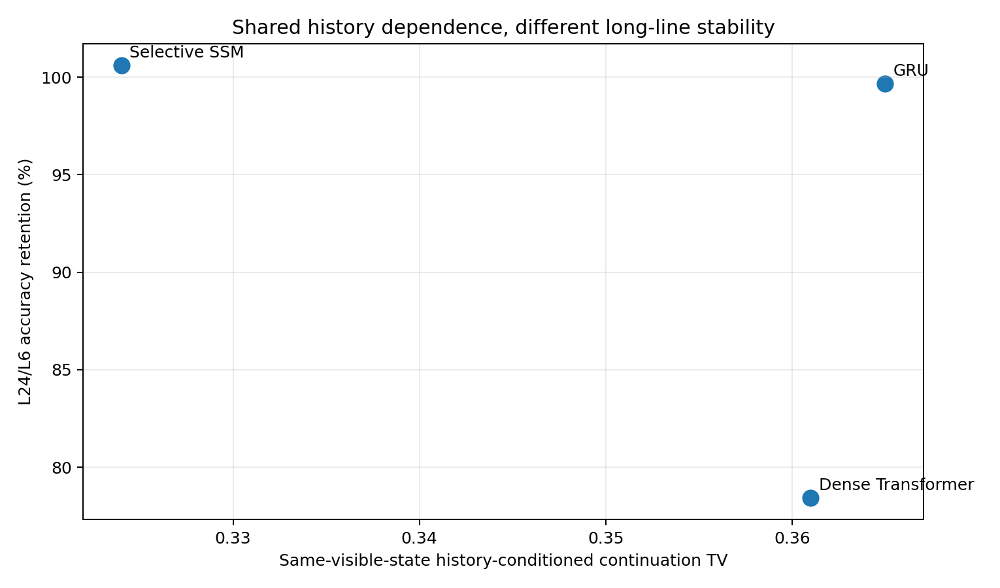
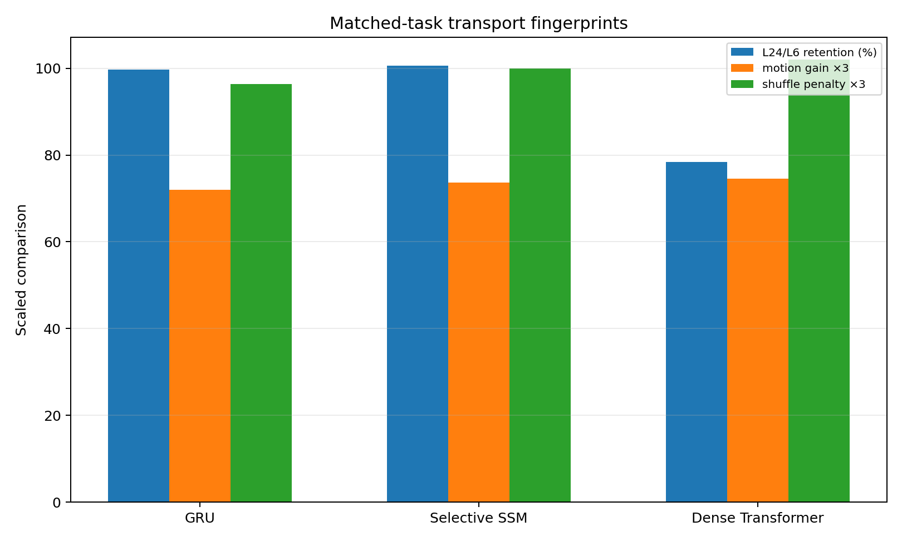
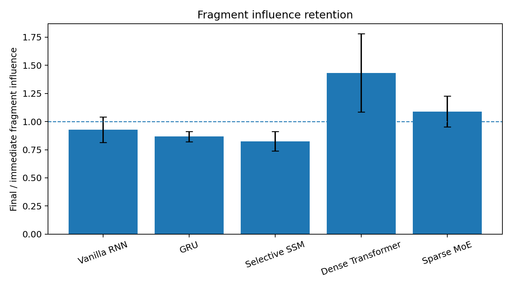
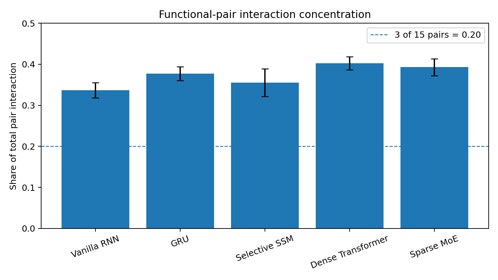
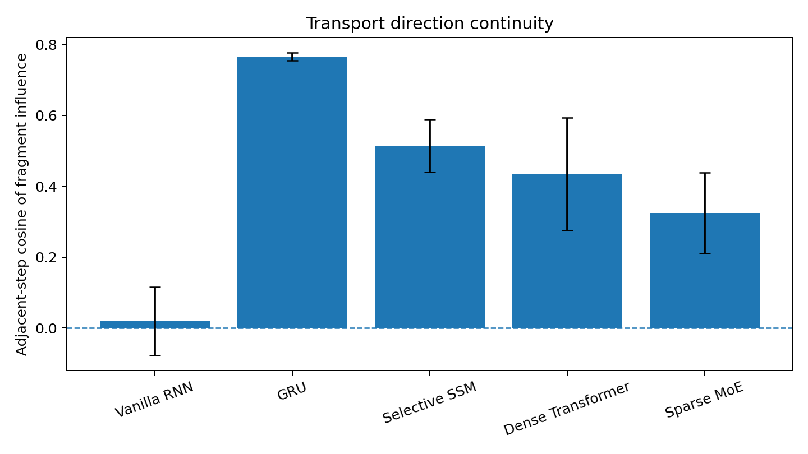
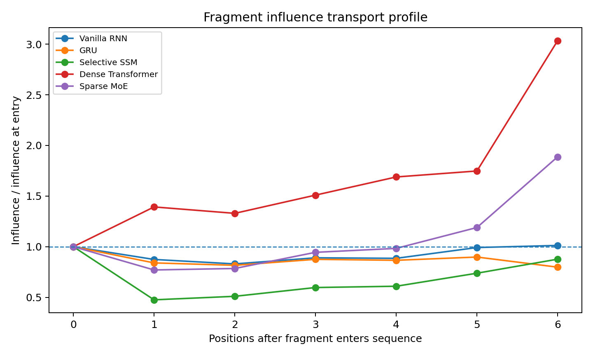

# Information Transport and Assembly Across Architectures

[Chapter 7](../README.md) · [Word report](07_Information_Transport_and_Assembly_Across_Architectures.docx) · [Evidence index](EVIDENCE_INDEX.md)

Data-Oriented Modelling · Chapter 7 · Report 7

## Overview

Different neural architectures can realize the same functional computation through different internal transport mechanisms. We compare those mechanisms using common observables: the persistence of a fragment’s influence, its direction through time and the non-additive interaction between functionally related inputs. The report begins with an existing matched dynamic-task comparison and then tests five standard architecture families on one exhaustively enumerated compositional task. The shared task makes the common interaction visible; the transport measurements reveal how each implementation carries it.

## Question and experimental setting

Which parts of information transport and assembly are shared across architectures, and which measurements distinguish their implementations? The first comparison reanalyses a common history-dependent task in a GRU, selective state-space model and dense Transformer, with three seeds each; a separate sparse-expert study supplies mechanism-level routing evidence. The second experiment trains vanilla RNN, GRU, selective state-space, dense Transformer and sparse-expert Transformer implementations on the same complete 64-state task, again with three seeds per architecture.

## Terms used in this report

**Table 1. Terms used in this report**

| Term | Meaning in the experiments |
| --- | --- |
| Transported influence | The hidden-state difference caused by changing one input fragment. |
| Pair interaction | The non-additive state difference caused by changing a pair of fragments. |
| Retention | Final influence magnitude relative to its magnitude at entry. |
| Direction continuity | Cosine similarity of adjacent influence vectors. |
| SSM | State-space model. |
| MoE | Mixture of experts. |

## 1  A shared history dependent computation

The starting comparison asks what remains common when recurrence, state-space updates and attention solve the same dynamic task. The separate expert-routing evidence is interpreted on its own task.

*Experiment ARCHITECTURE-PRODUCTION-LINES-001*

### Question

Fragments, history-dependent motion and later assembly are not unique to attention-based Transformers. The engineering question is therefore not “which architecture has attention?” but:

What kind of production line does each architecture provide for transporting, transforming, recombining and eventually exposing internally formed pieces?

This first screen deliberately separates two levels of evidence:

- Matched-task core: GRU, selective SSM and a dense causal Transformer trained on the same history-dependent rule-switch world with 24-dimensional internal state and three independent seeds each.

- Mechanism extension: sparse MoE routing experiments that directly expose expert re-selection and local transformation choice, but were run on a different controlled reasoning task.

### Common production line substrate

The matched-task result is strikingly architecture-agnostic. A static hidden snapshot is not sufficient for predicting the next internal state. Adding realized velocity and acceleration reduces next-state prediction error by almost the same amount in all three implementations.

**Table 2. A shared history dependent computation — panel 1 of 2**

| Architecture | L6 acc | L24 acc | Horizon retention | Motion gain from v+a |
| --- | --- | --- | --- | --- |
| GRU | 0.854 | 0.851 | 99.65% | 23.98% |
| Selective SSM | 0.843 | 0.848 | 100.59% | 24.56% |
| Dense Transformer | 0.844 | 0.662 | 78.44% | 24.86% |

Source: ARCHITECTURE-PRODUCTION-LINES-001. The experimental setting and definitions are given in the associated text.

**Table 3. A shared history dependent computation — panel 2 of 2**

| Architecture | Shuffle penalty | History-conditioned TV | History advantage over erased |
| --- | --- | --- | --- |
| GRU | 32.1% | 0.365 | 15.2 pp |
| Selective SSM | 33.3% | 0.324 | 13.3 pp |
| Dense Transformer | 34.0% | 0.361 | 15.4 pp |

Source: ARCHITECTURE-PRODUCTION-LINES-001. The experimental setting and definitions are given in the associated text.

The common signature is therefore:

current state + realized motion history → future continuation, not current static snapshot → future. The original temporal-order shuffle destroys roughly one third of the gain in every architecture. Likewise, when the visible current state and static rules are held identical but formation history differs, all three architectures produce substantially different next distributions (TV about 0.32–0.37). This is the shared “moving workpiece” substrate.

### Production line trait 1 GRU recirculating carrier line

The GRU has no explicit candidate warehouse in this experiment. Task information is transported by repeatedly rewriting one recurrent carrier state. Its most distinctive matched-task property is long-line persistence: accuracy at length 24 retains 99.65% of length-6 accuracy after training only on length 6. A useful mechanical picture is a recirculating carrier: every new item enters the same moving state, and the carrier itself accumulates the history required to choose the next transformation. Earlier CoT experiments on GRUs additionally show that emitted relation tokens can be re-injected as discrete control actions, but that token-control evidence is not needed for the matched-task conclusion here.

Measured trait: strong continuous history transport without an explicit retrieval stage.

### Production line trait 2 selective SSM continuous conveyor with persistent internal stock

The selective SSM shows the strongest length extrapolation in the matched screen: length-24 accuracy is slightly above length-6 accuracy (100.59% retention, within ordinary run variation). Its snapshot-to-motion improvement is almost identical to the GRU and Transformer, and history erasure again collapses the ambiguous paired states to 50% accuracy. The matched dynamic-task evidence supports a persistent continuous carrier: history is maintained in an evolving state-space medium. Fragment interaction is measured separately in the common compositional assay below.

Measured trait: stable continuous transport across long horizons; assembly mechanism unresolved.

### Production line trait 3 dense Transformer warehouse picking plus dynamic assembly

The small one-layer Transformer shares the same history-conditioned dynamics but differs strongly in extrapolation: length-24 accuracy retains only 78.44% of its length-6 accuracy in this pilot. This is not a universal Transformer verdict; it is a trait of this size/task/training regime.

A separate executed controlled-Transformer line supplies the missing production-line anatomy. Attention progressively compresses candidate lists, candidate identity becomes causal, correct fragments develop identity-specific interface locking, and dynamic assemblies form through rotation/translation/non-rigid reconfiguration. The resulting picture is a warehouse/pick-to-assembly line:

context inventory → candidate gating → transport priority → fragment registration → click-in → larger assembly → readout. Measured trait: explicit parallel candidate access and late selective picking, followed by downstream dynamic assembly.

### Production line trait 4 sparse MoE switchyard feeding specialized workshops

Sparse MoE adds a qualitatively different control surface. Continuous state still transports the task, but the router repeatedly chooses which local expert transformations act on that state. Causal routing experiments show that expert identity matters much more than mixture weight: stale expert identity costs 19.66 pp, versus 3.13 pp for stale weights alone, a 6.28x magnitude ratio.

On identical frozen states, native routing beats random expert pairing by 7.80 pp on drift states and 15.06 pp on clean states, yet an oracle adds another 24.31 / 17.01 pp. Across three routing positions, native closed-loop recovery is 43.06%, the global oracle 74.00%, and the anti-oracle only 1.65%.

The best current mechanical description is a switchyard / flexible job shop:

continuous carrier state → router compatibility estimate → expert-workstation selection → residual transform → new carrier state → reroute again. The same workpiece can therefore be sent through different local workshops; early routing changes the state that later routing decisions receive. Measured trait: discrete re-selection of local transformation functions creates recovery opportunities and path-dependent variance.

### What is common and what is architecture specific

The first screen supports a clean separation.

### Architecture agnostic substrate

- the workpiece is dynamic rather than a static representation;

- formation history changes future continuation even when the visible current state is identical;

- realized direction and acceleration contain predictive information beyond the current snapshot;

- temporal order matters.

### Architecture specific logistics

- GRU: transport by recurrent state rewriting;

- SSM: transport by persistent state-space recurrence;

- Dense Transformer: parallel candidate access, explicit candidate gating, then assembly;

- Sparse MoE: recurrent/Transformer-style state transport plus discrete expert-workstation switching.

The existence of “pieces” therefore does not require attention. Attention is one logistics mechanism for selecting and moving pieces, not the source of piece formation itself.

### History conditioned continuation

The older cross-architecture experiment attempted to force a universal two-regime D/C state description. It failed: the GRU and SSM did not show a stable two-cluster advantage. Therefore the production-line program should not search for one universal discrete state vocabulary. The more robust cross-architecture object is history-conditioned motion and continuation.

### Architecture transport fingerprints

**Table 4. A shared history dependent computation**

| Architecture | Carrier | Candidate selection | Local transformation | History task retention |
| --- | --- | --- | --- | --- |
| GRU | Recurrent hidden state | Implicit in recurrent gates | Shared gated update | High |
| Selective SSM | Continuous state-space state | Implicit in selective update | Selective state evolution | High |
| Dense Transformer | Residual token states | Attention over positions | Attention and feed-forward updates | Lower in this small model |
| Sparse MoE | Residual state | Attention and expert router | Selected expert transformations | Separate task and assay |

The shared 64-state assembly assay below includes these four families and a vanilla RNN. The history task and the assembly task measure different quantities.

The table reports measured transport properties in the matched history task. Vanilla RNN behavior is evaluated separately in the common compositional assay below.

### Engineering implication

Architectures should be compared as logistics systems, not only as function approximators. The common product is a dynamically assembled internal object; architectures differ in the machinery used to keep pieces alive, move them, choose among local transforms, and expose the finished configuration to the output interface. Transport, assembly and rework characteristics provide a common vocabulary for describing these implementations.

**Figure 1.** History vs retention. Matched dynamic-task reanalysis with three seeds per core architecture. Motion-history gain and horizon retention belong to that common task; expert-routing extension results are reported separately. Source: ARCHITECTURE-PRODUCTION-LINES-001.

**Figure 2.** Matched transport. Matched dynamic-task reanalysis with three seeds per core architecture. Motion-history gain and horizon retention belong to that common task; expert-routing extension results are reported separately. Source: ARCHITECTURE-PRODUCTION-LINES-001.

## 2  A common compositional task across five architectures

The second experiment gives every architecture the same input fragments and output relations, then measures the resulting computation through input counterfactuals.

*Experiment CROSS-ARCHITECTURE-ASSEMBLY-002*

### Question

Do fragment transport and pair-specific assembly signatures require attention, or do they arise across sequence architectures that use different state-transport mechanisms? The experiment intentionally avoids architecture-specific instrumentation in the primary assay. Every model is evaluated through the same input counterfactuals and hidden-state interaction measures.

### Shared task and models

All models receive the same fixed-length sequence [BOS, A, B, C, D, E, F, QUERY], where A–F are binary fragments. The task contains the complete 64-state universe. Three local relations define an 8-class output: r1 = A XOR B, r2 = C XNOR D, r3 = E OR F, and the target class is the three-bit tuple (r1,r2,r3). All 15 architecture/seed runs reach 100% task accuracy before the mechanism assay.

The five standard architecture families are: Vanilla RNN, GRU, Selective State Space Model, Dense Transformer, and Sparse MoE Transformer. The controlled selective state-space implementation uses input-conditioned state decay/drive blocks; it is a small selective SSM mechanism probe, not a claim about every production SSM implementation. The models are not parameter-matched and this is not a performance leaderboard.

**Table 5. A common compositional task across five architectures**

| Architecture | Parameters | Mean steps to exact fit |
| --- | --- | --- |
| Vanilla RNN | 2,888 | 84.0 |
| GRU | 7,112 | 58.3 |
| Selective State Space Model | 11,528 | 188.7 |
| Dense Transformer | 18,120 | 106.3 |
| Sparse MoE Transformer | 43,536 | 90.7 |

Source: CROSS-ARCHITECTURE-ASSEMBLY-002. The experimental setting and definitions are given in the associated text.

### Architecture agnostic instruments

For fragment i, transported influence at sequence position t is the matched counterfactual difference δᵢ(t) = h_t(x) − h_t(x⁽ⁱ⁾), where x⁽ⁱ⁾ differs from x only by flipping fragment i. For a pair (i, j), non-additive interaction is ηᵢⱼ(t) = h_t(x) − h_t(x⁽ⁱ⁾) − h_t(x⁽ʲ⁾) + h_t(x⁽ⁱʲ⁾); the last input flips both fragments. The three functional pairs are (A, B), (C, D), and (E, F). They are only 3 of the 15 possible pairs, so an indiscriminate interaction field would allocate about 20% of total pair-interaction magnitude to them.

Primary measurements are transport retention, transport profile area, peak delay, adjacent-step direction continuity, final functional-pair interaction share, and functional/nonfunctional interaction ratio. Sparse MoE additionally records native router switching as a secondary architecture-specific channel.

### Fragment specific assembly signatures appear without attention

The central result is that pair-specific non-additivity is present in every architecture, including the three architectures with no attention mechanism. At the final hidden state, the three true functional pairs concentrate substantially more than their 20% combinatorial share:

**Table 6. A common compositional task across five architectures**

| Architecture | Functional-pair share | Functional / nonfunctional interaction |
| --- | --- | --- |
| Vanilla RNN | 33.7% ± 1.8 | 2.03× ± 0.17 |
| GRU | 37.7% ± 1.7 | 2.43× ± 0.18 |
| Selective State Space Model | 35.5% ± 3.3 | 2.21× ± 0.31 |
| Dense Transformer | 40.2% ± 1.6 | 2.70× ± 0.18 |
| Sparse MoE Transformer | 39.3% ± 2.1 | 2.59× ± 0.23 |

Mean ± standard deviation across three seeds. Source: CROSS-ARCHITECTURE-ASSEMBLY-002. Influence ratios and cosines are dimensionless; delay is measured in sequence positions.

Every seed is above the 20% share baseline. The minimum architecture-seed functional/nonfunctional ratio is 1.85×. Therefore this controlled task provides an architecture-agnostic assembly signature: attention is not required for input fragments to develop pair-specific joint effects. Attention can be a transport/retrieval mechanism, but the existence of an interaction-defined assembly is more general.

### Architectures differ primarily in how influence is transported

**Table 7. A common compositional task across five architectures**

| Architecture | Final / entry influence | Mean influence / entry | Peak delay (positions) | Adjacent direction cosine |
| --- | --- | --- | --- | --- |
| Vanilla RNN | 0.927 ± 0.113 | 0.912 ± 0.058 | 1.00 ± 0.73 | 0.019 ± 0.096 |
| GRU | 0.867 ± 0.046 | 0.886 ± 0.026 | 0.56 ± 0.48 | 0.766 ± 0.011 |
| Selective State Space Model | 0.825 ± 0.086 | 0.680 ± 0.018 | 1.06 ± 1.18 | 0.514 ± 0.075 |
| Dense Transformer | 1.433 ± 0.347 | 1.278 ± 0.328 | 1.67 ± 0.76 | 0.435 ± 0.159 |
| Sparse MoE Transformer | 1.090 ± 0.137 | 0.904 ± 0.096 | 2.28 ± 0.63 | 0.325 ± 0.114 |

Mean ± standard deviation across three seeds. Source: CROSS-ARCHITECTURE-ASSEMBLY-002. Influence ratios and cosines are dimensionless; delay is measured in sequence positions.

The same functional computation is therefore implemented by markedly different transport styles. Vanilla RNN preserves influence magnitude reasonably well but repeatedly rewrites its direction (mean adjacent influence cosine near zero). GRU has the smoothest carried influence (cosine 0.766) and the shortest mean peak delay. The selective SSM shows attenuating but moderately continuous state transport. Dense Transformer often amplifies a fragment after its entry (final/entry 1.433) and peaks later, consistent with repeated re-access to earlier tokens rather than carrying a single recurrent state. Sparse MoE Transformer shows still later peaks and lower direction continuity while its top-1 expert identity changes on about half of adjacent token positions.

These are controlled-task fingerprints, not universal architecture laws. They show that the common computation can be realized through qualitatively different transport geometries.

### Gated recurrence and explicit re selection leave different dynamic fingerprints

GRU and Vanilla RNN solve the same task with very different counterfactual motion. GRU preserves the direction of a fragment effect from one position to the next (cos ≈ 0.766), whereas the Vanilla RNN is near zero (≈0.019) despite retaining comparable effect magnitude at the final position. The gate therefore changes the transport geometry even when both recurrent systems reach the same exact output.

Dense and Sparse MoE Transformers both permit later amplification, but Sparse MoE adds a discrete routing surface. Across the three MoE seeds, the top-1 expert changes across adjacent token positions at mean rate 0.496, with mean router entropy 0.763 nats. This supports a clean distinction between continuous fragment influence and discrete local-function re-selection.

### The older history dependent task now reads as an independent production line control

An earlier matched-task experiment used GRU, selective SSM and Dense Transformer on the same history-dependent rule-switch world. There, adding realized velocity and acceleration improved next-state prediction by about 24–25% in all three architectures and temporal shuffling removed roughly 32–34% of the full-motion advantage. GRU and SSM also retained length-24 accuracy after training only to length 6, whereas the small Dense Transformer declined from 0.844 to 0.662. That independent experiment is not merged numerically with the present assembly task, but it supports the same separation: history-dependent motion is common; transport persistence is architecture-specific.

### Production line interpretation

The current evidence supports an implementation-neutral hierarchy. The common object is a moving, interacting internal state. Architecture determines the logistics used to preserve and recombine fragment influence:

- Vanilla RNN: recurrent state transport with strong stepwise re-encoding of influence direction.

- GRU: gated recurrent transport with high directional persistence.

- Selective State Space Model: continuous state-space transport with selective attenuation/drive.

- Dense Transformer: causal token-state transport with direct re-access to prior fragments and later influence amplification.

- Sparse MoE Transformer: Transformer transport plus discrete expert re-selection, adding route-dependent local transformations.

These descriptions summarize measured dynamics in the controlled assays. They are not claims that a whole architecture family has one immutable behavior. A cross-architecture mechanism study should not define the computational object by a module such as attention. The primary observables can instead be architecture-agnostic: fragment influence, transport persistence, non-additive pair interaction, join/split dynamics, continuation stability and readout handoff. Architecture-specific telemetry can then explain how a given system implements those shared operations.

The strongest conclusion from this experiment is therefore: assembly-like joint effects are not a Transformer-specific consequence of attention; different sequence architectures can build the same interaction-defined object using different transport machinery.

### Experimental scope

This is a deliberately small full-universe mechanism task. Exact fit removes task failure as a confound but does not test large-model scaling or unseen-composition generalization. Parameter counts also differ.

**Figure 3.** Final fragment influence divided by influence at entry in the complete 64-state compositional task. Bars are means across three seeds per architecture; error bars are one standard deviation. The dashed line indicates unchanged influence magnitude. Source: CROSS-ARCHITECTURE-ASSEMBLY-002.

**Figure 4.** Fraction of final pair-interaction magnitude assigned to the three functional pairs in the 64-state task. Bars are means across three seeds; error bars are one standard deviation. The dashed 0.20 baseline is the share of functional pairs among all 15 pairs. Source: CROSS-ARCHITECTURE-ASSEMBLY-002.

**Figure 5.** Mean cosine between adjacent counterfactual influence vectors in the 64-state task. Bars are means across three seeds per architecture; error bars are one standard deviation. Zero indicates no average directional continuity. Source: CROSS-ARCHITECTURE-ASSEMBLY-002.

**Figure 6.** Fragment influence relative to its value at entry, plotted against positions since entry in the 64-state task. Curves summarize the three-seed architecture cohorts. The dashed line marks the entry magnitude; later positions contain only fragments with a sufficiently long continuation. Source: CROSS-ARCHITECTURE-ASSEMBLY-002.

## 3  What architecture contributes

Every tested architecture builds interaction concentrated on the task’s functional pairs. Their transport differs in directional persistence, attenuation, delayed amplification and discrete expert re-selection. The common computation can therefore be described with the same influence and interaction measures, while architecture-specific telemetry explains the machinery that implements it.

## Implications for Data Oriented Modelling

A model comparison can begin with the relations required by the data and instruments that apply across implementations. In this finite compositional world, exact task fit supplies a shared starting point for comparing transport and assembly. The resulting fingerprints connect architecture choice to observed computational behavior.

## Experimental sources

- Experiment ARCHITECTURE-PRODUCTION-LINES-001

- Experiment CROSS-ARCHITECTURE-ASSEMBLY-002
