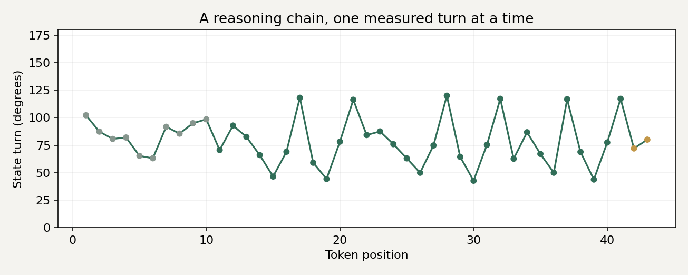
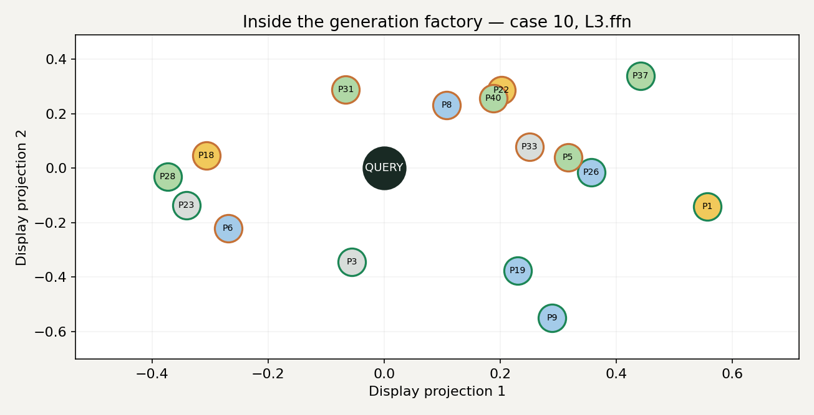

# Chapter 7 — The Internal Factory of Language Models

[All chapters](../README.md) · [Previous: Chapter 6](../Chapter_6_Model_Perception_and_Control/README.md)

How does a model turn moving internal states into an answer? This chapter follows the process from the formation of small computational pieces, through reasoning and output, to candidate routing, local repair and comparisons across architectures.

## Start with two interactive views

[Download both views](https://raw.githubusercontent.com/walkingrui-bot/Data-Oriented-Modelling-Reports/main/Chapter_7_The_Internal_Factory_of_Language_Models/releases/Internal_Factory_Interactive_Views_v1.0_20261004.zip), unzip, and open `index.html`. The HTML pages work offline and contain their own recorded measurements.

### 01 — Watch a reasoning chain take shape

Follow the prompt, reasoning and answer token by token, and inspect the internal turn that accompanies each transition. Eight controlled recurrent trajectories supply 344 measured transitions.

[Reasoning-chain HTML](https://raw.githubusercontent.com/walkingrui-bot/Data-Oriented-Modelling-Reports/main/Chapter_7_The_Internal_Factory_of_Language_Models/interactive/reasoning_chain.html) · [Related report](02_Reasoning_Dynamics_and_Discrete_Output/README.md)

### 02 — Watch the generation factory

Watch source pieces rotate, approach, join an assembly, and leave the candidate pool. Six recorded cases contain 18 internal frames each, leading to a single TEXT/ACT decision. Source-position labels preserve the measured assembly while keeping source text outside the publication.

[Generation-factory HTML](https://raw.githubusercontent.com/walkingrui-bot/Data-Oriented-Modelling-Reports/main/Chapter_7_The_Internal_Factory_of_Language_Models/interactive/generation_factory.html) · [Source-position routing ledger](https://raw.githubusercontent.com/walkingrui-bot/Data-Oriented-Modelling-Reports/main/Chapter_7_The_Internal_Factory_of_Language_Models/interactive/provenance_ledger.html) · [Related report](06_Error_Diagnosis_and_Local_Repair/README.md)

The first interface is a publication replay of the archived CoT measurements. The second retains the archived motion display with English labels. Both show recorded controlled-model experiments; their measurement units and definitions are described in [Source availability](SOURCE_AVAILABILITY.md).

## Seven reports, in reading order

| Report | Title and question | Read |
| --- | --- | --- |
| **01** | **Internal Motion and Assembly in Neural Models** What moves inside a model, how fragments form, and how they assemble into a usable configuration. | [Online](01_Internal_Motion_and_Assembly_in_Neural_Models/REPORT_EN.md) · [Word](01_Internal_Motion_and_Assembly_in_Neural_Models/01_Internal_Motion_and_Assembly_in_Neural_Models.docx) · [Evidence](01_Internal_Motion_and_Assembly_in_Neural_Models/EVIDENCE_INDEX.md) |
| **02** | **Reasoning Dynamics and Discrete Output** How continuous internal computation passes through a discrete token interface, and how each token participates in the next state change. | [Online](02_Reasoning_Dynamics_and_Discrete_Output/REPORT_EN.md) · [Word](02_Reasoning_Dynamics_and_Discrete_Output/02_Reasoning_Dynamics_and_Discrete_Output.docx) · [Evidence](02_Reasoning_Dynamics_and_Discrete_Output/EVIDENCE_INDEX.md) |
| **03** | **How Loss Functions Shape Reasoning** How training objectives shape acceptance regions, approach trajectories and the passage of a complete reasoning chain. | [Online](03_How_Loss_Functions_Shape_Reasoning/REPORT_EN.md) · [Word](03_How_Loss_Functions_Shape_Reasoning/03_How_Loss_Functions_Shape_Reasoning.docx) · [Evidence](03_How_Loss_Functions_Shape_Reasoning/EVIDENCE_INDEX.md) |
| **04** | **Formation and Handoff of Internal Computation** How reusable computational interfaces form, and how causal load moves between states, markers and readout stages. | [Online](04_Formation_and_Handoff_of_Internal_Computation/REPORT_EN.md) · [Word](04_Formation_and_Handoff_of_Internal_Computation/04_Formation_and_Handoff_of_Internal_Computation.docx) · [Evidence](04_Formation_and_Handoff_of_Internal_Computation/EVIDENCE_INDEX.md) |
| **05** | **Attention Coordination and Candidate Routing** How candidate retrieval, head coordination and ranked routing contribute to later assembly. | [Online](05_Attention_Coordination_and_Candidate_Routing/REPORT_EN.md) · [Word](05_Attention_Coordination_and_Candidate_Routing/05_Attention_Coordination_and_Candidate_Routing.docx) · [Evidence](05_Attention_Coordination_and_Candidate_Routing/EVIDENCE_INDEX.md) |
| **06** | **Error Diagnosis and Local Repair** How measured error paths lead to scoped interventions, repair permissions, checkpoint compatibility and maintenance. | [Online](06_Error_Diagnosis_and_Local_Repair/REPORT_EN.md) · [Word](06_Error_Diagnosis_and_Local_Repair/06_Error_Diagnosis_and_Local_Repair.docx) · [Evidence](06_Error_Diagnosis_and_Local_Repair/EVIDENCE_INDEX.md) |
| **07** | **Information Transport and Assembly Across Architectures** Which transport and assembly properties are shared across architectures, and which depend on their implementation. | [Online](07_Information_Transport_and_Assembly_Across_Architectures/REPORT_EN.md) · [Word](07_Information_Transport_and_Assembly_Across_Architectures/07_Information_Transport_and_Assembly_Across_Architectures.docx) · [Evidence](07_Information_Transport_and_Assembly_Across_Architectures/EVIDENCE_INDEX.md) |

Reports 01–04 establish the account of internal computation. Report 05 studies candidate selection and coordination; Report 06 follows diagnosis through maintenance; Report 07 compares the resulting mechanisms across architectures. Each report is a complete study with its own question, experimental setting and interpretation.

## Download and inspect the evidence

The chapter contains **seven English Word reports, 136 embedded figures and 71 tables**, together with **652 numerical evidence files from 49 experiment packages**. The online reports retain the same report text and figure sequence as the Word editions.

[Complete publication package](releases/Internal_Factory_Publication_v1.0_20261004.zip) · [Numerical evidence and report tables](releases/Internal_Factory_Evidence_v1.0_20261004.zip) · [Interactive views](releases/Internal_Factory_Interactive_Views_v1.0_20261004.zip)

[Evidence index](EVIDENCE_INDEX.md) · [Experiment map](Experiment_Map.csv) · [Figure index](Figure_Index.csv) · [Table index](Table_Index.csv) · [Measurement manifest](Evidence_Manifest.csv) · [SHA-256 checksums](SHA256SUMS.txt)

## Connections to the earlier chapters

[Chapter 2](../Chapter_2_Language_Models_Motor_Control_and_Deep_Space_Drift/README.md) develops the control view of language-model dynamics. [Chapter 3](../Chapter_3_Machine_Learning_Epidemiology/README.md) supplies the experimental diagnosis approach. [Chapter 5](../Chapter_5_Data_Oriented_Modelling/README.md) connects measured mechanisms to modelling choices. [Chapter 6](../Chapter_6_Model_Perception_and_Control/README.md) follows perception and action control. This chapter examines the internal computation that supports those processes.

Some hypotheses developed in this research have received substantive validation through engineering implementations. Data models are forthcoming.
