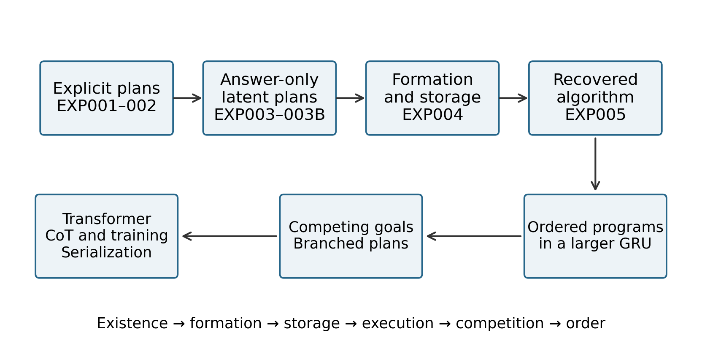
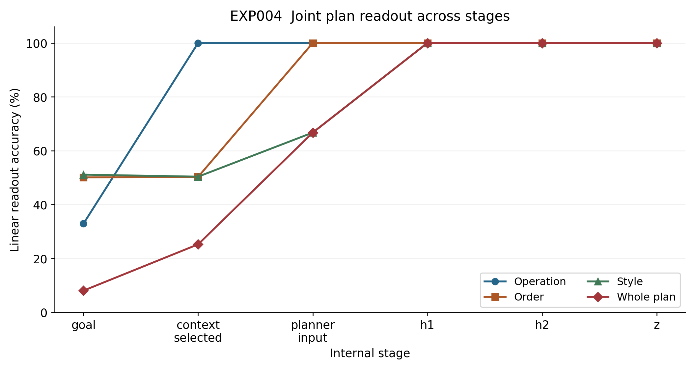
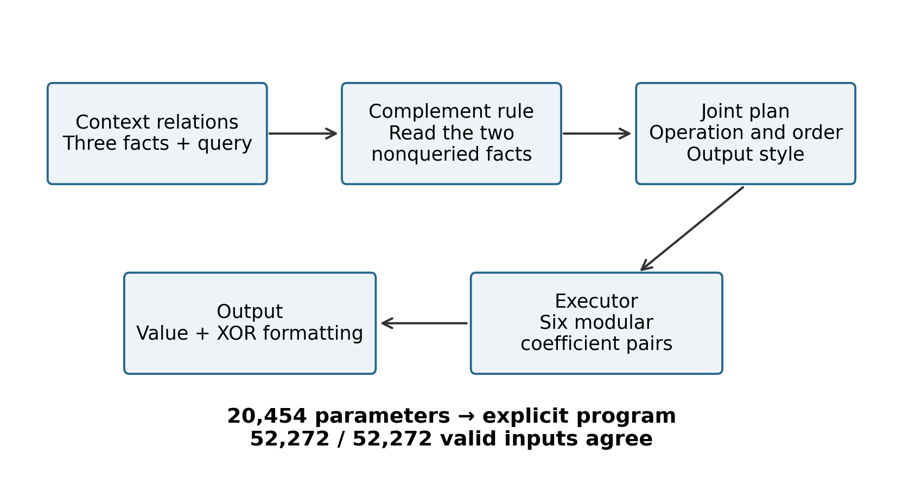
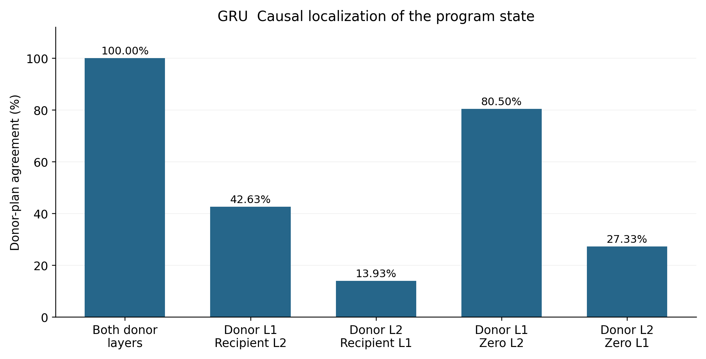
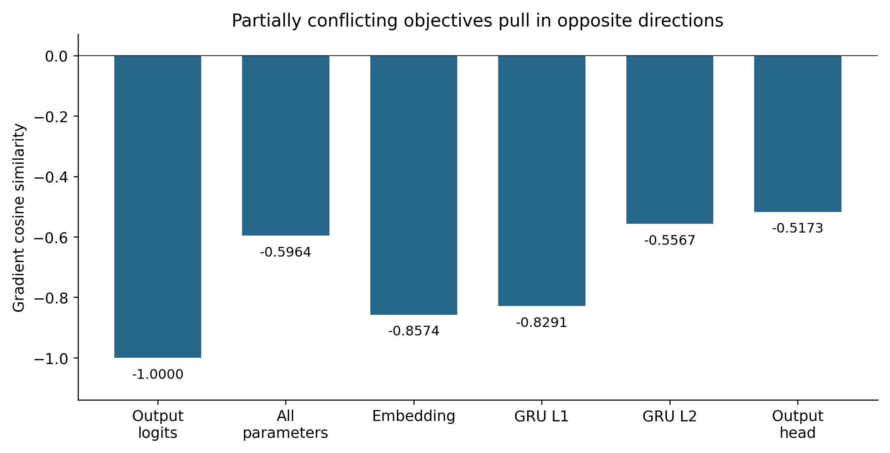
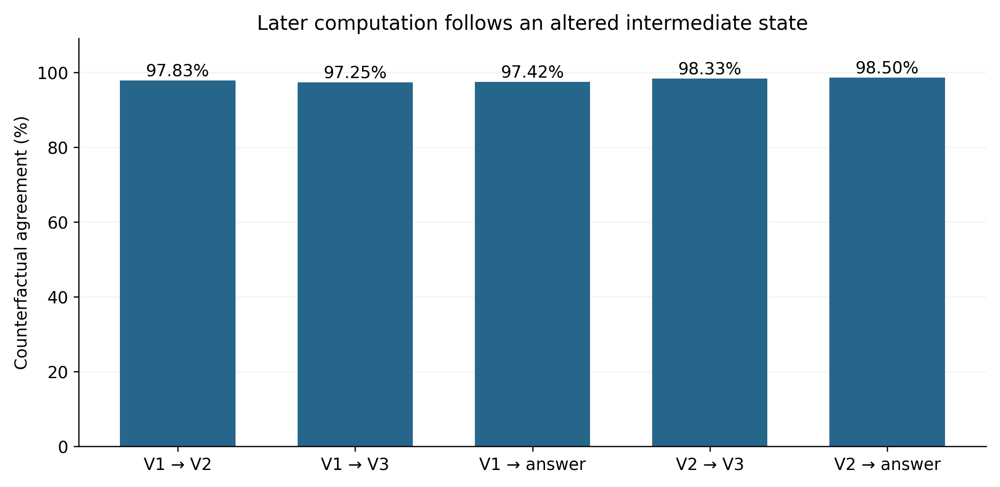
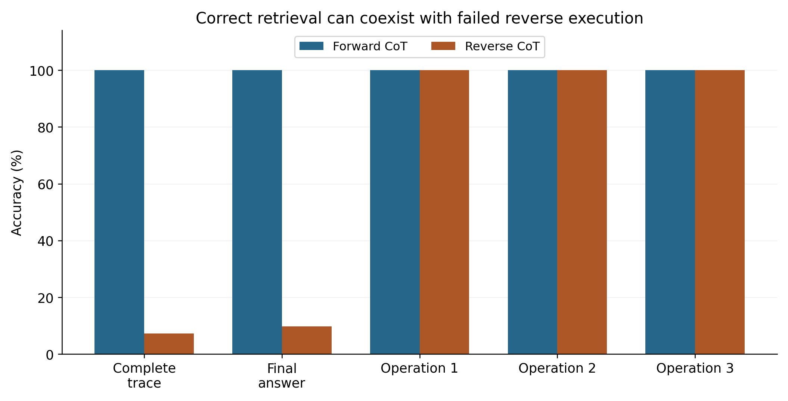
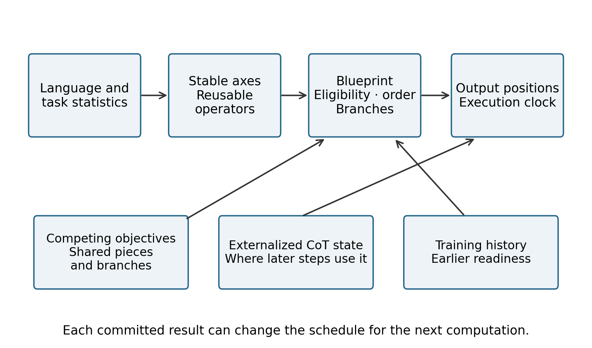

# From Blueprint to Algorithm

## How Neural Networks Generate Answers

Chapter 8 of Data Oriented Modelling  
A synthesis of executable plans, recovered algorithms, competing objectives, chain of thought and training order

English edition v1.0 · 6 October 2026

Chapter 8 synthesizes the earlier language-model studies and their supporting evidence, from internal motion and answer recovery to computational assembly and control. It asks how a model turns context into the operations that generate an answer. The controlled experiments identify executable plan states, recover explicit algorithms, and show how output order and training history shape execution.

The evidence for the present explanatory sequence has now been assembled into a coherent, relatively detailed account. This chapter closes that research chain at its current evidential scope. Future findings and remaining gaps will be added to the corresponding topical chapters and linked back to this synthesis.



Figure 1. The research sequence, from testing whether an executable blueprint exists to measuring how training history changes execution order. This is a conceptual map of the experiments in this report; it does not plot measured quantities.

In the controlled networks studied here, answer generation can be decomposed into a sequence of computational events. Context forms an executable blueprint, represented as ordered operations or a distributed program state. Autoregressive output positions schedule the available components. In sequentially dependent tasks, chain-of-thought tokens record intermediate states that subsequent computation reads again. Competing objectives preserve shared components while branching execution, and early training can move particular operations to the front of the schedule.

## Overview

This research began with a missing piece. We could observe a model moving, rotating and combining its internal components, but we could not yet explain why it knew what to do next. We provisionally called the missing object a blueprint. Starting with small, controllable systems, we turned that idea into an object that could be executed, transplanted, altered and, eventually, replaced by an explicit algorithm.

The experiments recovered something closer to a computation schedule than a static draft of an answer. It specifies which operations are available, which logical positions they belong to, which are ready to execute and how they unfold. As output is produced, the updated context continues to reshape the schedule.

#### How to read the evidence

The earlier Internal Factory of Language Models sequence studied rotation and translation, fragmented computation, complete future trajectories, loss shaping, CoT length, recovery in later layers and training history. Those studies supplied behavioral, geometric and intervention-based evidence about mechanisms. This report brings the central hypotheses into controlled computational systems: we identify and transplant blueprint states, alter intermediate values, measure curriculum effects and recover explicit programs whose outputs can be compared with the networks. Correspondence with larger language models remains a mechanistic interpretation across scales.

- Explicit calibration. Twelve discrete plans can be generated reliably from context, including a rule permutation held out from training.

- A blueprint learned from answers alone. Without blueprint labels during training, an eight-dimensional hidden state supports 100% readout of operation, argument order and output style. On transplantation to a new numeric payload, the executor follows the donor plan in 100% of the tested cases.

- Where the plan becomes jointly readable. Full-plan linear readout rises from about 67% to 100% after the first nonlinearity. The final code is distributed across coordinates; it is not confined to a single blueprint neuron.

- Algorithm recovery. An explicit program reproduces the outputs of the 20,454-parameter network on all 52,272 inputs in its complete valid finite domain.

- A larger recurrent network. A two-layer GRU with 187,069 parameters, trained on one final-answer objective, forms an ordered three-slot program [op1 | op2 | op3]. Its first-layer state at the end of the context is the principal storage site.

- Competing objectives. Two partially conflicting targets leave shared components intact while branching the execution plan. Their gradients point in opposing directions, and the model retains competing output branches with probabilities close to 0.5 each.

- Transformer execution. The complete operation table is readable at the end of the context, while the components causally used in execution remain distributed across the context facts. Successive output positions retrieve E0, E1 and E2, providing an execution clock.

- Chain of thought as state. When an intermediate value is forcibly changed, approximately 97–98% of downstream computations follow the altered state in the sequential task. Here, intermediate tokens carry external computational state.

- Training order. When the final loss accepts both A→B and B→A, 10, 30 or 70 early A-only training steps move the final A-first rate from 32% to 72%, 100% and 100%. Early B-only training produces the corresponding preference for B.

- Serialization policy. When later computation genuinely depends on an earlier state, reasoning→answer training places the causal prerequisite first in all three tested initializations. The early operator has mean entropy about 0.028; the later conditional operator has mean entropy about 0.142, on the scale reported in the experimental record.

- Language and computational state. Interventions on markers and values show that tokens which describe or route computation can have different causal roles from tokens carrying its state. What a CoT sequence says therefore cannot, by itself, establish which computation has been completed.

The strongest direct causal evidence in this report comes from fully controlled small and medium-sized experimental networks. These systems provide reproducible examples of mechanisms and specific coordinates for interpreting larger-model behavior. The larger-model correspondences are retained at their stated evidential level.

### Terms used in the report

**Blueprint.** an internal plan or schedule that specifies subsequent computation.

**Payload.** the numbers or other contents on which that plan operates.

**Execution eligibility.** whether an operation is ready or selected to execute in the current state.

**Linear readout.** prediction of a target label from a frozen internal state using a linear probe.

**Counterfactual transfer.** whether an intervention makes the output match the deliberately substituted plan or state.

**Abbreviations.** CoT means chain of thought; GRU means gated recurrent unit; R2A means reasoning before answer; A2R means answer before reasoning. SEP is the context separator, E0–E2 are logical operation slots, and V1–V3 are intermediate values.

### Reading guide

- Calibrate a blueprint with known structure, then construct it from relations in the current context.

- Remove blueprint supervision and test whether an executable plan still develops.

- Locate its formation, from separate ingredients to joint readout and distributed storage.

- Recover the operators and replace the network behavior with an explicit algorithm.

- Test whether a larger network forms an ordered program.

- Introduce competing objectives and examine shared components and branching execution.

- Study the relationship between the Transformer blueprint, output order and CoT.

- Measure how early training changes the order in which operations become executable.

- Reconnect the results to earlier language statistics and the drawing analogy.

- Bring together the execution model, failure types and interpretation of token replay.

- Review the earlier hypotheses against the direct evidence and close the present research sequence.

## 1 Compiling context into an executable blueprint

We began with a modest definition. After reading context, a model may form an object that determines how it will carry out the remaining task. Such an object should at least specify an operation, an argument order and an output style. In a small enough task, its possible values should be enumerable and executable. Shuffling the presentation of semantically equivalent context should preserve the plan.

#### EXP001 Explicit blueprint calibration

We first constructed a small world in which a blueprint was guaranteed to exist. A model with 11,323 parameters receives 2,880 synthetic contexts and generates a three-slot plan: OP, ARG_ORDER and STYLE. There are only 3 × 2 × 2 = 12 possible plans, so the complete conditional distribution p(B | C) can be enumerated exactly.

**Table 1. Explicit blueprint calibration**

| Measure | Result |
| --- | --- |
| OP / ORDER / STYLE accuracy | 100% / 100% / 100% |
| Whole-plan accuracy | 100% |
| Same semantic context shuffled 100 times | 100% retain the same correct plan |
| Correct-plan probability in the illustrated example | 0.9833 |
| Posterior entropy in that example | 0.1417 bits |

Source: TINY_BLUEPRINT_EXP001_REPORT.md. Synthetic contexts; 80/10/10 training, validation and test split. Accuracy is the percentage of correct slot or whole-plan predictions on the test set. Probability and entropy refer to one illustrated example. Presentation-order invariance is built into the encoder.

EXP001 establishes a calibration instrument. If a blueprint is an executable object, this task tells us how to measure it. It also replaces the loose question of what the model intends to say with a discrete operation that can actually be run. Presentation-order invariance is built into this encoder; the shuffle test checks that property rather than demonstrating a learned invariance.

A plan copied from a fixed rule-ID lookup would still leave the interesting question open. Can the model construct the plan when the current rules arrive as relations in the context itself?

#### EXP002 Constructing the plan from current relations

We removed the fixed rule ID and supplied three shuffled (goal→operation) relations. Training uses four rule permutations, validation uses one, and the test set uses the unseen permutation (2, 1, 0).

**Table 2. Context-built plans on the held-out rule**

| Measure | Held-out rule result |
| --- | --- |
| OP / ORDER / STYLE accuracy | 100% / 100% / 100% |
| Whole-plan accuracy | 100% |
| Mean attention mass on the fact matching the queried goal | 0.9999 |
| Correct-plan probability in the illustrated example | 0.9767 |

Source: TINY_BLUEPRINT_EXP002_CONTEXT_BUILT_REPORT.md. The test permutation is (2, 1, 0). Attention mass and probability are unitless; accuracies are percentages. The probability is from one illustrated example.

The blueprint is now constructed from current context relations. When those relations change, the plan changes with them. In this calibration task, the model can assemble a correct plan for a rule permutation absent from training.

## 2 A blueprint learned without blueprint labels

An intermediate label imposed by the experimenter does not show that an ordinary training objective needs such a representation. We therefore removed blueprint supervision altogether. The model receives context and final-answer targets, and must organize its intermediate computation for itself. We identify an internal plan by its ability to control future execution, with readout serving as a supporting measurement.

#### EXP003 Testing an unseen rule permutation

The 20,454-parameter network is divided into a planner, an eight-dimensional bottleneck and an executor. The executor cannot see the rules, queried goal, order bit or style bit. It receives only the latent state z and the numeric payload. Training supplies no blueprint labels. The first version also tests a rule permutation completely absent from training.

**Table 3. Initial latent-plan test with rule holdout**

| Measure | Result |
| --- | --- |
| Held-out exact-answer accuracy | 53.17% |
| Operation readout | 61.67% |
| Order / style readout | 100% / 100% |
| Donor z transplanted to a new payload | 52.00% follow the donor plan |

Source: the final source manuscript, EXP003 section. These preliminary values were retained as reported; a separate EXP003 result file was not recovered for this edition. Readout and transplant agreement measure different outcomes.

This experiment detects partial plan structure but also tests the harder problem of generalizing a relation pattern. Order and style are fully recoverable from the bottleneck; operation identity transfers only partially to the held-out rule. To isolate whether answer supervision can produce an executable internal plan, we next separate that question from unseen-rule generalization.

#### EXP003B Isolating the executable latent plan

The architecture remains unchanged, but training now covers the current rule family. Testing uses fresh contexts and payloads. The network still learns only from final answers. Blueprint labels are introduced after training solely to fit readout probes.

**Table 4. Answer-only latent plans and intervention controls**

| Measure or intervention | Result |
| --- | --- |
| Exact final-answer accuracy | 100% |
| Operation / order / style readout from z | 100% / 100% / 100% |
| Complete 12-state blueprint readout | 100% |
| 3,000 donor-z and recipient-payload transplants | 100% follow the donor plan |
| Set z to zero | 2.70% exact-answer accuracy |
| Randomly exchange z and score against the original answer | 12.58% |
| Score the same exchanges against donor-plan counterfactual answers | 100% |

Sources: TINY_BLUEPRINT_EXP003B_LATENT_BLUEPRINT_REPORT.md and TINY_BLUEPRINT_EXP003B_CONTROLS.md. Training covers the rule family; evaluation uses fresh contexts and payloads. Transplant agreement compares the output with the donor plan applied to recipient numbers. Other rates use the scoring target stated in the row.

The decisive test is easy to picture: take the eight-dimensional state out of one problem and install it in another. What transfers is the procedure for handling new numbers. The state does not merely carry the original answer; its computational meaning is established by what it makes the executor do.

This gives blueprint a precise operational meaning. It forms before the answer, carries rules for future execution, and changes that execution when replaced. The transplant establishes causal control; the probe tells us what can be read from the state.

## 3 Where the blueprint becomes jointly readable

If context is progressively compiled into a plan, we should be able to follow the transition from separate ingredients to a jointly readable object. The earlier language of rotation, translation and recombination also invites a sharper question: which mathematical operation makes the complete plan explicit?

#### EXP004 Readout and transplantation across stages



Figure 2. Linear readout accuracy across stages of the answer-only planner in EXP004. Operation, argument order, style and the complete 12-state plan are probed separately. The complete plan first reaches 100% at h1. Points are recorded accuracies, joined to show stage order; they are not estimates across repeated training runs, and no error bars are reported. Values are also given in Table 5.

**Table 5. Linear readout across planner stages**

| Stage | Operation | Order | Style | Whole plan |
| --- | --- | --- | --- | --- |
| goal | 32.90% | 50.08% | 51.10% | 8.03% |
| context_selected | 100% | 50.27% | 50.35% | 25.22% |
| planner_input | 100% | 100% | 66.72% | 66.72% |
| h1 | 100% | 100% | 100% | 100% |
| h2 | 100% | 100% | 100% | 100% |
| z | 100% | 100% | 100% | 100% |

Source: TINY_BLUEPRINT_EXP004_FORMATION_LOCALIZATION.md. All entries are percentage accuracy of frozen-model linear probes. Whole-plan readout classifies 12 plans. These are readout scores, not transplant scores.

Transplanting the complete donor state at planner_input, h1, h2 or z makes all tested downstream answers follow the donor blueprint. Causal control is therefore already present at planner_input, before the full plan reaches perfect linear readability. From h1 onward, perfect readout and perfect donor-plan transfer coexist. These measurements distinguish when information becomes linearly explicit from when it can already control later computation.

#### EXP004C Localizing the formation operator

The first planner stage computes pre1 = Linear(c0), followed by h1 = tanh(pre1). Complete-plan readout is 66.72% at c0 and 67.83% after the affine transformation; after tanh it reaches 100%. Style readout also rises from 66.72% to 100%.

In this trained network, the first nonlinearity makes the separate conditions linearly explicit as a joint plan. Its local Jacobian is J(x) = diag(1 − tanh²(Wx + b))W. A shared affine transformation is followed by input-dependent gains that change how directions contribute. The result locates a change in representational accessibility; it does not imply that information is created from nothing at h1.

#### EXP004B Distributed storage and complementary inference

The final eight-dimensional z shows differentiated but mixed roles. Operation has η² ≈ 0.915 at z4, style has η² ≈ 0.939 at z0, and argument order has η² ≈ 0.789 at z3. Replacing a single coordinate by its mean can sharply reduce exact-answer accuracy: ablations of z0, z5 and z2 reduce it from 100% to 61.22%, 64.45% and 68.62%, respectively. The strongest factor association and the largest ablation effect need not occur at the same coordinate.

Attention produces a more surprising result. When queried about G0, the model mostly reads G1 and G2; for G1 it reads G0 and G2; for G2 it reads G0 and G1. The queried row receives only about 3% of the attention mass. Causal interventions confirm the pattern: none of 144 changes to the queried row changes behavior, whereas changes to a nonqueried row alter the program in 97.9% of interventions.

Formation and storage are different locations. The complete plan becomes jointly readable at h1, is reorganized at h2, and is compressed into z. Its final representation is distributed. More strikingly, the model has learned complementary inference: the other two relations identify the missing operation. We never instructed it to ignore the queried row, yet that is the procedure it uses in this task.

## 4 Recovering the algorithm from the network

The earlier descriptions of internal pieces rotating and moving can be connected to explicit mathematics. An affine layer computes Wx + b: b translates the state, while W changes its directions and scales. For a rectangular matrix, a singular-value decomposition expresses this as orthogonal changes of coordinates and scaling or projection; other decompositions can expose shearing. We can therefore ask which operator is applied, and whether the sequence of operators can be recovered as a runnable program.

#### EXP005 Neural algorithm decompilation



Figure 3. The explicit algorithm recovered from the 20,454-parameter network in EXP005. The planner infers the missing operation from the two nonqueried facts. The executor uses one of six modular coefficient pairs, followed by an XOR formatting rule. The archived exhaustive comparison reports exact two-token agreement on all 52,272 valid inputs. This diagram summarizes a recovered program rather than a statistical estimate.

- Causal tests identify the planner's complement rule. Changing the queried fact changes behavior in 0% of interventions. Changing another fact changes behavior in 97.92%, affecting an average of 73.28% of payload outputs.

- Exhaustive enumeration of the executor yields six modular linear forms. For example, operation 0 with order 0 computes (x + 2y) mod 11; operation 2 with order 1 computes (x + 4y) mod 11.

- Output style follows style_bit XOR [goal == 2].

- The first affine map has shape 64 × 72 and numerical rank 64. Its first 18 singular directions account for 90% of its Frobenius energy.

- An explicit program containing no neural-network weights agrees exactly with the trained network on all 52,272 inputs in the complete valid finite domain.

```text
other_ops = [op for (goal, op) in facts
             if goal != query_goal]
operation = missing({0, 1, 2}, other_ops)
(a, b) = COEFF[(operation, order_bit)]
value = (a*x + b*y) mod 11
style = style_bit XOR [query_goal == G2]
```

Here, interpretation becomes algorithm recovery: the parameterized behavior is replaced by an independently executable program. The recovered procedure also need not match the procedure used to generate the training data. A network can solve the same rule with a different internal algorithm that is behaviorally equivalent on the valid domain.

## 5 An ordered program in a larger recurrent network

The small system exposes operation, order and style, but it is deliberately constrained. We therefore move to a two-layer GRU with 187,069 parameters. It has one training objective: read three relation facts in shuffled order and predict the final scalar after three operations. No operation-slot, intermediate-state or blueprint labels are supplied during training.

#### Single objective GRU

- Final-answer accuracy is 100% over the complete finite domain of 4,992 cases.

- After the first fact, its logical operation slot is 100% linearly readable, while unread slots remain near chance. After two facts, both observed slots are fully readable. After all three, the complete 64-way program [op1 | op2 | op3] is 100% readable.

- Independent contributions from the three slots explain 93.15% of the first-layer hidden geometry and 86.27% of the second-layer geometry.

- Changing one operation through its corresponding slot direction in both recurrent layers makes 98.77% of outputs match the counterfactual program.

- The recovered non-neural program agrees with the network on all 4,992 valid cases.



Figure 4. Causal localization of the GRU program at the end of the context, before the recipient payload is processed. Bars give donor-plan agreement after replacing the stated recurrent layers with donor or zero states. Both donor layers yield 100%; donor L1 with recipient L2 yields 42.63%; donor L2 with recipient L1 yields 13.93%; donor L1 with zero L2 yields 80.50%; donor L2 with zero L1 yields 27.33%. The archived measurements identify L1 as the main store, while perfect transfer requires the coordinated two-layer state. No uncertainty intervals are reported.

The blueprint now has the form of a three-slot program table, [op1 | op2 | op3]. The first layer is its main store; the second contains a fully readable copy expressed in a form coordinated with execution. The network has separated the presentation order of facts from their logical execution order.

## 6 Shared components under competing objectives

A single objective can encourage one committed program. Larger-model observations, however, repeatedly show reusable pieces, local assembly and competition later in processing. One possible mechanism is that partially overlapping objectives make shared components more stable than any one complete execution sequence.

#### Control with distinguishable tasks

When A and B are identified by explicit task cues, a shared network can route conditionally. Both tasks reach 100%, and their training gradients are positively aligned. Having two tasks alone therefore does not establish destructive competition.

#### Partially conflicting targets on the same input

We then give the same input and output head two targets: A executes E0→E1→E2, while B executes E0→E2→E1. They share the first step and all three operations, differing only in the order of the last two. Their final answers coincide in 25% of cases and conflict in 75%.



Figure 5. Gradient cosine similarity between the two target losses on examples with conflicting answers. Values are approximately −1.0000 for output logits, −0.5964 for all parameters, −0.8574 for embeddings, −0.8291 for GRU L1, −0.5567 for GRU L2 and −0.5173 for the output head. Negative values indicate opposing update directions. Source: PARTIAL_CONFLICT_BLUEPRINT_ANALYSIS.json. These are recorded measurements without reported uncertainty intervals.

**Table 6. Shared slot structure and competing branches**

| Measure | Result |
| --- | --- |
| Both A and B in the top two on conflicting cases | 100% |
| Mean p(A) / p(B) | 0.4989 / 0.4987 |
| Layer 1 additive slot R² from single to conflicting objectives | 0.9315 → 0.9212 |
| Layer 2 additive slot R² from single to conflicting objectives | 0.8627 → 0.8176 |
| Both donor branches retained after context-state transplantation | 100% |
| Both counterfactual branches recovered after shared-slot editing | 98.75% |

Sources: TWO_GOAL_BLUEPRINT_COMPETITION_REPORT.md and PARTIAL_CONFLICT_BLUEPRINT_ANALYSIS.json. Probabilities and R² are unitless. Top-two rates score both competing outputs; the target probabilities are measured on conflicting examples. The causal edit rate scores both counterfactual branches.

The blueprint is not erased. The shared operation table remains relatively stable, while commitment to one execution order branches. The single-objective network produces a committed plan; the partially conflicting network retains competing plans. This offers a specific candidate mechanism for fragmented execution in larger models: training can preserve reusable pieces while deferring the choice of execution order to later competition.

## 7 Transformer output positions and execution order

A GRU has a recurrent state that can act like a central register. A Transformer instead has a context stream, attention and an autoregressive token sequence. We therefore use a three-block causal Transformer with 116,512 parameters to compare direct answers, forward CoT and reverse CoT, together with internal activation patching. The question is how the plan, output positions and intermediate states work together.

#### Readable plans can precede successful execution

In the direct-only model, the final-layer state at SEP supports E0, E1 and E2 readout of 100%, 99.82% and 100%. In the early Direct-first curriculum phase, all three slots are already 100% readable after the first block, yet actual direct-answer accuracy is only about 16%. The corresponding Trace-first phase already produces complete traces with 100% accuracy.

These measurements separate plan formation from execution. The operation table can already be available while the model is still unable to combine all three steps into a reliable final answer.

#### A readable summary and its causal storage

Donor and recipient problems differ in exactly one operation slot. Replacing the recipient SEP activation with the donor activation does not transfer the future program. Replacing the changed fact at the earliest layer does: the changed slot follows the donor in 100% of cases, the other slots retain their recipient values in 100%, and the complete trace and final answer also follow the donor in 100%.

The Transformer blueprint therefore has a different storage organization from the GRU's final recurrent state. SEP makes the whole plan readable, but the components used causally in execution remain distributed in the context and fact stream.

#### Output positions schedule retrieval

In forward CoT, attention from successive execution markers has a clear rhythm. In the first block, S1 mainly retrieves E0, S2 retrieves E1 and S3 retrieves E2. Each corresponding operation token is correct in 100% of the recorded cases.

**Table 7. Attention from execution markers to logical facts**

| Output position | Attention to E0 | Attention to E1 | Attention to E2 |
| --- | --- | --- | --- |
| S1 | 0.472 | 0.159 | 0.038 |
| S2 | 0.016 | 0.274 | 0.027 |
| S3 | 0.046 | 0.032 | 0.436 |

Sources: TRANSFORMER_BLUEPRINT_COT_DECOMPILATION_REPORT.md and TRANSFORMER_ATTENTION_EXECUTION_ROUTING.json. Values are mean first-block attention mass, without units. Rows need not sum to one because other context positions can receive attention. Attention patterns are interpreted together with the separate causal tests.

The recovered execution loop retrieves the current operator, transforms the current value, writes the new state as a token and reads it again at the next position before retrieving the following operator. The blueprint supplies the operation logic; autoregressive position supplies the clock.

#### Intermediate CoT values can carry computational state

We directly replace a correct intermediate value with a false one. If the sequence were used only as an explanation, later computation could return to the original answer. If the emitted value is used as state, subsequent operations should continue from the substituted value.



Figure 6. Counterfactual state propagation in the sequential Transformer task. After replacing V1, the next V2, downstream V3 and final answer follow the counterfactual state in 97.83%, 97.25% and 97.42% of cases. After replacing V2, V3 and the final answer follow it in 98.33% and 98.50%. The original context and program remain available. Source: TRANSFORMER_COT_STATE_INTERVENTION.json. Rates measure agreement with the counterfactual continuation; no uncertainty intervals are reported.

Replacing V1 makes V2, V3 and the final answer follow the counterfactual state in 97.83%, 97.25% and 97.42% of cases. Replacing V2 changes V3 and the final answer accordingly in 98.33% and 98.50%.

CoT is therefore part of an evolving computation in this task. Each emitted value is a visible result of earlier execution and immediately becomes input to later execution. An output both reveals a completed step and changes the state from which the next step proceeds.

#### Why reversing the trace disrupts execution



Figure 7. Forward and reverse CoT after the same 14-epoch, batch-512 training schedule. Both traces contain the same operations and intermediate values and receive the same number of supervised tokens. Forward generation reaches 100% exact traces and answers; reverse generation reaches 7.29% and 9.75%, while operation identity remains 100% correct at all three positions. These are results on the trained program domain, distinct from the compositional holdout. Source: TRANSFORMER_BLUEPRINT_COT_DECOMPILATION_REPORT.md and TRANSFORMER_REVERSE_TRACE_DIAGNOSIS.json. No uncertainty intervals are reported.

The forward and reverse traces contain identical operation identities and intermediate values, with equal supervised token counts. After 14 epochs, forward CoT gives 100% exact traces and final answers. Reverse CoT gives only 7.29% exact traces and 9.75% final answers, although all three operation tokens at S3, S2 and S1 remain 100% correct.

The reverse model fails mainly on values. It first emits V3 correctly in 9.75% of cases, then V2 in 15.41%, and finally V1 in 38.11%. Attention correctly reverses the retrieval order to E2, E1 and E0. It knows which operator to retrieve, but is asked to produce a future state before its causal prerequisites have been written into the external sequence.

This gives a concrete account of why CoT helps here. It decomposes a composition of functions into local one-step transitions and writes each result back into autoregressive context. Direct generation is also learnable: with approximately the same optimizer-update budget, the direct-only model reaches 98.29% on the seen domain. It must, however, complete the composed calculation internally before emitting one result.

#### When language exposes an unfinished transition

A sentence in a CoT sequence should not automatically be treated as a completed judgment that the model has settled on. A possible interpretation of the controlled findings is that computational pieces are still turning, combining and settling while the output interface continues to demand tokens. The language head may project whatever is available at that instant: committed answer components, an emerging next operation, and an unsettled transition. In more vivid terms, the workshop is halfway through the job when the front desk is asked to describe what is on the bench. An odd sentence need not correspond to an equally complete odd judgment inside the model.

The proposed trajectory is a stable state S_k, a changing transition region T_(k→k+1), and a new stable state S_(k+1). Some token spans may report completed state commitments; others may sample the transition. On this account, awkward wording and an incorrect computational trajectory are different events. What controls the future is which states have been committed and which operations are ready to execute.

The marker-versus-state intervention supports distinguishing token roles. Both labels and externalized values matter causally, but a wrong marker paired with the correct value preserves the complete correct continuation in 28.43% of cases. A correct marker paired with a wrong value preserves it in 20.59%; when both are wrong, the rate falls to 8.82%. These results motivate separating routing or commitment tokens, state-bearing tokens and weaker descriptive tokens, rather than assigning every keyword the same computational role.

The unfinished-transition account also makes a prediction about the earlier CoT-length findings. If forced continuation moves the model into the onset of another operation, internal rearrangement and branch competition should intensify. Cutting the sequence or forcing language output at that point may expose a mixture of answer and transition state. Alignment between accuracy troughs and peaks in hidden-state displacement, attention redistribution, branch entropy or changing operator confidence would provide a direct test. That precise alignment remains a prediction rather than a measured result in this report.

## 8 Training history and the order of execution

An earlier intuition was that the model draws the most certain structure first. An operation repeated and reused early in training may become ready to execute earlier. When a later task permits several correct orders, that operation may consequently be placed near the front of the plan.

#### A final task that accepts either order

The task has two independent branches. A uses a fixed, frequently reusable affine operator; B selects from a family of four operators according to context. The final answer requires both, and the final loss accepts both A→B and B→A. Every dose condition starts from the same initialization and receives the same 300-step flexible-order final training phase. Only the identity and number of early A-only or B-only steps differ.


Figure 8. Preferred execution order after the final flexible-order training phase. The horizontal axis is the number of early single-branch training steps; the vertical axis is the percentage of cases executing that pretrained branch first. All dose conditions share one initialization and the same subsequent 300-step training phase. Lines connect recorded dose conditions, not population estimates. Independent-seed results are discussed in the text; error bars were not reported for this dose series. Source: TRAINING_ORDER_BLUEPRINT_FRONTLOADING_REPORT.md.

**Table 8. Early training dose and later execution order**

| Early training and final preference | 0 steps | 10 steps | 30 steps | 70 steps |
| --- | --- | --- | --- | --- |
| A-only training then A-first | 32.35% | 72.06% | 100% | 100% |
| B-only training then B-first | 67.65% | 100% | 100% | 100% |

Source: TRAINING_ORDER_BLUEPRINT_FRONTLOADING_REPORT.md. All conditions share one initialization and 300 subsequent flexible-order training steps. Every condition reaches 100% valid traces and final answers. Rates measure execution-order preference, not answer improvement; independent-seed results are reported separately.

The readiness test is more revealing than the first-token preference. After 30 A-only steps, forcing A first gives the correct immediate value in 100% of cases; forcing B gives it in only 5.88%. After 30 B-only steps, B is immediately executable in 100%, while A is ready in 17.65%. Training history changes which computation is ready in the initial execution state.

#### Independent initializations and competing attractors

All three seeds with stable-A-first pretraining favor A-first, although one retains a 70.6/29.4 mixture. Two of three seeds with B-first pretraining converge to B-first; the other later returns to A-first. Curriculum creates a strong bias toward an execution-order attractor, rather than an absolute rule.

#### Execution order and external working state

In the flexible-order task, A and B are independent. Replacing the first emitted branch value does not consistently force the final answer to use the false value, because the original context permits recomputation. This differs from the 97–98% counterfactual propagation in the sequentially dependent task in Section 7.

Training order and CoT state externalization are related but distinct mechanisms. Training history shapes which operation is ready first. An emitted intermediate value acts as a working tape when later computation actually reads and depends on it; the strength of that dependence must be measured for the particular task.

## 9 Stable structure and the drawing analogy

The earlier language statistics suggested a structure made from a few stable axes, replaceable local operators and a rhythm of composition. Those observations came mainly from statistics and internal geometry. The controlled studies now provide a concrete version: a model can separate stable components, operation subspaces and execution order.



Figure 9. The synthesis connects stable representational structure and reusable operators to a blueprint specifying eligibility, order and branches. Autoregressive position schedules execution. Competing objectives, externalized CoT state where it is used, and training history influence that organization. This is a conceptual synthesis of the controlled results and the interpretations discussed in Sections 9–12; it is not an independently measured network diagram.

#### Drawing the reliable structure first

The useful part of the old question about how a convolutional model draws was an intuition about computational order. Establish the most stable, certain and reusable structure, then add detail. In an image, this might be a broad outline followed by structure, local shapes and texture. In language generation, the corresponding proposal is a reliable organizing axis, mature operators, local execution, state updates, and then finer detail or branches.

Think of the model as drawing, looking and revising. The strokes made most readily executable by training are laid down first. Once a stroke becomes a token, it also becomes part of the canvas on which the next computation works.

#### Why fragmented execution may emerge at larger scale

A single objective encourages a committed program. Partially conflicting objectives make a shared operation table more stable than a unique execution order. With more objectives and more extensive sharing, reusable computational pieces may become more useful to retain than complete task-specific programs. The turning, moving, assembly and competition observed in larger models could reflect this organization. This is a cross-scale mechanism hypothesis, supported here by the controlled competing-objective example.

This returns us to the question of whether a language model generates only words or also an evolving process that can continue generating words. In the controlled Transformer, the token sequence can function as an execution trace and as a medium for passing computational state.

## 10 A program whose execution eligibility changes over time

Taken together, the experiments support a dynamic execution schedule. It contains available components, logical positions, readiness to execute, candidate branches and the current state. Each output can constrain the schedule again, supply state to the next computation and change what becomes executable.

Context activates stable structure and reusable operators. A blueprint precursor holds the available components and their readiness. The system commits to an order or retains competing branches. Autoregressive positions schedule local execution; where needed, a result is written as an external state token. That token returns to the context and constrains the next round of execution and commitment.

#### Two failure mechanisms

- Formation failure. The context fails to produce a schedule covering the combination required by the current problem. In the controlled compositional holdout, learned first and second slots remain executable, while the unseen third-slot combination fails. The boundary lies in which program combinations the system can form.

- Commitment or execution failure. The required components and shared structure are available, but competing orders or objectives remain active, or the execution circuit cannot yet unfold the plan reliably. The competing-goal experiment demonstrates branching; the early Transformer with a fully readable plan but about 16% direct-answer accuracy demonstrates incomplete execution learning.

These mechanisms suggest different interventions. Extending the combinations that can be formed addresses the first problem. Changing scheduling, routing or later competition may address the second without relearning the underlying components. This is an implication for diagnosis, rather than a repair result established by every experiment here.

#### Interpreting earlier token replay experiments

Earlier experiments truncated the same CoT at each token position and restarted a complete continuation from the question plus the first k tokens. This can now be interpreted as future-program tomography: reset the internal state, preserve only the external token history, and test which future plans and execution paths that history can reconstruct. If complete continuations suddenly converge after one token, that token may mark a commitment event that removes competing paths. This interpretation has not been directly retested on the controlled models in this series.

The interpretation also explains why identical final answers do not establish identical internal paths. Different programs can project to the same answer. Token replay can consequently study branching, convergence, reconstruction and commitment, beyond the probability of the next token alone.

## 11 What each level of evidence establishes

**Table 9. Evidence levels for the central propositions**

| Proposition | Strongest recorded evidence | Evidence level |
| --- | --- | --- |
| An executable plan state can precede the answer | 3,000 donor-state transplants follow the donor plan in 100% of cases | Controlled causal test |
| Joint plan readout has a localized formation stage | About 67% before the first nonlinearity and 100% after it | Controlled localization |
| Network behavior can be replaced by an explicit program | 52,272 of 52,272 valid-domain outputs agree | Exact finite-domain equivalence |
| A blueprint can contain ordered operation slots | GRU 64-way readout reaches 100%; slot edits yield 98.77% counterfactual answers | Controlled causal test |
| Competing targets can preserve branching plans | Opposing gradients, approximately 0.5/0.5 branches and causal transplantation | Controlled causal test |
| Transformer output positions can schedule operators | S1/E0, S2/E1 and S3/E2 retrieval with 100% operation accuracy | Controlled mechanism evidence |
| CoT can carry external computational state | Altered intermediate values propagate in approximately 97–98% of sequential-task continuations | Controlled causal test |
| Training history can move operations earlier | Matched-initialization dose experiment with a loss accepting either final order | Controlled causal effect and path dependence |
| The same complete mechanism describes large language models | Earlier geometric and behavioral findings motivate the correspondence | Cross-scale interpretation |

Sources: the experiment reports and metrics indexed in Appendix B. Controlled causal findings apply to their stated tasks and trained models. The last row identifies the larger-model correspondence as an interpretation rather than an equivalent direct validation.

#### The change in method

The central methodological move is to operate on internal objects. We transplant, replace, remove and corrupt them, ask them to control new payloads, and attempt to replace the resulting neural behavior with an ordinary program. We use blueprint and operator as computational terms when these interventions establish their role in future behavior. A readable word or label from a probe is insufficient on its own.

## 12 Synthesis of the evidence for answer generation

#### The role of this chapter

The earlier studies were like tapping along a wall to work out the machinery behind it. Internal motion, rotation and translation, fragmented execution, complete future trajectories, CoT length, recovery in later layers and training order constrained one another. The present synthesis adds a more direct standard: in a system with a known task, controllable states and an enumerable valid domain, identify a plan, move it, alter it or remove it, and test whether future behavior changes as predicted. The controlled experiments meet that standard for the mechanisms described here.

This chapter assembles those results into an assessment of the earlier hypotheses. It completes the explanatory sequence by connecting its observations to identifiable computational objects.

### 12.1 From readable activations to controllable computation

The earlier work shifted attention from which token activates a unit to how computational pieces move and exchange control, and why interventions at particular locations can recover an answer. Those findings narrowed the mechanism while allowing several possible explanations. The controlled studies introduce three stronger criteria.

- Executability. An internal object can drive subsequent computation, in addition to being readable by a probe.

- Transferability. A state taken from problem A makes problem B's new payload execute according to A's plan.

- Replaceability. A recovered explicit program agrees with the network on every input in the task's complete valid finite domain.

These criteria turn activation interpretation into tests of computational objects. The strongest finite-domain example recovers the behavior of the 20,454-parameter network as complementary inference, six coefficient pairs and an XOR rule, with agreement on 52,272 of 52,272 valid inputs. Geometric descriptions of movement and rearrangement can then be connected to a sequence of mathematical operations.

### 12.2 Reviewing the earlier propositions

The following comparisons retain the distinction between the earlier evidence and the new controlled tests. Earlier evidence includes behavior, geometry, trajectories and local interventions. Direct evidence here means transplantation, state manipulation or algorithm-level comparison within the specified controlled system.

#### Context forms an object specifying what to do next

**Earlier evidence.** Internal motion, future outputs and recovery in later layers point to an organizing state available before the answer.

**Controlled test.** Answer-only supervision produces an eight-dimensional plan state. Operation, order and style are readable, and donor state with recipient payload follows the donor plan in 100% of tested transplants.

**Assessment.** Direct support in the controlled system for an executable blueprint-like state.

#### The blueprint is an operation schedule rather than a complete sentence draft

**Earlier evidence.** Fragment assembly, position-specific gains and motion before output suggest sequential use of local computations.

**Controlled test.** The 187,069-parameter GRU forms [op1 | op2 | op3]. Editing one slot in both layers produces the corresponding counterfactual answer in 98.77% of cases.

**Assessment.** Direct support for an ordered operator schedule.

#### Geometric transformations correspond to computational operators

**Earlier evidence.** Representation geometry and internal motion indicate direction changes and transport.

**Controlled test.** Joint plan readout is localized to the affine-to-tanh transition. Jacobian analysis, singular values and ablations connect geometric changes to operators, followed by recovery of an explicit program.

**Assessment.** Direct support for relating geometric observations to matrix and nonlinear operations.

#### Competing objectives can preserve shared fragments and branch execution

**Earlier evidence.** Larger-model observations show component reuse, local switching and competition in later processing.

**Controlled test.** Partially conflicting targets yield a whole-parameter gradient cosine of about −0.596. Shared slot structure remains, and both execution branches occupy the top two outputs in 100% of conflicting cases.

**Assessment.** Direct support for shared components and branched plans as a possible result of competing training objectives.

#### CoT can be computational state

**Earlier evidence.** Length effects, truncation, recovery and changes in complete future trajectories show that emitted text can affect later computation.

**Controlled test.** Replacing V1 makes downstream V2, V3 and the final answer follow the false state in approximately 97–98% of cases. Replacing V2 produces corresponding downstream changes.

**Assessment.** Direct support for an external state tape in the sequentially dependent task.

#### Output order participates in scheduling

**Earlier evidence.** Success varies across output positions and length intervals, suggesting that sequence position is computationally consequential.

**Controlled test.** Forward CoT reaches 100%. Reverse CoT still retrieves every operator correctly, but final-answer accuracy is only about 9.75%.

**Assessment.** Direct support for separating correct operator retrieval from successful state computation in the required order.

#### Training history shapes operator precedence

**Earlier evidence.** Earlier training and later output habits are related, but separating that relationship from task content is difficult.

**Controlled test.** With both A→B and B→A accepted by the final loss, 0, 10, 30 and 70 A-only steps yield A-first rates of 32.35%, 72.06%, 100% and 100%.

**Assessment.** Direct support for curriculum-dependent execution-order attractors.

#### Reasoning before the answer can produce an early stable stage and a later conditional stage

**Earlier evidence.** Earlier CoT behavior and length curves suggest an initial reliable structure followed by finer or more fragmented processing.

**Controlled test.** In the dependent task, all three R2A initializations select causally prior A first. Mean entropies are about 0.028 for A and 0.142 for B; mean logit margins are about 6.64 and 4.69.

**Assessment.** Direct support in the controlled dependent task. Independent branches retain initialization-dependent order.

#### Linguistic labels and computational state have different roles

**Earlier evidence.** Earlier observations distinguish awkward wording with a correct answer from plausible wording with an incorrect answer.

**Controlled test.** Correct complete continuations occur in 28.43% with wrong marker and correct state, 20.59% with correct marker and wrong state, and 8.82% with both wrong.

**Assessment.** Direct support for distinct causal roles of markers and values. The broader description-versus-computation interpretation remains a synthesis.

#### Longer CoT may pass a settled state and expose a new transition

**Earlier evidence.** Earlier length experiments show separated favorable intervals, later divergence and declining accuracy.

**Controlled test.** The controlled work establishes later conditional computation and failures under reversed execution. It does not yet align the earlier error intervals with measured peaks at operator onset.

**Assessment.** A specific mechanism prediction has been formulated; exact temporal alignment remains unverified.

### 12.3 Generation as a changing program state

The most consistent object across the direct experiments is a dynamic program state. It holds reusable components, logical positions, current readiness, candidate branches and committed local results. Context changes that state; emitted tokens and intermediate results can change it again.

The proposed computational sequence is:

Context activates reusable structure; the blueprint determines which operations are eligible; an operation changes the state; its result is committed; the system reschedules subsequent computation and continues the output.

- Stable axes are statistical or representational directions retained across tasks.

- Reusable operators are transformations applied repeatedly to different contents.

- A blueprint specifies their current eligibility and schedule for a particular task.

- Fragmented execution arises when objectives share components and compete for their use at particular moments.

This connects the early language statistics to algorithm recovery. A model can learn stable organizing directions and replaceable operations, then use current context to assemble a task-specific plan. At the computational level, language generation can be the progressive unfolding of that plan through a language output interface.

### 12.4 Different computational roles within CoT

The interventions motivate distinguishing three roles within a token sequence. Their evidence is strongest for routing markers and state-bearing values; the descriptive category is an interpretation of how language can accompany those processes.

- Routing or commitment tokens select a computational path. They need not contain the full calculation that follows them.

- State-bearing tokens externalize a completed local result that a later operator can read and use.

- Descriptive tokens primarily make the sequence readable to a person. Their wording can temporarily diverge from the underlying computational state.

This suggests a way to understand some apparently strange CoT sentences. The output may project a committed answer component together with an unfinished computational transition. To use the workshop image again: the parts are still being fitted together, but the workshop camera has been connected directly to the language head. The emitted sentence may therefore be an imperfect view of an ongoing process rather than a settled internal proposition.

Two observations support this interpretation: strong propagation through state-bearing tokens in the sequential task, and different effects of marker and state interventions. Identifying an unfinished transition directly would require token-level alignment with hidden-state displacement, Jacobian norm, attention redistribution or branch-entropy peaks. That alignment is not part of the present measured evidence.

### 12.5 Why the drawing analogy remains useful

The old drawing analogy can now be expressed as a mechanism hypothesis. Repeated training can make well-supported, reusable computations that depend directly on the original context ready earlier. Computations depending on previous results, additional branches or weaker support may occur later. In the controlled serialization study, R2A gives mean entropy 0.028 for the early A value and 0.142 for the later conditional B value, with respective logit margins of 6.64 and 4.69.

Drawing the broad structure first therefore refers to executing a mature operator and committing its result. The new state reduces what remains to be resolved and lets more specific operations become executable. The visible sequence may look progressively more detailed because computational prerequisites are being satisfied along the way.

### 12.6 Formation and execution boundaries

The synthesis distinguishes at least two levels at which answer generation can fail.

#### The boundary of plan formation

The context may fail to form a schedule that covers the current combination. In the controlled compositional holdout, the first two learned slots remain executable, but the unseen third-slot combination fails. Having the pieces available and being able to assemble the required combination are different capacities.

#### The boundary of commitment and execution

The pieces may already be present while commitment to a route or reliable unfolding of the plan remains incomplete. Competing targets can retain two branches near 0.5/0.5. The early Transformer provides another example: a complete program is already 100% readable while direct answers remain poor. Scheduling, routing and state handoff become central to diagnosing these failures.

These levels organize the earlier puzzle of a model apparently knowing enough and still answering incorrectly. The decisive questions are whether the current problem has produced an executable plan and whether that plan has been committed and carried out correctly.

### 12.7 What the earlier chapters established

The controlled tests give a common interpretation to several earlier lines of evidence. Their contributions can be separated by evidential status.

- Core mechanisms directly supported in the controlled systems include executable blueprints, operation schedules, distributed program components, branching under competing targets, CoT state transfer, the computational role of output order and curriculum-dependent precedence.

- Mechanistic synthesis across experiments supports a picture in which well-supported computations become ready earlier, later computations are more conditional, and competing objectives preserve shared pieces while allowing execution to branch.

- Specific predictions remain about token replay as future-program tomography, alignment between CoT-length error intervals and operator transitions, and layer-by-layer correspondence in large pretrained language models.

The earlier findings thus form a connected research sequence. Controlled blueprint formation, algorithm recovery, state transplantation and serialization tests raise its central propositions to direct evidence in identifiable systems, while retaining the remaining interpretations at their stated scope.

### 12.8 An integrated account of answer generation

The current evidence supports the following account.

The model turns context into reusable computational components and relational state. Training history and current context influence which operators become ready first. Those operators are organized into a blueprint or schedule that changes as their results arrive. The answer develops through local computation, commitment of intermediate state and rescheduling of later work. Competing objectives can favor stable shared components over a unique complete program. Autoregressive output partly binds the order of internal execution to the order of external presentation. A CoT sequence can consequently carry working state, provide routing markers, and perhaps expose transitions that have not yet settled.

This makes the question about what a model is thinking more precise. Which computational objects have formed? Which operators can execute now? In what order do they change the state? Which of those states actually control the future?

### 12.9 Completion of the current research sequence

Chapter 8 brings together the evidence collected for this explanatory sequence and gives a relatively detailed account of how the studied models generate answers. The chain from earlier observations to controlled mechanisms is now complete as a synthesis of the present research. Future findings or gaps will be added to the corresponding topical chapters and linked back here. Work on new architectures belongs to its own research sequence.

The earlier chapters established the connected observations. This chapter adds direct identification, transplantation, state intervention and algorithm recovery. Together they support a testable computational description: the studied models generate answers by executing reusable operators within a changing blueprint, committing state and scheduling what happens next.

## Appendix A Experimental systems

**Table 10. Experimental systems and training signals**

| Study | Model and scale | Training signal | Central recorded result |
| --- | --- | --- | --- |
| EXP001 | 11,323 parameters | Explicit plan labels | 100% exact 12-state plans |
| EXP002 | 14,587 parameters | Explicit plans from current rule relations | 100% on a held-out rule permutation |
| EXP003 and EXP003B | 20,454 parameters; 8D bottleneck | Final answers only | EXP003B plan readout and donor transfer reach 100% |
| EXP004 including B and C | Same planner and executor | Final answers only | Full joint readout first reaches 100% at h1 |
| EXP005 | Same planner and executor | Final answers only | 52,272 of 52,272 explicit-program outputs agree |
| Single-objective GRU | 187,069 parameters; two layers | Final scalar only | Ordered slots; 4,992 of 4,992 recovered-program outputs agree |
| Competing-objective GRU | Approximately 187,000 parameters | Two partially conflicting targets | Shared operation state with competing branches |
| Causal Transformer | 116,512 parameters; three blocks | Direct answer and CoT variants | Position-dependent retrieval and external CoT state |
| Flexible-order curriculum Transformer | 18,432 parameters | Final loss accepts either trace order | Early training changes later execution order |

Sources: the final source manuscript and accompanying experimental reports. Parameter counts are counts of trainable parameters as reported. Percentages and finite-domain comparisons are task-specific; training objectives and evaluation domains differ between studies.

## Appendix B Principal experimental records

- `TINY_BLUEPRINT_EXP001_REPORT.md`
- `TINY_BLUEPRINT_EXP002_CONTEXT_BUILT_REPORT.md`
- `TINY_BLUEPRINT_EXP003B_LATENT_BLUEPRINT_REPORT.md`
- `TINY_BLUEPRINT_EXP004_FORMATION_LOCALIZATION.md`
- `TINY_BLUEPRINT_EXP004C_BIRTH_OPERATOR.md`
- `TINY_BLUEPRINT_EXP005_NEURAL_NETWORK_DECOMPILATION.md`
- `PROGRAM_GRU_SINGLE_OBJECTIVE_DECOMPILATION_REPORT.md`
- `TWO_GOAL_BLUEPRINT_COMPETITION_REPORT.md`
- `TRANSFORMER_BLUEPRINT_COT_DECOMPILATION_REPORT.md`
- `TRAINING_ORDER_BLUEPRINT_FRONTLOADING_REPORT.md`
- `SERIALIZATION_POLICY_OPERATOR_PRECEDENCE_REPORT.md`
- `DEPENDENT_R2A_FRONT_STABILITY_METRICS.json`
- `SERIALIZATION_CAUSAL_ASYMMETRY.json`
- `SERIALIZATION_RATIONALIZATION_AND_STABILITY.json`
- `MARKER_VS_STATE_CAUSAL_TEST.json`
Quantitative results are drawn from the recorded controlled experiments and the final source manuscript. The accompanying evidence index links the reports, archived metrics, recovered algorithms and available checkpoints. It identifies results recorded only in the manuscript separately from those also supported by recovered companion records. Larger-model interpretations retain the evidential status stated in the report.

### The image that remains

See Figure 9 for the integrated mechanism diagram.

Figure 9 revisited. Draw the most certain structure first, then add detail. The analogy now points to identifiable questions about operator readiness, state commitment and the schedule of computation.

From asking what a model is thinking to identifying the algorithm it executes.


Some hypotheses developed in this research have received substantive validation through engineering implementations. Data models are forthcoming.
